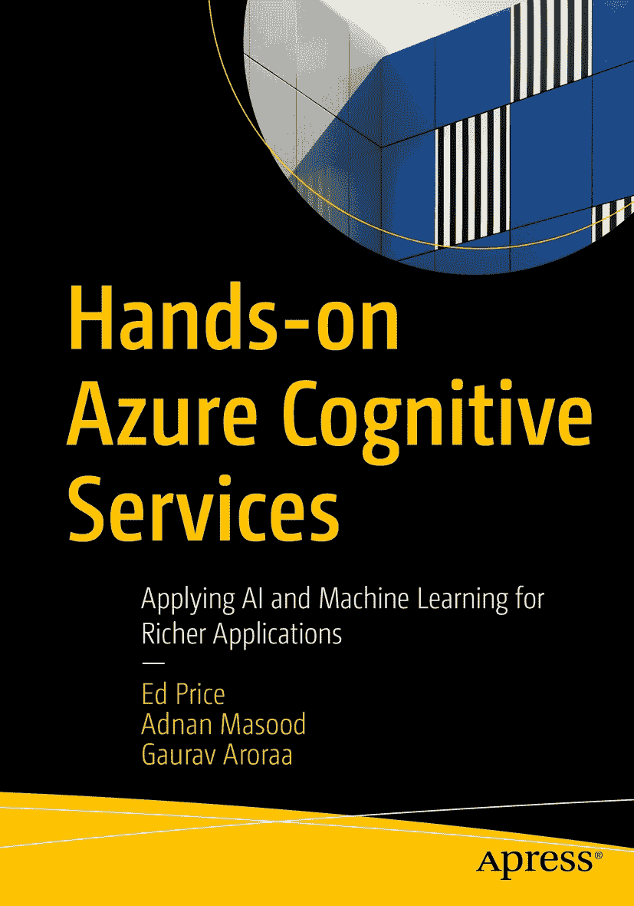

ISBN 978-1-4842-7248-0 e-ISBN 978-1-4842-7249-7 [`doi.org/10.1007/978-1-4842-7249-7`](https://doi.org/10.1007/978-1-4842-7249-7) © Ed Price, Adnan Masood, and Gaurav Aroraa 2021 本作品受版权保护。出版商保留所有权利，无论是涉及材料的全部或部分，特别是翻译、重印、重用插图、朗诵、广播、以缩微胶片或任何其他物理方式复制、传输或信息存储与检索、电子改编、计算机软件，或采用目前已知或未来开发的类似或不同方法。本出版物中使用的通用描述性名称、注册商标、商标、服务标志等，即使未作特别声明，也不意味着这些名称不受相关保护性法律和法规的约束，因此可自由使用。出版商、作者和编辑假定本书中的建议和信息在出版之日是真实准确的。出版商、作者或编辑均不对本书所含材料或可能存在的任何错误或遗漏提供明示或暗示的保证。出版商对已出版地图中的管辖权主张和机构隶属关系保持中立。

本 Apress 印记由注册公司 APress Media, LLC（Springer Nature 的一部分）出版。

注册公司地址为：1 New York Plaza, New York, NY 10004, U.S.A.

*感谢 Adnan 和 Gaurav 将他们的专业知识、热情和严谨带入本书。我将本书中属于我的部分（可能恰好是你最喜欢的部分）献给我的大女儿 Eve。我写作时正值她青春期的叛逆情绪达到顶峰，而她依然允许我拥抱她，并和我待在一起。*

*——Ed*

*嗨，妈妈和爸爸！*

**挥手致意**

*——Adnan*

*我衷心感谢 Ed 和 Adnan。没有他们，这本书将无法完成。这一年充满了惊喜，全球也经历了诸多挣扎。我将这篇文字献给这个时代所有挺身而出、帮助拯救人类免受疫情侵害的勇士们。也献给我的天使（女儿）Aarchi Arora，她的笑容总是鼓励并激励着我，让我为这个项目而活。*

*——Gaurav*

## 引言

大约在公元前 400 年，希腊神话中关于塔罗斯的故事被讲述（并配有生动的插图）。后来，它被记载于史诗《阿尔戈英雄纪》中，其同名角色是一个由赫菲斯托斯应其父宙斯之命打造的青铜巨人自动机。这个（神话中的）第一个机器人长有翅膀，在克里特岛（一个岛屿）保护着欧罗巴（一位女性），向船只投掷石块，最终在美狄亚的精灵们将其逼疯、使其拔掉自己的钉子（从而自我解体）后走向终结。在公元前 4 世纪，亚里士多德为我们带来了他的三段论逻辑，一种演绎推理系统。亚历山大的希罗应用了力学和基础机器人学，并在公元 1 世纪撰写了《自动机》一书。机器人中的人工智能在神话中继续发展，例如潘多拉（也是由赫菲斯托斯创造，你知道，就是关于那个盒子的故事）、皮格马利翁的伽拉忒亚（多亏了维纳斯，这是一尊活过来并生下了孩子的女性雕像；别问为什么），随后犹太传说为我们带来了魔像（公元 13 世纪初），它们是智能的黏土自动机，但不能说话。

大约在 1495 年，列奥纳多·达·芬奇在众多钟表匠的机械新奇发明的基础上，制造了一个自动机骑士；而在 1515 年，我们相信他继续努力，创造了一头会行走的狮子（献给法国新国王弗朗索瓦一世，据说它能打开胸膛献上百合花礼物）。1642 年，帕斯卡发明了一台机械计算器。斯威夫特的《格列佛游记》（1726 年）似乎描述了一台人工智能计算机引擎，它强行向可怜的利立浦特人灌输知识。1801 年出现了穿孔卡片；1818 年，玛丽·雪莱用她充满智慧的《弗兰肯斯坦》吓坏了我们所有人；1884 年，赫尔曼·霍勒瑞斯发明了用于进行 1890 年美国人口普查的穿孔卡片制表机，IBM 由此起步（这是简化的解释）。在 1939 年纽约世界博览会上，西屋公司展出了机械人 Elektro（他会抽烟）和他的机械狗 Sparko。

艾萨克·阿西莫夫在 1950 年撰写了关于机器人学的著作。沃尔特·迪士尼（在让他的幻想工程师们破解了欧洲发条新奇玩具之后）于 1961 年开发了一个跳舞小人；1963 年，他推出了他的提基鸟（位于提基屋中）；同年，他还为 1964-1965 年世界博览会再造了亚伯拉罕·林肯；并在 1964 年的电影《欢乐满人间》中首次将电子动画技术用于一只鸟。从那时起，随着计算机的发展，我们一直专注于在软件和机器人学中构建日益改进的人工智能（并且我们一直真诚地希望，我们智能的造物永远不会像《终结者》、《黑客帝国》甚至《机器人总动员》那样接管并毁灭我们）。

我们编写本书的初衷是将其作为 Azure 认知服务的入门介绍，同时也希望它成为你在实际应用场景中实施认知服务的指南。这意味着我们将带你全面了解认知服务所能提供的一切，正如你所想象的，这将是一段相当漫长的旅程。

Azure 认知服务被分解为探索决策、语言、语音和视觉的服务和 API。借助这些 API 和技术，你可以创建未来软件，为未来几个世纪的计算机和机器人提供动力！（或者你也可以只做一个搞笑的网站。）在本书中，我们将带你踏上一段逐步构建应用程序的旅程。请加入我们。毕竟，你现在正追随亚里士多德、希罗、赫菲斯托斯、勒夫拉比（魔像恶作剧的始作俑者）、列奥纳多（不是那只乌龟）、帕斯卡、格列佛、玛丽·雪莱、霍勒瑞斯、Elektro、阿西莫夫、迪士尼、比尔·盖茨、史蒂夫·乔布斯以及无数其他人的脚步。是时候创造一件完全属于你自己的作品了。

## 致谢

感谢我们的技术编辑 Rohit，他如此彻底、细致、详尽、谨慎、认真、勤勉、一丝不苟——我们快找不到同义词了，但说真的，你太棒了。

感谢 Shrikant 的极度耐心和定期跟进；谢谢你容忍我们。想对你玩消失几乎是不可能的；我们试过！

感谢 Smriti 对我们和这个项目的信任！

## 关于作者 关于技术审校者