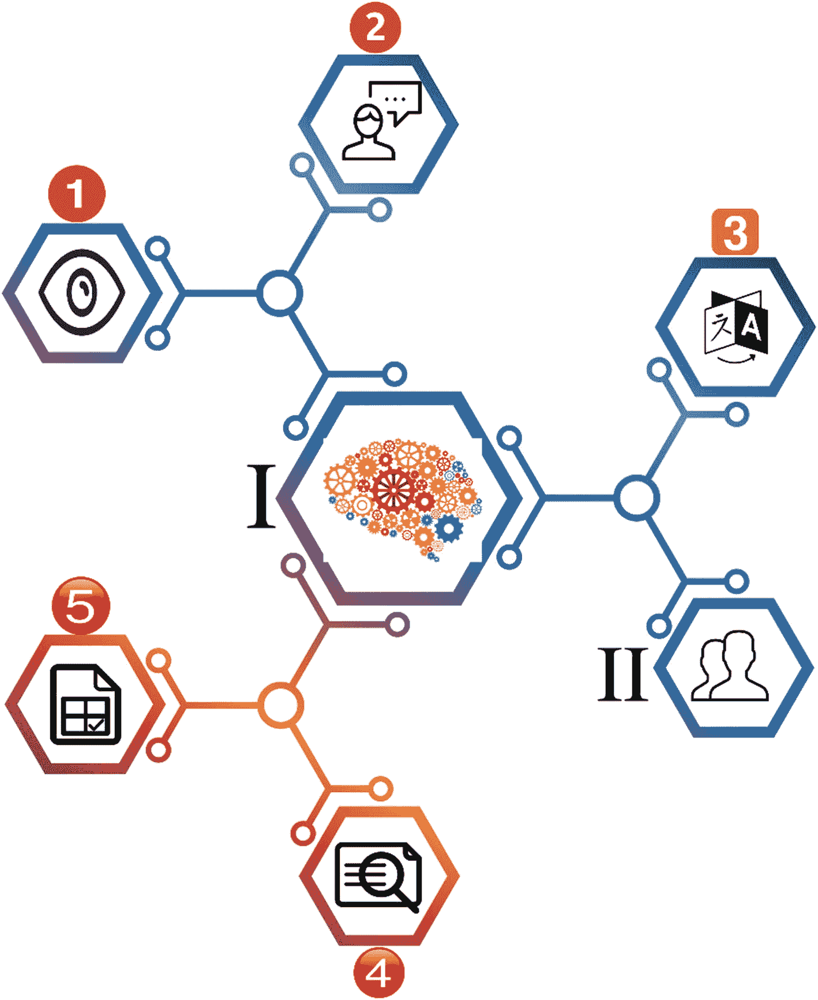
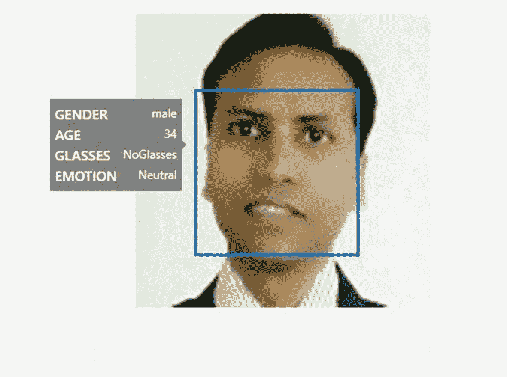
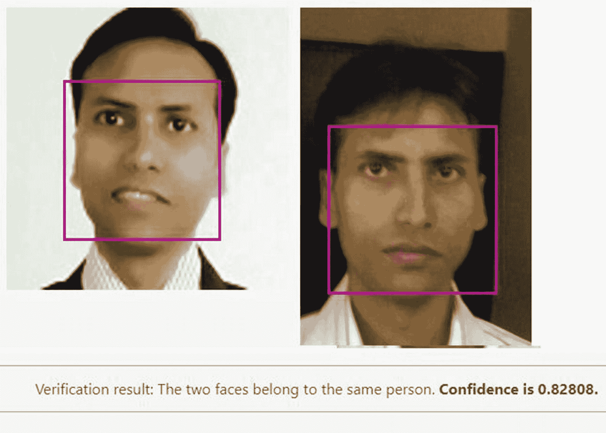

# 1. 认知服务的力量

人工智能（AI）和机器学习（ML）这两个术语正日益流行。微软 Azure 认知服务提供了使用顶尖 AI 和 ML 技术的机会。要使用这些技术，我们需要某种框架。

本章的首要目标是确立你通过 Azure 认知服务能够实现的价值、理由和影响。本章概述了其特性和功能。在接下来的章节中，你将了解 Azure 认知服务如何提供帮助，以及它如何让你更轻松地使用 AI 和 ML。

我们还将向你介绍我们的案例研究以及将在本书其余部分使用的结构。

在本章中，我们将涵盖以下主题：

*   Azure 认知服务概述

*   探索认知服务 API：视觉、语音、语言、Web 搜索和决策

*   机器学习概述

*   理解用例

*   COVID-19 SmartApp 场景

## Azure 认知服务概述

Microsoft Azure 认知服务为您提供了开发智能应用程序的能力。您可以借助 API、SDK（软件开发工具包）、服务等来构建这些智能应用程序。

`Microsoft Azure Cognitive Services` 是一组 API、SDK 和服务，可帮助开发人员创建智能应用程序（无需预先掌握 AI 或 ML 知识）。

Azure 认知服务提供了开发人员处理 AI 解决方案所需的一切，无需数据科学知识。开发人员可以创建能够对话、理解或自我学习的智能应用程序。

### 为什么选择 Azure 认知服务

Azure 认知服务由世界一流的模型部署技术提供支持，并由该领域的顶尖专家构建。它提供了多种采用即用即付模式的方案和优惠。您不再需要投资于构建和托管模型可能需要的开发和基础设施。认知服务为您提供了这一切。

以下列表展示了使用 Azure 认知服务时获得的优势：

- 您无需构建自己的自定义机器学习模型。

- 您可以为应用程序获得所需的 AI 服务。Azure 认知服务作为一种**平台即服务**（**PaaS**），可以提供这些必需的功能。

> 您可以在**平台即服务**（**PaaS**）之上进行构建，而无需担心用于支持该服务的基础设施。

- 您可以将开发时间投入到核心应用程序中，并发布更强大的产品。

**注意**

如果 Azure 认知服务不符合您的要求，则不应使用它。例如，您的数据可能有监管要求，阻止您使用 Azure 等外部服务。或者，您的组织可能长期致力于开发自己的数据科学实践和产品。

在下一节中，我们将更详细地讨论认知服务 API。

### 探索认知服务 API：视觉、语音、语言、Web 搜索和决策

在前一节中，我们讨论了认知服务及其提供的优势。在本节中，我们将探索可用于帮助开发人员的 API。

图 1-1 提供了这些 API 的图示概览。



*图 1-1 认知服务 API 图示概览*

图 1-1 展示了 Azure 认知服务 API 的以下元素：

- I – 代表所有 Azure 认知服务 API

- II – 代表使用这些 API 构建智能应用程序的开发人员

- 1 – 视觉 API

- 2 – 语音 API

- 3 – 语言 API

- 4 – Web 搜索 API

- 5 – 决策 API

视觉 API 提供对图像、手写内容和视频的见解。语音 API 分析和转换音频语音。语言 API 提供文本分析，可以使文本更易于阅读，帮助您创建智能聊天功能，并且可以翻译文本。必应 Web 搜索 API 允许您搜索并从整个互联网中提取内容，利用页面、文本、图像、视频、新闻等。最后，决策 API 帮助您的应用程序做出智能决策，以审核和个性化用户内容，并帮助您检测数据中的异常。

在接下来的章节中，我们将向您简要介绍每一组 API。

#### 视觉 API

首先，让我们探索 Azure 认知服务中的视觉 API。每当您需要处理图像或视频以理解或分析其内容时，请使用这些 API。这些 API 帮助您获取诸如面部分析（确定年龄、性别等）、情感（例如，通过面部表情）以及更多视觉内容等信息。此外，借助这些 API，您可以从图像中读取文本，并且可以轻松地从图像和/或视频生成缩略图。认知服务视觉 API 分为以下 API，详情如下。

##### 计算机视觉

`Computer Vision` API 允许开发人员分析图像及其内容。在上一节中，我们讨论了借助视觉 API，您可以理解和收集图像内容。您可以根据需求决定从图像中检索哪些内容和信息。例如，企业可能需要访问图像，以帮助确保使用其 Web 应用程序的儿童避免观看成人内容。

此 API 还可以通过光学字符识别 (OCR) 读取印刷文本和手写文本。

**注意**

在撰写本书时，`Computer Vision` API 的当前版本为 v3.0。

从开发角度来看，您可以使用 RESTful（表述性状态转移）API，也可以使用 SDK 构建应用程序。我们将在第 3 章中介绍开发说明和详细信息。

##### 自定义视觉

用于自定义视觉的认知服务 API 提供了一种通过各种自定义来定制图像的方法。您可以使用标签自定义图像，并且可以基于自定义分类器评估和改进这些图像。自定义视觉 API 使用机器学习算法并应用标签来评估和改进图像。此外，它分为两部分：

1. **图像分类** – 将标签应用于图像。

2. **对象检测** – 应用标签，并返回图像中标签所在位置的坐标。

##### 人脸

此 API 帮助您检测和分析图像中的人脸。该算法可以检测和分析数据。

此服务提供以下功能：



*图 1-2 使用人脸 API 进行人脸检测*

- **人脸检测** – 检测人脸并提供人脸在图像中位置的坐标。根据算法，您还可以获取人脸检测的各种属性，例如性别、头部姿势、情绪、年龄等。图 1-2 显示了对一个人（作者 Gaurav Aroraa）的人脸检测。



*图 1-3 人脸验证*

- **人脸验证** – 验证来自同一个人脸图像的两个相似人脸，以进行比较，从而确定它们是否属于同一个人。图 1-3 显示了同一个人的两张人脸。

- **人脸分组** – 从可用的数据库或人脸集合中对相似人脸进行分组。

**注意**

在您的开发周期中，`Face` API 及其数据必须符合隐私政策的要求。您可以在此处参考 Microsoft 关于客户数据的政策：[`https://azure.microsoft.com/en-us/support/legal/cognitive-services-compliance-and-privacy/`](https://azure.microsoft.com/en-us/support/legal/cognitive-services-compliance-and-privacy/)。

##### 表单识别器

`Form Recognizer` 以键/值对的形式提取数据，并从表单类型的文档中提取表格数据。

它由以下组件构成：

- **自定义模型** – 允许您通过提供五个表单样本来训练自己的数据。

- **预构建收据模型** – 您也可以使用预构建的收据模型。目前，仅提供来自美国的英文销售收据。

- **布局 API** – 它使 `Form Recognizer` 能够通过使用光学字符识别 (OCR) 来提取文本和表格结构数据。

##### 视频索引器

`Video Indexer` 提供了一种通过语音、人声和视觉三个渠道来分析视频内容的方法。通过这种方式，即使你没有任何视频分析专业知识，也能深入了解视频信息。它还最大限度地减少了你的工作量，因为无需编写任何额外的或自定义的代码。

`Video Indexer` 为我们提供了一种轻松分析视频的方法，它涵盖以下类别：

- 内容创作

- 内容审核

- 深度搜索

- 无障碍访问

- 推荐

- 变现

我们将在第 3 章中更全面地介绍视频分析。

#### 语音 API

`Speech APIs` 提供了一种让你的应用程序更智能的方法。因此，你的应用程序现在可以“听”和“说”。这些 API 会过滤掉噪音（你不想分析的词语和声音），识别说话者，然后执行你指定的操作。

##### 语音服务

微软推出了 `Speech` 服务来取代 `Bing Speech API` 和 `Translator Speech`。这些服务能为你的应用程序带来非凡的效果，让你的应用程序能够听到用户的声音并与用户进行语音交互。

> **注意**

> 你也可以使用框架自定义 `Speech` 服务。关于语音转文本，请参考 [`https://aka.ms/CustomSpeech`](https://aka.ms/customspeech)。关于文本转语音，请参考 [`https://aka.ms/CustomVoice`](https://aka.ms/customvoice)。

`Speech` 服务支持以下场景：

- 语音转文本

- 文本转语音

- 语音翻译

- 语音助手

借助不同的框架，你还可以自定义你的 `Speech` 体验。

##### 说话人识别（预览版）

在撰写本书时，`Speaker Recognition` 处于预览阶段。此服务使你能够识别说话者；你可以确定谁在说话。借助此服务，你的应用程序还可以验证说话者的身份是否与其声称的一致。因此，你的应用程序现在可以更容易地从一组潜在的说话者中识别出未知的说话者。

它可以分为以下两个部分：

- 说话人验证

- 说话人识别

我们将在第 5 章中详细介绍语音识别。

#### 语言 API

借助预构建的脚本，`Language APIs` 使你的应用程序能够处理自然语言。同时，它们还为你提供了学习如何识别用户意图的能力。这将为你的应用程序增加更多功能，例如文本和语言分析。

##### 沉浸式阅读器

`Immersive Reader` 是一项非常智能的服务，它构建了一个工具来帮助每一位读者，尤其是受阅读障碍影响的人群。

> **注意**

> 阅读障碍会影响大脑中处理语言的部分。有阅读障碍的人阅读困难，并且他们可能会觉得识别书面语言中的声音非常具有挑战性。

`Immersive Reader` 旨在让每个人都能更轻松地阅读。

它提供以下功能：

- 大声朗读文本内容

- 高亮显示形容词、动词、名词和副词

- 以图形方式表示常用词

- 帮助你理解翻译成自己语言的内容

##### 语言理解 (LUIS)

设想一个场景，你需要让你的应用程序足够智能，以便能够理解用户输入（例如语音、文本等）。`Speech` 服务让你的应用程序足够智能，可以听用户说话并与用户交流。但是，你的应用程序可能需要足够智能才能回答用户提出的问题，例如，“*我的健康状况如何？*” 即使实现了 `Speech APIs`，你的应用程序也无法理解这样的命令。为了实现如此复杂的需求，我们提供了 `Language Understanding (LUIS)` 服务。（`LUIS` 代表语言理解智能服务。）借助 `LUIS`，你可以构建一个与用户交互并从对话中提取相关信息的应用程序。对于像“*我的健康状况如何？*”这样的问题，你的应用程序可以评估存储的数据，然后提供用户的健康状况。或者它会问几个问题，然后根据用户的回答提供用户的健康状况。

你可以使用以下两种类型的模型：

- 预构建模型

- 自定义模型

在第 4 章中了解更多关于 `LUIS` 的信息。

##### QnA Maker

当你拥有常见问题解答（FAQ）并希望使其具有交互性时，`QnA` 非常适用。这意味着你有一组预定义的问答对。`QnA` 主要用于基于聊天的应用程序，用户输入查询，然后你的应用程序回答问题。你可以尝试使用微软的 [`www.qnamaker.ai/`](http://www.qnamaker.ai/) 来体验 `QnA Maker`。

##### 文本分析

借助 `Text Analytics` 服务，你可以构建一个分析原始文本并给出结果的应用程序。它包括以下功能：

- 情感分析

- 关键短语提取

- 语言识别

- 名称识别

##### 翻译器

`Translator` 支持文本到文本的翻译，并提供了一种将翻译功能构建到应用程序中的方法。借助 `Translator`，你可以为应用程序添加多语言功能。目前支持超过 60 种语言。如果你想翻译口语语音，则需要使用 `Speech` 服务。

#### 网页搜索 API

`Web Search APIs` 使你能够构建更智能的应用程序，并为你提供 `Bing Search` 的强大功能。它们允许你访问来自数十亿网页、图像和新闻文章（等等）的数据，以构建你的搜索结果。

##### Bing 搜索 API

`Bing Search` 通过提供执行网页搜索的能力来增强你的应用程序。可以想象，通过实现 `Bing Search APIs`，你现在拥有大量的网页可以用来构建你的搜索结果。代码实现也非常简单（参见代码清单 1-1）。

```
//示例代码
public static async void WebResults(WebSearchClient client)
{
try
{
var fetchedData = await client.Web.SearchAsync(query: "Tom Campbell's Hill Natural Park");
Console.WriteLine("正在搜索 \"Tom Campbell's Hill Natural Park\"");
// ...
}
catch (Exception ex)
{
Console.WriteLine("搜索过程中出现异常。" + ex.Message);
}
}
代码清单 1-1
实现 Bing 网页搜索的示例代码
```

##### Bing 网页搜索

使用 `Bing Web Search API`，你可以在用户输入时建议搜索词，过滤和限制搜索结果，从搜索结果中移除不需要的字符，按国家/地区本地化搜索结果，以及分析搜索数据。

##### Bing 自定义搜索

`Bing Custom Search API` 允许你自定义搜索建议、图像搜索体验和视频搜索体验。你可以共享和协作你的自定义搜索，并且可以为你的应用配置独特的用户界面来显示搜索结果。

##### Bing 图像搜索

`Bing Image Search API` 使你能够利用 Bing 的图像搜索能力。你可以建议图像搜索词，过滤和限制图像结果，裁剪和调整图像大小，显示图像的缩略图，以及展示热门图像。

##### Bing 实体搜索

`Bing Entity Search API` 为你提供实体和地点（例如餐厅、酒店或商店）的搜索结果。你可以提供实时搜索建议、实体消歧（提供多个搜索结果），并返回有关企业和其他实体的信息。

##### Bing 新闻搜索

`Bing News Search API` 让你能够搜索相关的新闻文章。你可以建议搜索词，返回新闻文章，展示当天的热门新闻文章和头条新闻，并按类别过滤新闻结果。

###### Bing 视频搜索

`Bing Video Search` API 返回高质量视频。您可以建议搜索词、筛选和限制视频查询结果、创建视频缩略图预览、展示热门视频以及访问视频洞察。

###### Bing 视觉搜索

`Bing Visual Search` API 为单个图像（无论是上传的还是通过 URL 共享的）提供指标和洞察。您可以识别相似的图像和产品、识别图像的购物来源、访问其他人基于您图像内容进行的相关搜索、查找显示该图像的网页、查找图像中菜肴的食谱，以及利用图像自动收集关于某个实体的信息（例如图像中演员的信息或图像中地点的导航路线）。

###### Bing 自动建议

`Bing Autosuggest` API 通过基于部分查询返回建议查询列表，来改善您的搜索体验。

###### Bing 拼写检查

`Bing Spell Check` API 对任何文本执行语法和拼写检查。您可以检查俚语或非正式语言、区分相似单词，并追踪新品牌、标题和流行表达。

###### Bing 本地企业搜索

`Bing Local Business Search` API 帮助您查找企业的信息。您可以找到离您最近的餐厅（例如特定连锁店或某种类型的食物）、定位并绘制特定企业和地点的地图、限制搜索的距离参数，以及按类别筛选企业结果。

#### 决策 API

`Decision APIs` 帮助您创建个性化且具有内容审核功能的丰富用户体验。它们帮助您进行高效的决策。

##### 异常检测器（预览版）

`Anomaly Detector` 在撰写本书时处于预览阶段。它帮助您检测数据中的异常，以便将其移除。使用此服务时，您无需考虑哪种模型适合您的业务。`Anomaly Detector` 服务会自动确定最适合您数据的模型。

##### 内容审查器

`Content Moderator` 帮助您识别业务不允许的内容或不适合业务的内容。它也会检查文本、图像和视频内容。例如，您可以移除亵渎和不理想的文本、识别包含亵渎内容的视频、审核成人及露骨的视频和图像内容、检查文本中是否包含个人身份信息（PII），以及检测其他冒犯性或不需要的图像。

##### 个性化器

`Personalizer` 帮助您为每个用户提供个性化的体验。它帮助您向不同用户展示不同且个性化的内容。这些内容可以是文本、图像、URL 或电子邮件。

### 机器学习概述

关于机器学习的定义有很多。根据所有可用的定义，我们可以得出以下结论。

机器学习是人工智能的一个子集，它为您提供了一种研究计算机算法的方法。在此过程中，计算机程序在学习了数据之后，可以预测未来事件。

我们的学习过程简单且持续。这个过程随时随地都在发生，比如在您走路、煮咖啡或购物时。每个学习都有其自身的范围和边界。例如，当您走路时，您的智能手表（一个装有程序的机器）会收集您的数据（如步数、里程、心率和血压）。再比如，当您去百货商店购物时，技术系统（如会员卡和支持软件）会根据您过去购买的商品来了解您的购买行为。

有了这些信息，机器就可以预测未来。例如，学习购买行为的机器可以预测客户会订购哪些商品。再比如，它可以帮助店主了解客户对特定商品的消费量。

> **注意**

总之，机器学习是一项帮助我们理解未来行为的研究。我们通过从各个方面研究数据来实现这一点，例如分析文本的情感倾向或分析图像以识别物体或人脸。

机器学习过程包含几个阶段。这些阶段是迭代的，并且需要根据需求和/或训练进行重复。以下是最常见的阶段：

*   **数据收集阶段** – 在此阶段，数据被准备或收集。您根据训练需求或训练所需的组件来确定要收集哪些数据。

*   **测试和开发训练模型** – 这是测试学习并开发训练模型的阶段。例如，要为百货商店构建一个新的训练模型，我们需要分析杂货商品。您将使用算法来收集和访问数据。

*   **部署和管理训练好的模型** – 这是您可以看到实际输出的阶段。您也可以将此阶段称为“机器学习在行动”。

微软通过多种计划使开发人员能够轻松做到这一点。您可以遵循上述阶段，并使用可用的微软技术来管理您的机器学习模型。

以下可用的各种微软技术可用于处理机器学习：

*   **基于云** – Microsoft Azure 提供了大量选项，您可以使用云服务来处理机器学习。

    *   `Cognitive Services` API（例如视觉、语音、语言和 Web 搜索）提供了复杂的预训练机器学习模型。

*   **本地部署** – 与基于云的选项类似，您有本地部署选项，其中本地（本地）服务器也可以在虚拟机中运行。最常用的服务如下：

    *   `SQL Server Machine Learning Services` 允许您将 Python 和 R 脚本与关系数据一起运行，用于预测分析和机器学习。

*   `Microsoft Machine Learning Server` 在 SQL Server 和 Teradata 中运行数据库内分析。

*   **工具**

    *   `Azure Data Science Virtual Machines`（DSVM）已预安装、配置并测试了各种机器学习和人工智能工具，以优化对机器学习和人工智能工作负载的支持。

*   `Azure Databricks` 基于 Apache Spark，可扩展分析，并从数据和人工智能解决方案中解锁洞察。

*   `ML.NET` 是一个开源且跨平台的机器学习框架，支持 Windows、Linux 和 macOS。它是为 .NET 开发人员构建的，可与 TensorFlow、ONNX 和 Infer.NET 等机器学习库无缝协作。

*   `Windows ML` 内置于 Windows 10 和 Windows Server 2019 中。它是一个 API，可在为此优化的 Windows 设备上部署机器学习。

*   `MMLSpark` 是一套开源工具，提供与 Azure Spark 等的无缝集成。

*   其他框架包括 PyTorch、Keras、ONNX 和 TensorFlow。

*   **Azure Machine Learning** – 这是一项基于 Azure 云的服务。它提供了一种训练、部署和管理机器学习模型的方法。（要开始使用 Azure Machine Learning，请访问 [`https://ml.azure.com`](https://ml.azure.com)。）其主要优点是它是完全开源的，因此您可以利用以下技术：

    *   `Azure Notebooks` 是一项免费服务，适用于使用笔记本并携带代码和应用程序的 R 开发人员。

*   `Jupyter Notebooks` 是一个开源项目，供开发人员积极成长和学习。

*   `Azure Machine Learning` 可以回答您关于 Visual Studio Code 的扩展问题。

> *您可以在* [`https://aka.ms/AMLFree`](https://aka.ms/AMLFree) *注册，获得 12 个月的免费 Azure Machine Learning 服务。*

### 理解应用场景

机器学习（`ML`）正日益普及。越来越多的人将其应用于业务需求中。以下行业广泛使用`ML`来预测业务需求，同时也普遍运用人工智能（`AI`）：

- **金融与银行业** – `ML`被用于理解未来借款人的需求以做出信贷决策、个性化贷款方案，以及确定贷款资格。此外，信用评分也由`AI`驱动。风险管理完全依赖`AI`，以管理海量的结构化和非结构化数据（通过分析问题、失败与成功的历史记录）。银行和租赁公司在使用基于云的`AI`服务进行风险评估时，相比以往的数据科学流程，能立即发现显著改进。`AI`和`ML`还用于欺诈预防、交易、个性化银行服务、流程自动化、数字助手以及账户交易安全。

- **欺诈检测** – 尽管身份盗窃案件数量逐年增长，但`AI`和`ML`正被应用于无数数据点，以分析和比较消费者的历史记录与数据，从而识别并阻止欺诈交易。随着这一趋势的持续，金融欺诈被更频繁、更早地发现，远超以往。

- **医疗保健** – `AI`被用于机器人手术、虚拟护理助手，以及工作流程和行政活动的自动化。`AI`和`ML`还用于做出临床判断并辅助诊断患者。这包括通过检查医疗记录、生活习惯和遗传信息，检测皮肤癌、乳腺癌，以及实现癌症的早期检测与预测。`AI`还被用于仅凭通话中的语音音调和背景噪音来识别心脏骤停。`AI`也用于图像分析（如`CT`扫描），从而提高了对各种病症准确检测和诊断的可靠性，并且已经有助于减少医院等待时间。

- **零售、电子商务与广告** – 在零售行业，`ML`被用于供应链规划、需求预测、客户洞察、营销活动与广告、门店运营、定价以及产品促销。商店使用会员卡来追踪谁购买了哪些商品。它们根据过去所有年份中每一天的数据，结合近期和年度趋势与变化，预测日历年中每一天的销售额。这些数据还用于合理配置员工，根据需求规划排班和休假时间，精确到一天中的具体时段。从一开始，在线零售商和网站也利用这些数据，根据你的在线购买记录、搜索内容、访问的网站以及浏览的内容向你推送广告。

- **教育** – `AI`如今被用于创建独特的个性化学习系统。这种智能教学设计能为学生提供与其当前水平相匹配的挑战，并在他们准备好时立即将其提升到下一阶段。`AI`使学生能够普遍接入全球学校，包括为学生翻译语言以理解外国教师。`AI`还帮助为有视觉或听觉障碍的学生创造学习机会。此外，`AI`和`ML`有助于自动化学校和教室的行政任务，并帮助在课外为学生提供辅导和支持。

### COVID-19 智能应用场景

在规划本书时，我们正面临新型冠状病毒肺炎（`COVID-19`）疫情：[`www.who.int/emergencies/diseases/novel-coronavirus-2019`](http://www.who.int/emergencies/diseases/novel-coronavirus-2019)。我们决定以涵盖真实世界用例的方式来设计示例。

`COVID-19 智能应用`涵盖以下场景：

- 数据收集

- 数据分析

- 视觉分析

我们将在本书中反复提及`COVID-19 智能应用`，提供示例和解释，以便为你提供一个端到端智能应用的范例。

## 总结

本章旨在阐述通过 Microsoft Azure 认知服务所能实现的价值、理由和影响。讨论从 Azure 认知服务概述以及为何使用认知服务开始。随后，我们概述了认知服务提供的各种 API。这些 API 最大限度地减少了我们在机器学习和人工智能方面的工作量。本章还介绍了机器学习以及微软提供的各种产品，包括 Azure 机器学习。

在此过程中，本章阐述了与`AI`和`ML`相关的各种应用场景。最后，我们简要介绍了`COVID-19 智能应用`。

在下一章中，我们将继续讨论 Azure 认知服务。我们将探讨如何通过 Microsoft Azure 门户开始使用 Azure 认知服务。