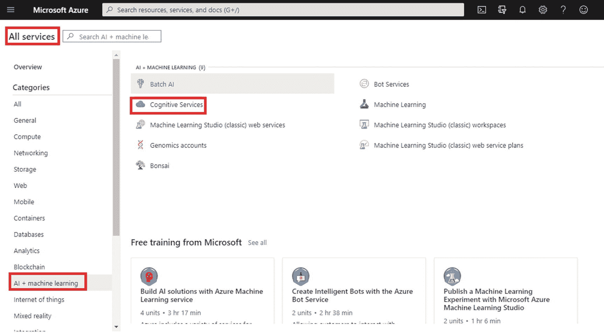
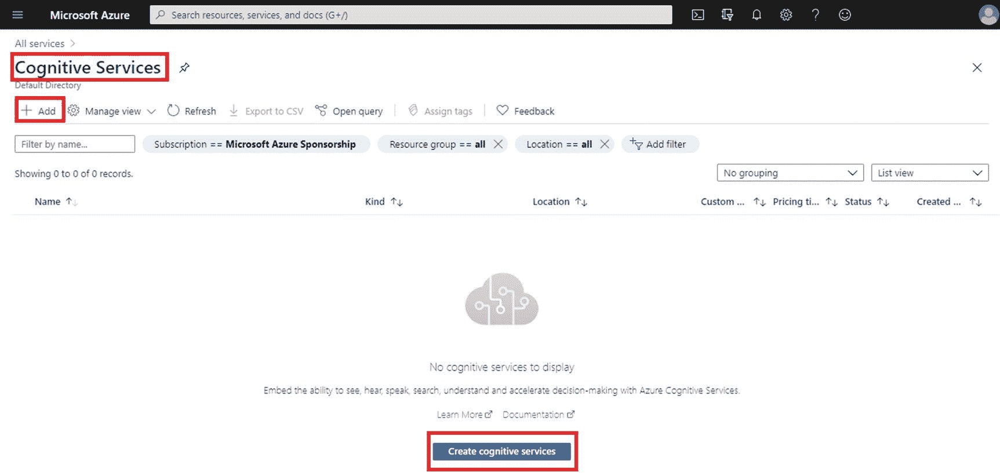
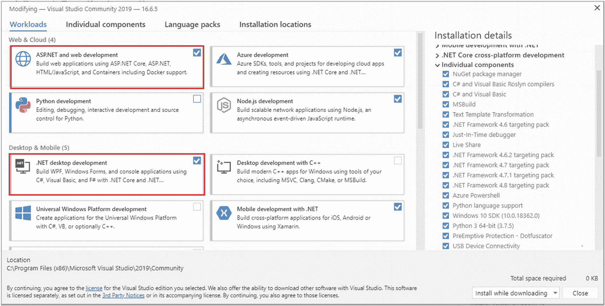
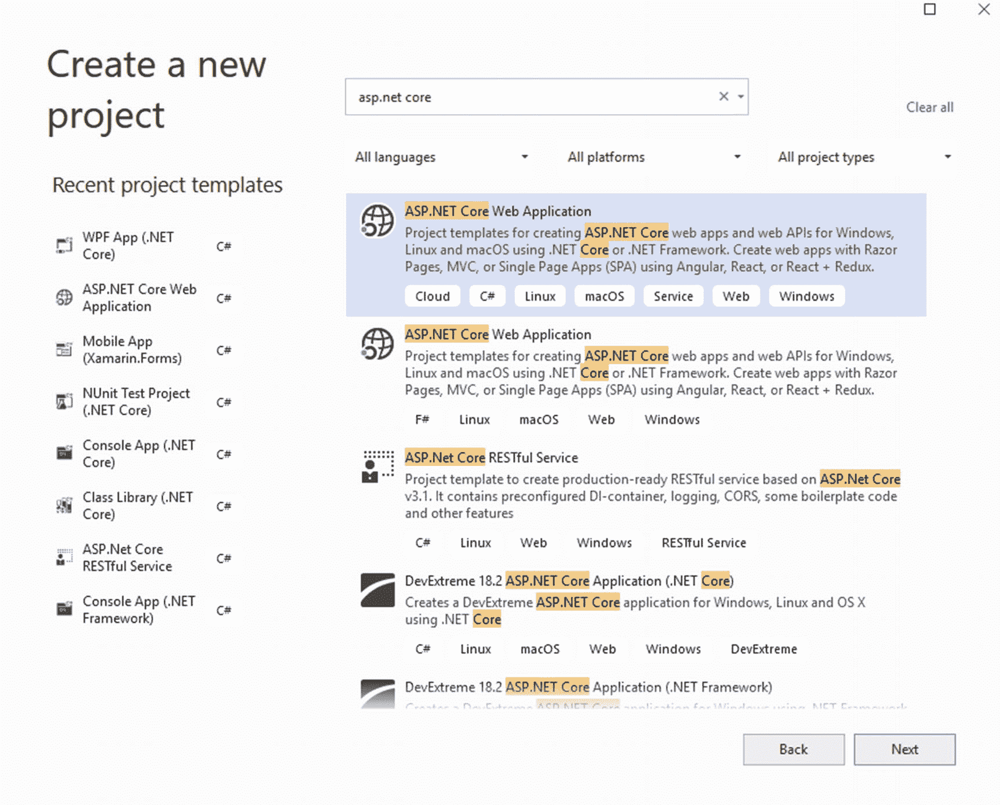
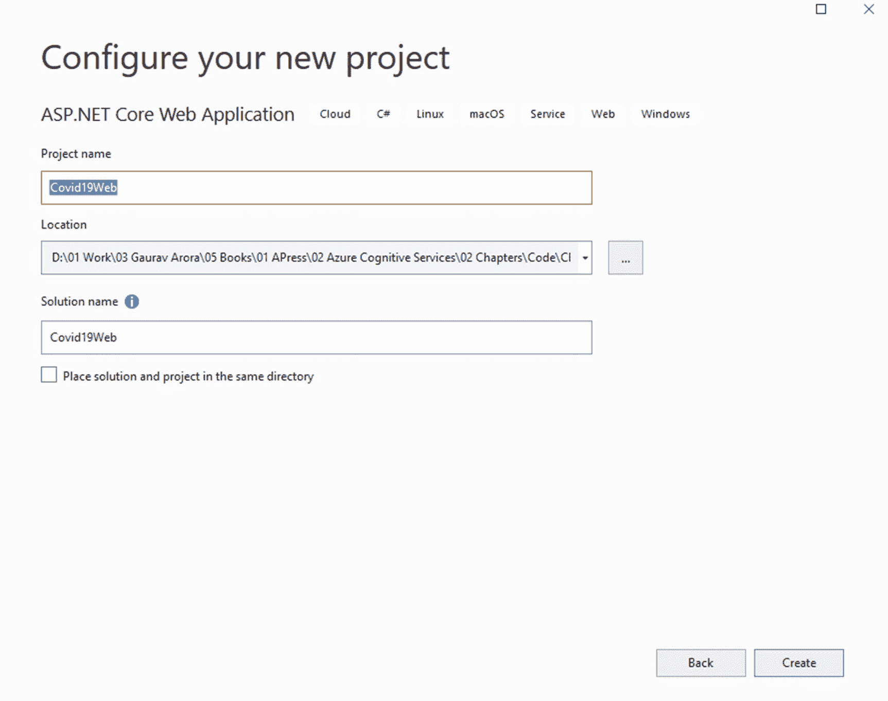
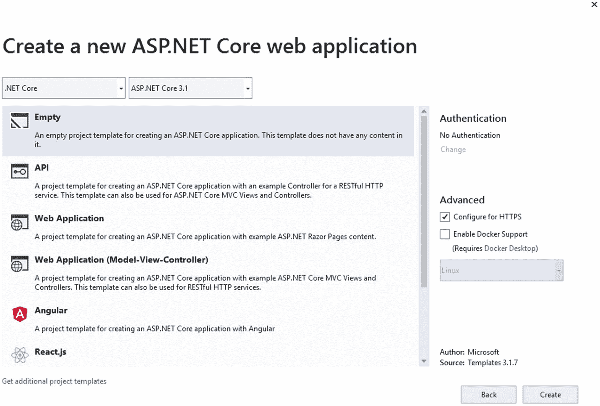
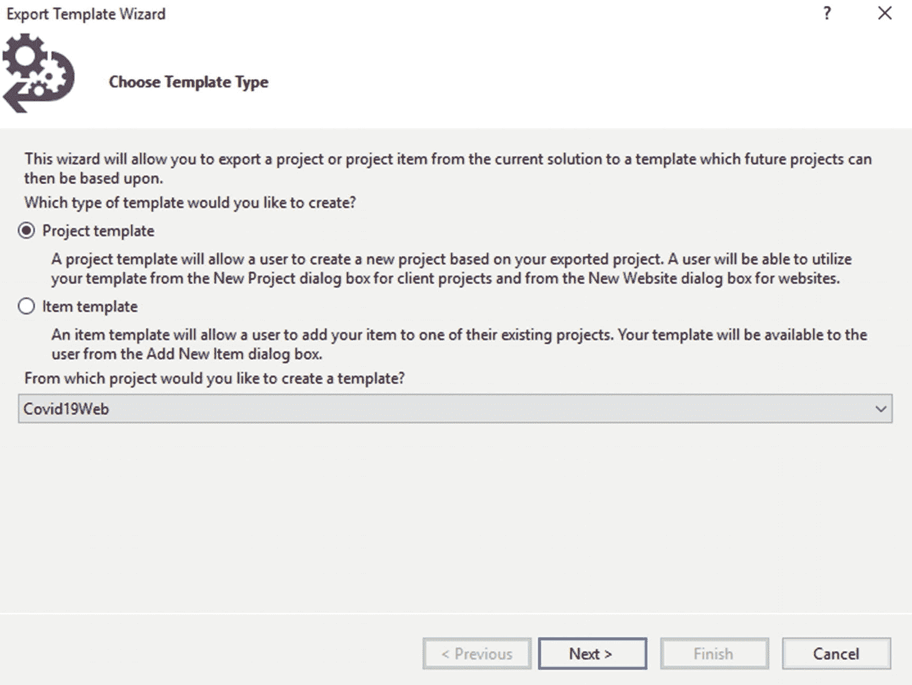
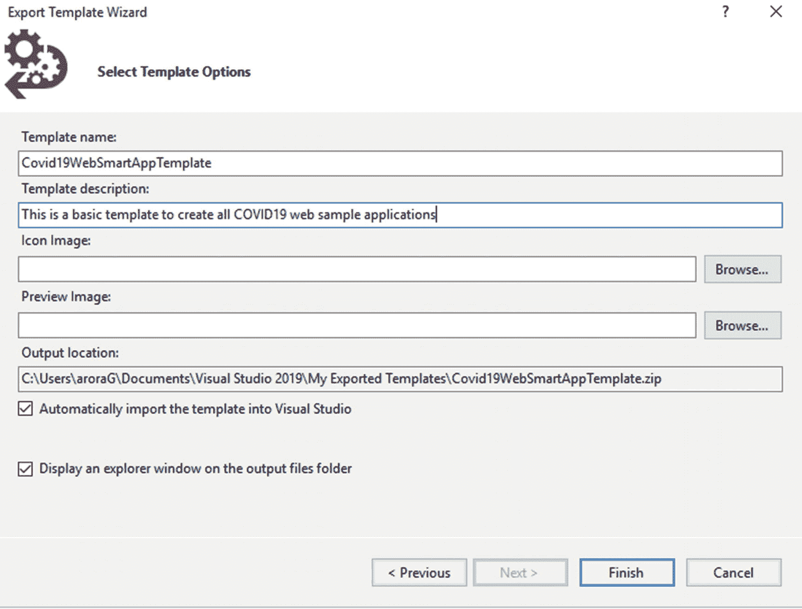
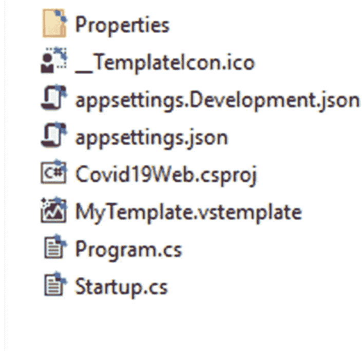

# 2. 认知服务的 Azure 门户

本章将探讨如何开始在 Azure 门户上使用认知服务，并包含对常见功能的探索。接下来，本章将带你深入了解 Azure 市场中机器人服务、认知服务和机器学习的内容。

在本章中，我们将涵盖以下主题：

- 开始使用 Azure 门户和 Azure 认知服务
- Azure 市场 – `AI` + 机器学习概述
- 理解软件开发工具包（`SDK`） – 开始使用你喜爱的编程语言
- 设置你的 Visual Studio 模板

## Azure 门户与 Azure 认知服务入门

Microsoft Azure 认知服务提供了开发智能应用程序的功能。你可以借助 `API`、`SDK`、服务等来构建这些智能应用程序。

Microsoft Azure 认知服务是一组 `API`、`SDK` 和服务，可帮助开发者在无需预先掌握 AI 或 ML 知识的情况下创建智能应用程序。

Azure 认知服务为开发者（即使不具备数据科学知识）提供了开发智能应用程序所需的一切。例如，借助认知服务，开发者可以创建能够对话、理解或自我训练的智能应用程序。

在本节中，我们将逐步了解 Azure 门户，并探索 Azure 认知服务的各种选项。

本节是对 Azure 门户的逐步介绍。如果你已经熟悉 Azure 门户，可以跳过本节。

要开始使用 Azure 门户，你需要一个有效的 Azure 帐户。如果你没有有效的 Azure 帐户，请按照以下步骤注册一个免费 Azure 帐户：

*   访问 [`https://signup.azure.com`](https://signup.azure.com)。
*   要注册免费帐户，你必须拥有有效的电话号码、有效的信用卡以及 GitHub 帐户或 Microsoft 帐户 ID（以前称为 Windows Live ID）。
*   按照屏幕上的说明操作。

完成注册后，你的免费帐户将包含以下权益：

*   12 个月的免费服务
*   使用免费帐户，你可以借助以下免费服务构建智能应用程序：
    *   计算机视觉
    *   个性化体验创建服务
    *   翻译器
    *   异常检测器
    *   表单识别器
    *   人脸服务
    *   语言理解
    *   QnA Maker

要查看免费产品和服务的完整列表，请参考此链接：[`https://azure.microsoft.com/en-us/free/`](https://azure.microsoft.com/en-us/free/)。

完成注册后，登录 Azure 门户（[`https://portal.azure.com`](https://portal.azure.com)）。登录后，你将进入 Azure 门户主页，其外观应如图 2-1 所示。


**图 2-1** Azure 门户

你可以看到根据订阅可用的各种服务。这是探索 Azure 产品和服务的起点。

对 Azure 门户的完整介绍超出了本书的范围。如果你想详细了解如何在 Azure 门户中工作，请参考由 Apress 出版的《*Cloud Debugging and Profiling in Microsoft Azure*》一书。

### Azure 认知服务入门

让我们来探索 Microsoft Azure 认知服务。请注意，我们将在后续章节中通过代码示例逐一介绍每项服务。要开始使用认知服务，请在 Azure 门户的搜索文本框中搜索“Cognitive Services”，或单击**所有服务** ➤ **AI + 机器学习** ➤ **认知服务**（见图 2-2）。



**图 2-2** 认知服务

接下来，你将看到认知服务屏幕。在此屏幕上，你可以管理现有服务或添加/创建新服务。这是你需要开始探索 Azure 市场的起点。

在下一节中，我们将讨论 Azure 市场中的认知服务。

### Azure 市场：AI + 机器学习概述

Azure 认知服务由世界一流的模型部署技术支持，这些技术由该领域的顶尖专家构建。借助即用即付模式，你可以从许多不同的计划和优惠中进行选择。你可以找到更快、更简单且通常更便宜的解决方案，而无需投资于你可能需要的开发和基础设施（如果你选择为此类常见用例开发和托管自己的模型）。

Azure 市场是一个获取所有服务的一站式商店。一旦你单击**添加**或**创建认知服务**，你将被引导至 Azure 市场（见图 2-3）。



**图 2-3** 添加或创建认知服务

Azure 市场提供多种类别的产品，包括以下示例：

*   **机器人服务** – 包含用于创建、测试、部署和管理智能机器人的工具。
*   **认知服务** – 我们在第 1 章中概述了这些服务。
*   **ML 服务** – Azure 机器学习可为你构建智能模型和可重复的工作流，以便部署和管理。
*   **自动化 ML** – 使用 AutoML，你可以通过指定目标指标来训练和调整模型。
*   **业务或机器人流程自动化** – 允许你创建虚拟劳动力，以帮助推动业务发展。
*   **数据标注** – 在团队中创建、管理和监控标注项目。
*   **数据准备** – 确保数据使用正确的编码和一致的架构，例如。
*   **知识挖掘** – 快速探索和学习大量数据，以发现重要的见解、关系和模式。
*   **ML 操作** – MLOps 将 DevOps 应用于机器学习，包括构建持续集成、交付、部署和质量保证。
*   以及更多

### 了解软件开发工具包 (SDK)：开始使用你喜爱的编程语言

你会发现从头开始编写每一段代码既复杂又耗时。我们可以借助软件开发工具包（`SDK`）来最大程度地减少工作量和时间。你可以使用各种可用的 `SDK` 来开发认知服务应用程序。目前 `SDK` 支持以下主要语言（截至本书编写时）：

*   C#
*   Go（通常称为 Golang 或 Go 语言）
*   Java
*   JavaScript
*   Python
*   R

本书中的所有示例都将使用 C#。

### 设置 Visual Studio 模板

至此，您已对 Azure 门户和 Azure 市场中提供的各项服务有了基本了解。现在，是时候开始构建一个小型应用了。在本节中，您将首先使用 Visual Studio 设置环境，并且本书后续内容都将遵循此方法。

我们创建此模板的目的是，在后续章节中创建更多小型应用来描述主题时，无需重复创建同一个应用。

> 我们使用 Visual Studio 2019 Community Edition 来构建示例。

在开始设置模板之前，请确保您的 Visual Studio 2019 环境中已安装 **ASP.NET 和 Web 开发** 以及 **.NET 桌面开发** 工作负载（见图 2-4）。



图 2-4 – 工作负载选择 – .NET 桌面开发

让我们创建一个 Visual Studio 模板：



图 2-5 – 创建新项目

1.  打开 Visual Studio。
2.  依次点击 **文件**、**项目**、**新建项目**，然后搜索并选择 **ASP.NET Core Web 应用程序**（见图 2-5）。点击 **下一步**。



图 2-6 – 配置新项目

1.  输入您的项目名称、位置等信息。这些值不会与我们的模板相同，因此无需担心（见图 2-6）。



图 2-7 – 选择空模板

1.  选择 **空** 项目（在左侧窗格中）。确保从页面顶部的下拉列表中选择了 **.NET Core** 和 **ASP.NET Core 3.1**（见图 2-7）。点击 **创建**（在右下角）。



图 2-8 – 选择模板类型

1.  我们保持简单。对于此模板，我们不会添加任何额外内容。点击 **项目**，然后点击 **导出模板**。在“选择模板类型”屏幕（位于“导出模板向导”中）上，选择 **项目模板** 选项，然后点击 **下一步**（见图 2-8）。



图 2-9 – 选择模板选项

1.  在“导出模板向导”的下一个屏幕上，提供 **模板名称** 和 **模板描述**。您还可以提供 **图标图像**。确保两个复选框保持选中状态，然后点击 **完成**（见图 2-9）。

导出的模板应生成到“Visual Studio 2019”文件夹中的“我的已导出模板”文件夹中。

> 我们还使用 WPF 创建了一个桌面应用程序模板。此模板（`Covid19WpfApp.zip`）位于 GitHub 仓库 [`https://github.com/Apress/hands-on-azure-cognitive-services/blob/main/Chapter%2002/Templates/Covid19WpfApp.zip`](https://www.github.com/Apress/hands-on-azure-cognitive-services/blob/main/Chapter%252002/Templates/Covid19WpfApp.zip)。

现在，模板的准备工作已完成。这是一个空白的 Asp.Net Core 3.1 模板，我们将在后续的代码示例中使用它。您还可以解压模板 zip 文件，并在任何文本编辑器中打开 `MyTemplate.vstemplate` 文件。（我们在 Notepad++ 中打开了它。）该 zip 文件包含以下文件，如图 2-10 所示。



图 2-10 – 模板文件

`MyTemplate.vstemplate` 文件包含以下代码（见代码清单 2-1）。

```
Covid19 Web Smart App Template
This is a basic template to create all COVID19 web sample applications
CSharp

C#
Web
Covid19

true
Covid19WebSmartAppTemplate
true
Enabled
true
true
__TemplateIcon.ico

...
```

代码清单 2-1 – `MyTemplate` 配置

请确保更新导出的模板文件中的以下可选标签（来自代码清单 2-1）：

*   `LanguageTag`
*   `ProjectTypeTag(s)`

您可以看到这是一个简单的 XML 文件，定义了模板的各种属性。主要属性如下所列。这些属性帮助 Visual Studio 在“添加新项目”对话框中对项目模板进行分组：

*   **模板数据** – 用于定义模板名称及其描述。此名称和描述会显示在“添加新项目”对话框窗口中。
*   **ProjectType** – 包含项目类型的值，例如 `CSharp`。
*   **LanguageTag** – 这是一个重要属性，它告诉 Visual Studio 该模板适用于特定语言。例如，我们的模板适用于 C#。
*   **ProjectTypeTag** – 包含项目类型的值，例如 Web、Desktop 等。我们的模板具有以下 `ProjectType` 标签：Web 和 Covid19。

在本节中，我们创建了一个 Visual Studio 模板。此模板将对我们有所帮助，因为我们将在后续章节中创建代码示例。

## 总结

本章的目的是探索 Azure 门户并开始使用认知服务。在本章中，我们讨论了 Azure 市场。我们了解了各种可用的 SDK。最后，我们创建了一个 Visual Studio 模板，以便开始使用认知服务构建应用。

在下一章中，我们将继续讨论 Azure 认知服务。我们将讨论如何开始使用 Azure 认知服务，并进一步探索 Microsoft Azure 门户。