# 3. 视觉 – 识别和分析图像与视频

图像和视频的识别是构建智能应用所需的核心功能之一。Azure 认知服务为我们提供了视觉 API，用于处理图像和视频。

本章的目标是开始使用视觉 API，并创建一个帮助您处理图像和视频的智能应用。

本章将涵盖以下主题：

*   使用计算机视觉理解视觉 API
*   分析图像
*   识别人脸
*   理解用于视频分析的视觉 API 的工作行为
*   视觉 API 总结

在接下来的章节中，我们将讨论、理解并使用计算机视觉 API。


## 理解计算机视觉中的视觉 API

**计算机视觉**是一组属于人工智能（AI）范畴的 API。它帮助你训练计算机（机器）。训练机器的过程就是教会计算机如何理解视觉世界。从数字图像中捕获文本数据（以及从视频中捕获图形数据）是计算机视觉领域最强大的发明之一。

**人工智能（AI）** 指的是机器如何像人类一样思考的技术。这项技术涉及编程、算法和训练，通过指令或训练让机器像人类一样思考和行动。AI 一词诞生于 1956 年，当时科学家们探索了诸如问题解决等主题。随后在 1960 年，当美国国防高级研究计划局（DARPA）对训练计算机并模仿人类基本推理的工作产生兴趣时，AI 开始流行起来。这项研究非常成功，以至于在 2003 年，DARPA 推出了智能个人助理。

深度学习是机器学习的一种类型，它有助于训练计算机/机器，使这些机器能够像人类一样执行任务。这些任务可以是语音识别、图像识别、对象规格说明，或者机器可以做出可能的决策和预测。

简而言之，计算机视觉属于人工智能（AI）范畴。借助训练（称为深度学习），训练好的机器可以轻松识别物体。训练模型还能帮助这些机器对识别出的物体进行分类。请注意，识别和指定物体的准确性取决于机器的训练程度。

光学字符识别（OCR）是一种技术，它可以帮助你从视觉文本文档（如扫描的纸张、图像、PDF 文件或任何其他包含可提取文本或视觉内容的文件格式）中创建可编辑或可搜索的数据。

计算机视觉并非新鲜事物。它已经存在了六十多年。它在 20 世纪 70 年代变得更加流行，当时**雷蒙德·库兹韦尔**（被称为雷·库兹韦尔）将第一个光学字符识别工具商业化，并将其命名为“**全字体 OCR**”。该工具能够处理几乎任何字体的印刷文本。在 2000 年，OCR 作为一项基于云的服务发布。

现在，我们可以说计算机视觉已经成熟（但请记住，它仍在不断成长和自我学习）。它是给技术专家和科学家最好的礼物之一，让他们能够利用先进的能力来分析和识别数据。计算机视觉的内部工作原理相当简单，可以概括为以下步骤：

1. **收集图像** – 如今，我们拥有大量的存储空间，从 100 GB 到 1 TB 甚至更多，并且我们有技术来捕获数字图像。因此，今天捕获和收集数字图像、照片和 3D 物体变得非常容易。
2. **图像处理** – 训练模型的第一步是我们需要数据。这些数据仅仅是相关图像的集合。现在，我们拥有计算能力更强的技术。我们可以处理数千张预先识别好的图像。
3. **图像理解** – 这是计算机视觉识别或分类物体的步骤。

上述步骤被称为基本步骤，它们仅描述了计算机视觉的基本功能。这些步骤可以根据所做的决策进一步细分。计算机视觉也可以分为以下步骤：

- 图像分割，即将一张大图像分成多个区域、子区域或片段，以便可以分别检查每个部分。
- 使用 X 和 Y 坐标检测，或识别单张图像中的物体。借助 X 和 Y 坐标，它创建一个边界框，然后很容易识别框内的所有内容。
- 考虑面部识别，这是一种高级智能类型，用于检测物体。它非常先进，不仅能识别出图像中的人脸，还能识别出特定的个体（这是谁的脸）。
- 模式检测是另一项高级功能，它可以识别图像中重复的形状和颜色。

### Microsoft Azure 认知服务

计算机视觉 API 是一组基于云的服务，提供高级算法，帮助开发者分析和处理图像，以检索信息。简而言之，计算机视觉 API 提供对图像、手写内容和视频的洞察。

现在，OCR 支持 API v3.2，适用于 73 种不同的语言。你可以在 [`https://docs.microsoft.com/en-us/azure/cognitive-services/computer-vision/language-support#optical-character-recognition-ocr`](https://docs.microsoft.com/en-us/azure/cognitive-services/computer-vision/language-support%2523optical-character-recognition-ocr) 找到这些语言信息。

要开始使用 Azure 门户，你需要一个有效的 Azure 帐户。如果你没有有效的 Azure 帐户，请按照以下步骤注册一个免费的 Azure 帐户：

- 访问 [`https://signup.azure.com`](https://signup.azure.com)。
- 要注册免费帐户，你需要提供有效的电话号码、有效的信用卡以及 GitHub 帐户或 Microsoft 帐户 ID（以前称为 Windows Live ID）。
- 按照屏幕上的说明操作。

注册后，你的帐户将包含 12 个月的免费服务。

然后，你可以登录 Azure，网址为 [`https://portal.azure.com`](https://portal.azure.com)。登录后，你将进入门户主页，当前外观如图 3-1 所示。

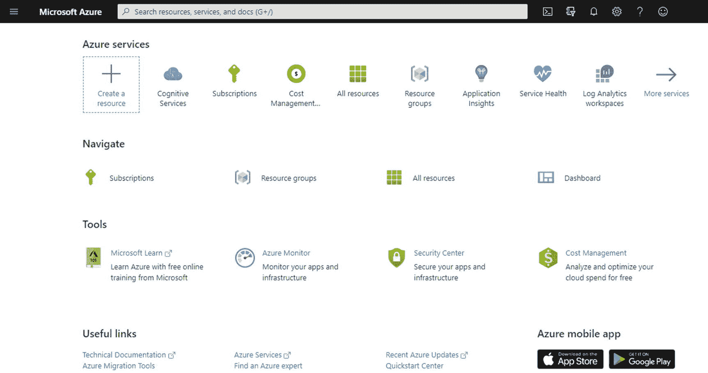

图 3-1

Azure 门户

对 Azure 门户的完整介绍超出了本书的范围。如果你想了解导航和使用 Azure 门户的详细信息，请参考 Apress 出版的《***Microsoft Azure 中的云调试和性能分析***》一书。

### 分析图像

在上一节中，我们讨论了计算机视觉 API 如何提供识别和分析物体的方法。计算机视觉通过借助各种算法从图像中提取数据来实现这一点。计算机视觉通过提供数百个对象和参数，使开发者的工作更加轻松。在本节中，我们将进一步了解这些 API，并通过一个代码示例将其提升到新的水平。

首先，进入 Azure 门户，在搜索文本框中搜索“Cognitive Services”。或者，你可以点击**所有服务**、**AI + 机器学习**（在左侧窗格中），然后在右侧窗格中点击**认知服务**。参见图 3-2。

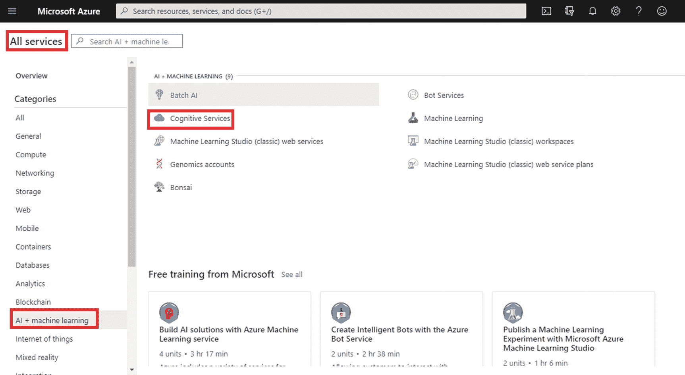

图 3-2

搜索认知服务

接下来，你将看到认知服务屏幕。在此屏幕上，你可以管理现有服务或添加/创建新服务。这是图像分析之旅的起点。

计算机视觉认知服务使用一个预训练的模型，帮助开发者分析图像。


#### 开始探索计算机视觉

要使用计算机视觉服务，首先需要从 Azure 门户创建一个资源。在屏幕顶部的搜索框中搜索“Computer Vision”。在搜索结果中，点击*市场*下的**计算机视觉**，如图 3-3 所示。

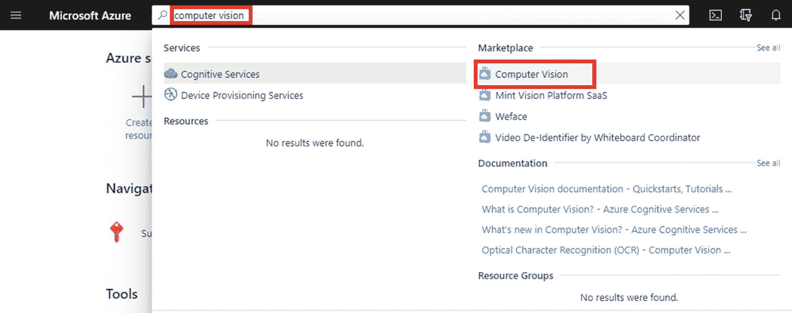

图 3-3 计算机视觉

在“创建计算机视觉”页面，你需要提供详细信息，例如 Azure 订阅、资源组、区域、实例名称和定价层。参见图 3-4。

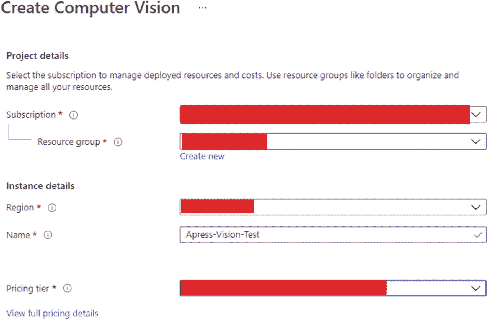

图 3-4 设置计算机视觉

按照屏幕上的说明完成创建计算机视觉实例的过程。这需要一些时间。部署完成后，点击**转到资源**，如图 3-5 所示。

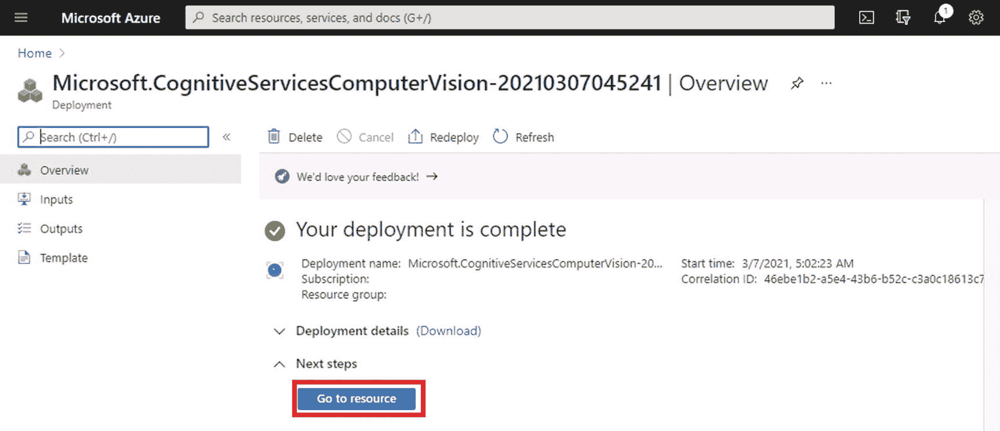

图 3-5 部署完成

在获取密钥和终结点之前，你将无法进行 API 调用，以便应用程序能够通过身份验证。

出于演示目的，我们选择了免费层定价模型。对于生产级应用程序，你需要评估各种定价模型以满足你的特定需求。有关定价层的更多信息，请参见 [`https://azure.microsoft.com/en-us/pricing/details/cognitive-services/computer-vision/`](https://azure.microsoft.com/en-us/pricing/details/cognitive-services/computer-vision/)。

要获取密钥和终结点，请点击左侧导航菜单中“资源管理”部分下的**密钥和终结点**。参见图 3-6。

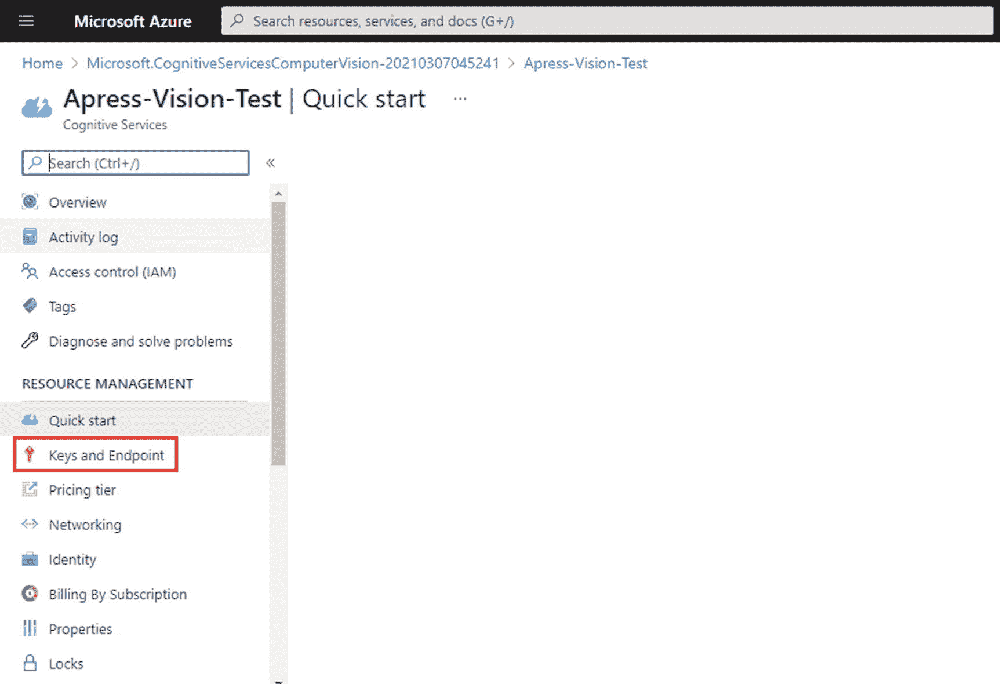

图 3-6 快速入门页面

在“密钥和终结点”页面，记下你的密钥 1、密钥 2 和终结点 ID，以便使用计算机视觉资源。参见图 3-7。在此页面，你还可以重新生成密钥。

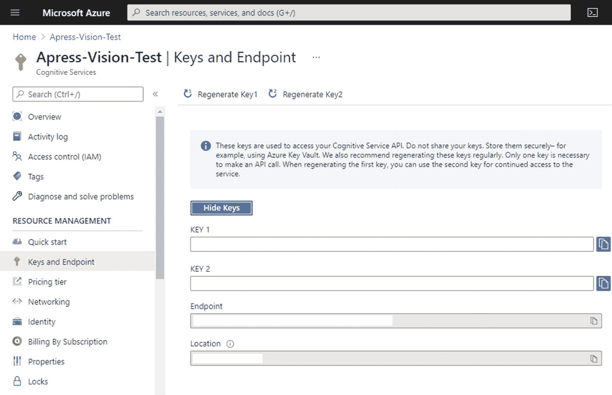

图 3-7 密钥和终结点页面

#### 使用 API

到目前为止，我们已经创建了一个计算机视觉资源并设置了带有密钥的终结点。现在，是时候使用 API 了。Azure 门户为我们提供了多种测试 API 的方法，如下所示：

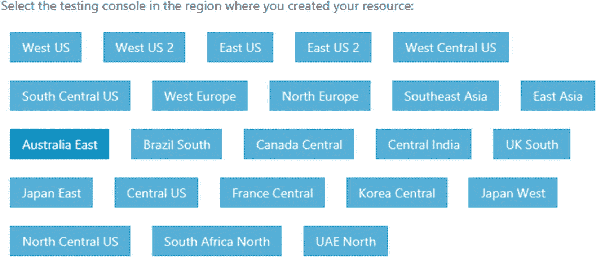

图 3-8 选择 API 控制台区域

1.  **API 控制台** – 这种测试 API 的方法所需工作量最小。使用 API 控制台，开发者可以通过终结点向 API 传递值并检索结果。在 API 控制台中，通过点击特定区域来选择 API。参见图 3-8。

选择**分析图像**资源，然后提供所需信息，如图 3-9 所示。然后点击**发送**。我们使用此 URL 测试了一张随机图片：[`https://azurecomcdn.azureedge.net/cvt-caf9b3609b1d754524c718b4cde399fda4ea781184fcff2c2e29fbbded7c0ae5/images/shared/cognitive-services-demos/analyze-image/analyze-2-thumbnail.jpg`](https://azurecomcdn.azureedge.net/cvt-caf9b3609b1d754524c718b4cde399fda4ea781184fcff2c2e29fbbded7c0ae5/images/shared/cognitive-services-demos/analyze-image/analyze-2-thumbnail.jpg)。

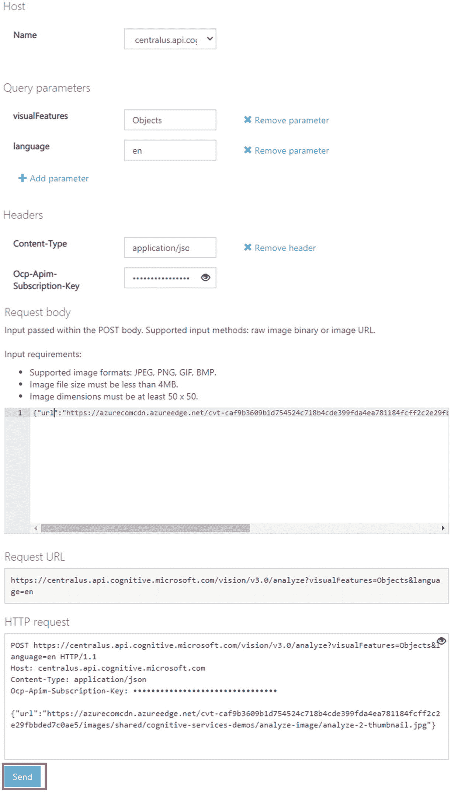

图 3-9 发送请求以分析图像

上述请求将返回如清单 3-1 所示的响应。

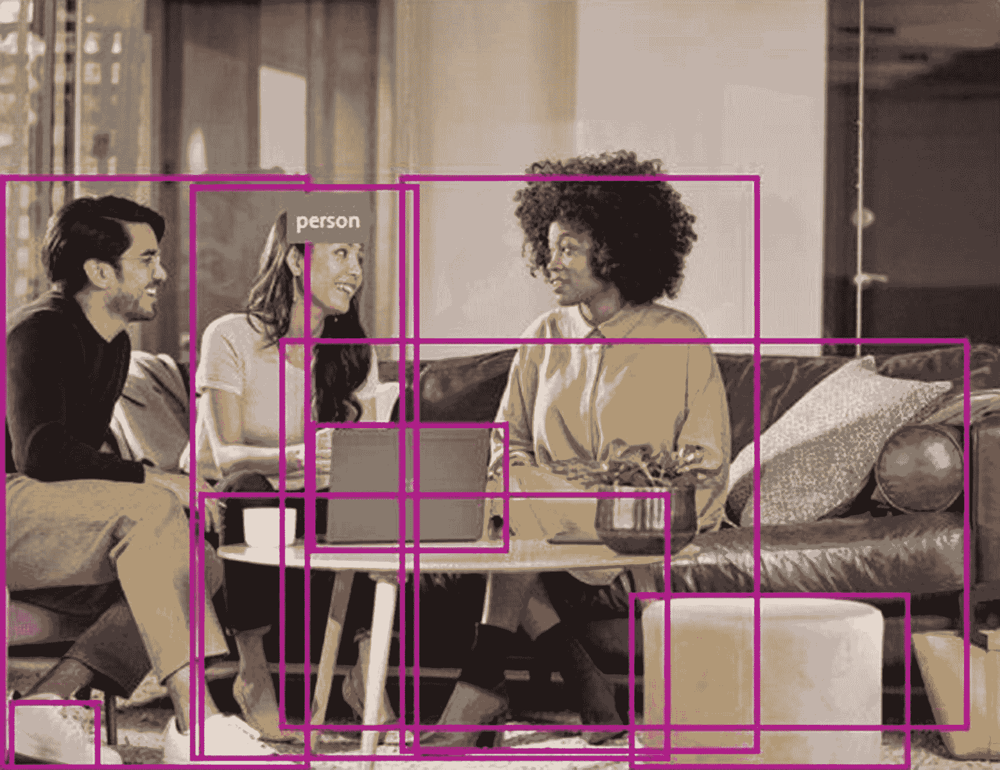

图 3-10 图像分析

2.  **从计算机视觉功能页面测试** – 要分析测试图像（用于演示目的），你可以使用功能页面获取可视化结果：[`https://azure.microsoft.com/en-in/services/cognitive-services/computer-vision/#features/`](https://azure.microsoft.com/en-in/services/cognitive-services/computer-vision/%2523features/)。出于演示目的，我们使用在 API 控制台窗口中测试过的同一张图片。我们将得到如图 3-10 所示的结果。

```
csp-billing-usage: CognitiveServices.ComputerVision.Objects=1,CognitiveServices.ComputerVision.Transaction=1
x-envoy-upstream-service-time: 844
apim-request-id: 6ddc4b00-4a3f-438b-876c-54800ae6250d
Strict-Transport-Security: max-age=31536000; includeSubDomains; preload
x-content-type-options: nosniff
Date: Sun, 07 Mar 2021 00:36:13 GMT
Content-Length: 281
Content-Type: application/json; charset=utf-8
{
"objects": [{
"rectangle": {
"x": 0,
"y": 47,
"w": 34,
"h": 125
},
"object": "person",
"confidence": 0.615
}, {
"rectangle": {
"x": 69,
"y": 35,
"w": 72,
"h": 138
},
"object": "person",
"confidence": 0.807
}],
"requestId": "6ddc4b00-4a3f-438b-876c-54800ae6250d",
"metadata": {
"height": 175,
"width": 175,
"format": "Jpeg"
}
}
```

清单 3-1 图像分析 API 的输出

分析数据显示在清单 3-2 中。

3.  **集成/从应用程序内部进行调用** – 这种方法被广泛使用。你使用从“密钥和终结点”页面生成的 API 密钥来调用 API。出于演示目的，我们有一段用 C# 编写的小代码。

我们使用了 Visual Studio 2019 Community Edition。本章讨论的所有代码示例所提及的步骤将保持不变。


```json
[
{
"rectangle": {
"x": 6,
"y": 390,
"w": 48,
"h": 40
},
"object": "footwear",
"confidence": 0.513
},
{
"rectangle": {
"x": 104,
"y": 104,
"w": 127,
"h": 323
},
"object": "person",
"confidence": 0.763
},
{
"rectangle": {
"x": 174,
"y": 236,
"w": 113,
"h": 74
},
"object": "Laptop",
"parent": {
"object": "computer",
"confidence": 0.56
},
"confidence": 0.553
},
{
"rectangle": {
"x": 351,
"y": 331,
"w": 154,
"h": 99
},
"object": "seating",
"confidence": 0.525
},
{
"rectangle": {
"x": 0,
"y": 101,
"w": 174,
"h": 329
},
"object": "person",
"confidence": 0.855
},
{
"rectangle": {
"x": 223,
"y": 99,
"w": 199,
"h": 322
},
"object": "person",
"confidence": 0.725
},
{
"rectangle": {
"x": 154,
"y": 191,
"w": 387,
"h": 218
},
"object": "seating",
"confidence": 0.679
},
{
"rectangle": {
"x": 111,
"y": 275,
"w": 264,
"h": 151
},
"object": "table",
"confidence": 0.601
}
]
```
**列表 3-2** 对象识别

打开 Visual Studio，然后点击**创建新项目**。在**创建新项目**页面上，点击**控制台应用 (.NET Core)**，如图 3-11 所示。然后，点击**下一步**。

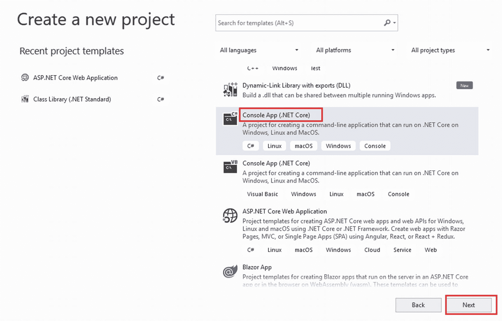

**图 3-11** 创建新项目

为项目命名，输入项目位置路径，并提供有效的解决方案名称。然后，点击**创建**，如图 3-12 所示。

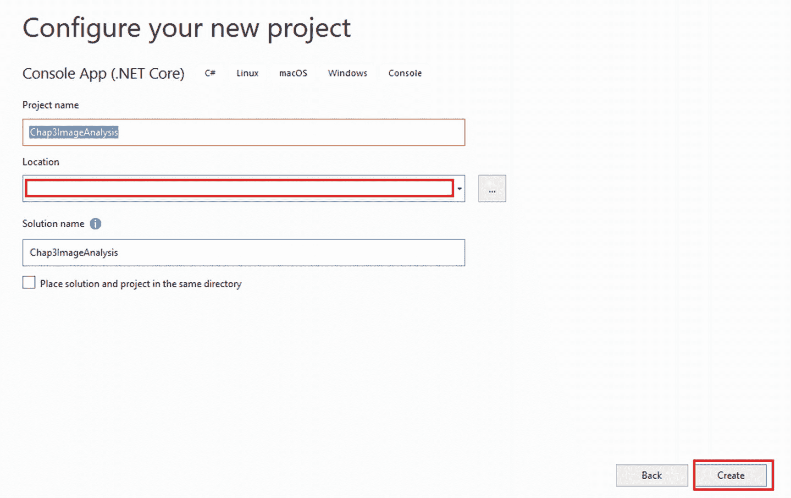

**图 3-12** 配置你的新项目

在解决方案资源管理器中右键点击项目名称，然后点击**管理 NuGet 包**。在 NuGet 包管理器中，在“浏览”选项卡中搜索 `Microsoft.Azure.CognitiveServices.Vision.ComputerVision`。确保勾选了**包括预发行版**复选框。在右侧窗格中，选择最新版本，然后点击其右侧的**安装**。参见图 3-13。

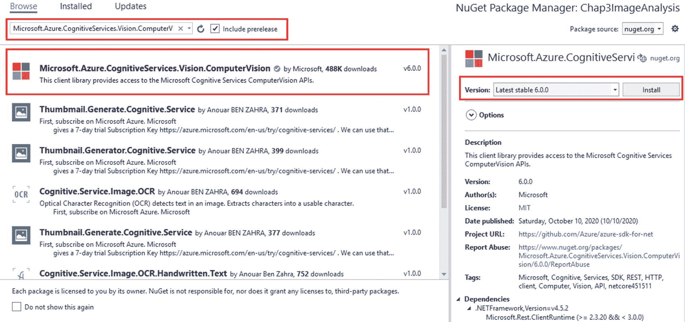

**图 3-13** 安装 NuGet 包

前往 Azure 门户并复制密钥和终结点。将密钥和终结点添加到你的代码中，如列表 3-3 所示。

```
static string subscriptionKey = "SUBSCRIPTION_KEY_GOES_HERE";
static string endpoint = "ENDPOINT_GOES_HERE";
```
**列表 3-3** 添加计算机视觉订阅密钥和终结点

订阅用于验证对终结点的请求。你可以回顾上一节，获取订阅密钥和终结点。

设置 `AuthenticatedClient`。编写如列表 3-4 所示的语句。

```
ComputerVisionClient client = AuthenticatedClient(endpoint, subscriptionKey);
```
**列表 3-4** 创建客户端

我们传递了一个终结点和一个有效的订阅密钥来创建一个经过身份验证的客户端。你可能会看到 Visual Studio 提示缺少命名空间的错误。添加建议的命名空间，如图 3-14 所示。

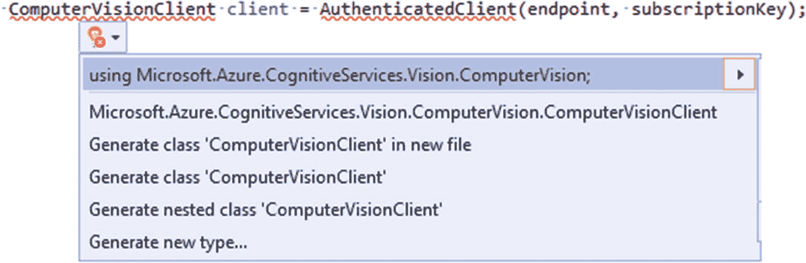

**图 3-14** 添加缺失的命名空间

`AuthenticatedClient` 方法通过验证 `ApiKeyServiceClientCredentials` 来创建一个有效且经过身份验证的客户端。参见列表 3-5。

```
private static ComputerVisionClient AuthenticatedClient(string endpoint, string subscriptionKey)
{
ApiKeyServiceClientCredentials clientCredentials = new ApiKeyServiceClientCredentials(subscriptionKey);
return new ComputerVisionClient(clientCredentials) { Endpoint = endpoint };
}
```
**列表 3-5** 对客户端进行身份验证

要添加你需要分析的所有功能，只需创建一个 `VisualFeatureTypes` 模型的列表。参见列表 3-6。

```
List featuresToBeAnalyzed = new List()
{
VisualFeatureTypes.Categories, VisualFeatureTypes.Description,
VisualFeatureTypes.Faces, VisualFeatureTypes.ImageType,
VisualFeatureTypes.Tags, VisualFeatureTypes.Adult,
VisualFeatureTypes.Color, VisualFeatureTypes.Brands,
VisualFeatureTypes.Objects
};
```
**列表 3-6** 待分析的视觉特征

添加缺失的命名空间，如图 3-15 所示。

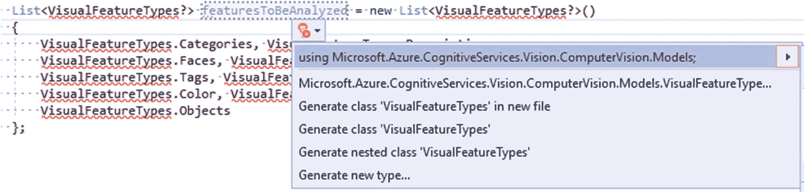

**图 3-15** 缺失的命名空间

向视觉 API 发出请求并获取结果。响应是 `ImageAnalysis` 模型对象，如列表 3-7 所示。

```
ImageAnalysis analysisData = await client.AnalyzeImageAsync(imgURL, featuresToBeAnalyzed);
```
**列表 3-7** 发出请求

在这个简短的演示中，我们分析了所有可能的功能，以检查图像描述、类型、对象等。我们演示图像（`https://docs.microsoft.com/en-us/learn/wwl-data-ai/analyze-images-computer-vision/media/woman-roof.png`）的最终结果应如图 3-16 所示。

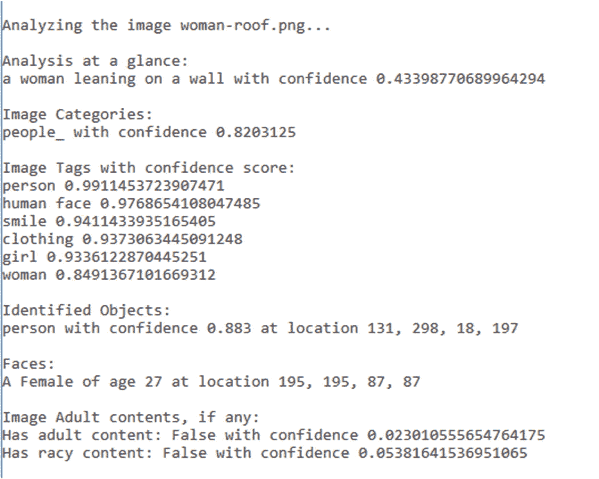

**图 3-16** 图像分析结果


#### 识别人脸

计算机视觉 API 也有助于识别图像中的人脸。它会分析图像，并根据识别出的人脸返回不同类型的数据。

大约有 27 个预定义的界标点用于检测人脸。计算机视觉在处理图像时会使用这些预定义的界标点。请参考图片 [`https://docs.microsoft.com/en-us/azure/cognitive-services/face/images/landmarks.1.jpg`](https://docs.microsoft.com/en-us/azure/cognitive-services/face/images/landmarks.1.jpg) 查看这些界标点的示意图。

人脸 API 提供面部分析功能。你可以执行此分析来完成以下操作：

- **检测图像中的人脸** – 它通过提取与面部相关的属性（如头部姿势、人物性别、年龄、情绪、胡须和眼镜）来检测人脸并提供分析数据。
- **查找图像中的相似人脸** – 你可能希望从数据库中搜索以找到某个人脸。此 API 可帮助你识别图像中的人脸。该 API 还能进一步缩小搜索范围，并提供两种识别人脸的方式：
  - **matchPerson 模式** – 它首先匹配并识别同一个人，然后返回匹配结果。
  - **matchFace 模式** – 它返回匹配结果，但忽略同一个人的面孔。此 API 不考虑面孔是否属于特定人物，而是查找所有面孔匹配项。换句话说，它返回可能属于或不属于同一个人的相似面孔匹配结果。
- **识别人脸** – 想象一下自动标记人脸的功能，系统会自动用人物身份（姓名或任何符号标识符）标记图像，然后将其存储在数据库中。此 API 可帮助你从存储的图像数据库中识别特定人脸。

要开始使用人脸识别，我们需要设置人脸 API。为此，请按照上一节中设置视觉 API 的相同步骤进行操作。搜索 **Face**，然后按照说明设置服务。

> **注意**  
> 如果你的需求非常有限，仅需从图像中识别人脸，那么你可以借助视觉 API，使用可选的 `visualFeatures` 参数^(¹) 来完成。如果你必须处理复杂场景（例如需要收集与面部分析相关的所有数据），那么我们建议你使用人脸 API。

请确保你也已设置好密钥和终结点。成功设置后，人脸资源屏幕应如图 3-17 所示。

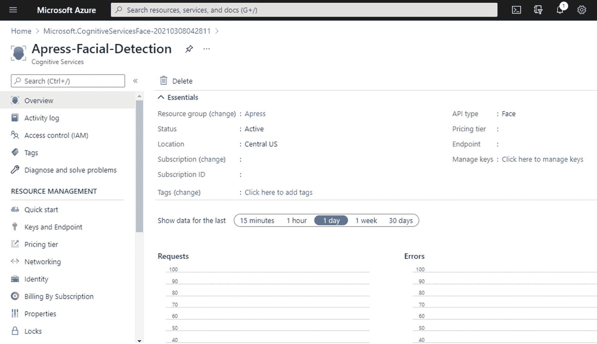

**图 3-17** 资源概览屏幕

#### 使用 API 控制台进行测试

我们已经设置好了人脸 API。现在，让我们通过 API 控制台来测试它。你需要从 Azure 门户打开 API 控制台，方法是选择你创建资源所在的区域。出于演示目的，我们在美国中部区域创建了一个资源。我们将仅从该区域测试 API。我们使用一个非常简单的 API，称为 Face Detect，并附带一张随机图片（[`https://docs.microsoft.com/en-us/learn/wwl-data-ai/analyze-images-computer-vision/media/woman-roof.png`](https://docs.microsoft.com/en-us/learn/wwl-data-ai/analyze-images-computer-vision/media/woman-roof.png)）。我们还针对以下面部属性分析图像：年龄和性别。请参见图 3-18。

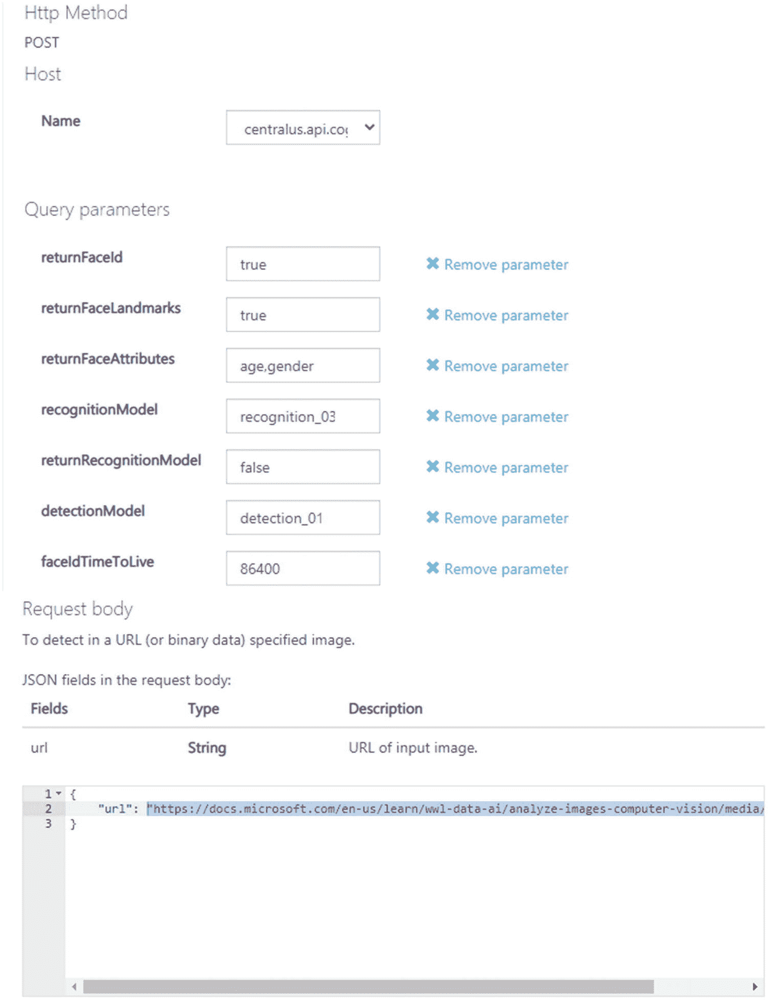

**图 3-18** 请求 Face Detect API

> **注意**  
> 人脸 API 有预构建的检测模型用于识别或分析人脸 – `detection_01`、`detection_02` 和 `detection_03`。在比较或识别相似人脸时，请确保使用相同的检测模型。在演示示例中，我们使用了 `detection_01` 模型。

如果你的请求有效并成功执行，它将返回类似于清单 3-8 所示的结果。

```
[{
"faceId": "0edfbefe-a73a-4143-b6bb-f722d39f97db",
"faceRectangle": {
"top": 45,
"left": 195,
"width": 42,
"height": 42
},
"faceLandmarks": {
"pupilLeft": {
"x": 204.3,
"y": 59.6
},
"pupilRight": {
"x": 222.5,
"y": 54.8
},
"noseTip": {
"x": 220.4,
"y": 66.9
},
"mouthLeft": {
"x": 209.6,
"y": 78.4
},
"mouthRight": {
"x": 226.3,
"y": 74.1
},
"eyebrowLeftOuter": {
"x": 193.1,
"y": 57.8
},
"eyebrowLeftInner": {
"x": 210.0,
"y": 51.9
},
"eyeLeftOuter": {
"x": 200.3,
"y": 60.8
},
"eyeLeftTop": {
"x": 203.4,
"y": 58.8
},
"eyeLeftBottom": {
"x": 203.8,
"y": 60.9
},
"eyeLeftInner": {
"x": 207.3,
"y": 59.3
},
"eyebrowRightInner": {
"x": 217.4,
"y": 50.5
},
"eyebrowRightOuter": {
"x": 226.6,
"y": 46.7
},
"eyeRightInner": {
"x": 219.2,
"y": 55.7
},
"eyeRightTop": {
"x": 221.9,
"y": 53.9
},
"eyeRightBottom": {
"x": 222.4,
"y": 55.7
},
"eyeRightOuter": {
"x": 224.9,
"y": 53.9
},
"noseRootLeft": {
"x": 211.4,
"y": 58.3
},
"noseRootRight": {
"x": 217.3,
"y": 56.6
},
"noseLeftAlarTop": {
"x": 213.5,
"y": 65.5
},
"noseRightAlarTop": {
"x": 221.4,
"y": 63.0
},
"noseLeftAlarOutTip": {
"x": 211.9,
"y": 69.3
},
"noseRightAlarOutTip": {
"x": 225.1,
"y": 65.4
},
"upperLipTop": {
"x": 220.3,
"y": 73.8
},
"upperLipBottom": {
"x": 220.6,
"y": 75.4
},
"underLipTop": {
"x": 221.3,
"y": 79.1
},
"underLipBottom": {
"x": 222.2,
"y": 81.5
}
},
"faceAttributes": {
"gender": "female",
"age": 25.0
}
}]
```

**清单 3-8** 检测人脸分析响应

在此，人脸 API 识别出人脸并附带以下属性：性别为女性，年龄为 25 岁。


#### 使用演示页面进行测试

如果你想分析产品，Face API 的产品概览页面提供了一个演示页面。为了展示人脸检测的强大功能，我们从演示页面使用了一张作者头像（Gaurav 的）。Face API 识别出照片中的人脸，如图 3-19 所示。

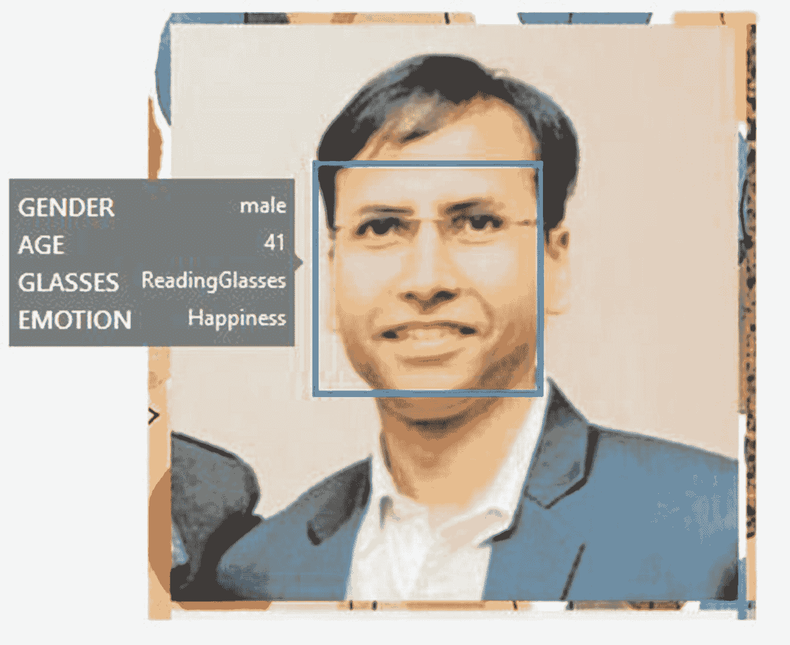

**图 3-19** 人脸检测

分析数据详细显示在代码清单 3-9 中。它提供了几乎所有可能的属性。

```
[
{
"faceId": "fef6dba7-6d8d-4825-aa08-8417aa29b563",
"faceRectangle": {
"top": 83,
"left": 92,
"width": 130,
"height": 130
},
"faceAttributes": {
"hair": {
"bald": 0.1,
"invisible": false,
"hairColor": [
{
"color": "black",
"confidence": 0.99
},
{
"color": "brown",
"confidence": 0.65
},
{
"color": "gray",
"confidence": 0.52
},
{
"color": "other",
"confidence": 0.44
},
{
"color": "blond",
"confidence": 0.11
},
{
"color": "red",
"confidence": 0.03
},
{
"color": "white",
"confidence": 0.0
}
]
},
"smile": 0.999,
"headPose": {
"pitch": -0.8,
"roll": -1.8,
"yaw": -8.6
},
"gender": "male",
"age": 41.0,
"facialHair": {
"moustache": 0.1,
"beard": 0.1,
"sideburns": 0.1
},
"glasses": "ReadingGlasses",
"makeup": {
"eyeMakeup": false,
"lipMakeup": false
},
"emotion": {
"anger": 0.0,
"contempt": 0.0,
"disgust": 0.0,
"fear": 0.0,
"happiness": 0.999,
"neutral": 0.001,
"sadness": 0.0,
"surprise": 0.0
},
"occlusion": {
"foreheadOccluded": false,
"eyeOccluded": false,
"mouthOccluded": false
},
"accessories": [],
"blur": {
"blurLevel": "medium",
"value": 0.63
},
"exposure": {
"exposureLevel": "overExposure",
"value": 0.82
},
"noise": {
"noiseLevel": "medium",
"value": 0.39
}
},
"faceLandmarks": {
"pupilLeft": {
"x": 130.0,
"y": 120.2
},
"pupilRight": {
"x": 184.2,
"y": 117.2
},
"noseTip": {
"x": 156.5,
"y": 153.2
},
"mouthLeft": {
"x": 128.0,
"y": 180.4
},
"mouthRight": {
"x": 183.9,
"y": 177.6
},
"eyebrowLeftOuter": {
"x": 110.7,
"y": 110.2
},
"eyebrowLeftInner": {
"x": 146.7,
"y": 110.1
},
"eyeLeftOuter": {
"x": 120.8,
"y": 122.1
},
"eyeLeftTop": {
"x": 128.5,
"y": 116.5
},
"eyeLeftBottom": {
"x": 129.1,
"y": 123.4
},
"eyeLeftInner": {
"x": 136.9,
"y": 120.9
},
"eyebrowRightInner": {
"x": 167.4,
"y": 109.1
},
"eyebrowRightOuter": {
"x": 201.1,
"y": 107.3
},
"eyeRightInner": {
"x": 176.2,
"y": 119.3
},
"eyeRightTop": {
"x": 183.1,
"y": 113.8
},
"eyeRightBottom": {
"x": 184.4,
"y": 120.6
},
"eyeRightOuter": {
"x": 192.2,
"y": 117.7
},
"noseRootLeft": {
"x": 148.6,
"y": 122.2
},
"noseRootRight": {
"x": 164.1,
"y": 121.8
},
"noseLeftAlarTop": {
"x": 144.6,
"y": 143.8
},
"noseRightAlarTop": {
"x": 169.5,
"y": 142.9
},
"noseLeftAlarOutTip": {
"x": 137.6,
"y": 155.3
},
"noseRightAlarOutTip": {
"x": 175.8,
"y": 153.2
},
"upperLipTop": {
"x": 155.1,
"y": 170.1
},
"upperLipBottom": {
"x": 155.4,
"y": 175.1
},
"underLipTop": {
"x": 154.8,
"y": 185.7
},
"underLipBottom": {
"x": 155.5,
"y": 192.7
}
}
}
]
```

**代码清单 3-9** 人脸检测分析数据

如果我们查看这些数据，可以很容易地判断出这张脸属于一个 41 岁的男性，黑发，戴着老花镜，脸上带着微笑。

#### 使用代码实现

借助这些 API，将 API 集成到现有代码中非常容易，或者你也可以编写一个新的应用程序来分析人脸。在本节中，我们包含了一个小型演示，以帮助你理解代码和 API 的强大功能。你可以在仓库的 [仓库 URL] 中找到完整的代码。

我们创建了一个 Visual Studio 项目。（请参考上一节回顾如何构建 Visual Studio 项目。）创建项目后，打开 NuGet 包管理器并搜索包 `Microsoft.Azure.CognitiveServices.Vision.Face`。在右侧窗格中点击**安装**，如图 3-20 所示。

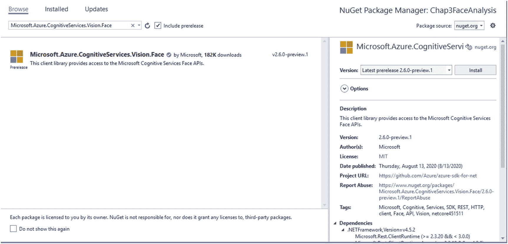

**图 3-20** 添加 NuGet 包

之前，你创建了一个客户端来调用 Face API，并添加了一个命名空间。参见代码清单 3-10。这个命名空间将帮助你解析所有引用，从而可以轻松创建人脸客户端。

```
using Microsoft.Azure.CognitiveServices.Vision.Face;
```

**代码清单 3-10** 命名空间

让我们创建一个人脸客户端。为此，你需要一个有效的订阅密钥。编写创建客户端的方法，如代码清单 3-11 所示。

```
private static FaceClient AuthenticatedClient(string endpoint, string subscriptionKey)
{
ApiKeyServiceClientCredentials clientCredentials = new ApiKeyServiceClientCredentials(subscriptionKey);
return new FaceClient(clientCredentials) { Endpoint = endpoint };
}
```

**代码清单 3-11** 创建人脸客户端

这里，我们使用 `subscriptionkey` 作为客户端的凭据。然后我们提供端点来创建 `FaceClient`。

让我们执行一次简单的人脸检测。这将通过获取识别出的人脸在图像中的位置，来提供其概览信息。在编写代码开始分析之前，我们必须添加几个命名空间，如代码清单 3-12 所示。

```
using Microsoft.Azure.CognitiveServices.Vision.Face;
using Microsoft.Azure.CognitiveServices.Vision.Face.Models;
```

**代码清单 3-12** 人脸模型命名空间

模型命名空间将允许你访问包含分析数据的 `DetectedFace` 模型。我们通过使用人脸客户端添加了一个简单的 API 调用。我们使用了一个带有 URL 的图像，如代码清单 3-13 所示。完整示例可在 GitHub (`https://github.com/Apress/hands-on-azure-cognitive-services/tree/main/Chapter%2003/Chap3FaceAnalysis`) 上找到。

```
IList faces = await client.Face.DetectWithUrlAsync(url: imgURL, returnFaceId: true, detectionModel: DetectionModel.Detection02);
```

**代码清单 3-13** 请求 Face API

在这段代码中，`Detection02` 是一个预定义的检测模型。在我们的演示示例中，你可以使用 `Detection01` 或 `Detection02`。有两种请求方法：`DetectWithUrlAsync` 和 `DetectWithStreamAsync`。第一种方法从提供的 URL 中检测图像中的人脸。第二种方法（`DetectWithStreamAsync`）需要一个图像流。（这在构建用于上传图像的用户界面时非常重要。）代码清单 3-14 展示了如何从 API 返回的 `DetectedFace` 模型列表中检索数据。

```
foreach (var face in faces)
{
FaceRectangle rect = face.FaceRectangle;
Console.WriteLine($"Face:{face.FaceId} is located in the image in marked point having dimensions: height-{rect.Height} width-{rect.Width} which is available from Top-{rect.Top} Left-{rect.Left}.");
}
```

**代码清单 3-14** 关于检测到的人脸的信息

运行该项目。结果应类似于图 3-21 所示。

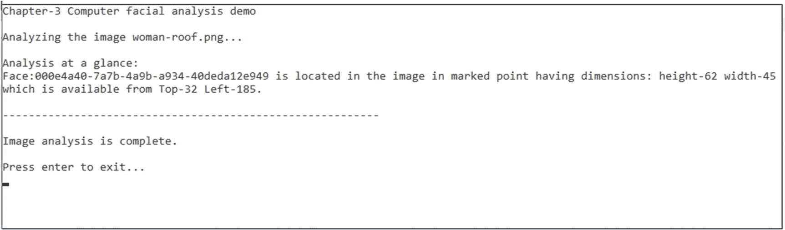

**图 3-21** 人脸分析输出


## 理解用于视频分析的视觉 API 工作行为

视频索引器服务帮助我们提供视频分析功能。它能自动从视频（动态图形）中提取元数据，例如文字、书面文本、人脸、说话者以及名人身份。在以下示例中，我们将使用 Azure 认知服务，通过 `OpenCVSharp` 包，近乎实时地分析来自网络摄像头的视频帧：

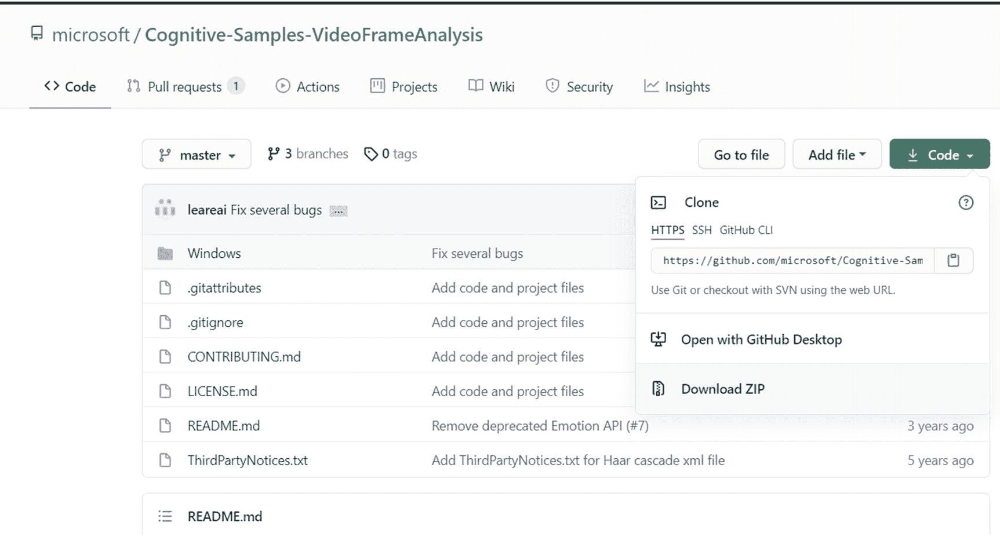

图 3-22

认知示例视频帧分析 GitHub 仓库

1. 第一步是从 GitHub 克隆仓库^(²)，如图 3-22 所示。你将在仓库的 Windows 文件夹中找到这两个应用程序。


图 3-23

在 Azure 门户上创建资源

2. 接下来，打开 Azure 门户为计算机视觉创建资源。点击 **创建资源** 按钮，如图 3-23 所示。

在搜索栏中搜索并选择 **计算机视觉** 资源类型。

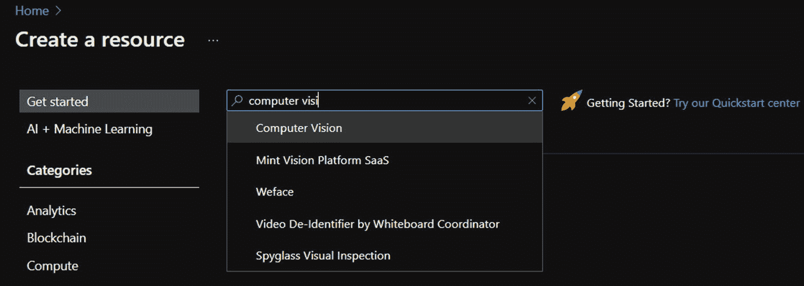

图 3-24

创建资源 – 选择计算机视觉

现在点击 **创建** 按钮来创建你的计算机视觉资源。

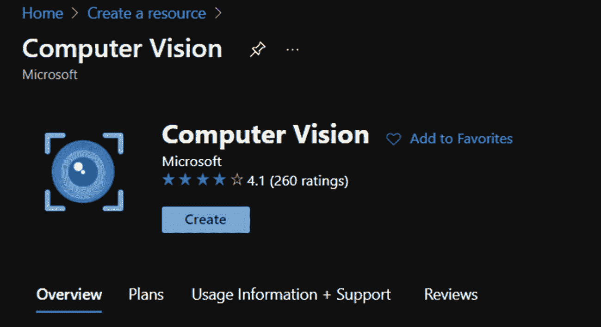

图 3-25

正在创建资源

这将带你进入创建计算机视觉资源页面。在这里，你可以通过提供关于订阅、资源组等相关信息来创建计算机视觉资源（如图 3-26 所示）。

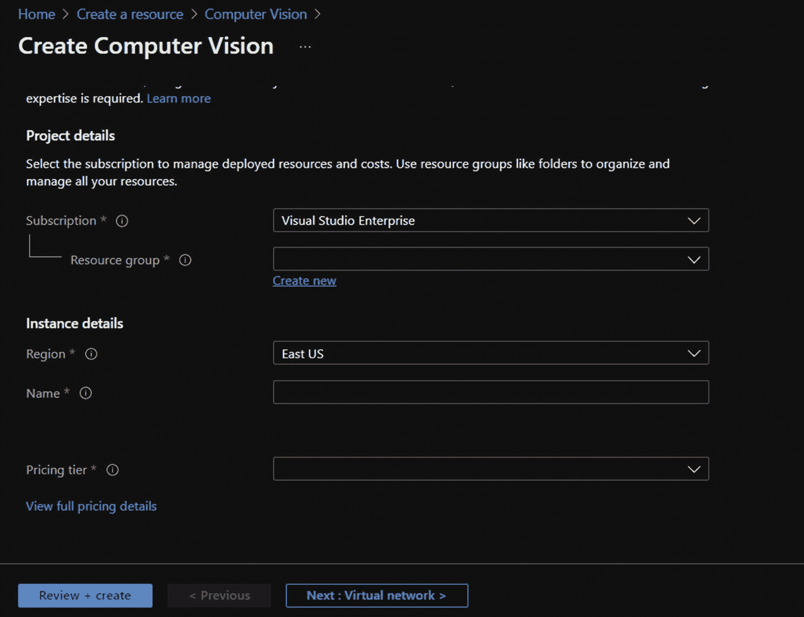

图 3-26

创建计算机视觉资源

选择并填写完详细信息后，点击 **查看 + 创建** 按钮（如图 3-27 所示）来验证你提供的信息。


图 3-27

查看 + 创建按钮

验证信息后，点击 **创建** 来启动并部署计算机视觉资源。

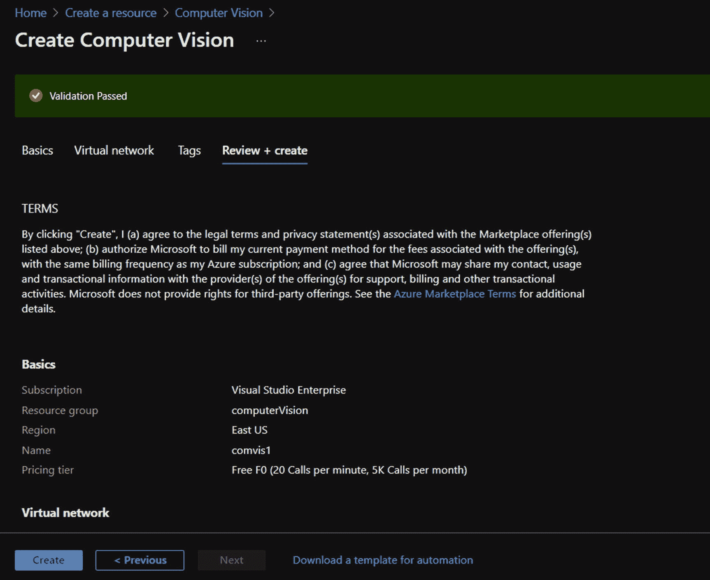

图 3-28

验证已创建的资源

随后你将看到部署正在进行的通知（如图 3-29 所示），之后你便可以使用该服务。

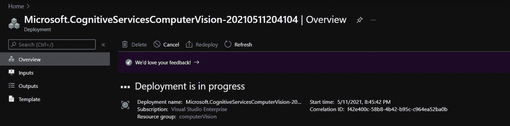

图 3-29

计算机视觉资源部署正在进行中

3. 在这一步中，你将在 Azure 门户中创建另一个资源。这将是你将用于人脸检测的人脸 API。参见图 3-30。

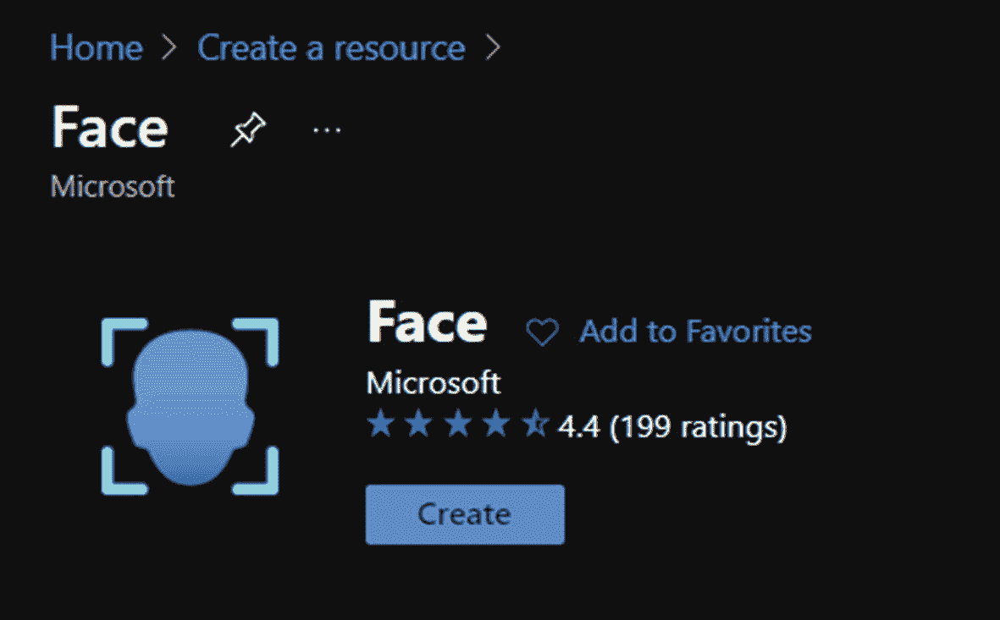

图 3-30

创建人脸资源

其余步骤与之前创建资源相同。人脸 API 的部署需要几分钟时间。图 3-31 显示了人脸资源部署正在进行中。

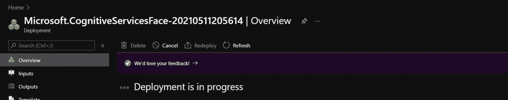

图 3-31

人脸资源部署正在进行中

4. 现在你已经创建了服务，让我们使用 Visual Studio 从本地机器上的目标文件夹中打开克隆的仓库。


在 Visual Studio 中，依次点击**文件**、**打开**和**文件夹**（如图 3-32 所示）。

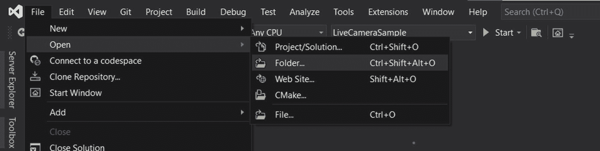

图 3-32：从下载的仓库中打开解决方案文件夹

打开解决方案后，你将在解决方案资源管理器中看到这些文件（如图 3-33 所示）。

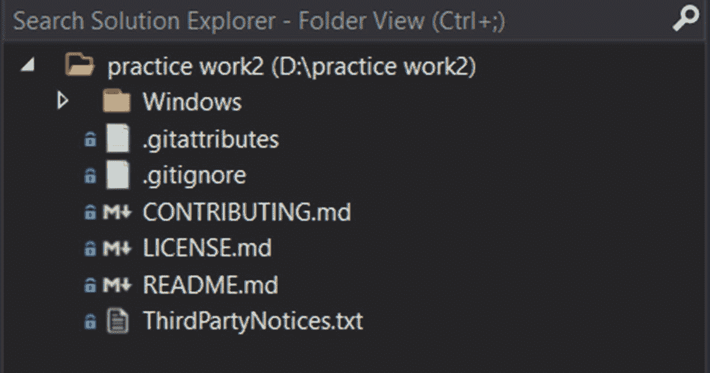

图 3-33：从下载的仓库中打开解决方案文件夹

展开 Windows 文件夹，然后点击 **VideoFrameAnalysis.sln** 文件（如图 3-34 所示）。

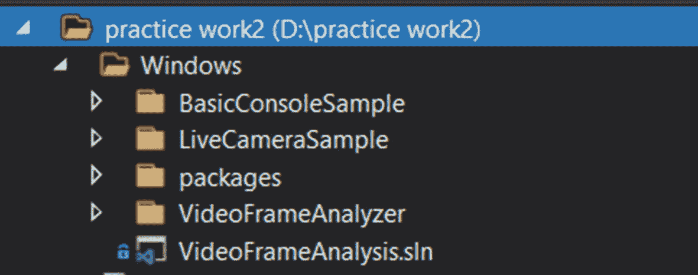

图 3-34：打开 `VideoFrameAnalysis.sln` 文件

双击 **LiveCameraSample** 以加载它。

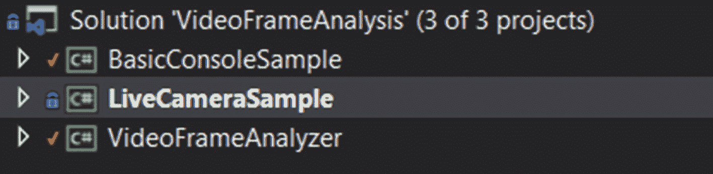

图 3-35：`LiveCameraSample` 项目

Nuget 是 .NET 的包管理器。要使用摄像头解决方案，你需要 Cognitive Services 包，这是一个用于处理 Azure Cognitive Services 的库。接下来，右键单击 **解决方案“VideoFrameAnalysis”** 选项，然后点击**管理解决方案的 NuGet 程序包**…（如图 3-36 所示）。

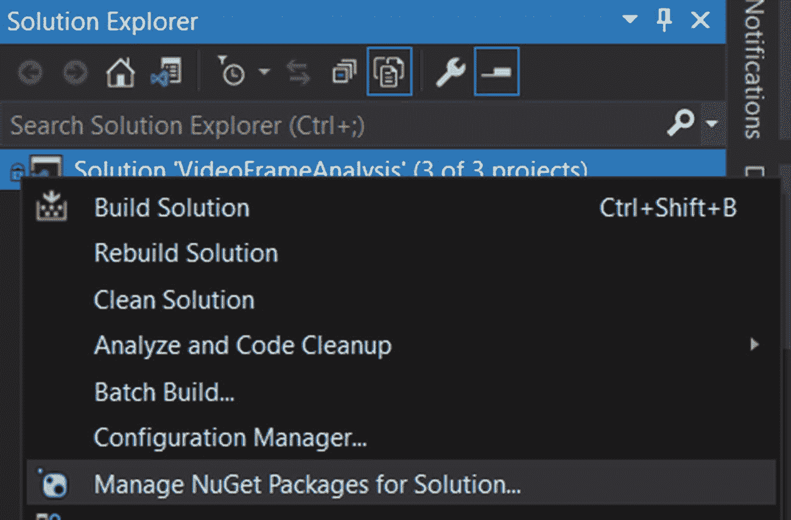

图 3-36：管理解决方案的 NuGet 程序包

此时，尝试还原解决方案所需的所有 NuGet 包，然后验证它们是否已安装，如图 3-37 所示。

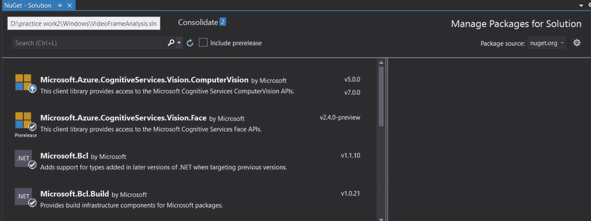

图 3-37：管理解决方案的 NuGet 包

如图 3-37 所示，这些包不包含 Computer Vision 包。还原包后，Nuget 将如图 3-38 所示。请忽略包弃用警告。

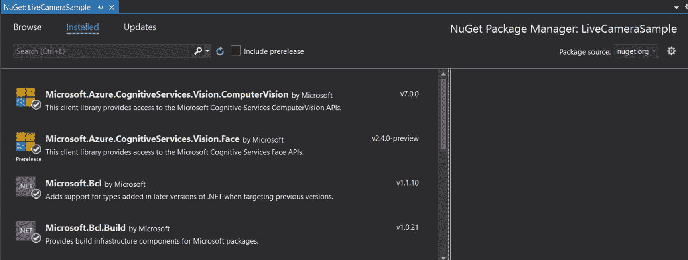

图 3-38：已还原的包

1.  在 Basic Console Sample 中，Face API 密钥直接硬编码在 `BasicConsoleSample/Program.cs` 文件中。见图 3-39。

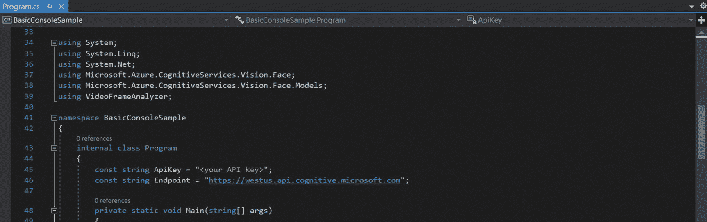

图 3-39：`BasicConsoleSample.Program` cs 文件

从 Azure 门户中，从你之前创建的 Face 资源中获取 API 密钥和终结点（如图 3-40 所示）。

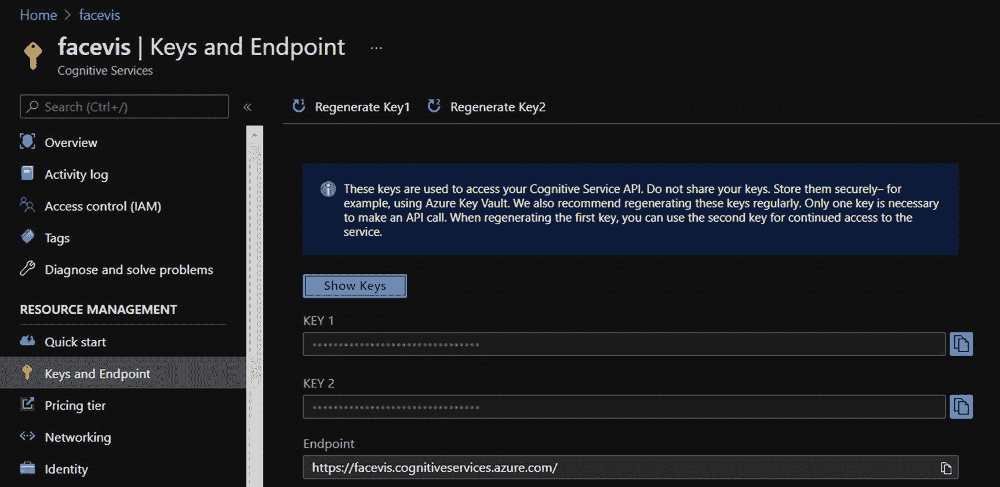

图 3-40：Azure 门户上的 Face API 密钥和终结点

完成后，运行 `BasicConsoleSample` 文件，它将从网络摄像头读取帧。结果将如图 3-41 所示。

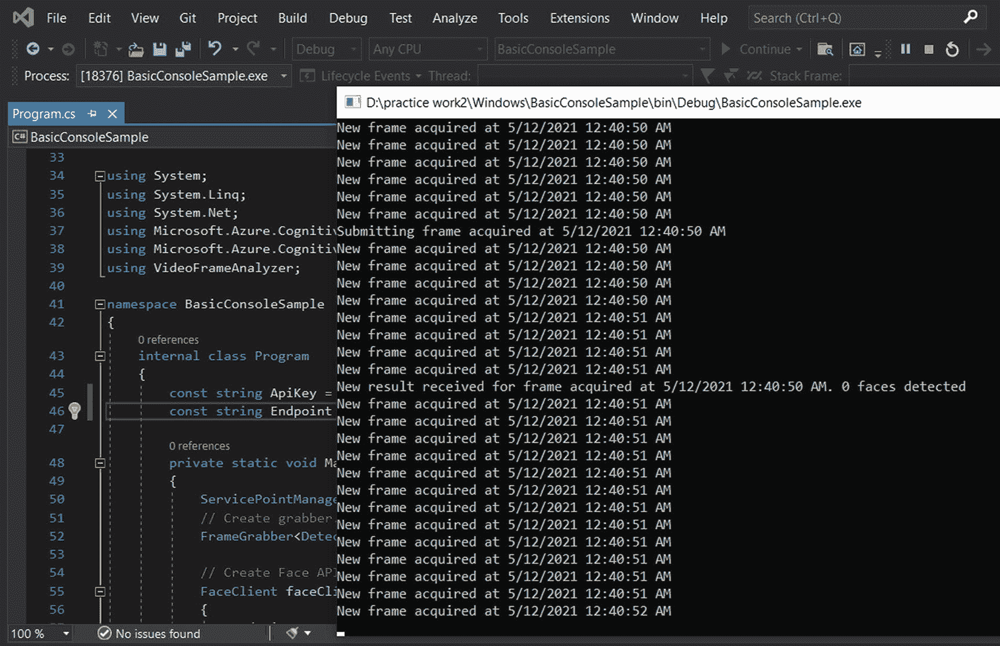

图 3-41：运行 Basic Console Sample 并获取帧

接下来，运行 `LiveCameraSample`。其 UI 会要求你提供我们之前创建的 Face 和 Vision API 的 API 密钥和终结点。见图 3-42。复制并粘贴密钥，然后点击**保存**。

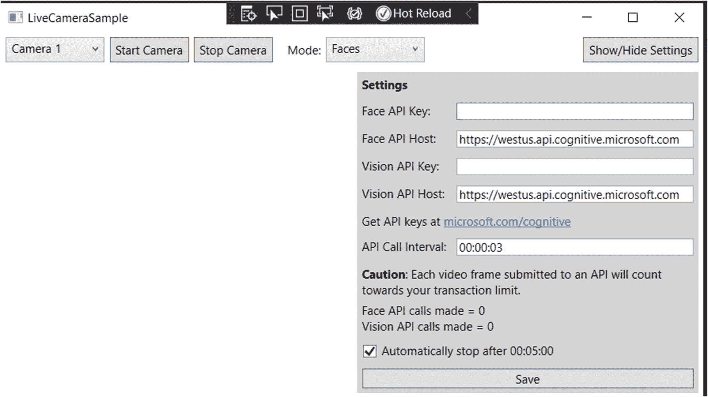

图 3-42：运行 Live Camera Sample

选择特定模式，然后点击**启动摄像头**。见图 3-43。

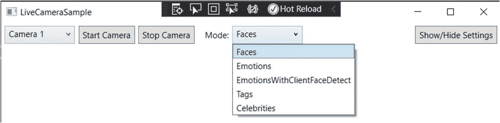

图 3-43：运行 Live Camera Sample

这里，我们使用了“名人”模式。正如预期，程序识别出了我们提供的比尔·盖茨的照片（如图 3-44 所示）。

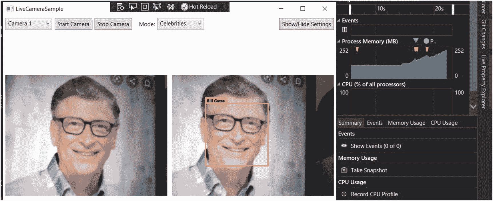

图 3-44：运行 Live Camera Sample – 名人模式

类似地，对于其他模式（例如用于物体检测的“标签”模式），你可以将家居物品放入图像中（如图 3-45 所示）。

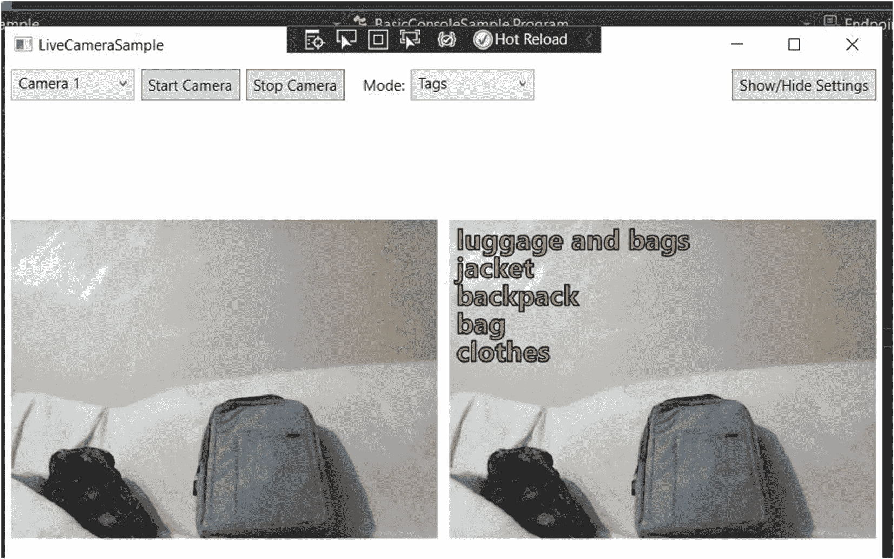

图 3-45：运行 Live Camera Sample – 标签模式

在此示例中，你可以了解如何捕获实时摄像头源。你可以使用 Cognitive Services 和 Face API 来检测人脸和物体。在下一个示例中，我们将使用 Video Indexer 服务从视频中提取信息。


### Microsoft Azure 视频索引器

Microsoft Azure 视频索引器是 Azure 媒体服务的一部分，它构建在认知搜索和其他 Azure 认知服务（如人脸 API、Microsoft 翻译器、计算机视觉 API 和自定义语音）之上。它能够自动从视频和音频内容中提取高级元数据。要开始使用，请按照以下步骤操作：

1.  访问视频索引器^(³)，然后点击**免费开始**以开始免费试用。见图 3-46。

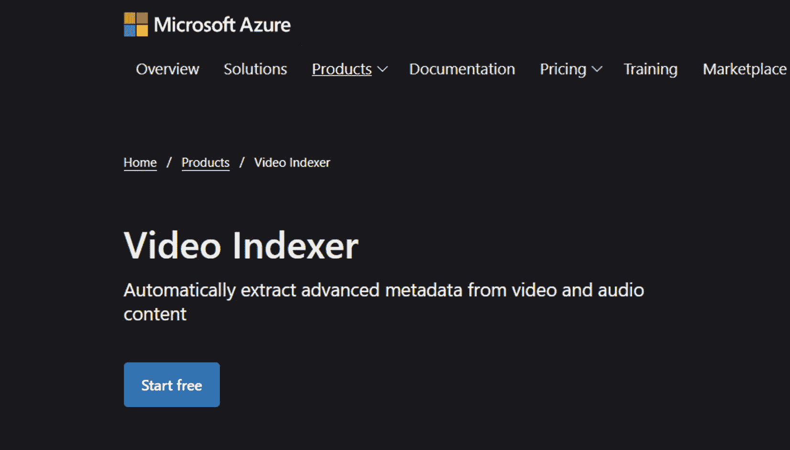

图 3-46

视频索引器主页

使用你的 Microsoft 账户登录。见图 3-47。

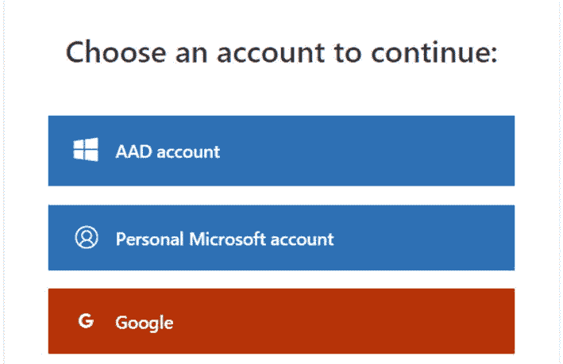

图 3-47

视频索引器登录

使用你的 Microsoft 账户登录后，你将看到如图 3-48 所示的屏幕。点击侧边栏上的**媒体文件**胶片图标，以添加你的视频文件。

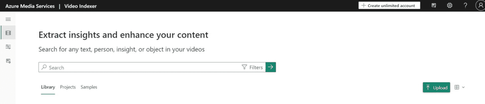

图 3-48

视频索引器 – 提取见解并增强你的内容

点击左侧边栏上的**模型自定义**设置图标，以添加要识别的人员。在此案例中，我们上传了来自伦敦 ISG 自动化峰会^(⁴) 某场演讲的视频，然后选择了该人员。从右侧菜单中点击**添加人员**（如图 3-49 所示）。

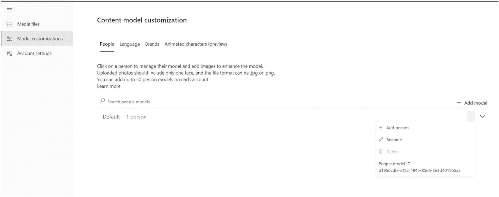

图 3-49

视频索引器 – 内容模型自定义

此时，你需要填写该人员的详细信息。该服务不能用于执法目的，因为微软决定不向警方出售其人脸识别技术^(⁵)。现在，你将上传要在视频中识别的个人的照片。见图 3-50。

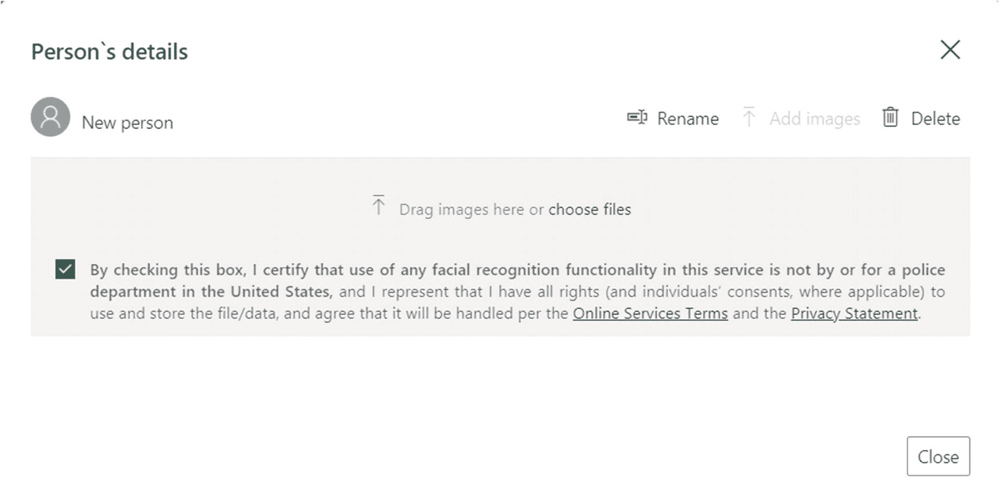

图 3-50

视频索引器 – 人员详细信息

照片上传后，人员 1 现已添加到模型中，如图 3-51 所示。

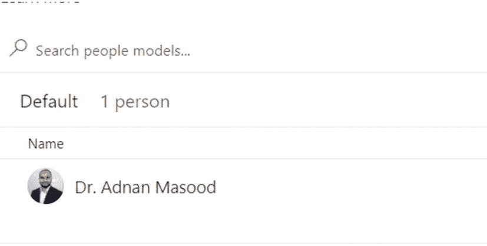

图 3-51

视频索引器 – 人员已添加

现在返回仪表板。点击**上传**以上传需要索引的视频。点击**浏览文件**，在你的系统中浏览文件（如图 3-52 所示）。

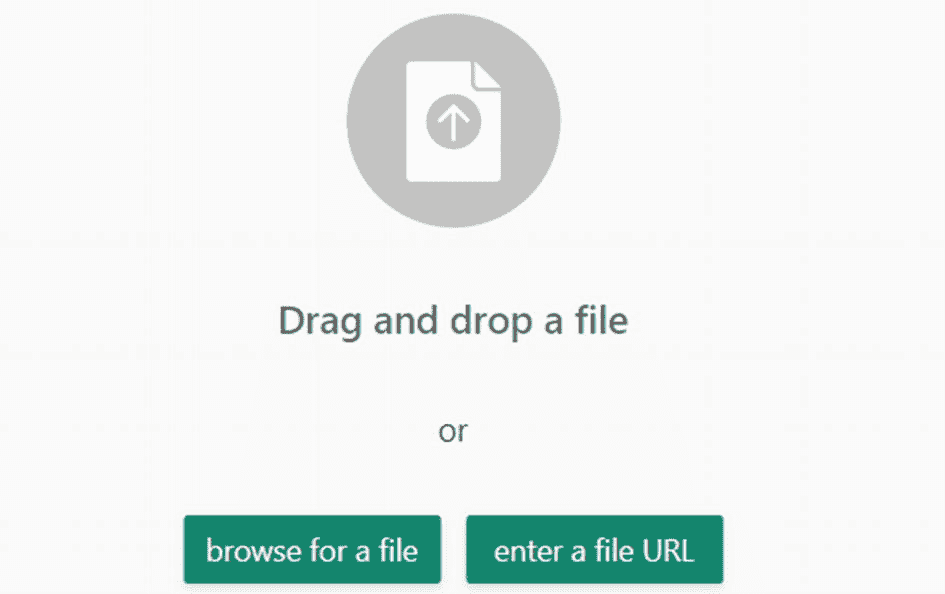

图 3-52

视频索引器 – 上传视频文件

然后文件被上传并进行分析。此过程将花费一些时间（如图 3-53 所示）。

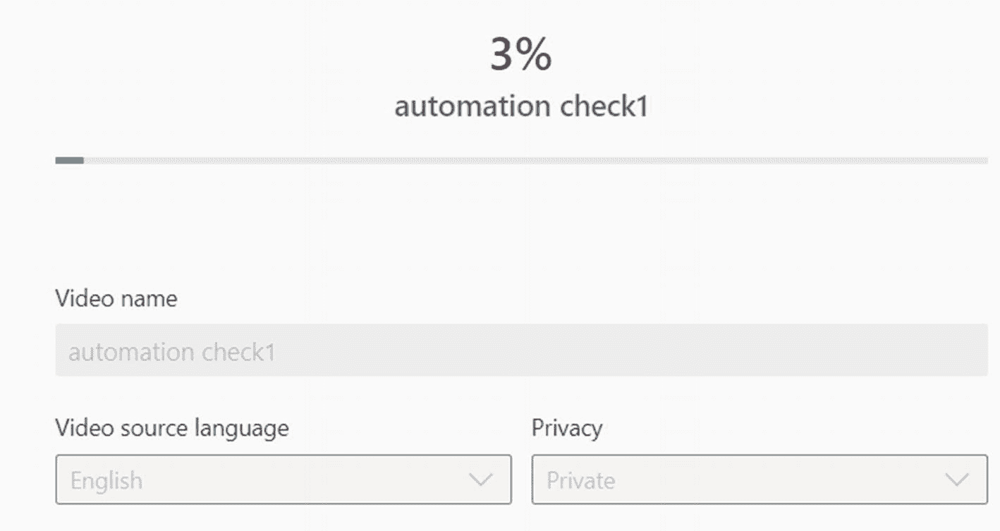

图 3-53

视频索引器 – 文件上传进度

成功完成后，你将在仪表板上看到已分析的视频。现在点击视频上的**播放**按钮（见图 3-54）。

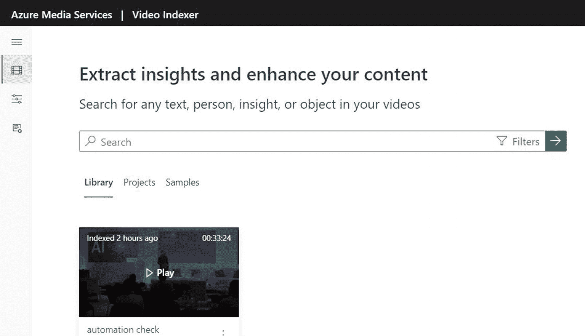

图 3-54

视频索引器 – 从视频中提取见解

如图 3-55 所示，视频索引器不仅识别了该个人，还识别了视频中的其他几个人。

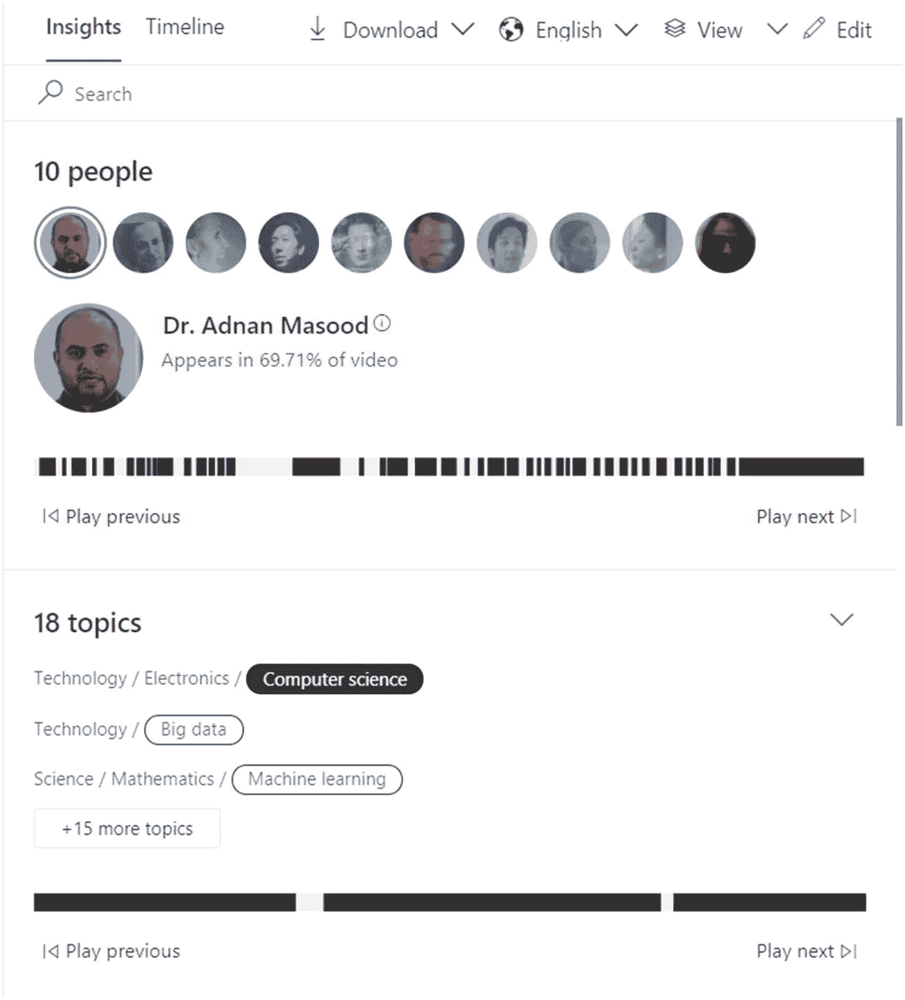

图 3-55

视频索引器识别了视频中的个人

借助这个丰富的视频，我们可以选择视频中不同的见解类别，例如识别物体、人物、关键词等。图 3-56 展示了时间线报告。

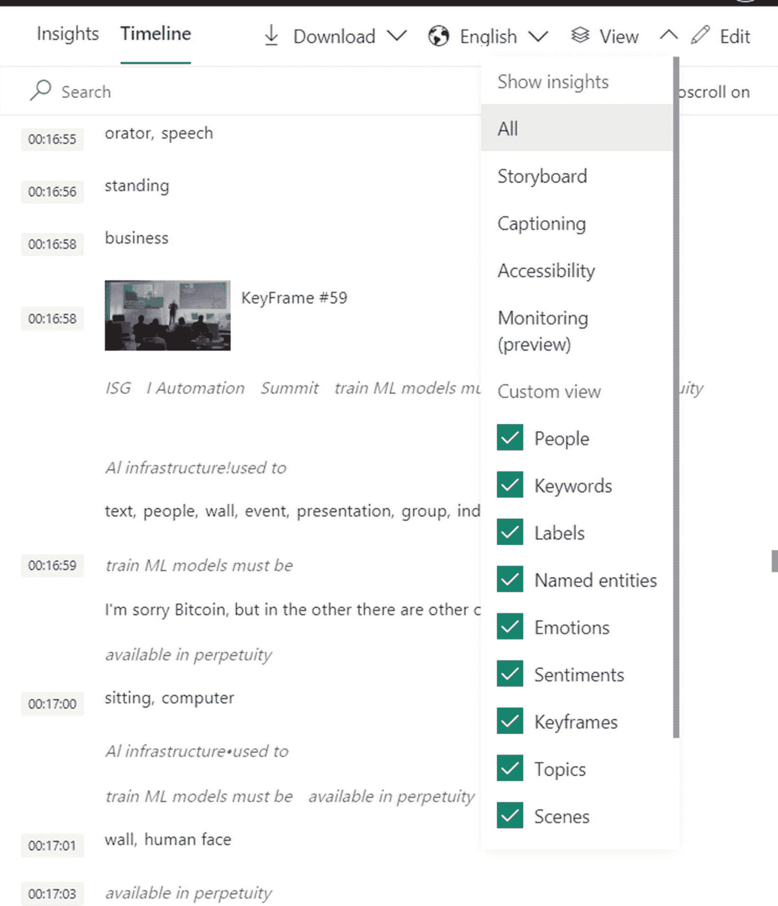

图 3-56

视频索引器见解 – 时间线

视频索引器是一个全面且复杂的视频增强产品，可用于媒体、新闻、娱乐、新闻业等多种用例。在这里，你已经看到了该服务的一些基本功能，这些功能可以解锁视频见解，以丰富你的视频，增强发现能力并提高参与度。其功能集包括人脸检测、名人识别、自定义人脸识别、缩略图提取、文本识别、物体识别、视觉内容审核（检测露骨内容）、场景分割、镜头检测等。

我们可以想象，你、你的公司、你的客户以及世界各地的组织可以在多大程度上使用这项技术！

## 总结

在本章中，我们解释了计算机视觉 API 和各种相关的 API。借助这些功能，我们可以识别人脸，并对任何图像集进行分析。我们可以捕获数据，并使文档可搜索。对于动态图形（视频），视频索引器（与 Azure 媒体服务相关联）为我们提供了识别音频、词语、说话者、书面内容等的功能。

在下一章中，我们将继续讨论 Azure 认知服务，并将探讨自然语言处理（NLP）。

脚注 1   2   3   4   5

