# 木偶模型——用于自然语言处理的 Transformer

在自然语言处理领域，尤其是围绕非结构化文本和模型的讨论中，如果不提及`BERT`、`ELmo`、`Grover`、`RoBERTa`、`ERNIEs`和`KERMIT`，那就不算完整。这并非因为 ACL（计算语言学协会）旗舰会议恰好与芝麻街大会在同一地点举办（大鸟绝对没有发表令人难忘的主题演讲），而是因为当语言模型论文引入与芝麻街相关的缩写时，这个内部玩笑有点失控了（而且很多人开始为这个烂笑话添砖加瓦）。

要概述 Transformer 模型及其复杂细节，需要单独用一章来讲解，但简而言之，图 4-27 中的表格展示了一些流行的木偶模型概览。

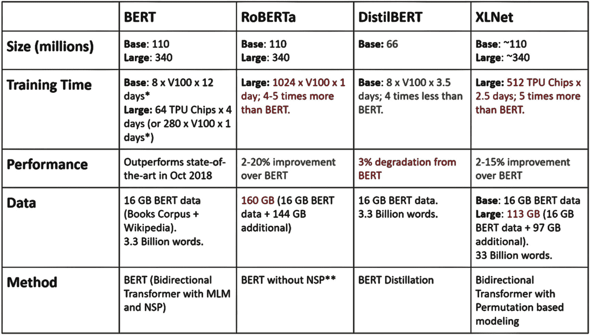

图 4-27

一些流行木偶模型的表格

### 使用微调 BERT 进行命名实体识别

命名实体识别（NER）是任何自然语言处理系统的关键能力之一，因此也是语言模型提供的基本功能之一。它能够从非结构化数据集中提取实体，例如地理实体（城市、国家等）、组织实体（组织名称）、个人实体（与人员相关的姓名和标识符）、地缘政治实体（国家、组织）、时间、事件、自然现象、季节性（节假日）、自定义实体等。

在本示例中，我们将使用`Azure ML`上的`PyTorch Pretrained BERT`进行命名实体识别。我们将使用`Google Colaboratory`，这是一个用于运行`Jupyter`笔记本的免费工具。（它通常被称为`Google Colab`。这个名称是实验室和协作两个词的混合双关语。）不过，你也可以通过`Anaconda`在本地机器上，或通过`Azure`笔记本在`Azure Machine Learning`上完成同样的练习。

请按照以下步骤完成本示例。

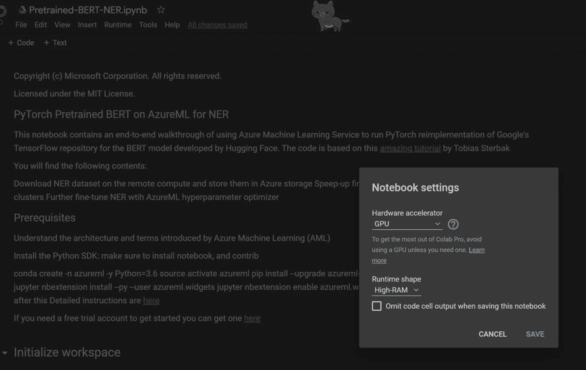

图 4-28

使用 Azure ML 打开 BERT NER Colab

1.  从[`https://github.com/microsoft/AzureML-BERT/blob/master/finetune/PyTorch/notebooks/Pretrained-BERT-NER.ipynb`](https://github.com/microsoft/AzureML-BERT/blob/master/finetune/PyTorch/notebooks/Pretrained-BERT-NER.ipynb)在`Colab`中打开`Jupyter`笔记本（如图 4-28 所示）。

填写你的订阅 ID 和资源组信息。你还需要通过打开浏览器并输入提供的代码来执行交互式身份验证。见图 4-29。

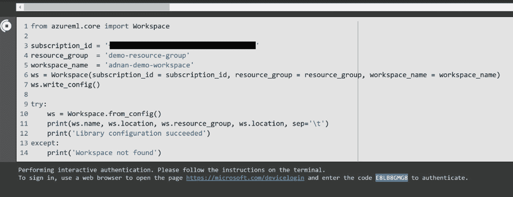

图 4-29

填写你的信息

现在你需要初始化工作区，并为笔记本安装`Azure ML SDK`（如图 4-30 所示）。

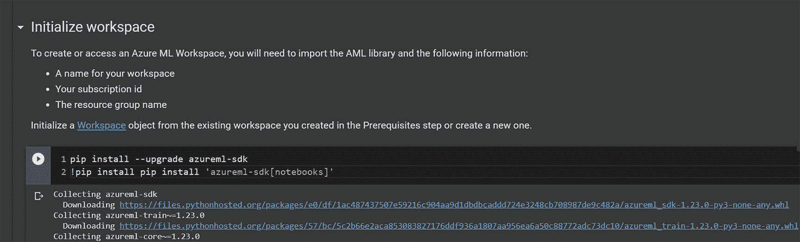

图 4-30

为笔记本安装 Azure ML SDK

下一步是创建（或使用）一个计算集群目标用于执行。在本例中，我们选择了一个标准的单 GPU `NC_6`虚拟机，同时将区域设置为美国西部。见图 4-31。

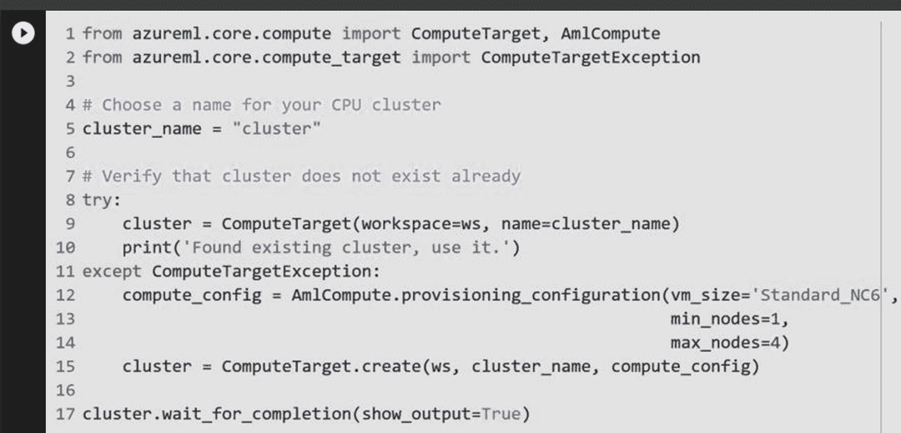

图 4-31

创建计算集群

然而，我们遇到了一个错误！从错误中学到的东西比一切顺利时更多。在本例中，`NC6`类型的虚拟机在该区域不可用。你将看到错误消息：“`STANDARD_NC6`在`westus`区域不受支持。请选择其他虚拟机大小。”（见图 4-32。）

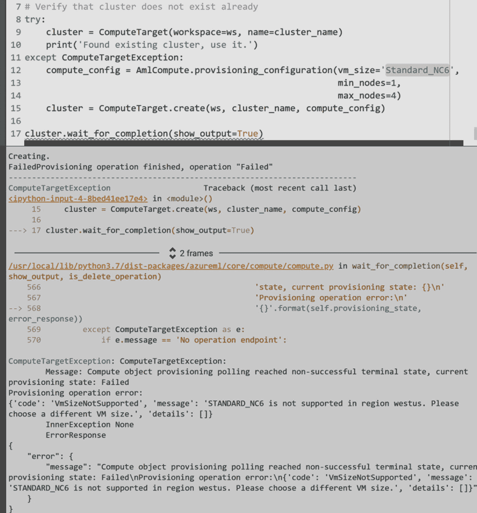

图 4-32

ComputeTarget 创建错误

需要注意的是，并非所有计算类型在所有区域都可用，因此选择合适的区域非常重要。你可以在[`https://docs.microsoft.com/azure/virtual-machines/regions`](https://docs.microsoft.com/azure/virtual-machines/regions)（微软文档）上阅读更多关于区域和虚拟机的信息。

要解决此问题，请转到 Azure 控制台，通过在美国东部（该虚拟机可用的区域）创建一个新工作区，将区域更改为美国东部。现在你可以成功创建计算目标，如图 4-33 所示。

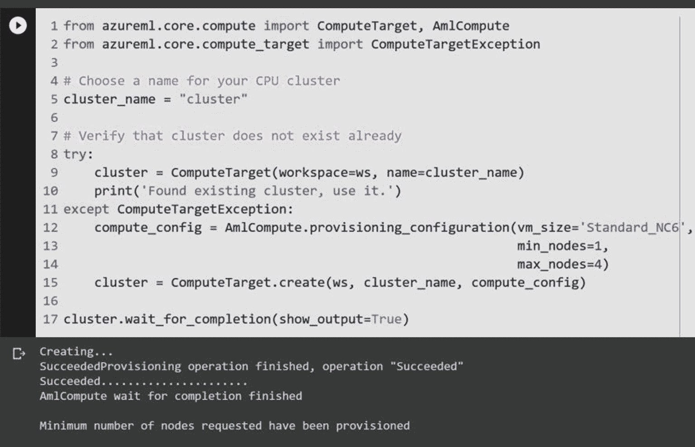

图 4-33

ComputeTarget 创建成功

在计算目标设置中，我们先上传 NER 数据集。本例将使用来自 Kaggle 的、基于 GMB（格罗宁根意义银行）进行实体分类的标注语料库^(⁷)。首先，从 Kaggle 下载 NER 数据集文件，然后将其上传到笔记本中。接着，使用图 4-34 所示的命令，将文件上传到 Azure ML 工作区的 blob 存储中。

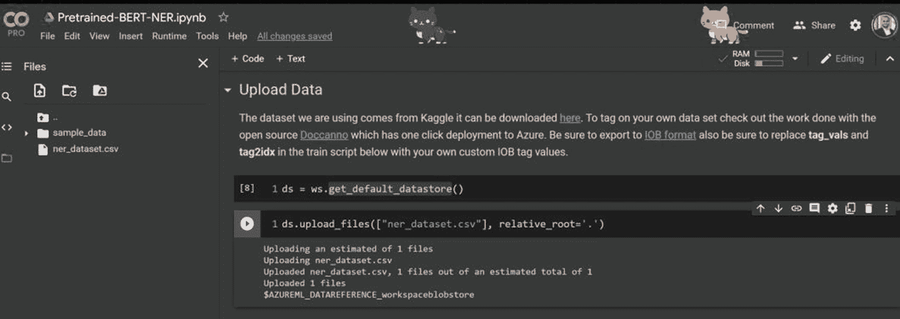

图 4-34

上传数据集

下一步是使用这个 NER 数据集并对模型进行微调。你需要完成一些数据工程步骤，例如替换标签值和分词。你将使用 `BertForTokenClassification` 类进行词元级别的预测，作为微调模型，它封装了实际的 `BertModel` 并添加了词元级别的分类器。笔记本会创建 `train.py` 文件，用于训练模型（如图 4-35 所示）。

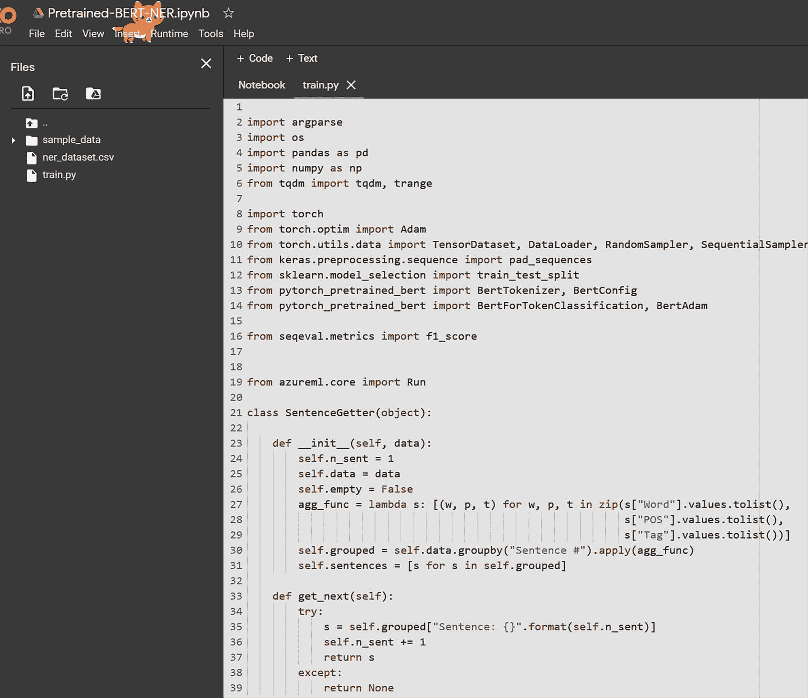

图 4-35

为 BERT 微调训练 Python 文件

现在你有了训练文件，接下来创建一个 Azure ML 实验^(⁸)，将 `train.py` 作为入口脚本的参数（该脚本用于运行实验）。见图 4-36。

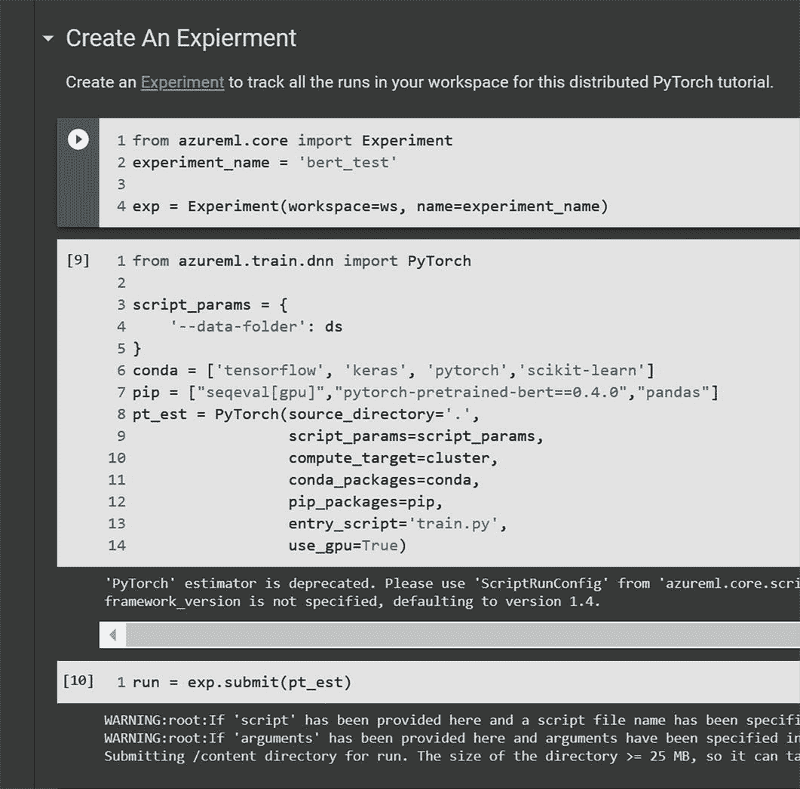

图 4-36

创建实验以微调模型

你可以在 Azure 机器学习控制台的“实验”选项卡中跟踪正在运行的实验。见图 4-37。

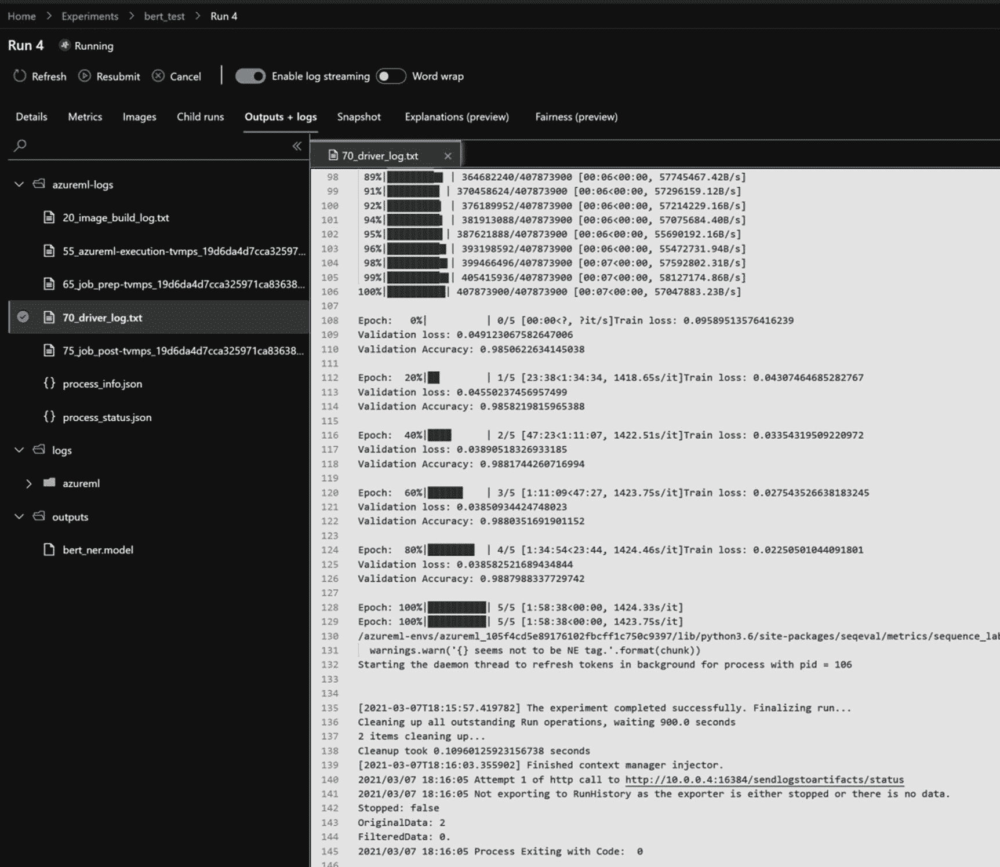

图 4-37

正在运行的训练实验，用于微调模型

实验完成后，服务可以部署到 ACI 中并进行调用。现在你可以看到这个新微调模型产生的命名实体识别结果（如图 4-38 所示）。

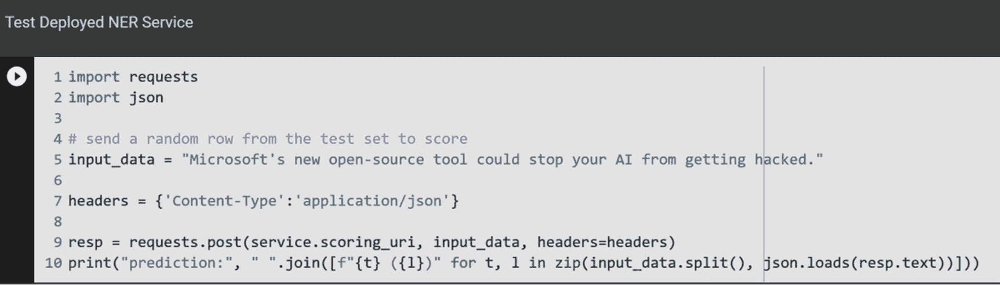

图 4-38

测试已部署的 NER 服务

文本通过服务进行处理，识别出的实体被标识并显示出来。见图 4-39。

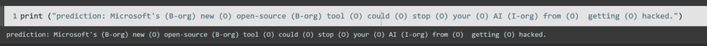

图 4-39

已部署的 NER 服务的结果

以上简要概述了如何在 Azure ML 中使用 Transformer 模型、微调模型、部署和调用服务以获得期望结果。你可以在 [`https://docs.microsoft.com/azure/machine-learning/how-to-configure-environment`](https://docs.microsoft.com/azure/machine-learning/how-to-configure-environment)（微软文档）找到关于如何设置 Python 环境（用于 Azure 机器学习）的详细说明。

在下一节中，我们将讨论非结构化文本和模型如何在整个生态系统中使用，并深入探讨一些相关的用例。

认知服务和语言模型在应用生态系统中被广泛用于构建智能应用程序。微软学习工具（也称为数字学习工具）利用这些能力服务于教育领域。例如，微软沉浸式阅读器^(⁹) 利用了 Azure 文本分析功能，包括全面的自然语言分析（用于情感、关系、趋势等）。

文本分析服务被描述为*“一种 AI 服务，能够揭示非结构化文本中的洞察，如情感分析、实体、关系和关键短语。”* 它提供了广泛的功能，例如广泛的实体提取、情感分析、语言检测和灵活的部署。文本分析服务主页见图 4-40。

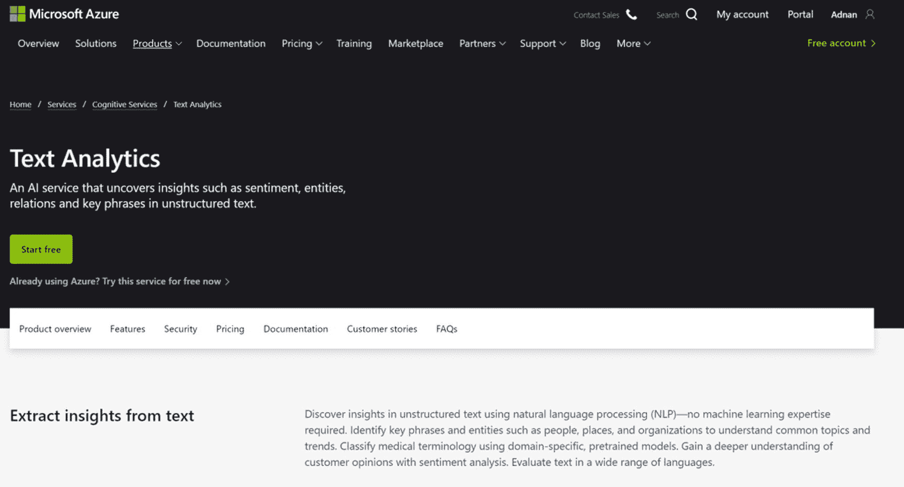

图 4-40

文本分析服务主页

文本分析服务可在云端、本地以及作为边缘部署使用，这使其成为满足各种不同企业需求的优秀工具。例如，你可以将其作为容器在本地使用。关于安装和运行文本分析容器的详细信息，请参阅微软文档^(¹⁰)。

该服务的开源替代方案是通过使用 `spaCy`、`NLTK` 和 `CoreNLP` 等库进行自定义训练的模型，或使用 Hugging Face、OpenAI 等云提供商来实现。然而，使用文本分析服务可以分离实现细节，帮助你进行抽象工作。无需微调自定义模型来识别和分类重要概念，你可以利用广泛的预构建实体和数百个个人身份信息（PII）数据元素，包括受保护的健康信息（PHI）。你可以提取相关短语、主题模型、客户情感分析和医疗数据（用于健康的文本分析目前处于预览阶段^(¹¹)）。

## 语言 API 总结

在本章中，我们探讨了围绕语言 API 的一些关键概念及其在处理非结构化文本和模型方面的用途。我们通过示例演示了如何使用 Azure 认知服务和 Azure 机器学习构建一个全面的搜索引擎。我们还研究了 Transformer 模型以及如何使用 Azure 机器学习对其进行微调。

在下一章中，我们将继续这些主题，探索语音和语音服务，作为你认知服务之旅的下一步。

脚注 1   2   3   4   5   6

