# 5. 语音 – 与你的应用程序对话

在上一章中，我们了解了如何使用文本模型从非结构化数据构建丰富的文本和智能搜索应用程序。在本章中，我们将为认知计算工具包增加一项能力——如何理解用户的请求并通过语音处理这些请求。为了扩展这项技能，你将看到如何通过语音获取用户输入、创建自定义输入事件，并与用户进行交互。

在沟通中，互动是人类的重要行为之一。借助沟通，你可以描述你所看到和使用的事物。沟通可以是口头的，也可以是非口头的，但无论哪种方式，其目的都是相同的。你的语音在描述和传达你的话语中扮演着重要角色。如果你的语音表达方式能让听众理解，那么你的口头沟通就是完美的。同样，你的非口头沟通主要依赖于文本。你的文本应该精确且易于理解。

在现实场景中，为了在非口头沟通（文本）中完美地传达所有需要表达的内容，人们需要克服许多障碍。而其他人则可以通过口头沟通（语音）更轻松地做到这一点。

本章旨在通过评估和翻译文本与语音（反之亦然）来提供对语音服务的深入理解。我们还将构建一个全面的示例，提供认知能力，例如麦克风输入的语音识别、文件输入的连续识别、自定义模型、拉取和推送音频流、关键词识别、麦克风输入的翻译、文件输入和音频流、意图识别、语音合成、关键词识别、语言检测等等。所有这些能力都可以应用于各种企业用例中。

本章将涵盖以下主题：

- 理解语音和语音服务
- 语音转文本 – 将口语音频转换为文本以进行交互
- 使用 LUIS 和 Speech Studio 进行认知语音搜索
- 使用 Speech Studio 自定义关键词
- 语音 API 总结

## 理解语音和语音服务

作为人类，我们拥有特殊的能力，其中之一就是通过发出声音来表达我们的思想和感受，解释特定的工作和任务。这些声音可以是任何形式，如声乐、词语或歌曲。任何被归类为语言声音的内容都可以被翻译成任何语言以便理解。这就是我们所说的*语音*。语音的目的是与听众建立联系或沟通，以传递特定的信息。信息可能因地而异。（例如，在教室里，老师的信息与她的或他的学生所学的科目相关。）同样，当我们在软件开发中谈论应用程序时，它必须直接与其用户进行沟通。这种沟通可以通过语音（语音）或文本进行。

Microsoft Azure 认知服务借助 API 和 Azure 语音服务，提供了开发智能应用程序的功能。

### 全面的隐私与安全^(¹²)

- 语音服务是 Azure 认知服务的一部分，已获得 SOC、FedRAMP、PCI DSS、HIPAA、HITECH 和 ISO 的[认证](https://docs.microsoft.com/en-us/microsoft-365/compliance/offering-home%253Fview%253Do365-worldwide)。
- 你的数据仍然属于你。在音频处理过程中，你的音频输入和转录数据不会被记录。
- 你可以随时查看和删除你的自定义语音数据和模型。你的数据在存储期间是加密的。
- 在 Azure 基础设施的支持下，语音服务提供企业级的安全性、可用性、合规性和可管理性。

**Microsoft Azure 推出了语音服务，该服务也取代了必应语音 API 和翻译器语音。**

Azure 认知服务提供了以下工具来开发支持语音的智能应用程序：

- Azure 语音 CLI – [`https://docs.microsoft.com/en-us/azure/cognitive-services/speech-service/spx-overview`](https://docs.microsoft.com/en-us/azure/cognitive-services/speech-service/spx-overview)
- 认知服务 Speech Studio – [`https://speech.microsoft.com/`](https://speech.microsoft.com/)
- 语音设备 SDK – [`https://docs.microsoft.com/en-us/azure/cognitive-services/speech-service/speech-devices-sdk-quickstart`](https://docs.microsoft.com/en-us/azure/cognitive-services/speech-service/speech-devices-sdk-quickstart%253Fpivots%253Dplatform-android)
- 语音服务 API – [`https://docs.microsoft.com/en-us/azure/cognitive-services/speech-service/overview#reference-docs`](https://docs.microsoft.com/en-us/azure/cognitive-services/speech-service/overview%2523reference-docs)

### 入门指南

如果你想开始使用或尝试语音服务，可以通过免费账户按照以下步骤进行尝试：

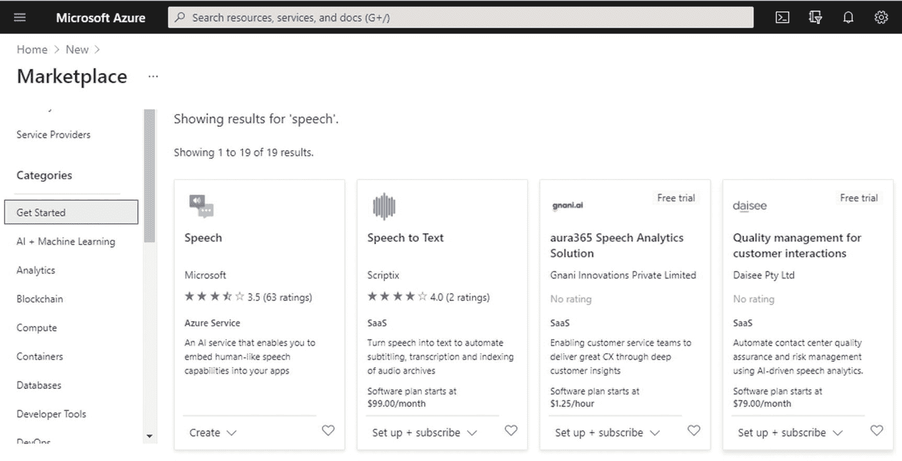

图 5-1：为语音服务创建新资源

1. 如果你没有 Azure 账户，可以创建一个免费账户：[`https://azure.microsoft.com/en-in/free/`](https://azure.microsoft.com/en-in/free/)。
2. 登录 Azure 门户：[`https://portal.azure.com/`](https://portal.azure.com/)。
3. 在搜索文本框中，搜索“Speech”。
4. 选择“Speech”服务，然后点击**创建**以创建新资源（如图 5-1 所示）。

### 将语音实时翻译到你的应用程序中

Azure 认知服务由世界一流的模型部署技术支持，该技术由顶级专家构建。有许多计划和优惠供你使用即用即付模式，而不是投资于你可能需要的开发和基础设施（如果你选择开发和托管自己的模型）。

Azure 市场是一个一站式获取所有服务的地方。一旦你点击**添加**或**创建认知服务**（如图 5-2 所示），你将被引导至 Azure 市场。

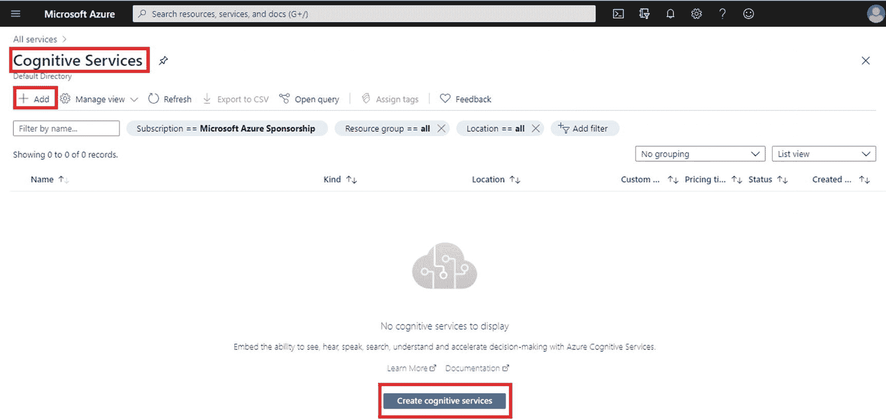

图 5-2：添加/创建认知服务

在开始使用 Azure 语音服务之前，让我们先了解一些重要的注意事项。由于频繁的更新、新区域和语言的添加，本书出版后你的环境可能会变得不同步。因此，我们提供了以下链接，这些链接将提供最新的信息：

- 语言、语音支持 – [`https://docs.microsoft.com/en-us/azure/cognitive-services/speech-service/language-support`](https://docs.microsoft.com/en-us/azure/cognitive-services/speech-service/language-support)
- 服务可用性（按区域） – [`https://docs.microsoft.com/en-us/azure/cognitive-services/speech-service/regions`](https://docs.microsoft.com/en-us/azure/cognitive-services/speech-service/regions)
- 定价 – [`https://azure.microsoft.com/en-us/pricing/details/cognitive-services/speech-services/`](https://azure.microsoft.com/en-us/pricing/details/cognitive-services/speech-services/)

### 语音转文本 – 将口语音频转换为文本以实现交互

在第一个示例中，我们将了解如何使用适用于 Windows 的 .NET Framework 在 C# 中转录对话。请按照以下步骤操作：

从认知服务语音 SDK 仓库克隆对话转录仓库（`https://github.com/Azure-Samples/cognitive-services-speech-sdk/tree/master/quickstart/csharp/dotnet/conversation-transcription`）。参见图 5-3。然后，在您的系统中导航到相应的文件夹（`cognitive-services-speech-sdk/quickstart/csharp/dotnet/conversation-transcription/`）。

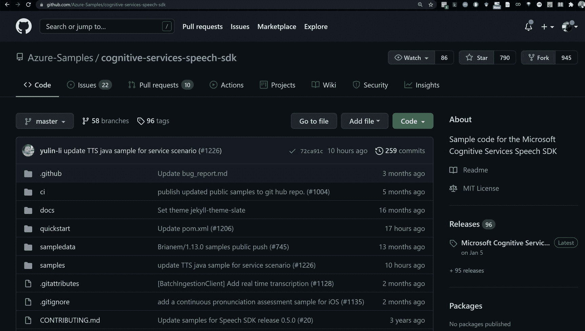

图 5-3

克隆语音 SDK GitHub 仓库

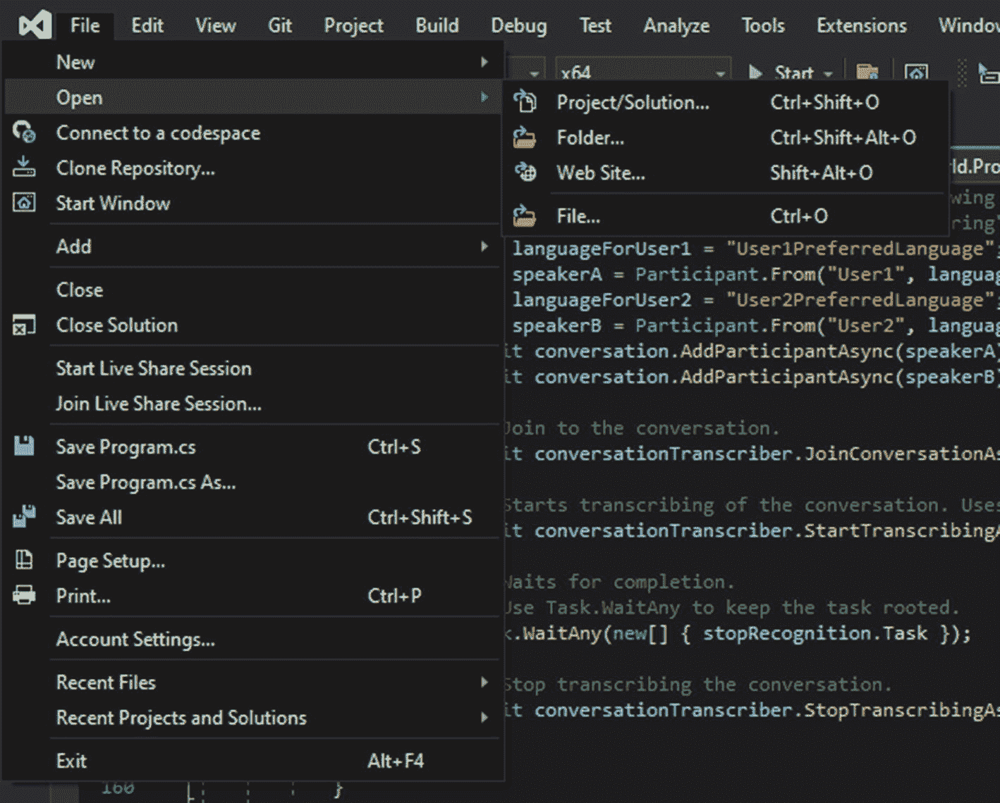

图 5-4

Visual Studio – 从路径打开解决方案

1. 打开 Visual Studio，然后从克隆的路径（`quickstart/csharp/dotnet/conversation-transcription`）打开解决方案文件。参见图 5-4。

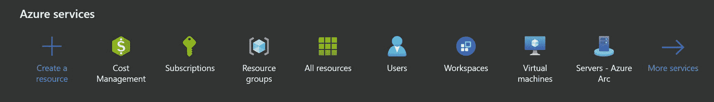

图 5-5

Azure 服务 – 创建资源

1. 打开 Azure 服务控制台，然后点击**创建资源**（如图 5-5 所示）。

从市场中选择**语音**，然后点击 Microsoft 提供的**语音**资源。参见图 5-6。

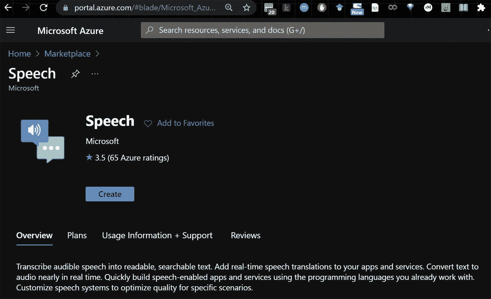

图 5-6

Azure 服务 – 从市场创建语音资源

接下来，点击**创建**按钮继续。然后，添加所需的服务参数，例如名称、订阅、位置、定价层和资源组（如图 5-7 所示）。

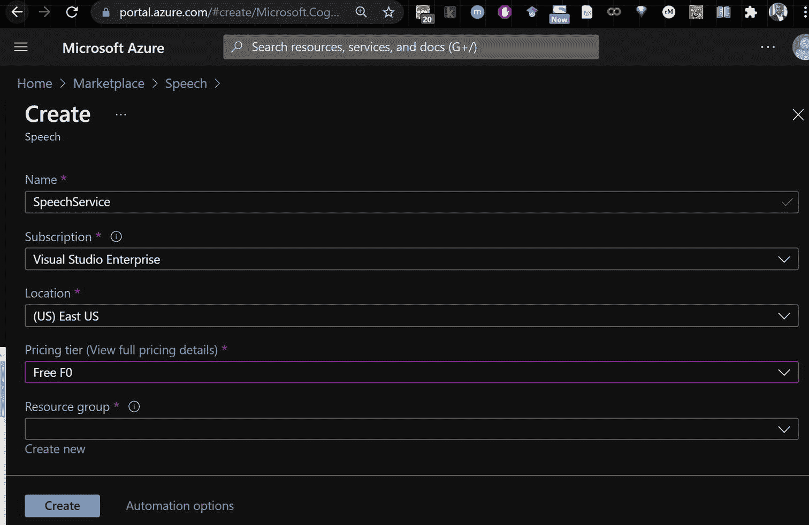

图 5-7

Azure 服务 – 提供所需信息

点击**创建**继续。这将部署该服务。您将看到部署开始的提示，如图 5-8 所示。

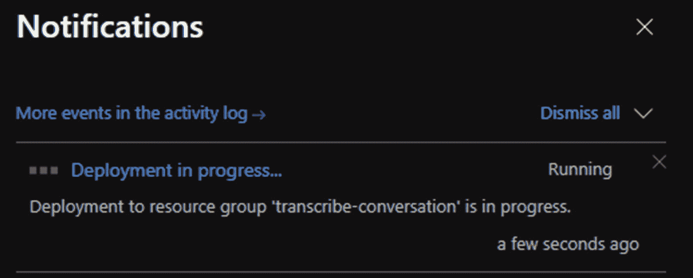

图 5-8

Azure 服务 – 语音部署进行中

部署完成后，您将看到密钥和相应的终结点，如图 5-9 所示。

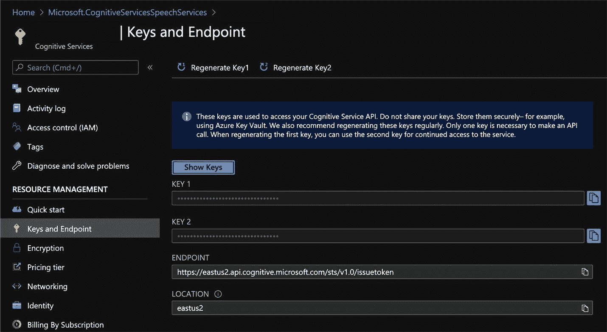

图 5-9

Azure 语音服务 – 密钥和终结点

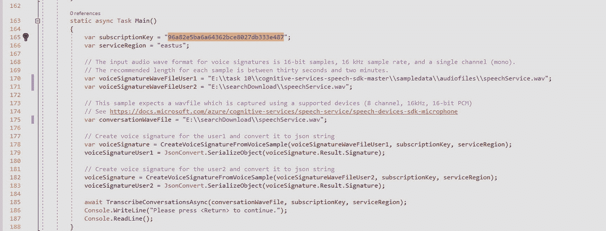

图 5-10

Azure 语音服务 – 填充密钥和服务区域

1. 您可以从此页面复制密钥和服务区域（位置）。然后，使用它替换打开目录中解决方案文件中的标签（如图 5-10 所示）。

编辑 `Program.cs` 源文件，然后替换 `YourSubscriptionKey` 和 `YourServiceRegion` 的值、首选语言，并添加一个用于语音签名的 WAV 文件示例。参见图 5-11。

**图 5-11** Azure 语音服务 – 填充密钥和服务区域

> *不建议在代码中直接使用密钥。安全的方式是使用密钥保管库或系统变量。*

此语音签名样本用于检测到的语音。每个样本的建议长度为三十秒到两分钟。认知服务期望一个 `.wav` 文件，该文件应使用支持的设备（8 通道、16kHz、16 位 PCM）捕获。要创建此 WAV 文件，请打开 Windows 语音录音机或您选择的音频录音机。此处，我们使用的是 Windows 语音录音机，如图 5-12 所示。

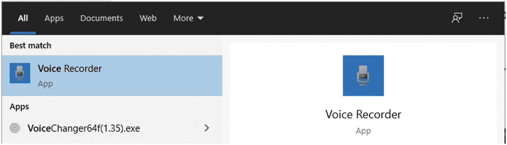

**图 5-12** 打开 Windows 语音录音机

开始录制用户 1 的语音。然后，单独录制用户 2 的语音。这为语音服务提供了您用户语音的签名。见图 5-13。

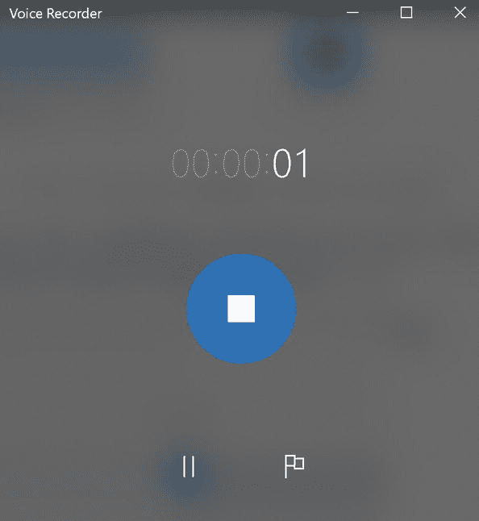

**图 5-13** 录制对话的音频文件

您也可以录制一个用户 1 和用户 2 之间的单一对话文件。我们录制的三个音频文件见图 5-14。

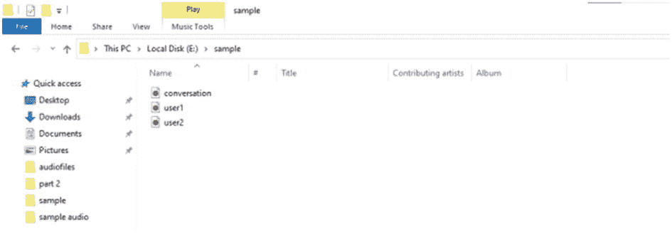

**图 5-14** 录制的音频文件

此时，我们有了三个 `.wav` 文件。如果您按照给定的规格^((13))创建了语音，则将文件路径放入程序并继续构建。否则，请按照以下步骤获取正确格式的文件。

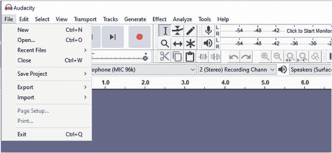

**图 5-15** 在 Audacity 中打开文件

1.  打开 Audacity^((14)) 并导航到您录制的 `.wav` 文件。见图 5-15。Audacity 是一款免费、开源、跨平台的音频软件，可用于将音频文件转换为多种格式。

如图 5-16（通过红色箭头所示）所示，我们录制的文件不符合要求的规格。因此，我们需要修改格式。

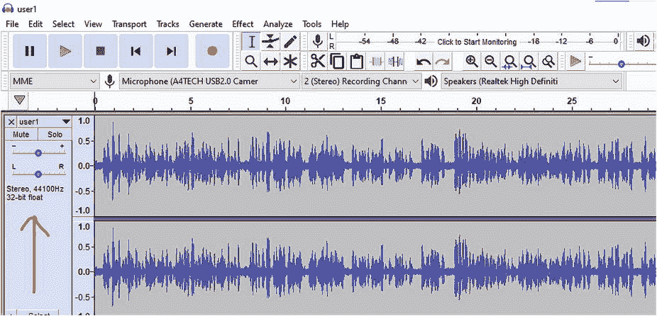

**图 5-16** Audacity 中的格式详情

要编辑文件格式，右键单击音轨，选择**格式**，然后将其更改为**16 位 PCM**（如图 5-17 所示）。

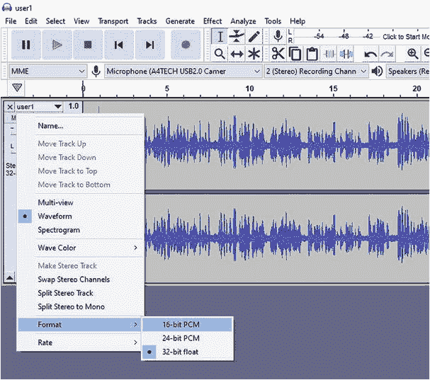

**图 5-17** 在 Audacity 中更改格式

同时，更改采样率。右键单击音轨，选择**采样率**，然后点击**16000 Hz**（如图 5-18 所示）。

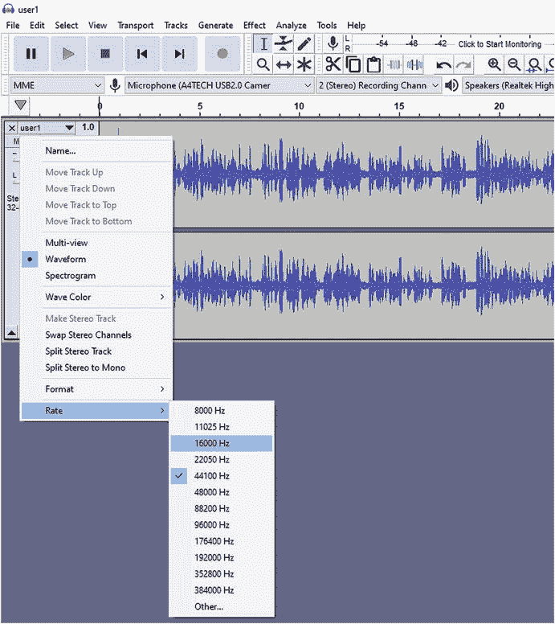

**图 5-18** 在 Audacity 中更改采样率

接下来，要将文件从立体声转换为单声道，在顶部文件菜单中，点击**音轨**，选择**混音**，然后点击**将立体声混音为单声道**。见图 5-19。

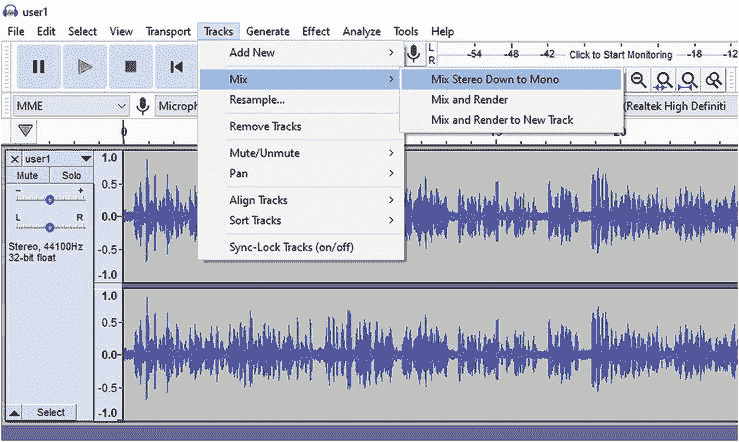

**图 5-19** 在 Audacity 中更改混音

此时，文件将如图 5-20 所示。

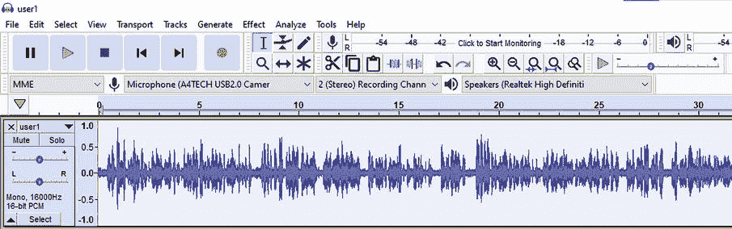

**图 5-20** Audacity 中的文件格式更改

接下来，将文件导出为 WAV 格式，然后保存到您选择的目录。点击**文件**、**导出**，然后**导出为 WAV**（如图 5-21 所示）。之后，会出现一个新的对话框。

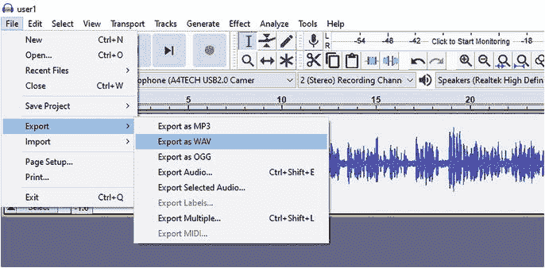

**图 5-21** 导出为 WAV 文件

打开**高级混音选项**^((15))，然后将输出通道滑块拖到 8，如图 5-22 所示。

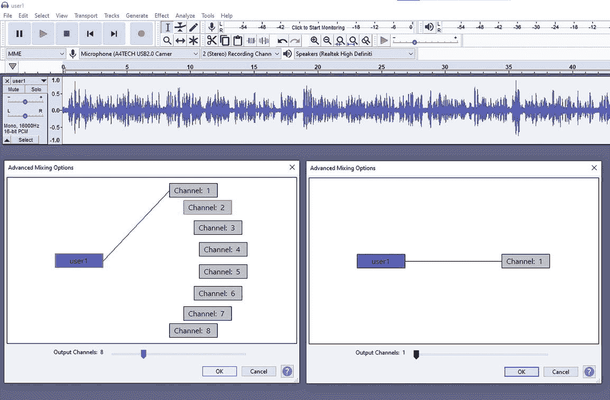

**图 5-22** 高级混音选项

将所有通道链接到用户 1，通道 8 除外（如图 5-23 所示）。然后点击**确定**。对您录制的对话文件执行相同步骤，以满足规格要求。

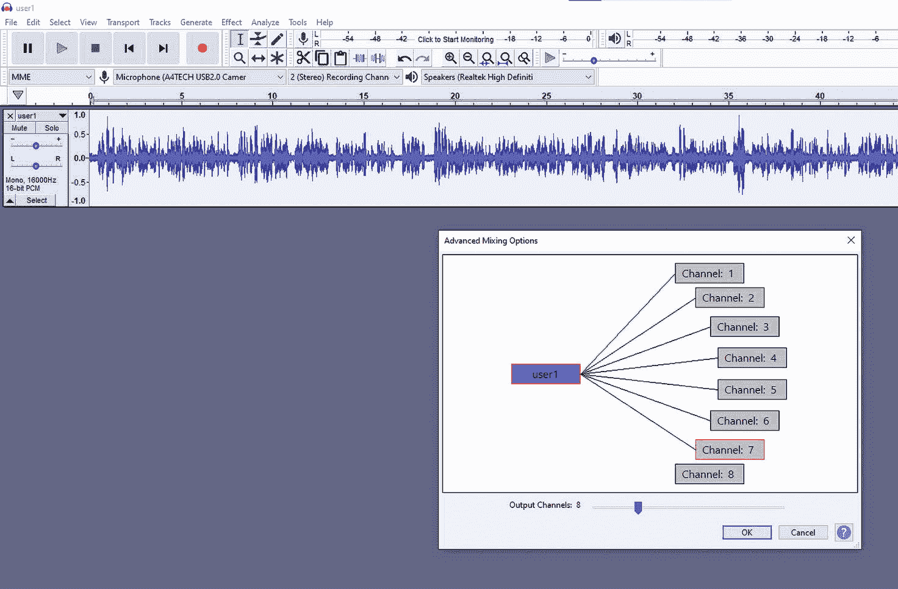

**图 5-23** 链接通道

接下来，在配置文件中，相应地添加文件路径，如图 5-24 所示。

**图 5-24** 修改配置文件

点击**启动**按钮以构建并运行项目（如图 5-25 所示）。

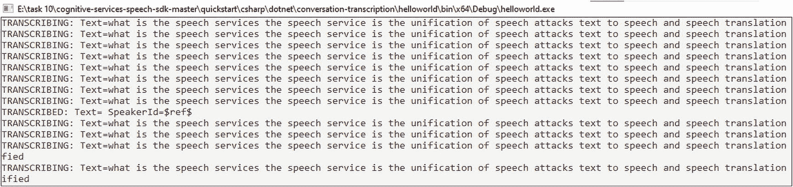

**图 5-25** 程序运行并转录文本

成功构建并执行程序后，将打开一个控制台窗口，显示您录制的音频文件中存在的转录文本。

此转录有许多实际应用，从将呼叫中心录音转换为用于分析的文字数据，到创建视频字幕。您可能已经见过并使用过 Microsoft Teams、Skype 和 Zoom，它们基于音频对话创建用于记笔记的字幕。这些转录并非完美无缺，但确实在变得越来越好。想象一下，通过将文本 API 的情感分析与语音转录相结合，进行实时升级分析。这难道不是分析如何处理愤怒客户来电、以提供最佳客户体验的绝佳方式吗？

既然您已经知道如何使用语音 SDK 和 Azure 认知服务在您自己的应用程序中创建语音解决方案，那么您想解决什么业务问题呢？可能性是无限的。

### 使用 LUIS 和 Speech Studio 进行认知语音搜索

在前一个示例中，您学习了如何转录音频文件。在本示例中，我们将使用自定义语音与微软 LUIS（语言理解）服务，构建一个支持语音的应用程序。请按照以下步骤操作：

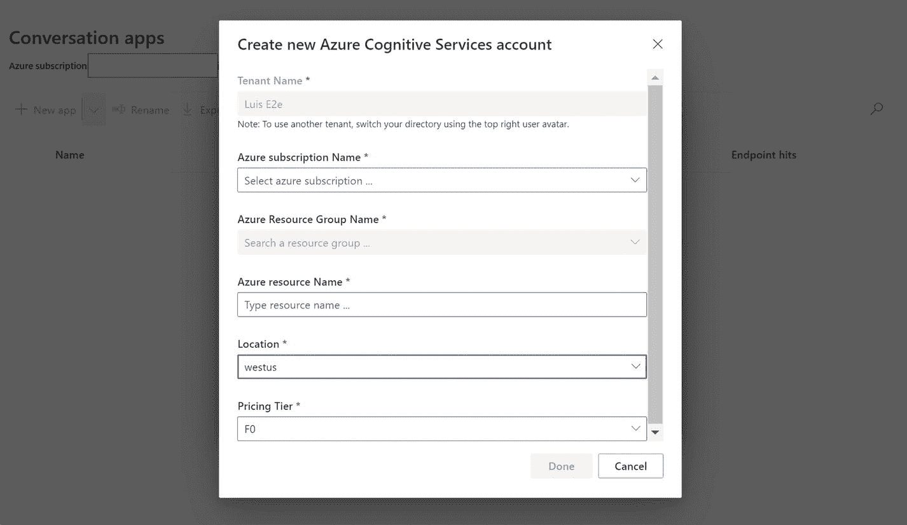

图 5-26：创建新的 Azure 认知服务帐户

1.  从市场创建语音资源，如前面示例的步骤 2 所示。我们已经多次执行此操作，希望您对此已非常熟悉。在此，我们将重用前面示例步骤 1 中克隆的 GitHub 仓库。

2.  启动 Visual Studio，然后选择 **文件** ➤ **打开** ➤ **项目/解决方案**。导航到包含此示例的文件夹，然后选择其中的解决方案文件。这应该是标准路径（`cognitive-services-speech-sdk`/`samples`/`csharp`/`dotnet-windows`/`console/`）。

3.  导航到 `intent_recognition_samples.cs`，然后创建一个 Azure 认知服务帐户（见图 5-26）。LUIS 是认知服务的一部分，被称为“基于机器学习的服务，用于将自然语言构建到应用、机器人和物联网设备中”。作为一种企业级且可扩展的服务，LUIS 提供了一种快速高效的方式，为您的应用程序添加语言功能。登录 `LUIS.AI` 后，您需要创建一个新的 Azure 认知服务帐户。

填写详细信息以完成该过程。此时，您将看到 Azure 帐户创建和相应资源创建的通知，如图 5-27 所示。

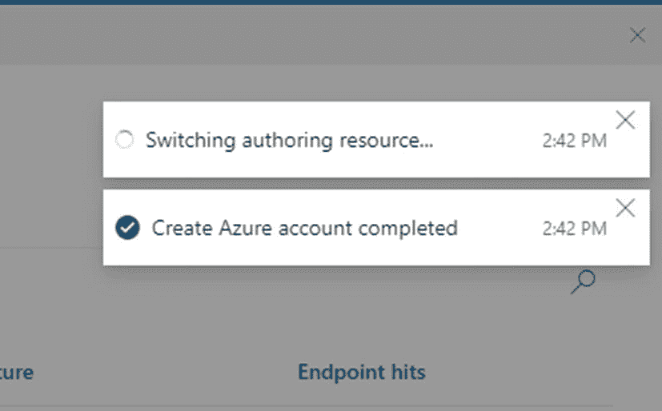

图 5-27：Azure 认知服务帐户通知

完成后，继续进行对话应用创作服务控制台的操作，如图 5-28 所示。接下来，您将创建一个新应用。

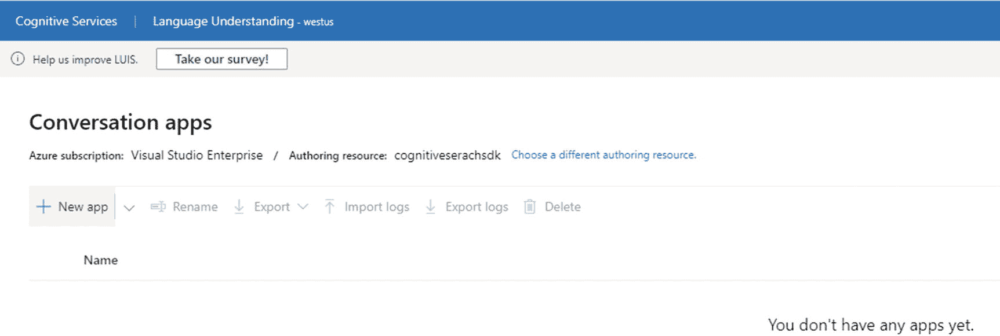

图 5-28：LUIS 对话服务应用控制台

点击 **新建应用** 按钮，创建一个名为 `search service` 的新应用，该应用将包含实例名称、订阅密钥和应用 ID。见图 5-29。

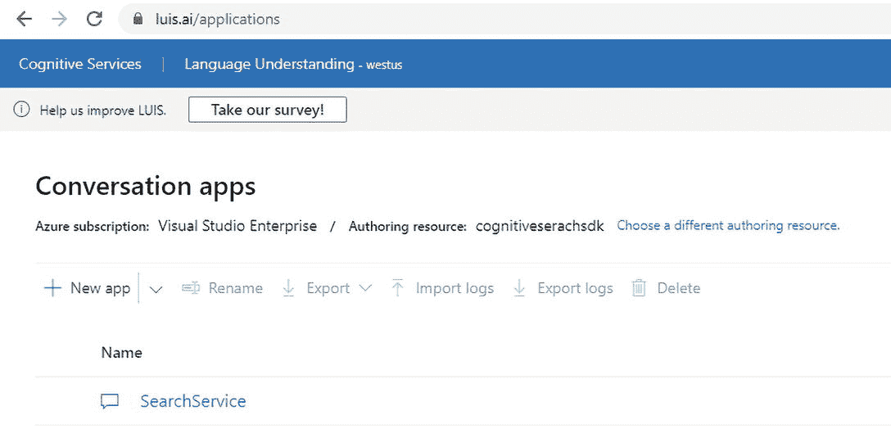

图 5-29：LUIS 对话服务 – 创建新应用

接下来，您将创建一个名为 `SearchService` 的对话应用，如图 5-30 所示。双击 `SearchService` 将其打开，然后点击 **创建新意向** 来创建一个新意向。此时会弹出图 5-30 中的对话框。*意向* 是用户在 *话语* 中提及要执行的任务或操作，例如，点咖啡、查看发货状态等。LUIS 使用 `None` 意向作为回退，并附带预构建的域，这些域提供了带有话语的已知意向。

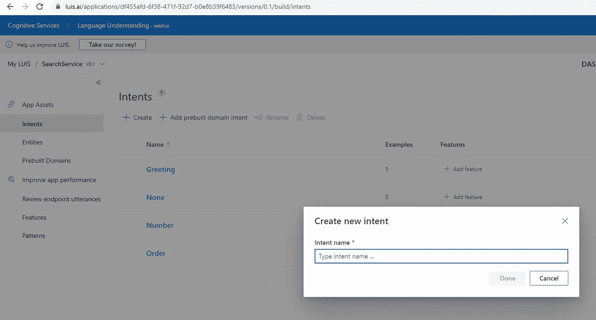

图 5-30：LUIS 对话服务 – 创建新意向

接下来，转到已创建的意向，并添加一个示例用户输入，如图 5-31 所示。

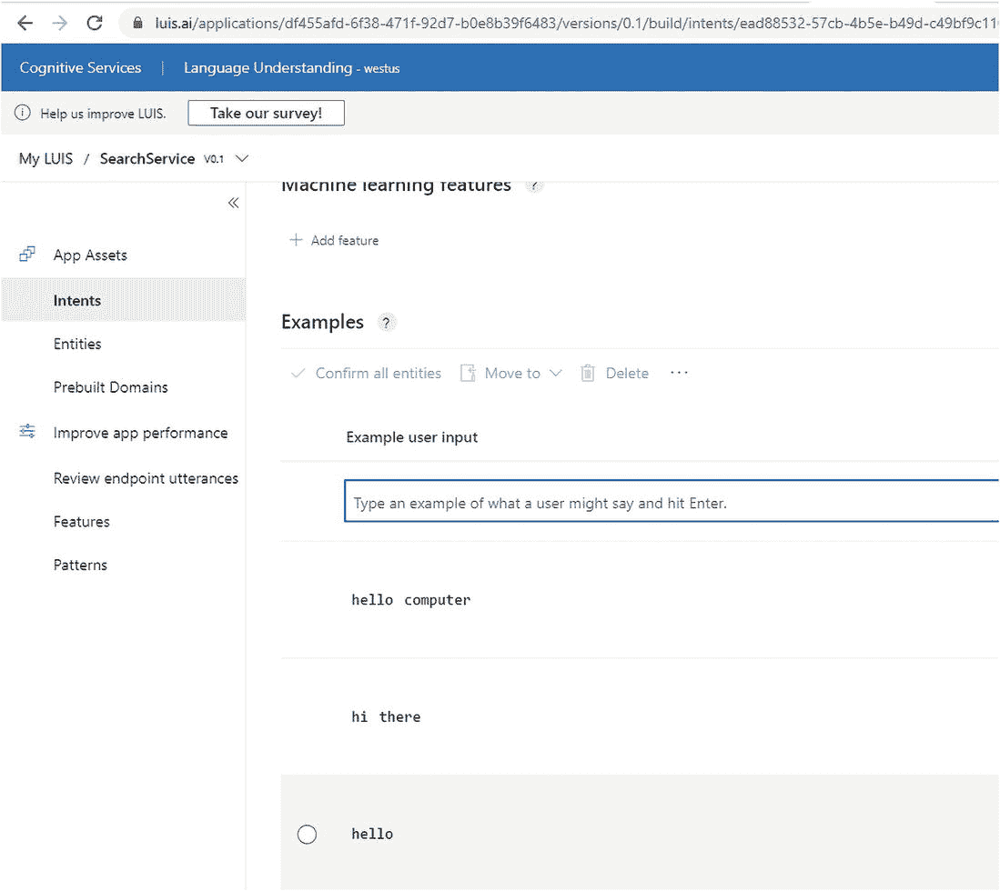

#### 图 5-31
LUIS 对话服务 – 创建自定义用户输入

此时，我们已拥有[语言理解服务 (LUIS)](https://aka.ms/csspeech/luisdocs) 的密钥，用于填充解决方案文件。您可以点击**管理**选项卡查看这些密钥（如图 5-32 所示）。

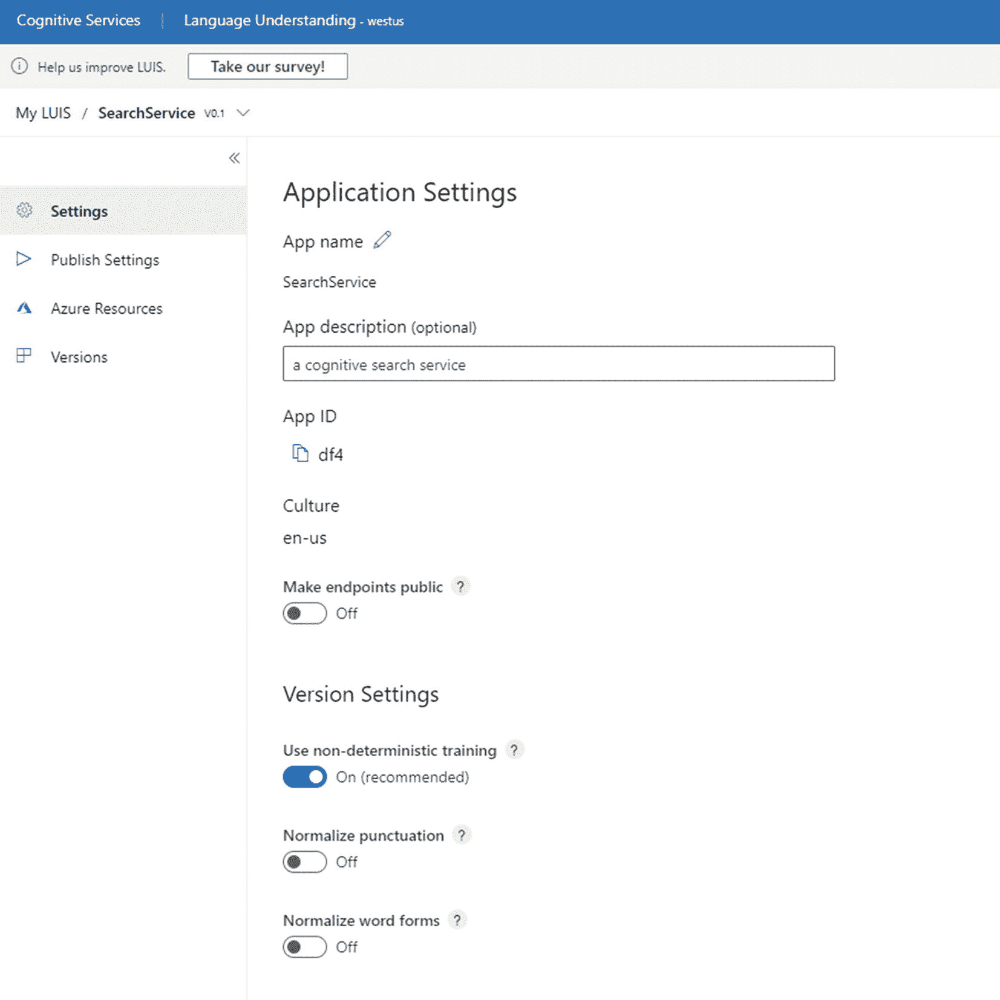

#### 图 5-32
LUIS 对话服务 – 应用程序设置和应用程序 ID

接下来，打开 `intent_recognition_samples.cs` 文件，并替换密钥 `YourSubscriptionKey`、`YourServiceRegion`、`YourLanguageUnderstandingSubscriptionKey` 和 `YourLanguageUnderstandingServiceRegion`。您还需要将意图名称（例如 `YourLanguageUnderstandingIntentName1`、`YourLanguageUnderstandingIntentName2` 和 `YourLanguageUnderstandingIntentName3`）替换为 LUIS 识别的意图名称。要查找并替换这些密钥，请在顶部菜单中点击**编辑**，然后点击**查找和替换**。参见图 5-33。

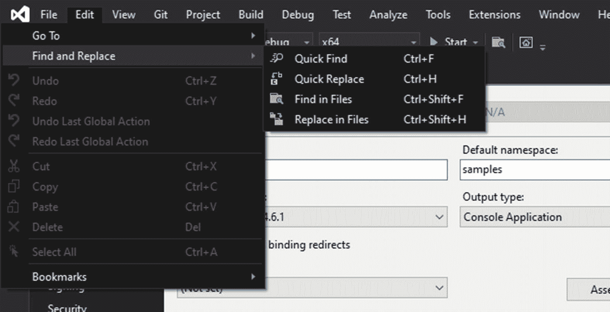

#### 图 5-33
在 Visual Studio 项目中替换密钥

最后需要考虑的是关联模型（例如 `YourKeywordRecognitionModelFile.table`）。您需要将其替换为您的关键词识别模型文件的位置。下一步，我们将了解如何从 Speech Studio 获取该表文件。同时，将 `YourKeyword` 触发器替换为来自您关键词识别模型的短语。

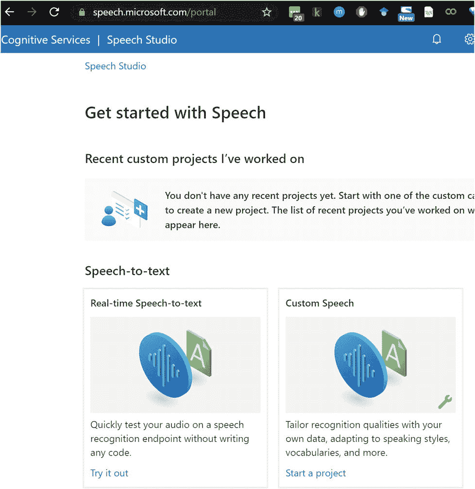

#### 图 5-34
Speech Studio 门户

1.  为了获取 `YourKeywordRecognitionModelFile.table` 文件，请访问 `speech.microsoft.com`。参见图 5-34。

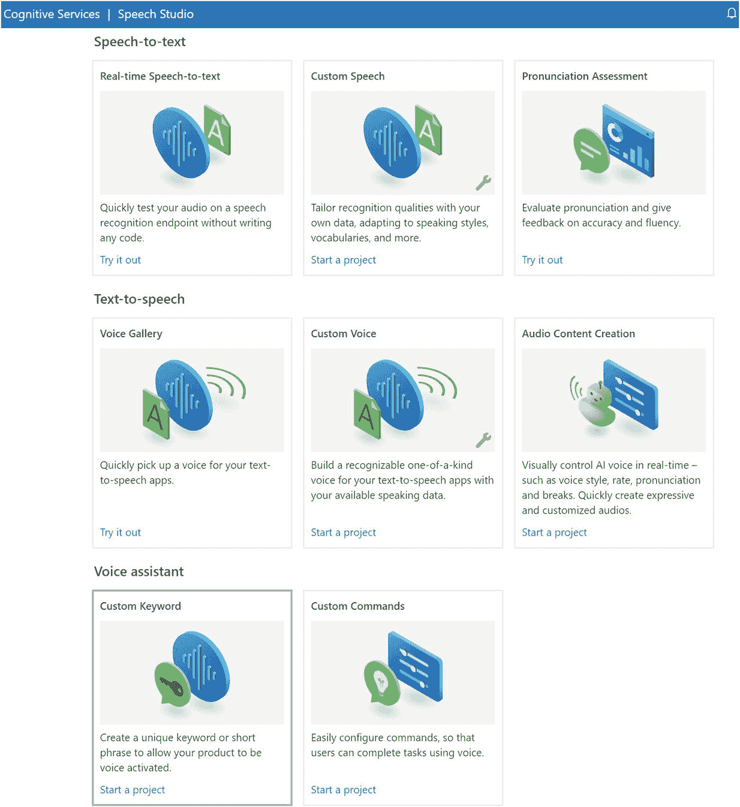

#### 图 5-35
Speech Studio 功能

2.  登录 Speech Studio，然后点击**自定义关键词**，如图 5-35 所示。

自定义关键词是一项语音助手功能，用于选择关键词识别。点击**新建项目**以创建一个新项目（如图 5-36 所示）。

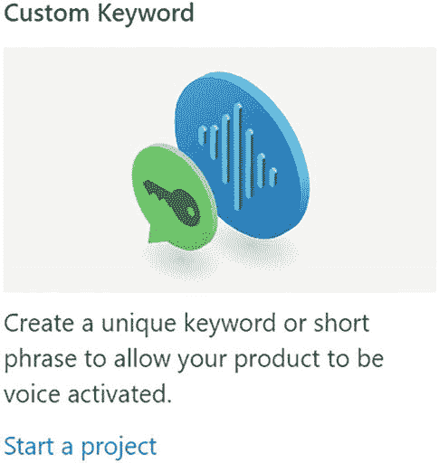

#### 图 5-36
Speech Studio – 自定义关键词项目

将新项目命名为 **MyKeyboard**，然后使用关键词“Hello Computer”填充新模型（如图 5-37 所示）。

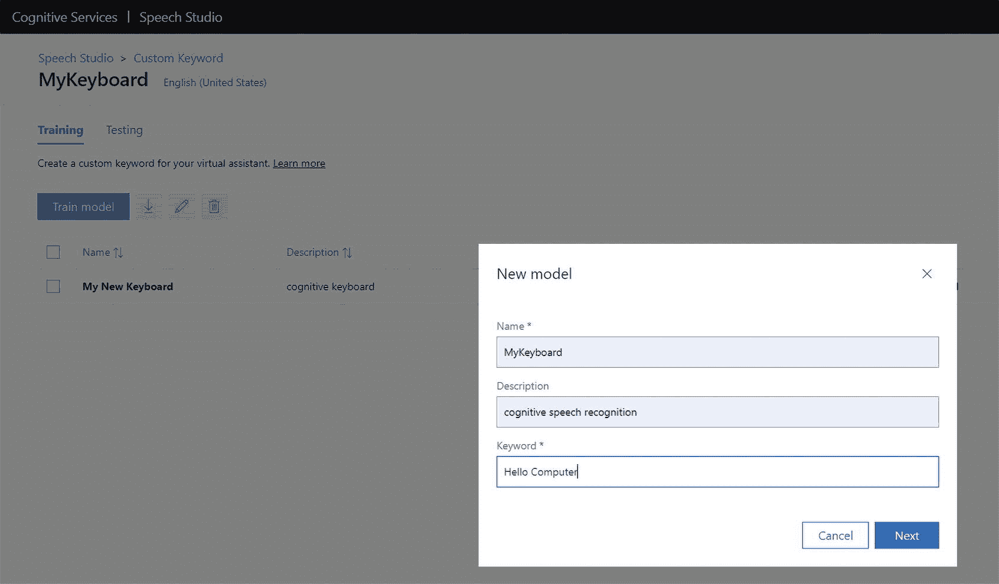

#### 图 5-37
Speech Studio – 自定义关键词训练模型

添加详细信息以创建项目。添加您的关键词及其关联发音。聆听关键词的不同发音，然后勾选最合适的文件。接下来，点击**训练**。参见图 5-38。

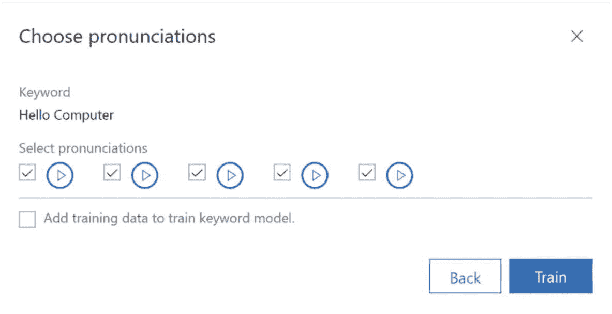

#### 图 5-38
Speech Studio 训练

训练完成后，您可以下载模型表文件（如图 5-39 所示）。

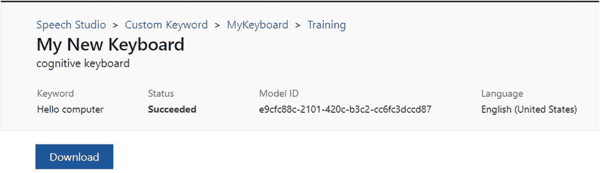

#### 图 5-39
Speech Studio – 下载训练文件

此时，下载 `YourKeywordRecognitionModelFile.table` 文件，然后将该标签替换为下载文件的位置。参见图 5-40。

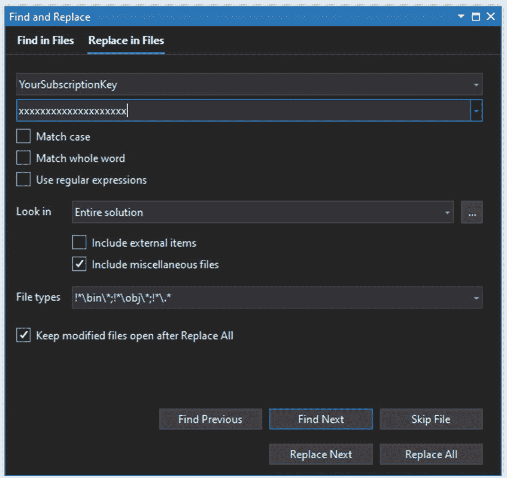

#### 图 5-40
使用订阅值替换标签

对于前面提到的标签，只需使用 Visual Studio 中的查找和替换选项。逐一将所有标签替换为相应的值。

在所有标签都被替换为正确的值后，点击**启动**按钮来构建项目。运行项目后，您将看到如图 5-41 所示的选项列表。

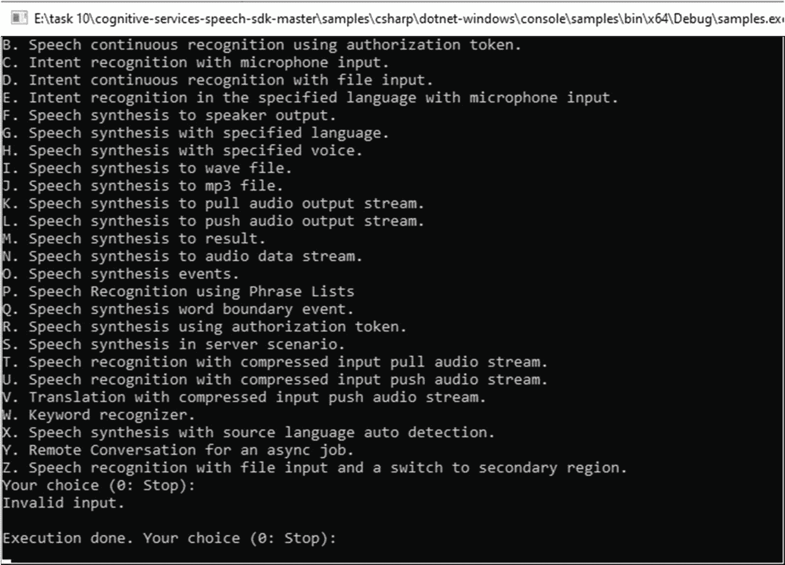

#### 图 5-41
使用 LUIS 运行语音应用程序

最终构建将打开一个窗口，其中包含不同的选项，用于选择并通过使用 Speech 服务和 LUIS 执行相应的操作。此示例提供了全面的功能枚举，例如：使用麦克风输入的语音识别、使用文件输入的连续识别、使用自定义模型、拉取和推送音频流、关键词识别、使用麦克风输入的翻译、文件输入和音频流、意图识别、语音合成、关键词识别、语言检测等等。

## Speech API 总结

在本章中，我们使用了 Azure 认知服务 Speech API。我们回顾了几种使用 Speech 服务的方法，这些方法通过语音帮助理解用户并与用户交互，从而使您的应用程序能够与用户对话。

在下一章中，我们将学习如何让应用程序变得足够智能，以便它们能够自行做出决策。这是一个令人兴奋的新世界。敬请期待。

脚注 1 2 3 4

