# 6. 决策 – 在应用程序中做出更明智的决策

决策，决策，决策——是拉差辣椒酱还是塔巴斯科辣酱，雅各布队还是爱德华队，PC 还是 Mac，iPhone 还是 Android，堡垒之夜还是 Apex，可口可乐还是百事可乐，*星球大战*还是*星际迷航*……（好吧，最后一个没什么好争论的，但我们跑题了。）做出决策可能是我们做的最具人性的事情。这些决策基于我们可用的感官信息输入，并结合了一些先验观察、事实、我们的隐性偏见以及大量启发式方法。这种能够决定下一步最佳行动的*认知计算*能力是决策科学中的一个永久性特征。研究和捕捉我们如何做出这些决策的内在技能，需要理解我们如何摄取和处理这些信息。然后我们才能得出结论。

与决策相关的细微差别可以很好地概括为：“我见到它时就知道它。”这是波特·斯图尔特大法官用来描述其淫秽测试的一句开创性名言。保持内容健康，在本章中，我们将了解如何将 API 用于此目的。本章将通过向应用程序添加内容审核功能来提供对决策服务的见解。本章还将涉及一个相对较新的功能——异常检测器。以下是本章的一些显著特点：

1.  理解决策服务和决策 API
2.  创建一个自动内容审核器应用程序
3.  使用个性化服务创建个性化体验
4.  使用异常检测器识别未来问题
5.  使用指标顾问服务探索指标
6.  决策 API 总结

那么，闲话少说，让我们开始吧！

企业决策管理是使用业务规则、领域知识、预测分析和大数据来构建和驱动高效业务流程的艺术与科学。这是一个激动人心的话题，但尽管如此，它超出了本书的范围。


## 决策服务与 API

该服务最初以“Project Custom Decision”之名推出，现已升级并成为 `Personalizer` 服务的一部分，与 `Anomaly Detector`、`Content Moderator` 和 `Metrics Advisor` 共同组成认知服务套件。这段历史小知识之所以重要，是因为做出更明智的决策需要多方面的技能组合。仅靠一个单一的“决策服务”可能并非应对这一复杂学科的最有效方式。因此，我们需要结合不同的技能，例如识别异常值、发现可能具有攻击性、露骨、淫秽或不受欢迎的内容，以及为用户创建量身定制的个性化交互。

决策服务是 Azure 认知服务生态系统中的关键组成部分，该生态系统还在语言、语音、视觉和网络搜索领域提供了强大的功能（正如你在前几章中所见）。目前决策服务家族包括以下成员：

- **异常检测器**  
  用于识别异常值并精确定位可能超出常规行为的认知服务。

- **内容审查器**  
  帮助识别跨多种模态的露骨、淫秽和攻击性内容的认知服务。

- **个性化器**  
  用于构建定制化、个性化且有针对性的体验，并根据个人用户偏好进行优化的服务。

- **指标顾问（撰写本文时处于预览阶段）**  
  专为 AIOps 定制的异常检测核心引擎，例如检测和诊断指标以进行根本原因分析，以及通过时间序列分析发现日志中的问题。

在本章的剩余部分，我们将逐一审视这些服务，并构建演示应用程序，向你展示如何在自有项目中使用它们。

### 内容审查器服务

在当今的数字经济中，规模是关键。所提供的服务必须能够扩展到数百万用户，而不会受到这些人工瓶颈的制约。

沿用“我一看便知”的比喻，如今的互联网规模系统无法依赖人工筛查来审核上传到互联网的每一个视频和图片。像 YouTube 这样的平台每分钟会收到超过 500 小时的视频内容上传，相当于每小时约 30,000 小时的内容量。所需成本和资源使得人工筛查变得不可行。人在回路中（HiTL）是一种将人工交互保留为流程一部分的技术。理想情况下，人工交互仅限于那些真正需要人为干预才能做出决策的例外情况，其余部分则实现自动化。

内容审查是大多数与用户互动的现代网站所必需的组件。一些用例包括：

1.  某组织提供数字银行服务，允许客户上传图片用于定制借记卡。他们需要确保上传的图片不包含任何淫秽或露骨的内容。

2.  在公司内部网络中，同事想上传最新的公司假日派对照片。他们需要确保这些图片适合工作场合。

3.  某组织的应用程序对社交媒体信息流进行审查，这些信息流被导入并显示在员工的定制仪表盘上。它监控 Facebook、Twitter 和 Instagram 上关于公司及相关社交媒体话题标签的帖子，以确保良好的声誉和完全合规。

4.  某组织在线构建客户档案，包含照片和个性化信息。他们还需要确保图片中没有充斥粗俗的短语。

5.  某公司创建了一个电子商务市场，客户可以在其中开设自己的小众店铺并销售产品。他们需要确保上传的图片适合相应的受众群体。

6.  某公司为其潜在客户提供了一个类似 Discord 的聊天室。客户可以分享关于公司产品和服务的实时反馈。公司希望维持良好的秩序并对语言进行审查，以确保不使用任何明显冒犯性的词汇。

7.  某公司创建了一个实景旅游网站，用户可以将他们的 TikTok 冒险视频上传到微站点，这些站点承诺提供真实的体验。公司需要确保这些体验，无论多么真实，都不会成为其小企业潜在的成人内容责任。

还有更多例子，但你应该已经明白了要点。如果没有复杂的认知服务和人工智能的巨大帮助，小企业将处于极大的劣势。假设来说，像 YouTube、Twitter、Instagram 或 Facebook 这样的大公司或许能雇佣一支人工审核员大军来筛选每一个视频，但你无法负担这样做。不过，这没关系，因为 Azure 内容审查器服务可以帮到你。顺便提一下，我们之前提到的那些公司大量使用人工智能和机器学习来执行内容审查，并将人工审核作为第二步流程。其中一些公司还需要处理假新闻；还记得那些推文警告吗？不幸的是，事实核查目前还不是内容审查服务的一部分。

内容审查器服务为这些企业需求提供了答案，并配备了确保安全、积极用户体验的必要工具。该服务附带一个人工审核工具以及图像、文本和视频审查功能，我们将在接下来的章节中探讨这些功能。


#### 动手实践 – 构建内容审核系统

在本节中，我们将使用内容审核服务来演示如何将其集成到你的应用程序中。内容审核服务能够检测文本、图像和视频中的可疑内容，并具备人工审核功能。这是一次对这些功能的动手实践，旨在帮助你将其构建为自身应用的一部分。请按照以下说明操作：

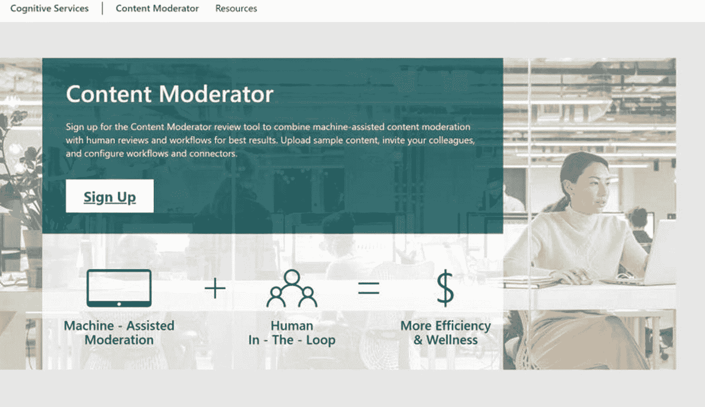

图 6-1

内容审核服务门户首页

1.  开始使用内容审核服务最简单的方法是访问内容审核门户，网址为 [`https://contentmoderator.cognitive.microsoft.com/`](https://contentmoderator.cognitive.microsoft.com/)。

图 6-1 显示了内容审核服务的注册按钮。

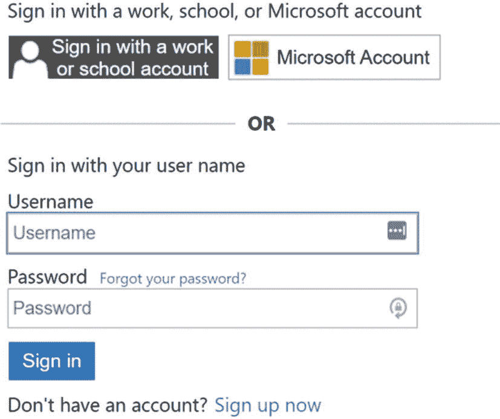

图 6-2

内容审核服务门户登录界面

1.  点击**注册**，你可以使用你的 Microsoft 账户登录，如图 6-2 所示。

该门户专为人工审核而设计，但你也可以看到 API 的响应。登录后的下一步是创建一个审核团队。

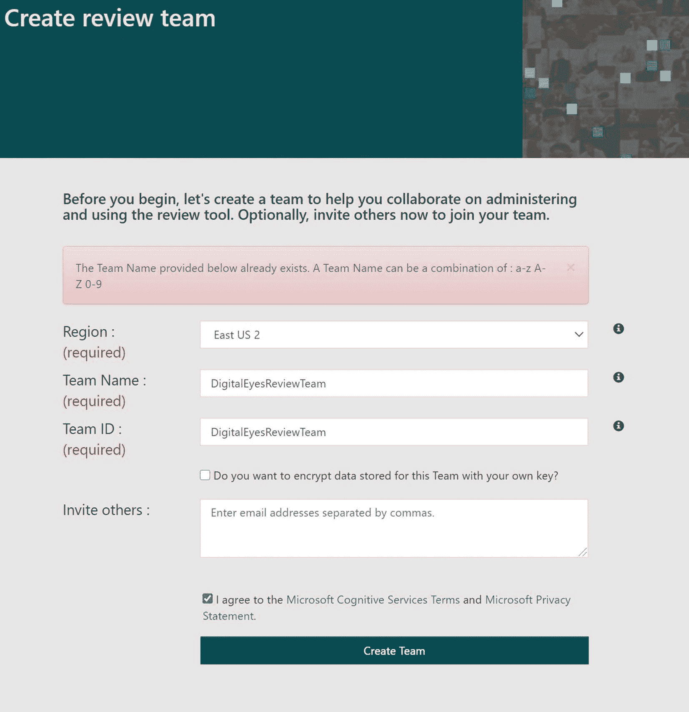

图 6-3

内容审核服务门户创建审核团队界面

1.  通过提供你的区域、团队名称、团队 ID 以及邀请其他审核员来创建一个审核团队，如图 6-3 所示。这些字段的含义一目了然，你之后随时可以添加团队成员。


图 6-4

内容审核服务门户仪表板

1.  创建团队后，你会看到如图 6-4 所示的仪表板。此概览视图显示了已提交的图片、文本和视频审核任务的总请求数，以及所有待处理和已完成的请求。现在，你可以通过从顶部菜单中选择合适的内容类型（图片、文本或视频）来尝试提交一个任务，如图 6-4 所示。

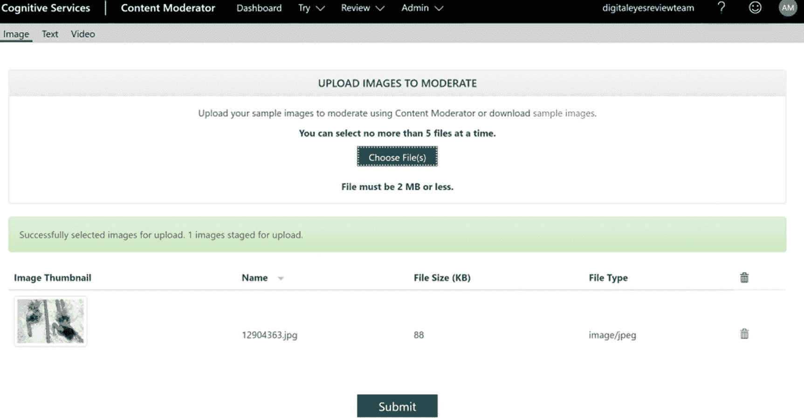

图 6-5

内容审核服务上传图片进行审核界面

1.  我们不建议你在工作电脑上寻找不雅图片来测试内容审核服务。正如人们所说，在人力资源部门给你发邮件之前，这一切都很有趣，而“但我是在做研究”不再是一个合理的理由。因此，在开始搜索图片之前，请考虑使用 Flickr30K 图片数据集。该数据集在知识共享许可下发布，被广泛用作基于句子的图像描述的基准，并且包含非常多样化的图片。你可以从 [`www.kaggle.com/hsankesara/flickr-image-dataset`](http://www.kaggle.com/hsankesara/flickr-image-dataset) 下载该数据集。

为了测试内容审核服务，我们上传了一张游泳者的图片进行审核和审查，如图 6-5 所示。

上传图片后，你会看到如图 6-6 所示的确认信息。


图 6-6

内容审核服务上传图片确认

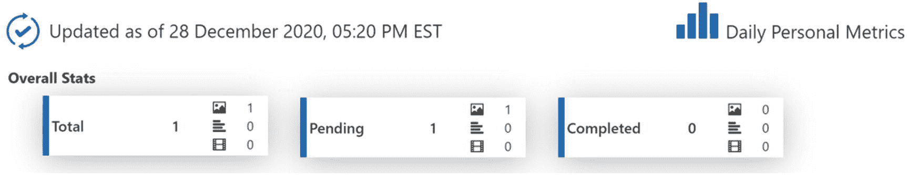

图 6-7

内容审核服务仪表板状态

1.  收到确认后，你会看到该图片处于待审核状态，如图 6-7 所示。

当上传的图片经过审核工作流时，API 已经处理了该图片并提供了反馈。用于识别不当内容的标记包括 `isImageAdultClassified` 和 `isImageRacyClassified`，如图 6-8 所示。

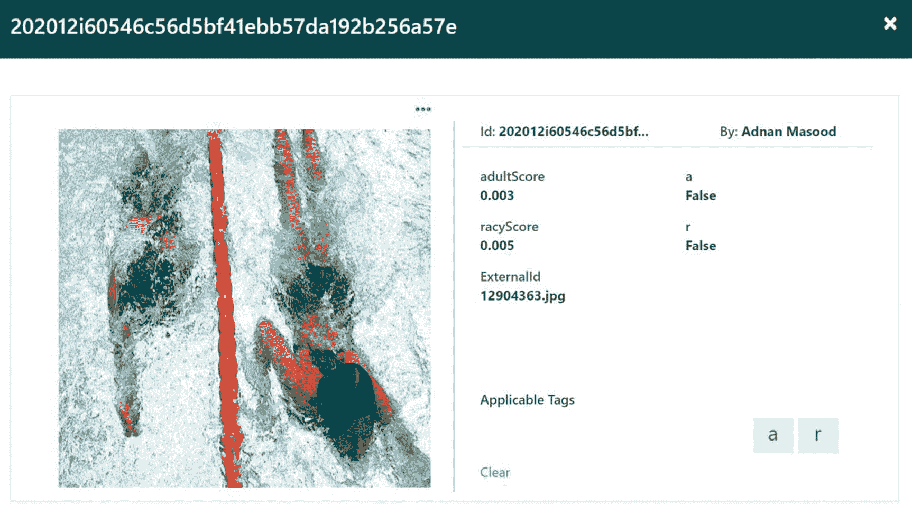

图 6-8

内容审核服务图片审核评分界面

这些标记的含义不言自明；`isImageAdultClassified` 用于识别露骨的色情图片，而 `isImageRacyClassified` 则标记具有暗示性的内容。概率评分介于 0 到 1 之间，分数越高表示图片在相应类别中属于露骨或暗示内容的置信度越高。根据你的组织需求，你可以自行设定一个阈值，以确定在需要进行人工审核之前，可容忍的分数上限。

对于这张图片的人工审核，你可以将图片标记为 `a`（成人）或 `r`（暗示性），或者如果它两者都不是，也可以直接跳过。然后点击**下一步**完成审核过程，如图 6-9 所示。

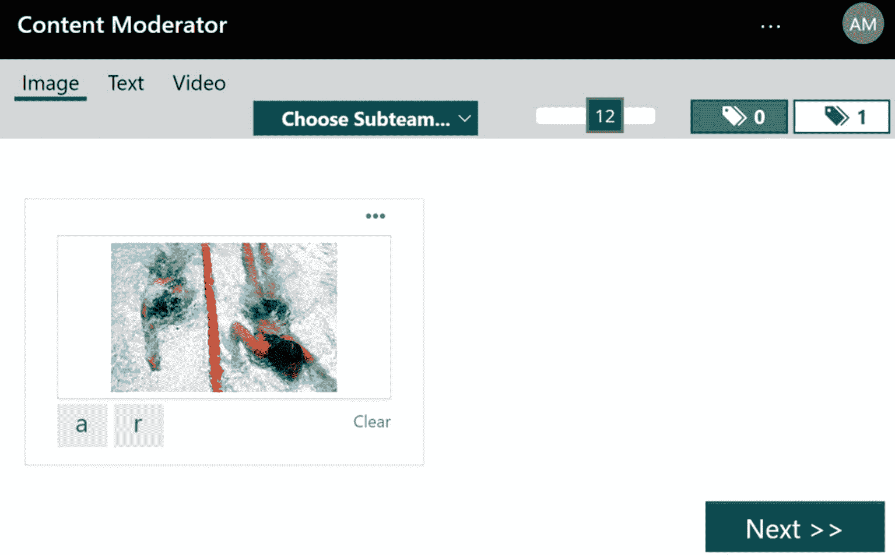

图 6-9

内容审核服务图片审核界面

现在我们已经了解了内容审核服务的人工审核场景，接下来让我们在下一节中探索文本审核功能。


#### 使用内容审查服务进行文本审核

非结构化数据（尤其是文本和自然语言）是互联网上数量最庞大的数据形态。因此，能够摄取、消费、处理、过滤并准备这些数据以使其具有洞察力的技术备受追捧。对文本内容（无论是企业社交媒体领域中的评论、评价还是帖子）进行审核，正是内容审查服务大显身手的典型场景。

内容审查服务的文本审核功能不仅限于检测脏话，还能帮助你将可疑语言分为三个不同类别。与图像审核类似，内容属于特定类别的置信度介于 0 到 1 之间，数值越高表示置信度越高（问题越小）。当服务建议进行人工审核时，`ReviewRecommended` 标志会被设置为 true。你可以结合此标志与类别分数的阈值，来判断在你的特定场景下是否需要人工审核。

输出类别代表不同程度的粗俗文本。类别 1 包含粗俗、露骨或成人内容，类别 2 则暗示含有性暗示语言。与图像审核不同，文本审核还有另一个类别——类别 3，表示轻度冒犯性语言。除了这些类别，文本审核还能检测文本中的个人身份信息（PII），例如电子邮件地址、IP 地址、美国电话号码或美国邮寄地址。这在需要匿名化或编辑个人身份信息的场景中非常有用。自动文本纠错是内容审查服务提供的另一个非常实用的功能。

要开始使用此服务，我们可以重复之前的内容审核服务流程，但这次针对的是文本。参见图 6-10。

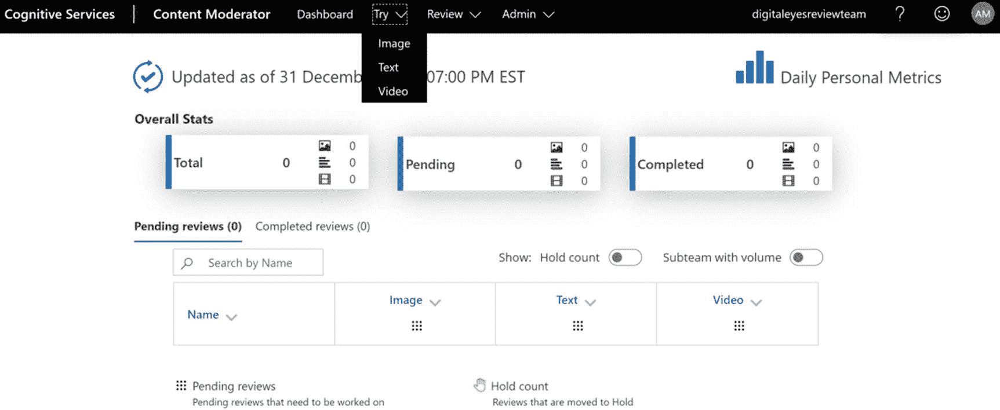

图 6-10

内容审查服务审核界面

数据科学挑战网站 Kaggle 提供了一个“有毒评论分类挑战赛”，用于识别和分类有害的在线评论。数据集可以从 [`www.kaggle.com/c/jigsaw-toxic-comment-classification-challenge/data`](http://www.kaggle.com/c/jigsaw-toxic-comment-classification-challenge/data) 下载，但我们强烈建议不要逐条阅读这些评论，因为它们可能非常有害（即粗俗且露骨）。我们从该数据集中选择了一条评论，用于测试该服务，你可以在图 6-11 中看到测试过程。

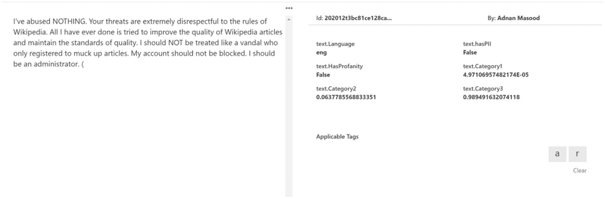

图 6-11

内容审查服务文本审核界面

如置信度数值所示，该评论既非粗俗（类别 1），也非性暗示（类别 2），但语言带有轻度冒犯性或防御性（类别 3）。`text.HasProfanity` 标志被设置为 `False`，`text.hasPII` 标志同样为 `False`。在下一个示例中，我们选取了内容审查服务提供的一段示例文本，并将其提交审核，如图 6-12 所示。

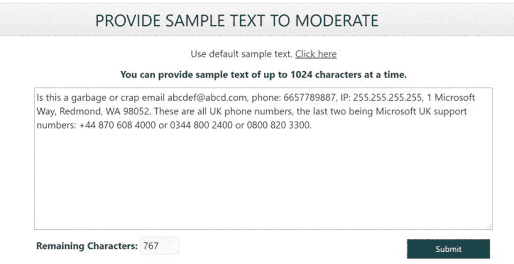

图 6-12

内容审查服务文本提交界面

在此案例中，评论包含个人身份信息（PII），包括电子邮件、电话号码、IP 地址和美国邮寄地址。这些信息已被检测到，如图 6-13 所示。

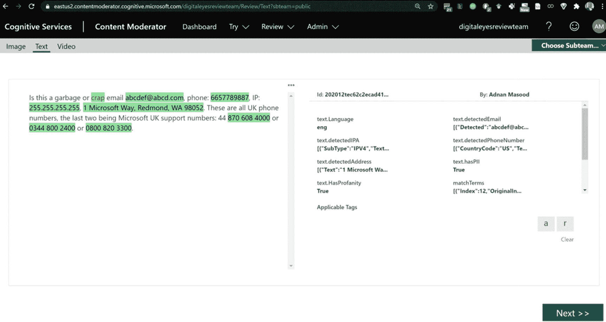

图 6-13

内容审查服务文本提交界面

在下一节中，我们将了解如何通过 API 将内容审核功能集成到你自己的应用程序中。


##### 内容审核 – 调用 API

使用 `Content Moderator` 审核工作流固然可行，但在某些场景下，您需要交互式响应并构建自己的决策工作流。例如，在您的产品支持聊天室中，您希望确保自动过滤掉所有属于类别 1 或 2（成人、粗俗或露骨色情内容）的已发布聊天内容。通过使用 `Content Moderator` API，您可以轻松构建此审核系统。

以下步骤展示了如何使用 `Content Moderator` API：

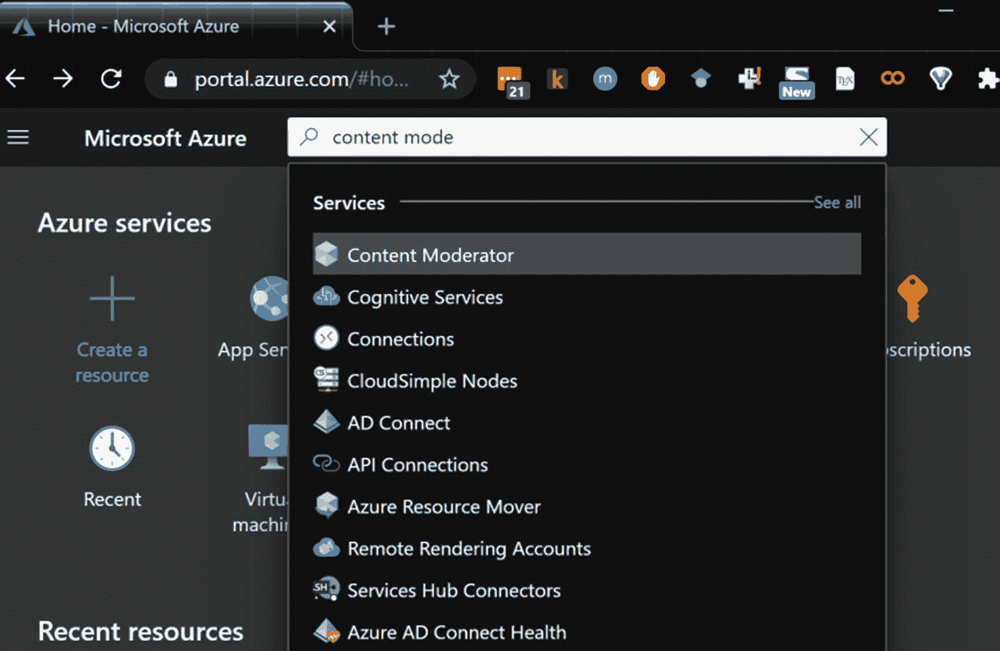

图 6-14

Azure 门户 `Content Moderator` 服务设置

1. 首先，您需要在 Azure 上设置一个 `Content Moderator` 实例。访问 `portal.azure.com`，在搜索框中搜索“content moderator cognitive service”，如图 6-14 所示。

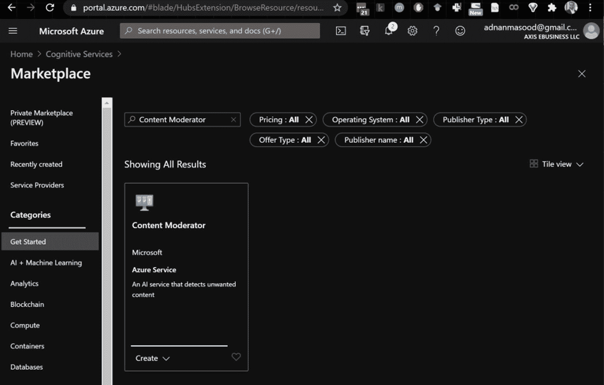

图 6-15

Azure 门户 `Content Moderator` 服务设置

2. `Content Moderator` 服务会显示在搜索结果中，如图 6-15 所示。要继续操作，请单击 `Content Moderator` 窗格。

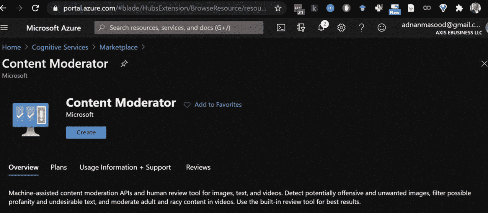

图 6-16

Azure 门户 `Content Moderator` 服务设置

3. 此时会显示 `Content Moderator` 服务详情屏幕。要继续操作，请单击 **创建** 按钮，如图 6-16 所示。

现在，您将通过选择订阅、资源组、实例信息和定价层来创建 `Content Moderator` 实例。要继续操作，请单击 **审核 + 创建** 按钮，如图 6-17 所示。

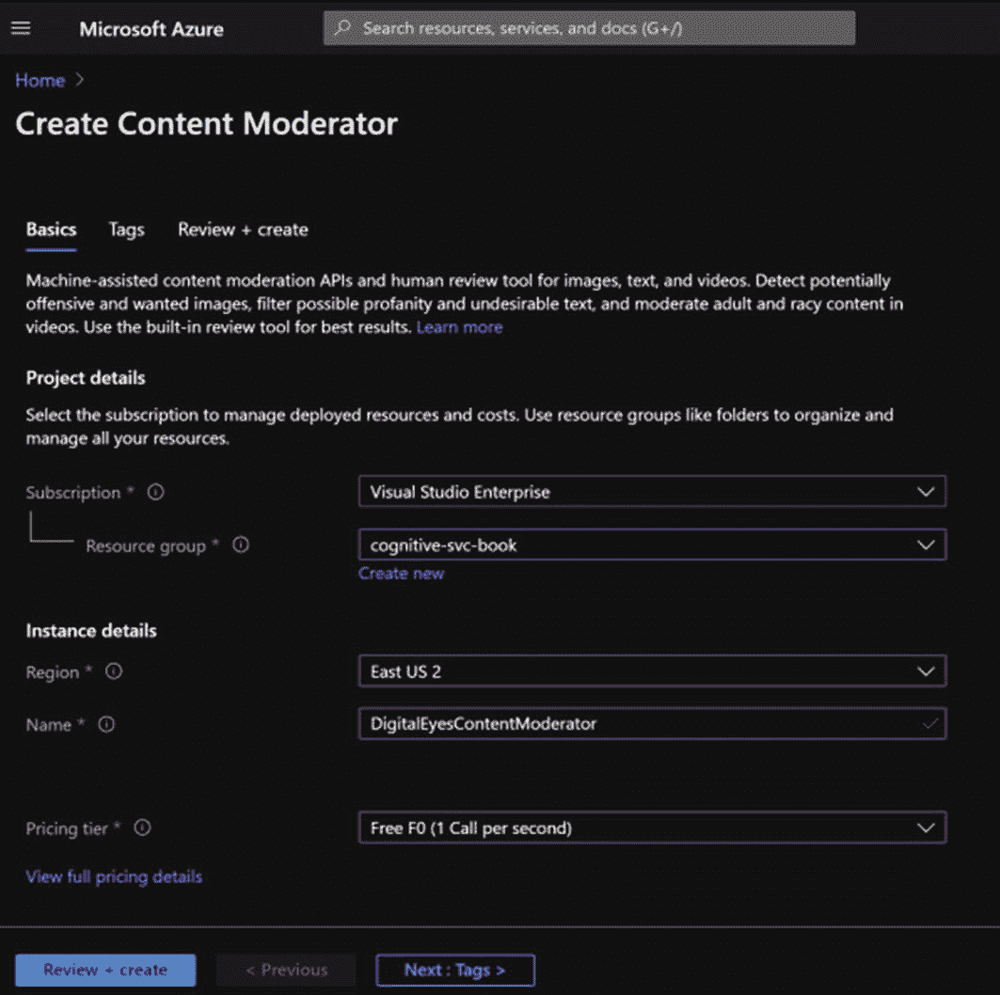

图 6-17

Azure 门户 `Content Moderator` 服务设置

验证过程开始，您将看到如图 6-18 所示的屏幕（验证已通过）。

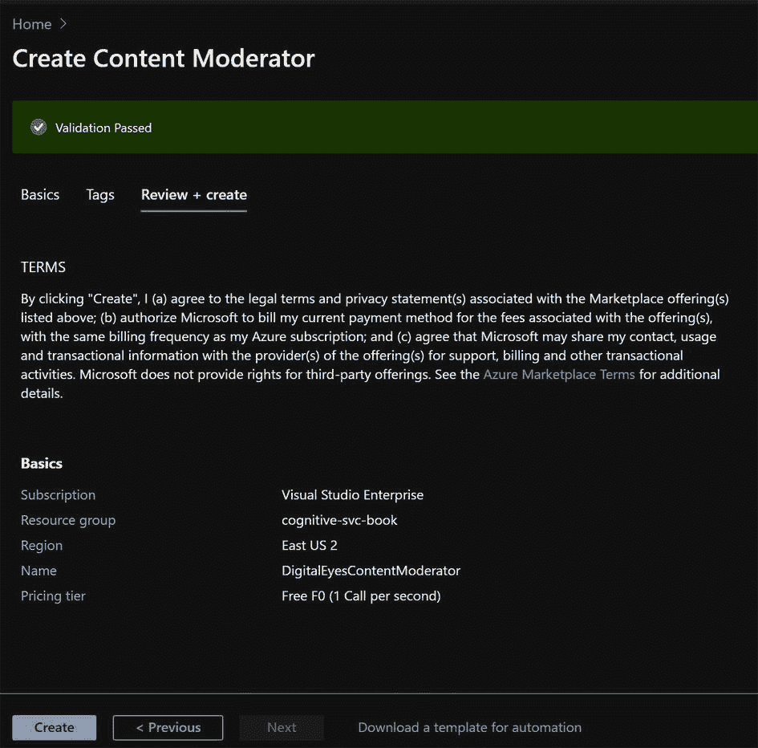

图 6-18

Azure 门户创建 `Content Moderator` 屏幕

单击 **创建** 以继续部署服务。您将看到如图 6-19 所示的屏幕，其中显示了部署状态。

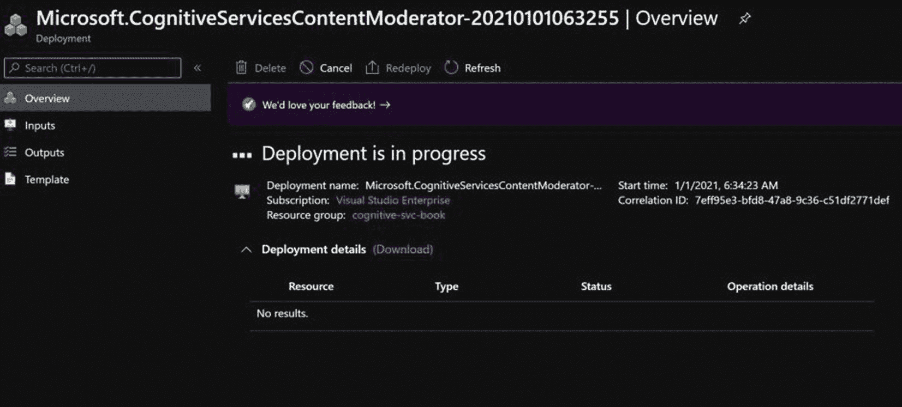

图 6-19

Azure 门户部署进行中屏幕

部署完成后，您将进入如图 6-20 所示的屏幕。要继续操作，请单击 **转到资源**。

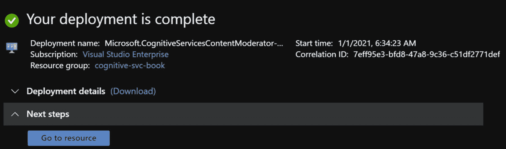

图 6-20

Azure 门户 `Content Moderator` 服务部署完成

资源屏幕会显示“快速入门”页面，您可以在其中获取密钥、进行 API 调用以及查看 SDK 和文档。请参见图 6-21。

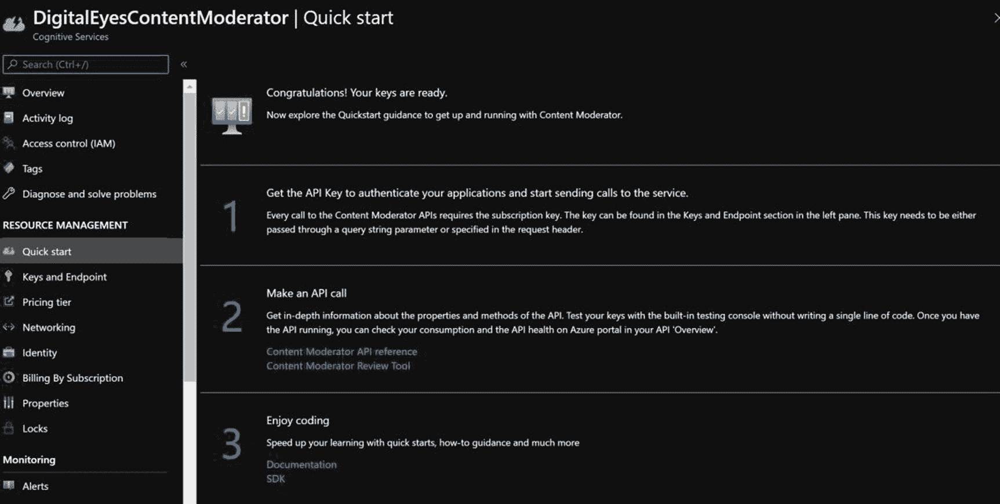

图 6-21

Azure 门户 `Content Moderator` 服务快速入门

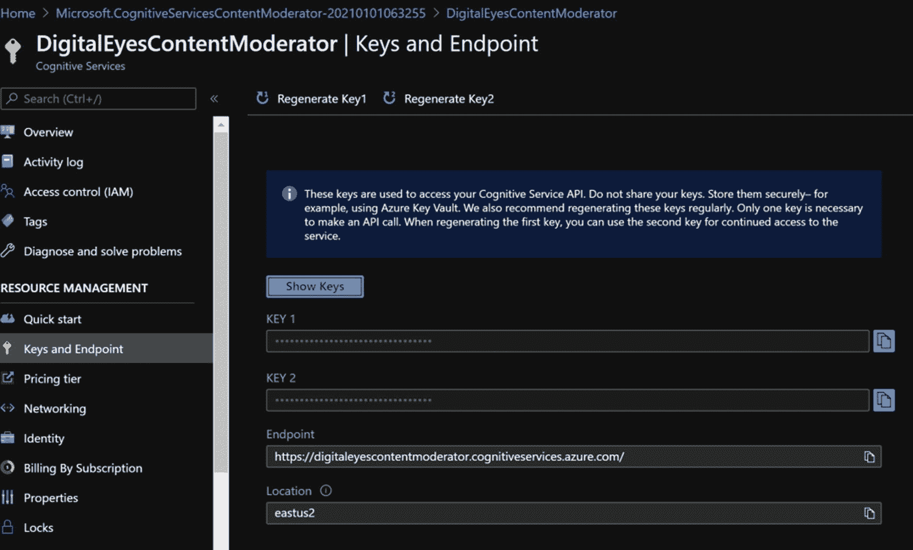

图 6-22

Azure 门户 `Content Moderator` 服务密钥和终结点屏幕

4. 要调用 API，您需要密钥和终结点地址。单击左侧窗格中的 **密钥和终结点** 选项卡。您将看到如图 6-22 所示的屏幕，其中包含终结点和密钥。

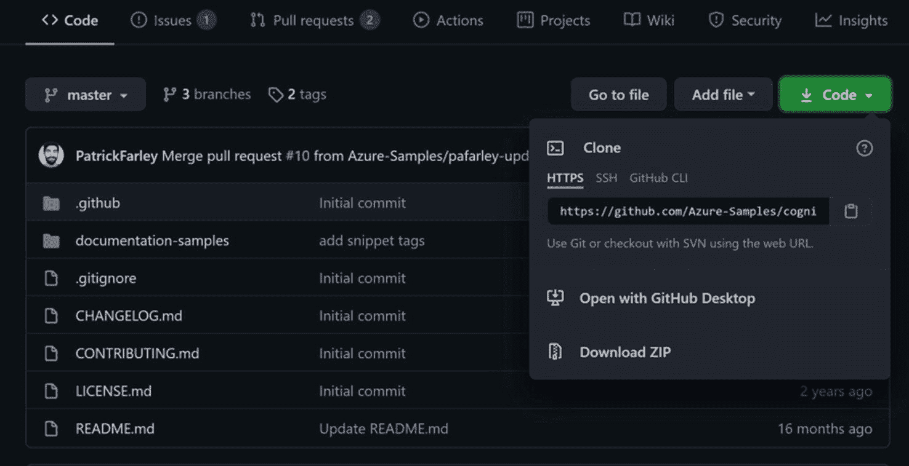


##### 图 6-23
内容审查器示例 GitHub 仓库

1.  要测试 API，你可以使用 `curl`、`Postman`、`Swagger` 或 `Fiddler` 等工具，或者通过应用程序进行测试。在本示例中，我们将使用一个 .NET 应用程序。认知服务示例是探索 Azure 认知服务不同用法的绝佳起点。首先，克隆 GitHub 仓库（`https://github.com/Azure-Samples/cognitive-services-content-moderator-samples`），如图 6-23 所示。

    将仓库克隆到本地文件夹中。在本示例中，我们使用 GitHub Desktop，但你也可以通过命令行完成。克隆后的仓库位于以下文件夹中（如图 6-24 所示）：`D:\dev\cognitive-services-content-moderator-samples\`。

    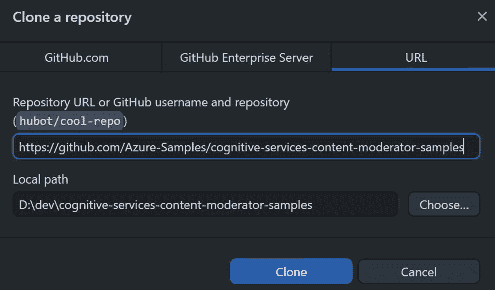

    **图 6-24**
    内容审查器示例 GitHub 仓库克隆

    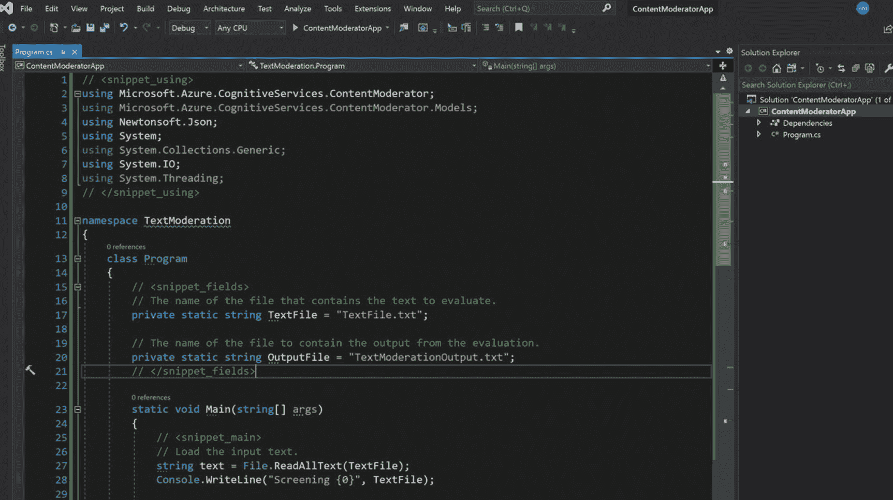

    **图 6-25**
    内容审查器服务调用应用程序

2.  克隆仓库（同步到你的机器）后，从 `D:\dev\cognitive-services-content-moderator-samples\documentation-samples\csharp` 文件夹中打开 `text-moderation-quickstart-dotnet.cs` 文件。你可以在 Visual Studio Code 或 Visual Studio 2019 中打开此文件。在本示例中，我们将使用 Visual Studio 并创建一个 .NET Core 3.1 控制台应用程序。我们添加 `text-moderation-quickstart-dotnet.cs` 文件中提供的代码，以便按图 6-25 所示使用它。

    > *自撰写本文以来，* API *已有更新，例如，* `Microsoft.CognitiveServices.ContentModerator` *需要替换为* `Microsoft.Azure.CognitiveServices.ContentModerator`。*你可以通过最新的仓库更新获取这些更改。*

    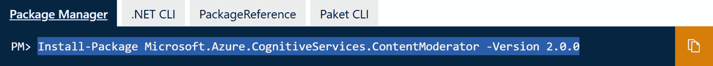

    **图 6-26**
    安装 NuGet 包的命令

3.  在运行此应用程序之前，我们需要做一些准备工作。首先，你需要使用 NuGet 包管理器安装内容审查器包。运行图 6-26 所示的命令，以获取 `Microsoft.Azure.CognitiveServices.ContentModerator` 包。

    安装完成后，我们继续配置运行 `text-moderation-quickstart-dotnet.cs` 文件所需的项目。

    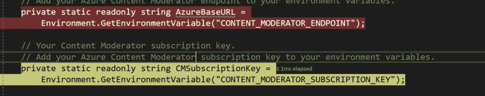

    **图 6-27**
    内容审查器调用 – 订阅密钥信息

4.  要运行这段调用内容审查器 API 的简单代码，你需要将密钥存储在环境变量中。如图 6-27 所示，代码正是从这些环境变量中读取信息。

    要添加环境变量，请在 Windows 10 的“运行”窗口中输入“系统属性”以打开系统属性面板，如图 6-28 所示。单击**环境变量…** 按钮。

    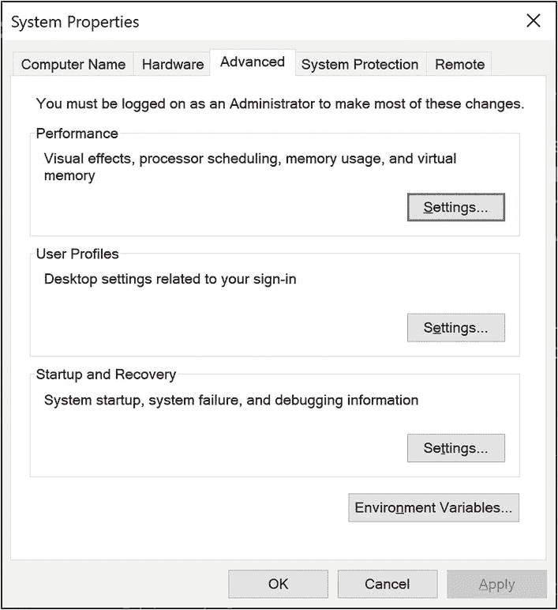

    **图 6-28**
    设置环境变量的系统属性

    窗口打开后，将两个密钥（如图 6-29 所示）添加为新的环境变量。使用用户变量而非系统变量。你需要重启 VS.NET 以加载新添加的环境变量。

    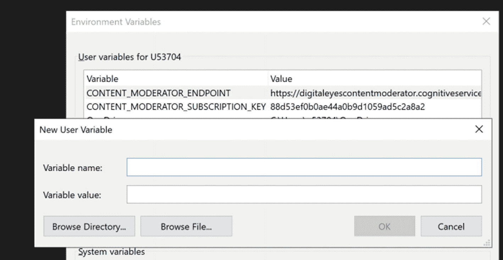

    **图 6-29**
    设置环境变量的系统属性

    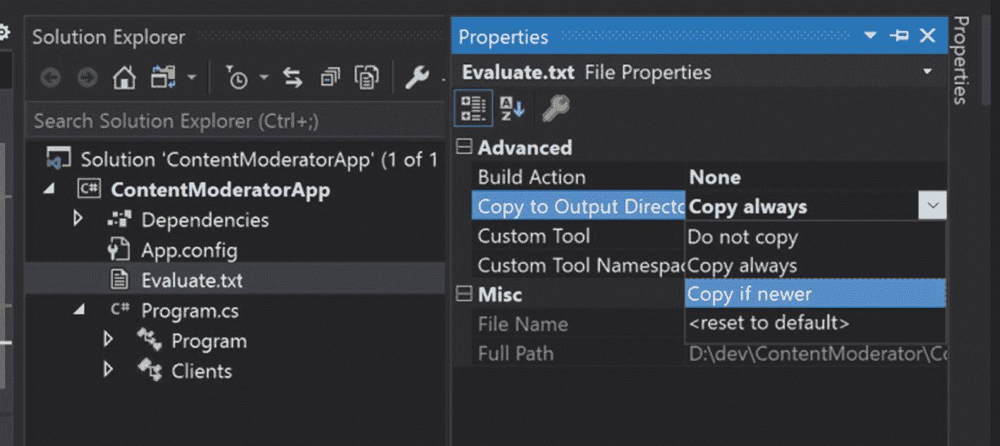

    **图 6-30**
    Visual Studio – 复制到输出目录设置

5.  最后，你需要创建一个包含要传递给 API 的评估文本的文件。该文本就是我们之前使用的内容。以下是评估文本：

    ```
    Is this a grabage or crap email abcdef@abcd.com, phone: 4255550111, IP: 255.255.255.255, 1234 Main Boulevard, Panapolis WA 96555.
    ```

    现在创建一个名为 `Evaluate.txt` 的新文件，然后将此文本复制到文件中。确保将“复制到输出目录”设置为**如果较新则复制**，如图 6-30 所示。如果不设置此值，评估文件将不会被复制到生成输出中，因此可执行文件在运行时将无法找到该程序。

    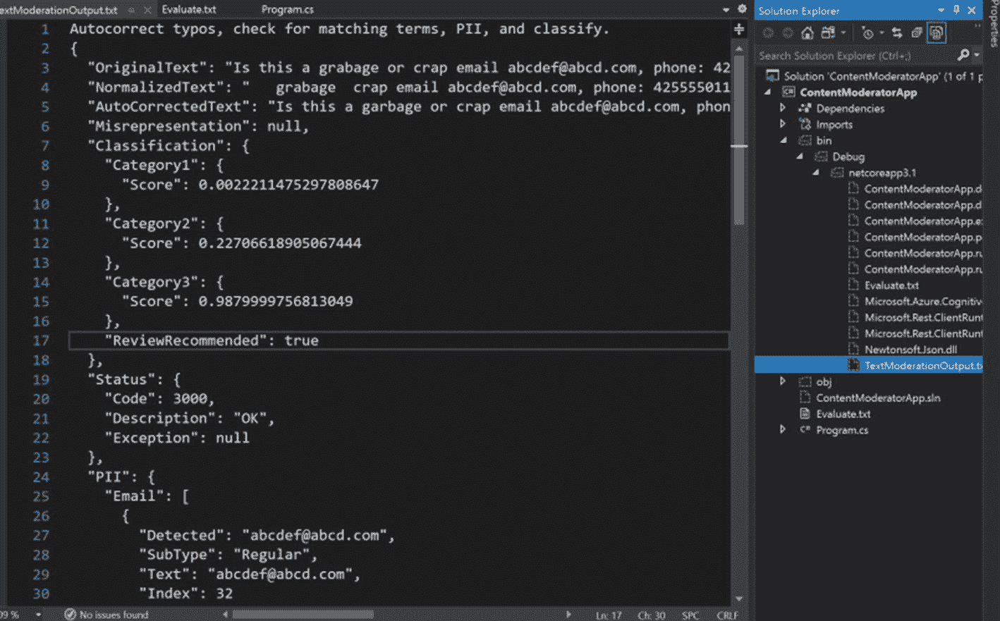

    **图 6-31**
    内容审查器服务响应的输出列表

6.  现在，你可以按 `F5` 运行程序。代码将调用 API，获取响应，并将其保存到 `bin/debug` 文件夹中的输出文件 `TextModerationOutput.txt` 中（如图 6-31 所示）。要启用此视图，请单击解决方案资源管理器窗口中的**显示所有文件**图标。

    API 返回的 JSON 输出详细如下，你可以轻松看到类别识别、审查建议、PII 和语言检测——与审查控制台中的方式类似。

    ```
    Autocorrect typos, check for matching terms, PII, and classify.
    {
    "OriginalText": "Is this a grabage or crap email abcdef@abcd.com, phone: 4255550111, IP: 255.255.255.255, 1234 Main Boulevard, Panapolis WA 96555.",
    "NormalizedText": "   grabage  crap email abcdef@abcd.com, phone: 4255550111, IP: 255.255.255.255, 1234 Main Boulevard, Panapolis WA 96555.",
    "AutoCorrectedText": "Is this a garbage or crap email abcdef@abcd.com, phone: 4255550111, IP: 255.255.255.255, 1234 Main Boulevard, Pentapolis WA 96555.",
    "Misrepresentation": null,
    "Classification": {
    "Category1": {
    "Score": 0.0022211475297808647
    },
    "Category2": {
    "Score": 0.22706618905067444
    },
    "Category3": {
    "Score": 0.9879999756813049
    },
    "ReviewRecommended": true
    },
    "Status": {
    "Code": 3000,
    "Description": "OK",
    "Exception": null
    },
    "PII": {
    "Email": [
    {
    "Detected": "abcdef@abcd.com",
    "SubType": "Regular",
    "Text": "abcdef@abcd.com",
    "Index": 32
    }
    ],
    "SSN": [],
    "IPA": [
    {
    "SubType": "IPV4",
    "Text": "255.255.255.255",
    "Index": 72
    }
    ],
    "Phone": [
    {
    "CountryCode": "US",
    "Text": "4255550111",
    "Index": 56
    }
    ],
    "Address": [
    {
    "Text": "1234 Main Boulevard, Panapolis WA 96555",
    "Index": 89
    }
    ]
    },
    "Language": "eng",
    "Terms": [
    {
    "Index": 12,
    "OriginalIndex": 21,
    "ListId": 0,
    "Term": "crap"
    }
    ],
    "TrackingId": "f0dba865-3731-4fd2-b07f-01878ba7325a"
    }
    ```

    **列表 6-1**
    内容审查器服务响应的输出列表

行业中的内容审查用例旨在提供积极的用户体验。它们几乎适用于所有用户生成的内容，从审查文本、聊天消息和用户选择的用户名（或头像），到可能包含色情、仇恨、暴力或极端内容的上传图像等等。在本节中，你已学习了如何使用内容审查服务及其强大的审查功能——既通过 API，也通过人工参与的控制台。

在下一节中，我们将探索另一项决策服务：个性化体验创建服务。


### 个性化服务

即便是千禧一代，也很难想象一个没有持续推荐功能的数字世界。百视达门店曾难以将电影按同一类型归类，而奈飞却能无缝贴合我的观影品味。YouTube 会提供相关内容，帮助我探索类似的频道和新晋艺术家；Spotify 则根据我的播放列表，不断挖掘那些怀旧的旋律。亚马逊会根据我最近的购买记录推荐最相关的产品，金融机构则根据我的储蓄和消费模式提供可定制的服务。这就是超个性化、定制化、细分化和内容策展，旨在为每一个用户（你）打造专属体验。这一切之所以成为可能，得益于应用于提供定制体验问题的机器学习方法。

为了推动并加速人工智能的民主化，与其他所有认知服务一样，个性化服务创建了一个抽象层，让你（开发者）能够为客户打造无缝体验，而无需深入底层推荐引擎的繁琐细节。

然而，如果你对与推荐系统相关的底层算法感兴趣，微软有一个优秀的 GitHub 仓库（`https://github.com/Microsoft/Recommenders`），其中包含了不同算法的详细实现、笔记本和对比。这方面的讨论超出了本章的范围，但你可以在那里找到所需的一切，包括所有相关细节、相关研究论文、Jupyter 笔记本、示例代码等等。

Azure 认知服务个性化服务曾荣获 Strata 数据奖最具创新产品奖。它可以应用于任何内容的定制，包括但不限于新闻文章、产品、食品、电影、博客文章等。基于强化学习方法和微软定制的研究算法，个性化服务背后的原理非常容易理解。它的工作方式如下：

1.  每个项目（产品、新闻文章、食品、电影等）都包含属性或特征。调用个性化 API 并将这些特征传递给 `Rank` API。
2.  个性化服务的底层引擎使用奖励动作标识符来确定最佳模型和推荐。你通过用户偏好或业务规则来确定（训练）模型。
3.  基于此反馈，奖励通过关联排名和奖励来（重新）训练自身。现在推理引擎拥有了新模型。

显然，这是对该过程的过度简化，但如果你仍然感到有些困惑，可以将个性化方法视为在奖励行为上运作。稍后，我们将详细介绍学习策略、学徒模式、探索与利用的权衡等。但首先，进行一次快速的动手实验，向你展示个性化服务的工作原理是很有意义的。

在开始之前，我们想指出，在 `https://github.com/Azure-Samples/cognitive-services-personalizer-samples` 上有一个包含大量个性化服务相关演示、代码片段和实用工具的大型仓库。你还可以在 `https://personalizationdemo.azurewebsites.net` 上看到一个交互式工作演示，它有助于以可视化的方式解释这些概念，如图 6-32 所示。

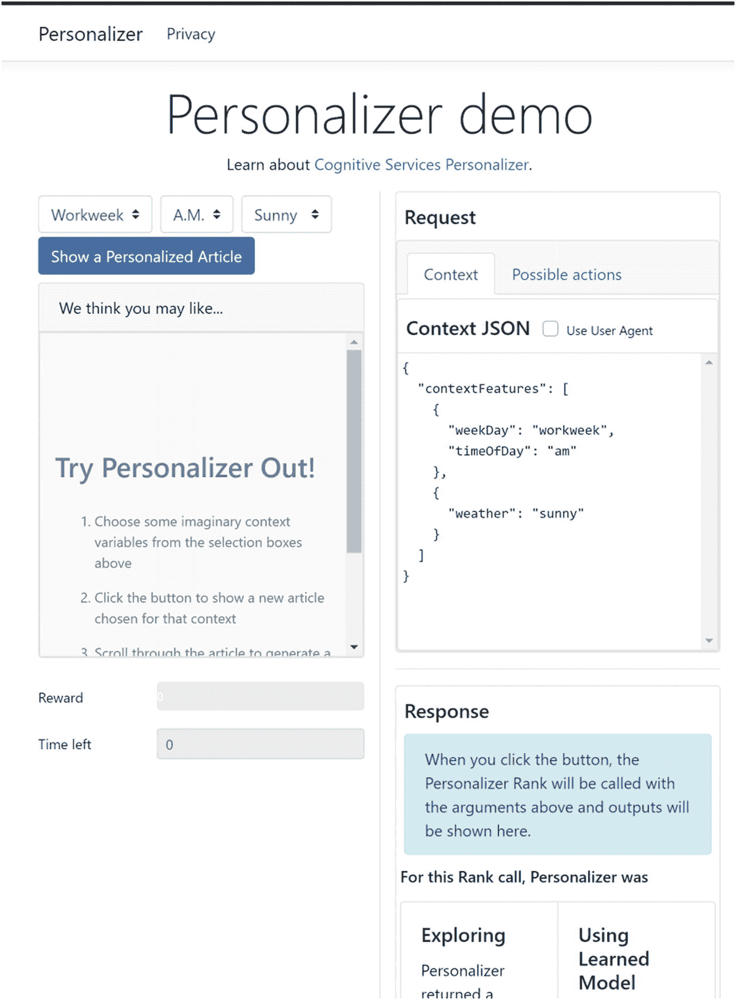

图 6-32 个性化服务演示

个性化服务使用 Vowpal Wabbit 作为其机器学习实现的基础。你可以在 GitHub 上 `https://github.com/VowpalWabbit/vowpal_wabbit/wiki` 阅读更多相关信息。

#### 动手尝试 – 构建电影个性化服务

在本示例中，我们将重复之前设置 Azure 认知服务的一些步骤。一致的工作流程是认知服务提供的显著特性之一，你可以轻松地复用之前的知识。

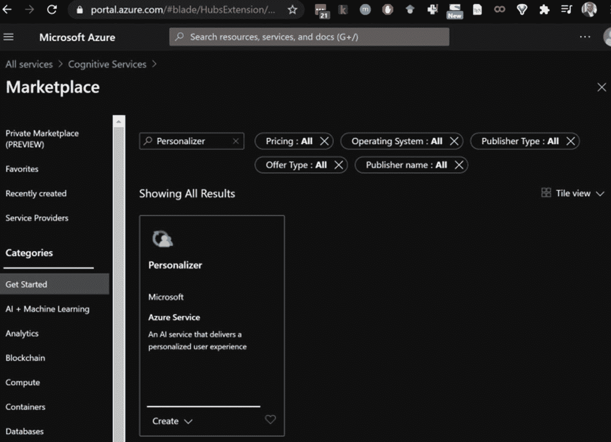

图 6-33 个性化服务 – 创建个性化实例

1.  访问 `https://portal.azure.com`。使用你现有的 Azure 订阅登录，然后搜索“个性化服务”，如图 6-33 所示。点击“个性化”窗格。

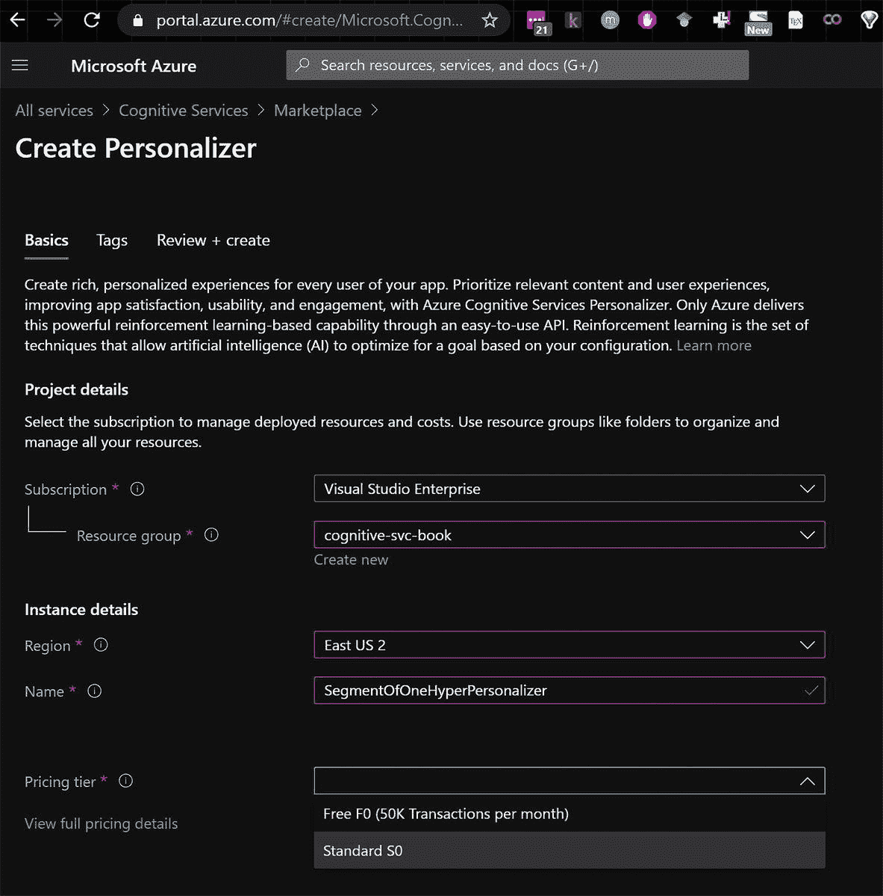

图 6-34 个性化服务 – 配置个性化元素

2.  点击“个性化”后，你将看到如图 6-34 所示的屏幕。填写详细信息以创建个性化实例。

详细信息将被验证，你将看到如图 6-35 所示的屏幕。点击**创建**以继续部署。

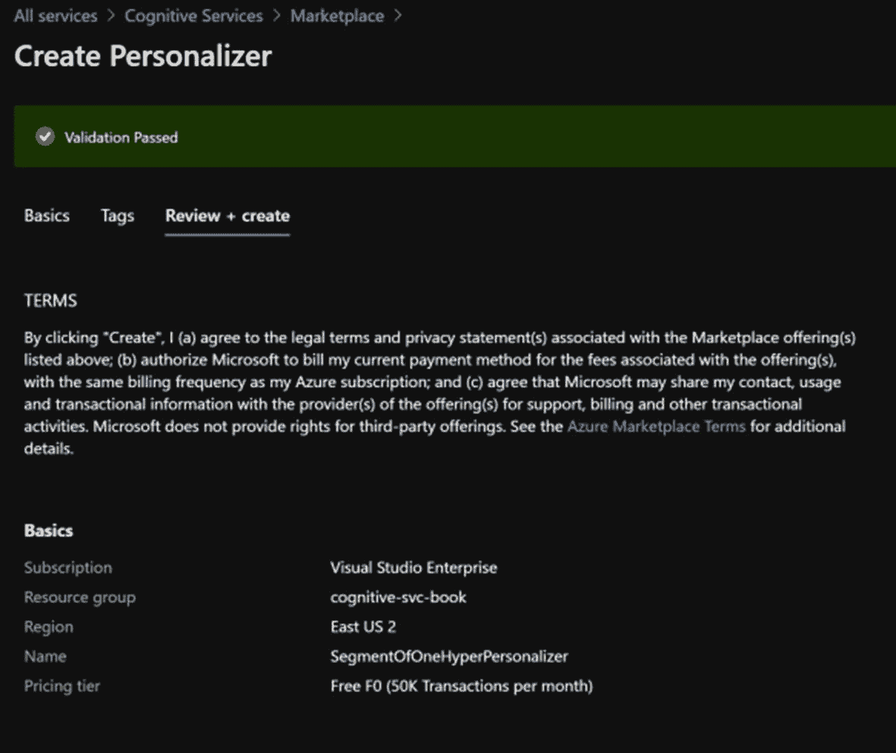

图 6-35 个性化服务 – 验证屏幕

部署进行中时，它将根据给定的参数部署实例（见图 6-36）。

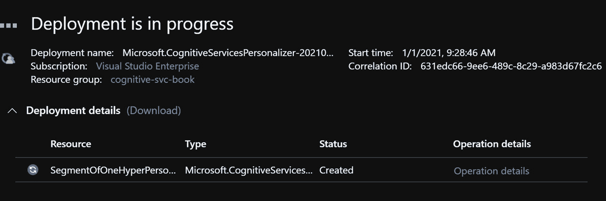

图 6-36 个性化服务 – 部署进行中

部署完成后，你将看到如图 6-37 所示的屏幕。点击**转到资源**按钮导航到下一个屏幕。

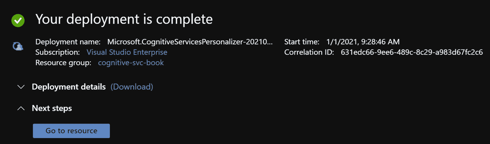

图 6-37 个性化服务 – 部署完成

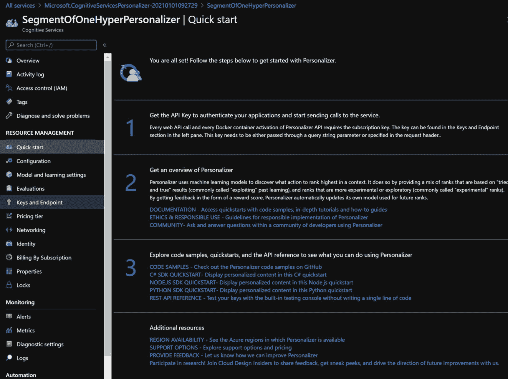

图 6-38 个性化服务 – 快速入门页面

3.  现在我们已经部署了服务，可以通过快速入门页面中指定的各种方法来使用它，如图 6-38 所示。在我们的案例中，我们将创建一个小的电影推荐个性化服务。

与其他认知服务一样，要调用个性化服务，你需要密钥和终结点。你可以通过点击左侧窗格中的**密钥和终结点**链接找到这些信息（见图 6-39）。

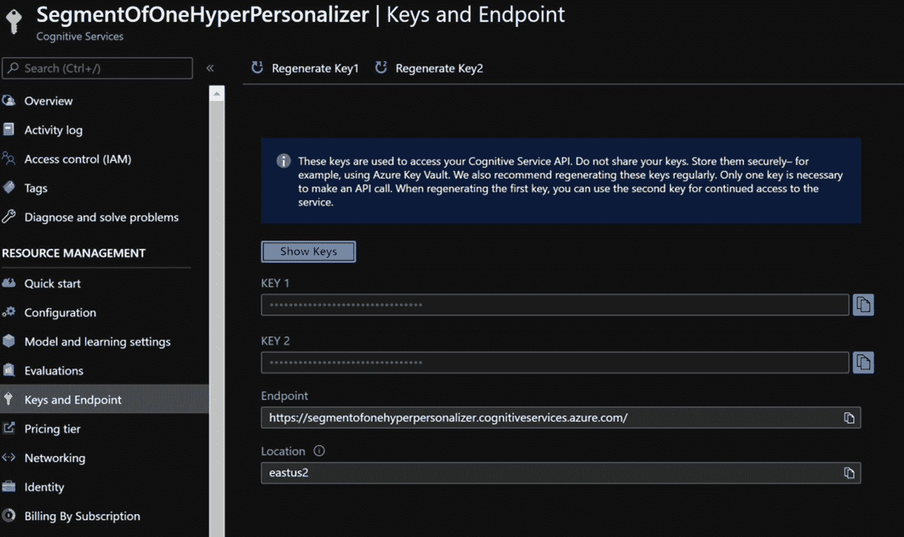

图 6-39 个性化服务 – 密钥和终结点信息

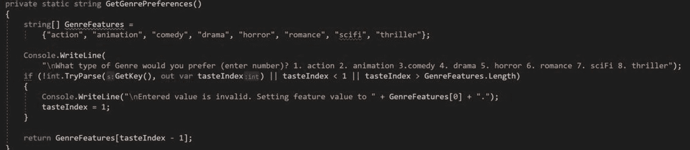

图 6-41 个性化服务演示 – `GetGenrePreference` 方法

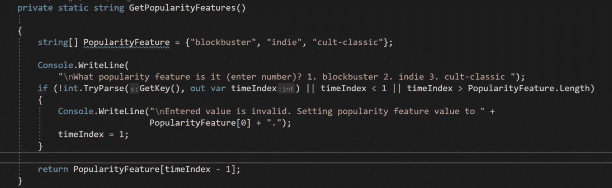

图 6-40 个性化服务演示 – `GetPopularityFeatures` 方法

4.  为了帮助解释这个概念，让我们创建一个简单的应用程序，它会被训练。然后，它会根据类型和受欢迎程度推荐一部电影。我们将这些受欢迎程度特征定义如下：

```
string[] PopularityFeature = {"blockbuster", "indie", "cult-classic"};
```

我们将类型特征定义如下：

```
string[] GenreFeatures =
{"action", "animation", "comedy", "drama", "horror", "romance", "scifi", "thriller"};
```


现在我们需要为目录中的电影创建一个 `RankableAction` 列表。可以将其视为对数据集中属性和特征的预训练。可排序操作接收一个对象列表，这些对象可以是你的产品、新闻文章或购物车商品。然后，它会根据模型应用排序和奖励函数。在本例中，我们的 `RankableAction` 列表如下所示（为简洁起见已做删减）：

```
IList actions = new List
{
new RankableAction
{
Id = "Interstellar",
Features =
new List
{
new
{
imdb = 8.6, rottentomatoes = 72, popularityFeature = "blockbuster",
genreFeature = "scifi", plot = "time paradox"
}
}
},
new RankableAction
{
Id = "Gattaca",
Features = new List
{
new
{
imdb = 7.8, rottentomatoes = 82, popularityFeature = "cult-classic", genreFeature = "scifi",
plot = "genetic profiling"
}
}
},
};
```

这是 `IList<RankableAction> GetActions()` 方法的一部分。另外两个方法是 `GetPopularityFeatures()` 和 `GetGenrePreferences()`，如图 6-40 和 6-41 所示。

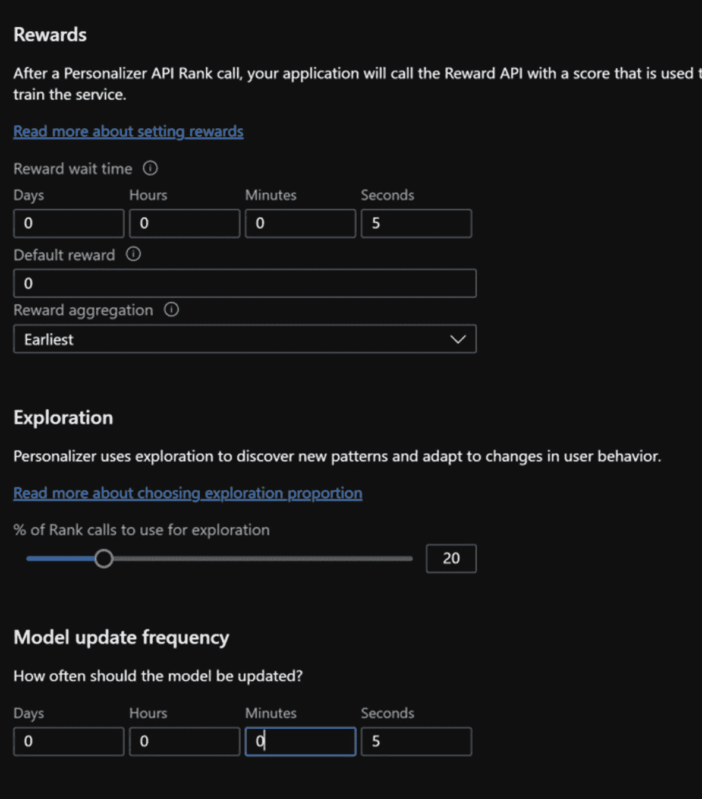

图 6-42

个性化服务 – 设置模型更新和奖励频率

1. 现在我们已经设置了流派，并用一些电影来训练初始模型，可以开始调用服务了。但在那之前，让我们将奖励函数的等待时间设置为五秒，这样可以更快地重新训练模型。如此快速地重新训练可能会带来性能损失，但对于这个示例来说，这种影响可以忽略不计。你可以通过主控制台菜单左侧窗格中的**模型和学习设置**访问以下屏幕。设置奖励等待时间，然后将模型更新频率设置为五秒。参见图 6-42。

2. 要启动排序和奖励流程，你可以按 `F5` 运行程序。完整的代码列表包含在本书 Personalizer 仓库的 `program.cs` 文件中。我们将逐步讲解代码的重要部分。

首先，通过以下代码行从用户那里获取上下文信息，例如流行度特征和电影流派偏好：

```
var popularityFeatures = GetPopularityFeatures();
var genreFeatures = GetGenrePreferences();
```

接下来，根据用户数据创建一个当前上下文，作为一个对象列表。参见以下代码：

```
IList currentContext = new List
{
new {popularity = popularityFeatures},
new {genre = genreFeatures}
};
```

你还可以创建一个排除操作列表，即你希望排除在排序考虑之外的任何属性。在本例中，我们没有需要排除的属性，因此将其留空，如下所示：

```
IList excludeActions = new List {""};
```

现在，我们生成一个事件 ID 来关联请求，如下所示：

```
var eventId = Guid.NewGuid().ToString();
```

然后，我们继续对操作进行排序。`RankRequest()` 方法接收操作、上下文和排除操作，然后进行服务调用。这个调用可以是你现有任何工作流程的一部分，例如无限滚动、提供电影推荐、为新客户生成优惠等。参见以下代码：

```
var request = new RankRequest(actions, currentContext, excludeActions, eventId);
var response = client.Rank(request);
```

你得到的响应包含一个奖励操作 ID。请记住，这是基于之前设置的 `RankableAction`，因此在我们的例子中，它将是一个电影推荐。参见以下代码行：

```
Console.WriteLine("\nPersonalizer service thinks you would like to have: " + response.RewardActionId +". Is this correct? (y/n)");
```

在这里，你进行调用。如果你喜欢这个推荐，你可以相应地调整奖励，模型就会学习，如下所示：

```
if (answer == "Y")
{
reward = 1;
Console.WriteLine("\nGreat! Enjoy your movie.");
}
else if (answer == "N")
{
reward = 0;
Console.WriteLine("\nYou didn't like the recommended movie choice.");
}
```

你还可以在响应对象中获得所有其他操作及其对应的概率。参见以下代码：

```
Console.WriteLine("\nPersonalizer service ranked the actions with the probabilities as below:");
foreach (var rankedResponse in response.Ranking)
Console.WriteLine(rankedResponse.Id + " " + rankedResponse.Probability);
// Send the reward for the action based on user response.
client.Reward(response.EventId, new RewardRequest(reward));
```

接下来，你发送奖励以进行重新训练。该过程会持续学习、探索、利用和重新训练，形成一个循环，直到你退出。这个循环类似于你的电子商务网站运行推荐系统的方式。

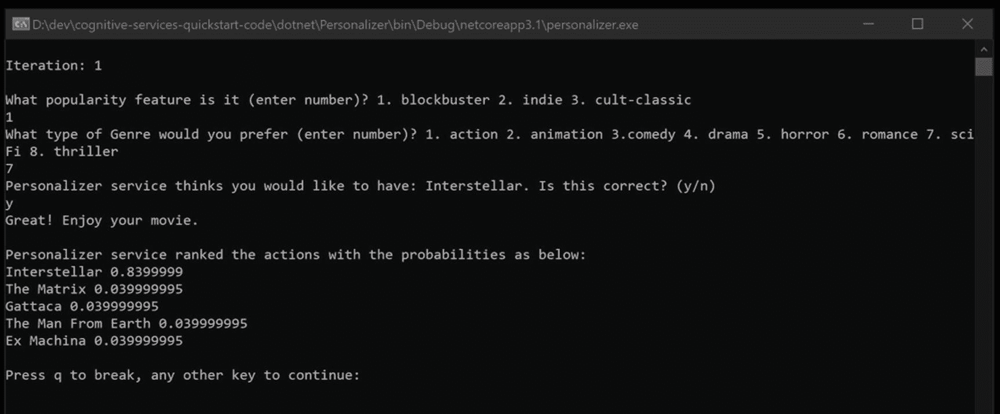

图 6-43

个性化服务 – 排序和奖励演示

3. 现在你可以运行这个程序来查看代码的实际效果。它会询问流行度特征和流派，然后列出推荐的电影。在数据有限的冷启动阶段，所有产品的概率是平均分配的。随着个性化引擎的学习，概率会发生变化。参见图 6-43。

如图 6-43 的结果所示，*星际穿越* 是概率最高的推荐电影，而其余项目则显示其各自的排名。训练有多种方式。其中包括学徒模式，你可以在不影响生产应用程序的情况下训练个性化服务。了解如何使用学徒模式训练个性化服务，请访问 [`https://docs.microsoft.com/en-us/azure/cognitive-services/personalizer/concept-apprentice-mode`](https://docs.microsoft.com/en-us/azure/cognitive-services/personalizer/concept-apprentice-mode)。你还可以根据用户的属性构建特征类型，为其创建特定的用户画像。然后，你可以相应地自定义奖励函数。

非常重要的一点是，最终的推荐并不总是基于最高排名。这个概念被称为探索与利用的权衡。例如，你可能喜欢恐怖片，但如果我只是一遍又一遍地推荐《驱魔人》，你肯定会错过恐怖片的所有其他子类型，比如鬼怪、怪物、超自然活动和吵闹鬼。因此，在搜索空间中平衡探索和利用非常重要。你应该在更广泛的推荐和利用奖励函数（即根据以往行为最大化奖励）之间取得平衡。这种方法用于扩展模型的视野。你可以通过以下链接了解更多关于如何使用异常检测器服务实现这一点的信息：[`https://docs.microsoft.com/en-us/azure/cognitive-services/anomaly-detector/overview`](https://docs.microsoft.com/en-us/azure/cognitive-services/anomaly-detector/overview)。

在下一次迭代中，我向推荐系统请求了一部独立科幻电影，得到了《这个男人来自地球》，这又是一个不错的推荐，尽管它并不是评分最高的（如图 6-44 所示）。

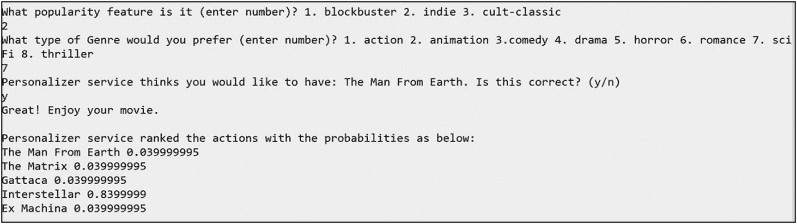

图 6-44

个性化服务 – 排序和奖励演示


请记住，下次当你看到一个看似毫不相关的产品时，这其实是算法在尝试拓宽其强化学习的边界。如果没有这一点，你就不会接触到僵尸、反乌托邦或末世世界以及连环杀手这些恐怖题材。

这个例子结束了我们对 `Personalizer` 服务的概述。正如你所想，`Personalizer` 和推荐系统无处不在，它们旨在吸引我们的注意力，并试图在个人层面上更好地理解我们。这些算法在这方面做得越来越出色，当你在构建自己的解决方案时，请务必考虑与之相关的伦理影响。微软提供了一套关于负责任地实施 `Personalizer` 的示例指南，网址为 [`https://docs.microsoft.com/en-us/azure/cognitive-services/personalizer/ethics-responsible-use`](https://docs.microsoft.com/en-us/azure/cognitive-services/personalizer/ethics-responsible-use)。我们强烈建议所有构建个性化工具和算法的人阅读此指南，无论你是使用自定义算法，还是通过 `Personalizer` 及其他个性化服务。

在下一节中，我们将回顾 `Anomaly Detector` 服务。

### 异常检测器服务

异常或离群点是指偏离数据通常趋势的偏差。这些偏差可能只是噪声，也可能隐藏在这些不寻常的数据点中一些非常有趣的方面。这就是为什么在零售、金融服务、医疗保健、制造业和网络安全等领域，发现异常一直是一个备受关注的话题。通过整合历史数据、季节性和消费者行为画像，有效的异常检测系统能够更深入地洞察那些对企业构成风险或带来新机遇的行为。

简单的统计异常检测方法通常基于距离度量。例如，一种方法是找出所讨论的数据点与现有分布之间的距离，从而判断这仅仅是噪声、测量误差，还是更有趣的东西。这些方法大致可以分为基于预测置信度的方法、统计方法和基于聚类的方法。

例如，一个通常每月只在食品杂货和超市消费 500 美元的客户，在 2020 年 3 月的支出突然翻倍。这个离群点会被标记出来，但一个更复杂的模型会意识到，这种模式正在全球范围内出现，并且与 COVID-19 期间支出增加和囤积卫生纸的趋势相符。引入季节性因素有助于建立一个稳健且可调整的模型。

再举一个例子，你的银行注意到你的卡上有一笔 100 美元的 Robux 或 V-Bucks 消费。由于之前没有这种水平的游戏内货币消费记录，他们知道要么是你的孩子哄骗你为他们购买这些游戏虚拟货币，要么是有人在盗用你的卡。这些不同类型的离群点有助于识别数据中有趣的模式，并且对于理解消费者行为非常有帮助。

用于确定离群点的典型方法包括 `z-score`（与平均值的偏差）或极值分析（EVA）、线性回归模型（如主成分分析或最小中位数平方）、基于邻近度的模型、信息理论方法或高维稀疏模型。异常检测是微妙的，而 `Anomaly Detector` 服务通过允许你传入时间序列数据，并以自动化方式识别这些数据点中的异常行为，从而抽象出这些细节。该服务 API 提供有关预期值的信息，并检测哪些数据点是异常（我们稍后将看到）。

#### 工作原理

以下解释摘自 Ren 等人的论文《微软的时间序列异常检测服务》。该白皮书概述了“一种时间序列异常检测服务背后的算法，该服务帮助客户持续监控时间序列，并及时针对潜在事件发出警报。在本文中，我们介绍了异常检测服务的流水线和算法，该服务设计为准确、高效且通用。该流水线由三个主要模块组成，包括数据摄取、实验平台和在线计算。为了解决时间序列异常检测问题，我们提出了一种基于谱残差（SR）和卷积神经网络（CNN）的新颖算法。我们的工作是首次尝试将视觉显著性检测领域的 SR 模型应用于时间序列异常检测。此外，我们将 SR 和 CNN 结合起来以提高 SR 模型的性能。与公共数据集和微软生产数据上的最先进基线相比，我们的方法取得了优越的实验结果。” 该论文可从 [`https://arxiv.org/abs/1906.03821`](https://arxiv.org/abs/1906.03821) 下载。

微软提供了一个出色的 `Anomaly Detector` 演示（[`https://algoevaluation.azurewebsites.net/`](https://algoevaluation.azurewebsites.net/)），以帮助你理解该服务如何从时间序列数据中识别异常。该 API 可同时处理批处理和流式数据，并识别与正常事件模式的偏差。有三个数据样本可用。其中一个样本内置了季节性，供你尝试不同的场景，并使用不同的参数发现离群点。你可以在图 6-45 中看到该演示的实际运行情况。

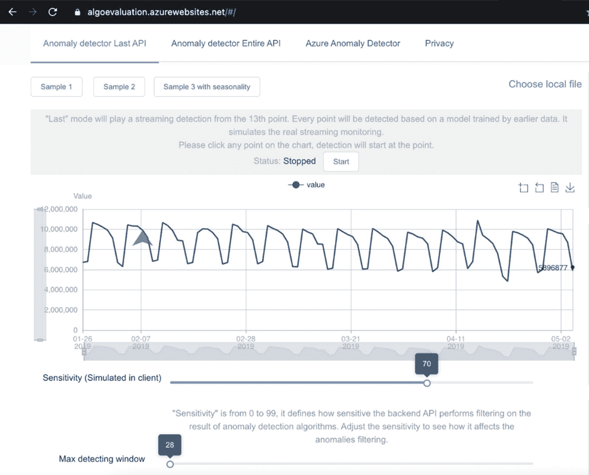

**图 6-45** 异常检测器演示


#### 动手实践 – 异常检测器演示

为了有效展示异常检测器服务的用法，我们将遵循以下步骤：

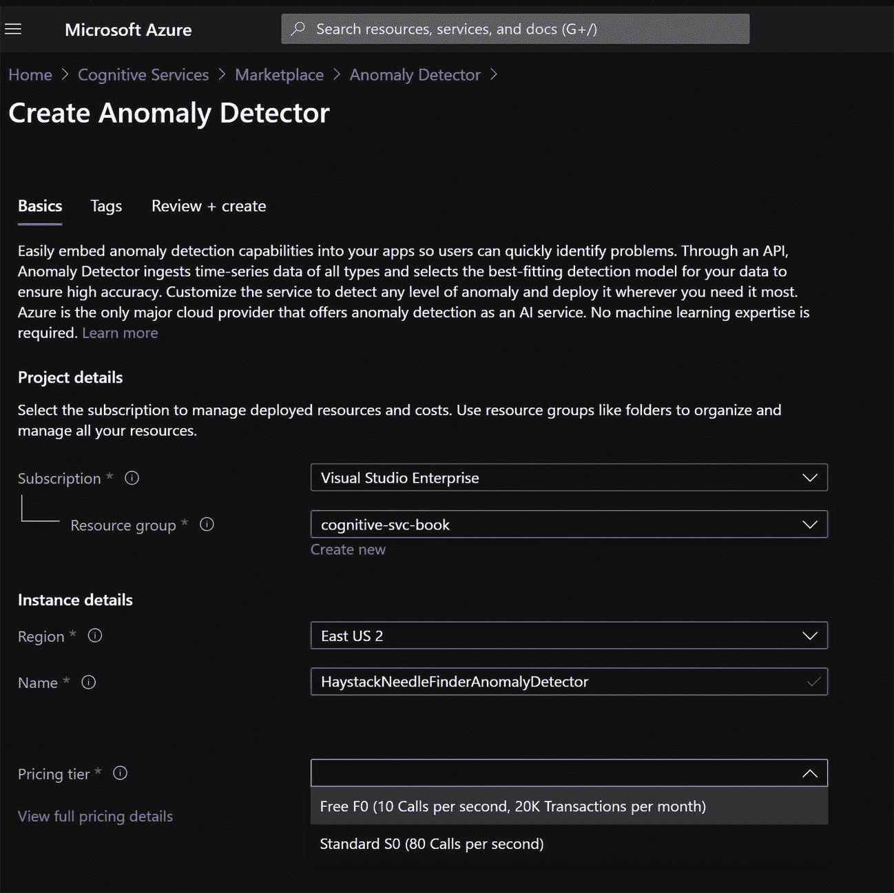

图 6-46

认知服务 – 设置异常检测器服务

- 让我们创建一个异常检测器服务实例，如图 6-46 所示。你将重复之前的流程：从 [`https://portal.azure.com`](https://portal.azure.com) 开始，搜索异常检测器服务，然后继续创建你的工作。

设置异常检测器服务参数，然后点击**创建**。服务会验证参数，然后创建实例。见图 6-47。

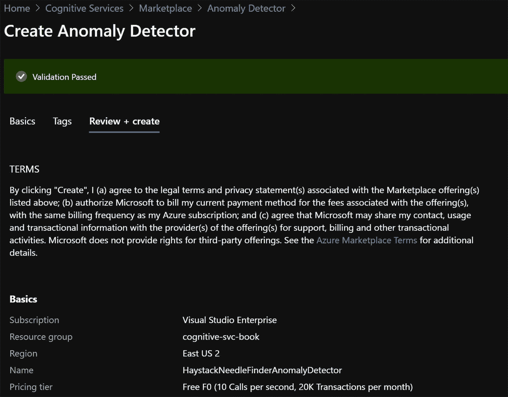

图 6-47

认知服务 – 异常检测器服务验证完成

部署完成后，你将看到如图 6-48 所示的界面。点击**转到资源**继续。

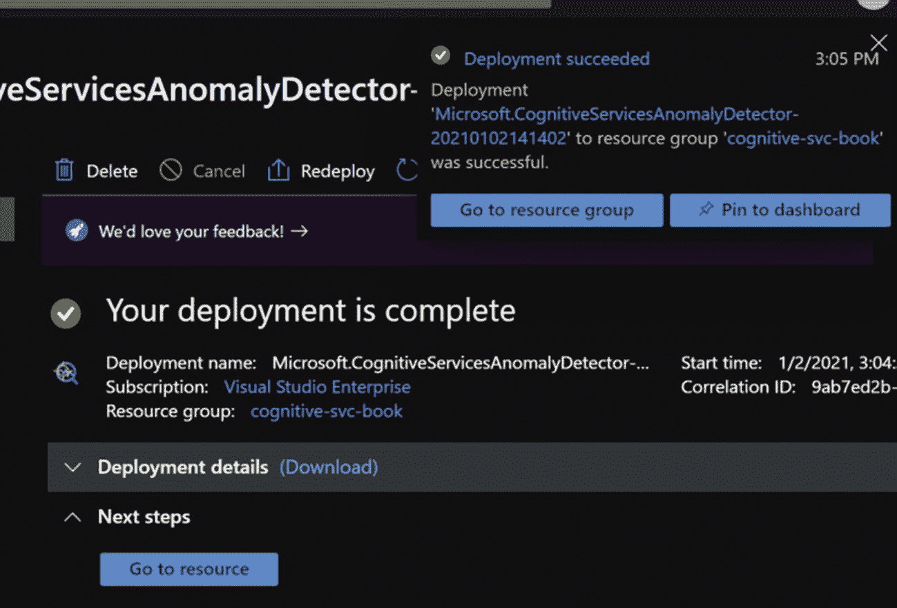

图 6-48

认知服务 – 异常检测器服务部署完成

快速入门页面是开始使用异常检测器服务的好方法。最佳方式之一是查看图 6-49 中第 2 部分所示的 API 控制台。点击 **API 控制台** 链接进入 API 控制台。

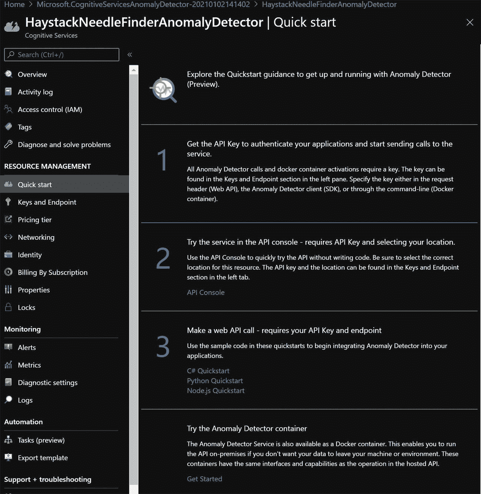

图 6-49

异常检测器服务 – 快速入门

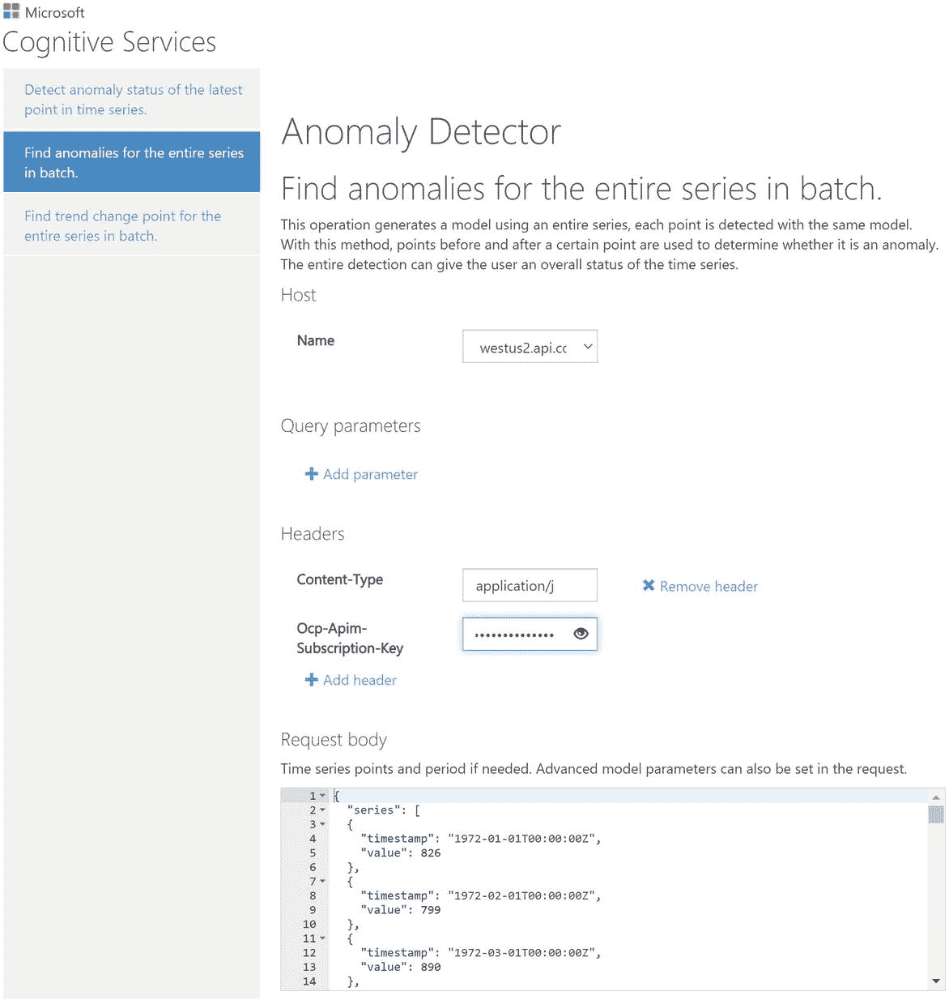

图 6-50

异常检测器批量调用

1. API 控制台是一个基于 Web 的 UI，用于演示异常检测器的功能，如图 6-50 所示。你可以通过 [`https://westus2.dev.cognitive.microsoft.com/docs/services/AnomalyDetector/operations/post-timeseries-entire-detect/console`](https://westus2.dev.cognitive.microsoft.com/docs/services/AnomalyDetector/operations/post-timeseries-entire-detect/console) 访问该控制台。

控制台需要订阅密钥（如图 6-51 所示）。该密钥可以从主控制台中的**密钥和终结点**链接获取。

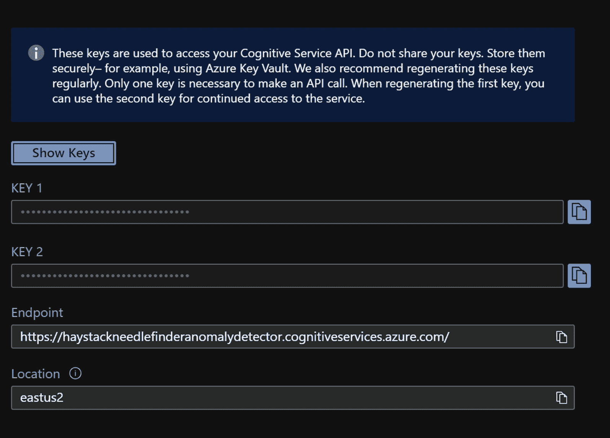

图 6-51

认知服务实例化 – 密钥和终结点

请求体预先填充了时间序列数据和一组值。这些值作为 HTTP 请求的一部分传递给异常检测器服务（如图 6-52 所示）。

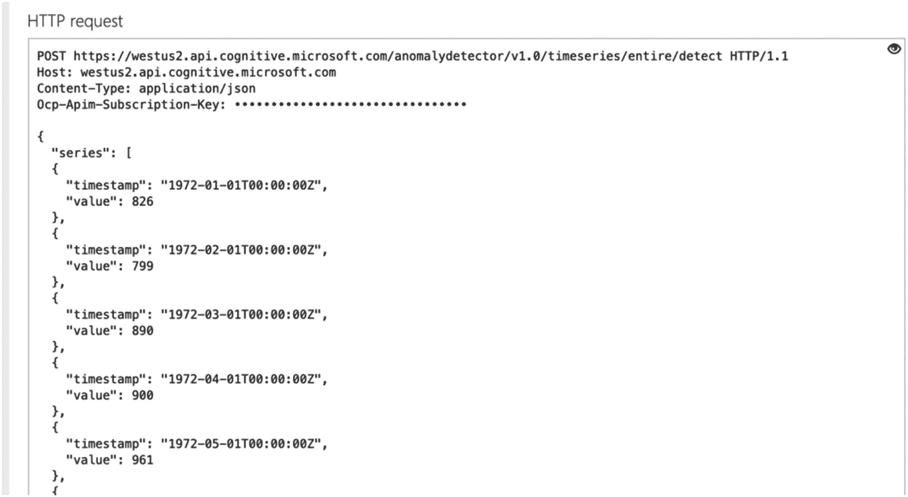

图 6-52

异常检测器服务笔记本 – 请求

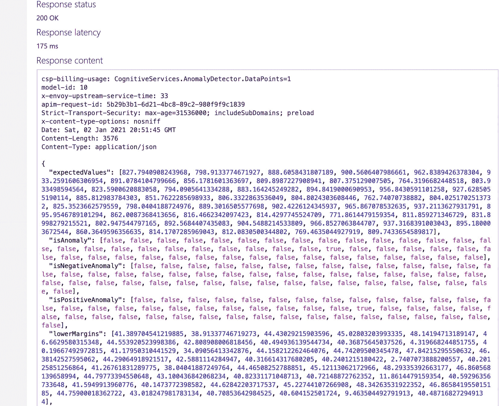

图 6-53

异常检测器服务笔记本 – 响应

1. 一旦调用，异常检测器服务便会施展其魔力，并返回详细的响应，其中包含预期值和异常。异常是有方向性的（例如正向异常与负向异常），你还可以看到这些结果的边界（范围）。异常检测器 SDK 和 API 响应的详细信息可在 [`https://docs.microsoft.com/en-us/dotnet/api/microsoft.azure.cognitiveservices.anomalydetector.models?view=azure-dotnet-preview`](https://docs.microsoft.com/en-us/dotnet/api/microsoft.azure.cognitiveservices.anomalydetector.models%253Fview%253Dazure-dotnet-preview) 找到。示例响应见图 6-53。

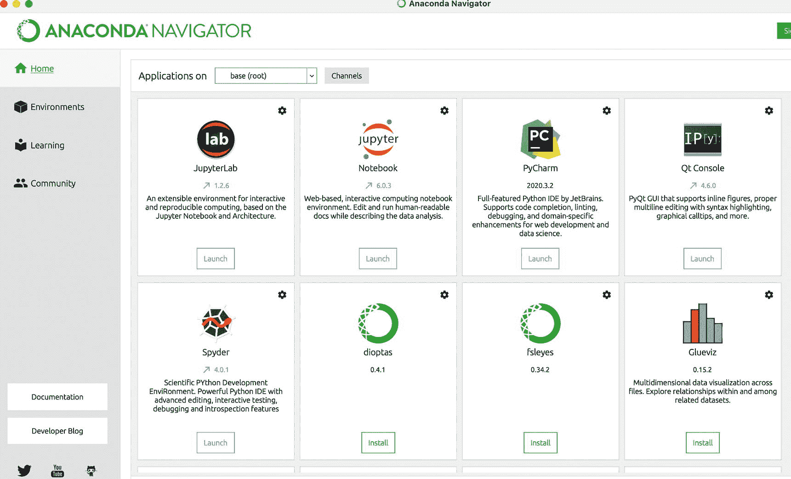

图 6-54

Anaconda Navigator 环境

1. 与前两个示例（我们将解决方案创建为 .NET 应用程序）不同，我们将带你进入使用 Anaconda 的 Jupyter 笔记本世界。笔记本之于数据科学家，就如同 IDE 之于软件开发人员。许多软件工程师正转向使用笔记本进行 Python 工作，因为它们易于使用且无状态。

微软曾提供其自己的笔记本版本，称为 Azure 笔记本（[`https://notebooks.azure.com/`](https://notebooks.azure.com/)），但该服务已退役。现在，你可以将笔记本与 Azure 机器学习一起使用（参见 [`https://docs.microsoft.com/en-us/azure/notebooks/quickstart-export-jupyter-notebook-project#use-notebooks-with-azure-machine-learning`](https://docs.microsoft.com/en-us/azure/notebooks/quickstart-export-jupyter-notebook-project%2523use-notebooks-with-azure-machine-learning)）。对于本实验，我们将使用基于 Anaconda 的 Jupyter 笔记本。首先从 [`www.anaconda.com/products/individual`](http://www.anaconda.com/products/individual) 下载并安装 Anaconda。安装完成后，你将看到类似于图 6-54 所示的界面。

继续点击 JupyterLab 面板上的**启动**按钮，这将打开 Jupyter 环境。

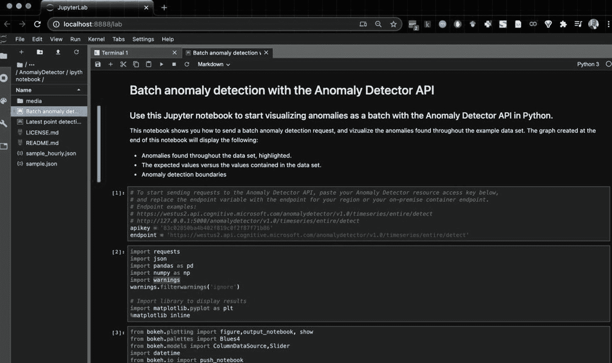

图 6-55

异常检测器服务笔记本

1. 对于此示例，我们将使用 Azure 示例提供的异常检测器笔记本。你可以从 [`https://github.com/Azure-Samples/AnomalyDetector`](https://github.com/Azure-Samples/AnomalyDetector) 克隆 GitHub 仓库。该仓库包含示例数据、Python 笔记本和快速入门示例。克隆后，导航到文件夹 `\AnomalyDetector\ipython-notebook`，然后从左侧窗格打开文件 `Batch anomaly detection with the Anomaly Detector API.ipynb`（如图 6-55 所示）。

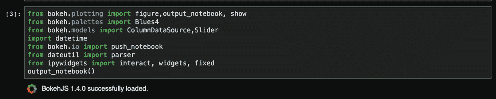

图 6-56

异常检测器服务笔记本 – 初始化先决条件

1. 使用异常检测器 API，你可以对时间序列数据执行批量识别和点（流式）识别。批量检测适用于特定时间跨度内的一批数据点，而流式异常则持续监控每个数据点。异常检测器 API 是一种无状态服务，其性能在很大程度上取决于时间序列数据的准备、所使用的 API 参数以及数据点的数量。在此示例中，我们设置了所有先决条件，包括交互式可视化库 Bokeh，如图 6-56 所示。

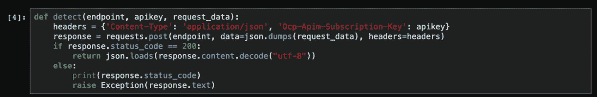

图 6-57

异常检测器服务笔记本 – 检测方法


1.  一旦所有先决条件准备就绪，你就可以通过 `detect()` 方法调用 API，该方法接收数据集、订阅密钥和终结点，然后调用服务。图 6-57 展示了该方法的描述。

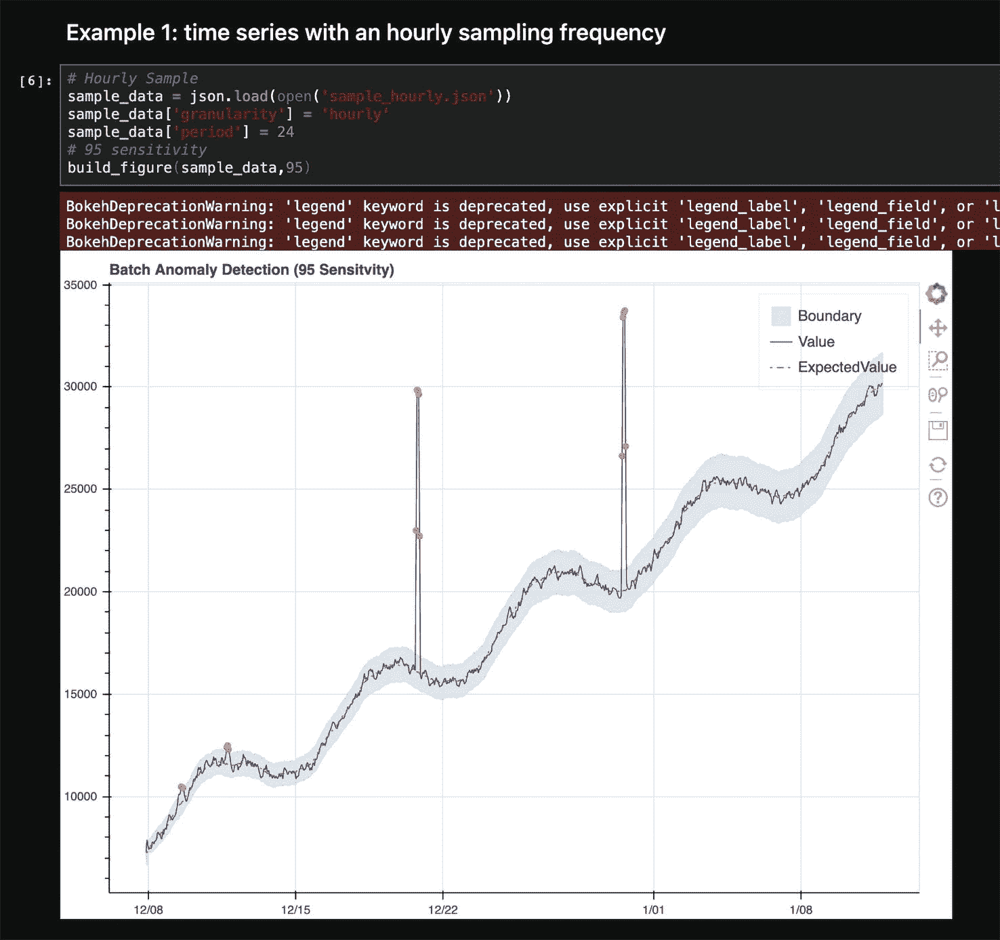

图 6-58

异常检测器服务 – 每小时采样频率

1.  完成后，运行每小时采样频率分析器（单元格 #6），如图 6-58 所示。构建图形方法接收两个参数：样本数据和敏感度，然后绘制带有边界、预期值和实际值的异常点。

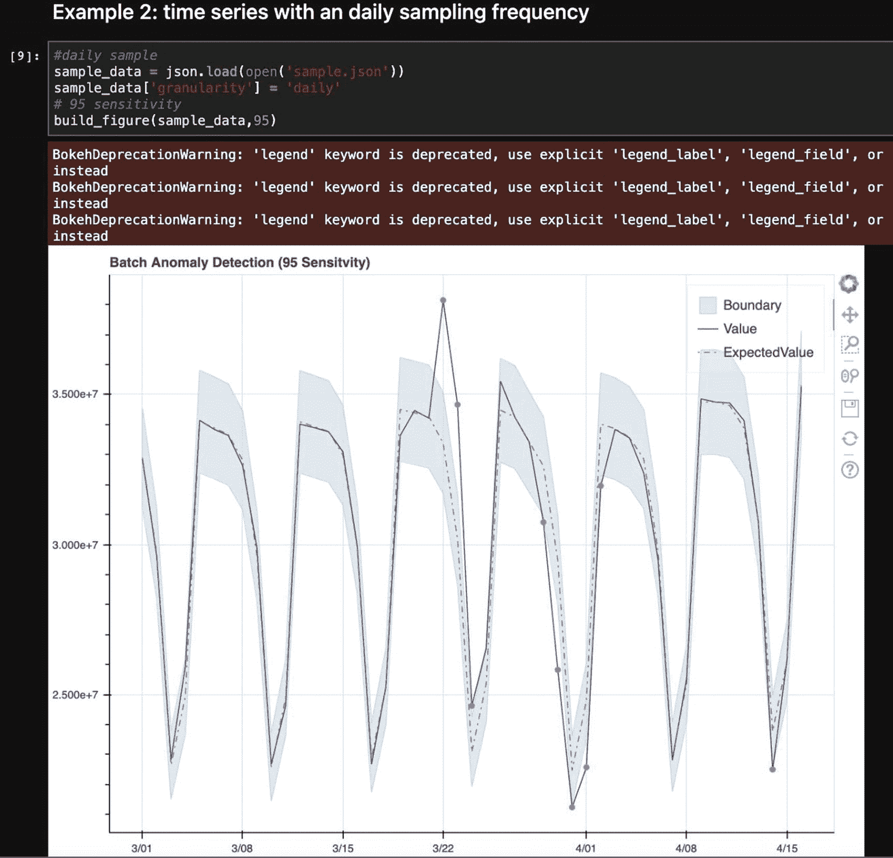

图 6-59

异常检测器服务 – 每日采样频率

1.  与每小时采样类似，你可以通过调用单元格 #9 来执行每日采样频率的时间序列分析，如图 6-59 所示。在此，我们将粒度设置为每日（与每小时相比）并构建图形。它展示了数据集中的每日异常点，以及相关的边界、值和预期值。

至此，我们对异常检测器服务的介绍就结束了。你可以在微软文档中阅读更多关于异常检测器的信息，地址为 [`https://docs.microsoft.com/en-us/azure/cognitive-services/anomaly-detector`](https://docs.microsoft.com/en-us/azure/cognitive-services/anomaly-detector)。

### 指标顾问（预览版）

Azure 认知服务的最新成员之一是指标顾问（参见 [`https://azure.microsoft.com/en-us/services/cognitive-services/metrics-advisor`](https://azure.microsoft.com/en-us/services/cognitive-services/metrics-advisor)）。它是异常值分析服务的一个特例。在撰写本文时，指标顾问仍处于预览阶段，这意味着其界面和底层服务可能会发生变化。指标顾问是一项认知服务，有助于监控不同的指标，并协助进行根本原因分析。工作流程步骤如图 6-60 所示。

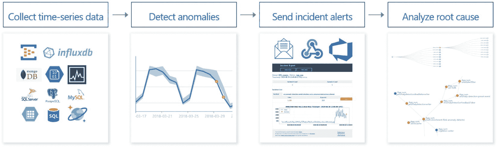

图 6-60

指标顾问工作流程，图片由微软文档提供

将人工智能和机器学习应用于运维是一个备受关注的领域。事实上，它在 IT 运维中催生了一个全新的子领域，称为 AIOps。即利用 AI 技术从各种事件管理系统中进行数据摄取、执行异常检测以及相应的诊断。指标顾问用于关联和分析来自多个来源的数据，然后诊断异常及其相关的根本原因。与异常检测器服务不同，指标顾问不仅关注异常点检测，还协助进行根本原因分析和事件告警管理。

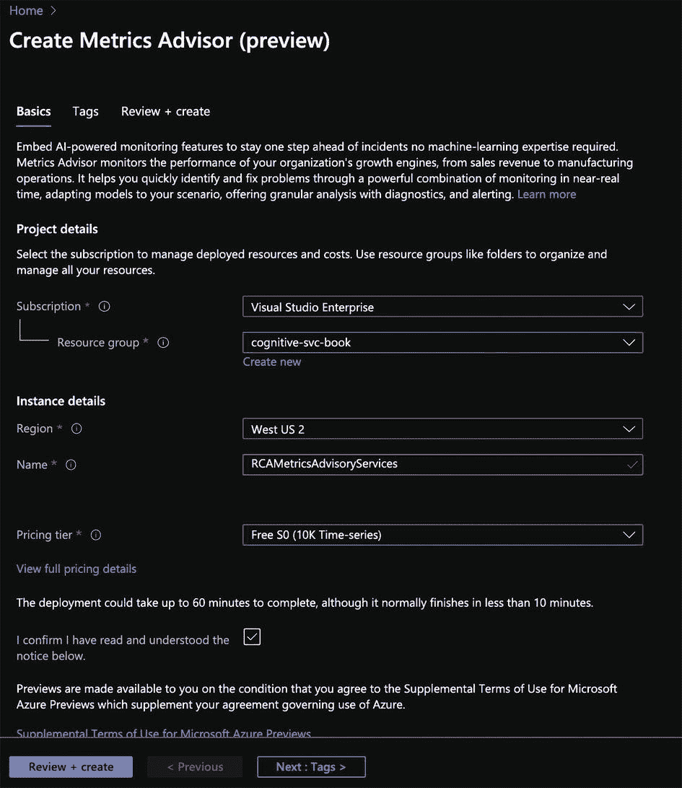

图 6-61

指标顾问控制台 – 设置

1.  与所有认知服务一样，我们首先在 `portal.azure.com` 中创建一个指标顾问实例，并设置参数。参见图 6-61。

在这种情况下，部署需要一段时间（大约 22 分钟）才能完成，可能是因为该服务仍处于预览阶段。参见图 6-62。

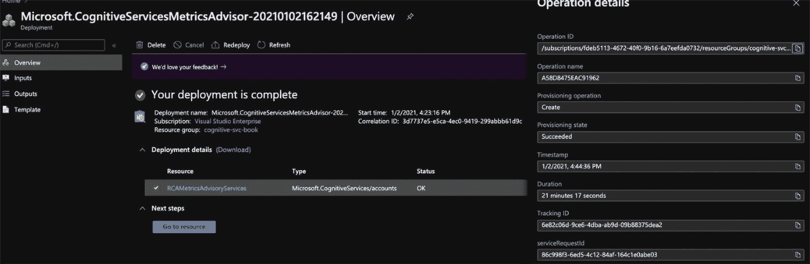

图 6-62

指标顾问控制台 – 部署完成

点击 **转到资源** 打开快速入门页面，该页面展示了你可以使用指标顾问服务执行的多项操作。在第一步中点击 **转到你的工作区**。参见图 6-63。

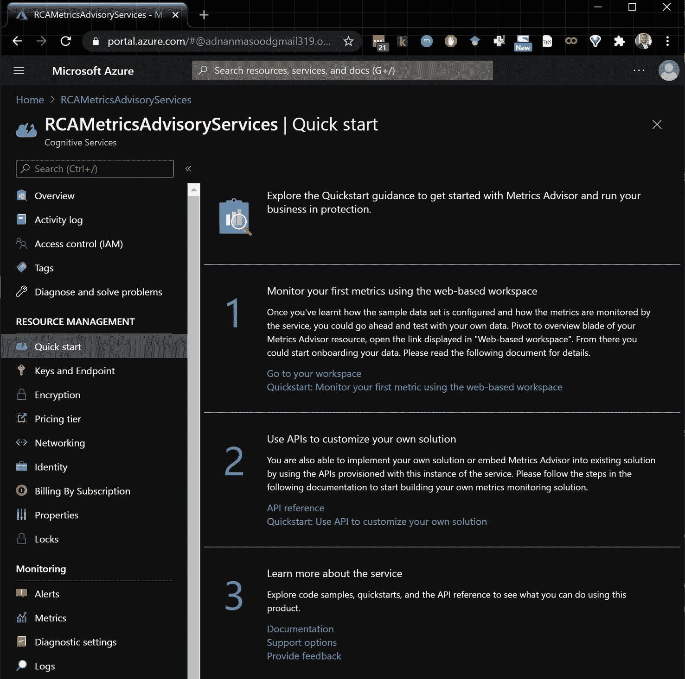

图 6-63

指标顾问控制台 – 快速入门

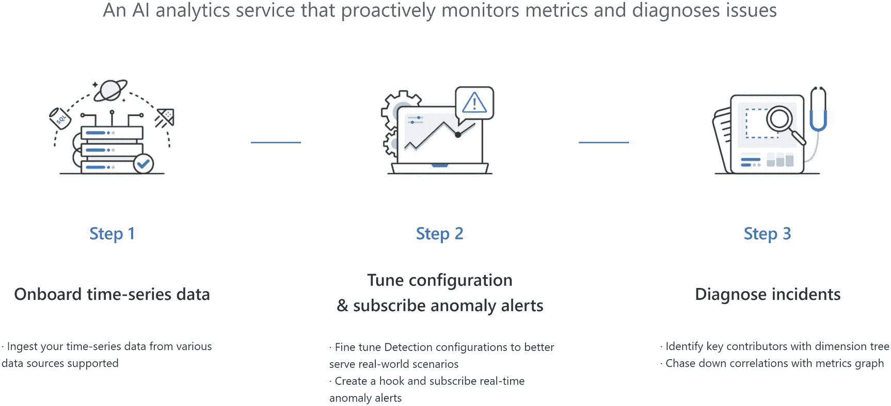

图 6-64

指标顾问服务控制台

1.  这应该会将你带到 [`https://metricsadvisor.azurewebsites.net`](https://metricsadvisor.azurewebsites.net)，你可以在那里登录并创建你自己的顾问（如图 6-64 所示）。在此页面上，你需要指定目录（组织）、订阅和关联的工作区。

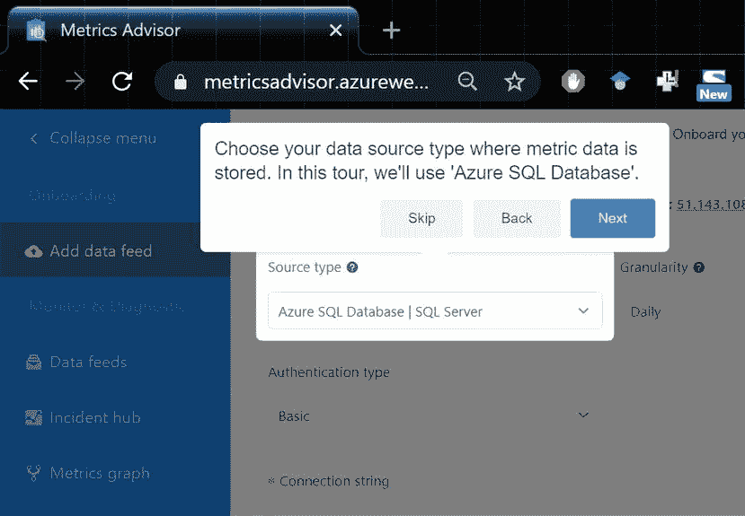

图 6-65

指标顾问服务控制台

1.  完成后，你将逐步完成详细的指标顾问分步教程，以熟悉该环境。这包括创建数据源，如图 6-65 所示。

接下来，你选择指标的粒度（时间段），如图 6-66 所示。

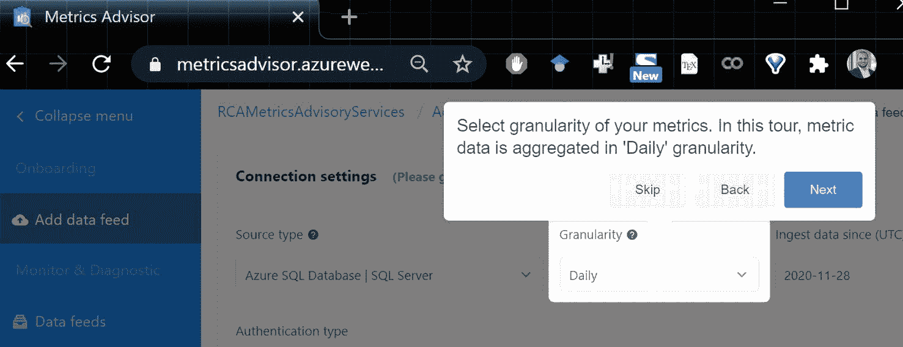

图 6-66

指标顾问服务控制台 – 设置

你可以对时间序列数据执行基本配置，例如第一个可用时间戳（参见图 6-67）。

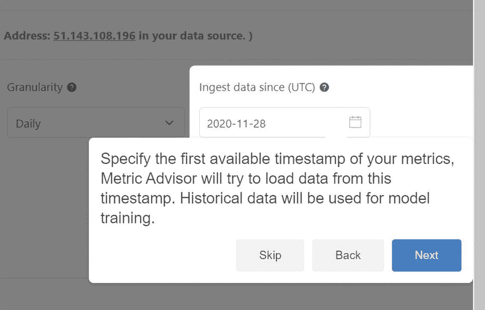

图 6-67

指标顾问服务控制台

提供这些初始设置信息后，你现在可以消费数据馈送并与之交互、在事件中心创建馈送、查看指标图表、创建数据挂钩以及访问 API 密钥以从服务中消费这些数据。参见图 6-68。

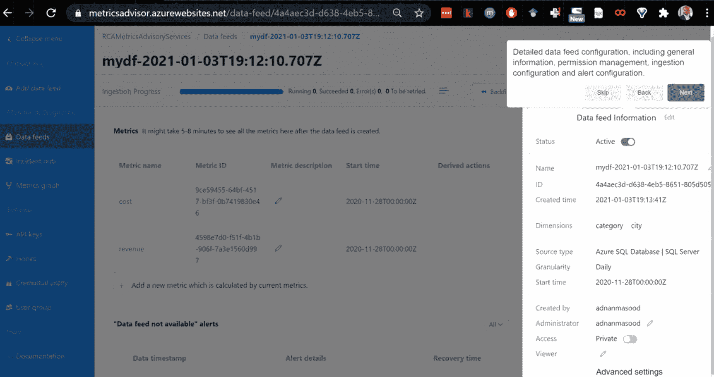

图 6-68

指标顾问服务控制台

指标顾问门户帮助你载入指标数据（例如事件日志和 SIEM 数据）、提供诊断见解、可视化指标、针对特定用例改进检测配置，并为异常点创建警报。

这项全新且全面的指标顾问服务正在根据客户需求和反馈不断发展。它很快将毕业，成为出色的认知服务套件的正式成员。敬请期待。

## 总结与结论

在本章中，你已经对基于决策的认知服务和决策 API 的工作原理有了基本的了解。你创建了一个内容审查器应用程序，使用个性化服务打造了个性化体验，使用异常检测器审查了时间序列异常，并使用指标顾问服务探索了 AIOps 领域。正如你可能意识到的，要深入详细地介绍这些服务是相当困难的。因此，对于某些内容的简略介绍（以保持相对简洁），我们深表歉意。请放心，相关链接和微软文档提供了足够丰富的信息供你进一步探索。

现在轮到你了——我们迫不及待地想听到你如何在你的组织中使用这些服务来做出重要决策！


