# 7. 搜索 – 为你的应用程序添加搜索功能

尤达大师去世时多少岁？

一升等于多少夸脱？

福勒街上那家波霸奶茶店营业到几点？

嘿，谷歌，学猫叫。

好吧，最后一个请求可能不太相关。无论如何，从我们的日常行为中可以明显看出，数字搜索已成为现代人类思维的延伸。搜索无处不在——从我们的个人生活，到我们创建和为之工作的公司；我们在日常生活中不断搜索信息。随着我们寻求的信息变得更加多样化、多模态和分散，搜索也变得越来越复杂。我们现在严重依赖上下文相关的自然语言搜索，其答案跨越多个文档（包括图像、PDF、文本文件和结构化数据）。我们的搜索还包括人物和地点、个人和企业名称以及其他实体，这些很可能需要对拼写和意图进行自动更正。

通过提问，我们借助搜索引擎探索互联网，探查数据点，并寻找教程、指南和操作视频。我们还查询公司内部网门户以处理假期/休假申请和共付金额，搜寻医疗服务提供者的覆盖范围和地点，并调查哪些法律条款属于特定合同。尽管我们越来越擅长探查所有这些信息，但数据本身并不会自动变得易于检查。

根据大多数估计，超过 80%的组织数据是非结构化的。（请参阅 `www.forbes.com/sites/bernardmarr/2019/10/16/what-is-unstructured-data-and-why-is-it-so-important-to-businesses-an-easy-explanation-for-anyone` 上的“什么是非结构化数据，为什么它对商业如此重要？”）。所有这些非结构化数据带来了信息提取的实际挑战，例如解析、光学字符识别、命名实体识别、依存句法分析以及其他数据增强需求。但别担心，微软基于 AI 的搜索来帮忙了！

在本章中，我们将通过向应用程序添加各种搜索功能，提供关于必应搜索 API 和 Azure 认知搜索的见解。在本章中，你将学习以下内容：

1. 理解搜索、必应搜索 API 和认知搜索。

2. 通过添加必应搜索和 Azure 认知搜索功能来创建智能搜索应用程序。

让我们开始吧。

## 搜索生态系统

微软的搜索生态系统经历了几次迭代，可以简单解释如下。

`Azure 认知搜索`，以前称为`Azure 搜索`，是微软的企业搜索能力（你可以选择自己的数据源进行爬取和索引）。因此，尽管从技术上讲它可以涵盖网络搜索，但其功能远不止于此。你还可以选择索引的频率。本质上，你可以创建自己的数据源混搭来进行索引。

`必应搜索`特指微软的企业网络搜索。你可以创建允许企业搜索的网络域隔离区。`Azure 认知搜索`是一种自定义的企业搜索。它可以隔离到本地、私有和企业特定的数据，并可以选择包含自定义的公共域。相比之下，`必应搜索`是一个可以过滤的公共域。

目前，`必应搜索 API`被列为`Azure 认知服务`的一部分，这可能会造成混淆。然而，微软已宣布`必应搜索 API`将于 2023 年 10 月 31 日从`Azure 认知服务`过渡到`Azure Marketplace`^(¹⁶)，这将有助于解决关注点分离的问题。根据公告，“使用认知服务预配的必应搜索 API 将在未来三年内或直到企业协议结束（以先到者为准）得到支持。”

## Azure 认知搜索

`Azure 认知搜索`（以前称为`Azure 搜索`）是基于 AI 的搜索服务，具有广泛的数据增强能力，包括 OCR、NER 和关键短语提取。作为完全托管的服务提供，`Azure 认知搜索`得到了微软研究院在 NLP、Office、必应和其他搜索解决方案方面数十年工作的支持。凭借对某些数据源的爬取能力，`Azure 认知搜索`提供地理空间搜索、筛选、自动完成以及搜索堆叠或分面功能。自定义模型有助于支持你的主题领域以及特定领域的客户需求。有关该服务的更多信息，请访问 `https://azure.microsoft.com/en-us/services/search/`。

### 使用 Azure 认知搜索进行搜索

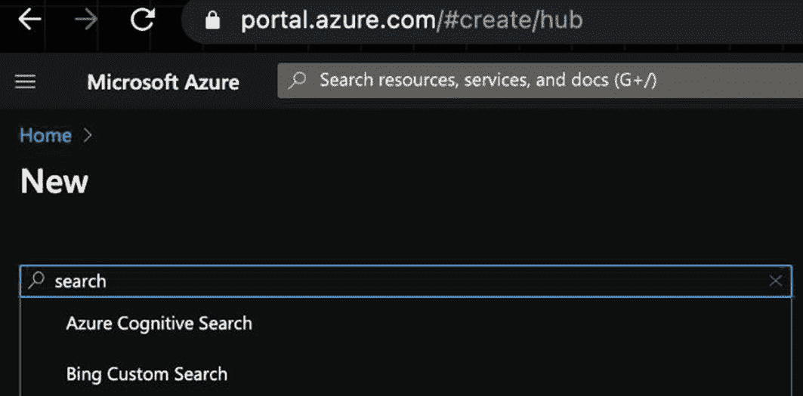

图 7-1：Microsoft Azure 门户产品搜索结果

1. 在 Azure 门户中，搜索 `Azure Cognitive Search`，然后在下拉菜单中点击 `Azure Cognitive Search` 搜索结果（如图 7-1 所示）。选择 `Azure Cognitive Search`。

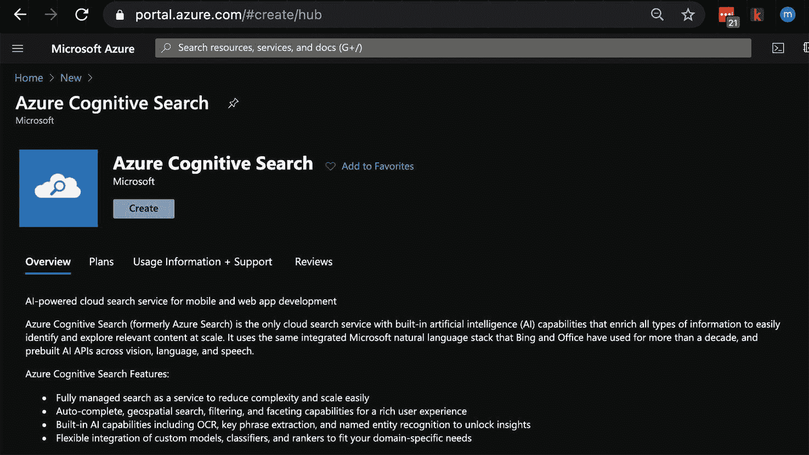

图 7-2：Microsoft Azure 认知搜索 – 创建产品界面

1. 图 7-2 中的界面展示了 `Azure Cognitive Search` 的所有功能和特性。如前所述，这包括可扩展性、可管理性、功能增强（OCR、NER、分面）以及自定义模型。点击 `Create` 继续。

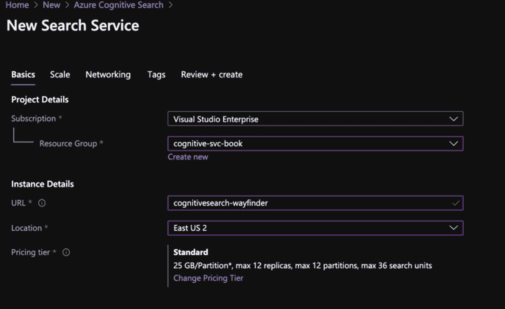

图 7-3：Azure 认知搜索 – 创建实例

1. 填写信息以创建服务。这包括订阅信息、唯一 URL、资源组、位置和定价信息（如图 7-3 所示）。

以下定价信息（图 7-4）针对不同层级。价格可能随时变化，此处仅作为示例参考。使用前请查看当前定价信息。

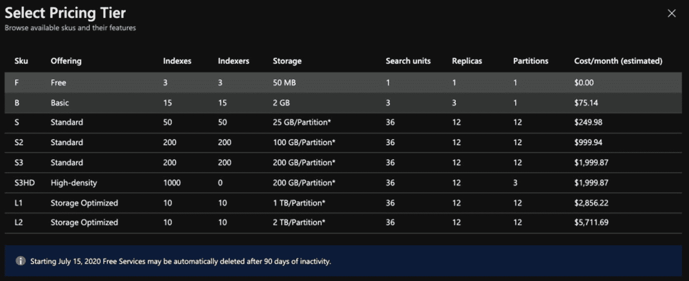

图 7-4：Azure 认知搜索 – 选择定价层

> **注意：** 务必确保你的搜索实例和用于数据增强的 `Cognitive Services` 实例位于同一区域。如果你希望迁移服务，请确保目标区域支持这些产品^(¹⁷)。

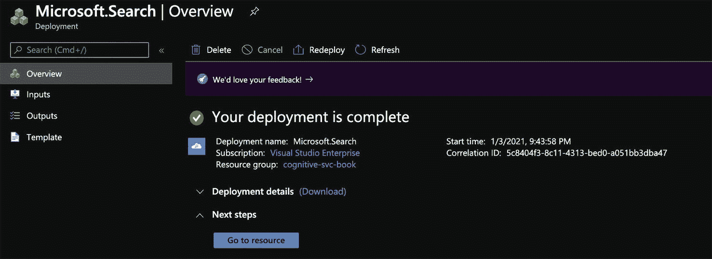

图 7-5：Azure 认知搜索 – 部署完成

1. 创建服务完成后，你将看到图 7-5 中的界面。点击 `Go to resource` 查看完整仪表板。

`Cognitive Services` 仪表板（如图 7-6 所示）包含配额、服务状态、位置、订阅信息和用量信息的详细信息。该仪表板对于监控存储和索引在添加更多数据源时的表现非常有用。

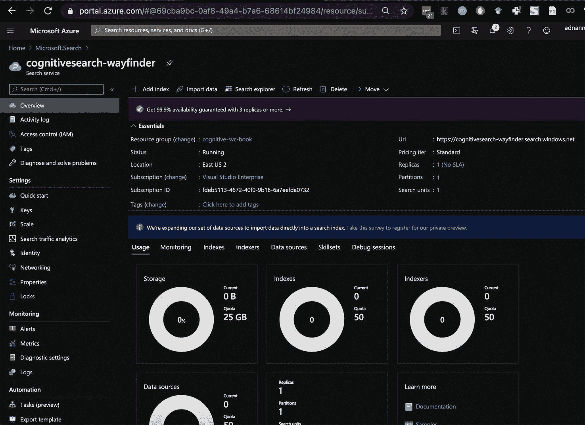

图 7-6：Azure 认知搜索 – 仪表板

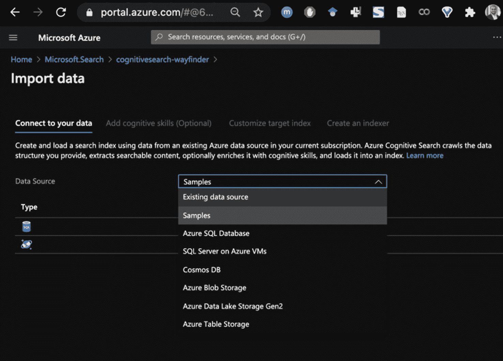

图 7-7：Azure 认知搜索 – 导入数据

1. 现在我们已经创建了一个搜索服务实例，接下来导入一些数据进行搜索。点击仪表板顶部菜单中的 `Import data`，你将看到连接数据的界面（如图 7-7 所示）。完成以下四个步骤：

   1. 连接到数据源（例如用于文档和 PDF 的 `Azure SQL Database`、`Azure VM 上的 SQL Server`、`Cosmos DB`、`Azure Blob Storage`、`Azure Data Lake Storage Gen2` 或 `Azure Table Storage`）。

   2. 添加认知技能进行增强（例如 NER、关键短语提取等）。

   3. 自定义目标索引。

   4. 最后，创建索引器。

为简单起见，我们将从示例中导入数据，具体是房地产示例（如图 7-8 所示）。

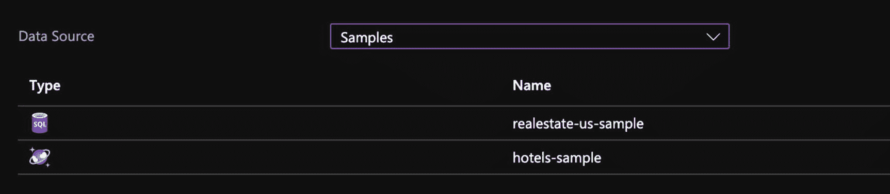

图 7-8：Azure 认知搜索 – 导入数据集

数据来自 SQL，包含有关房屋的房地产信息。下一步是添加增强或认知技能，如图 7-9 所示。在此案例中，我们将执行一些有限的增强来识别实体。

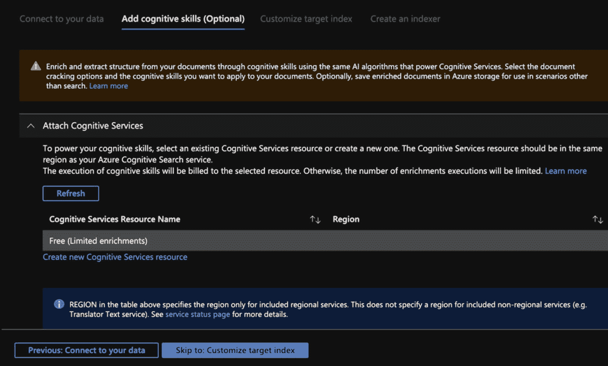

图 7-9：Azure 认知搜索 – 添加认知技能

`Cognitive Services` 增强包括提取人名、组织名和地名，检测关键短语，以及提取个人身份信息 (PII)。你可以创建自定义增强，并添加特定领域的技能来识别行业关键词和短语。例如，`ICD-10-CM/PCS 医学编码参考` 可以映射到相应的诊断和程序关键词。在 `Azure Cognitive Search` 增强管道中，你可以做很多事情来构建自定义技能。你可以在 [`https://docs.microsoft.com/en-us/azure/search/cognitive-search-attach-cognitive-services#limits-when-no-cognitive-services-resource-is-selected`](https://docs.microsoft.com/en-us/azure/search/cognitive-search-attach-cognitive-services%2523limits-when-no-cognitive-services-resource-is-selected) 阅读关于将 `Cognitive Services` 资源附加到 `Azure Cognitive Search` 技能集的详细信息。在本练习中，我们仅执行命名实体识别增强。见图 7-10。

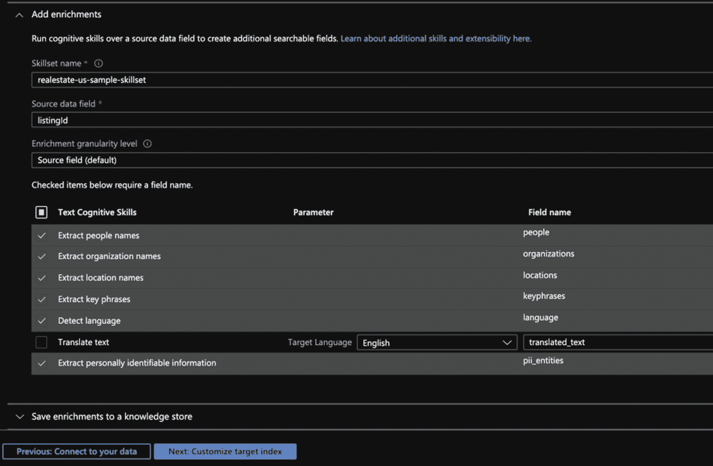

图 7-10：Azure 认知搜索 – 添加认知技能增强

添加认知技能增强后，`Azure Cognitive Search` 设置的下一步是创建目标索引。如果你熟悉其他搜索程序，例如 `Apache Solr`、`Apache Lucene` 或 `Elasticsearch`，你可能知道索引有助于加速搜索。它存储用于全文搜索的内容，以便通过物理模式优化以实现更快的搜索。在图 7-11 中，你将找到推荐的索引，以及列出的可检索、可筛选、可排序、可分面和可搜索的字段。这个目标索引让你能够出色地控制数据，从而可以精细地包含或排除要包含在搜索中的属性。对于数值，例如卧室和浴室的数量，你可以要求其可排序。Microsoft 通过预选默认值使其变得非常容易，如图 7-11 所示。

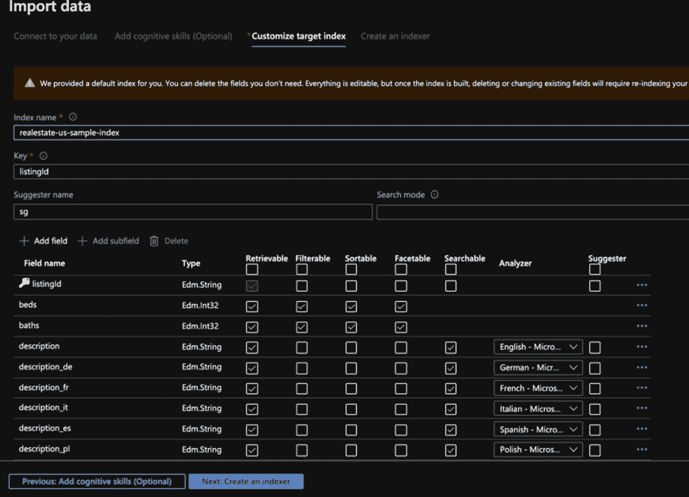

图 7-11：Azure 认知搜索 – 自定义目标索引

最后一步是创建索引器并定义其运行频率（见图 7-12）。

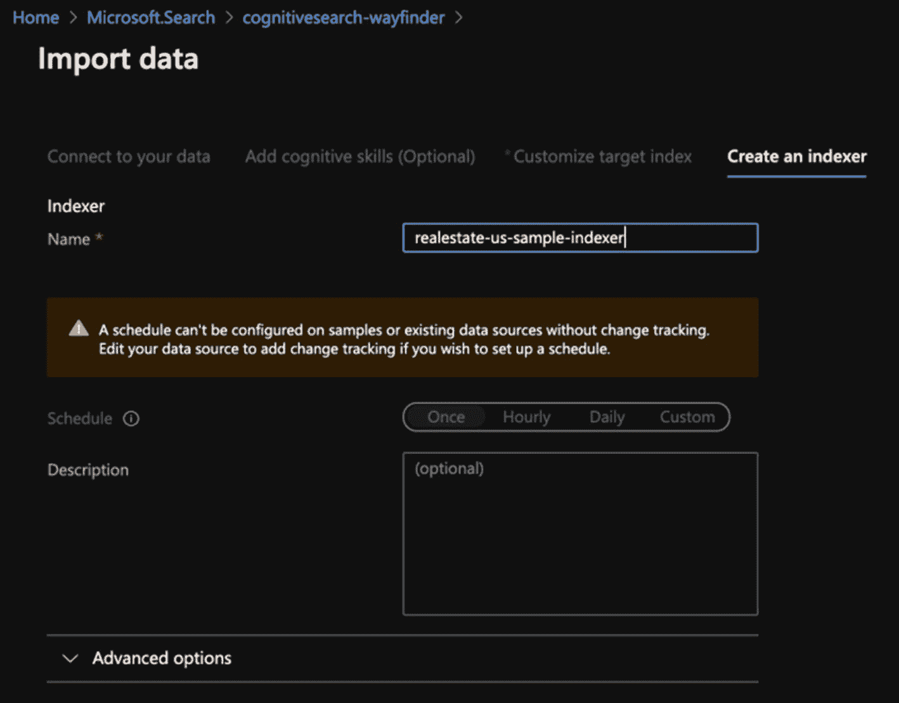

图 7-12：Azure 认知搜索 – 创建索引器

### 测试 Azure 认知搜索

创建索引器后，您可以返回仪表板查看进度。您可以直接从控制台调用该服务。搜索资源管理器让您能够直接在 Azure 门户中执行此操作，以便查看请求和响应（结果），并确保其满足您的业务需求。图 7-13 演示了从搜索资源管理器调用服务的过程。

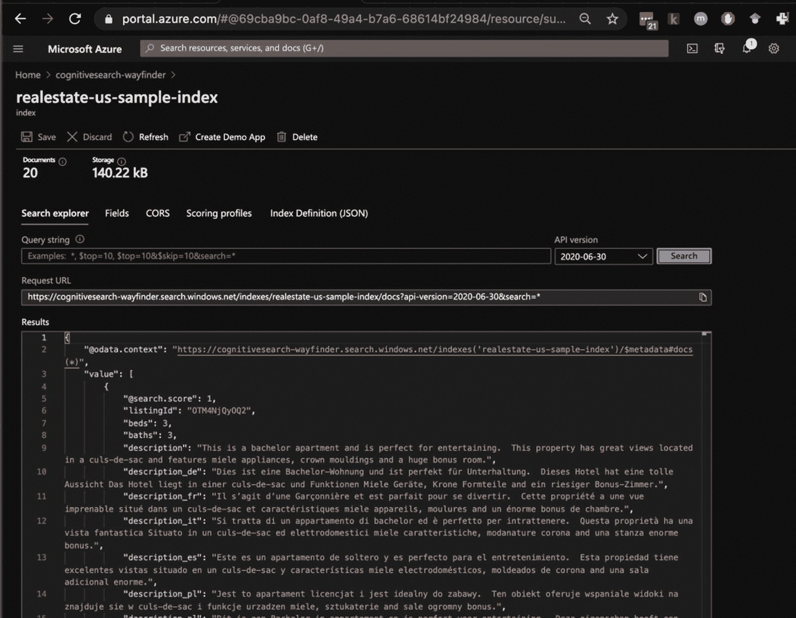

图 7-13：Azure 认知搜索 – 调用服务

微软让您能够非常轻松地将该服务作为应用程序的一部分来使用。搜索资源管理器工具还附带了一个预构建的基于 HTML 和 JavaScript 的应用程序，该应用程序可作为入门指南，帮助您在应用程序中构建和测试搜索结果。点击 `创建演示应用` 继续，您将看到如图 7-14 所示的屏幕，该屏幕要求您启用 CORS（跨域资源共享）。

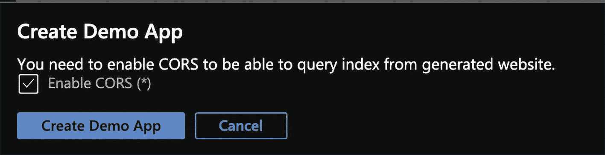

图 7-14：Azure 认知搜索 – 启用 CORS

CORS 是一种基于 HTTP 标头的机制，为跨域调用提供了限制措施。通过启用它，您可以允许桌面上的 HTML 文件调用 Azure 上的 RESTful API。在实际生产环境中，您可能需要更加谨慎，但这对于演示应用来说是可行的。现在，您可以开始为结果、侧边栏和建议配置演示应用（如图 7-15 所示）。

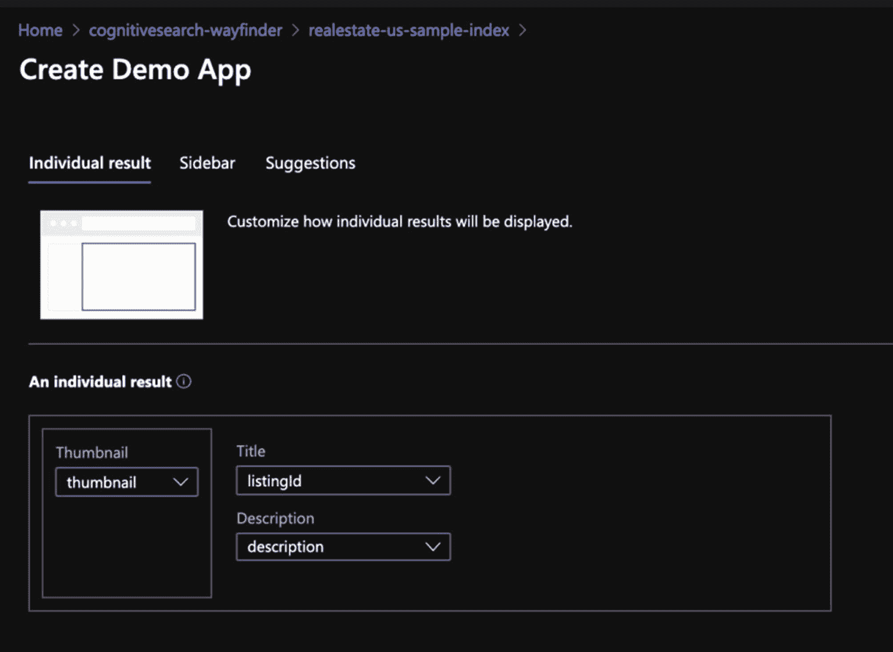

图 7-15：Azure 认知搜索 – 创建演示应用

瞧！我们有了一个用于产品列表的搜索引擎。HTML 文件 `AzSearch.html` 包含了进行 API 调用以及获取搜索和推荐结果所需的代码。例如，我们搜索一个住宅，如图 7-16 所示。

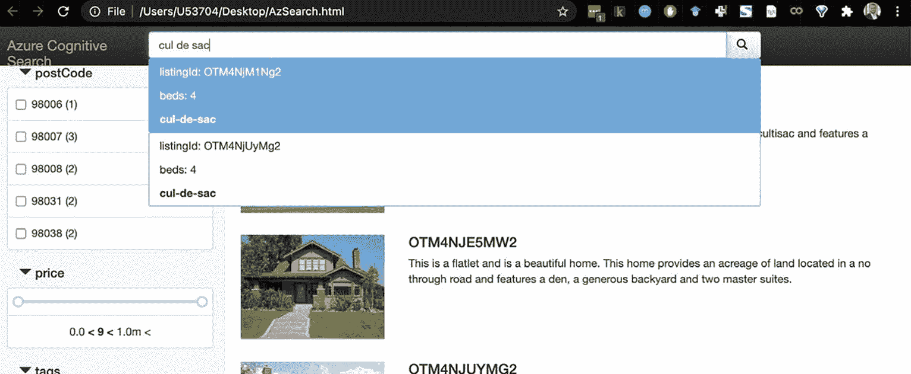

图 7-16：Azure 认知搜索 – 房地产搜索应用

搜索返回了可能的匹配项，如图 7-17 所示。

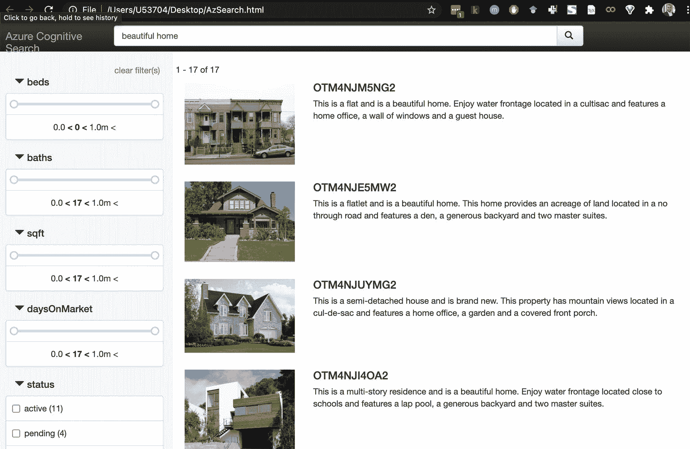

图 7-17：Azure 认知搜索 – 搜索应用结果

看到我们能如此快速地启动一个可搜索的房地产存储库，真是令人印象深刻。由于数据已经存在，能够以闪电般的速度进行搜索，并且采用低代码或无代码的方法，这对许多组织来说都是一种赋能。

在下一个示例中，我们将把 Azure 认知搜索作为 Jupyter notebook 的一部分来使用。

### 在 Notebook 中集成 Azure 认知搜索

在第 6 章中，我们讨论了 Jupyter notebook、Anaconda 以及这些自包含、可执行的 Python notebook 的强大功效，它们对数据科学家来说非常有用。在本示例中，我们将演示如何创建和调用 Azure 认知搜索 Python SDK。

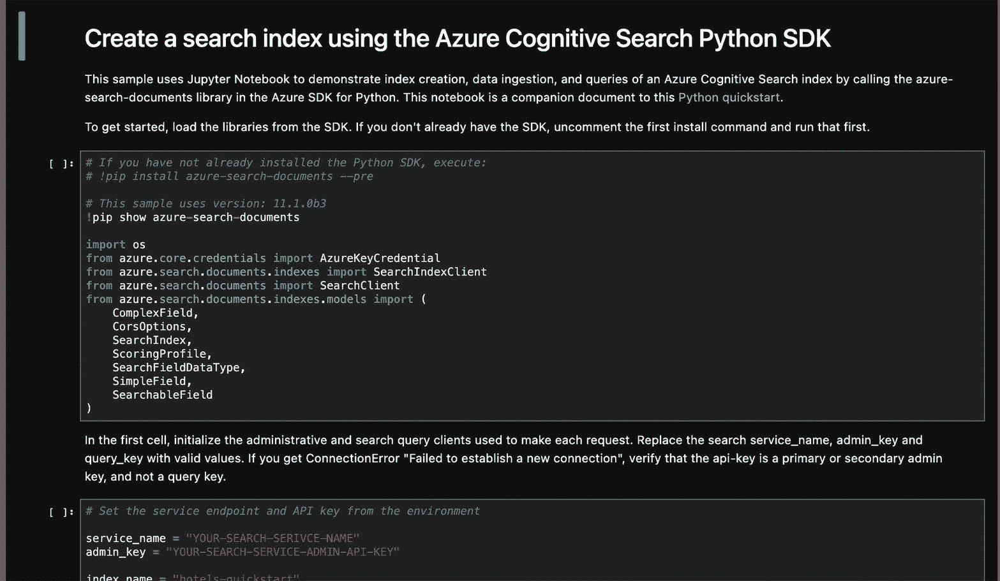

图 7-18：Azure 认知搜索 Python SDK – 创建搜索索引

1.  首先，从 GitHub（位于 [`https://github.com/Azure-Samples/azure-search-python-samples/tree/master/Quickstart/v11`](https://github.com/Azure-Samples/azure-search-python-samples/tree/master/Quickstart/v11)）克隆仓库^(¹⁸)。将其作为 Jupyter notebook 的一部分打开，如图 7-18 所示。

打开后，取消注释 `azure-search-documents` 包以确保您拥有先决条件，然后运行第一个单元格。在后台，您从 JSON 文件加载了 Azure 认知搜索示例酒店数据集^(¹⁹)，该数据集包含美国城市中 50 家酒店的信息，包括图片、酒店和房间信息。见图 7-19。

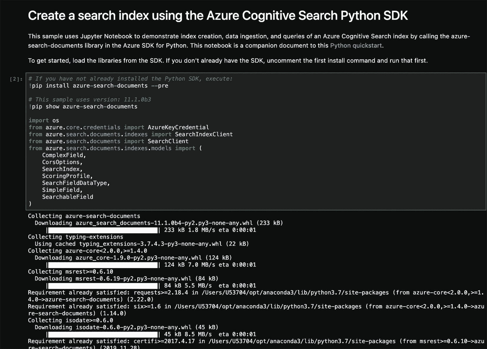

图 7-19：Azure 认知搜索 – 安装先决条件

完成先决条件后，用相关信息填充服务名称和管理员密钥。您可以在仪表板的“密钥”和“终结点”部分找到这些信息。然后，代码会创建 SDK 客户端，如图 7-20 所示。该客户端（搜索客户端）用于调用服务。

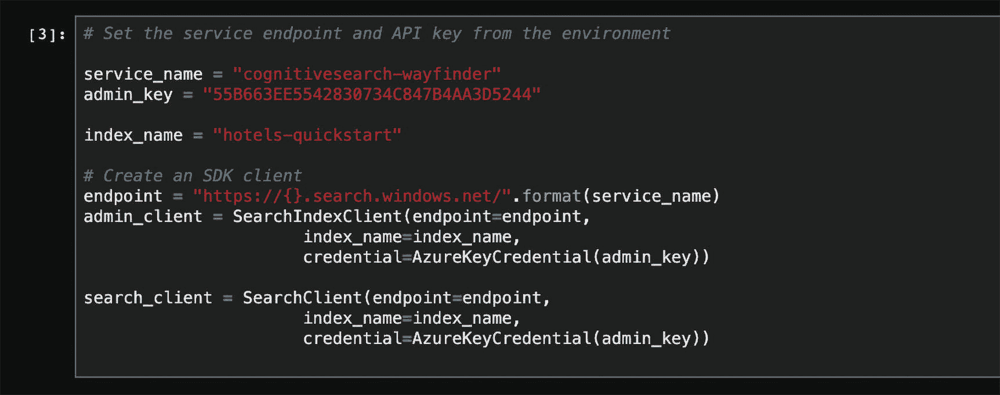

图 7-20：Azure 认知搜索 – 设置参数

现在，我们可以检查其他参数（如自动完成），并对不完整的文本（如 `"sa"`）进行调用。您可以想象输入了 `sa`，在后台，您会得到结果 `san Antonio` 或 `Sarasota`（如图 7-21 所示）。然后由用户进行过滤。所有这些功能都内置于 API 中。

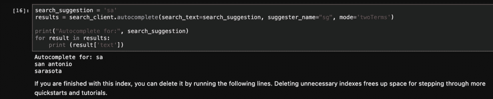

图 7-21：Azure 认知搜索 – 自动完成调用

API 还允许调用 `get_document()` 函数来获取特定项目（此处为酒店）的信息。请参见图 7-22 中的示例。

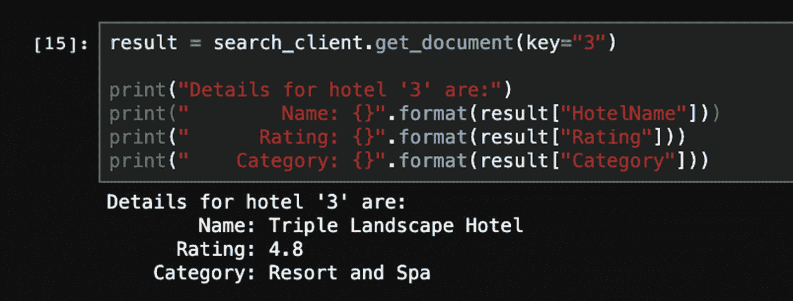

**图 7-22** Azure 认知搜索 – 文档检索

您还可以追加到索引中，并添加额外的文档列表，例如酒店（如图 7-23 所示）。

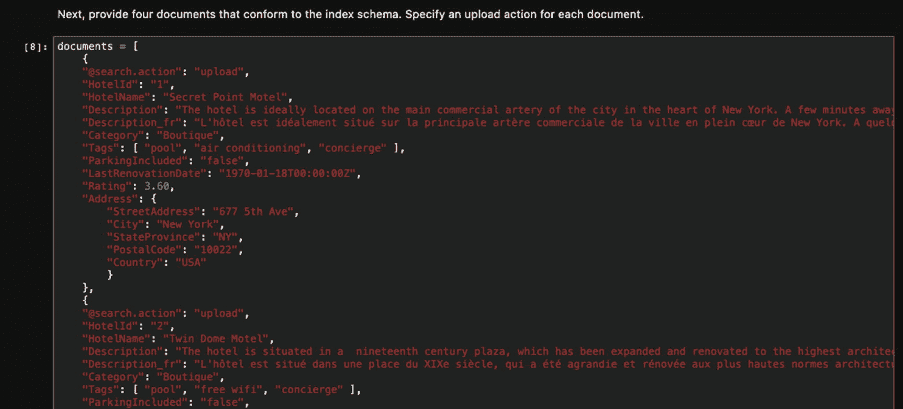

**图 7-23** Azure 认知搜索 – 额外文档（酒店）

然后，将文档上传到搜索客户端索引，如图 7-24 所示。

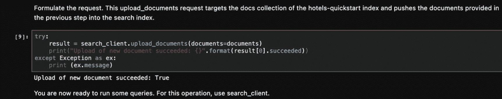

**图 7-24** Azure 认知搜索 – 上传额外文档

现在，您可以对这些额外酒店运行查询，因为它们现在已成为搜索索引的一部分。

在本节中，您学习了如何基于存储在结构化格式（数据库）或非结构化格式（文档）中的数据集（如酒店和房地产）完成搜索。接下来，我们将探索必应 Web 搜索，以搜索网络上数十亿页面的图像、视频、新闻等内容。

## 使用必应网页搜索

必应网页搜索 API^(20) 是一个强大的搜索引擎，为网络带来智能搜索功能。然而，由于其覆盖范围广泛，它很快将成为必应搜索服务生态系统的一部分。必应网页搜索通过帮助你在网页、图片、视频和新闻资源中搜索信息，将搜索引擎置于你的指尖。这些信息具有上下文和位置敏感性，经过过滤且不含广告。拼写纠正是标准功能，但与 Azure 认知搜索不同，你可以通过查看相关搜索来利用大众的智慧。

让我们开始构建一个必应网页搜索 API 实例：

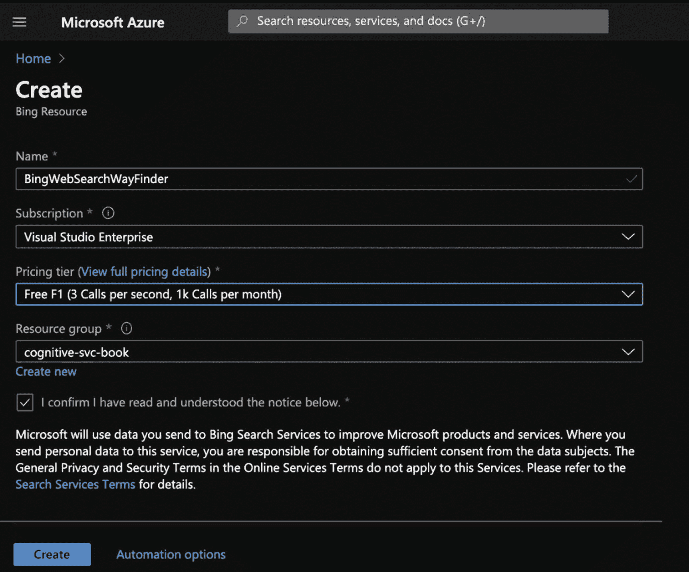

**图 7-25** 必应网页搜索 API – 创建实例

1.  通过在 Azure 门户上创建一个实例来访问必应网页搜索 API（如图 7-25 所示）。请参阅 [`https://portal.azure.com/#create/microsoft.bingsearch`](https://portal.azure.com/%2523xscreate/microsoft.bingsearch)。

填写完信息后，点击**创建**，它将创建一个 Microsoft 必应搜索实例，如图 7-26 所示。

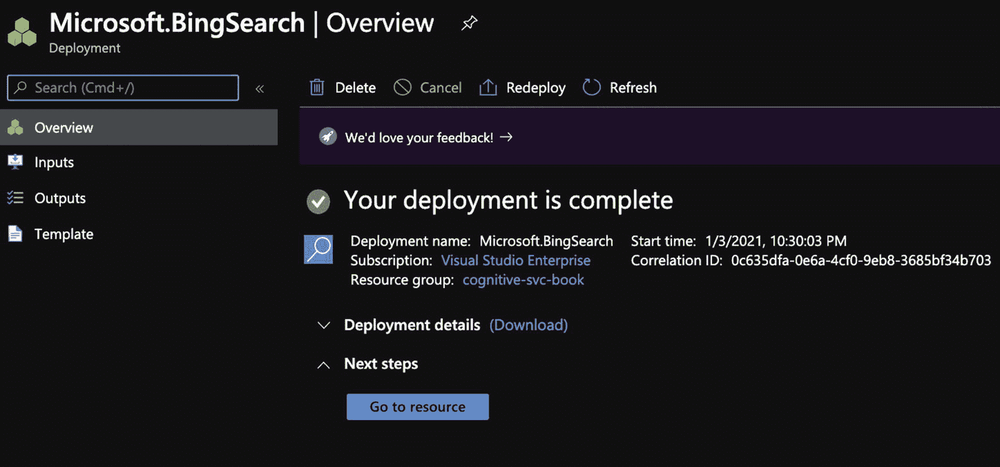

**图 7-26** 必应搜索 API – 部署完成

点击**转到资源**，查看快速入门页面（如图 7-27 所示）。

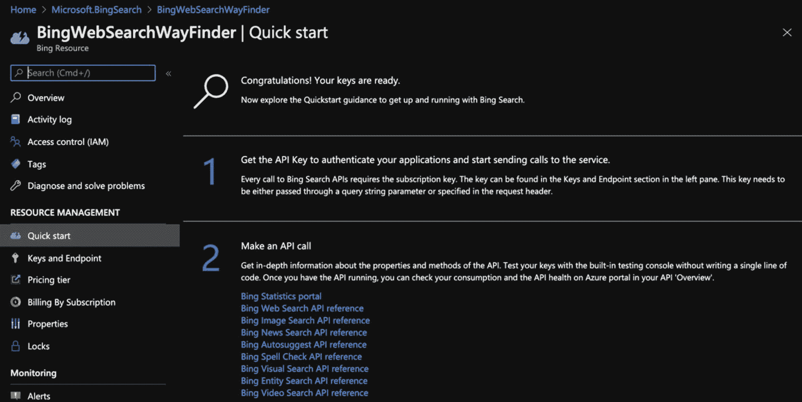

**图 7-27** 必应网页搜索 – 快速入门页面

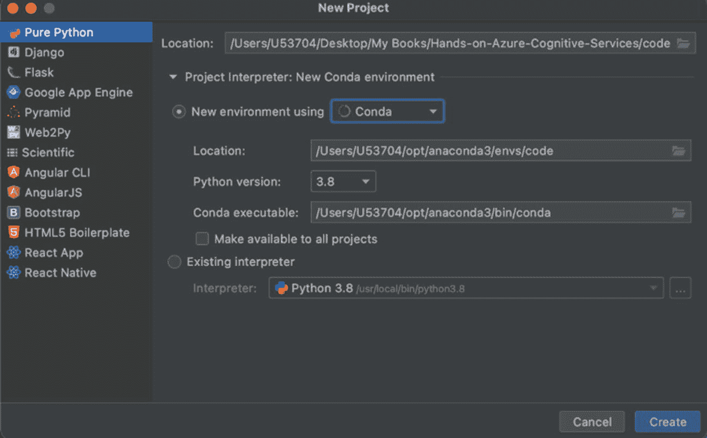

**图 7-28** Python 中的必应 API 搜索 – PyCharm 项目启动页面

2.  在本示例中，我们将使用必应图片搜索 API 完成一次图片搜索。首先，我们将执行一次简单搜索以检索结果，然后使用 Python 图像库来显示结果。我们使用的是 PyCharm，如图 7-28 所示，但你可以随意使用你喜欢的 IDE。代码源自 MIT 许可的 *cognitive-services-REST-api-samples*^(21)，但我们对其进行了多处修改以简化代码并使其易于使用。完整代码列表包含在本书的 GitHub 仓库中。

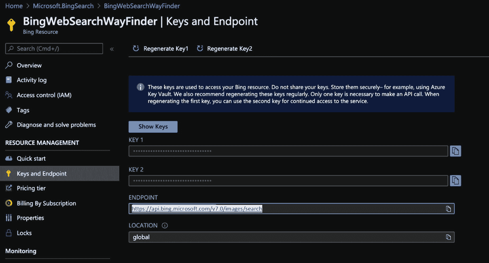

**图 7-29** 必应 API 搜索 – 密钥和终结点

3.  项目创建完成后，你将需要密钥和终结点，这些信息可以从门户中获取（如图 7-29 所示）。

使用密钥和终结点信息填充 `subscriptionKey` 和 `endpoint` 变量。图 7-30 中的代码非常简单，向你展示了调用搜索服务是多么容易。除了在标头中包含 `subscriptionKey` 和 `endpoint` 之外，你还可以通过 `mkt`（'en-US'）定义市场，并通过 `query`（"cat memes"）定义查询。运行程序以获取结果。你可以在图 7-30 所示的输出窗格中看到响应。

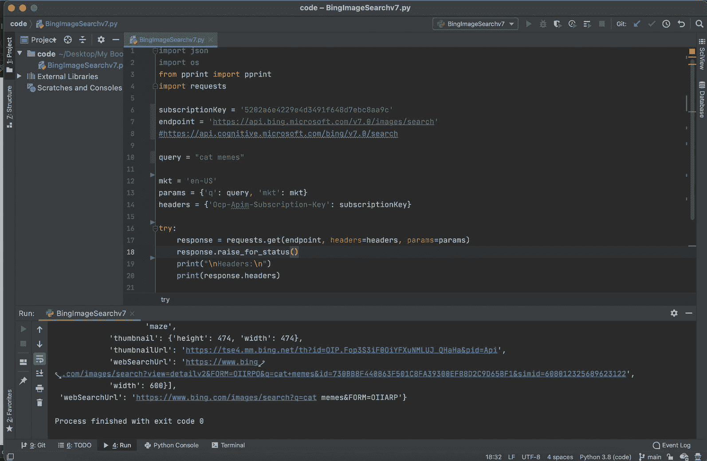

**图 7-30** Python 中的必应图片搜索

除了单个结果之外，你还可以在浏览器中打开 `websearchURL` 响应元素。请参见图 7-31。

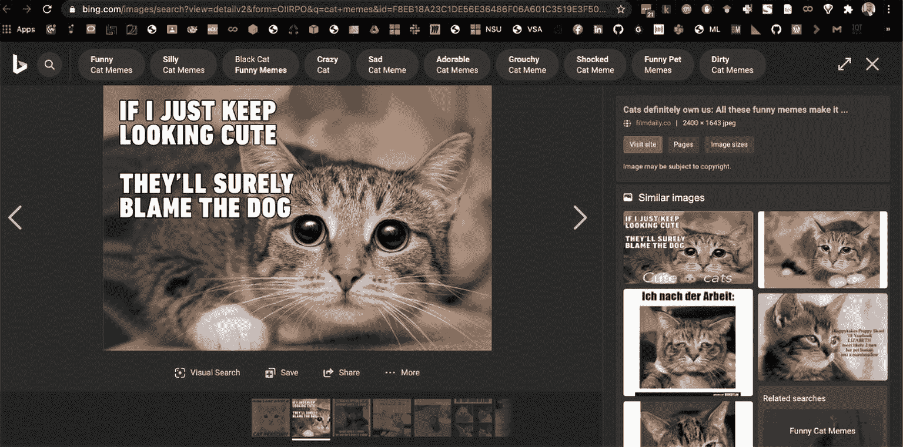

**图 7-31** 必应图片搜索结果 – 浏览器中的 GET 请求

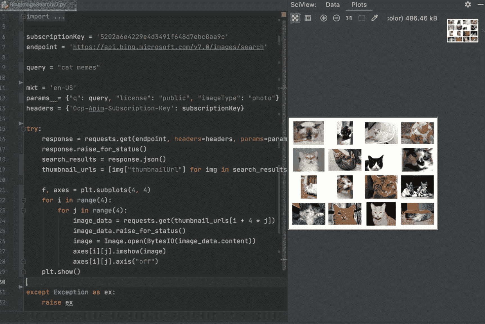

### 图 7-32 使用 Python 的必应图片搜索结果

1.  现在我们将演示如何调用 API 并使用 Python 图像库绘制响应。代码差别不大。唯一新增的部分是读取缩略图并将其显示在图像画布上。

```python
f, axes = plt.subplots(4, 4)
for i in range(4):
    for j in range(4):
        image_data = requests.get(thumbnail_urls[i + 4 * j])
        image_data.raise_for_status()
        image = Image.open(BytesIO(image_data.content))
        axes[i][j].imshow(image)
        axes[i][j].axis("off")
plt.show()
```

你可以在图 7-32 中看到结果，图像正在左侧窗格中绘制。

完整代码如代码清单 7-1 所示。

```python
import requests
import matplotlib.pyplot as plt
from PIL import Image
from io import BytesIO

subscriptionKey = '5202a6e4229e4d3491f648d7ebc8aa9c'
endpoint = 'https://api.bing.microsoft.com/v7.0/images/search'
query = "cat memes"
mkt = 'en-US'
params = {"q": query, "license": "public", "imageType": "photo"}
headers = {'Ocp-Apim-Subscription-Key': subscriptionKey}

try:
    response = requests.get(endpoint, headers=headers, params=params)
    response.raise_for_status()
    search_results = response.json()
    thumbnail_urls = [img["thumbnailUrl"] for img in search_results["value"][:16]]

    f, axes = plt.subplots(4, 4)
    for i in range(4):
        for j in range(4):
            image_data = requests.get(thumbnail_urls[i + 4 * j])
            image_data.raise_for_status()
            image = Image.open(BytesIO(image_data.content))
            axes[i][j].imshow(image)
            axes[i][j].axis("off")
    plt.show()
except Exception as ex:
    raise ex
```

**代码清单 7-1** 使用 Python 的必应图片搜索结果

服务返回的原始 JSON 响应如代码清单 7-2 所示。为简洁起见并避免内容过度可爱，我们将其截断，仅保留单个结果。

```
Headers:
{'Cache-Control': 'no-cache, no-store, must-revalidate', 'Pragma': 'no-cache', 'Content-Length': '124071', 'Content-Type': 'application/json; charset=utf-8', 'Expires': '-1', 'P3P': 'CP="NON UNI COM NAV STA LOC CURa DEVa PSAa PSDa OUR IND"', 'BingAPIs-TraceId': 'C1EEB539F44E4BF8AE333467AFD3A2A9', 'X-MSEdge-ClientID': '324563186B086B31062D6CAE6ABF6A2A', 'X-MSAPI-UserState': '33d6', 'X-Search-ResponseInfo': 'InternalResponseTime=279,MSDatacenter=BN2B', 'X-MSEdge-Ref': 'Ref A: C1EEB539F44E4BF8AE333467AFD3A2A9 Ref B: BLUEDGE0716 Ref C: 2021-01-05T02:47:31Z', 'apim-request-id': '9e4f0b22-8ce6-421d-a0f0-5cbc1499de3d', 'Strict-Transport-Security': 'max-age=31536000; includeSubDomains; preload', 'x-content-type-options': 'nosniff', 'CSP-Billing-Usage': 'CognitiveServices.BingSearchV7.Transaction=1', 'Date': 'Tue, 05 Jan 2021 02:47:31 GMT'}

JSON Response:
{'_type': 'Images',
'currentOffset': 0,
'instrumentation': {'_type': 'ResponseInstrumentation'},
'nextOffset': 42,
'pivotSuggestions': {'pivot': 'cat',
'suggestions': [{'displayText': 'Baby',
'searchLink': 'https://api.bing.microsoft.com/api/v7/images/search?q=Baby+Memes&tq=%7b%22pq%22%3a%22cat+memes%22%2c%22qs%22%3a%5b%7b%22cv%22%3a%22cat%22%2c%22pv%22%3a%22cat%22%2c%22hps%22%3atrue%2c%22iqp%22%3afalse%7d%2c%7b%22cv%22%3a%22memes%22%2c%22pv%22%3a%22memes%22%2c%22hps%22%3atrue%2c%22iqp%22%3afalse%7d%2c%7b%22cv%22%3a%22Baby%22%2c%22pv%22%3a%22%22%2c%22hps%22%3afalse%2c%22iqp%22%3atrue%7d%5d%7d',
'text': 'Baby Memes',
'thumbnail': {'thumbnailUrl': 'https://tse2.mm.bing.net/th?q=Baby+Memes&pid=Api&mkt=en-US&adlt=moderate&t=1'},
'webSearchUrl': 'https://www.bing.com/images/search?q=Baby+Memes&tq=%7b%22pq%22%3a%22cat+memes%22%2c%22qs%22%3a%5b%7b%22cv%22%3a%22cat%22%2c%22pv%22%3a%22cat%22%2c%22hps%22%3atrue%2c%22iqp%22%3afalse%7d%2c%7b%22cv%22%3a%22memes%22%2c%22pv%22%3a%22memes%22%2c%22hps%22%3atrue%2c%22iqp%22%3afalse%7d%2c%7b%22cv%22%3a%22Baby%22%2c%22pv%22%3a%22%22%2c%22hps%22%3afalse%2c%22iqp%22%3atrue%7d%5d%7d&FORM=IRQBPS'},
...
```

**代码清单 7-2** 必应图片搜索结果 – JSON 响应

正如你在 JSON 响应中注意到的，它提供了建议、直接访问的搜索链接、缩略图信息以及头部相关信息。你的企业用例可能不是搜索猫咪表情包，除非你在宠物食品公司的社交媒体部门工作。无论是什么场景，借助必应搜索 API，你都可以轻松实现。

## 总结与结论

搜索到此结束，至少目前如此。

在本章中，你已经对 Azure 搜索生态系统有了深入了解。你探索了 Microsoft Azure 认知搜索的功能，并了解了 Microsoft 必应搜索的工作原理。你创建了示例应用程序，通过关键词搜索房地产和酒店，并构建了一个在网络上搜索图像的应用程序。

现在，你已经准备好使用这些技术构建自己的应用程序。你的用例会有所不同，但这些基础知识将帮助你开始在组织内部以及外部网络上进行搜索。

继续探索吧！