# 8. 使用容器部署和托管服务

好吧，如果你还没听说过容器，那你可能还在用拨号上网！可以这么说，容器是自切片面包以来最伟大的发明。容器使你能够以一致且可重复的方式在多种环境中部署软件。它们不像虚拟机那样笨重。微软首席讲解员 Scott Hanselman 制作了一个关于容器的精彩视频^([²²)，我强烈推荐，特别是如果你刚接触这个容器生态系统。

在本章中，我们的目标是深入了解认知服务容器。我们将重点介绍关键的容器化特性，并演示如何使用 Docker 构建和部署应用程序。在本章中，你将学习以下主题：

1.  认知服务容器入门
2.  理解部署，以及如何在 Azure 容器实例上部署和运行容器
3.  理解 Docker Compose 并使用它部署多个容器
4.  理解 Azure Kubernetes 服务以及如何将应用程序部署到 Azure Kubernetes 服务

容器化技术包括 Docker、Kubernetes（简称 K8s）、Azure Kubernetes 服务（AKS）、Azure 容器实例（ACI）以及其他相关主题。这些主题过于复杂，无法在本章中详尽涵盖。相反，本章将重点帮助你入门认知服务容器，解释其必要性，并使你能够在需要时充分利用这些惊人技术的强大功能。


## 认知服务容器

Azure 认知服务托管在高度可用的 Azure 云数据中心，提供卓越的 SLA（服务级别协议），并利用规模经济进行学习、适应和改进。那么，我们为何需要将它们打包成容器来提供服务呢？

问得好，但您是否与审计员交流过？想象一下，在高度监管的环境中工作，将数据暴露在防火墙之外需要经过国会批准，这完全合情合理。此外，容器在断网环境、低延迟需求场景，或互联网连接不可用或不稳定的情况下，也具有极佳的商业应用价值。通过对数据和模型更新的完全控制，容器为基于云的服务提供了高吞吐量和低延迟的绝佳替代方案。

因此，为了解决安全、合规和运营问题，Azure 认知服务提供了以下类别的容器：

* **视觉容器** – [OCR](https://docs.microsoft.com/en-us/azure/cognitive-services/computer-vision/computer-vision-how-to-install-containers)、执行[空间分析、人脸](https://docs.microsoft.com/en-us/azure/cognitive-services/computer-vision/spatial-analysis-container)检测和表单识别
* **语言容器** – [情感分析](https://docs.microsoft.com/en-us/azure/cognitive-services/text-analytics/how-tos/text-analytics-how-to-install-containers%253Ftabs%253Dsentiment)、[关键短语提取](https://docs.microsoft.com/en-us/azure/cognitive-services/text-analytics/how-tos/text-analytics-how-to-install-containers%253Ftabs%253Dkeyphrase)、[文本语言检测](https://docs.microsoft.com/en-us/azure/cognitive-services/text-analytics/how-tos/text-analytics-how-to-install-containers%253Ftabs%253Dlanguage)、[健康文本分析](https://docs.microsoft.com/en-us/azure/cognitive-services/text-analytics/how-tos/text-analytics-how-to-install-containers%253Ftabs%253Dhealthcare)和 [LUIS（语言理解智能服务，或简称为*语言理解*）](https://docs.microsoft.com/en-us/azure/cognitive-services/luis/luis-container-howto)
* **语音容器** – [语音转文本](https://docs.microsoft.com/en-us/azure/cognitive-services/speech-service/speech-container-howto%253Ftabs%253Dstt)、[自定义语音转文本](https://docs.microsoft.com/en-us/azure/cognitive-services/speech-service/speech-container-howto%253Ftabs%253Dcstt)、[文本转语音](https://docs.microsoft.com/en-us/azure/cognitive-services/speech-service/speech-container-howto%253Ftabs%253Dtts)、[自定义文本转语音](https://docs.microsoft.com/en-us/azure/cognitive-services/speech-service/speech-container-howto%253Ftabs%253Dctts)、[神经文本转语音](https://docs.microsoft.com/en-us/azure/cognitive-services/speech-service/speech-container-howto%253Ftabs%253Dntts)和[语音语言检测](https://docs.microsoft.com/en-us/azure/cognitive-services/speech-service/speech-container-howto%253Ftabs%253Dlid)
* **决策容器** – 异常检测器

有趣的是，认知计算容器是 Linux 容器。微软是首家在容器中提供预训练 AI 的供应商，采用按交易计费的计量模式。有关版本控制和其他常见问题，微软在其产品文档中维护了一个活跃的 FAQ 部分，可访问 [`https://docs.microsoft.com/en-us/azure/cognitive-services/containers/container-faq`](https://docs.microsoft.com/en-us/azure/cognitive-services/containers/container-faq)。

这些产品的可用性各不相同。部分容器已正式发布（GA），而其他容器则处于预览阶段或受限的私有预览阶段（需要访问批准）。Azure 认知服务容器各产品的当前可用性状态，可访问 [`https://docs.microsoft.com/en-us/azure/cognitive-services/cognitive-services-container-support`](https://docs.microsoft.com/en-us/azure/cognitive-services/cognitive-services-container-support) 查看。

作为视觉容器的一部分，人脸检测和表单识别服务不可用。2020 年 6 月 11 日，微软宣布*“在基于人权的严格监管法规出台之前，不会向美国警察部门出售人脸识别技术。”*其他主要云提供商也纷纷效仿。表单识别器服务作为 Azure 认知服务产品的一部分提供，但不以容器形式提供。

认知服务容器会连接到 Azure 数据中心以发送计量信息，但不会将客户数据发送给微软。认知服务拥有大多数行业标准认证，可帮助您在 Azure 平台上构建和部署医疗、制造和金融用例。这些认证包括 ISO 20000-1:2011、ISO 27001:2013、ISO 27017:2015、ISO 27018:2014 和 ISO 9001:2015 认证；HIPAA BAA、SOC 1 Type 2、SOC 2 Type 2 和 SOC 3 证明；以及 PCI DSS Level 1 证明。然而，认知服务容器本身没有任何合规认证。

微软关于人脸识别的说明^(²³)

2020 年 6 月 11 日，微软宣布，在基于人权的严格监管法规出台之前，不会向美国警察部门出售人脸识别技术。因此，如果客户是美国警察部门，或者允许美国警察部门使用此类服务，则客户不得使用 Azure 服务（如 Face 或 Video Indexer）中包含的人脸识别功能。

与 SDLC（软件设计生命周期）类似，机器学习开发生命周期、数据科学生命周期和/或微软团队数据科学流程也要求对部署过程有更高程度的控制。这包括版本控制、模型漂移控制、模型衰退和合规性。容器为您提供了所需的精细度和控制力，以确保您拥有所需的治理能力。

接下来，让我们构建一些认知服务容器。

### 托管认知服务容器

认知服务容器有多种托管选项。您可以构建一个 Docker 容器并在本地托管，然后将其与认知服务连接；您可以使用 Azure 容器实例（ACI）、Azure Kubernetes 服务（AKS），或在 Azure Stack 上部署 Kubernetes 集群。这些选项提供了容器部署的完整范围，并具有不同程度的控制权和责任。能力越大，责任越大。


#### 运行语言服务容器

我们将从小处着手，构建并托管一个简单的本地 Docker 容器：

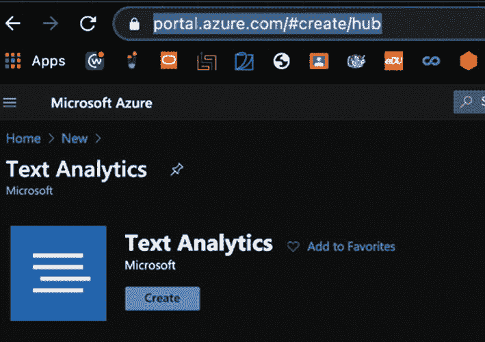

图 8-1 文本分析

1. 首先，我们来安装 Docker Desktop。你可以从 [`www.docker.com/products/docker-desktop`](http://www.docker.com/products/docker-desktop) 下载该应用程序。它将允许你使用容器运行时构建和运行容器。它还提供了 Docker CLI，即用于运行命令的命令行界面。请在你的平台上安装它；我们会等你。

2. 在第一个示例中，我们的目标是在本地运行一个认知服务容器实例，将其连接到文本分析服务以进行计量和计费，然后调用容器上的语言检测服务。本章中我们将使用几个不同的容器和服务。你可以在此处找到 Azure 认知服务容器镜像标签和发行说明的详细列表^(²⁴)。

3. 认知服务容器是自给自足的，用于运行底层认知服务。但是，它们需要能够访问订阅以进行计量和计费。因此，你需要通过访问 [`https://portal.azure.com/#create/hub`](https://portal.azure.com/%2523create/hub) 创建一个文本分析服务帐户，如图 8-1 所示。

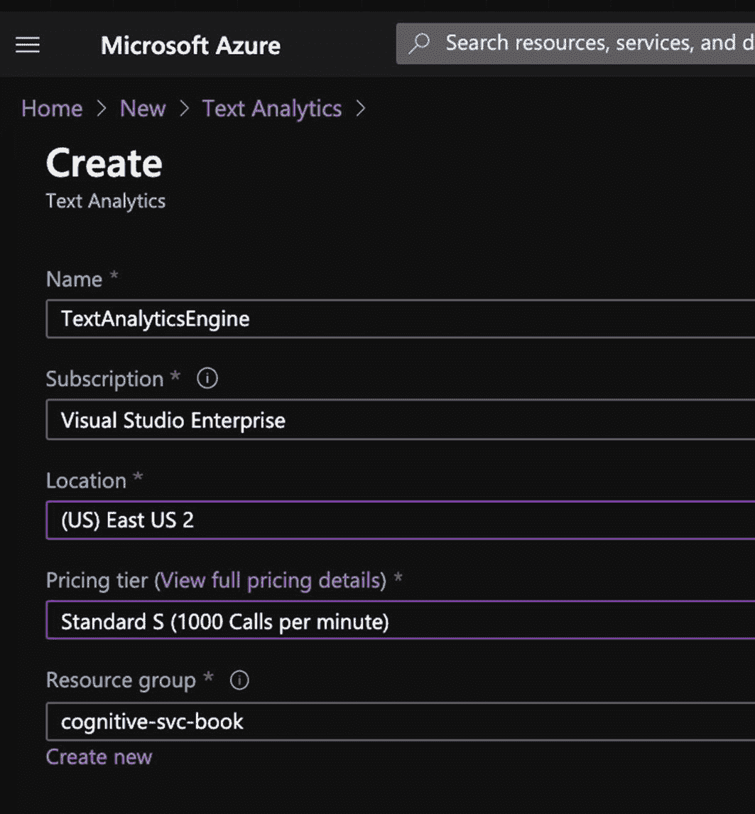

图 8-2 创建文本分析

1. 填写必填字段（如图 8-2 所示），包括订阅、位置、定价层和资源组。然后，单击**创建**。此过程已在第 6 章和第 7 章中详细讨论过，因此如果需要，请参考回去，因为我们现在将跳过一些步骤以保持简洁。

服务经过验证、创建和部署后，你将看到图 8-3 中的屏幕。要继续，请单击**转到资源**。

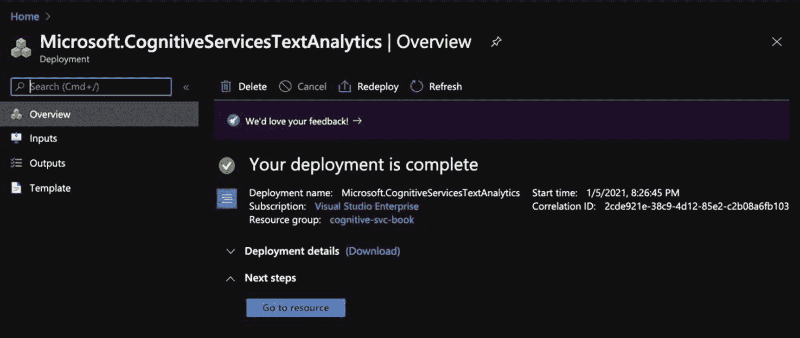

图 8-3 你的部署已完成

如图 8-4 所示，你将从文本分析引擎服务仪表板获取密钥和终结点，你可以在容器中使用它们。

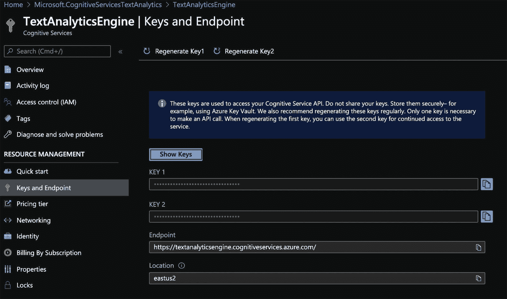

图 8-4 密钥和终结点

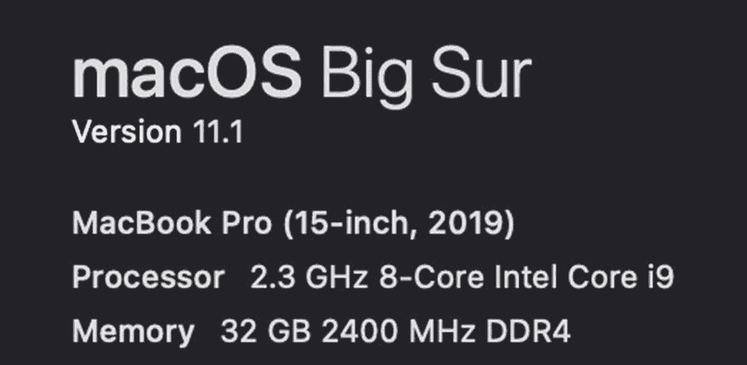

图 8-5 macOS Big Sur

1. 现在我们有了用于计费的分析服务的密钥，我们可以继续构建和运行容器。我们在 Mac 上运行此操作，配置如图 8-5 所示。你可能需要为容器分配一些内存，因此请确保你有一台具有良好 CPU 和内存的像样机器，以便能够在本地运行容器。否则，它会非常慢，甚至可能无法运行。

用于语言检测的 Docker 容器位于 Docker Hub 的此处^(²⁵)。它从 Microsoft 容器存储库^(²⁶) 拉取。为了启动和运行 Docker 镜像，你需要运行以下命令：

```
docker run --rm -it -p 5000:5000 --memory 8g --cpus 1 \
mcr.microsoft.com/azure-cognitive-services/language \
Eula=accept \
Billing={ENDPOINT_URI} \
ApiKey={API_KEY}
```

然后，你需要替换终结点 URL 和 API 密钥，如下所示。请使用你自己的密钥。

```
docker run --rm -it -p 5000:5000 --memory 8g --cpus 1 \
mcr.microsoft.com/azure-cognitive-services/language \
Eula=accept \
Billing='https://textanalyticsengine.cognitiveservices.azure.com/' \
ApiKey='5e9a5dcd31d9458f8e6f51a488d86399'a
```

在终端中运行此代码将从注册表中拉取容器镜像。在本地运行它，如图 8-6 所示。

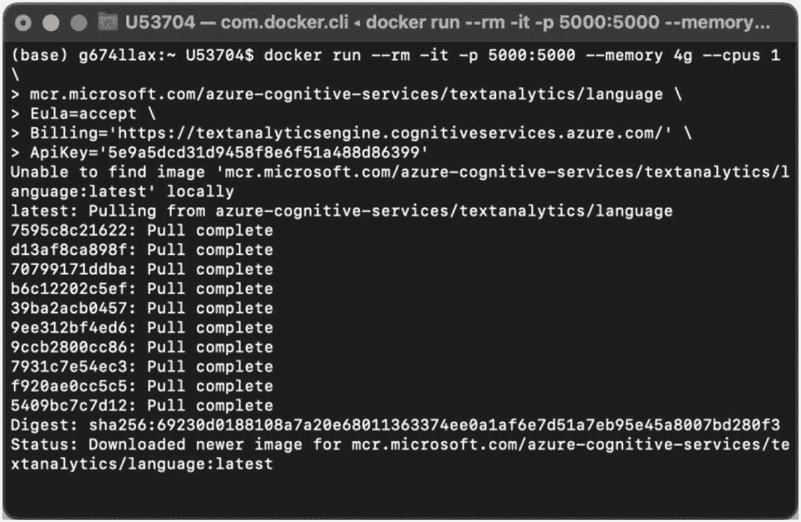

图 8-6 拉取容器镜像

你可以在 Docker Desktop 控制台中看到可用镜像列表，如图 8-7 所示。

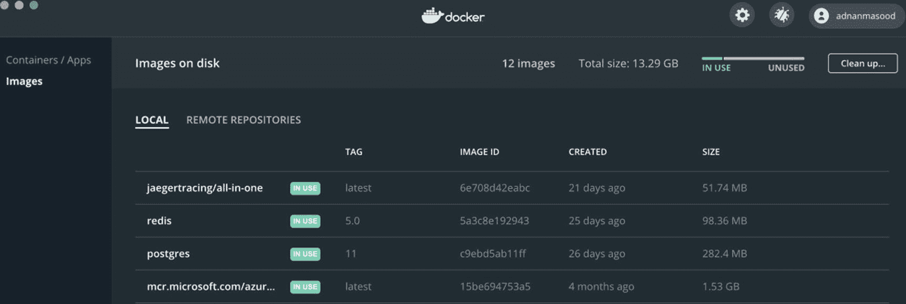

图 8-7 磁盘上的镜像

没有什么地方比得上 `127.0.0.1`。因此，一旦镜像下载完成，你就可以访问 `localhost:5000`，因为在 COVID 封锁期间它非常安全。如果你没有注意到，URL 和端口已在命令中指定（请务必复制并粘贴！）。另请注意，你的 Azure 认知服务容器已启动并正在运行，如图 8-8 所示。如果你想运行多个容器，请更改端口号。

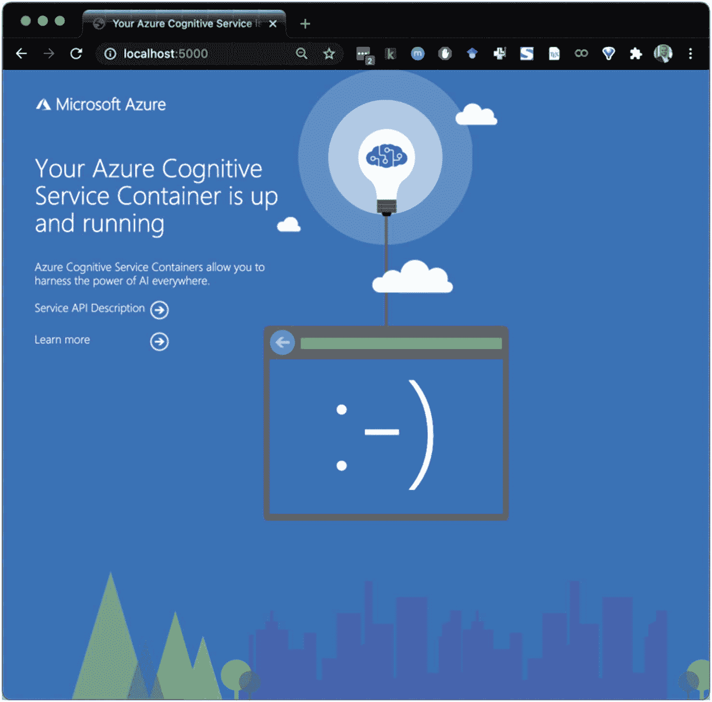

图 8-8 Azure 认知服务容器确认

语言容器（以及语言检测服务）已启动并正在运行。如果你单击**服务 API 描述**链接，你将看到 swagger API 信息页面（如图 8-9 所示），你可以在其中调用服务。

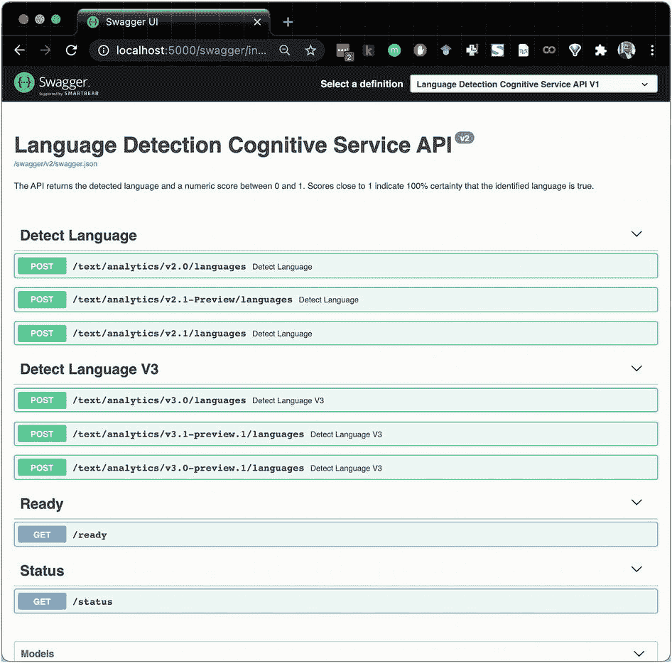

图 8-9 语言检测认知服务 API

容器上有不同版本的服务可用。你可以单击这些链接中的任何一个，并使用预先创建的请求调用服务。参见图 8-10。

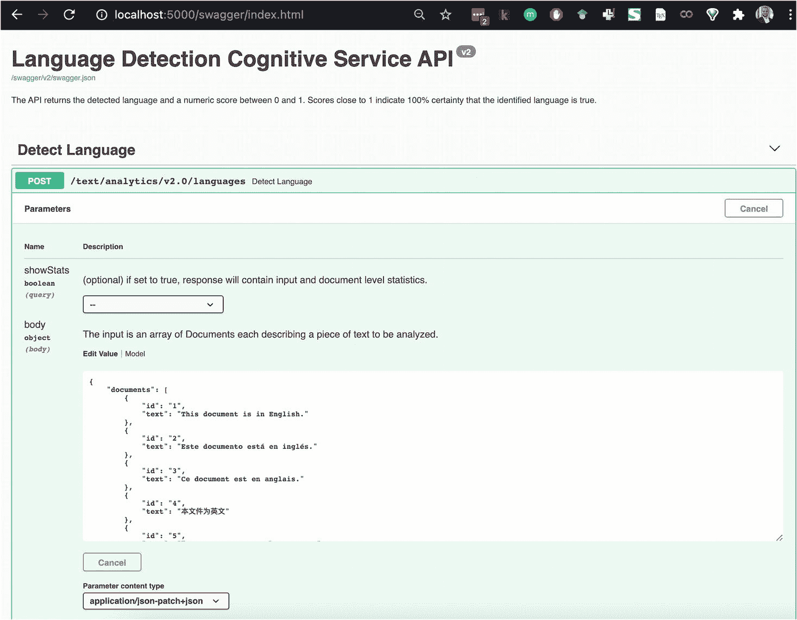

图 8-10 一个预先创建的请求

单击**执行**，然后你将看到响应。接下来，你还可以发出 `cURL`^(²⁷) 请求，以防你想从终端调用它。请参见以下代码：

```
curl -X POST "http://localhost:5000/text/analytics/v2.0/languages" -H "accept: application/json" -H "Content-Type: application/json-patch+json" -d "{ \"documents\": [ { \"id\": \"1\", \"text\": \"This document is in English.\" }, { \"id\": \"2\", \"text\": \"Este documento está en inglés.\" }, { \"id\": \"3\", \"text\": \"Ce document est en anglais.\" }, { \"id\": \"4\", \"text\": \"本文件为英文\" }, { \"id\": \"5\", \"text\": \"Этот документ на английском языке.\" } ]}"
```

在这里，我们执行了代码。你可以在图 8-11 中看到正确检测语言的响应。

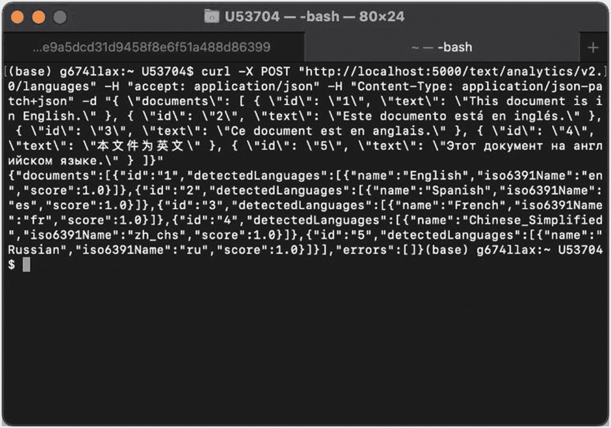

图 8-11 检测语言

> 用于运行容器的 docker 命令是
> 
> `docker run --rm -it -p 5000:5000 --memory 8g --cpus 1 mcr.microsoft.com/azure-cognitive-services/textanalytics/language:1.1.012840001-amd64 Eula=accept Billing="https://<resource_name>.cognitiveservices.azure.com/" ApiKey="<subscription_key>"`

你也可以直接从网页调用它。图 8-12 中的屏幕显示了你将通过网页从容器获得的响应。

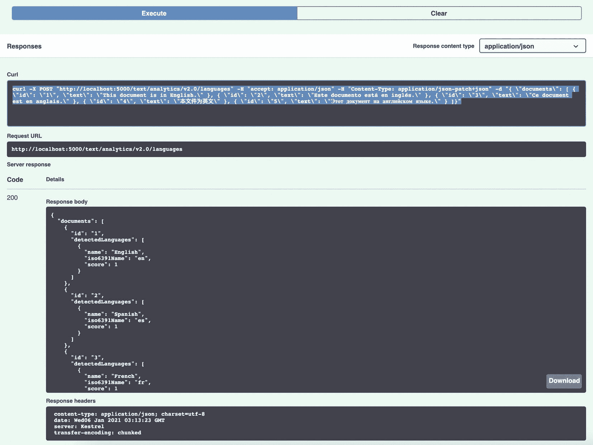

图 8-12 来自容器的响应


在本示例中，我们拉取了一个认知服务 Docker 容器，将其与计量语言服务关联后运行，并通过 WebUI 和 `cURL` 接口调用了结果。在下一个示例中，让我们尝试使用异常检测器服务执行相同操作，但这次我们将使用 Jupyter notebook。

#### 运行异常检测器服务容器

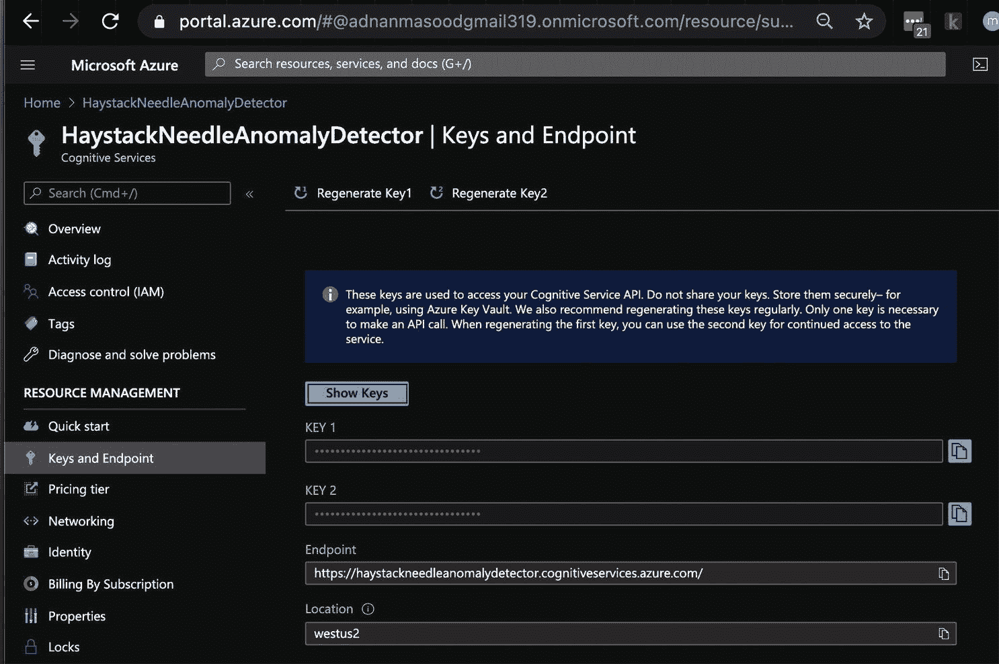

**图 8-13** 密钥和终结点

1.  与语言检测容器类似，异常检测器托管在 Docker Hub^(²⁸) 以及位于 `mcr.microsoft.com/azure-cognitive-services/decision/anomaly-detector` 的 Microsoft 容器仓库中。

2.  创建一个异常检测器服务实例，以获取用于计量的终结点和密钥（见图 8-13）。创建异常检测服务的详细步骤可参考第 6 章，但其过程与我们之前对语言服务的操作几乎完全相同。实例创建完成后，我们将在 Docker 运行命令中使用它。

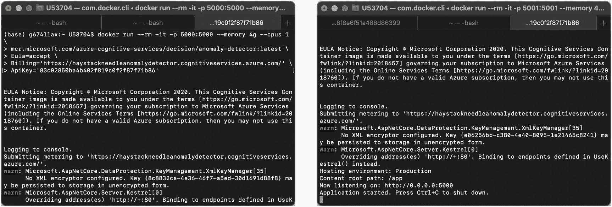

**图 8-14** 应用程序开始提供服务

1.  运行以下命令以创建异常检测器 Docker 容器。这将拉取最新的容器，并将服务连接到 Azure 门户进行计费。

```
docker run --rm -it -p 5000:5000 --memory 4g --cpus 1 \
mcr.microsoft.com/azure-cognitive-services/decision/anomaly-detector:latest \
Eula=accept \
Billing='https://haystackneedleanomalydetector.cognitiveservices.azure.com/' \
ApiKey='83c02850ba4b402f819c0f2f87f71b86'
```

随后，您将看到如图 8-14 所示的截图，应用程序开始在 `http://localhost:5000` URL 上提供服务。

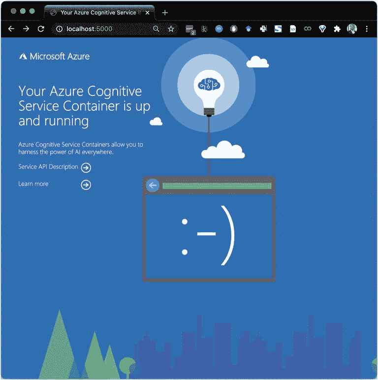

**图 8-15** 欢迎界面

1.  如之前的语言检测示例所示，您可以通过 `http://localhost:5000` 访问认知服务容器，并看到如图 8-15 所示的欢迎界面。该界面在所有认知服务中保持一致。

接下来，您将看到 API 的 Swagger 页面，并可以直接从 UI 或通过应用程序调用它们（见图 8-16）。

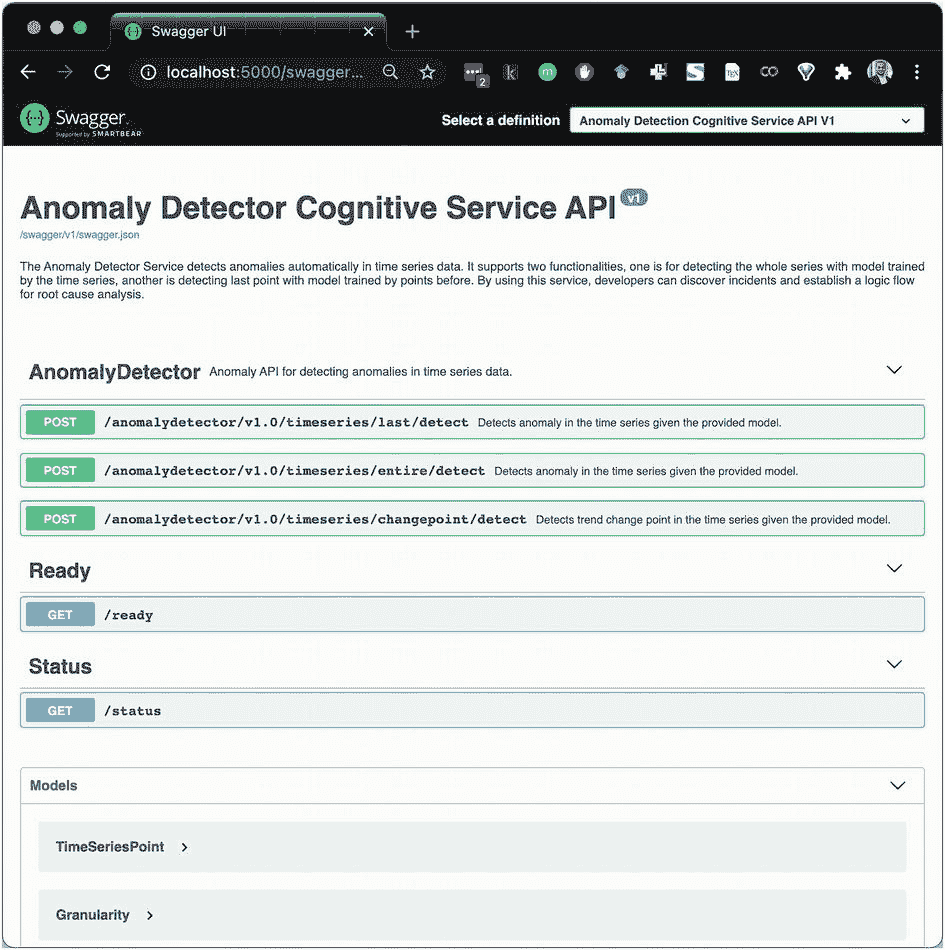

**图 8-16** Swagger 页面

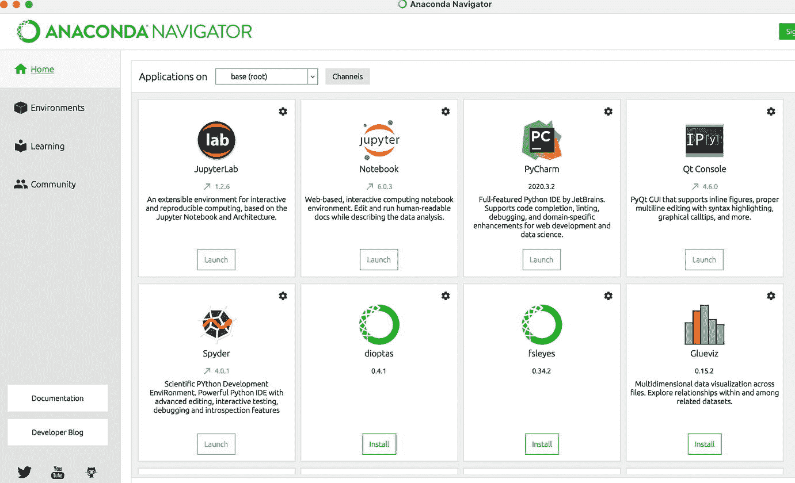

**图 8-17** Anaconda Navigator

1.  对于此示例，我们将使用 Anaconda 运行 Jupyter notebook 的本地实例，并运行我们在第 6 章中使用的示例 notebook。该仓库可以从 [`https://github.com/Azure-Samples/AnomalyDetector`](https://github.com/Azure-Samples/AnomalyDetector) 克隆。从 Anaconda Navigator 启动 JupyterLab（如图 8-17 所示），然后导航到点异常检测 notebook。

打开 notebook，然后使用异常检测服务的 API 密钥和 URL `http://localhost:8888` 填充 API 密钥和终结点，以连接到本地异常检测容器实例。见图 8-18。

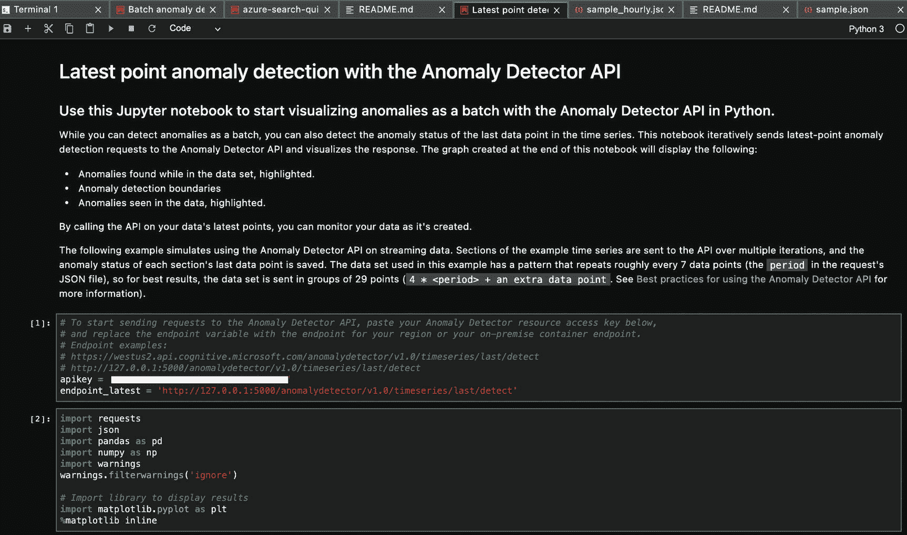

**图 8-18** 最新点异常检测

第一个单元格应类似于图 8-19 中的单元格。

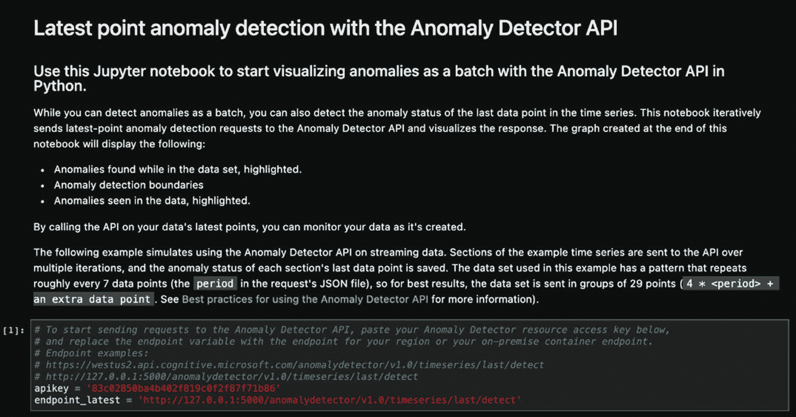

**图 8-19** 异常检测器资源访问密钥

现在，当您调用后续单元格运行示例时，将看到与第 6 章类似的结果。见图 8-20。不同之处在于，代码现在通过认知服务容器在您的本地机器上运行。

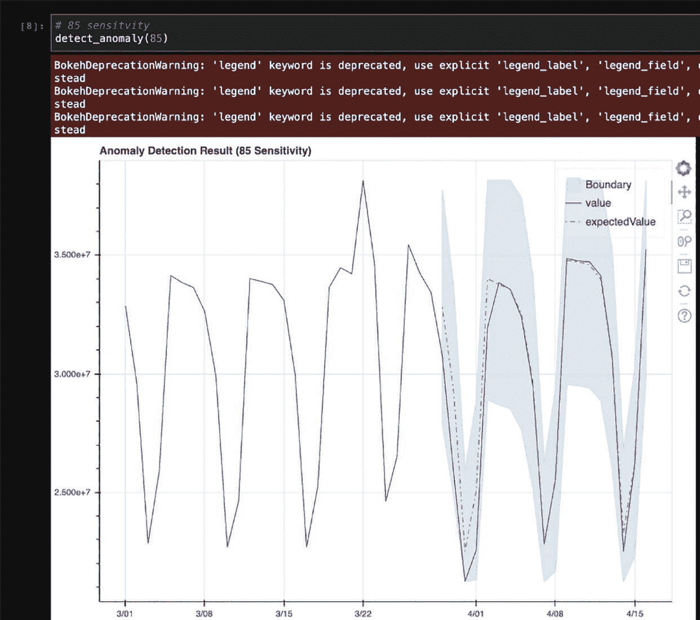

**图 8-20** 异常检测结果

通过这两个示例，您看到了使用 Docker 在本地运行认知服务容器是多么简单。现在，我们将使用基于云的 ACI 和 AKS 方法来托管这些容器。


## 使用 Azure 容器实例

“在我机器上能跑”是一个很好的目标，但你可能希望在无需承担完整编排平台（如 Kubernetes 和 Mesos）负担的情况下，实现可重复性、高性能、简洁性和速度。Azure 容器实例（`ACI`）提供了一个很好的替代方案。`ACI` 是在 Azure 云中运行容器的一种快速且轻量的方式，你可以通过 Azure 容器注册表（`ACR`）管理自己的容器注册表。

“这难道不是违背了初衷吗？”你可能会问。使用容器的原因是为了拥有控制权，而不是将东西部署到云上。现在我们却建议你将容器本身部署到云上？这听起来毫无道理。让我们来解释一下。

除了合规性和数据保护之外，容器化的原因之一就是控制。如果你的组织或地区政策只允许你在特定区域托管、保存和处理客户数据，并且你想控制自己的部署流程，那么在 `ACI` 中运行容器可能是管理自有数据中心的一个不错替代方案。借助微软云平台，你拥有多种选择——你可以自带硬件，使用轻量级的 `ACI`，或者选择像 `AKS` 这样的编排平台。让我们开始使用 `ACI`：

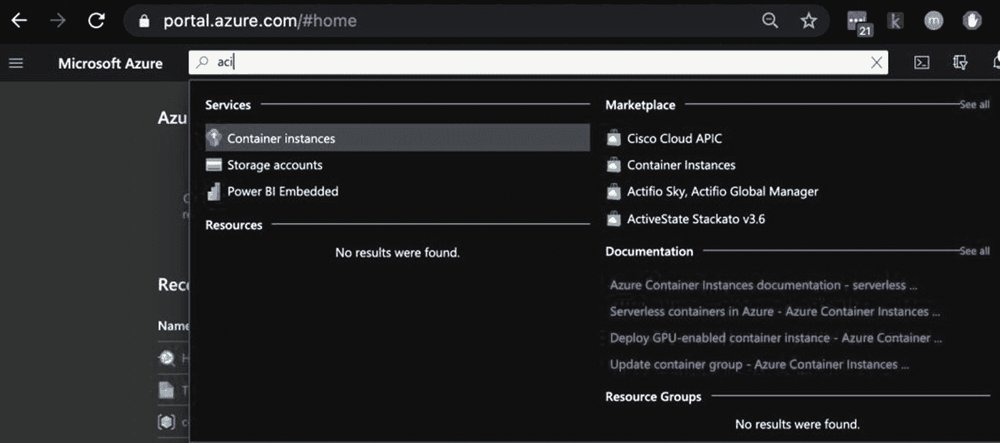

图 8-21

搜索 `ACI`

1.  进入 Azure 门户，搜索“`ACI`”或“容器实例”，如图 8-21 所示。点击**容器实例**。

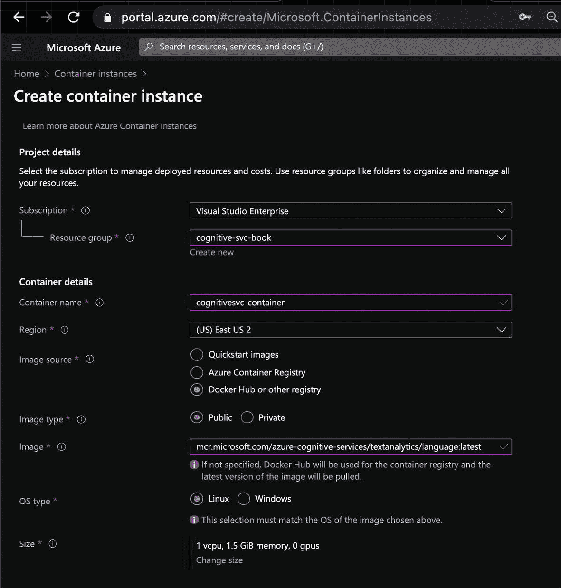

图 8-22

创建容器实例

1.  创建容器实例，如图 8-22 所示。填写必填字段，然后选择镜像链接。在本例中，我们从 `MCR` 中选择微软文本分析镜像。

在继续之前，你应该查看容器要求和建议^(²⁹)，然后确保你的容器实例配置与微软推荐的配置相匹配。当前规格列于图 8-23 中，但你应该核实必要的规格，因为它们可能会定期更改。我们现在生活在拥有数十亿参数模型的时代。

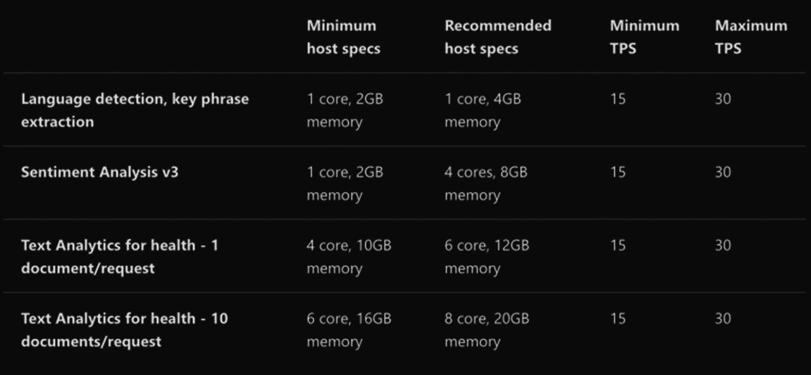

图 8-23

容器要求

在我们的案例中，我们将使用语言检测容器，并通过点击**更改大小**来修改规格。然后你将看到“更改容器配置”屏幕，如图 8-24 所示。更新所需的 CPU 核心数和内存量。

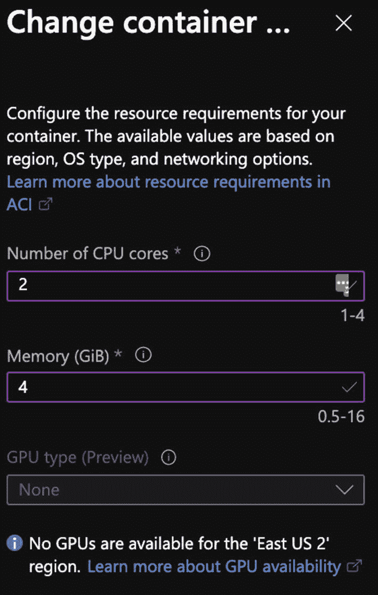

图 8-24

配置资源需求

现在你可以继续并创建容器。部署完成后，你将看到如图 8-25 所示的屏幕。

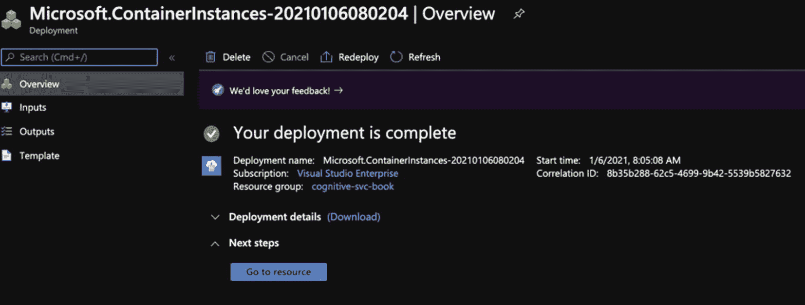

图 8-25

部署完成

由于此容器是通过 `ACI` 部署在云中的，因此它有一个公共 IP（在我们的案例中，是 `52.146.70.12`）。你可以从浏览器访问该 IP，以查看如图 8-26 所示的欢迎屏幕。

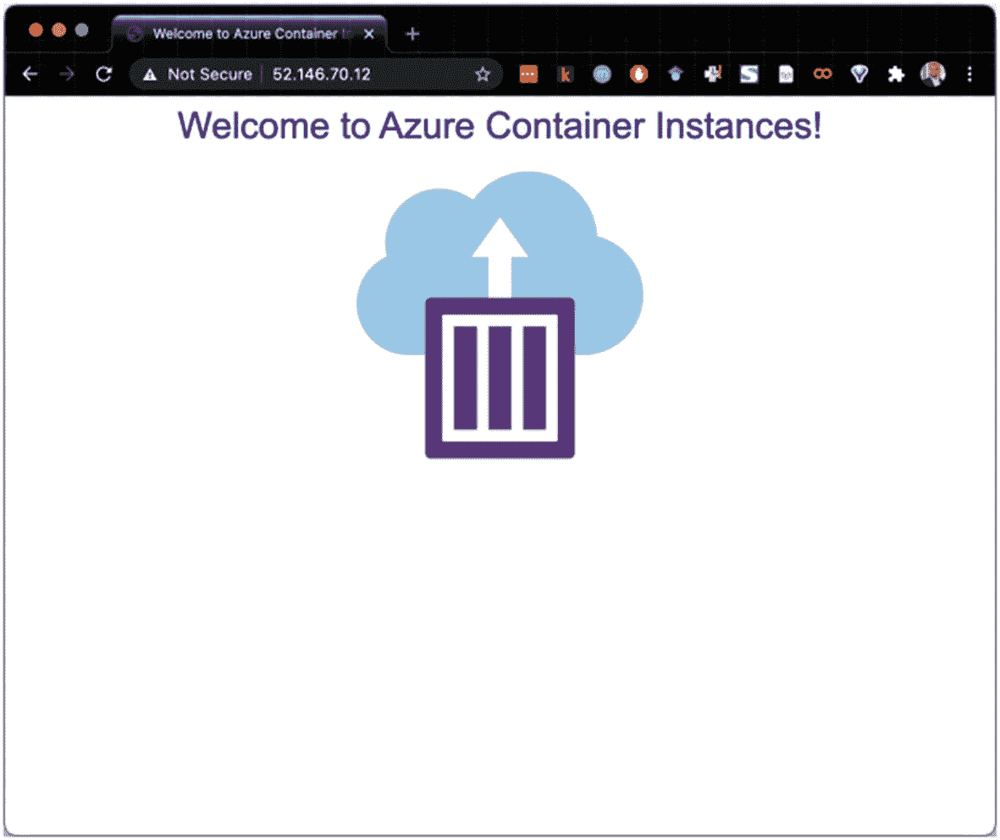

图 8-26

Azure 容器实例欢迎屏幕

现在实例已就绪，你可以访问 API、调用服务等。我们稍后将详细说明这一点。


构建和部署 ACI 与 AKS 容器有三种不同方式：通过 UI、Azure Cloud Shell 和终端。在前面的示例中，你已经了解了如何通过 UI 完成创建和运行容器的任务。现在，让我们切换到命令行界面（CLI）。Azure Cloud Shell 是在浏览器中执行命令行操作的绝佳方式。你可以从 `shell.azure.com` 访问它，系统会要求你选择偏好的云 Shell 类型。见图 8-27。

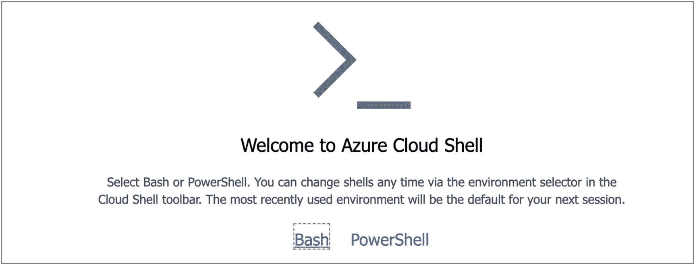

图 8-27：选择脚本语言

选择脚本语言后，你将看到我们都喜爱的强大终端，如图 8-28 所示。

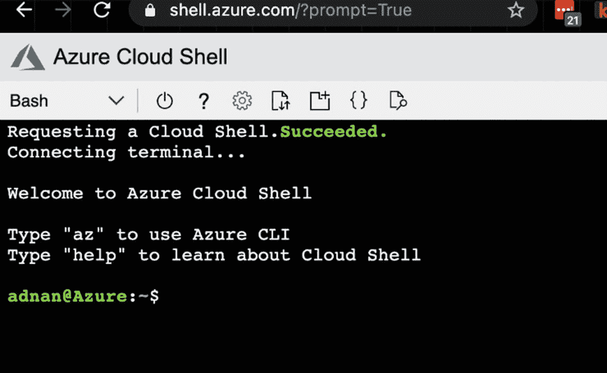

图 8-28：打开 Azure Cloud Shell

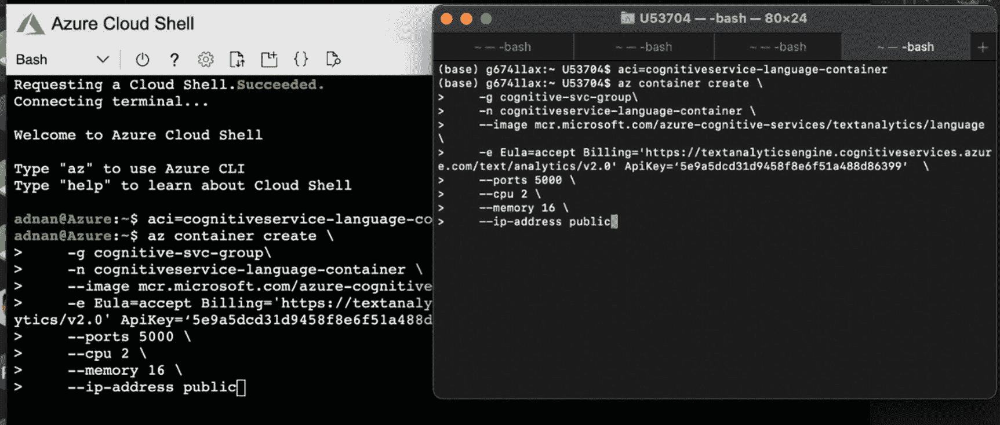

图 8-29：Azure Cloud Shell 与 CLI

1.  以下命令在 ACI 中创建一个情感分析认知服务容器。你会注意到，它与之前 UI 中传递的参数非常相似。

```
aci=cognitiveservice-language-container
az container create \
-g cognitive-svc-book \
-n cognitiveservice-language-container \
--image mcr.microsoft.com/azure-cognitive-services/sentiment \
-e Eula=accept Billing='https://textanalyticsengine.cognitiveservices.azure.com/text/analytics/v2.0' ApiKey='5e9a5dcd31d9458f8e6f51a488d86399' \
--ports 5000 \
--cpu 4 \
--memory 16 \
--ip-address public
```

2.  需要注意的是，你也可以在 Azure CLI^(³⁰) 上运行此代码，如图 8-29 中并排显示的那样。你需要安装 Azure CLI。在本例中，我们将仅使用 Azure Cloud Shell。

当命令在云 Shell 中运行时，它会创建实例并通过公共 IP 使其可用。你将看到完成响应，如图 8-30 所示。

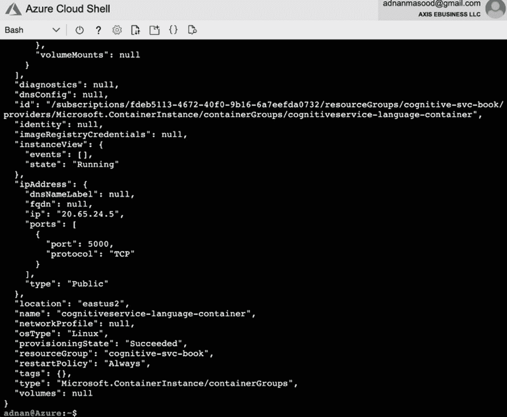

图 8-30：完成响应

现在，你可以访问作为响应一部分提供的公共 IP，以访问备受期待的容器屏幕。见图 8-31。

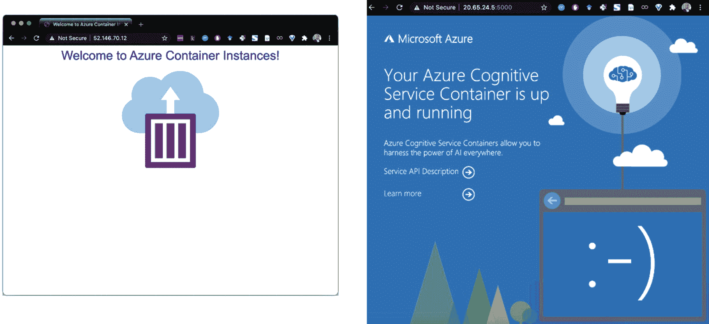

图 8-31：容器欢迎屏幕

3.  现在，得益于 Azure 提供的强大基础设施和 CLI 支持，容器正在运行。我们可以轻松调用情感分析服务。

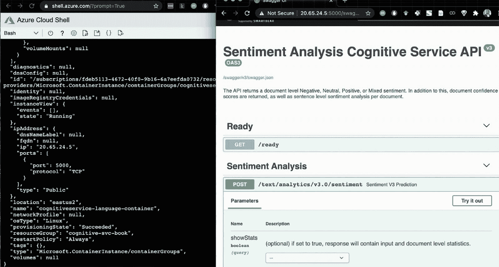

图 8-32：情感分析服务

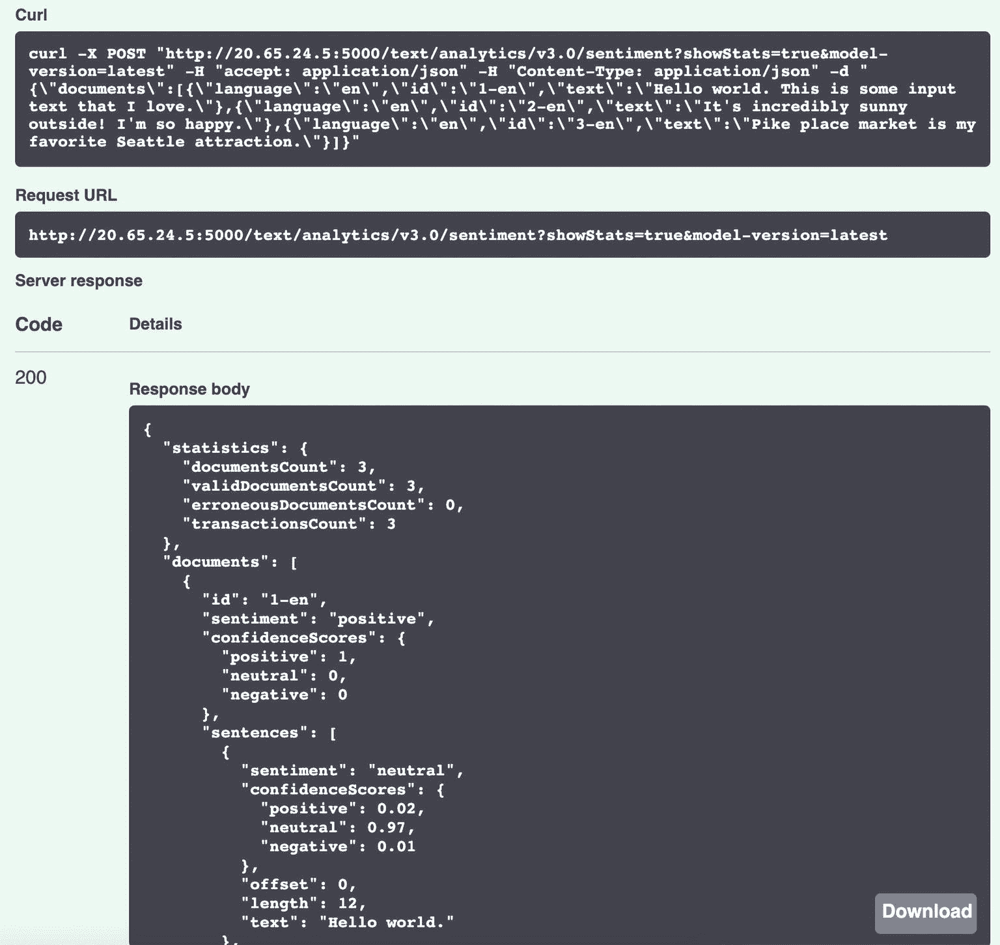

图 8-33：浏览器响应

4.  以下代码表示获取情感数据的简单请求：

```
{
"documents": [
{
"language": "en",
"id": "1-en",
"text": "Hello world. This is some input text that I love."
},
{
"language": "en",
"id": "2-en",
"text": "It's incredibly sunny outside! I'm so happy."
},
{
"language": "en",
"id": "3-en",
"text": "Pike place market is my favorite Seattle attraction."
}
]
}
```

一旦我们通过浏览器调用它，你将看到响应，如图 8-33 所示。

> *请求正文下拉菜单应更改为 `application/json`；默认的 `application/json-patch+json` 将显示不支持的 content type 错误。*

JSON 内容如下所示，为简洁起见，我们将其截断为一个文档：

```
{
"statistics": {
"documentsCount": 3,
"validDocumentsCount": 3,
"erroneousDocumentsCount": 0,
"transactionsCount": 3
},
"documents": [
{
"id": "1-en",
"sentiment": "positive",
"confidenceScores": {
"positive": 1,
"neutral": 0,
"negative": 0
},
"sentences": [
....
"errors": [],
"modelVersion": "2019-10-01"
}
```

至此，你已经完成了在 Azure 上创建 ACI 容器的过程——既通过命令行，也通过 Web UI，并在云中进行了调用。

现在，我们将回顾最后一种方法：Azure Kubernetes 服务（AKS），并了解如何将 Azure 认知服务[文本分析](https://docs.microsoft.com/en-us/azure/cognitive-services/text-analytics/how-tos/text-analytics-how-to-install-containers)容器镜像部署到 Azure Kubernetes 服务。


## 使用 Azure Kubernetes 服务部署认知服务容器

ACI 可以帮助你部署单个容器，但如果你需要部署和管理大量容器该怎么办？Kubernetes 是一个开源编排引擎，可帮助你大规模构建、部署和管理这些容器。Azure Kubernetes 服务 (AKS) 是 Azure 云上的一项托管 Kubernetes 服务，就托管服务而言，它非常出色，因为它是免费的。是的，你无需为 AKS 付费，只需为你使用的节点付费。你可以通过 Web UI、CLI 或使用模板创建 AKS 集群。

让我们从构建 Kubernetes 服务开始。一如既往，`portal.azure.com` 是我们的首选入口。搜索“Kubernetes 服务”，然后单击**创建**。参见图 8-34。

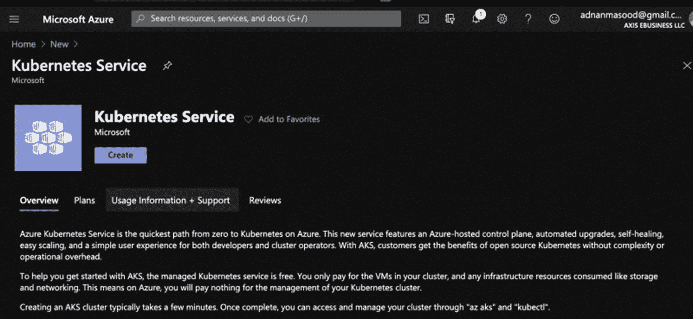

图 8-34

Azure 门户中的 Kubernetes 服务

使用默认设置填写“创建 Kubernetes 集群”页面，如图 8-35 所示。在集群中，你可以自定义节点池、身份验证、高级网络设置和集成。参见图 8-35。有关各个参数及其可能设置的详细信息，请参见此处^(³¹)。

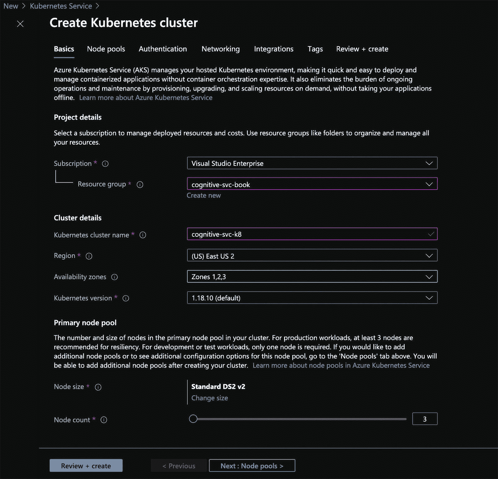

图 8-35

创建 Kubernetes 集群

单击**查看 + 创建**继续，集群部署完成后（可能需要一些时间），你将看到如图 8-36 所示的屏幕。

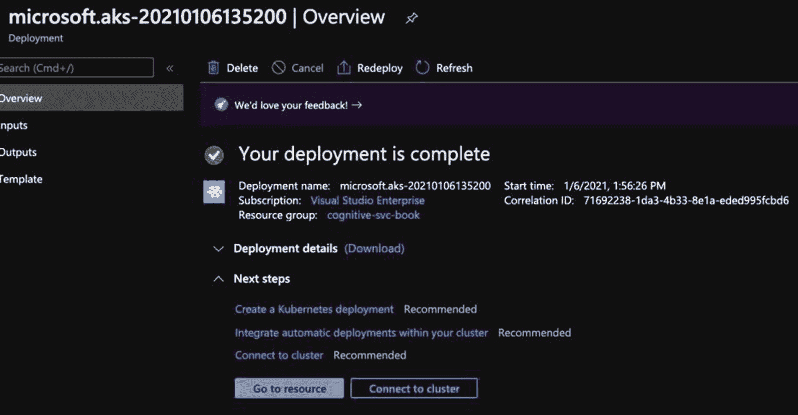

图 8-36

集群已部署

集群部署完成后，你需要登录到 AKS 集群。使用以下命令登录集群：

```
az aks get-credentials --name cognitive-svc-k8 --resource-group cognitive-svc-book
```

你可以在安装了 Azure CLI 的终端中运行此命令，并查看如图 8-37 所示的输出。请确保在命令中替换为你自己的资源组和 AKS 集群名称。

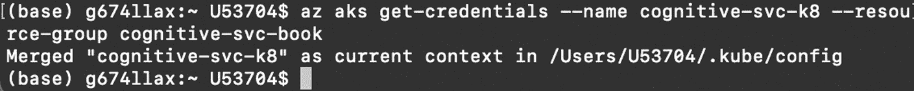

图 8-37

集群登录输出

集群已成功创建，但它不包含任何容器节点。那么，让我们通过向 K8s 集群添加一个关键短语认知服务容器来解决这个问题。要将容器添加到集群，我们需要在 K8s 配置文件中添加此信息。Kubernetes 使用 YAML 进行配置设置。（YAML 最初代表 *Yet Another Markup Language*，这是一个有点傻的名字，但后来改为 *YAML Ain’t Markup Language*，以表明它旨在用于面向数据的目的，而不是文档标记。）

我们将使用 Visual Studio 2019 for Mac 来编辑它（如图 8-38 所示），但你可以随意使用你喜欢的编辑器。

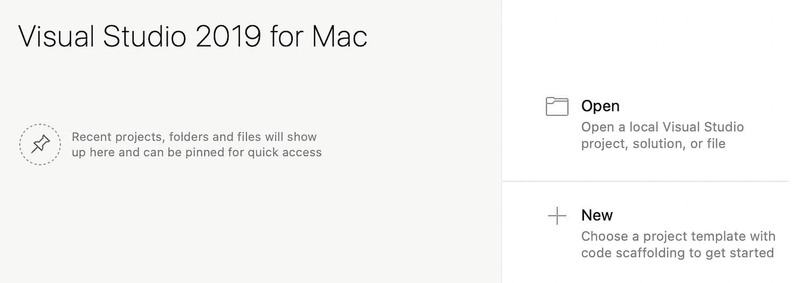

图 8-38

Visual Studio 2019 for Mac

YAML 文件（发音为 *yamel*，类似 *camel*）相当简单，如图 8-39 所示。在这里，我们定义了容器名称、镜像路径、端口、要分配的资源类型、计费 URL 和 API 密钥——这与之前创建 ACI 容器时所做的类似。

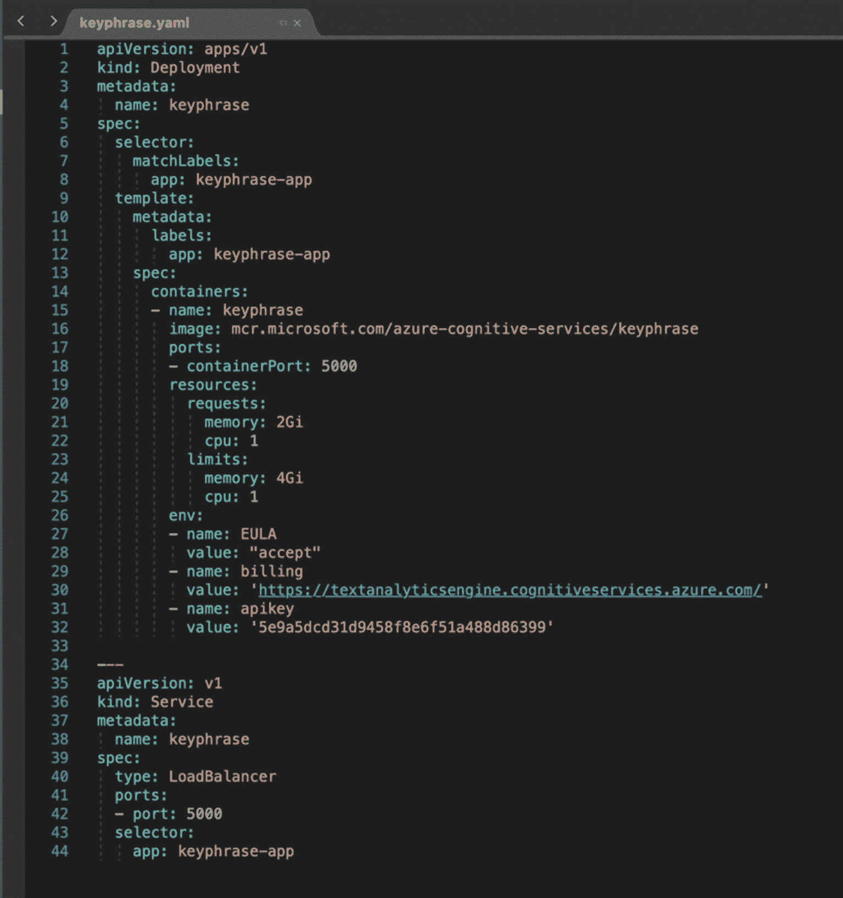

图 8-39

YAML 文件

现在，你可以使用以下命令将此 YAML 应用到容器：

```
kubectl apply -f keyphrase.yaml
```

命令行将显示图 8-40 中的结果，表明部署容器已创建。

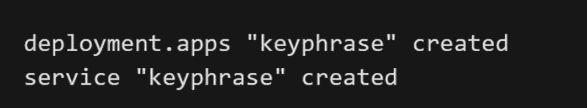

图 8-40

部署容器已创建

现在，你可以验证 Pod（最小的可部署单元，在此例中为认知服务容器及其相关服务和依赖项）是否已部署并且服务正在运行，如图 8-41 所示。

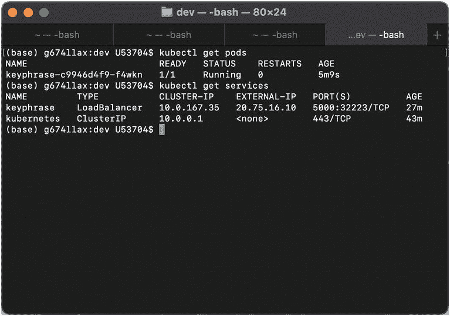

图 8-41

验证部署

如前面的截图所示，该容器现在可以通过公共 IP 地址 [`http://20.75.16.10:5000/`](http://20.75.16.10:5000/) 访问，并且可以调用它以访问认知服务容器和相关的 API。连接到集群后，你可以运行各种不同的命令，如图 8-42 所示。

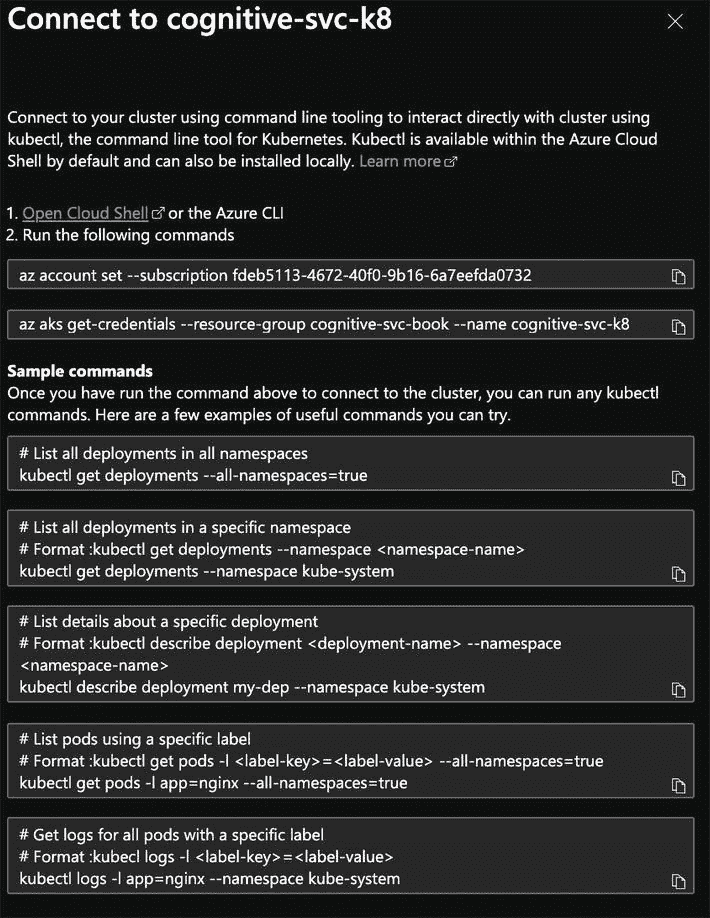

图 8-42

你可以使用的不同命令

这些命令以及图 8-43 所示的日志屏幕，展示了与单个 ACI 部署相比，使用 K8s 对容器管理拥有的控制程度。

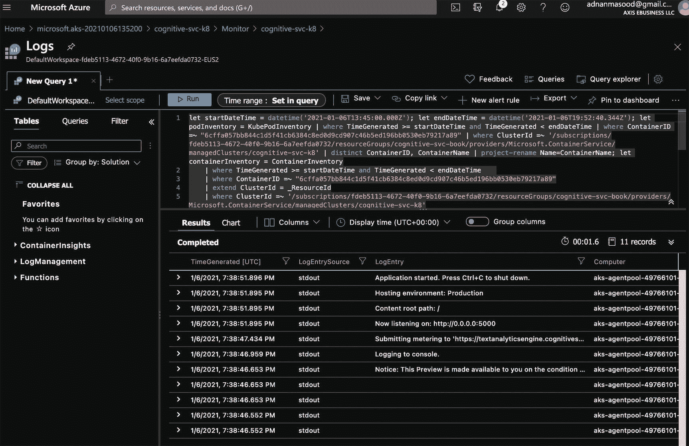

图 8-43

日志屏幕

## 总结与结论

容器是受限的，但几乎不受限。容器的世界与蓬勃发展的 DevOps 学科一样广阔，很难在短短一章中涵盖所有内容。我们尽力帮助你理解认知服务容器生态系统。我们探索了 Docker、ACI 和 AKS，并研究了容器在不同环境中的工作方式。然后，你创建了示例，这些示例调用容器中的自包含代码，而无需直接调用认知服务。

你现在已经掌握了基础知识，可以开始探索并将这些技术用于你自己的业务场景。你的监管、合规、基础设施和运营场景会有所不同，但这些基础知识将帮助你开始在组织内进行容器化。

保持容器化！

