# 9. Azure Bot 服务

人类：我们想要什么？

机器：上下文感知的 NLP 机器人

人类：我们什么时候想要它？

机器：我们想要什么？

自然语言处理 (NLP) 是机器人服务的核心元素。与我们的玩笑不同，我们希望在我们的机器人中开发人工智能 (AI)，以理解对话的上下文。机器人是对话式用户界面，允许你通过不同的模式（例如文本和语音）与机器进行通信。Azure Bot 服务是一个基于云的、托管的、集成的环境，用于支持机器人开发、托管和管理。Azure Bot 服务允许你专注于重要的事情，即对话界面的核心，同时它处理基础设施和相关的工具集。由全面的 Bot Framework 提供支持，Bot 服务附带预构建的模板供你入门，并提供一个基于浏览器的界面，使机器人开发尽可能简单。

在本章中，我们将通过创建 COVID-19 QnA 机器人来深入了解 Bot 服务。你将学习以下主题：

1.  了解 Azure Bot 服务
2.  使用 Azure Bot 服务创建 COVID-19 机器人
3.  使用 Azure Bot Builder SDK^(³²)


## Azure Bot 服务生态系统

Microsoft Bot 生态系统包含几个重要的产品，包括 Microsoft Bot Framework、Azure Bot 服务、语言理解 (LUIS) 和 Azure Health Bot（面向医疗保健的对话式 AI）。

Bot Framework 经历了多次迭代。它提供了一个 SDK 和一套全面的工具来构建对话式 AI。它包含 Bot Framework Composer、Bot Framework Solutions、Botkit、Bot Framework Emulator、Bot Framework Web Chat、Bot Framework Tools、Language Understanding、QnA Maker、Dispatch、Speech Services、Adaptive Cards 和 Analytics。这些主题相当庞大，超出了本书的范围。在本章中，我们将重点介绍如何使用 Azure Bot 服务构建机器人。

## 构建 Azure Service COVID-19 机器人^(³³)

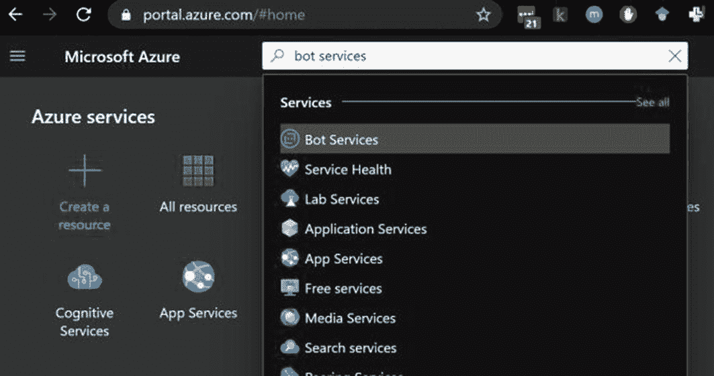

图 9-1

Azure 门户 – 创建机器人服务实例

1. 从 Azure 门户 (`portal.azure.com`) 开始，搜索 `bot services`，如图 9-1 所示。

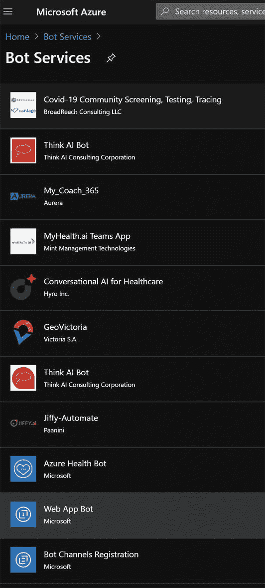

图 9-2

Azure 门户 – 创建 Web App Bot

1. 选择 `Bot Services`，您将看到 Microsoft 及市场中提供的不同机器人服务列表。选择 `Web App Bot`，如图 9-2 所示。

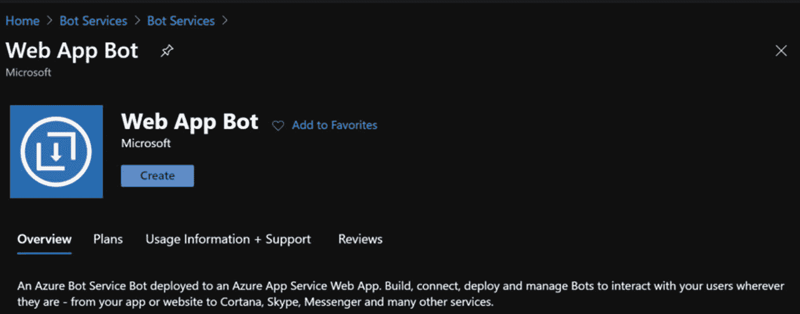

图 9-3

Azure 门户 – 创建 Web App Bot

1. 点击 `Create` 创建一个 Web App Bot，它将使用 Azure Bot 服务来帮助构建、部署和管理底层活动。参见图 9-3。

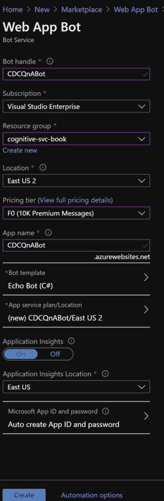

图 9-4

Azure 门户 – 创建 Web App Bot

1. 填写创建机器人的详细信息，包括机器人句柄名称、订阅、资源组、位置和定价层，并选择一个机器人模板。参见图 9-4。请记住，您始终可以使用自己现有的应用服务计划，而无需创建新的计划。

有几个机器人入门套件可供选择，这些套件提供 C# 和 Node.js 版本。Echo Bot 会回显消息，而 basic bot 则演示了 LUIS 技能。参见图 9-5。我们还有虚拟助手、LUIS Bot 和 QnA Bot。在本例中，由于我们专注于创建一个 COVID-19 机器人，因此我们将使用 QnA 模板。

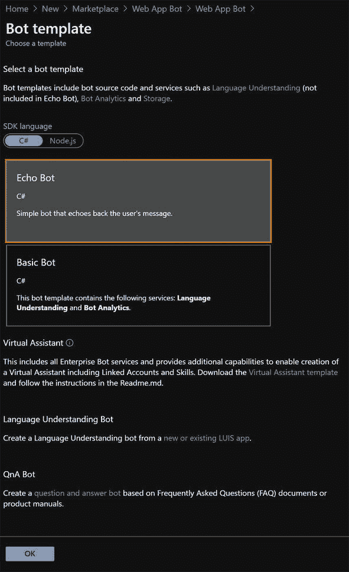

图 9-5

Azure 门户 – 机器人模板

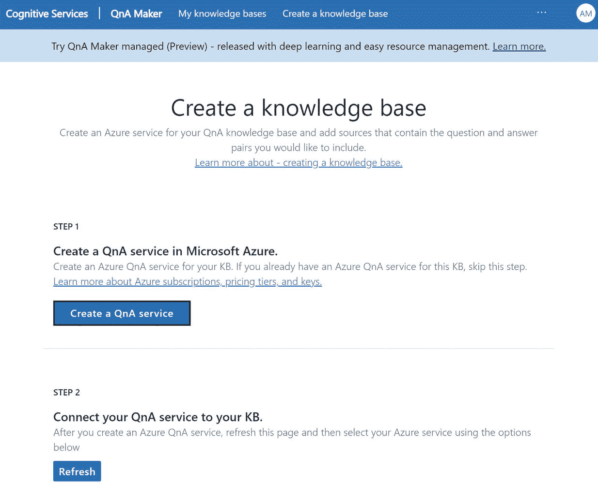

图 9-6

QnA Maker – 创建知识库

1. 为了使 QnA Bot 正常工作，我们需要创建一个问答知识库 (KB)。可以在此处创建此知识库。访问 [`www.qnamaker.ai/Create`](http://www.qnamaker.ai/Create) 上的 QnA Maker，并使用您的 Azure 帐户登录，即可看到如图 9-6 所示的屏幕截图。点击 `Create a QnA service`。

1. 然后您将看到 Cognitive Services 创建屏幕。QnA Maker 是一种基于云的服务，用于构建对话式 UI。使用您的订阅、资源组和应用服务详细信息填写以下表单（将打开一个新门户窗口以创建 QnA Maker）。点击 `Review + create` 继续。

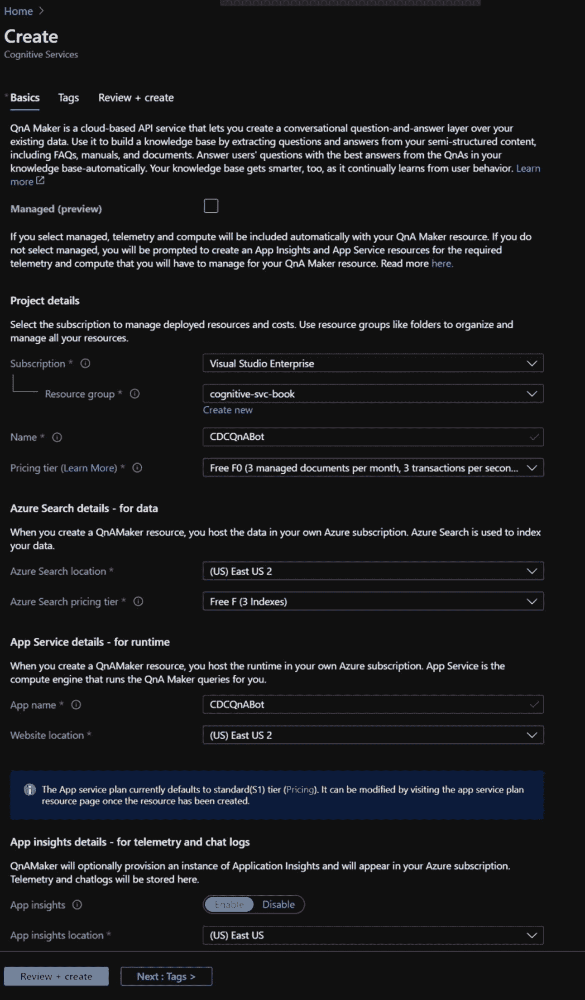

图 9-7

Azure 门户 – 创建认知服务

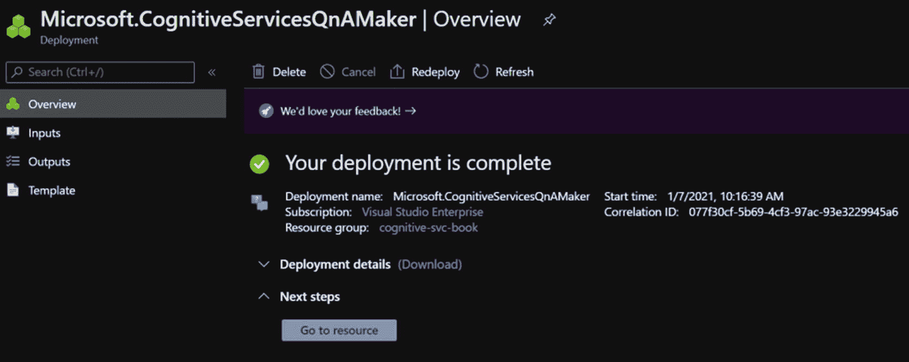

图 9-8

Azure 门户 – 认知服务部署完成

1. 服务创建并部署完成后，您将看到如图 9-8 所示的屏幕。然后进入 QnA Maker 的下一步。

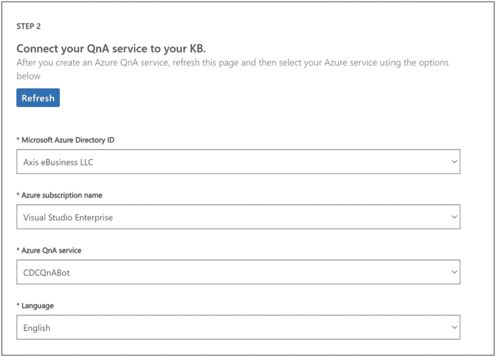

图 9-9

QnA Maker – 将 QnA 服务连接到知识库


1.  回到 QnA Maker，第二步是连接 QnA 服务，我们刚刚已将其连接到知识库。资源创建后，通常需要大约十分钟运行时才能就绪。然后，我们可以选择该服务，并在 QnA Maker 门户中创建知识库。点击图 9-9 所示屏幕上的**刷新**，以填充相应的字段。

填充完毕后，您需要为知识库命名。我们将其命名为 `CDCQnABotKB`。见图 9-10。

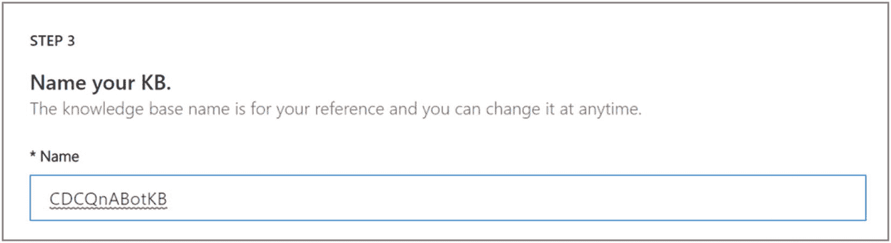

图 9-10

QnA 门户 – 命名知识库

最后，您现在需要创建您的知识库，即用内容填充它。有几种方法可以将内容上传到知识库。首先，您可以提供要读取的 URL 或文件。见图 9-11。

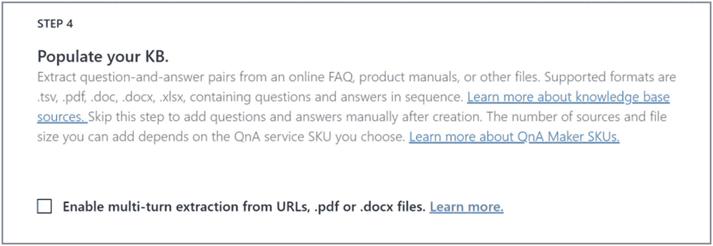

图 9-11

QnA 门户 – 填充知识库

在本例中，我们从 CDC 冠状病毒常见问题解答^(³⁴)中获取信息，并将其放入一个文本文件中（如图 9-12 所示），然后通过“添加文件”选项将其上传到知识库。您也可以使用 PDF 文件。

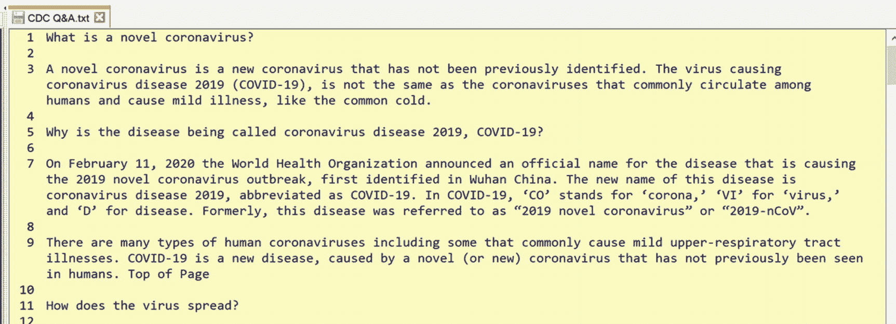

图 9-12

包含清理后 CDC 数据的知识库文件

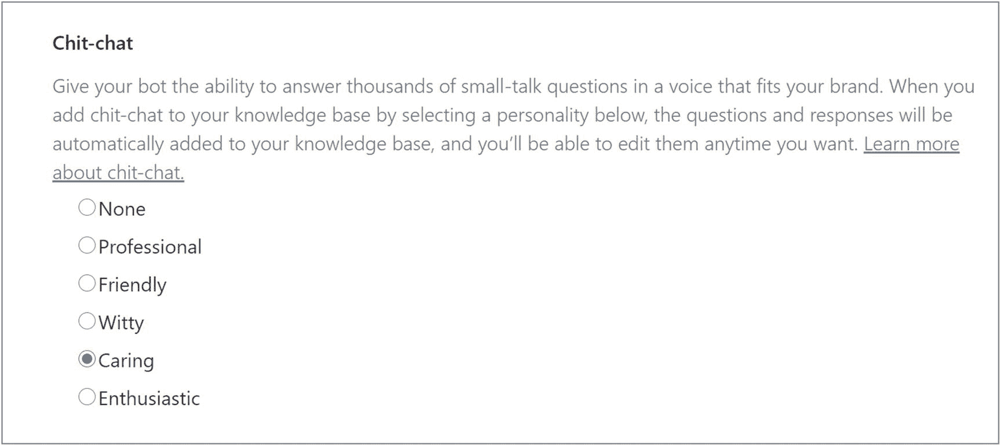

图 9-13

QnA 门户 – 向知识库添加闲聊模块

1.  在此步骤中，您可以通过添加一些预定义的、带有人设的闲聊问题来为机器人赋予个性。这些人设（如图 9-13 所示）是 Azure 机器人服务中闲聊功能的一部分。

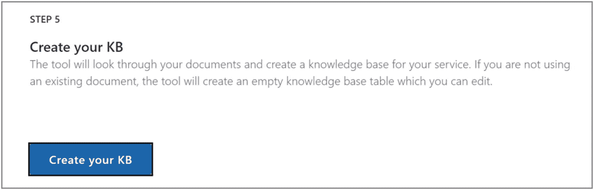

图 9-14

QnA 门户 – 创建您的知识库

1.  最后一步是创建您的知识库。点击**创建您的知识库**，如图 9-14 所示。

短暂的加载屏幕过后，您现在可以看到所有问答，作为 QnA Maker 知识库的一部分（如图 9-15 所示）。

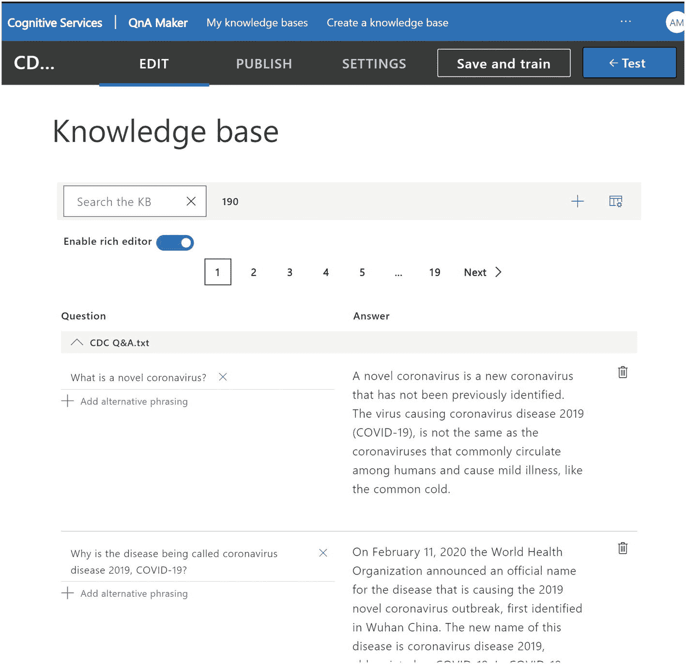

图 9-15

QnA 门户 – 知识库已填充 190 个问题

这个基于 Web 的 IDE 对于管理问答、添加替代措辞、测试问答以及提供替代答案（如果需要）非常有用。例如，在图 9-16 中，我们搜索了关键词 *swimming*，以查看 CDC 关于游泳的指南。在本例中，这只是一个关键词搜索，而不是一个问答。见图 9-16。

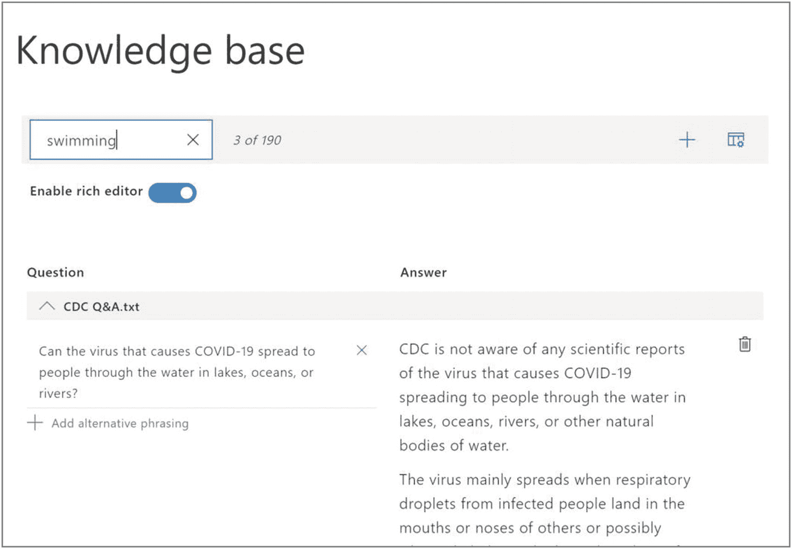

图 9-16

QnA 门户 – 搜索知识库

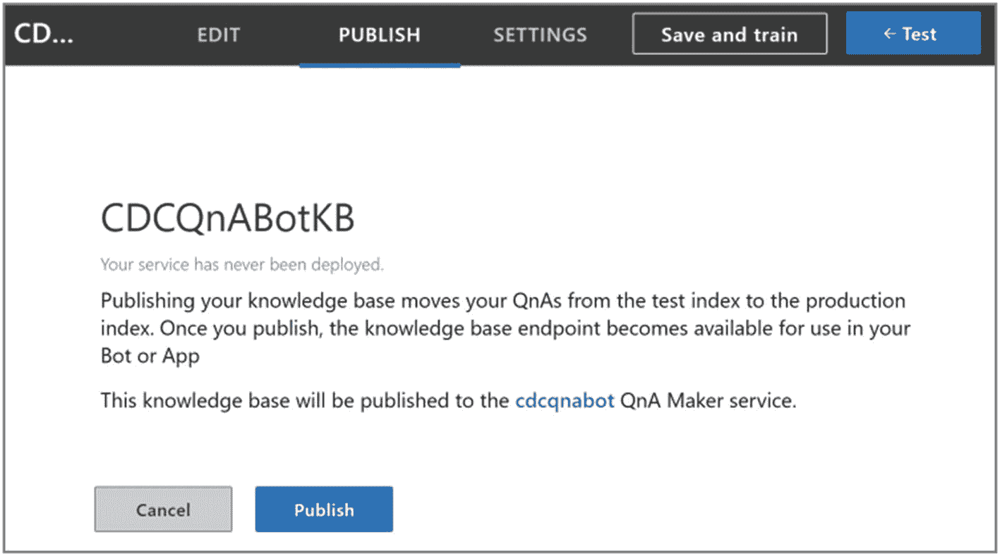

图 9-17

QnA 门户 – 发布知识库

1.  在这里，您会看到问答对与正确答案一起出现。请注意，问题并未直接包含单词 *swimming*，但它暗示了水体，而完整的答案中提到了 *swimming* 这个关键术语。现在是时候发布服务，让全世界看到了。点击顶部菜单中的**发布**选项卡，然后点击**发布**按钮（如图 9-17 所示）。

如果一切顺利，您将看到以下屏幕，通知您的问答知识库已作为 Azure 机器人服务部署。此时，它可作为公共 API 使用。您可以通过 Postman 或 cURL 调用它。

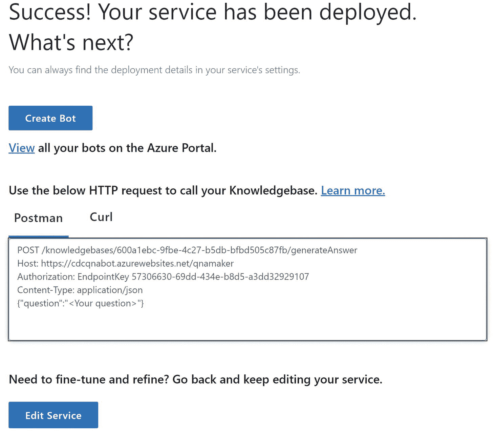

图 9-18

QnA 门户 – 知识库部署屏幕

> *从 QnA Maker 门户测试知识库也是了解最终机器人将如何响应的好方法。*

1.  为了测试该服务，我们将提问：“谁被认为是 COVID-19 患者的密切接触者？” 我们需要端点和密钥，这些信息可以从我们之前创建的 Azure 机器人服务实例中获得。使用以下代码进行 `cURL` 调用：

```
curl -X POST https://cdcqnabot.azurewebsites.net/qnamaker/knowledgebases/600a1ebc-9fbe-4c27-b5db-bfbd505c87fb/generateAnswer -H "Authorization: EndpointKey 57306630-69dd-434e-b8d5-a3dd32929107" -H "Content-type: application/json" -d "{'question':'Who is considered a close contact to someone with COVID-19?'}"
```

响应 JSON 立即返回，我们在图 9-19 中看到了 CDC 对 *close contact* 的定义。是不是很令人印象深刻？

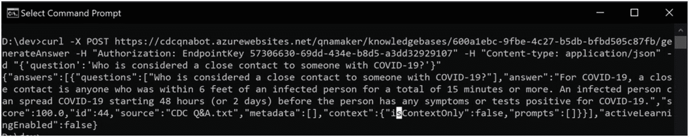

图 9-19

使用 cURL 调用知识库查询

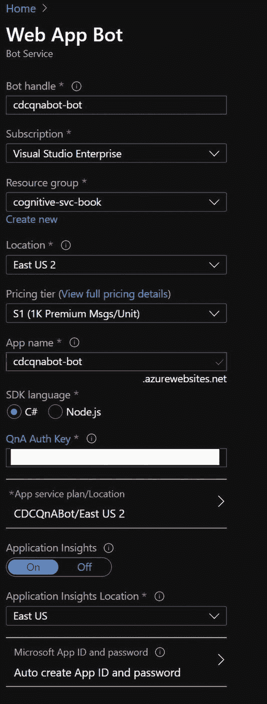

图 9-20

Azure 门户 – 创建 Web 应用机器人

1.  您可能还记得第 4 步，我们着手为 COVID-19 创建一个聊天机器人。既然我们的知识库已经准备就绪，我们可以返回并在 QnA 门户的上一屏幕（见图 9-18）中点击**创建机器人**按钮来创建机器人。这将打开 Web 应用机器人屏幕，其中预填充了 QnA 身份验证密钥。这意味着机器人现在已连接到 QnA 服务。

验证信息，然后点击**创建**继续。您的机器人将被创建，一旦部署成功，您将看到如图 9-21 所示的屏幕。

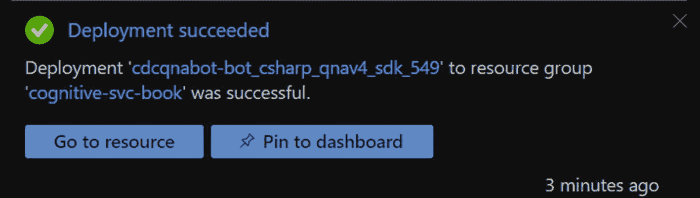

图 9-21

Azure 门户 – 机器人服务部署成功

1.  我们现在已经准备好了 Web 应用机器人，以及构建、测试、发布、连接适配器和评估分析的方法，这些都是一站式 Azure 门户的一部分。见图 9-22。

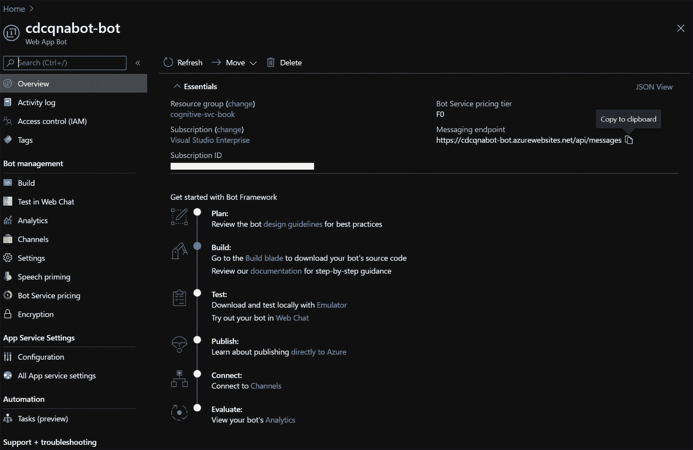

图 9-22

Azure 门户 – Azure 机器人服务中的 Web 应用机器人

您还可以通过使用 Web 聊天功能在浏览器中测试机器人。点击左侧窗格中的**在 Web 聊天中测试**，您将看到测试功能的屏幕。在本例中，我们将询问有关葬礼服务的问题，您可以看到，无需任何预先训练，它就会显示相应的答案。见图 9-23。

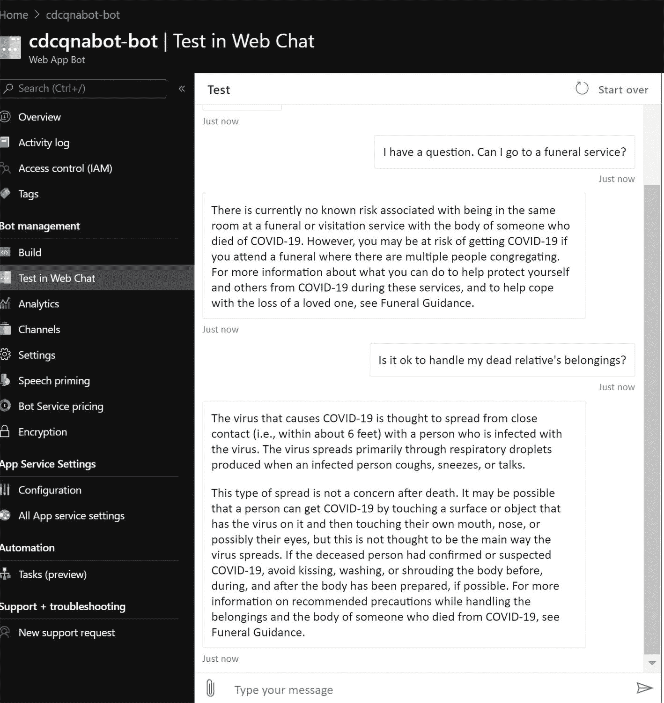

图 9-23

Azure 门户 – 测试 Web 聊天


在进入下一节之前，我们先确保对定价有清晰的认识。免费层允许发送 10K 条消息，但不保证 SLA。标准层有消息数量限制，但提供 99.9% 的 SLA 保证。请检查您的需求，确保选择正确的定价层。参见图 9-24。

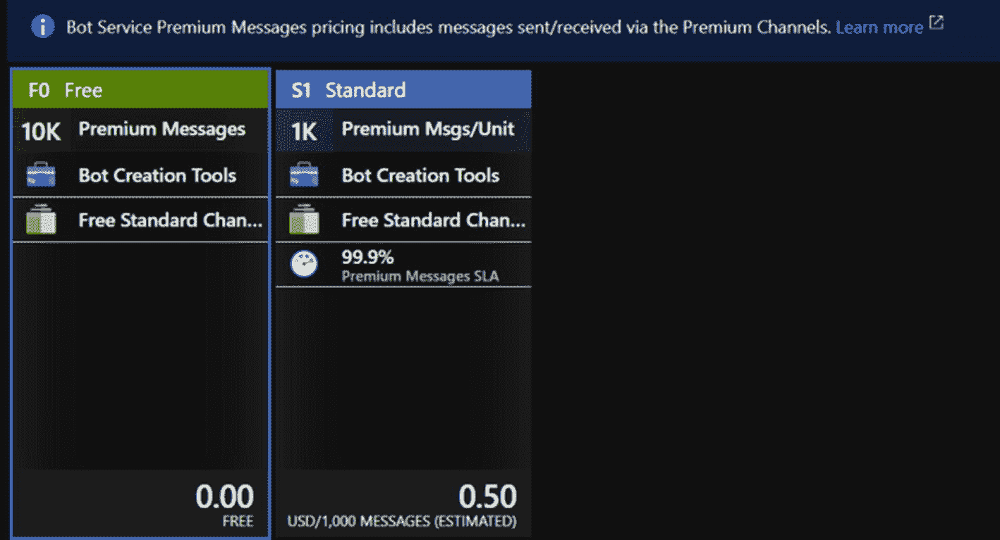

图 9-24
Azure 门户 – 定价层信息

在前面的示例中，您看到了使用 `QnA Maker` 和 `Azure Bot Services` 构建问答机器人是多么简单。但您可能已经注意到，在后台有很多工作在进行。这涉及到大量繁重的工作，包括解析自然语言查询、从文本文件中检索数据、将其转换为问答对、将这些查询作为服务发布，然后实时回答它们。好消息是，所有这些对我们来说都是隐藏的，我们无需构建任何东西，这要归功于 `Azure Bot Services`。

在下一节中，我们将了解如何从 Web 扩充机器人知识库，以及如何使用自然语言问题做一些有趣的事情。

## 从 Web 扩充机器人知识库

标准的 CDC 问答机器人很棒。然而，我们虚构的客户希望让 COVID-19 机器人更具本地化特色。希尔斯伯勒县是佛罗里达州人口第四多的县，他们希望将其常见问题解答^(³⁵) 纳入此机器人。请按照以下步骤操作：

1.  转到 `QnA Maker`，然后从顶部栏中单击 **My knowledge bases** 链接。您将看到列出的知识库 `CDCQnABotKB`，如图 9-25 所示。

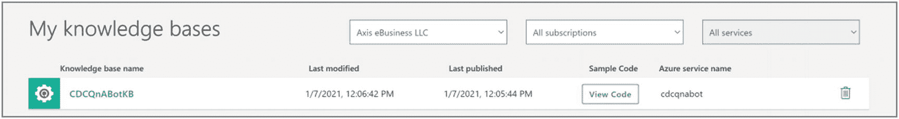

图 9-25
QnA 门户 – 知识库列表

单击知识库名称 (`CDCQnABotKB`) 以继续。

2.  要添加新资源，请在 QnA 门户中作为模型的一部分单击 **settings tab**。这将带您进入管理知识库屏幕，如图 9-26 所示。

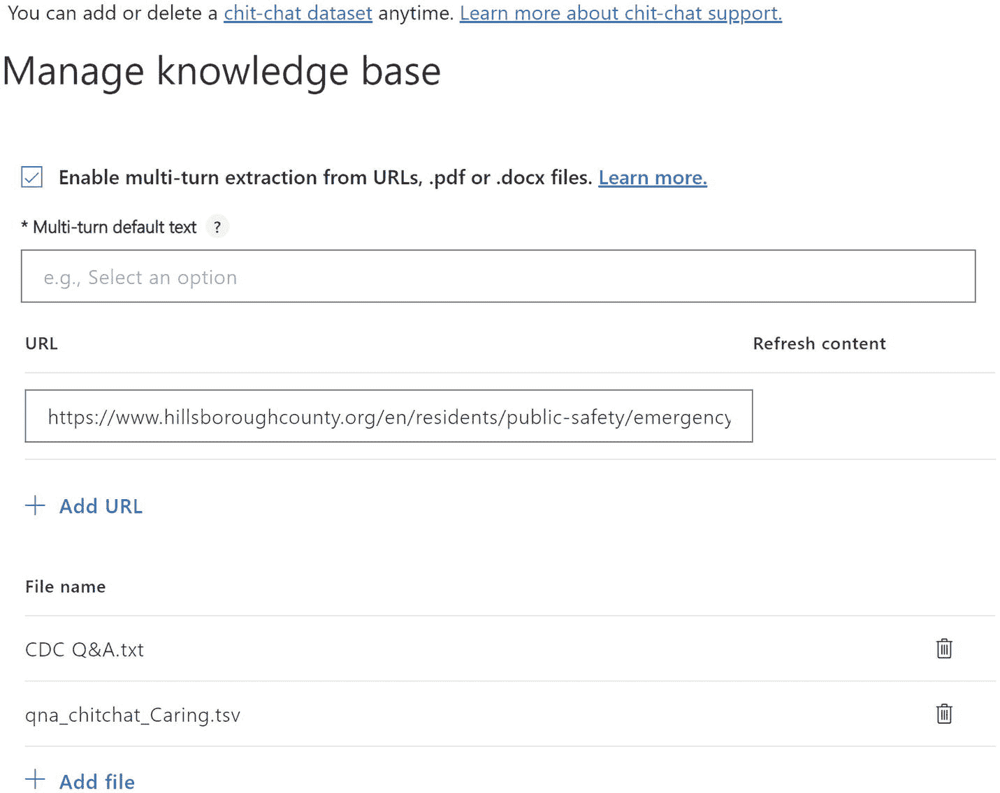

图 9-26
QnA 门户 – 管理知识库

3.  在链接中添加希尔斯伯勒县常见问题解答的 URL（该 URL 为 [`www.hillsboroughcounty.org/en/residents/public-safety/emergency-management/stay-safe/getting-tested`](https://www.hillsboroughcounty.org/en/residents/public-safety/emergency-management/stay-safe/getting-tested)）。现在，您可以从顶部菜单中单击 **Save and train**。之后，单击蓝色的 **Test** 按钮（如图 9-27 所示），然后提出一个与希尔斯伯勒县相关的问题。瞧！相关的答案就会从新来源中出现。这就是 `QnA Maker` 的强大之处，它是认知服务生态系统的一部分。

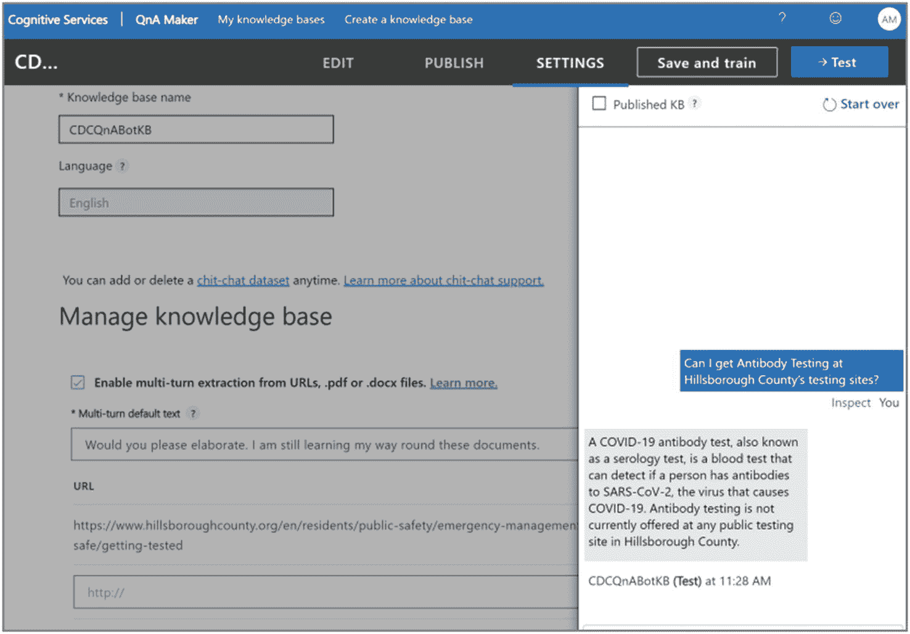

图 9-27
QnA 门户 – 测试知识库的问答

但是，如果您仔细查看答案，会发现它还有一些不足之处。首先，它没有提供关于雷蒙德·詹姆斯和李·戴维斯检测地点的地址和营业时间的信息。参见图 9-28。

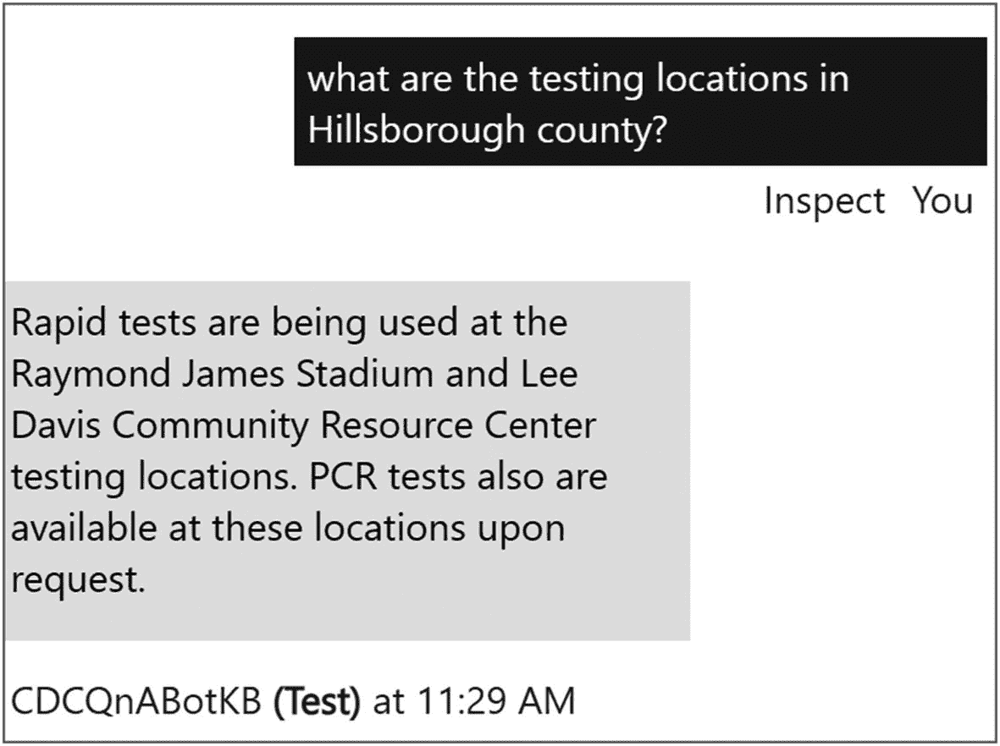

图 9-28
QnA 门户 – 测试知识库的问答

4.  我们假设问题在于这些信息存储在页面内的表格中，并且不是提取的知识库的一部分。但是，我们可以改进它。单击图 9-28 中的 **Inspect** 链接，您将看到答案及其相应的置信度分数（如图 9-29 所示）。

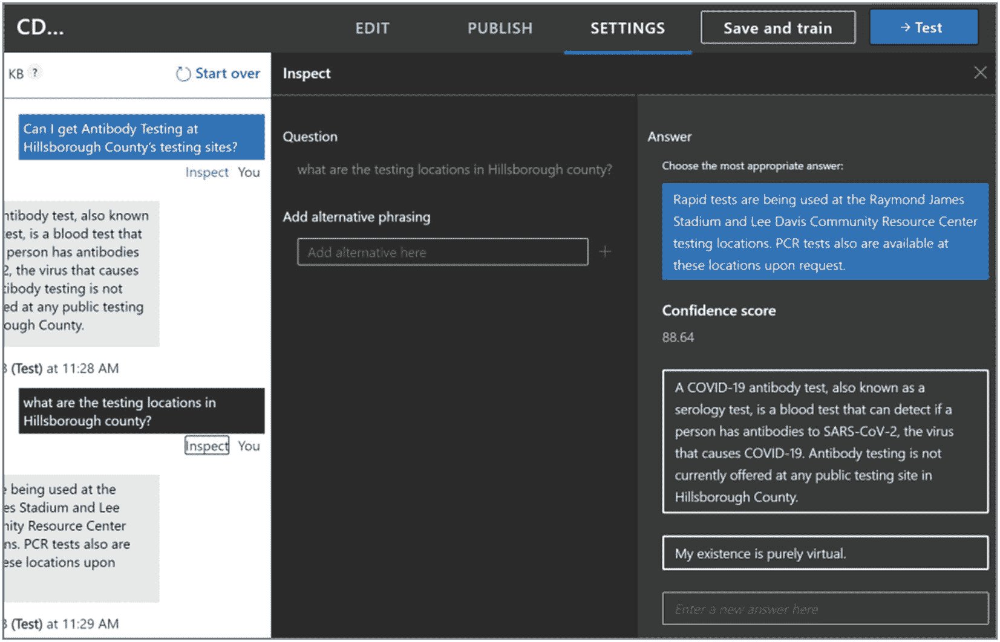

图 9-29
QnA 门户 – 编辑知识库的问答

这是一个绝佳的地方，可以测试您的问题、改进答案、为问题添加替代措辞（提出这些问题的其他方式），以及添加替代答案。这正是我们所做的，如图 9-30 所示。我们在现有答案中添加了地点，还添加了一些替代措辞。

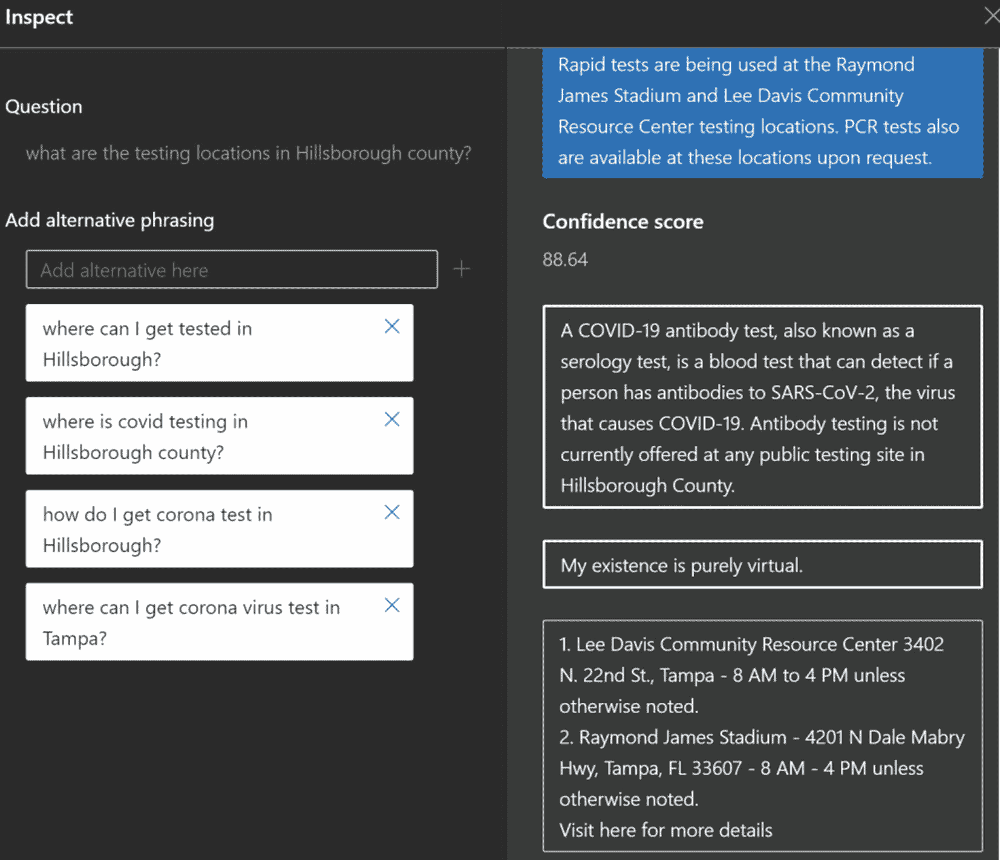

图 9-30
QnA 门户 – 编辑知识库的问答

5.  现在，您可以从顶部菜单中单击 **Save and train**，然后再次运行查询。参见图 9-31 中的答案。

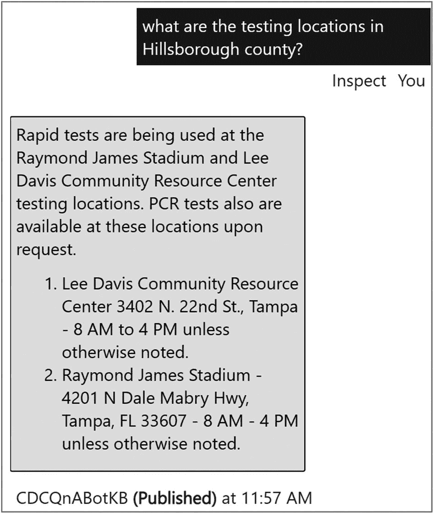

图 9-31
QnA 门户 – 使用编辑后的问答的知识库响应

现在答案很详细，正是我们想要的。您会注意到答案已添加到知识库中（如图 9-32 所示），其来源标识为 *editorial*。这有助于识别答案的来源引用。

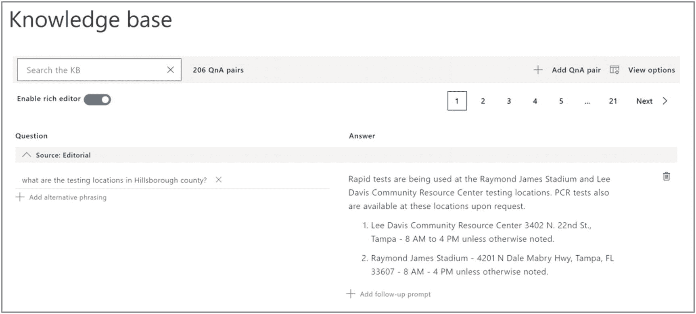

图 9-32
QnA 门户 – 使用编辑答案更新的知识库

6.  现在机器人知识库已经训练并运行，我们可以调用 API。与之前的 `cURL` 实例不同，这次我们将 debug 设置为 true，如下代码所示：

```
curl -X POST https://cdcqnabot.azurewebsites.net/qnamaker/knowledgebases/600a1ebc-9fbe-4c27-b5db-bfbd505c87fb/generateAnswer -H "Authorization: EndpointKey 57306630-69dd-434e-b8d5-a3dd32929107" -H "Content-type: application/json" -d "{'question':'can I go to a funeral safely?', 'Debug':{'Enable':true}}"
```

这使我们能够获得更大的问答集，以及调试标志项，例如相关的排名、同义词和答案的概率，这有助于我们理解响应。参见图 9-33 中的 `cURL` 响应。

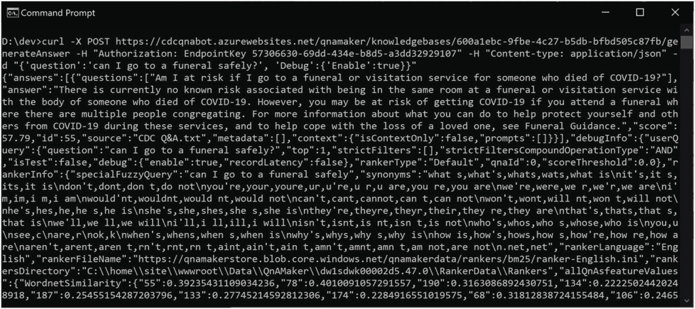

图 9-33
来自 Bot Services API 的带有调试信息的 `cURL` 响应

7.  最后，`Azure Bot Services` 的分析能力非常出色。您可以追踪用户数量、活动、渠道（Alexa、Cortana 等），并查看用户留存率。参见图 9-34。此屏幕可在 Azure 门户的机器人资源、对话分析选项卡或边栏选项卡上找到。

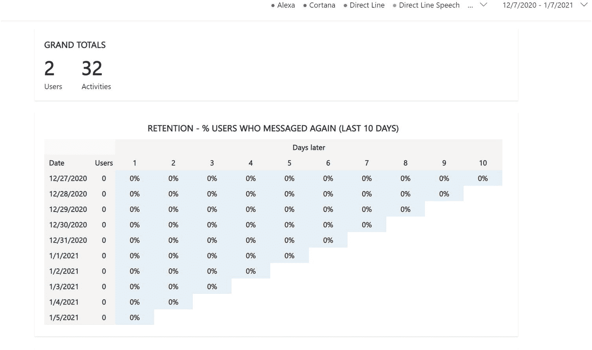

图 9-34
Azure 门户 – 关于用户与聊天机器人互动的分析


## 结论与总结

数字对话正在兴起，而机器人是我们应对这些需要即时满足的查询浪潮的第一道防线。在本章中，我们初步探索了 Azure 机器人服务和 Bot Framework 的功能。我们首先解释了 Azure 机器人服务的关键方面，然后使用 Azure 机器人服务创建了一个 COVID-19 机器人，接着使用 Azure Bot Builder SDK 和 QnA Maker 对其进行了测试。

现在，你已经对 Azure 机器人服务有了基本的了解，可以开始探索并将这些技术用于你自己的业务场景。自然语言对话有着大量的应用场景。从医疗保健到金融、零售和酒店业，各行各业都充满了为用户提供更好客户体验的用例。

继续畅聊吧！

