# 10. Azure 机器学习

问：为什么埃德在闹鬼的丛林里被袭击了？

答：因为其他人都足够理智，不会随便进入随机森林。

这是一个以我们合著者为代价的机器学习笑话，但它很好地引出了诸如随机森林之类的定制化算法。（随机决策森林通过对决策树中的任务进行分类，来输出均值或平均预测/回归结果。埃德的报复方式是他来解释这些笑话。）到目前为止，在本书中，你已经对认知服务进行了广泛的回顾，这些服务以托管且组织良好的方式提供了一组预构建的算法、模型和配方。这些服务能够加速机器学习开发，并使数据科学家能够更快速、更有效地交付产品和服务，而无需重复造轮子。

然而，现实世界的业务用例存在于数据科学和机器学习领域，而不仅仅是使用预构建的 API。你必须能够构建自己的模型，尝试新的数据集，增强现有模型，并创建自己的算法。请放心，Microsoft Azure 拥有广泛的能力来满足这些定制化需求。Azure 机器学习是微软 AI 生态系统不可或缺的一部分，它帮助机器学习工程师、AI 爱好者和专业人士以及公民数据科学家实现智能解决方案。端到端的机器学习生命周期不仅包括构建、训练和部署机器学习模型，还包括长期维护它们。你必须监控模型漂移和衰减，根据需求进行扩展，并完成挑战者测试，以确保最佳模型胜出。Azure 机器学习平台有助于整合这些多样化的服务，以支持完整的机器学习生命周期。

本章将帮助你了解 Azure 机器学习生态系统产品，以及如何训练应用程序在没有显式编程的情况下进行学习，这正是机器学习的目标。到目前为止，你主要看到了 Azure 认知服务的实际应用，但在本章中，我们将回顾整个 Azure 机器学习生态系统，为你提供认知服务之外的广阔图景。你将学习：

*   Azure 机器学习堆栈和产品

*   使用 Azure 机器学习设计器通过无代码方式构建模型

*   使用 Python 构建 ML 模型并使用 Azure 笔记本进行部署

*   使用 Azure 机器学习部署和测试模型

让我们开始吧。

## Azure 机器学习堆栈

Azure 机器学习堆栈是一个不容小觑的云平台超大规模计算力量。它包含了从数据摄取到模型部署和管理的整个端到端机器学习平台能力。例如，为了引入用于运行预测分析的数据集，并包含数据科学实验，Azure 提供了存储库，如 Azure Blob 存储和 Azure Data Lake 存储。对于机器学习计算资源，有单个虚拟机 (VM)、带有 HD Insight 的 Spark 集群或 Azure Databricks 等选项。

图 10-1 概述了 Azure 机器学习堆栈中的不同产品以及何时应使用它们。本章的重点是 Azure 机器学习。

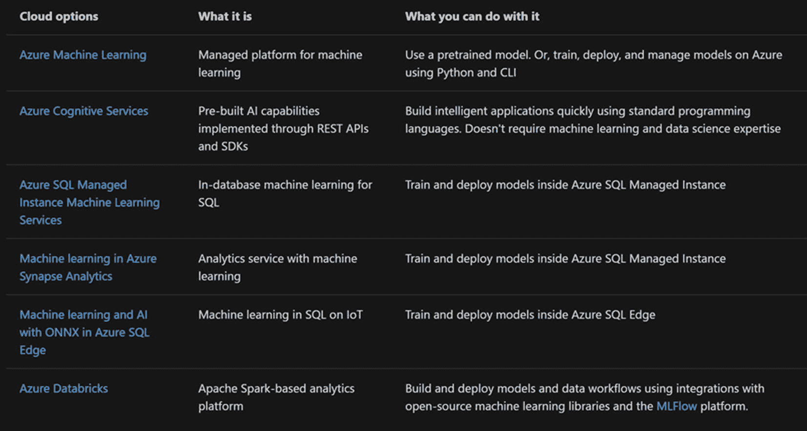

**图 10-1** Azure 机器学习关键产品 – 来自 [*https://docs.microsoft.com/azure/architecture/data-guide/technology-choices/data-science-and-machine-learning*](https://docs.microsoft.com/en-us/azure/architecture/data-guide/technology-choices/data-science-and-machine-learning)

企业就绪性和治理需要数据保护，这由 Azure Key Vault 提供，用于管理和保护凭据。可重复和可重现的实验有助于获得一致的结果，并且需要一组托管且版本管理得当的模型和依赖项。使用 Microsoft Azure，你可以使用 Docker 容器，并通过 ACI 和 AKS 管理这些存储库，以根据需要构建和部署。在机器学习背景下，显著的能力如图 10-2 所示。

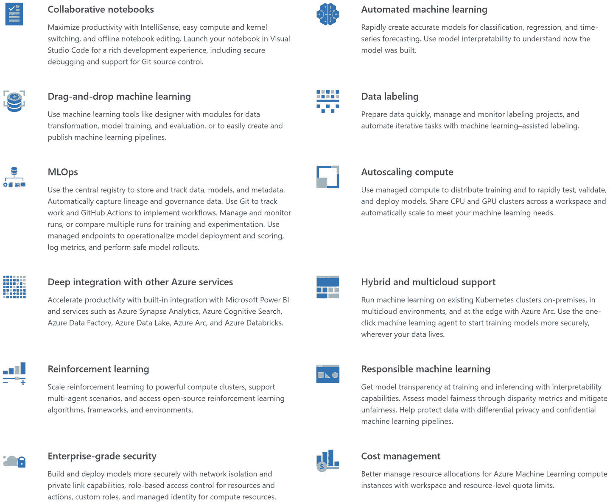

**图 10-2** Azure 机器学习关键服务能力 – 来自 [*https://azure.microsoft.com/services/machine-learning*](https://azure.microsoft.com/en-us/services/machine-learning/)

以下内容简要概述了这些能力所包含的内容，你将作为 Azure 机器学习工作室（Azure 数据科学家的一站式机器学习平台）的一部分看到它们。Azure 机器学习层次结构中的最高项是工作区，如图 10-3 所示。它包含各种不同的元素，例如实验、管道、数据集、模型等，我们将在下面讨论。

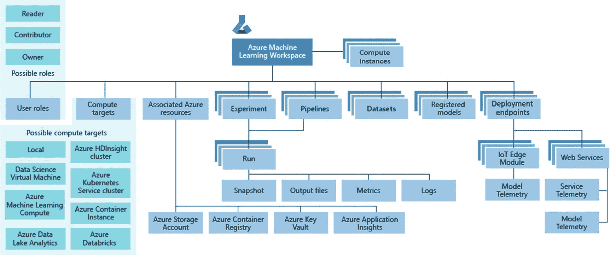

**图 10-3** Azure 机器学习工作区 – 来自 [*https://docs.microsoft.com/azure/machine-learning/concept-workspace*](https://docs.microsoft.com/azure/machine-learning/concept-workspace)

**图 10-4** Azure 机器学习工作室 – 关键产品

1.  **端点** – 机器学习模型需要被使用，有几种方法可以实现。部署机器学习模型的一种流行方式是通过 Web 服务，该服务包含一个或多个端点。端点是一个地址，可以通过定义良好的协议（例如基于 HTTP 的 RESTful API）访问和调用模型。（*REST* 代表表述性状态转移。）

2.  **Azure 笔记本** – Azure 笔记本为数据科学家提供了一个集成的工作环境，使其能够在 Azure 工作区内访问文件、文件夹、存储和计算资源。我们在第 6 章中看到了 Jupyter 笔记本，Azure 笔记本与之类似；它们只是使用了 Azure 的计算和存储资源，我们稍后将进行探讨。Azure 笔记本提供了一个绝佳的平台，可以在一个地方协作处理数据集、模型并进行实验。参见图 10-4 中的笔记本。

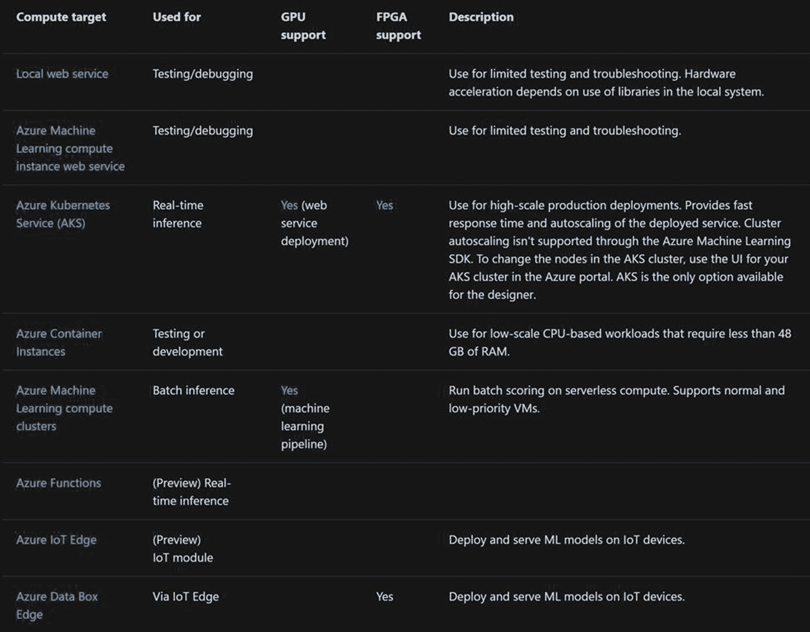

**图 10-5** Azure 机器学习计算目标

1. **自动化机器学习** – 自动化机器学习（简称 AutoML）是一种应用机器学习技术，为问题找出最佳模型的能力。这包括自动特征工程、神经架构搜索和超参数优化。Azure AutoML 消除了寻找最佳超参数时的猜测工作，并能以无代码的方式帮助你找到最适合使用的模型。

2. **数据集** – 对于机器学习从业者来说，管理机器学习资产（如模型和数据集）可能是一个具有挑战性的问题。借助 Azure 数据集，你可以轻松地在多个机器学习工作流中共享和跟踪数据，同时数据的一个副本会保留在存储中。例如，无需担心连接性和连接字符串即可访问数据。

3. **试验** – 试验和可重复性是*数据科学*之所以成为科学的关键，它能够创建数据集和算法并进行试验。Azure 机器学习的“试验”部分会跟踪你的机器学习试验和运行情况，以便你可以重放管道。

4. **管道**^(³⁶) – *管道*可能是机器学习中含义最丰富的术语，通常指数据提取、模型开发和训练、调优、生产发布，然后是监控和审查，或这些活动的某种组合。在 Azure 机器学习的上下文中，它是指这些机器学习任务的可重复执行工作流，可以执行数据操作（如归一化、转换、特征化、验证等）、模型构建和训练（如超参数调优、自动模型选择、模型测试和验证）以及模型部署（如部署和批量评分）。模型管道提供了出色的功能，例如：

    - 无人值守执行

    - 多样化的计算资源可访问性

    - 可重现性和可重用性

    - 跟踪和版本控制

5. **模型** – 模型是机器学习的核心：它们通过使用指定的算法，封装了从数据中学习到的知识。在 Azure 机器学习工作区中，你可以注册、创建、管理和跟踪模型。你在工作区其他部分构建的任何模型也会在此存储库中注册，并可在整个平台中使用。

6. **计算** – 机器学习模型、自动化机器学习过程和 Jupyter 笔记本，都需要一个运行（执行计算）的地方。这正是 Azure 计算所提供的——你可以在此创建不同类型的计算目标，如图 10-5 所示。下表详细说明了适用于工作负载的不同训练目标。对于机器学习工作负载，你可以使用本地计算机、计算集群、远程虚拟机以及各种其他训练目标。

7. **数据存储** – 数据存储是数据的存储库；它们是数据集的容器，例如 Azure 存储、Azure Data Lake Storage、Azure SQL 数据库和 Azure Databricks 文件系统 (DBFS)。对于系统存储，Azure 机器学习使用 Azure Blob 容器和文件容器。

8. **标记** – 标记和注释是数据科学生命周期的重要组成部分。使用 Azure 机器学习的标记功能，你可以通过创建标记项目、管理工作流并将其分发给多个标记人员来标记数据集，还可以利用机器学习来帮助你完成标记。

你很快就会在实际操作中进一步了解这些组件。在我们踏上构建机器学习模型的旅程时，了解用于构建模型的正确算法非常重要。

除了提供一些阐述清晰、简洁且管理完善的文档外，Azure 机器学习团队还提供了一份非常有用的备忘单（`aka.ms/mlcheatsheet`），可帮助你确定最佳的机器学习算法。该备忘单如图 10-6 所示。

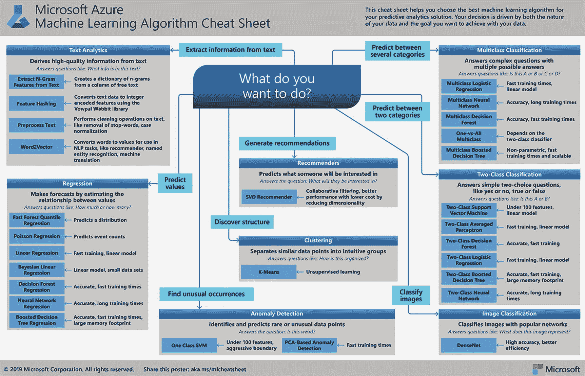

**图 10-6** Azure 机器学习算法备忘单（`aka.ms/mlcheatsheet`）

无论你是想在类别之间进行预测、发现结构，还是从文本中提取信息，在下面的流程中，你都可以根据需求找到最佳的算法。

## 使用 Azure 机器学习实现 Hello World

到目前为止，本书中你主要使用的是预构建的库和 API。在接下来的示例中，我们将展示如何获取 UCI 人口普查成人收入数据集^(³⁷)，并构建一个 Jupyter notebook，根据人口普查数据预测收入是否超过每年 5 万美元。有关此数据集的信息，请参见图 10-7。

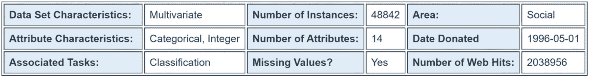

图 10-7

UCI 人口普查成人收入数据集信息 ([*https://archive.ics.uci.edu/ml/datasets/Adult*](https://archive.ics.uci.edu/ml/datasets/Adult))

然后，我们将使用 Azure ML 设计器重复此实验。请按照以下步骤操作：

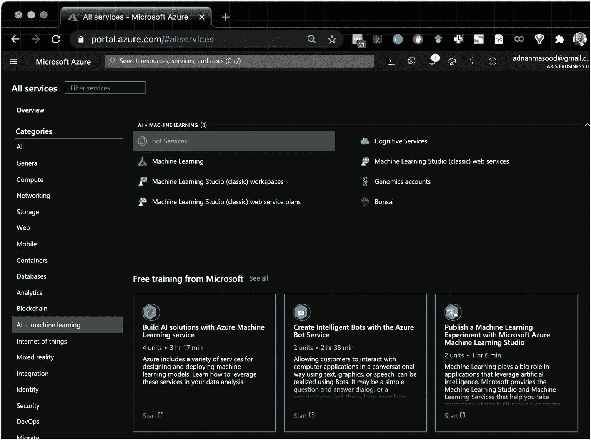

图 10-8

Azure 门户 – 创建机器学习工作区

1. Azure 机器学习 notebook 是 Azure 机器学习工作室的一部分。但是，首先你需要创建一个工作区才能继续。访问 Azure 门户 ([`http://portal.azure.com`](http://portal.azure.com))，然后选择**机器学习**，如图 10-8 所示。

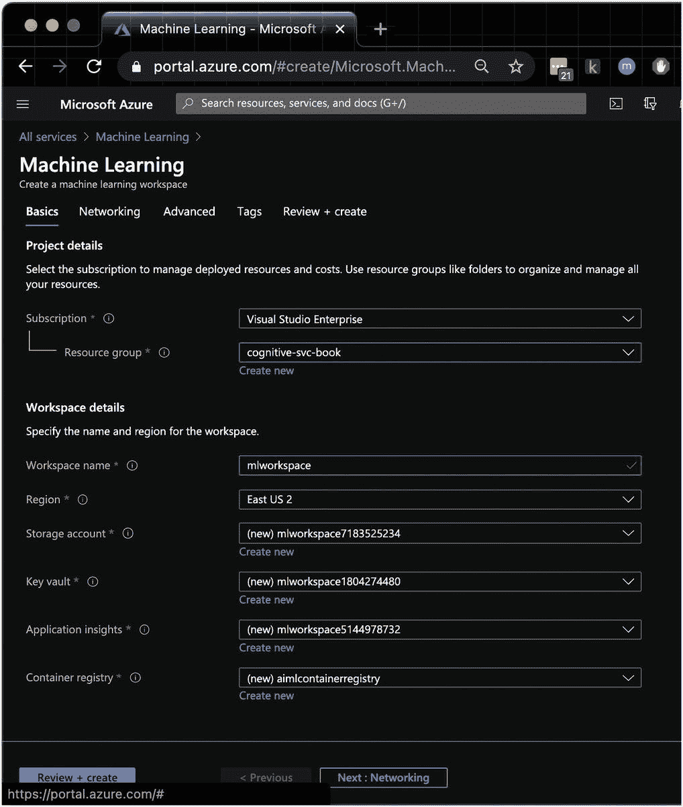

图 10-9

Azure 门户 – 创建机器学习工作区

2. 填写有关订阅、工作区名称、区域和存储帐户的详细信息。除非你有特定的网络或容器用例需要处理，否则可以将大部分设置保留为默认值。完成后，单击**查看 + 创建**以继续（如图 10-9 所示）。

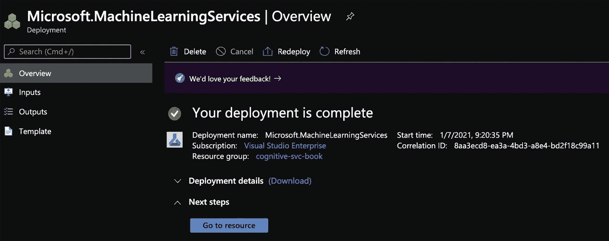

图 10-10

Azure 门户 – 创建机器学习工作区

3. 部署完成后，你将看到如图 10-10 所示的消息。要继续，请单击**转到资源**。

4. 在资源屏幕中，你将看到已创建工作区的摘要。现在你可以继续使用机器学习工作室了。你可以单击工作室 Web URL，也可以单击**启动工作室**按钮，这将带你进入 Azure 机器学习工作室。

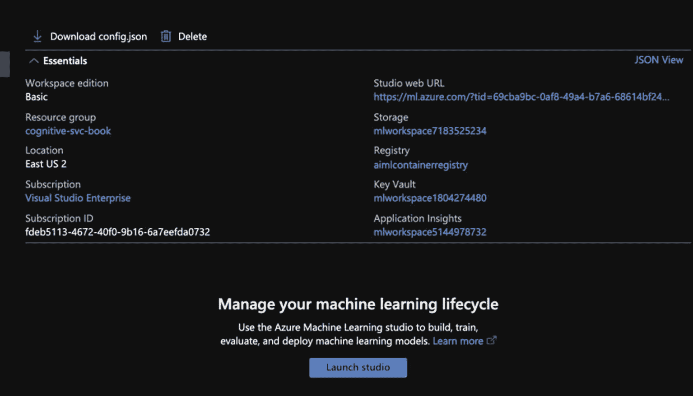

图 10-11

Azure 门户 – 创建机器学习工作区

## Azure 机器学习工作室

你可能会注意到，机器学习工作室还有另一种风格，称为 Azure 机器学习工作室（经典版）^(³⁸)。不要将其与当前现代化的 Azure 机器学习工作室界面混淆，后者包含设计器、自动化机器学习和 Jupyter notebook 功能。Azure 机器学习工作室（经典版）是 2015 年创建的用于构建机器学习模型的原始拖放式 UI。其大部分功能现在都可以在设计器中使用，但现代化的 Azure 机器学习工作室环境提供了更多功能。

5. 这是 Azure 机器学习工作室的主屏幕，现在可以通过 ML URL (`ml.azure.com`) 访问。它包含你之前了解到的不同功能和技能。让我们单击 notebook 的**立即开始**按钮，创建一个简单的 *hello world* notebook。

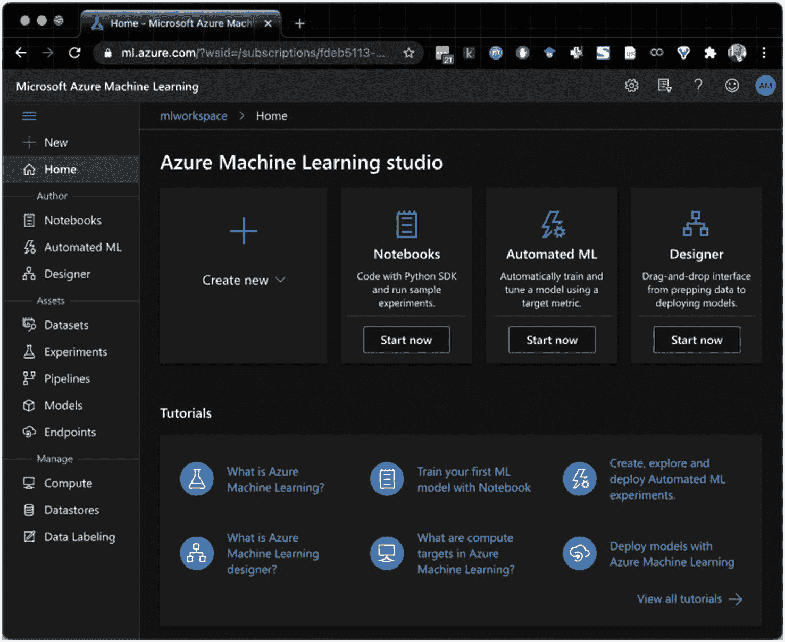

图 10-12

Azure 机器学习工作室主页

你可以选择浏览示例 notebook 或创建新的 Jupyter notebook 文件。作为入门步骤，让我们创建一个新文件，如图 10-13 所示。这将使你更容易理解底层依赖关系。

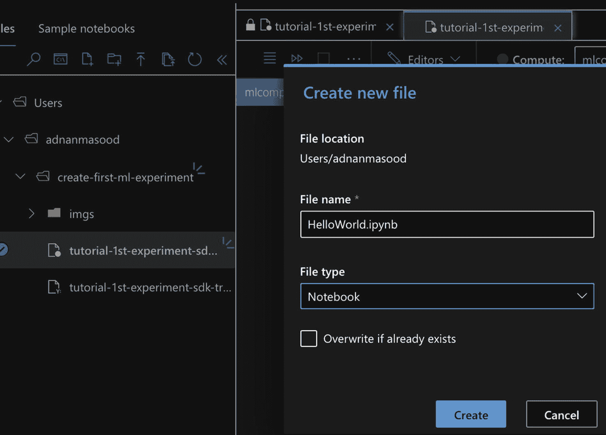

图 10-13

Azure 机器学习 – 创建 Jupyter notebook

6. 创建新的 Jupyter notebook（默认情况下为空）后，你会在右上角看到“未找到计算资源”消息（如图 10-14 所示）。如果你尝试运行此 notebook，将会收到一条错误消息，指出你的 notebook 当前未连接到计算资源。它要求你切换到正在运行的计算资源或创建新的计算资源来运行单元格。这仅仅意味着你需要一个计算资源来运行 notebook。单击**创建计算资源**按钮为 notebook 创建资源。

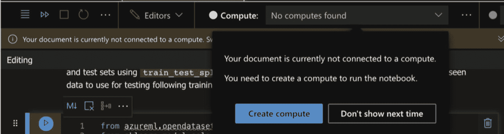

图 10-14

Azure 机器学习 – 创建计算资源

7. 计算实例屏幕可帮助你创建计算实例，在本例中为虚拟机 (VM)。你可以选择 VM 类型。如果你的工作负载侧重于深度学习，请使用 GPU。否则，CPU 就足够了。有一些预构建的 VM，其成本列在旁边 – 根据需要选择资源（参见图 10-15）。

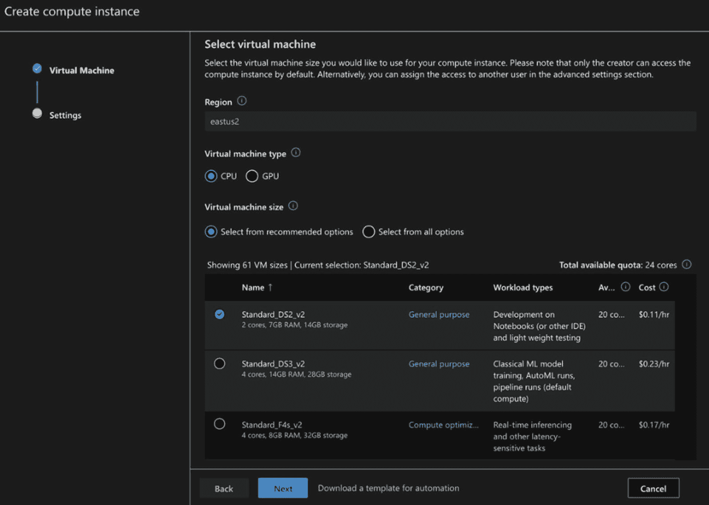

图 10-15

Azure 机器学习工作室 – 选择 VM

对于这个简单的示例，我们将选择一台具有以下规格的 DS2 v2 机器（如图 10-16 所示）。对于打印 *Hello World* 这个任务来说，这有点大材小用，但我们可以将此资源重用于下一个分类任务。

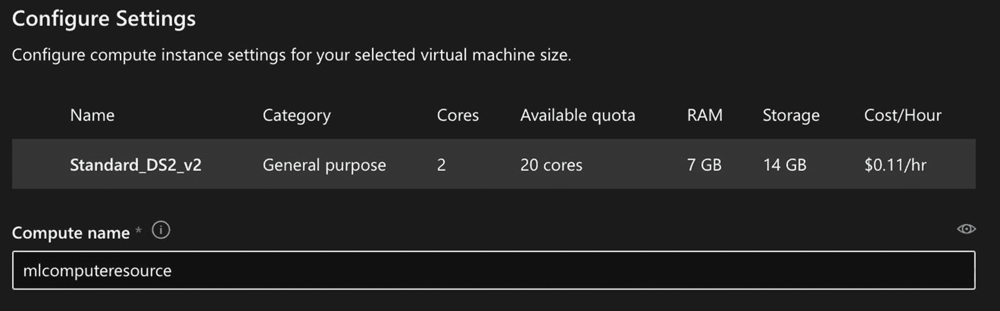

图 10-16

Azure 机器学习工作室 – 配置 VM 设置

8. 选择 VM 并创建计算名称后，现在可以运行 notebook 了。瞧！参见图 10-17。

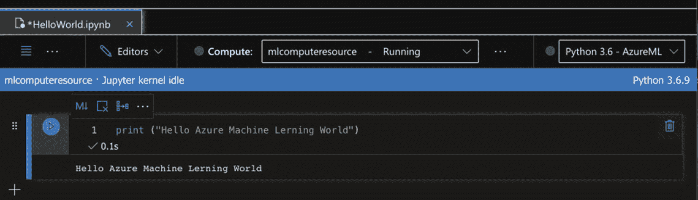

图 10-17

Azure 机器学习工作室 – Hello World notebook

这个示例看似简单，但它为你准备了接下来所需的所有先决条件：使用 Azure 机器学习服务和 Jupyter notebook 构建一个收入分类模型。现在，所有依赖关系都已解决，让我们来研究一下人口普查收入分类问题。

## 创建用于分类的机器学习模型

UCI 人口普查成人收入数据集^(³⁹) 已经存在一段时间了。它被用于多种不同的场景，包括根据人口普查数据预测年收入是否超过 5 万美元。

1. 点击**创建**按钮来创建一个笔记本，如图 10-18 所示。

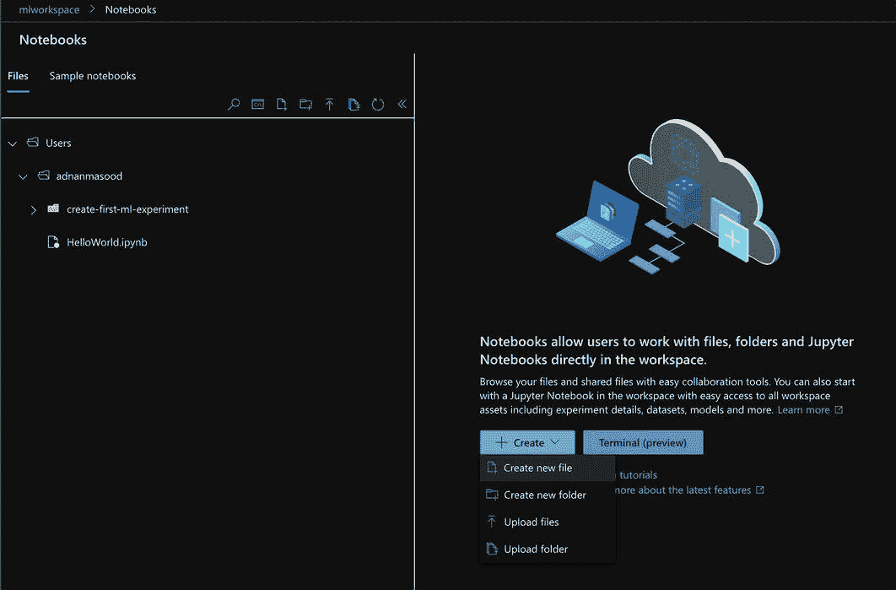

图 10-18

Azure 机器学习笔记本 – 创建笔记本工作流

将笔记本命名为 `AdultCensusClassifer.ipynb`。在文件类型下拉框中，选择**笔记本**（如图 10-19 所示）。

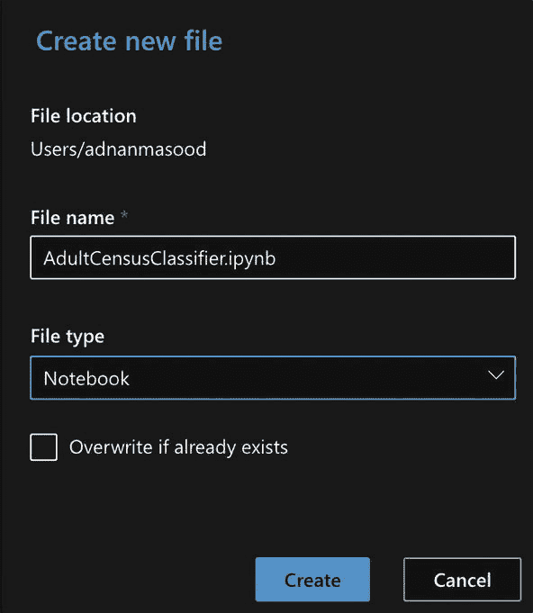

图 10-19

Azure 机器学习笔记本 – 创建笔记本工作流

1.  上传 `adult.csv` 和 `adult_test.csv` 数据集，这些文件是本书代码仓库的一部分。这些文件包含 CSV 格式的成人数据集，如图 10-20 所示。

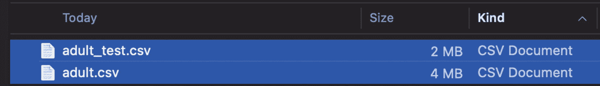

图 10-20

Azure 机器学习 – 上传数据集

你需要确认信任这些文件的内容。点击**我信任这些文件的内容**复选框以表示同意，如图 10-21 所示。任何不安全的上传都可能给你的仓库带来安全和管理问题。

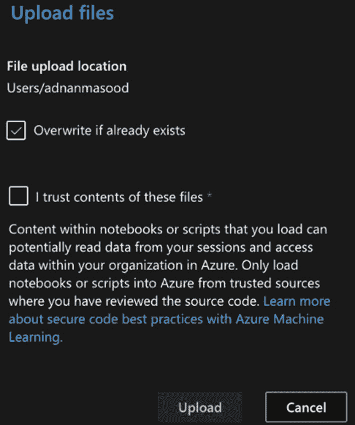

图 10-21

Azure 机器学习笔记本 – 上传数据集

你可以点击已上传的数据集，在浏览器中查看 CSV 文件，如图 10-22 所示。

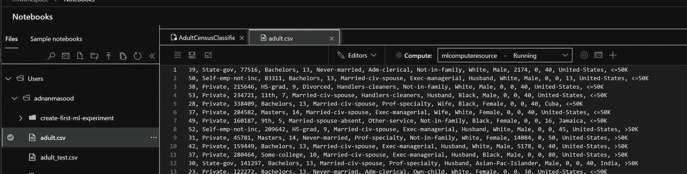

图 10-22

Azure 机器学习笔记本 – 查看数据集

1.  该实验将尝试对数据集应用不同的分类算法，然后生成准确率分数。代码段如图 10-23 所示，它加载了成人数据集、成人测试数据集以及先决条件和依赖项。

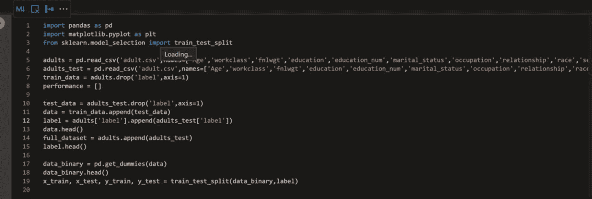

图 10-23

Azure 机器学习笔记本 – 运行先决条件和加载数据集的代码

1.  让我们在数据集上运行逻辑回归分类器，然后计算分数。`sklearn` 库使得接口非常一致且易于使用。最后，我们打印准确率分数并将其附加到性能数组中（如图 10-24 所示）。

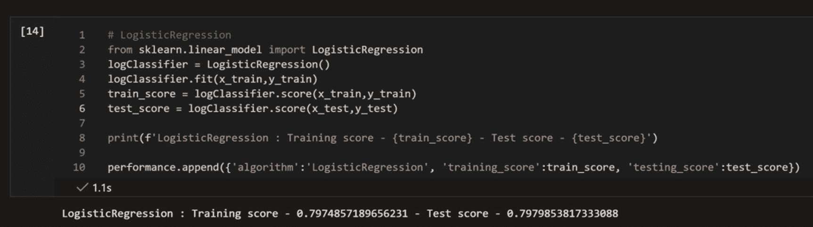

图 10-24

Azure 机器学习笔记本 – 逻辑回归代码

1.  我们使用高斯朴素贝叶斯、K 近邻、随机森林和支持向量机重复相同的实验。在图 10-25 中，你可以看到随机森林在训练数据和测试数据上都取得了最佳结果。

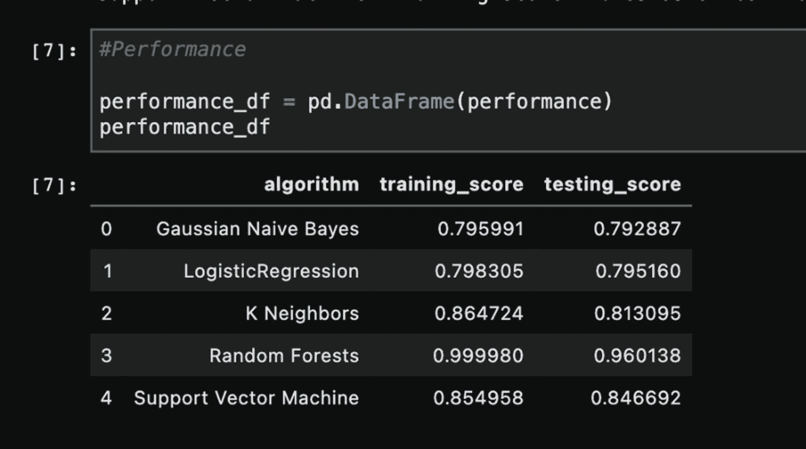

图 10-25

Azure 机器学习笔记本 – 实验结果

在结束之前，笔记本的 IntelliSense（一种代码补全辅助功能）是一个很棒的特性，它让你在浏览器中拥有 IDE 的外观和感觉。在图 10-26 中，你可以看到鼠标悬停时显示的方法参数，并且还可以使用自动补全功能。

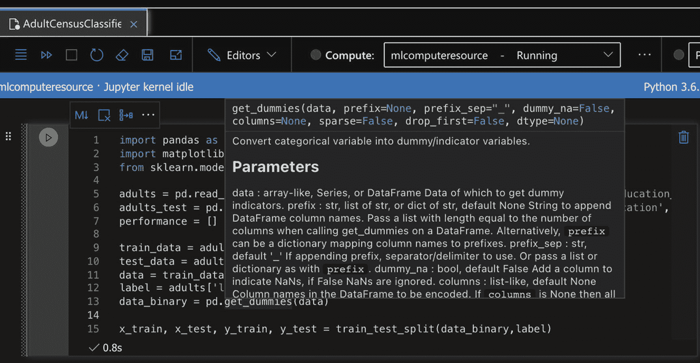

图 10-26

Azure 机器学习笔记本 – IntelliSense 和自动补全

这个实验让你了解了如何将数据集导入 Azure 笔记本并运行多种算法。

Azure Notebooks 曾有一个预览版本 (`https://notebooks.azure.com/`)，现已停用，并且这些笔记本并非 Azure 机器学习服务的集成部分。如果你正在寻找一个用于研究和开发的免费替代方案，Google Colab (`https://colab.research.google.com/notebooks/intro.ipynb`) 提供了一个绝佳的选择。但是，该服务是*无状态的*，这意味着每次会话过期后，你都需要重新加载数据集。

## 使用 Azure 机器学习设计器构建分类模型

在前面的示例中，我们通过使用 Azure 机器学习笔记本构建了一个分类模型。这是一种代码密集型方法，需要我们为不同的算法编写 Python 代码。现在，我们将采用一种低代码方法，使用 Azure 机器学习设计器，如图 10-27 所示。

在 Azure 机器学习工作区门户的左窗格中，单击 `Designer`。设计器主页随即打开，您可以在其中看到管道的集合（如图 10-27 所示）。

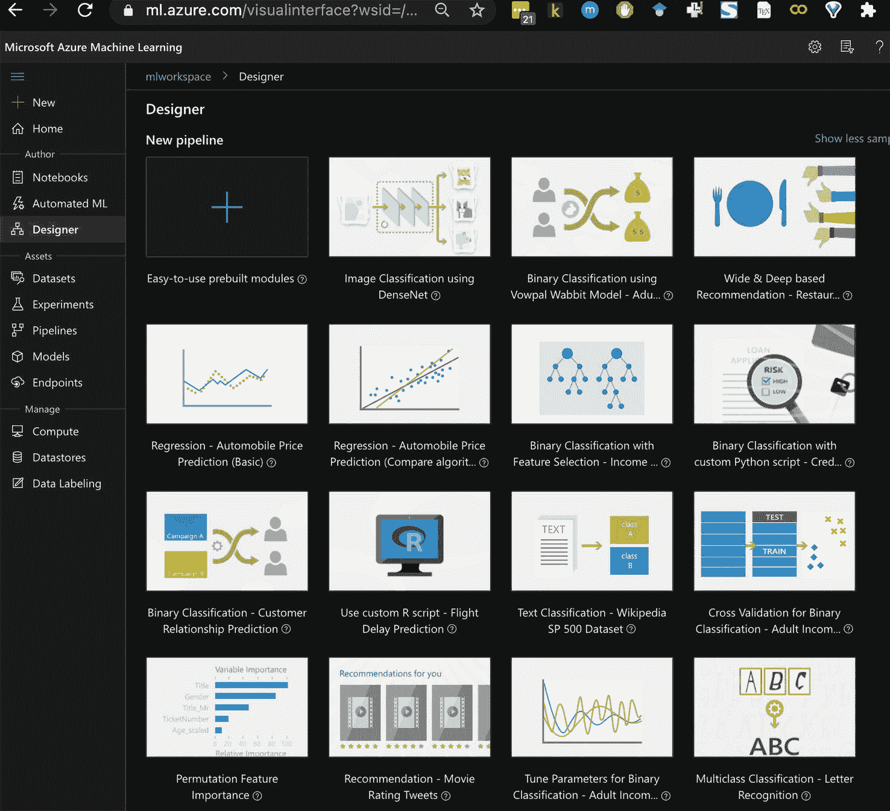

**图 10-27** – Azure 机器学习设计器 – 主屏幕

Microsoft Azure 团队提供了一套基础及高级的配方，用于学习如何使用设计器。Azure 机器学习设计器的示例管道和数据集包括回归示例（如汽车价格预测）、分类用例（如针对收入进行特征选择的二元分类）、信用风险、航班延误、客户关系预测、使用 Wikipedia SP 500 数据集进行文本分类，以及基于计算机视觉、使用 DenseNet 的图像分类。这些示例还包括推荐引擎，例如餐厅评分预测、基于推文的电影评分，以及使用 Vowpal Wabbit 模型进行成人收入预测的二元分类。

要使用 Azure 机器学习设计器构建分类模型，请遵循以下步骤：

1.  在此示例中，我们将使用成人人口普查收入数据集。通过双击主页上的示例将其打开，或者从头开始构建。要继续，请单击 `Designer` 选项卡（在左窗格中）。见图 10-28。

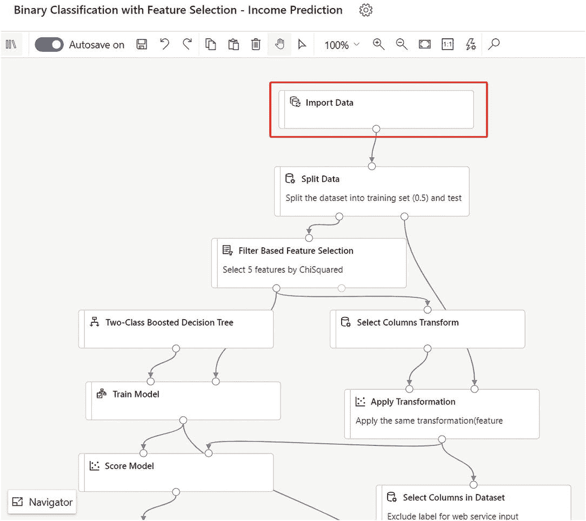

**图 10-28** – Azure 机器学习设计器 – 创作

2.  设计器是一个面向公民数据科学家的拖放工具，侧重于低代码。它相当易于使用。您可以先拖放 `Adult Census Income Binary Classification` 数据集（如图 10-29 所示）。

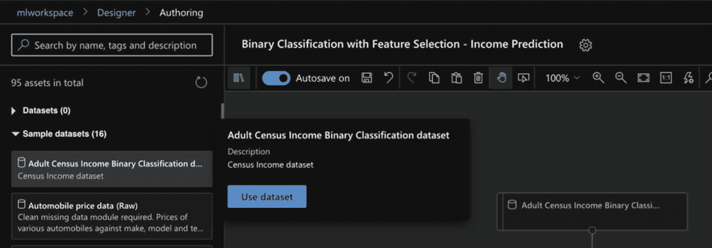

**图 10-29** – Azure 机器学习设计器 – 数据集导入

拖放数据集后，您将在右侧窗格中看到该数据集的参数（见图 10-30）。

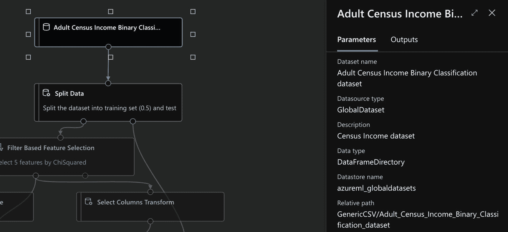

**图 10-30** – Azure 机器学习设计器 – 数据集导入

3.  需要将数据集拆分为训练数据集和测试数据集。这在上一节中是通过代码完成的。但是，这里我们将使用拆分数据模块来完成此任务。我们将对数据集执行随机拆分。见图 10-31。

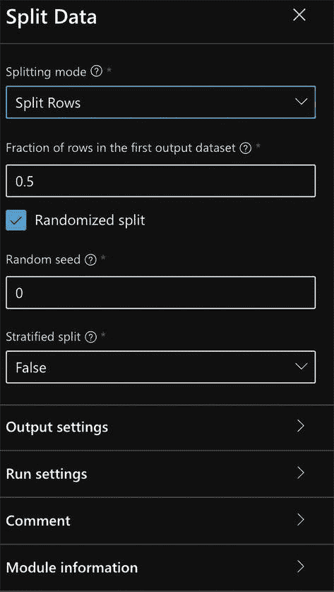

**图 10-31** – Azure 机器学习设计器 – 拆分数据

4.  然后筛选特征并定义目标列（`income`），使用皮尔逊相关系数作为特征评分方法。另一种支持的技术是卡方检验，如图 10-32 所示。

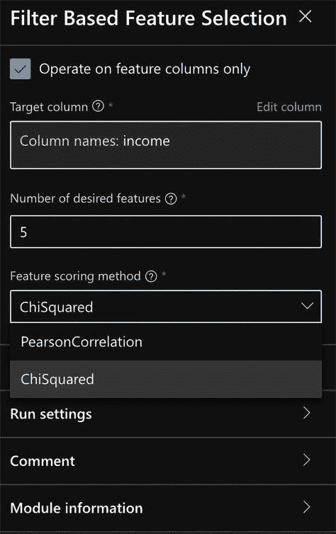

**图 10-32** – Azure 机器学习设计器 – 基于筛选器的特征选择

5.  现在数据摄取已完成，可以使用 `Two-Class Boosted Decision Tree` 模块来初始化分类器，这需要一个 `Train Model` 模块和相关的转换。在左窗格中，您可以看到 Azure 机器学习设计器支持的不同类型的转换（如图 10-33 所示）。

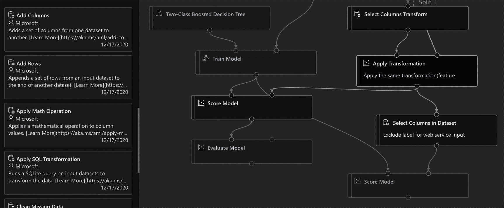

**图 10-33** – Azure 机器学习设计器 – 选择列

将 `Train Model` 模块与 `Score Model` 以及测试集连接起来。添加 `Evaluate Model` 模块。最终的管道应如图 10-34 所示。

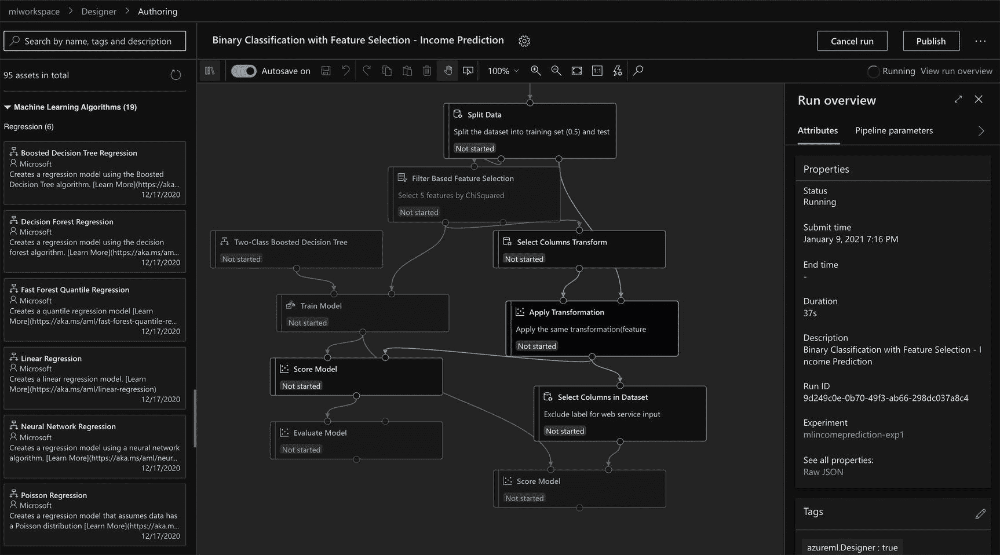

**图 10-34** – Azure 机器学习设计器 – 最终流程

在左窗格中，您可以看到可用算法的列表，包括提升决策树、快速森林回归、线性回归、神经网络回归和泊松回归等。运行完成后，您现在可以看到运行的属性和所用模型的评分卡，在本例中为 `Two-Class Boosted Decision Tree`（见图 10-35）。

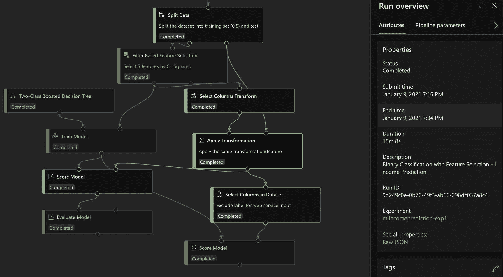

**图 10-35** – Azure 机器学习设计器 – 运行概览

运行完成后，在模型运行概览窗口中，您可以展开并查看运行中的各个任务（`Evaluate Model`、`Applying Transformation`、`Scoring`、`Selecting Columns`、`Splitting Dataset` 等）以及流程中每个部分所花费的时间。在这里，我们可以看到 `Two-Class Boosted Decision Tree` 花费的时间最多。您还可以使用 Azure 机器学习 Visual Studio Code 扩展；分步说明可在此处找到。^(⁴⁰) 请参见图 10-36 中的运行视图。

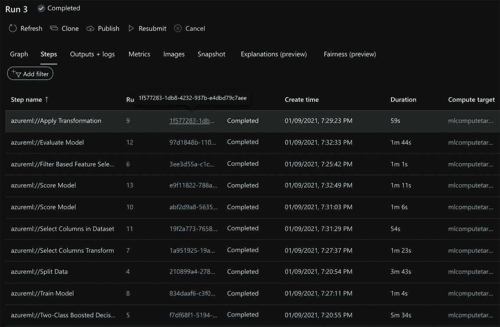

**图 10-36** – Azure 机器学习设计器 – 运行视图

现在运行已完成，右键单击 `Evaluate Model`，然后单击 `Visualize`，接着单击 `Evaluation results`，如图 10-37 所示。

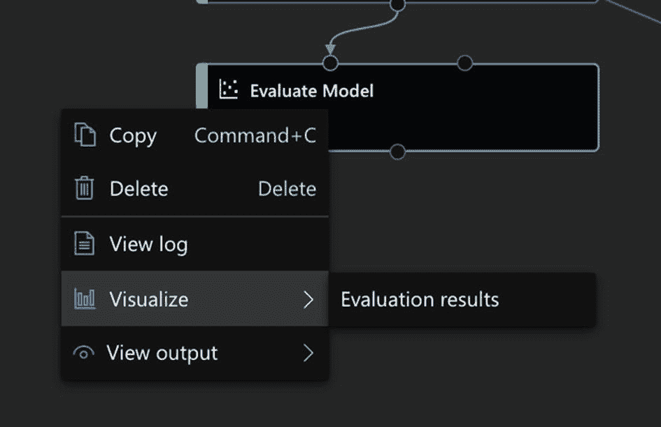

**图 10-37** – Azure 机器学习设计器 – 评估模型可视化

结果显示 `Score Model` 结果可视化，展示了不同属性及其评分标签（例如，他们的收入是高于还是低于 50,000 美元）。见图 10-38。

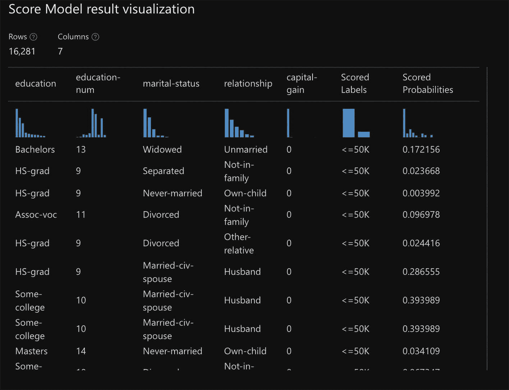

**图 10-38** – Azure 机器学习设计器 – 评分模型结果可视化

您还可以查看模型的准确率、精确率召回率、提升度和混淆矩阵（见图 10-39）。在本例中，模型准确率约为 85%。

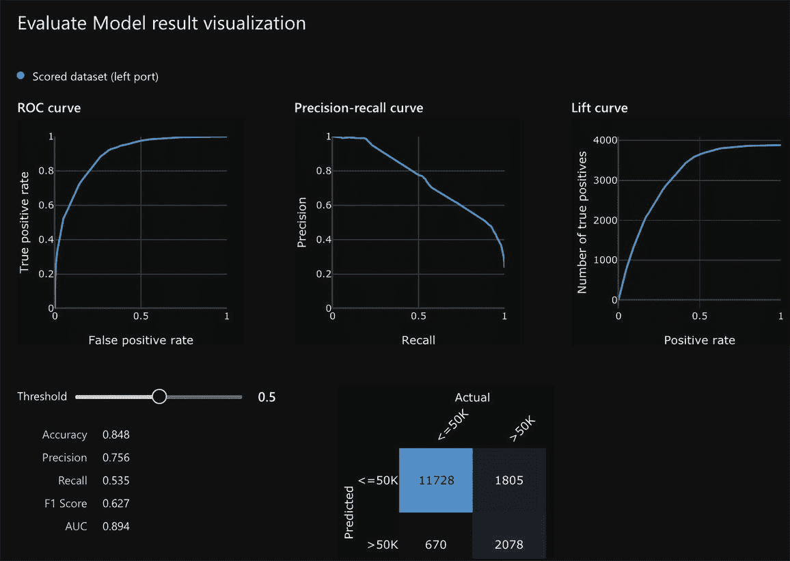

**图 10-39** – Azure 机器学习设计器 – 评估模型结果可视化

在这种低代码、基于设计器的拖放方法中，您可以用最少的编码更快地获得结果。对于希望无需投入大量精力即可在给定数据集上进行实验的公民数据科学家、有潜力的数据科学家和机器学习工程师来说，这是一个合适的 IDE。

## 结论与总结

你已经读完了本书的最后一章。我们希望这对你来说是一段有意义的旅程，并且对你学习和探索 Azure 认知服务与 Azure 机器学习领域的目标准备有所帮助。

在最后一章中，你了解了认知服务之外的 Azure 机器学习产品、如何开始使用 Azure 机器学习，以及机器学习服务生态系统。你通过使用 Azure 机器学习 Jupyter notebook 配置、构建、部署并测试了一个分类模型。你还探索了协作式 notebook、机器学习运维、强化学习、自动化机器学习、数据标记和自动缩放计算等功能。

现在，你可以将所学知识应用到实际项目中。学习这些不断变化且细致入微的新技术的最佳方式就是开始动手实践。如同人工智能和机器学习这门学科一样，Azure 机器学习也在不断发展，并不断添加新的功能、特性和技能。今天就是开始（或继续学习）的好日子。

祝你机器学习愉快！