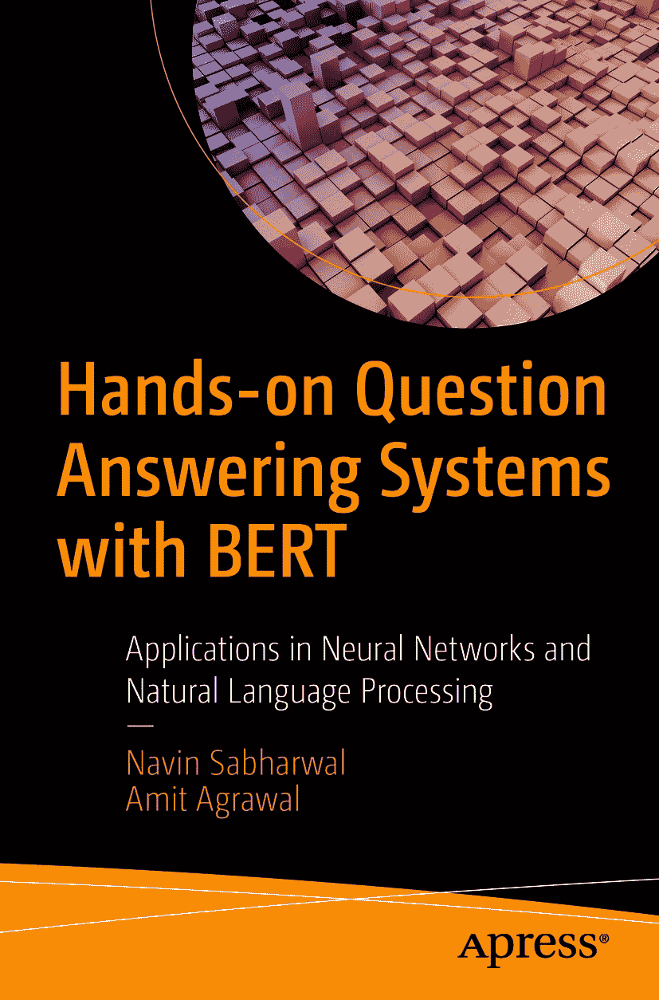

ISBN 978-1-4842-6663-2 e-ISBN 978-1-4842-6664-9 [`doi.org/10.1007/978-1-4842-6664-9`](https://doi.org/10.1007/978-1-4842-6664-9)

© Navin Sabharwal, Amit Agrawal 2021

Apress 标准版

本出版物中使用的通用描述性名称、注册商标名称、商标、服务标志等，即使未作明确声明，也不意味着这些名称不受相关保护性法律和法规的约束，因此可自由使用。出版商、作者和编辑假定本书中的建议和信息在出版之日是真实准确的。出版商、作者和编辑均不对本书所含材料或可能存在的任何错误或遗漏提供明示或暗示的担保。出版商对已出版地图和机构归属中的管辖权主张保持中立。本书通过 Springer Science+Business Media New York 在全球图书贸易中发行，地址：1 New York Plaza, Suite 4600, New York, NY 10004-1562, USA。电话：1-800-SPRINGER，传真：(201) 348-4505，电子邮件：orders-ny@springer-sbm.com，或访问 www.springeronline.com。Apress Media, LLC 是一家加利福尼亚有限责任公司，其唯一成员（所有者）是 Springer Science + Business Media Finance Inc (SSBM Finance Inc)。SSBM Finance Inc 是一家特拉华州公司。

*谨以此书献给我所爱之人与我所信之神。*

——Navin Sabharwal

*谨以此书献给我的家人和朋友。*

——Amit Agrawal

## 引言

问答系统彻底改变了信息检索的方式。像来自 Transformer 的双向编码器表示（BERT）这样的技术，使得机器学习系统能够分析文档，并通过问答机制检索上下文信息，而无需进行大量训练。深度学习的演进对问答系统的设计产生了巨大影响，使这些系统能够吸收海量数据，并构建数十亿个连接，以更好地理解人类语言。

本书聚焦于自然语言处理（NLP）领域的一项最新突破——BERT，它在问答系统、实体识别系统等最先进的 NLP 任务上均取得了基准性成果。

BERT 实现了生成文本句子嵌入的创新方法。本书为各类问答系统的设计与实现提供了指导，同时涵盖了文档摘要、实体识别和情感分析等 NLP 任务。这有助于数据科学家和开发者使用 BERT 设计和实现他们自己的基于 NLP 的系统。

让我们开启在激动人心且快速发展的 NLP 领域的旅程吧。

## 致谢

我要感谢我的家人，Shweta 和 Soumil，他们始终陪伴在我身边，为我智识与精神的追求牺牲了他们的时间，并在潜心撰写本书期间照料一切。没有他们的爱与支持，我生命中的这一成就及其他成就都将无法实现。我也一如既往地感谢我的母亲和姐姐的爱与支持；没有她们的祝福，一切皆不可能。

致我的合著者 Amit，感谢你为交付本书付出的辛勤努力和快速响应。这是一次充实的经历，我期待很快能再次与你合作。

感谢我所有的团队成员，他们以辛勤的工作、始终引人入胜的技术讨论以及深厚的技术功底，成为我灵感的源泉。你们源源不断的想法，每一天都给予我鼓励与兴奋。Piyush Pandey、Sarvesh Pandey、Amit Agrawal、Vasand Kumar、Punith Krishnamurthy、Sandeep Sharma、Amit Dwivedi、Gauarv Bhardwaj、Nitin Narotra、Divjot 和 Vivek，感谢你们的陪伴，让技术变得有趣。

致我所有的其他合著者、同事、经理、导师和引路人，在这个拥有 70 亿人口的世界里，是机缘巧合让我们相遇，但与你们相识并向你们学习，是一段充实的经历。所有的想法和路径，都是我所参与的对话和所分享的经历的融合。谢谢你们。

> ——Navin Sabharwal

我感谢我的父母、兄弟和妻子 Riya，他们始终是我灵感的源泉。

感谢我的合著者 Navin 给予我的指导和反馈。

我也感谢我的同事 Rishabh Upadhyay 和 Yogita Kanwar 提供的技术建议。

> ——Amit Agrawal

感谢萨拉斯瓦蒂女神，指引我走上知识与灵性之路：असतो मा साद गमय, तमसो मा ज्योतिर् गमय, मृत्योर मा अमृतम् गमय

Asato Ma Sad Gamaya, Tamaso Ma Jyotir Gamaya,

Mrityor Ma Amritam Gamaya

引领我们从无知走向真理，引领我们从黑暗走向光明，引领我们从幻象走向真实

## 关于作者

## 关于技术审校