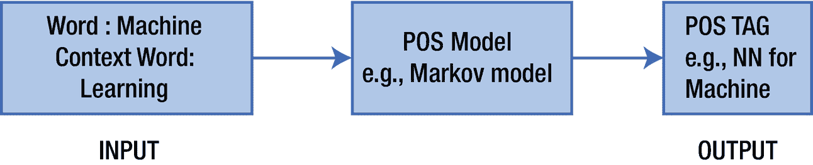
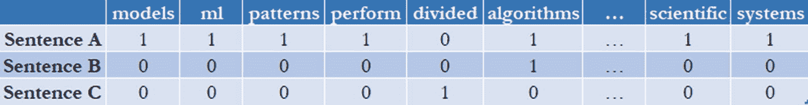

# 1. 自然语言处理简介

随着近年来的技术进步，通信已成为经历革命性发展的领域之一。通信和信息构成了现代社会的支柱，正是语言和通信推动了人类知识在所有领域的进步。人类一直着迷于让机器或机器人具备类似人类的能力，用我们的语言进行对话。无数科幻书籍和媒体都涉及了这一主题。图灵测试正是为此目的而设计的，用于测试人类是否能够辨别通信通道另一端的主体是人还是机器。

对于计算机，我们最初使用计算机能够解释的二进制语言，然后根据指令进行计算。然而，随着时间的推移，我们提出了过程式和面向对象的语言，这些语言使用更自然的语法和指令，与人类交流的词汇和方式相对应。此类结构的例子包括 `for` 循环和 `if` 结构。

随着计算能力的提升以及计算机处理海量数据能力的增强，使用机器学习（ML）和深度学习模型来理解人类语言变得更加容易。随着神经网络、循环神经网络（RNN）和其他深度学习技术的普及，以及运行这些模型所需的计算能力的可用性，各种自然语言处理（NLP）平台应运而生，供开发者在云端和本地使用。本章将带你了解 NLP 的基础知识。


## 自然语言处理

`NLP` 是人工智能（`AI`）的一个子分支，它使计算机能够读取、理解和处理人类语言。计算机很容易从电子表格、数据库、`JavaScript Object Notation`（`JSON`）文件等结构化系统中读取数据。然而，大量信息以非结构化数据的形式呈现，这对计算机理解和生成知识或信息来说颇具挑战。为了解决这些问题，`NLP` 提供了一套技术或方法，用于读取、处理和理解人类语言，并从中生成知识。目前，包括 `IBM`、`Google`、`Microsoft`、`Facebook`、`OpenAI` 等在内的众多公司，已将各种 `NLP` 技术作为服务提供。一些开源库，如 `NLTK`、`spaCy` 等，也是实现解析和理解语言文本背后含义的关键推动因素。

众所周知，处理和理解文本是一个非常复杂的问题。数据科学家、研究人员和开发者通过构建一个流水线来解决 `NLP` 问题：将 `NLP` 问题分解成更小的部分；使用相应的 `NLP` 技术和 `ML` 方法（如实体识别、文档摘要等）解决每个子部分；最后将所有部分或模型组合或堆叠起来，作为问题的最终解决方案。

`NLP` 的主要目标是教会机器如何解释和理解语言。任何语言，如英语、编程结构、数学等，都包含以下三个主要组成部分：

- **句法**：定义文本中词语顺序的规则。例如，一个句子在句法上正确，其主语、谓语和宾语必须按正确顺序排列。
- **语义**：定义文本中词语的含义以及这些词语应如何组合。例如，在句子“我想在这个银行账户里存钱”中，“银行”一词指的是金融机构。
- **语用**：定义在特定语境下词语的用法或选择。例如，“bank”一词根据语境可以有不同的含义。比如，“bank”既可以指金融机构，也可以指河岸。

因此，`NLP` 采用不同的方法从文本或语音中提取这些组成部分，以生成用于下游任务（如文本分类、实体提取、语言翻译和文档摘要）的特征。自然语言理解（`NLU`）是 `NLP` 的一个子分支，旨在从文档、网页等中理解和生成知识。以下列举了一些例子。

- **语言翻译**：语言翻译被认为是 `NLP` 和 `NLU` 中最复杂的问题之一。你可以提供文本片段或文档，这些系统会将其转换成另一种语言。一些主要的云服务商，如 `Google`、`Microsoft` 和 `IBM`，将此功能作为服务提供，任何人都可以将其用于基于 `NLP` 的系统。例如，正在开发对话系统的开发者可以利用这些供应商的翻译服务，在不进行任何实际开发的情况下，为对话系统启用多语言能力。
- **问答系统**：如果你想实现一个系统，从文档、段落、数据库或任何其他系统中找到问题的答案，这类系统非常有用。在这里，`NLU` 负责理解用户的查询以及包含答案的文档或段落（非结构化文本）。问答系统存在几种变体，例如基于阅读理解系统、数学系统、选择题系统、问答系统等。
- **支持工单自动路由**：这些系统会读取客户支持工单的内容，并将其路由给能够解决问题的人员。在这里，`NLU` 使这些系统能够处理和理解电子邮件、主题、聊天数据等，并将其路由给合适的支持人员，从而避免因错误分配而导致的额外跳转。

诸如问答系统、机器翻译、命名实体识别（`NER`）、文档摘要、词性（`POS`）标注和搜索引擎等系统，都是基于 `NLP` 的系统的例子。

例如，考虑以下来自维基百科“机器学习”词条的文本。

> 机器学习（ML）是对[算法](https://en.wikipedia.org/wiki/Algorithm)和[统计模型](https://en.wikipedia.org/wiki/Statistical_model)的[科学研究](https://en.wikipedia.org/wiki/Branches_of_science)，[计算机系统](https://en.wikipedia.org/wiki/Computer_systems)使用这些算法和模型来执行特定任务，无需使用显式指令，而是依赖模式和[推理](https://en.wikipedia.org/wiki/Inference)。机器学习算法广泛应用于各种场景，例如[电子邮件过滤](https://en.wikipedia.org/wiki/Email_filtering)和[计算机视觉](https://en.wikipedia.org/wiki/Computer_vision)。它可以分为两种类型，即监督学习和无监督学习。

这段文本包含大量可用作信息的有用数据。如果计算机能够阅读、理解并回答以下来自文本的问题，那就太好了：

- 机器学习的应用有哪些？
- 机器学习指的是对什么类型的研究？
- 计算机使用什么类型的模型来执行特定任务？

应该有某种方法教会机器语言的基本概念和规则，以便它们能够阅读、处理和理解文本。为了从文本中获取洞察，`NLP` 技术将所有步骤组合成一个称为 `NLP/ML` 流水线的流程。以下是 `NLP` 流水线的一些步骤。

- 句子分割
- 分词
- `POS` 标注
- 词干提取和词形还原
- 停用词识别

### 句子分割

流水线的第一步是将文本片段分割成单独的句子，如下所示。

- 机器学习（ML）是对[算法](https://en.wikipedia.org/wiki/Algorithm)和[统计模型](https://en.wikipedia.org/wiki/Statistical_model)的[科学研究](https://en.wikipedia.org/wiki/Branches_of_science)，[计算机系统](https://en.wikipedia.org/wiki/Computer_systems)使用这些算法和模型来执行特定任务，无需使用显式指令，而是依赖模式和[推理](https://en.wikipedia.org/wiki/Inference)。
- 机器学习算法广泛应用于各种场景，例如[电子邮件过滤](https://en.wikipedia.org/wiki/Email_filtering)和[计算机视觉](https://en.wikipedia.org/wiki/Computer_vision)。
- 它可以分为两种类型，即监督学习和无监督学习。

早期的句子分割实现相当简单，只需根据标点符号或“句号”来分割文本。然而，当文档或文本片段格式不正确或语法有误时，这种方法有时会失败。现在，有一些先进的 `NLP` 方法，例如序列学习，即使没有句号或文档格式不正确，也能分割文本片段，其基本原理是通过结合语义理解和句法理解来分解文本，从而提取短语。


#### 分词

NLP 流水线中的下一个任务是分词。在此任务中，我们将每个句子分解为多个词元。一个词元可以是一个字符、一个单词或一个短语。分词的基本方法是在单词之间出现空格时，将句子拆分为独立的单词。例如，考虑示例文本中的第二个句子：“机器学习算法广泛应用于各种领域，例如[电子邮件过滤](https://en.wikipedia.org/wiki/Email_filtering)和[计算机视觉](https://en.wikipedia.org/wiki/Computer_vision)。”以下是对此示例应用分词后的结果。

```
["Machine", "learning", "algorithms", "are", "used", "in" , "a", "wide", "variety", "of", "applications", "such", "as", "email", "filtering", "and", "computer", "vision"].
```

然而，还有一些高级的分词方法，例如马尔可夫链模型，可以从句子中提取短语。例如，通过应用高级的机器学习和 NLP 方法，可以将“machine learning”作为一个短语提取出来。

#### 词性标注

`POS`标注是下一步，用于确定从分词步骤中提取的每个词元或单词的词性。这有助于我们识别每个单词在句子中的用法及其重要性。它也是真正理解句子含义的第一步。赋予一个`POS`标签可以增加单词的维度，从而更详细地描述该单词试图传达的含义。短语“putting on an act”和“act on an instinct”都使用了单词“act”，但分别作为名词和动词，因此`POS`标签可以极大地帮助区分其含义。在这种方法中，我们将词元（称为`Word`）连同一些上下文单词一起传递给`POS`标注器（一个分类系统），这些上下文单词将用于将`Word`分类到其相关标签，如图 1-1 所示。



图 1-1

`POS`标注

这些模型在目标语言中庞大的（数百万或数十亿）句子语料库上进行训练，其中每个单词及其`POS`标签都用作`POS`分类器的训练数据。前面提到的模型完全基于训练数据的统计，而非实际解释。模型根据句子与历史句子的句法相似性，尝试为每个单词找到`POS`标签。例如，对于句子“机器学习算法广泛应用于各种领域，例如[电子邮件过滤](https://en.wikipedia.org/wiki/Email_filtering)和[计算机视觉](https://en.wikipedia.org/wiki/Computer_vision)”，其`POS`标签如下所示：

```
Machine (NN) learning (NN) algorithms (NNS) are (VBP) used (VBN) in (IN) a (DT) wide (JJ) variety (NN) of (IN) applications (NNS), such (JJ) as (IN) email (NN) filtering (VBG) and (CC) computer (NN) vision (NN).
```

从这些结果可以看出，有各种名词（即 *Machine, learning, variety, computer,* 和 *vision*）。因此我们可以推断，这个句子可能是在谈论机器和计算机。

#### 词干提取与词形还原

有时同一个单词会以不同形式出现在多个句子中。词干提取可以定义为通过移除后缀将单词简化为其词根或基本形式的过程。这里，简化后的单词可以是词典词，也可以是非词典词。例如，单词“machine”可以简化为其词根形式“machin”。它不考虑单词使用的上下文。以下是我们示例句子中分词后的单词的词干表示。

```
machin learn algorithm ar us in a wid vary of apply , such as email filt and comput vis
```

在这个结果中，有些单词被表示为非词典词；例如，“machine”简化为“machin”，这是一个词干词，但不是词典词。

词形还原可以定义为推导出单词的规范形式或词元的过程。它利用上下文来识别单词的词元，该词元必须是词典词。然而，词干提取并非如此。使用我们之前的例子，单词“machine”将被转换为其规范形式“machine”。以下是我们示例句子中分词后单词的词形还原表示。它使用单词的标签作为上下文来推导单词的规范形式。

```
Machine learning algorithm be use in a wide variety of application , such a email filtering and computer vision.
```

在这些结果中，有些单词，例如“filtering”，被简化为其规范形式，这里是“filtering”，而不是“filter”，因为单词“filtering”在句子中用作动词。

词形还原和词干提取应极其谨慎地根据需求使用。例如，如果你在处理搜索引擎系统，那么应该优先选择词干提取；但如果你在处理问答系统（其中推理很重要），那么应该优先选择词形还原而非词干提取。

#### 停用词识别

文本片段包含重要词汇以及填充词。例如，在我们的示例句子中，这些是填充词。

```
["be", "use", "in", "a", "such", “a", "and"]
```

这些填充词会给你的文本引入噪声，管理它们很重要，因为它们在文本中出现得非常频繁，并且其频率远高于其他单词，重要性却更低。一些系统使用预定义的停用词列表，例如“is”、“at”等。不过，这对于某些领域并无帮助。例如，在与医疗保健相关的文档中，你会发现一些常见术语，如 patient、doctor 或 ICU。这些词出现得非常频繁，你需要以某种方式将它们从文本中移除。通常有两种方法用于处理特定领域的停用词。

*   根据单词出现的频率将其标记为停用词。可以是最高频或最低频的单词。

*   如果单词在语料库的所有文档中相当常见，则将其标记为停用词。

#### 短语提取

有时，单个单词无法为大多数 NLP 任务提供足够的信息。例如，词典中“machine”和“learning”这两个单词的含义如下所示。

*   **Machine**：一种利用机械动力执行特定任务的装置。

*   **Learning**：通过学习、经验或教导获得知识或技能。

从这两个单词的定义可以非常清楚地看出，我们的示例句子本应谈论某种机械设备以及获取知识的各种媒介。然而，当这些单词一起使用时（即“machine learning”），它指的是人工智能的一个子分支，涉及计算机在没有明确编程的情况下执行特定任务所使用的算法和统计模型的科学研究。

要提取短语，我们需要将多个单词组合在一起，或者识别短语。这里，短语可以分为两种类型：名词短语和动词短语。我们可以定义规则来从句子中提取短语。例如，要提取名词短语，我们可以定义一条规则，即“句子中连续出现的两个名词应被视为一个名词短语”。例如，短语“machine learning”是我们示例句子中的一个名词短语。类似地，我们可以定义更多规则来从句子中提取名词短语和动词短语。


## 命名实体识别

实体被定义为文本中提供重要信息的对象或名词，例如人物、组织或其他对象。这些信息可作为下游任务的特征。例如，`Google`、`Microsoft` 和 `IBM` 都是类型为 `Organization` 的实体。

`NER` 是一种信息提取技术，它根据训练好的模型将实体提取并分类到相应的类别中。例如，英语中的一些基本类别包括人名、组织名、地点、日期、电子邮件地址、电话号码等。再比如，在我们的示例句子中，“machine learning”和“computer vision”等短语是类型为 `AI_Branch` 的实体，指的是人工智能的分支。

目前，人工智能领域的大型供应商，如 `IBM`、`Google` 和 `Microsoft`，都提供了用于从文本中提取命名实体的预训练模型。它们还允许你构建特定于你的应用和领域的自定义 `NER` 模型。像 `spaCy` 这样的开源项目也提供了训练和使用自定义 `NER` 模型的能力。

#### 共指消解

`NLP` 领域（尤其是在英语中）的主要挑战之一就是代词的使用。在英语中，代词被广泛用于指代前文或前一句中的名词。为了进行语义分析或识别这些句子之间的关系，系统必须建立句子之间的依赖关系，这一点至关重要。

例如，考虑句子“它可以分为两种类型，即有监督学习和无监督学习”，其中“它”指代的是第一句和第二句中的机器学习。这可以通过在数据集中标注此类依赖关系来训练模型，然后使用相同的模型对未见过的文本片段或文档进行关系提取来实现。

#### 词袋模型

众所周知，计算机只能处理数值数据；因此，要理解文本的含义，必须将其转换为数值形式。词袋模型是将文本转换为数值数据的方法之一。

词袋模型是一种非常流行的特征提取方法，它描述了文本中每个单词的出现情况。你需要先构建语料库的词汇表，然后计算每个单词相对于语料库中每个文本片段或文档的出现次数。它不存储任何与顺序或句子结构相关的信息。这就是它被称为词袋模型的原因。它还可以告诉你某个特定单词是否出现在文档中，但不提供该单词在文档中位置的信息。例如，考虑我们的示例文本片段，该片段经过句子分割步骤后被分割成了三个句子。

- **句子 A**：机器学习（ML）是计算机系统用来执行特定任务而无需使用显式指令的[算法](https://en.wikipedia.org/wiki/Algorithm)和[统计模型](https://en.wikipedia.org/wiki/Statistical_model)的[科学研究](https://en.wikipedia.org/wiki/Branches_of_science)，它依赖于模式和[推理](https://en.wikipedia.org/wiki/Inference)。
- **句子 B**：机器学习算法被广泛应用于各种场景，例如[电子邮件过滤](https://en.wikipedia.org/wiki/Email_filtering)和[计算机视觉](https://en.wikipedia.org/wiki/Computer_vision)。
- **句子 C**：它可以分为两种类型，即有监督学习和无监督学习。

图 1-2 是我们示例文本片段的文档-词项矩阵，其中如果词项出现在句子中，则其值为 1，否则为 0。



图 1-2

文档-词项矩阵

一旦句子或文本片段被转换为数字向量，我们就可以将这些向量值作为特征用于进一步的下游任务，例如问答系统、文本摘要等。此方法存在以下局限性。

- 句子的向量表示长度会随着词汇表大小的增加而增加。这增加了下游任务的计算量，同时也增加了句子的维度。
- 它无法根据单词在文本中的上下文来识别具有相似含义的不同单词。

还有其他方法可以减少将句子表示为向量形式所需的计算量和内存需求。词嵌入是一种方法，我们可以在保留单词语义含义的同时，在低维空间中表示单词。我们稍后将详细探讨词嵌入如何成为下游 `NLP` 任务的一个重大突破。

## 结论

本章讨论了 `NLP` 的基础知识，以及一些基本的 `NLP` 任务，例如分词、词干提取等。在下一章中，我们将讨论 `NLP` 领域的神经网络。

