# 2. 自然语言处理的神经网络

将人类的认知智能（即思考、推理和行动）赋予人工系统一直是研究人员的热门话题。在这个过程中，他们提出了神经网络的概念，试图模拟人脑神经元的工作方式。尽管它们距离人类的认知能力还很遥远，但人工神经网络在 `ML` 领域占据着非常有前景的地位，并彻底改变了 `NLP` 应用的开发方式。

在本章中，我们将讨论神经网络及其类型，以及一些特殊类型的神经网络，例如长短期记忆网络（`LSTM`）、卷积神经网络（`CNN`）、编码器、解码器和 Transformer。这将为我们进入更高级的 `NLP` 主题奠定基础，并探讨当前最先进的 `NLP` 技术如何在 `NLU` 方面力求达到人类水平。

## 什么是神经网络？

神经网络被定义为一个由神经元组成的网络，这些神经元相互连接以处理信息并执行特定于任务的操作。简单来说，人类神经元在突触末端接收到电信号时，能够传输和处理信息。人工神经网络（`ANN`）通过在被激活函数触发后跨网络传输信息来复制这种信息流。`ANN` 分为三种类型的层：输入层、隐藏层和输出层。神经网络通常有一个输入层、一个输出层和多个隐藏层，如图 2-1 所示。

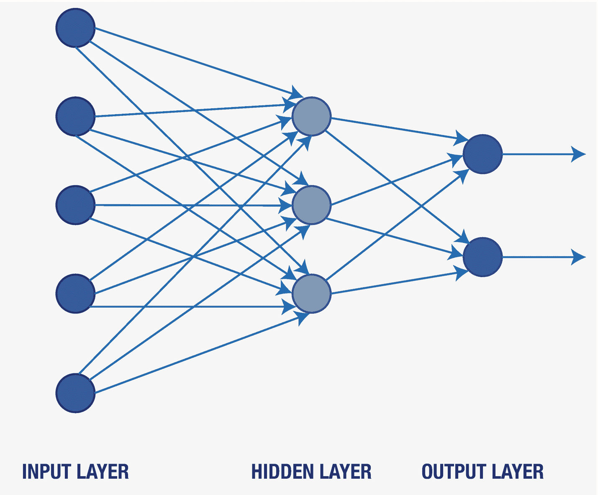

图 2-1

神经网络

## 神经网络的构建模块

在本节中，我们将讨论神经网络的基本构建模块，以及如何将这些模块组合起来形成一个神经网络。

### 神经元

神经元是神经网络的最小单元，它模仿人类神经元的行为。它接收输入，进行处理，并将输出发送给其他神经元，作为其他神经元的激活信号。一个神经元只能根据从前一层接收到的观测结果被激活。

### 输入层

如图 2-1 所示，输入层接收处理后的数据作为输入。这里的输入可以是图像的像素，也可以是文本数据中句子向量表示的数值或特征值。该层负责将所有特征值与一些权重值（权重值定义了每个特征的重要性）相结合。处理完成后，输入层的输出被馈送到下一层（隐藏层），最后到达输出层。

### 隐藏层

这些层负责生成特定于任务的特征。我们可以在输入层和输出层之间设置任意数量的隐藏层。每一层都由负责执行特定任务操作的神经元组成。该层可能实现激活函数（例如 `Sigmoid`、`tanh`），也可能仅对来自上一层的所有输入进行加权求和。因此，该层接收来自上一层的输入，然后计算输入与其对应权重值的乘积之和，并应用激活函数，从而得到该隐藏层的输出。随后，这些信息会被传递到下一个隐藏层或输出层。

### 输出层

输出层是神经网络中的最后一层。它负责收集来自最后一个隐藏层的所有信息，以输出最终的预期结果。如果你正在处理分类模型，那么最后一层的节点数应等于类别数；如果是回归问题，则只需一个节点。

关于如何确定网络层数以及每层节点数，一直是一个悬而未决的问题。虽然没有严格的规定，但在设计神经网络架构时，有一些建议值得考虑。

*   输入层的节点数必须等于输入数据点的维度。
*   输出层的节点数取决于神经网络执行的任务。例如，对于分类任务，节点数应等于类别数；对于回归任务，则只需一个节点。
*   隐藏层的数量以及每个隐藏层的节点数完全取决于你的目标任务。很可能一个神经网络对任务 A 效果完美，但对任务 B 却不起作用。
*   列出你希望在输入层和输出层之间执行的所有中间变换。
*   隐藏层的节点数应大于输入层和输出层的节点数。
*   隐藏层的节点数应为 2 的幂（例如 2、4、8、16、32 等）。

例如，如果你正在构建一个情感模型（或分类模型），该系统将识别用户反馈的情感为正面、负面或中性，那么神经网络输出层的结果将是所有类别（正面、负面和中性）的概率分布，如图 2-2 所示。

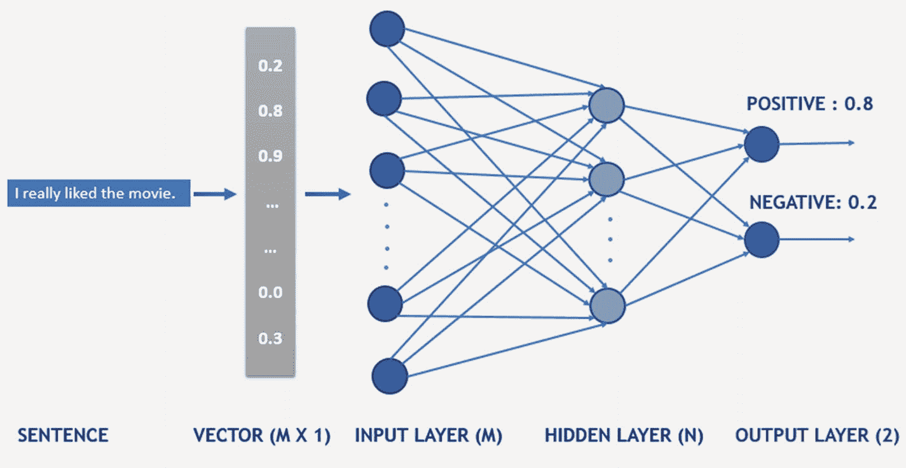

图 2-2

神经网络

### 激活函数

神经网络用于解决复杂的非线性问题，而传统的线性模型无法胜任。神经网络中的激活函数正是为系统引入非线性的关键，如图 2-3 所示。

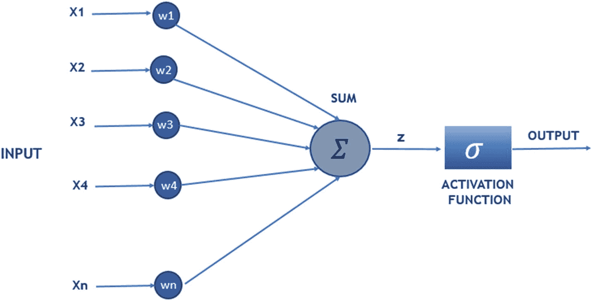

图 2-3

激活函数

它计算输入与其对应权重的乘积之和，然后加上偏置。接着，激活函数决定将哪些特征或输入值传递到下一层。例如，假设我们在隐藏层的所有节点上都使用 `Sigmoid` 函数，`Sigmoid` 可以取 0 到 1（含）之间的任意值。基于此，激活函数决定将来自本层和上一层的多少比例的信息传递到下一层。`Tanh` 和 `ReLU` 是神经网络中其他重要的激活函数示例。

至此，我们已经讨论了神经网络的构建模块。接下来，我们将转向神经网络的训练。

## 神经网络训练

神经网络训练基于前向传播和反向传播的概念。在前向传播中，输入数据从输入层的神经元传递到隐藏层的神经元，然后使用激活函数进行相关变换，最后到达输出层的神经元以计算预测值。在反向传播中，通过比较输入数据的实际值和预测值来计算损失。这个误差从输出层的神经元传播到所有隐藏层的神经元。隐藏层中的神经元很可能只接收到误差的一部分，具体取决于它们对输出层神经元的贡献程度。

当我们谈论信息的前向或反向传播时，这意味着连接这些神经元的边的权重以及这些神经元的偏置值将被调整。此外，权重和偏置的值是随机初始化的，学习过程会相应地找到这些模型参数的最优值。

## 神经网络的类型

既然我们已经了解了每个神经元、权重和激活函数如何共同构建一个神经网络，我们就可以研究如何以不同的方式使用它们来获得不同的结果。接下来，我们将讨论几种类型的神经网络。

### 前馈神经网络

前馈神经网络（FNN）可以最好地描述为一种单向神经网络，其结构中没有反馈或回路。FNN 的架构包括一定数量的隐藏层和每层中一定数量的隐藏单元，如图 2-4 所示。

这种神经网络被称为前馈网络的原因之一是，在 FNN 作为分类器正常运行期间，各层之间没有反馈。

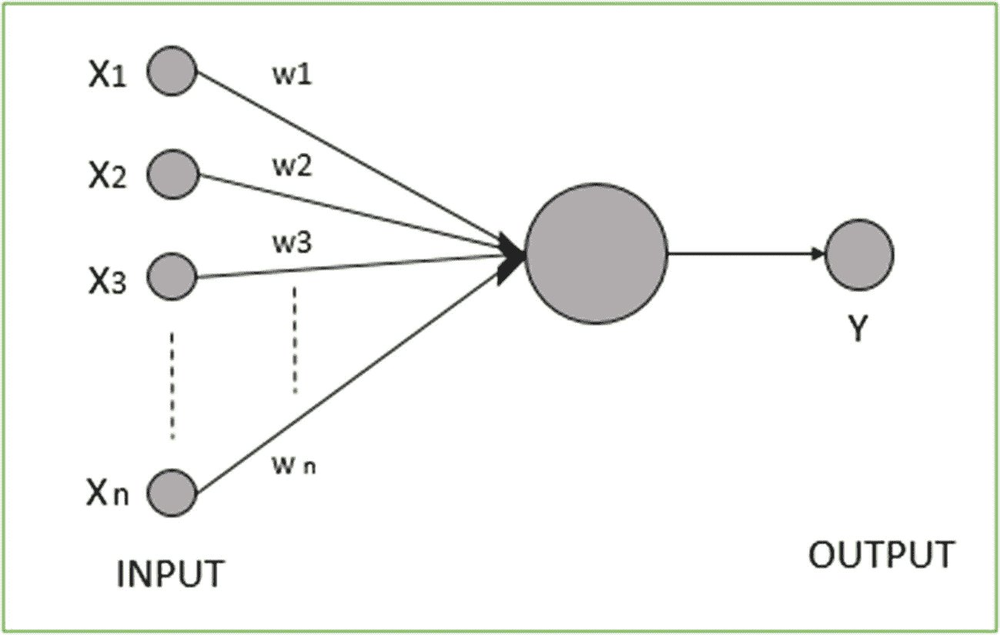

图 2-4

基本 FNN 感知器示意图

在 FNN 中，感知器按层排列。第一层负责接收输入，最后一层产生输出。由于中间层与外部世界没有任何连接，因此它们被称为隐藏层。信息从一层前馈到下一层，因为一层中的每个感知器都与下一层中的每个感知器相连。另一方面，同一层中的感知器之间没有连接。

FNN 模型在训练过程中使用成本函数。该成本函数作用于模型做出的近似值与实际目标值之间的差异。与机器学习算法类似，FNN 也使用基于梯度的学习进行训练。成本函数可能的选择包括二次成本、交叉熵成本、指数成本等。

输出层包含输出单元，其任务是提供所需的输出或预测。成本函数和输出单元的选择是紧密耦合的。输出单元有多种选择，如线性单元、Sigmoid 单元、Softmax 单元等。

FNN 对数据中的噪声敏感，且易于维护，因此在计算机视觉等领域具有广泛的应用前景。FNN 有助于揭示输入和输出之间的非线性关系，因此大多数多分类问题都可以借助这些网络轻松表示。

### 卷积神经网络

`CNN`是一种深度学习算法。它接收输入图像，并为图像中的各个方面分配权重和偏置。与其他分类算法相比，`CNN`的预处理相对较少，因为它们具备学习滤波器和特征的能力。

与其他神经网络类似，`CNN`也由神经元组成，并具有可学习的权重和偏置。它对接收到的多个输入进行加权求和，然后将结果与输出一起传递给激活函数。`CNN`与其他网络的不同之处在于其处理数据体的方式。这里的输入不是向量，而是多通道图像。

`CNN`用于图像处理，因为它通过应用相关滤波器成功捕捉图像中的空间和时间依赖性。该网络能更好地理解图像，因为它能更好地拟合图像数据集，同时减少所涉及的参数数量。

卷积是将两个输入组合以生成一个输出。对于`CNN`，这个输入通常是一幅图像，它与一个滤波器进行掩码操作，以生成所需的输出特征。当输入是空间分布的数据或矩阵时，所选的滤波器通常是一组权重，用于调整输入以实现所需的改变，从而生成结果。如果从一般意义上理解，卷积就是两个值的点积，以生成第三个值。图 2-5 和图 2-6 展示了卷积在`CNN`中的工作原理。

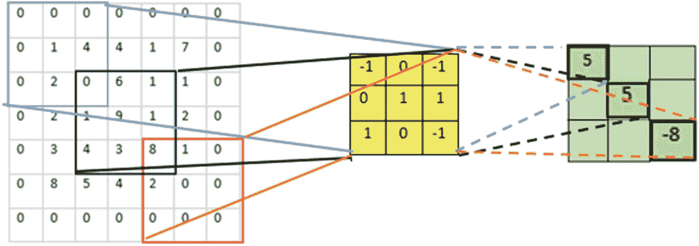

图 2-6

卷积示例

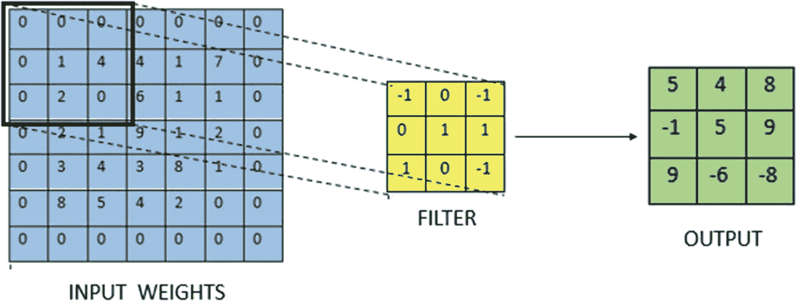

图 2-5

卷积示例

在图 2-5 所示的示例中，输入是一个包含图像信息的 5 × 5 矩阵。我们将应用一个滤波器来生成输出。输入用零填充，以转换为下面的矩阵。进行这种填充是为了在所需维度上生成输出的空间表示。

在给定的示例中，步长或步幅为 2，这意味着滤波器水平向右移动两步，垂直向下移动两步。第一次，滤波器对左上角蓝色子矩阵进行卷积：

`(0x-1 + 0x0 + 0x-1 + 0x0 + 1x1 + 4x1 + 0x1 + 2x0 + 0x-1) = 5`

接下来的步骤填充输出矩阵的其余部分。这里还可以注意到，蓝色、黑色和红色子矩阵的值差异很大，但经过滤波器掩码后，蓝色和黑色子矩阵产生了相等的输出，而红色子矩阵产生的值则小得多。这表明一个合适的滤波器能极大地帮助改变输出特征矩阵。例如，如果一幅图像的像素值具有巨大的对比度差异，一个合适的滤波器可以帮助降低图像对比度。

`CNN`通过将图像简化为更易于处理的形式，同时保留对获得良好预测至关重要的特征，发挥着关键作用。`CNN`的这种能力使其能够扩展到大型数据集。

在`CNN`中，我们有一个卷积层，用于从输入图像中提取高级特征，如边缘。该层是`CNN`的构建模块。它由一组独立的滤波器组成，这些滤波器与图像进行卷积，从而生成特征图。这些滤波器是随机初始化的，并在网络后续学习过程中成为参数。

对于特定的特征图，每个神经元都与输入图像的一个小块相连。在特定的特征图中还存在参数共享。在特定的特征图中，所有神经元都具有相同的连接权重。参数共享和局部连接有助于减少整个系统中的参数数量，并确保更好的计算效率。

池化的概念使`CNN`有别于其他神经网络。池化的作用是逐步降低表示的空间大小，以减少参数数量和计算量。池化层独立地对每个特征图进行操作。

在池化层之后，展平的输出被馈送到一个`FNN`，然后在每次训练迭代中应用反向传播，如图 2-7 所示。经过一系列迭代，模型能够使用 softmax 分类技术对图像进行分类。

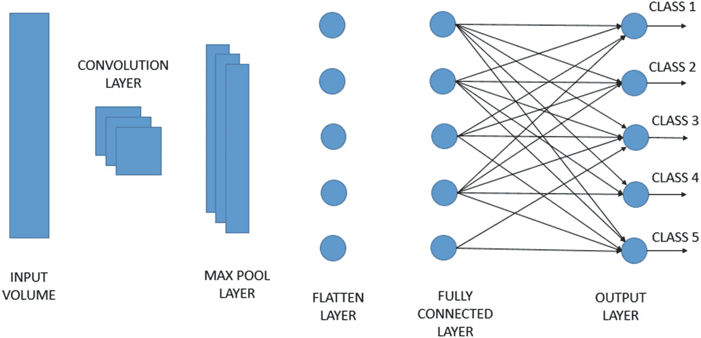

图 2-7

CNN 示意图

### 循环神经网络

循环神经网络（`RNN`）是一类旨在处理连续数据或流式数据的神经网络，其优势在于能够利用数据的连续性。通常，每个隐藏层接收的数据不仅包含来自上一层的输出作为当前层的输入，还包含一个隐藏输入。

在处理长输入序列且需要保持同一输入上下文、同时不影响模型规模的情况下，`RNN` 能展现出显著优势。这使得 `NLP` 成为 `RNN` 的自然应用领域，尽管历史信息会随时间推移而逐渐衰减，并且也可能拖慢处理速度。

如图 2-8 所示，输入由 `X[t]` 表示，即网络在时间步 `t` 的输入。例如，`X[1]` 可以是句子中某个单词对应的向量。隐藏状态由 `H[t]` 表示，它充当网络的记忆。`H[t]` 的值基于当前输入和上一时间步的隐藏状态计算得出：

`H[t] = f (U X[t] + W H[t-1])`

函数 `f` 是一个非线性变换函数，例如 `tanh` 或 `ReLU`。

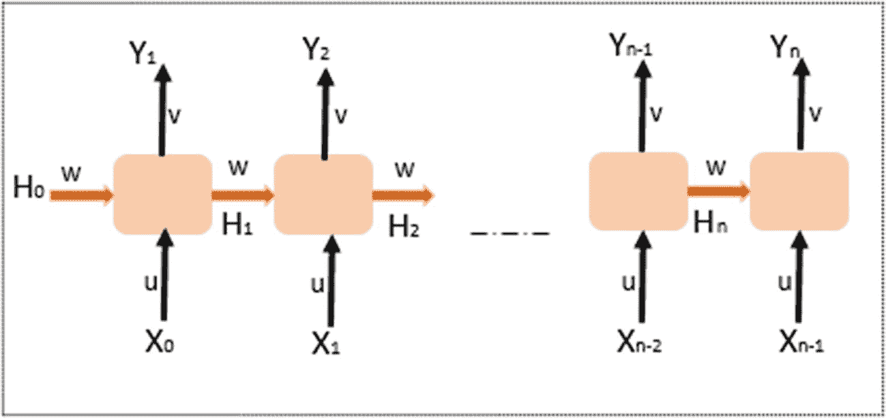

**图 2-8**  
RNN 示意图

与 `FNN` 不同，`RNN` 利用其内部状态或记忆来处理输入序列。在 `RNN` 中，所有输入都相互关联，而其他网络中的输入则彼此独立。`RNN` 从输入序列中获取 `X[0]`，然后输出 `H[0]`。该输出与 `X[1]` 共同构成下一步的输入。因此，`H[0]` 和 `X[1]` 形成下一步的输入。类似地，`H[t-1]` 和 `X[t]` 形成时间步 `t` 的输入。通过这种方式，`RNN` 在训练过程中记住了上下文。

当前状态由下式给出：

`H[t] = f (H[t-1], X[t])`

应用激活函数后：

`H[(t)] = tanh (W H[(t-1)] + U X[(t)])`

*   `H` 是单个隐藏向量。
*   `W` 是上一状态的权重。
*   `tanh` 是激活函数。
*   `U` 是当前输入状态的权重。

网络的输出由 `Y[t]` 表示。存在一些权重参数化从输入层到隐藏层的连接。权重矩阵 `U` 参数化输入到隐藏层的连接。隐藏层到隐藏层的连接由权重矩阵 `W` 参数化，而隐藏层到输出层的连接由权重矩阵 `V` 参数化。所有这些权重（`U`、`V`、`W`）在时间上是共享的。

因此，输出由下式给出：

`Y[t] = V H[t]`

`RNN` 模型能够对数据序列进行建模，从而可以假设样本的每个结果都依赖于先前的结果。`RNN` 还有另一个优势，即它们甚至可以与卷积层结合使用，以扩展有效的像素邻域。

当使用 `tanh` 或 `ReLU` 作为激活函数时，`RNN` 模型存在一个缺点，即无法处理长序列。训练 `RNN` 也是一项艰巨的任务，并且存在梯度消失和梯度爆炸的问题。

### 长短期记忆网络

`LSTM` 是应用最广泛的 `RNN` 形式之一。它们能够学习长期依赖关系，并且其默认行为是长时间学习或记住信息。

所有 `RNN` 模型都具有链式重复神经网络模块的形式。在标准 `RNN` 中，这种重复模块的结构非常简单，例如单个 `tanh` 层。

另一方面，`LSTM` 也具有这种链式结构，但其重复模块的结构不同。这里，不是单个神经网络层，而是四个以非常特殊的方式相互作用的层。`LSTM` 的控制流与 `RNN` 类似，因为它处理数据并在数据向前传播时传递信息。`LSTM` 工作方式的区别在于，细胞允许 `LSTM` 保留或遗忘信息。在 `LSTM` 中，重点在于细胞状态和各种门控。细胞状态充当传输高速公路，将相关信息一路传递到整个序列链中。门控在细胞状态传递过程中添加或移除信息。门控是决定哪些信息允许进入细胞状态的不同神经网络。门控和细胞状态使 `LSTM` 在 `RNN` 模型中独树一帜，并进一步使 `LSTM` 在各种应用中发挥作用。

### 编码器与解码器

编码器-解码器是一种针对序列预测问题而组织的 `RNN` 结构，这类问题通常具有可变数量的输入、输出或两者兼有。编码器-解码器最初的主要目的是解决机器翻译问题，但后来被证明在相关的序列到序列预测问题（如问答和文本摘要）中也很成功。

编码器-解码器方法涉及两个 `RNN`：一个用于编码输入序列，另一个用于将编码后的输入序列解码为目标序列。编码任务由编码器执行，解码任务由解码器执行。这种编码器-解码器架构对于序列到序列模型的各种应用非常有用，例如：

*   聊天机器人
*   机器翻译
*   文本摘要
*   图像描述

## 编码器-解码器架构

编码器-解码器架构由两个主要组件组成：编码器和解码器。这两个组件同时进行联合训练。编码器-解码器的架构如图 2-9 所示。

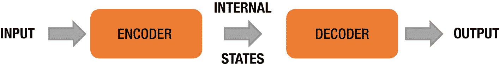

**图 2-9**  
编码器-解码器架构

编码器接收输入并读取整个输入序列，将其编码为内部表示。编码器处理输入序列，从中收集信息，然后将其进一步传播。这个固定长度的内部表示向量被称为上下文向量。中间向量 ID 是模型编码器部分产生的最终内部状态。这有助于解码器做出准确的预测。解码器负责从编码器读取编码后的序列，从而生成输出序列。

### 模型的编码器部分

编码器负责转换输入序列并将信息封装为内部状态向量，它本质上是一个 LSTM 或 GRU（门控循环单元）单元。仅使用内部状态；编码器的输出被舍弃，如图 2-10 所示。

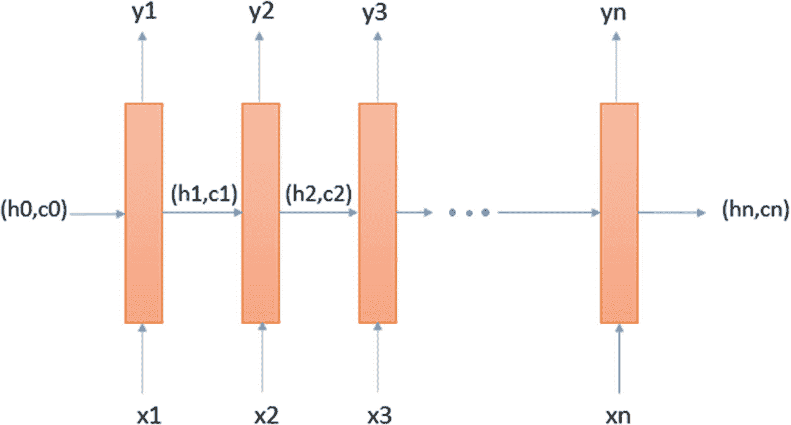

图 2-10  
用于编码器的 LSTM

为了理解模型编码器部分的工作原理，我们重点关注 LSTM。在 LSTM 中，每次只将一个元素作为输入。这意味着，如果我们有一个长度为 `m` 的序列，那么 LSTM 需要 `m` 个时间步来读取整个序列。

- `X[t]` 是时间步 `t` 的输入。
- `h[t]` 和 `c[t]` 是 LSTM 在时间步 `t` 的内部状态；对于 GRU，只有一个内部状态 `h[t]`。
- `Y[t]` 是时间步 `t` 的输出。

让我们以将英语句子翻译成法语的例子来说明。

- **英语：** It is a good day.
- **法语：** C’est une bonne journée.

所示的英语序列可以看作是一个包含五个单词的句子。编码器的输入 `X[t]` 如下所示。

- `X[1]` = It
- `X[2]` = is
- `X[3]` = a
- `X[4]` = good
- `X[5]` = day.

LSTM 将在五个时间步内逐词读取该序列。每个单词 `X[t]` 都通过词嵌入表示为一个向量。词嵌入将每个单词转换为一个固定长度的向量。内部状态（`h[t]`，`c[t]`）学习 LSTM 在时间步 `t` 之前读取到的内容。在这里，LSTM 将在时间步 `t = 5` 时读取整个句子。最终状态 `h[5]`，`c[5]` 包含了整个输入序列“It is a good day.”的信息。

编码器的输出是 `Y[t]`，在每个时间步，它都是 LSTM 的预测。因为在机器翻译问题中，我们取整个输入序列的输出，所以每个时间步的 `Y[t]` 都被丢弃，因为它没有用处。

### 模型的解码器部分

解码器的工作方式与编码器不同。它的训练阶段和测试阶段工作方式不同，而编码器模型在训练和测试阶段的工作方式相同。

如果我们沿用前面提到的句子语言翻译示例，与编码器类似，解码器也逐词生成输出句子。为了生成输出“C’est une bonne journée”，我们需要在开头添加 `START_`，在结尾添加 `_END` 作为输出序列的分隔符，以便解码器识别序列的开始和结束。解码器本质上被训练为基于编码器收集的信息来生成输出，因此解码器的初始状态（`h[0]`，`c[0]`）被设置为编码器的最终状态。

`START_` 作为输入，以便解码器可以开始生成下一个单词。解码器被训练使用 `_END` 来学习法语句子的结束。损失是根据每个时间步预测的输出计算的，并且误差通过时间反向传播以更新模型的参数。在测试阶段，每个时间步产生的输出被作为输入馈送到下一个时间步，并使用 `_END` 来识别序列的结束。

### 双向编码器和解码器

在双向编码器-解码器架构中，编码器和解码器都是双向 LSTM。反向编码器的最后一个隐藏状态初始化前向解码器，而反向解码器则用前向编码器的最后一个隐藏状态初始化。

当需要考虑来自过去和未来的上下文信息时，会使用双向编码器。输入词向量序列从前向和后向两个方向馈送到 LSTM。双向解码器也是一个双向 RNN，由两个独立的 LSTM 组成。其中一个 LSTM 从左到右解码信息，而另一个 LSTM 则从右到左反向解码。RNN 中的这种双向性提供了更好的性能。

例如，我们需要预测句子“The weather is cloudy; it might rain.”中“cloudy”之后的单词。单向 LSTM 将看到“The weather is …”，并尝试仅使用此上下文来预测下一个单词。当使用双向 LSTM 时，我们将能够看到更多信息。

- 前向 LSTM：“The weather is …”
- 后向 LSTM：“… it might rain today.”

因此，利用来自过去和未来的信息使得预测单词“cloudy”更容易，因为网络将更好地理解下一个单词。

### Transformer 模型

Transformer 是一种新颖的架构，旨在解决序列到序列任务，同时处理长距离依赖关系。Transformer 像 RNN 一样在样本中维护序列信息。如果我们从高层次来看 Transformer 模型，它在机器翻译应用中基本上就像一个黑盒，以一种语言的一个句子作为输入，并输出该句子的翻译，如图 2-11 所示。

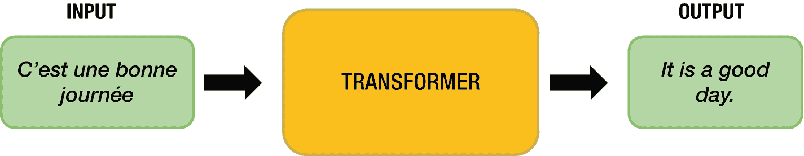

图 2-11  
作为黑盒的 Transformer

## 模型架构

Transformer 采用编码器-解码器结构，为编码器和解码器都使用了堆叠的自注意力和全连接层。Transformer 由编码器、解码器、位置编码和注意力等组件组成。它有一组堆叠的编码器和解码器。每个编码器都非常相似，因为它们具有相同的架构。解码器也共享此属性，并且在 Transformer 中彼此相似，如图 2-12 所示。

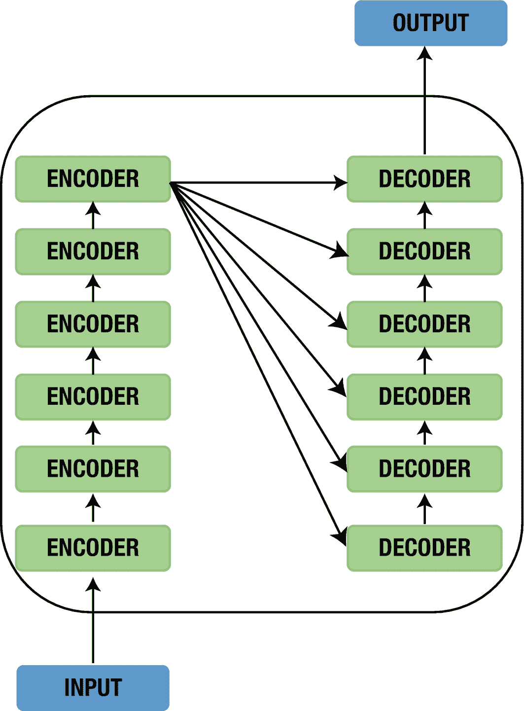

图 2-12  
Transformer 中的编码器-解码器堆栈

编码器由一组相同的层堆叠而成。每一层又包含两个子层。第一层用于多头自注意力机制。另一方面，第二层是一个简单的、全连接的前馈网络。在每个子层之间，都使用了残差连接以及层归一化。输入流经编码器中的自注意力层，帮助编码器在编码特定单词时查看输入序列中的其他单词。

解码器与编码器类似，也由一组相同的层堆叠而成。它也有像编码器那样的子层，但多了一个子层。这第三个子层负责对编码器堆栈的输出执行多头注意力。这些层帮助解码器仅关注输入句子的相关部分。

编码器块有一层 FNN 的多头层，而解码器则有一个额外的掩码多头注意力机制。编码器和解码器堆栈具有相同数量的单元。编码器和解码器的单元数量本质上是一个可以变化的超参数。

为了防止对序列外位置的无关注意力，在编码器和解码器的自注意力层中，softmax 之前都使用了掩码。为了防止位置关注后续位置，在解码器中，除了通用掩码之外，还使用了一个额外的掩码。解码器中的这两个掩码可以通过按位与操作进行合并。

### 注意力模型

注意力机制是一个使用 softmax 函数的密集层的输出向量。通过将其应用于合适的场景，可以提升结果质量。传统的翻译机制依赖于读取完整句子并将所有信息压缩成一个固定长度的向量。在这种情况下，如果一个句子包含数百个单词，却仅用几个词来表征，必然会导致信息丢失或翻译不充分。

注意力机制能够部分解决这个问题。它允许机器翻译系统审视句子包含的所有信息，从而根据当前词和上下文生成恰当的词语。注意力机制还通过允许翻译系统“拉近”或“拉远”视角，提供了聚焦局部或全局特征的能力。

#### 为什么需要注意力机制？

由于句子包含不同数量的单词，自然引入了循环神经网络来对单词间的条件概率进行建模。在概率语言模型中，核心是利用马尔可夫假设为句子分配概率。

`P(w[1]w[2] … w[n]) ≈ *Π*P(w[i] | w[i-k] … w[i-1])`

翻译工作通过这种编码器-解码器模型处理可变长度的输入和输出。这通常是在将基础 RNN 单元替换为 GRU 或 LSTM 单元，并用 ReLU 激活函数替代双曲正切激活函数时采用的。

为了计算效率，离散的单词通过嵌入层映射为密集向量。这些嵌入后的单词随后被顺序输入编码器。随着信息从左向右流动，每个词向量都是根据所有先前的输入（而不仅仅是当前词）学习得到的。一旦句子被完整读取，编码器就会生成输出。编码器还会生成一个隐藏状态用于后续处理。解码器利用这个来自编码器的隐藏状态，顺序生成翻译后的单词。

#### 注意力机制如何工作

注意力机制本质上是一个上下文向量，它被插入到编码器和解码器之间的架构间隙中。这个上下文向量将所有编码器单元的输出作为输入，然后为解码器想要生成的每个单词计算源语言单词的概率分布。这使得解码器能够捕获全局信息，而不仅仅是基于一个隐藏状态进行推断。这种注意力机制帮助解码器获得更广阔的视角。

如果我们探究上下文向量是如何构建的，会发现它其实相当简单。对于每个固定的目标词，我们通过遍历编码器的所有状态，并将目标状态与源状态进行比较，来为每个编码器状态生成分数。然后使用 softmax 函数对所有分数进行归一化。这样我们就得到了以目标状态为条件的概率分布。最后，为了使上下文向量易于训练，引入了权重。一旦我们得到上下文向量，就可以使用上下文向量、注意力函数和目标词轻松计算出注意力向量。

#### 注意力模型的类型

注意力模型主要有三种类型：全局与局部注意力、硬注意与软注意力，以及自注意力。让我们逐一审视。

##### 全局注意力模型

在全局注意力模型中，计算输出时会考虑来自当前状态之前的所有编码器状态和解码器状态的输入。这里的上下文向量是通过将全局对齐权重与每个编码器步骤的输出相乘得到的。然后将其输入到 RNN 单元中以获得解码器输出。

##### 局部注意力模型

局部注意力模型与全局注意力模型不同，它仅使用编码器中的少数几个位置来计算对齐权重。局部注意力模型又分为两种类型：单调对齐和预测对齐。

##### 硬注意与软注意力模型

软注意力模型与全局注意力模型类似。硬注意力模型与局部注意力模型的不同之处在于，局部模型几乎在每个点都是可微的，而硬注意力模型则不是。局部注意力模型可以被视为硬注意力和软注意力的混合体。

##### 自注意力模型

自注意力模型关联同一输入序列中的不同位置。理论上，自注意力可以采用任何评分函数，前提是目标序列被替换为相同的输入序列。

## 结论

在本章中，我们讨论了自然语言处理领域的各种神经网络。现在我们已经涵盖了不同类型的神经网络，接下来我们将关注如何使用 BERT。

