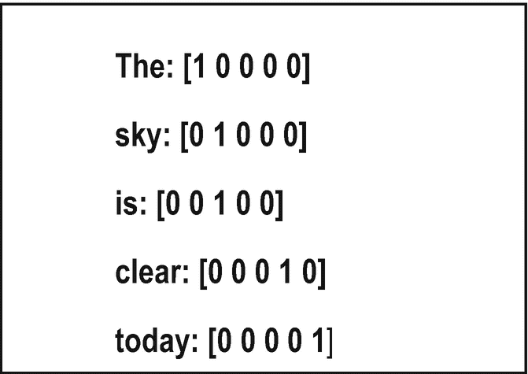
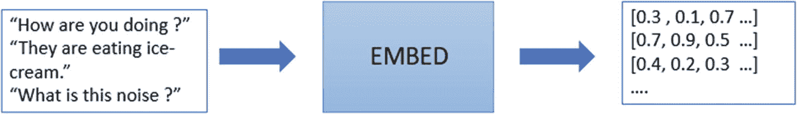
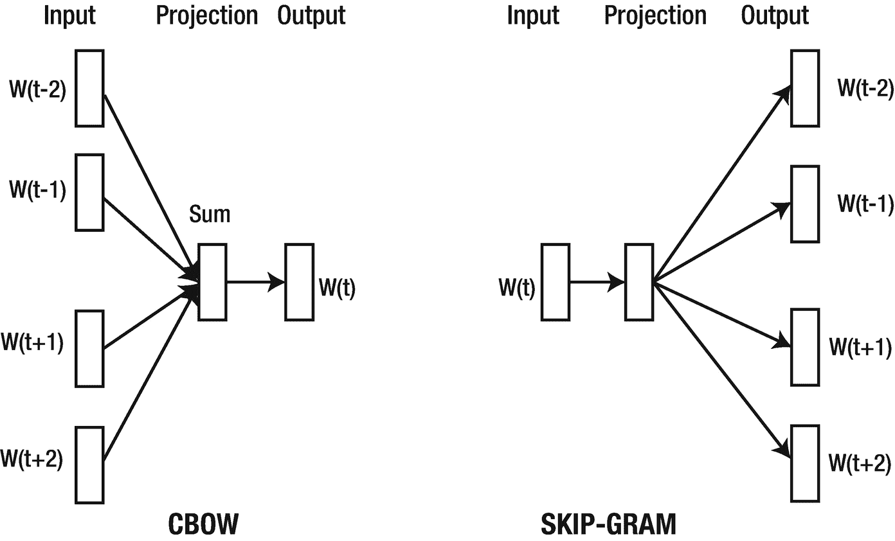
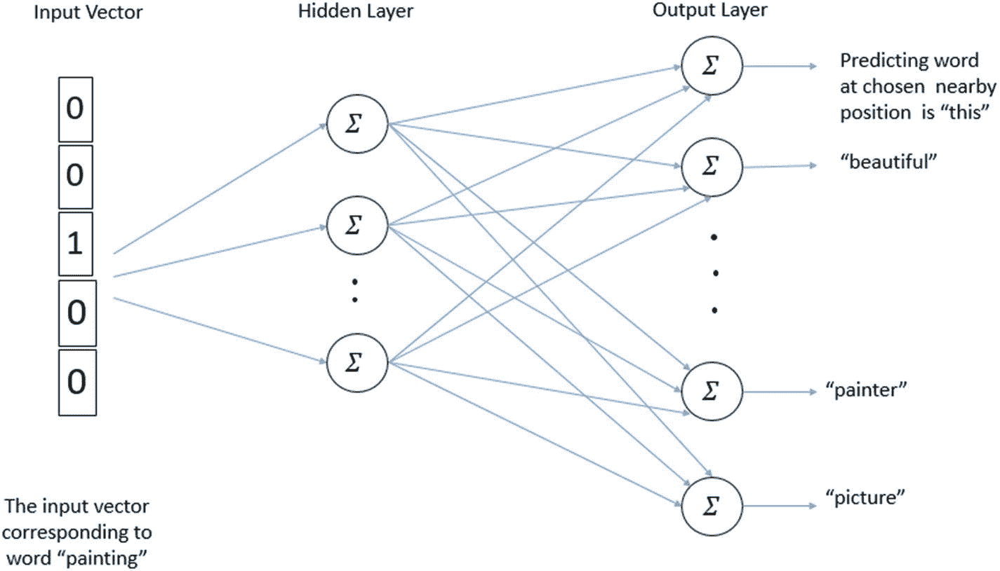
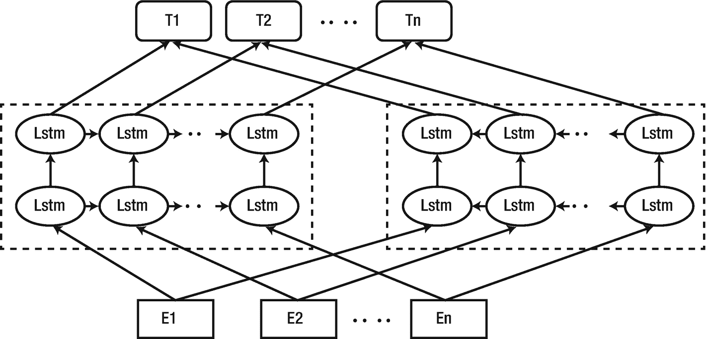
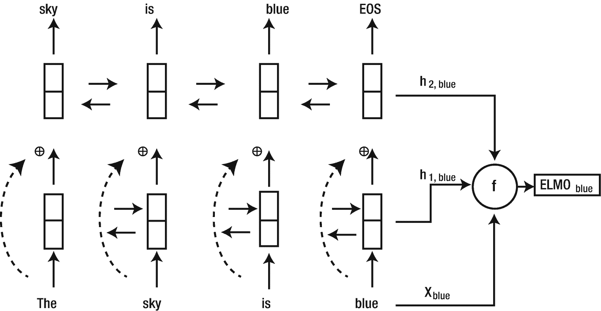
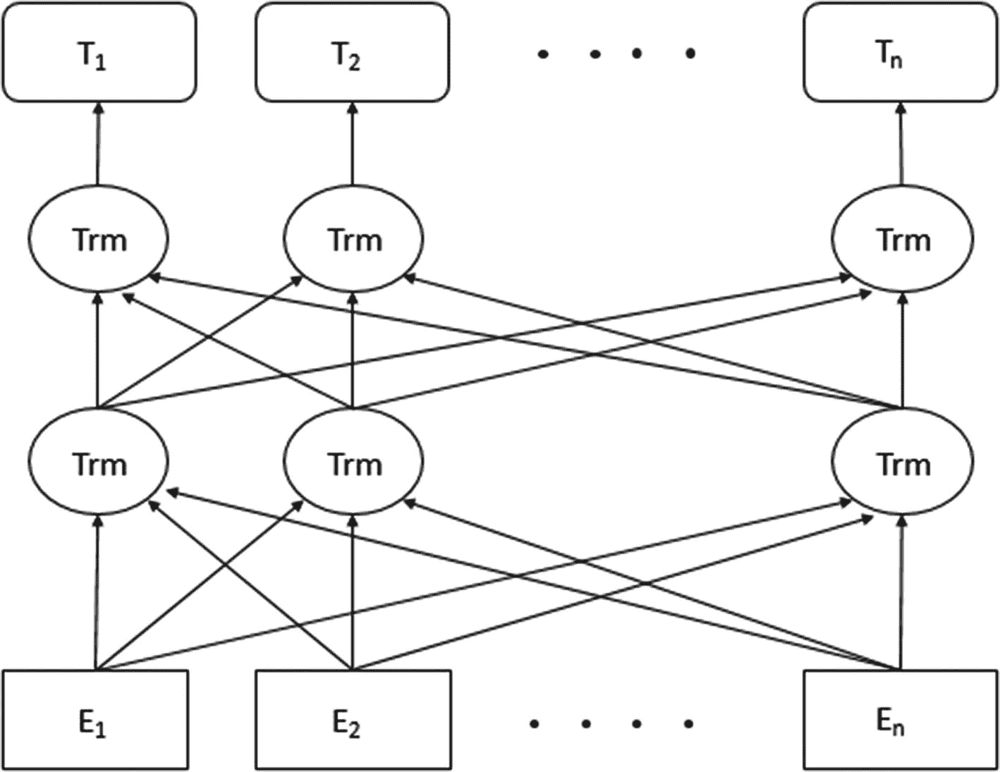
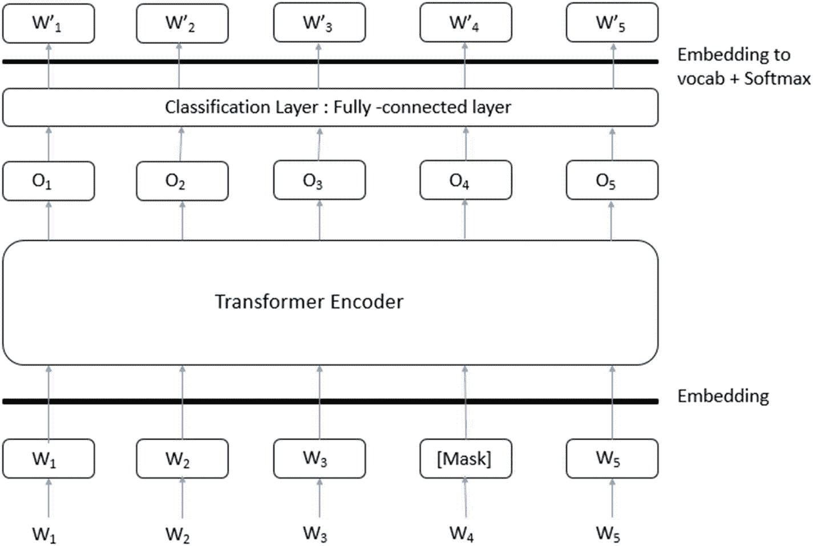
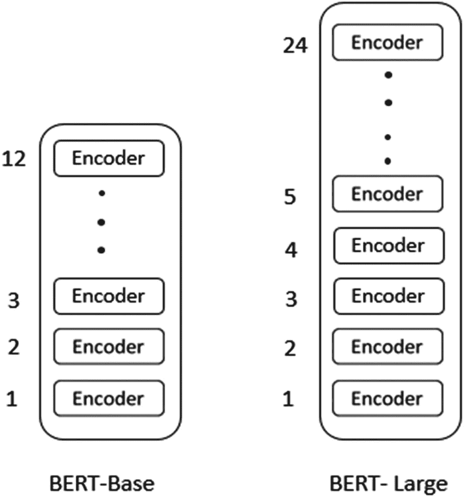

# 3. 词嵌入简介

文档分类、情感分析、聚类和文档摘要等自然语言处理任务需要处理和理解文本数据。这些任务的实现取决于人工智能系统如何处理和理解数据。一种方法是使用一些统计方法（如词频-逆文档频率、计数向量等）将文本表示转换为数值形式，但这些方法不考虑句子的含义，只处理单词在句子中的出现情况。

随着时间的推移，人们开发了几种语义方法，如解析树、上下文语法、本体等，但这些方法需要大量的人力来准备带标签的训练数据。在过去几年中，计算能力的广泛普及使得使用基于神经网络的方法来完成这些任务成为可能。

## 独热表示

独热表示是最常见、最基本的文本表示方法之一。它涉及使用二进制编码（即 0 和 1）来表示一个单词。它也可以用于表示分类属性。

例如，假设一个数据集将颜色作为特征之一，具有三个可能的值：红色、蓝色和绿色。因此，该特征将被转换为三个新列，每个颜色值一列，如下所示。

|   | **红色** | **蓝色** | **绿色** |
|---|---|---|---|
| **1** | 1 | 0 | 0 |
| **2** | 0 | 1 | 0 |
| **3** | 0 | 0 | 1 |

例如，第一个数据点在红色列中的值为 1，在其他列中为 0。这意味着该数据点最初的颜色列值为红色。红色在独热编码中表示为`[1 0 0]`，蓝色则 1 占据第二位，绿色则 1 在第三位。这是一个三维向量。独热表示扩展了特征向量，因为颜色的每个类别现在本身就是一个特征。

现在，当我们谈论文本句子的独热编码时，它不关心单词在句子中出现的顺序，实际上忽略了单词的语义含义。这种方法在语料库较小且需要使用一些传统自然语言处理方法的情况下效果最佳。

例如，要使用独热表示来表示一个文本句子，请遵循以下步骤。

1. 统计语料库中唯一单词的总数。
2. 根据单词是否出现在句子中，分配 0 或 1。

考虑句子“The sky is clear today.”。词汇表包括单词 The、sky、is、clear 和 today。如果以独热表示表示，它将形成一个五维向量，如图 3-1 所示。



**图 3-1** 独热表示

### 计数向量

在上一节中，我们了解了句子的独热表示是如何基于单词的出现（而非其出现频率）生成的。单个句子的计数向量则是根据特定单词在句子中出现的次数生成的。语料库中所有不重复的单词构成了词汇表。

例如，考虑以下两个句子。

- 句子 1：The blue bird is flying in the clear blue sky.
- 句子 2：The sky is clear today.

该语料库包含两个句子，词汇表集合 `[bird, blue, flying, is, in, the, sky, clear, today]` 包含九个词项。对于词汇表中的每个单词，需要确定其在句子中的出现频率。由此形成与该句子对应的计数向量。通过这些代表句子的计数向量，我们得到了计数矩阵。两个示例句子的计数矩阵如下所示。

| | **is** | **bird** | **blue** | **flying** | **In** | **the** | **sky** | **clear** | **today** |
|---|---|---|---|---|---|---|---|---|---|
| **句子 1** | 1 | 1 | 2 | 1 | 1 | 2 | 1 | 0 | 0 |
| **句子 2** | 1 | 0 | 0 | 0 | 0 | 1 | 1 | 1 | 1 |

矩阵中的行代表句子，列代表矩阵中对应单词的词向量。矩阵的大小为 `S × T`，其中 `S` 是句子数量，`T` 是词项或单词的数量。

句子的计数向量表示有助于我们完成多项任务，包括：

- 确定句子之间的相似度
- 识别与查询相关的文档
- 文档摘要

例如，我们将展示如何通过数学计算句子之间的相似度。句子 1 的计数向量是 `[1 1 2 1 1 2 1 0 0]`，句子 2 的计数向量是 `[1 0 0 0 0 1 1 1 1]`。余弦相似度可以使用以下数学表达式计算。

`Sim = (x · y) / (||x|| ||y||)`

这里，`x` 和 `y` 是两个计数向量。`||x||` 是向量 `x` 的欧几里得范数。

因此，

`x · y = 1×1 + 1×0 + 2×0 + 1×0 + 1×0 + 2×1 + 1×1 + 0×1 + 0×1 = 4`

`||x|| = sqrt(1² + 1² + 2² + 1² + 1² + 2² + 1² + 0² + 0²) = 3.60`

`||y|| = sqrt(1² + 0² + 0² + 0² + 0² + 1² + 1² + 1² + 1²) = 2.24`

`Sim = 4 / (3.6 × 2.24) = 0.49`

这个计算结果意味着这两个句子彼此相似，相似度得分为 49%（0.49）。相似度值始终介于 0 和 1 之间，其中 1 表示最大相似度，0 表示完全不相似。

### TF-IDF 向量化

独热表示和计数向量方法是最基础的方法，它们实际上并未考虑特定单词在句子和语料库中的重要性。对于某些 NLP 项目（如搜索引擎），了解查询中的单词与语料库中文档里的单词之间的重要性，对于确定文档与查询的相关性至关重要。一些频繁出现的英语单词（例如 "is"、"the"、"a" 等）会出现在所有文档中。尽管它们的计数较高，但在执行 NLP 相关任务时并无用处。为了克服计数向量的这一缺点，引入了 TF-IDF。TF-IDF 是各种应用中最常用的技术之一，因为它能够对通常出现频率较高的单词进行加权。

在 TF-IDF 中，我们以类似于前一种方法的方式构建词汇表。词汇表由整个语料库中不重复的单词组成。现在，为词汇表中的每个单词计算词频。单词或词项 `t` 的词频（`TF`）对应于其在文档 `d` 中出现的总次数与该文档中词项总数的比值。

`TF = (词项 t 在文档中出现的次数) / (文档中的词项总数)`

我们通过计算包含该词项的文档数量来计算逆文档频率（`IDF`）。`IDF` 告诉我们一个词项或单词提供了多少信息。它告诉你一个单词在所有文档中是否常见。`IDF` 是文档总数与包含词项 `t` 的文档数量之比的 log 值。

`IDF = log(N / n)` 其中 `N` 是语料库中的文档总数，`n` 是包含词项 `t` 的文档数量

`TF-IDF` 是 `TF` 和 `IDF` 的乘积。

`TF-IDF(t, 文档) = TF(t, 文档) × IDF(t)`

例如，我们使用之前的两个示例句子，其中句子 1 和句子 2 对应两个文档。

单词 "blue" 在句子 1 中的 `TF` = 2

`IDF = log(2 / 1) = 0.3`

单词 "blue" 在句子 1 中的 `TF-IDF` = `2 × 0.3 = 0.6`

类似地，单词 "is" 在句子 2 中的 `TF-IDF` 值为 0，因为其 `IDF` 得分为 0。这表明单词 "is" 没有任何重要性，因为它很常见且出现在所有文档中。

像 `TF-IDF`、计数向量和独热编码这样的方法易于计算，但它们无法捕捉文档中的语义（或单词的出现顺序）。使用这些方法表示的单词或句子不提供任何上下文信息。尽管可以使用它们执行许多 NLP 任务，但总体结果平平，尤其是在训练数据稀疏的情况下。因此，需要一种更好的技术，既能捕获有用的语言信息，又能提升几乎所有 NLP 问题的泛化能力和性能。

在下一节中，我们将讨论一种这样的方法——词嵌入，其中单词的向量表示包含上下文信息。

## 什么是词嵌入？

词嵌入是一种词表示方式，将词语嵌入到实数向量中。这些嵌入向量可以通过神经网络、概率模型或对词共现矩阵进行降维等方法生成，如图 3-2 所示。它们使机器学习算法能够理解具有相似含义的词语。



图 3-2 词嵌入

与独热表示相比，词嵌入通常是低维（通常为 50–600 维）且稠密的词或句子表示。使用独热表示时，特征向量会随着词汇集的大小而增加。而词嵌入则更加高效，并且具有泛化能力。语义相似的词语更有可能拥有相似的向量表示。因此，与独热表示相比，当用于文档摘要、句子或文档相似度等自然语言处理任务时，这些向量会给出更相关的结果。

词嵌入也被称为分布式表示、分布式语义模型或语义向量空间。这里的“语义”一词凸显了词嵌入的重要性，因为它旨在将语义相似的词语归类在一起。例如，网球、足球和游泳等运动类词语应彼此靠近，而与动物相关的词语则应远离这些词语。从更广泛的意义上讲，词嵌入会为运动相关的词语创建向量表示，这些向量表示将远离动物类词语的向量表示。其主要目标是让具有相似上下文的词语占据最近的空间位置。

嵌入向量本质上是词语在低维空间中的表示。目前，神经网络也被用于生成词嵌入。它提高了从大量文本数据中学习或泛化表示的能力。神经网络模型可以在降低文本数据维度的同时，学习词汇集中词语的丰富特征。词嵌入在自然语言处理任务、文本分类、文档聚类等方面被证明非常有用。目前有多种神经网络词嵌入模型可用，例如 `Word2vec`、`GloVe`、`ELMo` 和 `BERT`，其中 `BERT` 已被证明是目前最先进的自然语言处理任务的最佳模型。

## 词嵌入的不同方法

生成词嵌入有不同的方法，它们的实现方式也各不相同。接下来我们将详细讨论其中几种。

### Word2vec

`Word2vec` 是一种浅层、两层的词嵌入神经网络技术，它将词语表示在向量空间中。在输入层和输出层之间只有一个隐藏层的神经网络被称为浅层神经网络。`Word2vec` 是一个两层网络，包含一个输入层、一个隐藏层和一个输出层。它以文本语料库作为输入，并输出一组向量。这些特征向量代表了语料库中的词语。表示词语的向量被称为神经词嵌入。

这种向量表示保持了文档或语料库中词语之间的语义关系。含义相似的词语在向量空间中会彼此非常接近，而不相似的词语则相距甚远。这种语义关系是通过 `Word2vec` 重构词语的语言上下文来实现的。语言上下文可以理解为句子的主要目标。例如，在句子“今天是什么日期？”中，一个人想知道今天的日期，这实际上就是句子的上下文。主要上下文可以通过语言周围的词语和句子来揭示。当给定足够的文本语料库时，借助 `Word2vec` 可以准确猜测一个词语与其他词语的关联。

`Word2vec` 能够根据输入文本数据中的相邻词语来训练词语。它可以通过两种方式实现：连续词袋（`CBOW`）和跳字模型。这是 `Word2vec` 的两种实现方式，用于创建词嵌入表示。在 `CBOW` 中，使用上下文来预测目标词，而在跳字模型中，则使用一个词来预测目标上下文。

#### 连续词袋

`CBOW` 架构尝试使用上下文窗口中的词语来预测目标词。中心词或目标词是借助周围的词语或源上下文词来预测的。`Word2vec` 模型是无监督模型，这意味着我们只需提供输入语料库，而无需提供任何关于输出的额外信息。为了获得 `CBOW` 词嵌入，该模型遵循一种监督分类方法，即将语料库作为输入 `X`，并预测目标词 `Y`。

神经网络的输入将是给定窗口大小内上下文词的独热编码向量之和。对数损失函数将用作损失函数。

```
-1/N * sum(i=1 to N) [y_i * log(p(y_i)) + (1 - y_i) * log(1 - p(y_i))]
```

在最后一层使用 softmax 函数作为激活函数。这将提供所有词的概率分布。softmax 函数的方程如下所示：

```
sigma(x_j) = e^(x_j) / sum_i e^(x_i)
```

例如，考虑句子“这幅美丽的画作属于伊丽莎白女王。”以下是考虑上下文窗口大小为 2 的一些训练数据示例。

- `[(画作, 属于), 伊丽莎白女王]`
- `[(这幅, 美丽的), 画作]`

输入层将具有上下文词（即“这幅”和“美丽的”）的独热表示，输出层将显示语料库中所有词的概率分布，其中词“画作”的概率得分最高。

图 3-3 展示了 `Word2vec` 嵌入两种变体的架构。



图 3-3 `CBOW` 和跳字模型的架构

#### 跳字模型

跳字模型是一种无监督学习技术，用于找出目标词周围最相关的词语。在此语境下，通过目标词来预测其上下文词语。它是`CBOW`方法的逆向过程。这里，目标词是输入，上下文词语是输出。由于需要预测多个上下文词语，这是一种相对困难的技术。如跳字模型架构（图 3-3）所示，输入是目标词 `W(t)`，输出是上下文词语的向量表示。

该过程通常按以下方法计算。通过一个隐藏层，计算输入向量与权重矩阵的点积。类似地，在输出层，计算隐藏层输出向量与输出层权重矩阵的点积。然后，使用 softmax 激活函数计算在 `W(t)` 上下文中各词语出现的概率。

隐藏层是一个权重矩阵，其各行对应输出词语的贡献。例如，如果权重矩阵的维度是 4 × 4，输入是一个独热编码的词，那么将从矩阵中选择与输入向量中“1”对应的那一行。

```
[0 0 1 0] × [矩阵] = [6 15 3 2]
```

这个词向量是在隐藏层将结果馈送到输出层后获得的，输出层会产生一个介于 0 和 1 之间的输出。输出层是一个 softmax 回归分类器，用于给出输出词出现在输入目标词附近该上下文位置的概率。

图 3-4 展示了一个使用跳字模型进行词嵌入的示例。



**图 3-4** 神经网络架构

### GloVe

`GloVe`（全局向量）是一种无监督技术，用于在全局语料库中对词语进行向量表示。词向量的获取综合考虑了语料库的全局统计信息和局部统计信息。局部统计信息对应词语的局部上下文信息，而全局统计信息则通过词语共现来捕获。

尽管 `Word2vec` 的性能相当令人满意，但仍有必要采用更好的方法，因为 `Word2vec` 只考虑周围的词语，有时可能无法捕获一个词与其他词之间的有用关系。`Word2vec` 学习到的语义仅依赖于局部信息，并受邻近词语的影响。相比之下，在 `GloVe` 中，可以借助整个语料库的结构来获取词语的含义。这包括词频和共现计数。该模型主要依赖于这样一个直觉：词与词之间的共现概率有助于编码某种形式的含义，这使其比 `Word2vec` 更具优势。

`GloVe` 在这些聚合的全局词-词共现统计信息上进行训练，并最小化最小二乘误差。这导致了词向量空间中有意义的线性子结构的形成。例如，“man”和“woman”在描述人类这一语境下是相似的，但这两个词又是对立的。为了尽可能多地捕获这两个词所指定的含义，我们需要一个更大的信息语料库。这两个词的区别在于性别，这可以通过其他词对来指定，例如 husband–wife、brother–sister 等。

## 句子嵌入

词嵌入仅通过考虑邻近词语（而非其他句子）来生成词语的向量表示。为了捕获句子之间的关系，句子嵌入是最佳方法。句子嵌入是文档中句子的向量表示。句子嵌入模型至关重要，因为它们能够捕获词嵌入模型无法捕获的上下文信息。如前所述，词嵌入表示句子或对话中词语的含义。它们是词语在 N 维向量空间中的表示。然而，这些方法往往容易忽略必要的信息，如下面的例子所示。

两个句子可能具有相同的表示，但含义却完全不同。例如：

- 句子 1：The sky is clear not cloudy today.
- 句子 2：The sky is cloudy not clear today.

这里，句子 1 和句子 2 具有相似的表示，但它们的含义完全不同。词嵌入无法区分这两个句子，因为这两个句子中词语的向量表示几乎相同。句子嵌入可用于实现这种区分。

在机器学习流水线中处理文本数据时，我们确实需要计算句子嵌入，以便能够将完整的句子嵌入到向量空间中。句子嵌入可以捕获句子之间、段落之间乃至文档之间的语义相似性或相关性。

一个句子的句子嵌入可能如下所示：

- “The bird is flying in sky.” – `[0.1, 0.7, 0.4, …]`

为了生成句子的句子嵌入，最基本的方法是对该句子中所有词语的词嵌入进行平均。

可以使用词嵌入的加权平均来获得句子嵌入并降低维度。除了这种方法之外，还引入了其他方法，例如通用句子编码器和 `ELMo`，这些方法已被证明对自然语言处理相关任务非常有用。

### ELMo

`ELMo`（来自语言模型的嵌入）是一种深度上下文词嵌入。它由艾伦人工智能研究所于 2018 年开发。`ELMo` 使用深度双向 LSTM 模型来创建词表示。其嵌入由两层双向语言模型的内部状态计算得出。它能够捕捉句子中词语变化的上下文含义，如图 3-5 所示。



**图 3-5** ELMo 架构

与 `Word2vec` 不同，`ELMo` 在其使用的上下文中分析词语。它不为词典中的词语创建向量；相反，向量是通过将文本传递给深度学习模型来创建的。词语的表示取决于传递给模型的整个句子语料库。它不为每个词语使用固定的嵌入；而是在为词语分配嵌入之前查看整个句子。它能够理解词语的含义及其所在的上下文。因此，它能够捕捉含义以及上下文信息。与词语相关的上下文信息可能会根据使用该词语的句子而变化。这使得它比 `Word2vec` 和 `GloVe` 更具优势。当预训练的语言嵌入被添加到现有模型中时，它能够提升 NLP 问题的最新技术水平。

`ELMo` 是基于字符的：它将字符作为输入而非词语，这使得它能够为训练期间未见过的词语计算有意义的表示。当在大型数据集上训练时，它还能够学习语言模式，这对于与 NLU 相关的任务（例如确定短语中的下一个词）非常有益。例如，在短语“The weather is cloudy today, it might …”中，单词“rain”比单词“dog”更可能出现。该模型在此类场景中非常有用，可以根据上下文找到最可能的词语，如图 3-6 所示。



**图 3-6** 单词“blue”的 ELMo 特定表示

`ELMo` 模型是一个相当复杂的神经语言模型，旨在根据先前看到的词语历史来计算一个词语的概率。`ELMo` 架构（参考图 3-5）以两层双向 LSTM 作为其骨干。这种两层双向 LSTM 模型帮助模型理解句子中的下一个词以及前一个词。第一层和第二层通过残差连接相连，这些连接可以跳过一个或多个层，因为层会馈送到下一层，并直接馈送到相隔几层的层。它们用于使更深的网络更容易优化。在 `ELMo` 语言模型中，每个 token 都使用字符嵌入转换为适当的表示。我们使用一维 CNN 获得这些字符级嵌入，以获取词语的数值表示。这允许即使对于词汇表中不存在的词语也能获得有效的表示。然后，使用不同数量和类型的滤波器，将其传递通过卷积层。最后，在作为输入传递到 LSTM 层之前，它会被传递通过一个两层的高速公路网络。该高速公路网络使得信息能够更平滑地通过输入进行传输。对输入 token 的这些转换允许选择形态特征、n-gram 特征等。这有助于构建强大的句子表示。

假设我们正在查看输入中的第 i 个词。以图 3-5 为参考，单词“blue”的 `ELMo` 表示是转换后的词表示 `x[i]` 以及两个双向表示 `h[1i]` 和 `h[2i]` 输出的组合。函数 `f` 对输入执行以下操作。

`ELMo [i] ^(task) = *γ*i . (s[0] ^(task) . xi + s[1] ^(task) . h[1, i] + s[2] ^(task) . h[2, k])`

这里，`*γ*i` 和 `s[k]` 是在特定任务模型训练期间学习到的权重因子。因此，当我们使用 `ELMo` 时，我们会冻结权重，然后将每个 token 的 `ELMo i task` 连接到输入表示。

### 通用句子编码器

通用句子编码器是最近引入的，它已成为最流行的句子嵌入预训练模型之一。它能够将句子转换为向量表示。这个多功能的句子嵌入模型可以学习丰富的语义信息，从而利用迁移学习，其中来自其他任务的句子表示可以通过重新训练架构的最后一层来学习。

这个句子编码器模型可用于各种 NLU 任务。编码器使用的 Transformer 网络在大型、多样的数据语料库上进行训练。输入文本（可以是句子、短语或短段落）被编码成一个高维向量。这里，输入长度可以是可变的，但输出是一个 512 维向量。这使得能够为广泛的下游任务（如文本分类、聚类、语义相似度等）生成句子嵌入。

Google 使用 TensorFlow 训练的这些模型的多个版本和实现可在 TensorFlow Hub 上供机器学习工程师使用，包括以下这些。

*   `universal-sentence-encoder-large`

*   `universal-sentence-encoder-lite`

*   `universal-sentence-encoder-multilingual`

*   `universal-sentence-encoder-multilingual-large`

*   `universal-sentence-encoder-multilingual-qa`

### 来自 Transformers 的双向编码器表示

`来自 Transformers 的双向编码器表示`（`BERT`）由谷歌的研究人员提出。用于语言建模的双向 Transformer 使得 `BERT` 在多种 `NLP` 任务以及问答系统中广受欢迎。这使其与以往仅按单一方向（从左到右或从右到左）处理序列的模型有所不同。

双向编码器接收两个序列进行编码，其中一个为正常序列，另一个为其逆序序列。它包含两个编码器，分别用于编码这两个序列。最终输出会综合考虑两个编码结果。语言模型的双向训练使其能够更深入地理解语言上下文。这对于理解文本含义至关重要，如图 3-7 所示。

例如，考虑以下两个句子：

- 句子 1：看到一只`蝙蝠`在我房间里飞，我吓坏了。

- 句子 2：球员在击球时牢牢握住了`球棒`。

在这里，单词“bat”根据语言上下文在两个句子中具有不同的含义。如果我们从两个方向来处理句子，就能更好地理解这一点。如果只朝一个方向移动，我们可能会错过有用信息，并且可能无法正确获取其含义。`BERT` 同时考虑了前文和后文语境，这降低了在进行任何预测之前出错的可能性。在训练过程中，信息从两个方向收集，并且所有层都共同基于两个方向的上下文进行条件处理。



图 3-7

`BERT` 架构

预训练的 `BERT` 模型只需修改输出层，即可用于各种最先进的任务。它不需要针对特定任务进行架构更改。它利用 Transformer 来理解文本中标记或单词之间的关系。Transformer 包含一个编码器和一个解码器。编码器读取输入文本，解码器则有助于为任务生成预测。Transformer 编码器能够一次性读取整个单词序列，而不是从左到右顺序读取。这使得模型具有双向性，并允许它从单词或标记的左侧和右侧学习其上下文。输入到 Transformer 的标记序列被嵌入到向量中，然后这些向量在神经网络中进一步处理。网络的输出是一个与输入标记相对应的向量序列，如图 3-8 所示。



图 3-8

`BERT` Transformer

`BERT` 使用两种策略来克服单向限制。`BERT` 在这两个 `NLP` 任务上进行预训练：掩码语言建模（`MLM`）和下一句预测（`NSP`）。`MLM` 通过从输入文本中随机掩码标记来协助预训练双向 Transformer，而 `NSP` 任务则联合预训练文本对表示。在训练期间，`BERT` 最小化这两个任务的组合损失函数。

要使用 `BERT`，需要遵循两个阶段：

1.  **预训练：** 在此步骤中，模型在不同预训练任务上使用未标记数据进行训练。

2.  **微调：** `BERT` 模型使用预训练参数进行初始化，然后使用来自下游任务（可能是分类、问答等）的数据进行微调。

`BERT` 模型有两种实现方式：`BERT` 基础模型和 `BERT` 大型模型。

#### BERT 基础模型

`BERT` 基础模型是一个预训练的 `BERT` 模型，具有 12 层或 Transformer 块，每层有 768 个隐藏单元，以及 1.1 亿个参数。根据其训练的英文文本（区分大小写或不区分大小写），它可以进一步分类为 `BERT` base-cased 和 `BERT` base-uncased，如图 3-9 所示。



图 3-9

`BERT` 基础模型和 `BERT` 大型模型

#### BERT 大型模型

`BERT` 大型模型是一个预训练的 `BERT` 模型，具有 24 层或 Transformer 块，每层有 1,024 个隐藏单元，以及 3.4 亿个参数。它也可以进一步分类为 `BERT` large-cased 和 `BERT` large-uncased。该模型所需的内存明显多于 `BERT` 基础模型。

## 结论

本章涵盖了词嵌入、句子嵌入及其不同的实现方法，例如 `Word2vec`、`GloVe`、`通用句子编码器`等。我们还讨论了 `BERT` 及其变体（即基础模型和大型模型）。在下一章中，我们将更深入地探讨 `BERT` 及其不同的实现。