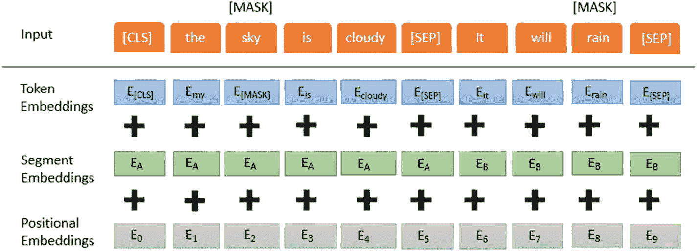
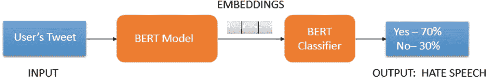
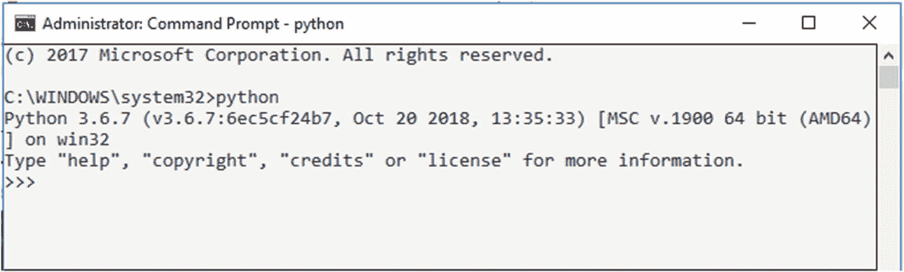
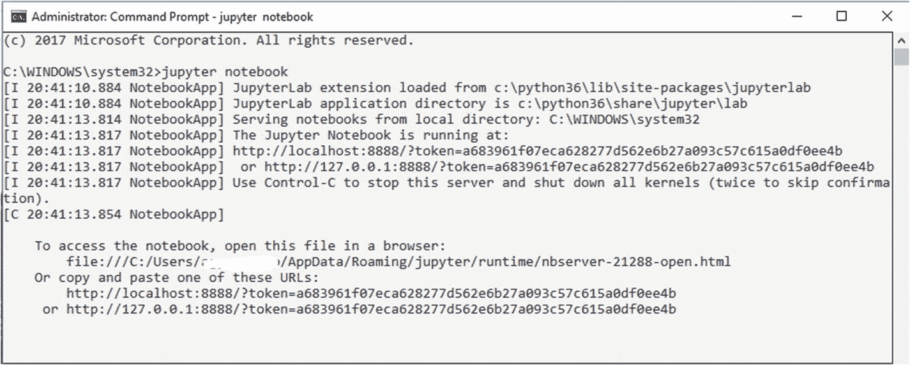
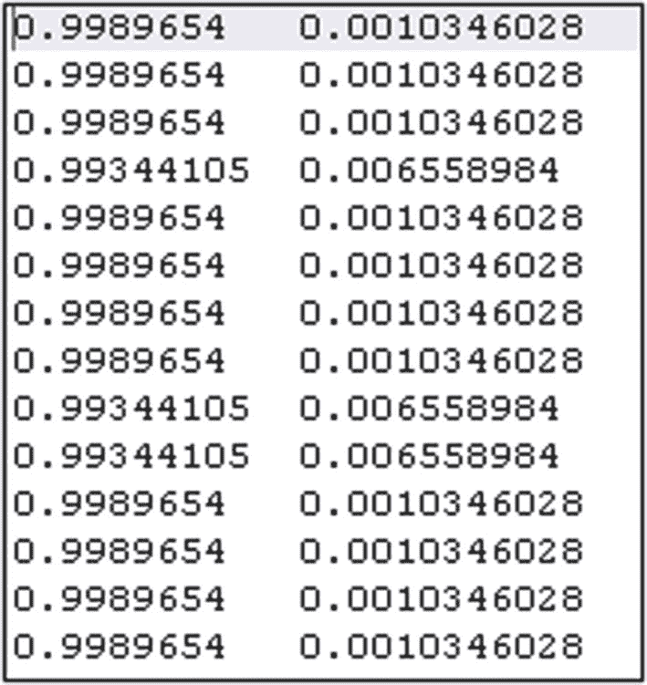
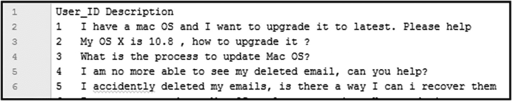
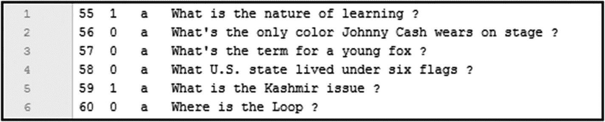
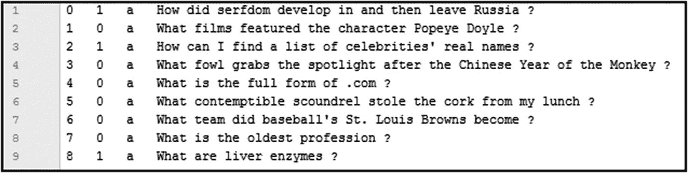
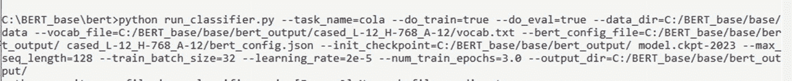
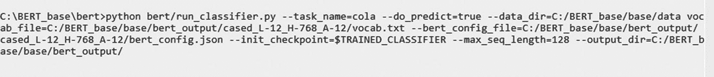

# 4. BERT 算法详解

本章深入探讨用于句子嵌入的 `BERT` 算法，以及各种训练策略，包括 `MLM` 和 `NSP`。我们还将看到一个使用 `BERT` 实现文本分类系统的示例。

## BERT 是如何工作的？

`BERT` 利用 Transformer 来学习文本中单词之间的上下文关系。Transformer 有两种机制——编码器和解码器——但 `BERT` 只需要编码器机制。`BERT` 采用双向方法并顺序读取文本输入，这使得模型能够根据单词周围的单词来学习其上下文。编码器的输入是一个标记序列，这些标记被嵌入到向量中。然后，这些向量被传递到神经网络中，并生成与输入相对应的输出向量序列。一个单词的输出向量取决于它出现的上下文。例如，句子“他喜欢打板球”中单词“like”的向量，与句子“他的脸像番茄一样红”中同一个单词的向量是不同的。

这个过程甚至在开始模型构建阶段之前就涉及文本处理步骤。下一节将讨论 `BERT` 中使用的文本处理步骤。


### 文本处理

`BERT`模型有一套特定的规则来表示输入文本。这同样有助于模型更好地运行。如果我们深入研究嵌入，`BERT`中的输入嵌入是以下三种嵌入类型的组合。

-   **位置嵌入：** 位置嵌入用于学习嵌入中的顺序信息。由于 Transformer 模型会丢失与顺序相关的信息，因此使用位置嵌入来恢复它。对于输入序列中的每个位置，`BERT`都会学习一个独特的位置嵌入。借助这些位置嵌入，`BERT`能够表达单词在句子中的位置，因为它捕获了这种序列或顺序信息。
-   **段落嵌入：** `BERT`还会为第一句和第二句学习独特的嵌入，以帮助模型区分它们。它也可以将句子对作为输入，用于问答等任务。
-   **词元嵌入：** 对于`WordPiece`词元词汇表中的每个词元，都会学习词元嵌入。`WordPiece`词元词汇表包含语料库中单词的子词。例如，对于单词“Question”，该词汇集将包含“Question”的所有可能子词，例如[`“Questio”`， `“Questi”`…]等等。

图 4-1 展示了`BERT`中嵌入序列的一个示例。



图 4-1

BERT 嵌入

给定词元的输入表示是通过对词元嵌入、段落嵌入和位置嵌入求和来构建的。这使得它成为一个全面的嵌入方案，为模型包含大量有用信息。

对于一个任务是预测句子中下一个单词的 NLP 任务，如果我们采用单向方法，它会有一些局限性。然而，`BERT`提供了两种学习上下文信息的策略：`MLM`和`NSP`。在`BERT`的训练过程中，这两个任务会一起训练。当使用这两种策略时，模型会试图实现最小化组合损失函数的目标。

### 掩码语言建模

`BERT`是一个深度双向模型，比从左到右模型或从左到右和从右到左模型的浅层拼接更强大。`BERT`网络可以有效地从词元的右侧和左侧上下文中捕获信息。这从第一层开始，一直贯穿到最后一层。以前，语言模型是在从左到右的上下文中训练的，这使得它们容易信息不足。尽管`ELMo`模型通过浅层拼接两个 LSTM 语言模型极大地改进了现有技术，但这还不够。`BERT`已被证明比现有技术更重要，其中`MLM`起着关键作用。

在掩码语言任务中，文本中的一些单词会被随机掩码。`[MASK]`词元周围的上下文单词用于预测`[MASK]`单词。当单词序列被输入`BERT`时，每个序列中 15%的单词会被替换为`[MASK]`词元。这 15%的单词是随机选择的。其中，80%被掩码，10%被替换为随机单词，10%保持不变。这样做是因为如果 100%的掩码单词都被使用，那么模型不一定能为非掩码单词产生良好的词元表示。模型性能得到了提升，因为防止了过度关注特定位置或词元。基于序列中非掩码单词提供的上下文，模型试图预测掩码单词的原始值。

使用`BERT`生成词嵌入需要遵循以下过程：

-   在编码器输出之上添加一个分类层。
-   将输出向量与嵌入矩阵相乘，从而将它们转换为词汇维度。
-   使用`softmax`计算词汇表中每个单词的概率。

`BERT`中的损失函数只考虑掩码值的预测；非掩码单词的预测被忽略。这使得模型收敛速度比单向模型慢。例如，对于句子“The birds are flying in the clear blue sky”，如果我们训练双向模型，而不是预测序列中的下一个单词，可以构建一个模型来预测序列本身中缺失的单词。现在，考虑一个词元“flying”并将其掩码，使其被视为缺失。现在需要以这样一种方式训练模型，使其能够预测句子“The birds are `[MASK]` in the clear blue sky”中这个缺失或掩码词元的值。这就是`MLM`的本质，它使模型能够理解句子中单词之间的关系。

### 下一句预测

`NSP`任务类似于句子中的下一个单词预测。`NSP`预测文档中的下一个句子，而后者则用于预测句子中缺失的单词。`BERT`也在`NSP`任务上进行了训练。这是必需的，以便我们的模型能够理解文本语料库中不同句子之间的相互关系。在`BERT`模型的训练过程中，句子对被作为输入。然后它预测这对句子中的第二个句子是否是原始文档中的后续句子。为了实现这一点，50%的输入被设置为第二个句子是原始文档中的后续句子，而另外 50%则由第二个句子从文档中随机选择的句子对组成。假设随机选择的第二个句子与第一个句子无关。

例如，考虑句子 A 和句子 B 的两个不同训练数据实例：

```
实例 1
句子 A – I saw a bird flying in the sky.
句子 B – It was a blue sparrow.
标签 – IsNextSentence
实例 2
句子 A – I saw a bird flying in the sky.
句子 B – The dog is barking.
标签 – NotNextSentence
```

正如我们所见，对于实例 1，句子 B 在逻辑上是句子 A 的后续，但对于实例 2 则不然，这从标签`IsNextSentence`和`NotNextSentence`中分别可以清楚地看出。

这些输入甚至在训练过程开始之前就被处理，以区分两个句子。过程概述如下。

1.  在句子对中插入两个词元。一个词元`[CLS]`插入在第一个句子的开头，另一个词元`[SEP]`插入在每个句子的末尾。这两个句子都被分词，并通过分隔词元彼此分开，然后作为单个输入序列输入模型。
2.  对于每个词元句子，添加一个嵌入，指示它是句子 A 还是句子 B。这些句子嵌入在概念上基本类似于词汇量为 2 的词元嵌入。
3.  除了句子嵌入之外，还为每个词元添加位置嵌入，这有助于指示词元在序列中的位置。

现在，执行以下步骤来预测第二个句子是否确实与第一个句子相关联。

1.  整个输入序列通过 Transformer 模型。
2.  借助简单的分类层，`[CLS]`词元的输出被转换为一个 2X1 形状的向量。
3.  从而，借助`softmax`计算`IsNextSentence`的概率。

众所周知，`BERT`用于各种 NLP 任务，例如文档摘要、问答系统、文档或句子分类等。现在，让我们看看`BERT`如何用于句子分类。


## 使用 BERT 进行文本分类

BERT 可用于多种语言任务。在核心模型上添加一个小层，即可将 BERT 用于分类、问答、命名实体识别等任务。BERT 模型会为此进行微调。对于分类任务，会在 `[CLS]` 标记的 Transformer 输出之上添加一个分类层，类似于 NSP（下一句预测）。大多数超参数与 BERT 训练时保持一致，但部分参数需要调整，才能在文本分类任务中达到最先进的结果。图 4-2 给出了一个判断给定推文是否为仇恨言论的示例。



图 4-2

使用 BERT 进行分类的示例

类似的任务，如文档分类、情感分析等，也可以使用 BERT 来实现。

接下来，我们将了解如何在系统中配置一个预训练的文本分类模型。请按照以下步骤配置或安装必要的先决条件。

1.  确保你的系统已安装 Python。打开命令提示符并运行以下命令，以确定是否安装了 Python，如图 4-3 所示。

`Python`



图 4-3

Python 控制台

这将在命令提示符下启动 Python 控制台。如果你的系统未安装 Python，请根据你的操作系统，通过此链接下载并安装 Python：[`https://www.python.org/downloads/`](https://www.python.org/downloads/)

2.  接下来，安装 Jupyter Notebook。打开命令提示符并运行以下命令。

1.  打开命令提示符并运行以下命令来启动 Jupyter Notebook。

```
jupyter notebook
```

Notebook 将在你的默认浏览器中启动，主机地址为 localhost，端口号为 8888，并附带一个唯一的令牌 ID，如图 4-4 所示。



图 4-4

Jupyter Notebook 控制台

2.  你也可以使用 Google Colab Notebook 达到相同目的。如果你的系统资源不足，它提供了一个快速且免费的环境来运行你的 Python 代码。你还可以在 Google Colab 中免费使用图形处理单元（GPU）和张量处理单元（TPU），但时间有限（12 小时）。你只需要一个 Google 帐户即可登录 Google Colab Notebook。本书将使用 Google Colab Notebook 来演示如何使用 BERT 进行文本分类。登录你的 Google 帐户，然后点击 [`https://colab.research.google.com`](https://colab.research.google.com)。你将看到如图 4-5 所示的界面。

```
pip install notebook
```


图 4-5

用于创建或导入 Notebook 的 Google Colab 界面

1.  要创建新的 Colab Notebook，请点击右下角的“新建笔记本”，如图 4-5 所示。

2.  安装 TensorFlow。在你的 Jupyter Notebook 或 Colab Notebook 中运行以下命令。

```
pip install tensorflow
```

现在，我们已经安装了本练习的所有先决条件。请按照以下步骤配置一个使用 BERT 进行文本分类的预训练模型。

1.  BERT 模型文件和所需代码可以从 GitHub 仓库下载。打开命令提示符，通过输入以下命令将 GitHub 仓库（即 `https://github.com/google-research/bert.git`）克隆到系统上：

```
git clone https://github.com/google-research/bert.git
```

2.  下载包含权重和其他必要 BERT 文件的模型文件。根据你的需求，需要从此列表中选择一个 BERT 预训练模型。
    *   BERT Base, Uncased（基础版，未区分大小写）
    *   BERT Large, Uncased（大型版，未区分大小写）
    *   BERT Base, Cased（基础版，区分大小写）
    *   BERT Large, Cased（大型版，区分大小写）

3.  如果你有权访问云 TPU，可以使用 BERT Large；否则，应使用 BERT Base 模型。可以进一步在区分大小写和未区分大小写的模型之间进行选择。

4.  用于微调 BERT 模型的数据需要采用 BERT 能够理解的格式。数据必须分为三部分：训练集（train）、开发集（dev）和测试集（test）。根据经验法则，训练集应包含 80% 的数据，剩余的 20% 将分为开发集和测试集。你需要创建一个包含三个独立文件的文件夹：`train.tsv`、`dev.tsv` 和 `test.tsv`。`train.tsv` 文件将用于训练模型，`dev.tsv` 将用于开发系统，`test.csv` 将用于评估模型在未见数据上的性能。`train.tsv` 和 `dev.tsv` 都不应有标题行，并且应包含如下所示的四列。

```
1          1         a         属于类别 1 的文本示例
2          1         a         属于类别 1 的文本示例
3          2         a         属于类别 2 的文本示例
4          0         a         属于类别 0 的文本示例
```

以下是所用列的详细信息。
    *   **第一列**：表示样本的 ID。
    *   **第二列**：与示例对应的分类标签。
    *   **第三列**：可丢弃的列。
    *   **第四列**：表示需要分类的实际文本句子。

5.  `test.tsv` 文件应包含标题行（与其他两个文件不同），并且应如下所示。

```
id sentence
1. 第一个测试示例
2. 第二个测试示例
3. 第三个测试示例
```

6.  要训练模型，你需要导航到模型被克隆到的目录。然后，在命令提示符下输入以下命令：

```
python bert/run_classifier.py \
--task_name=cola \
--do_train=true \
--do_eval=true \
--data_dir=./data \
--vocab_file=$BERT_BASE_DIR/vocab.txt \
--bert_config_file=$BERT_BASE_DIR/bert_config.json \
--init_checkpoint=$BERT_BASE_DIR/bert_model.ckpt \
--max_seq_length=128 \
--train_batch_size=32 \
--learning_rate=2e-5 \
--num_train_epochs=3.0 \
--output_dir=./bert_output/
```

如果你的训练数据文本长度超过 128 个词，则可以将 `max_seq_length` 的值增加到 512。如果你在 CPU 系统上训练模型，则可以减少训练规模以避免内存不足错误。

训练完成后，报告将存储在 `bert_output` 目录中。

7.  这个训练好的 BERT 模型现在可以用于预测。如果需要对新的数据进行预测，则需要将数据存储在 `test.tsv` 中。进入存储训练模型文件的目录。请参考在 `bert_output` 目录中看到的编号最高（最新的模型文件）的 `model.ckpt` 文件。这些文件包含训练好的模型权重。现在在命令提示符下运行以下命令以获取分类结果，该结果将存储在 `bert_output` 目录位置下的 `test_results.tsv` 中。

```
python bert/run_classifier.py \
--task_name=cola \
--do_predict=true \
--data_dir=./data \
--vocab_file=$BERT_BASE_DIR/vocab.txt \
--bert_config_file=$BERT_BASE_DIR/bert_config.json \
--init_checkpoint=$TRAINED_CLASSIFIER \
--max_seq_length=128 \
--output_dir=./bert_output/
```

请注意，`max_seq_length` 参数的值应与训练过程中使用的值相同。


## 问题分类与 BERT 模型实现

本书将演示如何实现一个问题分类数据集，将问题分类到各自的类别中。问题主要分为两类：事实型（非描述性）问题和非事实型问题。例如，“What is the temperature in Delhi?”是一个事实型问题，因为它基于某些事实寻找答案；“What is temperature?”是一个非事实型问题，因为它寻找关于温度的文本片段。关于此实现，请参考位于[`https://cogcomp.seas.upenn.edu/Data/QA/QC/`](https://cogcomp.seas.upenn.edu/Data/QA/QC/)的数据集。

现在我们将了解如何使用`BERT`实现问题分类系统。



**图 4-11** 预测结果快照

1. 对于此实现，我们将按照之前所述从 GitHub 下载`BERT` base-cased 模型。

2. 问题分类数据集已采用训练`BERT`模型所需的格式。数据被分为`train.tsv`、`dev.tsv`和`test.tsv`集合。在`train.tsv`和`dev.tsv`中，我们没有表头。以下是文件中各列的说明：
   - **第一列**：数据点的索引。
   - **第二列**：分类标签（即事实型或非事实型）。在此数据集中，事实型用 0 表示，非事实型用 1 表示。
   - **第三列**：值为`a`的废弃列。
   - **第四列**：实际的问题文本。

然后我们创建数据文件夹并将这些文件保存到该文件夹中。请参考图 4-6 至 4-8 查看训练文件中的一些示例。



**图 4-8** `test.tsv`快照



**图 4-7** `train.tsv`快照



**图 4-6** `Dev.tsv`快照

3. 现在，导航到下载的`BERT`模型所在的目录。

4. 如前所述，在命令提示符下执行训练命令。训练完成后，模型输出存储在`bert_output`参数定义的位置，如图 4-9 所示。

```
python run_classifier.py --task_name=cola --do_train=true --do_eval=true --data_dir=$BERT_BASE_DIR/data --vocab_file=$BERT_BASE_DIR/bert_output/cased_L-12_H-768_A-12/vocab.txt --bert_config_file=$BERT_BASE_DIR/bert_output/ cased_L-12_H-768_A-12/bert_config.json --init_checkpoint=$BERT_BASE_DIR/bert_output/ model.ckpt-2023 --max_seq_length=128 --train_batch_size=32 --learning_rate=2e-5 --num_train_epochs=3.0 --output_dir=$BERT_BASE_DIR/bert_output/
```

`$BERT_BASE_DIR`是您必须从 GitHub 下载代码的目录。



**图 4-9** 训练`BERT`模型的命令

5. 训练完成后，我们可以使用训练好的模型对测试数据进行分类。在命令提示符下运行以下命令，以获取`test.tsv`文件中问题的预测结果，如图 4-10 所示。

```
python bert/run_classifier.py --task_name=cola --do_predict=true --data_dir=$BERT_BASE_DIR/data vocab_file=$BERT_BASE_DIR/bert_output/cased_L-12_H-768_A-12/vocab.txt --bert_config_file=$BERT_BASE_DIR/bert_output/ cased_L-12_H-768_A-12/bert_config.json --init_checkpoint=$TRAINED_CLASSIFIER --max_seq_length=128 --output_dir=$BERT_BASE_DIR/bert_output/
```

`$BERT_BASE_DIR`是您必须从 GitHub 下载代码的目录。



**图 4-10** 预测命令

6. 分类结果存储在`test_results.tsv`文件中，该文件的位置定义为`bert_output`参数的值。如图 4-11 所示，分类结果是问题在两个类别上的概率分布。得分较高的类别将被视为相关类别。

第一列对应标签 0（事实型），第二列对应标签 1（非事实型）。从这个生成的`.csv`文件中，我们可以查看测试数据中的问题是事实型还是非事实型。

这种问题类型分类系统在对话系统中非常有用，在该系统中，需要分类终端用户输入的查询或问题以检索相关结果。

## BERT 模型的基准测试

`BERT`嵌入模型的性能和准确性已在不同类型的 NLP 任务数据集上持续评估。这样做是为了检查`BERT`是否能够达到其他方法为这些数据集设定的基准值。这些基准是评估模型特定方面工作的数据集。存在许多这样的基准，下面讨论其中一些。

### GLUE 基准测试

通用语言理解评估（GLUE）是一个数据集集合，可用于训练、评估和分析 NLP 模型。这些不同的模型在 GLUE 数据集上相互比较。为了测试模型的语言理解能力，GLUE 基准测试包括九个不同的任务数据集。为了评估模型，首先在 GLUE 提供的数据集上训练模型，然后在所有九个任务上对其进行评分。最终性能分数是所有九个任务的平均值。


模型需要更改其输入和输出的表示以适应任务。例如，在`BERT`的预训练期间，当句子作为输入时，会屏蔽少数单词。由于`BERT`中的输入表示层适应所有 GLUE 任务，因此无需更改此层。但是，必须移除预训练分类层。该层被替换为适应每个 GLUE 任务输出的层。`BERT`模型在 GLUE 基准测试上取得了最先进的结果，得分为 80.5%。

### SQuAD 数据集

斯坦福问答数据集（SQuAD）是一个阅读理解数据集，包含基于一组维基百科文章提出的问题。每个问题的答案分别是文本片段或段落中的跨度。SQuAD 数据集有两个版本。

- `SQuAD 1.1`
- `SQuAD 2.0`

`SQuAD 2.0`除了包含`SQuAD 1.1`的 50,000 个可回答问题外，还包含 50,000 个无法回答的问题，但这些问题的形式与可回答的问题相似。这样做是为了让`SQuAD 2.0`在段落不支持问题答案的情况下也能表现良好。

`BERT`能够通过微小的修改在 SQuAD 数据集上取得最先进的结果。它需要对数据进行半复杂的预处理和后处理，以处理 SQuAD 上下文段落的可变长度性质以及 SQuAD 训练中使用的字符级答案注释。`BERT`模型在测试数据集上分别达到了`SQuAD 1.0`的 F1 分数 93.2 和`SQuAD v2.0`的 F1 分数 83.1。


### IMDB 评论数据集

IMDB 数据集是一个广泛使用的电影评论数据集，用于对观众对电影的情感进行分类。该数据集包含 25,000 条高度两极分化的电影评论用于训练，以及 25,000 条评论用于测试。除了训练和测试数据外，还有额外的未标记数据。该数据集也被用于在情感分类任务中评估 `BERT`。

### RACE 基准

`RACE` 是一个来自考试的大规模阅读理解数据集。`RACE` 数据集用于评估模型在阅读理解任务上的表现。该数据集收集自中国学生的英语考试。它包含近 28,000 篇文章和 100,000 个由人类专家生成的问题。与其他基准数据集相比，`RACE` 中的问题数量要多得多。`BERT large` 模型在 `RACE` 基准数据集上达到了 73.8% 的得分。

## 基于 BERT 的模型类型

`BERT` 是一个开创性的自然语言模型，它在机器学习领域的引入导致了基于它的各种模型的发展。`BERT` 模型的变体已被开发出来，以满足不同类型的基于 NLP 的系统。以下是 `BERT` 的几个主要变体：

- `ALBERT`
- `RoBERTa`
- `DistilBERT`
- `StructBERT`
- 用于自然问题的 `BERT[joint]`

### ALBERT

`ALBERT` 是 `BERT` 的一个更小的版本，由谷歌研究院和丰田工业大学联合推出。它是一个更智能的“精简版”`BERT`，也被认为是 `BERT` 的自然继承者。它也可以用于实现最先进的 NLP 任务。所有这些都可以通过比 `BERT` 更少的计算能力实现，但需要在准确性上做出一点妥协。`ALBERT` 的创建主要是为了改进架构和训练方法，以便用更少的计算资源获得更好的结果。

`ALBERT` 具有类似 `BERT` 的核心架构。它有一个 Transformer 编码器架构和一个包含 30,000 个单词的词汇表，这与 `BERT` 相同。然而，`ALBERT` 在架构上进行了实质性的改进，以实现高效的参数使用。

1.  **分解式嵌入参数化：** 在 `BERT` 的情况下，WordPiece 嵌入大小 (`E`) 直接与隐藏层大小 (`H`) 绑定。据观察，WordPiece 嵌入旨在学习上下文无关的表示，而隐藏层嵌入旨在学习上下文相关的表示。在 `BERT` 中，我们仅通过隐藏层来学习上下文相关的表示。

    当 `H` 和 `E` 绑定时，我们最终会得到一个拥有数十亿参数的模型，而这些参数在训练中很少更新。这是因为嵌入矩阵（即 `V*E`，其中 `V` 是大型词汇表）必须随 `H`（隐藏层）缩放。这实际上导致了低效的参数，因为这两个项目服务于不同的目的。

    在 `ALBERT` 中，为了提高效率，我们将这两个参数解绑，并将嵌入参数拆分为两个较小的矩阵。现在，独热向量不再直接投影到 `H`；而是先投影到一个更小的、低维的矩阵 `E`，然后将 `E` 投影到隐藏层。因此，参数从 `O(V*H)` 减少到 `Θ(V*E+E*H)`。

2.  **跨层参数共享：** 与 `BERT` 相比，`ALBERT` 在层与层之间具有更平滑的过渡，并且通过在所有层之间共享所有参数来提高参数效率。前馈和注意力参数都是共享的。这种权重共享有助于稳定网络参数。

3.  **训练变化：句子顺序预测：** 与 `BERT` 类似，`ALBERT` 也使用 `MLM`，但不使用 `NSP`。`ALBERT` 使用其自己新开发的训练方法——句子顺序预测 (`SOP`) 来代替 `NSP`。

    在后续研究中发现，`BERT` 中使用的 `NSP` 损失并不是一个非常有效的训练机制。因此，由于 `NSP` 不可靠，它被用来开发 `SOP`。

    在 `ALBERT` 的 `SOP` 中，损失用于建模句子间的连贯性。`SOP` 的创建主要是为了关注句子间的连贯性损失，而不是主题预测，而 `BERT` 则将主题预测与连贯性预测结合起来。因此，`ALBERT` 能够通过避免主题预测的问题来学习更细粒度的句子间连贯性。

尽管 `ALBERT` 的参数比 `BERT` 少，但它能在更短的时间内获得结果。在语言基准测试 `SQuAD1.1`、`SQuAD2.0`、`MNLI`、`SST-2` 和 `RACE` 中，`ALBERT` 的表现显著优于 `BERT`，正如我们在表 4-1 的比较中所看到的。

**表 4-1** `BERT` 与 `ALBERT` 模型对比

| 模型 | 参数 | SQuAD1.1 | SQuAD2.0 | MNLI | SST-2 | RACE | 平均分 | 加速比 |
| --- | --- | --- | --- | --- | --- | --- | --- | --- |
| `BERT base` | 108M | 90.5/83.3 | 80.3/77.3 | 84.1 | 91.7 | 68.3 | 82.1 | 17.7x |
| `BERT large` | 334M | 92.4/85.8 | 83.9/80.8 | 85.8 | 92.2 | 73.8 | 85.1 | 3.8x |
| `BERT xlarge` | 1270M | 86.3/77.9 | 73.8/70.5 | 80.5 | 87.8 | 39.7 | 76.7 | 1.0 |
| `ALBERT base` | 12M | 89.3/82.1 | 79.1/76.1 | 81.9 | 89.4 | 63.5 | 80.1 | 21.1x |
| `ALBERT large` | 18M | 90.9/84.1 | 82.1/79.0 | 83.8 | 90.6 | 68.4 | 82.4 | 6.5x |
| `ALBERT xlarge` | 59M | 93.0/86.5 | 85.9/83.1 | 85.4 | 91.9 | 73.9 | 85.5 | 2.4x |
| `ALBERT xxlarge` | 233M | 94.1/88.3 | 88.1/85.1 | 88.0 | 95.2 | 82.3 | 88.7 | 1.2x |


### RoBERTa

`RoBERTa` 是一种用于预训练 NLP 系统的优化方法。`RoBERTa`（稳健优化的 BERT）由 Facebook AI 团队开发，基于谷歌的 `BERT` 模型。`RoBERTa` 重新实现了 `BERT` 的神经网络架构，并加入了额外的预训练改进，在多个基准测试中取得了最先进的成果。

`RoBERTa` 和 `BERT` 共享多项配置，但两者在模型设置上存在一些差异。

- **保留标记：** `BERT` 分别使用 `[CLS]` 和 `[SEP]` 作为起始标记和分隔标记，而 `RoBERTa` 使用 `<s>` 和 `</s>` 来转换句子。
- **子词大小：** `BERT` 约有 30,000 个子词，而 `RoBERTa` 约有 50,000 个子词。

此外，还有一些特定的修改和调整帮助 `RoBERTa` 的性能优于 `BERT`。

- **更多训练数据：** 在重新实现 `BERT` 的过程中，对 `BERT` 模型的超参数进行了多项更改，并使用更大量的数据和更多迭代次数进行训练。`RoBERTa` 使用了更多的训练数据，包括 `BookCorpus`（16G）、`CC-NEWS`（76G）、`OpenWebText`（38G）和 `Stories`（31G）数据集，而 `BERT` 仅使用 `BookCorpus` 作为训练数据。
- **动态掩码：** 在将 `BERT` 移植以创建 `RoBERTa` 时，创建者修改了词掩码策略。`BERT` 主要使用静态掩码，即在预处理阶段将句子中的词进行掩码。`RoBERTa` 则采用动态掩码。每当一个句子被输入训练时，都会生成一个新的掩码模式。`RoBERTa` 将训练数据复制 10 次，并对这些数据进行不同的掩码处理。实验观察到，动态掩码能提升性能，并比静态掩码产生更好的结果。
- **不同的训练目标：** `BERT` 通过训练 `NSP` 来捕捉句子间的关系。一些未应用 `NSP` 的训练方法取得了更好的结果，证明了 `NSP` 的无效性。实验比较了使用带 `NSP` 的段对、带 `NSP` 的句对、不带 `NSP` 的完整句子以及不带 `NSP` 的文档句子训练的模型。不带 `NSP` 训练的模型在 `SQuAD1.1/2.0`、`MNLI-m`、`SST-2` 和 `RACE` 上表现更佳。
- **在更长序列上训练：** 当模型在更长序列上训练时，取得了更好的结果。`BERT` base 使用 256 个序列的批次大小，经过 100 万步训练，但在 2,000 个序列和 31,000 步上的训练显示了性能提升。

通过实施这些设计变更，`RoBERTa` 模型在 `MNLI`、`QNLI`、`RTE` 和 `RACE` 任务上实现了最先进的性能。它在 `GLUE` 基准测试中也取得了显著的性能提升，得分为 88.5。

`RoBERTa` 表明，调整 `BERT` 的训练过程可以在各种 NLP 任务上带来性能提升。这凸显了探索 `BERT` 训练中的设计选择以获得更好性能输出的重要性。

### DistilBERT

`DistilBERT` 是为知识蒸馏而引入的。这种知识蒸馏是为了解决大量参数计算带来的弊端。最近开发的 NLP 模型参数数量不断增加，现已达到数百亿级别。尽管更高的参数数量能确保最佳性能，但在计算资源有限的情况下，它会阻碍模型的训练和服务。

知识蒸馏的核心思想是，一个较大的模型充当较小模型的教师，后者试图针对给定的输入集复制前者的输出和子层激活。这有时也被称为师生学习。这是一种压缩技术，通过较小的模型来复现较大模型的行为。来自教师的输出分布可用于所有可能的目标，这有助于创建一个具有泛化能力的学生模型。例如，在句子“天空是 [mask]”中，教师可能会为“多云”和“晴朗”等词分配高概率。也有可能为“蓝色”一词分配高概率。这对学生模型很有帮助，使其能够进行泛化，而不仅仅是学习正确的目标。这些信息通过用于训练学生的损失函数来捕获。该损失函数由三个因素的线性组合构成。

#### 蒸馏损失

蒸馏损失考虑了教师（`t`）和学生（`s`）输出概率的组合，如下式所示。

```
L[ce] = ∑[i] t[i] log(s[i])
```

蒸馏损失

```
t[i] = exp(z[i]/T)/ ∑[j] exp(z[j]/T)
```

温度 Softmax

教师概率通过温度 softmax 计算。这基本上是对 softmax 的一种修改，以便从教师模型输出分布中获得更细粒度的信息。这会得到一个更平滑的输出分布，因为较大概率的规模减小了，而较小概率的规模增大了。这有助于最小化蒸馏损失。

#### 余弦嵌入损失

余弦嵌入损失是教师和学生隐藏表示之间的距离度量。这有助于创建更好的模型，因为它使学生不仅能在输出层，还能在其他层模仿教师。

#### 掩码语言建模损失

这与训练 `BERT` 模型时使用的损失相同，用于预测序列中掩码标记的正确标记值。

#### 架构修改

`DistilBERT` 网络架构也是一个类似于 `BERT` base 的 Transformer 编码器模型，但其层数减半。不过，隐藏表示的维度保持不变。这影响了参数数量，`DistilBERT` 的参数数量为 6600 万，而教师模型的参数数量为 1.1 亿。通过减少层数来缩小模型规模，有助于大幅降低计算复杂度。向量或隐藏状态表示维度的减小也缩小了模型规模。

经过知识蒸馏后，`DistilBERT` 在 `GLUE` 基准测试中能够达到 `BERT` base 得分的 97%。这种知识蒸馏有助于将较大的模型或模型集成压缩成一个较小的学生网络。这在计算环境受限的情况下已被证明是有帮助的。

### StructBERT

`StructBERT` 是一个基于 `BERT` 的模型，它将语言结构融入 `BERT` 的预训练中。两种线性化策略有助于将语言结构融入 `BERT`。词级排序和句子级排序是 `StructBERT` 中利用的两种结构信息集。由于融入了这种结构预训练，`StructBERT` 实现了更好的泛化能力和适应性。词与词之间以及句子之间的依赖关系在 `StructBERT` 中被编码。

#### StructBERT 中的结构预训练

与所有其他基于 `BERT` 的模型类似，`StructBERT` 也建立在 `BERT` 架构之上。原始的 `BERT` 执行两个无监督预训练任务：`MLM` 和 `NSP`。`StructBERT` 能够增强 `MLM` 任务的能力。它在词被掩码后打乱一定数量的标记，并预测正确的顺序。`StructBERT` 还能更好地理解句子之间的关系。这是通过随机交换句子顺序来实现的。这种新的基于 `BERT` 的模型能够捕捉每个句子中细粒度的词结构。

在对 `StructBERT` 进行预训练后，可以针对特定任务的数据对其进行微调，以应用于广泛的下游任务，例如文档摘要。


#### 预训练目标

在 `StructBERT` 中，原始 `BERT` 的预训练目标得到了扩展，以充分利用语言中丰富的句子内部和句子间结构。这通过两种方式实现。

1.  **词结构目标：** `BERT` 模型未能显式地建模自然语言中的序列顺序和高阶词依赖关系。一个好的语言模型应该能够从给定的、单词顺序被打乱的句子中重建出原句。`StructBERT` 通过为 `BERT` 的训练目标补充一个新的词结构目标来实现这一想法。这个新的模型目标赋予了模型重组句子、将随机打乱的词元恢复为正确顺序的能力。该目标与 `BERT` 中的 `MLM` 目标一起训练。

2.  **句子结构目标：** 在 `StructBERT` 中，原始 `BERT` 模型的 `NSP` 目标得到了扩展，不仅预测下一句，还预测上一句。这使得预训练模型能够以双向方式学习句子的序列顺序。

这两个辅助目标与原始的 `MLM` 目标一起进行预训练，以利用语言的内在结构。

### 用于自然问题的 BERT[joint]

`BERT[joint]` 是一个基于 BERT 的模型，用于处理自然问题。`BERT[joint]` 模型仅在一个单一模型中预测短答案和长答案，而不是采用流水线方法。在该模型中，每个文档通过重叠的词元窗口被分割成多个训练实例。这种方法用于创建平衡的训练集，并通过下采样没有答案的实例（空实例）来遵循。训练期间使用 `[CLS]` 词元来预测空实例，在推理时，跨度根据跨度得分与 `[CLS]` 得分之间的差异进行排序。

该模型使用自然问题（`NQ`）数据集，这是一个包含 307,373 个训练样本、7,830 个开发样本和 7,842 个测试样本的问答数据集。对于每个样本，用户通过谷歌搜索引擎输入一个查询，并找到包含答案的相应维基百科页面。该维基百科页面被标注为问题的答案。

`BERT[joint]` 模型从在 `SQuAD 1.1` 数据集上训练的原始 `BERT` 模型初始化。之后，该模型在自然问题训练实例上进行了微调。它使用了 Adam 优化器来最小化损失。用于自然问题的 `BERT[joint]` 模型比基线 `NQ` 系统取得了显著更好的结果。这种 `BERT` 变体为设计问答系统提供了一种新方法。

## 结论

本章深入探讨了 `BERT`，以及它的两种算法 `MLM` 和 `NSP`。我们还讨论了一个使用 `BERT` 开发的文本分类模型示例。我们还考察了 `BERT` 在不同基准数据集上的表现，以及 `BERT` 的多种变体。在下一章中，我们将讨论使用 `BERT` 设计问答系统。

