# 5. BERT 模型应用：问答系统

我们被以文档、图像、博客、网站等形式呈现的海量信息所包围。在大多数情况下，我们总是寻找直接的答案，而不是阅读冗长的文档全文。问答系统通常用于此目的。这些系统扫描文档语料库，并为您提供相关的答案或段落。它是信息检索和 `NLP` 领域中计算机科学学科的一部分，专注于构建能够自动从自然语言中提取由人类或机器提出的问题答案的系统。

两个最早的问答系统 `BASEBALL` 和 `LUNAR`，因其核心数据库或信息系统而广受欢迎。`BASEBALL` 旨在回答一年周期内关于美国联盟棒球的问题。`LUNAR` 旨在根据阿波罗登月任务收集的数据，回答与月球岩石地质分析相关的问题。这些早期系统专注于封闭领域，每个查询必须针对特定领域，且答案文本必须仅使用受限词汇。

现代世界一些先进的问答系统包括苹果 Siri、亚马逊 Alexa 和谷歌助手。有各种流行的问答系统数据集可用于检验模型性能。这些数据集包括以下内容。

*   **SQuAD：** 斯坦福问答数据集（`SQuAD`）是一个阅读理解数据集，我们在第 4 章中介绍过。

*   **NewsQA：** 该数据集旨在帮助研究社区构建能够回答需要人类水平理解和推理能力问题的算法。作者利用 DeepMind 问答数据集中的 CNN 文章，构建了一个包含 120,000 个问答对的人工众包机器阅读理解数据集。

*   **WikiQA：** 这个公开可用的数据集包含问答对。它被收集和注释用于开放域问答系统的研究。此外，`WikiQA` 数据集还包含没有正确答案的问题，使研究人员也能处理负面案例，以避免选择不相关的答案。


## 问答系统的类型

问答系统大致分为两类：开放域问答系统（ODQA）和封闭域问答系统（CDQA）。

- **封闭域：** 在封闭域系统中，问题属于特定领域。它们只能回答来自单一领域的问题。例如，一个面向医疗保健领域的问答系统无法回答任何与 IT 相关的问题。这些系统通过使用在特定领域数据集上训练的模型来利用领域特定知识。`CDQA` 套件可用于构建此类封闭域问答系统。

- **开放域：** 在开放域系统中，问题可以来自任何领域，例如医疗保健、IT、体育等。这些系统旨在回答来自任何领域的问题。它们实际上模仿了人类智能来回答问题。此类系统的一个例子是 `DeepPavlov ODQA` 系统，这是由 MIPT 开发的一个开放域问答系统，它使用维基百科文章的大型数据集作为其知识来源。

这些系统还可以进一步分为事实型和非事实型，如第 4 章所述，此处进行说明。

- **事实型问题：** 事实型问题要求提供简洁的事实。事实型问题的答案基于已证实的事实。例如，学习者可能会被要求阅读一段文字，然后根据刚刚阅读的内容回答一系列事实性问题。这类问题通常以谁、什么、何时或哪里开头。

  以下是一些事实型问题的示例。
  - 美国总统是谁？
  - 印度总理是谁？
  - 谷歌的 CEO 是谁？

  如果文本包含足以回答问题的相关数据，那么所有这些问题的答案都可以从任何文档或博客中找到。

- **非事实型问题：** 非事实型问题期望得到关于任何主题的详细答案。例如，用户可以提出与数学问题、如何驾驶车辆、温度的含义等相关的问题。非事实型问题通常需要多个句子作为答案，并且这些答案来自文档中的特定段落。因此，句子的上下文在检索相关答案时起着重要作用。

  以下是一些非事实型问题的示例。
  - 在 Windows 上安装 Python 的流程是什么？
  - 如何重置我的 Microsoft Outlook 密码？
  - 温度是什么意思？

  这些问题的答案将是一个文档、一个段落或一个段落中的定义。


## 使用 BERT 设计问答系统

本节将详细介绍如何利用 `BERT` 实现一个事实型问答系统。本书将使用一个已在 `SQuAD` 1.0 数据集上预训练好的模型。

举例来说，考虑以下问题及其来自维基百科关于足球联盟文章的段落。

- **问题**：足球联盟成立于何处？
- **段落**：1888 年，足球联盟在英格兰成立，成为众多职业足球比赛中的第一个。在 20 世纪，多种不同类型的足球运动逐渐发展成为世界上最受欢迎的团队运动之一。

因此，这个问题的答案是英格兰。

现在，我们更深入地探讨如何使用 `BERT` 处理这个问题和段落，以找到相关答案。与第 4 章中的文本分类方法相比，这一切都发生在问答系统的上下文中。

`BERT` 从问题和段落中提取标记，并将它们组合在一起作为输入。如前所述，它以 `[CLS]` 标记开始，该标记表示句子的开始，并使用 `[SEP]` 分隔符来分隔问题和段落。除了 `[SEP]` 标记，`BERT` 还使用分段嵌入来区分问题和包含答案的段落。`BERT` 创建两个分段嵌入，一个用于问题，另一个用于段落，以区分问题和段落。然后，将这些嵌入添加到标记的独热表示中，以区分问题和段落，如图 5-1 所示。

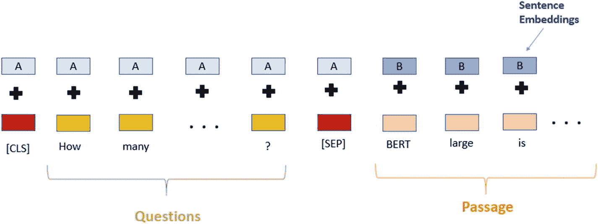

**图 5-1** BERT 输入表示

接下来，我们将问题和段落的组合嵌入表示作为输入传递给 `BERT` 模型。然后，`BERT` 的最后一个隐藏层将被修改，并使用 `softmax` 为输入文本句子上的起始和结束索引生成概率分布，该分布定义了一个子字符串，即答案，如图 5-2 所示。

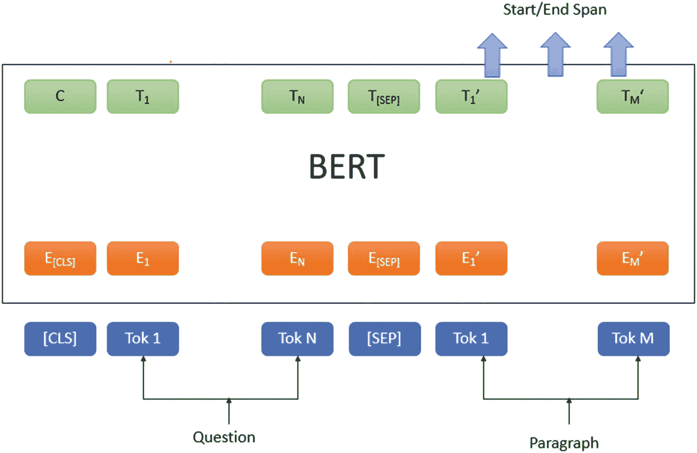

**图 5-2** 问答系统的 BERT 架构

至此，我们已经讨论了 `BERT` 如何处理输入的问题和段落。接下来，我们将看到如何在 Python 中使用 `BERT` 实现一个问答系统。

请按照以下步骤安装基于 `BERT` 的问答系统所需的先决条件。其中许多与第 4 章中的示例相同，但为了完整性而包含在内，以确保您可以运行本章中的示例。

1.  确保您的系统上已安装 Python。打开命令提示符并运行以下命令以确定是否安装了 Python，如图 5-3 所示。

    `python`

    

    **图 5-3** Python 控制台

    这将在命令提示符下打开您的 Python 控制台。如果您的系统上未安装 Python，请根据您的操作系统从 [`https://www.python.org/downloads/`](https://www.python.org/downloads/) 下载并安装。

2.  接下来，安装我们将用于编码的 Jupyter Notebook。打开命令提示符并运行以下命令。

    ```
    pip install notebook
    ```

    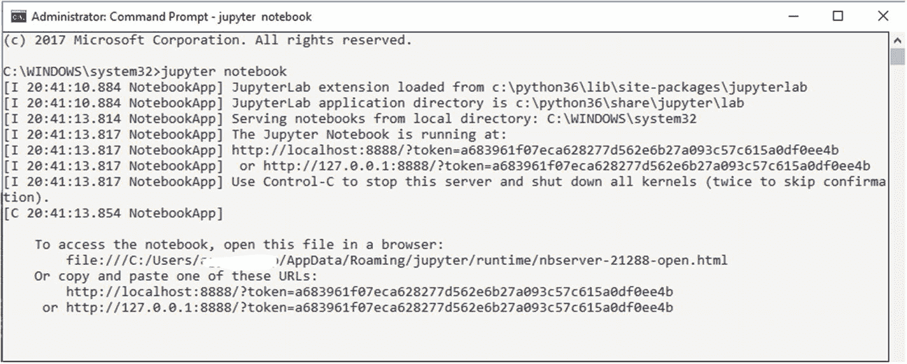

    **图 5-4** Jupyter Notebook 控制台

3.  打开命令提示符并运行以下命令以运行 Jupyter Notebook。

    `jupyter notebook`

    Notebook 将在您的默认浏览器中打开，主机地址为 `localhost`，端口号为 `8888`，并附带一个唯一的令牌 ID。现在，您可以按照后续步骤开始编写代码，如图 5-4 所示。

    

    **图 5-5** 用于创建或导入 Notebook 的 Google Colab 界面

4.  您也可以使用 Google Colab Notebook 达到相同目的。如果您的系统没有足够的可用资源，它提供了一个快速且免费的环境来运行您的 Python 代码。您还可以在 Google Colab 中免费使用 GPU 和 TPU，但时间有限（12 小时）。您只需要一个 Google 帐户即可登录 Google Colab Notebook。本书将使用 Google Colab Notebook 来演示使用 `BERT` 的问答系统。登录您的 Google 帐户并点击 [`https://colab.research.google.com`](https://colab.research.google.com)。您将看到如图 5-5 所示的屏幕。

    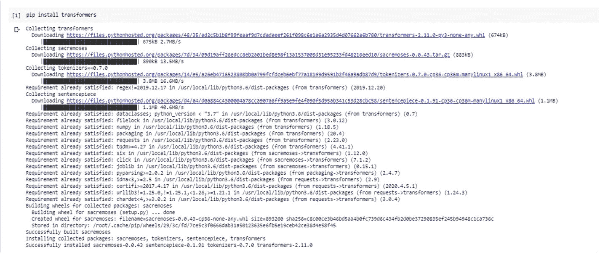

    **图 5-6** 安装 transformers 库

5.  要创建一个新的 Colab Notebook，请点击右下角的 **新建笔记本**，如图 5-5 所示。

6.  从 Huggingface 安装 `transformers` 库。在您的 Jupyter Notebook 或 Colab Notebook 中运行以下命令。

    `pip install transformers`

7.  成功安装 `transformers` 库后，您应该能够看到如图 5-6 所示的输出。

接下来，我们将继续使用 `BERT` 实现问答系统。随附的代码片段将为问答系统提供逐步解释。

1.  导入 `transformers` 库的 `BertQuestionAnswering` 和 `BertTokenizer` 类，如下所示。

    ```
    from transformers import BertForQuestionAnswering
    from transformers import BertTokenizer
    import torch
    ```

2.  接下来，加载在 `SQuAD` 2.0 数据集上微调的 `BERT` 问答模型。它将是 `BERT` 的大型版本，具有 24 层、3.4 亿个参数和 1,024 的嵌入大小。除了 `BERT` 模型，我们还下载了一个训练好的模型词汇集，如下所示。

    ```
    # 加载用于问答的预训练模型
    bert_model = BertForQuestionAnswering.from_pretrained('bert-large-uncased-whole-word-masking-finetuned-squad')
    # 加载词汇表
    bert_tokenizer = BertTokenizer.from_pretrained('bert-large-uncased-whole-word-masking-finetuned-squad')
    ```

    **注意**：这需要几分钟时间，具体取决于您的互联网带宽，因为模型大小约为 1.34 GB。

3.  接下来，它需要一个问题和候选段落上下文，其中存在问题的答案。您可以使用任何搜索引擎或文档索引系统（如 Apache Solr 或 Watson Discovery Service (WDS)）来查找候选段落。这些系统将为用户提出的问题提供上下文段落。

4.  然后，问题连同上下文段落将被传递给问答系统，首先会根据下载的词汇表对它们进行分词。如前所述，它们将使用特殊字符 `[SEP]` 标记连接在一起，如下所示（参考文本取自维基百科文章）。

    ```
    question = "Where was the Football League founded?"
    reference_text = " In 1888, The Football League was founded in England, becoming the first of many professional football competitions. During the 20th century, several of the various kinds of football grew to become some of the most popular team sports in the world."
    # 对输入文本执行分词
    input_ids = bert_tokenizer.encode(question, reference_text)
    input_tokens = bert_tokenizer.convert_ids_to_tokens(input_ids)
    ```

5.  接下来，我们需要使用分段嵌入将它们连接起来，以区分问题和上下文段落。问题的分段嵌入将被添加到问题的标记向量中，上下文段落的分段嵌入也是如此。这应该在将其用作 `BERT` 模型的输入之前完成。这些添加由 `transformers` 库内部管理，但我们需要为每个标记提供布尔值（`0` 或 `1`）以进行区分，如下所示。

    ```
    # 查找 [SEP] 标记首次出现的位置
    sep_location = input_ids.index(bert_tokenizer.sep_token_id)
    first_seg_len, second_seg_len = sep_location+1, len(input_ids)-(sep_location+1)
    seg_embedding = [0]*first_seg_len + [1]*second_seg_len
    ```

6.  现在，我们可以将我们的示例传递给模型。

    ```
    # 在我们的示例上测试模型
    model_scores=bert_model(torch.tensor([input_ids]),token_type_ids=torch.tensor([seg_embedding]))
    ans_start_loc, ans_end_loc = torch.argmax(model_scores[0]), torch.argmax(model_scores[1])
    result = ' '.join(input_tokens[ans_start_loc:ans_end_loc+1])
    result = result.replace(' ##','')
    ```

7.  模型将提供上下文段落中的起始和结束索引作为答案，例如起始索引值为 `11`，结束索引值为 `18`。最终输出将使用这些索引从上下文段落中提取。

以下是完整的 Python 代码，它将问题和参考段落作为输入，并找到该问题的答案。

```
from transformers import BertForQuestionAnswering
from transformers import BertTokenizer
import torch
def get_answer_using_bert(question, reference_text):
## 加载用于问答的预训练模型
bert_model = BertForQuestionAnswering.from_pretrained('bert-large-uncased-whole-word-masking-finetuned-squad')
## 加载词汇表
bert_tokenizer = BertTokenizer.from_pretrained('bert-large-uncased-whole-word-masking-finetuned-squad')
## 对输入文本执行分词
input_ids = bert_tokenizer.encode(question, reference_text)
input_tokens = bert_tokenizer.convert_ids_to_tokens(input_ids)
## 查找 [SEP] 标记首次出现的位置
sep_location = input_ids.index(bert_tokenizer.sep_token_id)
first_seg_len, second_seg_len = sep_location+1, len(input_ids)-(sep_location+1)
seg_embedding = [0]*first_seg_len + [1]*second_seg_len
## 在我们的示例上测试模型
model_scores = bert_model(torch.tensor([input_ids]), token_type_ids=torch.tensor([seg_embedding]))
ans_start_loc, ans_end_loc = torch.argmax(model_scores[0]), torch.argmax(model_scores[1])
result = ' '.join(input_tokens[ans_start_loc:ans_end_loc+1])
result = result.replace(' ##','')
return result
if __name__ == "__main__" :
question = "Where was the Football League founded?"
reference_text = " In 1888, The Football League was founded in England, becoming the first of many professional football competitions. During the 20th century, several of the various kinds of football grew to become some of the most popular team sports in the world."
print(get_answer_using_bert(question, reference_text))
```

在 Colab Notebook 中运行此代码后，我们得到以下输出：

```
england
```

现在，我们已经了解了如何将基于 `BERT` 的问答系统用于研究目的。接下来，考虑一个场景，您需要部署此功能以供某个网站或对话系统使用，以服务于正在寻找其查询答案的最终用户。在这种情况下，您需要将 QA 系统的功能作为 REST API 发布或公开。现在，请按照以下步骤将 QA 系统的功能作为 REST API 发布。

让我们逐步了解如何在 Windows 和 Linux 服务器上为问答系统设置 REST API 和该 API 的公共 URL（如果您在私有网络内，请使用 `ngrok` 生成公共 URL）。


### 针对 Windows Server

**前提条件：** 系统需安装 `Python 3.6.x` 和 `Pip`。

#### 创建 REST API

**1. 安装 Flask-RESTful**

`Flask-RESTful` 是微框架 `Flask` 的一个扩展，用于构建 REST API。

如需安装，请在 Windows 命令提示符下运行以下命令，如图 5-7 所示。

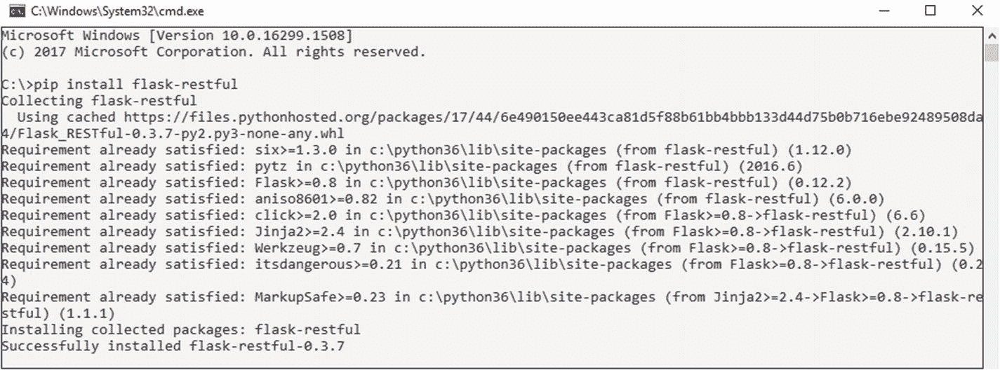

图 5-7 安装 Flask-RESTful

```
pip install flask-restful
```

此命令将安装该包及其所有依赖项。

**2. 构建 REST API**

RESTful API 使用 HTTP 请求来获取（GET）和提交（POST）数据。

首先创建一个 `QuestionAnswering.py` 文件，该文件将包含您从 GitHub 下载的问答代码。

**3. 部署 Flask REST API**

使用 `Flask` 部署 REST API 服务，并在 Windows 命令提示符下运行以下命令，如图 5-8 所示。

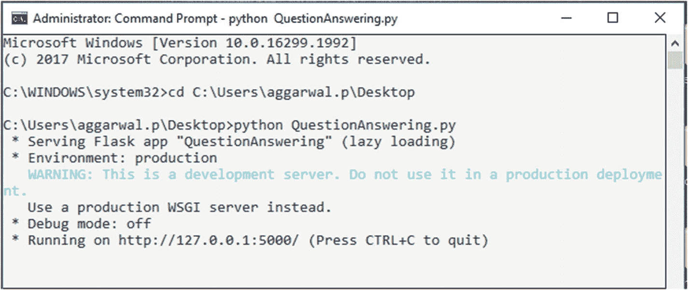

图 5-8 服务部署

```
python QuestionAnswering.py
```

**4. REST API 的响应**

现在，该服务已托管在 URL `http://127.0.0.1:5000/getResponse` 上。我们希望问答系统的功能能够公开访问。因此，我们将使用 `ngrok` 来生成一个与之前配置的本地 URL 相对应的公共 URL。

让我们来看看使用 `ngrok` 生成公共 URL 的步骤。


图 5-9 令牌生成

1. 要配置 `ngrok`，请从 `https://ngrok.com/download` 下载它。
2. 只有在 `https://ngrok.com/signup` 注册后，从 `https://dashboard.ngrok.com` 下载身份验证令牌时，公共 URL 才可用。
3. 必须将身份验证令牌指定给 `ngrok`，以便客户端与此帐户关联。`ngrok` 将身份验证令牌保存在 `~/.ngrok2/ngrok.yml` 中，因此无需重复上述步骤。
4. 解压下载的 `ngrok` 文件夹并运行 `ngrok.exe` 应用程序。
5. 从命令中提到的用户帐户复制身份验证令牌，并在 `ngrok` 终端提示符下运行此命令，如图 5-9 所示。

```
"ngrok authtoken "
```

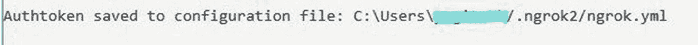

图 5-10 ngrok 配置

6. 上一步之后，身份验证令牌会保存到配置文件中，如图 5-10 所示。

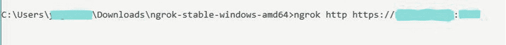

图 5-11 生成公共 URL

7. `ngrok` 是一个命令行应用程序，因此请在此终端提示符下输入 `ngrok http https://<IP>:<PORT>` 来暴露 HTTPS URL。这里的 IP 和端口设置对应于问答 API 的主机和端口，即 API 所托管的位置，如图 5-11 所示。

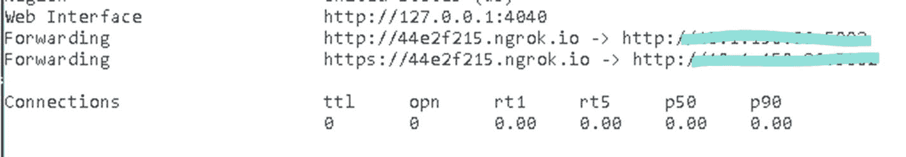

图 5-12 公共 URL

8. 命令执行后将打开一个新终端，其中会显示与本地服务器 URL 相对应的公共 URL `https://44e2f215.ngrok.io`，如图 5-12 所示。

现在，您可以使用图 5-12 中高亮显示的 URL。也就是说，`<URL>/getResponse Flask` 适用于开发环境，但不适用于生产环境。对于生产环境，API 应托管在 Apache 服务器上。请参考以下 URL，了解如何在 Windows 的 Apache 服务器上部署服务。

```
https://medium.com/@madumalt/flask-app-deployment-in-windows-apache-server-mod-wsgi-82e1cfeeb2ed
```

### 针对 Linux Server

**前提条件：** 系统需安装 `Python 3.6.x` 和 `Pip`。


#### 创建 REST API

**1. 安装 Flask-RESTful**

要安装，请在 Linux Shell 中运行以下命令，如图 5-13 所示。

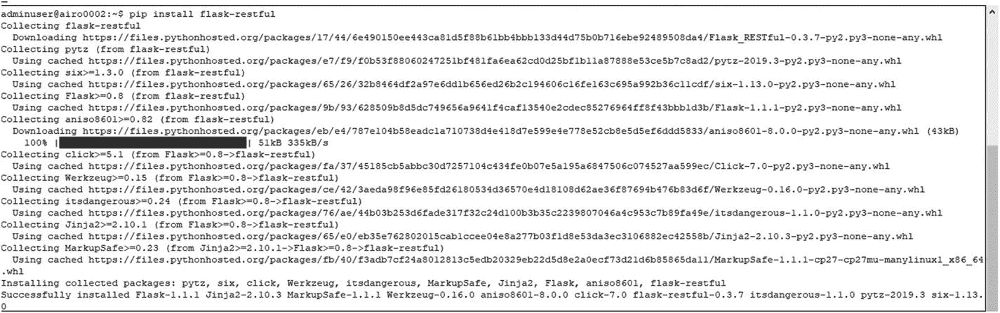

图 5-13 安装 `flask-restful`

```
$ pip install flask-restful
```

这将安装该包及其依赖项。

**2. 构建 REST API**

创建一个 `QuestionAnswering.py` 文件，该文件将包含你从 GitHub 下载的问答系统代码。

**3. 部署 Flask REST API**

要使用 Flask 部署 REST API 服务，请在 Linux Shell 中运行以下命令，如图 5-14 所示。

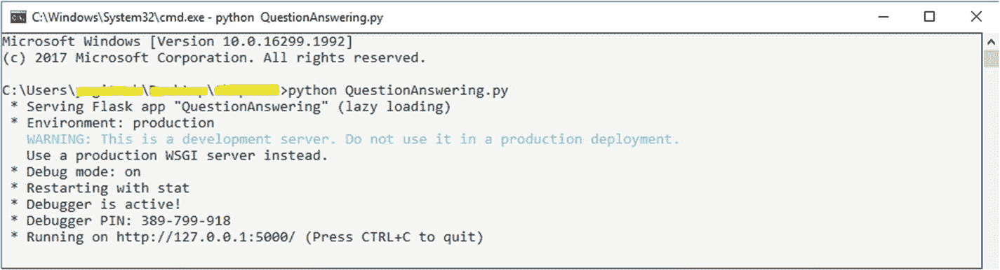

图 5-14 服务部署

```
$ python QuestionAnswering.py
```

**4. REST API 的响应**

现在，该服务已托管在 URL `http://127.0.0.1:5000/getResponse` 上。因为我们希望问答系统的功能可以公开访问，所以我们使用 `ngrok` 来生成一个与我们之前配置的本地 URL 相对应的公共 URL。

让我们看看使用 `ngrok` 生成公共 URL 的步骤。

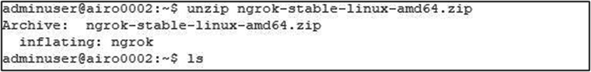

图 5-15 解压 `ngrok`

1.  要暴露一个本地 HTTPS 服务器，请从 `https://bin.equinox.io/c/4VmDzA7iaHb/ngrok-stable-linux-amd64.zip` 下载适用于 Linux 服务器的 `ngrok`。
2.  只有在 `https://ngrok.com/signup` 注册后，从 `https://dashboard.ngrok.com` 下载 auth token 时，公共 URL 才可用。
3.  必须将 auth token 指定给 `ngrok`，以便客户端绑定到此账户。`ngrok` 将 auth token 保存在 `~/.ngrok2/ngrok.yml` 中，因此无需重复此步骤。
4.  要解压下载的 `ngrok` 文件，请在终端上运行以下命令，如图 5-15 所示。

```
$ unzip /path/to/ngrok.zip
```


图 5-16 `ngrok` 配置

1.  从用户账户复制 auth token 并添加到命令中。在 `ngrok` 终端提示符下运行此命令，如图 5-16 所示。

`ngrok authtoken <AUTHTOKEN>`

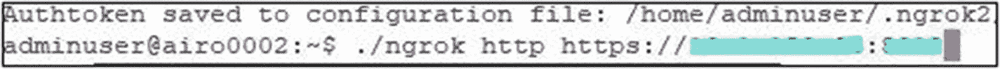

图 5-17 生成公共 URL

1.  上一步之后，auth token 将被保存到配置文件中。
2.  `ngrok` 是一个命令行应用程序，因此在此终端提示符下输入 `ngrok http https://<IP>:<PORT>` 以暴露 HTTPS URL。这里的 IP 和端口设置对应于问答 API 的主机和端口，API 托管在此主机和端口上，如图 5-17 所示。

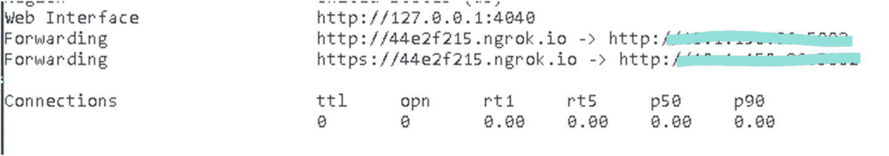

图 5-18 公共 URL

1.  命令执行后，终端将显示与本地服务器 URL 相对应的公共 URL `https://44e2f215.ngrok.io`，如图 5-18 所示。

有关更多详细信息，请参阅 `https://ngrok.com/docs` 上的 `ngrok` 文档。

现在，你可以使用图 5-18 中高亮显示的 URL。也就是说，`<URL>/getResponse Flask` 适用于开发环境，但不适用于生产环境。对于生产环境，API 应托管在 Apache 服务器上。请参考以下 URL，了解如何在 Linux 的 Apache 服务器上部署服务。

`https://www.codementor.io/abhishake/minimal-apache-configuration-for-deploying-a-flask-app-ubuntu-18-04-phu50a7ft`

按照下面给出的步骤，将问答系统的功能作为 REST API 发布。

1.  创建一个名为 `QuestionAnsweringAPI.py` 的文件。
2.  复制以下代码并粘贴到该文件中，然后保存。

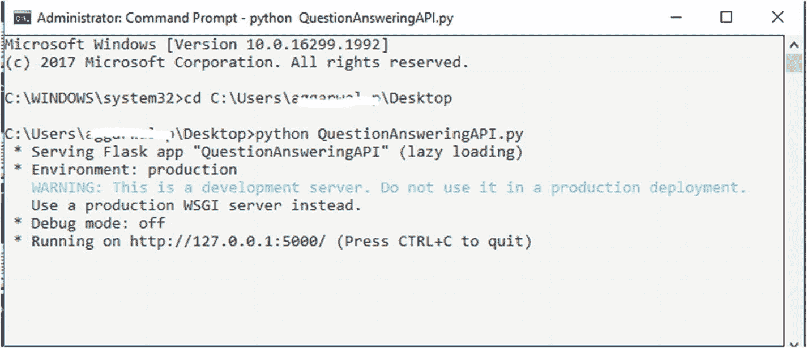

图 5-19 服务部署

1.  该代码处理传递给 API 的输入，调用函数 `get_answer_using_bert`，并将此函数的响应作为 API 响应发送。
2.  打开命令提示符并运行以下命令。

`Python QuestionAnsweringAPI.py`

这将在 `http://127.0.0.1:5000/` 上启动一个服务，如图 5-19 所示。

```
from flask import Flask, request
import json
from QuestionAnsweringSystem.QuestionAnswer import get_answer_using_bert
app=Flask(__name__)
@app.route ("/questionAnswering", methods=['POST'])
def questionAnswering():
try:
json_data = request.get_json(force=True)
query = json_data['query']
context_list = json_data['context_list']
result = []
for val in context_list:
context = val['context']
context = context.replace("\n"," ")
answer_json_final = dict()
answer = get_answer_using_bert(context, query)
answer_json_final['answer'] = answer
answer_json_final['id'] = val['id']
answer_json_final['question'] = query
result.append(answer_json_final)
result={'results':result}
result = json.dumps(result)
return result
except Exception as e:
return {"Error": str(e)}
if __name__ == "__main__" :
app.run(port="5000")
```

1.  现在，为了测试 REST API，我们将使用 Postman。这是一个 REST API 客户端，用于测试 API URL。我们可以测试任何复杂的 HTTP/s 请求，也可以读取它们的响应。首先，访问 `https://www.postman.com/downloads/` 下载 Postman 工具并将其安装到你的系统上。
2.  安装后，测试以下 URL 和示例请求 JSON（该 JSON 被发送到问答 API 端点）以及将从 API 接收到的响应 JSON，如图 5-20 所示。

**URL:** `http://127.0.0.1:5000/questionAnswering`

**问答系统示例输入请求 JSON:**

```
{
"query": "Where was the Football league founded?",
"context_list": [
{
"id": 1,
"context": "In 1888, The Football League was founded in England, becoming the first of many professional football competitions. During the 20th century, several of the various kinds of football grew to become some of the most popular team sports in the world"
}
]
}
```

**问答系统示例输出响应 JSON:**

```
{
"results": [
{
"answer": "england",
"id": 1,
"question": "Where was the Football leagure founded?"
}
]
}
```

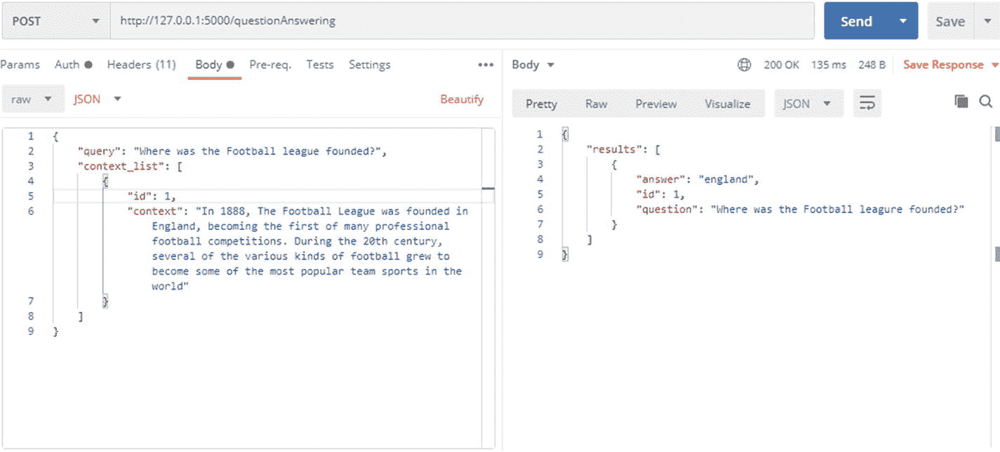

图 5-20 调用问答 API

本练习的代码库可以从 GitHub 的 `https://github.com/bertbook/Python_code/tree/master/Chapter5/QuestionAnsweringSystem` 下载。

## 开放域问答系统

ODQA 系统旨在从维基百科文章中找出任何问题的确切答案。因此，对于一个问题，该系统将提供一个相关的答案。ODQA 系统的默认实现将一批查询作为输入进行处理，并返回答案。


## 模型架构

DeepPavlov ODQA 系统的架构由两个组件构成：一个排序器和一个阅读器。为了找到任何问题的答案，排序器首先从文档集合中检索出相关文章列表，然后阅读器扫描这些文章以识别答案。

排序器组件基于 Facebook Research 提出的 DrQA 架构。具体来说，DrQA 方法使用一元-二元哈希和 TF-IDF 算法，根据问题高效地返回相关文章的子集。阅读器组件基于微软亚洲研究院提出并由 Wenxuan Zhou 实现的 R-NET 架构。R-NET 架构是一个端到端的神经网络模型，旨在根据给定的文档回答问题。R-NET 首先通过基于门控注意力的循环网络匹配问题和文档，以获得问题感知的文档表示。然后，自匹配注意力机制通过将文档与自身进行匹配来优化表示，从而有效地编码整个文档的信息。最后，指针网络定位答案在文章中的起始和结束索引。图 5-21 展示了 DeepPavlov ODQA 系统的逻辑流程。

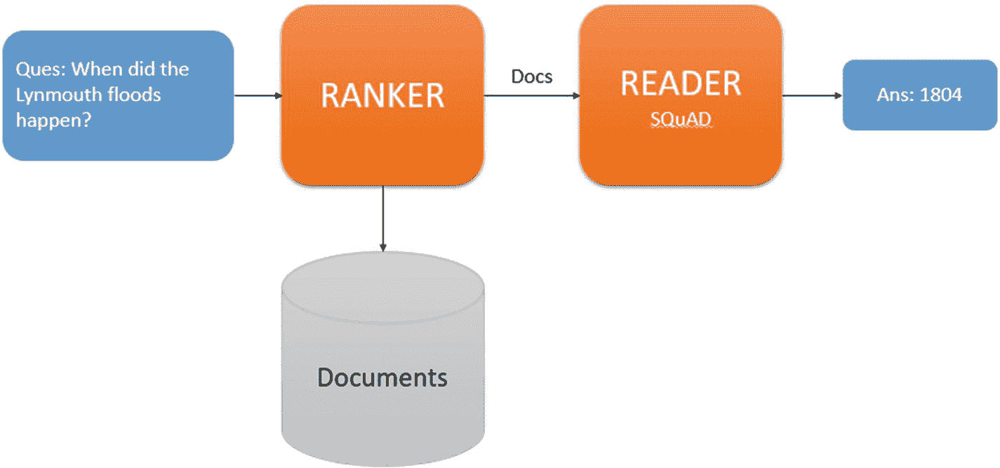

图 5-21

基于 DeepPavlov 的 ODQA 系统架构

为了将此模型用于 ODQA 系统，我们使用了 Python 中的 `deeppavlov` 库。请注意，ODQA 系统使用维基百科文章或文档的语料库。请按照以下步骤配置和使用 ODQA 系统。

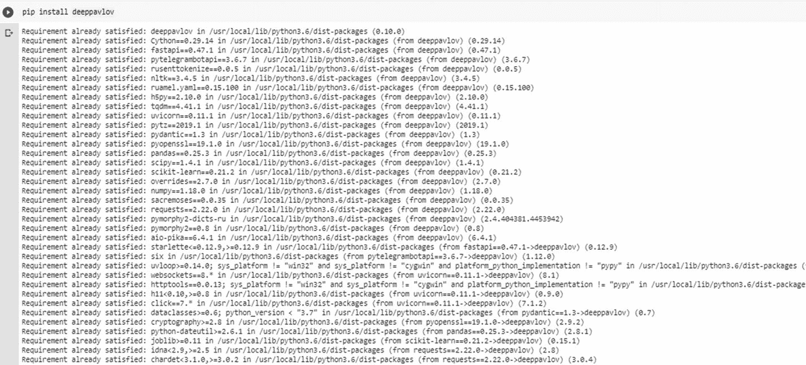

图 5-22

安装 `deeppavlov` 库

1.  创建一个新的 Jupyter notebook，并运行以下命令来安装 `deeppavlov` 库，如图 5-22 所示。

```
pip install deeppavlov
```

2.  运行以下命令来安装所有必需的模型、词汇表等，这些模型基于英文维基百科语料库训练，如图 5-23 所示。

```
! python -m deeppavlov install en_odqa_infer_wiki
```

> **注意：** 如果你使用的是 Colab Notebook，请像上面那样在安装命令前加上 `!` 符号。

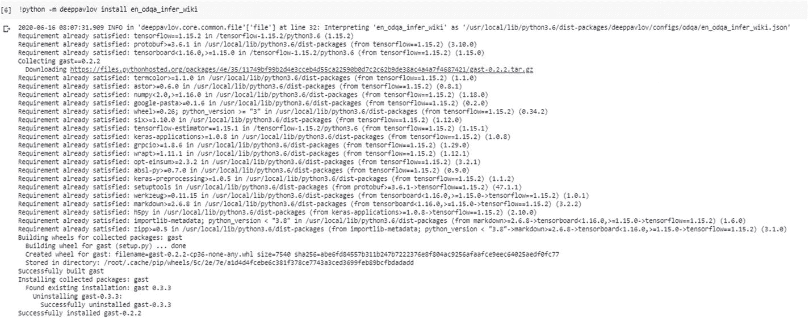

图 5-23

为 `deeppavlov` 安装所需包

3.  执行此实现所需的必要导入，如下所示。

```
from deeppavlov import configs
from deeppavlov.core.commands.infer import build_model
```

4.  然后，我们将使用 `deeppavlov` 库的 `build_model` 类获取一个 ODQA 模型。它接受两个参数：
    *   `config` 文件路径：定义包含要使用的相关 NLP 模型详细信息的 `config` 文件名称。在本例中，我们将使用 `en_odqa_infer_wiki`。此名称表示来自维基百科的 ODQA 模型。
    *   `download`：如果需要下载模型，则为 `True`，否则为 `False`。

5.  一旦 ODQA 模型加载完毕，你可以通过提供诸如“谁是维拉特·科利？”之类的问题来测试该模型，如下所示。

```
odqa = build_model(configs.odqa.en_odqa_infer_wiki, download = True)
```

```
questions = ["Where did guinea pigs originate?", "Who is virat kohli?"]
answers = odqa(questions)
```

这段代码的输出将是来自维基百科文档的问题的答案。以下是 ODQA 系统的完整代码。

```
from deeppavlov import configs
from deeppavlov.core.commands.infer import build_model
def odqa_deeppavlov(questions):
odqa = build_model(configs.odqa.en_odqa_infer_wiki, download = True)
results = odqa(questions)
return results
if __name__ == "__main__" :
questions = ["Where did guinea pigs originate?", "Who is virat kohli?"]
answers = odqa_deeppavlov(questions)
print(answers)
```

以下是输出：

```
['Andes of South America',  'Indian international cricketer who currently captains the India national team']
```

现在，我们已经了解了如何将 ODQA 系统用于研究或开发目的。接下来，考虑一个场景，你需要部署此功能以供某个网站或对话系统使用，从而为正在寻找问题答案的最终用户提供服务。在这种情况下，你需要将 ODQA 系统的功能作为 REST API 发布或暴露出来。现在，按照以下步骤将问答系统的功能作为 REST API 发布。

1.  创建一个名为 `OpenDomainQuestionAnsweringAPI` 的文件。

2.  复制以下代码并粘贴到该文件中，然后保存。

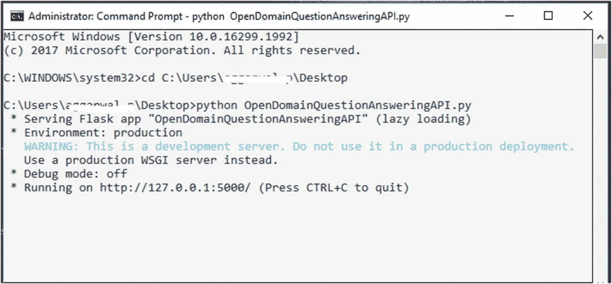

图 5-24

服务部署

3.  此代码处理传递给 API 的输入，调用 `odqa_deeppavlov` 函数，并将该函数的响应作为 API 响应发送。

4.  打开命令提示符并运行以下命令。

```
Python OpenDomainQuestionAnsweringAPI.py
```

这将在 `http://127.0.0.1:5000/` 上启动一个服务，如图 5-24 所示。

```
from flask import Flask, request
import json
from OpenDomainQuestionAnsweringSystem.OpenDomainQA import odqa_deeppavlov
app=Flask(__name__)
@route ("/opendomainquestionAnswering", methods=['POST'])
def opendomainquestionAnswering():
try:
json_data = request.get_json(force=True)
questions = json_data['questions']
answers_list = odqa_deeppavlov(questions)
index = 0
result = []
for answer in answers_list:
qa_dict = dict()
qa_dict['answer']=answer
qa_dict['question']=questions[index]
index = index+1
result.append(qa_dict)
results = {'results':result}
results = json.dumps(results)
return results
except Exception as e:
return {"Error": str(e)}
if __name__ == "__main__" :
app.run(debug=True,port="5000")
```

5.  现在，要测试此 API，可以使用 Postman。请参考以下 URL 和提供给问答 API 的示例请求 JSON，以及将从 API 接收到的响应 JSON，如图 5-25 所示。

**URL:** `http://127.0.0.1:5000/opendomainquestionAnswering`

**ODQA 系统示例输入请求 JSON：**

```
{
"questions": [
{
"question": "Where did guinea pigs originate?"
},
{
"question": "Who is virat kohli?"
}
]
}
```

**ODQA 系统示例输出响应 JSON：**

```
{
"results": [
{
"answer": "Andes of South America",
"question": "Where did guinea pigs originate?"
},
{
"answer": "Indian international cricketer who currently captains the India national team",
"question": "Who is virat kohli?"
}
]
}
```

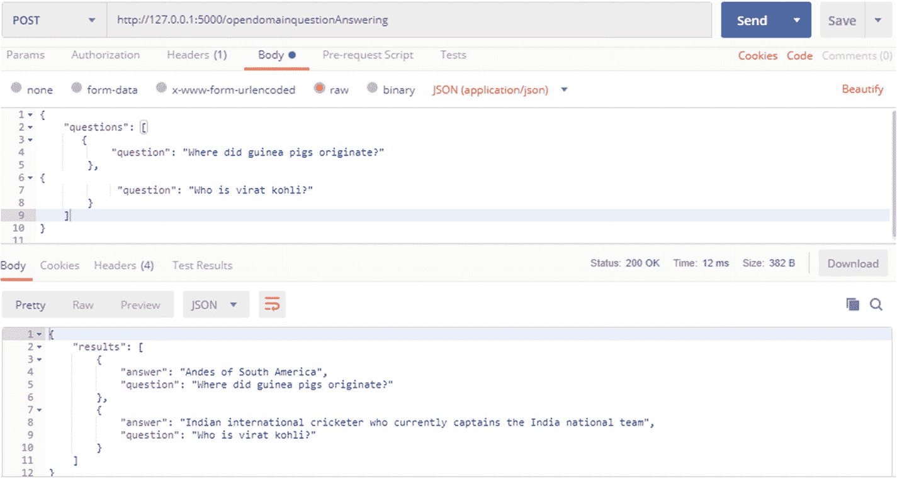

图 5-25

调用 ODQA 系统 API

本练习的代码库可以从 GitHub 的 `https://github.com/bertbook/Python_code/tree/master/Chapter5/OpenDomainQuestionAnsweringSystem` 下载。


## DeepPavlov 问答系统

在上一节中，我们讨论了如何使用在维基百科文档上训练过的 ODQA 系统来回答事实型和非事实型问题。接下来，我们将探讨如何利用 DeepPavlov 实现一个基于上下文的问答系统，该系统中问题的答案存在于给定的上下文里。例如，考虑以下来自维基百科文章的上下文和问题。

**上下文：** 1888 年，英格兰成立了足球联赛，成为众多职业足球比赛中的第一个。在 20 世纪，几种不同类型的足球运动逐渐发展成为世界上最受欢迎的团队运动之一。

**问题：** 足球联赛是哪一年成立的？

**答案：** 1888

请按照以下步骤实现一个基于上下文的问答系统。

1.  创建一个新的 Jupyter notebook，并运行以下命令来安装 `deeppavlov` 库。
2.  运行以下命令来安装所有必需的模型、词汇表等。

```
pip install deeppavlov
```

```
! python -m deeppavlov install squad_bert
```

**注意：** 如果你使用的是 Colab Notebook，请像上面那样在安装命令前加上 `!` 符号。

3.  如下所示导入所需的包。
4.  然后，我们将使用 `deeppavlov` 库的 `build_model` 类来获取 BERT 模型。它需要两个参数：
    *   **配置文件路径：** 定义包含要使用的相关 NLP 模型详细信息的 `config` 文件的名称。在本例中，我们将使用 `squad_bert`。此配置包含了在 SQuAD 数据集上训练过的特定 BERT 模型的所有详细信息。
    *   `download:` 如果需要下载模型，则此参数为 `True`，否则为 `False`。

```
from deeppavlov import configs, build_model
```

5.  一旦 BERT 模型加载完毕，你可以通过提供一个问题和上下文来提取答案，从而测试它，如下所示。

```
odqa = build_model(configs.squad.squad_bert, download = True)
```

6.  这段代码片段的输出将是从上下文中为所提问题提取的答案。

```
context = " 1888 年，英格兰成立了足球联赛，成为众多职业足球比赛中的第一个。在 20 世纪，几种不同类型的足球运动逐渐发展成为世界上最受欢迎的团队运动之一。"
question = "足球联赛是哪一年成立的？"
answers = qa_ deeppavlov (context, question)
```

以下是展示基于上下文的 CDQA 系统实现的完整 Python 代码。

```
from deeppavlov import build_model, configs
def qa_deeppavlov(question, context):
model = build_model(configs.squad.squad_bert, download=True)
result = model([context], [question])
return result [0]
if __name__=="__main__":
context = "1888 年，英格兰成立了足球联赛，成为众多职业足球比赛中的第一个。在 20 世纪，几种不同类型的足球运动逐渐发展成为世界上最受欢迎的团队运动之一。"
question = "足球联赛是哪一年成立的？"
answers = qa_deeppavlov (context, question)
print(answers)
```

以下是输出结果：

```

```

现在，我们已经了解了如何将基于上下文的问答系统（BERT 的另一种变体）用于研究或开发目的。接下来，考虑一个场景，你需要部署此功能，供某个网站或对话系统使用，以服务于正在寻找问题答案的最终用户。在这种情况下，你需要将 ODQA 系统的功能作为 REST API 发布或暴露出来。按照以下步骤将问答系统的功能作为 REST API 发布。

1.  创建一个名为 `DeepPavlovQASystemAPI` 的文件。
2.  复制以下代码并粘贴到该文件中，然后保存。
3.  此代码处理传递给 API 的输入，调用 `qa_deeppavlov` 函数，并将该函数的响应作为 API 响应发送。
4.  打开命令提示符并运行以下命令。

```
from flask import Flask, request
from DeeppavlovQASystem.QA_Deepplavlov import qa_deeppavlov
import json
app=Flask(__name__)
@app.route ("/qaDeepPavlov", methods=['POST'])
def qaDeepPavlov():
try:
json_data = request.get_json(force=True)
query = json_data['query']
context_list = json_data['context_list']
result = []
for val in context_list:
context = val['context']
context = context.replace("\n"," ")
answer_json_final = dict()
answer = qa_deeppavlov(context, query)
answer_json_final['answer'] = answer
answer_json_final['id'] = val['id']
answer_json_final['question'] = query
result.append(answer_json_final)
result = json.dumps(result)
return result
except Exception as e:
return {"Error": str(e)}
```

```
Python DeepPavlovQASystemAPI.py
```

这将在 `http://127.0.0.1:5000/` 上启动一个服务，如图 5-26 所示。

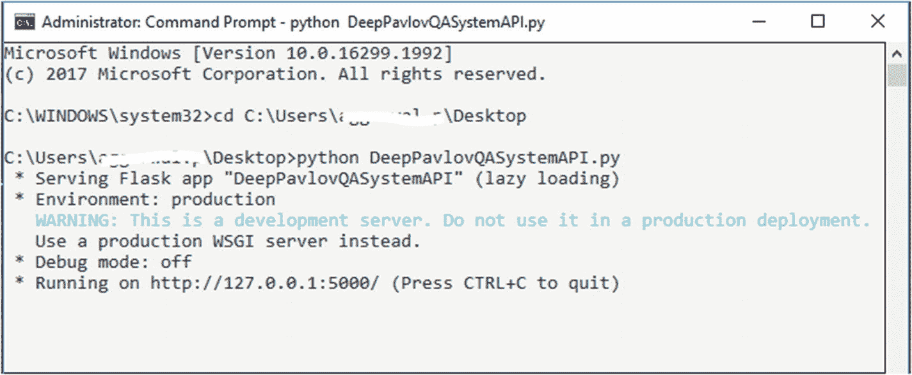

**图 5-26** 服务部署

5.  现在，要测试此 API，可以使用 Postman。请参考以下 URL 和提供给 DeepPavlov QA API 端的示例请求 JSON，以及将从 API 接收到的响应 JSON，如图 5-27 所示。

**URL：** `http://127.0.0.1:5000/qaDeepPavlov`

**DeepPavlov QA 系统示例输入请求 JSON：**

```
{
"query": "足球联赛是哪一年成立的？",
"context_list": [
{
"id": 1,
"context": "1888 年，英格兰成立了足球联赛，成为众多职业足球比赛中的第一个。在 20 世纪，几种不同类型的足球运动逐渐发展成为世界上最受欢迎的团队运动之一。"
}
]
}
```

**DeepPavlov QA 系统示例输出响应 JSON：**

```
{
"results": [
{
"answer": "1888",
"id": 1,
"question": "足球联赛是哪一年成立的？"
}
]
}
```

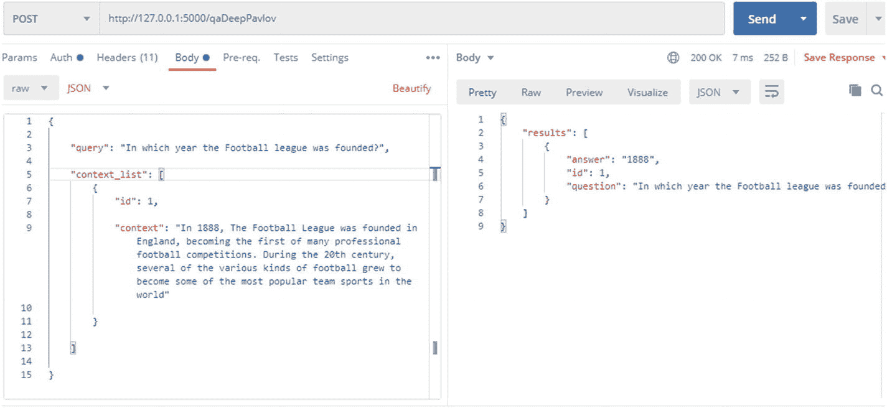

**图 5-27** 调用 DeepPavlov QA 系统 API

本练习的代码库可以从 GitHub 下载，地址为 `https://github.com/bertbook/Python_code/tree/master/Chapter5/DeeppavlovQASystem`。

## 结论

本章涵盖了问答系统，这是 BERT 模型的重要应用之一。我们了解了问答系统的类型，如 CDQA 和 ODQA。我们使用 BERT 构建了一个问答系统，并将其作为 API 部署，供第三方系统使用。在下一章中，我们将探讨 BERT 如何用于其他 NLP 任务。

