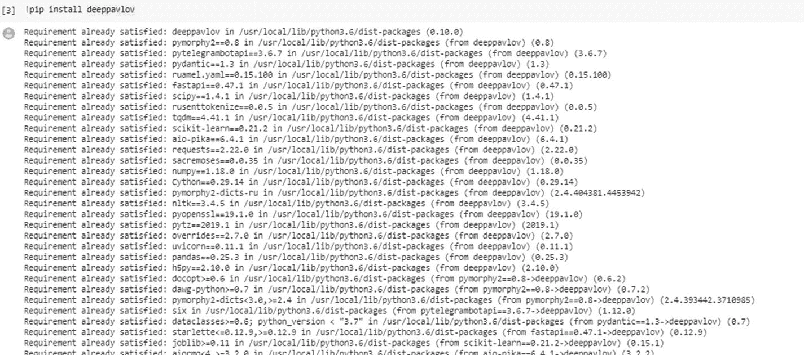
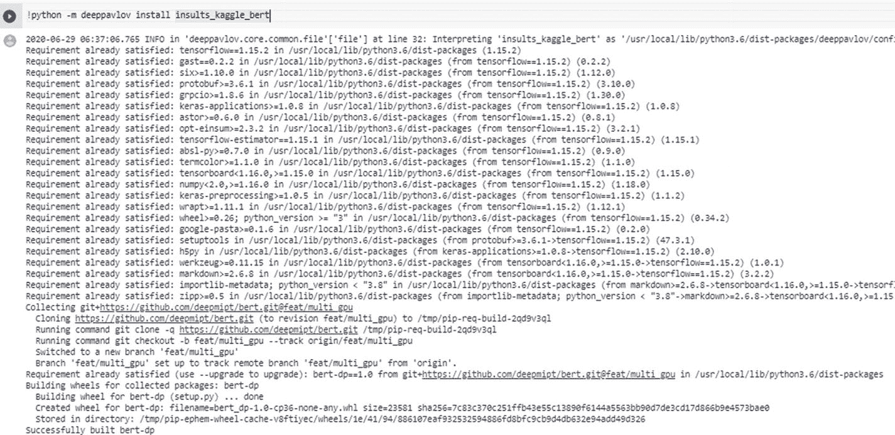
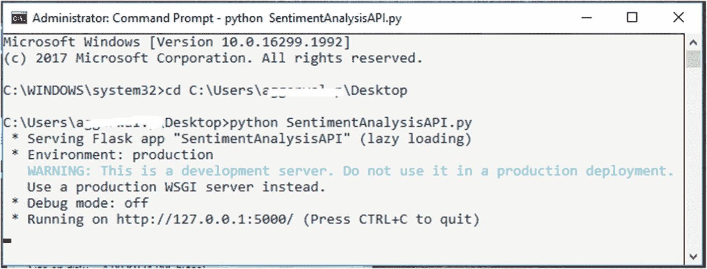
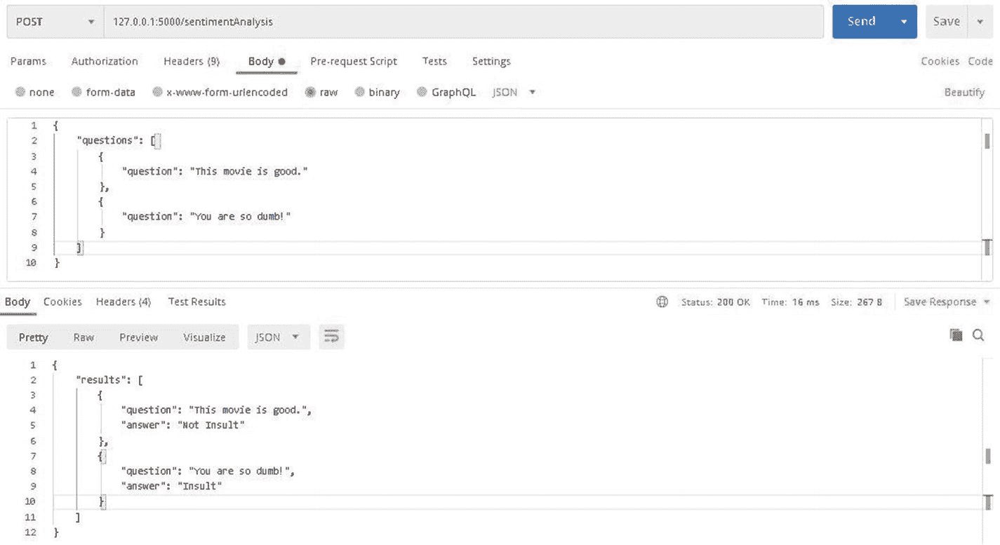
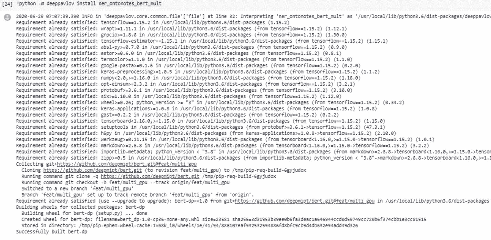
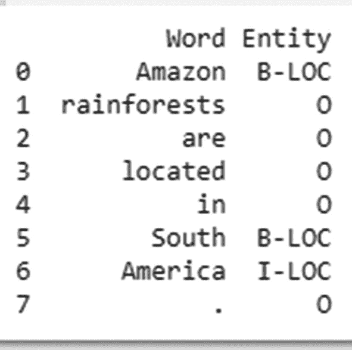
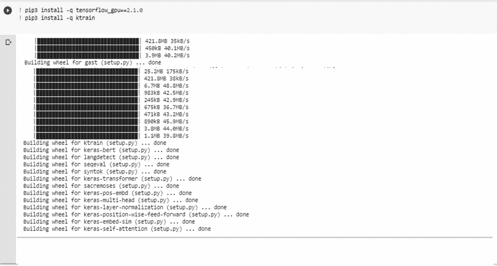
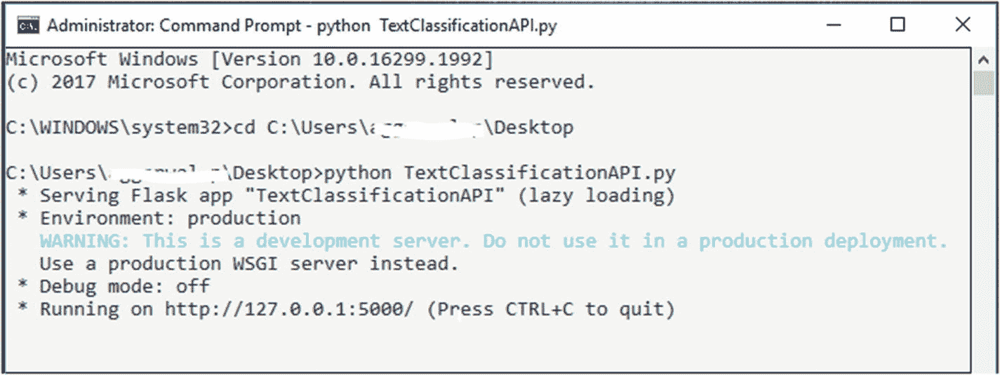
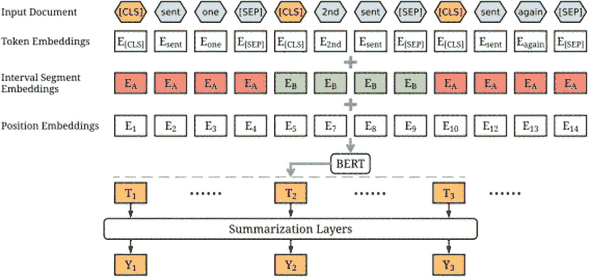
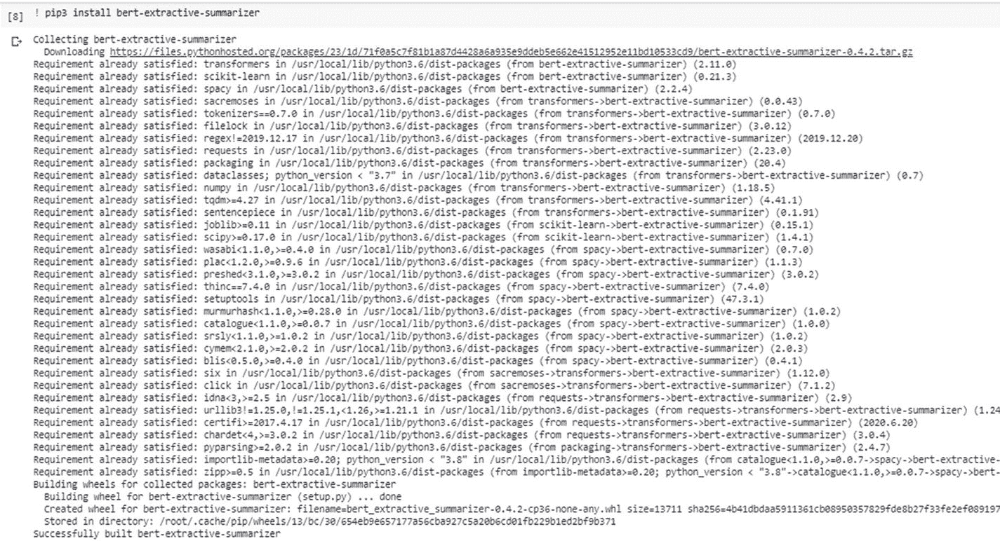

# 6. BERT 模型应用：其他任务

在上一章中，我们学习了 BERT 及其在问答系统设计中的用法。本章将讨论 BERT 如何用于实现其他 NLP 任务，例如文本分类、命名实体识别、语言翻译等。

BERT 在许多针对各种 NLP 任务的基准数据集上表现良好，例如 SQuAD（问答数据集）、Natural Questions（用于事实型和非事实型问题的问答数据集）、IMDB 电影评论数据集（分类数据）等。现在，我们将看到如何将在这些基准数据集上训练的基于 BERT 的模型用作以下 NLP 任务的预训练模型。

*   情感分析
*   命名实体识别
*   文本分类
*   文本摘要

我们将介绍这些主题，然后探讨它们的实现。

## 情感分析

情感分析是自然语言处理的一个子领域，用于识别博客、评论、新闻等文本中的观点或情感。它可以帮助企业了解其产品的接受度以及消费者对产品的态度。它同样有助于识别社交媒体上的仇恨言论和其他问题，从而判断公众对特定讨论话题的情绪。情感分析甚至可以帮助企业根据特定人口区域消费者对特定话题的看法来规划产品发布。

本书使用了一个基于 BERT 训练的情感分析模型，该模型使用`.csv`格式的数据集，其中每个数据点由一对句子及其观点（即非侮辱、侮辱）组成。在推理时，系统处理用户的查询并返回相应的情感。

请按照以下步骤实现情感分析系统。

1.  按照之前的方法创建一个新的 Jupyter 笔记本，并运行以下命令安装`deeppavlov`库（如果你在第 5 章中没有安装的话）。

```
! pip install deeppavlov
```

安装完成后，你将看到如图 6-1 所示的输出。



图 6-1 安装`deeppavlov`

2.  由于我们将使用情感分析，因此需要加载一个已在情感数据上训练好的模型。运行以下命令下载预训练模型`insults_kaggle_bert`。

```
! python -m deeppavlov install insults_kaggle_bert
```

注意：如果你使用的是 Colab 笔记本，请在安装命令前加上`!`符号，如上所示。

安装完成后，你将看到如图 6-2 所示的输出。



图 6-2 安装包

3.  使用以下命令执行此实现所需的必要导入。

```
from deeppavlov import build_model, configs
```

4.  然后，我们将使用`deeppavlov`库中的`build_model`类获取情感分析模型。它接受两个参数：

    *   **config 文件路径：** 定义包含要使用的相关 NLP 模型详细信息的`config`文件名。在本例中，我们将使用`insults_kaggle_bert`。它包含了使用情感模型所需的配置。

    *   **download：** 如果需要下载模型，则为`True`，否则为`False`。由于我们是第一次使用，此参数的值将为`True`。

```
sentiment_model = build_model(configs.classifiers.insults_kaggle_bert, download=True)
```

5.  加载情感模型后，你可以通过提问“你真笨！”、“这部电影不错”等问题来测试该模型，并将这些问题作为参数传递给`sentiment_model`函数，如下所示。

```
test_input = ['This movie is good', 'You are so dumb!']
results = sentiment_model(test_input)
```

此代码段的输出将根据所提问题返回`Not Insult`或`Insult`。以下是使用情感分析的完整端到端代码库。

```
from deeppavlov import build_model, configs

def build_sentiment_model():
    model = build_model(configs.classifiers.insults_kaggle_bert, download=True)
    return model

test_input = ['This movie is good', 'You are so dumb!']

if __name__ == "__main__":
    sentiment_model = build_sentiment_model()
    results = sentiment_model(test_input)
    print(results)
```

输出如下：

```
['Not Insult', 'Insult']
```

现在我们已经了解了如何利用基于 BERT 的情感分析系统进行研究，接下来考虑一个场景：你需要在对话系统中启用情感分析，以便系统能够根据用户的查询或回复识别用户的情感。这将帮助对话系统根据用户的情感做出响应。请按照以下步骤将情感分析系统的功能作为 REST API 发布。

1.  创建一个名为`SentimentAnalysisAPI.py`的文件。

2.  将以下代码复制并粘贴到该文件中，然后保存。

3.  此代码处理传递给 API 的输入，调用`build_sentiment_model`函数，并将该函数的响应作为 API 响应发送。

4.  打开命令提示符并运行以下命令。

```
python SentimentAnalysisAPI.py
```

```
from flask import Flask, request
import json
from SentimentAnalysis.SentimentAnalysis import build_sentiment_model

app = Flask(__name__)

@app.route("/sentimentAnalysis", methods=['POST'])
def sentimentAnalysis():
    try:
        json_data = request.get_json(force=True)
        questions = json_data['questions']
        sentiment_model = build_sentiment_model()
        questions_list = []
        for ques in questions:
            questions_list.append(ques)
        model_output = sentiment_model(questions_list)
        index = 0
        result = []
        for ans in model_output:
            sentiment_qa = dict()
            sentiment_qa['question'] = questions_list[index]
            sentiment_qa['answer'] = ans
            result.append(sentiment_qa)
        result = {'results': result}
        result = json.dumps(result)
        return result
    except Exception as e:
        return {"Error": str(e)}

if __name__ == "__main__":
    app.run(port="5000")
```



图 6-3 服务部署

-   这将在`http://127.0.0.1:5000/`上启动一个服务，如图 6-3 所示。

5.  现在，可以使用 Postman 测试 REST API。请参考图 6-4 中所示的 URL、提供给情感分析 API 的示例请求 JSON 以及从 API 接收的响应 JSON。

**URL：** `http://127.0.0.1:5000/sentimentAnalysis`

**情感分析系统示例输入请求 JSON：**

```
{
    "questions": [
        {
            "question": "This movie is good."
        },
        {
            "question": "You are so dumb!"
        }
    ]
}
```

**情感分析系统示例输出响应 JSON：**

```
{
    "results": [
        {
            "question": "This movie is good.",
            "answer": "Not Insult"
        },
        {
            "question": "You are so dumb!",
            "answer": "Insult"
        }
    ]
}
```



图 6-4 调用情感分析系统 API

本练习的代码库可以从 GitHub 下载：`https://github.com/bertbook/Python_code/tree/master/Chapter6/SentimentAnalysis`。

## 命名实体识别

命名实体识别是信息抽取的一个子领域，旨在从文本数据中提取名词或名词短语，并将其分类为人名、地名、时间、组织等类别。这主要用于将非结构化文本转换为结构化文本。实体识别在以下系统中扮演着重要角色。

*   **搜索引擎**：用于识别与用户查询相关的文档。例如，假设查询是“什么是 Microsoft Outlook？”在此查询中，“Microsoft Outlook”是一个应用类型的实体。因此，搜索引擎会给予将 Microsoft Outlook 识别为实体的文档更高的权重。

*   **对话系统**：实体在对话系统的设计中起着关键作用。对话系统利用实体来消除用户问题的歧义，特别是当问题涉及常见问题但针对不同实体时。例如，用户输入了查询“我在 Outlook 中遇到了问题。”对话系统有两个解决方案：一个针对 Outlook，另一个针对 Gmail。因为 Outlook 和 Gmail 是不同的实体，所以解决方案也不同。因此，在识别意图（即“问题”）之后，下一步就是识别实体（即“Outlook”），对话系统据此提供相应的解决方案。

存在许多用于实体识别的标注数据集。不过，在本书中，我们将演示一个使用 BERT 作为基线在 OntoNotes 数据集上训练的实体模型。该数据集包含从电话对话、新闻专线、广播新闻、广播对话和博客等多种来源收集的 1,745,000 个英文、900,000 个中文和 300,000 个阿拉伯文文本数据。

在该数据集中，实体被标注为 18 个类别，包括组织、艺术作品、数字（文字形式）、数字、数量、人物、地点、地缘政治实体、时间、日期、设施、事件、法律、国籍/宗教/政治团体、语言、货币、百分比和产品等。

在本节中，我们将探讨如何使用一个在 OntoNotes 数据集上使用 BERT 训练好的命名实体识别系统。请按照以下步骤实现一个命名实体识别系统。

1.  如前所述，创建一个新的 Jupyter notebook，并运行以下命令来安装 `deeppavlov` 库。

```
! pip install deeppavlov
```

安装完成后，您将看到类似图 6-5 的输出。


图 6-5 安装 `deeppavlov`

2.  我们将使用一个在 OntoNotes 数据上训练好的实体识别系统，如图 6-6 所示。因此，运行以下命令来下载训练好的模型 `ner_ontonotes_bert_mult`。

```
! python -m deeppavlov install ner_ontonotes_bert_mult
```

注意：如果您使用的是 Colab Notebook，请像上面那样在安装命令前加上‘!’符号。



图 6-6 安装包

3.  使用此命令执行此实现所需的必要导入。

4.  然后，我们将使用 `deeppavlov` 库的 `build_model` 类来获取一个实体模型。它接受两个参数：

    *   **配置文件路径**：定义包含要使用的相关 NLP 模型详细信息的 `config` 文件的名称。在本例中，我们将使用 `ner_ontonotes_bert_mult`。此文件包含在 OntoNotes 上训练的实体模型所需的所有配置。

    *   `download`：如果需要下载模型，则为 `True`，否则为 `False`。由于我们是第一次执行此操作，此参数的值将为 `True`。

```python
from deeppavlov import build_model, configs
```

5.  一旦实体识别模型加载完毕，你可以通过提供诸如“Amazon rainforests are located in South America.”这样的文本，并将其作为参数传递给名为`ner_model`的函数来测试该模型，如下所示。

```python
ner_model = build_model(configs.ner.ner_ontonotes_bert_mult, download=True)
```

```python
test_input = ["Amazon rainforests are located in South America."]
results = ner_model(test_input)
```

这些代码片段的输出包含单词及其标记的实体，如图 6-7 所示。



**图 6-7** 命名实体识别系统结果

以下是此实现的完整 Python 代码。

```python
from deeppavlov import build_model, configs
import pandas as pd

def build_ner_model():
    model = build_model(configs.ner.ner_ontonotes_bert_mult, download=True)
    return model

if __name__ == "__main__":
    test_input = ["Amazon rainforests are located in South America."]
    ner_model = build_ner_model()
    results = ner_model(test_input)
    results = pd.DataFrame(zip(results[0][0], results[1][0]), columns=['Word', 'Entity'])
    print(results)
```

输出是识别出的实体，如图 6-8 所示。


**图 6-8** 命名实体识别系统结果

现在我们已经了解了如何将基于 BERT 的实体识别系统用于研究目的，接下来考虑一个场景，我们需要部署此功能以供对话系统使用。对话系统通常使用实体来配置或开发用例。例如，对于“Outlook 遇到问题”这个用例，该系统可用于将“Outlook”识别为一个实体。在这种情况下，你需要按照以下步骤将实体识别系统的功能作为 REST API 发布或暴露出来。

1.  创建一个名为`NamedEntityAPI`的文件。

2.  复制以下代码并粘贴到该文件中，然后保存。

3.  此代码处理传递给 API 的输入，调用`build_ner_model`函数，并将该函数的响应作为 API 响应发送。

4.  打开命令提示符并运行以下命令。

# 文本分类

文本分类可定义为将文本分配或归类到特定类别或分类的问题。文档分类或归类、意图分类、垃圾博客检测等都属于文本分类范畴。这里的文本可以是句子、文档、博客等任何形式。文本分类利用 NLP 方法进行预处理，例如分词、停用词移除、短语提取、实体提取等。

在推理过程中，文本分类会分析文本（文档、博客或句子）并将其分配到预训练的类别中。例如，如果文档涉及政治，则属于政治类别。在某些情况下，一个文档可能属于多个类别（称为多标签分类）。例如，如果文档同时讨论政治和体育，则它将被归类到这两个类别中，即政治和体育。

本节将展示如何使用基于 BERT 在新闻组数据集上训练的文本分类系统。这里，我们将把新闻文章分类到各自的类别中。该数据集包含四个新闻文章类别：

*   `alt.atheism`

*   `soc.religion.christian`

*   `comp.graphics`

*   `sci.med`

我们将使用`ktrain`和`tensorflow_gpu`进行此实现。请注意，此实现需要在系统上安装 GPU 版本的 TensorFlow。因此，请确保您拥有支持 GPU 的系统。

1.  按照前面所述创建一个新的 Jupyter 笔记本，并运行以下命令来安装`tensorflow_gpu`和`ktrain`库。

```
! pip3 install -q tensorflow_gpu==2.1.0
!pip3 install -q ktrain
```

成功安装该包后，会显示如图 6-11 所示的输出。



图 6-11

TensorFlow 的安装

2.  导入此实现所需的包，例如来自`sklearn`的`fetch_20newsgroup`数据集和`ktrain`库，如下所示。

```
from sklearn.datasets import fetch_20newsgroups
import ktrain
```

3.  接下来，下载并检索仅包含四个类别的`fetch_20newsgroup`数据集：`alt.atheism`、`soc.religion.christian`、`comp.graphics`和`sci.med`。将它们划分为训练集和测试集，并启用随机打乱，如下所示。

```
classes = ['alt.atheism', 'soc.religion.christian','comp.graphics', 'sci.med']
train_data = fetch_20newsgroups(subset='train', categories=classes, shuffle=True, random_state=42)
test_data = fetch_20newsgroups(subset='test', categories=classes, shuffle=True, random_state=42)
```

4.  使用`ktrain.text`库中的`Transformer`类创建转换器模型的实例。它需要定义一些参数的值，如下所示。

    *   **模型名称：** 指示要使用的 BERT 模型的名称。在这种情况下，我们使用了`distillBERT`而不是 BERT 基础版。

    *   **文章长度：** 设置文章的最大长度。这里，最大长度只能是 512。如果您指定的文章长度超过 512，它将被自动截断。

    *   **类别：** 这是需要考虑进行训练的类别列表。

5.  下一步是预处理训练和测试数据，以使用`distillBERT`生成它们的文章嵌入表示。将这些数据和模型传递给`ktrain`的`get_learner`函数，以获取包含所有配置参数（例如`batch_size`、模型实例、训练数据和测试数据）的分类模型实例。

```
MODEL_NAME = 'distilbert-base-uncased'
trans = text.Transformer(MODEL_NAME, maxlen=500, classes=train_classes)
train_preprocess = trans.preprocess_train(train_features, train_labels)
val_preprocess = trans.preprocess_test(test_features, test_labels)
model_data = trans.get_classifier()
classification_model = ktrain.get_learner(model_data, train_data=train_preprocess, val_data=val_preprocess, batch_size=6)
classification_model.fit_onecycle(5e-5, 4)
```

6.  一旦分类模型训练完成，就可以在未见过的数据上测试该模型，如下所示。

```
predictor = ktrain.get_predictor(classification_model.model, preproc=trans)
input_text = 'Babies with down syndrome have an extra chromosome.'
results = predictor.predict(input_text)
```

以下是实现文本分类的完整 Python 代码。

```
from sklearn.datasets import fetch_20newsgroups
import ktrain
from ktrain import text
def preprocess_dataset():
classes = ['alt.atheism', 'soc.religion.christian','comp.graphics', 'sci.med']
train_data = fetch_20newsgroups(subset='train', categories=classess, shuffle=True, random_state=42)
test_data = fetch_20newsgroups(subset='test', categories=classes, shuffle=True, random_state=42)
return train_data.data,train_data.target, test_data.data,test_data.target,classes
def create_text_classification_model():
MODEL_NAME = 'distilbert-base-uncased'
train_features, train_labels, test_features, test_labels, train_classes =preprocess_dataset()
trans = text.Transformer(MODEL_NAME, maxlen=500, classes=train_classes)
train_preprocess = trans.preprocess_train(train_features, train_labels)
val_preprocess = trans.preprocess_test(test_features, test_labels)
model_data = trans.get_classifier()
classification_model = ktrain.get_learner(model_data, train_data=train_preprocess, val_data=val_preprocess, batch_size=6)
classification_model.fit_onecycle(5e-5, 4)
return classification_model, trans
def predict_category(classification_model, trans, input_text):
predictor = ktrain.get_predictor(classification_model.model, preproc=trans)
results = predictor.predict(input_text)
return results
if __name__ == "__main__" :
classification_model, trans = create_text_classification_model()
input_text = 'Babies with down syndrome have an extra chromosome.'
print(predict_category(classification_model, trans, input_text))
```

从以下输出可以看出，对于文本“Babies with down syndrome have an extra chromosome.”，其类别是`sci.med`。

```
sci.med
```

现在，我们已经了解了如何将基于 BERT 的文本分类系统用于研究目的。接下来，考虑一个场景，您需要部署此功能以供对话系统使用。对话系统可以将其用作意图分类或识别系统，以配置或开发用例。例如，对于“Facing an issue with Outlook”这个用例，该系统可用于将意图识别为“Issue”。在这种情况下，您需要按照以下步骤将意图分类系统的功能作为 REST API 发布或暴露出来。

1.  创建一个名为`TextClassificationAPI`的文件。

2.  复制以下代码并粘贴到该文件中，然后保存。

```python
from flask import Flask, request
import json
from TextClassification.TextClassification import create_text_classification_model, predict_category
from TextClassification import create_text_classification_model

app = Flask(__name__)
result = {}

@app.route("/textClassification", methods=['POST'])
def textClassification():
    try:
        json_data = request.get_json(force=True)
        input_text = json_data['query']
        classification_model, trans = create_text_classification_model()
        category = predict_category(classification_model, trans, input_text)
        result = {}
        result['query'] = input_text
        result['category'] = category
        result = json.dumps(result)
        return result
    except Exception as e:
        error = {"Error": str(e)}
        error = json.dumps(error)
        return error

if __name__ == "__main__":
    app.run(port="5000")
```

3.  这段代码处理传递给 API 的输入，调用`create_text_classification_model`函数，并将该函数的响应作为 API 响应发送出去。

4.  打开命令提示符并运行以下命令。

```bash
python TextClassificationAPI.py
```

这将在[`http://127.0.0.1:5000/`](http://127.0.0.1:5000/)上启动一个服务，如图 6-12 所示。



**图 6-12** 服务部署

5.  现在，要测试 REST API，可以使用 Postman，如第 5 章所述。请参考以下 URL 和提供给文本分类 API 的示例请求 JSON，以及将从 API 接收到的响应 JSON，如图 6-13 所示。

**URL:** [`http://127.0.0.1:5000/textClassification`](http://127.0.0.1:5000/textClassification)

**文本分类系统示例输入请求 JSON：**

```json
{
"query": "患有唐氏综合症的婴儿多了一条染色体。"
}
```

**文本分类系统示例输出响应 JSON：**

```markdown
# 文本摘要

文本摘要是一个利用 NLP 和 NLU 从文档中生成或提取摘要，同时保留文档原始含义的过程。换句话说，摘要应与文档内容高度相似。此功能在搜索引擎系统中非常流行，系统向用户呈现文档时，通常也会包含文档摘要，而非整个文档文本。文档摘要可以是单文档摘要或多文档摘要。文本摘要问题可分为两类：

*   **抽取式摘要**：在抽取式摘要中，生成的摘要句子仅来自文档本身，不会对摘要中的句子进行任何修改。这也可以定义为根据句子与文档主题的相关性对句子进行重新排列。诸如 TF-IDF、余弦相似度、基于图的方法、实体提取、分词等多种方法已被积极用于开发文档摘要系统。

*   **生成式摘要**：在生成式摘要中，生成的摘要句子并非文档中的原始句子。这些句子将根据文档中使用的语言语义进行修改。各种基于神经网络的方法，如 LSTM、GRU 等，已被用于实现此功能。

在本节中，我们将讨论如何使用 BERT 生成文档摘要。BERT 提出了一种名为 BERTSUM 的新架构，用于从文档生成摘要。与往常一样，BERT 用于生成多个句子的嵌入，其中标记`[CLS]`插入在第一个句子的开头之前，后续句子由标记`[SEP]`分隔。接着，添加分段嵌入和位置嵌入以区分不同句子。然后，这些句子向量通过摘要层，以选择用于摘要的代表性句子。在摘要层中，任何神经网络都可以构建摘要。图 6-14 展示了文档摘要模型的架构。



**图 6-14** BERTSUM 模型的架构

现在，让我们看看如何利用基于 BERT 的抽取式文档摘要模型。我们使用`bert-extractive-summarizer`（Python 中抽取式文档摘要的实现之一）来进行演示。

1.  按照之前的方法创建一个新的 Jupyter 笔记本，并运行以下命令来安装`bert-extractive-summarizer`。

```bash
! pip3 install bert-extractive-summarizer
```

成功安装该包后，将显示如图 6-15 所示的输出。



**图 6-15** 安装包

2.  使用以下命令导入此实现所需的包，例如从 Summarizer 库中导入`summarizer`。

该库实现了 HuggingFace PyTorch transformers 来运行抽取式摘要。其工作原理是生成句子的嵌入，然后使用聚类算法（如基于密度的算法等）将最接近质心的句子聚类，形成高密度区域。将选取来自最高密度区域的句子来构成摘要。接下来，创建一个`Summarizer`实例，如下所示。

```python
from summarizer import Summarizer
```

3.  将文档内容作为参数传递给刚刚创建的`Summarizer`实例，如下所示。

```python
text_summarization_model = Summarizer()
```

```python
return text_summarization_model()
```

这将返回文档的摘要。以下是使用 BERT 执行文档摘要的完整 Python 代码。

```python
from summarizer import Summarizer

def text_summary(text):
    model = Summarizer()
    return model(text)

if __name__ == '__main__':
    text = "Machine learning (ML) is the study of computer algorithms that improve automatically through experience. It is seen as a subset of artificial intelligence. Machine learning algorithms build a mathematical model based on sample data, known as \"training data\", in order to make predictions or decisions without being explicitly programmed to do so. Machine learning algorithms are used in a wide variety of applications, such as email filtering and computer vision, where it is difficult or infeasible to develop conventional algorithms to perform the needed tasks."
    print(text_summary(text))
```

此示例中的文本片段摘自维基百科上关于机器学习的文章。

以下是生成的输出结果：

```
Machine learning (ML) is the study of computer algorithms that improve automatically through experience. It is seen as a subset of artificial intelligence.
```

该输出展示了文档的摘要，并且摘要中的所有句子均来自文档本身。文档可以是任意长度（例如，100 页或 200 页），而 REST API 无法在单次 API 调用中接收如此大量的数据。因此，作为最佳实践，文档摘要系统应仅用作后端应用程序或系统，并配合一个父系统（如搜索引擎）使用，其中作为搜索结果一部分返回的每个文档都应同时包含文档摘要。

本练习的代码库可从 GitHub 下载，地址为：[`https://github.com/bertbook/Python_code/tree/master/Chapter6/TextSummarization`](https://github.com/bertbook/Python_code/tree/master/Chapter6/TextSummarization)。

## 结论

本章涵盖了 BERT 在各类 NLP 任务中的适用性，例如情感分析、文本分类、实体识别和文档摘要。我们利用基于 BERT 的模型构建了基于 NLP 的系统。在下一章中，我们将讨论 BERT 领域的最新研究进展。
```