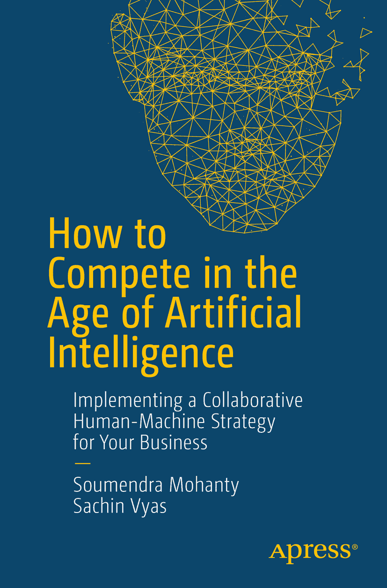

ISBN 978-1-4842-3807-3 e-ISBN 978-1-4842-3808-0 [`doi.org/10.1007/978-1-4842-3808-0`](https://doi.org/10.1007/978-1-4842-3808-0)  
美国国会图书馆控制号：2018958917  
© 索门德拉·莫汉蒂、萨钦·维亚斯 2018  
本作品受版权保护。出版商保留所有权利，无论涉及材料的全部或部分，具体包括翻译、重印、重用插图、朗诵、广播、以缩微胶卷或任何其他物理方式复制，以及电子改编、计算机软件或目前已知或今后开发的类似或不同方法的传输或信息存储与检索。  
本书中可能出现商标名称、标识和图像。我们仅在编辑风格中使用这些名称、标识和图像，以维护商标所有者的利益，并无意侵犯商标权，而非在每次出现商标名称、标识或图像时都使用商标符号。  
本出版物中使用的商品名称、商标、服务标志及类似术语，即使未明确标识，也不应被视为对其是否受专有权利保护的立场表达。  
尽管本书中的建议和信息在出版时被认为是真实准确的，但作者、编辑和出版商均不对可能存在的任何错误或遗漏承担法律责任。出版商对本书所含内容不作任何明示或暗示的担保。  
本书由施普林格科学与商业媒体纽约公司（地址：233 Spring Street, 6th Floor, New York, NY 10013）在全球图书贸易中发行。电话：1-800-SPRINGER，传真：(201) 348-4505，电子邮件：`orders-ny@springer-sbm.com`，或访问 `www.springeronline.com`。  
Apress Media, LLC 是一家加利福尼亚有限责任公司，其唯一成员（所有者）是施普林格科学与商业媒体金融公司（SSBM Finance Inc）。SSBM Finance Inc 是一家特拉华州公司。

