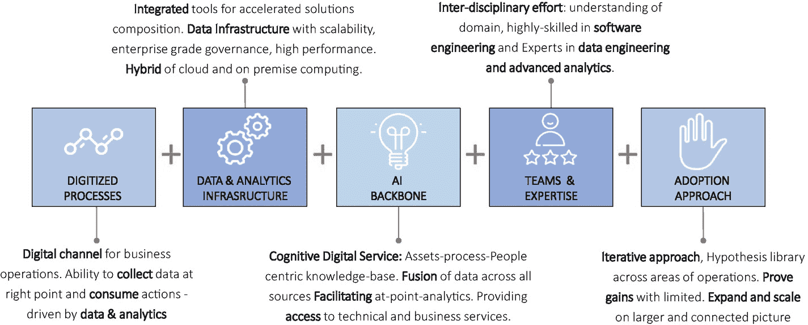

# 3. 董事会致 CEO：“你的 AI 战略是什么？”

尊敬的 CEO，人工智能既是您最大的威胁，也是您最大的机遇，那么您的 AI 战略是什么？

对许多 CEO 而言，这个问题是一个巨大的挑战。AI 这个话题涉及面广、被过度炒作且呈指数级发展，让人不知从何入手。您有哪些选择？

-   您可以收购一家专注于运用 AI/ML 解决业务问题的创新科技公司，从而获得新产品、服务以及 AI/ML 人才。

-   您可以投资几家早期阶段的 AI 初创公司，以便了解这个快速发展的技术领域中的创新动态。

-   您可以批准资金，用于建设内部 AI 能力，并设立一个集中的 AI 卓越中心，开始探索如何优化内部流程，以及如何将 AI 整合到您的产品、服务和解决方案中。这个选项耗时较长，您需要具备远见卓识、资金承诺，以及吸引和留住顶尖 AI/ML 人才的目标感。

-   您可以借助外部咨询和服务公司，填补现有业务和 IT 团队的缺口，从而启动相关工作。

这些选项绝非相互排斥。相反，您需要为您的 AI 战略保持开放的心态——构建/购买/合作/共同创新都是可选方案——但您也需要衡量/学习/试验，然后筛选出哪些对您的公司有效，哪些无效。

虽然这些选项可能为您制定和执行 AI 战略提供一些初步思路，但事情远不止于此。您如何为未知做好准备？

现在，回到最初的问题——您的 AI 战略是什么？为了找到答案，我们首先将讨论董事会为何提出这个问题。然后，我们将讨论一个简化 AI 的概念框架，以便您能向董事会给出深思熟虑的回应。最后，我们将讨论作为 CEO，您应如何让团队参与 AI 议题，以及在制定 AI 战略时的重要考量。

## CEO：“董事会为何要问我这个问题？”

那么，董事会为何现在问您这个问题？AI 既不是对当前 IT 系统和方法的渐进式调整，也不是购买智能能力和平台并将其纳入企业。AI 带来了巨大的变革能力，贯穿整个企业，影响所有层级的角色。这可能会让大多数高管（甚至经验丰富的 IT 专家）感到不安。

看看十年前发生了什么！那家 DVD 租赁公司、销售 CD 的音乐公司、实体旅行社和公司、日报、连锁书店，当时都经营良好，前景光明，未来多年盈利可期。互联网的出现改变了一切。基于电子商务的便捷购物成了一种生活方式，而根基稳固的企业则失去了相关性。

如今，企业正面临类似的转折点。AI 正将我们带入未知领域。AI 帮助机器进行对话、驾驶汽车、在危险条件下从事体力劳动、执行精细手术、预测我们的购物意向、诊断健康状况、管理金融交易、提供安全保障等等。AI 无处不在。总的来说，这关系到我们自己的工作、我们的企业以及生活质量。为了有效驾驭这片新领域，企业高管需要理解并考虑一个由五部分组成的 AI 行动计划。

### 应用“没有免费午餐”法则

“没有免费午餐”法则指出，你无法同时兼得——你的 AI 无法同时擅长通用智能和狭义智能。不要被你在媒体上看到的内容冲昏头脑（例如谷歌、亚马逊、苹果、微软、特斯拉等公司投资开发通用 AI）。你必须专注于识别和解决那些对你的业务和你所在市场而言具体的问题。你的战略机遇就在其中。

### 拥抱开放与透明

理解并承认你无法独自完成所有事情至关重要，因此协作与共享是关键。成千上万的初创公司和其他机构正在尝试解决一些非常独特的空白领域问题。这些解决方案和想法目前可能不会颠覆你的市场；然而，它们可能很快就会成为现实。从战略上讲，你最好的选择是与初创公司、学术界以及各类 AI 实验室共同构建一个包容性的生态系统，并开始利用这股势头，针对你的特定市场和客户开发专有能力。

### 评估互联世界中的机遇

世界正变得越来越互联——从固定传感器到手机、无人机、智能可穿戴设备以及高度对话式的个人助理。这些边缘系统被赋予了看、听、理解和反应的能力，无论你身处实体环境还是高度数字化的环境，都创造了巨大的机遇。自然地，当你能够有效利用这些互联设备并推出独特的商业模式时，最大的 AI 价值创造机会就会出现。

这是你应该进入的市场吗？

### 聚焦增强智能

我们距离创造类人的自主智能还很遥远，因此最好专注于那些能够开发增强智能产品的领域，无论是供内部使用还是外部消费。

随着 AI 驱动的自动化开始影响知识工作者相关的技能，批判性地评估你的企业技能规划方法将变得至关重要。与其采取保守的方法来保护工作岗位，你需要评估并做出一些艰难的决定，以确保你的人力资本保持相关性（如何在人机融合的场景中共存），并在各自的业务流程中向价值链上游移动。

### 关注伦理与网络安全

AI 提供了一种一致且客观的问题解决方法。即便如此，它也无法免受偏见的影响。已有多个案例显示 AI 输出结果明显带有偏见。因此，你必须密切关注 AI 引发的伦理、法律和社会问题。

## CEO：“我该如何回应？”

让我们从定义 AI *不是* 什么开始。这是必要的，因为媒体对 AI 的报道往往缺乏深思熟虑，且常常夸大其词。

### AI 不是机器与人类的对立

过去几年，围绕 AI 的猜测甚嚣尘上：人类将被机器取代。这是描绘企业 AI 图景的完全错误方式。正确的愿景是我们如何利用 AI 来增强人类能力，去做我们以前从未想象过的事情。即使是近期媒体对谷歌 DeepMind/AlphaGo 战胜李世石的报道，也被戏剧化地描述为机器获得超级智能，并在人类发明的游戏中击败了人类。一个更现实的描述可能是“从众多人类经验中学习的机器击败了一个单独的人类”。

机器拥有人类不具备的优势：速度、可重复性、一致性、可扩展性和更低的成本。人类拥有机器不具备的优势：推理、经验、适应性以及处理广泛任务的能力。明智的做法是找到正确的方式将人类与机器融合，而不是用机器取代人类。

## 人工智能并非总关乎最优算法

对许多人而言，AI 与算法这两个术语含义相同且同等重要。最优算法能带来最佳预测。Facebook 拥有最优的新闻推送算法；Netflix 拥有最佳的电影推荐算法；而 Google 则拥有最好的广告投放算法。

究竟是算法胜过数据，还是数据胜过算法，这场争论仍在继续，但显而易见的是，算法是 AI 的必要组成部分，却并非唯一组成部分。

许多顶尖 AI 专家如今认为，大量数据配合简单算法，其效果可能优于少量数据配合复杂算法。从收集、清洗和理解数据中获得的收益，远超过分依赖花哨的算法。然而，重要的并非数据数量，而是数据质量。海量数据是一把双刃剑。有时，你拥有的数据足够多，以至于即使采用最低效的方法，答案也清晰可见，即便存在大量噪声。但另一些时候，庞大的数据量本身就需要巧妙的算法才能从中提取出有意义的信息。

图 3-1 总结了企业级 AI 的若干构建模块。前两个模块与数据和基础设施相关；中间模块完全关乎算法；最后两个模块则涉及新技能、AI 解决方案的采纳以及反馈循环。

**图 3-1** 企业级 AI 的构建模块

因此，这引出了我们对企业级 AI 的一个工作定义：

`AI = 训练数据 + 机器学习 + 反馈循环`

如果 AI 要成为企业的飞轮，那么这是 CEO 需要理解的最重要的等式。让我们结合一个具体的问题陈述，来看看这个等式的各个组成部分。

假设你想做两件事：1) 提升服务水平，2) 优化资源以消除重复性活动。你希望应用你的 AI 解决方案，不仅能自动按严重级别对支持工单进行分类，还能创建一个智能知识库，使你能够进行事件关联、预测工单量，并在 100% 确信的情况下自动修复问题。

### 训练数据

训练数据包含任何能够帮助你解决所面临问题的数据（结构化、非结构化、半结构化、图像、语音和视频）。如果你试图用 AI 改进或自动化的业务流程已经是数字化的，那么完成该流程所需的数据可能已经可用。如果部分数据已被标记，即数据带有某些可用于正确分类结果的指标，那么你就处于一个良好的起点，可以开始训练你的机器学习算法了。在我们这个例子中，如果我们拥有的数据除了包含支持工单的信息外，还有一个指示“严重级别”的指标，那么我们就称该数据集为已标记数据。

### 机器学习

机器学习无非是数据的一种数学表示，旨在帮助你得到一个可应用于新输入的预测模型。在我们的例子中，这意味着通过观察大量的支持工单，你找出能够正确确定服务水平的模式。一旦你基于训练数据构建了模型，你就可以将模型应用于新的支持工单（尚未标记），以将工单分类到正确的服务水平类别中。当然，这个过程并非一蹴而就。你需要在各种各样的支持工单上训练你的算法。你必须持续监控算法的表现（有多少假阳性，有多少假阴性）。你必须对算法的错误预测进行惩罚，因为这可能导致在实时系统中应用错误的修复，从而带来潜在的灾难性后果。你获得的数据质量越高，对算法的优化就越深入，实现的预测能力也就越强。

为了实现高精度的预测，你必须持续努力获取多样化的数据集，包括流程图、系统行为、用户在系统中的操作路径、可能的根本原因、能够修复各种系统问题的大量脚本库、故障排除技巧和窍门，以及任何其他能使你的算法受益的信息。这个多样化的数据集，如果得到妥善整理和维护，将成为你企业的智能知识库。

与人类相比，算法的一个优势在于它能真实反映自身的置信水平。人类往往对自己的推理能力和判断过度自信，而且这种自信因人而异。两名支持工程师查看同一个支持工单，如果仅凭个人判断，很少会得出相同的结论，除非他们必须遵循一份详细到令人发指的标准操作流程。相比之下，算法的预测（无论对错）始终是一致的。

### 反馈循环

当算法开始基于数据进行训练时，它们是从零经验开始的。它们对数据深处隐藏的模式一无所知。它们可以做出预测，但需要有人来验证这些预测。这正是人类经验发挥作用的地方——通过提供反馈、审查，有时甚至推翻机器的预测。这是该等式中关键的第三个组成部分。

到目前为止，我们一直在强调预测技术将如何推动更自动化的决策制定，但同时我们也在强调反馈循环的重要性，以及人类经验与参与在学习过程中的重要性。这些观点难道不是相互矛盾的吗？可能存在算法“卡壳”的情况。原因可能有很多——它看到的新数据与学习过程中接触到的数据完全不同，例如，某些罕见或低频的场景是它第一次遇到，而这些场景在训练数据中并不存在。此时，机器会客观地评估数据并做出预测，从机器的角度来看这些预测非常准确，但它并不了解嵌入业务流程和应用程序中的众多业务规则。这就是为什么人类参与学习过程极其重要的主要原因。除非机器的预测得到验证，否则它永远无法达到让你几乎可以自动化整个决策过程的置信水平。

## CEO：“我该如何让我的领导团队参与进来？”

既然你已经了解了如何将 AI 框架应用于你的业务，那么是时候开始让你的高级领导团队参与进来了。是时候制定战略并推行一种混合模式了，这种模式利用机器的速度和规模来处理定义明确但可重复的任务，而人类则负责处理更高层次的判断任务。

### 关注成果，而非技术

首先，要用对高管们来说至关重要的**成果**语言来沟通，而不是伴随任何颠覆性新技术而来的技术术语。

与领导团队沟通的一个好方法是提出几个问题：

-   我们可以在哪些方面融入响应能力和预测能力，以更好地提供客户体验、更快地推出新产品，或提高我们自身的运营效率？

-   我们目前正在做的哪些活动可以更快、更好、更便宜地以自动化方式完成？

-   有哪些我们想做，但因各种限制（成本、资源或技术）而无法做到的新事情？

-   有哪些事情我们得知得太晚，以至于无法及时采取行动？

-   有哪些事情是我们本应预见到可能发生的——无论是好是坏？

例如，负责客户服务的高级副总裁担心“首次解决率”呈下降趋势。负责销售的总裁则担忧“交叉销售/向上销售”效果下滑，并将其归咎于糟糕的客户服务体验。负责产品战略的副总裁渴望了解市场脉搏，但却无法做到，因为我们缺乏收集和分析相关社交媒体数据、搜索查询数据和品牌资产数据的手段。没有这些数据，你就无法真正了解客户在寻找什么、在谈论什么。

### 解释人工智能

一旦你确定了高管们关心的成果，你就可以阐明人工智能如何帮助业务实现其目标。这时，我们对人工智能的工作定义就会派上用场。

例如，你的产品战略副总裁和首席营销官渴望了解客户脉搏，以便设计更好的产品、开展有效的营销活动并赢得更多市场份额。要实现这一点，你需要人工智能能力来大规模收集和分析社交媒体数据，并进行情感分析。

现在，让我们逐步解析人工智能的工作定义：人工智能 = 训练数据 + 机器学习 + 反馈循环：

**训练数据**。你需要各种类型的数据：来自 Twitter 上相关 `#hashtags` 和 `@mentions` 的推文，以及围绕你公司、品牌和产品体验的 Facebook 讨论。最重要的是，你需要了解人们对竞品的评价、其他与竞争对手策略相关的公开数据，以及任何有望提供更好客户体验或使你的产品过时的创新。这些数据大多是流式且实时的，因此你需要弄清楚如何以及在何处存储所有这些数据，以及存储多长时间。这些数据初始质量不高，也未经标记，因此你必须定义一个流程来清洗数据、过滤噪音、定义你想要使用的情感量表，并安排一些领域专家协助进行标记。

**机器学习**。现在到了讨论算法的时候了。利用你拥有的经过整理的数据集，你需要定义想要进行哪种类型的预测。有几种预测类型与你试图解决的问题相关：

-   *分类*：查看你收集的情感数据，你需要开发诸如“正面情感”或“负面情感”之类的案例。分类算法将帮助你扫描海量数据，得出结果类别。

-   *分割*：如果你的意图是识别出那些表达了正面情感且最有可能对你的报价做出回应的人群，那么聚类算法就会派上用场。

-   *回归*：如果你的意图是得出一个潜在的数字（可能是收入增长，或你能按市场/地区销售的产品数量），那么你需要应用回归算法。

-   *预测技术*：如果你想了解隐藏在数据中的各种时间、季节或其他外部影响，并希望创建预测（可能是关于营销活动对销售的影响），你需要求助于预测算法。

还有许多其他算法变体在发挥作用，包括深度学习和神经网络。然而，为了简洁和简单起见，我们这里只举了简单算法的例子。

**反馈循环**。无论你的算法多么出色，你都必须让预测结果具有可操作性。人们开始使用预测建议的唯一方法是，他们理解输出的原因和方式。简而言之，你的算法不能像一个黑箱。输出需要是可解释的，并且人们需要有验证输出的灵活性，从而帮助改进和丰富预测能力。

一旦你的高管们明白这并非完全是机器主导的方式，他们就会更加欣赏人工智能如何在企业中增强人类技能。

### 评估人工智能平台

企业 IT 环境中充斥着众多为业务应用和 IT 管理应用提供支持的供应商产品，这并不奇怪。企业 IT 架构师和企业标准组的自然反应是减少 IT 环境中的熵。这意味着引入工具和技术，以及另一轮漫长的评估、商业谈判、合同和认证流程。管理供应商风险和保护企业免受供应商锁定是每位 IT 领导者的首要议程。人工智能作为一项新兴且快速发展的技术，也有其自身的技术架构和组件（无论是在本地还是在云端）。具有挑战性的是，即使是经验丰富的 IT 领导者也难以阐明这项技术的发展方向。

你的 IT 领导者需要帮助，以便专注于相关的内容（供应商已经对其人工智能平台能力做出了许多夸大其词），而不是陷入无休止的供应商评估阶段。你当然应该寻求首席信息官/首席技术官同事的支持，对市场上可用的工具进行广泛评估。你还应该要求他们对初创公司进行分析，了解他们试图实现的目标，很多时候与初创公司合作的方法可以奏效。这对你来说商业成本较低，并且能激励你的团队，因为他们将接触到前沿技术和创新理念。

以下三个因素值得特别关注，特别是对于那些声称提供人工智能解决方案的供应商。

### 单一领域与通用平台

一些供应商深入到了某个特定领域（例如制药临床试验、零售多渠道的超个性化、金融犯罪场景中的欺诈检测）。一些供应商选择专注于技术能力（物联网、图像识别、自然语言处理和深度学习），而其他许多供应商则选择构建通用平台（你可以输入任何类型的数据，通过使用流行的机器学习技术生成洞察，并通过多种消费渠道分发你的洞察）。这些供应商不一定专门研究人工智能的某个子领域，如文本、图像、音频、视频、深度学习等。

很难说哪种方法比另一种更好。这完全取决于你要解决的问题类型。然而，与其“看菜下饭”（为多个用例选择他们认为合适的多种工具），企业的自然选择是合理化他们管理的供应商数量，因此会略微偏向于通用平台，如果（这是一个很大的“如果”）该通用平台能够满足不同职能部门的业务需求的话。

### 黑盒与白盒

算法也有自己的“态度”。有些算法简单、默默完成任务且易于解释（如`决策树`、`线性回归`、`逻辑回归`、`朴素贝叶斯`等）。而另一些算法（尤其是基于神经网络的新一代算法）则复杂、多功能且极难理解。其中许多算法甚至无法向构建它们的数据科学家解释其结果，更不用说向最终用户解释了。它们像黑盒一样运作，你无法真正审视算法是如何完成其任务的。最近的几个例子——比如`Google Photo`将一张黑人夫妇的图片错误标记为大猩猩，以及`亚马逊`的图书销售机器人相互竞价，直到一本书的价格超过 2300 万美元——在我们心中造成了信任问题。

我们所说的解释机器学习算法，究竟是什么意思？对于从算法中获得的预测，我们通常假设算法已经做好了功课，使用了所有正确的推理过程，而我们基本上是在要求算法足够透明，以便我们能够看到它得出预测所采用的推理过程。

为你的组织选择黑盒还是白盒是一个重要的决策。任何人都有显而易见的理由选择白盒方法，但这也伴随着一些影响。为了使其透明而过多地干预算法的内部运作，可能会使算法运行缓慢，并因过多的人工干预（即使是针对简单的预测相关问题）而在你的自动化决策过程中造成瓶颈。

### 单点解决方案与集成平台

商业上可行的人工智能平台需要三个关键组件——训练数据、机器学习以及反馈回路——实现集成。只要你获得了这三项能力，就应该没问题。一些供应商专注于某些功能，例如连接到任何类型的数据源和系统（包括设备），然后提供一个完全开放的画布供你进行机器学习。这可以通过使用`R`和`Python`等编程密集型语言，或利用`Azure ML`、`Spark ML`、`AWS ML`等拖放式功能来实现。其他供应商则主要通过`Spark`、`Scala`和`Python`专注于数据工程方面，然后将机器学习部分留给你选择的技术来完成。

如何推进，取决于你的选择。

## CEO 的新管理原则：AI 管理

说到底，每位 CEO 都希望留下自己的遗产。这意味着什么？这关乎领导、激励员工，并打造一个面向未来的企业。因此，他们自然不喜欢将关键业务决策委托给智能算法，也不喜欢让巧妙的代码来推荐管理建议。在我们这个时代一些最成功的公司（谷歌、亚马逊、阿里巴巴和 Facebook）中，算法正越来越多地扮演着决策角色——从董事会到销售和市场，再到运营和人才招聘。CEO 们应该在其最佳实践中增加一条管理原则——赋能算法。精英 MBAI（AI 管理）正逐渐成为新常态。

这是一个棘手的情况，因为走得太远，把所有事情都交给算法来管理，会在公司内部引发不安；而算法应用不足则已不再是可选方案。因此，需要在有才华的人类和精英 MBAI 之间取得恰当的平衡。另一个重要问题是明确界定权力和责任的界限——共存与授权的“是什么”、“怎么做”以及“为什么”。CEO 们需要建立一个类似于`RACI`矩阵（`负责`、`问责`、`咨询`、`知情`）的框架，清晰地阐明谁负责做什么，以及何时有才华的人类必须遵从算法的判断，何时算法必须寻求人类的验证。

“不安全感”是让人机协作的整个场景更难实施的另一个方面。那些曾对（比如说）自动化一个复杂的业务流程以改善供应链功能或某个效率极低的特定区域运营表现出热情和承诺的领导者，在面对深度学习算法来指导他们的商业战略、新市场开拓和资本支出规划的前景时，会畏缩不前。算法成功的后果比失败的风险更让他们感到恐惧。

例如，你的数据科学团队与来自采购和供应链部门的领域专家合作，开发了一个算法。根据所有指标和模拟，该算法已证明可以节省数亿美元，并使你的公司能够比现有的批处理流程快 10 倍地响应市场动态。你为什么不信任这个出色的人工智能解决方案呢？挑战就在这里。

当计算机变得无处不在，信息技术成为业务支柱时，CEO 们任命了`CIO`和`CTO`来帮助公司组织其技术版图、信息管理架构和业务应用。随着技术的成熟，特别是当每项业务都变得数字化时，CEO 们任命了`CDO`（首席数字官）来实施和管理公司的数字战略。现在，是时候对人工智能在公司未来准备中可能发挥的变革性作用说同样的话了。CEO 们应该认真考虑任命一位`CAIO`（首席人工智能官）。

人工智能仍在成熟过程中，因此可以合理地接受，并非所有高管层成员都能完全理解人工智能在企业环境中的益处和影响。但请想一想，如果你的公司从事产品/服务业务，并处理大量数据（无论是内部还是外部，这并不重要），那么人工智能很有可能被用来将这些数据转化为价值。拥有数据但缺乏深度人工智能知识的公司，就像你之前任命`CIO`/`CTO`一样，现在需要任命一位首席人工智能官。如果你已经有一位首席数字官或首席数据官，或者你有一位具有前瞻性思维的 CIO，你可以扩展他们的职责范围，让他们也负责人工智能领域。

## 企业人工智能战略

较为成熟的组织会设立首席数据官，并配备集中化的数据科学职能，但更常见的模式似乎是分散化模式，即数据科学家分散在组织内不同职能部门中。

在分散化模式下，同一家公司内数据科学家的技能水平必然参差不齐。有些人拥有先进的机器学习背景，而另一些人则是从软件工程师或数据分析师转型为数据科学家的。那些掌握先进机器学习技能的人，可能不会满足于“黑箱”方法——即算法运作方式不透明，且无法微调参数权重。在考虑仅提供黑箱解决方案时，请牢记这一点。

`AI` 本身并非产品或业务单元；它是一种基础技术，能够助力现有业务线，并创造新产品或业务线。因此，要成功将 `AI` 引入企业，需要深刻理解当前业务，并与不同业务单元或职能团队协作。你需要一位能展现创业精神的领导者。随着 `AI` 的快速发展，你的团队需要跟上变化。他们是否处于 `AI` 的最前沿并不那么重要，重要的是选择一条演进路径。你的数据科学家、数据工程师和高管团队需要跨职能协作，并具备商业技能，以找出如何开发和实施与企业和业务目标相关的 `AI` 解决方案。

首席 `AI` 官需要具备良好的 `AI` 技术理解力，熟悉公司的数据基础设施，必须有能力跨业务职能和高管层进行协作，最重要的是，要有足够的信誉来吸引和留住 `AI` 人才。

## CEO 使命：普及 AI

CEO 的 `AI` 战略中另一个最重要的方面是，让 `AI` 技术在整个组织中广泛可用，尤其是对那些在管理和运营业务职能方面经验丰富，但在利用最新技术进行决策时却感到迷茫的人。这可以称为“`AI` 的普及化”。为实现这一目标，公司需要做几件事：开发自己的 `AI` 平台，跨业务职能开展广泛的设计思维研讨会，并对员工进行再培训，让他们理解预测技术如何运作，以及如何在日益人机共融的世界中与之共存。

从长远来看，你的员工将获得足够的接触和专业知识，开始开发自己的 `AI` 应用程序，以更快、更好、更便宜地完成工作。例如，你的营销团队将能够将自然语言处理组件与其他组件连接起来，创建一个用于收集和分析社交媒体非结构化数据的应用。或者，你的销售团队将能够分析庞大的客户数据集，预测哪些潜在客户最有可能转化为实际客户，或发现关于客户行为的洞察，改进不同产品和服务的设计，从而提高交叉销售/追加销售的能力。

`AI` 的普及化还将让你的生态系统合作伙伴能够共同构建平台，带来强大的协作能力和简化的流程编排，从而打破组织边界。想想电子表格如何帮助普及数据分析，甚至让夫妻店也能进行宝贵的“假设”分析。

显然，“`AI` 的普及化”是所有企业为创造可持续竞争优势而必须采取的战略举措。

## 结论

`AI` 是一个长期趋势，将影响我们家庭和工作的方方面面。我们正在走向一个巨大的语义网世界，万物互联。纯粹从算法规范的角度来说，我们的位置是一个属性，我们的情感是一个属性，我们的面部表情是一个属性，我们的声音也是一个属性。云、移动、社交媒体、大数据、`AI` 以及现在的区块链的超级融合，使企业能够在消费者对消费者和企业对企业的领域，积极探索、创新并推出颠覆性的商业模式和超智能产品。在此背景下，董事会向 CEO 询问 `AI` 战略是恰如其分的。企业 `AI` 关乎构建、部署和管理智能交互系统，而不仅仅是实现手工工作的自动化。因此，作为 CEO，你的任务已经明确。你需要有一个清晰的愿景：

1.  **将 `AI` 确立为一项业务能力**：`AI` 太重要了，不能只停留在少数实验、一次性的 `AI` 概念验证或由 IT 团队开发专业知识上。关键不在于发布一份年度报告，像许多其他公司那样声称你正在探索 `AI`。CEO 应该问：`AI` 能带来哪些可能性？

2.  **在公司内部普及 `AI`**：渐进主义无法变革公司。采用“点与泡”的类比，来确定公司应如何对待 `AI` 用例，不仅要在市场上实现差异化，还要在公司内部普及 `AI`。

3.  **采用快速失败、快速学习的方法**：采用 `10/10/10` 方法：用 10 小时确定用例，用 10 天构建数据管道，用 10 周上线 `AI` 能力。CEO 必须鼓励学习和实验的文化。这需要一种敏捷的方法，在 90 天内从概念走向能力。

4.  **将 `AI` 项目作为自上而下的举措来推动和管理**：领导层必须将 `AI` 视为一项由高层推动的业务要务，而不是由底层驱动的技术知识探索和实验型项目。

5.  **构建生态系统以充分利用**：六大技术的超融合意味着公司需要一个合作伙伴生态系统来应对所有关键技术。

如果你的董事会没有问你这个问题怎么办？如果你的董事会不关心公司的 `AI` 战略，以推动新的商业模式或新产品和服务，也许你需要考虑更换董事会成员！在这个快速变化的商业和市场环境中，没有第二次机会。你绝对需要你的董事会理解并发挥关键作用，质疑你的战略、技术投资以及员工再培训计划——这些是公司未来所依赖的。

在下一章中，我们将讨论 `AI` 的基础知识（`AI` 的一些技术层面）以及尽管其优势明显，但仍存在的相关疑虑。