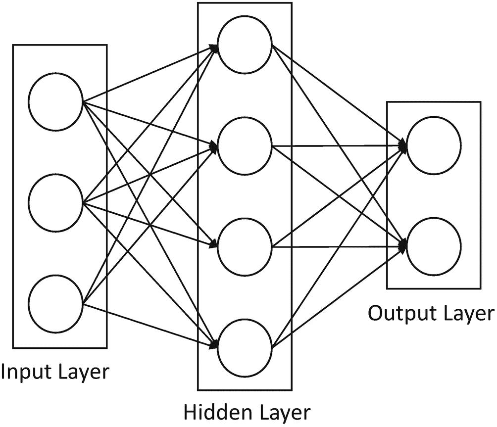
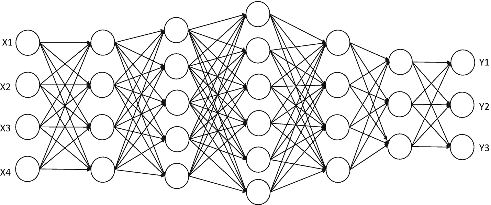
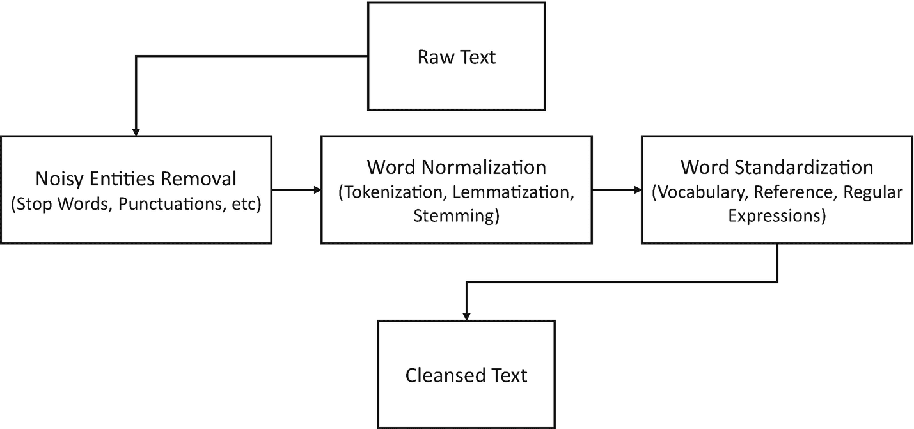
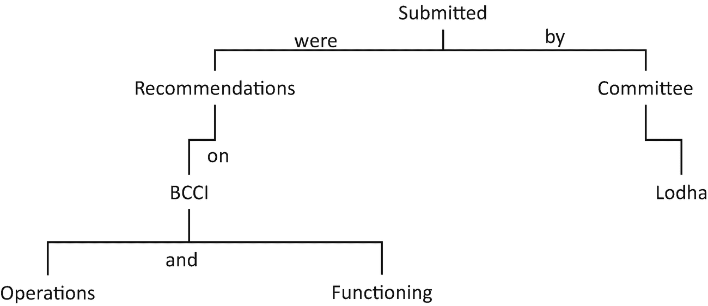

# 4. 黑箱之内：理解人工智能的决策过程

人工智能仅通过从数据中学习，无需人类大量参与解释具体如何完成任务，就能不断提升预测能力，这意义重大。为什么？

有两个原因。首先，我们的大脑虽然处理着大量信息，但无法精确解释自己是如何进行推理、区分事物、适应环境变化，并利用经验解决从未遇到过的问题。在人工智能出现之前，我们试图接近人类思维水平的尝试，涉及复杂的“如果-那么-否则”式程序来解决问题。这种方法既不可扩展，也无法适应条件变化。

其次，人工智能系统是出色的学习者。它们从数据中学习，从人类进行的验证中学习，并在因错误预测而受到惩罚时学习。赋予人工智能这类学习能力几乎不需要编写多少代码。

“人工智能”一词暗示着一台能够推理的机器。更完整的人工智能特征列表如下：

-   *推理*：通过逻辑演绎解决问题的能力
-   *知识*：表示关于世界知识的能力
-   *规划*：设定并实现目标的能力
-   *沟通*：理解书面和口头语言的能力
-   *感知*：通过视觉、声音和其他感官输入与世界互动的能力

根据解决问题的能力，人工智能主要分为三大类。

## 弱人工智能（ANI）

也被称为“弱人工智能”，因为其问题定义范围狭窄。击败国际象棋世界冠军的人工智能就是 ANI 的一个例子。它非常擅长下棋，但这是它唯一能做的事。如果你让这个国际象棋人工智能专家为你提供从 A 点到 B 点的驾驶路线，它会茫然地看着你。可能有另一个人工智能专家能帮你提供驾驶路线，但它无法帮你下棋。

你可以想象，ANI 有特定的用途，其智能局限于一个领域，并且主要服务于一个或几个特定目标。这里的智能通常更被定义为独立工作的能力，而非（当前/逐步的）自我改进。

目前，我们在现实生活中使用着数百种弱人工智能。Siri、谷歌、Facebook、自动泊车和自动驾驶汽车都是运行中更复杂（智能）的弱人工智能。你也能找到更弱的人工智能，比如能根据你的位置调整时区的手表，或根据室外天气状况自动调节室内温度的系统。

以下是我们日常生活中更多 ANI 的例子：

-   现代汽车充满了 ANI 系统，从自动防滑机制，到提醒你轮胎气压突然下降，再到提示你盲区有另一辆车。另一方面，自动驾驶汽车是复杂 ANI 系统的例子，它不仅操控汽车的所有机械部件并为你驾驶，还与外部环境互动，代表你做出决策——何时停车、何时保持安全距离、何时变道等。

-   你的智能手机包含许多弱人工智能解决方案，从推荐购物的应用程序，到提供从 A 点到 B 点的实时驾驶路线，到获取天气更新，到播放你喜欢的音乐列表，到与你的手机进行对话，以及许多其他组织你日常活动的应用程序。

-   Microsoft Outlook 或 Google 的 Gmail 是智能的 ANI。它们预装了专门分类垃圾邮件和非垃圾邮件的功能。它们持续在后台运行，观察你的行为和偏好，以分类你认为重要、无用和垃圾的内容。

-   亚马逊的“购买此商品的顾客也购买了……”推荐系统是一个持续学习的 ANI 系统，它从数百万客户的购买模式中收集信息，然后将这些信息个性化，以影响你购买更多商品。

-   谷歌提供的搜索、谷歌翻译和谷歌新闻等服务，是专注于内容的复杂 ANI 系统的例子。Facebook 的信息流也是如此。

-   还有更多 ANI 系统的例子，尽管它们专门解决一个问题，但在这个领域钻研得非常深入。安全系统、自动化制造、资本市场的算法交易、帮助医生诊断的专家系统，以及最著名的 IBM Watson，它包含了足够多的精选信息，击败了最杰出的*危险边缘*冠军。

## 通用人工智能（AGI）

也被称为“强人工智能”，这是一种能够执行人类所能完成的任何智力任务的人工智能系统。我们距离创造 AGI 系统还很遥远，因为智能是一个复杂的事物，它很大程度上涉及推理、适应能力和心智能力。因此，如果 AGI 要存在，它必须做人类所做的一切——在不确定性下运用策略和做出判断，集中知识（包括常识），规划，学习，用自然语言交流，然后结合所有这些高阶技能来解决问题和实现目标。这是一个艰巨的任务！

## 超人工智能（ASI）

超越 AGI 的一切都是 ASI。ASI 系统在几乎所有领域都比最优秀的人类大脑更聪明，包括科学发现、创造力、通用知识和社交互动。

截至目前，我们只达到了人工智能的最低层级。从 ANI 到 AGI 再到 ASI 的道路将需要巨大的技术演进。可以肯定的是，这将是一段激动人心的旅程，但也是一段将挑战人类自身存在的旅程。

## 学习者的分类

机器学习算法“学习”进行预测。它们采取的学习方法完全取决于你想要解决的问题类型。

### 监督学习

你有一个需要预测的目标或类别。例如，假设你想预测“谁会离职？”。那么你的模型将使用历史数据进行训练，其中每个客户都标有离职状态。算法会查看数据中隐藏的各种模式，以映射到客户状态（离职=是或否）。这种从数据中学习以达到预期结果的数学抽象过程被称为*监督学习*，因为它知道要学习什么。

需要了解的关键原则是：

-   训练数据集包含预测变量和你想要预测的输出。
-   学习者将使用训练数据集来确定预测变量和输出之间的映射关系。
-   一旦学习者学会了这种映射，就可以将其用于新数据，并具有一定的准确性。

以下是一些例子：

-   输入（语音录音） – 输出（文字记录） – 应用（语音识别）
-   输入（照片） – 输出（标题） – 应用（图像标记）
-   输入（商店交易详情） – 输出（交易是否欺诈？） – 应用（欺诈检测）
-   输入（食谱配料） – 输出（顾客评论） – 应用（食品推荐）
-   输入（过往购买数据） – 输出（未来购买行为） – 应用（推荐系统）
-   输入（车辆位置和速度） – 输出（交通流量） – 应用（交通管理）

### 无监督学习

你通常是在寻找模式，但并没有需要映射的输出。例如，你想根据客户订购的产品类型、购买频率、上次访问时间等因素对客户进行分组。这种将具有相似行为的个体聚集成簇的过程被称为*无监督学习*，因为它并不知道要学习什么。然而，它会观察数据中的模式，并自动找到在数据中区分不同群体的方法。

需要理解的关键原则是：

- 无监督学习并不试图映射到预定义的输出，而是解释数据是如何组织的。

以下是一些示例：

- 聚类算法，例如 `K-means` 或层次聚类。这些算法试图创建簇（具有相似特征的归入同一簇）。
- 降维算法，例如 `PCA`。这些算法试图用更少的维度找到数据的最佳表示。
- 异常检测。这些算法试图找出数据中的离群点。

### 强化学习

你想要达成一个目标，但并没有获得任何关于如何实现该目标的具体指令或先验知识。在强化学习中，学习者不会被告知如何完成任务。然而，学习者会明确获知哪些行动能带来最大回报。

需要了解的关键原则是：

- 强化学习试图同时获取新知识和最大化回报。这种方法也被称为“探索与利用的权衡”。
- 学习者遵循马尔可夫决策过程框架，在该框架中，它需要采取一个行动（`A`）来从起始状态转换到结束状态（`S`）。
- 每采取一个正确的行动，它就会获得一个奖励（`R`）。否则，它会受到惩罚。这一系列行动定义了策略（`P`），而相应的奖励（或惩罚）则定义了价值（`V`）。学习者的任务是通过选择正确的策略来最大化奖励。

强化学习并非严格意义上的监督学习，因为它并不严格依赖于必须映射到哪个输出。它也不是无监督学习，因为它事先知道正确行动所对应的预期奖励。

## AI 问题的分类

AI 问题可以归纳为 10 个大类。

- *领域专家*：AI 系统必须在特定领域获取大量知识，然后获得足够的推理和推断能力，从而能够充当该领域的专家。关键在于能够获取关于特定领域的大量数据语料库。
- *领域拓展*：AI 系统利用已有的知识体系，并扩展其能力，以关联该知识体系中的不同事物，从而提出先前未被发现的新见解或模式。
- *复杂规划器*：AI 系统扮演智能编排者的角色，不仅整合各种复杂数据，还能生成洞察。一个例子是使用 AI 技术优化物流，由于涉及多个中转环节和参与方（包括车队、仓储、路线规划和配送），你面对的是庞大而复杂的数据集，人类无法从中发现模式，但机器可以轻松做到。
- *更好的沟通者*：AI 系统提供对话机制，包括自然语言处理、自然语言生成、情绪解读、定制化回复、语言翻译等。
- *新感知能力*：AI 系统与环境交互以确定下一步最佳行动，从而催生自动驾驶等新服务。
- *企业级 AI*：AI 系统的主要任务是自动化那些重复性的活动，这些活动有足够的知识库来准确定义输入-输出映射。
- *让 ERP 智能化*：企业依赖 ERP 系统运行，但这些系统缺乏智能。AI 系统被嵌入 ERP 系统的各种工作流中，其任务是为那些在工作流中遇到困难或需要帮助以高效完成任务的用户提供智能辅助。AI 系统会基于过往问题、冲突解决方案、最佳实践、可能的补救措施等进行训练。
- *让数据存储智能化*：企业拥有众多数据存储。有些是集中管理（数据仓库）以满足分析需求，有些与特定业务应用相关联并保持孤立，还有更多是因用户的即时需求而创建的。此外，还有大量信息以非结构化格式（日志、邮件、文档、图片、视频、通话记录等）分散在各处。AI 系统可以发挥作用，跨越所有这些不同且分布式的数据存储，不仅收集元数据（数据目录、业务术语表和技术术语表），还能作为一种提供有意义洞察的手段，同时让数据保留在原处。
- *超长序列模式识别*：当前 AI 系统在预测结果方面表现出色，但可能仅适用于单一问题。许多大型、复杂的现实世界问题需要一系列预测相互衔接才能解决。这类 AI 系统不仅拥有自身的记忆，还将具备先进的同步能力，以实现自我调优和适应。
- *高级行为分析*：AI 系统已经在进行情感分析，但它们主要利用词汇和语法结构，应用了有限的解读能力。这些 AI 系统可以进化，利用多个理解人类行为的领域（如观察肢体语言、面部表情、沟通时的措辞选择、互动语气等）来增强情感分析。

## 面向管理者的机器学习入门

理解 AI 和算法工程方面的最佳方式是参考 Tom Mitchell 给出的定义。^(⁷)

> “如果一个计算机程序在任务 `T` 上的性能（由性能度量 `P` 衡量）随着经验 `E` 的增加而提高，则可以说该程序从经验 `E` 中学习。”

因此，如果你想预测，例如，一个新贷款申请人的信用度（任务 `T`），你可以对过去类似档案的数据（经验 `E`）运行机器学习算法，如果它成功“学习”了，那么它就能正确预测新贷款申请人的信用度（性能度量 `P`）。

对于“应该使用哪种机器学习算法？”这个问题，答案永远是“视情况而定”。选择合适的算法是多种因素的综合考量：你试图解决的问题类型、业务目标、你想应用的实验技术，以及你验证算法所拥有的时间。它取决于几个因素：数据规模、数据质量和数据多样性。其他考虑因素包括你对误差的容忍度以及你打算如何处理答案。即使是最有经验的数据科学家，在尝试之前也无法告诉你哪种算法表现最佳。

我们挑选了 10 种最广泛使用的机器学习算法，帮助你入门这些算法术语。这也意味着还有很多算法未在此列出。

### 朴素贝叶斯分类器

朴素贝叶斯分类器基于贝叶斯定理，允许我们利用概率，根据一组给定的特征来预测一个类别/分类。

朴素贝叶斯仅在特征彼此独立时才能应用。如果我们试图通过花瓣的长度和宽度来预测花的种类，我们可以使用朴素贝叶斯方法，因为这两个特征是独立的。例如，垃圾邮件过滤就是一种分类器，它为所有邮件分配“垃圾邮件”或“非垃圾邮件”的标签。

### K-Means 聚类

`K-means` 聚类是一种无监督学习，用于对未标记数据进行分类。`K-means` 是一种非确定性的迭代方法。该算法遵循特定流程来形成包含同质数据点的簇。

`k` 的值是算法的一个输入参数。基于此，算法会选择 `k` 个质心。然后，靠近某个质心的邻近数据点会与该质心结合，形成一个簇。接着，在每个簇内会生成一个新的质心。之后，靠近新质心的数据点会再次结合以扩展该簇。这个过程会持续进行，直到质心不再发生变化。

### KNN（K-最近邻）

`KNN` 算法可应用于分类和回归问题。该算法会存储所有可用案例，并通过对其 `k` 个邻居进行多数投票来对新案例进行分类。然后，该案例会被分配到与其共同点最多的类别中。距离函数负责执行此度量。

### 支持向量机

这是一种监督学习，其核心是通过找到一条能够将训练数据集划分为不同类别的线（超平面），从而将数据过滤到不同类别中。

由于可能存在多种创建线性超平面的方法，`SVM` 算法会尝试使用**间隔最大化**技术来最大化不同类别之间的距离。`SVM` 是一种分类方法，它将原始数据作为点绘制在一个 `n` 维空间中（其中 `n` 是您拥有的特征数量）。然后，每个特征的值都与一个特定的坐标相关联，从而便于对数据进行分类。可以使用称为`分类器`的线来分割数据并将其绘制在图表上。

与其他分类算法相比，`SVM` 在训练数据上能提供更高的准确率。`SVM` 算法不对数据做出任何强假设，并且也不会过拟合数据。

### A Priori（先验算法）

这是一种无监督机器学习，用于从给定的数据集中生成基于规则的推理。关联规则意味着，如果项目 `A` 出现，那么项目 `B` 也会以一定的概率出现。生成的大多数关联规则都采用 `IF_THEN` 格式。该算法会考虑某些推导原则：

*   如果一个项集频繁出现，那么该项集的所有子集也频繁出现。
*   如果一个项集不频繁出现，那么该项集的所有超集也都不频繁出现。

许多电子商务巨头（如亚马逊）使用 `A Priori` 进行推理，例如哪些产品可能被一起购买，哪些产品对促销反应最积极。类似地，通过观察搜索查询中一起使用的词语的频率，即使您还没有停止输入，谷歌也会神奇地推荐下一组词语。

### 线性回归

`线性回归`算法帮助我们理解两个连续变量之间的关系，以及一个变量的变化如何影响另一个变量。作为最易于解释的机器学习算法之一，它很容易向他人解释，并且只需要极少的调优。

通过将自变量和因变量拟合到一条线上来建立它们之间的关系。这条线被称为回归线，并由线性方程 `Y = a * X + b` 表示。

在这个方程中：

*   `Y` 是因变量
*   `a` 是斜率
*   `X` 是自变量
*   `b` 是截距

系数 `a` 和 `b` 是通过最小化数据点与回归线之间距离的平方差之和来推导得出的。

### 逻辑回归

`逻辑回归`用于从一组自变量中估计离散值（通常是像 `0/1` 这样的二值）。它通过将数据拟合到逻辑函数来帮助预测事件的概率。这里的预测结果不是一个连续的数字，而主要是一个与分类相关的输出。

根据分类响应的性质，逻辑回归解决三类问题：

*   `二元逻辑回归`：适用于分类响应只有两种可能结果（即“是”或“否”）的情况。
*   `多项逻辑回归`：适用于分类响应有三种或更多可能结果且结果之间没有顺序的情况。
*   `有序逻辑回归`：适用于分类响应有三种或更多可能结果且结果之间存在自然顺序的情况。

### 决策树

决策树是一种图形化表示，它使用分支方法来绘制通向决策的路径。在决策树中，从根节点开始，每个内部节点都会对响应变量进行一次测试——树的每个分支代表测试的结果，叶节点代表一个特定的类别标签，即计算所有属性后做出的决策。分类规则通过从根节点到叶节点的路径来表示。

当响应变量本质上是分类变量时，我们应用分类树算法。当响应变量本质上是连续或数值变量时，我们应用回归树算法。

### 随机森林

`随机森林`是决策树的集合。它使用装袋方法，从原始数据集中随机抽取子集来创建多个决策树。在这种集成学习方法中，随机森林中所有决策树的输出被结合起来以做出最终预测。每棵树都对该类别进行“投票”。森林会选择获得最多投票的分类（基于森林中所有树的投票）。

### 降维算法

并非所有数据（属性）在预测中的价值和重要性都是相等的。然而，每一个原始数据点，如果精心整理，都能带来巨大的价值。得益于大数据技术，我们现在能够存储、管理和处理包含数千个变量的数据集。挑战在于识别那些对预测影响最大的变量。

像 `PCA`、`决策树`、`因子分析`、`缺失值比率`和`随机森林`这样的降维算法，在帮助我们确定为预测建模应考虑的正确变量方面起着关键作用。

### 梯度提升算法

`梯度提升`算法结合多个弱算法来创建一个更强大的算法。通常情况下，您会遇到数据集可能非常庞大或数据集中存在多个不同特征的情况。在这些场景下，您可以使用学习算法的集成方法，该方法结合了多个基础算法的预测能力，以提高鲁棒性。

## 面向管理者的深度学习入门

深度学习基于联结主义系统的原理——即由称为*人工神经元*（生物神经元的简化版本）的互联单元或节点组成的集合，它们相互传递信号。接收输入信号的人工神经元会对其进行处理，然后产生输出信号，并传播至与其相连的其他人工神经元。

在神经网络实现中，人工神经元和连接通常具有一个权重，该权重在学习过程中通过应用某种导数函数（也称为激活函数）进行调整。如果某个连接有助于提高预测准确性，其权重就会增加；反之，如果该连接对预测准确性无贡献，其权重就会减小。人工神经元受阈值控制，只有当信号的聚合值超过阈值时，信号才会进一步传播。通常，人工神经元按层组织。信号从第一层（输入层）开始，经过后续各层，最终到达最后一层（输出层）。权重较大的神经元对下一层神经元的影响更大。最后一层将这些加权输入求和，得出最终答案。

其数学原理相当简单：`f(x^n) = y^m`

其中 `f` 是神经网络，`x` 是输入变量的 `n` 维向量，`y` 是输出变量的 `m` 维向量。请注意，`n` 可能与 `m` 不同，这一点非常重要。

例如，输入可能是数百万个像素，而输出则被压缩为几个有意义的数字，比如图像是汽车/房屋等的概率。

现在我们对 ANN（人工神经网络）有了大致了解，接下来看一个具体实例（见图 4-1）。

图 4-1

人工神经网络（ANN）

图 4-1 展示了一个浅层（非深层）神经网络，其中 `n` 为 3，`m` 为 2，并且包含一个隐藏层。

白色圆圈是*神经元*，神经元之间的连接（灰色箭头）是*突触*。在 ANN 术语中，我们通常将突触称为权重。

此处的*权重*只是一个数值。信息从左向右流动，因此你取左侧的值，通过将输入值乘以权重，将其传递到右侧。换句话说，隐藏层中某个神经元的值，等于前一层所有值乘以连接权重后的总和。然后该神经元持有最终值。

*目标*是找到能够为我们产生有意义输出的权重。

*学习*就是寻找这些权重的过程。你需要意识到一点：权重的数量非常庞大。在这个例子中，我们总共有九个神经元，却存在 20 个权重。随着神经元数量的增加，情况会变得更复杂。“猜测”这些数值通常需要很长时间，并且消耗大量资源。

*猜测*是一种寻找最佳数值的复杂方法。

*深度 ANN* 就是具有多个隐藏层的 ANN，如图 4-2 所示。

图 4-2

深度 ANN

目前有三种广泛采用的深度学习架构。

*   *前馈神经网络*：ANN 中最简单的形式之一，信号仅沿一个方向传播。简单来说，学习是通过前向传播波实现的。

*   *卷积神经网络*：与前馈神经网络类似，但专门用于通过可学习的权重以及管理偏置和卷积（识别图像中物体的边缘）来识别图像。

*   *循环神经网络*：与前两种神经网络不同，RNN 专为识别序列而设计。

RNN 的学习过程从第一层计算权重与特征的加权和乘积开始。输出随后遵循前馈神经网络原理。从一层到下一层，每个神经元都会记住它在上一步骤中的一些信息。这使得每个神经元都像一个记忆单元。记住神经元在学习过程中后续可能需要使用的信息至关重要。当前向传播波将信号传递给网络中每个后续层，持续进行增量学习时，反向传播则需要不断验证预测，并利用学习率或误差修正来调整权重，从而使网络逐渐向做出正确预测的方向发展。

数据科学家使用深度学习进行目标分类的三种最常见方式是：

*   *从头训练*：收集一个非常大的带标签数据集，并设计一个深度神经网络架构，该架构会自动从你的数据中学习特征，并为你创建模型。

*   *迁移学习*：无需构建自己的深度神经网络架构，而是利用他人创建的深度学习架构（如 AlexNet 或 GoogLeNet），并采用迁移学习方法应用于你的数据。由于你从现有网络开始，因此具有先发优势。在对现有网络进行一些调整后，你可以训练网络执行新的任务。数据科学家更倾向于迁移学习，因为该架构是预先构建好的，并已在数百万个数据点上经过测试。这样，你可以用更少的数据解决问题，并且计算强度也不会太大。

*   *特征提取*：深度学习也可以有效地用作特征提取器。由于网络中的所有层都负责从输入数据中学习某些特征，你可以在训练过程中的任何时候从网络中提取这些特征，然后将它们用作传统机器学习模型的输入。

### 深度学习算法与架构

现在，我们对深度学习的含义以及神经网络如何帮助从数据中提取有意义的结果有了高层次的理解，是时候讨论一些流行的深度学习算法和架构了。

#### 前馈神经网络

前馈神经网络具有以下结构：

-   包含一个或多个层，其中包括一个隐藏层。
-   每一层都有一定数量的神经元。
-   两个神经元之间的每个连接都有一个权重。
-   某一层的每个神经元通常与前一层的*每个*神经元相连（你可以通过将其权重设为 0 来断开连接）。
-   学习过程首先对输入层的神经元应用激活函数。然后，使用每个单元的加权和传递函数，将得到的值向前传播到下一层的单元。
-   输出层的结果就是网络的输出。

如何衡量准确率和误差？

通过应用梯度下降优化算法来最小化网络误差。*梯度下降*用于寻找函数的最小值。最优值就是误差达到*全局最小值*的点。

为了理解梯度下降，想象一条从山顶发源的河流的路径。河流的目标是流到山脚的最低点。现在，如果中间没有深坑，河流在到达最终目的地之前不会在任何地方停留。这是我们期望的理想情况。在机器学习语境中，我们说从初始点开始，我们实现了解决方案的全局最小值。

然而，如果河流路径上有一个深坑，那么河流就会被困住，无法达到全局最小值。在机器学习术语中，这样的坑被称为局部最小值，这是不可取的。

#### 学习率衰减

学习率衰减是一个重要的性能调优参数。在训练的初始阶段，你可以对权重进行较大的调整。然而，随着时间的推移和迭代次数的增加，理想的情况是使用递减的学习率衰减，这样通过逐步减小的训练更新，你可以学习到良好的权重，并更接近期望的最终状态。

#### 反向传播

反向传播提供了一种机制，通过反映输出误差来调整两个神经元之间的每个权重。首先通过观察输出单元（基于目标值与预测值之间的差异）来计算误差，然后将误差通过网络反向传播，以更新在前一层中应用的权重。最终目标是达到全局最小值。

#### Dropout

如果你的深度神经网络有大量参数，那么学习器存在过拟合的风险。Dropout 是一种解决此问题的技术。

其思想是在学习过程中随机丢弃神经网络中的单元（及其连接）。这可以防止单元过度调整。在训练过程中，你可以配置丢弃样本，使学习器近似于平均预测的效果，并降低过拟合的风险。

#### 批量归一化

深度神经网络在学习过程开始时，会假设一些权重的初始值，这些初始值远非学习到的权重的最终状态。在每次迭代中，这些权重都会经过仔细调整以减少误差。在这个迭代过程中，初始层的一个微小变化可能会无意中导致后续层发生巨大变化。因此，明智的做法是保持较小的学习率，这样只有一小部分梯度会修正权重。批量归一化通过一系列小批量来帮助调节权重修正，从而加速学习过程。

#### 梯度消失

人脑在深处存储着现实世界的抽象表示。类似地，深度神经网络中的隐藏层也存储着训练数据的抽象表示。深度神经网络中的隐藏层越多，在前一个隐藏层之上产生的抽象（更丰富的表示）就越多。然而，如果我们不断增加深度神经网络中隐藏层的数量，就会遇到反向传播变得毫无意义的情况，因为我们无法再实现梯度下降的改进。实际上，随着传递回去的学习信息越来越少，梯度开始消失，最终变得对调整网络权重无关紧要。

#### 自编码器

网络的目标是通过学习在概念层面定义数据的核心特征来“重建”输入，以便它能够遵循一种紧凑的表示技术来重现数据。

网络不是学习输入数据和相应输出之间的“映射”，而是学习数据本身的内部结构和特征。如何做到？在神经网络中，数据的内部抽象（最重要的是，降维后的数据特征）存在于隐藏层中。自编码器利用隐藏层来发展其学习过程。

#### 玻尔兹曼机

玻尔兹曼机是*将概率分布原理应用于学习机制的神经网络*。学习过程由两个阶段（正相和负相）协同工作组成。

在学习过程中，网络会获得关于输出数据是如何从输入数据中产生的感知（你可以称之为正相）。它尝试使用相同的感知来重建输入数据（你可以称之为负相）。如果生成的数据与实际情况不够接近，网络就会调整其感知并再次尝试。主要目标是不断优化感知，使生成的数据变得与原始输入数据一样好。

#### 滤波器与最大池化

卷积神经网络（CNN）是一类专门用于图像识别的前馈网络。

CNN 应用图像滤波器和最大池化效果来从数据中学习。图像*滤波器*是一个带有相关权重的矩形。

*卷积层*将多个这样的*滤波器*应用于输入图像，以创建原始图像的许多子样本。一个滤波器应用于图像的结果称为一个*特征图*。例如，如果输入是一个 32x32 的图像，并且图像滤波器的子采样参数是 2x2，那么输出值将是一个 16x16 的图像，这意味着输入图像的四个像素（每个 2x2 的方块）被合并成一个输出像素。有多种子采样方法，但最流行的是最大池化。

*最大池化*是一种将输入图像划分为一组不重叠的矩形的方法，它可以降低维度，并允许对子区域中包含的特征做出假设。

#### GAN（生成对抗网络）

GAN 由两个相互竞争的神经网络（生成器和判别器）组成。训练过程包括生成器尝试使用某种概率分布（通过观察训练数据集中的模式）来生成数据。判别器扮演法官的角色，判断生成的数据是否更接近训练集的分布。

#### 长短期记忆网络（LSTM）

我们无时无刻不在进行优先级排序，当获得新信息时，我们会立即判断其重要性，然后开始重新调整优先级。事实证明，传统的**前馈神经网络**并不具备这种能力。当加入新信息时，它们会通过重新调整权重来彻底改变现有信息。因此，整个信息都会被修改。总的来说，它们不会区分“重要的”新信息和“不那么重要的”新信息。

在许多现实世界的问题中，记住事件序列对于得出最终预测至关重要。LSTM 是一种新型的神经网络，旨在有选择地记忆或遗忘事物。

LSTM 网络使用称为*记忆单元*的内存块。这些记忆块负责记住信息。对记忆的更新是通过应用不同的机制（称为*门控*）来完成的。

##### 遗忘门

遗忘门对细胞状态应用过滤器，以移除学习过程中 LSTM 不再需要的过去信息，或忽略学习过程中重要性较低的新信息。

##### 输入门

输入门负责向细胞状态添加信息。这基本上通过一个三步过程完成。

1.  创建一个包含细胞状态所有可能值的输入向量。
2.  通过调用 sigmoid 函数作为过滤器，控制哪些值需要被添加到细胞状态中。
3.  将过滤器的值与输入向量相乘，并触发激活操作以完成输入操作。

这个三步过程确保了只有重要且非冗余的信息被添加到细胞状态中。

##### 输出门

输出门也遵循一个三步过程：

1.  在对细胞状态应用激活函数后，创建一个输出向量。
2.  通过调用过滤器函数，控制哪些值有资格被视为输出。
3.  将过滤器的值与输出向量相乘，并触发激活函数以完成输出操作，从而使输出传递到下一层。

## 面向管理者的 NLP 入门

自然语言处理（NLP）是一个专业领域，位于计算机科学、人工智能和计算语言学的交叉点。

通过利用 NLP，我们可以分析文本数据并执行众多任务，例如自动摘要、命名实体识别、关系抽取、情感分析、主题分割等。

从广义上讲，NLP 包含两个具体任务：

-   自然语言理解
-   自然语言生成

### 自然语言理解

NLU 是理解给定文本含义的过程。它试图通过解决各种歧义来全面理解文本中词语的性质和结构：

-   *词汇歧义*：词语有多种含义
-   *句法歧义*：句子有多个解析树
-   *语义歧义*：句子有多种含义
-   *指代歧义*：先前提到过的短语或词语具有不同的含义

一旦歧义被解决，NLU 会尝试通过使用词典（词汇表）和一套语法规则来推导每个词语的含义，以解决不同词语具有相似含义（同义词）以及词语具有不止一种含义（多义词）的问题。

### 自然语言生成

NLG 是以可读格式自动生成包含有意义短语和句子的文本的过程。

自然语言生成包含三个关键任务：

-   *文本规划*：对内容进行排序以赋予其结构。
-   *句子规划*：对词语和句子进行排序以体现文本的流畅性。
-   *实现*：对句子进行语法修正，以表达文本的预期含义。

以下是 NLP 如何应用于文本的一些示例。

-   *句子分割*：识别句子边界，即一个句子结束和另一个句子开始的位置。长句子通常用逗号等标点符号分隔。例如，“I met a friend after a long time, we had coffee together.” 可以拆分为两个句子。句子 1 是 “I met a friend after a long time”，句子 2 是 “We had coffee together”。

-   *分词*：识别文本中不同的词语、数字和其他标点符号。例如，“My car keeps giving me alerts, as the doors are not properly closed.” 可以被分词为 `[My] [car] [keeps] [giving] [me] [alerts] [,] [as] [the] [doors] [are] [not] [properly] [closed] [.]`

-   *词干提取*：将每个单词的屈折形式简化为一个共同的词基或词根。例如，“Give, Gave, Giving” 可以简化为词根 “Give”。

-   *词性标注*：为句子中的每个单词分配一个词性标签，例如名词或动词。例如，“If you build it they will come.” 可以被词性标注为：
    -   `IN`：介词和从属连词：“If”
    -   `PRP`：人称代词：“you”
    -   `VBP`：动词：“build”
    -   `PR`：人称代词：“they”
    -   `MD`：情态动词：“will”
    -   `VB`：动词原形：“come”

-   *句法分析*：涉及将给定的文本划分为不同的类别。例如，“Soum and Sachin went into a bar.” 可以被解析为 `(S(NP(NP Soum) and (NP(Sachin)) (VP(went (PP into (NP a bar)))))`

-   *命名实体识别*：识别文本中的人物、地点和时间等实体。例如，“Sachin is traveling to the US on Sunday.” 可以被识别为 `[person = Sachin]`、`[location = US]` 和 `[Time = Sunday]`。

-   *共指消解*：找出所有指向同一实体的表述。例如，“Sachin bought a phone. He thinks it is worth the money.” 可以被共指为 `[Sachin, He]` 和 `[Phone, it]`。

表 4-1 提供了一份实现常见 NLP 任务的深度学习算法列表。

**表 4-1** 深度学习算法与常见 NLP 任务

| 深度学习算法 | NLP 任务 |
| --- | --- |
| 前馈神经网络 | • 词性标注 • 分词 • 命名实体识别 • 意图提取 |
| 循环神经网络（RNN） | • 机器翻译 • 问答系统 • 图像描述 |
| 递归神经网络 | • 句子解析 • 情感分析 • 释义检测 • 关系分类 • 目标检测 |
| 卷积神经网络（CNN） | • 句子/文本分类 • 关系抽取与分类 • 垃圾邮件检测 • 搜索查询分类 • 语义关系抽取 |

### 文本预处理

在所有可用数据中，文本是最非结构化的形式。在将 NLP 技术应用于文本数据之前，我们必须确保文本已经过预处理。如何做呢？

对文本数据应用三个关键的中间步骤，使其准备好进行分析（见图 4-3）。

**图 4-3** 说明文本预处理步骤

#### 噪声去除

任何与句子上下文无关的文本片段都可以被视为噪声。噪声实体的示例包括语言停用词（`is`、`am`、`the`、`of`、`in` 等）、URL 或链接、社交媒体实体（提及、话题标签）、标点符号等。

一种去除噪声的方法是：a) 对整个文本进行分词，b) 参考一个噪声实体词典，c) 消除出现在噪声词典中的那些标记。另一种方法是在处理特殊的噪声模式时使用正则表达式。

#### 词汇规范化

句子中同一个单词出现多种表现形式也会造成噪声。例如，“eat”、“eating”和“ate”都是根词“eat”的不同变体。尽管从语法角度看它们表达了不同的含义，但根词是相同的。词汇规范化将句子中一个单词的所有差异形式转换为规范化形式（也称为*词元*）。

最常见的词汇规范化实践如下：

-   *词干提取*：词干提取是一种基于规则的方法，用于去除我们通常添加到根词以传达特定含义的后缀。例如“ing”、“ly”、“es”、“s”等。
-   *词形还原*：词形还原是将单词还原为其根形式的过程。

#### 对象标准化

这个过程基于一个普遍事实：我们经常使用既不符合语法规范也不符合任何标准词汇词典的单词或短语。一些例子包括缩写词、带有附加单词的话题标签以及口语俚语。借助正则表达式和手动准备的数据字典，这类噪声可以得到修复。

#### 文本到特征（文本数据的特征工程）

就像我们对结构化数据进行特征工程以识别可用于开发机器学习模型的重要属性一样，我们需要对预处理后的文本数据进行类似的活动以确定文本特征。有几种构建有用文本特征的技术，接下来将进行讨论。

*句法分析*：句法分析分析句子中的单词的语法以及它们与其他单词之间的关系。

*依存树*：句子由遵循特定顺序以传达含义的单词组成。句子中单词之间的关系由依存语法决定。例如，考虑句子：“Recommendations on BCCI operations and functioning were submitted by Lodha Committee.”（洛达委员会提交了关于 BCCI 运营和运作的建议。）单词之间的关系可以以树形表示的形式观察到，如图 4-4 所示。

图 4-4

说明句子解析的树形结构

该树显示“submitted”是这个句子的根词，并由两个子树连接。每个子树都有另一个带有依存关系和关联的子树。依存树有助于识别文本特征。

*词性标注*：词性标注有助于我们理解句子的结构。词性标注在自然语言处理中用于许多重要目的，例如，在这两个句子中：

-   “Book my tickets.”（预订我的票。）
-   “This is a good book.”（这是一本好书。）

“Book”在这两个句子中用于不同的语境。在第一个句子中，单词“book”是动词，指示购买票，而在第二个句子中，它用作名词，谈论的是你阅读的一本书。

#### 实体提取（实体作为特征）

实体是句子中最重要的对象——名词短语、动词短语或两者兼有。

考虑这个句子：

> *The order processing system is giving an error code of 1048.*（订单处理系统正在给出错误代码 1048。）

实体提取将识别以下内容：order（订单）、error（错误）、1048。这些关键信息足以进行故障排除并提供解决方案。

一个典型的实体提取模型包含两个活动：

-   *名词短语识别*：此步骤使用依存树和词性标注从文本中提取所有名词短语。
-   *短语分类*：此步骤将所有提取的名词短语分类到各自的类别（地点、名称等）中。

*主题建模*：主题建模是自动识别文本语料库中存在的不同主题（语料库中共同出现术语的重复模式）的过程。它以无监督的方式推导出语料库中单词之间的隐藏模式。潜在狄利克雷分配（LDA）是最流行的建模算法类型。

*LDA 算法*：该算法假设文档是按以下方式生成的。

在撰写本章时，我们：

-   首先构思了关键主题“黑盒”。然后我们概述了本章应包含哪些主题混合。例如，我们决定包含涵盖机器学习、深度学习和自然语言处理概述的章节，然后讨论了人工智能作为黑盒的本质。
-   然后我们添加了一些高级限制，比如页数（人们会失去阅读冗长章节的兴趣）。
-   然后我们进入了将我们的想法转化为实际书写单词、句子、段落和章节的艺术。

虽然这种叙述反映了人类在撰写文档时的思考方式，但机器需要透彻理解这个过程。

机器的方法将是：

-   首先对整个文档应用分词方法，然后执行连续词袋模型以生成文档中出现的不同主题。
-   然后以主题作为参考点，学习哪些单词被用来生成该主题（单词“explainability”以 80%的概率定义“black box”为主题，“parsing”以 55%的概率定义“NLP”为主题，等等）。

*N-gram 作为特征*：N 个单词的组合称为 N-gram。与单个单词（unigrams）作为特征相比，N-gram（N > 1）通常信息量更大。

#### 跳元模型

跳元模型背后的主要思想是确定两个不同的单词*是否相似，如果它们共享相似的上下文*。例如，在句子“to err is human”（犯错是人之常情）中，如果你用“mistake”或“screwup”代替“err”，这个句子仍然是一个有意义的句子，并且表达相同的意思（即“is human”）。

跳元模型应用一个上下文窗口（一个包含 k 个连续术语的窗口）。你跳过其中一个单词，并尝试训练一个神经网络，该网络接受除跳过的单词之外的所有术语，并预测你跳过的那个术语。

#### 连续词袋模型

在连续词袋模型中，目标是使用特定单词周围的上下文，然后预测该特定单词。在一个大型文本语料库中，每次你看到感兴趣的单词时，你都会考虑周围的单词（上下文单词）。你将上下文单词输入神经网络，以预测上下文中心的单词。

*统计特征*：文本数据也可以使用多种技术直接量化为数字。

*词频-逆文档频率（TF-IDF）*：TF-IDF 主要用于信息检索目的。其目标是查找文档中单词的出现情况，而不考虑精确的顺序。

例如，你有 N 个文档。在任何文档 D 中，TF 和 IDF 定义如下：

-   *词频（TF）*：术语“t”的 TF 是术语“t”在文档“D”中的计数。
-   *逆文档频率（IDF）*：术语的 IDF 是语料库中文档总数与包含术语“t”的文档数量之比的对数。
-   *TF.IDF*：TF.IDF 给出了术语“t”在语料库中的相对重要性。

## 神经网络：黑箱之谜

与我们大脑的工作方式类似，神经网络内部由多层相互连接的类神经元节点构成，包括一个输入层、一个输出层以及若干中间“隐藏”层。这些节点根据自身关联的权重执行数学运算，并将输入数据的内部表征传递给后续层级，最终在输出层通过预测汇总权重。深度神经网络拥有不止一个隐藏层。通过向神经网络输入成千上万的数据，你可以让它逐步微调特定层级中单个神经元的权重。最终结果是，所有层级的所有神经元经过复杂运算，共同加权产生最终输出。从原始输入到最终结果的路径极其复杂，历经无数次迭代和微调，这使得神经网络获得了“黑箱”的恶名——它无法解释自己是如何得出最终结果的。我们唯一能做的，就是尝试创建尽可能最佳的模型，并用我们能获取到的最无偏的数据来训练它。

神经网络训练的关键在于一个名为`反向传播`的过程。在此过程中，中间层的设置会被逐步修改，直到输出层与输入层达到最优匹配。你拥有的类神经元节点越多——即权重和中间层越多——学习过程就越复杂，即使最终能得出相当准确的预测。

拥有一个能对未见数据做出准确预测的模型是一回事，而无法解释模型如何得出准确预测则是另一回事。在许多现实场景中，能够详细了解内部决策过程是极其必要的，因为其后果可能是灾难性的。

### 窥探黑箱内部

飞机上的黑匣子也被称为飞行数据记录器。它们几乎记录飞行途中的所有情况。这是一种极其安全的设备，一旦飞机发生任何意外，它就会成为研究人员和调查人员的关键真相来源。

人工智能的“黑箱”（指机器学习/深度学习算法）则被赋予了相反的含义——算法能给出预测，但它不一定能告诉你它是如何学会预测的，以及在学习过程中考虑了哪些因素。

这些“自学习机器”的开发者们也承认，一旦机器学习/深度学习算法训练完成，就很难理解它为何会对一组数据输入给出特定响应。这种不透明性引发了关于人工智能自主性、决策制定和责任归属的问题。

有两类活动定义了机器如何进行学习：

*   知识收集（通过输入数据集，这些数据集有助于验证和提高预测置信度）用于得出准确的预测。
*   将预测模型嵌入应用程序，不仅是为了自动化决策，也是为了持续学习和持续改进。

一旦预测系统训练有素，就该投入使用了。我们看到预测系统可分为两种类型。

*   A 类应用：预测系统的后果可能对人们的生活产生不利影响。这些包括医疗诊断、贷款处理应用、简历筛选应用、自动驾驶汽车等。
*   B 类应用：预测系统的后果最多可能让人们感到不满意。这些包括看哪部电影、去哪家餐厅用餐、哪条通勤路线更快、你想阅读哪些新闻、你想购买哪些商品等。

对于 B 类应用，我们不太关心人工智能系统的不透明性；而对于 A 类应用，我们则极其渴望了解预测是如何做出的。

神经网络通过多层互联结构处理输入数据来学习。第一层作为输入层，其中的“神经元”接收原始输入（例如一张人脸照片中的像素）。然后，神经元根据数学规则应用特定权重并得出一个分数。这一层汇总后的分数被传递给下一层节点。这个过程会持续经过网络中的所有层级和所有节点，直到到达最终的输出层。网络的最后一层作为输出层，将前面所有层级的分数汇总成一个预测，例如：“这是一张人脸的照片”。“深度”一词意味着更多的层数；它可以包含三层到数百层不等。

如果预测错误，神经网络会进行反向追踪，调整节点之间的连接，修正数学规则，逐步引导学习过程更接近期望的结果。通过调整参数以满足数百万个示例，神经网络创建了一个模型，该模型能够对从未遇到过的新图像进行分类或在新的条件下执行操作。

这种被称为深度学习的学习过程，使得神经网络能够创建专门解决特定问题（如图像识别、语音识别等）的人工智能模型，但这些模型过于复杂和繁琐，无法手动编码。深度学习的可贵之处在于，你无需告诉系统要寻找什么。你给它几百万张猫的图片，图像识别专家就会自己弄清楚猫长什么样。

由于神经网络本质上是自我编程的，它们常常会创建出人类无法完全理解的数据抽象表示。其决策过程被编码在节点之间数十亿次的来回信号中。

许多专家认为这种不可解释性令人担忧。在人机对弈中这无关紧要，但在无人驾驶汽车的情况下却至关重要。如果无人驾驶汽车发生严重事故，仅仅说“我们就是不明白汽车为什么会那样做”是绝对不可接受的。

讽刺的是，我们（人类）正在构建这些预测系统，而我们追求的应用场景越广泛，人工智能成功模仿人类的途径就越多，因此人工智能就越擅长理解我们为何做我们所做的事，包括我们所有的偏见、成见和局限。

#### 揭开人工智能的黑箱

围绕人工智能不透明性的担忧引发了激烈的争论。要建立一套系统性的方法来让 AI 具备可解释性，仍需数年时间，但目前实验室中已有多种方法在探索。这些方法可能各不相同，但目标一致：确保我们的机器不会进化到远超我们理解能力的程度。

一些研究人员正尝试将“解释训练”模块嵌入 AI 系统，这样对输入的任何调整以及由此产生的输出都能被自动记录。这种方法在不太复杂的 AI 算法中可能效果不错；然而，当你输入大量数据，且算法拥有众多层级时，再让“解释训练”模块监控一切，算法本身就会拖慢学习进程，这并非理想效果。另一些研究人员则试图开发“探测模块”，它能对网络行为进行“抽样分析”，从而理解这些系统是如何学习的。

“观察者方法”将 AI 系统视为一个黑箱。它是一个预先构建好的、专门用于解决特定任务的神经网络。你不是一次性输入整个数据集，而是通过逐步、逐块地输入增量数据来进行实验，并观察其行为。例如，不是一次性输入汽车的完整图片，而是将汽车的各个部件逐一输入神经网络，观察哪些部件（车头灯、前保险杠、侧视镜、挡风玻璃、部分可见的方向盘，或者像破裂的挡风玻璃这样的意外情况）会引导 AI 系统做出正确的分类。

“解释网络”是另一种方法，它使用第二个神经网络来探测第一个神经网络。其目标是更深入地洞察原始神经网络中发生的微调与调整。

尽管这些方法无疑将有助于我们理解深度学习网络是如何做出决策的，但在达到那个状态之前，我们别无选择，只能对 AI 交付的结果建立一定程度的信任，就像我们对负责决策的人类抱有固有的信任一样。例如，我们接受陪审团成员做出的裁决，最多会思考哪些事实影响了他们的决定，但我们不会去盘问他们，或扫描他们的大脑活动来理解他们是如何得出最终裁决的。

#### 训练机器学习与我们对错误的容忍度

在加油站当收银员并不需要大量的培训。即使在第一天上班，收银员也具备一些基本的会计知识来开始工作。第一天，新收银员可能显得动作慢、效率低，并且可能比有经验的同事犯更多错误。我们通常有相当大的容忍度，并接受这样一个事实：收银员正处于学习阶段，他学会这份工作只是时间问题。

我们通常不会想到这一点，但医疗从业者也是如此。我们感到欣慰的是，医学实践受到政府监管，不仅需要通过严苛的课程学习，还需要数千小时的实习经验，才能获得行医执照。如果有人想专攻心脏外科等专业，则需要额外的严苛课程和大量实习经验，以便观察并向专家学习。一旦某人获得行医执照，学习也并未停止。医疗从业者会继续从在职经验中提升自己。

什么是“足够好”，取决于我们对错误容忍度的偏见。我们对新收银员的容忍度要高得多，而对医生的容忍度则低得多。对于人类在不同工作中需要多少培训，我们对“足够好”有着不同的定义。

AI 也是如此。算法需要像医生和收银员一样接受训练。它们也面临着“足够好”的问题，并且需要做出权衡。

以管理你 Gmail 的 AI 为例。Gmail 应用会对收到的邮件进行垃圾邮件过滤，根据你的偏好整理收件箱，根据邮件内容设置日历条目，发送自动回复等。但它也经常出错。我们不会因此弃用 Gmail；我们认为它“足够好”，并且通过我们持续的包容（纠正它的错误），我们自费为 AI 提供了一个良好的训练场。

相比之下，我们对无人驾驶汽车的容错率很低。我们以前从未有过无人驾驶汽车，也没有训练数据，那么 AI 是如何学习的呢？我们采取了一种巧妙的方法：让人类驾驶员驾驶第一代自动驾驶汽车行驶数十万英里，并在工作中训练 AI。这就像驾驶教练在让学员独立驾驶之前，先进行有监督的驾驶体验。关键问题是，我们是否应该认为自动驾驶汽车背后的 AI 已经“足够好”了？

为了变得更好，自动驾驶汽车背后的 AI 需要在真实环境中进行无监督学习。但将不成熟的 AI 置于真实世界环境中，意味着让乘客面对一个相对“年轻且缺乏经验”的驾驶员。突然间，风险被放大，我们对错误的容忍度降到了最低点。然而，除非鼓励不成熟的 AI 在真实世界环境中运行，否则它永远无法学会在现实世界中成功运行和蓬勃发展的诸多细微之处。

这就是棘手的权衡所在。让 AI 更早地进入真实世界环境可以加速学习，但可能带来严重后果（挑战我们的容忍度）。让产品更晚进入真实世界环境会减慢学习速度，但能为改进 AI 留出更多时间。

## 结论

我们为何如此关心算法的“可解释性”？在许多情况下，认为算法实施应极其谨慎的担忧是合理的。然而，随着我们不断为机器学习算法寻找新的应用，我们不应让对算法可解释性的关注，使我们忽视一个关于世界的残酷真相：人类是可预测的非理性生物，其可解释性并不比最不透明的算法高多少。

这就是区分两类 AI 应用——一类是替代基于规则和重复性的人类任务，另一类是替代基于人类判断的任务——之所以重要的原因。当我们特别关注算法替代人类判断任务的 AI 应用时，我们往往比对待前一类任务时更追求 AI 的“可解释性”。

### 人类无法解释自己的行为

人类存在认知偏见。我们甚至常常意识不到偏见是如何进入我们的思维过程的。当你要求人们解释他们的决定时，他们会感到不自在，难以解释自己为何那样做。面对相同的问题陈述和相同的行动，两个人会对自己为何那样做给出截然不同的解释。

### 算法是可预测的理性

一个算法每次都会给出相同的答案。是的，当我们构建这些算法时，如果我们向它们输入我们的认知偏见和数据偏见，它们会持续地输出有偏见的结果。因此，当我们开始将“AI 可解释性”作为一个关键因素来强调时，我们必须扪心自问：我们的结果是否比理解达成结果的过程更有价值？

在下一章中，我们将讨论企业如何通过结合机器人流程自动化和 AI，开启智能自动化之旅，从而实现自我转型。

