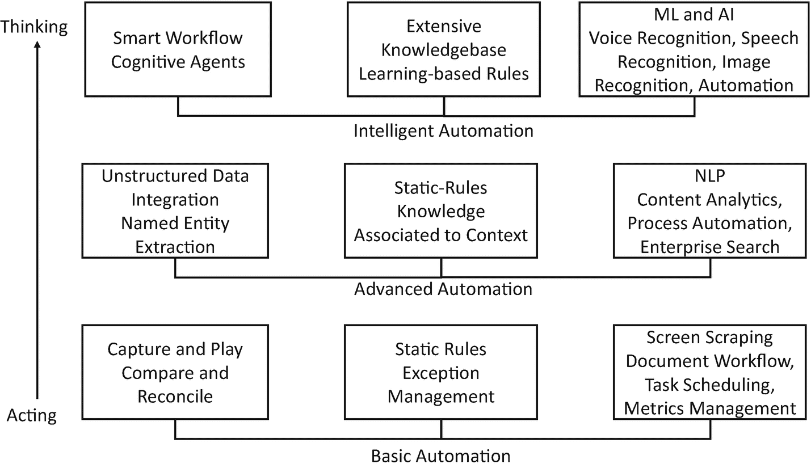
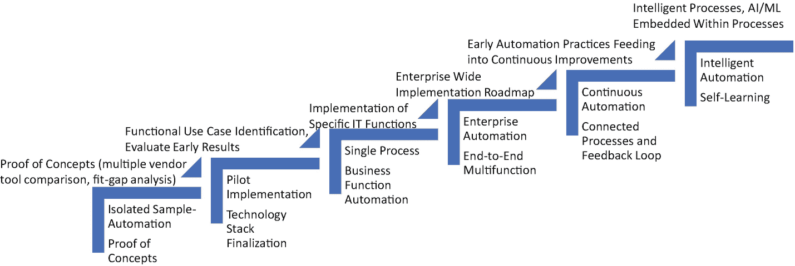

# 5. 智能流程自动化 = RPA + AI

机器人流程自动化（`RPA`）和人工智能（`AI`）传统上被视为两个独立且有些不对等的领域——各自为组织带来了显著的效率提升。

你可能听说过智能自动化、服务交付自动化和认知自动化等术语，并且这些技术方案声称能够完全自动化你的企业运营。让我们退一步，批判性地审视这些营销宣传与现实之间的差距。

在本章中，我们将讨论一些最佳实践，以理解`RPA`的含义，以及如何将`AI`能力与`RPA`相结合，从而在你的组织中实现重大的阶梯式变革。

## 机器人流程自动化（`RPA`）

`RPA`是一类软件“机器人”，它们精确模仿人类的操作方式（例如登录系统、输入数据、执行工作流等）。它们与业务应用程序协同工作，如`ERP`和`CRM`系统以及许多其他应用程序。简单来说，由于这些软件机器人复制了人类活动，业务应用程序在很大程度上仍像以前一样运行，但无需大量人工参与。“机器人”一词指的是由软件驱动的能力，用于替代或增强人类任务。`RPA`主要试图记忆人类在业务应用程序的“表示层”（用户界面）所执行的活动。

除了实现流程自动化之外，这些软件机器人相比雇佣人类员工要便宜得多，而且软件机器人不需要加班费，因为它们可以在需要时全天候工作。仅从成本优化的角度来看，软件机器人的优势极具吸引力。除了节省成本，`RPA`还带来了其他重要好处，例如：

*   *准确性与合规性*：软件机器人每次都会以完全相同的方式执行业务流程，始终如一，产出结果一致。
*   *响应速度提升*：软件机器人通常比人类更快，可以全天候工作而不会疲劳，甚至能以极低的成本扩展以承担更多负载。
*   *敏捷且多技能*：只要输入-输出规则范式定义清晰且可衡量，软件机器人可以执行多种任务。

将`RPA`应用于任何流程的一个条件是：输入、处理输入的规则以及输出，必须清晰定义，不能有任何歧义或对外部系统的依赖。当单个流程跨其他系统拥有多个接口，并需要以同步方式从其他系统获取输入时，所有这些依赖关系都需要清晰阐明；否则，瓶颈将使`RPA`效率低下。客户入职流程就是这种情况的一个典型例子，因为它涉及许多不同的步骤和系统，所有这些都需要清晰定义和映射。

如今的机器人可以打开并阅读电子邮件中的附件；它们可以将文件从一个文件夹移动到另一个文件夹；它们可以遵循编程规则，例如`if/then/else`；它们可以从表单中提取数据或将数据输入表单；它们可以将数据定向到数据库和文件等数据存储中，或者将数据推送到集成的系统中，如`ERP`、`CRM`、财务、`HR`系统等；功能远不止于此。

`RPA`的应用包括：

*   *财务与会计*：供应商管理、差旅费用报销、发票处理、异常处理、问题解决、付款运行/周期、应付账款、应收账款、催收、月度结账、对账和会计核算等。
*   *银行业*：数据验证、应用程序间的数据迁移、报告创建、表格归档、索赔处理、贷款发放、贷款服务等。
*   *资本市场*：反洗钱与了解你的客户处理、数据修复、管理报告、客户报告、客户与顾问入职、许可证与注册处理、付款与资金归集、对账、资产转移、公司行动处理等。
*   *保险业*：向代理人发送续保通知、信用检查、注册数据录入、在多个记录系统中更新客户信息、支付决策、索赔处理、每日银行对账等。

软件机器人每次都会精确执行你分配给它们的任务。这一特性既是它们最大的优势，也是它们最大的弱点。说它是优势，因为机器人会合规且准确地执行流程。说它是弱点，因为如果业务规则或输入发生任何变化，甚至遇到之前未曾预料到的情况，软件机器人将完全不知道如何处理。例如，发票处理是一项工作量巨大的活动。你可以设计一个软件机器人来读取发票表单、提取关键实体、与你的`CRM`系统和支付处理系统进行验证，然后释放付款。如果你收到的所有发票都遵循单一模板，这是一个非常简单的流程。假设你正在引入一个新合作伙伴，而他们的发票格式与你之前编程处理的格式不同。你的软件机器人将无法处理它，你必须重新编程以适应这种变化。

这种无法适应变化的情况凸显了`RPA`需要改进的两个方面，而这两方面都可以通过`AI`能力来补充。

第一个限制是，当输入数据是非结构化的，没有预定义的格式时，例如客户电子邮件，或者通常包含相同信息但格式可变（如发票）的文档，就需要`NLP`能力来提取相关信息，然后将其输入软件机器人，以便高效执行任务。

第二个限制是，软件机器人擅长将基于规则的推理应用于少量特定步骤，但它们无法进行更高层次的决策。例如，如果你有相对较少的业务规则需要应用来批准贷款申请，软件机器人可以做得很好。然而，当贷款审批流程变得复杂，不仅包含多分支、多依赖的规则，还需要与实时信用评分进行交叉引用时，你就面临着一个与判断相关的任务，需要`AI`的补充。

## 人工智能

在前面的章节中，我们已经详细讨论了`AI`。在`RPA`的背景下，让我们从两个不同的类别重新审视`AI`的能力。

### 捕获和处理任何类型数据的能力

第一个`AI`能力是处理任何类型数据的能力。借助大数据技术，我们不再局限于处理结构化数据。大数据技术实现的“读时模式”灵活性使我们能够收集和存储任何类型的数据（关系型结构化数据、非结构化数据、半结构化数据、机器生成数据、音频数据、视频数据和图像）。`NoSQL`数据库也使我们能够以可扩展、分布式且高效的方式处理这些数据。虽然这些进步最初是为了解决与网络相关的问题（搜索、文档管理、编目、关系网络等）而设计用于收集和管理数据，但随后出现了一些其他类型的问题陈述，需要跳出固有思维模式。例如，我们如何识别图像和解释语音？

### 将数据转化为洞察

第二种人工智能能力是处理所有这些不同类型的数据，从中挖掘洞察。这正是`ML`（机器学习）、`DL`（深度学习）、`NLP`（自然语言处理）和神经网络发挥作用的地方。`NLP`有助于从非结构化数据中提取含义，而`ML`则有助于从数据中开发预测能力。深度学习和神经网络从数据中学习，以解决诸如识别照片中的人脸、理解口语以及生成口语等问题。

在`RPA`（机器人流程自动化）的背景下，这些人工智能能力无疑可以作为一项补充技术。例如，`NLP`可以标准化并从文档、电子邮件、记录和日志中提取相关数据，即使这些数据是自由格式的，甚至当感兴趣的实体位于文档的不同位置时也能处理。以发票表单为例。日期有时可能在左上角，有时在右上角；物料清单在某些表单中可能表示为“单价乘以数量”，而在其他表单中则可能逐项列出，最后在底部汇总。描述在一个表单中可能是详细版本，而在另一个表单中则是编码版本。税额可能写在总金额上方，或者作为单独条目列在下方。仅依靠`RPA`能力来处理这种多变性将极具挑战性。即使你添加了足够的规则来应对所有这些不同场景，最终的程序也会变得极其复杂且难以管理。借助`NLP`和`ML`能力，人工智能可以轻松解决这些问题。

对话界面（或聊天机器人）可用于促进人类与其他系统之间的交互。你以自然语言形式输入你的问题，人工智能会从那里接手，处理你的查询并回复相关答案。如果你不想打字，你可以与系统对话，人工智能将使用语音识别来理解你的查询，与后端系统交互，然后向你回传相关信息。尽管人工智能技术取得了所有这些进步，我们仍然生活在狭义人工智能的世界里。这意味着，擅长图像识别的人工智能无法生成文本，而擅长`NLP`处理的人工智能也无法提供推荐或最佳后续方案。因此，在`RPA`的背景下，需要考虑人工智能的补充。通过全面考虑你试图解决的问题，你将不得不将各种人工智能能力拼接在一起。

`RPA`和人工智能是两种截然不同的技术，但它们却能很好地相互补充。例如，人工智能可以帮助处理各种非结构化数据并构建丰富的知识库，然后`RPA`技术可以有效地利用这些知识库来自动化任务。随着企业将`RPA`的应用范围从那些易于实现的自动化任务类型问题中拓展出来，他们应该开始关注人工智能，将自学习能力引入到`RPA`领域本身，并使其业务流程实现智能自动化。

## 自动化与智能：协同工作

当你将`RPA`的自动化能力与人工智能的自学习能力结合起来时，你看到的是技术解决方案的融合，这不仅能改善你的运营和客户互动，还可能创造新的商业模式。许多公司开始认识到结合这两种技术来解决问题的潜在好处，尤其是在由于大型遗留系统或包含多次跳转和复杂集成模式的旧业务流程而放大运营效率的情况下。

让我们首先理解为什么需要智能自动化。

### 对更快周转的需求

在高度竞争和快节奏的商业环境中，最关键的企业指标衡量的是公司对客户和市场的响应速度。为了实现这一点，面向客户和面向市场的应用程序需要近乎实时，而后端系统也需要进行改造以匹配前端的处理速度。这种双重转型挑战需要精心协调，因为大多数后端系统是在数十年手工编码程序的基础上演变而来的。组织迫切需要能够快速带来这些双重变化的解决方案。

### “直接迁移”的终结

企业寻求的变革，并非采用新技术以老方法完成相同任务，只是配上吸引人的用户界面或提升用户体验。他们寻求的是真正的变革，即系统变得足够智能，能够适应不断变化的业务动态和客户偏好。对新技术的简单“直接迁移”方法不会使企业变得高效，真正的需求是寻找超越成本节约或运营便利性的、具有颠覆性和可证明的商业价值。

### 期望值已提高

决策者不满足于稳健但僵化的业务系统。他们期望业务系统具有适应性和响应性。他们希望自己的业务系统不仅能完成其设计的工作，还能主动为他们提供额外的洞察，以便他们能够做出更明智、更好的决策。

## 智能流程自动化之旅（IPA = RPA + AI）

人类编纂了基于规则的系统，用以自动化流程并解决过去的问题。人类还开发了人工智能技术，通过观察进行学习，并解决那些依赖于判断的问题。如果将这两种截然不同的解决问题的方法结合起来，会怎样呢？本质上，智能流程自动化利用了人类的学习和适应能力，并将这些能力注入到流程再造计划中。当你将传统的基于规则的自动化设计与自学习能力相结合时，你便得到了 IPA，它不仅能复制人类的判断和技能，还能随着时间的推移，学会更好地完成任务。

当自动化嵌入了判断力，或者在有人员参与的情况下得到支持时，它正在重新定义企业中任务的分配和执行方式。最初，IPA 主要用于制造流程，后来才在其他职能中零散应用。如今，它正日益成为企业各项职能中不可或缺的一部分。

各组织正在构建 IPA 系统的整体架构，因为它有潜力成为推动企业全面转型的关键载体。踏上“IPA 之旅”的时刻确实已经到来。自动化与否已不再是问题。这种新热情的主要刺激因素，来自于实施 RPA 的组织在生产力上实现了显著的两位数增长。RPA 工具在吸收了增强智能能力以模仿人类智能后，还将进一步发展。随着它们变得更加智能，我们也将看到它们执行更多智能和复杂的任务，例如规划、预算编制、分析和决策，这些任务曾被认为只属于人类。

在我们探讨 IPA 的构成之前，首先来破除一些关于自动化的迷思！

- **RPA 将提高生产力并降低成本**：是的，通过自动化业务流程，确实可以提高生产力并降低成本。然而，与之相关的变革管理方面需要仔细评估。通常会发现，生产力提升和成本降低的成果，会被管理变革所需的额外开销所掩盖。

- **在应用 RPA 之前，你需要提高流程的成熟度**：这不是一个先决条件，而是一个美好的愿望。RPA 的唯一目标是将你的流程分解成更小的模块，并找到自动化它们的方法。这样，端到端的流程要么可以完全自动化，要么可以部分自动化。无论哪种方式，你都将为你的流程和运营引入变革性的能力。

- **鉴于供应商工具的成熟度，你可以快速在生产环境中部署软件机器人**：答案是——视情况而定。如果所讨论的流程深埋在某个后端系统中，过去没有太多人工参与，并且或多或少是一个独立的子流程，那么答案显然是肯定的。然而，如果该流程与其他系统有依赖关系，具有包含多个人工验证点的工作流，并且处理某些相当复杂和敏感的数据，那么你需要谨慎，不要急于投入生产部署。建议先进行长时间的试点解决方案，评估解决方案的有效性和效率，规划适当的变革管理计划，然后再投入生产部署。

- **关键的成功标准是你部署的机器人数量**：如今，引用生产环境中机器人的数量，作为阐述组织自动化旅程和成熟度的代名词，已成为一种趋势。在我们看来，重要的不是数量，而是效能和效率。一方面，你可能通过自动化手动活动减少了全职等效员工（FTE）数量，但另一方面，你也在劳动力组合中增加了机器数量。这些机器也需要监督、治理和维护工作。因此，每个“机器人”的利用率可能是衡量自动化效能的更好指标。

- **为什么先做 RPA 再做认知？可以直接跳到认知阶段**：RPA 是一个将输入映射到输出的直接过程，而认知则意味着你引入从数据中学习的能力来动态地实现自动化。这需要一定程度的数据、流程和知识库的成熟度。如果你没有简化你的流程，产生的数据将是碎片化和不连贯的，这意味着要应用机器学习，你必须承担管理和整合数据的繁重工作，这反过来意味着你需要更长的时间来训练你的机器学习模型，以实现你所期望的自动化。因此，建议从 RPA 开始。它将是你自动化旅程中的一块垫脚石，并为组织在长期内成为自主型组织做好准备。

IPA 不仅仅是一个工具，它由五项核心技术能力组成，这些能力集成在一起，提供了一个可以构建和部署智能自动化解决方案的平台：

- **机器人流程自动化（RPA）**：一种软件，使你能够开发“机器人”来自动化那些具有明确定义的输入、基于规则的处理模式和可衡量输出的任务。就像人类操作员拥有登录业务系统的 ID 一样，RPA 也会有一个用户 ID。它会记住人类操作员在业务系统中的操作，并开始模仿基于规则的任务，例如访问用户界面、执行数据输入或验证、创建文档和报告，以及触发下一组操作。

- **智能工作流**：一个流程管理应用程序，用于集成由人类和机器人执行的任务。智能工作流系统将编排不同用户（包括机器人和人类用户）之间的交接，以高效地执行任务，并实时监控端到端流程。

- **机器学习**：算法在识别数据模式方面发挥着至关重要的作用，例如在流程流中观察到的新场景或罕见场景。如果这些场景不通过预测技术来处理，将会在流程流中造成巨大的瓶颈。还有其他一些场景需要人工验证才能进入下一组流程步骤。在这种情况下，机器学习算法可以为人工操作员提供建议和下一步最佳行动，以便高效地推进流程。

- **人工智能能力**：一组专门的人工智能能力，用于处理非结构化数据，包括文档、图像、视频和语音。业务流程最终往往需要管理和创建各种数据类型。在许多场景中，业务系统的输入可能是图像、视频和语音的形式。需要人工智能能力来管理这些数据类型，以便提取相关信息并将其传递给执行任务的智能工作流和机器学习程序。

*认知代理*：自维持的模块化可执行程序，像虚拟工作者（或“代理”）一样，能够执行任务、与系统、人类或其他代理通信、从数据集和环境中学习，甚至基于“情绪检测”做出决策。认知代理可以是被动的，仅在请求时协助其他代理或人类；也可以是主动的，观察流程的整体健康状况，并在发现瓶颈时立即采取行动。

现在，我们了解了不同技术如何结合以提供强大的平台，下一个问题是：IPA 平台在现实世界中表现如何？

让我们考虑贷款审批流程。人工贷款处理员需要点击操作多个系统，如 CRM、贷款账户应用程序、风险分析系统、法律与合规系统、外部信用机构系统等，以提供“常规业务”服务。借助 IPA，机器人将从这些不同系统中提取所有信息，并整齐地排列好，供人工处理员进行判断，从而节省大量点击操作。NLP 程序将启动，扫描与贷款申请人过去的互动记录（电子邮件、语音通话、投诉和偏好），并解读文本密集的通信内容。ML 算法将根据相似档案和过往风险提供警报，或推荐下一步最佳行动。最后，认知代理将启动与贷款申请人的交互式通信，并提供系统与人工之间交接的实时跟踪（见图 5-1）。

图 5-1 智能工作流：从执行到思考

您的组织需要以有条理且深思熟虑的方式引入自动化和智能。以下部分讨论了一些需要避免的常见陷阱。

### 制定基于价值的战略

组织应批判性地评估许多供应商工具背后的炒作。他们需要对其组织内智能流程自动化的业务收益建立现实的认识。他们需要客观评估当前业务流程的状态、客户未满足的需求、市场趋势、员工生产力指标以及员工敬业度指数。然后，他们应确定一套全面的、基于价值的机遇，而不仅仅是节省成本。他们应进行适当的研究，了解如何利用内部和外部数据集来改造前端应用程序和后端系统。

### 确定机遇的优先级

鉴于智能流程自动化在改造业务方面的潜力，很自然地会遇到这样的情况：业务职能负责人有其自己的优先级，而 CIO 组织也有其自己的优先级。一种在组织边界内设定优先级的明智方法是，创建一个跨业务流程的智能自动化机遇热力图。通过审视所创造的业务价值与实施时间的关系，您可以列出一份业务流程清单，然后制定一份 IT 就绪计划，以描绘您当前的能力与实现业务转型所需的其他技术变革之间的差距。

### 确定试点场景

在选择机遇时，也要仔细考虑其影响。流程可能运行在非常古老的遗留代码上，没有可用的文档，跨系统完成端到端流程存在多次交接，并且流程中嵌入了过多的判断调用。如果您发现的是这些情况，务实的做法是退一步，先寻找更简单的系统或流程来处理。您需要选择几个能够立即交付业务价值的简单场景，这些试点的成功必将帮助您切入其他复杂场景。

### 制定路线图

我们经常看到，业务职能和 IT 领导者急于开展多个试点，然后宣布他们已准备好进行大规模的企业级实施。进行试点并处理较小、较简单的任务本身并没有错。然而，当您想要启动企业级的转型项目时，您需要一份路线图。智能自动化的影响超越了任务自动化本身。它会对各个职能和角色产生变革管理方面的影响。您的路线图应包含一个时间表，以及一套清晰列出的项目，以解决技术、组织、人员和运营方面的潜在变革。自上而下的支持是成功实施智能自动化的关键。请参考图 5-2 了解智能自动化旅程图。

图 5-2 智能自动化旅程图

### 整合流程与技术

有足够多的“低垂果实”用例（至少在运营领域）可以使用简单的 RPA 成功实施；然而，当您试图为跨业务职能和 IT 系统的复杂流程带来变革力量时，简单的 RPA 工具往往无法胜任。供应商在支持涵盖我们之前讨论的智能自动化平台五个关键组件的整体架构方面，能力差异很大。组织需要严格评估供应商在这一领域的能力，特别是要确保新系统能与整个企业生态系统无缝集成。他们必须建立性能监控机制，以管理和监控整个智能自动化项目。

### 建立操作流程和治理模型

随着自动化模仿人类重复性任务，以及人工智能提供类似人类判断的能力，企业员工队伍和标准操作流程预计将经历巨大变革。在人类与认知代理在持续学习的环境中互动时，职能和技术团队必须找到协作方式，并理解谁对什么负责。

从历史上看，企业已经发展并变得更善于管理人力队伍。标准、最佳实践和人力资源流程旨在评估和奖励人类绩效。当有机器参与其中时，您将如何执行这些实践？

更广泛地说，公司可能正在坚定地采用“自动化和智能优先”的方法，而没有对操作流程和治理模型给予足够的重视。

### 建立变革管理计划

智能自动化将改变我们迄今为止的工作方式。可以肯定的是，许多传统岗位将失去其重要性，并且可以理解的是，员工会产生抵触情绪。变革管理计划对于应对以下几个挑战至关重要：

-   需要培训管理者，以监督机器与人类协同工作的流程。
-   需要培训员工采用敏捷方法，尤其是在他们必须跟上机器速度的情况下。
-   需要培训高管，以建立关于人机职责分离的明确指导方针。
-   公司整体层面需要建立新的沟通渠道，以管理员工对失业的担忧，并启动新计划来引入新岗位（情商技能、新技术技能）。

智能流程自动化既是礼物，也是谜题。说它是礼物，是因为如果实施得当，它能确保快速回报；说它是谜题，是因为目前尚无关于如何在同一环境中成功管理协同工作的机器与人类的指导方针或先例。接下来，我们将尝试概述如何开启你的智能自动化之旅。以下是一些最佳实践，可帮助你定义自己的旅程。

## 你的 IPA 之旅：首个 100 天

**第 1 至 30 天：提高认识，协调职能，并动员起来，包括强有力的自上而下的支持：** 最初的 30 天主要是与你的业务高管和 IT 领导者沟通，并统一期望。IPA 计划成功的关键不在于技术解决方案的稳健性，而在于建立强有力的变革管理计划，并提高业务和 IT 职能部门对 IPA 将如何为组织带来效率的认识。你必须有一个总体规划，详细说明各项举措、时间表、预期的颠覆或影响程度、针对每项举措的变革管理计划、每项举措的负责人等等。如果你的 IPA 路线图是围绕完整的端到端流程（例如，从贷款发起到最后放款）来组织的，而不是围绕任务（例如，贷款审批任务）来组织的，那么它将为你提供一个整体图景，让你了解可以实现多少自动化、哪些环节仍需要人工参与，以及你将交付什么样的业务成果。

**第 30 至 60 天：评估机会并进行概念验证：** 每个组织都面临着交付强劲利润和将效率杠杆引入运营的压力。因此，看到每个业务部门都争相列出他们想要自动化的流程清单，也就不足为奇了。如果你要求他们确定优先级，他们可能会大声宣称自己的每一项举措都是重中之重。因此，你需要迅速决定一种适用于你组织的方法论（从评估到部署）。你需要创建一个基于目标的框架来评估和确定自动化机会的优先级。这不仅有助于你有效管理对自动化的狂热追求，还能帮助你识别那些能在 IPA 之旅早期就交付业务价值的速赢项目。除了高层次的流程自动化地图，你还必须深入几步，对已识别的部分自动化机会进行概念验证，以评估自动化的复杂性和实用性。这将帮助你初步了解暂定的时间表、你需要的任何其他技术或存在的功能差距。最重要的是，概念验证将为你提供一个足够好的机会，向业务高管和 IT 领导者宣传你的 IPA 之旅进展。

**第 60 至 100 天：建立治理模型并开始规模化开发：** 一旦你完成了概念验证，并对将采用哪些产品、工具和流程有了足够清晰的认识，你就需要全力以赴推进自动化之旅。在任何时间点，你很可能都有处于不同生命周期的不同流程。有些可能处于需求阶段，有些处于开发阶段，还有些处于变革管理阶段。建立一个治理模型来处理依赖关系、瓶颈、升级、路线纠偏等问题至关重要。在首个 100 天之后，基础设施需求将成为规模化投入生产的关键要素。你需要定义并开始建立一个 IPA 卓越中心，该中心将围绕基础设施规划、标准、最佳实践、技术和功能审查等提供关键指导。

你的 IPA 之旅并非以将机器人部署到生产环境中而结束。事实上，旅程在部署之后才刚刚开始。你需要跟踪和监控机器人的有效性，并确定它们是否在实现业务目标。最初几次部署的成功经验需要在组织内传播，以便让其他观望者受到激励，加入 IPA 之旅。你将需要“自动化布道者”来倡导 IPA 目标。

现在，如果你的 CEO 要求你提出一个运营模式，让公司踏上 IPA 之旅，请记住，该运营模式需要围绕几个关键要素来构建，这些要素将使关键利益相关者能够成功完成任务。这些要素对于设计一个灵活而稳健的 IA 计划至关重要。

## 成功实现 IPA 之旅的 15 个关键要素

尽管 RPA 听起来简单易行，而 AI 有其自身的技术复杂性，但智能自动化之旅确实需要周密的规划、协调的行动以及大量的严谨性才能成功。组织最好遵循以下这些关键基本原则：

1.  *从概念验证开始*：虽然 RPA 作为一个概念可能已被理解，但通过一个快速可行的试点项目来展示 RPA，将激发热情并有助于消除怀疑。

2.  *设定合理的期望*：少承诺，多交付。这条古老的智慧在这里同样适用。围绕潜在收益设定现实的期望会有所帮助。因此，避免围绕 RPA 能为企业或个人实现什么目标而制造炒作或狂热。让人们被最终结果所打动。

3.  *拥有稳健的解决方案重点*：投入精力构建正确的解决方案，以应对大多数变化、交接和流程目标。通常，30% 或更少的时间花在实际的 BOT 配置上。

4.  *识别并引入倡导者*：即使是为了共同和个人的利益，变革也常常遭到抵制。因此，RPA 主导的转型需要强有力的支持和赞助。在旅程伊始就识别出职能领导者和意见领袖，对于无缝实施 RPA 采用也至关重要。

5.  *利用互补工具*：保持警惕，识别和探索能够补充和加强（例如，OCR）RPA 实施的工具。

6.  *遵循速赢交付方法*：与大型复杂的自动化项目相比，采用较小、可管理的自动化集合，成功的机会更大。遵循通过构建-测试-部署流程来微调解决方案的迭代过程。

7.  *明智地选择流程*：第一步的成功将对这一迁移之旅的成果产生重大影响。因此，选择第一批流程对于整个计划的成功至关重要。初始流程必须是那些几乎内置了成功要素，同时过渡的不便或痛苦最小的流程。一旦初始阶段取得成功，必然会获得更大的组织支持。

8.  *让 IT 成为旅程中不可或缺的一部分*：RPA 的价值必须由业务和 IT 团队共同创造。鉴于自动化的实施和启动周期短，这要求业务和 IT 部门和谐合作，否则必然会导致时间延误和资源浪费。

9.  *同时跟踪和收获收益*：实际收益只有在节省的时间被有效重新部署时才会显现。跟踪基准线上的实际节省非常重要。

10. *为可持续性做规划*：将结构和治理制度化，以有效管理已交付的自动化项目，并对机会管道进行优先级排序和交付。采用整体策略来构建、重建和维持人才。

11. *运营模式*：在智能自动化生命周期中执行任务所需的指南和政策；需要更新现有的企业指南和政策，以反映人机协作模式，例如业务连续性计划、数据安全与合规性以及发布管理。

12. *标准*：用于一致管理智能自动化活动的标准和实践，例如异常管理和日志记录、编码标准、文档标准以及部署和就绪检查清单。

13. *关键绩效指标和度量*：涵盖智能自动化解决方案不同方面的度量，例如流程绩效度量和生产力度量。

14. *方法*：确保跨职能采用一致方法的框架/途径，例如流程评估框架、流程优先级排序框架、商业案例框架、变更请求框架和异常管理。

15. *治理*：明确的责任划分和审查机制，以确保冲突得到迅速处理，例如决策矩阵/RACI 框架，以及会议和报告节奏。

## 结论

当前，围绕自动化无疑存在着大量的兴奋点。仅靠 RPA 就能带来显著收益；然而，为了使自动化可持续并实现真正的企业级转型，需要将 AI 能力纳入其中。产品供应商已经抓住了这些流行语，并大力在其 RPA 工具中营销认知能力。因此，当你开始自动化之旅时，理解现实与炒作之间的差距，并规划自己的路线图至关重要。

需要警惕的是，RPA 和 AI 并非万能技术。然而，通过客观评估你自己的用例，并通过将 RPA 和 AI 技术整合到流程中来设计你的自动化方法，你可以提高生产力，并使你的组织更具响应性。

除了技术基础之外，成功的智能自动化实施还需要强大的变革管理计划，以应对不确定性及其对组织和运营职能以及员工的影响——员工往往是任何大规模转型计划的最终承受者。

在下一章中，我们将讨论网络安全这个有趣的世界，包括 AI 对安全的影响，以及公司如何保护其系统和流程。

