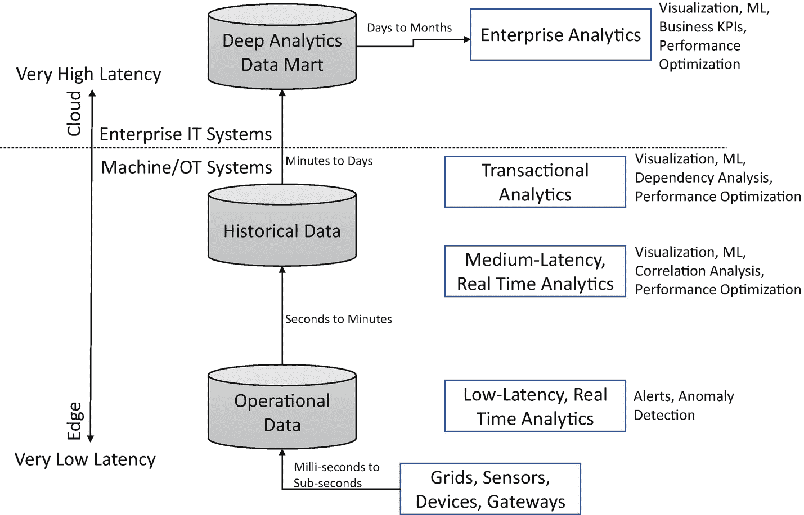
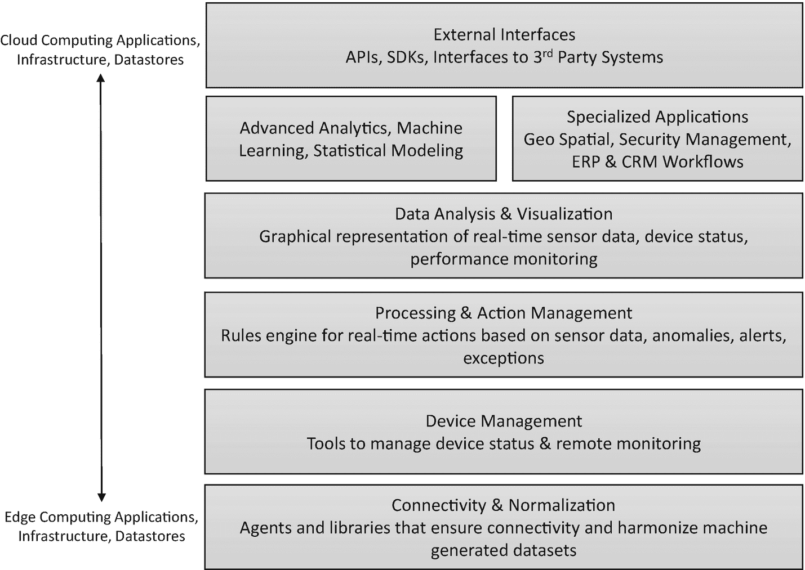
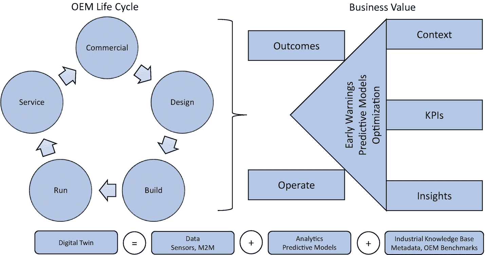
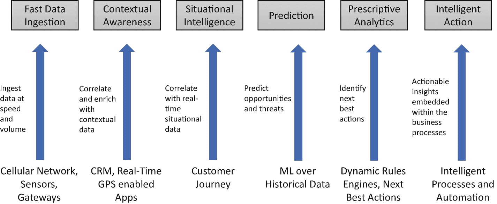
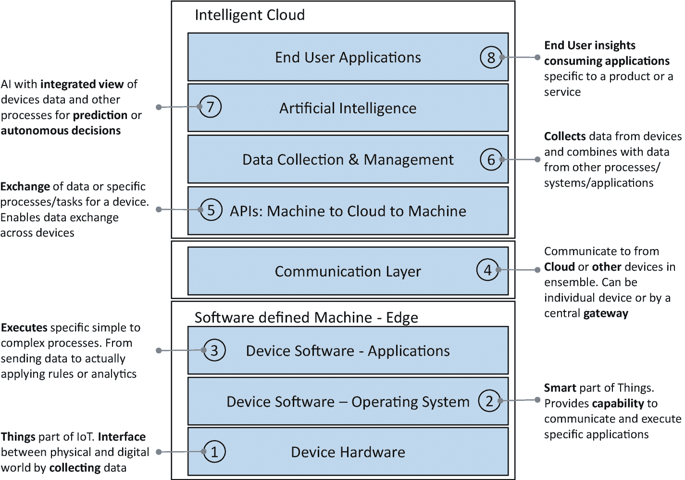

# 7. 智联网 = 物联网 + 云计算 + 人工智能

物联网与人工智能，一个是赋能者，另一个是颠覆者。这两项技术各自都在改变着商业和生活。

物联网是一个由嵌入传感器和连接功能的物理对象构成的网络，使它们能够与网络中的其他连接设备交换信息。简单来说，物联网就是将无生命的物体通过连接——嗯，连接一切——使其变得“智能”，甚至更智能。它正如其名——就是能上网的东西！你拿起任何物体，在其中嵌入传感器，附上一个独特的数字追踪器，然后让它能够在无需人工干预的情况下发送和接收信息。你就拥有了自己的物联网。

当物体能够感知和通信时，决策的方式和地点就发生了改变。廉价的传感器、改进的无线连接以及通过云计算实现的可扩展性，都使得以经济高效的方式收集和处理大量数据、进行分析并即时采取行动成为可能。因此，我们周围的一切（有生命的、无生命的）都变得互联且智能。如果你将物联网的概念扩展到工业场景，例如制造业和供应链管理，你就得到了工业物联网。如果你将物联网的概念扩展到我们日常生活中的个人消费场景，例如可穿戴设备、家用电器、个人助理、智能恒温器等，你就得到了消费物联网。

据预测，物联网（和工业物联网）将引领下一代大规模智能运营。例如，以一个高度机械化和体力密集型的工厂为例。它可以被改造成一个“智能工厂”，其中机器（“智能资产”或“智能机器”）能够基于它们收集和通信的数据，在无需人工干预的情况下相互“对话”并“做出决策”。结果如何？生产效率提高、成本效益提升、浪费减少以及质量一流。

物联网不仅适用于机器对机器通信；它还扩展到任何需要人员、流程和机器（虚拟世界和现实世界）紧密集成的任务。

仅靠物联网，我们可以与机器对话和倾听，但要理解机器并使其智能化，我们需要人工智能。人工智能为我们提供了从物联网收集的海量数据中学习和推断模式的能力。

当我们将物联网和人工智能结合起来会发生什么？这将是一切领域——从机器到工厂，从汽车到可穿戴设备，从厨房到建筑，以及更多——的阶梯式变革。

让我们探索几个场景，来体会物联网和人工智能结合所带来的变革力量。

## 让住宅和建筑变得智能

智能家居通常由一个中央控制单元（可能是物理设备或在云端）组成，它读取遍布家中的各类传感器的信息。运动传感器、温度传感器等每秒钟都会生成信息并将其发送到中央单元。中央单元根据这些传感器发送的信息做出决策。因此，整个住宅都是互联且智能的。

*   放置在冰箱中的接近传感器感知内部库存，并将数据发送到中央单元。中央单元处理数据，并根据你的消费模式在线下达补货订单。
*   家中的运动传感器包含面部识别功能，可以识别小偷，并通过向附近当局发送消息做出相应反应。
*   温度传感器根据室外天气维持家中的温度。
*   功耗传感器密切关注使用趋势，并根据房间内是否有人自动打开或关闭设备/灯光。

## 保持你的汽车良好运行

想象一下，你的汽车配备了各种传感器，实时传输关于磨损、发动机性能以及你个人驾驶模式的数据，并且所有数据都通过物联网网关收集并推送到云端。在云端运行的人工智能持续分析这些数据并生成预测。当人工智能认为汽车需要保养时，它会联系你的`Alexa`，而`Alexa`会检查你的日历并与你最喜欢的修理工沟通，找到最早合适的日程，然后请你口头确认。你再也不会陷入对汽车急需保养而浑然不知的境地。

## 确保持续供电

在电力供应方面，与完全断电相比，我们受电压降的影响更大。完全断电是指影响大面积区域的完全电力丧失，而电压降则发生在需求突然激增，迫使你的电力公司降低某些区域的线路电压以更好地管理供需时。电压降的意外后果是电压波动，这可能会严重损坏电器。

现在考虑一下，能够感知环境和温度模式并将数据实时传输给你的电力公司的家用恒温器。如果遇到异常炎热的日子，有可能发生电压降，云端的人工智能系统可以查看有多少设备在运行，然后主动将恒温器调高几度，同时保持医院等温度敏感设施的恒温器稳定，从而避免电压降情况的发生。

## 确保你活着

Apple Watch 的意义远不止是身份象征。你的可穿戴设备能做的也不仅仅是读取你的心率和计算你今天走了多少步。想象一下，当你的可穿戴设备检测到你可能心脏病发作时，它会向人工智能系统发送警报。人工智能系统收到警报后，会进入关键任务模式，实时触发多项操作。它将你的位置数据发送给最近的救护车，通知最近的医院提前做好准备，提醒你的医生，并推荐到达你或医院最快、最短的路线。为物联网添加人工智能，可能意味着能让你活下来的关键几分钟。

## 确保你的安全

我们关心亲人的安全。这是我们竭尽全力确保家庭安全的主要原因。我们在周边安装闭路电视摄像头和连接到执法机构控制室的入侵检测系统。想象一下，如果你的闭路电视摄像头和入侵检测控制系统的数据被持续推送到云端，人工智能系统不仅实时评估情况，还应用视觉识别算法，通过与罪犯数据库核对来正确识别入侵者，并指导执法人员采取下一步最佳行动。

当然，所有这些例子都涉及数据隐私问题。然而，有些人认为其好处明显大于风险。

物联网、云计算和人工智能三者结合的影响，需要丰富的想象力。我们可以将这些技术的变革力量应用于几乎任何事物和一切事物。

## 物联网、混合云与人工智能协同工作

前面讨论的例子无疑引人入胜。但关键问题在于，如何构建这类集成应用？需要哪些技术构建模块？

没有支持性的平台和架构，物联网与人工智能的融合根本不可能实现。这正是混合云发挥作用之处。每家公司都拥有独特的技术格局，这些格局是为其各自的业务需求和增长而构建并与之相适应的。混合云既是一种颠覆性技术，也是一个商业机遇。要理解这种颠覆，需要更深入地理解涉及混合云、物联网和人工智能的融合架构。

我们周围遍布着不断收集和传输数据的设备。所有这些数据都必须被快速分析，以确定下一步最佳行动。一旦出现延迟，数据就会失去价值。这种零延迟的要求，需要在最接近数据源的地方具备令人难以置信的分布式收集和存储能力。这意味着物联网边缘必须展现出即时解析和分析流数据以采取下一步最佳行动的能力，同时将大部分数据推送到云端进行更深入的分析。

另一方面，人工智能需要巨大的计算能力来处理海量数据集。速度和性能是人工智能系统的额外考量因素，因为人工智能做出的决策需要快速反馈给物联网设备，才能使预测具有可操作性。

以下列表列举了几个突出人工智能特定需求的示例：

-   自动驾驶应急响应车辆能立即响应洪水、火灾等救生搜索和救援行动。
-   医疗设备可以自动进行除颤，并向最近的医院发送警报通知。
-   金融犯罪检测系统涵盖信用卡刷卡行为。
-   流媒体视频服务的按需推荐。
-   苹果的 Siri 和亚马逊的 Echo 在边缘端提供即时响应。

还有更多例子分布在工业需求和消费者需求中。在所有这些例子中，有一点是共通的：人工智能的需求不仅涉及大量数据，还涉及实时决策（见图 7-1）。

图 7-1

物联网的数据价值链与决策延迟

物联网收集的数据可以提升人工智能的预测能力；然而，价值链中（从设备原始数据到预测，再到结果）有许多任务需要良好编排才能交付最终成果。图 7-2 展示了构成物联网分析平台的不同组件的概念视图。

图 7-2

物联网分析平台组件

虽然仅仅实施物联网本身就具有变革性——至少你可以完全了解运营和机器性能，并做出决策——但要实现预测性，你需要人工智能能力与物联网和云协同运作。

### 避免代价高昂的计划外停机

设备故障导致的计划外停机可能代价高昂。通过将机器学习算法应用于机器生成的传感器数据，我们可以提前预测设备故障。然后，人工智能系统可以向现场操作员触发警报，并安排维护程序。

### 提高运营效率

在工厂中，装配线操作要求一切精确并严格遵守质量控制。以生产过程中的溢出为例。溢出量每减少 1% 就可能意味着节省数千美元。通过使用物联网和机器学习，公司可以显著减少泄漏。从嵌入机器的传感器捕获的流数据可以在边缘端实时分析，从而向人类专家发送警报以控制溢出。

### 实现新的和改进的产品与服务

物联网与人工智能相结合，可以为改进产品设计奠定基础，在某些情况下甚至可以构思出全新的产品和服务。例如，通过分析机器性能数据，我们可以帮助发现模式并获得运营洞察——机器如何工作？能否根据设计规范执行？实际使用情况是否与设计时考虑的使用情况不同？是否有机会推出新产品线？等等。

### 加强风险管理

许多将物联网与人工智能结合的应用正在帮助组织更好地理解风险，并为快速响应、更好地管理工人安全和网络威胁做好准备。

例如，通过在可穿戴设备上使用机器学习，我们可以监控工人的安全并预防事故。银行已开始评估利用人工智能从联网的 ATM 监控摄像头中实时识别可疑活动。车辆保险公司已开始对联网汽车的远程信息处理数据使用机器学习，以准确定价基于使用情况的保险费，从而更好地管理承保风险。

## 人工智能在工业 4.0 中的作用

关于工业 4.0 的普遍观念是连接所有资产并创建数字化环境。这并非完全准确。工业 4.0 更像是一场演进而非革命。要达到理想的成熟度水平，需要经历几个阶段。第一阶段始于将所有资产连接在一起，包括仪器仪表、连接性和数据收集。下一阶段是弄清楚如何理解所有这些数据。最后阶段是将自动化引入整个生命周期。制造敏捷性是工业 4.0 成功的关键，而人工智能在整个“创造、制造和交付”价值链中发挥着关键作用，以优化和改进每个流程，从而在任何外部环境下都能取得最佳成果。

关于工业 4.0 的讨论不可避免地会涉及多种技术：边缘计算、云计算、人工智能、物联网、平台等。尽管这些技术各有其作用，但最关键的组成部分是其数据和预测能力。

## 数字孪生

现代制造企业正利用物联网平台从机器及其他来源采集数据，以创建"数字孪生"——即真实物理对象的数字模型（见图 7-3）。数字孪生使我们能够可视化机器在实际运行中的各项指标。机器上的传感器将数据传输至其数字副本，模拟物理机器的运行状态，随后机器学习算法分析这些数字传输的数据，以优化产品性能，并为物理系统推荐下一步最佳操作。借助数字孪生，我们能够预测物理世界的场景、优化资产性能、降低维护成本、减少停机时间服务等级协议，并探索数据变现及构建新服务产品的机遇。

图 7-3

数字孪生的概念视图

本质上，数字孪生是物理系统、数字镜像以及连接两者的底层数据的融合体。

### 数字孪生如何带来变革性的业务成果？

首先，数字孪生——更确切地说是物联网、云和人工智能的融合技术——为优化流程以及有效利用机器和资源提供了可能。虽然这些解决方案主要旨在降低生产成本，但客户期望最终产品能包含增值服务，例如仪表盘、使用模式、维护警报等。

其次，智能设备会获取关于产品在客户现场实际使用情况的广泛数据。当您分析整个装机基础中的这些宝贵数据时，您不仅能推断出单个客户的装机基础模式，还能获得全局视角：其他客户如何使用该产品、他们的成功程度、面临的挑战，以及是否存在以溢价推出新产品或增值服务的空白市场机会。

第三，由于您现在销售的不仅仅是机器，而是"机器即服务"，您可以改变整个商业模式——如果您能保证客户产品和服务的质量，他们就不会介意支付溢价保险费。借助数字孪生，您可以衡量机器的健康状况和性能。您能够远程管理这些机器的使用情况，并预测可能的故障。您能够监控机器利用率，并推荐更好的产能规划和生产计划等。所有这些洞察意味着您实际上可以在客户的业务成果中扮演更重要的角色，如果您能承诺减少停机时间服务等级协议，客户当然愿意向您支付溢价。

### 如何为您的业务制定盈利的数字孪生战略？

如果您是一家纯粹的工业制造企业，您有三个选择：

*   **成为赋能者**：开始开发并将物联网技术（如端点网络、边缘计算和云基础设施）嵌入到您的产品和解决方案中。这将使您能够向客户交叉销售数字孪生组件，从而获得市场份额。而您的客户则需要借助外部帮助来构建内部能力，以设计适合他们的数字孪生架构。但需要注意的是，这个市场将被少数能够以极低成本提供完整技术栈的全球巨头所主导。

*   **成为参与者**：除了制造配备传感器和计算能力的世界级产品外，您还可以涉足为客户设计、创建、集成和交付增值服务。增值服务可能包括添加实时仪表盘、历史机器性能趋势、基于阈值的警报通知等。这些产品可能不会给您带来显著优势，因为传统软件公司专精于提供此类能力；然而，通过为物理机器提供数字服务，您无疑能够加深与客户的亲密关系。

*   **成为增强者**：此处的目标是提供丰富的最终用户互动，并利用客户自身及第三方来源的数据提供新服务。这正是数字孪生、数据变现和新收入模式发挥作用的地方。增值产品需要针对特定机器和特定行业，以提高其他企业复制的门槛。

## 你的万物智联战略是什么？

涉及人工智能与物联网融合的应用场景正在飞速发展，在很短的时间内，几乎所有“哑巴”设备都将变得智能化。

以下是构建万物智联架构时需要考虑的几个要点：

-   将会有众多物联网设备组成一个整体，它们需要在组织内部进行通信和协同工作。根据产品和服务类型的不同，这个整体可能服务于一个人（通过可穿戴设备或个人设备）、一栋房屋、一辆汽车、一个项目或一座工厂。
-   设备的数量和制造商的种类将会激增。因此，将不存在实现机器间通信的标准方式。因此，选择合适的云合作伙伴至关重要，这样设备才能通过“机器-云-机器”的迂回方式协同工作。同时，也需要建立设备的“API 化”。
-   为了充分发挥预测和自主决策的潜力，需要整合来自物联网、其他企业数据源以及外部数据（如天气模式）的统一视图。

同样，以下是识别物联网、云和人工智能创新机会时需要考虑的几个要点：

-   **客户体验**：通过重新构想客户如何使用产品或服务，以及如何为客户创造、分发、消费和服务最终价值，来识别客户体验方面可能的创新。是否存在通过收集新数据、融入现有流程数据并创建新流程和合作伙伴关系来改善客户旅程的机会？
-   **产品与服务**：通过利用物联网、云和人工智能的组合（结合基础设施、流程、政策和人员），识别产品为用户提供更多价值的潜在机会。设想为产品增加新功能，或增强现有功能以使其表现更佳。这更多关乎功能和形态因素，而非使能技术。

    在服务方面，识别服务以及客户最终消费方式的机会，即服务如何、是什么以及何时被提供和消费。设想一下，如果产品转变为服务会怎样。

-   **使能技术**：使能技术的创新不一定特定于某个产品或服务，而更多是关于采用技术来实现重新构想的客户体验、产品、服务或商业模式。在这里，需要仔细评估物联网、人工智能和云的组合，以及如何针对你的特定业务需求进行采用。
-   **商业模式**：通过整合所有要素，识别增强现有商业模式的机会，以便为现有客户（或全新的客户群）创造和传递价值。设想通过采用和启用物联网、云和人工智能的技术组合，创造新的或增强的产品和服务，从而带来全新的客户体验。

图 7-4 展示了跨行业的 AI 与物联网融合用例。

图 7-4

物联网分析价值链

以下是一些更具体的行业示例。

-   **飞机**：对于航空公司而言，零停机时间意味着更高的收入。如今，飞机发动机制造商正在安装数百万个传感器，其主要目标不仅是了解飞机每次飞行的性能，还要能够预测发动机的磨损情况。结果如何？更高的安全性和更少的停机时间。
-   **石油钻井平台**：用于钻探的机器属于资本密集型，因此石油公司必须不断改善其运营成本。当这些机器发生故障时，公司会遭受巨大损失，但让昂贵的机器处于待命状态在经济上并不可行。解决方案是什么？让机器变得智能，以便可以持续监控和分析其利用率、性能和状况。预测性维护和基于状态的监控显著降低了运营成本。
-   **制造业**：制造商正在投资建设智能工厂和车间，以便其机械和装配线能够在未来打造出自动化工厂。

虽然一方面，物联网、人工智能和云的融合为企业在 B2B 和 B2B2C 领域带来了更强的价值主张，但企业也需要意识到若干挑战，尤其是在管理数据的体量、速度和多样性方面。每一次颠覆都会创造前所未有的新机遇和市场；然而，与其贸然投入，你需要评估哪些与你的行业相关，并定义你自己的万物智联战略。

### 制定万物智联战略的最佳实践

#### 制定并阐明你自己的价值主张

物联网和人工智能的结合带来了广泛的变革性机遇。然而，在屈服于“给所有东西装上传感器并期待奇迹发生”的诱惑之前，你需要仔细评估用例。物联网作为一项技术仍在成熟过程中；连接问题时有发生，传感器可能因恶劣天气条件而损坏或故障。它们也可能因电源波动而停止响应，因此你的物联网计划的成功取决于你对市场空白、可用互补技术以及你所要解决的问题的评估有多好。

你需要深入了解你所在行业的宏观趋势和竞争力量。分析师们对于物联网在你行业的应用有何看法？在价值链的哪个环节，客户感到沮丧？哪些额外的数据或事件，如果能够响应，将显著改善客户体验？基于这些数据点，你需要为你的物联网计划制定自己的 SWOT 分析和商业案例。

#### 评估客户需求

对于任何企业来说，尽可能多地获取客户需求（显性或隐性）的细节至关重要。对于物联网这个尚未被充分探索的新领域，你需要超越典型的客户调查方法，采用更广泛的技术，例如客户画像和客户旅程，来制定一套能被市场广泛接受的产品和服务路线图。

#### 进行价值链分析和盈利能力分析

下一步是对你的行业进行价值链分析和盈利能力分析。与其从狭隘的约束角度看待你的业务，不如从更广阔的行业视角出发。在某些情况下，这可能会导致业务多元化，创造全新的业务线，但这正是获得竞争优势和差异化的关键。

#### 合作共赢

如果你认为并表现得好像自己有能力包办一切，那将是愚蠢的。技术正在飞速发展，客户需求日新月异，市场趋势影响深远。了解你所在市场的解决方案提供商，并监控他们的进展和挑战，这一点非常重要。这张“地图”将为你提供足够的清晰度，以便在能够以更低成本更快进入市场的情况下进行合作与结盟。

#### 评估技术并进行适配差距分析

市场上存在众多供应商和解决方案。有些方案范围非常狭窄但能出色地完成特定任务，有些则范围广泛，为尝试新事物提供了更大的灵活性。理解所有这些方案，并根据你的具体目标制定适配差距分析至关重要。如果你的组织在联网设备领域是新手，那么你的成功很大程度上取决于你能否快速启动试点项目并为业务功能建立投资回报率。

`IoT`、`AI` 和云技术是快速演进的技术，因此你的技术架构需要具备灵活性和组件化特性。在整体架构中，某些组件今天可能成熟度较低，但明天它们将达到足够的成熟度，或者某些组件可能会完全过时。因此，密切关注技术趋势至关重要，包括它们演进的速度、有哪些互补技术正在发挥作用，以及它们的成本效益如何。

我们列出了一些你需要重点关注的关键领域，以制定一个涵盖数据、分析、建议、性能和整体成本效益的稳健技术路线图。

例如，在“洞察”方面，回答以下问题很重要：

-   哪些数据能让你清晰了解产品使用情况和性能追踪？
-   哪些数据对你的业务功能有价值？
-   哪些数据能丰富客户体验？
-   你需要收集哪些额外数据来提供这些洞察？

分析方面的问题可能包括：

-   如果将哪些洞察嵌入到你的产品/服务/流程中，会使你的公司对客户或市场情况反应更迅速？
-   “数学”运算会有多复杂？你是否需要购买专门的软件包，例如优化库或深度学习库？
-   你将如何管理和维护这些洞察？

性能方面的问题可能包括：

-   数据处理性能标准是什么？
-   不在边缘进行数据处理（相对于将所有数据迁移到云端）的后果是什么？如果答案是上云，你会不会丢失一些关键操作？
-   你希望你的服务达到怎样的实时性？

运营需求方面的问题可能包括：

-   你将重点关注哪些运行条件（温度、湿度、压力、访问权限和振动）？
-   你将针对哪些不同场景启用安全性和访问控制？其余部分则留给客户的具体要求。

在制定技术路线图时，你需要保持务实的态度。仅仅创建一个智能解决方案并不能带来成功，尤其是当构建该解决方案的成本超过了其商业和实施的便利性时。

#### 构建你的智能物联路线图

一旦你完成了上述所有活动，你就拥有了开发智能物联路线图所需的所有理想组件（见图 7-5）。该路线图将帮助你进行规划，并向公司内部利益相关者、合作伙伴和员工传达时间表、计划、试点项目、变更和预期成果。

图 7-5 多层智能物联架构

制定路线图的最佳方法之一是采用亚马逊的飞轮战略。从一个宏大的愿景开始，但不必是一个资本密集且复杂的豪赌。你需要从小处着手，专注于易于实验的试点项目来检验你的想法。这可以进一步演变为创建最小可行产品，以便尽早推向市场并获得先发优势，或者你可以识别出愿意与你以利润分享模式进行共同创新的客户。

有三种方法可以帮助你向业务利益相关者、员工和客户清晰地阐述你的路线图：

-   **未来的新闻稿**：以终为始，为你的产品或服务撰写一份新闻稿。由于这将是面向市场的公告，你将被迫阐述你产品的独特性，这反过来将有助于巩固你的愿景。
-   **为你的计划准备一份常见问题解答**：提出你可能面临的市场、投资者、员工、业务利益相关者和合作伙伴的潜在问题。与需要人们自己摸索的黑箱相比，常见问题解答及其对应的答案将帮助你以更容易被接受的方式推广你的产品。
-   **用户手册**：成功的公司信奉众包模式，即用户可以利用你的产品创造越来越多的实用工具。这有助于在更短的时间内显著提升市场份额。为最终用户开发用户手册、DIY 视频、`API` 和教程，以帮助他们构建智能应用。

## 结论

像 `AI`、`IoT` 和云这样的新技术的进步，对工业制造领域的大量从业人员意味着什么？

`AI`、`IoT`、云以及其他新兴的第四次工业革命技术将会持续存在。它们正在永久性地改变事物的设计、制造和交付方式。这些技术正在使整个制造生命周期（采购、制造、销售和服务）中的一切变得智能化，同时也带来了管理智能设备、智能代理以及在某些情况下完全自主流程的额外复杂性。

关键问题是，管理人员、技术人员、机器操作员和工厂车间工人的角色会发生巨大变化吗？如果是这样，公司需要找到方法来监控和跟踪活动，在这些活动中，越来越多的人机协作将成为执行项目的常态。

在本章中，我们讨论了通过结合 `IoT` 和 `AI` 的能力来改善我们生活方式以及变革工业领域的可能性。在下一章中，我们将讨论 `AI` 如何改进和变革 IT 运营。

