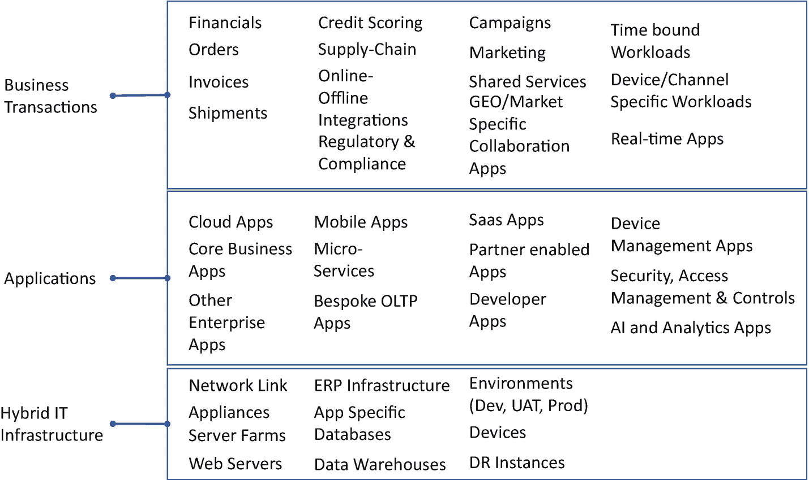
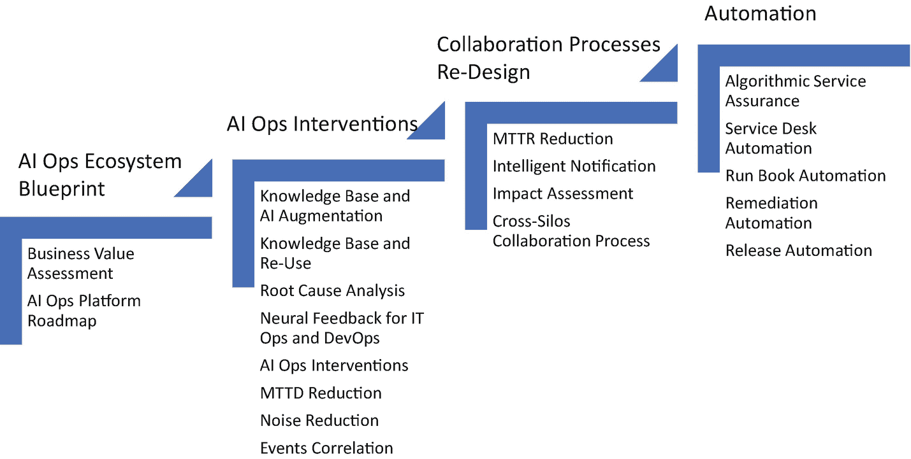

# 8. IT 运维与人工智能

每家企业都在向数字化企业转型，因此持续推动着将所有业务上云、以数据为驱动、将 AI 嵌入每个流程，并以极致的敏捷模式开展所有工作。虽然这些举措都很好，甚至可能是成为数字化企业所必需的复杂性，但与此同时，数字化也意味着要始终处于开发与运维活动的持续博弈之中。这让人联想到热力学第二定律：除非从外部向系统注入能量，否则熵会随时间增加。

让我们进一步探讨这个类比，看看人工智能如何在 IT 运维领域发挥关键作用。

IT 运维领域——尤其是生产运行、维护和保养活动——始终在与熵（即无序状态）作斗争。IT 运维人员花费大量时间和精力来维持一切正常运行，并始终承受着越来越大的压力，需要预测何时会出现问题，并准备好修复方案和冗长的根本原因分析文档。

相比之下，开发活动实际上*增加*了熵的水平。每一个投入生产的新应用、每一次底层操作系统的新版本发布及相关升级、每一项向用户引入的新技术，都是必须做出的变更，这增加了运维团队竭力防止的无序状态发生的概率。

虽然开发世界的快节奏不可避免，但如果变更得不到管理，最终将导致某些环节崩溃，除非人们持续投入精力来防止这些故障。这些相互冲突的目标如果走向极端，可能会在企业内部滚雪球般演变成不健康的局面，运维部门积极抵制变更，而开发部门则积极推动变更。

我们需要什么？一个灵活、整体的框架，包含一套诊断和预测工具、自动化以及人机协同能力，使运维团队能够拥抱变化。这个灵活的整体框架被称为 `AIOps`，这是 Gartner 研究公司创造的一个术语，用于描述一种基于 AI 技术实现的自动化分析来增强人类技能的 IT 运维新方式。

`AIOps` 这个术语本身既不是一种解决方案，也不是一种理念，而是一个总体框架，用于解决如何应对日益增长的性能需求和管理 IT 复杂性。这涉及到开发新的强大技术，这些技术有潜力从根本上改变 IT 运维乃至整个数字化企业。

Gartner 提出了大量需要集成和管理的能力：

*   历史数据管理，包括结构化数据和非结构化数据
*   流式数据管理，包括多设备访问和使用
*   主要从系统和网络生成的日志数据管理
*   自动化模式发现与预测
*   根本原因分析及作为热修复的脚本
*   软件即服务，主要是基于云的解决方案以及以一对多模式消费的相关数据服务

当今的 IT 环境过于复杂，任何个人甚至单个团队都无法独自管理；相反，所需的技能包含多个专业领域（全栈工程师）。相应地，每个专业领域都需要其特定的工具来监控、指导、建议、修复，并使 IT 运维人员能够有效承担责任。在某个节点上，将这些局部视图组合起来以获得对环境中实际发生情况的整体理解，会变得非常困难和混乱。

由于现代 IT 环境的规模和细微差别（混合云环境和一切即服务类型的格局）以及企业所需的变更速度日益加快，旧式的基于规则和逐级上报的方法（L1-L2-L3）已变得不可持续且脆弱，需要付出更多努力和细心。特别是当基础设施为了响应不断变化的条件和需求而变得更加自我修改（基础设施即代码）时，IT 运维需要加速才能跟上步伐。

每一项新技术的出现，都需要理解其表象背后的“为什么”，以便做出更好的决策。

## 为什么你的企业需要 AIOps？

数字化转型围绕四个主要领域展开，不同组织在这些领域可能采取不同的实施策略：

-   从硬件到应用再到业务交易（影响收入、成本或客户满意度）
-   从传统技术到新型微服务转型（影响 IT 双速能力和 IT 系统的响应能力）
-   针对现场（物）、本地和云端的基础设施整合与现代化（影响稳健性、可扩展性和性能）
-   上述所有变更的不同时间间隔（影响上市准备度）

显而易见，数字化转型需要提高云采用率，并准备好应对快速开发和部署生产的能力。然而，当你加入诸如对持续创新和持续开发（`CICD`）的需求、日益增多的机器代理采用、物联网（`IoT`）设备、应用程序接口（`API`）等基本复杂性时，你的 IT 运维范围将面临太多未知因素。这给传统的服务管理最佳实践、团队能力以及技能和工具带来了巨大压力，甚至使其达到崩溃点。参见图 8-1。

图 8-1 IT 系统拓扑

以下我们列出了当前服务管理设置中存在的一些关键痛点：

-   **IT 运维自动化程度极低**：现代 IT 系统环境包括托管云、混合云、第三方服务、SaaS 应用、移动应用、API、众包应用、物联网设备等。简而言之，IT 环境本质上是复杂、动态且具有弹性的。通过人工监控来管理 IT 环境的传统方法已不再可行。由于系统、应用和数据的接触点过多且访问渠道多样，我们需要一种高度自动化的方式来跟踪、监控和解决问题。

-   **系统过多，数据量过大**：IT 系统环境不再局限于大型单体技术栈；有太多专门的应用和系统来解决特定的企业需求。结果呢？事件和告警数量呈指数级增长，服务工单量也随之增加。要同时理解所有这些应用产生的数据并满足服务等级协议（SLA），已经变得过于复杂。由于系统、应用和数据的接触点过多且访问渠道多样，我们需要一种高度自动化的方式来跟踪、监控和解决问题。

-   **需要对事件进行近乎实时的响应**：数字化在企业 IT 系统中造成了鸿沟。面向客户的前端系统运行速度比后端以流程为中心的关键任务系统更快。在许多组织中，IT 在赋能业务方面的作用如此显著，以至于 IT 本身已成为业务。随之而来的是，技术的“消费化”极大地改变了用户期望，以至于企业现在必须比以往任何时候都更快地响应 IT 事件。无论是应对真实情况还是感知到的情况，响应都需要几乎即时完成。

-   **计算基础设施向云端或边缘迁移**：云化从根本上颠覆了 IT 职能、预算和控制的存在方式。越来越多的计算基础设施需求现在基于按使用付费的原则。虽然从成本管理的角度来看，这一趋势是好的，但它给 IT 团队管理混合环境（部分应用在云端，部分在本地）带来了额外压力。

-   **敏捷开发方法与运维责任相冲突**：DevOps 和敏捷方法论使企业能够快速实验、原型设计和部署应用到生产环境。然而，管理、监控和维护这些应用的责任仍然落在 IT 运维团队身上。由于缺乏对这些新技术的了解，IT 运维团队始终处于追赶状态。

-   **误报告警过多**：在数字世界中，由于业务性质和众多的客户接触点，业务应用和 IT 系统始终承受着日益增长的用户活动压力。几乎不允许有任何停机时间。这种高使用率需求相应地导致了更多关于响应时间、可访问性、可用性和可扩展性的误报。IT 运维团队面临着分析日益增多的单个工单并定位根本原因的挑战。他们必须处理多个监控解决方案以及针对同一问题的多个相关告警，这还可能引发事件风暴，占用大量资源，而实际上只需一个通知和一个事件工单就更为实用。

此外，一旦确定了根本原因，IT 运维团队需要经历一个繁琐的故障分类流程，根据先前关于由谁修复问题的指南，将问题分派给正确的团队；这方面尤其麻烦，因为 IT 环境不再由少数几个大型单体应用组成。相反，当今的 IT 环境涉及多样化的基础设施（本地和云端）应用、不同的 SLA 期望以及多个供应商（其中一些是开源的）。

那么，AIOps 如何能够以智能、集成和自动化的方式帮助解决这类问题呢？

### AIOps 平台的构成要素

IT 运维人员被工单、严格的 SLA 以及他们需要分析以找出根本原因的众多数据点所淹没。他们发现传统的 IT 运维管理技术已无法胜任这项任务，并且不知道从何入手。他们期望 AIOps 系统能解决所有问题。对 AIOps 的两个关键期望是自动化和预测。

#### 自动化

让 IT 运维专业人员能够将他们当前手动执行的工作自动化。通过自动化，他们可以加快问题识别和解决的速度，从而在给定时间或资源下解决更多问题。

算法可以自动化分析和关联事件数据的过程，如果手动执行，这需要数小时。利用能够去重、过滤无关数据并实时关联事件源的复杂算法，数百万个事件可以自动缩减为数十个事件。

为了进一步阐述自动化方面，让我们考虑几个例子：将客户档案信息与金融处理应用程序和交易数据进行关联，以识别异常值并突出影响性能的因素；评估服务工单中的非结构化数据，以识别潜在的自动化问题；对工作负载进行分类以优化基础设施部署；以及将事件与变更、工作日志和应用开发活动相关联，以衡量基础设施和应用变更对生产的影响。

所有这些任务有什么共同点？要高效执行这些任务，关键需求是推理能力和上下文知识。IT 运维人员需要关联多个数据源以识别异常值、确定因果关系，并参考系统日志来揭示根本原因。简而言之，期望是系统能接管这些手动调查任务，尽可能多地突出可能性，然后领域专家（SME）可以运用必要的领域知识进行推理并确定下一步最佳行动。

这种级别的自动化意味着可以即时检测到事件，无需人工手动连接各种工具和应用孤岛之间的信息。例如，AIOps 平台可以整理过去观察到的每一个事件，并捕获所有隐性知识，包括为解决该事件而执行的脚本。如果将来发生类似事件，可以使用算法自动参考知识库并复用之前处理该事件的方法。AIOps 的作用是通过自动化 IT 运维人员执行的手动任务，来提高他们的生产力、响应能力和工作效率。

#### 预测

通过分析过去的事件和当前的事件流，系统应该能够预测几件事：a) 确定问题的严重性，b) 将其归类为某种类型的问题，例如基础设施相关、应用相关、用户管理或访问相关等。

换句话说，期望是存在某种智能系统，它能持续处理数据，通过学习什么是正常行为、什么是异常行为，来发出适当的通知，提供修复建议，并突出显示这些建议的置信度水平。如果智能系统达到了显著的置信度水平，那么自主执行修复可能是明智之举。

牢记这两个主要期望，我们来讨论开发 AIOps 平台所需的能力：

- **集成广泛且多样化的 IT 数据源的能力**：平台应能打破当前孤立的工具和 IT 学科，集成与事件、指标、日志、作业数据、工单、监控等相关的数据，覆盖整个基础设施、应用和最终业务交易栈。目标应是创建一个端到端的拓扑结构。
- **聚合并提供全局视图的能力**：平台应能聚合历史数据以进行趋势分析和学习，同时捕获流式实时事件。
- **进行计算和执行高级分析的能力**：平台应能计算并运用复杂的机器学习算法，包括自然语言处理（NLP）能力，以消除噪音、识别模式、隔离可能原因、暴露潜在问题，并完成其他调查和预测导向的任务。平台还应具备实时模拟不同场景的能力，使 IT 运维专家能够进行“假设”分析并加快分类过程。
- **全栈可见性/可视化数据中复杂模式的能力**：平台应能可视化海量多样化数据中的各种相互依赖关系和关联。这有助于 IT 运维人员快速分析和理解系统间的相互依赖关系。
- **自动化任务的能力**：平台应能利用机器学习产生的结果来自动化任务，以修复问题。

现在让我们探讨 AIOps 系统将如何解决常见的 IT 运维任务。

**预测**：

- **任务**：确定先前定义的阈值何时会触发断路器，并执行“假设”分析以查找根本原因。
- **数据**：系统日志数据、应用性能数据、用户并发及使用模式、事件。
- **算法**：线性回归、变化检测、季节性分解和 Box-Jenkins 方法。
- **机器学习**：主要为监督学习；系统已基于历史数据进行训练。
- **可视化**：图分析器，帮助快速发现依赖关系和联系。
- **行动示例**：为应对潜在的宕机，计划及时预配资源。

**可能原因分析**：

- **任务**：关联多样化的数据点，自动识别少量潜在原因。
- **数据**：系统日志数据、应用性能数据、用户并发及使用模式、事件，以及包含根本原因和相应修复方案的知识库。
- **算法**：皮尔逊相关系数或其他合适的线性相关算法。
- **机器学习**：利用历史数据和知识库的无监督学习方法，无需任何预先训练或特定目标。
- **可视化**：带有具体行动、相应置信度分数、决策树等的建议。
- **行动示例**：将注意力和资源转向应对正确的原因。

**聚类**：

- **任务**：发现词对组合的相似性和频率分布，以根据严重性和根本原因对各类问题进行归类。
- **数据**：系统日志数据、应用性能数据、用户并发及使用模式、事件，以及包含根本原因和相应修复方案的知识库。
- **算法**：用于主题建模的莱文斯坦距离和潜在狄利克雷分配（LDA）。
- **机器学习**：无监督学习。
- **可视化**：层次聚类和自组织映射。
- **行动示例**：识别新问题与旧问题的相似性，并将其转给合适的专家或自动响应。

**持续改进**：

- **任务**：通过持续监控每日、每周和每月的运行行为，确定运维指标和系统性能的未来趋势。
- **数据**：系统日志数据、应用性能数据、用户并发及使用模式、事件，以及包含根本原因、相应修复方案以及因采用新技术而产生的影响的知识库。
- **算法**：贝叶斯信念网络和随机非确定性算法。
- **机器学习**：主要为无监督方法和深度学习，以持续从数据中学习。
- **可视化**：带有具体行动、相应置信度分数、决策树等的建议。
- **行动示例**：计划预配资源以避免宕机。

## 你的 AIOps 策略是什么？

IT 运维始终需要确保 IT 性能管理中的稳定性和可用性。这导致了对机器学习（`ML`）等前沿技术的谨慎采用。通常，供应商会通过针对特定用例的工具来实现这些技术。

大多数 IT 部门都未能制定出全面的、企业级的分析和机器学习策略。在工具、知识和专业技能方面面临的挑战过于艰巨，而且还有太多其他更紧迫的需求。在数字化转型中，IT 即业务。IT 需要平衡性能管理的传统需求与创新业务的需求。为此，IT 必须打通 IT 与业务数据孤岛，并利用机器辅助来管理不断变化的客户需求和技术变革。

移动性、客户期望的“消费化”、弹性云基础设施、快速变化的应用程序技术以及持续交付，都对 IT 提出了新的要求，而这些要求无法用旧方法满足。大数据已经足够成熟和商品化，能够支持所需的海量且不断增长的实时数据处理。API 和开放数据平台的普遍采用，使得过去被封锁在工具和数据库中的关键信息得以共享。机器学习在我们的技术和文化中已经成熟且无处不在。

Gartner 估计，到 2020 年，50% 的企业将积极使用 AIOps 平台来洞察业务执行和 IT 运维。IT 不一定需要改变他们所做的工作；他们只需要在更广泛、更复杂的生态系统中，以更少的人工干预，更快地完成这些工作。

以下部分讨论了我们推荐的策略。

### 建立工具和流程以实现系统拓扑的自组织

随着运维各个领域随时间推移发生变化，部署能够持续监控和发现整个 IT 系统拓扑及其关系，并保持集成拓扑视图更新的工具至关重要。这种依赖关系视图和知识是加快发现速度、加快根本原因分析以及更好地评估 IT 系统格局中热点/瓶颈的关键。

### 建立实时数据探索与报告

服务台工单工具通常为管理层和高管提供报告功能。大多数实现都附带一组开箱即用的标准报告，允许管理员构建新的自定义报告，并且允许个别报告用户更改视图和参数以满足其需求。现在，大多数工具还提供调度功能，以及从报告查询中生成可共享演示文稿的能力。如果你的组织有纪律进行定期评审，每个人都将报告带到会议上，并且你可以花时间进行关联、核实、审查、讨论，并带着可衡量的行动计划离开，那么这就足够了。如果你的业务、市场和竞争需求不允许你这样使用时间和资源，那么它的效用就会大大降低。更好的方法是，将所有必要的数据放在一个易于使用的探索工具中，该工具可供组织中的每个人使用，并实时更新。这允许所有利益相关者查看顶层（高管）视图，并动态地共同调查有趣的趋势、异常或问题，而无需整理报告或运行新报告。

### 利用自然语言处理（NLP）消除人工分类

报告和事件管理依赖于分类这一基本组织原则。每个工单都根据来源、流程等分配了结构化属性。路由、所有权以及最终的报告都依赖于用户、系统或分类人员分配的类别，这些类别通常反映了“描述”或“问题”等自由文本字段中的内容。

在 IT 领域，这种分类模型存在缺陷是一个众所周知但很少讨论的事实。用户没有耐心、纪律或知识来准确地自行分配分类和优先级。分类代表了由内而外的业务视角：IT 认为重要的是处理问题，而不是用户认为重要的是如何描述问题。IT 部门会一次性构建类别层次结构，并随着时间的推移对其进行迭代，而不会进行合理化或精简选项。任何足够成熟的 IT 部门都会有成百上千种可能的分类，其中包含过于宽泛、过于狭窄、无意义或不相关的条目。顶层类别永远是“其他”。此外，无论是用户还是系统分配的静态分类，都无法捕捉到新出现的情况。因此，使用分类进行报告或智能路由实际上是不可能的。最常用的补救措施是简单的蛮力重新分类：员工或承包商资源阅读工单描述以纠正或添加分类。这既不必要地昂贵、不一致且效率低下。

解决这个问题的现代分析方法将使用由机器学习支持的自然语言处理（`NLP`）来处理工单的自由文本。可以应用分类，但更有效的方法是完全绕过分类，根据环境中实际发生的情况，动态更新和更改问题聚类。自然语言处理无处不在。从移动设备上的预测输入和文字处理程序中的语法检查等简单应用，到 Google 搜索中的自动更正和去重或 Taleo 中的简历处理等复杂实现，都是其应用。聊天机器人作为人工智能的下一个“日常”实现，依赖于 `NLP` 才能工作。`NLP` 需要成为每个 IT 工单和事件管理策略的支柱。

### 在企业范围内实施机器学习

机器学习（`ML`）是一种人工智能（`AI`），它赋予计算机无需明确编程即可学习的能力。换句话说，`ML` 是计算机系统无需直接人工干预即可从数据和计算结果中学习的能力。这样理解的话，`ML` 并不是要创造或生成全新的东西。它是在领域知识和实践的基础上，在该背景下实现自动适应。在 IT 领域，我们希望使用 `ML` 来模仿我们最优秀的领域从业者所做的事情，但速度更快、更一致，同时将这些从业者解放出来从事更高价值的工作。以上一策略中的 `NLP` 为例。如果我们在自由文本字段的 `NLP` 处理上使用机器学习，我们不会期望系统在没有语言词典和语法，也没有可忽略单词列表（例如“或”、“的”等）的情况下进行学习。通过编程输入这些信息，系统就可以开始从数据中学习哪些单词出现最频繁以及以何种组合出现，同一事物的不同变体如何表达，甚至通过上下文来确定单词何时拼写错误。

这些都是人类可以做到的事情。在 IT 环境中实施 `ML` 应以自动化涉及学习的人类任务为目标。这些任务通常是具体且集中的：监控活动并发出警报/通知、分类、路由、可能原因调查、容量建模和预测等。鉴于当前的技术和 IT 领域知识水平，实施 `ML` 来接管这些任务是可行的。这样做将释放你的人力资本，用于其他增值活动。

### 打通数据孤岛与学科壁垒，解锁隐藏洞察

此前，我们探讨了从静态报表转向动态数据探索的优势。能够纳入的数据量越大、种类越丰富，发现与分析的过程就越强大且富有意义。关键在于不仅要打通 IT 数据孤岛（服务管理与运维），还要将 IT 数据与业务数据融合起来。

这种方法的基础是在事件管理与 IT 运维之间建立集成协作关系。运维部门在弥合性能管理工具之间的鸿沟时面临自身挑战，但将服务工单中捕获的真实用户体验与性能指标及事件相连接的需求不容忽视。

随着工单量与复杂度的增加，IT 部门可用的两个杠杆是：a) 加快响应速度，或 b) 从源头预防问题。传统策略、分析工具通常聚焦于前者。这虽必要，但仍属被动应对。少数 IT 部门拥有有效的问题管理实践。由于缺乏人员、专业能力、资源或洞察力，加之不同激励机制的部门孤岛加剧了问题，使得稳健的问题管理十分罕见。参见图 8-2。

**图 8-2** AIOps 实施方法示意路线图

所讨论的策略将有助于建立共识与协作，从而显著提升组织应对问题的能力。然而，这仍不足以应对数字化转型的规模、速度与不可预测性。IT 部门必须利用这些策略，主动参与问题的识别与修复。机器学习与跨支柱分析将揭示引发事件的根本问题，为组织开展预防性自动化与流程改进创造空间。这必须成为任何事件管理分析计划的一部分。

## 结论

要让企业跟上数字化转型的步伐，没有快速简单的解决方案，更遑论取得成功。由于核心业务期望 IT 运维团队仅支持业务——不多也不少——IT 运维一直是一项保守的工作。然而，如果企业要进行数字化转型，IT 团队也必须转型。

IT 运维团队必须更深入地了解自身环境、新技术及其影响。学习型思维将鼓励 IT 运维专业人员从单纯的“支持”任务转向敏捷参与者。自动化与机器辅助的数据采集与解读能力是 AIOps 的基础能力，其成果远超 IT 运维团队单打独斗所能达到的水平。

随着最终用户对更快、更可靠用户体验的需求，应用与服务环境正在融合。IT 运维人员应将自身角色视为业务的促进者，而 AIOps 则成为支持高效运维新方法的宝贵平台。

所有形式的 AI 与分析都需要一致、统一且质量有保障的数据集。数据要变得有用，必须跨越系统与应用孤岛，整合来自网络各处的多种数据源。否则，收集的数据将无法代表网络状况，由此产生的分析、建议与行动也将不完整。AIOps 的有效性高度依赖于数据的质量与完整性。如果系统与网络数据被孤立存放，或使用多种工具收集数据，这将是一项艰巨的任务，会限制协作、阻碍沟通，并拖慢 IT 运维团队的响应速度。

在本章中，我们讨论了创新需求与支持需求之间存在的冲突，以及 AI 如何将传统 IT 运维方法转变为高度响应且集成的 AIOps。在下一章中，我们将探讨一个有趣的概念——算法公司与去中心化自治组织（DAO）。

