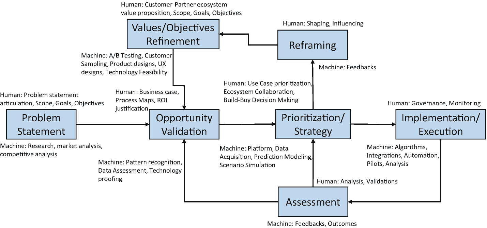

# 11. 整合：迈向人机协作生态系统

20 世纪 30 年代，英国植物学家亚瑟·坦斯利提出了生态系统的概念，其灵感来源于局部生物群落如何相互互动，并利用环境来维持生存、繁荣发展，甚至适应环境变化。

1993 年，詹姆斯·摩尔将这一概念扩展到现代商业领域：企业共同进化能力，既合作又竞争，以支持新产品、满足客户需求，并最终推动下一轮创新。

此前我们讨论过，经济已从大型“自给自足”的企业转向基于网络的公司，这主要得益于数字技术、海量数据、大幅提升的互联性以及云计算。苹果公司明确将其产品和服务设计为一个生态系统，为客户提供无缝体验；eBay 则认识到必须刻意构建其“共享生态系统”。价值创造（财富创造）已具有完全不同的含义：更密集、更丰富的网络让生产者和消费者协作，从而放大双方的成果。例如，谁能想到，帮助我们与同类群体建立联系的平台（Facebook、Twitter 和 WhatsApp）能产生巨大的商业价值？毕竟，这些只是人与人连接的系统。

我们的需求始终驱动着手段。我们关心健康，于是推动了医疗实践、医生、医院、药房等手段的出现。同样，我们希望找到超越人类肌肉和驯化动物的能源，于是我们找到了从化石燃料、电力、煤炭和核聚变中获取能源的方法。核能、飞机、汽车、个人电脑、收音机、互联网等创新颠覆了既有的商业生态系统和社会的运作方式，这些创新中的每一项都可以被称为*黑天鹅*。^(⁸) 这些突破在发现之初并非突破。它们在实验室里历经多年，只有在变得足够廉价以供大众消费后，才进入主流。仅凭人工智能战略，其误导性可能与其启发性一样大。我们认为人工智能技术是即将出现的另一只黑天鹅，因此，要真正利用人工智能的变革力量，我们别无选择，只能建立并利用一个基于人机共生的新生态系统。

## 人机共生

2011 年，IBM 的沃森赢得了*Jeopardy*游戏节目。这是一个分水岭时刻，并非因为机器在人类自己的游戏中击败了人类，而是因为其可能性让我们大开眼界。随后，人工智能领域取得了一系列引人注目的突破——图像识别、语音识别等等——所有这些都通过一种称为*深度学习*的技术得以实现。

另一方面，机器变得比人类更聪明，也引发了关于我们未来与机器关系的巨大不确定性和猜测。埃隆·马斯克将人工智能描述为“我们最大的生存威胁”。^(⁹) 斯蒂芬·霍金警告说，“全面人工智能的发展可能意味着人类的终结”。^(¹⁰) 哲学家尼克·博斯特罗姆在其著作《超级智能》^(¹¹) 中提到了技术“奇点”，届时机器将超越人类的一般认知能力。

所有这些争论和猜测都基于一个默认假设：因为机器能看、能听、能行动，并且持续学习，它们将在各种任务上（尽管目前仅限于狭窄领域）超越人类，并且基于同样的逻辑，它们很快就能更普遍地“超越”我们的思维能力。

重要的问题是，与其相互竞争，我们能否设计一种机制，让机器智能与人类智能相互补充？最终目标是构建能像人类一样思考的机器，并设计出能帮助人类更好思考的机器。

正如任何新技术演进一样，人工智能也经历了好几个进化阶段。理解这一切是如何开始的，以及最初的意图是如何被多次重新定义的，这一点很重要。

1955 年夏天，约翰·麦卡锡在达特茅斯大学召集了一次会议。与会者都是人工智能先驱中的顶尖人物。这份广为人知的“达特茅斯会议宣言”最初提出：“原则上，学习的每一个方面或智能的任何其他特征都可以被精确地描述，以至于可以制造一台机器来模拟它。”^(¹²)

通用智能（也称为`g`因子）指的是一种广泛的智力能力的存在，它使个体能够执行不同的认知任务。例如，个体在一类认知任务（比如描绘自然和风景的能力）上的表现，往往与同一个人在其他类型认知任务（比如绘制建筑图纸的能力）上的表现具有可比性。这种特定的通用智能能力，我们在今天的人工智能应用中看不到。一个为下棋而设计的算法，如果被要求提供产品推荐，将会完全不知所措。简而言之，当今人工智能代理的`g`因子仅限于一种狭窄的智能类型。

此外，像“神经网络”和“深度学习”这样的术语，正在误导我们声称即将创造出“像人类一样思考”的机器。虽然神经网络的灵感来自人脑，但实际上它被视为统计回归模型的泛化。同样，“深度”指的并非心理深度，而是增加结构（“隐藏层”），使模型能够捕捉复杂的非线性模式。“学习”指的是对回归模型中大量模型参数进行数值估计。

简而言之，迄今为止人工智能取得的惊人成功，是建立在统计推断的基础上的，而非对我们所认为的人类智能的近似或模拟。

## 利克莱德的增强论

达特茅斯会议五年后，心理学家兼计算机科学家 J. C. R. 利克莱德阐述了人类智能与计算机智能之间的共生关系。他提出了一种互补关系：人类将定义问题陈述、设定目标，并扮演验证学习成果的关键角色；机器则将承担筛选海量数据以生成洞察和预测的繁重工作。这种互补能力与协同任务执行，将比人类单独完成任务高效得多。

这种人机共生已悄然渗透进我们的日常生活。常见的例子包括：

-   使用像 `Waze` 这样的 GPS 应用在繁忙路口和复杂的道路迷宫中导航
-   通过个性化推荐菜单在海量书籍或电影选择中进行搜索
-   与机器对话、发出指令，机器则回复事实、数据、天气模式、附近餐厅等信息

在每种情况下，人类都会指定目标和标准（例如“带我去市中心，但避开繁忙街道”，或“给我推荐一些适度搞笑、无可救药地浪漫、且带有亚洲主题的电影选项”，或“找一家步行可达、评价高且价格适中的意大利餐厅”）。这是如何运作的呢？AI 算法筛选海量数据以得出预测。然后，人类评估机器输出以做出决策。每当人类选择或忽略某个特定预测时，AI 算法都会记录下这一点，并将该信息反馈到学习过程中，从而不断改进和学习。在任何情况下，人类智能都不会被掩盖，而是得到了增强。

事实证明，人类思维的不可预测的非理性程度比最初认识到的要低，而 AI 的类人程度也比最初期望的要低。

## 琳达实验：快思考与慢思考

AI 先驱赫伯特·西蒙在人机协作的背景下揭示了 AI 的另一个侧面。他认为，我们人类必须满足于“增强”而非优化的解决方案，因为我们长时间工作、记住大量事物以及良好推理的能力是有限的。相比之下，机器不会表现出工作疲劳，总能做出一致的决策，并且能以最小的努力处理海量输入。此外，它们评估数百万个因素的准确度远超人类。

丹尼尔·卡尼曼在其著作《思考，快与慢》^(¹³)中，强调了人类决策过程中有趣且非理性的方面。

每当我们面临众多选择时，我们就会进入一个决策过程。自然，我们似乎会评估大量数据、运用某些理性思维、回忆过往经验、与他人商议，然后做出决定。这就是卡尼曼所说的“系统 2”思维，或“慢思考”。

实际上，我们并不总是诉诸如此冗长缓慢的评估过程来做出决定。相反，我们通常依赖由各种心理经验法则（启发法）构成的自身部落知识来做出决定。我们自己的决策过程在叙述上似乎合理，但在逻辑上往往站不住脚。卡尼曼称之为“系统 1”思维或“快思考”，琳达实验就是其著名例证。

在一项针对顶尖大学学生的实验中，卡尼曼和特沃斯基描述了一个名为琳达的虚构人物。她非常聪明，大学主修哲学，并参与了女权运动和反核示威。基于琳达大学时代的这些细节，以下哪个关于琳达现今情况的场景更合理？

“琳达是一名银行出纳员。或者，琳达是一名活跃于女权运动的银行出纳员。”

卡尼曼和特沃斯基报告称，87% 的学生认为第二个场景更可能发生，尽管稍加思考就会发现这绝不可能是真的。女权主义银行出纳员是所有银行出纳员的一个子集。但添加“琳达仍然活跃于女权运动”这一额外线索影响了叙述的连贯性，导致学生选择了（可能性更低的）第二个场景。

本质上，人类思维会混淆易于想象与高度可能之事，其方式包括：让情绪蒙蔽判断、在随机噪声中假设模式、将因果关系归因于虚假相关性、以及从个人经验中过度概括。我们用于做出判断的许多启发法和智慧，结果证明存在系统性偏差。如果说我们的思维需要算法来消除判断中的偏差，我们的眼睛需要人工镜片来过滤虚假相关性，这或许并不算惊世骇俗。

另一方面，如果有一种方法能将日常任务背后的处理逻辑编码，那么可以肯定，算法在这些任务上的表现将优于人类。然而，此类算法将缺乏评估新奇或新颖情境所需的概念理解和常识推理能力。为了说明这一警示，我们以 IBM Watson 赢得《危险边缘》为例。比赛期间，在“美国城市”类别下出现了一个问题：“其最大的机场以一位二战英雄命名；其第二大机场以一场二战战役命名。”Watson 回答“多伦多”。类别是“美国城市”，但答案却是“多伦多”！（顺便说一句，正确答案是芝加哥。）

这个特殊的例子说明，人类智能的某些优势，如常识推理，可以抵消暴力机器学习的基本局限性。

AI 最引人入胜的一点在于，很难预测哪些部分会容易或困难。起初，像下棋这种对人类来说极具心智挑战的活动，对机器来说会是最难的，但结果却很容易。另一方面，像识别物体或拾取物体这类对人类来说相当简单的任务，对机器来说却困难得多。

总之，人类需要机器来避免“系统 1”决策陷阱，而机器需要人类来避免“系统 2”决策陷阱。两者共同表明，人机共生的理由比以往任何时候都更充分。

我们需要的是一种人机融合的策略。

## 人机融合策略（HMIS）

尽管人工智能的进步正日益让人类生活更轻松，但人们始终担心基于 AI 的系统会对人类构成威胁。AI 界人士对于 AI 模仿人类行为的利弊持有多种不同观点。

例如，一个经过 MNIST 数据集训练、用于检测数字的神经网络，在输入图像负片（即黑白颠倒）的测试样本时彻底失败，而人类处理这类情况则毫无问题。算法的可靠性仅取决于训练所用数据的完整程度。一如既往，垃圾输入意味着垃圾输出。

此外，AI 系统存在从收集数据中继承的偏见（这是人类会有意识地避免的）。例如，某餐厅评价系统给墨西哥餐厅打了低分，因为“墨西哥”这个词与其他非法活动相关联。

与其担忧 AI 的进步，我们能否提出一种人机融合策略，让人类和机器共同生活在一个复杂的自适应生态系统中呢？

我们将这种生态系统称为人机融合策略。它主要包括人类认知与智能机器，其中人与机器在解决问题时相互辅助。未来的人机融合策略并非由 AI 驱动的机器取代人类，而是机器与人类处于共生状态。利用 AI 最高效的方式是将其用于增强人类能力。机器在特定任务上表现更佳，而人类在通用任务上更胜一筹。因此，一种理想的前进方式是构建一个社会环境，让人类与机器在相互推动或委派任务（当对方不擅长时）中互动。

在人机融合架构中，人类角色是关键的差异化因素，不仅能提升信任、互惠和好感度，还能缓解人们对 AI 系统普及的恐惧与担忧。

智能机器模糊了计算层面与人类输入输出交互之间的界限。它们借鉴并扩展了多项成熟的计算原则，如群体智慧计算、集体智能计算、社交网络等。群体智慧计算侧重于将多位专家汇聚到同一平台，而智能机器则通过提供计算智能来增强这些专家的决策能力。这种混合系统能让人类与计算机和谐共处，共同实现既定目标。

现实中有许多任务无法完全由机器完成。在这些任务中建设性地运用人类认知，有助于让机器更容易解决问题。研究人员长期以来一直试图让人类与机器之间的交互显得无缝且自然。

人类的基本需求是食物、水、能量和安全。尽管这些基本目标对人类而言看似简单，但人们可能会好奇它们对机器意味着什么。对于机器代理而言，这些需求可能是电力、网络、存储、维护等。如同人类世界一样，没有什么是免费的。机器代理使用的每一种资源都必须有相应的支付概念。这可以想象为一种虚拟货币，它为机器代理的每个行为引入了奖励与惩罚的概念。

### 应用场景

基于 HMIS 的应用主要可根据人类与机器代理的构成，以及行为责任的归属，分为以下几种不同场景。

#### 机器代理作为人类助手

人类由实时机器代理协助，与多元文化代理（有时使用不同语言）协作。机器代理向人类提供必要信息和建议，但最终决策权在人类手中。

例如，考虑一个机器代理协助法官分析类似案件的先例裁决事实，或一个机器代理根据候选人的文化契合度协助招聘人员做出录用决定。

#### 完全自主的机器代理

自主机器代理与其他人类和机器代理协作。在此场景中，无人对机器代理的行为负责。因此，该场景仅限于机器代理行为风险极低的应用。

例如，考虑一个自主代理作为虚拟角色，在危险物理环境中执行任务，或在人类低接触环境中输入-活动-输出明确界定的场景下工作，或模拟自主机器代理在质量控制过程中进行观察、记录和发出警报。

#### 机器代理与人类交互

在此场景中，机器代理经过训练，能理解并依据其人类对应方的偏好和目标行事。机器代理有能力为其人类进行谈判和决策。它像自主机器代理一样工作，但在不确定时会回询其人类对应方。因此，机器代理行为责任由其人类对应方承担。

例如，考虑呼叫中心的机器代理回答人们的问题，并对其文化背景保持敏感，或一个机器代理在全球范围内进行随机 A/B 测试，同时考虑人们的文化背景。

#### 全机器代理交互

此场景在代理的训练方式及机器代理行为责任的归属方面与前一场景类似。区别在于没有人类参与交互。这给代理之间的交互方式带来了不同挑战。

例如，考虑决策者的机器代理协作，就招聘流程中的候选人排名达成共识，或团队选拔委员会成员的机器代理协作选择团队。

#### 人类与机器代理交互

此场景描述了一种典型设置：人类走进家中或办公室的特定房间，沉浸在她想要协作的另一组人（位于远程）的虚拟环境中。远程团队的全部或部分成员可能由其机器代理代表。

例如，考虑一个人类在虚拟环境中与朋友的机器代理聊天娱乐，或一个人类主持拍卖，人们派自己的机器代理出价。

## 治理框架

遵循艾萨克·阿西莫夫著名的机器人三定律，人机智能系统（HMIS）需要建立一个治理框架，以管理和监控人类与机器智能体如何以协作方式执行各自的任务。这些法则可与机器人三定律并行使用：

- 机器智能体绝不会收集肤色、身高、体重等身体特征作为视觉输入，用于学习或识别其所服务个体的文化背景。输入必须始终通过正式输入渠道提供。此举旨在使系统不受任何与身体特征相关的刻板印象影响。
- 任何涉及文化不敏感的言论、句子、词汇或俚语，将始终被标记为对所有文化不敏感，除非其替代性的积极方面已针对特定文化明确说明。
- 人类智能体需要一套主动学习系统，能够在交互后整合反馈，以持续验证其行为。

需要为人类和机器智能体明确界定清晰的“责任分离”与事件响应矩阵。人类和机器智能体随后可利用强制或自动化活动来管理相互依赖关系与交互。这些相互依赖关系与交互要么是预先设计的，要么可根据其所处场景在运行时执行。

效率与特异性至关重要，因此应通过妥善管理交互来清晰记录协调规则。HMIS 应能在提供安全性、可靠性和容错能力的多智能体复杂自适应生态系统中处理并发操作。协调过程应精确反映其形成所依据的语义。协调与问责的效果应精确地维持在智能体交互空间内。安全是人机交互中的另一个因素，治理框架不应忽视。正如人类遵守社会法律一样，机器智能体遵守若干防止其采取可能导致破坏性行动的极端措施的法律也同样重要。

就像社会中我们有律师和警察来执行强制性法律一样，在 HMIS 生态系统中，我们也需要“监察者”来维护法律。

例如，在通过面试流程招聘公司人类员工、且最终决策由机器智能体做出的场景中，HMIS 监察者将追踪整个流程中机会平等的基本价值观是否得到维护。例如，如果它无意中招聘了导致性别偏见或种族、肤色、性取向偏见的候选人，HMIS 监察者将不会批准此类招聘，并会建议机器智能体重新评估或改变其决策。其他例子可能包括 HMIS 监察者监控通信文本，以检测不可接受或文化不敏感的词语或概念。此外，HMIS 监察者还可能提供分布式和自主的平台，以验证来自机器的通信的真实性。法律的治理在 HMIS 中很重要，但同样重要的是应灌输给智能体的伦理道德。

在商业环境中，违反行为准则应归入伦理范畴。如前所述，任何导致种族主义、辱骂行为甚至数据滥用的行为都将属于伦理违规，在这种情况下，惩罚应相当严厉。伦理之下是治理，即智能体在其领域或任务中受上级智能体管辖。智能体之间的治理结构应是层级式的，治理官员在基于达成的共识采取行动时，既要有问责制，也要有自主权。HMIS 监察者有望通过整个治理过程变得更加智能。这可以通过利用对抗性机器学习程序来实现。由于智能体需要在其角色和职责中不断进化，因此在智能体的学习过程中拥有足够的垃圾信息过滤机制至关重要。这只有在 HMIS 监察者通过改进智能体通信模式中的过滤机制而变得聪明时才能实现，否则可能会使智能体破坏自身乃至整个生态系统的健康学习过程。

我们还必须讨论在实现稳定 HMIS 生态系统道路上可能遇到的潜在挑战，接下来将对此进行探讨。

### 机器的可信度与好感度

促成两个个体之间交互的首要条件是接受这种交互。这种接受度取决于个体之间相互信任的程度，而接受的程度/水平则与个体之间的好感度直接相关。

如果上下文中的个体之一是机器，这就变得棘手了。虽然从机器的角度来看，信任和好感度并不构成障碍（因为它总是可以通过编程方式改变），但反之则是一场艰苦的战斗。每当有文章或新闻报道机器能力的提升，或突出显示自主机器犯下的错误时，对机器的信任就会受到打击。HMIS 生态系统要求人与机器之间进行无缝、开放的信息交换，这需要消除相关人类心中对机器的任何疑虑。智力上的优越性并不一定会让机器变得讨人喜欢，因此这比纸面上看起来要复杂得多。例如，与总是正确的机器相比，会犯错的机器似乎让人类感觉更自在。

### 人机关系

人机关系是一种共生关系，两个实体相互依赖。虽然机器在执行定义明确的任务方面优于人类，但人类在并非完全可控且受不确定因素影响的动态任务方面更胜一筹。由于现实生活中的情况可能包含这两种类型的任务，因此自由度需要在人类和机器之间进行划分。

HMIS 生态系统由机器网络和人类网络相互交织而成。随着机器变得越来越自主，保持对其关系性质以及依赖范式变化的检查至关重要。

定义这种关系至关重要；如果一个自主智能体犯了错误或违反了法律，这种关系对于确定哪个实体将承担责任至关重要。必须解决诸如自主性的动态变化、任务的所有权以及工作分配等挑战。

#### 所有人类皆不同

作为人类，我们与不同的人互动方式各不相同。人们与家人互动的方式不同于与同事互动的方式，因为存在一个高维度的背景信息，决定了互动的基调和层次。这种背景不仅限于互动双方之间的关系，还延伸到参与者的个人特征，例如年龄、性别等。自然，在让机器越来越像人的道路上，识别最大化的背景信息至关重要，因此这成为了我们的下一个挑战。

虽然在识别人类物理特征（如性别和年龄）方面已有大量研究，但在通过语调、表情和肢体语言识别情绪、情感等动态特征方面，也有相当多的工作正在进行。使用这些已识别背景信息的一个有趣方面和额外复杂性在于，它具有文化特异性。即使在机器与人类的互动中，文化也扮演着重要角色，影响着不同文化背景的个体对机器的不同看法。机器不仅需要理解某些手势在不同文化中的含义，还需要理解它们的回应在相同背景下会如何被接收。

人与技术必须各司其职，如图 11-1 所示，人类必须不断演进机器的设计，提供治理框架，监控能力，并接受这样一种观念：人机整合战略不会淘汰他们，反而会增强他们的能力。

**图 11-1** 人机整合战略地图

## 结论

数据增长的速度远远超过了我们从中提取商业价值的能力。大多数从原始数据到洞察的解决方案都是为处理数据量而设计的。少数是为处理复杂性而设计的。能同时出色处理数据量和复杂性的方案更是少之又少。因此，挑战在于如何从海量复杂数据中提取商业价值。

与此同时，一些公司正在进行大胆的尝试，例如“思维即服务”。Nectome^(¹⁴) 正在研究开发一种先进的脑库技术，旨在将临床保存的大脑数字化，并利用这些信息重建人的思维。利用大脑中神经元之间的突触并对大脑进行逆向工程，有可能使其所有记忆完好无损地保存下来。结果如何？从童年到人生中的起起落落，与这些事件相关的经历、教训和智慧，所有这些都可以在日后作为一种服务提供。不过，我们离实现这种可能性还有多远，只有时间能告诉我们。

对许多人来说，“算法”一词描绘的是一套复杂难懂的数学公式。然而，现实是算法无处不在，它们大多以隐形模式运作，却能带来显著的商业成果并提升我们的生活质量。毫无疑问，在商业环境中使用算法有巨大的优势；然而，也有一些挑战需要解决。

*情境化*：算法提供了一种非常客观的视角，从而得出最终预测。例如，它们可以准确预测客户对某个优惠的反应，但无法明确指出客户为何会有那样的行为！因此，情境化对于将原因与相关性联系起来变得极其重要，这也是算法得以改进并更接近现实的唯一途径。纯粹基于算法预测来做决策，可能会让你的战略误入歧途。

*判断力*：算法擅长分析数百万个数据点并提供精确的建议；然而，它们缺乏人类所拥有的判断力。例如，在你的采购分析中，算法可以考虑各种因素，如供应商绩效、经济状况、原材料本地折扣率、与供应商的关系强度等，并得出最优选项。但是，它无法像经验丰富的人类那样与供应商进行谈判以获得最优惠的价格。

在我们与业务所有者、技术从业者和首席高管们的无数次对话中，有一个问题被反复提及：“你认为算法会影响我们的组织和我们的角色吗？”为了回答这个问题，我们借用高德纳报告^(¹⁵)中的一些统计数据，该报告估计，到 2018 年，20%的商业内容将由机器生成；而到 2020 年，自主软件代理将参与 5%的经济交易。

总而言之，鉴于数据源的丰富（感谢数字化成为生活和商业的常态）以及技术的快速演进（物联网、云、自动化、区块链和机器学习/深度学习），算法化商业将成为常态，而非异常。虽然预测成本会越来越低，但对判断力的需求将会上升，人的因素不能被完全剔除。组织需要重新思考其战略，并专注于产品、服务、客户、市场和人力资产。他们还需要在其企业战略规划中增加一个维度——人机整合的人工智能战略。

