# 1. 重新审视机器学习

想象一下，如果你被带回到 20 世纪 90 年代末的美国，当局发现了你在机器学习（ML）方面的专业知识。他们联系你寻求你的帮助，自动化一项耗时的工作：阅读信件上的邮编。据称，全国各地的各个邮局有 500 名这样的员工，每位员工每月支付 2000 美元的工资来完成这项任务。这累计到每月支出 100 万美元，导致年度成本为 1200 万美元，在未来五年内，全国总计高达 6000 万美元。

为了帮助政府节省宝贵的国库资金，你被要求设计一个程序，能够高效地读取和解释信件上的邮编。这个解决方案不仅有助于节省成本，而且将大大提高准确性和加快处理速度。你能想出一个完成这个任务的算法吗？

事实证明，编写这样的算法并不容易。让我们看看原因！为了理解这个问题，让我们从一个识别 28 像素×28 像素图像中的“1”的算法开始。理想情况下，可以考虑围绕中心垂直方向的像素来识别图像是否包含“1”。然而，这个数字是手写的，因此它可以以多种方式书写，从比例、方向、风格等方面来看。图 1-1 展示了从流行的 MNIST 数据集中获得的几个手写“1”的图片，该数据集包含手写数字的图像。如果识别“1”很难，那么想象一下识别所有数字和字母以及处理这些内容。

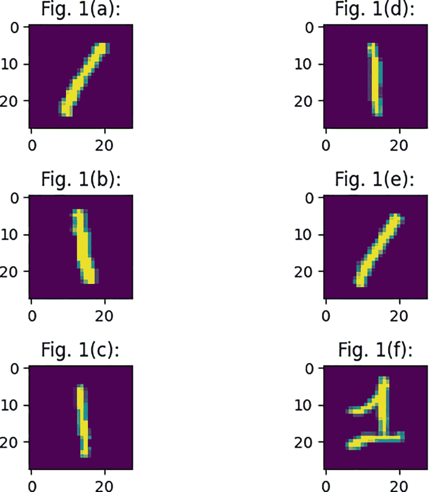

图 1-1

从 MNIST 数据集中获得的几个“1”的图片

对于人类来说，识别手写数字是一项简单的任务，但很难制定出一套规则或算法来识别给定图片中的数字。因此，我们需要一些系统能够模仿人类来完成这项任务。在这里，机器学习（ML）可以帮助我们。非正式地，机器学习可以这样定义：

> *机器学习* 是人工智能的一个子集，它可能被认为是机器模仿人类的能力。1

机器学习的正式定义将在以下章节中讨论。机器学习帮助我们完成诸如疾病分类、预测和预报、物体识别、情感分类等任务。

本章简要介绍了机器学习，并讨论了其类型、流程及其组件、应用以及偏差-方差权衡。本章还展示了使用传统机器学习流程（包括特征提取、特征选择、分类和结果分析）对**MNIST 数据集**进行**分类**的示例。本章还包括了一些最重要的特征提取和选择技术的 Python 实现。本章还简要讨论了从图像、声音和文本等不同模态中提取特征。除了上述内容，本章还涉及一个重要的降维方法，即主成分分析（PCA）。本章以一个案例研究结束，即**使用传统机器学习流程对 MNIST 数据集进行分类**。该案例研究使用了一种重要的特征提取技术，即局部二值模式（LBP），通过滤波方法选择重要特征，并使用支持向量机（SVM）对数据进行分类。对于这个领域的新手来说，本节中使用的某些术语可能不太熟悉。对于这类读者，以下章节将有所帮助。然而，对于那些熟悉这些概念的读者，可以跳过本章，直接进入下一章。

## 机器学习：简史、定义和应用

从古至今，人类一直在努力开发与人类智力相当的人工智能。机器渴望像人类一样学习，并通过经验在任务上变得更好，这帮助我们达到了今天这个技术飞速发展的时代。这种进步应该是可衡量的。20 世纪 50 年代，IBM 的 Samuel 开发了国际象棋程序，这可以被认为是朝着这个目标迈出的第一步。20 世纪 60 年代，模式识别领域取得了进展，尤其是在 Rosenblatt 对感知器的研究之后，Minsky 和 Papert 描述了感知器的局限性。20 世纪 70 年代，专家系统和符号自然语言处理得到了发展。接下来的十年见证了决策树的发展和多层感知器（MLP）的诞生。在 20 世纪 90 年代，开发了一些最重要的学习方法，如支持向量机、强化学习和集成模型。科学界希望开发出能够在某些认知任务上击败人类的机器，这种愿望随着 IBM 开发的 Deep Blue 的诞生而得到了推动，它击败了当时的国际象棋冠军 Garry Kasparov。自那时起，使用上述方法设计自动驾驶汽车的工作已经取得了长足的进步。图 1-2 描绘了机器学习直到 1999 年的主要里程碑。

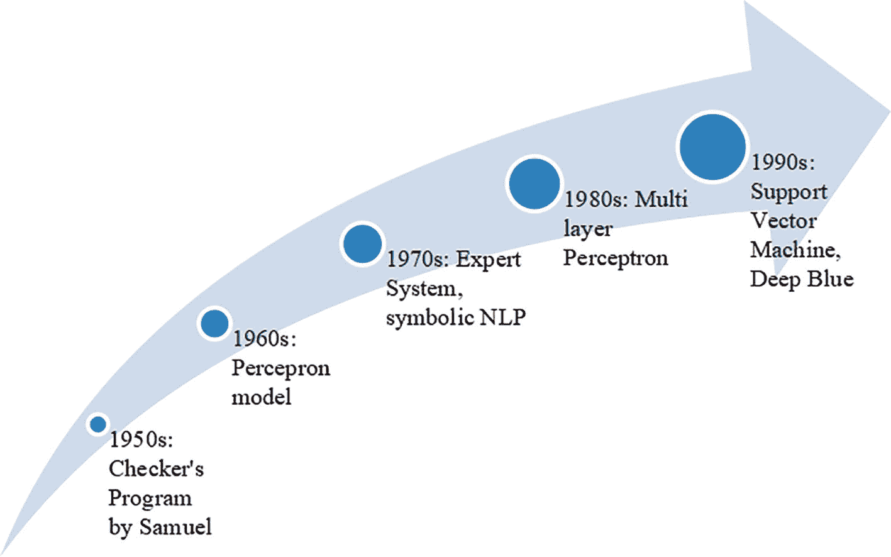

图 1-2

2000 年之前的机器学习

机器学习（ML）是人工智能（AI）的一个子集。机器学习算法通过数据集进行训练和测试，帮助我们完成人类更擅长的工作。数据集可能是有标签的，也可能没有标签。另一方面，人工智能（AI）致力于开发具有“类似人类认知能力”的机器 [2]。为了理解这个概念，让我们举一个例子。假设你需要开发一个系统，该系统能够接收图像作为输入，并将其分类为“猫”或“非猫”。输入图像的大小为 100 × 100，输出是一个二进制数，其值为 0（非猫）或 1（猫）。你设法开发了这个系统，并取了 1000 张新图像，其中系统正确识别了 673 张图像。因此，未见过的图像正确分类的百分比（准确率）是 67.3%。你请了一位恰好是机器学习工程师的朋友来帮助你改进系统。他们修改了系统，之后系统正确分类了 721 张图像，从而将准确率提高了 4.8%。此外，随着系统训练的图像越来越多，准确率也在提高。考虑到未见过的样本正确识别的百分比，即准确率，作为性能指标，系统的性能 P 随着经验 E（在这种情况下，是数据）在给定的任务 T（分类）上得到提升。因此，这个系统正在学习。形式上，机器学习可以定义为

> 当一个系统的性能 ***P*** 在经验 ***E*** 的积累下在任务 ***T*** 上得到提升时，我们说这个系统正在学习。3

机器学习（ML）目前被应用于各个领域，从产品推荐到股市预测，再到疾病检测等。以下是一些有趣的机器学习应用：

+   推荐系统：哈利在亚马逊上有一个账户，在收到第一份薪水后开始购买他喜欢的物品。他喜欢书籍、文具和音乐。因此，他从该平台购买了《星运里的错》、时尚笔记本和打击乐器。下个月他也购买了类似的东西。当他再次访问该平台时，推荐部分显示了一些约翰·格林的书籍以及其他一些乐器、笔记本和音响条。你能猜到为什么约翰·格林的书籍和音响条会出现在推荐部分吗？这是因为该平台利用机器学习，利用用户数据和评分进行学习。它还使用了本书后面将要讨论的自然语言处理。现在，想想如果你发现你的 YouTube 和朋友的 YouTube 上的推荐不同，你能想到什么原因。

+   Google Maps：假设你需要去印度首都新德里附近的一个城市古鲁格拉姆的公司面试。你现在住在德里，从未去过那家公司。你决定开车去目的地，并使用一个名为 Google Maps 的应用程序找到最佳路线。等等！这个应用程序是如何知道从你的位置到目的地的最佳路线的？此外，该应用程序声称某些路线比其他路线更好，从拥堵、距离或其他标准来看。这个应用程序使用机器学习来找到从源头到目的地的最佳路径。它从“Waze”应用程序获取交通数据，这是一个谷歌在 2013 年收购的应用程序。如果你使用这个应用程序很长时间了，你一定注意到了它的性能显著提高了。这也归功于机器学习。好吧，你打开位置功能也有助于 Google Maps。

机器学习的其他应用例子包括

+   疾病检测和预测

+   Amazon Alexa

+   自动驾驶汽车

+   情感分析

+   客户流失

以上内容将在以下章节中详细讨论。现在，你已经了解到机器学习无处不在的使用：从你手持设备上的面部识别到 Netflix 的推荐。让我们继续了解学习的类型。

## 机器学习的类型：任务 (T)

机器学习可以分为监督学习、无监督学习、半监督学习或强化学习。在监督学习中，系统使用样本和相应的标签进行训练。在测试期间，它被给出输入，并生成预测输出。学习算法试图学习模型的参数，以减少预测标签和正确标签之间的差距。监督学习可以进一步分为分类和回归。在分类中，样本对应的标签是离散的，而在回归的情况下，它们是连续的。

在无监督学习中，系统被提供了特征，并且没有标签与样本相关联。这些算法揭示了给定数据中的模式。此类学习的例子包括在社交媒体上寻找趋势、产品之间的关联等。

**监督学习**

“在监督学习中，我们被提供了某些输入/输出样本 (X, y)。算法的目标是找到一个函数 y = f(X)，它将特征向量与标签相关联。这个函数 f 在一些未见过的数据上被学习和评估” [4]。

**无监督学习**

“在无监督学习中，我们只被提供了数据样本 X，并计算一个函数 f，使得 y = f(X) 是 ***更简单***” [5]。聚类是一种无监督学习。

**半监督学习**

“半监督学习（SSL）介于监督学习和无监督学习之间。除了未标记的数据外，算法还被提供了一些样本的标签，而不是全部” [5]。

**强化学习**

“在强化学习中，系统作用于环境，并获得一些反馈。根据这些反馈，系统改变其行为。”强化学习常用于自动无人机。

机器学习定义中的下一个要素是性能，P。现在让我们了解一些常见的性能指标。

## 性能（P）

考虑一个有两个类别：正类（P）和负类（N）的分类问题。为了对这个数据集进行分类，你设计了一个系统，该系统对未知样本预测为正类或负类。预测可以是真正例（TP）、真负例（TN）、假正例（FP）或假负例（FN）。分类结果可以用混淆矩阵表示，如图 1-3 所示。

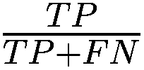

图 1-3

二元分类问题的混淆矩阵

+   真正例（TP）：模型正确预测了一个正类实例。

+   真负例（TN）：模型正确预测了一个负类实例。

+   假正例（FP）：模型错误地预测一个实例是正类，而实际上它是负类。这被称为 I 型错误。

+   假负例（FN）：模型错误地预测一个实例是负类，而实际上它是正类。这被称为 II 型错误。

这四种情况有助于评估开发模型的性能。可以从这些情况中推导出重要的指标，如准确率、特异性、召回率、精确率和 F1 分数，以对模型在区分两个类别方面的有效性进行广泛评估。请注意，模型应尽可能减少假正例和假负例，而真正例和真负例应尽可能高。表 1-1 显示了双类问题的各种性能指标及其简要描述。

表 1-1

分类指标

| 性能指标 | 公式 | 描述 | Keras 实现 | sklearn 实现 |
| --- | --- | --- | --- | --- |
| 准确率 | 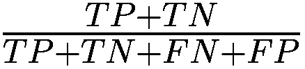 | 正确分类的测试案例总数。 | tf.keras.metrics.Accuracy¹ | sklearn.metrics.accuracy_score |
| 特异性（假正例率） | 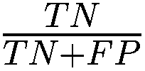 | 正确分类的负类测试案例总数。 |   |   |
| 灵敏度/召回率（真正例率） |  | 正确分类的正类测试案例总数。 | tf.keras.metrics.Recal1^l | [sklearn.metrics](https://scikit-learn.org/stable/modules/classes.html#module-sklearn.metrics).recall_score |
| 精确率 | 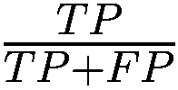 | 正预测的良好性。 | tf.keras.metrics.Precision¹ | precision_score² |
| F-score | (2 × **召回率** × **精确率**)/(**召回率** + **精确率**) | 它用于不平衡类别的問題，其中准确率可能具有误导性。 | tf.keras.metrics.F1Score¹ | f1_score³ |

为了使用表中声明的函数，您需要导入以下内容（请参阅表中函数的脚注）：

1.  import tensorflow as tf

1.  [sklearn.metrics](https://scikit-learn.org/stable/modules/classes.html#module-sklearn.metrics).precision_score

1.  fromsklearn.metricsimport f1_score

对于多类问题，上述矩阵可以根据需要扩展。例如，对于三个类别的分类问题，图 1-4 中所示的矩阵解释了分类器的性能，不仅包括正确的分类，还包括有多少测试样本被分类为其他类别。这个矩阵的对角线描述了算法正确分类的测试案例。在 ***sklearn*** 中，它通过 *sklearn.metrics.****confusion_matrix*** 实现。

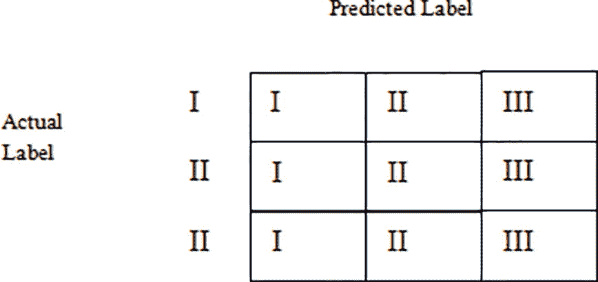

图 1-4

混淆矩阵

在多类问题的情况下，可以计算每个类别的精确度和召回率。模型的精确度和召回率可以看作是每个类别的平均精确度和平均召回率。上述指标的使用在接下来的示例和说明中展示。

通过改变阈值，特定性和敏感性的图被称为接收者操作曲线（ROC）。此曲线下的面积称为 AUC 或接收曲线下的面积（图 1-5）。

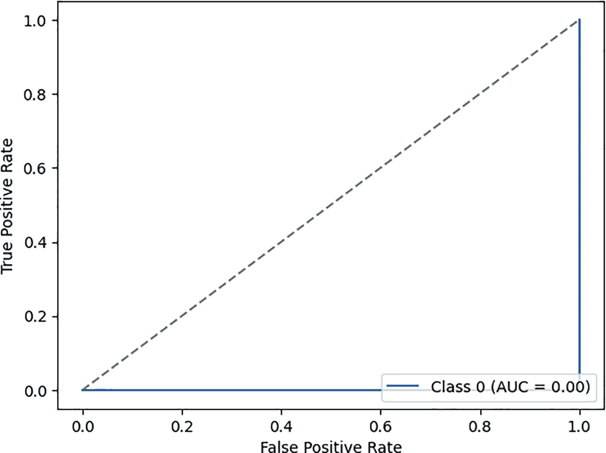

图 1-5

ROC-AUC 曲线示例

评估回归性能的指标在表 1-2 中展示。

表 1-2

回归指标

| 性能指标 | 公式 | sklearn 实现 | Keras 实现 |
| --- | --- | --- | --- |
| 均方误差 | 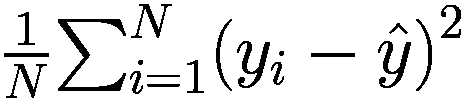 | sklearn.metrics.mean_squared_error | tf.keras.metrics.MeanSquaredError |
| 根均方误差 | 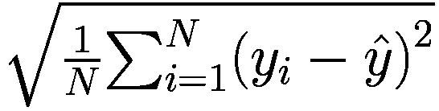 | sklearn.metrics.mean_squared_error squared = False, 返回 RMSE | tf.keras.metrics.RootMeanSquaredError |
| 均方绝对误差 | 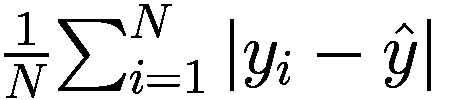 | sklearn.metrics.median_absolute_error | tf.keras.metrics.MeanAbsoluteError |
| R-Squared | 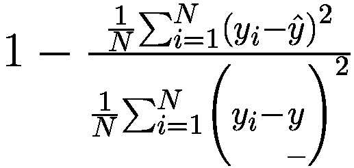 | sklearn.metrics.r2_score | tf.keras.metrics.R2Score |

上述每个内容将在后续章节中解释，具体使用时再进行说明。现在，让我们转向传统机器学习流程的元素。

## 传统的机器学习流程

传统的机器学习流程包括开发机器学习模型的完整过程。这包括从数据收集到模型部署的步骤。机器学习流程中的主要步骤包括

+   问题定义：需要明确定义手头的问题，并将其分类为监督学习、无监督学习或强化学习问题。

+   数据收集和预处理：然后决定收集数据的协议。接着收集数据，并执行预处理，包括处理缺失值、异常值分析以及其他旨在解决数据不一致性的过程。

+   探索性数据分析（EDA）：这一步对于分析给定数据并了解数据的特征至关重要。

+   特征工程：这一步包括从现有特征中选择相关特征、转换现有特征或创建新特征以提高模型的性能。

+   数据划分：然后数据被划分为训练集、验证集和测试集。训练集用于训练模型，验证集用于找到超参数的值，模型使用测试集进行评估。

+   选择模型：接下来是选择学习算法，如支持向量机、决策树等。

+   模型训练：然后模型在训练集上训练。使用验证集来调整所形成模型的超参数。为了做到这一点，使用了网格搜索、随机搜索或其他优化方法。

+   模型评估：然后使用测试集来评估模型的表现。用于此目的的指标已经在之前的讨论中提到。

+   分析：然后根据应用来解释模型的决定。

模型部署、监控和维护随后进行。根据已部署模型和洞察力的反馈，每个步骤可能需要多次优化。图 1-6 总结了讨论内容。

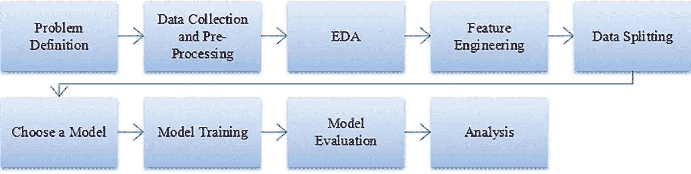

图 1-6

传统的机器学习流程

现在我们来看一个任务，即回归，并了解我们实际上是如何在一种称为线性回归的回归类型中学习模型的参数的。

## 回归

回归是一种监督学习类型，其中我们被给予 (*X*, *y*)，其中 *XϵR*^(*d*) 和 *yϵR*。也就是说，标签是连续的。回归的目标是开发一个模型，该模型在训练数据上训练后，可以预测未见过 *X* 的 *y* (*y* _ *pred*)。

模型的参数是通过最小化 *y* _ *pred* 和 *y* _ *test* 之间的平方差来学习的。也就是说，要最小化 *loss* = (*y*[*pred*] − *y*[*test*])² 或 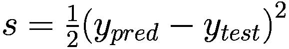 ，其中 ½ 是为了数学上的方便而插入的。

这种损失可以通过找到参数的梯度并在相反方向上逐步移动来最小化。

在线性回归的情况下，标签 *y* 可以被认为是样本 *X*[*m*] 的 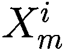 的线性组合。也就是说，

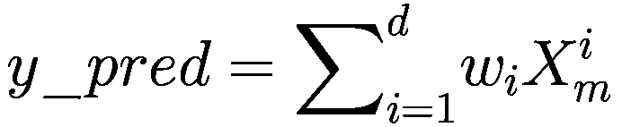

*w*[*i*]s 的值可以使用上述概念来计算。也就是说，

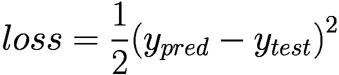

+   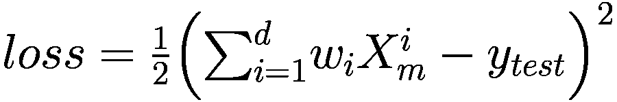

+   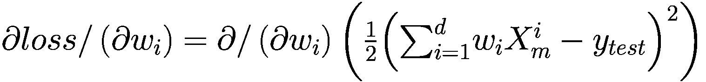

+   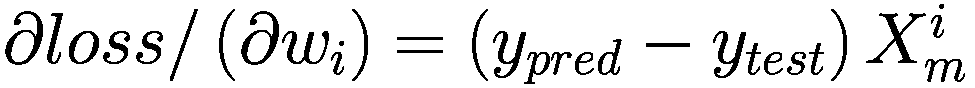

+   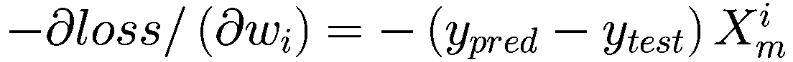

因此，在每次迭代之后，权重将根据以下公式进行更改：

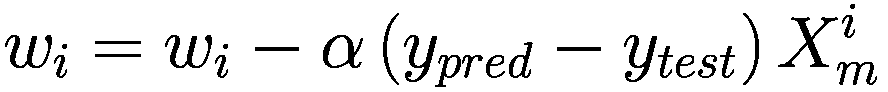

其中 *α* 是学习率。

通常情况下，

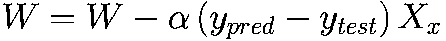

*α* 的值决定了每次迭代的步长。如果这个参数的值很小，则需要更长的时间才能达到最优解，而如果它很大，我们可能会跳过最优解。网络资源包括线性回归的代码及其在流行的波士顿房价数据集上的应用。

注意，有时从给定的数据集中提取特征、减少特征数量或转换特征到另一个空间变得很重要。特征选择和特征提取是机器学习管道中最重要组成部分之二。让我们简要概述一下这两个方面。

## 特征选择

特征选择旨在从给定的特征中选择一个子集，目的是最小化分类错误。也就是说，对于给定的 *X* = {*X*¹, *X*², …, *X*^(*n*)}，需要选择一个子集 *X* = {*X*¹, *X*², …, *X*^(*d*)}，其中 *d* ≤ *n*，这是最具代表性的特征，目的是最小化模型的内存需求和计算时间。特征选择是必要的，因为有些特征不会增强模型的性能，有些可能对模型的性能产生负面影响。

读者可能已经注意到，特征选择与降维不同，降维中可能会计算新的特征，而原始数据和单位通常丢失。相比之下，在特征选择中，只选择少量特征，并保留原始数据。这也可以被视为一个优化问题，其中选择特征子集的目的是优化目标函数。

特征选择可以使用搜索策略或评估策略。遗传算法等启发式搜索算法通常用于选择最优特征子集。评估策略包括过滤和包装方法（图 1-7）。

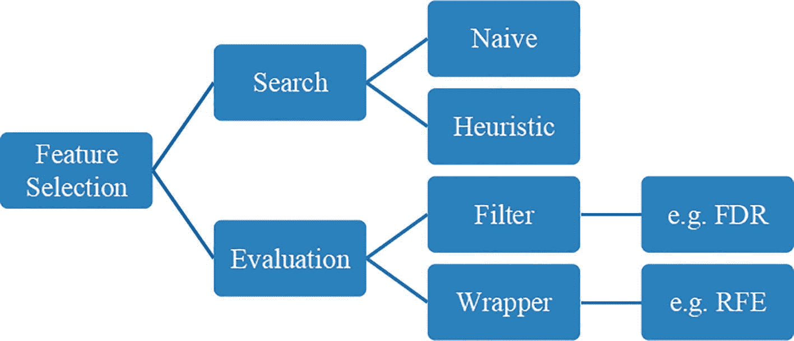

图 1-7

特征选择方法

### 过滤方法

在过滤方法中，特征的选择与学习算法无关。这可能是在信息内容的有帮助下完成的。例如，一种称为费舍尔判别比（FDR）的特征选择方法，通常用于双分类问题，它更重视两个类别的聚类中心之间的距离更大，而这两个聚类的方差更小的特征，即对于具有两个子集 *X*[1]和 *X*[2] 的特征 *X*[*i*]，这两个子集分别代表两个类别的数据。

(*m*[1] − *m*[2])² 是更多的

whereas

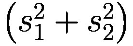 是更少的

其中 *m*[1] 是 *X*[1] 的均值，*m*[2] 是 *X*[2] 的均值，*s*[1] 是 *X*[1] 的标准差，*s*[2] 是 *X*[2] 的标准差。计算特征 FDR 的公式是

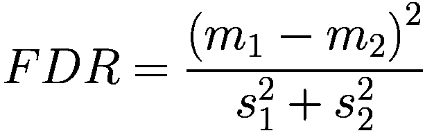

此方法可用于前向特征选择（FFS）。在 FFS 中，计算每个特征的 FDR，并将特征按其 FDR 值降序排列。然后，从这样排序的数据集中取第一个特征（并评估第一次迭代的性能）。在第二次迭代中取两个特征，依此类推。记录每次迭代的模型性能，并选择导致最佳性能的最小特征数。

以下代码展示了 IRIS 数据集中特征按其 FDR 分数排列的顺序，随后应用了前向特征选择。

**代码：**

```py
#Importing Libraries
from sklearn.datasets import load_iris
import numpy as np
from sklearn.model_selection import train_test_split
from sklearn.svm import SVC
from matplotlib import pyplot as plt
#Loading Data
Data= load_iris()
X = Data.data
y = Data.target
X = X[:100, :]
y = y[:100]
print(X.shape, y.shape)
#Calculating FDR
def calFDR(X, y):
X1 = X[:50,:]
X2 = X[50:, :]
m1 = np.mean(X1, axis = 0)
m2 = np.mean(X2, axis = 0)
s1 = np.std(X1, axis = 0)
s2 = np.std(X2, axis = 0)
fdr = ((m2 - m1)**2)/(s1**2 + s2**2)
ind = np.argsort(fdr)
ind= ind[: : -1]
return fdr, ind
#FDR Output
fdr, ind1= calFDR(X, y)
X1 = X[:,ind1 ]
print(ind1)
#Forward Feature Selection
accuracies = []
for i in range(X.shape[1]):
X2 = X1[:,:(i+1)]
X_train, X_test, y_train, y_test = train_test_split(X2, y, test_size=0.3)
clf1 = SVC(kernel='linear')
clf1.fit(X_train, y_train)
y_pred = clf1.predict(X_test)
acc = np.sum(y_pred==y_test)/y_pred.shape[0]
accuracies.append(acc)
print(accuracies)
#Plotting
X_imp = X[:,2]
X1 = X_imp[:50]
X2 = X_imp[50:]
ind1 = np.arange(50)
plt.scatter(ind1, X1, label='class 0', color='r')
plt.scatter(ind1, X2, label='class 1', color='b')
plt.title('Scatter Plot')
plt.legend()
plt.show()
```

注意，在 IRIS 数据集中，FDR 选出的最重要的特征可以很容易地将两个类别分类，如图 1-8 中的散点图所示。

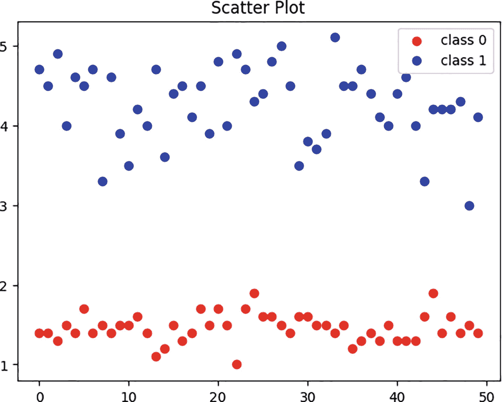

图 1-8

FDR 选出的最重要的特征的两个类别的散点图

### 包装器方法

在包装器方法中，我们根据特征相对于分类器的性能来排序特征。例如，一个流行的包装器方法称为递归特征消除（RFE），它采用以下策略：

1.  首先，我们取所有特征，并找到相对于给定分类器的性能。

1.  然后，我们一次消除一个特征，并记录所有情况下的性能。

1.  然后消除那些移除后能提高性能的特征。

1.  此过程会重复进行，直到无法进一步优化为止。

以下代码展示了 RFE 在 wine 数据集上的应用：

```py
from sklearn.datasets import load_diabetes
from sklearn.feature_selection import RFE
from sklearn.svm import SVR
#load diabetes dataset
data=load_diabetes()
X=data.data
y=data.target
#Select regression model, in this case SVR
model=SVR(kernel="linear")
#Create feature selector
feat_selector=RFE(model, n_features_to_select=5, step=1)
feat_selector.support_
```

**输出：**

```py
array([False, False,  True,  True, False, False,  True,  True,  True,
False])
feat_selector.ranking_
array([4, 6, 1, 1, 3, 5, 1, 1, 1, 2])
```

### 过滤器方法与包装器方法

过滤器方法通常更快，并利用数据的内在属性，尽管它们有一个缺点：通常它们会选择更大的特征子集。另一方面，包装器方法通常导致更好的准确率并避免过拟合。然而，这些方法要慢得多，并且对分类器的选择非常敏感。

注意，特征选择是一个详尽的主题，其中有许多方法，如顺序前向选择、顺序后向选择、双向搜索等。找到最适合您任务和数据集的特征选择方法可能很困难。在这里，深度学习非常有用，因为它几乎消除了特征选择的必要性。

## 特征提取

一个分类系统通常在应用分类之前从给定的数据中提取特征。由于需要更具有代表性、更紧凑的输入数据表示来设计一个有效且高效的系统，因此特征提取是必要的。本节简要讨论了在图像分析中特别使用的各种特征提取方法。本节中的方法在机器人视觉、医学成像、字符识别等领域得到应用。本书第三章讨论了用于文本数据的特征提取方法，而用于声音数据的特征提取方法则在附录 G 中讨论。根据 Theodoridis 和 Koutroumbas 的《模式识别》（Elsevier，2006 年）

特征提取

“图像特征提取的目标是生成一个特征向量，该向量通常被输入到分类器中，并帮助它将图像分类到可能的类别之一。”

特征提取不仅用于分类，还用于分割和减少冗余信息。除了上述内容之外，原始图像通常包含大量的像素，并且不能将这些所有像素都作为给定图像的特征。例如，对于 1024 × 1024 的图像，像素数量为 100 万。如果将这些所有像素都作为特征，那么系统将不得不学习 100 万个参数，这将需要大量的训练数据和计算数据以及巨大的内存。如果某种方式可以将相同的图像表示为一个包含 256 个值的向量，那么系统将变得更加高效和有效。实际上，使用原始图像的像素作为特征会导致维度灾难。根据 Bellman 的《自适应控制过程》（普林斯顿大学出版社，普林斯顿，新泽西州，1961 年），维度灾难可以被定义为

维度灾难

“为了以给定的精度估计任意函数，所需的样本数量与输入变量的数量（函数的维度）呈指数增长。”

因此，减少特征数量有助于我们处理维度灾难。对于图像，可以提取许多类型的特征。这些包括

+   直方图特征

+   灰度级特征

+   形状特征

+   颜色特征

直方图特征，也称为纹理特征，通常包括图像的一阶统计量或二阶统计量。一阶统计量包含与灰度级分布相关的信息，而二阶统计量包含与灰度级相对分布相关的信息。二阶灰度级特征的例子包括共现矩阵。

### 灰度级共现矩阵

在灰度共生矩阵（Gray-Level Co-occurrence Matrix，GLCM）中，计算灰度级的共生矩阵。随后，以 45 度的步长评估方向的方向。对于每个方向，我们计算六个指标，即对比度、差异度、同质性、ASM、能量和相关性。在这些指标中，ASM 可能会被省略，因为能量与 ASM 直接相关。这五个参数为四个角度（0、45、90、135）中的每一个计算，从而创建 20 个特征。帮助我们提取 GLCM 特征的 ***sklearn*** 函数是 **graycomatrix**。以下代码找到了名为 gray_image 的图像的四个 GLCM 特征。

**代码**:

```py
glcm_matrix = graycomatrix(gray_image, distances=[1], angles=[0], levels=256)
contrast_feat=graycoprops(glcm_matrix , 'contrast')
dissimilarity_feat=graycoprops(glcm_matrix , 'dissimilarity')
homogeneity_feat=graycoprops(glcm_matrix , 'homogeneity')
energy=graycoprops_feat(glcm_matrix , 'energy')
correlation_feat=graycoprops(glcm_matrix , 'correlation')
```

直方图特征的另一个例子是灰度级行程长度矩阵（Gray-Level Run Length Matrix，GLRL）。

### 局部二值模式

LBP 评估每个像素的加权平均值，然后形成由该图像像素强度形成的直方图。它有许多变体，其中最流行的是默认、ror、nri_uniform 和 uniform。本章给出的案例研究详细描述了这种特征提取方法。请注意，从中心像素到半径和邻居的数量是该方法的两个最重要的参数。图 1-10 展示了在图 1-9 中应用的 LBP，使用半径 1 和 2 以及邻居数量 4 和 8，以及默认、ror、nri_uniform 和 uniform 方法。

**代码**:

```py
from matplotlib import pyplot as plt
from skimage.feature import local_binary_pattern
img_arr= plt.imread('spidy.png')
img_arr = img_arr[:,:, 0]
img_lbp_41 = local_binary_pattern(img_arr, 4, 1)
plt.imshow(img_lbp_41)
img_lbp_41_ror = local_binary_pattern(img_arr, 4, 1, method = 'ror')
plt.imshow(img_lbp_41_ror)
img_lbp_41_uniform = local_binary_pattern(img_arr, 4, 1, method='uniform')
plt.imshow(img_lbp_41_uniform)
img_lbp_41_nri_uniform = local_binary_pattern(img_arr, 4, 1, method='nri_uniform')
plt.imshow(img_lbp_41_nri_uniform)
```

同样地，使用各种版本的 LBP 可以找到给定图像的 LBP，其中参数 r = 2 和邻域 = 8。

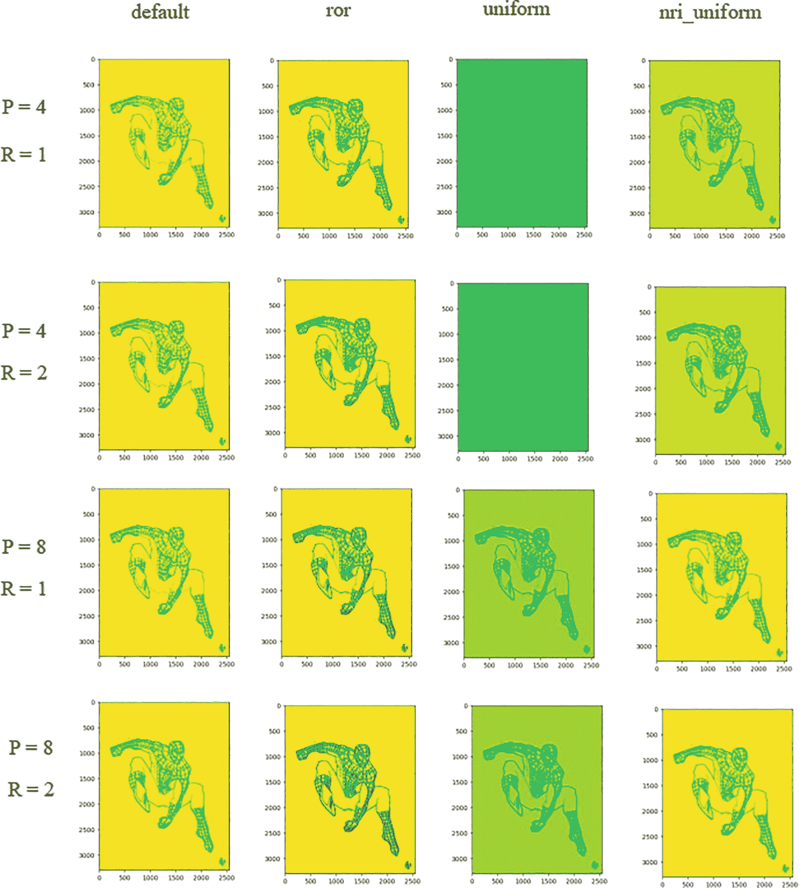

图 1-10

输出：LBP 变体，P = 4, 8 和 R = 1, 2


图 1-9

原始图像

让我们转到另一种称为方向梯度直方图（Histogram of Oriented Gradients）的特征提取技术。

### 方向梯度直方图

在方向梯度直方图中，我们通常取一个块，并将该块在整个图像上滑动。对于每个块，我们找到该块的梯度。这两个值可以使用以下公式找到：

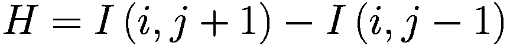

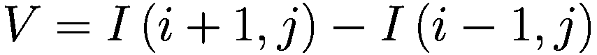

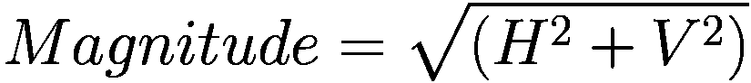

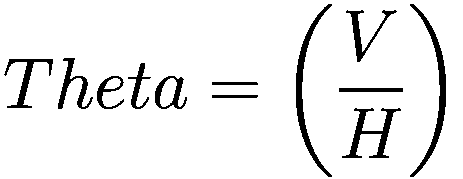

这随后创建了一个各种梯度的直方图。这样获得的特征向量可以有效地从方向梯度的角度表示图像。

有许多其他的特征提取方法，本章只讨论了其中的一些。很难找到最适合当前任务的特征提取方法。深度学习在这里起到了救星的作用，因为它有效地消除了特征提取的需要。

让我们看看一个重要的特征变换方法，称为主成分分析。

## 主成分分析

假设你拥有二维数据，需要找出数据方差最大的方向。假设最初数据表示在 *X* − *Y* 坐标系中，这个方向是 *M*。现在，垂直于 *M* 的方向，比如说 *N*，与 *M* 一起形成了一个新的坐标系，在这个坐标系中，原始数据可以被转换，并且很可能不相关。

主成分分析找到一组新的轴，称为主方向，在这些方向上数据的变异性最大。这也可以用来降低数据的维度。这些主成分可以通过从数据协方差矩阵中找到特征值和相应的向量来找到。数据协方差矩阵可以通过以下公式找到：

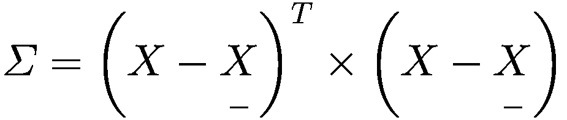

要找到 X 的主成分

1.  找到协方差矩阵 *Σ* 的特征值和相应的特征数据向量。

1.  将特征值按降序排列，并做相应的向量。

1.  这样排列的特征向量随后被堆叠为 *特征* 向量。请注意，您可以取所需的特征向量数量。

现在找到

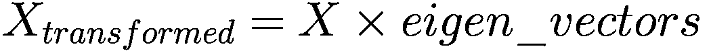

在此过程中形成的矩阵的形状如下：

| 矩阵 | 形状 |
| --- | --- |
| *X* | *n* × *m* |
| 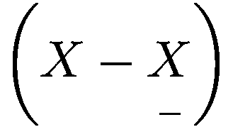 | *n* × *m* |
| *Σ* | *m* × *m* |
| *X*[*transformed*] | *n* × *m* |

以下代码实现了 PCA。请注意，图像仅使用一个主成分、10 个成分和 80 个成分进行了重建。输出结果如图 1-11 所示。

**代码：**

```py
#Importing Libraries
from matplotlib import pyplot as plt
import numpy as np
from numpy import linalg as LA
#Loading image
img1 = plt.imread('Spidy.jpg')
plt.imshow(img1)
def RGBtoGray(img1):
img_gray = 0.299*img1[:,:,0] + 0.587*img1[:,:,1] + 0.114*img1[:,:,2]
return img_gray
print(img1.shape)
img_gray = RGBtoGray(img1)
X_mean = np.mean(img_gray, axis=1)
print(X_mean.shape)
X = img_gray
print(X.shape)
X_mean = np.reshape(X_mean, (X_mean.shape[0], 1))
diff = (X- X_mean)
cov1 = np.matmul((X - X_mean).T, (X - X_mean))
print(cov1.shape)
eigenvalues, eigenvectors = LA.eig(cov1)
#print(eigenvalues)
print(eigenvectors.shape)
# 0 Principal Components
T1 = eigenvectors[:,0]
T1 = np.reshape(T1, (T1.shape[0], 1))
print(T1.shape)
Transformed = np.matmul(X, T1)
print(Transformed.shape)
recon = np.matmul(Transformed, T1.T)
print(recon.shape)
plt.imshow(recon)
eigenvalues, eigenvectors = LA.eig(cov1)
#print(eigenvalues)
print(eigenvectors.shape)
# 10 Principal Components
T1 = eigenvectors[:,:10]
#T1 = np.reshape(T1, (T1.shape[0], 1))
print(T1.shape)
Transformed = np.matmul(X, T1)
print(Transformed.shape)
recon = np.matmul(Transformed, T1.T)
print(recon.shape)
plt.imshow(recon)
eigenvalues, eigenvectors = LA.eig(cov1)
#print(eigenvalues)
print(eigenvectors.shape)
# 80 Principal Components
T1 = eigenvectors[:,:80]
#T1 = np.reshape(T1, (T1.shape[0], 1))
print(T1.shape)
Transformed = np.matmul(X, T1)
print(Transformed.shape)
recon = np.matmul(Transformed, T1.T)
print(recon.shape)
plt.imshow(recon)
Output:
```

输出结果如图 1-11 所示。

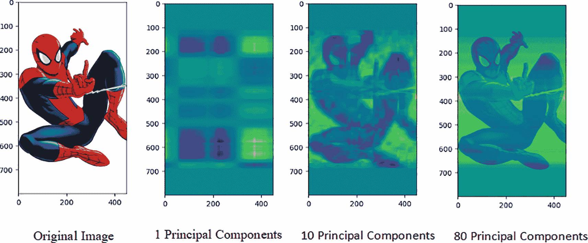

图 1-11

上述 PCA 代码的输出

现在，让我们转向机器学习中最重要的话题之一：偏差-方差权衡。

## 偏差-方差权衡

这可能是机器学习中最重要的话题之一。到目前为止，我们已经看到了如何使用梯度下降来减少训练集上的错误。也就是说，模型的参数应该是什么，以便使训练错误最小？然而，重要的是测试错误，或者分类器（或回归算法）在测试集上的表现如何，也就是说，它有多好的泛化能力。让我们尝试理解这个错误的分解。假设你有一个数据集

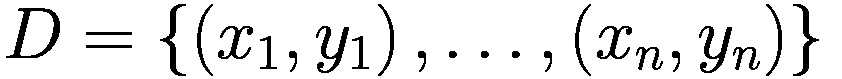

从分布 *ζ*(*x*, *y*) 中抽取，其中 *yϵR*（回归设置）。在这里，*ζ*(*x*, *y*) 是从创建 D 中抽取的 *n* 个独立样本的概率分布。请注意，*ζ*(*x*, *y*) = *ζ*(*y*/*x*)*ζ*(*x*)，而 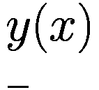 是标签 *y* 的预测值。

我们使用训练数据集训练机器学习算法 *M*，并在数据集 D 上得到假设 h

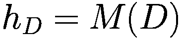

在这种情况下，预期的测试错误将是

![ E=[(hD(x)-y)2] ](img/611710_1_En_1_Chapter/611710_1_En_1_Chapter_TeX_Equn.png)

基于这个错误，我们找出模型是否表现良好。

### 过拟合和欠拟合

机器学习模型应该在训练集和测试集上都有良好的表现。如果模型在训练集上表现不佳，可以选择更多数据、超参数调整或选择不同的学习算法等选项。

过拟合是一种情况，即模型在训练集上表现良好，但在测试集上表现不佳。一个复杂的模型通常会出现过拟合。在过拟合的情况下，可以选择以下选项。

### 偏差和方差

一个好的机器学习模型的平均预测值应该尽可能接近真实值。这种差异被称为偏差。这可以理解为底层模型预测值的能力。偏差的正式定义如下：

![偏差=E[ f′(x)-f(x) ]](img/611710_1_En_1_Chapter/611710_1_En_1_Chapter_TeX_Equo.png)

其中 *f*^′(*x*) 是模型的平均预测值，*f*(*x*) 是底层函数。高偏差表示模型无法拟合训练数据。这可能的原因之一是模型过于简化。高偏差导致训练集和测试集的错误率都更高。

模型的方差表示其调整给定数据集的能力。这种可变性被称为方差。方差的正式定义如下：

![方差=E[ f′(x)-f(x) ]²](img/611710_1_En_1_Chapter/611710_1_En_1_Chapter_TeX_Equp.png)

高方差可能是由于模型过于复杂。一个过于复杂的模型可能在训练集上产生低误差，但在测试集上产生高误差。

理想情况下，应该绘制偏差和方差随迭代变化的图表。请注意，偏差应该随着迭代而减少，而方差可能在某个点之后增加。目标是寻找这两个曲线相交的点。

图 1-12 展示了与偏差和方差相关的四种可能性。图 1-12 (a) 展示了低偏差和低方差的情况（理想情况）。在这种情况下，训练和测试性能相同。图 1-12 (b) 展示了低偏差和高方差的情况，其中训练集上的模型性能尚可，但测试集可能较差。在高偏差和低方差的情况下（图 1-12(c)），训练性能可能不佳，但训练集和测试集之间性能的差异可能不会很大。

应注意，偏差和方差与欠拟合和过拟合密切相关，如前所述。

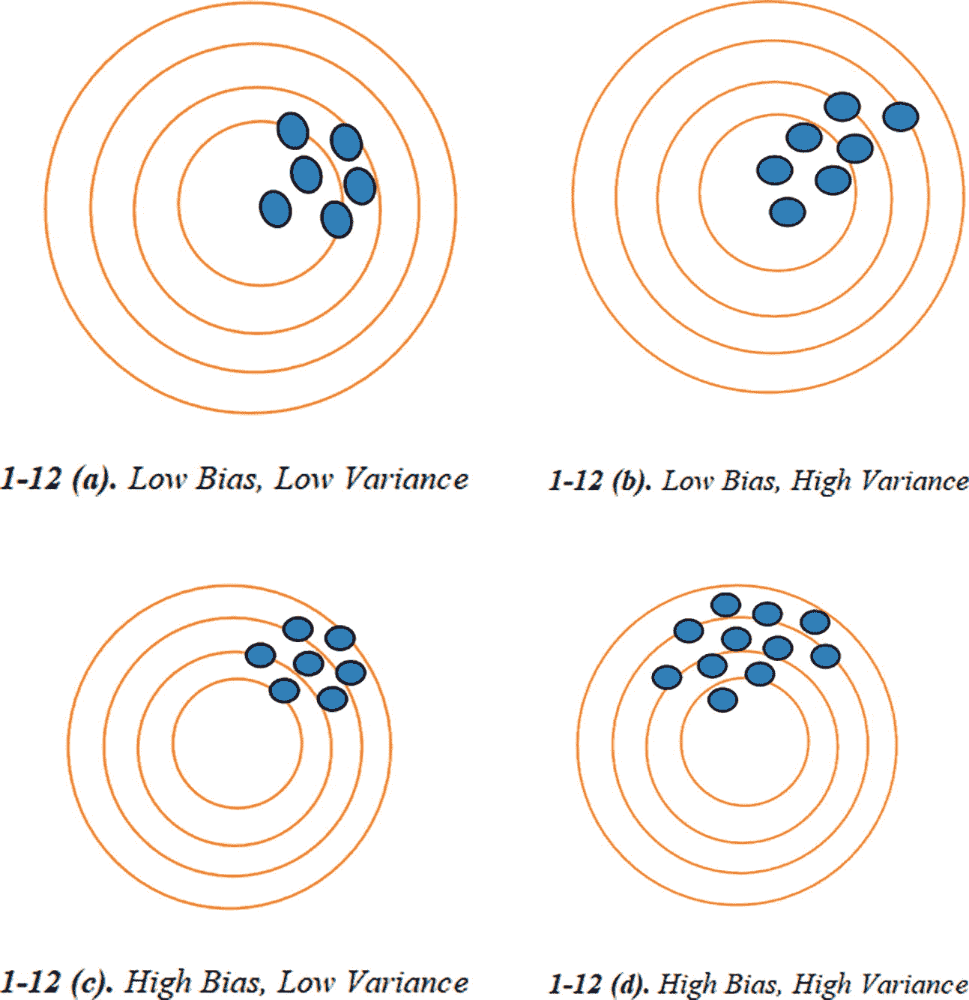

图 1-12

偏差`–`方差

这一概念已在第五章节中详细讨论。实际上，处理偏差和方差是开发任何成功的机器学习或深度学习模型的关键部分。

## 应用：使用传统机器学习流程对手写数字进行分类

如前几节所述，机器学习流程包括预处理、特征提取、特征选择、学习和后处理。本节探讨了 MNIST 数据集的分类，并应用了各种特征选择和提取方法，并使用三种不同类型的分类器（K-最近邻（KNN）、神经网络和支持向量机（SVM））比较了结果。KNN 和 SVM 已在第三章节中讨论；第三章节详细讨论了神经网络。

**数据集**

MNIST 数据集是一个广泛使用的数据集，包含从 0 到 9 的手写数字图像 70,000 张，每张图像大小为 28 `×` 28 像素。训练集包含 60,000 张图像，测试集包含 10,000 张图像。

**数据预处理**

数据集由大小为 28 `×` 28 像素的灰度图像组成，像素值介于 0 和 255 之间。LBP 将给定图像的每个像素替换为其邻居的加权平均值。例如，在以下 10 `×` 10 图像中，以中心像素为参考，并考虑其八个邻居。像素值大于参考的单元格被替换为 1，而像素值小于参考的单元格被替换为 0。通过遍历邻居形成的二进制数然后转换为十进制数，然后将参考像素替换为该值（图 1-13）。

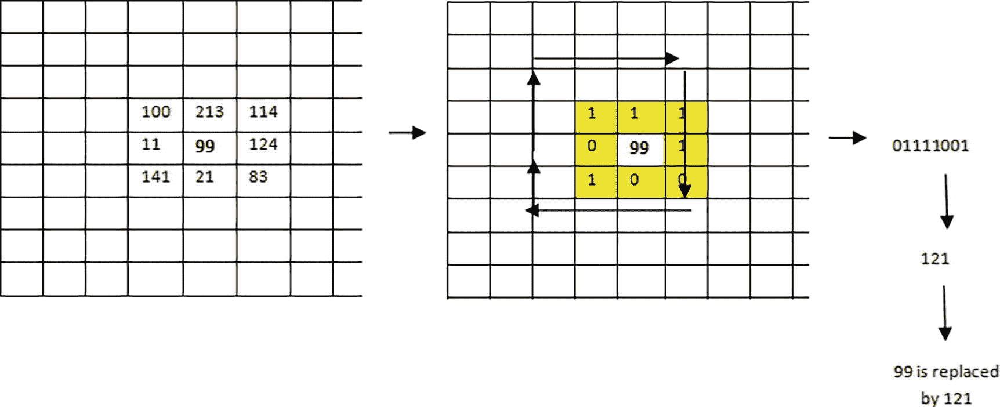

图 1-13

计算 LBP

对给定图像中的所有像素重复此过程。应用 LBP 于图像的结果是形成一个新的具有边缘的新图像。图 1-14 (b)显示了当 LBP 应用于图 1-14 (a)所示的图像时生成的结果图像。

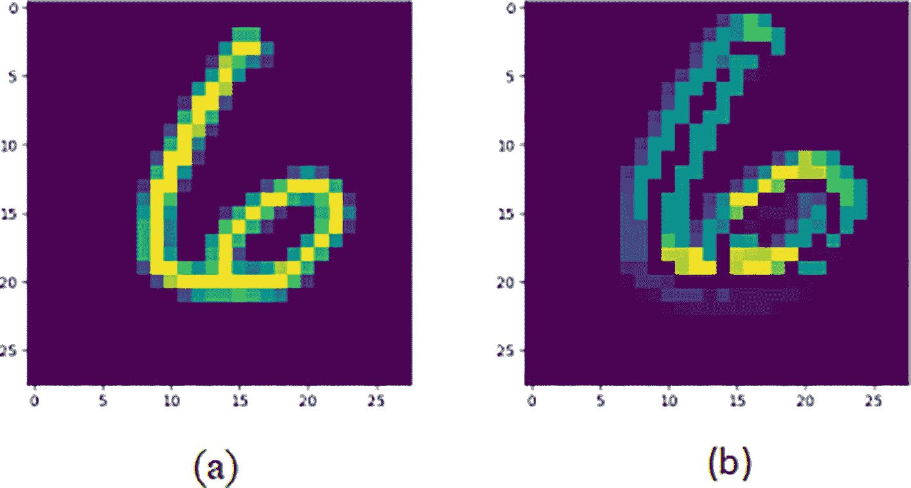

图 1-14

在图像上应用 LBP

然后确定形成该图像的每个像素的频率。这种特征提取方法（在本节中称为 FE1）有三个变体：默认、旋转不变和均匀旋转变体。LBP 应用于每个图像，并将生成的特征垂直连接以创建特征矩阵“X”。同时，相应的标签存储在变量“y”中。然后将数据集以 90:10 的比例分为训练集和测试集。

**特征提取变体**

+   默认 LBP 变体：此变体以原始形式捕捉每个数字的局部纹理模式。

+   旋转不变 LBP 变体：此变体确保即使数字经过旋转变换，提取的特征也保持一致。

+   均匀旋转变体 LBP 变体：此变体专注于均匀模式，提供了对数字纹理的更稳健的表示。

**特征选择**

为了提高模型性能和降低维度，使用 F1 方法进行特征选择。此步骤旨在保留最有信息量的特征，同时消除冗余或不相关的特征。

**分类算法**

使用标记为 C1，C2 和 C3 的三个分类算法（针对 LBP 的三个变体）根据提取和选择的特征预测数字标签。

**性能评估**

性能评估使用 F 度量指标进行，考虑了宏平均和微平均值。

**代码**：

```py
#Importing Libraries
import tensorflow as tf
import keras
from matplotlib import pyplot as plt
import numpy as np
from numpy import genfromtxt
from sklearn.svm import SVC
from sklearn.tree import DecisionTreeClassifier
from sklearn.neural_network import MLPClassifier
from sklearn.neighbors import KNeighborsClassifier
from sklearn.metrics import f1_score
from sklearn.metrics import confusion_matrix
from sklearn.multiclass import OneVsRestClassifier
from sklearn.feature_selection import VarianceThreshold
#Loading Dataset
tf.keras.datasets.mnist.load_data(path="mnist.npz")
#Train Test Split
(X_train, y_train), (X_test, y_test) = keras.datasets.mnist.load_data()
print(X_train.shape, y_train.shape, X_test.shape, y_test.shape )
#Local Binary Pattern
def LocalBinaryPattern(img1):
result1 = np.zeros((img1.shape[0], img1.shape[1]))
for i in range(1, img1.shape[0]-1):
for j in range(1, img1.shape[1]-1):
val = [0]*8
val[0] = img1[i, j-1]>img1[i,j]
val[1] = img1[i-1, j-1]>img1[i,j]
val[2] = img1[i-1, j]>img1[i,j]
val[3] = img1[i-1, j+1]>img1[i,j]
val[4] = img1[i, j+1]>img1[i,j]
val[5] = img1[i+1, j+1]>img1[i,j]
val[6] = img1[i+1, j]>img1[i,j]
val[7] = img1[i+1, j-1]>img1[i,j]
sum1 = 0
for k in range(8):
sum1+= val[k]*(2**k)
result1[i, j]= sum1
return result1
def LBP_Feat(LBP_image):
feat= [0]*256
num, count1 = np.unique(LBP_image, return_counts=True)
LBP_Features1 = dict(zip(num, count1))
for i in range(256):
if i in LBP_Features1:
feat[i]= LBP_Features1[i]
else:
feat[i]= 0
return feat
#Applying Local Binary Pattern on X_train and X_test
def CreateX(X_images):
X = np.zeros((1, 256))
for i in range(X_images.shape[0]):
image1 = X_images[i, :, :]
LBP_image = LocalBinaryPattern(image1)
feat = LBP_Feat(LBP_image)
feat1 = np.reshape(feat, (1, 256))
X = np.vstack((X, feat1))
if(i%100 == 0):
print('Iteration ',i)
X= X[1:,:]
return (X)
X_train = CreateX(X_train)
np.savetxt("X_train_MNIST_LBP.csv", X_train, delimiter=",")
X_test = CreateX(X_test)
np.savetxt("X_test_MNIST_LBP.csv", X_train, delimiter=",")
#Training Model with KNN
#KNN with K = 5
clf = KNeighborsClassifier(n_neighbors=5)
clf.fit(X_train, y_train)
y_predict = clf.predict(X_test)
confusion_matrix(y_test, y_predict)
#KNN with K=3
clf = KNeighborsClassifier(n_neighbors=3)
clf.fit(X_train, y_train)
y_predict = clf.predict(X_test)
confusion_matrix(y_test, y_predict)
#Plotting F score of KNN-3 and KNN-5 for all the classes
import matplotlib.pyplot as plt
plt.style.use('seaborn-deep')
X_axis = np.arange(len(KNN3_F_Score))
plt.bar(X_axis - 0.2, KNN3_F_Score, 0.4, label = 'KNN3')
plt.bar(X_axis + 0.2, KNN5_F_Score, 0.4, label = 'KNN5')
X_labels = ['Class'+str(i) for i in range(1, 11)]
plt.xticks(X_axis, X_labels)
plt.xlabel("Model")
plt.ylabel("F Score")
plt.title("Comparison of KNN3 and KNN5")
plt.legend()
plt.show()
#Training Model with Decision Tree
clf = DecisionTreeClassifier(random_state=0)
clf.fit(X_train, y_train)
y_predict = clf.predict(X_test)
confusion_matrix(y_test, y_predict)
DT_F_Score= f1_score(y_test, y_predict, average=None)
#Plotting Performance of KNN-5 and DT
X_axis = np.arange(len(DT_F_Score))
plt.bar(X_axis - 0.2, KNN5_F_Score, 0.4, label = 'KNN3')
plt.bar(X_axis + 0.2, DT_F_Score, 0.4, label = 'DT')
X_labels = ['Class'+str(i) for i in range(1, 11)]
plt.xticks(X_axis, X_labels)
plt.xlabel("Model")
plt.ylabel("F Score")
plt.title("Comparison of KNN5 and DT")
plt.legend()
plt.show()
```

**结果**：模型已实现，并观察到了结果。读者应运行上述代码，并观察以下情况下的性能指标：

无特征选择（P1，P2，P3）：分类算法最初应应用于未进行特征选择的原始特征矩阵“X”，并应记录以下结果：

+   P1（未进行特征选择的 C1）

+   P2（未进行特征选择的 C2）

+   P3（未进行特征选择的 C3）

特征选择后（P11，P22，P33）：然后应使用 F1 方法应用相同的分类算法，并注意以下结果：

+   P11（特征选择后的 C1）

+   P22（特征选择后的 C2）

+   P33（特征选择后的 C3）

将你的结果与以下输出进行比较。

**输出：**

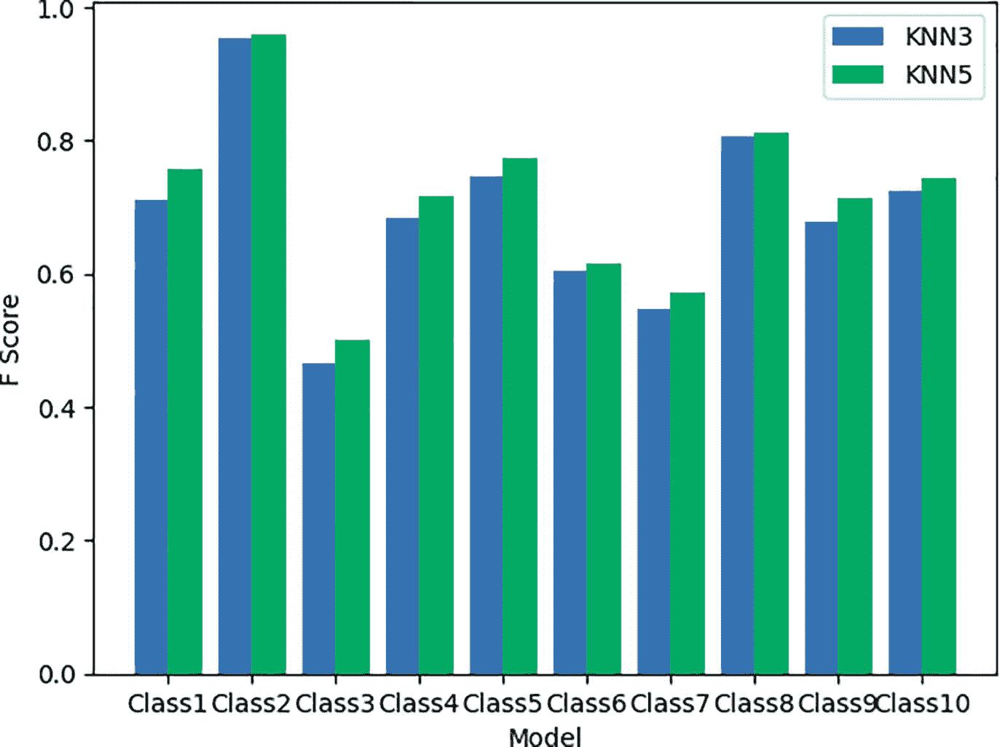

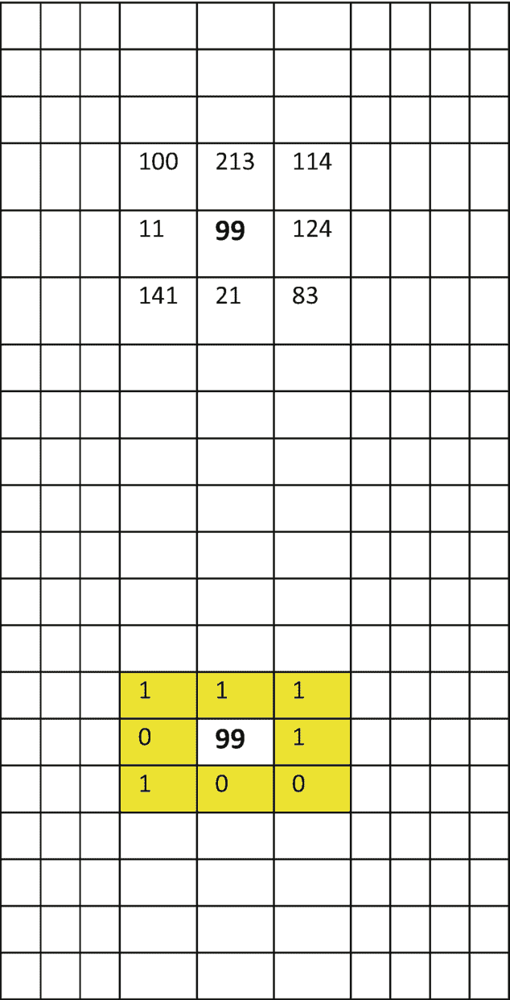

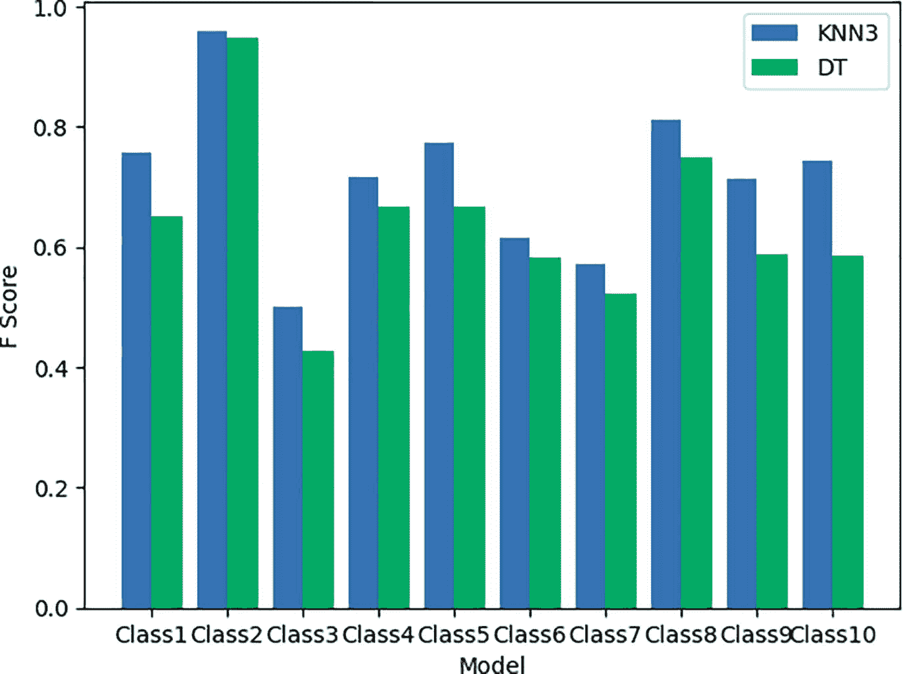

预期读者分析结果并找出为什么某个特定组合对数据集效果良好。如果你觉得困难，可以参考附录 A。

## 结论

本章介绍了机器学习及其演变和类型。本章还简要介绍了特征提取和特征选择方法。然后讨论了一个详细的流程，该流程允许彻底探索不同特征提取变体、特征选择和分类算法对手写数字分类任务（前节中的案例研究）的影响。这些技术各种组合的结果将提供对所提出流程有效性的见解，并有助于选择最适合此特定问题的方法。既然你知道选择最佳特征提取和选择方法对您的问题来说很困难，并且处理偏差和方差需要大量努力，那么让我们转向深度学习。下一章将介绍深度学习。

## 练习

### 多选题

1.  以下哪个可以用于从图像中提取特征？

    1.  局部二值模式

    1.  方向梯度直方图

    1.  灰度共生矩阵

    1.  所有以上选项

1.  以下哪个选项在图像中找到邻域像素的加权平均值，然后创建像素强度直方图？

    1.  局部二值模式

    1.  方向梯度直方图

    1.  灰度共生矩阵

    1.  所有以上选项

1.  在以下哪个中形成了一个表示灰度值附近发生的矩阵？

    1.  局部二值模式

    1.  方向梯度直方图

    1.  灰度共生矩阵

    1.  所有以上选项

1.  我们不应该在具有 60 个图像（大小为 1024×1024）的数据集（包含两个类别）的二值分类问题中使用原始像素作为特征。为什么？

    1.  维度灾难

    1.  内存需求

    1.  计算时间

    1.  所有以上选项

1.  你有一个具有 10 个特征和 100 行的标记数据集。你需要降低维度或转换特征以提高性能。以下哪个不能用于此目的？

    1.  局部二值模式

    1.  主成分分析（PCA）

    1.  FDR（假发现率）

    1.  包装方法

1.  你能否用具有 128 个分箱的特征向量来表示一个 1024×1024 的图像？

    1.  是

    1.  否

1.  以下哪一个是过滤器方法？

    1.  FDR

    1.  RFE

1.  以下哪一个是包装方法？

    1.  FDR

    1.  RFE

1.  如果一个模型即使在训练集上表现不佳，它遭受的是…？

    1.  高偏差

    1.  低偏差

    1.  高方差

    1.  低方差

1.  如果一个模型在训练集上表现良好，但在测试集上表现不佳，它遭受的是…？

    1.  高偏差

    1.  低偏差

    1.  高方差

    1.  低方差

### 应用

从流行的卡通《辛普森一家》中收集 50 张巴特·辛普森的图片。也收集 50 张荷马同系列的图片。对所收集的图片执行以下任务：

1.  使用 Python 将所有图像重塑为 100×100 的图像。

1.  现在提取两个类别使用所有三种局部二值模式变体的特征。

1.  使用上述特征对两类进行分类，一类有，另一类没有以下特征提取方法：

    1.  鱼群判别比

    1.  使用 SVM 进行递归特征消除

    1.  使用决策树进行递归特征消除

1.  报告每种情况下的性能，并讨论为什么某些组合比其他组合表现更好。

1.  使用从灰度共生矩阵中获取的特征执行上述任务（Q3 和 Q4）。

1.  使用从直方图导向梯度中获取的特征执行上述任务（Q3 和 Q4）。

1.  进行实验以确定在 Q2、Q5 和 Q6 中获取的特征上应用主成分分析是否能提高性能。

1.  在使用 RFE 选择特征后，对波士顿房价数据集执行线性回归。
