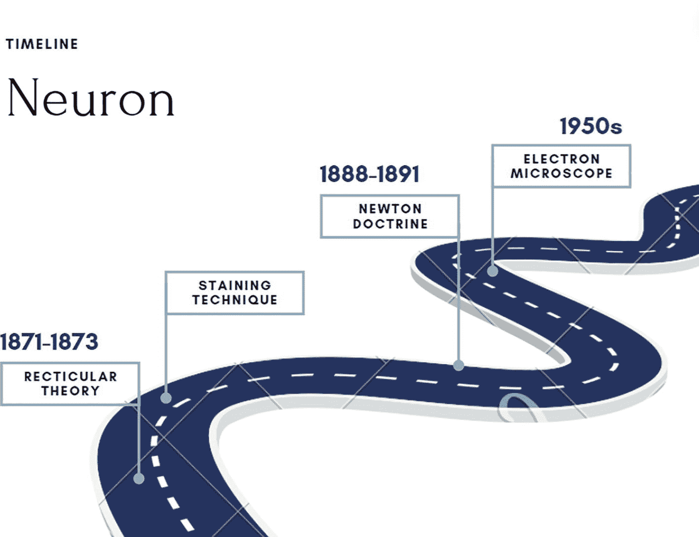
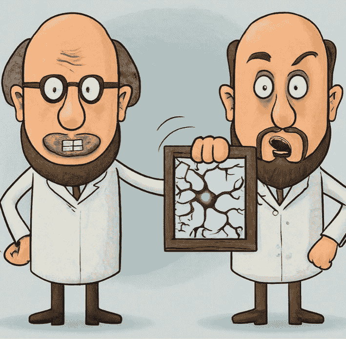
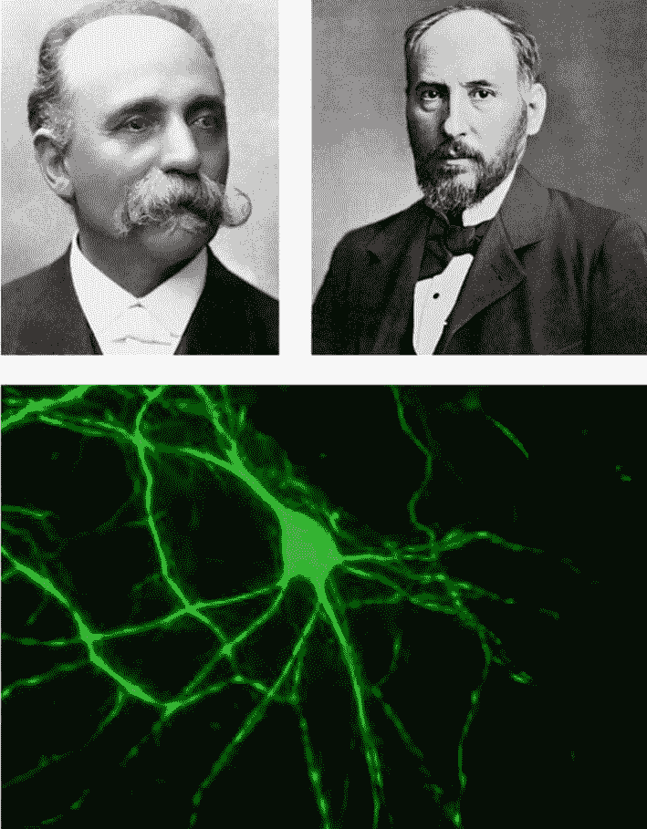
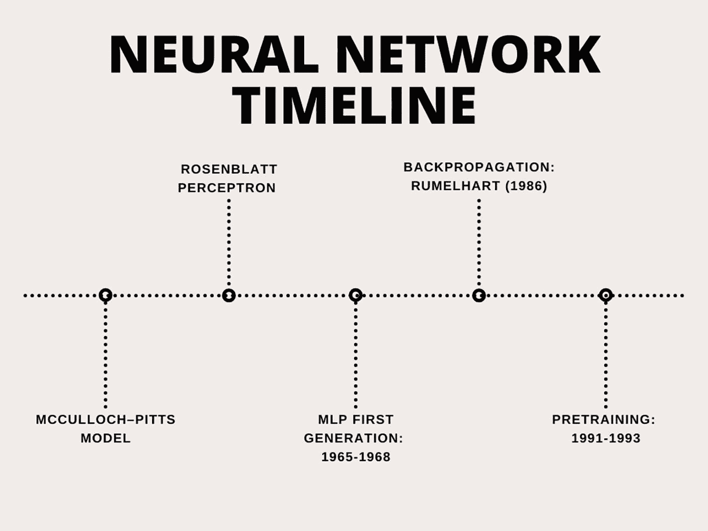
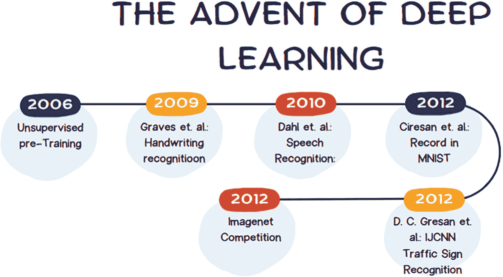
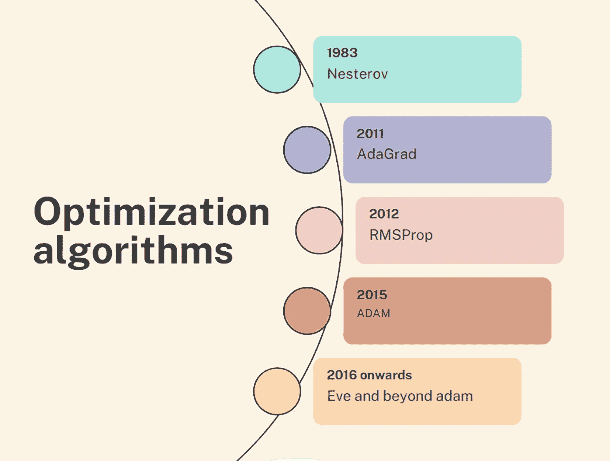
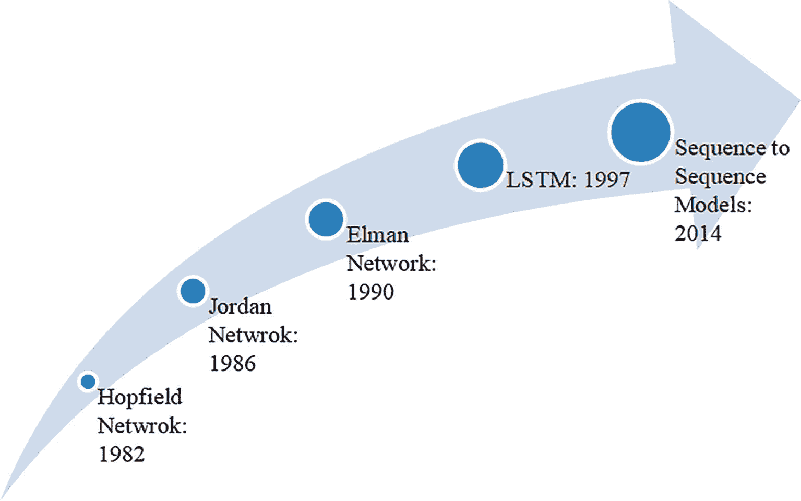
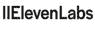
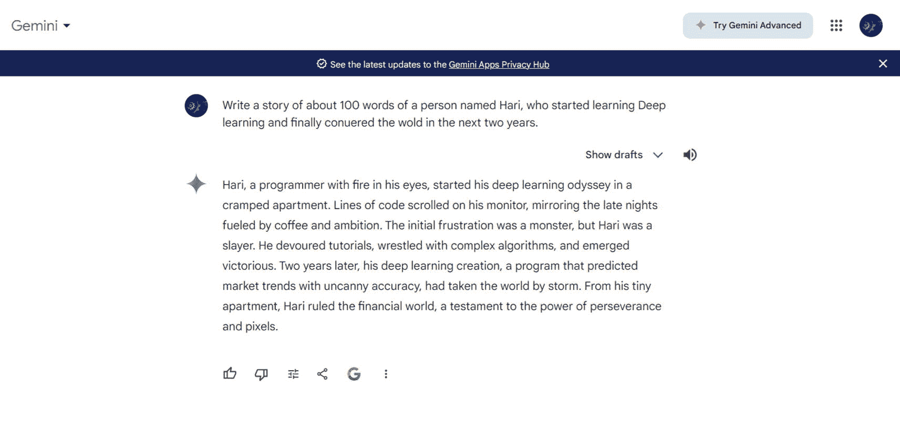

# 2. 深度学习简介

## 神经元

对大脑工作原理的研究长期以来一直吸引着科学家。这种迷恋随着组织学的发展而得到了翅膀，揭示了神经元的组织方式。神经元学说指出，神经系统由独立的神经元组成。然而，以前人们普遍认为神经系统由一个单一的连续网络组成，这是约瑟夫·冯·格勒巴赫提出的理论，卡米洛·戈尔吉加以推广。戈尔吉还发明了一种染色技术，有助于证明这一理论是错误的。使用这种技术，圣地亚哥·拉蒙·伊·卡哈证明了神经元是独立的细胞。神经元的结构也是使用这种染色技术揭示的。*神经元*一词由海因里希·威廉·戈特弗里德·瓦尔德耶尔-哈茨在约 1891 年提出。

戈尔吉和卡哈（图 2-1(a)）因他们的工作在 1911 年获得了诺贝尔奖。电子显微镜后来证明，神经元实际上是独立的细胞。这些神经元启发了神经网络。图 2-1(b)中展示的卡通是用一个应用软件 Imagen 制作的，该软件使用这些神经网络。上述时间线在图 2-1(c)中展示。

图 2-1(c)

时间线：神经元

图 2-1(b)

戈尔吉、卡哈和神经元：使用基于深度学习应用软件 Imagen 制作的卡通

图 2-1(a)

戈尔吉（左上），卡哈（右上），以及神经元的染色（底部）

## 从感知器到人工智能的冬天

本书将讨论的模型是深度神经网络（DNN）。这些模型基于神经网络，其灵感来源于神经元。第一个受神经元启发的计算模型是麦卡洛克-皮茨模型。该模型由神经学家麦卡洛克和逻辑学家皮茨提出。该模型具有二进制输入 *x*[1]，*x*[2]，*x*[3]，…，*x*[*n*]，*x*[*i*]*ϵ*{0, 1}，二进制输出 *yϵ*{0, 1} 和一个阈值单元。这些模型能够实现逻辑门，因此可以确定它们可以实现逻辑机。

Frank Rosenblatt 提出了连续的权重和输入，这显著提高了感知器的能力。现在，它们可以用于线性分类和回归。人们说它们将能够统治世界，但热情并没有持续太久。Minsky 和 Papert 写了一本名为《感知器》的书，在其中他们证明了感知器的局限性。他们特别讨论了 XOR 问题，这些问题无法通过这些模型解决。这导致了从 1969 年到 1980 年代中期的神经网络兴趣的衰退。1986 年，Rumelhart 等人提出了反向传播算法，该算法可用于训练多层感知器（MLP）。这有助于开发具有多层并能解决 XOR 问题的神经网络，大大提高了它们在各种监督学习任务上的性能。1991 年提出了网络预训练的概念，这为 2006 年之后的许多工作奠定了基础。

如上图 2-2 所示的时间线。

图 2-2

时间线：神经网络

本书第三章详细讨论了所有这些模型。

## 图像和卷积神经网络

对于与成像相关的任务，需要一个能够推断空间相关性的网络。猫帮助科学界想出了这样的网络。（真的！）一项关于猫的实验证明，只有大脑的某些部分会在特定刺激下被激活（图 2-3）。这项实验是由 Hubel 和 Wiesel 进行的，他们展示了

> *神经元仅在特定区域对特定刺激做出反应时才会放电。*

基于上述概念，称为卷积神经网络（CNN）的神经网络的发展可以追溯到 20 世纪 90 年代。一个名为 LeNet 的 CNN 被提出用于识别手写数字。这项工作还为我们提供了著名的 MNIST 数据集，后来许多在这个领域工作的科学家用它来测试他们的模型。

图 2-3

看到特定的图像时，猫的大脑只有部分区域被激活

随着 ImageNet 竞赛的出现，图像分析方面的进步得到了推动。它有 1000 个类别和众多图像。根据官方网站

> ImageNet 是一个根据[WordNet](http://wordnet.princeton.edu/)层次结构组织的图像数据库，其中每个层次结构的节点都由数百甚至数千张图像表示。该项目在推进计算机视觉和深度学习研究方面发挥了重要作用。数据免费提供给研究人员用于非商业用途。3

在这次比赛中获胜或表现良好的模型后来在这个领域变得很重要。其中一些包括

+   八层的 AlexNet

+   ZFNet，具有八层，但与 AlexNet 相比错误率更好

+   VGG-Net，具有 19 层，但错误率仍然更好

+   GoogLeNet

+   ResNet

我们将在本书的第七章中讨论这些模型中的一些。

在过去的二十年里，深度网络完成了许多任务。其中之一是手写识别。Graves 等人于 2009 年超越了当时最先进的模型，这包括阿拉伯手写识别。Cireşan 等人创建了 MNIST 数据集上的基准。第二年，IJCNN 交通标志识别系统的模式识别器问世。

2016 年，语音识别系统取得了重大进展，与当时最先进的模型相比，在数据集上的改进约为 16%。

上述讨论总结在图 2-4 中。

图 2-4

深度学习的出现

本书第六章介绍了 CNN 模型。

## 新进展

更好的优化器的出现导致了更好的收敛和更高的准确率。从梯度下降开始，包括 Nesterov（1983 年）、AdaGrad（2011 年）、RMSprop（2012 年）和 Adam（2015 年）在内的优化算法为深度网络的发展奠定了基础。实际上，后来还提出了许多新的算法，包括 Eve 和 Beyond Adam（图 2-5）。

图 2-5

优化算法

上述进展伴随着新的激活函数，如 tanh（1991 年）、Rectified Linear Unit（ReLU）（2010 年）、Leaky ReLU（2013 年）和 SIREN（2020 年）。此外，硬件的改进也促进了深度学习的发展。

## 序列

尽管全连接网络帮助我们解决了许多难题，卷积神经网络也帮助我们解决了许多图像相关的问题，但与序列相关的问题仍未得到处理。

处理序列可以解决与文本、语音、时间序列等相关的问题。在这些问题中，序列不同步骤之间的关系起着同样重要的作用。1982 年提出的 Hopfield 网络模拟了内容可寻址存储。Jordan 网络提出了一个状态输出成为下一个状态输入的想法。同样，Elman 网络提出了网络隐藏状态成为另一个网络隐藏状态的想法。

这样发展起来的递归网络遭受了梯度消失等问题。这个问题通过 Gate Recurrent Unit（GRU）和 Long Short-Term Memory（LSTM）等模型得到了解决。

本书第八章向读者介绍了这些模型。

上述时间线显示在图 2-6 中。

图 2-6

时间线：序列模型

## 定义

最后一章讨论了机器学习和其流程。为了将机器学习应用于监督学习和无监督任务，需要预处理、特征提取和特征选择。特征提取通常是模态特定的。此外，可以应用多种特征提取方法来表示给定的数据。选择最优方法是一项艰巨的任务。特征选择也是如此。正如前一章所讨论的，特征选择可以使用过滤和包装方法来完成。因此，有众多技术用于选择最相关的特征。

深度学习方法提取适当的特征并选择最重要的特征，而不需要明确指出使用哪一个。

此外，只要给模型输入足够的数据，深度学习通常会产生更好的性能。它们使用最先进的优化方法，并适当利用硬件。正式来说，深度学习可以定义为如下：

> 深度学习方法是一种具有多级表示的学习方法，通过组合简单但非线性的模块，每个模块将一个级别的表示（从原始输入开始）转换成更高、稍微更抽象级别的表示来获得。[1]

由于这种训练需要大量的数据和资源，而大多数时候，我们并没有这样大量的数据或资源，一些模型是由拥有充足资源的公司和机构在大数据集上训练的，然后它们被用来完成具有相似数据集的类似任务。这就引出了迁移学习的概念。正式来说，迁移学习可以定义为如下：

> 迁移学习是指系统识别和应用在先前任务中获得的知识和技能到新任务的能力。[2]

深度学习不仅提取特征和选择相关特征，还可以实现传统机器学习管道的每个步骤。这通常被称为端到端学习。端到端学习可以定义为如下：

> 端到端学习允许神经网络通过一系列操作将原始数据输入（如图像）转换，最终得出预测（如类别概率）。整个转换过程通过反向传播同时优化，其中所有层的参数根据输出层计算出的损失一起调整。[3]

## 使用深度学习生成数据

从对数字进行分类到撰写故事和创建图像，我们已经走得很远了。表 2-1 展示了一些重要的应用和平台，它们使用深度学习生成文本、音频、视频和图像。读者应探索每一个，并查看输出。您将非常清楚地了解过去二十年深度学习社区所达到的高度。

表 2-1

使用深度学习生成文本、音频、视频和图像的工具

| 模式 | 标志 | 名称 | 功能 | 网址 |
| --- | --- | --- | --- | --- |
| 文本到文本/图像到文本 |  | ChatGPT | 允许用户进行类似人类的对话并完成各种任务。甚至可以回答问题并帮助您撰写文本。 | [`chatgpt.com/`](https://chatgpt.com/) |
| 文本到文本/图像到文本 |  | Gemini | 可以用来创作新内容或重写给定文本。 | [`gemini.google.com/app`](https://gemini.google.com/app) |
| 文本到文本/图像到文本/图像到图像/语音到文本/语音到图像 |  | Microsoft Copilot | 它也帮助撰写、编辑、总结和生成内容。 | [`copilot.microsoft.com/?form=MA13LV#`](https://copilot.microsoft.com/?form=MA13LV) |
| 文本 | – | Bert | 这是一个用于自然语言处理的语言模型。它可以帮助机器通过上下文理解文本的含义。 | [`huggingface.co/welcome`](https://huggingface.co/welcome) |
| 文本到图像 |  | Picsart | 将文本转换为图像。 | [`picsart.com/ai-image-generator/`](https://picsart.com/ai-image-generator/) |
| 文本到图像 |  | Canva | 允许您根据首选的外观和构图选择图像变体。 | [`www.canva.com/ai-image-generator/`](https://www.canva.com/ai-image-generator/) |
| 文本到图像 |  | Adobe | 允许我们通过文本生成图像。 | [`www.adobe.com/products/firefly/features/text-to-image.html`](https://www.adobe.com/products/firefly/features/text-to-image.html) |
| 文本到语音 |  | ElevenLabs | 在任何语言中创建自然的 AI 声音。 | [`elevenlabs.io/`](https://elevenlabs.io/) |
| 文本到语音 |  | PlayHT | 超逼真的文本到语音（TTS）声音。领先的 AI 声音生成器。 | [`play.ht/`](https://play.ht/) |
| 文本转视频 |  | Invideo AI | Invideo AI 是一个 AI 视频生成器，它可以将您的输入脚本智能地制作成视频。 | [`invideo.io/make/add-text-to-video-online/`](https://invideo.io/make/add-text-to-video-online/) |

## 结论

本章简要概述了深度学习的时间线。介绍了受神经元结构启发的第一个计算模型——麦克洛奇-皮茨模型，以及当今的生成模型。本章特别涉及神经元、神经网络、卷积神经网络、序列模型，以及目前用于完成各种任务（从写信到生成图像）的最新工具。以下章节将详细讨论这些模型。机器正在变得有创造力，未来它们将变得更加有创造力。我们以一个名为 Gemini 的大型语言模型（LLM）生成的故事来结束我们的讨论。看看输出（图 2-7）！如果您觉得它很有趣，那么这本书就是让您能够编写能够生成有趣内容的程序的第一步。欢迎来到深度学习的世界！

图 2-7

Gemini 生成的故事

## 练习

### 多项选择题

1.  谁提出了神经元结构？

    1.  卡哈尔

    1.  戈尔基

    1.  海因里希·威廉·戈特弗里德

    1.  以上皆非

1.  谁提出了帮助揭示神经元结构的染色技术？

    1.  卡哈尔

    1.  戈尔基

    1.  海因里希·威廉·戈特弗里德

    1.  以上皆非

1.  1911 年诺贝尔奖授予了

    1.  卡哈尔

    1.  戈尔基

    1.  都有卡哈尔和戈尔基

    1.  海因里希·威廉·戈特弗里德

1.  神经系统包含独立的神经元。这是

    1.  神经元学说

    1.  网状理论

    1.  以上皆非

1.  神经系统包含一个单一的连续网络。这是

    1.  神经元学说

    1.  网状理论

    1.  以上皆非

1.  以下哪个是受神经元启发的第一个计算模型之一？

    1.  麦克洛奇-皮茨模型

    1.  罗森布拉特感知器

    1.  多层感知器

    1.  以上皆非

1.  以下哪个具有二进制输入和二进制输出？

    1.  麦克洛奇-皮茨模型

    1.  罗森布拉特感知器

    1.  多层感知器

    1.  以上皆非

1.  以下哪个具有连续输入和可以改变的相应权重？

    1.  麦克洛奇-皮茨模型

    1.  罗森布拉特感知器

    1.  多层感知器

    1.  以上皆非

### 活动

1.  探索神经系统的工作如何启发计算界。写一篇大约 100 字的短文。

1.  要完成上述任务，您可以参考本书末尾提供的参考文献。现在，绘制一些信息图表，使您的文章更有趣。

1.  现在可以使用任何公开可用的预训练大型语言模型来撰写上述文章。比较您撰写的文章与深度学习生成的文章。

1.  使用互联网上可用的 GenAI 工具为这些内容生成图像。

1.  现在搜索今年发表在基因组数据抑郁症检测方面的研究论文。阅读摘要并做笔记。

    使用这些笔记，请让一个预训练的 LLM 生成一篇文章。

1.  你认为这个模型能否生成与之前案例相同质量的文章？如果不能，为什么？
