# 3. 神经网络

## 目标

***阅读完本章后，读者将能够***

+   理解单层感知器。

+   理解 XOR 问题。

+   了解激活函数。

+   体会多层感知器的概念、算法和实现。

+   理解多层感知器如何解决 XOR 问题。

+   学习反向传播算法。

## 简介

我们的大脑通过神经元接收信号，处理它们，并产生反应。通常，感受器将信息发送到神经元，然后传递到大脑。大脑反过来处理这些信号，并将反应发送到效应器。这一概念由 Cajal [1] 提出。尽管这些神经元比逻辑门慢，但它们的数量有助于我们快速处理给定的情况。

神经元的结构如图 3-1 所示。树突作为感受区，细胞体处理输入，轴突传递信号。神经元通过突触相互连接。


图 3-1

使用 AI 生成的神经元图片([`https://pixlr.com/image-generator/`](https://pixlr.com/image-generator/))

图 3-2 中所示的计算模型与神经元类似。该模型接收二维输入，并将输入分类为两个类别之一。

它接收来自输入节点的输入 (*X*[1], *X*[2])，与相应的权重 (*W*[1], *W*[2]) 相乘，求和，并通过一个函数。如果该函数的输出大于阈值，则模型的输出变为 1；否则，变为 0。因此，该模型可以作为二元分类器。

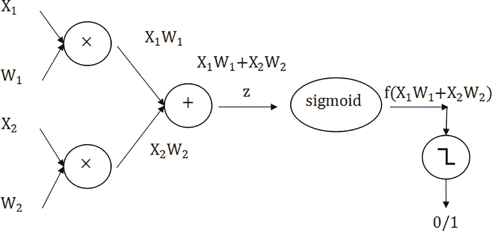

图 3-2

基于神经元结构的计算模型

上述模型，称为单层感知器或 SLP，可以扩展到接受“d”个输入。关于 SLP 以下几点值得关注：

+   输入层的神经元数量与输入数量相同。

+   权重的数量将与输入数量相同，每个权重表示该输入的重要性。

+   加权求和表示输入和权重的线性组合。

+   加权求和加上偏置通过激活函数。激活函数将在“激活函数”部分讨论。

如果最后一步的输出大于阈值，则模型的最终输出为 1；否则，为 0。

上述模型被称为以 Frank Rosenblatt 命名的 Rosenblatt 感知器模型[2]。现在考虑一个更简单的模型，其中输入是二进制（要么是 0 要么是 1），每个权重都有表示输入重要性的值。权重可以是正的或负的，表示兴奋性或抑制性连接。这个模型被称为 McCulloch 和 Pitts 模型[3]。该模型可以用来实现逻辑门，其中输出可以通过线性超平面进行分类。在了解了基础知识之后，我们现在将详细讨论 SLP。

## 单层感知器

单层感知器是一个线性分类器。它可以对两个可以用线在二维情况下、平面在三维情况下、超平面在多维度情况下分离的类别进行分类。然而，它不能对非线性可分的数据进行分类。让我们讨论如何进行这种分类。

考虑图 3-3 具有

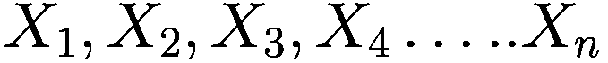

作为输入。

相应的权重是

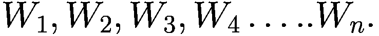

输入和权重的乘积相加，并给结果加上一个偏置。即，

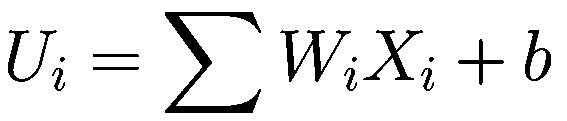

这个结果 *U*[*i*] 通过一个非线性激活函数“f”，得到 *V*[*i*]：

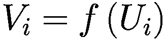

在神经网络的情况下，最常用的激活函数是 Sigmoid 函数，其表达式如下：


所获得的价值 (*V*[*i*]) 通过一个阈值（在分类的情况下）。请注意，相同的模型可以用于回归，在这种情况下不进行阈值处理。在这个模型中，权重和偏置初始化为随机数，然后在每次迭代中更新。

SLP 的正式算法如下：

1.  将权重（W）和偏置（b）初始化为介于 0 和 1 之间的随机数。

1.  对于每个输入样本 *X*[*i*]，通过将输入特征和权重进行点积并加上偏置来计算网络输入 *U*[*i*]，即，

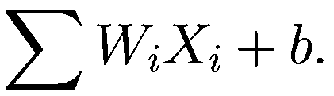

1.  通过将网络输入 *U*[*i*] 通过一个非线性激活函数来计算激活值 *V*[*i*] 或 ：

    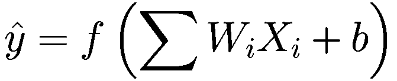

1.  使用以下公式更新权重和偏置

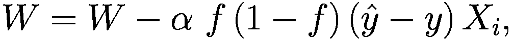

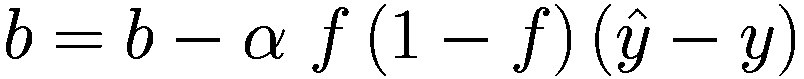

1.  重复步骤 2 到 4，直到达到收敛或迭代次数等于可用的样本数。

图 3-3 展示了 SLP 模型。

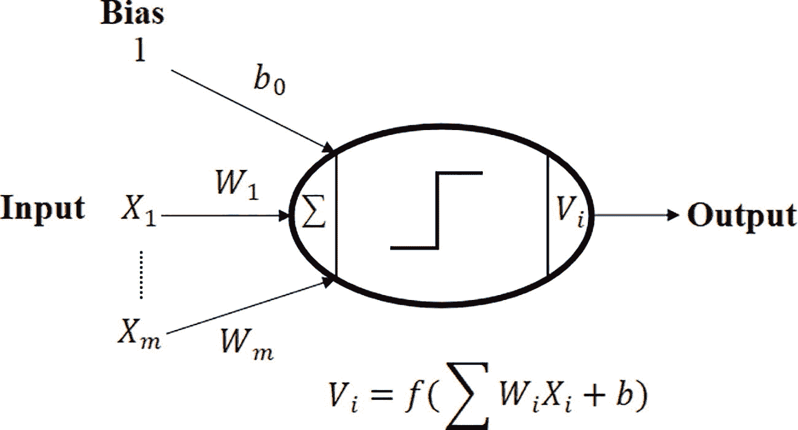

图 3-3

单层感知器模型

在这里，使用梯度下降在每个迭代中更新权重和偏差。这个主题将在以下章节中讨论。

## SLP 的实现

以下代码实现了 SLP（列表 3-1）。代码使用了流行的 IRIS 数据集的前 100 个样本，该数据集具有四个特征。前 100 个样本中的每个样本属于两个类别之一（二分类）Setosa 和 Versicolor。

设与四个输入对应的权重为 [w[1], w[2], w[3], w[4]]，偏差为 b。输出神经元的输入将是权重和输入的点积，然后加上偏差。这个总和随后通过激活函数。所得到的输出与期望的输出进行比较，并评估平方误差。

模型的权重随后在以下迭代中进行更新，直到权重没有进一步的变化或达到预先决定的迭代次数。

所得到的权重随后用于预测未见过的样本的类别，以评估给定的模型。

注意，超参数 α（学习率）会影响模型的性能。图 3-4 中显示的输出显示了 α 与性能的变化。第五章详细讨论了神经网络的超参数。

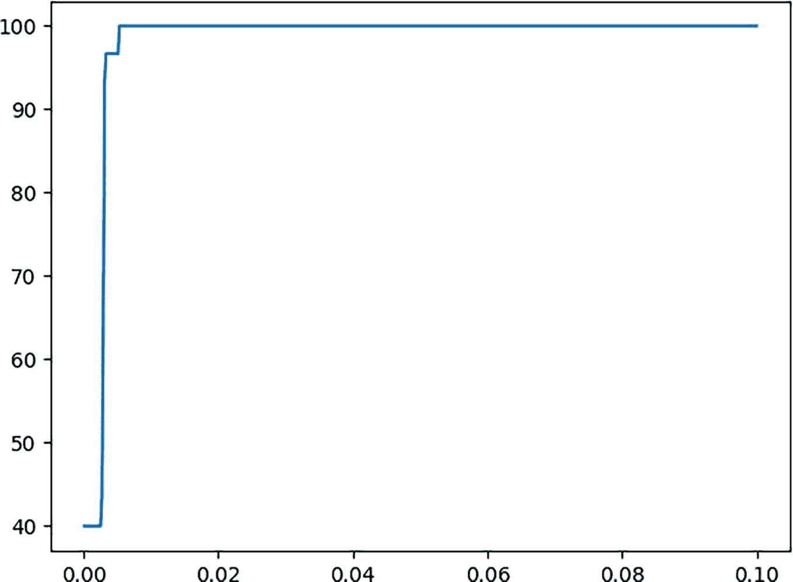

图 3-4

学习率与性能的变化

```py
Code:
#1\. Importing Libraries
import numpy as np
from sklearn.datasets import load_iris
from sklearn.model_selection import train_test_split
from matplotlib import pyplot as plt
#2\. Loading the Dataset
Data=load_iris()
X=Data.data
y=Data.target
print(X.shape)
print(y.shape)
#3\. Selecting the first 100 samples
X=X[:100]
y=y[:100]
print(X.shape)
print(y.shape)
#4\. Initializing weights and bias
def init_(X):
w=np.random.random(X.shape[1])
b=np.random.random()
return w, b
#5\. Min-Max Normalization
def normalise(X):
max=np.max(X, axis=0)
min=np.min(X, axis=0)
return ((X-min)/(max-min))
#6\. Sigmoid Activation Function
def f(x):
return ((1)/(1+np.exp(-1*x)))
#7\. Training the Model
def train(X_train, y_train, w, b, alpha):
for i in range(X_train.shape[0]):
x=X_train[i,:]
u=np.sum(x*w)+b
v=f(u)
if v>0.5:
y_pred=1
else:
y_pred=0
w=w-alpha*(y_pred-y_train[i])*x
b=b-alpha*(y_pred-y_train[i])
return w, b
#8\. Testing the model
def test(X_test, y_test, w, b):
tp=0
fp=0
tn=0
fn=0
for i in range(X_test.shape[0]):
x=X_test[i,:]
u=np.sum(x*w)+b
v=f(u)
if v>0.5:
y_pred=1
else:
y_pred=0
if(y_pred==1 and y_test[i]==1):
tp+=1
elif(y_pred==0 and y_test[i]==0):
tn+=1
elif(y_pred==1 and y_test[i]==0):
fp+=1
else:
fn+=1
accuracy=((tp+tn)/(tp+tn+fp+fn))*100
return accuracy
#9\. Driver Code
X_Norm=normalise(X)
y_Norm=normalise(y)
w, b=init_(X_Norm)
X_train, X_test, y_train, y_test=train_test_split(X_Norm, y_Norm, test_size=0.3)
result=[]
alpha=np.linspace(0.0001,0.1,500)
for i in alpha:
w, b=train(X_train, y_train, w, b, i)
accuracy=test(X_test, y_test, w, b)
result.append(accuracy)
best=np.max(result)
index=np.argmax(result)
print(best, index)
print(alpha[index])
plt.plot(alpha, result)
Output:
Listing 3-1
Implementing SLP from scratch to classify the IRIS dataset (first two classes)
```

以下代码（列表 3-2）使用 ***sklearn.linear_model.Perceptron*** 在包含 569 个样本和 30 个特征的乳腺癌数据集上实现 SLP。表 3-1 展示了用于实现 SLP 的函数。

表 3-1

sklearn 用于实现感知器和它们的描述函数

| 函数 | 描述 |
| --- | --- |
| ***perceptron = Perceptron ()*** | 初始化分类算法。 |
| ***perceptron.fit(X_train, y_train)*** | 使用训练集拟合或训练模型。 |
| ***perceptron.predict(X_test)*** | 预测 X_test 中每个样本的类别。 |
| ***accuracy_score(y_test, y_pred)*** | 计算模型的准确率。 |

```py
Code:
#1\. Importing Libraries
import numpy as np
from sklearn.datasets import load_breast_cancer
from sklearn.model_selection import train_test_split
from sklearn.linear_model import Perceptron
from sklearn.metrics import accuracy_score
#2\. Load the Breast Cancer dataset
breast_cancer = load_breast_cancer()
X = breast_cancer.data
y = breast_cancer.target
#3\. Train Test Split
X_train, X_test, y_train, y_test = train_test_split(X, y, test_size=0.2, random_state=42)
#4\. Fit the Model
perceptron = Perceptron(max_iter=1000, tol=1e-3, random_state=42)
perceptron.fit(X_train, y_train)
#5\. Evaluate the Model
y_pred = perceptron.predict(X_test)
accuracy = accuracy_score(y_test, y_pred)
print(f"Accuracy: {accuracy}")
Listing 3-2
Implementing SLP using the sklearn module to classify the Breast Cancer dataset
```

在从头实现和使用 ***sklearn*** 的基础上，让我们转向使用 ***Keras*** 实现 SLP。以下代码（列表 3-3）在具有 30 个特征和 569 个样本的乳腺癌数据集上使用 ***Keras*** 实现了 SLP。创建了一个具有单个神经元的密集层序列模型。该模型使用随机梯度下降（SGD）优化器、二元交叉熵（损失函数）和准确度（度量）进行编译。在训练数据上训练了 50 个轮次，批大小为 32。模型在训练集和测试集上的损失和准确度如图 3-5 所示。

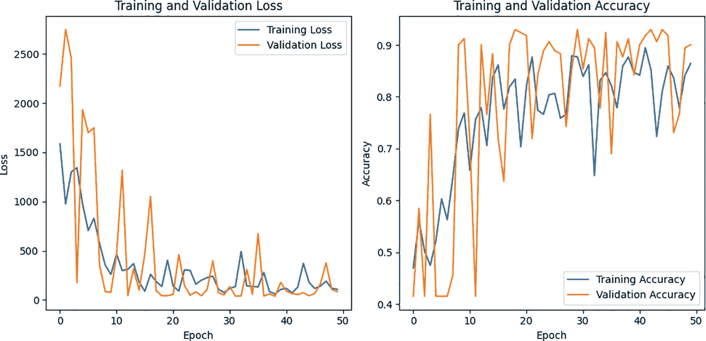

图 3-5

随着训练轮数的增加，损失和性能的变化（列表 3-3）

```py
Code:
#1\. The libraries keras.models and keras.layers are imported to design a sequential model having dense layers. We need to import the train_test_split from sklearn.model_selectionmodulefor splitting the data into train and test sets.
import numpy as np
import pandas as pd
from sklearn.model_selection import train_test_split
from keras.models import Sequential
from keras.layers import Dense
from sklearn.datasets import load_breast_cancer
#2\. The breast cancer dataset is loaded using load_breast_cancer function.
data = load_breast_cancer()
X = data.data
y = data.target
print(X.shape, y.shape)
#3\. Train Test Split
X_train, X_test, y_train, y_test = train_test_split(X, y, test_size = 0.3)
print(X_train.shape, X_test.shape, y_train.shape, y_test.shape)
#4\. The model having an input layer and a dense layer of single neuronwith sigmoid activation is created. The model is compiled with an 'sgd' optimizer, binary cross entropy loss (binary classification), and accuracy metric. The model is trained over 50 epochs with the training set.
model_1 = Sequential()
model_1.add(Dense(units=1, input_dim= X.shape[1], activation='sigmoid'))
model_1.compile(optimizer='sgd', loss='binary_crossentropy', metrics=['accuracy'])
history = model_1.fit(X_train, y_train, epochs=50, batch_size=32, validation_data=(X_test, y_test))
loss, accuracy = model_1.evaluate(X_train, y_train)
print(f"Loss: {loss}, Accuracy: {accuracy}")
#5\. Note that after compiling the model the output was saved in a variable called history. This is a dictionary from which training and validation accuracy and loss are plotted.
import matplotlib.pyplot as plt
train_loss = history.history['loss']
val_loss = history.history['val_loss']
train_acc = history.history['accuracy']
val_acc = history.history['val_accuracy']
plt.figure(figsize=(10, 5))
plt.subplot(1, 2, 1)
plt.plot(train_loss, label='Training Loss')
plt.plot(val_loss, label='Validation Loss')
plt.xlabel('Epoch')
plt.ylabel('Loss')
plt.title('Training and Validation Loss')
plt.legend()
plt.subplot(1, 2, 2)
plt.plot(train_acc, label='Training Accuracy')
plt.plot(val_acc, label='Validation Accuracy')
plt.xlabel('Epoch')
plt.ylabel('Accuracy')
plt.title('Training and Validation Accuracy')
plt.legend()
plt.tight_layout()
plt.show()
Output:
Listing 3-3
Implementing SLP using the Keras module to classify the Breast Cancer dataset
```

可以看到，随着训练轮数的增加，损失（通常）会降低，性能会提高。让我们使用 SLP 对一个稍微复杂的数据集进行分类。

以下代码（列表 3-4）在预处理数据后，使用 ***Keras*** 在 **心肌梗死并发症** 数据集上实现了 SLP，该数据集有 1700 个样本和 109 个特征。该架构和训练过程与先前的模型相同。模型在训练集和测试集上的损失和准确度如图 3-6 所示。

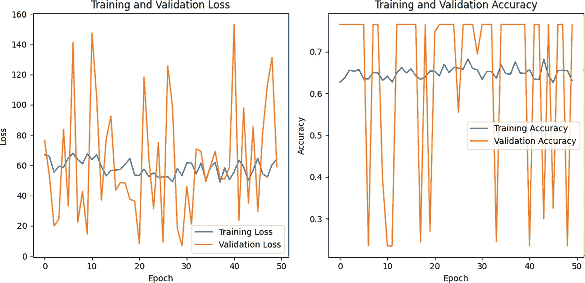

图 3-6

随着训练轮数的增加，损失和性能的变化（列表 3-4）

```py
Code:
#1\. The ucimlrep is installed and fetched to import the myocardial_infarction_complications dataset.
!pip install ucimlrepo
from ucimlrepo import fetch_ucirepo
myocardial_infarction_complications= fetch_ucirepo(id=579)
X = myocardial_infarction_complications.data.features
y = myocardial_infarction_complications.data.targets
y = y['ZSN']
#2\. The NaNs are calculated for each feature and droppedthose having greater than threshold.
nan_count_per_column = X.isnull().sum()
print(nan_count_per_column)
threshold = len(X)*0.3
df = X.dropna(axis=1, thresh=threshold)
print(df)
#3\. From sklearn.impute module the KNN imputer is imported to impute the remaining NaN values in the dataset.
import pandas as pd
from sklearn.impute import KNNImputer
imputer = KNNImputer()
df_imputed = pd.DataFrame(imputer.fit_transform(df), columns=df.columns)
print(df_imputed)
X = df_imputed
print(X.shape, y.shape)
#3\. From sklearn.model_selection module the train_test_splitfunction is imported to split the data into train and test.
from sklearn.model_selection import train_test_split
X_train, X_test, y_train, y_test = train_test_split(X, y, test_size = 0.3)
print(X_train.shape, X_test.shape, y_train.shape, y_test.shape)
#4\. The model having an input layer and a dense layer of single neuron with sigmoid activation is created. The model is complied with an 'sgd' optimizer, binary cross entropy loss (binary classification), and accuracy metric. The model is trained over 50 epochs with the training set.
import numpy as np
from keras.models import Sequential
from keras.layers import Dense
model_1 = Sequential()
model_1.add(Dense(units=1, input_dim= X.shape[1], activation='sigmoid'))
model_1.compile(optimizer='sgd', loss='binary_crossentropy', metrics=['accuracy'])
history = model_1.fit(X_train, y_train, epochs=50, batch_size=32, validation_data=(X_test, y_test))
loss, accuracy = model_1.evaluate(X_train, y_train)
print(f"Loss: {loss}, Accuracy: {accuracy}")
#5\. Note that after compiling the model the output was saved in a variable called history. This is a dictionary from which training and validation accuracy and loss are plotted.
import matplotlib.pyplot as plt
train_loss = history.history['loss']
val_loss = history.history['val_loss']
train_acc = history.history['accuracy']
val_acc = history.history['val_accuracy']
plt.figure(figsize=(10, 5))
plt.subplot(1, 2, 1)
plt.plot(train_loss, label='Training Loss')
plt.plot(val_loss, label='Validation Loss')
plt.xlabel('Epoch')
plt.ylabel('Loss')
plt.title('Training and Validation Loss')
plt.legend()
plt.subplot(1, 2, 2)
plt.plot(train_acc, label='Training Accuracy')
plt.plot(val_acc, label='Validation Accuracy')
plt.xlabel('Epoch')
plt.ylabel('Accuracy')
plt.title('Training and Validation Accuracy')
plt.legend()
plt.tight_layout()
plt.show()
Output:
Listing 3-4
Implementing SLP using the Keras module to classify the Myocardial Infarction Complications dataset
```

上述模型的成果总结在表 3-2 中。在这种情况下，结果并不完美，因为此数据不是线性可分的。

表 3-2

使用两个不同数据集的 SLP 结果

| SLP 编号 | 数据集 | 模型 | 准确度 | 损失 |
| --- | --- | --- | --- | --- |
| 1. | 乳腺癌 | SLP 模型 _1（输出层中只有一个神经元） | 0.907 | 84.899 |
| 2. | 心肌梗死并发症 | SLP 模型 _1（输出层中只有一个神经元） | 0.7697 | 57.6161 |

如前所述，SLP 可以对线性可分输入进行分类。然而，当输入不是线性可分时，SLP 可能表现不佳。让我们看看一个著名的无法使用 SLP 解决的问题：XOR 问题。

## XOR 问题

假设你拥有两个输入变量（二进制），需要将它们分为两个类别，如表 3-3 所示。

表 3-3

XOR 表

| A | B | Y |
| --- | --- | --- |
| 0 | 0 | 0 |
| 0 | 1 | 1 |
| 1 | 0 | 1 |
| 1 | 1 | 0 |

图 3-7 显示了 (A, B) 的值以及相应的 Y 值。Y=0 使用圆圈表示，Y=1 使用三角形表示。请注意，圆圈和三角形无法用一条线分开。

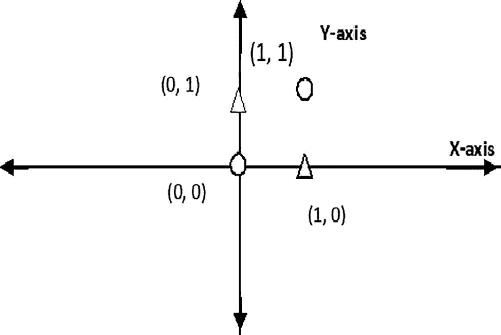

图 3-7

XOR 问题

XOR 问题

XOR 问题需要创建一个分类器，该分类器可以将 XOR 函数的输出分类，并将该函数的输入视为两个维度。

由于数据不是线性可分的，我们无法使用 SLP 对数据进行分类。本章后面讨论的多层感知器将帮助我们解决 XOR 问题。

激活函数在模型的表述中扮演着重要的角色。在进一步讨论之前，让我们先看看一些最著名的激活函数。

## 激活函数

本节简要概述了神经网络中使用的激活函数。本节总结了每个激活函数的公式、范围、导数和相关问题。

### 1. Sigmoid

S 形激活函数可以用以下方程表示：

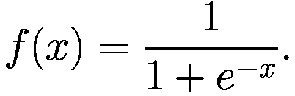

该函数的图像如图 3-8 所示。

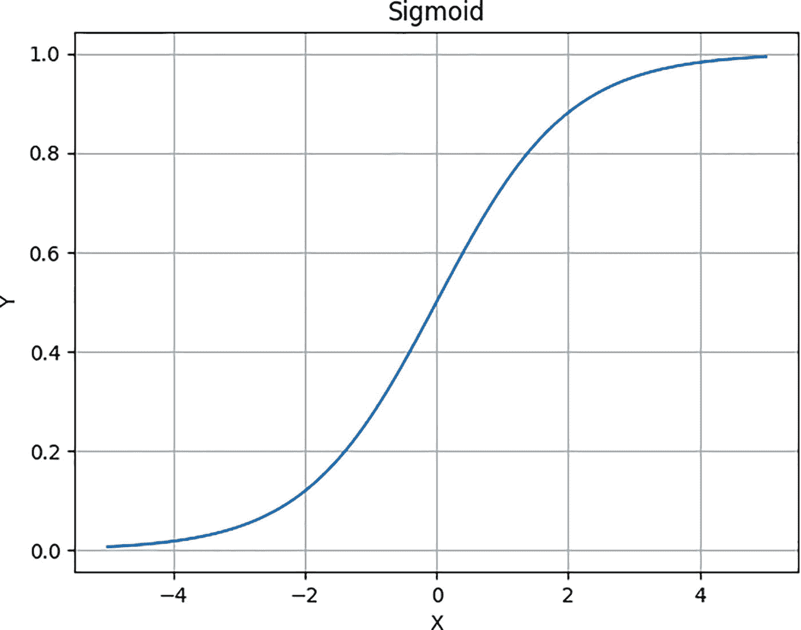

图 3-8

Sigmoid 激活函数图像

这是一个平滑且可微分的函数，其输出范围在 0 到 1 之间，这使得它适合表示表示概率的输出。然而，正如在多层感知器中讨论的那样，它存在梯度消失问题。在更深层的网络中，这个问题可能会减慢学习过程；因此，研究人员后来提出了新的激活函数，如 ReLU。

### 2. Tanh

Tanh 激活函数可以用以下方程表示：

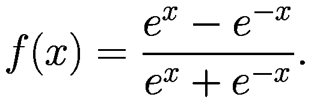

该函数的图像如图 3-9 所示。

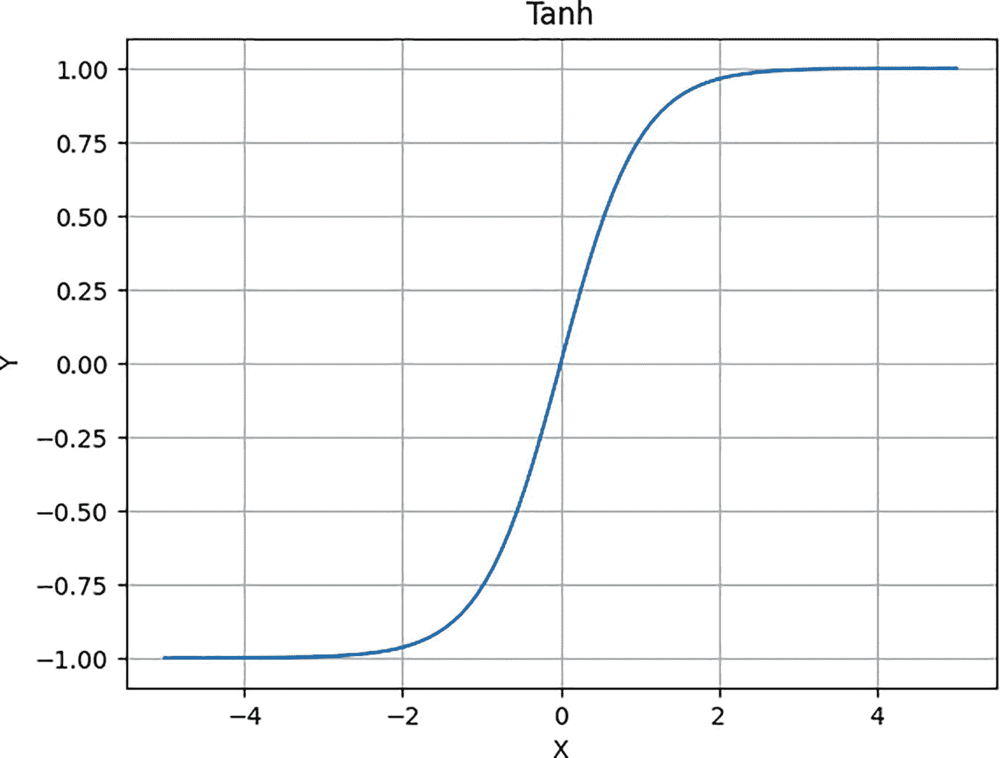

图 3-9

Tanh 激活函数图像

这是一个平滑且可微分的函数，其输出范围在 -1 到 1 之间。这与 sigmoid 函数不同，是零中心的。此函数也存在梯度消失问题。

### 3. 线性整流单元 (ReLU)

ReLU 激活函数可以用以下方程表示：

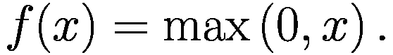

该函数的图像如图 3-10 所示。

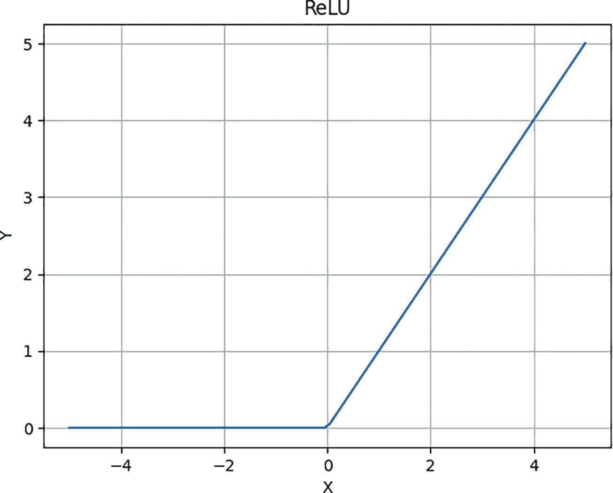

图 3-10

ReLU 激活函数图像

这是计算效率最高的激活函数之一，其输出范围在 0 到无穷大之间，并且优雅地处理了梯度消失问题。使用这些函数面临的一个问题是**如果输入是负数，则输出变为零**。除此之外，如果这些函数的输出没有界限，则会导致称为**梯度爆炸**的问题。

### 4. Softmax

在多分类问题的情况下，softmax 被认为是最好的激活函数之一。在 softmax 中，输出层中特定神经元的输出由以下公式给出：

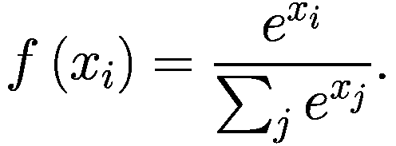

该函数的图示如图 3-11 所示。

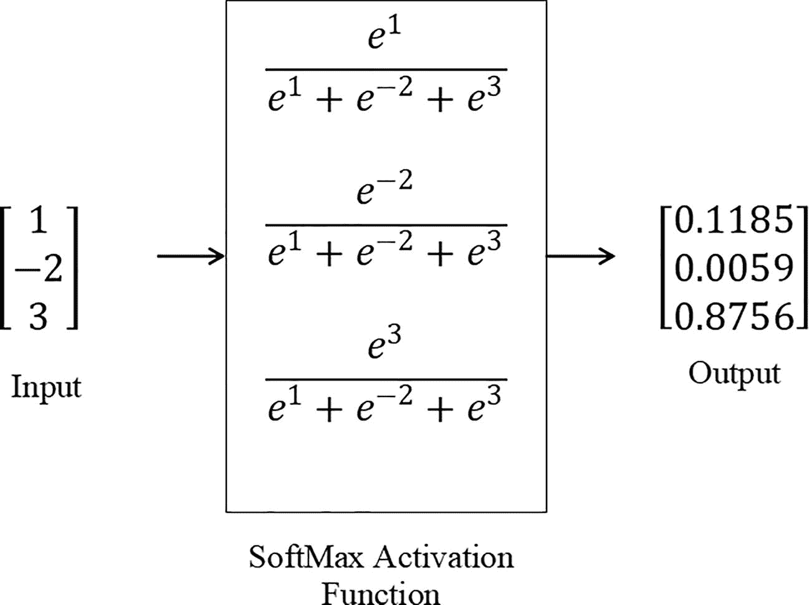

图 3-11

Softmax 激活函数图

注意，每个神经元的输出范围在 0 到 1 之间，这些输出可以被认为是概率，其总和为 1。因此，具有最高概率的神经元可以被选为输出。

## 多层感知器

我们已经看到，单层感知器（SLP）将输入特征形成线性组合，并将其作为非线性激活函数的参数。现在，想象一下，在某一层中创建了各种这样的输入特征组合，它们作为下一层的输入，从而创建了一个***特征层次结构***。多层感知器确实创建了一个特征层次表示，并且可以处理非线性可分的数据。让我们从使用 MLP 解决 XOR 问题（非线性可分数据）开始。

### 使用多层感知器解决 XOR 问题

让我们考虑一个 **XOR** 门。我们已经看到，它不能由 SLP 实现。然而，**AND** 和 **OR** 门可以使用 SLP 实现。我们之前也看到，**NAND** 门可以像 **AND** 门一样创建，只是输入被取反。现在，考虑一个有两个输入 *X*[1] 和 *X*[2] 的网络。你可以很容易地创建一个 SLP 来实现 **NAND** 门和 **OR** 门，如图 3-12 所示。

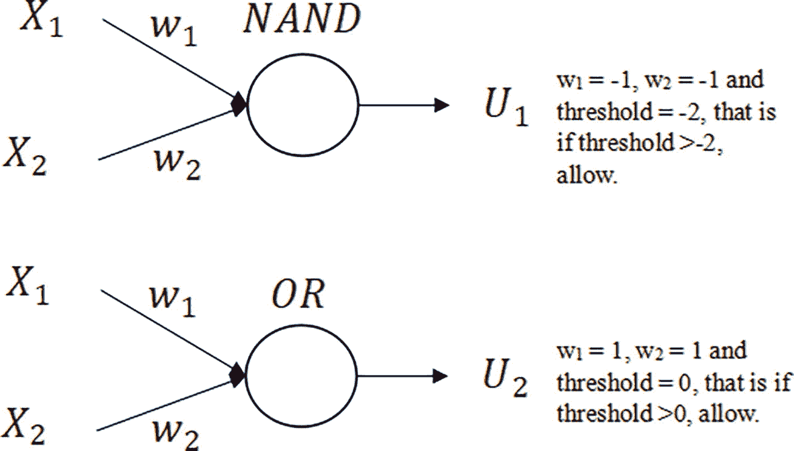

图 3-12

使用 SLP 实现 **NAND** 和 **OR** 门

要构建 **XOR** 门，上述网络的输出作为下一层中神经元的输入，该神经元实现了图 3-13 中所示的 **AND** 门。

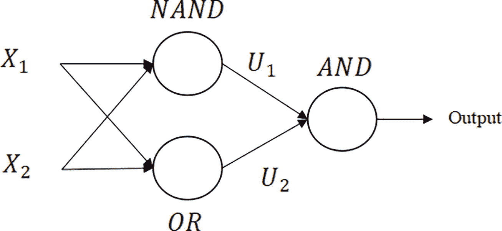

图 3-13

使用 **NAND**、**OR** 和 **AND** 门实现 XOR 门

让我们看看为什么上述构造在数学上是正确的。正如我们所理解的，XOR 可以用以下布尔表达式表示：

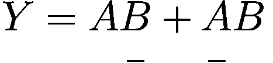

NAND 可以表示为

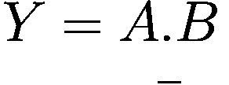

可以写成如下形式（应用德摩根定律）。

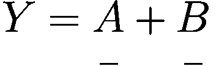

现在，将 *A* + *B* 与 Y* 相乘，我们得到

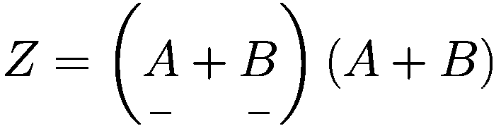

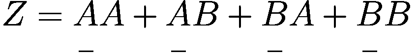

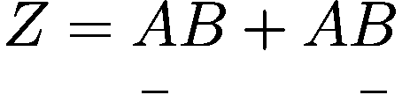

这与 XOR 相同。因此，可以得出结论，XOR 可以被视为 **NAND** 和 **OR** 的 **AND**。同样，**NAND** 和 **OR** 可以通过 SLP 实现。这意味着 XOR 可以使用两个 SLP 层重新创建，并且可以分类非线性可分的数据。

小贴士

多层神经网络可以分类非线性可分的数据。

### MLP 和前向传播的架构

多层感知器有一个输入层，一个输出层，以及至少一个隐藏层。图 3-14 显示了一个具有 **n** 个输入和一个单个输出的 MLP 架构。假设只有一个包含 **p** 个神经元的隐藏层。

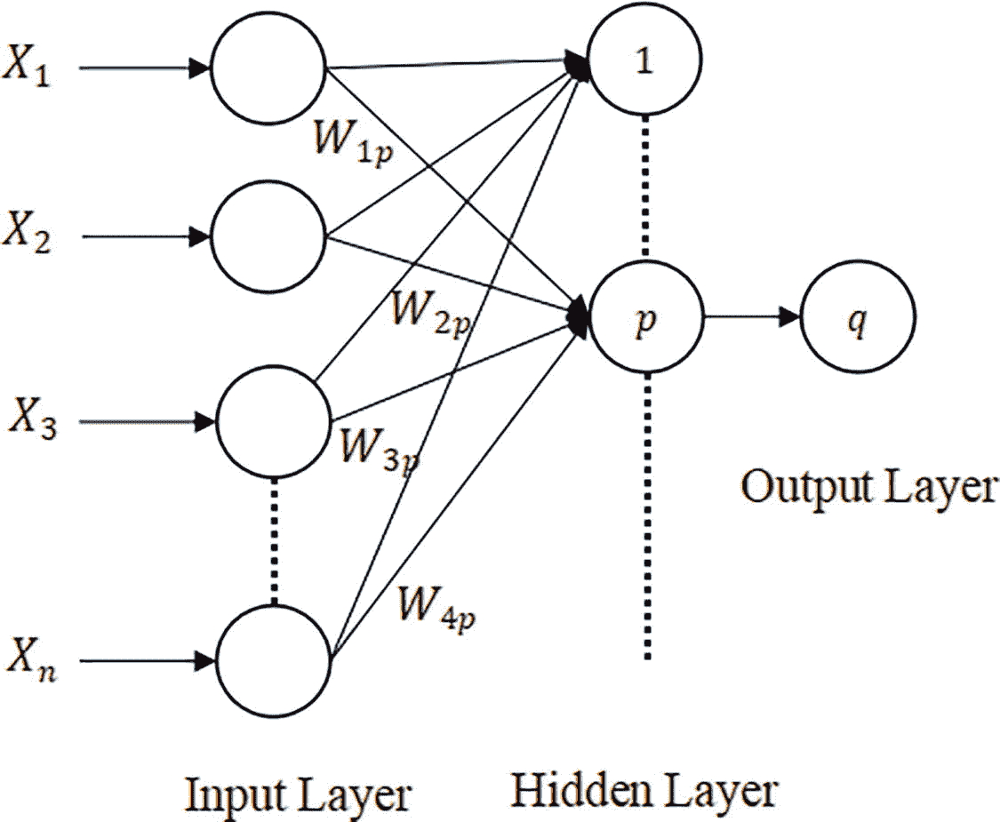

图 3-14

输入层有 n 个神经元，输出层有一个神经元的多层感知器

设输入为 *X*[1]，*X*[2]，*X*[3]，*X*[4]…，*X*[*n*]，第一层和第二层之间的权重为 *W*[*ij*]。考虑隐藏层中的一个特定神经元，例如**p**。

在隐藏层的第 p 个神经元中，输入特征乘以相应的权重，加上偏置，成为激活函数的输入：

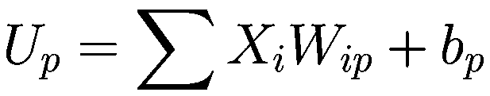

第 p 个神经元的输出可以表示为

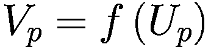

其中 f 是激活函数。同样，可以计算出隐藏层中所有神经元的输入。

现在考虑输出层的一个神经元（q）。这个神经元的输出可以按以下方式计算：

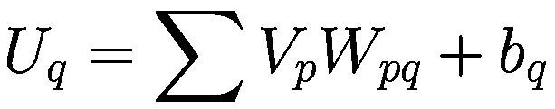

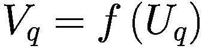

在每一层，我们处理输入并计算输出，这成为下一层的输入。因此，这个网络将被称为**前馈网络**。

例如，考虑一个用于分类具有四个特征的标准化 IRIS 数据集的网络。从这个数据集中考虑前 100 个样本，有两个类别：Setosa 和 Versicolor。让我们开发一个网络来分类这个数据集。该网络在输入层有四个神经元，在隐藏层有两个神经元（如何？），在输出层有一个神经元，如图 3-15 所示。从输入到第一个隐藏层的权重上标为 1，从隐藏层到输出的权重上标为 2。

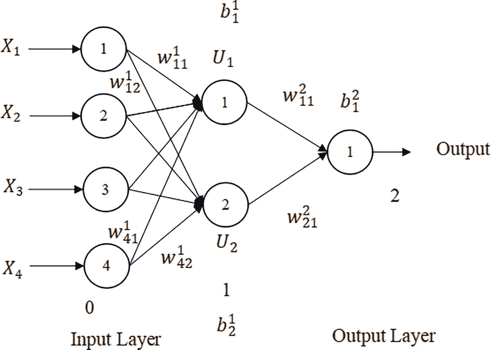

图 3-15

输入层有四个神经元，隐藏层有两个神经元，输出层有一个神经元的网络架构

现在我们假设初始权重和偏差已知，计算前馈传递中每一层输出的值。

**前馈**

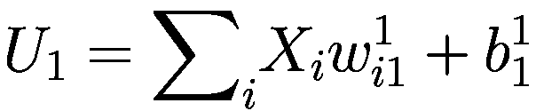

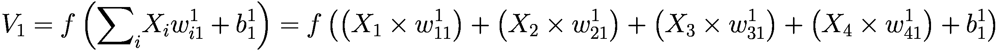

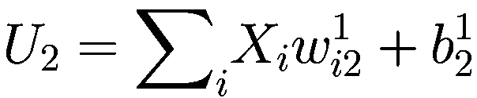

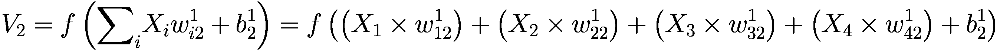

现在，网络的输出可以表示为

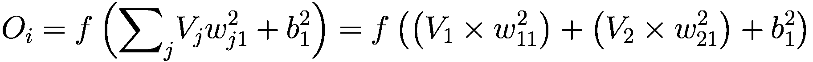

使用上述计算（前向传递）得到的值是网络的输出。

通过这种方式获得的输出与预期输出进行比较，并计算误差。随后更新输出层和隐藏层之间的权重；然后更新输入层和隐藏层之间的权重。这个过程将在下一节中进行分析。

## 梯度下降

在传统的机器学习流程中，你通常会对给定的数据进行预处理，从中提取特征，选择相关特征，进行预测，并设计一个损失函数，以最小化预期值和预测值之间的差异。在每次迭代中，模型试图最小化这个损失。为了完成这个任务，常用的方法之一是梯度下降法。为了理解这种方法，让我们考虑一个权重和偏差初始化为随机值的简单线性回归（SLP）。这些参数与输入特征相乘，得到一个线性组合，通过非线性激活函数生成预测值。在分类的情况下，在此步骤之后进行阈值处理。

假设预测值为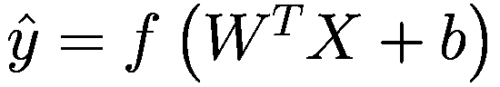，损失函数为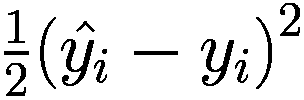，即预期值和预测值之间的平方差（1/2 乘以方便数学计算）。权重相对于损失的梯度可以计算如下：

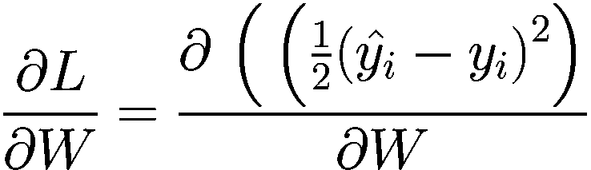

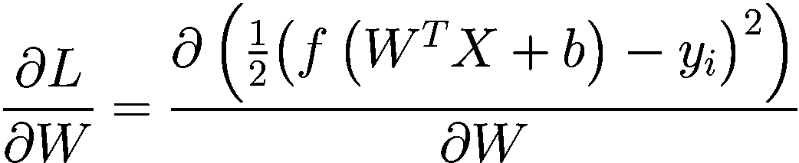

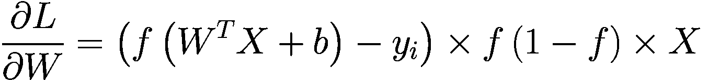

然后使用以下公式更新权重：


在这里，\( W_{old} \) 是前一次迭代中权重的值（某个随机值），而 \( \frac{\partial L}{\partial W} \) 是在上一步计算的。α 是学习率，它决定了步长的大小。如果 α 的值非常小，那么需要花费大量时间才能达到最优值。另一方面，如果 α 的值非常大，那么可能会跳过局部最小值。更新偏置值的公式如下：

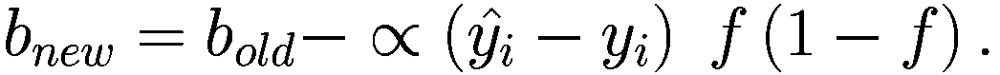

如前所述，上述过程可以用来在单层神经网络中找到每一迭代中的权重。然而，对于多层网络，由于前面解释的原因，更新权重变得复杂。对于多层感知器（MLP）中的权重更新，首先从最外层开始。使用上述算法更新权重。一旦我们更新了权重，我们就向后移动并使用反向传播算法更新倒数第二层的权重。

## 反向传播

一旦我们通过取期望值和获得值之间差异的平方来计算平方误差，我们就继续更新网络的权重。为此，我们首先使用上一节中通过梯度下降获得的公式更新输出层和隐藏层之间的权重。然后，我们使用反向传播算法更新隐藏层的权重：

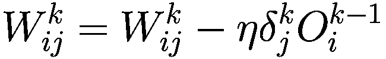

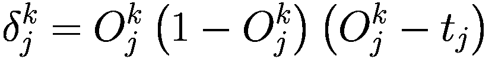

让我们来看看用于学习隐藏层权重的反向传播算法。

**反向传播算法**

1.  使用小的随机值初始化每一层的权重和偏置。

1.  对于每一层（正向传播）

    1.  计算每个神经元的输入加权总和：∑X[i]W[ij] + b。

    1.  将激活函数 *f* (∑*X*[*i*]*W*[*ij*] + *b*) 应用到该层的输出生成。

1.  计算输出层的误差：

1.  计算损失对权重的梯度：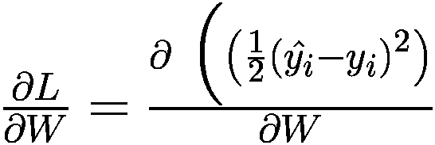

1.  使用计算出的梯度和学习率 ∝ 更新最后一层的权重：

1.  使用以下方程更新隐藏层的权重。

对于任何隐藏层权重：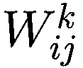

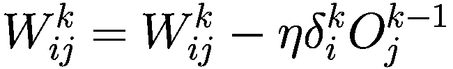

其中

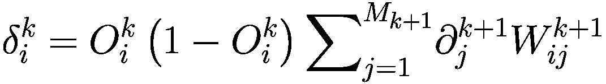

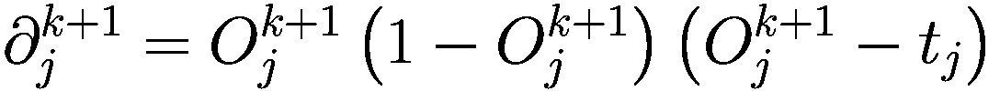

1.  重复前向和反向传播，直到预定义的 epoch 数或收敛。

## 实现

MLPs 必须包含至少一个隐藏层。然而，它们也可以有多个隐藏层。请注意，

+   隐藏层数量

+   隐藏层中的神经元数量

+   激活函数

+   学习率

是 MLPs 中的某些重要超参数。确定这些超参数的一种方法是通过经验分析。该主题在第五章节中讨论。

为了理解这一点，让我们举一个例子。下面的例子将葡萄酒数据集的前两个类别（具有 13 个特征和 130 个样本）进行分类（列表 3-5）。请注意，下面的实现使用了 ***sklearn.neural_network.MLPClassifier*** 函数的 ***sklearn*** 模块。创建了两个模型，一个具有单个隐藏层的默认神经元数量，即 100，另一个隐藏层只有 3 个神经元。

```py
Code:
#1\. The Wine dataset is imported from sklearn.datasets using load_wine function. The MLP classifier is imported from sklearn.neural_network module. Additionally, train_test_split from sklearn.model_selection to split the data into train and test sets and accuracy_score from sklearn.metrics to evaluate the accuracy of the model have also been imported.
import numpy as np
from sklearn.datasets import load_wine
from sklearn.model_selection import train_test_split
from sklearn.neural_network import MLPClassifier
from sklearn.metrics import accuracy_score
#2\. The wine dataset is loaded using load_wine function and the first two classes were selected.
wine = load_wine()
X = wine.data
y = wine.target
mask = y < 2
X = X[mask]
y = y[mask]
print(X.shape, y.shape)
#3\. Train Test Split to split the data into train and test set
X_train, X_test, y_train, y_test = train_test_split(X, y, test_size=0.2, random_state=42)
#4.The Model 1: mlp_defaultisfittedwith the default parameters of MLP Classifier
mlp_default = MLPClassifier(random_state=42)
mlp_default.fit(X_train, y_train)
#5\. The Model 2: mlp_custom is fittedwith the MLP Classifier having 3 neurons in a single hidden layer
mlp_custom = MLPClassifier(hidden_layer_sizes=(3,), random_state=42)
mlp_custom.fit(X_train, y_train)
#6\. Using the predictions with default MLP, the accuracy score is calculated.
y_pred_default = mlp_default.predict(X_test)
accuracy_default = accuracy_score(y_test, y_pred_default)
print("Default MLP Accuracy: ", accuracy_default)
#6\. Using the predictions with custom MLP, the accuracy score is calculated.
y_pred_custom = mlp_custom.predict(X_test)
accuracy_custom = accuracy_score(y_test, y_pred_custom)
print("Custom MLP (3 Neurons) Accuracy: ", accuracy_custom)
Output:
Default MLP Accuracy:  0.9230769230769231
Custom MLP (3 Neurons) Accuracy:  0.8076923076923077
Listing 3-5
Implementing MLP using the sklearn module to classify the first two classes of the wine dataset
```

注意，该模型在隐藏层有 100 个神经元时准确率为 92.3%，而在隐藏层有 3 个神经元时准确率为 80.76%。神经网络也可以有多个隐藏层。隐藏层的数量和每个隐藏层中的神经元数量可以通过各种方法找到，其中一种方法是经验分析。为了理解这一点，考虑具有 30 个特征和 569 个样本的乳腺癌数据集。以下代码实现了两种不同的模型（列表 3-6 和 3-7）。第一个模型有一个包含 16 个神经元的单个隐藏层，而第二个模型有两个隐藏层，分别包含 16 和 8 个神经元。通过分析结果，可以推断出通过多个隐藏层或单个层可以获得接近最优的性能。然而，这两种情况下的参数总数是不同的。以下实现还通过改变学习率和优化器来分析模型的性能。

```py
Code (single hidden layer of 16 neurons):
#1\. The libraries keras.models and keras.layers are imported to design a sequential model having dense layers. We need to import the train_test_split from sklearn.model_selectionmodule for splitting the data into train and test sets.
import numpy as np
import pandas as pd
from sklearn.model_selection import train_test_split
from keras.models import Sequential
from keras.layers import Dense
from sklearn.datasets import load_breast_cancer
#2\. The breast cancer dataset is loaded using load_breast_cancer function.
data = load_breast_cancer()
X = data.data
y = data.target
print(X.shape, y.shape)
#3\. The train_test_split function is used to split the dataset into train and test set.
X_train, X_test, y_train, y_test = train_test_split(X, y, test_size = 0.3)
print(X_train.shape, X_test.shape, y_train.shape, y_test.shape)
#4\. The model having an input layer and two dense layers of 16(hidden layer) and 1 (for output) neuron with sigmoid activation is created. The model is complied with'sgd' optimizer, binary cross entropy loss (binary classification), and accuracy metric. The model is trained over 50 epochs with the training set.
model_2 = Sequential()
model_2.add(Dense(units=16, input_dim= X.shape[1], activation='sigmoid'))
model_2.add(Dense(units=1, activation='sigmoid'))
model_2.compile(optimizer='sgd', loss='binary_crossentropy', metrics=['accuracy'])
history = model_2.fit(X_train, y_train, epochs=50, batch_size=32, validation_data=(X_test, y_test))
loss, accuracy = model_2.evaluate(X_test, y_test)
print(f"Loss: {loss}, Accuracy: {accuracy}")
#5\. Note that after compiling the model the output was saved in a variable called history. This is a dictionary from which training and validation accuracy and loss are plotted.
import matplotlib.pyplot as plt
train_loss = history.history['loss']
val_loss = history.history['val_loss']
train_acc = history.history['accuracy']
val_acc = history.history['val_accuracy']
plt.figure(figsize=(10, 5))
plt.subplot(1, 2, 1)
plt.plot(train_loss, label='Training Loss')
plt.plot(val_loss, label='Validation Loss')
plt.xlabel('Epoch')
plt.ylabel('Loss')
plt.title('Training and Validation Loss')
plt.legend()
plt.subplot(1, 2, 2)
plt.plot(train_acc, label='Training Accuracy')
plt.plot(val_acc, label='Validation Accuracy')
plt.xlabel('Epoch')
plt.ylabel('Accuracy')
plt.title('Training and Validation Accuracy')
plt.legend()
plt.tight_layout()
plt.show()
Output:
Listing 3-6
Implementing MLP using the Keras module to classify the Breast Cancer dataset
```

图 3-16（左）显示了训练和验证损失随训练轮数的变化，图 3-16（右）显示了模型 1 的性能随训练轮数的变化。

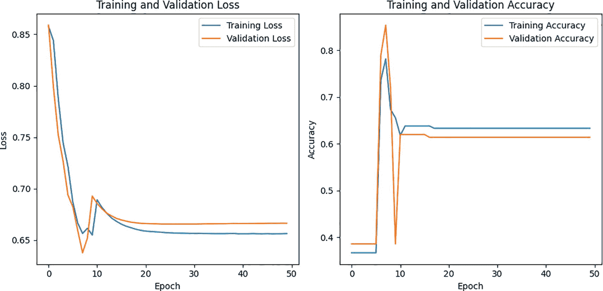

图 3-16

训练和验证损失以及准确率随训练轮数的变化

图

不同优化器的选择也会影响模型的表现和损失的变体。如图 3-17、3-18 和 3-19 所示，不同优化器下性能和损失随学习率的变化给出了不同的结果。对于这个特定的数据集和这个模型，在随机梯度下降的情况下，性能不会随着学习率的变化而变化。然而，损失的变体是明显的。在 RMSprop 和 Adam 的相同模型中，准确率在 10^(-1) 的学习率下达到 90%。然而，损失的变体是稳定的。

**随机梯度下降**

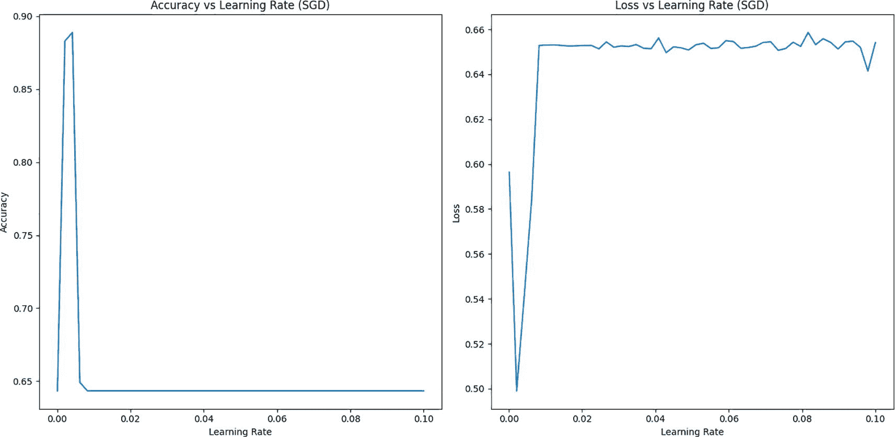

图 3-17

对于随机梯度下降优化器，损失和准确率随学习率的变体

**RMSprop**

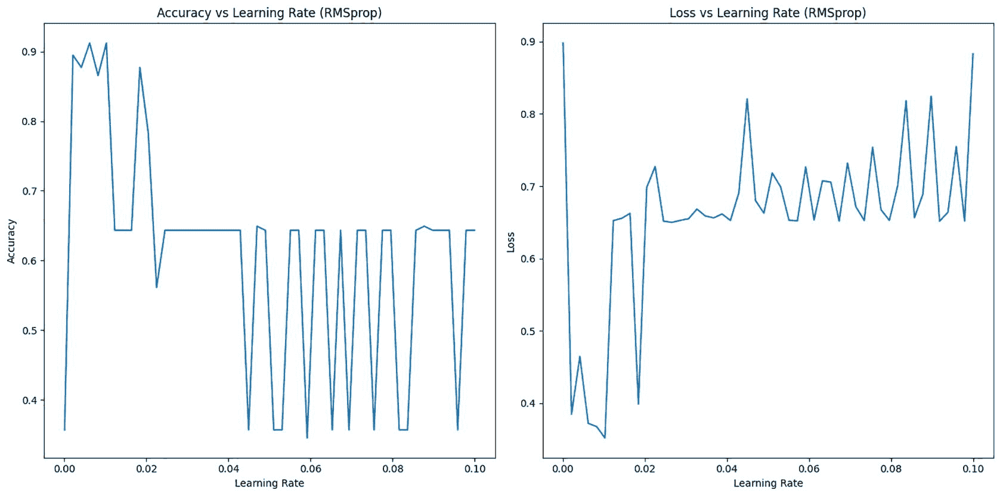

图 3-18

对于 RMSprop 优化器，损失和准确率随学习率的变体

**Adam**

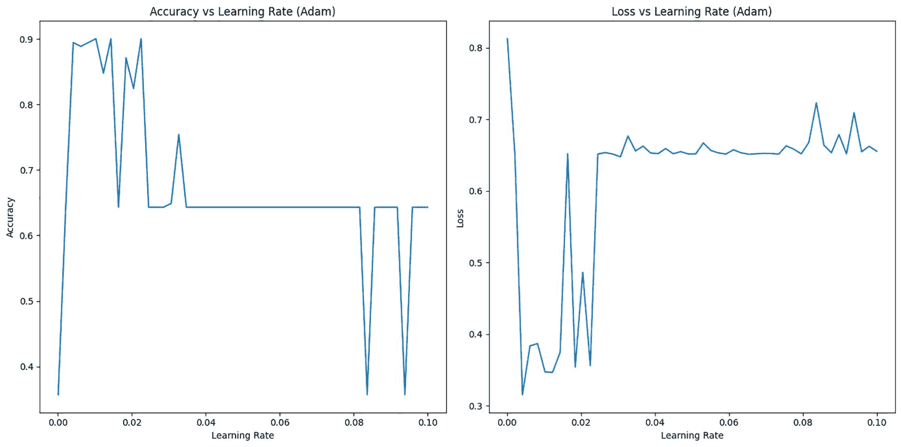

图 3-19

对于 Adam 优化器，损失和准确率随学习率的变体

现在让我们转向使用 ***Keras*** 模块（列表 3-7）实现多层感知器，以两个隐藏层对乳腺癌数据集进行分类。

```py
Code (two hidden layers of 16 and 8 neurons):
#1\. The libraries keras.models and keras.layers are imported to design a sequential model having dense layers. We need to import the train_test_split from sklearn.model_selectionmodulefor splitting the data into train and test sets.
import numpy as np
import pandas as pd
from sklearn.model_selection import train_test_split
from keras.models import Sequential
from keras.layers import Dense
from sklearn.datasets import load_breast_cancer
#2\. The breast cancer dataset is loaded using the load_breast_cancer function.
data = load_breast_cancer()
X = data.data
y = data.target
print(X.shape, y.shape)
#3\. The train_test_split function is used to split the dataset into train and test sets.
X_train, X_test, y_train, y_test = train_test_split(X, y, test_size = 0.3)
print(X_train.shape, X_test.shape, y_train.shape, y_test.shape)
#4\. The model having an input layer with two dense layers of 16and 8 (hidden layer) neurons followed by a dense layer of 1 (for output) neuron with sigmoid activation is created. The model is complied with'sgd' optimizer, binary cross entropy loss (binary classification) and accuracy metric. The model is trained over 50 epochs with the training set.
model_3 = Sequential()
model_3.add(Dense(units=16, input_dim= X.shape[1], activation='sigmoid'))
model_3.add(Dense(units=8, activation='sigmoid'))
model_3.add(Dense(units=1, activation='sigmoid'))
model_3.compile(optimizer='sgd', loss='binary_crossentropy', metrics=['accuracy'])
history = model_3.fit(X_train, y_train, epochs=50, batch_size=32, validation_data=(X_test, y_test))
loss, accuracy = model_3.evaluate(X_test, y_test)
print(f"Loss: {loss}, Accuracy: {accuracy}")
#5\. Note that after compiling the model the output was saved in a variable called history. This is a dictionary from which training and validation accuracy and loss are plotted.
import matplotlib.pyplot as plt
train_loss = history.history['loss']
val_loss = history.history['val_loss']
train_acc = history.history['accuracy']
val_acc = history.history['val_accuracy']
plt.figure(figsize=(10, 5))
plt.subplot(1, 2, 1)
plt.plot(train_loss, label='Training Loss')
plt.plot(val_loss, label='Validation Loss')
plt.xlabel('Epoch')
plt.ylabel('Loss')
plt.title('Training and Validation Loss')
plt.legend()
plt.subplot(1, 2, 2)
plt.plot(train_acc, label='Training Accuracy')
plt.plot(val_acc, label='Validation Accuracy')
plt.xlabel('Epoch')
plt.ylabel('Accuracy')
plt.title('Training and Validation Accuracy')
plt.legend()
plt.tight_layout()
plt.show()
Output:
Listing 3-7
Implementing MLP using the Keras module to classify the Breast Cancer dataset
```

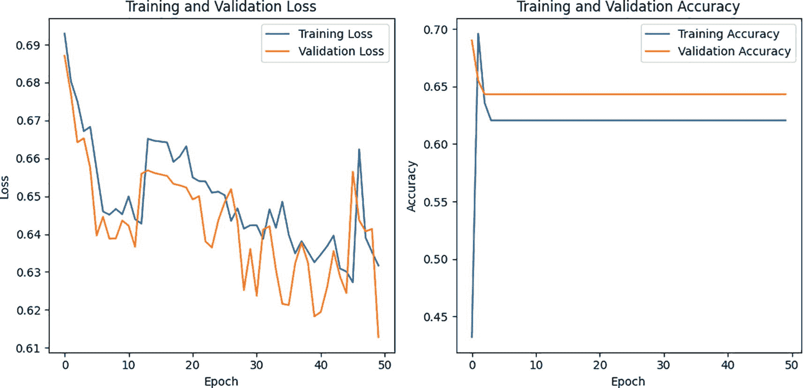

图 3-20

训练和验证损失以及准确率随训练轮数的变化

图 3-20（左）显示了训练和验证损失随 epoch 数量的变化，图 3-20（右）显示了模型 2 的性能随 epoch 数量的变化。

在这里，模型通过 50 个 epoch 进行训练。注意，随着 epoch 数量的增加，损失应该减少，而性能应该提高。结果总结在表 3-4 中。

表 3-4

上文模型在乳腺癌数据集上的结果

| MLP 编号 | 数据集 | 模型 | 准确率 | 损失 |
| --- | --- | --- | --- | --- |
| 1. | 乳腺癌 | model_2（具有 16 个神经元的单个隐藏层） | 0.8538 | 0.664 |
| 2. | model_3（具有 16 和 8 个神经元的两个隐藏层） | 0.6901 | 0.6128 |

上述实现也被用于分类心肌梗死并发症数据集，该数据集稍微复杂一些，包含 1700 个样本和 109 个特征。接下来的第一个实现包含一个具有 50 个神经元的单个隐藏层（列表 3-8）。在第二个实现中，模型包含两个隐藏层，分别有 25 和 12 个神经元（列表 3-9）。

```py
Code (single hidden layer of 50 neurons):
#1\. The ucimlrep is installed and fetched to import the myocardial_infarction_complications dataset.
!pip install ucimlrepo
from ucimlrepo import fetch_ucirepo
myocardial_infarction_complications = fetch_ucirepo(id=579)
X = myocardial_infarction_complications.data.features
y = myocardial_infarction_complications.data.targets
y = y['ZSN']
#2\. The NaNs are calculated for each feature and dropped those having greater than threshold.
nan_count_per_column = X.isnull().sum()
print(nan_count_per_column)
threshold = len(X)*0.3
df = X.dropna(axis=1, thresh=threshold)
print(df)
#3\. From sklearn.impute module the KNN imputer is imported to impute the remaining NaN values in the dataset.
import pandas as pd
from sklearn.impute import KNNImputer
imputer = KNNImputer()
df_imputed = pd.DataFrame(imputer.fit_transform(df), columns=df.columns)
print(df_imputed)
X = df_imputed
print(X.shape, y.shape)
#4\. From sklearn.model_selection module the train_test_split function is imported to split the data into train and test.
from sklearn.model_selection import train_test_split
X_train, X_test, y_train, y_test = train_test_split(X, y, test_size = 0.3)
print(X_train.shape, X_test.shape, y_train.shape, y_test.shape)
#5\. The model has an input layer, a dense layer of 50 neurons(hidden layer), and a dense layer of 1 neuron (for output) with sigmoid activation is created. The model is complied with an 'sgd' optimizer, binary cross entropy loss (binary classification), and accuracy metric. The model is trained over 50 epochs with the training set.
model_2 = Sequential()
model_2.add(Dense(units=50, input_dim= X.shape[1], activation='sigmoid'))
model_2.add(Dense(units=1, activation='sigmoid'))
model_2.compile(optimizer='sgd', loss='binary_crossentropy', metrics=['accuracy'])
history = model_2.fit(X_train, y_train, epochs=50, batch_size=32, validation_data=(X_test, y_test))
loss, accuracy = model_2.evaluate(X_train, y_train)
print(f"Loss: {loss}, Accuracy: {accuracy}")
#6\. Note that after compiling the model the output was saved in a variable called history. This is a dictionary from which training and validation accuracy and loss are plotted.
import matplotlib.pyplot as plt
train_loss = history.history['loss']
val_loss = history.history['val_loss']
train_acc = history.history['accuracy']
val_acc = history.history['val_accuracy']
plt.figure(figsize=(10, 5))
plt.subplot(1, 2, 1)
plt.plot(train_loss, label='Training Loss')
plt.plot(val_loss, label='Validation Loss')
plt.xlabel('Epoch')
plt.ylabel('Loss')
plt.title('Training and Validation Loss')
plt.legend()
plt.subplot(1, 2, 2)
plt.plot(train_acc, label='Training Accuracy')
plt.plot(val_acc, label='Validation Accuracy')
plt.xlabel('Epoch')
plt.ylabel('Accuracy')
plt.title('Training and Validation Accuracy')
plt.legend()
plt.tight_layout()
plt.show()
Output:
Listing 3-8
Implementing MLP with a single hidden layer of 50 neurons using the Keras module to classify the Myocardial Infarction Complications dataset
```

图 3-21（左）显示了训练和验证损失随 epoch 数量的变化，图 3-21（右）显示了模型 1 的性能随 epoch 数量的变化。

```py
Code (two hidden layers of 25 and 12 neurons):
#1\. The ucimlrep is installed and fetched to import the myocardial_infarction_complications dataset.
!pip install ucimlrepo
from ucimlrepo import fetch_ucirepo
myocardial_infarction_complications = fetch_ucirepo(id=579)
X = myocardial_infarction_complications.data.features
y = myocardial_infarction_complications.data.targets
y = y['ZSN']
#2\. The NaNs are calculated for each feature and dropped those having greater than threshold.
nan_count_per_column = X.isnull().sum()
print(nan_count_per_column)
threshold = len(X)*0.3
df = X.dropna(axis=1, thresh=threshold)
print(df)
#3\. From sklearn.impute module the KNN imputer is imported to impute the remaining NaN values in the dataset.
import pandas as pd
from sklearn.impute import KNNImputer
imputer = KNNImputer()
df_imputed = pd.DataFrame(imputer.fit_transform(df), columns=df.columns)
print(df_imputed)
X = df_imputed
print(X.shape, y.shape)
#4\. From sklearn.model_selection module the train_test_split function is imported to split the data into train and test.
X_train, X_test, y_train, y_test = train_test_split(X, y, test_size = 0.3)
print(X_train.shape, X_test.shape, y_train.shape, y_test.shape)
#5\. The model has an input layer, two dense layers of 25 and 12 neurons (hidden layer) and a dense layer of 1 neuron (for output) with sigmoid activation is created. The model is complied with an 'sgd' optimizer, binary cross entropy loss (binary classification), and accuracy metric. The model is trained over 50 epochs with the training set.
model_3 = Sequential()
model_3.add(Dense(units=25, input_dim= 109, activation='sigmoid'))
model_3.add(Dense(units=12, activation='sigmoid'))
model_3.add(Dense(units=1, activation='sigmoid'))
model_3.compile(optimizer='sgd', loss='binary_crossentropy', metrics=['accuracy'])
history = model_3.fit(X_train, y_train, epochs=50, batch_size=32, validation_data=(X_test, y_test))
loss, accuracy = model_3.evaluate(X_train, y_train)
print(f"Loss: {loss}, Accuracy: {accuracy}")
#6\. Note that after compiling the model the output was saved in a variable called history. This is a dictionary from which training and validation accuracy and loss are plotted.
import matplotlib.pyplot as plt
train_loss = history.history['loss']
val_loss = history.history['val_loss']
train_acc = history.history['accuracy']
val_acc = history.history['val_accuracy']
plt.figure(figsize=(10, 5))
plt.subplot(1, 2, 1)
plt.plot(train_loss, label='Training Loss')
plt.plot(val_loss, label='Validation Loss')
plt.xlabel('Epoch')
plt.ylabel('Loss')
plt.title('Training and Validation Loss')
plt.legend()
plt.subplot(1, 2, 2)
plt.plot(train_acc, label='Training Accuracy')
plt.plot(val_acc, label='Validation Accuracy')
plt.xlabel('Epoch')
plt.ylabel('Accuracy')
plt.title('Training and Validation Accuracy')
plt.legend()
plt.tight_layout()
plt.show()
Output:
Listing 3-9
Implementing MLP with two hidden layers of 25 and 12 neurons using the Keras module to classify the Myocardial Infarction Complications dataset
```

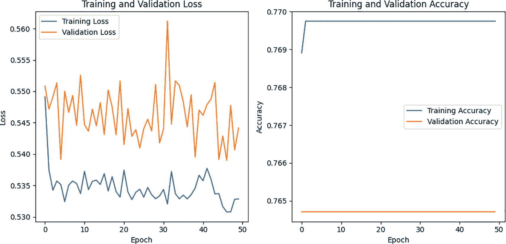

图 3-21

训练和验证损失以及准确率随 epoch 数量的变化

图

图 3-22（左）显示了训练和验证损失随 epoch 数量的变化，图 3-22（左）显示了模型 2 的性能随 epoch 数量的变化。

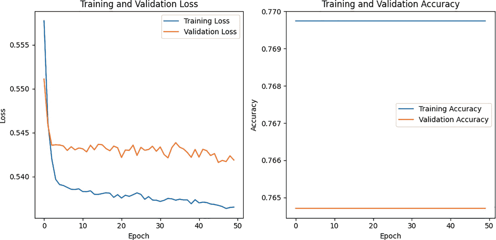

图 3-22

训练和验证损失以及准确率随 epoch 数量的变化

图

包括“SGD”、“Adam”和“RMSprop”在内的学习率和优化器的变化也在图 3-23、3-24 和 3-25 中进行分析。

**随机梯度下降**

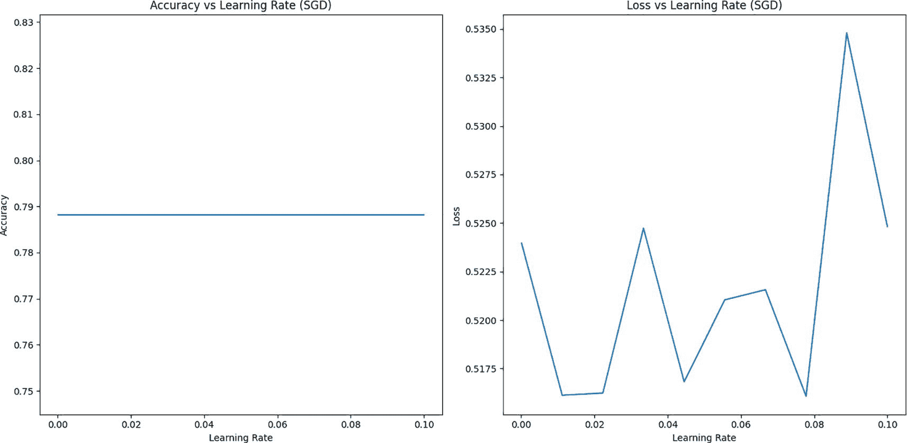

图 3-23

随机梯度下降优化器的损失和准确率随学习率的变化

**RMSprop**

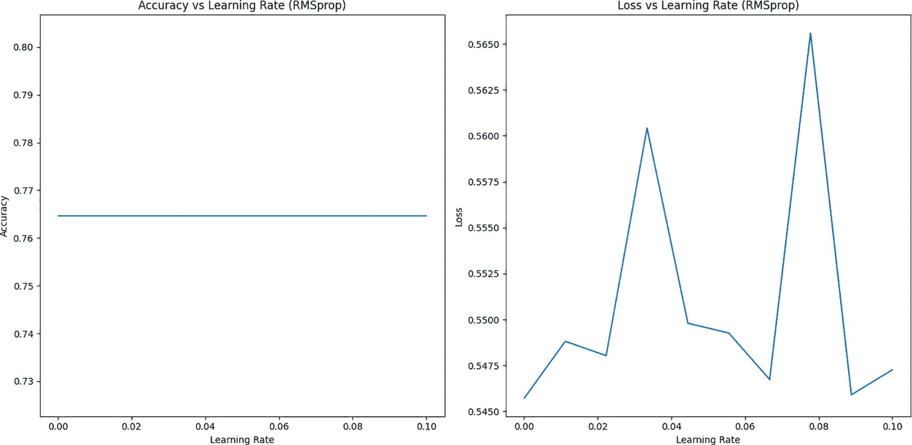

图 3-24

RMSprop 优化器的损失和准确率随学习率的变化

**Adam**

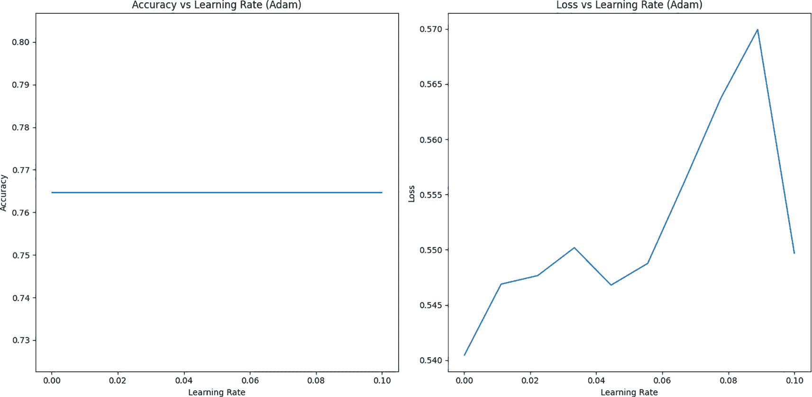

图 3-25

Adam 优化器的损失和准确率随学习率的变化

结果总结在表 3-5 中。

表 3-5

上文两个模型在心肌梗死并发症数据集上的结果

| MLP 编号 | 数据集 | 模型 | 准确率 | 损失 |
| --- | --- | --- | --- | --- |
| 1. | 心肌梗死并发症 | model_2（具有 16 个神经元的单个隐藏层） | 0.7697 | 0.5315 |
| 2. | model_3（具有 25 和 12 个神经元的两个隐藏层） | 0.7697 | 0.5363 |

注意，选择隐藏层的数量以及每层的神经元数量是一个危险的任务。这一讨论将在以下章节继续。

## 结论

本章介绍了神经网络，它们是深度学习模型的基础。本章从对单层感知器及其局限性的有见地讨论开始。然后转向对多层感知器和 XOR 问题的解决方案的讨论。本章还讨论了前馈网络和神经网络的反向传播算法。此外，本章还讨论了学习率与网络深度变化对性能的影响。本章包括了一些重要模型的实现，展示了这些超参数对模型性能的影响。接下来的两章将继续讨论，并介绍两个重要概念，即偏差和方差。读者被要求尝试练习，以掌握本章学到的概念。

## 练习

### 多选题

1.  以下哪个逻辑门不能使用单层感知器实现？

    1.  NAND

    1.  NOR

    1.  XOR

    1.  以上所有

1.  以下哪个可以使用单层感知器进行分类？

    1.  线性可分数据

    1.  非线性可分数据

    1.  两者都是

    1.  以上都不是

1.  单层感知器中非线性激活函数的目的是什么？

    1.  为了将非线性引入输入特征的加权和。

    1.  有时，激活函数将输入值转换为某个范围，例如，0 和 1。

    1.  非线性激活函数使得分类变得复杂且效率低下。

    1.  以上都不是。

1.  理想情况下，超参数调整的主要目的应该是什么？

    1.  为了达到更好的训练精度

    1.  为了达到更好的测试精度

    1.  为了减少训练损失

    1.  为了减少测试损失

1.  Sigmoid 激活函数表示为 。f 的导数以 f 为单位是什么？

    1.  *f* (1 − *f*)

    1.  *f* (1 + *f*)

    1.  *f* (*f*)

    1.  以上都不是

1.  Sigmoid 函数可以表示为 。如果 s 的值非常大，函数的行为就像

    1.  步函数

    1.  Tanh

    1.  ReLU

    1.  以上都不是

1.  在上述问题中，如果 s 的值非常小，函数的行为就像

    1.  步函数

    1.  Tanh

    1.  ReLU

    1.  以上都不是

1.  如果 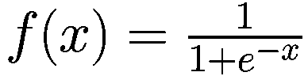，*f* (*x*) 和 *f* (−*x*) 之间的关系是什么？

    1.  *f* (*x*) = 1 − *f* (−*x*)

    1.  *f* (*x*) = 1 + *f* (−*x*)

    1.  *f* (−*x*) = 1 − *f* (*x*)

    1.  *f* (−*x*) = 1 + *f* (*x*)

1.  在多层感知器中，各个隐藏层的输出代表

    1.  层次特征表示

    1.  具有不同的精度输出

    1.  每层的加权输入值

    1.  以上皆非

1.  多层感知器中建模任何输入函数所需的最小隐藏层数是多少？

    1.  0

    1.  1

    1.  2

    1.  以上皆非

1.  如果学习率的值非常小，那么

    1.  找到模型参数的最优值需要更多的时间。

    1.  找到模型参数的最优值需要更少的时间。

    1.  时间不依赖于学习率。

    1.  以上皆非。

1.  如果学习率的值非常大，那么

    1.  我们可以跳过最优解。

    1.  找到模型参数的最优值需要更少的时间。

    1.  时间不依赖于学习率。

    1.  以上皆非。

### 理论

1.  使用单层感知器实现以下内容：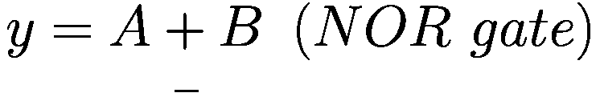，其中 y 是输出，A 和 B 是输入。你预计会找到单层感知器的权重和阈值。

1.  使用多层感知器实现以下内容：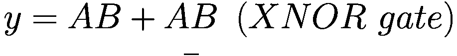，其中 y 是输出，A 和 B 是输入。你预计会找到多层感知器的权重和阈值。

1.  双曲正切激活函数可以表示为 。表达 tanh 相对于自身的导数。

1.  如果 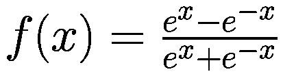，找出 *f*(*x*) 和 *f*(−*x*) 之间的关系。

1.  在多层感知器中证明，随着层数的增加，sigmoid 和 tanh 激活函数的使用将阻碍早期层的权重学习。

1.  解释反向传播算法。如果对于具有两个隐藏层的多层感知器，推导出反向传播的公式，那么

1.  激活函数是 sigmoid。

1.  激活函数是 tanh。

1.  比较各种激活函数的特征，并解释为什么 ReLU 相对于其他函数被认为更好。

1.  证明单层感知器不能对非线性可分数据进行分类。

### 数值

1.  考虑两个网络，一个具有 128 个神经元的输入层和一个 64 个神经元的单隐藏层，另一个具有 128 个神经元的输入层和两个 32 和 16 个神经元的隐藏层。你认为哪个更好，为什么？请从参数数量和学习的角度解释你的答案。

1.  考虑一个具有四个输入层神经元、三个隐藏层神经元和一个输出层神经元的网络。与它们相关的初始输入、权重、偏置以及实际输出如下：

    给定的输入 *x*[1] = 0.5, *x*[2] = 0.1, *x*[3] = 0.4, *x*[4] = 0.7 以及初始随机权重 *w*[11] = 0.2, *w*[12] = -0.1, *w*[13] = 0.4, *w*[21] = 0.5, *w*[22] = 0.3, *w*[23] = 0.1, *w*[31] = -0.4, *w*[32] = 0.2, *w*[33] = 0.5, *w*[41] = 0.3, *w*[42] = -0.2, *w*[43] = 0.2 用于输入层，以及 *w*[11] = 0.3, *w*[21] = 0.2, *w*[31] = 0.6 用于输出层。实际输出值为 0.6。学习率为 0.1。

在第一次和第二次迭代后，隐藏层和输出层的更新权重和偏置将是什么？
