# 4. 深度网络训练

## 简介

现在你已经学习了各种神经网络架构、梯度下降算法和反向传播算法，让我们探索一些更多的优化技术并分析它们对损失曲线平滑性的影响。你还将探索这些技术对模型性能的影响。

在本章中，你将学习如何分割数据集并为每次迭代选择合适的样本数量来训练网络。你还将了解梯度下降中的问题并探索解决这些问题的技术。你将探索优化器，即 RMSprop、动量（Momentum）和 Adam 优化器。此外，你将进行实证分析来研究上述技术对网络性能的影响。

## 训练-测试分割

机器学习分类模型的目标是从训练数据中学习模式，并使用这些模式来分类未见过的数据。用于训练模型的这些数据被称为训练数据。这些数据帮助模型学习参数。形成的模型随后用于分类尚未见过的数据（即未见数据）。这些数据被称为测试数据。数据的训练和测试分割可以有多种方式。首先，我们可以简单地用 70%的数据进行训练，其余的用于测试。这个数字可能会有所不同。

## 训练-验证-测试分割

第二种方法是将数据分为三部分：一个较大的部分和两个较小的部分。较大的部分（训练集）用于训练模型并学习模型的参数，其中较小部分之一用于设置超参数。这被称为验证集。第三部分用于测试模型。例如，如果你有足够的数据，你可以用 70%的数据来训练模型，并使用验证集来找到性能。如果性能不佳，你可以通过改变学习率、层数、每层的单元数等超参数来重新训练模型。当所有超参数都选择以优化验证集的性能时，然后你使用测试集来测试模型。

## K-Fold 分割

在第三种方法中，给定的数据被分为“K”部分。其中一部分（比如说第一部分）被用作测试集，而其他“K `-` 1”部分则合并在一起用作训练集。这个过程通过将所有“K”部分（一次一个）作为测试集重复“K”次。因此，开发了“K”个这样的模型，并报告模型的平均性能。图 4-1 展示了 K-fold 分割。

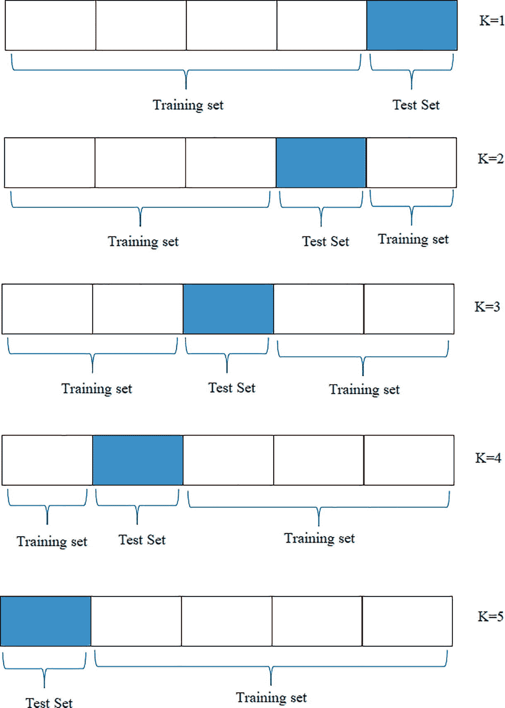

图 4-1

K-fold 分割技术

在看到数据的分割之后，我们现在来看看在更新模型参数之前我们应该取多少样本。

## 批量、随机和小批量梯度下降

如前所述，我们旨在通过训练集的帮助来学习模型的参数。为此，我们可以在单次迭代中一起取所有样本并更新权重，或者一次取一个样本（在更新权重之前）。还有一条中间道路，即一次取几个样本，更新权重，然后继续进行。

### 批量梯度下降

在批量梯度下降（BGD）中，我们同时处理所有示例。然而，如果示例数量巨大，那么训练将**计算成本高昂**，整个数据集可能**无法**适应**主内存**。因此，我们更倾向于随机梯度下降或小批量梯度下降。批量梯度下降的正式算法如下：

+   初始化学习率 *η* 和参数 *W*。

+   重复直到满足终止条件：

+   计算所有训练示例的梯度 (*g*)。

+   更新 *W* ⇢ *W* − *η* × *g*。

+   end while

### 随机梯度下降

在随机梯度下降中，我们一次取一个训练示例并更新权重。这是另一种极端情况，我们可能需要等待很长时间，直到整个训练集被模型看到。然而，**更新**参数是**快速**的。当训练示例数量非常大时，模型可能会有额外的开销。在这种情况下，我们**通常**达到全局最小值，而在批量梯度下降的情况下，我们**可能**错过全局最小值。

### 小批量梯度下降

在小批量梯度下降（mini-batch GD）中，我们形成小批量，并使用每个批量更新模型的参数。它通常更快，并且优雅地处理了批量随机梯度下降的问题。例如，如果我们训练集中有 1,048,576 个样本，我们一次取 1024 个示例，那么将有 1024 个小批量。也就是说，参数将在遍历整个数据集时更新 1024 次。在这种情况下，由于一些批量可能很容易训练而其他可能不容易，损失函数可能不光滑。在这里，小批量中样本数量的选择是一个超参数。它不应该太小或太大。通常，小批量梯度下降在准确性和时间方面都介于批量随机梯度下降之间。

以下实验评估了不同激活函数（Sigmoid、ReLU、tanh 和自定义 tanh）在三种梯度下降方法（批量、小批量、随机）下使用前一章中关于 MNIST 数据集的神经网络进行评估的性能。MNIST 数据集包含 60,000 个训练图像和 10,000 个测试图像的手写数字（0`–`9）。不同的模型使用上述声明的激活函数创建。每个模型都使用 SGD 进行训练。每个模型的训练和验证准确率和损失在十个 epoch 上进行了绘制，如图 4-2 和 4-3 所示。值得注意的是，批量梯度下降由于更新较少，因此训练时间最短，而随机梯度下降由于更新频繁，因此训练时间最长。小批量梯度下降在训练时间和性能之间提供了良好的平衡。

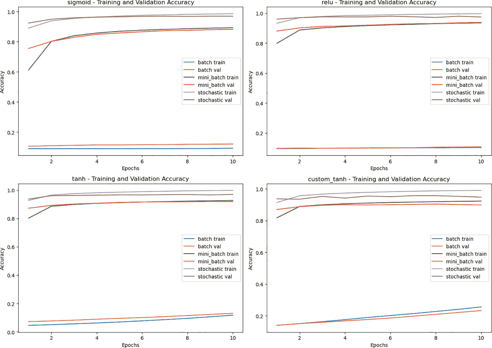

图 4-3

不同激活函数与三种梯度下降方法性能变化

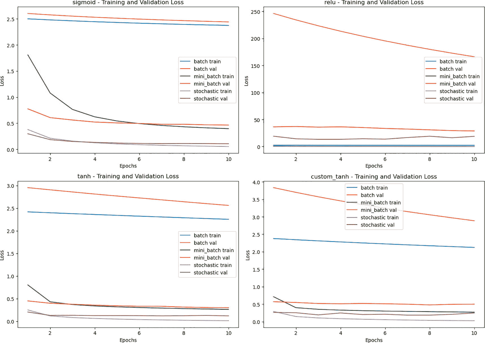

图 4-2

不同激活函数与三种梯度下降方法（批量、小批量、随机）的损失变化

现在我们已经看到了数据被分为训练集和测试集，并研究了在更新模型权重之前应该取多少样本，让我们现在来看看一些重要的优化方法。我们首先从 RMSprop 开始。此外，我们还将研究最重要的优化方法之一：Adam 优化器。

## RMSprop

在梯度下降的情况下，初始权重和偏差在每个迭代中都会更新，目的是最小化损失。然而，损失随迭代的变可能不是平滑的。如果我们只有一个权重和偏差，那么随着每个迭代的进行，偏差会更新，这种变化显示在一个轴上（比如说 Y 轴），而权重的变化则反映在另一个轴上（比如说 X 轴）。整体变化可以在图 4-5 中看到。现在我们旨在减缓 Y 轴上的学习，同时保持 X 轴上的学习尽可能好；我们可以在更新权重和偏差的公式中做些轻微的调整。请注意，以下算法中使用的符号与 DeepLearning.AI 的（优化算法）课程幻灯片相同[1]。

在每次更新后，分别将 *d*[*w*] 和 *d*[*b*] 除以 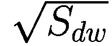 和 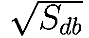 。与 *S*[*dw*] 相比，*S*[*db*] 较大，因此与早期相比，Y 轴上的权重变化较小。*S*[*dw*] 是早期 *S*[*dw*] 和 *dw*² 的加权平均值。同样，*S*[*db*] 也可以被认为是 *S*[*db*] 和 *db*² 的加权平均值。这里有一个参数 *β*，可以被认为是一个超参数。也就是说，首先，我们初始化以下参数：

+   学习率 (∝).

+   衰减率 (*β*).

+   小常数 (*ϵ*).

+   将 *S*[*dw*] 和 *S*[*db*] 初始化为零。

这随后通过以下算法在每次迭代中更新权重。

在每次迭代中

+   计算 *d*[*w*] 和 *d*[*b*].

+   更新平方梯度的运行平均值：

    +   *S*[*dw*] = *β S*[*dw*] + (1 − *β*)*dw*²

    +   *S*[*db*] = *β S*[*db*] + (1 − *β*)*db*²

+   更新参数：

    +   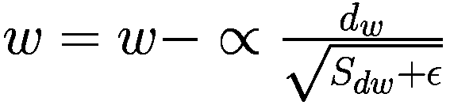

    +   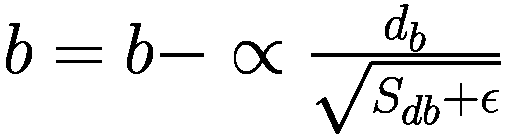

在非凸设置中，与动量相比，RMSprop 表现得更好。该算法由 G. Hinton 在 Coursera 课程中提出。下面的算法包含了动量和 RMSprop 的优点。

## Adam 优化器

Adam 优化器结合了动量和 RMSprop 的概念。它以与上述相同的方式计算*v*[*dw*], *v*[*db*], *S*[*dw*], 和 *S*[*db*]。最初，这四个值可以取为零，并在每次迭代中使用以下方程计算*v*[*dw*] 和 *v*[*db*]：

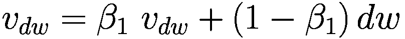

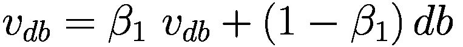

同样，*S*[*dw*] 和 *S*[*db*] 可以按以下方式计算：

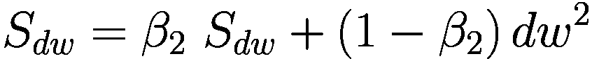

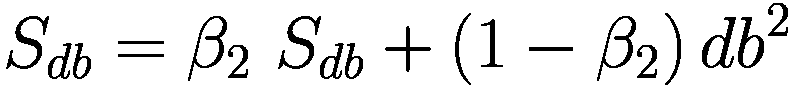

现在我们使用以下方程固定偏差：

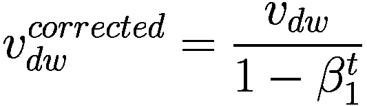

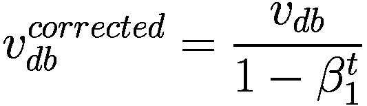

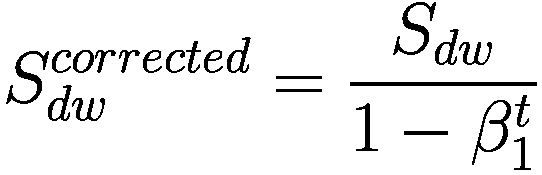

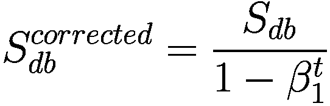

现在将使用上述计算出的值更新权重：

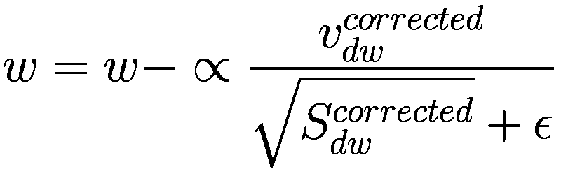

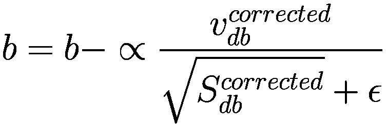

这里，我们有三个超参数 ∝，*β*[1]，和 *β*[2]。学习率可以通过各种方法估计，如网格搜索和启发式算法。*β*[1] 是动量参数，*β*[2] 是 RMSprop 的参数。根据 Krohn [2]，通常，*β*[1] 和 *β*[2] 的值取为 0.9 和 0.99。Adam 优化器的正式算法如下：

**算法：Adam 优化器**

初始化参数：

+   学习率（∝）。

+   衰减率 (*β*[1] 和 *β*[2])。

+   小常数 (*ϵ*)。

+   将 *v*[*dw*] 和 *S*[*dw*] 初始化为零。

+   将 *v*[*db*] 和 *S*[*db*] 初始化为零。

在每次迭代中

+   计算梯度 *d*[*w*] 和 *d*[*b*]。

+   更新偏差校正的第一矩估计：

    +   *v*[*dw*] = *β*[1] *v*[*dw*] + (1 − *β*[1])*dw*

    +   *v*[*db*] = *β*[1] *v*[*db*] + (1 − *β*[1])*db*

+   更新偏差校正的第二矩估计：

    +   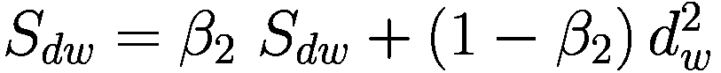

    +   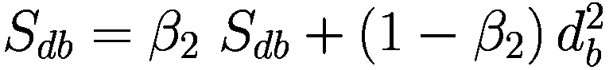

+   计算偏差校正的第一矩估计：

    +   

    +   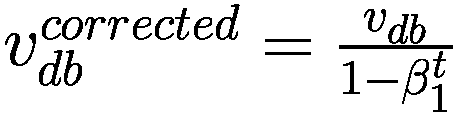

+   计算偏差校正的第二矩估计：

    +   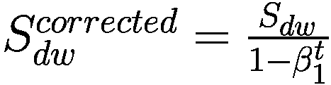

    +   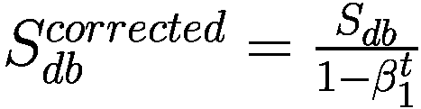

+   更新参数：

    +   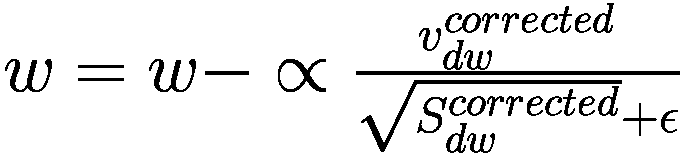

    +   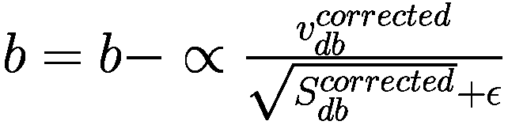

为了理解损失函数在不同优化器（如梯度下降、RMSprop 和 Adam）下的变化，让我们来看一个非常简单的例子。流行的 IRIS 数据集有四个特征和三个类别，其中取了前两个类别。最初，权重被设置为小的随机数，并在每次迭代中使用上述三种不同的技术进行更新。让我们探索每个 epoch 中损失的变异。我们将每个 epoch 中的权重垂直拼接，然后应用 PCA 以获取具有最大方差的第一成分。请参阅列表 4-1。图 4-4、4-5 和 4-6 显示了权重（X 轴）和偏差（Y 轴）随 epoch 数量的变化。

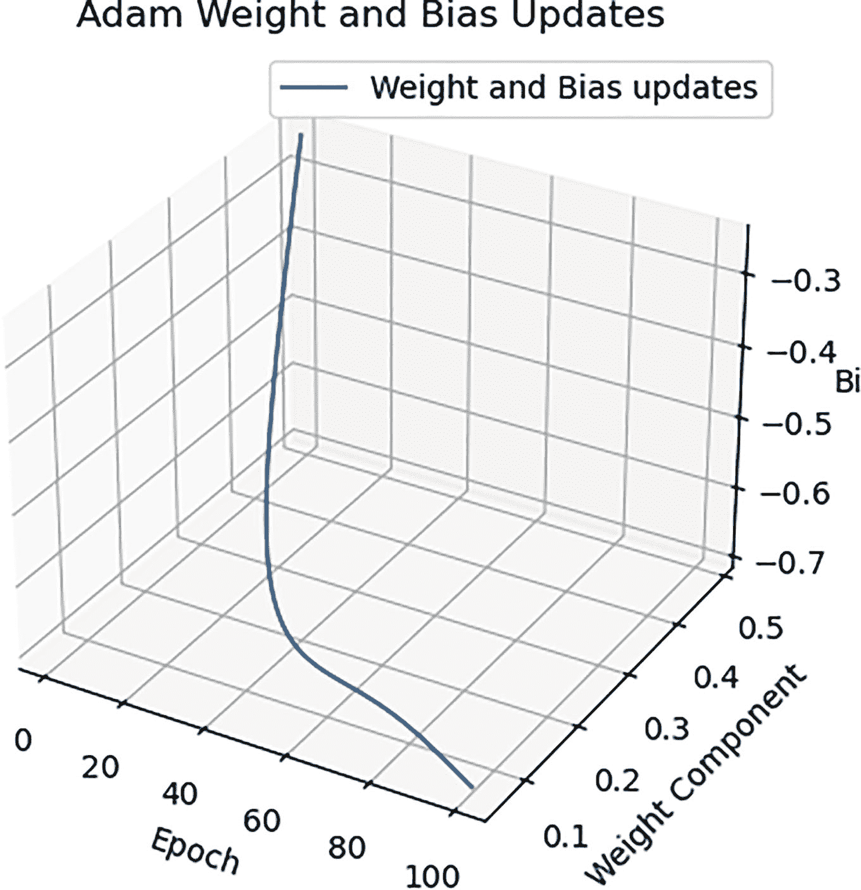

图 4-6

Adam 优化器中偏差和权重随 epoch 数量的变化

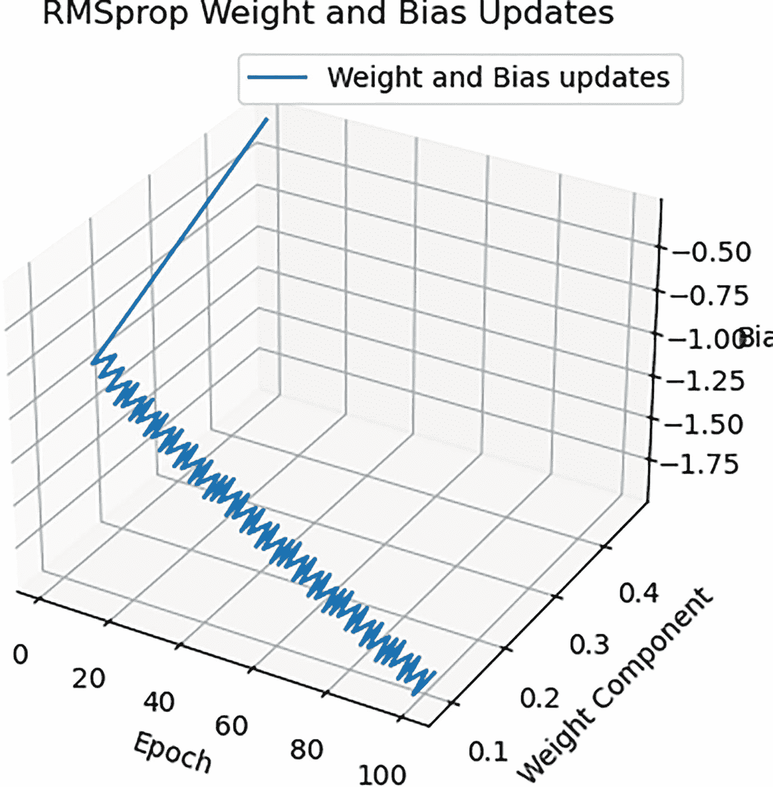

图 4-5

RMSprop 优化器中偏差和权重随 epoch 数量的变化

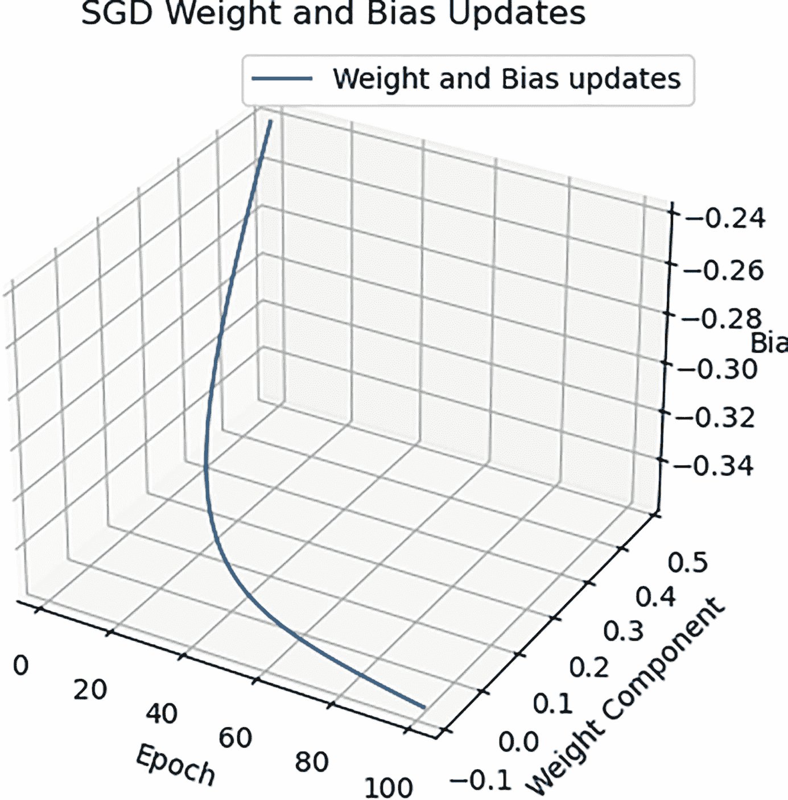

图 4-4

SGD 优化器中偏差和权重随 epoch 数量的变化

```py
Code:
#1\. Import the requisite packages
import numpy as np
import matplotlib.pyplot as plt
from sklearn.datasets import load_iris
from sklearn.model_selection import train_test_split
from mpl_toolkits.mplot3d import Axes3D
#2\. Load the IRIS dataset and take the first 100 samples
iris = load_iris()
X = iris.data[:100]  # Select only the first two classes for binary classification
y = iris.target[:100].reshape(-1, 1)  # Reshape to column vector
#3\. Split dataset
X_train, X_test, y_train, y_test = train_test_split(X, y, test_size=0.3, random_state=42)
#4.Set the hyperparameters for Adam Optimizer
np.random.seed(42)
w = np.random.randn(X_train.shape[1], 1)
b = np.random.randn(1)
α = 0.01
initial_w = w.copy()
initial_b = b.copy()
# Hyperparameters for Adam
β1 = 0.9
β2 = 0.999
ϵ = 1e-8
#5\. Initialize the variables of the Adam optimizer
v_dw = np.zeros_like(w)
S_dw = np.zeros_like(w)
v_db = 0
S_db = 0
#6\. Implement the Sigmoid function
def sigmoid(z):
return 1 / (1 + np.exp(-z))
#7\. Compute gradients
def compute_gradients(X, y, w, b):
m = X.shape[0]
y_pred = sigmoid(np.dot(X, w) + b)
dw = (1/m) * np.dot(X.T, (y_pred - y))
db = (1/m) * np.sum(y_pred - y)
return dw, db
#8\. Update parameters using Adam
def update_adam(w, b, dw, db, t, α, v_dw, S_dw, v_db, S_db, β1=0.9, β2=0.999, ϵ=1e-8):
#9\. Update biased first moment estimates
v_dw = β1 * v_dw + (1 - β1) * dw
v_db = β1 * v_db + (1 - β1) * db
#10\. Update biased second moment estimates
S_dw = β2 * S_dw + (1 - β2) * (dw ** 2)
S_db = β2 * S_db + (1 - β2) * (db ** 2)
#11\. Compute bias-corrected first moment estimates
v_dw_corrected = v_dw / (1 - β1 ** t)
v_db_corrected = v_db / (1 - β1 ** t)
#12\. Compute bias-corrected second moment estimates
S_dw_corrected = S_dw / (1 - β2 ** t)
S_db_corrected = S_db / (1 - β2 ** t)
#13\. Update parameters
w -= α * v_dw_corrected / (np.sqrt(S_dw_corrected) + ϵ)
b -= α * v_db_corrected / (np.sqrt(S_db_corrected) + ϵ)
return w, b, v_dw, S_dw, v_db, S_db
#14.Carry out Training
num_epochs = 100
weight_updates_adam = []
bias_updates_adam = []
w_adam = initial_w.copy()
b_adam = initial_b.copy()
for epoch in range(num_epochs):
t = epoch + 1
dw, db = compute_gradients(X_train, y_train, w_adam, b_adam)
w_adam, b_adam, v_dw, S_dw, v_db, S_db = update_adam(w_adam, b_adam, dw, db, t, α, v_dw, S_dw, v_db, S_db, β1, β2, ϵ)
weight_updates_adam.append(w_adam.copy())
bias_updates_adam.append(b_adam.copy())
#15\. Plot the variation of w and b with the number of epochs
def plot_3d(weight_updates, bias_updates, title):
fig = plt.figure()
ax = fig.add_subplot(111, projection='3d')
epochs = range(1, num_epochs + 1)
weight_updates_flat = np.array(weight_updates).reshape(num_epochs, -1)
bias_updates_flat = np.array(bias_updates).reshape(num_epochs, -1)
ax.plot(epochs, weight_updates_flat[:, 0], bias_updates_flat[:, 0], label='Weight and Bias updates')
ax.set_xlabel('Epoch')
ax.set_ylabel('Weight Component')
ax.set_zlabel('Bias')
ax.set_title(f'{title} Weight and Bias Updates')
ax.legend()
plt.show()
plot_3d(weight_updates_sgd, bias_updates_sgd, 'SGD')
plot_3d(weight_updates_rmsprop, bias_updates_rmsprop, 'RMSprop')
plot_3d(weight_updates_adam, bias_updates_adam, 'Adam')
Output:
Listing 4-1
Variation of weights and bias for different optimization techniques
```

请读者访问第一章。该章节包含了一个使用神经网络对 MNIST 数据集进行分类的实现。参考该实现，以下图表比较了三种流行的优化算法（即 SGD、RMSprop 和 Adam）在 MNIST 数据集上训练的网络的损失和性能。数据集中每个灰度图像的大小为 28 `×` 28 像素。使用了一个简单的网络，输入层有 784 个单位（28 `×` 28 像素），后面跟着一个有 ReLU 激活的 128 个神经元的隐藏层，以及一个有 softmax 激活的 10 个神经元的输出层。使用 SGD、RMSprop 和 Adam 优化器分别对模型进行了 50 个 epoch 的训练。然后，为每个优化器绘制了训练和验证损失及准确率，如图 4-7 所示。

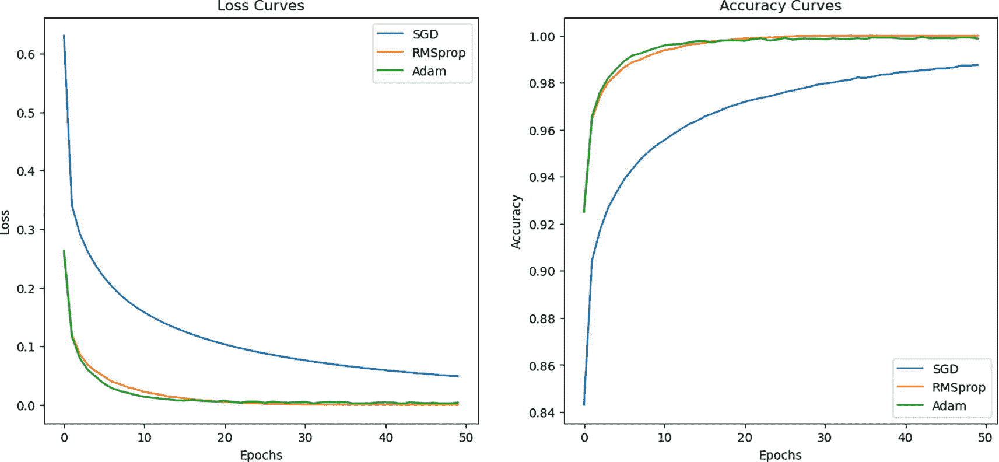

图 4-7

不同优化器中损失和准确率随 epoch 数量的变化

注意，与 SGD 相比，Adam 和 RMSprop 在损失曲线的收敛速度和平滑度上表现更好。此外，Adam 和 RMSprop 的准确率也高于 SGD。

## 结论

在最后几章中，我们讨论了神经网络的基本原理。由于我们需要创建更深的模型，了解以下最佳实践非常重要：(a) 为训练模型和测试划分数据，(b) 在更新模型权重之前考虑应该考虑的训练样本数量，(c) 能够使用比随机梯度下降更好的优化器，以实现更好的性能 [3-5]。本章打开了高效且有效的深度神经网络世界的精彩大门。讨论将在下一章继续，我们将研究偏差和方差的概念，并研究处理它们的方法。

## 练习

### 多选题

1.  以下哪种更新网络权重的技术如果主内存有限可能不起作用？

    1.  批量梯度下降（BGD）。

    1.  小批量梯度下降（mini-batch GD）。

    1.  随机梯度下降（SGD）。

    1.  所以上述所有方法表现相同。

1.  以下哪项可以找到完整训练集参数的成本函数的梯度？

    1.  批量梯度下降（BGD）。

    1.  小批量梯度下降（mini-batch GD）。

    1.  随机梯度下降（SGD）。

    1.  所以上述所有方法表现相同。

1.  以下哪项在凸景观上具有更平滑的收敛？

    1.  批量梯度下降（BGD）。

    1.  小批量梯度下降（mini-batch GD）。

    1.  随机梯度下降（SGD）。

    1.  所以上述所有方法表现相同。

1.  以下哪种在大型数据集的情况下需要大量的主内存，否则可能不起作用？

    1.  批量梯度下降（BGD）。

    1.  小批量梯度下降（mini-batch GD）。

    1.  随机梯度下降（SGD）。

    1.  所以上述所有方法表现相同。

1.  以下哪种方法可以更有效地逃离局部最小值，在许多方面优于 SGD？

    1.  批量梯度下降（BGD）。

    1.  小批量梯度下降（mini-batch GD）。

    1.  随机梯度下降（SGD）。

    1.  所以上述所有方法表现相同。

1.  以下哪项在模型看到完整训练数据之前需要花费大量时间？

    1.  批量梯度下降（BGD）。

    1.  小批量梯度下降（mini-batch GD）。

    1.  随机梯度下降（SGD）。

    1.  所以上述所有方法表现相同。

1.  以下哪一种方法是三种方法中最快的，尤其是在大型数据集上？

    1.  批量梯度下降（BGD）。

    1.  小批量梯度下降（mini-batch GD）。

    1.  随机梯度下降（SGD）。

    1.  所以上述所有方法表现相同。

1.  以下哪种可能导致非常嘈杂的更新，使收敛速度变慢？

    1.  批量梯度下降（BGD）。

    1.  小批量梯度下降（mini-batch GD）。

    1.  随机梯度下降（SGD）。

    1.  所以上述所有方法表现相同。

1.  以下哪项需要仔细选择学习率以避免超过最小值？

    1.  批量梯度下降（BGD）。

    1.  小批量梯度下降（mini-batch GD）。

    1.  随机梯度下降（SGD）。

    1.  所有这些表现方式相同。

1.  在小批量梯度下降中，以下哪种应该是理想的批量大小？

    1.  不要太大，并且是 2 的幂

    1.  不要太大，并且是 10 的幂

    1.  较大，并且是 2 的幂

    1.  较大，并且是 10 的幂

1.  以下哪种方法将数据分为训练集和测试集可能更适合处理性能报告中的方差效应？

    1.  将数据分为两部分：70%用于训练，30%用于测试。

    1.  将数据分为两部分：50%用于训练，50%用于测试。

    1.  K 折分割。

    1.  以上皆非。

### 理论

1.  解释梯度下降中的问题，并讨论我们如何解决这些问题。

1.  编写使用 RMSprop 更新权重的算法，并说明我们如何处理动量问题。

1.  编写使用 Adam 优化器更新权重的算法，并解释它如何处理动量和 RMSprop 的问题。

### 实验

以 MNIST 数据集([`https://keras.io/api/datasets/mnist/`](https://keras.io/api/datasets/mnist/))为例，开发一个具有两个隐藏层和输出层十个神经元的深度神经网络。你可以通过进行各种实验来选择隐藏层中的神经元数量。报告以下情况下的模型性能：

1.  将优化器视为

    1.  RMSprop

    1.  Adam

1.  使用上述方法重复上述实验

    1.  随机梯度下降

    1.  批量梯度下降

    1.  小批量梯度下降

1.  在所有上述实验中改变学习率，并找到最佳学习率。

在上述每种情况下绘制损失曲线并分析结果。
