# 5. 超参数调整

## 引言

在前面的章节中，我们讨论了神经网络的结构、梯度下降算法、反向传播以及各种优化算法，以及如何划分数据用于训练和测试。我们还探讨了激活函数对模型性能的影响。

在训练过程中测量的模型性能并不能告诉我们它在测试过程中将如何表现。为此，我们通常找到训练模型在验证集上的性能。如果验证集上的性能没有达到标准或低于训练，我们就改变超参数的值来处理这种情况。这被称为超参数调整。

实际上，我们试图通过设置超参数来减少模型的方差。在本章中，我们首先回顾偏差和方差的概念，然后转向深度学习各种架构的超参数。我们将在下一节中看到这些超参数对深度神经网络（DNN）的影响。在下一章中，将讨论卷积神经网络（CNN）和序列模型中超参数值的变化对性能的影响。本章的组织结构如下。本章的“偏差-方差重访”部分回顾了偏差和方差。下一部分“超参数调整”讨论了 DNN、CNN、序列模型和自编码器的超参数。下一节“实验：超参数调整”展示了某些实验，以经验性地确立上述观点，最后一节得出结论。

## 偏差-方差重访

假设有十个点位于图 5-1 所示的正弦曲线上。然而，我们无法知道其下方的曲线；我们只能看到这些点。我们开始将这些以下度数的曲线拟合到这些点上：

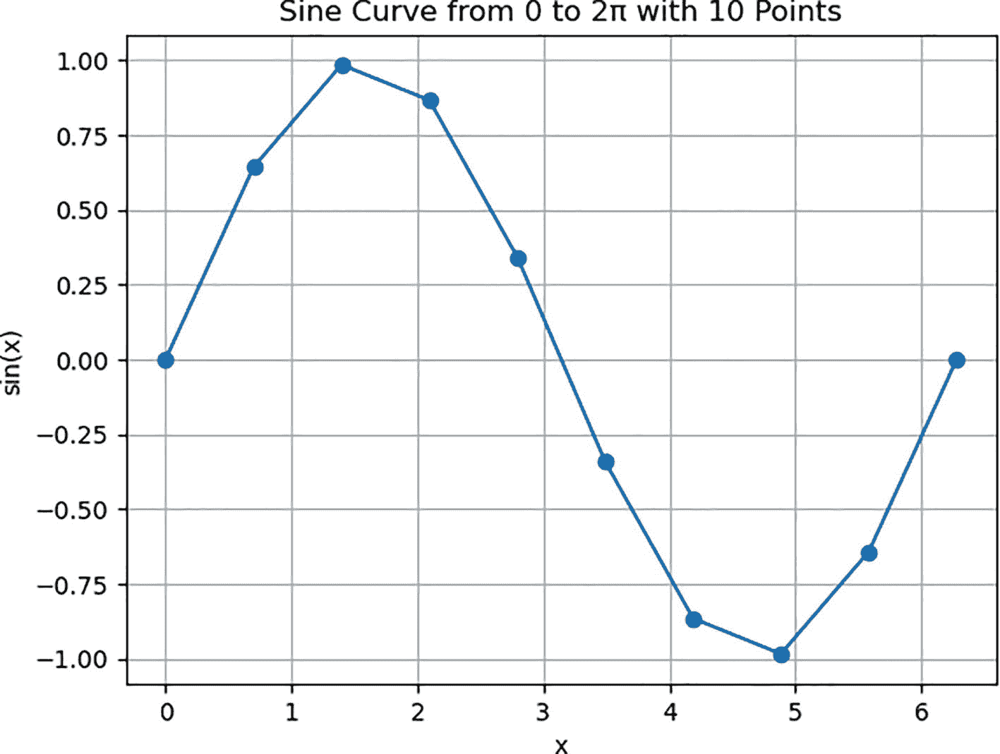

图 5-1

正弦曲线

+   第 0 度

+   第 1 度

+   …

+   第 3 度

因此，拟合一个 1 次度（直线）的曲线与开发一个线性回归模型是相同的，该模型将找到所有点之间距离平方和最小的直线（图 5-2）。同样，非线性回归可以在训练数据上创建更好的拟合。对于上述点，3 次曲线可能得到更好的拟合（图 5-3），而 10 次曲线可能得到最佳拟合（图 5-4）。

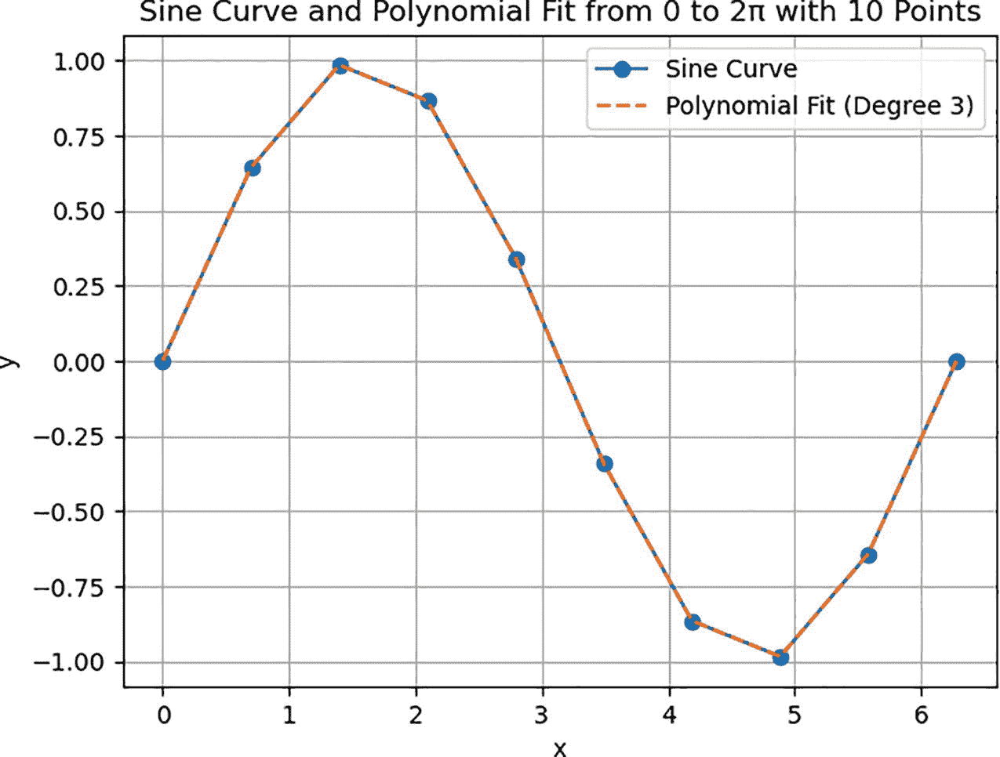

图 5-4

将 10 次曲线拟合到给定的点

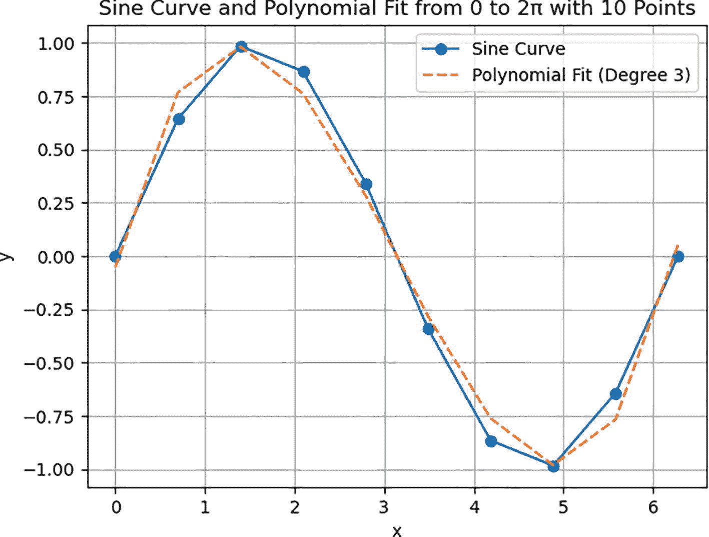

图 5-3

将 3 次曲线拟合到给定的点

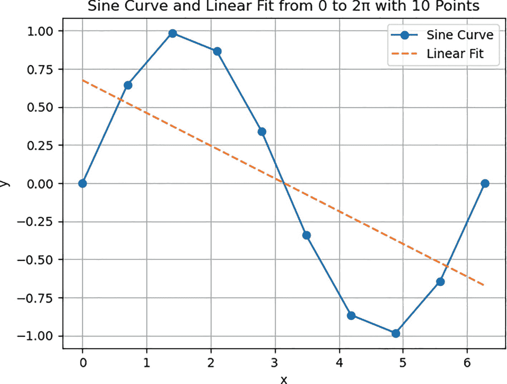

图 5-2

将直线拟合到给定的点

尽管我们能够使用更高次方的曲线拟合所有给定的点，但问题从这里开始。这是因为拟合给定数据（训练集）不是目标。目标是设计一个能够提取给定分布的潜在结构以处理未见数据点的模型。因此，在曲线为一次方的情况下，测试和训练误差都会很高。模型将无法拟合训练数据或测试数据。在二次方的情况下，模型可能不会对未见数据产生很大的误差。然而，在十次方的非线性回归中，训练误差可以非常低，但测试误差可以非常大。因此，最佳拟合线成为欠拟合的情况，而十次方的曲线将成为过拟合的情况。

小贴士

***过拟合：*** *如果训练误差非常低，而测试误差非常大，那么模型就被说成是过拟合。*

***欠拟合：*** *如果训练误差很高，测试误差也很高，就像线性回归的情况一样，这被称为欠拟合。*

在第一种情况（一次方）中，我们假设一条直线能够拟合训练数据并预测测试数据。我们不知道潜在的曲线，因此我们假设这些点位于一条线（最佳拟合线）上，我们就能找到对于未知的 x 值的 y 值。在我们的例子中，我们的假设是错误的，因为直线不能拟合所有位于正弦曲线上的点。这被称为偏差。

偏差

一个好的机器学习模型的平均预测应该尽可能接近真实值。这种差异被称为偏差。

偏差可以理解为潜在模型预测值的能力。偏差的正式定义如下：

![$$ Bias=E\left[{f}^{\prime }(x)-f(x)\right], $$](img/611710_1_En_5_Chapter/611710_1_En_5_Chapter_TeX_Equa.png)

其中 *f*^′(*x*) 是模型的平均预测值，*f*(*x*) 是潜在函数。高偏差表示模型无法拟合训练数据。可能的原因之一是模型过于简化。高偏差导致训练集和测试集的错误率都较高。

方差

模型的**方差**表示其调整给定数据集的能力。这种可变性被称为方差。

方差的正式定义如下：

![$$ Variance=E{\left[{f}^{\prime }(x)-f(x)\right]}²\. $$](img/611710_1_En_5_Chapter/611710_1_En_5_Chapter_TeX_Equb.png)

## 超参数调整

超参数调整将部分帮助我们处理上一节中讨论的问题。本节将介绍四种类型网络中最重要的一些超参数，即深度神经网络（DNN）、卷积神经网络（CNN）、序列模型和自编码器。我们首先讨论深度神经网络（DNN）的超参数，如表 5-1 所示。

表 5-1

深度神经网络（DNN）的超参数

| 网络 | 图像 | 超参数 | 描述 |
| --- | --- | --- | --- |
| 深度神经网络 | 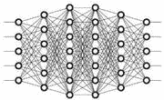 | 隐藏层数量 | • 深度神经网络必须至少有一个隐藏层，除了输入层和输出层。• 如果层数太多，学习会变慢（梯度消失）。• 有时，深度是提取特征层次所必需的。 |
| 每个隐藏层中的神经元数量 | 如果网络中的隐藏层数较少且该层的神经元数量较多，那么我们通常更倾向于通过少量增加层数来减少每层的神经元数量。 |
| 学习率 | • 学习率控制梯度下降更新的步长。• 较低的学习率会导致需要更多时间才能达到最优值。• 较高的学习率可能会导致在损失景观中跳过最优值。 |
| 批大小 | 批大小表示在更新模型参数之前处理的样本数量。 |
| 训练轮数 | 轮次表示整个数据集通过网络的次数 |
| 优化器 | 选择用于更新权重的算法会影响模型的性能。以下是一些著名的优化器：• SGD• 动量• RMSprop• Adam |
| 损失函数 | 用于评估模型性能的指标。 |
| 激活函数 | “神经网络中的激活，或激活函数，定义为通过每个‘节点’的非线性变换函数将输入映射到输出的映射，节点只是网络中的计算点” [1]。 |
| 正则化 | “正则化以略微降低训练精度为代价，以增加泛化能力” [2]。 |
|   |   | Dropout 率 | Dropout 率表示在训练期间丢弃的单元比例。 |

在第 6 和 7 章中介绍了卷积神经网络（CNN），它优雅地处理与成像数据相关的任务。该网络的超参数在表 5-2 中展示。

表 5-2

CNN 的超参数

| 网络 | 图像 | 超参数 | 描述 |
| --- | --- | --- | --- |
| 卷积神经网络 |  | 滤波器数量 | 滤波器数量表示每层的卷积滤波器数量。 |
| 滤波器大小 | 滤波器大小对应于卷积滤波器的维度，例如 3 × 3、5 × 5 等。 |
| 步长 | 步长表示卷积过程中滤波器的步长。 |
| 填充 | 填充表示输入是否填充以及如何填充，例如，有效或相同。 |
| 池化大小 | 池化大小是池化操作的维度，例如，2 × 2 等。 |
| 池化类型 | 池化操作的类型，例如，最大池化、平均池化等。 |
| Dropout 率 | Dropout 率表示在训练期间丢弃的单元比例。 |

本书第九章和第十章介绍了序列模型。这些网络的超参数在表 5-3 中展示。

表 5-3

序列模型超参数

| 网络 | 图像 | 超参数 | 描述 |
| --- | --- | --- | --- |
| 循环神经网络（RNN）及其变体（LSTM、GRU） | 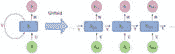 | 隐藏单元 | RNN 单元中的单元数量。 |
| 序列长度 | 序列长度表示输入序列的长度。 |
| Dropout 率 | Dropout 率表示在训练期间丢弃的单元比例。 |
| 层数数量 | 堆叠 RNN 层数的数量。 |
| 学习率 | 学习率控制梯度下降更新的步长。 |
| 批大小 | 批大小表示在更新模型参数之前处理的样本数量。 |

本书第十一章讨论了自编码器。这些网络的超参数在表 5-4 中展示。

表 5-4

自编码器的超参数

| 网络 | 图像 | 超参数 | 描述 |
| --- | --- | --- | --- |
| 自编码器 | 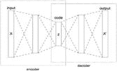 | 编码器/解码器层 | 编码器和解码器中的层数。 |
| 潜在维度 | 潜在维度表示编码表示的大小。 |
| 学习率 | 学习率控制梯度下降更新的步长。 |
| 批大小 | 批大小表示在更新模型参数之前处理的样本数量。 |
|   |   | Dropout 率 | Dropout 率表示在训练期间丢弃的单元比例。 |

## 实验：超参数调整

本节通过实证分析展示了超参数对模型性能的影响。

**问题：** 对 MNIST 数据集进行分类

**数据：** MNIST 数据集包含 60,000 张训练图像和 10,000 张测试图像，为手写数字（0`–`9）。

**架构：** 实现了六种不同的架构（全连接神经网络），具有不同数量的隐藏层和每层的神经元数量。实验还展示了学习率变化对性能和损失的影响。

列表 5-1 中实现的模型如下：

1.  (512,)

1.  (256,)

1.  (128,)

1.  (128, 64)

1.  (128, 32)

1.  (128, 16)

每个模型的损失和准确度单独图示从图 5-5 到图 5-10。图 5-11 中绘制了不同学习率下损失和准确度随训练轮数的变化。

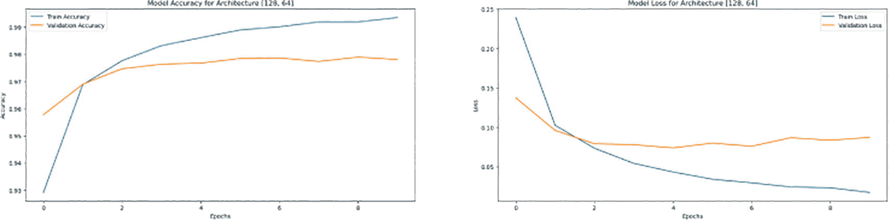

图 5-8

具有两个隐藏层和 128 个、64 个神经元的架构的准确率和损失曲线

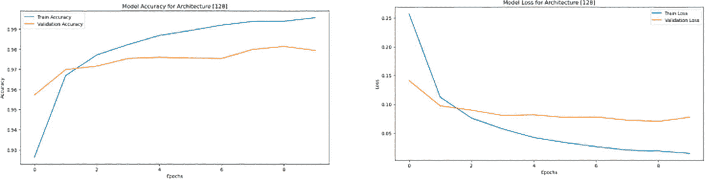

图 5-7

具有单个隐藏层和 128 个神经元的架构的准确率和损失曲线

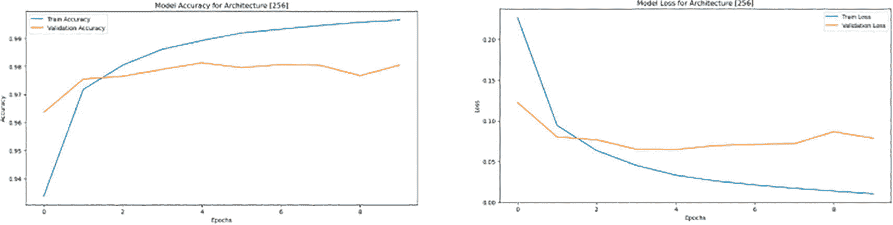

图 5-6

具有单个隐藏层和 256 个神经元的架构的准确率和损失曲线

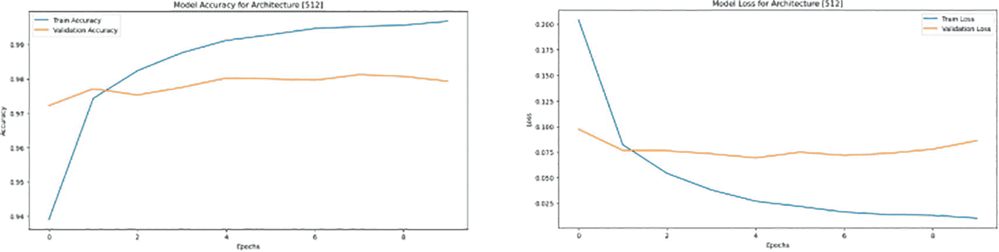

图 5-5

具有单个隐藏层和 512 个神经元的架构的准确率和损失曲线

```py
Code:
#1\. The libraries tensorflow and specifically the keras.models and keras.layers are imported to design a sequential model having dense and flattened layers. We need to import the Adam optimizer from tensorflow.keras.optimizers
import tensorflow as tf
from tensorflow.keras.models import Sequential
from tensorflow.keras.layers import Dense, Flatten
from tensorflow.keras.optimizers import Adam
import matplotlib.pyplot as plt
import numpy as np
#2\. We load the MNIST data set from tensorflow.keras.datasets, mnist and to get the train and test data we use load_data() function. Since the images are grayscale therefore the maximum value of a pixel is 255\. If we divide every pixel by 255, we end up implementing Min-Max normalisation
mnist = tf.keras.datasets.mnist
(X_train, y_train), (X_test, y_test) = mnist.load_data()
X_train, X_test = X_train / 255.0, X_test / 255.0
#3\. To compile the model, we use the compile function and set the parameters namely optimizer, loss, and metrics. Since it is a multiclass problem sparse categorical cross entropy is used as a loss function.
def compile_and_train(model, lr=1e-3, epochs=10):
model.compile(optimizer=Adam(learning_rate=lr),loss='sparse_categorical_crossentropy',metrics=['accuracy'])
history = model.fit(X_train, y_train, epochs=epochs, validation_data=(X_test, y_test), verbose=0)
return history
#4\. Note that after compiling the model the output was saved in a variable called history. This is a dictionary from which training and validation accuracy are plotted.
def plot_history(history, title):
plt.figure(figsize=(12, 6))
plt.plot(history.history['accuracy'], label='Train Accuracy')
plt.plot(history.history['val_accuracy'], label='Validation Accuracy')
plt.title(f'{title} Accuracy')
plt.xlabel('Epochs')
plt.ylabel('Accuracy')
plt.legend()
plt.show()
#5\. The training and validation loss from history is plotted in the same way.
plt.figure(figsize=(12, 6))
plt.plot(history.history['loss'], label='Train Loss')
plt.plot(history.history['val_loss'], label='Validation Loss')
plt.title(f'{title} Loss')
plt.xlabel('Epochs')
plt.ylabel('Loss')
plt.legend()
plt.show()
#6\. The first model having a single hidden layer with 512 neurons is compiled and history is plotted.
model_1 = Sequential([
Flatten(input_shape=(28, 28)),
Dense(512, activation='relu'),
Dense(10, activation='softmax')
])
history_1 = compile_and_train(model_1)
plot_history(history_1, 'Model [512]')
#7\. The second model having a single hidden layer with 256 neurons is compiled and history is plotted.
model_2 = Sequential([
Flatten(input_shape=(28, 28)),
Dense(256, activation='relu'),
Dense(10, activation='softmax')
])
history_2 = compile_and_train(model_2)
plot_history(history_2, 'Model [256]')
#8\. The third model having a single hidden layer with 128 neurons is compiled and history is plotted.
model_3 = Sequential([
Flatten(input_shape=(28, 28)),
Dense(128, activation='relu'),
Dense(10, activation='softmax')
])
history_3 = compile_and_train(model_3)
plot_history(history_3, 'Model [128]')
#9\. The fourth model having two hidden layers with 128 and 64 neurons is compiled and history is plotted.
model_4 = Sequential([
Flatten(input_shape=(28, 28)),
Dense(128, activation='relu'),
Dense(64, activation='relu'),
Dense(10, activation='softmax')
])
history_4 = compile_and_train(model_4)
plot_history(history_4, 'Model [128, 64]')
#10\. The fifth model having two hidden layers with 128 and 32 neurons is compiled and history is plotted.
model_5 = Sequential([
Flatten(input_shape=(28, 28)),
Dense(128, activation='relu'),
Dense(32, activation='relu'),
Dense(10, activation='softmax')
])
history_5 = compile_and_train(model_5)
plot_history(history_5, 'Model [128, 32]')
#11\. The sixth model having two hidden layers with 128 and 16 neurons is compiled and history is plotted.
model_6 = Sequential([
Flatten(input_shape=(28, 28)),
Dense(128, activation='relu'),
Dense(16, activation='relu'),
Dense(10, activation='softmax')
])
history_6 = compile_and_train(model_6)
plot_history(history_6, 'Model [128, 16]')
#12.From history variable, we calculate the mean accuracy for all the models
mean_accuracies = {
'[512]': np.mean(history_1.history['val_accuracy']),
'[256]': np.mean(history_2.history['val_accuracy']),
'[128]': np.mean(history_3.history['val_accuracy']),
'[128, 64]': np.mean(history_4.history['val_accuracy']),
'[128, 32]': np.mean(history_5.history['val_accuracy']),
'[128, 16]': np.mean(history_6.history['val_accuracy'])
}
#13\. Based on the above results the best architecture and model are printed
architecture = max(mean_accuracies, key=mean_accuracies.get)
print(f"Best architecture: {best_architecture} with mean accuracy: {mean_accuracies[best_architecture]:.4f}")
#14\. We carry out an empirical analysis of the best model with different learning rates and plot the accuracy and loss curves.
learning_rates = [1e-4, 1e-3, 1e-2]
lr_histories = {}
for lr in learning_rates:
model = create_model(eval(best_architecture))
history = compile_and_train(model, lr=lr)
lr_histories[f'LR={lr}'] = history
# Plot accuracy and loss for different learning rates
plot_history(lr_histories, 'accuracy')
plot_history(lr_histories, 'loss')
Output:
Best architecture: [512] with mean accuracy: 0.9782
Listing 5-1
Hyperparameter tuning to classify the MNIST dataset
```

下表（表 5-5）显示了用于分类 MNIST 数据集的六个不同架构的平均验证准确率。

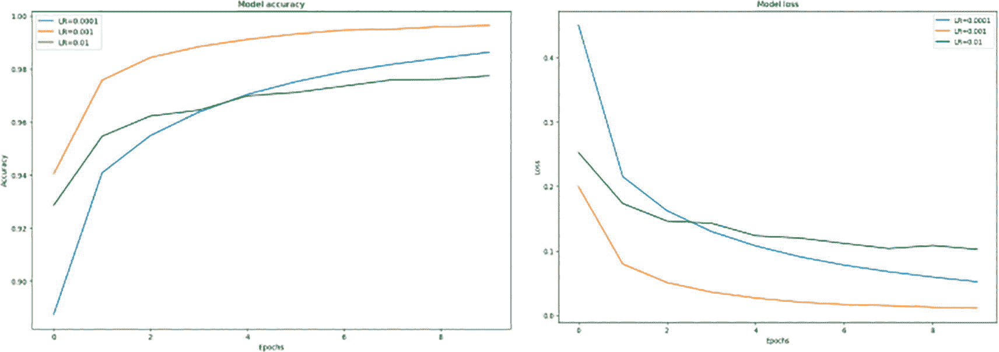

图 5-11

最佳架构（单个隐藏层和 512 个神经元）在不同学习率下的准确率和损失曲线

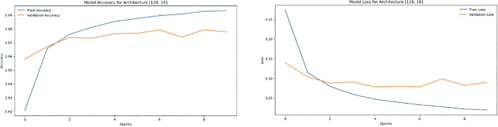

图 5-10

具有两个隐藏层和 128 个、16 个神经元的架构的准确率和损失曲线

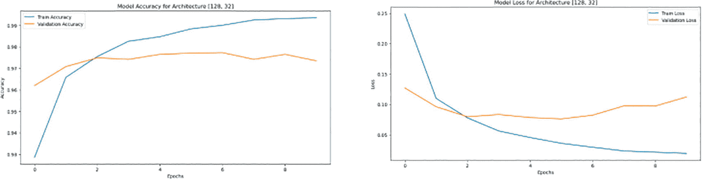

图 5-9

具有两个隐藏层和 128 个、32 个神经元的架构的准确率和损失曲线

表 5-5

六个不同架构的平均验证准确率

| 架构 | 平均验证准确率 |
| --- | --- |
| (512,) | 0.9782 |
| (256,) | 0.9769 |
| (128,) | 0.9732 |
| (128, 64) | 0.9738 |
| (128, 32) | 0.9737 |
| (128, 16) | 0.9725 |

尽管准确率的变化很小，但模型的性能确实取决于隐藏层的数量以及每个隐藏层中的神经元数量。

## 结论

深度学习架构在训练数据和测试数据上预期表现良好。如果模型在训练数据上表现不佳，我们可能需要重新审视我们对数据和所设计模型假设的看法。如果模型在训练数据上表现良好，但在未见过的数据上表现不佳，那么超参数调整可能有助于我们。本章讨论了一些重要的超参数及其重要性。

此讨论将在以下章节中继续，因为 CNN、序列模型和自动编码器也需要超参数调整。读者预计在继续前进之前尝试练习以掌握该概念。

## 练习

### 多项选择题

1.  深度神经网络必须至少有一个

    1.  输出层

    1.  输入层

    1.  隐藏层

    1.  Dropout 层

1.  如果神经网络的层数太多，可能会出现什么问题？

    1.  加速学习

    1.  过拟合

    1.  梯度消失

    1.  梯度爆炸

1.  为什么神经网络需要一定的深度？

    1.  为了增加训练时间

    1.  为了降低复杂性

    1.  为了提取特征层次结构

    1.  为了减少训练时间

1.  如果隐藏层的数量较少且每层的神经元数量较高，通常更倾向于什么？

    1.  增加层数并减少每层的神经元数量。

    1.  减少层数并增加每层的神经元数量。

    1.  保持层数和神经元数量不变。

    1.  同时增加层数和神经元数量。

1.  学习率在梯度下降中控制什么？

    1.  批处理大小

    1.  梯度下降更新的步长

    1.  迭代次数

    1.  隐藏层的数量

1.  较低的学习率会导致以下哪个结果？

    1.  更快的学习

    1.  更多的时间达到最优值

    1.  跳过最优值

    1.  过拟合

1.  更高的学习率可能导致以下哪个结果？

    1.  更多的时间达到最优值

    1.  跳过损失景观中的最优值

    1.  减少训练时间

    1.  更好的泛化

1.  批处理大小表示

    1.  迭代次数

    1.  层数数量

    1.  在更新模型参数之前处理的样本数量

    1.  学习率

1.  一个迭代意味着

    1.  网络中的层数

    1.  在更新模型参数之前处理的样本数量

    1.  整个数据集通过网络的次数

    1.  学习率

1.  选择用于更新权重的算法会影响模型的性能。以下哪些是著名的优化器？

    1.  SGD, RMSprop, Dropout

    1.  动量，RMSprop，Dropout

    1.  SGD, 动量，RMSprop, Adam

    1.  Adam, Dropout, SGD, RMSprop

1.  根据定义，神经网络中的激活函数是

    1.  通过每个节点的线性变换函数将输入映射到输出

    1.  通过每个节点的非线性变换函数将输入映射到输出

    1.  通过每个节点的非线性变换函数将输出映射到输入

    1.  通过每个节点的线性变换函数将输出映射到输入

1.  正则化以训练精度的微小降低换取以下哪个？

    1.  增加训练速度

    1.  过拟合增加

    1.  通用性增加

    1.  增加批处理大小

1.  Dropout 率表示以下哪个？

    1.  训练期间丢弃单元的比率

    1.  训练期间添加单元的比率

    1.  网络的学习率

    1.  迭代次数

1.  以下哪个增加了模型的通用性？

    1.  Dropout

    1.  较低的学习率

    1.  高学习率

    1.  以上都不是

1.  以下哪个可以考虑用于减少模型的方差？

    1.  Dropout

    1.  大的训练集

    1.  正则化

    1.  所有上述选项

### 实验

1.  CIFAR 数据集([`https://www.cs.toronto.edu/~kriz/cifar.html`](https://www.cs.toronto.edu/~kriz/cifar.html) )包含 60,000 张属于 10 个类别的图片。每个类别有 6000 张图片。数据集分为两部分，训练集和测试集，分别有 50,000 张和 10,000 张图片。

    下载数据集并设计一个具有两个隐藏层的全连接网络来分类这个数据集。你可以通过经验分析来确定每个隐藏层的神经元数量。训练你的网络并报告结果。

    执行以下任务，并尽可能详细地报告结果。

    1.  使用以下优化器重新训练网络，并分析性能以及损失曲线的影响：

        1.  Adam 优化器

        1.  RMSprop

        1.  动量

    1.  使用 dropout 层来减少模型的方差。

    1.  找出学习率变化对模型性能的影响。

    1.  使用正则化来查看模型在测试数据上是否给出更好的结果。

    1.  每层改变激活函数是否会影响损失曲线的平滑度？

1.  现在探索 STL 数据集([`https://cs.stanford.edu/~acoates/stl10/#:~:text=The%20STL%2D10%20dataset%20is,dataset%20but%20with%20some%20modifications`](https://cs.stanford.edu/~acoates/stl10/#:~:text=The%20STL%252D10%20dataset%20is,dataset%20but%20with%20some%20modifications))，并再次执行上述问题中所述的任务。
