# 6. 卷积神经网络：I

Hubel 和 Wiesel 提出，猴子和大猫的模式识别任务使用两种类型的细胞，其中一种具有更大的感受野。这个区域输出的结果不依赖于区域中边缘的位置。这启发了 Kunihiko Fukushima 引入新认知，进而启发了神经网络中的卷积和下采样层，称为卷积神经网络（CNNs）。法国计算机科学家 Yann LeCun，也是著名的图灵奖获得者，在 CNNs 中使用了反向传播。LeNet，第一个 CNN，能够识别手写数字。最初被忽视的 CNNs 在 2012 年得到了应有的份额，随着 AlexNet 的出现。CNNs 已成功应用于图像分类、物体检测、疾病预测，甚至在数字艺术中。与现有的神经网络相比，它们表现出更好的性能，并被广泛用于众多学科。

让我们从比较多层感知器（MLP）和卷积神经网络（CNN）开始我们的讨论。前者已在之前的章节中讨论过。MLP 有一个输入层，一个输出层，以及至少一个隐藏层。隐藏层中的神经元接收输入，将它们与权重相乘，并将偏差加到乘积上。然后将结果输入到激活函数中。这个神经元的输出可能作为另一个神经元的输入。正向传播之后是反向传播。卷积神经网络遵循相同的原理，但专门设计用于图像。它们使用修改后的卷积算子来提取特征图。这些模型有许多类型的层，如卷积层，有助于找到特征图；池化层，有助于下采样；激活层；以及全连接层。本章讨论 CNN 中的各种类型层及其需求。需要注意的是，只有其中一些层有超参数，并学习权重。图 6-1 总结了讨论内容。

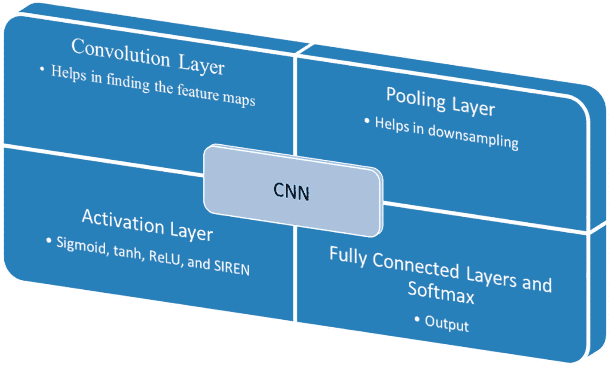

图 6-1

CNN 的组成部分

读者可能注意到 MLP 和 CNN 之间存在显著差异。在 MLP 中，一层的神经元**不共享连接**，而在 CNN 的情况下，它们是共享的。这一点很重要。例如，考虑一个全连接神经网络，它以 300×300×1 维度的灰度图像为输入，输出层有 50 个神经元，隐藏层有 100 个神经元；那么可学习的权重将是 100×300×300 + 50×100 = 9000000 + 5000 = 9005000。此外，还将有 150 个偏置，因此总共有 90050150 个可学习参数。CNN 使用过滤器，将在以下章节中解释。如果使用 10×10 的过滤器来提取相关特征，那么将有 101（一个偏置）个可学习参数。即使有十个这样的过滤器，可学习参数的数量也将是 1010。同样，输出层和隐藏层之间也将有一些可学习参数。与全连接 MLP 相比，**可学习参数的总数仍然要少得多**。这一章探讨了过滤器及其需要许多过滤器的想法。

因此，在完全连接的 MLP 中，每个神经元都与前一层的所有神经元相连，而在 CNN 的情况下，一些神经元只与前一层的部分相连。这导致了共享权重的概念。CNN 的前几层预计会发现**低级特征**，如边缘，而较晚的层预计会发现**高级特征**。此外，过滤器与前一层的较小部分的这种连接产生了一种正则化。此外，CNNs 具有平移和旋转不变性。这在识别任务中是有意义的，因为我们希望在图像中的任何位置都能找到对象。同样，即使对象被旋转，模型也应该能够找到对象。

小贴士

CNN 与 MLP 的比较

+   CNNs 考虑了空间相关性；MLPs 不考虑。

+   CNNs 具有更少的可学习参数。

+   CNNs 具有平移和旋转不变性。

本章介绍了 CNN 的组成部分。从头开始实现这些单元不仅有助于读者理解组件的工作原理，而且使他们能够根据需要随时更改组件。本章的组织如下。第“卷积层”节讨论了卷积算子。下一节“实现卷积”介绍了卷积算子的实现并讨论了其重要性。下一节“填充”讨论了填充。下一节“步长和其他层”解释了步长并讨论了其他层，下一节“核的重要性”解释了卷积的重要性。接下来是对第一个 CNN LeNet 的简要介绍。最后一节是结论。

## 卷积层

在这一层中，过滤器**从输入张量中提取特征**并**创建一个特征图**。为了理解这一点，考虑一个灰度图像，它可以表示为一个矩阵，其值介于 0 到 255 之间。一个二维核是一个过滤器，它期望找到给定图像的显著特征。给定图像和核的卷积给出输出。例如，如果输入是一个 8×8 维度的矩阵，而核的维度是 3×3，我们最初将核放置在矩阵的左上角，并找到对应元素的乘积之和。例如，考虑图 6-2 中显示的输入图像和核。初始卷积操作的结果将是 120。

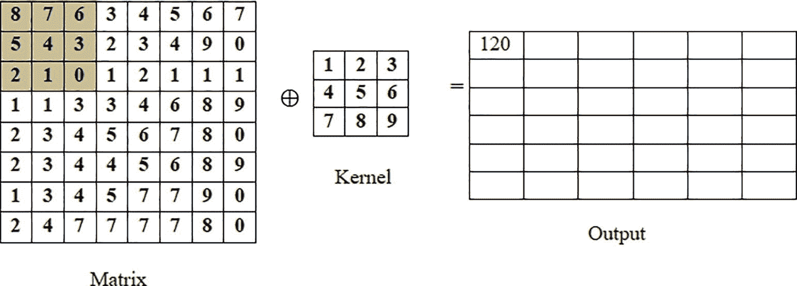

图 6-2

卷积操作

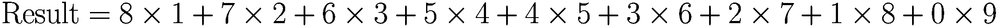

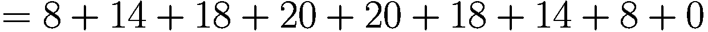

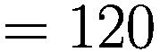

现在，让我们将核向右移动一步，再次找到乘积之和。核在单位时间内移动的量称为**步长**。请注意，对于第一行将有六个这样的乘积（图 6-3）。同样，将有六个这样的行。也就是说，这个操作将每行产生六个值，并且有六个这样的行。因此，输出将是一个 6×6 的矩阵。

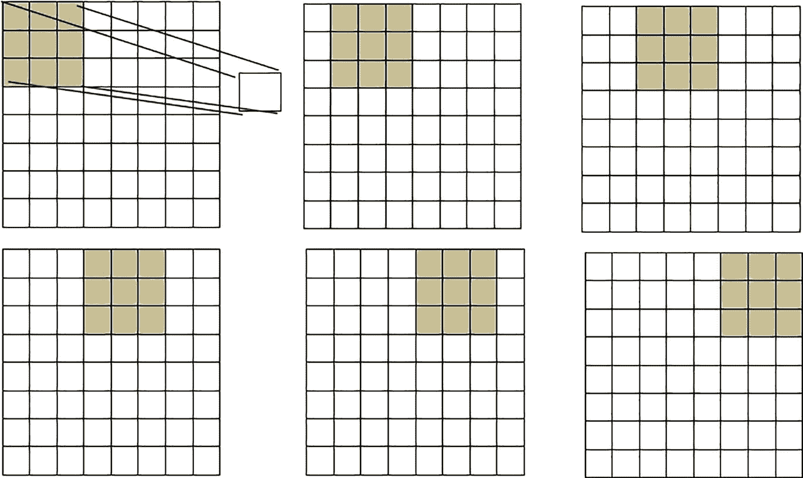

图 6-3

当步长=1，核大小=3，输入大小=8 时，对于每一行将有六个输出

通常，对于输入大小 *n*×*n*，核大小 *k*×*k*，步长 *s*，输出的大小将是

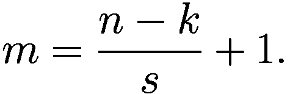

在了解了这一层的操作原理后，我们现在转向这个操作的实现。读者可能会注意到，这个卷积操作与信号处理中的卷积操作不同。

## 实现卷积

为了理解这个操作的优点，考虑以下核。第一个核（核-1）与图像的卷积产生一个特征图，其中可以看到水平线。同样，核-2 与图像的卷积产生一个具有垂直线的特征图（图 6-4）。

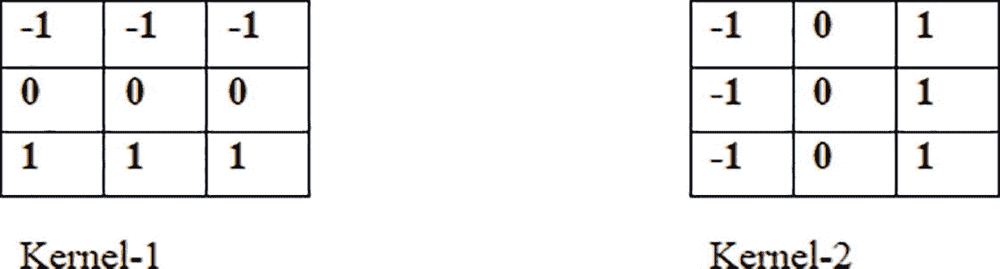

图 6-4

提取图像中水平和垂直线的核

以下代码实现了步长=1 的卷积。第一步导入所需的模块。第二步读取输入图像，第三步将其转换为灰度。第四步创建上述核并实现卷积。第五步对图像应用卷积。

第 1 步：导入 Matplotlib 和 NumPy。

`代码：`

`from matplotlib import pyplot as plt`

`import numpy as np`

第 2 步：读取一张图像。

`代码：`

`arr=plt.imread('Juggie.jpg')#图像可以在网络资源中找到`

`print(arr.shape)`

`plt.imshow(arr)`

`输出：`

`(281, 180, 3)`

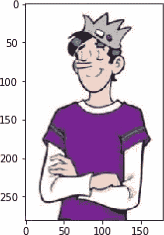

第 3 步：将彩色图像转换为灰度图像。

`代码：`

```py
def rgb2gray(rgb):
r, g, b = rgb[:,:,0], rgb[:,:,1], rgb[:,:,2]
gray = 0.2989 * r + 0.5870 * g + 0.1140 * b
return gray
```

第 4(a)步：创建核。

`代码：`

```py
Kernel=[[2,0,-2],[2,0,-2],[2,0,-2]]
Kernel=np.array(Kernel)
```

第 4(b)步：对图像应用卷积。

`代码：`

```py
def conv(Image, Kernel):
n=Image.shape[0]
m=Image.shape[1]
k=Kernel.shape[0]
new_image=np.zeros((n-k+1, m-k+1))
for i in range(n-k+1):
for j in range(m-k+1):
arr1=Image[i:i+k, j:j+k]
ans=np.sum(arr1*Kernel)
new_image[i,j]=ans
return new_image
```

第 5 步：对图像应用卷积。

`代码：`

```py
result=conv(arr_gray,Kernel )
plt.imshow(result)
```

`输出：`

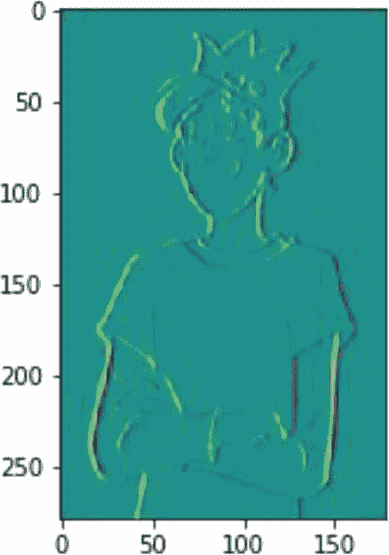

读者还应该运行以下核的上述代码

```py
Kernel=[[2,2,2],[0,0,0],[-2,-2,-2]]
Kernel=np.array(Kernel)
```

并观察输出。预期的输出应该像下面所示的图像。

`输出：`

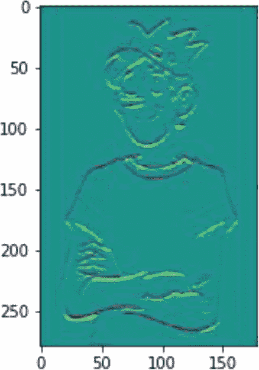

注意，在第一个输出中，垂直线很突出，而在第二个输出中，水平线很突出。这正是核预期要做的。我们可能有一个找到垂直线的核，另一个找到水平线的核，还有一个找到斜线的核。拥有**多个核**将产生给定图像的重要特征。

现在，暂停一下并思考，如果核的权重可以被**学习**会怎样？那将太棒了！这将**允许层从给定的图像中找到所需特征**，并可能有助于分类等任务。这些核的重要性在“核的重要性”部分中解释。

## 填充

有时卷积操作无法遍历整个图像。例如，如果输入图像的大小是 5 × 5，核的大小是 3 × 3，步长是 3，就会出现问题。这可以通过用零填充图像来解决。例如，考虑一个 5 × 5 大小的图像；p = 2 的填充将导致一个 9 × 9 大小的图像，如图 6-5 所示。

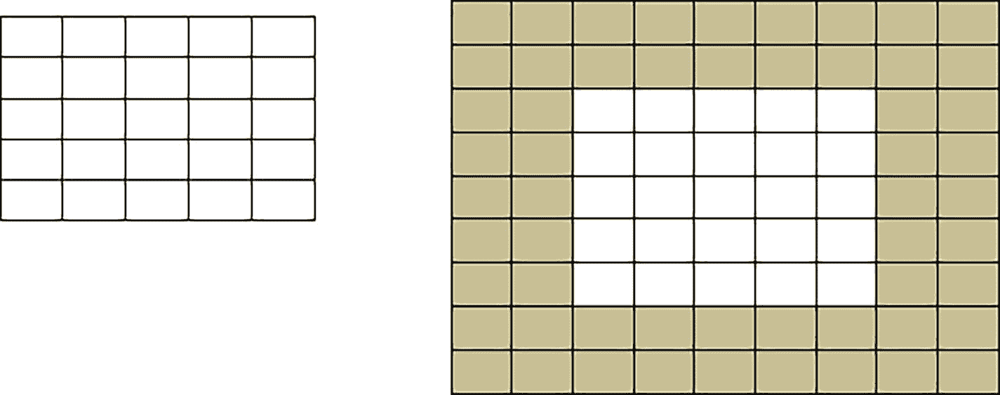

图 6-5

输入图像通过填充零（p = 2）进行填充。

以下代码实现了填充。该函数接受图像（尺寸：*n* × *m*）和 p 的值作为参数，并生成一个尺寸为

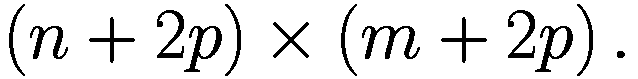

在这里，创建了一个随机数组，并对形成的图像应用了 p = 2 的填充。

`代码：`

```py
#Create random array
arr=np.random.randint(0,255,(30,30))
plt.imshow(arr)
```

`输出：`

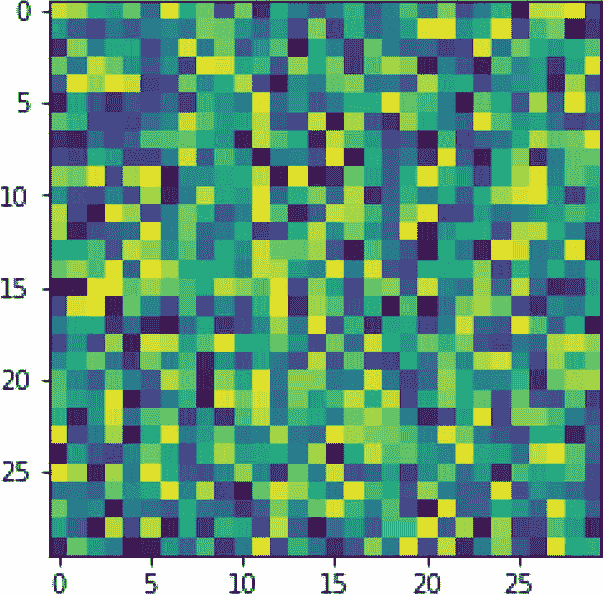

`代码：`

```py
#Define function
def pad(img, p):
arr1=np.zeros((p,img.shape[1]+2*p))
arr2=np.zeros((img.shape[0],p))
arr_temp=np.hstack((arr2,img))
arr_temp=np.hstack((arr_temp,arr2))
arr_temp=np.vstack((arr1,arr_temp))
arr_temp=np.vstack((arr_temp,arr1))
return(arr_temp)
#Pass the array in the function
img1=pad(arr,2)
print(img1.shape)
plt.imshow(img1)
```

`输出：`

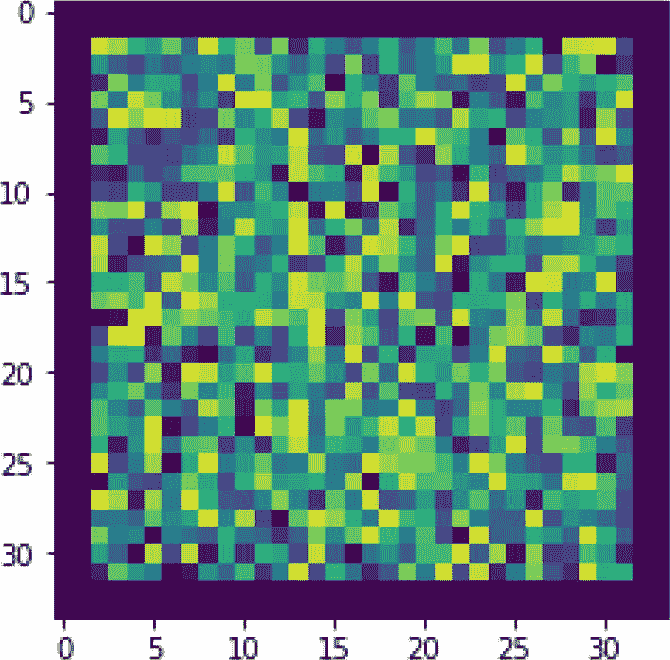

还应注意的是，在填充的情况下，输出场的维度会发生变化。如果填充是 P，核大小是 F，步长是 S，输出维度可以使用以下公式计算：

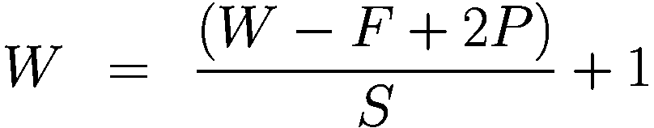

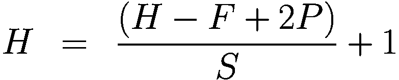

## 步长和其他层

在了解了卷积层和填充的实现之后，我们现在转向池化。然而，在那之前，让我们快速了解一下步长的概念。

### 步长

在单位时间内，核移动的步数被称为步长。在上面的讨论和实现中，步长被设为 1。图 6-6 考虑了步长的值为 2。

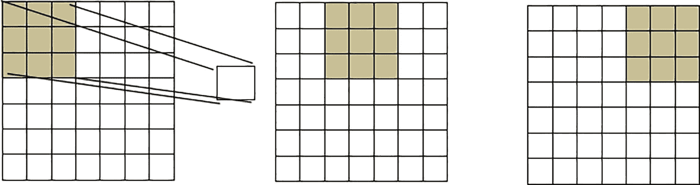

图 6-6

步长 = 2

注意，s 的值越大，输出图像的尺寸越小。一般来说，使用步长 s，输出的大小将由以下公式给出。

### 池化

通常，在两个连续的卷积层之间插入一个池化层。这***有助于减少现有表示的大小***。这种尺寸减小很重要，因为有两个原因：首先，在减少参数数量，其次，在控制模型的过拟合。根据文献综述，池化可以通过以下方式完成：(a) 取给定窗口的最大值或(b) 取平均值或(c) 取总和。所以，如果窗口的大小是 *W* × *H* × *D*，池化层的空间范围是 F，那么输出层的尺寸由以下公式给出

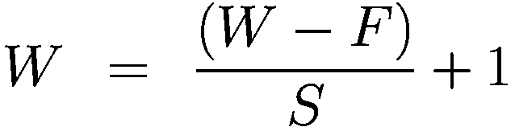

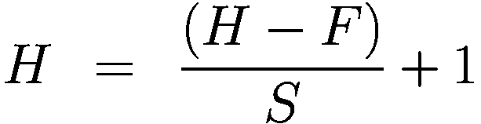

而深度，即 D，保持不变。

还应注意的是，与所有其他类型的池化相比，最大池化更受欢迎。以下代码执行了给定图像的池化操作。读者应观察应用池化操作前后的图像，并找出为什么在应用池化操作后物体仍然可以被识别。

`代码：`

```py
def pooling(image,E,S):
n = image.shape[0]
m = image.shape[1]
new_arr = np.zeros( (((n-E)//S)+1,((m-E)//S)+1))
p=0
k=0
for i in range(((n-E)//S)+1):
k=0
for j in range(((m-E)//S)+1):
arr = image[i:i+E,j:j+E]
ans = np.max(arr)
new_arr[p,k] = ans
k+=1
p+=1
return new_arr
```

注意，将“ans = np.max(arr)”替换为“ans = np.sum(arr)”将导致求和池化，而“np.mean”将导致平均池化。

### 归一化

归一化层的概念是为了模仿我们大脑的抑制方案而引入的。然而，它们并没有证明有很大的好处；因此，它们的使用并不广泛。有各种归一化技术，以下是一些例子：

+   局部响应归一化层（相同映射）

+   局部响应归一化层（跨映射）

+   局部对比度归一化层

感兴趣的读者可以参考本章末尾提供的参考文献以获取更多详细信息。

### 全连接层

正如其名所示，在这个层中，一个层中的每个神经元都与前一层的每个神经元相连。因此，我们可以说它们的行为就像一个正常的神经网络。这个主题在前几章中已经讨论过了。

## 内核的重要性

在了解了每种类型层的基本知识后，让我们回到内核的重要性，内核是 CNN 最重要的组成部分。考虑模式 1。图 6-7 中显示的核在模式中找到水平线。当将卷积操作应用于具有此核的模式时，输出中产生的是随后的图片。请注意，如果核稍微改变，就会产生略微不同的输出。输出显示了线条开始和结束的区域。预期读者运行下面的代码，并识别输出中亮线和暗线的强度。实际上，它们代表正边缘和负边缘。

**模式 1：**

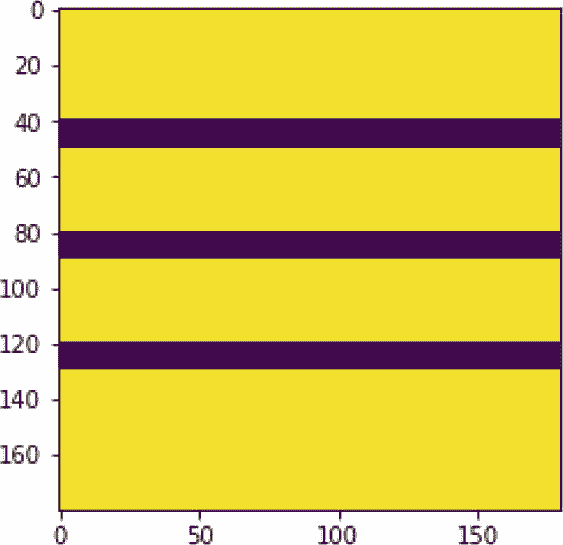

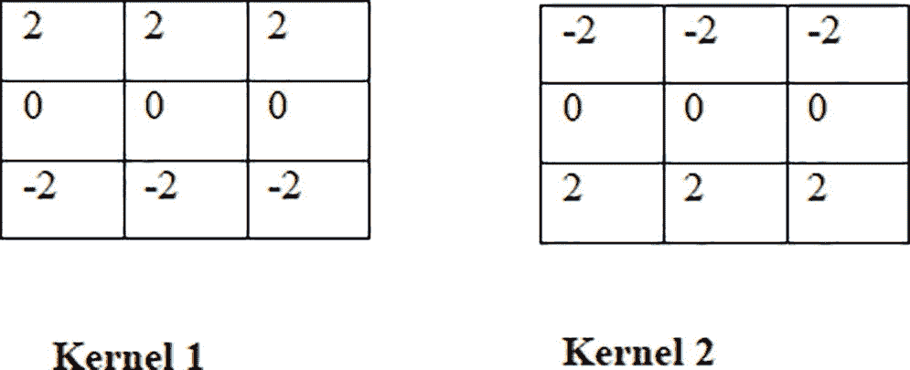

图 6-7

核 1 和核 2 可以识别水平线

```py
Code:
Kernel_horz1=np.array([[2,2,2],[0,0,0],[-2,-2,-2]])
result1=conv_stride(pattern1,Kernel_horz1,1)
plt.imshow(result1)
Output:
```

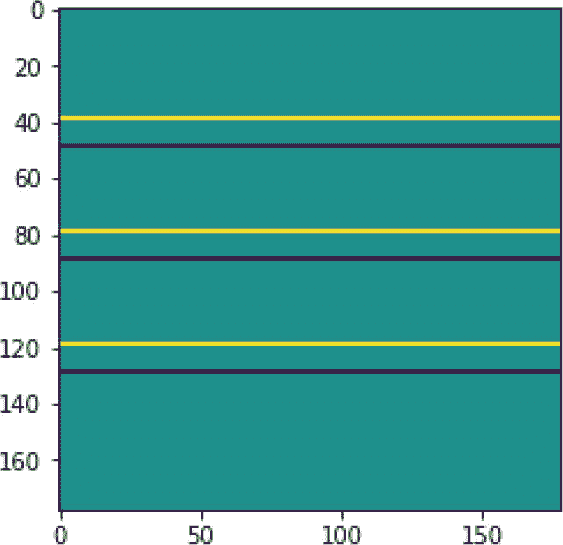

| 2 | 2 | 2 |
| --- | --- | --- |
| 0 | 0 | 0 |
| -2 | -2 | -2 |
| -2 | -2 | -2 |
| 0 | 0 | 0 |
| 2 | 2 | 2 |

```py
Code:
Kernel_horz1=np.array([[-2,-2,-2],[0,0,0],[2,2,2]])
result1=conv_stride(pattern1,Kernel_horz1,1)
plt.imshow(result1)
Output:
```

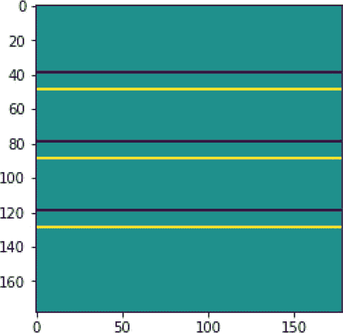

现在，考虑模式 2。图 6-8 中显示的核在模式中找到垂直线。当将卷积操作应用于具有此核的模式时，输出中产生的是该图片。请注意，如果核稍微改变，就会产生略微不同的输出。输出显示了线条开始和结束的区域。预期读者运行下面的代码，并识别输出中亮线和暗线的强度。再次强调，它们代表正边缘和负边缘。

**模式 2：**

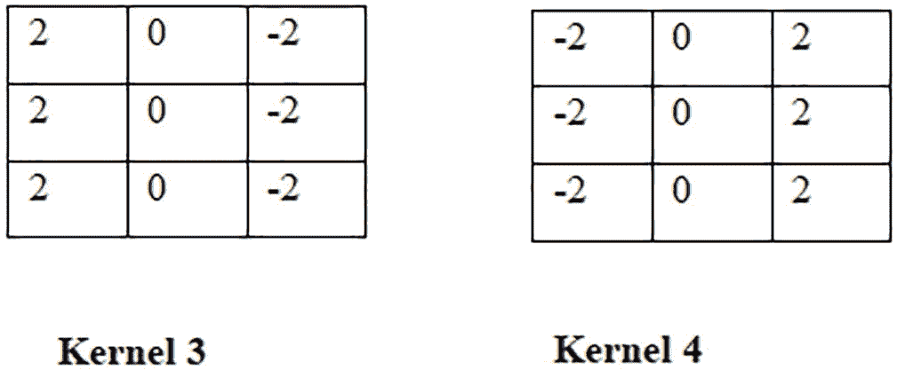

图 6-8

核 3 和核 4 可以识别垂直线

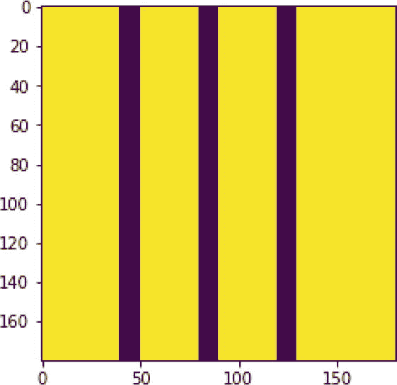

`代码：`

```py
Kernel_vert1=np.array([[2,0,-2],[2,0,-2],[2,-0,-2]])
result3=conv_stride(pattern2,Kernel_vert1,1)
plt.imshow(result3)
```

`输出：`

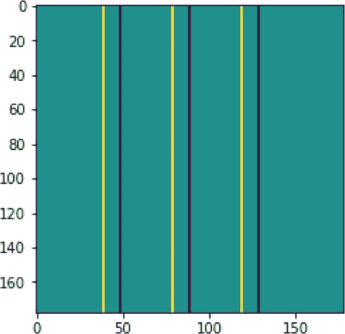

| 2 | 0 | -2 |
| --- | --- | --- |
| 2 | 0 | -2 |
| 2 | 0 | -2 |
| -2 | 0 | 2 |
| -2 | 0 | 2 |
| -2 | 0 | 2 |

`代码：`

```py
Kernel_vert2=np.array([[-2,0,2],[-2,0,2],[-2,-0,2]])
result4=conv_stride(pattern2,Kernel_vert2,1)
plt.imshow(result4)
```

`输出：`

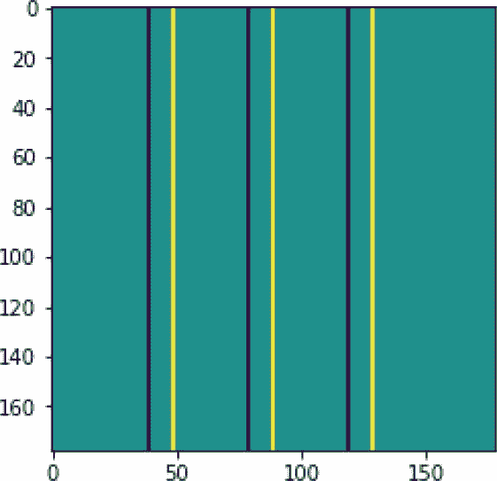

提示

注意，如果用于查找水平线的核应用于包含垂直线的图片（或反之），则不会产生任何结果。

`代码：`

```py
result5=conv_stride(pattern2,Kernel_horz1,1)
plt.imshow(result5)
```

`输出：`

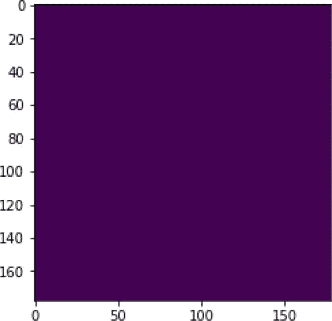

`代码：`

```py
result6=conv_stride(pattern1,Kernel_vert1,1)
plt.imshow(result6)
```

`输出：`

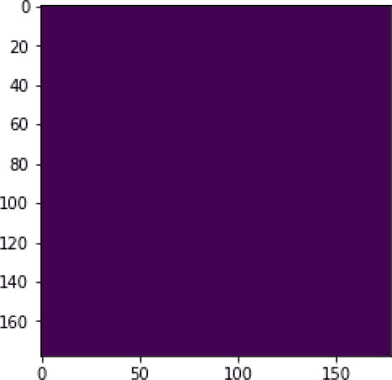

预期读者将在以下模式（模式 3）中应用上述核，并观察结果。

**模式 3：**

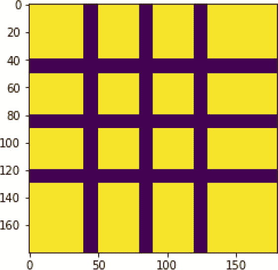

`代码：`

```py
result7=conv_stride(pattern3,Kernel_horz1,1)
plt.imshow(result7)
```

`输出：`

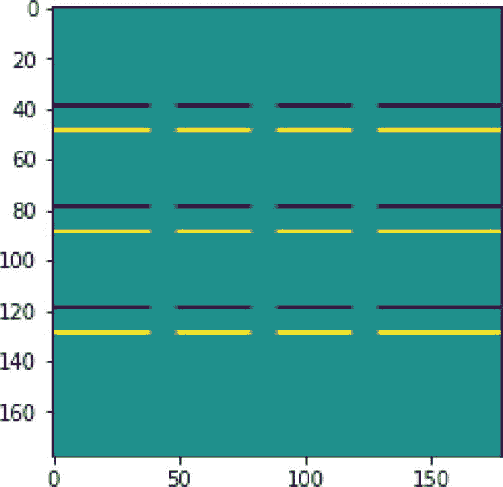

`代码：`

```py
result8=conv_stride(pattern3,Kernel_vert1,1)
plt.imshow(result8)
```

`输出：`

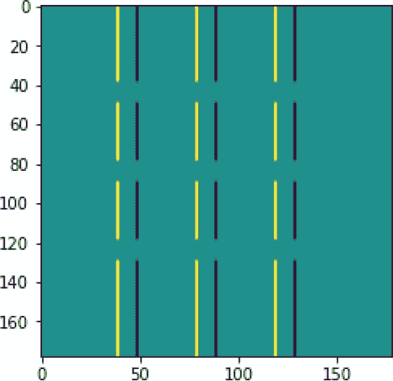

注意，前两个核可以找到水平线，接下来的两个核可以找到垂直线。同样，一些核可以找到对角线，等等。如果将某些核应用获得的信息结合起来，就可以检索到关于输入的纹理信息。这就是卷积操作所做的事情。此外，在上面的讨论中，选择了核。在 CNN 中，核是通过学习得到的，这使得输出非常具有信息量。因此，这种输出可以更好地提取给定图像的纹理信息。上述讨论将帮助读者理解需要多个核的原因。

在研究了 CNN 中各种类型的层之后，让我们考虑一种称为 LeNet 的最简单的 CNN，它能够识别手写数字。

## LeNet 架构

LeNet 由 LeCun 等人于 1998 年在题为“应用于文档识别的基于梯度的学习”的论文中引入。原始论文描述了 LeNet 5 架构，它具有以下层：

+   卷积：6 层，核大小 = 5，步长 = 1，输出 = 28 × 28

+   子采样：平均池化输出 = 14 × 14

+   卷积：16 层，核大小 = 5，步长 = 1

+   子采样：平均池化输出

+   卷积：120 层，核大小 = 5，步长 = 1

+   展平层

+   密集层：84 个神经元，激活函数 = tanh

+   密集层：10 个神经元，激活函数 = softmax

描述 LeNet 的原始论文可以在[`vision.stanford.edu/cs598_spring07/papers/Lecun98.pdf`](http://vision.stanford.edu/cs598_spring07/papers/Lecun98.pdf)找到。请注意，通过堆叠交替的卷积和池化层，然后是一些全连接层，可以构建一些有趣的架构。下一章将介绍上述每个层的 Keras 实现，并讨论顺序模型的设计。然而，读者可以参考以下代码，它实现了 LeNet，并展示了其与包含手写数字图像的流行 MNIST 数据集的应用。

```py
Code:
#Importing Libraries
import tensorflow as tf
from tensorflow.keras import datasets, layers, models
import matplotlib.pyplot as plt
#Split the data into train and test set
(X_train, y_train), (X_test, y_test) = datasets.mnist.load_data()
#Normalization
X_train, X_test = X_train / 255.0, X_test / 255.0
#Displaying the shape of the train and the test data
print(X_train.shape, X_test.shape)
#Convention: (number of samples, x, y, z)
X_train = X_train.reshape(X_train.shape[0], 28, 28, 1)
X_test = X_test.reshape(X_test.shape[0], 28, 28, 1)
#Displaying new shapes
print(X_train.shape, X_test.shape)
#Developing model
LeNet = models.Sequential()
LeNet.add(layers.Conv2D(6, (5, 5), activation='relu', input_shape=(28, 28, 1)))
LeNet.add(layers.MaxPooling2D((2, 2)))
LeNet.add(layers.Conv2D(16, (5, 5), activation='relu'))
LeNet.add(layers.MaxPooling2D((2, 2)))
LeNet.add(layers.Flatten())
LeNet.add(layers.Dense(120, activation='relu'))
LeNet.add(layers.Dense(84, activation='relu'))
LeNet.add(layers.Dense(10, activation='softmax'))
LeNet.compile(optimizer='adam',loss='sparse_categorical_crossentropy',metrics=['accuracy'])
LeNet.summary()
#For observing the variation in loss and performance with iteration
history = LeNet.fit(X_train, y_train, epochs=25, validation_data=(X_test, y_test))
#Plotting Loss and Accuracy of Training and Validation
plt.plot(history.history['loss'], label='Training Loss')
plt.plot(history.history['val_loss'], label='Validation Loss')
plt.title('Training and Validation Loss')
plt.xlabel('Epochs')
plt.ylabel('Loss')
plt.legend()
plt.show()
plt.plot(history.history['accuracy'], label='Training Accuracy')
plt.plot(history.history['val_accuracy'], label='Validation Accuracy')
plt.title('Training and Validation Accuracy')
plt.xlabel('Epochs')
plt.ylabel('Accuracy')
plt.legend()
plt.show()
Output:
```

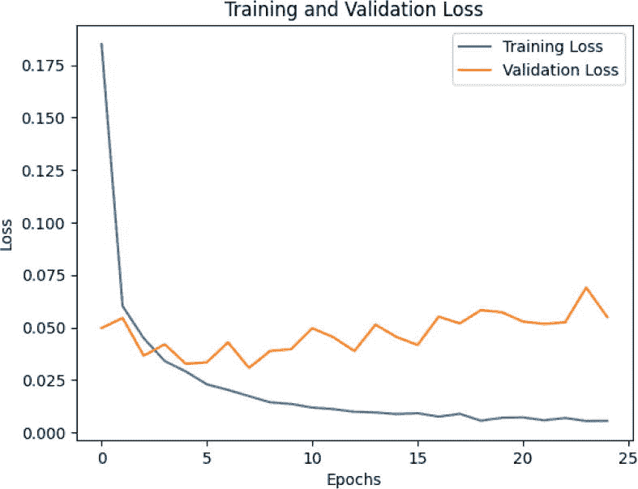

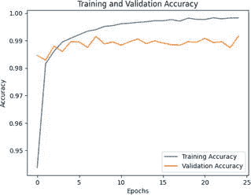

下一章将重新审视 LeNet，并将其与 AlexNet 进行比较。它还讨论了为什么这种架构在处理手写数字时效果神奇，但在处理复杂图像时表现不佳。

## 结论

本书的前几章讨论了 MLP。这些方法存在两个主要问题：

1.  在这些网络中，连接的数量巨大；因此，学习需要许多输入，并且需要花费时间。

1.  此模型没有考虑空间相关性。

本章介绍了卷积神经网络（CNN）的组成部分。它讨论了卷积的重要性，并介绍了池化层、卷积层等的实现。此外，所解释的卷积操作与数学卷积略有不同。

读者应在阅读本章后能够使用 NumPy 从头开始实现层。同时，读者应能够欣赏到在 CNN 中多个核的重要性。然而，并不需要从头开始实现所有内容；Keras 提供了所有层的实现。下一章将**介绍 Keras**，并解释如何使用 Keras 实现层的实现。本章还介绍了最**重要的一些 CNN 及其实现**。这将赋予你对抗图像分析问题的最强大武器。总之，我们始于神经认知。以下神经认知的图像（图 6-9）是由 AI([`gencraft.com/generate`](https://gencraft.com/generate))生成的，并使用了 CNN。

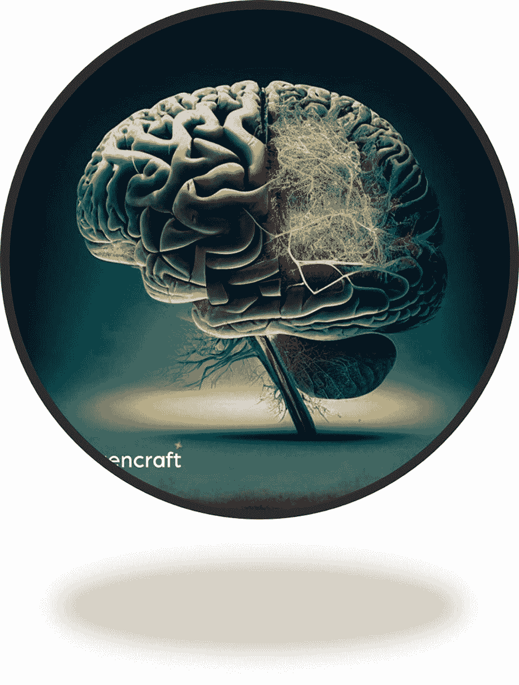

图 6-9

由[`gencraft.com/generate`](https://gencraft.com/generate)生成的神经认知图像

在继续之前，让我们测试一下我们的理解。

## 练习

### 多选题

1.  CNN 通常用于以下哪项？

    1.  图像

    1.  文本

    1.  声音

    1.  以上都不是

1.  以下哪些任务可以使用 CNN 完成？

    1.  图像分类

    1.  图像检测

    1.  分割

    1.  所有上述选项

1.  对于声音的分类，以下哪项可以使用？

    1.  CNN

    1.  RNN

    1.  MLP

    1.  所有上述选项

1.  卷积使用

    1.  共享权重

    1.  神经学类比

    1.  两者

    1.  以上都不是

1.  卷积层可以有多少个核？

    1.  只有一个

    1.  多个

    1.  无法回答

    1.  无

1.  以下哪项减少了输出的大小？

    1.  池化

    1.  滚筒

    1.  学校教育

    1.  冷却

1.  通常，以下哪些用于池化？

    1.  最大值

    1.  平均值

    1.  求和

    1.  以上所有选项

1.  CNN 可以有多个卷积层吗？

    1.  是

    1.  否

1.  CNN 相对于全连接层（s）

    1.  通常是最后几层

    1.  通常放置在网络的开始部分

    1.  中间层

    1.  以上都不是

1.  以下哪项不是 CNN 的层？

    1.  卷积

    1.  全连接

    1.  LTU

    1.  池化

### 数值

1.  如果图像的大小是 20×20，核的大小是 5×5，步长=1，那么为了使输出图像的大小与输入图像相同，p 的值应该是多少？

1.  如果图像的大小是 20×20，核的大小是 5×5，步长=2，那么当 p=1 和 p=2 时，输出图像的大小应该是多少？

1.  如果图像的大小是 20×20，核的大小是 5×5，步长=1，那么当 p=0 时，输出的大小应该是多少？

1.  在上述情况下，如果 s=2，输出图像的大小应该是多少？

1.  如果输入图像的大小为 20，p 的值为 2 且 s=1，那么产生大小为 20 的图像的核的大小是多少？

### 应用

1.  列出用于查找水平和垂直线的滤波器。

1.  建议一个用于在图像中查找对角线的滤波器。

1.  如果在以下核中将包含 2s 的行与包含-2s 的行交换会发生什么？

1.  你可以使用单个滤波器找到水平和垂直线吗？

1.  能否使用两个过滤器完成上述任务？

1.  您需要对橙子和苹果的图片进行分类。这些图片的尺寸为 100 × 100。建议使用多层感知器来完成这项任务。同时，使用 Keras 实现网络。

1.  使用卷积神经网络（CNN）完成上述任务。（读者可以在阅读下一章后尝试此任务。）

1.  比较上述两种结构中可学习的权重量。


