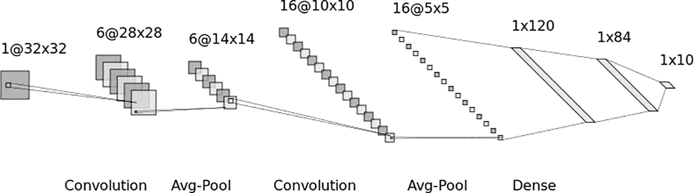
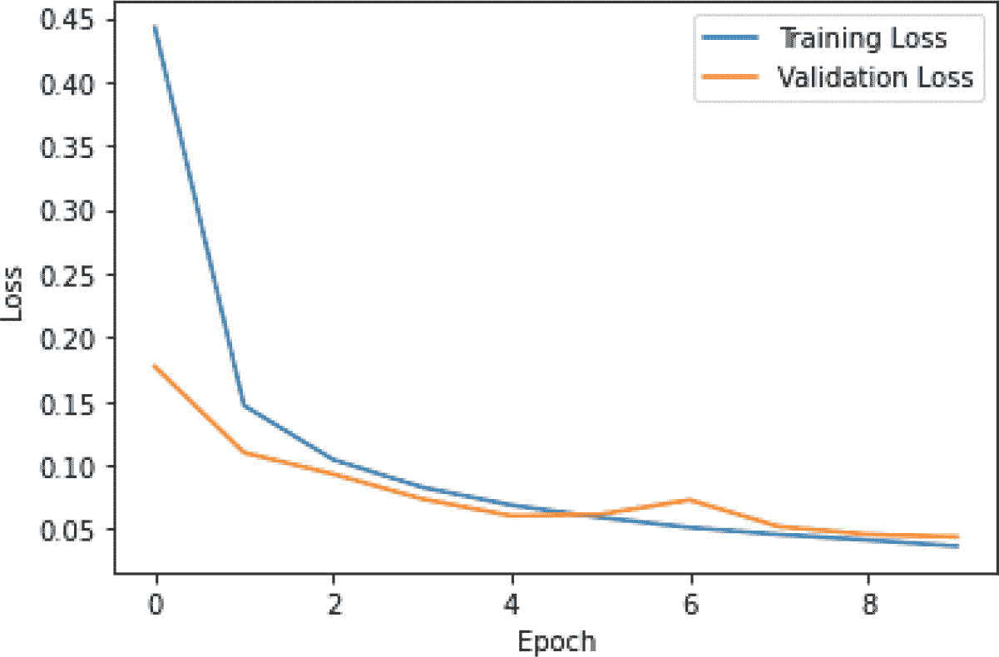
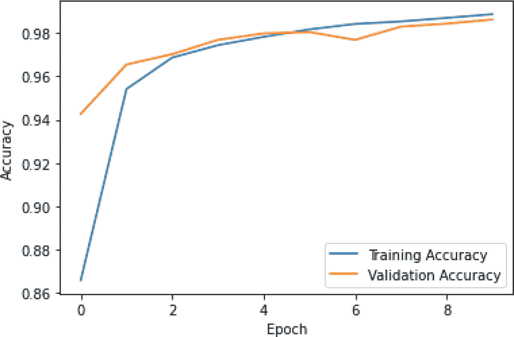
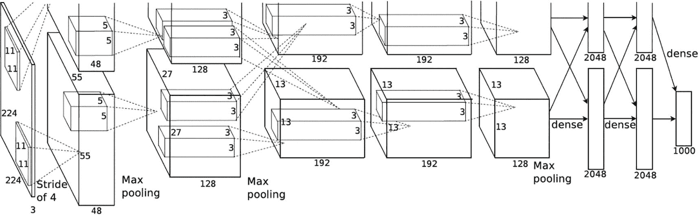

# 7. 卷积神经网络：II

上一章讨论了卷积神经网络的单元并介绍了 LeNet。本章将讨论向前推进，并概述和实现一些著名的 CNN 架构，如 LeNet、AlexNet 和 Google LeNet（Inception Net）。LeNet 的简单性给出了 CNN 中事物如何工作的良好概念。然而，为了对复杂图像进行分类并完成高级图像分析任务，我们需要深度、更复杂的结构。2010 年代的进步旨在解决当时流行的 CNN 中的问题，并为我们提供了自那时起对所有图像相关任务（包括监督和非监督）都极其重要的架构。

在上一章中，我们从零开始实现了 CNN 层，这在实际中是不必要的。本章解释了 Keras 的顺序模型，并提供了必要的示例，以帮助读者实现基本的 CNN。本章还简要概述了 Keras 中一些最重要的层。

本章的组织结构如下。第“顺序模型”节讨论了顺序模型；第“Keras 层”节介绍了 ***keras.layers*** 的概述。第“使用 LeNet 对 MNIST 数据集进行分类：先决条件”节实现了一个 MNIST 分类器。接下来的三个节讨论了 LeNet、AlexNet 和其他重要的 CNN 模型，最后一节进行总结。本章构成了以下章节的基础，并将帮助您完成诸如目标检测和分割等任务。

## 顺序模型

当我们需要在模型中堆叠层，该模型以张量作为输入并产生一个张量（TITO：张量输入张量输出）时，顺序模型就派上用场了。然而，如果模型有多个输入，则不使用顺序模型。同样，在模型有多个输出或非线性模型的情况下，它们也不使用。以下导入对于构建模型是必需的。

**代码**：

```py
import tensorflow as tf
from tensorflow import Keras
from tensorflow.keras import layers
```

### 创建模型

您可以通过传递一个层列表到 **keras.Sequential** 方法来创建一个顺序模型。例如，以下代码创建了一个包含三个层的顺序模型。模型的输入是一个 10 × 10 的张量。**layers.Dense** 的其余参数将在后续章节中解释。

**代码：**

```py
model = keras.Sequential(
[
layers.Dense(5, activation="relu", name="layer1"),
layers.Dense(4, activation="relu", name="layer2"),
layers.Dense(4, name="layer3"),
]
)
X = tf.ones((10, 10))
y = model(X)
```

您可以通过使用 **model.layers** 来查看您的模型。

**代码**：

```py
print(model.layers)
```

**输出****：**

```py
[, , , ]
```

### 在模型中添加层

**layers.add** 方法帮助我们向模型中添加层。此函数的参数是一个层。例如，在以下代码中，一个具有 2 个单元和“relu”激活功能的密集层被添加到现有模型中。请注意，**model.layers** 输出一个额外的层。

**代码：**

```py
model.add(layers.Dense(2, activation="relu"))
print(model.layers)
```

**输出：**

```py
[, , , , ]
```

### 从模型中移除最后一层

**layers.pop** 方法帮助我们从一个模型中弹出层。由于我们打算移除最后一层，因此不需要为此函数提供任何参数。例如，在以下代码中，从现有模型中移除了最后一层。

**代码**:

```py
model.pop()
```

### 初始化权重

只有在事先知道输入大小的情况下才能创建权重。最初，当未提供权重时，没有权重。当指定输入的形状时创建权重。可以使用 **layers.weights** 来查看层的权重。以下代码创建了一个具有十个神经元的密集层。当将大小为 5×5 的输入提供给层时，所创建的权重的形状变为 TensorShape([5, 10])。这也适用于序列模型。

**代码**:

```py
model2=layers.Dense(10)
X=tf.ones((5,5))
y=model2(X)
model2.weights[0].shape
```

**输出**:

```py
TensorShape([5, 10])
```

### 摘要

可以使用 **model.summary()** 来查看模型的摘要。此方法还会显示参数总数以及可学习参数和非可学习参数的总数。

**代码**:

```py
model.summary()
```

**输出**:

```py
Model: "sequential_4"
_________________________________________________________________
Layer (type)                 Output Shape              Param #
=================================================================
layer1 (Dense)               (10, 5)                   55
_________________________________________________________________
layer2 (Dense)               (10, 4)                   24
_________________________________________________________________
layer3 (Dense)               (10, 4)                   20
=================================================================
Total params: 99
Trainable params: 99
Non-trainable params: 0
_________________________________________________________________
```

在看到序列模型的创建之后，我们现在简要讨论一下 Keras 层。

## Keras 层

Keras 层应用程序编程接口提供了 TITO (Tensor In Tensor Out) 函数及其相应的权重。在训练部分，当层接收到数据时，权重存储在 **layers.weights** 中。此接口的一些重要层如下。

您可以从 **tensorflow.keras** 中导入 layers：

```py
from tensorflow.keras import layers
```

### 1. 密集层

**名称**: layers.Dense

**函数**: 此函数创建一个密集层。

**最重要的参数**: 输出单元的数量和激活函数

**示例**: 在以下示例中，使用 **relu** 激活函数创建了一个具有十个神经元的输出层。输入的形状为 (20, 20)。

**代码**:

```py
layer = layers.Dense(10, activation='relu')
inputs = tf.random.uniform(shape=(20, 20))
outputs = layer(inputs)
```

### 2. Conv2D 层

**名称**: Conv2D

**函数**: tf.keras.layers.Conv2D 帮助我们创建 Conv2D 层。

**参数**: 以下语法显示了参数及其默认值。请注意，步长参数应设置为表示步长的元组。同样，也可以指定过滤器大小和内核大小。Padding = “valid” 表示输出的大小应与输入相同。

**语法**:

```py
tf.keras.layers.Conv2D(filters,kernel_size,strides=(2,2),padding="valid",activation=None,use_bias=True,bias_initializer="zeros")
```

### 3. 池化

**名称**: MaxPooling2D

**函数**: 此函数实现了 2D 空间数据的最大池化操作。

**参数**: **pool_size** 必须设置为期望的元组，表示池化的大小。在此，也可以指定步长。

**语法**:

```py
tf.keras.layers.MaxPooling2D(pool_size=(2,2),strides=None,padding="valid")
```

### 4. 激活函数

在上述层中，激活可以是以下任何一种：

+   relu 函数

+   sigmoid 函数

+   softmax 函数

+   tanh 函数

+   selu 函数

+   指数函数

softmax 和 ReLU 的语法如下。

#### 4.1 Softmax

**名称**: tf.keras.layers.Softmax

**函数**: 此函数实现了 softmax 激活函数。

**语法**:

```py
tf.keras.layers.Softmax(axis=-1,**kwargs)
```

#### 4.2 ReLU

**名称**: tf.keras.layers.ReLU

**函数**: 此函数实现了 ReLU 激活。

**语法**:

```py
tf.keras.layers.ReLU(max_value=None,negative_slope=0,threshold=0,**kwargs)
```

### 5. 初始化权重

权重可以通过以下任一类进行初始化：

+   RandomNormal 类

+   RandomUniform 类

+   TruncatedNormal 类

+   Zeros 类

+   Ones 类

注意，本书第三章节中也处理了初始化问题。

### 6. 杂项

与神经网络的情况一样，我们可以使用 L1 或 L2 或 L1–L2 正则化。也可以使用层的权重约束类来指定权重的约束。

在了解了顺序模型的基本构建块和 keras.layers 的概述之后，让我们创建一个模型来对 MNIST 数据集的数字进行分类。

## 使用 LeNet 对 MNIST 数据集进行分类：先决条件

让我们通过创建一个简单的密集网络来尝试理解层，使用 ***keras.layers***。读者被期望编写一个实现简单模型的代码，用于对 MNIST 数据集进行分类。该模型应包含三个层，分别有 20、10 和 5 个神经元。本书末尾的附录 A 讨论了模型的训练和评估。附录 A 还包括了代码。然而，在尝试任务之前，尽量不要参考代码。使用此模型，你应该获得超过 90% 的准确率。此外，报告激活函数的变化和隐藏层神经元数量的变化对模型性能的影响。

下一个部分将给出使用 LeNet 实现此任务的示例。读者被期望比较两种实现的输出、可训练参数的数量以及训练模型所需的时间。

到目前为止，我们已经学习了模型的创建和编译。现在让我们看看一些最流行的 CNN 模型。

## LeNet

LeNet 是第一个成功应用于手写数字识别的 CNN 模型之一，为卷积神经网络奠定了基础。该模型在 Bell Labs 开发，并将反向传播算法应用于 CNN。与单层网络相比，它具有更好的泛化能力，正如创建者 Yann LeCun 在论文 [2] 中所提出的。该提出的模型表现出色，错误率仅为 1%。

### 结构

这个模型的结构将激励许多其他模型，并在深度学习研究中证明是一个里程碑。最初，卷积被称为感受野。该模型的池化层执行平均池化。LeNet-5 具有以下层：

+   模型的第一层是一个具有 5 × 5 大小六个核的卷积层。

+   下一个层是一个池化层，它通过使用 2 × 2 平均池化将输入转换为 14 × 14。

+   下一个层是一个卷积层，后面跟着一个与该模型第二层类似的池化层。

+   第五层是一个展平层，第六层是一个具有 120 个单元的全连接层。

+   第七层是一个具有 84 个单元和激活功能的全连接层。

+   最后一层是输出 softmax 层，包含十个神经元。

图 7-1 展示了 LeNet 的结构。



图 7-1

LeNet 的结构

注意到 LeNet 中的核大小很小。这意味着需要学习的参数数量减少，从而减轻了网络的性能。这在 1990 年代末这些网络被设计出来时是必要的，因为那时的机器计算能力有限。还应该注意的是，小核的存在阻碍了网络学习复杂模式的能力，从而降低了过拟合的风险。

在 CNN 中步长的选择也会影响模型的性能。使用适当的步长在特征图维度和提取相关信息之间取得平衡。如果步长太大，则会导致信息丢失。

LeNet 使用平均池化代替最大池化，因为最大池化提取最重要的部分，而平均池化则从区域中提取平均信息，从而保留了特殊结构**。**

### 实现

以下代码实现了 LeNet-5 模型。数据被加载并分割为训练集和测试集。由于输入图像是 28×28，但 LeNet 使用 32×32 作为输入，因此进行了填充。请注意，填充仅在第二和第三维度上进行，因为第一维度表示样本数量。然后创建模型。

**步骤 1**：这个步骤涉及加载数据并获得训练数据和测试数据：

```py
mnist_data=tf.keras.datasets.mnist
(X_train,y_train),(X_test,y_test)=mnist_data.load_data()
```

**步骤 2**：进行填充以将 28×28 图像转换为 32×32 图像：

```py
X_train=np.pad(X_train,((0,0),(2,2),(2,2)))
X_test=np.pad(X_test,((0,0),(2,2),(2,2)))
```

**步骤 3**：在这个步骤中，训练数据和测试数据被归一化，标签被转换为独热编码形式：

```py
X_train=np.reshape(X_train,(X_train.shape[0],32,32,1))
X_test=np.reshape(X_test,(X_test.shape[0],32,32,1))
X_train=X_train/255
X_test=X_test/255
X_train = X_train.astype('float32')
X_test = X_test.astype('float32')
y_train = tf.keras.utils.to_categorical(y_train, 10)
y_test = tf.keras.utils.to_categorical(y_test, 10)
```

**步骤 4**：在这个步骤中，构建模型。该模型由以下层组成：

+   第一层是一个具有六个滤波器、核大小为（5,5）的卷积层。

+   第二层是一个大小为（2,2）的平均池化层。

+   第三层是一个具有 16 个滤波器、核大小为（5,5）的卷积层。

+   第四层再次是一个大小为（2,2）的平均池化层。

+   第五层是一个展平层。

+   第六层是一个包含 120 个单元的完全连接层，并使用 ReLU 激活。

+   第七层是一个包含 84 个单元的完全连接层，并使用 ReLU 激活。

+   最后一层是输出 softmax 层，大小为十个神经元（十个数字中的一个）。

```py
model = tf.keras.Sequential()
model.add(tf.keras.layers.Conv2D(filters=6,kernel_size=(5, 5),strides=(1, 1),activation='tanh',input_shape=(32,32,1)))
model.add(tf.keras.layers.AveragePooling2D(pool_size=(2, 2),strides=(2, 2)))
model.add(tf.keras.layers.Conv2D(filters=16,kernel_size=(5, 5),strides=(1, 1),activation='tanh'))  model.add(tf.keras.layers.AveragePooling2D(pool_size=(2, 2),strides=(2, 2)))
model.add(tf.keras.layers.Flatten())
model.add(tf.keras.layers.Dense(units=120,activation='relu'))
model.add(tf.keras.layers.Dense(units=84, activation='relu'))
model.add(tf.keras.layers.Dense(units=10, activation='softmax'))
model.compile(loss='categorical_crossentropy',optimizer=SGD(lr=0.1),metrics=['accuracy'])
```

**步骤 5**：这个步骤涉及训练模型。注意批大小被设置为 128：

```py
epochs = 10
history = model.fit(X_train, y_train,epochs=epochs,validation_data=(X_test,y_test),batch_size=128,verbose=2)
```

**输出**：

```py
Epoch 1/10
469/469 - 29s - loss: 0.4425 - accuracy: 0.8658 - val_loss: 0.1771 - val_accuracy: 0.9427
Epoch 2/10
469/469 - 29s - loss: 0.1467 - accuracy: 0.9542 - val_loss: 0.1098 - val_accuracy: 0.9655
Epoch 3/10
469/469 - 29s - loss: 0.1043 - accuracy: 0.9687 - val_loss: 0.0930 - val_accuracy: 0.9703
Epoch 4/10
469/469 - 29s - loss: 0.0826 - accuracy: 0.9744 - val_loss: 0.0735 - val_accuracy: 0.9769
Epoch 5/10
469/469 - 29s - loss: 0.0686 - accuracy: 0.9783 - val_loss: 0.0603 - val_accuracy: 0.9799
Epoch 6/10
469/469 - 29s - loss: 0.0590 - accuracy: 0.9817 - val_loss: 0.0615 - val_accuracy: 0.9805
Epoch 7/10
469/469 - 29s - loss: 0.0512 - accuracy: 0.9843 - val_loss: 0.0727 - val_accuracy: 0.9769
Epoch 8/10
469/469 - 29s - loss: 0.0457 - accuracy: 0.9854 - val_loss: 0.0519 - val_accuracy: 0.9830
Epoch 9/10
469/469 - 29s - loss: 0.0414 - accuracy: 0.9870 - val_loss: 0.0457 - val_accuracy: 0.9844
Epoch 10/10
469/469 - 29s - loss: 0.0366 - accuracy: 0.9888 - val_loss: 0.0438 - val_accuracy: 0.9863
```

**步骤 6（a）**：然后分析训练损失和验证损失：

```py
import matplotlib.pyplot as plt
num_epochs = np.arange(0, 10)
plt.figure()
plt.plot(num_epochs, history.history['loss'],label='Training Loss')
plt.plot(num_epochs, history.history['val_loss'],label='Validation Loss')
plt.xlabel('Epoch')
plt.ylabel('Loss')
plt.legend()
plt.show()
```

**输出**：



**步骤 6（b）**：然后分析训练准确率和验证准确率：

```py
plt.figure()
plt.plot(num_epochs, history.history['accuracy'], label='Training Accuracy')
plt.plot(num_epochs, history.history['val_accuracy'], label='Validation Accuracy')
plt.xlabel('Epoch')
plt.ylabel('Accuracy')
plt.legend()
```

**输出**：



在了解了 LeNet 的架构及其在 MNIST 数据集上的应用后，我们现在转向另一个流行的 CNN，即 AlexNet。

## AlexNet

AlexNet 是由乌克兰出生的计算机科学家 Alex Krizhevsky 开发的。它是一个 CNN 模型，赢得了 2012 年的 ImageNet 挑战赛。它受到 LeNet 的启发，有八个层。这个模型使用最大池化而不是 LeNet-5 中的平均池化。该模型强调深度并使用 GPU 进行训练。AlexNet 通过减少训练时间，同时提高性能，挑战了当时盛行的 CNN 模型。以下特征使 AlexNet 脱颖而出：

+   ReLU 激活：AlexNet 使用了修正线性单元（Rectified Linear Units）而不是流行的 sigmoid 或 tanh 函数。这大大减少了时间，并帮助这个模型在 CIFAR-10 数据集上实现了 25%的错误率。

+   GPU：AlexNet 使用了多个 GPU，并将模型神经元分配给它们。

+   重叠池化概念：作者引入了重叠池化的概念，并证明这会导致更少的过拟合。这也提高了其错误率。

AlexNet 在 2012 年赢得了 ImageNet 大规模视觉识别挑战赛。它有八个层，最初在超过 100 万张图像上进行了训练。它可以对图像进行 1000 个类别的分类，通常被认为比 LeNet 更好。根据[3]，借助这个网络实现的前 1%和前 5%错误率分别为 37.5%和 17%。这个网络的总参数数量约为 6000 万个。以下讨论描述了为什么这个网络比之前开发的网络表现更好。这个网络的结构如下。

**结构：**

该模型包含 Conv2D、激活、池化、softmax 和密集层，按照随后的代码中讨论的顺序排列。

**代码：**

```py
model = Sequential()
model.add(Conv2D(filters=96, input_shape=(224,224,3), kernel_size=(11,11), strides=(4,4), padding='valid'))
model.add(Activation('relu'))
model.add(MaxPooling2D(pool_size=(2,2), strides=(2,2), padding='valid'))
model.add(Conv2D(filters=256, kernel_size=(11,11), strides=(1,1), padding='valid'))
model.add(Activation('relu'))
model.add(MaxPooling2D(pool_size=(2,2), strides=(2,2), padding='valid'))
model.add(Conv2D(filters=384, kernel_size=(3,3), strides=(1,1), padding='valid'))
model.add(Activation('relu'))
model.add(Conv2D(filters=384, kernel_size=(3,3), strides=(1,1), padding='valid'))
model.add(Activation('relu'))
model.add(Conv2D(filters=256, kernel_size=(3,3), strides=(1,1), padding='valid'))
model.add(Activation('relu'))
model.add(MaxPooling2D(pool_size=(2,2), strides=(2,2), padding='valid'))
model.add(Flatten())
model.add(Dense(4096, input_shape=(224*224*3,)))
model.add(Activation('relu'))
model.add(Dropout(0.4))
model.add(Dense(4096))
model.add(Activation('relu'))
# Add Dropout
model.add(Dropout(0.4))
model.add(Dense(1000))
model.add(Activation('relu'))
model.add(Dropout(0.4))
model.add(Dense(10))
model.add(Activation('softmax'))
```

上文架构的主要问题是当时可用的单个 GPU（GTX 580）无法容纳所有训练数据，因为它们需要 120 万个示例来训练网络。为了处理这个问题，他们使用了多个 GPU（特别是两个），并将内核分配给它们。例如，在第一个卷积层中，内核的数量是 96，每个 GPU 分配到了 48 个。同样，对于第二个卷积层，每个 GPU 分配到了 128 个。第三、第四和第五个卷积层也相应地分配。请参阅图 7-2 [1]，其中显示了并行化方案。



图 7-2

原始论文中展示的 AlexNet 结构 [1]

根据论文，上述技巧将前 1%的错误率降低了 1.7%。作者还采用了局部响应归一化，其中神经元的活性相对于“在同一空间位置”的相邻内核进行了归一化。他们还采用了重叠池化，而不是早期架构中使用的传统非重叠池化。

为了减少过拟合，使用了两个主要的技巧：一个是数据增强，这实际上意味着通过保留相应的标签来人工增加数据集。他们使用生成增强数据的概念，而不是存储在内存中。他们用来减少过拟合的另一种方法是 dropout。他们在每个隐藏神经元中使用 p = 0.5。这减少了过拟合，但将所需的迭代次数翻倍以实现覆盖。

这种架构比 LeNet 好得多，但更有效率和效率的架构还有待出现。下一节将介绍一些这样的架构。

## 一些其他架构

### GoogLeNet

GoogLeNet 在 2014 年的 ILSVRC 竞赛中获胜。该模型最初被称为 Inception V1，因为它引入了 Inception 模块。该模块使用从 1×1 到 5×5 不同尺寸的三个过滤器。这使得模型能够捕捉到粗略的细节以及更精细的细节。需要注意的是，模型通过添加 1×1 的瓶颈来确认计算。该模型还使用了稀疏连接和归一化。在最后一层中使用了全局平均池化和 RmsProp 优化器。该模型是非同质的，每个模块都需要管理拓扑结构。在下一层中，特征空间被大幅减少，因此可能导致重要信息的丢失。

Inception 模块包括具有不同核大小的卷积层和池化层的组合。这些多个分支在不同尺度上提取特征，从而生成更丰富的特征集，因此能够识别复杂的模式。这也使得网络更加高效。

### ResNet

ResNet 在 2015 年的 ILSVRC 竞赛中获胜。它是一个 152 层的深度卷积神经网络。尽管与 AlexNet 和 VGG 相比更深，但它展示了更低的计算复杂度。该模型引入了残差学习的概念。实际上，ResNet 在著名的图像识别基准数据集 COCO 上提高了 28%。模型利用了在 Highway Networks 中使用的路径的绕过思想来解决网络训练中的问题。ResNet 在层内引入了快捷连接以实现跨层连接。这加快了深度网络的收敛速度，从而为 ResNet 提供了避免梯度消失问题的能力。

### DenseNet

这个模型是为了解决梯度消失问题而设计的。这个模型以前馈方式将每个前一层连接到所有下一层。这意味着所有前层的特征图都被用作后续所有层的输入 [4]。这提供了显式区分添加到网络中的信息和保留在网络中的信息的能力。然而，这个模型在增加特征图数量时参数化成本很高。暂停一下，思考一下这个 CNN 是否可以被认为是序列模型。

## 结论

CNNs 通常用于图像。它们在图像上的性能远优于 MLPs。后两章讨论了 CNN 的基本原理、各种模型和实现。这些章节从头开始介绍了实现和使用 Keras。读者应该能够实现这些模型并在现有模型中进行修改。然而，在某些模型中，可学习的参数数量非常大。在下一章中，我们将学习如何处理这个问题。

在学习了 MLPs 和 CNNs 之后，下一章将讨论这些 CNN 在目标识别和分割中的应用。在那之前，让我们测试一下我们所学的。

## 练习

### 多选题

1.  在以下哪种情况下序列模型不能使用？

    1.  如果模型有多个输入，则不使用序列模型。

    1.  在具有多个输出的模型的情况下。

    1.  在非线性模型的情况下。

    1.  以上皆是。

1.  哪种方法可以帮助我们从模型中删除一层？

    1.  model.pop()

    1.  model.add()

    1.  model.summary()

    1.  以上皆非

1.  Keras 层应用编程接口提供

    1.  TITO（张量在张量输出）函数

    1.  LIFO

    1.  FIFO

    1.  以上皆非

1.  以下哪个激活函数可以在序列模型中使用？

    1.  relu 函数

    1.  Sigmoid 函数

    1.  softmax 函数

    1.  tanh 函数

    1.  以上皆是

1.  权重可以通过以下哪个类进行初始化？

    1.  RandomNormal 类

    1.  RandomUniform 类

    1.  TruncatedNormal 类

    1.  以上皆是

1.  哪个模型通常被认为是应用于手写数字识别的成功模型之一？

    1.  LeNet

    1.  AlexNet

    1.  Google LeNet

    1.  以上皆非

1.  哪个模型首先使用了 ReLU、GPU 能力和重叠池化的组合？

    1.  AlexNet

    1.  LeNet

    1.  Google LeNet

    1.  以上皆非

1.  哪个模型引入了 Inception 块？

    1.  Google LeNet

    1.  AlexNet

    1.  LeNet

    1.  以上皆非

1.  哪个模型引入了残差学习的概念？

    1.  DenseNet

    1.  ResNet

    1.  AlexNet

    1.  以上皆非

1.  以下哪个是为了解决梯度消失问题而设计的？

    1.  DenseNet

    1.  AlexNet

    1.  LeNet

    1.  以上皆非

### 实现

参考以下数据集。使用问题 1 中的模型，比较模型的性能。同时，调整模型的深度，并报告对性能的影响。说明你将采取的一些措施来处理所开发模型中的偏差和方差，并报告你的结果。找出为什么一些提到的方法在给定的数据集中有效：

1.  [`www.kaggle.com/puneet6060/intel-image-classification`](https://www.kaggle.com/puneet6060/intel-image-classification)

1.  [`www.kaggle.com/vishalsubbiah/pokemon-images-and-types`](https://www.kaggle.com/vishalsubbiah/pokemon-images-and-types)

1.  [`www.kaggle.com/shravankumar9892/image-colorization`](https://www.kaggle.com/shravankumar9892/image-colorization)

1.  [`www.kaggle.com/hsankesara/flickr-image-dataset`](https://www.kaggle.com/hsankesara/flickr-image-dataset)
