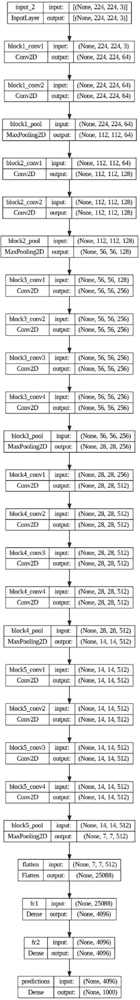
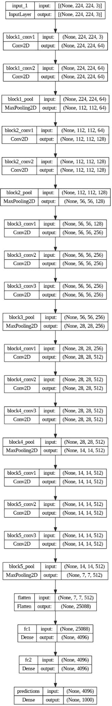
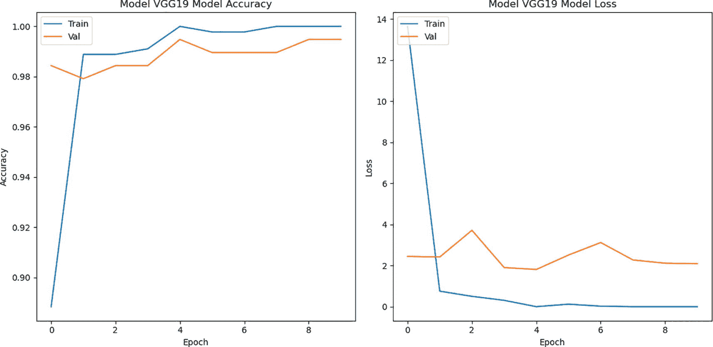
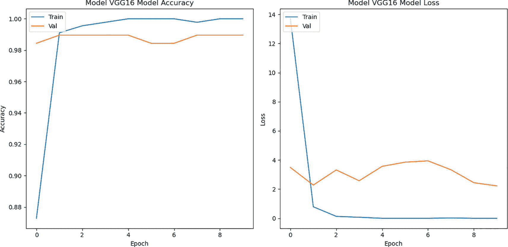
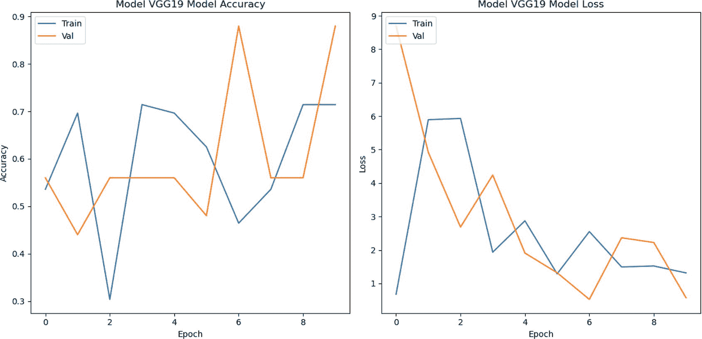
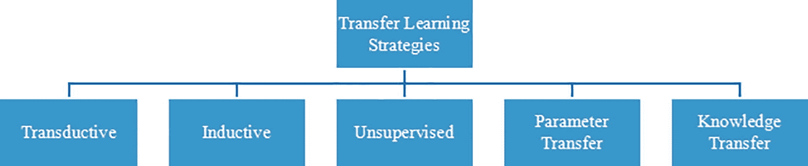

# 8. 迁移学习

## 引言

假设你被分配了开发一个能够分类最近由著名音乐家开发的十种新乐器的应用程序的责任。你只有几百张这些乐器的图片。为了对这些图片进行分类，你决定使用大约有 680 万个参数的 GoogLeNet 架构。如果你决定使用这些图片来训练模型，你会意识到图片数量不足。然而，如果你使用已知乐器的图片来训练模型，你可能能够训练它，但这将需要大量的时间和计算资源。因此，挑战是在没有足够图片的数据集上训练一个足够复杂的模型，而且你可能也没有 GPU。

本章介绍了一种称为迁移学习的方法，这将帮助你处理此类情况。本章讨论了迁移学习的理念、类型、策略和局限性。

## 理念

在迁移学习中，我们在给定数据集上为特定任务训练一个模型。然后

1.  在同一任务中使用其他数据集。例如，假设你旨在开发一个模型，用于从对照组中区分患有阿尔茨海默病的患者。你可以在公开可用的阿尔茨海默病神经影像学倡议（ADNI）数据集上训练该模型，然后使用相同的模型在本地医院收集的数据集上。

1.  我们对于一些其他任务使用相同的模型和相同的数据集。例如，我们开发了一个模型，使用给定的图像来对猫和狗进行分类，然后通过某种方式使用相同的模型对图像的部分进行分割。对此类迁移学习示例感兴趣的读者可以参考本章末尾给出的参考文献。

1.  我们使用相同模型的一部分和新数据集来完成不同的任务。例如，我们通常使用预训练的 VGG 16 模型，并冻结除了最后几层（全连接层）之外的所有初始层，然后训练模型在其他数据集上进行分类。

完成引言中所述任务的一种方法是“**从某些数据集上训练的模型中提取知识，并使用它来完成类似的任务**。”这被称为迁移学习。

这之所以可能，是因为在足够大的数据集上训练的复杂模型的早期层学习**低级特征**，下一层可能学习这些特征的**组合**，依此类推。为了理解这一点，想象你开发了一个模型，并使用一个包含大量面部数据集对其进行训练。模型的早期层学习线条、曲线等。较晚的层学习物体；更晚的层学习眼睛、鼻子等。你可以使用这些信息来对某个特定组织的一些其他面部数据集进行分类，以开发他们的面部识别系统。

## VGG 16 和 VGG 19 用于二分类

VGG 16 和 VGG 19 是两种具有 16 和 19 层的深度卷积神经网络（可训练）。它们在历史上在很多图像相关任务上优于基准测试。VGG 16 模型是“用于大规模图像识别的超深卷积神经网络” [1] 这篇工作的成果。

VGG 16 在包含 1000 个类别、1400 万张图像的 ImageNet 数据集上实现了 92.7% 的前 5 测试准确率。该模型以 224 × 224 × 3 作为输入。它包含两个 3 × 3 的卷积层，后面跟着一个 2 × 2 的最大池化层。这重复了两次。之后，它包含三个 3 × 3 的卷积层，后面跟着一个 2 × 2 的单个最大池化层，这种组合重复了三次。之后是两个大小为 4096 的全连接层，然后是一个有 1000 个神经元的输出层。VGG 19 有类似的架构，但它有 19 层而不是 16 层。图 8-1 和 8-2 展示了 VGG 16 和 VGG 19 的架构。



图 8-2

VGG 19 架构



图 8-1

VGG 16 架构

VGG 16 和 VGG 19 在包含成千上万类别的海量数据集（ImageNet）上进行了训练。这种训练使模型能够学习可泛化的特征，并赋予这些模型捕捉复杂模式的能力；因此，它们在与其他数据集上也能表现出色。

为了能够使用训练过程中收集到的信息，我们通常冻结早期层，并训练这些模型的最后几层。这些模型在许多图像相关任务上表现出良好的性能。

在以下实验（列表 8-1）中，预训练的 VGG 16 和 VGG 19 模型被用于对被诊断为肺结核（TB）的患者和健康对照者的 X 射线图像进行分类。该数据集来自 Kaggle（“[`https://www.kaggle.com/datasets/tawsifurrahman/tuberculosis-tb-chest-xray-dataset`](https://www.kaggle.com/datasets/tawsifurrahman/tuberculosis-tb-chest-xray-dataset)”），包含 400 张健康对照者的图像和 240 张 TB 患者的图像。

给定的图像被调整到 224 × 224 × 3 的形状，以匹配原始模型的输入形状。预训练模型的初始层被冻结以提取低级特征。然后，在上述提到的数据集上训练最后几层，以学习区分 TB 患者和对照者的高级、数据特定的特征。两个模型的损失和性能曲线分别显示在图 8-3 和 8-4 中。



图 8-4

损失和准确率曲线：VGG 19



图 8-3

损失和准确率曲线：VGG 16

```py
#1\. Import the required libraries
import numpy as np
import pandas as pd
from matplotlib import pyplot as plt
import tensorflow as tf
from tensorflow.keras.applications import VGG16, VGG19
from tensorflow.keras.models import Model
from tensorflow.keras.layers import Dense, Dropout, Flatten
from sklearn.model_selection import train_test_split
#2\. Load the dataset
X = np.load('/content /X.npy')
y = np.load('/content /y.npy')
#3\. Split the dataset into train and test set
X_train, X_test, y_train, y_test = train_test_split(X, y, test_size=0.3)
#4\. Load the pre-trained models
base_model_vgg16 = VGG16(weights='imagenet', include_top=False, input_shape=(224, 224, 3))
base_model_vgg19 = VGG19(weights='imagenet', include_top=False, input_shape=(224, 224, 3))
#5\. Freeze the initial layers
for layer in base_model_vgg16.layers:
layer.trainable = False
for layer in base_model_vgg19.layers:
layer.trainable = False
#6\. Create a function to add dense layers for binary classification
def add_custom_layers(base_model):
x = base_model.output
x = Flatten()(x)
x = Dense(1024, activation='relu')(x)
x = Dropout(0.5)(x)
predictions = Dense(1, activation='sigmoid')(x)  # Example for 10 classes
return Model(inputs=base_model.input, outputs=predictions)
#7\. Initialize the new models
model_vgg16 = add_custom_layers(base_model_vgg16)
model_vgg19 = add_custom_layers(base_model_vgg19)
#8\. Compile and fit the above models
model_vgg16.compile(optimizer='adam', loss='binary_crossentropy', metrics=['accuracy'])
model_vgg19.compile(optimizer='adam', loss='binary_crossentropy', metrics=['accuracy'])
history_1 = model_vgg16.fit(X_train, y_train, epochs=10, batch_size=32, validation_data=(X_test, y_test))
history_2 = model_vgg19.fit(X_train, y_train, epochs=10, batch_size=32, validation_data=(X_test, y_test))
#9\. Create a function to plot loss and accuracy curve
def plot_history(history, model_name):
plt.figure(figsize=(12, 6))
plt.subplot(1, 2, 1)
plt.plot(history.history['accuracy'])
plt.plot(history.history['val_accuracy'])
plt.title(f'{model_name} Model Accuracy')
plt.xlabel('Epoch')
plt.ylabel('Accuracy')
plt.legend(['Train', 'Val'], loc='upper left')
plt.subplot(1, 2, 2)
plt.plot(history.history['loss'])
plt.plot(history.history['val_loss'])
plt.title(f'{model_name} Model Loss')
plt.xlabel('Epoch')
plt.ylabel('Loss')
plt.legend(['Train', 'Val'], loc='upper left')
plt.tight_layout()
plt.show()
#10\. Plotting accuracy and loss curves for each model
plot_history(history_1, "Model VGG16")
plot_history(history_2, "Model VGG19")
Output:
Listing 8-1
Binary classification using VGG 16 and VGG 19
```

从上述图中可以看出，两个模型的平均验证准确率分别为 0.9880（VGG 16）和 0.9886（VGG 19）。此外，两个模型的损失曲线之间也存在细微的差异。

让我们再举一个例子来了解迁移学习的应用。以下实验（列表 8-2）采用迁移学习方法，使用 OASIS-1 数据集对阿尔茨海默病患者进行分类。该数据集包括 53 个对照组和 28 个患有阿尔茨海默病（AD）患者的 s-MRI 扫描。灰度图像被调整大小为（224 × 224）。添加了一个额外的 Conv2D 层，通过在三个通道中重复灰度信息以匹配预训练的 VGG 19 模型的输入形状，将单通道输入转换为三个通道。预训练模型的初始层被冻结以提取低级特征。然后，在上述数据集上训练最后几层，以学习区分 AD 患者和对照组的高级、数据特定的特征。模型的损失和性能曲线如图 8-5 所示。



图 8-5

损失和准确率曲线：VGG 19

```py
Code:
#1\. Import the required libraries
import tensorflow as tf
from tensorflow.keras.applications import VGG19
from tensorflow.keras.models import Model
from tensorflow.keras.layers import Input, Conv2D
from tensorflow.keras.layers import Flatten, Dense, Dropout
from tensorflow.keras.optimizers import Adam
import numpy as np
from sklearn.model_selection import train_test_split
import tensorflow as tf
from tensorflow.keras import datasets, layers, models
import matplotlib.pyplot as plt
#2\. Load the dataset
X = np.load('/content /X.npy')
y = np.load('/content /y.npy')
#3\. Split the dataset into train and test set
X_train, X_test, y_train, y_test = train_test_split(X, y, test_size = 0.3, shuffle = True)
print(X_train.shape, y_train.shape, X_test.shape, y_test.shape)
#4\. Load the pre-trained models and freeze the initial layers
base_model = VGG19(weights='imagenet', include_top=False, input_shape=(224, 224, 3))
for layer in base_model.layers:
layer.trainable = False
#5\. Create a new input layer for grayscale images
new_input = Input(shape=(224, 224, 1))
#6\. Add a Conv2D layer to convert grayscale images to 3 channels
x = Conv2D(3, (3, 3), padding='same')(new_input)
x = base_model(x)
x = Flatten()(x)
x = Dense(1024, activation='relu')(x)
x = Dropout(0.5)(x)
x = Dense(1, activation='sigmoid')(x)
#7\. Create, compile and fit the new model
model = Model(inputs=new_input, outputs=x)
model.compile(optimizer=Adam(),loss='binary_crossentropy', metrics=['accuracy'])
model.summary()
batch_size = 64
history_batch = model.fit(X_train, y_train, epochs=10, batch_size=batch_size, validation_data=(X_test, y_test))
#8\. Create a function to plot loss and accuracy curve
def plot_history(history, model_name):
plt.figure(figsize=(12, 6))
plt.subplot(1, 2, 1)
plt.plot(history.history['accuracy'])
plt.plot(history.history['val_accuracy'])
plt.title(f'{model_name} Model Accuracy')
plt.xlabel('Epoch')
plt.ylabel('Accuracy')
plt.legend(['Train', 'Val'], loc='upper left')
plt.subplot(1, 2, 2)
plt.plot(history.history['loss'])
plt.plot(history.history['val_loss'])
plt.title(f'{model_name} Model Loss')
plt.xlabel('Epoch')
plt.ylabel('Loss')
plt.legend(['Train', 'Val'], loc='upper left')
plt.tight_layout()
plt.show()
#9\. Plot accuracy and loss curve for the above model
plot_history(history_batch, "Model VGG19")
Output:
Listing 8-2
Alzheimer’s classification using VGG 19
```

## 类型与策略

迁移学习的一个重要方面是其转换表示的能力。正如[2]中所述的一个有趣的例子如下。

假设你需要对两个类别进行分类，其中二维坐标系表示为一个圆（类别 I）在另一个圆内（类别 II），并且这个模型以某种方式将这种分布转换为线性可分的一个；那么分类将变得更容易。有时迁移学习将给定的数据空间转换为一个相对容易分类的特征集。

根据[2]，迁移学习的领域包括特征空间和概率分布，而任务包括标签空间。概率*P*(*X*|*Y*)是从一个从特征向量和标签空间学习的函数中导出的。迁移学习也可以分为以下类型：

1.  当特征空间不相等时：假设你被要求开发一个软件，将给定的算法转换成 Scala 或 F#等函数式语言中的代码。请注意，软件的输入是英文，而输出是复杂的函数式语言。在这种情况下，特征空间是不相同的。可以使用类似跨语言适应的概念来处理这种情况。在这种情况下，迁移学习将帮助你。

1.  当源和目标的数据边缘概率分布不同时：考虑一个场景，你需要开发一个模型来区分猫和狗。该模型随后在从互联网上获得的高清图片上进行训练。这样开发的应用程序旨在供中下阶层的人使用，他们使用手机点击猫和狗的图片，这些图片质量不高。在这种情况下，源和目标的数据概率分布不同，迁移学习可以帮助。

1.  当标签不同时：假设你使用动物图像训练你的模型，而该模型将被用于分类不同类型的猫。在这里，与原始数据集开发的原始模型相比，所需的模型的标签不同。

1.  当标签的条件概率不同时：当你使用平衡数据集训练模型，然后将其用于不平衡数据集时。

迁移学习很复杂，是否使用它可以根据

1.  需要执行的任务

1.  领域

1.  数据的可用性

对于上述策略的详细讨论，感兴趣的读者可以参考本章末尾给出的参考文献。研究者[2]提出了许多迁移学习策略，如图 8-6 所示。



图 8-6

迁移学习策略

感兴趣的读者可以参考本章末尾给出的参考文献。

## 迁移学习的局限性和应用

尽管迁移学习很棒，但它有很多局限性。如果目标数据集与原始数据集没有任何相似之处，那么迁移学习将不起作用。例如，如果你使用狗和猫的图像训练你的模型，然后在特定的大脑相关疾病上测试它，那么模型注定会失败。同样，如果你的目标集中标签的数量很大，那么模型可能不会很好地工作。迁移学习可能不起作用的一些情况如下：

+   当训练数据不足时，迁移学习可能不起作用。在某些情况下，用于当前任务的训练数据可能与训练数据不相似，或者存在领域不匹配或任务不匹配。在这种情况下，迁移学习通常会失败。

+   除了上述内容之外，目标数据的大小也决定了我们是否可以使用迁移学习。如果目标数据的大小很小，可能会出现过拟合的风险；同样，如果目标数据太大，迁移学习可能无法捕捉到数据的复杂性。在迁移学习中，冻结错误层也可能影响网络的性能。

迁移学习的一些显著应用包括

+   使用在类似疾病上训练的模型对疾病进行分类

+   与自动驾驶汽车相关的任务

+   自然语言处理

+   识别稀有元素等

## 结论

人们普遍认为，深度学习只有在有大量数据的情况下才能应用。按照普遍的看法，训练深度学习模型需要消耗大量的计算能力 [3, 4]。然而，对于许多实际任务，这可能不是必需的。我们可以从特定的来源学习微观或中级特征，并将所获得的知识应用于其他任务或数据集 [5]。本章介绍了迁移学习，并解释了迁移学习的需求、类型和实现。阅读本章后，读者必须已经意识到，对于与收集这些数据集无关的任务，需要大量的数据集。我们看到了如何提取表示，以及如何通过迁移学习对某些混合任务进行微调。

下一章将读者带入迷人的序列世界，在这个世界里，文字相互嬉戏，编织散文和诗歌。我们将研究那些帮助我们理解和玩转序列的模型。

## 练习

### 多选题

1.  以下哪个例子说明了在迁移学习中特征空间不相等的场景？

    1.  翻译英文到西班牙文

    1.  将算法转换为功能性语言（如 Scala 或 F#）的代码

    1.  将英文翻译成法文

    1.  将数学方程式转换为图表

1.  哪种场景可以说明源和目标边缘概率分布不同的情况？

    1.  将算法翻译成功能性语言的代码

    1.  使用高清图片区分猫和狗的模型，并将其应用于低质量手机照片

    1.  使用训练在动物图像上的模型对不同的猫进行分类

    1.  将一本书从一种语言翻译成另一种语言

1.  哪个因素不会影响使用迁移学习的决策？

    1.  要执行的任务

    1.  定义域

    1.  数据的可用性

    1.  所使用的编程语言

1.  关于迁移学习的哪个陈述是正确的？

    1.  它总是需要大量的数据。

    1.  当特征空间相等时，它可以帮助。

    1.  它使得在更少的数据和计算能力下开发深度学习模型成为可能。

    1.  它仅在自然语言处理任务中才有用。

1.  文中提到的迁移学习的优点是什么？

    1.  它需要更多的数据和计算能力。

    1.  它允许在更少的数据和计算能力下进行分类。

    1.  它消除了训练模型的需求。

    1.  它总是产生更高精度的模型。

1.  哪种类型的迁移学习涉及开发将给定算法转换为功能性语言（如 Scala 或 F#）代码的软件？

    1.  当特征空间不相等时

    1.  当边缘概率分布不同

    1.  当标签不同时

    1.  当标签的条件概率不同

### 应用

1.  收集以下流行节目《菲尼克斯与弗林伯恩》中每个角色的 100 张图片：

    1.  菲尼克斯·弗林

    1.  菲伯·费彻

    1.  坎迪斯·弗林

    1.  澳洲鸭·佩里

    1.  海因茨·杜芬施米茨博士

    1.  伊莎贝拉·加西亚-夏皮罗

    1.  巴尔杰特·蒂恩德

    1.  巴夫德·范·斯托姆

    1.  林达·弗林-费彻

    1.  拉尔夫·费彻

    1.  主要徽标

    1.  卡尔·实习生

1.  现在，创建一个 CNN 模型来分类上述类别。现在使用预训练的 VGG 16 和 VGG 19 模型来分类图像。您可以在全连接层中使用不同数量的神经元，并报告性能。

## 参考文献

1.  西蒙扬，K. & 赞瑟曼，A. 非常深的卷积神经网络用于大规模图像识别。*arXiv (康奈尔大学)* (2014 年)。[`doi.org/10.48550/arxiv.1409.1556`](https://doi.org/10.48550/arxiv.1409.1556)

1.  普罗托帕帕斯，P. 转移学习简介。在 *高级实用数据科学* (第 AC295 页) (2021 年)。[`harvard-iacs.github.io/2020F-AC295/lectures/lecture5/presentation/lecture5.pdf`](https://harvard-iacs.github.io/2020F-AC295/lectures/lecture5/presentation/lecture5.pdf)

1.  约翰逊，J. (2020 年 10 月 7 日). *第 11 讲：训练神经网络（第二部分）*. [`web.eecs.umich.edu/~justincj/slides/eecs498/FA2020/598_FA2020_lecture11.pdf`](https://web.eecs.umich.edu/~justincj/slides/eecs498/FA2020/598_FA2020_lecture11.pdf)

1.  帕萨，A.，韦亨克尔，A.，赛迪，H.，梁，P. & 曾，D. *CS 330 讲座 3 转移学习 + 元学习开始*. [`web.stanford.edu/class/cs330/lecture_slides/cs330_transfer_meta_learning.pdf`](https://web.stanford.edu/class/cs330/lecture_slides/cs330_transfer_meta_learning.pdf)

1.  莱顿，O. *CS 343 | 笔记*. [`cs.colby.edu/courses/F22/cs343/notes.html`](https://cs.colby.edu/courses/F22/cs343/notes.html)
