# 9. 循环神经网络

## 简介

考虑一个名叫 Nishant 的人，他即将去见一个重要人物。仅通过查看图 9-1 中的图像，你能猜到他要去哪里吗？你的答案最多只是一个随机猜测。现在，如果你给出了这个人在过去五个时间戳的位置，你需要猜测下一个时间戳的位置，你的工作会变得容易一些。你的答案现在基于表示各个时间间隔位置的序列。


图 9-1

如果没有给出上下文，你能猜到这个人会去哪里吗？(由[`https://pixlr.com/image-generator/`](https://pixlr.com/image-generator/)生成的图像)

在许多情况下，如果已知序列在先前时间戳的值，那么猜测下一个时间戳的位置就变得容易了。你能将同样的类比应用到股票价格上，给定其过去几周的价格吗？实际上这是可行的。同样，音乐和文本数据中的元素也构成了序列。为了处理序列数据，我们需要稍微不同类型的模型。为了理解为什么需要不同类型的模型，让我们首先尝试使用神经网络来解决这个问题。

假设 *X*[1]，*X*[2]…*X*[*k*] 是序列在不同时间戳的值。为了预测下一个时间戳的序列值，我们创建了一个如图 9-2 所示的神经网络。您使用这样的序列来训练这个网络。然而，网络可能表现不佳。(为什么？)

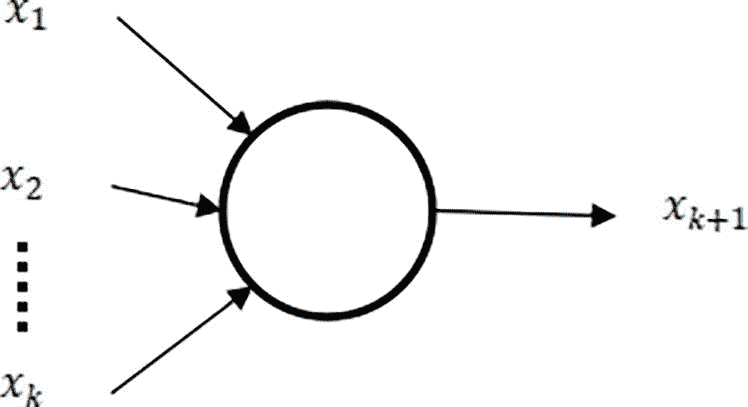

图 9-2

使用神经网络处理序列数据

为了完成上述任务，我们需要特殊类型的网络，这些网络由独立的单元组成，其中 *x*[0] 预测 *y*[0]，*x*[1] 预测 *y*[1]，*x*[2] 预测 *y*[2]。 (在时间戳 0 时，输入的值是 *x*[0]，输出的值是 *y*[0]。同样，在时间戳 1 时，输入的值是 *x*[1]，输出的值是 *y*[1]。) 如果我们要预测 *y*[*k*]，那么它不仅依赖于 *x*[*k*]，它还可能依赖于先前的输入。让我们深入探讨一下！

## 为什么神经网络不能推断序列

考虑一个序列 {*x*[1]，*x*[2]，*x*[3]，…*x*[*n*]}，其中 *x*[1] 是时间 *t*[1] 的值，*x*[2] 是时间 *t*[2] 的值，以此类推。我们的目标是设计一个能够理解这个序列的模型。也就是说，预测下一个时间戳的值。我们从完全连接的神经网络开始，它接受 k 个值并预测下一个值。例如，如果 k 的值是 4，那么模型将接受{*x*[1]，*x*[2]，*x*[3]，*x*[4]}作为输入并预测 *x*[5]；然后接受{*x*[2]，*x*[3]，*x*[4]，*x*[5]}作为输入并预测 *x*[6]；以此类推（图 9-3）。为了完成这个任务，我们创建了一个输入层有四个神经元，输出层有一个神经元的神经网络。

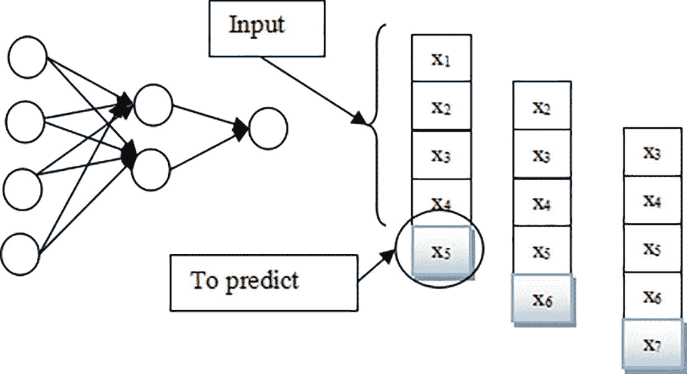

图 9-3

神经网络用于预测序列的下一个元素。在 t=1 时，序列的前四个元素作为输入给出，网络预测第五个元素。

以这种方式划分输入数据被称为**重叠窗口**。如果模型用足够的数据进行训练，它可能会开始预测下一个元素。然而，如果元素的顺序发生变化（例如 {*x*[3]，*x*[2]，*x*[1]，*x*[4]}），模型仍然预测相同的值 (*x*[5])。这是因为神经网络不理解上下文。然而，对于处理序列数据的程序员来说，这可能是灾难性的。例如，考虑以下句子的这部分并尝试预测下一个词：

“在一个叫做香格里拉的地方，一个人用他的超速汽车杀死了最富有的人之一的孩子。他应该去……”

在这里，“监狱”应该是下一个明显的词。然而，对于以下句子

“在一个叫做香格里拉的地方，最富有的人之一的孩子用他的超速汽车杀死了一个人。他应该去……”

由于这里是香格里拉，下一个词并不明显；它可以是“监狱”或“写作课”。因此，一个全连接网络可能无法生成正确的（预期的）答案。

这是因为，对于一个全连接神经网络，输出是输入的某个函数。本章讨论的序列模型可以推断序列中的模式并从中提取时间信息。如前所述，序列无处不在，从文本到声音再到时间序列。除了上述内容之外，神经网络和序列模型之间还有一个显著的区别，那就是序列模型可以处理可变长度的数据集。

## 理念

序列模型中的一个单元预期要提取特定元素的内容，因此它应该记住有关序列中早期元素的一些信息。也就是说，它应该有记忆。我们可以使用循环单元来完成这个任务。在循环单元中，我们给出输入，它产生输出，并且有一个隐藏状态。让与输入相关的权重为 *W*[*xh*]，与输出相关的权重为 *W*[*yh*]，与隐藏状态相关的权重为 *W*[*hh*]。随着每个输入，这些权重都会更新。

循环神经网络（RNN）的单元（图 9-4）可以被认为是有一个与权重 *W*[*xh*] 相关的输入 *x*^(<*t*>)，一个与权重 *W*[*hy*] 相关的输出 *y*^(<*t*>)，以及一个与权重 *W*[*hh*] 相关的隐藏状态 *h*^(<*t*>)。请注意，输入和输出随时间“t”变化，而权重在所有时间戳上保持不变。当我们展开不同时间戳时，我们得到如图 9-4 所示的架构。

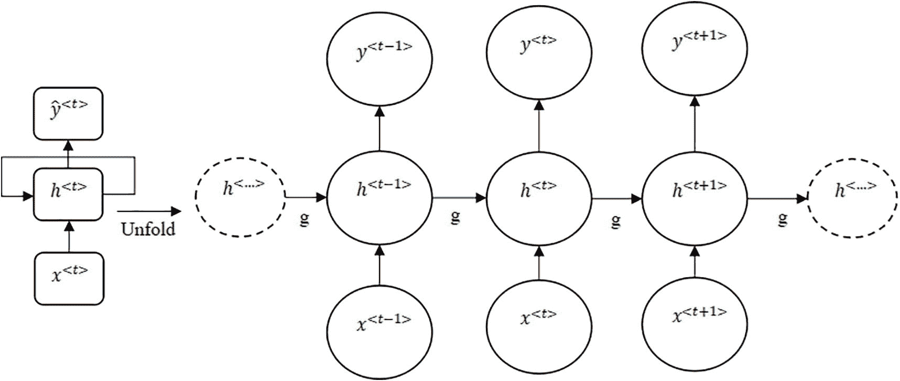

图 9-4

循环神经网络

注意，上述只是架构的一种类型；还有三种类型的 RNN，将在以下章节中讨论。这个架构中的权重使用称为时间反向传播（BPTT）的算法进行更新，将在下一节中讨论。

## 时间反向传播

考虑一个长度为“T”的序列，并且只在展开的网络（K 个单元）上应用前向和反向传播。如前所述，我们有两个激活函数，一个用于隐藏状态，一个用于输出。时间 t 的隐藏状态和输出的值在以下方程中给出：

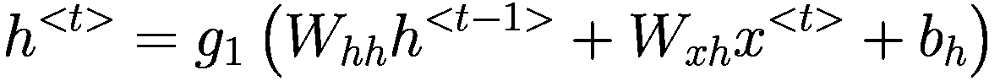

(1)

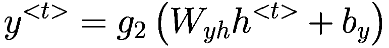

(2)

总损失是时间 t 的损失的累加：

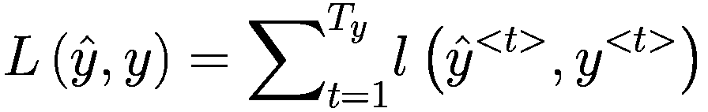

然后找到损失相对于权重的导数，根据链式法则变为 $ *y*^{<*t*>} = *g*2) + *b*[*y*]) （从方程 (1) 到方程 (2) 替换 $ *h*^{<*t*>} $ 的值）：

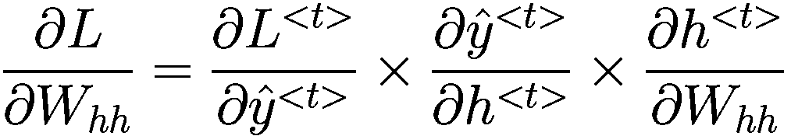

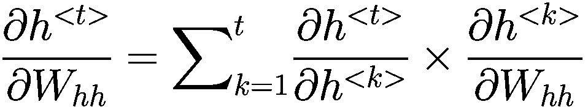


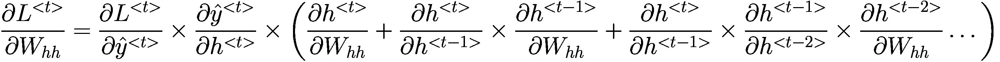

使用这个公式，我们可以更新网络的权重。注意，如果序列非常长，那么梯度要么爆炸，要么消失。为了处理梯度爆炸，我们在 k 个时间戳后更新梯度。

## RNN 类型

RNN 可以接受单个输入或多个输入，并输出单个向量或多个向量。基于此，RNN 可以分为四种类型：

1.  一对一

1.  一对多

1.  多对一

1.  多对多

如图 9-5 所示的**一对一 RNN**可以被视为一个正常的神经网络。它接受输入，产生一些输出，并有一些隐藏状态。

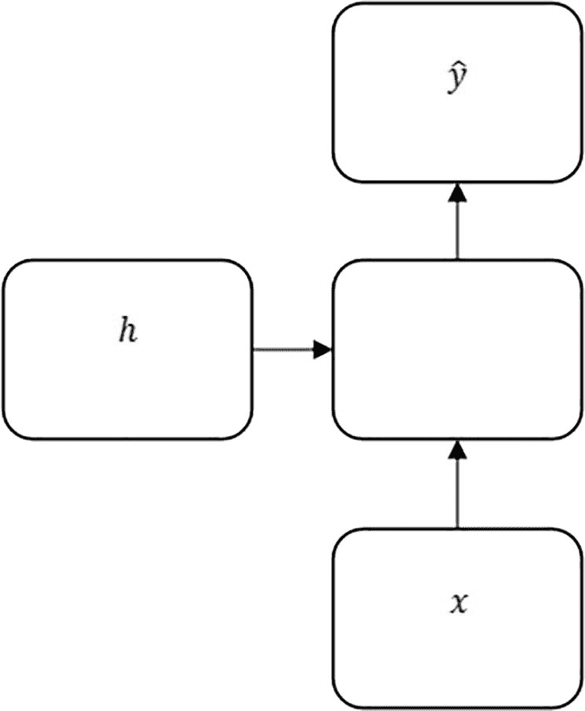

图 9-5

一对一 RNN

如图 9-6 所示的**一对多 RNN**接受输入并在不同的时间戳产生输出。在这里，*x*是输入，*y*^(<*t*>)是第*t*^(*th*)时间戳的输出，而*h*^(<*t*>)是第*t*^(*th*)时间戳的激活。

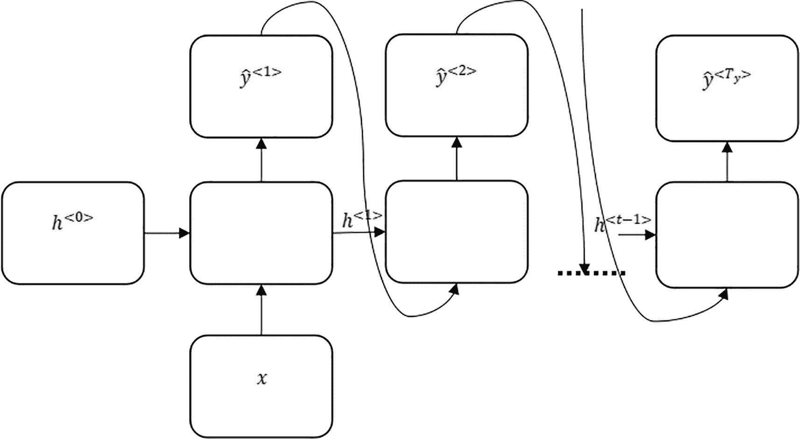


一对多 RNN

这些架构在以下应用中被使用：

+   图像标题

+   音乐生成

如图 9-7 所示的**多对一 RNN**在每个时间戳接受输入并在*t*^(*th*)时间戳产生输出。在这里，*x*^(<*t*>)是输入，*y*^(<*t*>)是输出，而*h*^(<*t*>)是第*t*^(*th*)时间戳的激活。

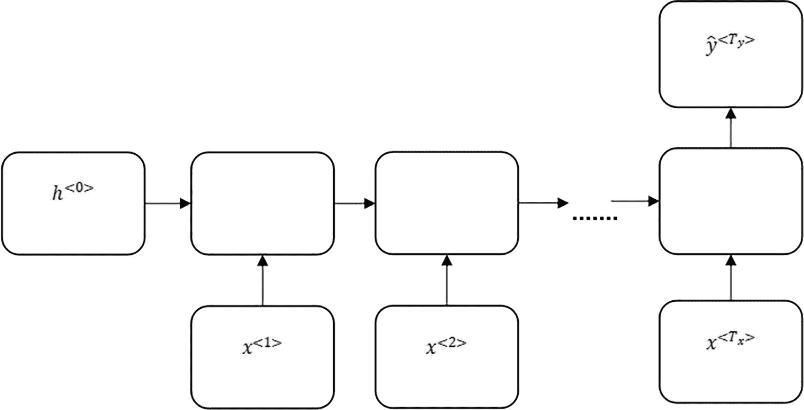

图 9-7

多对一 RNN

这些架构在以下一些突出的应用中被使用：

+   情感分析

+   垃圾邮件检测

+   股价预测

如图 9-8 所示的**多对多 RNN**在不同的时间戳接受输入并在*t*^(*th*)时间戳产生输出。在这里，*x*^(<*t*>)是输入，*y*^(<*t*>)是输出，而*h*^(<*t*>)是第*t*^(*th*)时间戳的激活。

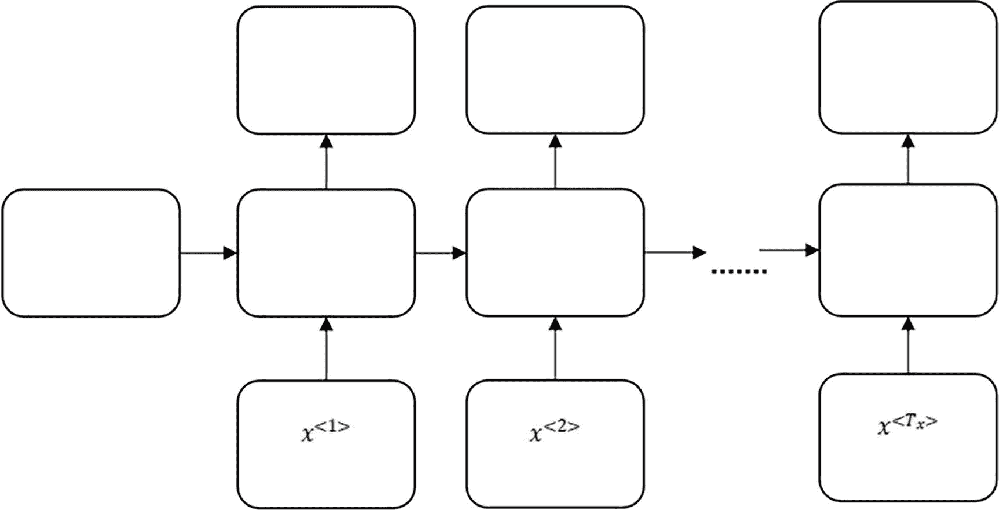

图 9-8

用于词性标注的部分的多对多 RNN

另一种类型的**多对多 RNN**架构由两部分组成，编码器和解码器（见图 9-9）。编码器类似于多对一架构，而解码器是一对多。在诸如语言翻译等任务中，这些架构被使用。

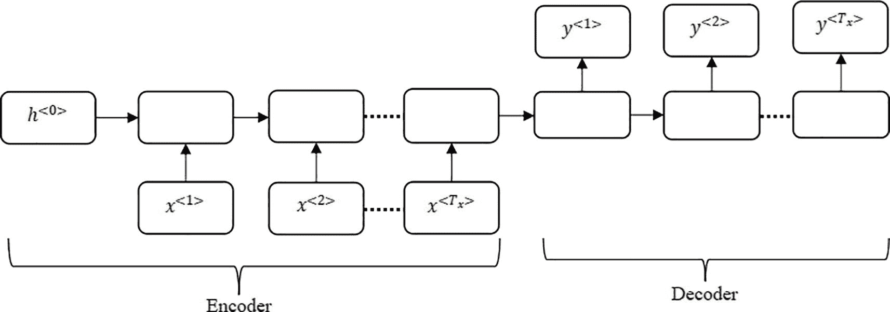

图 9-9

多对多 RNN：编码器和解码器类型

## 应用

RNN 用于序列建模。它们（或最新的序列模型）通常用于完成以下任务：

+   情感分析

+   手写文本识别

+   图像字幕

+   机器翻译

+   语音到文本转换

等等。第一个是一个多对一网络的例子；第二个和第三个是一对多模型的例子。第四个使用多对多模型。最后一个任务可以使用本章后面讨论的模型来完成。让我们详细探讨一些这些例子。

### 情感分类

情感分析可以使用多对一 RNN 实现，其中输入是 X（文本，由一系列单词组成）和输出是表示情感的整数 y。在这里，X 的长度与句子的长度相同。然而，每个句子的长度可能不同，因此我们考虑一个最大长度，并且用零或固定数字填充没有那么多单词的句子。

现在的问题是将句子的单词转换为嵌入。考虑每个单词被表示为 m 个数字的嵌入。如果考虑句子的最大长度为 n，则句子将被表示为 *n* × *m* 维度的二维数组。因此，在每个迭代中，模型使用句子 X，*x*[*i*] ∈ *X* 和 *x*[*i*] ∈ *R*^(*m*)，以及 *y* ∈ (0, 1) 进行训练，在二分类的情况下，否则等于情感的数量。

以下列表 9-1 将给定的句子分类为正面或负面情感。创建了四个不同的 RNN 模型，并在 IMDB 电影评论情感数据集上进行了评估。该数据集包含 50,000 部电影评论，正面和负面情感均匀分布。数据集经过预处理，包括去除停用词、分词和填充评论。创建了四个模型，包括一个具有单层 32 个单元的简单 RNN、一个具有两层每层 32 个单元的堆叠 RNN、一个具有单层 32 个单元的双向 RNN，以及一个具有两层每层 32 个单元的堆叠双向 RNN。准确率和损失随训练轮数的变化在图 9-10 到图 9-13 中显示。每个模型的平均验证准确率已计算并显示在表 9-1 中。

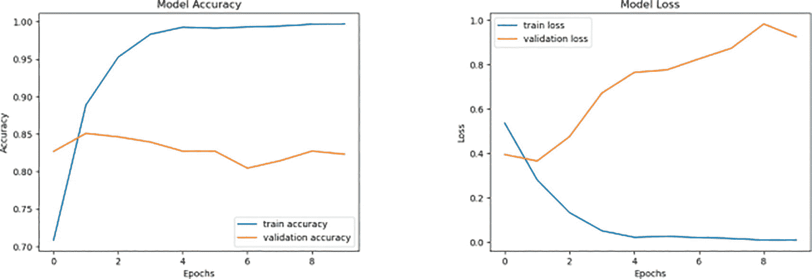

图 9-13

损失和准确率曲线：模型 4

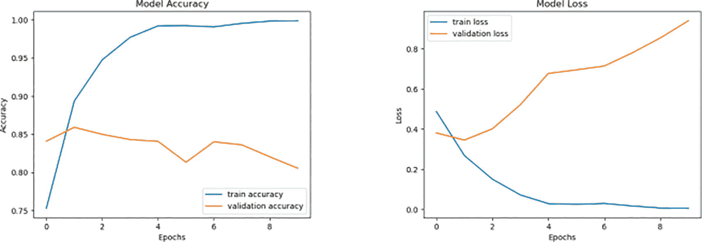

图 9-12

损失和准确率曲线：模型 3

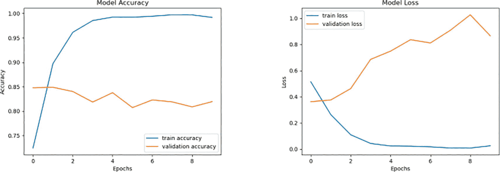

图 9-11

损失和准确率曲线：模型 2

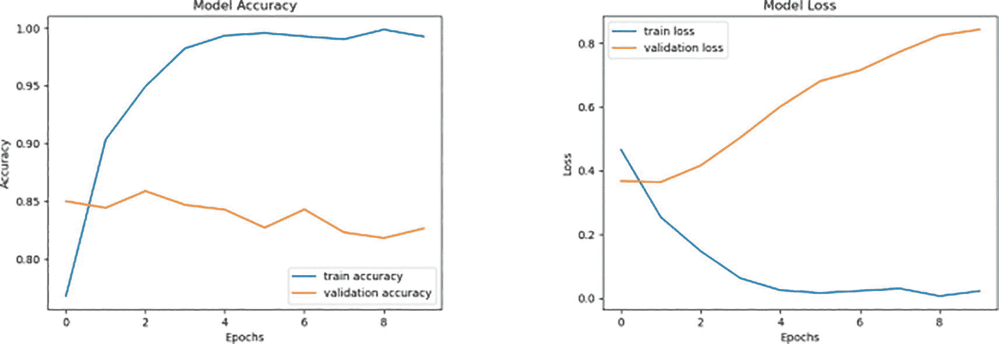

图 9-10

损失和准确率曲线：模型 1

```py
Code:
# 1\. Import the IMDB dataset from tensorflow.keras.datasets, stopwords from nltk.corpus.The tensorflow.keras.models, tensorflow.keras.layers are imported to design a sequential model having Embedding, RNN, and Bidirectional layers.
import numpy as np
from tensorflow.keras.datasets importimdb
from tensorflow.keras.preprocessing.sequence import pad_sequences
from tensorflow.keras.preprocessing.text import Tokenizer
from nltk.corpus import stopwords
import nltk
from tensorflow.keras.models import Sequential
from tensorflow.keras.layers import Embedding, SimpleRNN, Dense, Bidirectional
from matplotlib import pyplot as plt
# 2\. The stopwords are downloaded from NLTK
nltk.download('stopwords')
# 3\. The IMDB dataset is downloaded and limited to the top 10,000 most frequent words.
max_features = 10000
(X_train, y_train), (X_test, y_test) = imdb.load_data(num_words=max_features)
# 4\. Create a reverse dictionary to decode reviews back to words
word_index = imdb.get_word_index()
reverse_word_index = dict([(value, key) for (key, value) in word_index.items()])
# 5\. Create a function to decode reviews from sequences of integers to words
def decode_review(encoded_review):
return ' '.join([reverse_word_index.get(i - 3, '?') for i in encoded_review])
# 6\. Decode all reviews in the training and test sets
decoded_train = [decode_review(review) for review in X_train]
decoded_test = [decode_review(review) for review in X_test]
# 7\. Remove the stop words from the reviews
stop_words = set(stopwords.words('english'))
def remove_stop_words(text):
return ' '.join([word for word in text.split() if word not in stop_words])
cleaned_train = [remove_stop_words(review) for review in decoded_train]
cleaned_test = [remove_stop_words(review) for review in decoded_test]
# 8\. Tokenize the cleaned reviews using the Tokenizer function imported from tensorflow.keras.preprocessing.text
tokenizer = Tokenizer(num_words=max_features)
tokenizer.fit_on_texts(cleaned_train)
# 9\. Convert the tokenized reviews to sequences
train_sequences = tokenizer.texts_to_sequences(cleaned_train)
test_sequences = tokenizer.texts_to_sequences(cleaned_test)
# 10\. Pad the sequences to ensure they all have the same length
maxlen = 100
X_train = pad_sequences(train_sequences, maxlen=maxlen)
X_test = pad_sequences(test_sequences, maxlen=maxlen)
# 11\. Create a function to create, compile, and train a model
def compile_and_train(model, epochs=10):
model.compile(optimizer='adam', loss='binary_crossentropy', metrics=['acc'])
history = model.fit(X_train, y_train, epochs=epochs, batch_size=32,validation_split=0.3)
return history
# 12\. Create a functionto plot the accuracy and loss curves from the history obtained of the trained model.
def plot_history(history, title):
plt.figure(figsize=(12, 6))
plt.plot(history.history['acc'], label='Train Accuracy')
plt.plot(history.history['val_acc'], label='Validation Accuracy')
plt.title(f'{title} Accuracy')
plt.xlabel('Epochs')
plt.ylabel('Accuracy')
plt.legend()
plt.show()
plt.figure(figsize=(12, 6))
plt.plot(history.history['loss'], label='Train Loss')
plt.plot(history.history['val_loss'], label='Validation Loss')
plt.title(f'{title} Loss')
plt.xlabel('Epochs')
plt.ylabel('Loss')
plt.legend()
plt.show()
# 13\. Model1
model_1 = Sequential()
model_1.add(Embedding(max_features, 32))
model_1.add(SimpleRNN(32))
model_1.add(Dense(1, activation='sigmoid'))
history_1 = compile_and_train(model_1)
plot_history(history_1, 'Simple RNN')
# 14\. Model 2
model_2 = Sequential()
model_2.add(Embedding(max_features, 32))
model_2.add(SimpleRNN(32, return_sequences=True))
model_2.add(SimpleRNN(32))
model_2.add(Dense(1, activation='sigmoid'))
history_2 = compile_and_train(model_2)
plot_history(history_2, 'Stacked Simple RNN')
# 15\. Model3
model_3 = Sequential()
model_3.add(Embedding(max_features, 32))
model_3.add(Bidirectional(SimpleRNN(32)))
model_3.add(Dense(1, activation='sigmoid'))
history_3 = compile_and_train(model_3)
plot_history(history_3, 'Bidirectional Simple RNN')
# 16\. Model 4
model_4 = Sequential()
model_4.add(Embedding(max_features, 32))
model_4.add(Bidirectional(SimpleRNN(32, return_sequences=True)))
model_4.add(Bidirectional(SimpleRNN(32)))
model_4.add(Dense(1, activation='sigmoid'))
history_4 = compile_and_train(model_4)
plot_history(history_4, 'Stacked Bidirectional Simple RNN')
# 17\. Calculate the mean validation accuracy for each model
mean_accuracies = {
'Simple RNN': np.mean(history_1.history['val_acc']),
'Stacked Simple RNN': np.mean(history_2.history['val_acc']),
'Bidirectional Simple RNN': np.mean(history_3.history['val_acc']),
'Stacked Bidirectional Simple RNN': np.mean(history_4.history['val_acc'])
}
# 18\. Print the mean validation accuracy for each model
for model_name, mean_acc in mean_accuracies.items():
print(f"{model_name} mean validation accuracy: {mean_acc:.4f}")
Output:
Listing 9-1
Sentiment classification using the IMDB dataset
```

上述实验的结果总结在表 9-1 中。

表 9-1

IMDB 数据集上四个不同 RNN 模型的平均验证准确率

| 架构 | 平均验证准确率 |
| --- | --- |
| 单层 32 个单元的简单 RNN | 0.8325 |
| 每层有 32 个单元的堆叠 RNN | 0.8173 |
| 单层 32 个单元的双向 RNN | 0.8323 |
| 每层有 32 个单元的堆叠双向 RNN | 0.8031 |

看过了一个多对一模型的示例后，让我们来看看多对多模型的示例。

### 词性标注

词性标注（POS）将句子中的每个词映射到相应的词性。它可以使用一个多对多 RNN 模型实现，其中输入是一个句子，输出是每个词性的对应数字。考虑以下句子：

“Nishant is traveling to the United States to pursue a postgraduate degree.”

上述句子中每个词对应的词性如下：

+   Nishant: 名词

+   is: 动词

+   traveling: 动词

+   to: 介词

+   the: 冠词

+   United States: 名词

+   to: 介词

+   pursue: 动词

+   a: 冠词

+   postgraduate: 名词

+   degree: 名词

现在的问题是将句子的单词转换为嵌入。考虑每个单词被表示为 m 个数字的嵌入，如果考虑句子的最大长度为 n，则句子表示为维度为*n* × *m*的二维数组。因此，在每个迭代中，模型使用句子 X，*x*[*i*] ∈ *X*和*x*[*i*] ∈ *R*^(*m*)，*y* ∈ (1, 2, 3, …)等于词性的数量进行训练。

NLTK 提供的宾州树库数据集包含英语的标记句子，包含来自各种来源的 450 多万个美式英语单词。数据集通过提取唯一单词和标签、将它们映射到索引以及将句子转换为单词索引和相应标签索引的序列进行预处理。实现了四种不同的 RNN 架构（列表 9-2），使用***Keras***。**模型 1**使用了一个包含 64 个单元的单层简单 RNN。**模型 2**使用了包含 64 个单元的两个层的堆叠简单 RNN。**模型 3**使用了一个包含 64 个单元的单层双向 RNN。**模型 4**包含了一个包含 64 个单元的两个层的堆叠双向 RNN。每个模型都使用 32 个批次的 32 个 epoch 进行训练。每个模型的准确率和损失曲线显示在图 9-14 到图 9-17 中。计算了每个模型架构的平均验证准确率，并显示在表 9-2 中。

```py
Code:
#1\. Import the treebank dataset from nltk.corpus. The tensorflow.keras.models, tensorflow.keras.layers are imported to design a sequential model having Embedding, RNN, Bidirectional, and TimeDistributed layers.
import numpy as np
import tensorflow as tf
from tensorflow.keras.preprocessing.sequence import pad_sequences
from tensorflow.keras.utils import to_categorical
from tensorflow.keras.models import Sequential
from tensorflow.keras.layers import Embedding, SimpleRNN, Dense, TimeDistributed, Bidirectional
import matplotlib.pyplot as plt
import nltk
from sklearn.model_selection import train_test_split
from nltk.corpus import treebank
nltk.download('treebank')
#2\. Create a function to load the treebank dataset
def load_data():
sentences = treebank.tagged_sents()
return sentences
#3.Create a function to prepare the data by creating dictionaries for word-to-index and tag-to-index mappings
def preprocess_data(sentences):
words = set()
tags = set()
for sentence in sentences:
for word, tag in sentence:
words.add(word)
tags.add(tag)
word2idx = {w: i + 2 for i, w in enumerate(words)}
word2idx["PAD"] = 0  # Padding token
word2idx["UNK"] = 1  # Unknown token
tag2idx = {t: i + 1 for i, t in enumerate(tags)}
tag2idx["PAD"] = 0  # Padding tag
idx2word = {i: w for w, i in word2idx.items()}
idx2tag = {i: t for t, i in tag2idx.items()}
return word2idx, tag2idx, idx2word, idx2tag
#4\. Load and pre-process the dataset using the above functions
sentences = load_data()
word2idx, tag2idx, idx2word, idx2tag = preprocess_data(sentences)
#5\. Create a function to convert sentences to sequences of indices
def convert_sentences_to_sequences(sentences, word2idx, tag2idx):
X = [[word2idx.get(word, word2idx["UNK"]) for word, _ in sentence] for sentence in sentences]
y = [[tag2idx[tag] for _, tag in sentence] for sentence in sentences]
return X, y
#6\. Convert the sentences to padded sequences and one-hot encoded labels
X, y = convert_sentences_to_sequences(sentences, word2idx, tag2idx)
max_len = 50  # Maximum sequence length
X = pad_sequences(X, maxlen=max_len, padding="post")
y = pad_sequences(y, maxlen=max_len, padding="post")
y = [to_categorical(i, num_classes=len(tag2idx)) for i in y]
#7\. Split the dataset into training and test sets
X_train, X_test, y_train, y_test = train_test_split(X, y, test_size=0.1)
#8\. Model 1
model_1 = Sequential()
model_1.add(Embedding(input_dim=len(word2idx), output_dim=64, input_length=max_len))
model_1.add(SimpleRNN(units=64, return_sequences=True, recurrent_dropout=0.1))
model_1.add(TimeDistributed(Dense(len(tag2idx), activation="softmax")))
model_1.compile(optimizer="adam", loss="categorical_crossentropy", metrics=["accuracy"])
history_1 = model_1.fit(X_train, np.array(y_train), batch_size=32, epochs=5, validation_data=(X_test, np.array(y_test)), verbose=1)
#9\. Model 2
model_2 = Sequential()
model_2.add(Embedding(input_dim=len(word2idx), output_dim=64, input_length=max_len))
model_2.add(SimpleRNN(units=64, return_sequences=True, recurrent_dropout=0.1))
model_2.add(SimpleRNN(units=64, return_sequences=True, recurrent_dropout=0.1))
model_2.add(TimeDistributed(Dense(len(tag2idx), activation="softmax")))
model_2.compile(optimizer="adam", loss="categorical_crossentropy", metrics=["accuracy"])
history_2 = model_2.fit(X_train, np.array(y_train), batch_size=32, epochs=5, validation_data=(X_test, np.array(y_test)), verbose=1)
#10\. Model 3
model_3 = Sequential()
model_3.add(Embedding(input_dim=len(word2idx), output_dim=64, input_length=max_len))
model_3.add(Bidirectional(SimpleRNN(units=64, return_sequences=True, recurrent_dropout=0.1)))
model_3.add(TimeDistributed(Dense(len(tag2idx), activation="softmax")))
model_3.compile(optimizer="adam", loss="categorical_crossentropy", metrics=["accuracy"])
history_3 = model_3.fit(X_train, np.array(y_train), batch_size=32, epochs=5, validation_data=(X_test, np.array(y_test)), verbose=1)
#11\. Model 4
model_4 = Sequential()
model_4.add(Embedding(input_dim=len(word2idx), output_dim=64, input_length=max_len))
model_4.add(Bidirectional(SimpleRNN(units=64, return_sequences=True, recurrent_dropout=0.1)))
model_4.add(Bidirectional(SimpleRNN(units=64, return_sequences=True, recurrent_dropout=0.1)))
model_4.add(TimeDistributed(Dense(len(tag2idx), activation="softmax")))
model_4.compile(optimizer="adam", loss="categorical_crossentropy", metrics=["accuracy"])
history_4 = model_4.fit(X_train, np.array(y_train), batch_size=32, epochs=5, validation_data=(X_test, np.array(y_test)), verbose=1)
#12\. Create a function to plot accuracy and loss curves from the history obtained of each trained model
def plot_history(history, model_name):
plt.figure(figsize=(12, 6))
plt.subplot(1, 2, 1)
plt.plot(history.history['accuracy'])
plt.plot(history.history['val_accuracy'])
plt.title(f'{model_name} Model Accuracy')
plt.xlabel('Epoch')
plt.ylabel('Accuracy')
plt.legend(['Train', 'Val'], loc='upper left')
plt.subplot(1, 2, 2)
plt.plot(history.history['loss'])
plt.plot(history.history['val_loss'])
plt.title(f'{model_name} Model Loss')
plt.xlabel('Epoch')
plt.ylabel('Loss')
plt.legend(['Train', 'Val'], loc='upper left')
plt.tight_layout()
plt.show()
#13\. Plot the accuracy and loss curves for each model using the above function
plot_history(history_1, "Model 1")
plot_history(history_2, "Model 2")
plot_history(history_3, "Model 3")
plot_history(history_4, "Model 4")
#14\. Create a function to calculate mean validation accuracy
def mean_validation_accuracy(history):
val_acc = history.history['val_accuracy']
mean_acc = np.mean(val_acc)
return mean_acc
#15\. Compute the mean validation accuracy for each model
mean_acc_1 = mean_validation_accuracy(history_1)
mean_acc_2 = mean_validation_accuracy(history_2)
mean_acc_3 = mean_validation_accuracy(history_3)
mean_acc_4 = mean_validation_accuracy(history_4)
Output:
Listing 9-2
POS tagging using the Treebank dataset
```

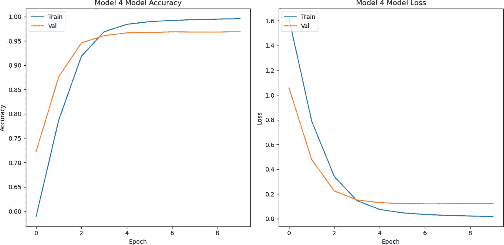

图 9-17

损失和准确率曲线：模型 4

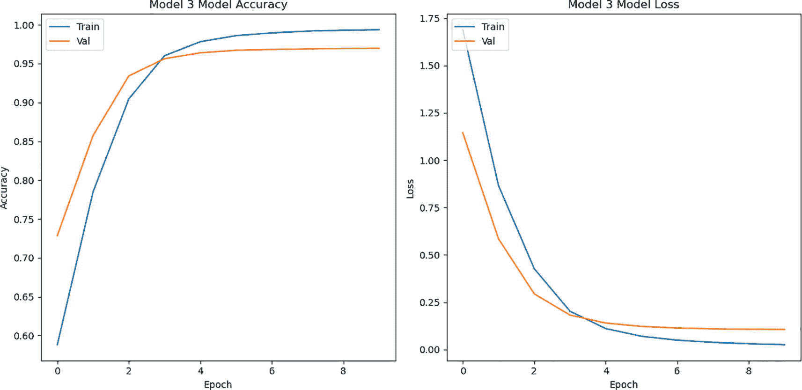

图 9-16

损失和准确率曲线：模型 3

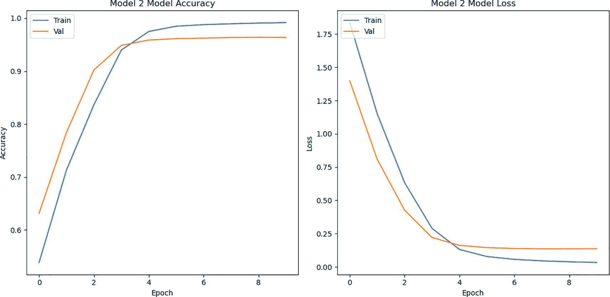

图 9-15

损失和准确率曲线：模型 2

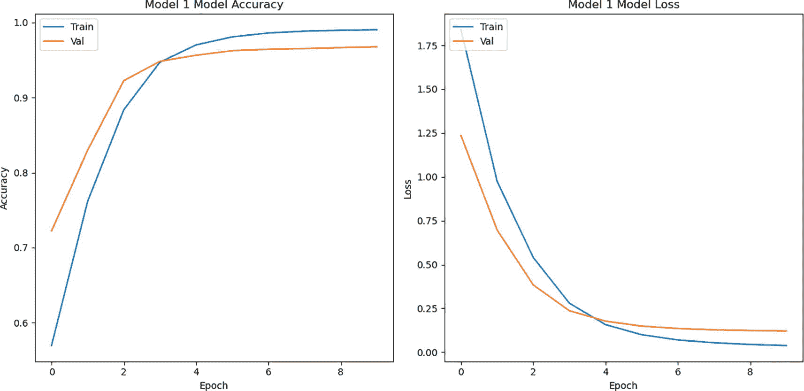

图 9-14

损失和准确率曲线：模型 1

上述实验的结果总结在表 9-2 中。

表 9-2

四种不同的 RNN 模型在 Treebank 数据集上的平均验证准确率

| 架构 | 平均验证准确率 |
| --- | --- |
| 简单 RNN，单层有 64 个单元 | 0.9206 |
| 堆叠 RNN，每层有 64 个单元 | 0.9040 |
| 单层双向 RNN，每层有 64 个单元 | 0.9284 |
| 堆叠双向 RNN，每层有 64 个单元 | 0.9314 |

注意，双向 RNN 表现更好，因为它可以捕捉到前向和后向的上下文。也就是说，它找到元素与其之前和之后的元素之间的关系。让我们看看一个使用一对多 RNN 模型的实际应用。

### 手写文本识别

你被提供了包含一些英语手写文本的图像，你需要获取与之对应的文本。也就是说，你需要识别手写文本的图像。你认为你该如何解决这个问题？

基于我们迄今为止所学的内容，解决这个问题的最简单的方法之一是使用 CNN 模型将输入图片转换为嵌入，然后将这个嵌入作为输入给一个如图 9-18 所示的一对多 RNN 模型。

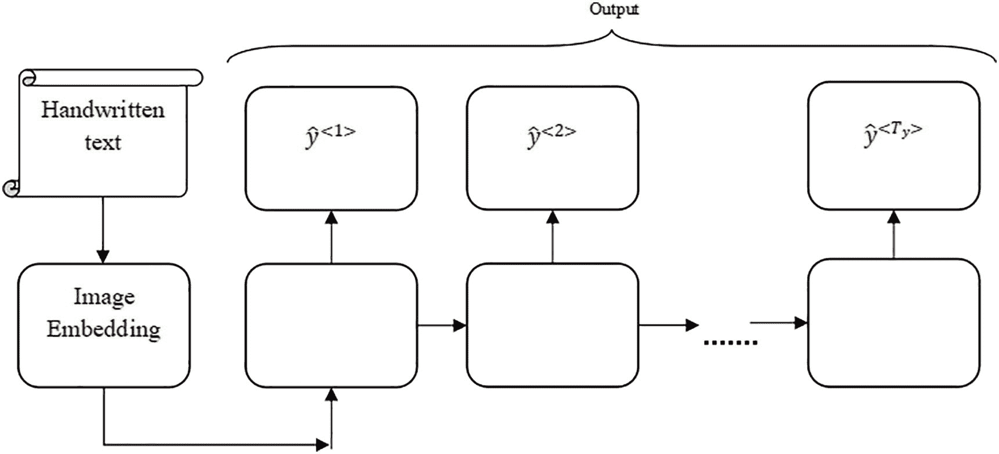

图 9-18

手写文本识别模型

要完成这个任务，你可以尝试以下方法：

1.  使用某些预训练的卷积神经网络创建输入图像的嵌入。

1.  使用自动编码器创建嵌入（第十一章）。

1.  使用单层 RNN，每层有 64 个单元（如果你想，可以更改单元数）。

1.  使用两层 RNN，每层有 64 和 32 个单元。

1.  使用 dropout 并分析引入此层对测试集模型性能的影响。

预期读者尝试上述所有组合，找到表现良好的模型。你可以获取任何公开可用的数据集来完成此任务。以下是一个选项：

[Kaggle 数据集](https://www.kaggle.com/datasets/landlord/handwriting-recognition)

### 语音转文本

你被提供了包含一些英语语音录音的音频和相应的转录。你需要获取对应于尚未被模型听到的（语音）的转录。也就是说，你需要转录语音。你认为你该如何解决这个问题？

再次，这个问题可能有多种有趣的解决方案，其中之一，基于我们迄今为止所学的，是获取音频数据的嵌入（首先尝试获取段落的嵌入）然后将这些作为输入给一个如图 9-19 所示的一对多 RNN 模型。

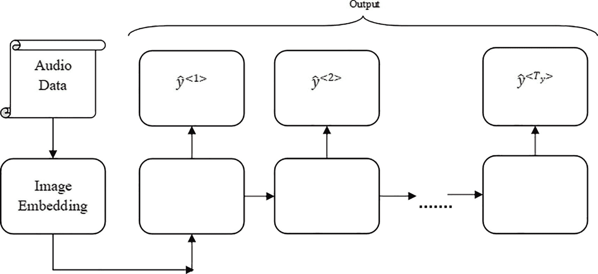

图 9-19

语音转文本

要完成这项任务，你可以尝试以下方法：

1.  使用梅尔频谱图或声谱图创建给定音频数据的嵌入，然后应用局部二进制模式。

1.  使用自动编码器（第十一章）创建（a）中获得的图像的嵌入。

1.  使用具有 32 个单元的单层 RNN（如果你想，可以更改单元数量）。

1.  使用具有 32 和 16 个单元的两层 RNN。

1.  使用 dropout 并分析引入此层对测试集模型性能的影响。

读者应尝试上述所有组合，找到效果良好的模型。你可以获取任何公开可用的数据集来完成这项任务。以下是一个选项：

[`www.openslr.org/12`](https://www.openslr.org/12)

## 结论

本章介绍了循环神经网络（RNN），这是一种能够处理序列数据的序列模型。本章讨论了 RNN 的架构和训练模型的算法。本章包含了一些非常有趣的 RNN 应用，包括情感分析、词性标注和手写文本识别。读者应尝试练习以掌握本章研究的概念。下一章将讨论继续，并介绍了门控循环单元（GRU）和长短期记忆（LSTM），它们优雅地处理梯度消失问题。

## 练习

### 多选题

1.  RNN 用于处理哪种类型的数据？

    1.  图像数据

    1.  顺序数据

    1.  数字表格数据

    1.  图数据

1.  在神经网络中，输入和输出是如何相关的？

    1.  它们彼此线性相关。

    1.  它们彼此独立。

    1.  它们是顺序处理的。

    1.  它们是递归处理的。

1.  RNN 与一般神经网络相比，是如何处理信息的？

    1.  独立地

    1.  随机

    1.  并行

    1.  顺序

1.  关于 RNN 中的参数，以下哪项是正确的？

    1.  随机初始化。

    1.  在每一层之间共享参数。

    1.  每一层的不同参数。

    1.  它们不使用参数。

1.  RNN 使用哪种算法来计算损失？

    1.  梯度下降

    1.  反向传播

    1.  BPTT

    1.  遗传算法

1.  传统前馈网络在权重方面如何与 RNN 不同？

    1.  前馈网络在每一层共享相同的权重。

    1.  它们为每一层有不同的权重。

    1.  前馈网络为每一层有不同的权重。

    1.  它们在每一层都有相同的权重。

1.  RNN 可以处理传统前馈网络无法处理的内容是什么？

    1.  固定长度输入数据

    1.  顺序数据

    1.  任何长度的输入数据

    1.  非顺序数据

1.  以下哪个激活函数在 RNN 中常用？

    1.  Softmax

    1.  Tanh

    1.  Leaky ReLU

    1.  SIREN

1.  RNN 在捕捉长期依赖关系时面临哪些挑战？

    1.  过拟合

    1.  欠拟合

    1.  乘法梯度的指数增加或减少

    1.  缺乏足够的训练数据

1.  RNN 中的 BPTT 过程中发生了什么？

    1.  网络在多个层展开。

    1.  网络在每个时间步独立计算梯度。

    1.  网络在多个时间步展开，并计算这些步骤的梯度。

    1.  网络使用遗传算法更新参数。

### 理论

1.  与神经网络相比，为什么 RNN 在处理顺序数据时更好？

1.  解释时间反向传播。

1.  RNN 有哪些不同类型？给出每种类型的例子。

### 图像描述

给定图像及其标题，你需要为新的图像获取相应的标题。你认为如何解决这个问题？

**提示**：基于我们迄今为止所学的内容，解决此问题的一个最简单的方法是将输入图片转换为使用 CNN 模型生成的嵌入，然后将此作为输入给一个如图 9-20 所示的一对多 RNN 模型。

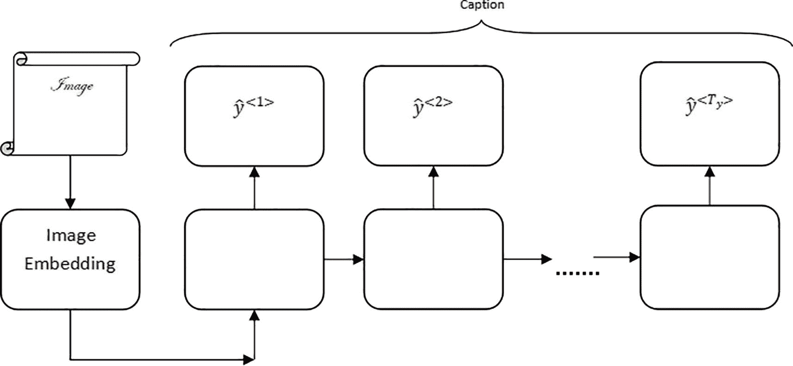

图 9-20

图像描述

要完成这个任务，你可以尝试以下方法：

1.  使用预训练的卷积神经网络（如 VGG 19）创建给定图像的嵌入。

1.  使用自动编码器（第十一章）创建给定图像的嵌入。

1.  使用具有 64 个单元的单层 RNN。

1.  使用具有 64 和 32 个单元的两个层的 RNN。

1.  使用 dropout 并分析引入此层对模型性能的测试集的影响。

预期读者尝试上述所有组合，找到表现良好的模型。你可以获取任何公开可用的数据集来完成此任务。以下是一个选项：

[概念描述数据集](https://paperswithcode.com/dataset/conceptual-captions)
