# 10. 门控循环单元和长短期记忆

## 简介

到目前为止，我们已经研究了密集神经网络（DNNs）和各种优化技术。我们还研究了能够处理图像数据的卷积神经网络（CNNs）和能够处理序列数据的循环神经网络（RNNs）。让我们暂时停下来，从另一个角度探索序列数据。

考虑一个在香格里拉流行电视频道上播出的节目，由他们的明星主持人 A 先生主持。他只谈论四件事：

1.  他最喜欢的领导者

1.  为什么有些人有问题

1.  所有分配政策的优点

1.  国家先前分配的错误

为了猜测他今天的话题，你创建了一个神经网络。网络的输入是

1.  星期几（从 1 到 7 的数字）

1.  当天是否宣布了新的政策（0 或 1）

1.  是否有选举即将到来或正在进行中（0 或 1）

你使用历史数据训练网络，并尝试预测今天的话题。然而，你的网络没有有效地预测。现在你意识到 A 先生决定话题的过程中存在一个序列。一个特定的话题总是跟在另一个话题之后。为了处理这种序列数据，你设计了一个网络，该网络将输入和预测输出作为下一个时间戳的输入。这被称为递归网络（图 10-1）。

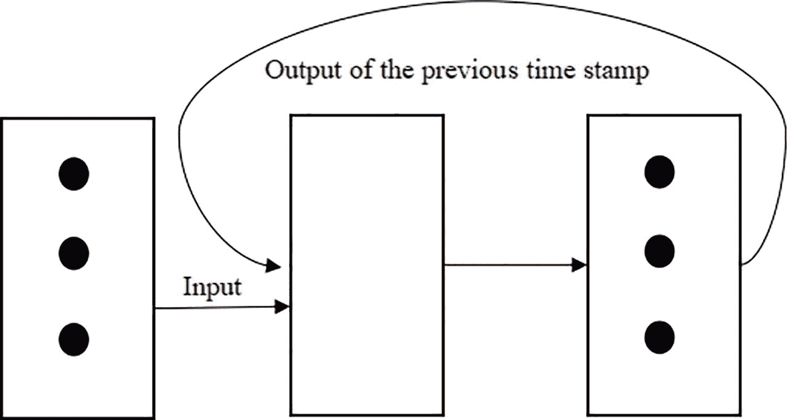

图 10-1

循环单元

然而，这种架构存在一个问题。为了简化，假设网络输出一个单一的标量。如果这个标量大于 1，那么在某个时间点输出将会爆炸或变得非常大，而如果它小于 1，那么在连续乘法之后其效果将变得可以忽略不计。第一个问题在上一章中已经讨论过，第二个问题被称为梯度消失，可以使用两种模型来处理：长短期记忆（LSTM）和门控循环单元（GRU），这两者将在本章中讨论。让我们从 GRU 开始讨论。

## GRU

GRU 是一种可以优雅地处理梯度消失问题的 RNN。GRU 的隐藏状态取决于先前的隐藏状态 *h*[*t* − 1] 和新的记忆。假设 *z*[*t*] 是介于 0 和 1 之间的标量；那么 *h*[*t*] 可以使用以下方程找到：

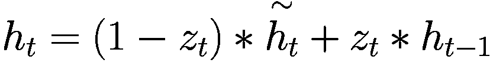

其中 *h*[*t*] 是新的记忆，*z*[*t*] 是控制先前隐藏状态中哪一部分进入新隐藏状态的因子。这里 ^"∗” 代表逐点乘法。

*z*[*t*]，被称为更新门，是 *x*[*t*] 和 *h*[*t* − 1] 的组合，如下所示：

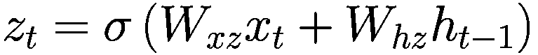

现在，*r*[*t*]（重置门）也被计算为 *x*[*t*] 和 *h*[*t* − 1] 的组合。它告诉我们 *h*[*t* − 1] 的哪一部分被加到新的记忆状态中：

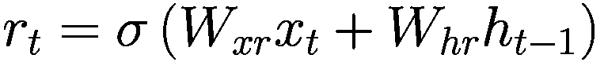

新的记忆计算如下

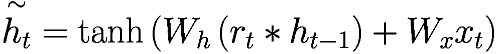

注意，如果

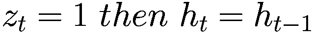

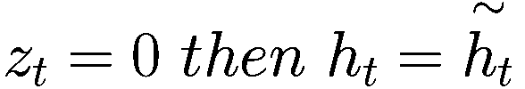

上述过程可以表示如下（图 10-2）。

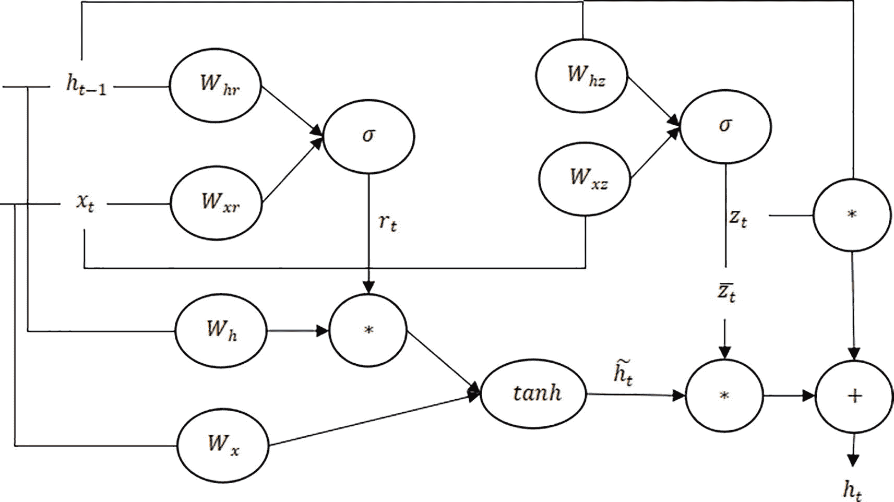

图 10-2

GRU 架构

总结

+   输入和 *h*[*t* − 1] 决定了重置门 (reset gate) 的值。

+   重置门决定 *h*[*t* − 1] 的哪一部分进入新的记忆。

+   更新门依赖于输入和 *h*[*t* − 1]。

+   更新门决定将 *h*[*t* − 1] 的哪一部分和新的记忆哪一部分组合成 *h*[*t*]。

在了解了 GRU 的架构之后，让我们转向另一种优雅的架构，称为 LSTM。

## 长短期记忆

LSTM 是一种能够处理长期依赖的 RNN。LSTM 中的记忆单元可以存储信息很长时间。细胞状态是 LSTM 的核心，依赖于输入、遗忘和输出门。让我们简要看看 LSTM 中的门：

+   输入门 (i)

+   遗忘门 (f)

+   输出 (o)

输入门决定是否写入一个单元。输出门决定揭示多少。遗忘门告诉我们是否擦除一个单元，门告诉我们写入多少。

如果前一个激活 *h*[*t* − 1] 和输入 *x*[*t*] 堆叠，那么权重 *W* 与这个堆叠输入的乘积可以成为各种激活（如 sigmoid 或 tanh）的输入。LSTM 的内部状态 *c*[*t*] 不会暴露于外界。这个 *c*[*t*] 通过一个激活，与 o 一起决定 *h*[*t*] 的值：

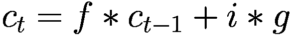

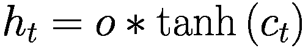

上述过程可以表示如下（图 10-3）。值得注意的是，人们提出了他们自己的 LSTM 架构。下面图中展示的架构已从 [`cs231n.stanford.edu/slides/2017/cs231n_2017_lecture10.pdf`](https://cs231n.stanford.edu/slides/2017/cs231n_2017_lecture10.pdf) [4] 中采用。

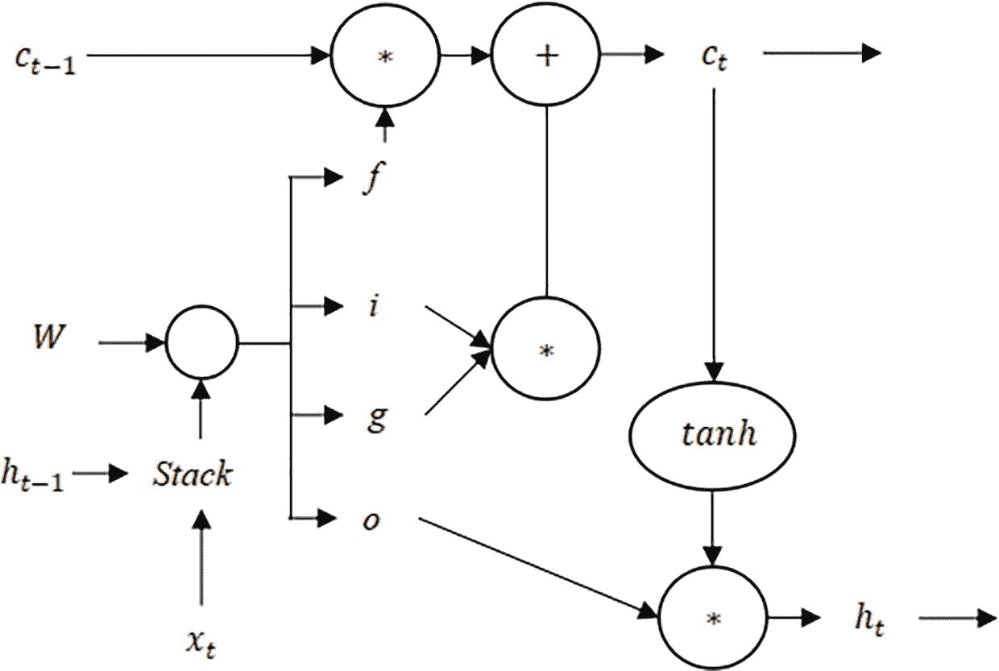

图 10-3

LSTM 架构如 Fei-Fei Li、Justin Johnson 和 Serena Yeung 所建议[4]

LSTM 的闸门可以用来记住重要的信息，忘记不必要的那些。以下是每个闸门的简要说明：

1.  忘记闸门：忘记闸门决定细胞状态中的哪些信息是需要的或不需要的。它接受前一个隐藏状态和当前输入，并通过 sigmoid 函数传递它们，为细胞状态中的每个数字产生一个介于 0 和 1 之间的值。值为 1 表示完全保留信息，而值为 0 表示忘记信息。

1.  输入闸门：输入闸门决定应该添加到细胞状态中的新信息。它由一个输入闸门组成，该闸门决定哪些值需要更新，以及一个创建可以添加到状态中的新候选值向量的闸门。这两个层的输出被组合起来更新细胞状态。

1.  输出闸门：输出闸门确定下一个隐藏状态应该是什么。这个隐藏状态用于下一个时间步，也用于做出预测。输出闸门通过 sigmoid 函数处理当前输入和前一个隐藏状态，然后将其与更新后的细胞状态的 tanh 值相乘，以产生下一个隐藏状态。

LSTM 具有在长序列中保留重要信息并丢弃无关数据的特性，这使得它们在涉及序列数据建模的任务中非常有效。

在了解了 GRU 和 LSTM 的架构之后，我们现在转向这些模型的两个重要应用。

## 命名实体识别

给定一个单词序列，命名实体识别（NER）的目标是从给定的序列中识别命名实体。它接受一个句子作为输入，并找出哪些单词是命名实体。本节使用 LSTM 和 GRU 实现 NER。

在以下列表 10-1 中使用了 CoNLL-2003 数据集，并包含带有命名实体标签的句子标注示例。每个句子都被分词，每个标记都被标记为实体标签。数据集以 CoNLL 格式组织，其中每个句子中的每个词后面都跟着其对应的实体标签。句子由空白行分隔。使用***Keras***实现了八个不同的模型用于命名实体识别（NER）。

这些模型采用了不同架构的 LSTM 和 GRU 及其双向变体。每个模型由一个嵌入层、随后的循环层和一个具有 softmax 激活的密集层组成。每个模型在十个 epoch 上编译了分类交叉熵损失和准确率指标。每个模型的准确率和损失曲线如图 10-4 至图 10-11 所示。代码已被分为多个步骤，如下所示。

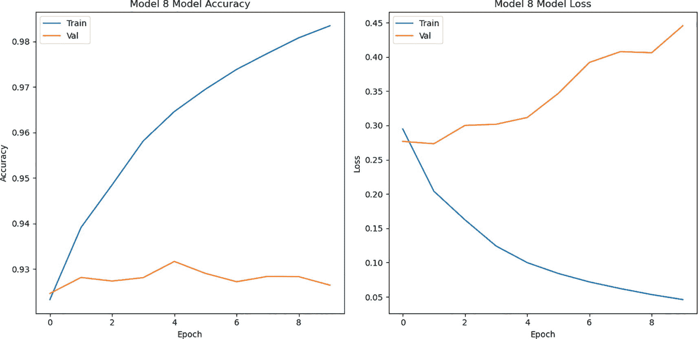

图 10-11

损失和准确率曲线：模型 8

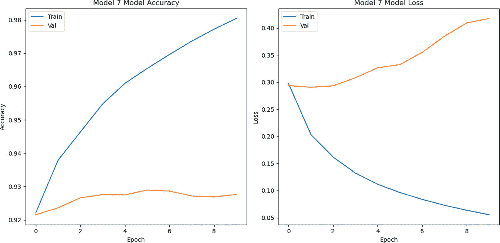

图 10-10

损失和准确率曲线：模型 7

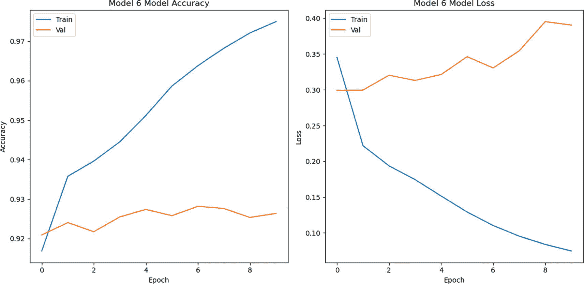

图 10-9

损失和准确率曲线：模型 6

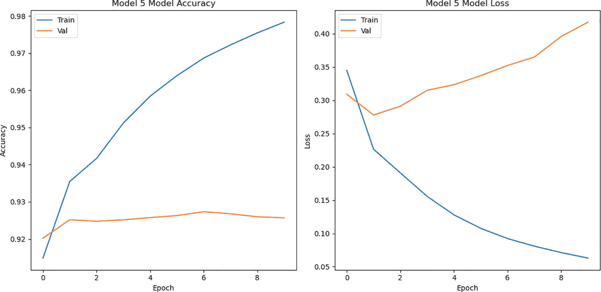

图 10-8

损失和准确率曲线：模型 5

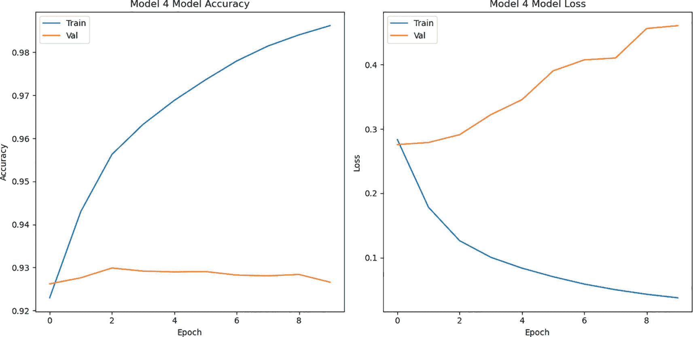

图 10-7

损失和准确率曲线：模型 4

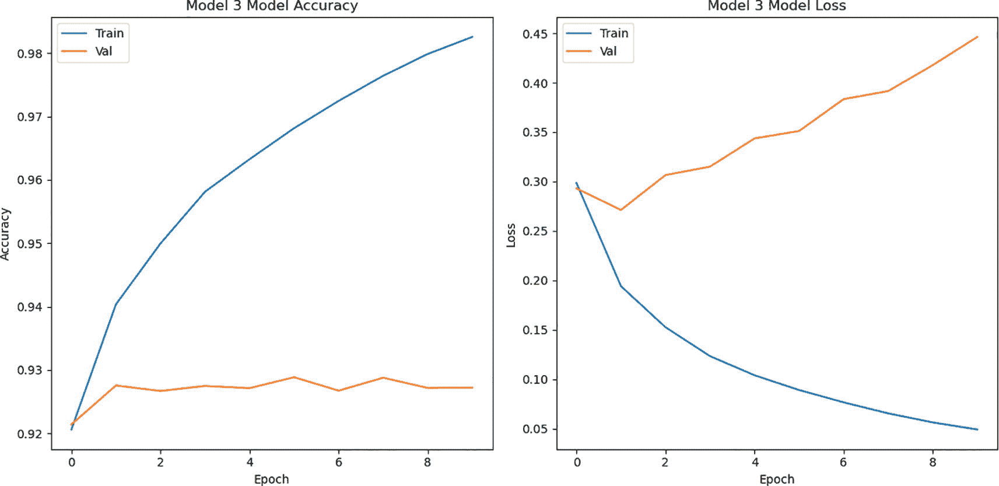

图 10-6

损失和准确率曲线：模型 3

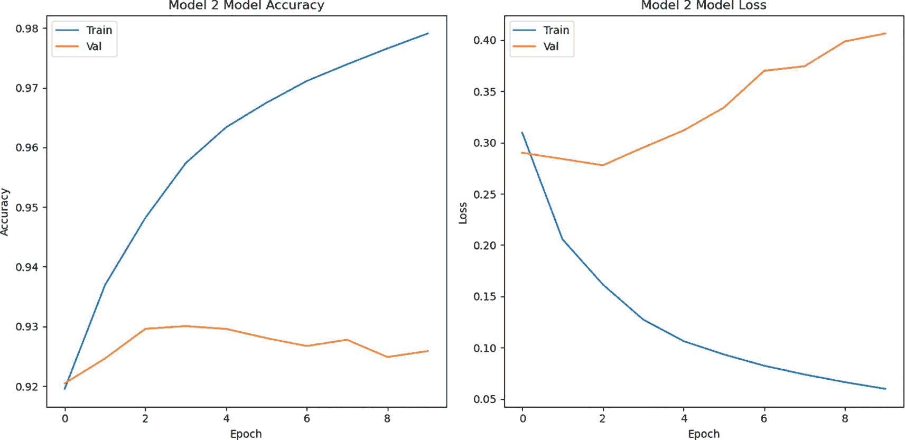

图 10-5

损失和准确率曲线：模型 2

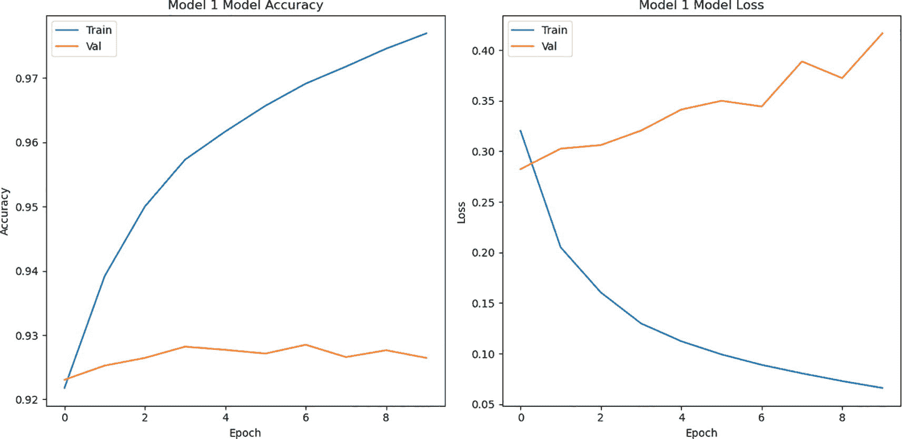

图 10-4

损失和准确率曲线：模型 1

```py
Code:
#1\. Import the CoNLL-2003 dataset from the datasets module using the load_dataset function. From tensorflow.keras.models import the Sequential function to create the sequential model. From tensorflow.keras.layers import LSTM, GRU, Bidirectional, TimeDistributed, Embedding, Dense, and Dropout layers to create models with different layers.
import numpy as np
from datasets import load_dataset
from tensorflow.keras.preprocessing.sequence import pad_sequences
from tensorflow.keras.utils import to_categorical
from sklearn.preprocessing import LabelEncoder
import tensorflow as tf
from tensorflow.keras.models import Sequential
from tensorflow.keras.layers import LSTM, GRU, Bidirectional, TimeDistributed, Embedding, Dense, Dropout
#2\. Load the CoNLL-2003 dataset
dataset = load_dataset('conll2003', trust_remote_code=True)
#3\. Extract the train and test data
train_data = dataset['train']
test_data = dataset['test']
#4\. Create a function to extract sentences and labels from the dataset
def get_sentences_and_labels(data):
sentences = [" ".join(x) for x in data['tokens']]
labels = data['ner_tags']
return sentences, labels
#5\. Get sentences and labels for training and test data
train_sentences, train_labels = get_sentences_and_labels(train_data)
test_sentences, test_labels = get_sentences_and_labels(test_data)
#6\. Tokenize the sentences, convert them to sequences, and pad the sequences
max_len = 50
word_tokenizer = tf.keras.preprocessing.text.Tokenizer()
word_tokenizer.fit_on_texts(train_sentences)
train_sequences = word_tokenizer.texts_to_sequences(train_sentences)
test_sequences = word_tokenizer.texts_to_sequences(test_sentences)
X_train = pad_sequences(train_sequences, maxlen=max_len, padding='post')
X_test = pad_sequences(test_sequences, maxlen=max_len, padding='post')
#7\. Encode the training and test labels
label_encoder = LabelEncoder()
label_encoder.fit([item for sublist in train_labels for item in sublist])
train_labels_enc = [label_encoder.transform(label) for label in train_labels]
test_labels_enc = [label_encoder.transform(label) for label in test_labels]
#8\. Pad the training and test labels
train_labels_padded = pad_sequences(train_labels_enc, maxlen=max_len, padding='post', value=-1)
test_labels_padded = pad_sequences(test_labels_enc, maxlen=max_len, padding='post', value=-1)
num_classes = len(label_encoder.classes_) + 1
train_labels_onehot = [to_categorical(i, num_classes=num_classes) for i in train_labels_padded]
test_labels_onehot = [to_categorical(i, num_classes=num_classes) for i in test_labels_padded]
y_train = np.array(train_labels_onehot)
y_test = np.array(test_labels_onehot)
#9\. Model 1
model_1 = Sequential()
model_1.add(Embedding(input_dim=len(word_tokenizer.word_index) + 1, output_dim=64, input_length=max_len))
model_1.add(GRU(units=64, return_sequences=True))
model_1.add(TimeDistributed(Dense(num_classes, activation='softmax')))
model_1.compile(optimizer='adam', loss='categorical_crossentropy', metrics=['accuracy'])
history_1 = model_1.fit(X_train, y_train, batch_size=32, epochs=10, validation_data=(X_test, y_test))
#10\. Model 2
model_2 = Sequential()
model_2.add(Embedding(input_dim=len(word_tokenizer.word_index) + 1, output_dim=64, input_length=max_len))
model_2.add(GRU(units=64, return_sequences=True))
model_2.add(GRU(units=64, return_sequences=True))
model_2.add(TimeDistributed(Dense(num_classes, activation='softmax')))
model_2.compile(optimizer='adam', loss='categorical_crossentropy', metrics=['accuracy'])
history_2 = model_2.fit(X_train, y_train, batch_size=32, epochs=10, validation_data=(X_test, y_test))
#11\. Model 3
model_3 = Sequential()
model_3.add(Embedding(input_dim=len(word_tokenizer.word_index) + 1, output_dim=64, input_length=max_len))
model_3.add(Bidirectional(GRU(units=64, return_sequences=True)))
model_3.add(TimeDistributed(Dense(num_classes, activation='softmax')))
model_3.compile(optimizer='adam', loss='categorical_crossentropy', metrics=['accuracy'])
history_3 = model_3.fit(X_train, y_train, batch_size=32, epochs=10, validation_data=(X_test, y_test))
#12\. Model 4
model_4 = Sequential()
model_4.add(Embedding(input_dim=len(word_tokenizer.word_index) + 1, output_dim=64, input_length=max_len))
model_4.add(Bidirectional(GRU(units=64, return_sequences=True)))
model_4.add(Bidirectional(GRU(units=64, return_sequences=True)))
model_4.add(TimeDistributed(Dense(num_classes, activation='softmax')))
model_4.compile(optimizer='adam', loss='categorical_crossentropy', metrics=['accuracy'])
history_4 = model_4.fit(X_train, y_train, batch_size=32, epochs=10, validation_data=(X_test, y_test))
#13\. Model 5
model_5 = Sequential()
model_5.add(Embedding(input_dim=len(word_tokenizer.word_index) + 1, output_dim=64, input_length=max_len))
model_5.add(LSTM(units=64, return_sequences=True))
model_5.add(TimeDistributed(Dense(num_classes, activation='softmax')))
model_5.compile(optimizer='adam', loss='categorical_crossentropy', metrics=['accuracy'])
history_5 = model_5.fit(X_train, y_train, batch_size=32, epochs=10, validation_data=(X_test, y_test))
#14\. Model 6
model_6 = Sequential()
model_6.add(Embedding(input_dim=len(word_tokenizer.word_index) + 1, output_dim=64, input_length=max_len))
model_6.add(LSTM(units=64, return_sequences=True))
model_6.add(LSTM(units=64, return_sequences=True))
model_6.add(TimeDistributed(Dense(num_classes, activation='softmax')))
model_6.compile(optimizer='adam', loss='categorical_crossentropy', metrics=['accuracy'])
history_6 = model_6.fit(X_train, y_train, batch_size=32, epochs=10, validation_data=(X_test, y_test))
#15\. Model 7
model_7 = Sequential()
model_7.add(Embedding(input_dim=len(word_tokenizer.word_index) + 1, output_dim=64, input_length=max_len))
model_7.add(Bidirectional(LSTM(units=64, return_sequences=True)))
model_7.add(TimeDistributed(Dense(num_classes, activation='softmax')))
model_7.compile(optimizer='adam', loss='categorical_crossentropy', metrics=['accuracy'])
history_7 = model_7.fit(X_train, y_train, batch_size=32, epochs=10, validation_data=(X_test, y_test))
#16\. Model 8
model_8 = Sequential()
model_8.add(Embedding(input_dim=len(word_tokenizer.word_index) + 1, output_dim=64, input_length=max_len))
model_8.add(Bidirectional(LSTM(units=64, return_sequences=True)))
model_8.add(Bidirectional(LSTM(units=64, return_sequences=True)))
model_8.add(TimeDistributed(Dense(num_classes, activation='softmax')))
model_8.compile(optimizer='adam', loss='categorical_crossentropy', metrics=['accuracy'])
history_8 = model_8.fit(X_train, y_train, batch_size=32, epochs=10, validation_data=(X_test, y_test))
#17\. Create a function to plot the training and validation loss and accuracy
def plot_history(history, model_name):
plt.figure(figsize=(12, 6))
plt.subplot(1, 2, 1)
plt.plot(history.history['accuracy'])
plt.plot(history.history['val_accuracy'])
plt.title(f'{model_name} Model Accuracy')
plt.xlabel('Epoch')
plt.ylabel('Accuracy')
plt.legend(['Train', 'Val'], loc='upper left')
plt.subplot(1, 2, 2)
plt.plot(history.history['loss'])
plt.plot(history.history['val_loss'])
plt.title(f'{model_name} Model Loss')
plt.xlabel('Epoch')
plt.ylabel('Loss')
plt.legend(['Train', 'Val'], loc='upper left')
plt.tight_layout()
plt.show()
#18\. Plot the accuracy and loss curves for each model
plot_history(history_1, "Model 1")
plot_history(history_2, "Model 2")
plot_history(history_3, "Model 3")
plot_history(history_4, "Model 4")
plot_history(history_5, "Model 5")
plot_history(history_6, "Model 6")
plot_history(history_7, "Model 7")
plot_history(history_8, "Model 8")
#19.Create a function to calculate mean validation accuracy
def mean_validation_accuracy(history):
val_acc = history.history['val_accuracy']
mean_acc = np.mean(val_acc)
return mean_acc
#20\. Calculate the mean validation accuracy for each model
mean_acc_1 = mean_validation_accuracy(history_1)
mean_acc_2 = mean_validation_accuracy(history_2)
mean_acc_3 = mean_validation_accuracy(history_3)
mean_acc_4 = mean_validation_accuracy(history_4)
mean_acc_5 = mean_validation_accuracy(history_5)
mean_acc_6 = mean_validation_accuracy(history_6)
mean_acc_7 = mean_validation_accuracy(history_7)
mean_acc_8 = mean_validation_accuracy(history_8)
Output:
Listing 10-1
Named Entity Recognition
```

以上实验的结果总结在表 10-1 中。

表 10-1

八个不同模型的平均验证准确率

| 架构 | 平均验证准确率 |
| --- | --- |
| 单层 64 个单位的 GRU | 0.9267 |
| 每层有 64 个单位的堆叠 GRU | 0.9268 |
| 单层 64 个单位的双向 GRU | 0.9269 |
| 每层有 64 个单位的堆叠双向 GRU | 0.9282 |
| 单层 64 个单位的 LSTM | 0.9253 |
| 每层有 64 个单位的堆叠 LSTM | 0.9253 |
| 单层 64 个单位的双向 LSTM | 0.9266 |
| 每层有 64 个单位的堆叠双向 LSTM | 0.9279 |

让我们看看 LSTM 和 GRU 模型在情感分类中的应用。

## 情感分类

参考上一章的列表 9-1，该列表将给定的句子分类为正面或负面情感。创建了四个不同的 RNN 模型，并在 IMDB 电影评论情感数据集上进行了评估。该数据集包含 50,000 篇电影评论，正面和负面情感均匀分布。数据集通过去除停用词、分词和填充评论进行了预处理。以下列表 10-2 使用 ***Keras*** 实现了八个不同的模型用于情感分类。这些模型采用了不同的 LSTM 和 GRU 架构及其双向变体。每个模型由一个嵌入层、递归层和一个具有 sigmoid 激活的密集层组成。随着训练轮数的增加，准确率和损失的变化在图 10-12 到图 10-19 的图中显示。

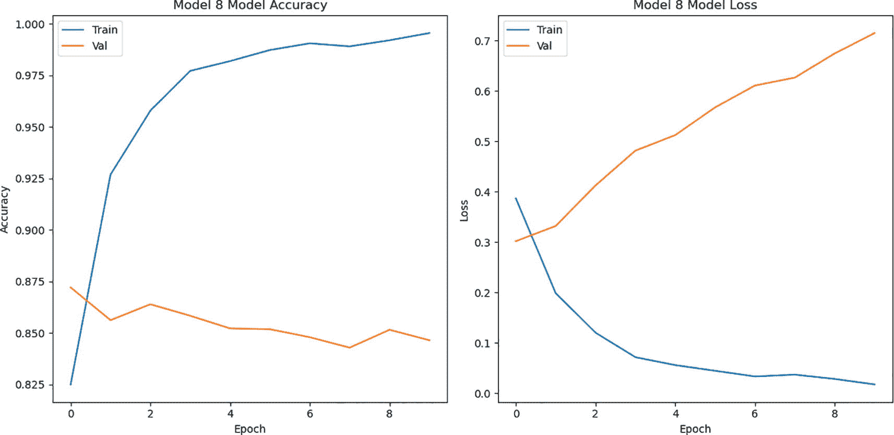

图 10-19

损失和准确率曲线：模型 8

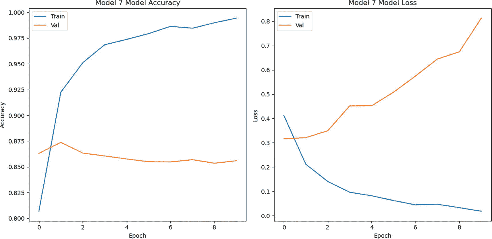

图 10-18

损失和准确率曲线：模型 7

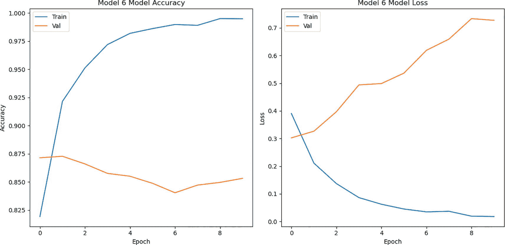

图 10-17

损失和准确率曲线：模型 6

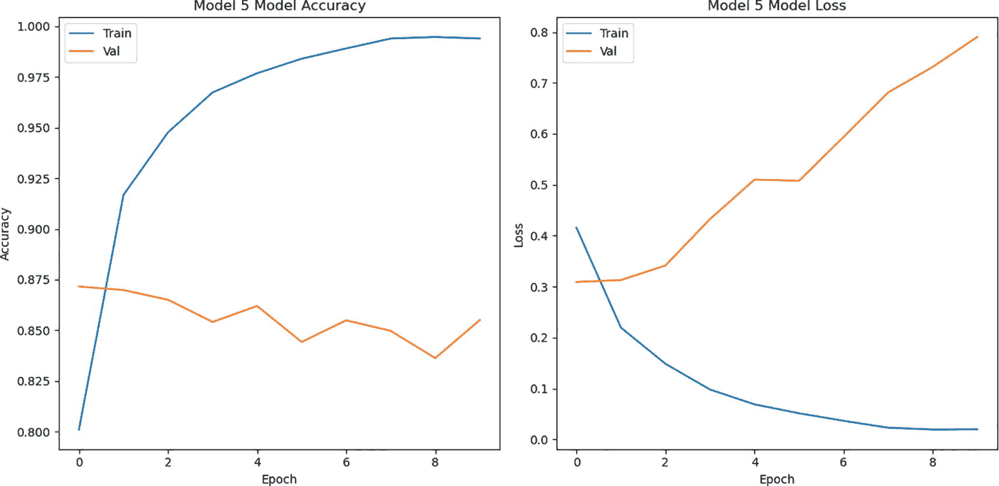

图 10-16

损失和准确率曲线：模型 5

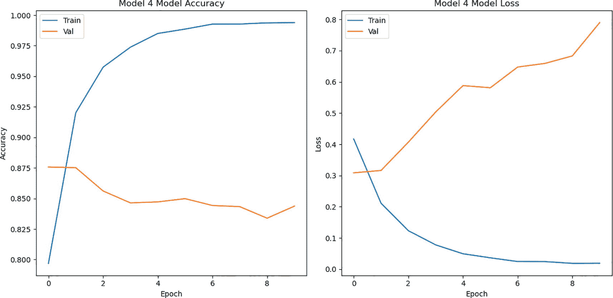

图 10-15

损失和准确率曲线：模型 4

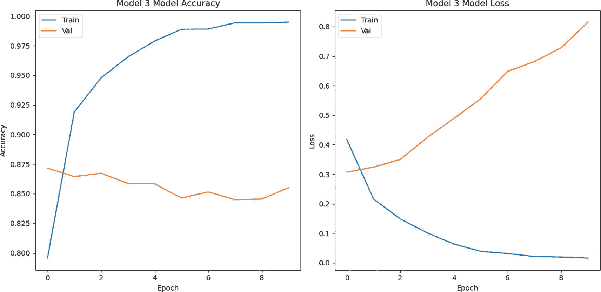

图 10-14

损失和准确率曲线：模型 3

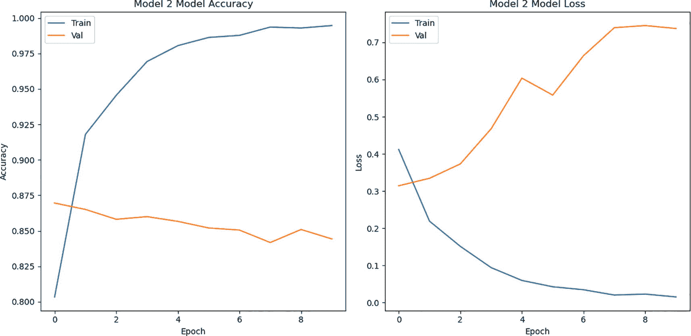

图 10-13

损失和准确率曲线：模型 2

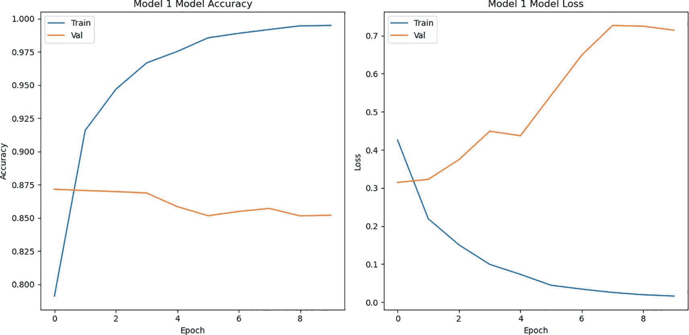

图 10-12

损失和准确率曲线：模型 1

```py
Code:
#1\. Import the IMDB dataset from tensorflow.keras.datasets, stopwords from nltk.corpus. The tensorflow.keras.models, tensorflow.keras.layers are imported to design a sequential model having Embedding, GRU, LSTM, and Bidirectional layers.
import numpy as np
from tensorflow.keras.datasetsimportimdb
from tensorflow.keras.preprocessing.sequence import pad_sequences
from tensorflow.keras.preprocessing.text import Tokenizer
from nltk.corpus import stopwords
import nltk
from tensorflow.keras.models import Sequential
from tensorflow.keras.layers import Embedding, GRU, Dense, Bidirectional, LSTM
from matplotlib import pyplot as plt
#2\. The stopwords are downloaded from NLTK
nltk.download('stopwords')
#3\. The IMDB dataset is downloaded and limited to the top 10,000 most frequent words.
max_features = 10000
(X_train, y_train), (X_test, y_test) = imdb.load_data(num_words=max_features)
#4\. Create a reverse dictionary to decode reviews back to words
word_index = imdb.get_word_index()
reverse_word_index = dict([(value, key) for (key, value) in word_index.items()])
#5\. Create a function to decode reviews from sequences of integers to words
def decode_review(encoded_review):
return ' '.join([reverse_word_index.get(i - 3, '?') for i in encoded_review])
#6\. Decode all reviews in the training and test sets
decoded_train = [decode_review(review) for review in X_train]
decoded_test = [decode_review(review) for review in X_test]
#7\. Remove the stop words from the reviews
stop_words = set(stopwords.words('english'))
def remove_stop_words(text):
return ' '.join([word for word in text.split() if word not in stop_words])
cleaned_train = [remove_stop_words(review) for review in decoded_train]
cleaned_test = [remove_stop_words(review) for review in decoded_test]
#8\. Tokenize the cleaned reviews using the Tokenizer function imported from tensorflow.keras.preprocessing.text
tokenizer = Tokenizer(num_words=max_features)
tokenizer.fit_on_texts(cleaned_train)
#9\. Convert the tokenized reviews to sequences
train_sequences = tokenizer.texts_to_sequences(cleaned_train)
test_sequences = tokenizer.texts_to_sequences(cleaned_test)
#10\. Pad the sequences to ensure they all have the same length
maxlen = 100
X_train = pad_sequences(train_sequences, maxlen=maxlen)
X_test = pad_sequences(test_sequences, maxlen=maxlen)
#11\. Create a function to create, compile, and train a model
def compile_and_train(model, epochs=10):
model.compile(optimizer='adam', loss='binary_crossentropy', metrics=['acc'])
history = model.fit(X_train, y_train, epochs=epochs, batch_size=32,validation_split=0.3)
return history
#12\. Model 1
model_1 = Sequential()
model_1.add(Embedding(max_features, 32))
model_1.add(GRU(32))
model_1.add(Dense(1, activation='sigmoid'))
history_1 = compile_and_train(model_1)
#13\. Model 2
model_2 = Sequential()
model_2.add(Embedding(max_features, 32))
model_2.add(GRU(32, return_sequences=True))
model_2.add(GRU(32))
model_2.add(Dense(1, activation='sigmoid'))
history_2 = compile_and_train(model_2)
#14\. Model 3
model_3 = Sequential()
model_3.add(Embedding(max_features, 32))
model_3.add(Bidirectional(GRU(32)))
model_3.add(Dense(1, activation='sigmoid'))
history_3 = compile_and_train(model_3)
#15\. Model 4
model_4 = Sequential()
model_4.add(Embedding(max_features, 32))
model_4.add(Bidirectional(GRU(32, return_sequences=True)))
model_4.add(Bidirectional(GRU(32)))
model_4.add(Dense(1, activation='sigmoid'))
history_4 = compile_and_train(model_4)
#16\. Model 5
model_5 = Sequential()
model_5.add(Embedding(max_features, 32))
model_5.add(LSTM(32))
model_5.add(Dense(1, activation='sigmoid'))
history_5 = compile_and_train(model_5)
#17\. Model 6
model_6 = Sequential()
model_6.add(Embedding(max_features, 32))
model_6.add(LSTM(32, return_sequences=True))
model_6.add(LSTM(32))
model_6.add(Dense(1, activation='sigmoid'))
history_6 = compile_and_train(model_6)
#18\. Model 7
model_7 = Sequential()
model_7.add(Embedding(max_features, 32))
model_7.add(Bidirectional(LSTM(32)))
model_7.add(Dense(1, activation='sigmoid'))
history_7 = compile_and_train(model_7)
#19.Model 8
model_8 = Sequential()
model_8.add(Embedding(max_features, 32))
model_8.add(Bidirectional(LSTM(32, return_sequences=True)))
model_8.add(Bidirectional(LSTM(32)))
model_8.add(Dense(1, activation='sigmoid'))
history_8 = compile_and_train(model_8)
#20\. Create a function to plot the training and validation loss and accuracy
def plot_history(history, model_name):
plt.figure(figsize=(12, 6))
plt.subplot(1, 2, 1)
plt.plot(history.history['accuracy'])
plt.plot(history.history['val_accuracy'])
plt.title(f'{model_name} Model Accuracy')
plt.xlabel('Epoch')
plt.ylabel('Accuracy')
plt.legend(['Train', 'Val'], loc='upper left')
plt.subplot(1, 2, 2)
plt.plot(history.history['loss'])
plt.plot(history.history['val_loss'])
plt.title(f'{model_name} Model Loss')
plt.xlabel('Epoch')
plt.ylabel('Loss')
plt.legend(['Train', 'Val'], loc='upper left')
plt.tight_layout()
plt.show()
#21\. Plot the accuracy and loss curves for each model
plot_history(history_1, "Model 1")
plot_history(history_2, "Model 2")
plot_history(history_3, "Model 3")
plot_history(history_4, "Model 4")
plot_history(history_5, "Model 5")
plot_history(history_6, "Model 6")
plot_history(history_7, "Model 7")
plot_history(history_8, "Model 8")
#22\. Create a function to calculate mean validation accuracy
def mean_validation_accuracy(history):
val_acc = history.history['val_accuracy']
mean_acc = np.mean(val_acc)
return mean_acc
#23\. Calculate the mean validation accuracy for each model
mean_acc_1 = mean_validation_accuracy(history_1)
mean_acc_2 = mean_validation_accuracy(history_2)
mean_acc_3 = mean_validation_accuracy(history_3)
mean_acc_4 = mean_validation_accuracy(history_4)
mean_acc_5 = mean_validation_accuracy(history_5)
mean_acc_6 = mean_validation_accuracy(history_6)
mean_acc_7 = mean_validation_accuracy(history_7)
mean_acc_8 = mean_validation_accuracy(history_8)
Output:
Listing 10-2
Sentiment classification using the IMDB dataset
```

以上实验的结果总结在表 10-2 中。

表 10-2

八种不同模型的平均验证准确率

| 架构 | 平均验证准确率 |
| --- | --- |
| 单层有 64 个单位的 GRU | 0.8607 |
| 每层有 64 个单位的堆叠 GRU | 0.8549 |
| 每层有 64 个单位的单层双向 GRU | 0.8563 |
| 每层有 64 个单位的堆叠双向 GRU | 0.8516 |
| 单层有 64 个单位的 LSTM | 0.8563 |
| 每层有 64 个单位的堆叠 LSTM | 0.8562 |
| 单层有 64 个单位的双向 LSTM | 0.8594 |
| 每层有 64 个单位的堆叠双向 LSTM | 0.8544 |

## 结论

本章首先讨论了像长短期记忆和门控循环单元这样的模型的需求。它强调了它们在处理传统循环神经网络局限性方面的重要性。随后对 LSTM 和 GRU 进行了有见地的讨论，解释了它们的架构和功能。然后本章探讨了这些模型在命名实体识别和情感分析中的应用，展示了它们在处理和理解文本数据方面的有效性。此外，本书附录 C 和附录 D 中还介绍了 LSTM 和 GRU 的迷人应用，提供了它们使用的实用见解。上一章中引入的注意力模型为转换器模型奠定了基础。这些模型是现在和未来的模型，可以有效地处理序列。鼓励读者参与章节末尾的练习，以巩固他们的理解并获得这些概念的实际经验。

## 练习

### 多项选择题

1.  以下哪项在 LSTM 中存在？

    1.  遗忘门

    1.  更新门

    1.  都有

    1.  无

1.  GRU 和 LSTM 之间的区别是什么？

    1.  GRU 有一个遗忘门；LSTM 没有。

    1.  LSTM 有一个遗忘门；GRU 没有。

    1.  GRU 和 LSTM 是相同的。

    1.  LSTM 没有门。

1.  以下哪项可以处理梯度消失问题？

    1.  LSTM

    1.  GRU

    1.  都有

    1.  无

1.  LSTM 在以下方面表现更好

    1.  图像分类

    1.  情感分类

    1.  回归

    1.  聚类

1.  以下哪一个是序列模型？

    1.  RNN

    1.  LSTM

    1.  GRU

    1.  所有上述内容

1.  LSTM 使用以下哪种激活函数？

    1.  ReLU

    1.  Sigmoid

    1.  Tanh

    1.  b 和 c 都有

1.  LSTM 中隐藏状态是如何更新的？

    1.  只使用输入门

    1.  使用输出门和遗忘门

    1.  使用输入门、遗忘门和输出门

    1.  使用单个门

1.  训练序列模型使用哪种算法？

    1.  梯度下降

    1.  时间反向传播（BPTT）

    1.  随机梯度下降（SGD）

    1.  强化学习

1.  可以使用以下方法进行图像描述

    1.  神经网络

    1.  序列模型

    1.  词袋模型

    1.  以上所有

1.  LSTM 和 GRU 哪个更好？

    1.  LSTM

    1.  GRU

    1.  这两种方法同样有效

    1.  取决于具体任务

### 理论

1.  解释 RNN 的问题。如何使用 GRU 处理这些问题？

1.  解释 GRU 的架构。GRU 与 LSTM 的区别是什么？

1.  解释 LSTM 的架构。每个门的重要性是什么？

1.  GRU 与 LSTM 有何不同？在哪种情况下可以使用哪种？

### 应用型问题

1.  编写一个程序，使用基于字符的循环神经网络（RNN）生成文本。你将使用 Andrej Karpathy 的文章《循环神经网络的不合理有效性》中的莎士比亚写作数据集。目标是训练一个模型，可以预测来自这些数据的字符序列中的下一个字符。你可以使用训练好的模型通过逐个字符预测来生成更长的文本序列。数据集可以在以下链接找到：[Kaggle Shakespeare Text Generation with RNN](https://www.kaggle.com/code/rahulharlalka/skakespeare-text-generation-with-rnn)。

1.  在上述问题中，分析以下因素对模型性能的影响：

    1.  层数数量

    1.  嵌入层中的单元数量

    1.  使用 RNN、Bi-RNN、GRU 和 LSTM

    1.  优化器

1.  现在开发一个下一个单词生成模型（而不是下一个字符生成模型），并评估模型是否表现更好。
