# 12. 生成模型简介

## 简介

既然我们已经到达了旅程的终点，让我们思考一下我们开始时期待的是什么。目标是能够开发出能够高效有效地完成图像和序列相关任务的模型。我们现在知道，深度学习模型可以帮助我们分类图像和文本。本书的第六章到第十章专注于卷积和序列模型，这些模型帮助我们完成这些任务。我们还学会了开发能够完成稍微复杂一些的任务的模型，比如下一个字符生成和图像编码。现在让我们关注更复杂一些的任务，并探索生成模型的基本原理。生成模型不仅帮助我们执行迄今为止研究的监督学习和无监督学习任务，而且帮助我们从一个特定的分布中生成新的数据。生成模型的一个明显例子是 ChatGPT，它颠覆了该领域。它是基于转换器的。本章介绍了转换器。但在深入探讨转换器之前，让我们先对霍普菲尔德网络和玻尔兹曼机有一个基本的了解。

## 霍普菲尔德网络

当你听到歌曲“Turn! Turn! Turn!”时，你脑海中会浮现什么？可能是乐队 The Byrds，或者《阿甘正传》或者圣经《传道书》第三章的前八节？在你的生命中，你一定听过很多歌曲。尽管如此，当你听到一首著名歌曲的几行歌词时，整首歌、与之相关的图像和来源都会浮现在你的脑海中。作为一个计算机科学学生，你认为我们的大脑中有什么东西帮助我们将这些几行歌词与完整的描述或部分描述联系起来？是我们心中创建的所有歌曲数据库，随后进行某种类型的搜索，将一个模式与特定的歌曲关联起来吗？也许答案是否定的！

这些搜索策略无法在微秒内工作并产生答案，那么究竟发生了什么？答案在于特定物体达到最低能量状态的能力，即纯粹物理学。1982 年，约翰·霍普菲尔德提出了实现这一策略的计算模型。他的想法基于蛋白质达到稳定结构时所遵循的策略，这种结构最小化了它们的能量。这个模型被称为***霍普菲尔德网络***。

假设我们存储一个由{*x*[1]，*x*[2]，*x*[3]... *x*[*n*]}组成的模式。也假设这些*x*[i]s 可以是+1 或-1。它们之间的相互作用可以通过一个图来表示，其中*x*[i]s 是顶点，*w*[ij]是模式*x*[i]和*x*[j]之间的权重。为了简化问题，让我们假设形成的图是一个单向图。例如，考虑图 12-1 中所示的三顶点*x*[1]，*x*[2]和*x*[3]以及权重*w*[12]，*w*[32]和*w*[31]。

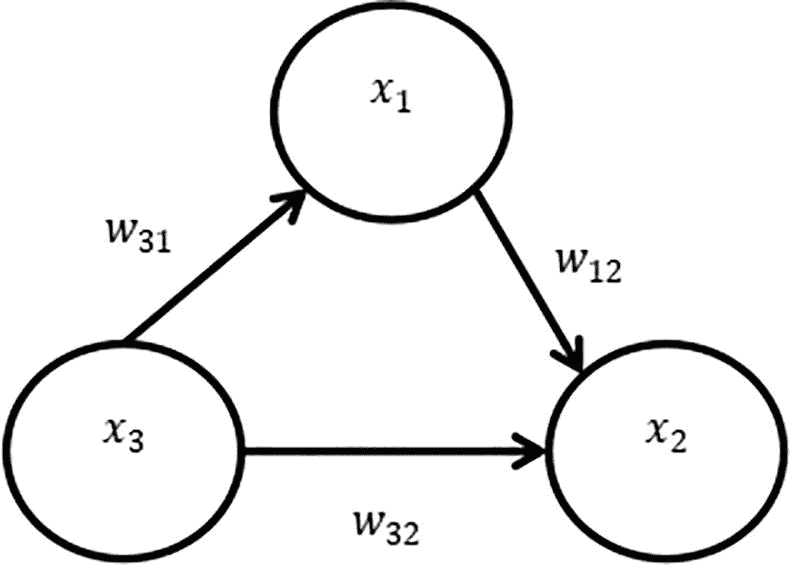

图 12-1

由模式 *x*[1]，*x*[2]，*x*[3] 组成的霍普菲尔德网络

注意，在这个网络中，如果 *w*[*ij*] 大于 0，则它们之间的连接被认为是兴奋性的；同样，如果它们之间的权重小于 0，则被认为是抑制性的。

首先，让我们考虑只有两种模式 *x*[1] 和 *x*[2]，它们都可以是 +1 或 -1。然后表 12-1 显示了它们之间权重的符号。

表 12-1

当给定 *x*[1] 的值时寻找权重

| ***x***[**1**] | ***x***[**2**] | ***w***[**12**] |
| --- | --- | --- |
| +1 | +1 | >0 |
| +1 | -1 | <0 |
| -1 | +1 | <0 |
| -1 | -1 | >0 |

这意味着如果 *x*[*i*] 和 *x*[*j*] 有相同的符号，则权重为正；否则，权重为负。这让你想起了什么？这是赫布规则：

> *“神经元之间连接在一起就会一起放电”*

这导致了一个因子，如果整个配置要变得稳定，则需要最大化这个因子，即 ∑*w*[*ij*]*x*[*i*]*x*[*j*]。这意味着以下数量需要最小化：

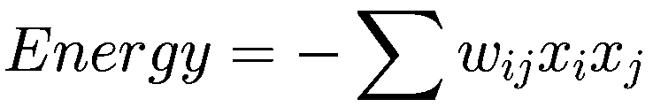

这可以被称为能量。霍普菲尔德网络旨在最小化这种能量。为了在给出特定模式时达到稳定的配置，我们需要找出 *x*[*i*] 和 *x*[*j*] 的值，以使配置稳定并得到相应的权重。为了找出 *x*[*i*]s 和权重的值，可以应用以下策略（图 12-2）。

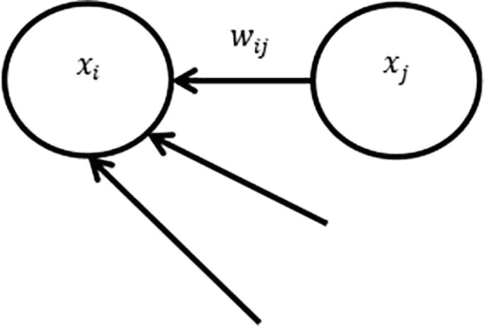

图 12-2

寻找 *x*[*i*] 的更新值

任务 1：寻找 *x*[*i*]s 的值

+   求 *S*[*i*] = ∑ *x*[*j*]*w*[*ij*]

+   如果 *S*[*i*] > 0 则将 *x*[*i*] 设置为 1；否则，设置为 -1。

+   对所有 *x*[*i*]s 重复此过程，并继续重复，直到达到稳定状态。

任务 2：寻找权重

+   对于给定的模式 *y*[*i*]，将 *w*[*ij*] 设置为 *y*[*i*]*y*[*j*]。

+   由于我们需要最小化 − ∑ *w*[*ij*]*y*[*i*]*y*[*j*]，并且最小值在 *w*[*ij*] = *y*[*i*]*y*[*j*] 时达到

这样就可以找到新的权重。对推导感兴趣的读者可以参考章节末尾给出的参考文献。现在让我们看看一个可以模拟二进制数据的机器。

## 霍普菲尔德机

假设你在一个工厂的控制室工作，那里的所有按钮只能处于两种状态之一：开启或关闭（0 或 1）。控制室的配置可以用每个按钮的状态来定义。找出配置是否有问题很重要，因为在这些情况下可能会出现严重的问题。让我们正式陈述这个问题：

给定一组二元变量 {*x*[1], *x*[2], …*x*[*m*]}，我们需要找出表示这些变量状态的长度为 m 的向量是否表示异常条件。

因此，我们需要开发一个能够模拟二进制数据的机器。这样做的一种方法就是使用玻尔兹曼机（BM）。玻尔兹曼机可以模拟二进制数据 [2]。使用这台机器，我们可以找到给定向量是否属于特定分布。同样，如果你开发几个这样的机器，借助贝叶斯定理，你可以找到向量是否来自特定分布。这些机器在正常状态下建模时，也可以帮助我们找出异常行为。

让我们考虑一个场景，其中我们需要从二进制分布中生成数据。为了做到这一点，我们需要找到潜在变量，然后开发一个具有隐藏状态和可见状态的神经网络。我们首先使用先验分布并选择隐藏状态，然后从条件分布中找到可见状态。然而，玻尔兹曼机并不是这样工作的。在这些机器中，联合配置的能量与概率 P(v, h) 成正比，其中 *v* 是可见状态，*h* 是隐藏状态。

这里可见状态的概率是

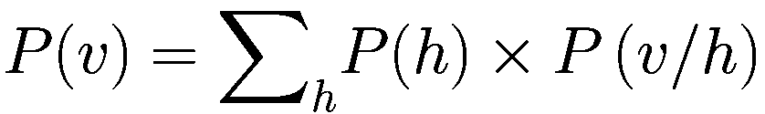

根据参考文献 [1]，能量*E*(*v*, *h*)由以下公式给出

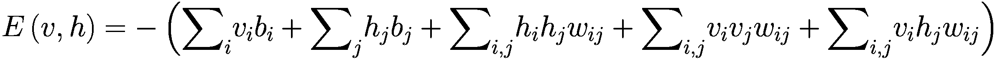

*P*(*v*)的值可以使用以下公式计算：

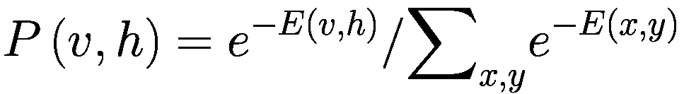

最后，*P*(*v*)可以使用以下公式进行计算：

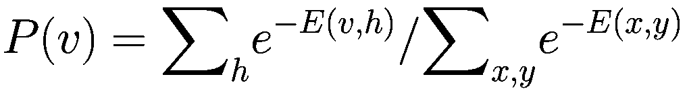

要了解玻尔兹曼机中各种可见状态的概率分布是如何推导出来的，请考虑以下示例。

在图 12-3 中，我们有三个隐藏状态和三个可见状态。h[1] 和 h[2] 之间的权重是 2；h[1] 和 v[1] 之间的权重是 3；h[2] 和 v[2] 之间的权重是 -1；h[2] 和 h[3] 之间的权重是 1；h[3] 和 v[3] 之间的权重是 2。为了找到各种状态的概率，必须遵循以下步骤。

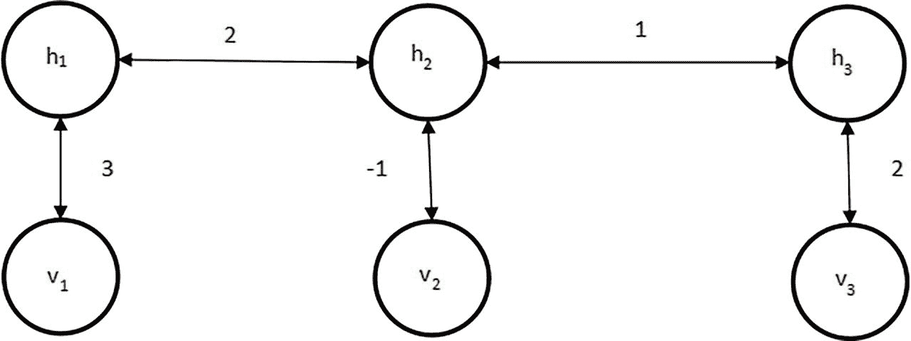

图 12-3

玻尔兹曼机的一个例子

第 1 步：我们列出二进制变量 (h[1] h[2] h[3]) 的所有可能的排列，共有八个值。请注意，(v[1] v[2] v[3]) 也可以有八个值，因此我们总共有 64 种组合（表 12-2）。

表 12-2

可见和隐藏状态的组合总和

| v[1] v[2] v[3] | h[1] h[2] h[3] |
| --- | --- |
| 000 | 000 |
| 001 | 000 |
| 010 | 000 |
| 011 | 000 |
| 100 | 000 |
| 101 | 000 |
| 110 | 000 |
| 111 | 000 |
| 000 | 001 |
| … | … |
| 111 | 111 |

第 2 步：接下来，我们计算 64 种组合中每种组合的 E。例如，考虑 (v[1] v[2] v[3]) 分别是 (1 1 0) 和 (h[1] h[2] h[3]) 分别是 (0 1 0) 的情况。

假设 v[1]、v[2] 和 v[3] 的值分别是 1、1 和 0，而 h[1]、h[2] 和 h[3] 的值分别是 0、1 和 0。

为了简化，假设所有偏差都是 0，因此 ∑*w*[*i*]*b*[*i*] 和 ∑*h*[*k*]*b*[*k*] 变为 0。因此，我们只剩下 ∑*v*[*i*]*h*[*k*]*w*[*ik*] 和 ∑*h*[*k*]*h*[*l*]*w*[*kl*]。请注意，可见状态，即 (v[1] v[2] v[3])，彼此之间没有连接（图 12-4）。

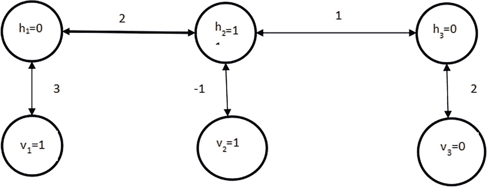

图 12-4

玻尔兹曼机及其状态输入

要计算 ∑*v*[*i*]*h*[*k*]*w*[*ik*] 和 ∑ *h*[*k*]*h*[*l*]*w*[*kl*]，我们得到

= 0 + (-1) + 0 + 0 + 0

= -1

由于 -E = -1，所以 *e*^(−*E*) = *e*^(−1)。

作为另一个例子，考虑另一种情况，当 (v[1] v[2] v[3]) 分别是 (1 1 1) 和 (h[1] h[2] h[3]) 分别是 (1 1 1) 时。假设 v[1]、v[2] 和 v[3] 的值分别是 1、1 和 1，而 h[1]、h[2] 和 h[3] 的值分别是 1、1 和 1。

在计算 ∑*v*[*i*]*h*[*k*]*w*[*ik*] 和 ∑ *h*[*k*]*h*[*l*]*w*[*kl*] 时，我们得到

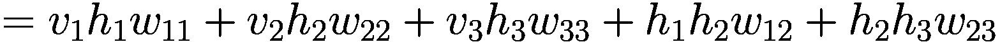

= 3 + (-1) + 2 + 2 + 1

= 7

我们现在知道 -E = -7，所以 *e*^(−*E*) = *e*⁷。

这样我们可以计算所有 *e*^(−*E*) 的值，对于上述所有组合，并找到总和。现在，我们将每个 *e*^(−*E*) 除以上述计算出的总和，以得到每个组合的概率。

现在，考虑一个你有很多可见和隐藏状态的情况。在这种情况下，枚举所有可能的组合，然后找出所有可见状态的概率变得计算上很困难。为了处理这个问题，提出了玻尔兹曼机。

玻尔兹曼机（BMs）和限制玻尔兹曼机（RBMs）都是随机神经网络的一种，但它们在结构和应用上存在显著差异。

霍尔兹曼机是完全连接的网络。受限的霍尔兹曼机具有二分图结构。前者计算量需求大，而后者的学习简单，通过对比散度（CD）完成。霍尔兹曼机通常用于解决优化问题，而后者用于特征学习和降维。后者实用，并且容易用更大的数据集进行训练。在了解了霍普菲尔德和霍尔兹曼机的基础之后，我们现在转向 Transformer。

## Transformer 的温和介绍

本节基于 Vaswani 等人撰写的原始研究论文“Attention is all you need”及其在纽约大学网站上的解释，由 Chinmay Hegde 撰写。

大型语言模型（LLMs）在过去的几年里变得极其流行，尤其是随着 ChatGPT 的出现。这些模型可以执行各种任务，例如

1.  文本摘要

1.  生成新文本

1.  修正现有的

1.  翻译（在一定程度上）

在这本书中，我们已经学习了循环神经网络（RNNs），它可以处理序列。我们已经看到了使用 RNN 及其变体进行情感分析、命名实体识别、生成下一个字符等应用。然而，RNN 在语言翻译等任务上表现不佳。

假设你旨在开发一个将英语转换为马拉地语的应用程序。你的应用程序接受一个英语输入句子并生成一个马拉地语句子。例如，如果输入句子是

“我吃米饭”

那么输出句子应该是

“我吃米饭”

注意，源语言中的第二个单词是“eat”，而在目标句子中它相当于第三个位置。这被称为错位，RNN 无法优雅地处理这个问题。同样，考虑另一个句子：

“我是一个好男孩”

那么对应的马拉地语句子将是

“我是一个好男孩”

注意，源语言中的句子包含五个单词，而目标句子有四个单词。在这种情况下，源语言中的单词数量可能不等于目标语言中的单词数量。在机器翻译中

1.  源语言中某个句子的单词数量可能不等于目标语言中的单词数量。

1.  可能存在错位。

为了解决这个问题，可以采用以下方法。我们不是创建一个词级 RNN，而是创建一个句子级 RNN。然而，这种方法可能不会很好地工作，因为对于给定的单词组合，可能有多个句子，模型可能无法准确理解上下文和位置。

第二种选择是创建一个编码器-解码器类型的架构，如第九章中解释的 RNN。在这里，我们将关注另一种解决这个问题的方法，这是现代 ChatGPT 的基础。

### 自注意力介绍

假设我们有一个句子(X)，由一些单词(x[i])组成，每个单词的维度为(d)。输出将是一个句子 Y，由 y[i]组成，也是一个 d 维向量。该句子包含集合*y*[1]，*y*[2]，*y*[3]，…，*y*[*n*]，使得

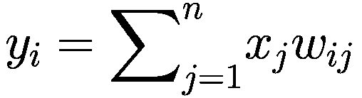

其中 w[ij]是输出中第 i 个向量与输入中第 j 个向量对应的权重。此外，w[ij]是行归一化的。在这里，初始权重被选为

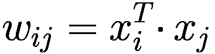

然后我们应用 softmax 函数来找到 W[ij]：

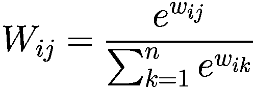

在此类模型中，单个输入通常被映射到一组输出。该模型能够考虑输入的所有单元。请注意，每个单词的嵌入可以通过某种传统方法或神经网络学习。该模型能够处理上述许多问题；然而，还有一些问题需要解决（图 12-5）：

1.  在此类模型中，系统输入，例如 x[i,]，与所有其他向量相乘以构建权重的序列：

    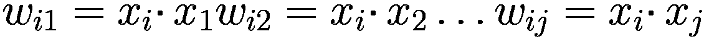

这个角色被称为“查询”。

1.  然后将其与每个其他点进行比较以获得输出的权重

    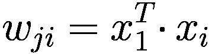

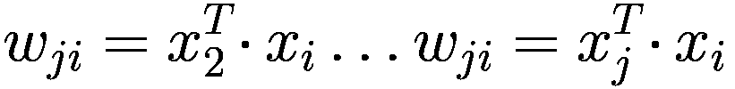

用于找到 y[i]。这个角色被称为“键”。

1.  然后将输出*y*[1]，*y*[2]，*y*[3]，…，*y*[*n*]综合起来。这个角色被称为“值”。

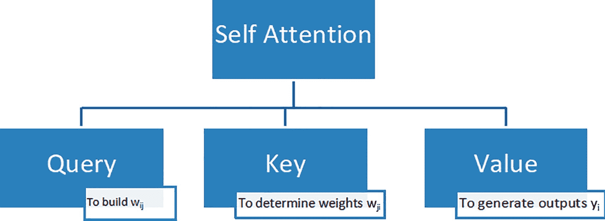

图 12-5

自注意力的组成部分

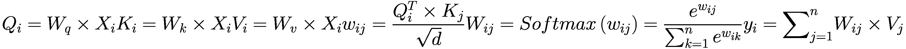

除了上述内容，我们还可以使用多头自注意力。感兴趣的读者可以参考本章末尾提供的参考文献，以了解多头自注意力的相关知识。

### Transformer

Transformer 由一个自注意力块、一个归一化层、一个多层感知器(MLP)和一个额外的自注意力块组成，如图 12-6 所示。

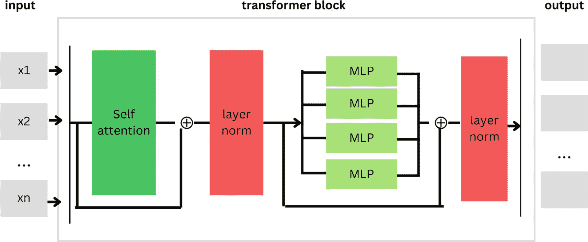

图 12-6

Transformer 架构

Transformer 具有许多优点：

1.  我们可以轻松地将多个 Transformers 组合在一起。

1.  它们使用完全前馈架构进行并行化。

1.  它们支持标准的反向传播进行训练。

1.  Transformers 具有高度的扩展性。

1.  他们高效地处理变长序列。

## 结论

本章涵盖了三个重要的模型：Hopfield 网络、Boltzmann 机和自注意力机制。这些模型是生成模型和现代模式识别技术的基础。每个主题都通过示例进行介绍。对于寻求更深入信息的读者，章节末尾提供了参考文献。除了上述内容，值得注意的是，自注意力机制和 Transformers 是 ChatGPT 背后的技术。

## 练习

### 多项选择题

1.  Boltzmann 机（BMs）和受限 Boltzmann 机（RBMs）之间最重要的结构差异是什么？

    1.  Boltzmann 机只在可见层和隐藏层之间有连接，而 RBM 是完全连接的。

    1.  Boltzmann 机是完全连接的，而 RBM 只有在可见层和隐藏层之间有连接。

    1.  Boltzmann 机没有隐藏层，而 RBM 有隐藏层。

    1.  Boltzmann 机使用监督学习，而 RBM 使用无监督学习。

1.  常用于训练受限 Boltzmann 机（RBMs）的学习算法是什么？

    1.  随机梯度下降

    1.  反向传播

    1.  对比散度

    1.  梯度提升

1.  在复杂性和训练方面，Boltzmann 机（BMs）与受限 Boltzmann 机（RBMs）如何比较？

    1.  与 RBM 相比，Boltzmann 机更简单且更容易训练。

    1.  Boltzmann 机和 RBM 具有相同的复杂性和训练速度。

    1.  与 RBM 相比，Boltzmann 机更复杂且更难训练。

    1.  与 Boltzmann 机相比，RBMs 更复杂且更难训练。

1.  以下哪项是受限 Boltzmann 机（RBMs）的常见应用？

    1.  解决优化问题

    1.  特征学习和降维

    1.  图像分类

    1.  自然语言处理

1.  Hopfield 网络是哪种类型的网络？

    1.  前馈神经网络

    1.  循环神经网络

    1.  卷积神经网络

    1.  生成对抗网络

1.  在 Hopfield 网络中，神经元通常持有哪种类型的值？

    1.  介于 0 和 1 之间的连续值

    1.  介于 -1 和 1 之间的连续值

    1.  二进制值（0 或 1）

    1.  二进制值（-1 或 1）

1.  Hopfield 网络的主要应用是什么？

    1.  监督学习

    1.  图像分类

    1.  模式识别和关联记忆

    1.  自然语言处理

1.  以下哪个是 Hopfield 网络的能量函数发生的情况？

    1.  当网络稳定时，它增加。

    1.  当网络稳定时，它减少。

    1.  当网络稳定时，它保持不变。

    1.  对于 Hopfield 网络，这个定义是不适用的。

1.  在神经网络中，自注意力机制最重要的目的是什么？

    1.  为了降低输入数据的维度

    1.  为了使网络在处理每个元素时能够关注输入序列的不同部分

    1.  提高网络的计算效率

    1.  使网络能够执行无监督学习

1.  在自注意力机制中，从输入向量中派生出的三个主要组件是什么？

    1.  输入、隐藏状态和输出

    1.  权重、偏置和激活

    1.  查询、键和值

    1.  层、节点和边

### 理论

1.  解释与自注意力机制相关的术语键、值和查询。

1.  解释如何使用玻尔兹曼机来完成给定的部分图像。

1.  解释霍普菲尔德网络的理念。解释此类网络的三种应用。

1.  解释 transformers 的结构。
