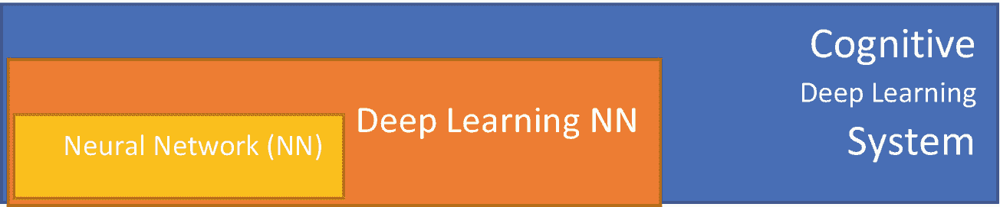
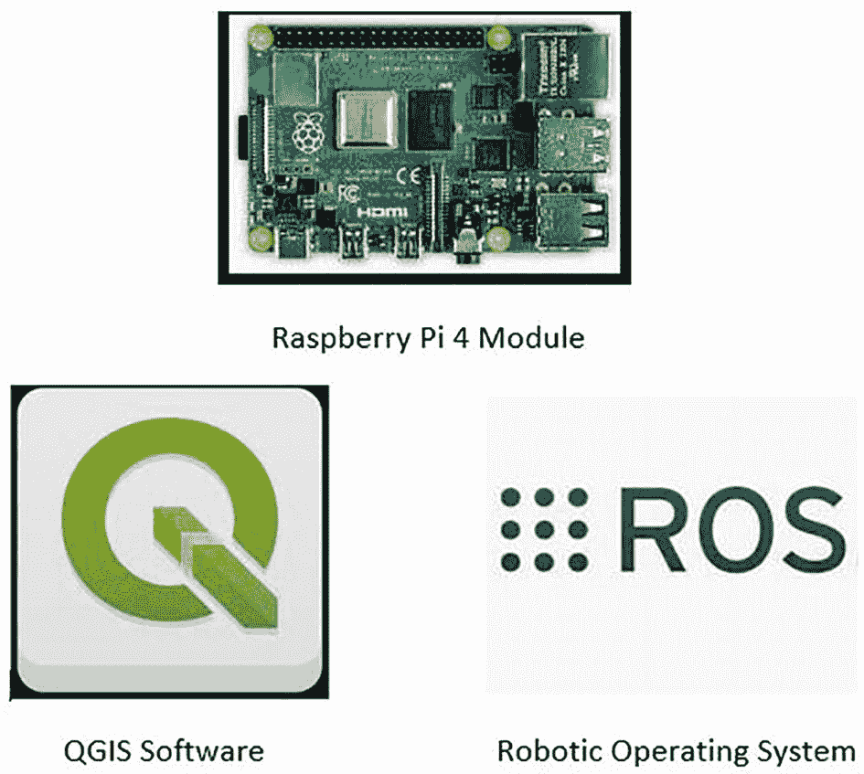

# 1. 探测车平台概述

想象一下：你是一名有抱负的工程师，也是一家名为高级技术与资源有限责任公司（Advanced Technologies & Resources, LLC，简称 ATR）公司的创始人。你的公司刚刚与埃及政府和埃及最高文物委员会签订了一份价值数百万美元的合同。埃及政府希望探索金字塔的内部区域。这包括吉萨大金字塔内的洞穴、井穴和坑道。然而，存在问题！一些洞穴和井穴容易发生突然坍塌，而且有可能存在金字塔建造者在公元前 2553 年设置的未检测到的“陷阱”。此外，一氧化碳等有毒气体在金字塔的墓穴中累积了超过 4500 年，使得这些区域对人类探险来说非常危险。

埃及政府希望在不对这些不安全且可能致命的洞穴或井穴派遣任何人类探险者或考古学家的情况下探索这些区域。然而，他们不能派遣标准机器人，因为连接的电线可能会对内部结构以及任何文物造成不可修复的损害。他们也不能派遣无线机器人，因为随着人类操作者与机器人之间距离的增加，无线电和数据链路会退化。因此，你必须设计、开发、编程、模拟、构建，并最终部署一个完全自主的人工智能探测车到感兴趣的区域（AOI）。它必须探索这些未知区域，而探测车不会因为坍塌或未检测到的陷阱而迷失方向。由于数据链路可能丢失，你必须在人工智能探测车中融入适应性智能。此外，在这些位于金字塔底部的未探索洞穴和井穴中，确实有可能找到法老胡夫和卡夫拉的失落宝藏（图 1-1）。

埃及吉萨金字塔和墓穴的静态图像。

图 1-1

埃及吉萨的金字塔和墓穴

注意

人工智能探测车需要尽可能的自给自足，以便在预期的墓穴探险任务中生存下来。

## 章节目标

通过阅读本章，读者将能够实现以下目标：

+   理解规格和需求的重要性

+   为此项目制定规格和需求

+   理解人工智能探测车的基本组件

+   认识到选择正确底盘的重要性

+   认识到机器人操作系统的重要性

+   认识到自动驾驶的重要性

+   认识到任务规划软件的重要性

+   了解智能功率分析的概念

### 定义规格和需求

您必须首先写下您的新 AI 漫游车应执行的操作以完成任务；例如，“避开障碍物”、“探索新区域”等。非正式地说，这些是“需求”。定义初始需求为我们规划开发提供了方向。正式地，软件开发规范和需求（SSR）的发展迫使我们首先思考我们希望系统执行什么。我们将创建一个基于认知深度学习的地面 AI 漫游车。地面 AI 漫游车将被设计来完成探索危险和未知环境的任务。

SSRs 是成功软件开发的关键。现在让我们将 SSRs 分解为其组成部分。需求是系统必须执行的任务（漫游车必须避开其路径上的物体）；规范是对如何满足需求的技术正式化（如果物体距离右侧象限小于 1 米，则漫游车将向左转）。随着对系统发现、纠正和更新的进行，SSRs 会演变。SSRs 拥有自己的生命，最终转变为读者在开发初期可能未曾设想的作品。

需求分为功能需求和非功能需求。例如，“漫游车应在操作员命令下返回任务”是一个功能需求。功能需求是通常由人类操作员发起或监督的需求。另一方面，“如果电池电量低于 50%，AI 漫游车应返回”是一个非功能需求。漫游车将在没有操作员输入的情况下返回。

**注意**  如果我们选择其他编程环境（Ada、C/C++、MATLAB、Java 等），AI 漫游车的功能将保持不变。这就是为什么选择编程环境是功能性的，因为我们可以在开发环境或 IDE 中查看源代码。

需求来自许多不同的来源（访谈、观察、表格、开发者等），并且并不总是容易理解。软件设计师已经使用通用建模语言（UML）来更好地理解需求。特别是，UML 用例图帮助我们理解功能需求。用例的进一步开发将引入成功的替代路径、前提条件和测试。这些工件反过来又允许我们生成规范。规范是对需求的正式化。任何合格的程序员都可以将其作为要编写的函数大纲来阅读。它们是编程语言无关的。

这意味着如果没有合理的需求，我们将不会有良好的功能规范！我们将使用 UML 来确保所有股东（技术和非技术）理解系统解决方案的逻辑和结构。

## 认知深度学习子系统（移动）

我们的漫游车必须在没有 GPS 或数据链的情况下搜索封闭区域。

由于这个原因，系统将需要自己思考。为此，我们将使用一个认知深度学习系统（图 1-2），这是一个使用由较小深度学习神经网络组成的网络，这些网络相互协作的系统。认知系统在从未经历过的条件下发展出半优解。换句话说，AI 漫游车可以在新的和意外环境中自主运行。

认知深度学习系统的示意图。三个同心矩形分别标记为：神经网络 N N、深度学习 N N 和认知深度学习系统。

图 1-2

可视化认知深度学习系统

创建认知深度学习系统所需的硬件和软件组件包括 Raspberry Pi 4、机器人操作系统（ROS）和 QGIS。Raspberry Pi 4 是硬件大脑；ROS 协调 Raspberry Pi 4 所需的传感器；QGIS 是认知深度学习系统数据的重大消费者（图 1-3）。

Raspberry Pi 4 模块、QGIS 和 ROS 之间协作的 3 部分插图。它由顶部标记为 Raspberry Pi 4 模块的芯片和底部 QGIS 软件和机器人操作系统的两个标志组成。

图 1-3

可视化 Raspberry Pi 4 模块、QGIS 和 ROS 之间的协作

我们为认知深度学习系统的硬件和软件组件选择以下理由：

1.  Raspberry Pi 4 可以处理认知深度学习控制器所需的广泛计算和命令。它还控制输入和输出设备，以控制速度、方向、轨迹和导航。对于其尺寸，它具有强大的功能和出色的扩展能力（USB 和通用输入输出[GPIO]端口）。

1.  机器人操作系统（ROS）控制模拟和物理 AI 漫游车。它允许我们快速将我们的认知深度学习系统与外部传感器和执行器接口。ROS 包含内部库，如同时定位与建图（SLAM）和 QGIS 用于导航。

1.  QGIS 在其“地图”上显示漫游车的传感器和位置数据。QGIS 对于开发路径和航点是必不可少的。这些航点允许 AI 漫游车重新访问感兴趣的区域（AOI）。QGIS 将通过 ROS 与认知深度学习系统通信。

1.  由于其低成本和已证明的可靠性，将使用 Pixhawk 4 自动驾驶仪。

### 基本系统组件

我们从 GoPiGo 机器人漫游车套件作为底盘开始，我们的硬件组件。在这个套件上，我们将使用 Raspberry Pi 4 作为主要处理单元，Pixhawk 4 作为自动驾驶仪。传感器包括激光雷达扫描传感器和标准 RGB 相机。

我们的软件组件以 Ubuntu Linux 18.4 作为项目开发的主操作系统。GoPiGo 探索车使用机器人操作系统（ROS）。我们使用 Python 3.0 作为编程语言。为了帮助测试和开发我们的 AI 探索车，我们使用机器人模拟器 Gazebo 和 Rviz。

### 系统原理（可选）

#### 系统接口

+   Raspberry Pi 4 的 USB 端口将与多个设备之间有接口，例如英特尔神经棒、Pixhawk 4 接口，以及可能还有地面控制站本身。

#### 用户界面

+   地面控制站将提供接口，该接口将在 Python 开发环境中开发。

#### 硬件接口

+   Raspberry Pi 4 模块内部有四个 USB 端口。Raspberry 4 还可以连接到英特尔神经棒，以实现更高层次的认知处理能力，这些将在稍后讨论。

+   Raspberry Pi 4 有一个单独的 GPIO 端口用于传感器和执行器。

+   Raspberry Pi 4 配备无线调制解调器，可用于连接互联网或 PC 或作为地面控制站的 Apple 笔记本电脑。

+   Pixhawk 4 具有 CAN（控制器区域网络）、以太网、SPI、I2C、USB 等。

+   Raspberry Pi 4 有一个单独的摄像头接口。

#### 软件编程要求

+   需要使用编程语言（Python）来支持低级设备，如 USB、SPI 和 I2C。

+   多线程：机器人中将有多个传感器和执行器。需要支持多线程。

+   任何 Python 开发环境

+   Raspberry Pi 4 Linux 操作系统固件

+   ROS 与 Raspberry Pi 4、Grass GIS 应用程序、传感器、执行器和自主飞行器接口。

+   Pixhawk 4 固件和 Mission Planner for Pixhawk 4。

+   Python 作为编程语言的表现。Python 有合理的能力处理由高带宽传感器生成的大量数据，例如摄像头和激光雷达。

#### 通信接口

+   （非完整列表。需要作为练习来完成。）

+   Raspberry Pi 4 模块具有以太网 TCP/IP、无线链路（Wi-Fi）、CAN、SPI、I2C 等。

+   Pixhawk 4 自主飞行器具有 CAN、SPI、I2C、以太网等。

#### 内存限制

+   Raspberry Pi 4 具有 1 GB、2 GB 或 4 GB LPDDR4-2400 SDRAM。

+   Raspberry Pi 4 可以升级到 500 GB 的固态硬盘驱动器。

+   Pixhawk 4 确实有一些额外的内存来编程，但目前限制在 128 KB（千字节）。

### 设计限制（可选）

#### 操作

+   搜索、检索、定位和救援。

+   在未知环境中定位目标和/或感兴趣的威胁。

+   探索未知环境。

+   交付物品或包裹。

#### 现场适应性要求

+   （目前尚未提供。然而，这可能会发生变化。）

#### 产品功能

+   Raspberry Pi 4、Pixhawk 自主飞行器和地面控制站之间进行通信的能力；这些是自主陆地 AI 探索车的主要通信节点。

+   在 Raspberry Pi 4 节点内，AI 巡游车的所有智能功能将执行刚刚讨论的“操作”部分中所述的操作。

#### 用户特性

+   用户有权限部署车辆进行自主地面任务。

#### 约束、假设和依赖

+   巡游车电池的功率限制

+   AI 巡游车可能遇到的地面

+   随着我们构建这辆车的进展，将识别出额外的约束。

### 其他需求（可选）

#### 外部接口需求

+   自主陆地 AI 巡游车的外部电气接口需求将是 Raspberry Pi 4、Pixhawk 自动驾驶仪和 AI 巡游车套件内的 PID（比例积分微分）控制器之间的互连设备的电压和电流要求。

+   我们将在本书的后续章节中找到陆地 AI 巡游车本身的额外外部接口需求。

#### 功能需求

+   满足所有之前声明的需求。

#### 性能要求

+   随着我们通过本书的后续章节，我们将揭示 AI 巡游车的实时特性。

+   这也将导致我们对 SSR 进行修订，以及随后的 UML 图和基于 SSR 的用例。

#### 逻辑数据库需求

+   目前还没有。然而，我们可以补充陆地 AI 巡游车中发现的 GIS 应用，以支持未来版本中的数据库需求。

### 软件系统属性（可选）

#### 可靠性

+   自主驾驶和自主探索的陆地 AI 巡游车的可靠性至关重要。我们将看到软件规范、UML 用例图和 AI 巡游车模拟器都对一个完全运作的系统做出了贡献。我们将看到，随着 SSR 的发展，可靠性可以融入任何 AI 巡游车系统从其最初起源。

#### 可用性

+   自主 AI 巡游车必须能够对传感器数据进行响应。它必须能够快速将信息以命令的形式发送到 AI 巡游车的执行器和电机。

+   自主 AI 巡游车必须能够向地面控制站发送数据并接收数据。

+   自主 AI 巡游车必须能够高效地使用 GIS 信息，并基于这些空间数据做出决策。

#### 安全性

+   自主式 AI 巡游车必须具有有限的情境意识，并且能够对环境中的威胁做出响应。

+   它还必须避开可能导致 AI 巡游车被困在碎片、岩石或障碍物之间的探索区域或地形的潜在区域。

#### 可维护性

+   AI 巡游车的软件和硬件必须通过测试、文档和升级来保证可维护性。

+   人工智能漫游车软件必须有文档，并应在 SSR、UML 图和用例图中维护。软件源代码或 UML 图或用例图中的任何后续更改都必须保持一致。这意味着如果您对源代码进行了任何更改，您必须更新您的 UML 图以反映该特定软件更改，反之亦然。

+   人工智能漫游车硬件也必须有文档，并且必须有符合规范的清晰原理图。任何硬件的更改也必须在硬件原理图或规范中进行更新。

#### 可移植性

+   使用 Python 将允许我们在多个平台上导出和测试在人工智能漫游车和地面控制站中运行的控制系统软件。这些平台包括 Raspberry Pi 4、开发笔记本电脑，甚至可能是用于测试和分析这些 Python 程序的基于云的互联网系统。

### 架构（可选）

#### 功能分区

+   软件组件之间也将进行分区。

+   硬件组件之间也将进行分区。

+   在阅读本书的过程中，我们将不得不决定如何对这些功能组件进行分区。

#### 功能描述

+   功能硬件描述如下：

我们有一个连接到自动驾驶仪的 Raspberry Pi 4 模块（可能带有可扩展的英特尔神经棒），该自动驾驶仪随后连接到 PID 或控制电力电子设备，为人工智能漫游车提供电力和控制信号。自动驾驶仪或笔记本电脑与 Raspberry Pi 4 之间的无线连接将允许陆地人工智能漫游车向地面控制站发送和接收信息。

+   非功能软件描述如下：

我们在 Raspberry Pi 4 中运行多个 Python 程序，这些程序负责认知深度学习程序、人工智能漫游车套件的驱动系统控制以及与 Pixhawk 4 自动驾驶仪的通信软件接口。同样，地面控制站内也将有 Python 程序，作为人类操作员与陆地人工智能漫游车的远程连接。

#### 控制描述

+   软件和硬件必须允许陆地人工智能漫游车避开障碍物并完成任务。此外，如果需要，人类操作员可以覆盖人工智能漫游车做出的决定。

+   人工智能漫游车必须与传感器接口，例如陀螺仪、惯性测量单元、加速度计和 GPS。这允许对陆地人工智能漫游车的轨迹、速度和加速度进行必要的控制。

+   认知深度学习算法随后将能够从传感器接收数据。这将允许漫游车在正确的轨迹、速度和加速度公差内，有效地探索未知环境。

+   所有这些都必须在一个闭环反馈控制系统中。

## 人工智能探测车统计分析（移动）

为什么要在我们的人工智能探测车开发中使用统计分析？

许多寻求完成复杂项目的人只关心创建一个工作原型。由于 Raspberry Pi 4 的内存资源有限，我们将对软件实现进行统计分析。这种分析的目的在于识别、定位和消除源代码中的低效区域。

我们将回顾实现认知深度学习网络优化的技术。在计算机科学中，优化指的是确定程序的速率-时间以增加其效率。我们将逐步分析算法、实现和人工智能探测车操作系统的优化。我们还可以利用这些相同的实现来查找认知深度学习节点、Raspberry Pi 4、Pixhawk 4 自动驾驶仪以及机器人人工智能探测车套件的 PID 控制电子设备之间的通信问题。

我们将使用这些优化技术来查找通信或控制问题。我们还将查看 Raspberry Pi 4 中的视觉处理程序，以确定计算机视觉算法是否导致认知任务规划程序或控制程序近实时处理的问题。

因此，我们还将回顾以下标准问题：

+   我应该收集人工智能探测车的哪些测量数据？

+   我应该测试哪些数据或命令输入到人工智能探测车中？

+   我如何解释和分析从测试人工智能探测车中获得的数据？

这些问题是重要的，我们将在在机器人仿真环境中测试探测车时回答这些问题。一旦我们对仿真结果满意，我们可以确认操作系统完全功能。然后我们将下载我们仿真训练的认知人工智能控制器的图像到我们的物理 Raspberry Pi 人工智能探测车中。这被称为为人工智能探测车创建一个“数字孪生”。

实验算法技术通过识别问题区域来促进更好的算法设计。这可以提高控制和认知深度学习程序，如决策和控制、内存层次结构和任务分析。

将使用贝叶斯非参数方法来回顾认知深度学习程序的非参数回归和分类。这确定了这些认知深度学习程序和/或模型中存在的不确定性。将有两个这种不确定性测试的例子。第一个是确定人工智能探测车与墙壁边缘的距离。另一个是识别人工智能探测车将要运行的地面。这种地形分析将包括对周围地形拓扑结构的“行”或“不行”分析，以确定地形是否安全供人工智能探测车行驶。这也有助于理解人工智能探测车所需的任务分析。

### 选择底盘

我们项目的核心是用于机器人控制和任务路径寻找的认知智能引擎；它创建了一个极其适应性的机器人平台。因此，我们可以使用许多不同类型的机器人底盘。轮式底盘将实现良好的效率，具有简单的机械实现。

利用轮式底盘的额外优势是赋予机器人的优秀平衡。这意味着 AI 漫游车的所有四个车轮都将与地面接触，认知深度学习引擎将不需要适应不稳定运动系统的动力学。然而，认知深度学习引擎可以对问题进行适应，例如一个车轮损坏的情况。AI 漫游车将需要有一个悬挂系统，以在崎岖地形上保持车轮的持续接触。

AI 漫游车需要关注与牵引力、稳定性、机动性和控制相关的问题。任何可以与 Raspberry Pi 4 和 Pixhawk 4 自动飞行器接口的现成机器人 AI 漫游车套件都可以用于本书中的练习。关键问题是车轮是否提供了 AI 漫游车覆盖所需地形所需的牵引力和稳定性。如果 AI 漫游车的车轮在自主任务期间无法承受 AI 漫游车的速度、加速度、快速转弯和轨迹，会怎样？本章末尾有一份商业可用的机器人套件列表，可用于完成每章包含的练习。

### 机器人操作系统

机器人操作系统（ROS）旨在成为一个适应性强、支持业余爱好者、学生和有志工程师在开发机器人软件时使用的平台。这个平台包含了一系列工具、库和开发环境，旨在简化创建复杂和适应性强机器人平台这一艰难任务。这些工具包括用于模拟机器人系统（如我们的 AI 漫游车）的模拟环境，包括传感器、物理、时间以及 AI 漫游车和环境动力学。ROS 使我们能够迈出第一步，构建一个认知自主控制器 AI 漫游车系统。ROS 使我们能够集成 SLAM 3D 地图算法，并利用地理空间信息学的可能性来分析感兴趣的环境目标。所有这些功能都作为库提供，可以被我们开发在 Anaconda Python 开发环境中的认知深度学习程序导入或引用。

### Pixhawk 4 自动飞行器

Pixhawk 4 自动飞行器用于车辆的非决策控制以及简化输入和输出之间的连接。决策来自评估车辆条件和状态的操作员。自动飞行器通常是嵌入式计算系统，用于控制车辆的动作机构和 PID 控制。

将使用自动驾驶仪进行错误纠正和向 Raspberry Pi 4 内部的认知深度学习程序提供纠正反馈。认知智能引擎和自动驾驶仪将协同工作以纠正*任何*错误并返回所需的任务参数。因此，我们可以使用两种自动驾驶控制结构。第一个将是 AI 漫游车自身的位置，第二个将是速度和/或 AI 漫游车的轨迹。因此，Pixhawk 4 自动驾驶仪将始终保证 AI 漫游车遵循所需的位姿轮廓。如果认知处理器决定以高速移动车辆并急转弯，这可能导致 AI 漫游车在任务期间翻车。自动驾驶仪将通过警告认知处理器危险来防止这种可能性。

AI 漫游车将通过模拟进行训练，并在任务期间通过操作获得额外的训练/强化。使用 Pixhawk 4 自动驾驶仪增加了额外的备份电子设备。其中之一是数据链路，允许人类操作员接管 AI 漫游车的控制权。使用 Pixhawk 4 自动驾驶仪的另一个优点是任务规划器软件，它允许人类操作员确定任务状态。这使得 AI 漫游车能够远程访问其自己的 GCS。

### AI 漫游车任务分析

任务分析将考虑 AI 漫游车需要执行的地面操作。这取决于其任务。任务将是简单的“跟随路径”操作还是更复杂的操作？

因此，每个 AI 漫游车任务将使用以下八条规则：

1.  定义任务。AI 漫游车需要克服哪些挑战？

1.  确定完成任务的任务。AI 漫游车需要完成哪些目标？

1.  运营规划。这包括在 AI 漫游车中放置哪些类型的传感器、电源供应，甚至可能是 AI 漫游车的悬挂系统。

1.  风险评估。AI 漫游车任务操作中是否存在相关的威胁、危险或不确定性？

1.  传达风险评估。确保工程师、程序员等知道 AI 漫游车将执行的任务。

1.  管理和最小化风险（风险管理）。确保 AI 漫游车能够有效地避开所有障碍和危险。

1.  执行任务。执行任务。

1.  监控和重新评估。检查认知深度学习程序作为 AI 漫游车自主控制器的作用如何。是否遇到了任何异常、故障或碰撞？

### AdruPilot 任务规划器软件

AdruPilot 任务规划器（AMP）是将成为地面控制系统（GCS）的软件，并且可以集成在 Python 开发环境中。任务规划器软件赋予 AI 漫游车以下能力：

+   使用 Google Maps/Bing/Open street maps 进行点对点航点输入。AI 探测车从航点移动到航点，并利用其认知能力在连续航点之间感知和避开障碍物。

+   从下拉菜单中选择任务命令。因此，在任务操作期间，人类操作员对 AI 探测车拥有最终控制权。

+   下载任务日志文件并分析它们。人类将能够检查 AI 探测车在任务中的表现（例如，任务期间是否有任何碰撞？）。

+   为您的“机架”配置 AMP 设置，在这种情况下，将是 AMP 支持的四个轮子的 AI 探测车系统的实际底盘。

+   与 PC 飞行模拟器或可编程开发环境接口，创建一个全硬件在环的 AI 启用 AI 探测车模拟器。这种接口能力将允许 Anaconda Python 环境通过 GIS 库（QGIS、Grass GIS 或甚至 Google Earth）与任务规划器软件接口。我们可以在每次任务之前广泛测试认知引擎。

+   查看来自 AI 探测车的 AMP 串行终端的输出。

### AI 探测车电力分析

探索埃及的洞穴将需要探测车的耐力。在开发阶段的模拟阶段，将进行电力分析以提高探测车的耐力。这将通过所有后续任务不断改进，以增加持续时间和电力利用效率。将应用一个一般原则到 AI 探测车的耐力上。当探测车的电池达到 50%时，车辆将掉头返回家中。这种返回家中的操作将使用由 AI 系统确定的最高效路径。

### AI 探测车面向对象编程

面向对象编程（OOP）的优点在于开发更快、更便宜，软件可维护性更好。不幸的是，学习曲线更陡峭，软件运行速度较慢，并且占用更多内存。因此，我们将使用 UML 来帮助我们编程探测车。

面向对象（OOP）范式使用对象和类的概念。可以将类视为对象的模板。这些对象可以拥有它们自己的属性（它们所拥有的特征）和方法（它们执行的动作）。所有这些对象和类都可以在 UML 格式中轻松地进行建模和评估。

### 组件列表

+   Raspberry Pi 4 模块

+   Intel 神经棒 USB 驱动协处理器

+   机器人 AI 探测车套件

+   任何配备现代 PC 处理器的标准笔记本电脑

+   Pixhawk 4 自动驾驶模块的最新版本

+   机器人操作系统软件的最新版本

+   AdruPilot 任务规划器的最新版本

+   StarUML 或任何其他 UML 开发环境

### Raspberry Pi 探测车套件列表

+   Dexter Industries 的 GoPiGo 机器人探测车平台

+   Yahboom 为 4B/3B+项目提供的 Raspberry Pi 机器人套件，配备高清摄像头，可编程的 4WD 机器人卡车，成人电子教育 DIY 套件（不包括 Raspberry Pi）

+   Adeept 火星漫游车 PiCar-B WiFi 智能机器人车套件，适用于 Raspberry Pi 3 Model B+/B/2B，语音识别，OpenCV 目标跟踪，视频传输，STEM 教育机器人，附带 PDF 说明书

+   4WD 机器人底盘套件，配备 4 个 TT 电机，适用于 Arduino/Raspberry Pi

我们选择了 GoPiGo Rover 平台进行这个项目。其他套件也是有效的；然而，GoPiGo Rover 平台是我们的选择。

### 缩写

+   SSR (软件规格和要求)

+   GCS (地面控制站)

+   ROS (机器人操作系统)

+   GIS (地理空间信息)

+   SLAM (同时定位与建图)

+   GPIO (通用输入输出)

+   PID (比例积分微分)

+   LiDAR (光增强探测与测距)

+   IMU (惯性测量单元)

额外加分

练习 1.1：你会对初始 SSR 文档版本 V1.1 做出哪些额外的修改？

练习 1.2：为什么 SSR（软件规格和要求）对于开发机器人深度学习系统的初始阶段如此关键？

练习 1.3：为什么统计方法对于发现深度学习系统和机器人中的低效问题如此关键？

练习 1.4：统计方法能否用于识别认知深度学习网络的不确定性问题？如何以及为什么？

练习 1.5：什么是实验算法学？它们如何帮助我们优化 AI 漫游车的优化技术？谷歌可能是一个回答这个问题的必备参考资料。
