# 2. AI 漫游车系统设计和分析

我们的目标是开发一个能够在埃及地下墓穴执行探险任务的自主人工智能漫游车。人工智能（AI）系统，如 AI 漫游车，复杂且难以理解。利用第一章的非正式背景故事，我们将“绘制图表”以更好地理解我们复杂的问题。我们将使用通用建模语言（UML）图来理解系统的结构和行为。模型是复杂想法的简化。例如，牛顿第二定律试图解释动量的物理。这是一个非常好的近似，但并不完全准确。它忽略了重力、摩擦等因素。但它*确实*是有帮助的。

*“所有模型都是错误的，但有些是有用的。”*

——乔治·博克斯

因此，为了帮助我们理解复杂的漫游车系统，我们将使用 UML 图来模拟我们不太了解的部分，这些图在建模结构和行为方面非常有帮助。UML 的最佳之处在于它可以帮助我们理解模糊、定义不明确的问题，将我们从一个非常非正式的问题描述带到其正式的需求和规范。您不需要复杂的软件来绘制 UML 图，因为您可以手动绘制。使用 UML 开发的软件的一个显著优点是，一些程序将生成由类图定义的结构的基本骨架代码。

首先，我们在非常高的层次上对问题进行建模。我们不必一开始就了解所有内容，只需足够了解“范围”问题即可。当我们对问题理解得足够好，可以创建一个完整的解决方案时，我们就会停止。如果我们仍然不知道如何解决问题，我们将扩展我们不完全理解的模型部分，以更好地理解解决方案的一部分。我们可以开始开发解决方案，如果我们遇到困难，我们可以退后一步，通过更详细地建模这部分问题（即，在牛顿方程中添加摩擦成分）来重新审视这个问题。

尽管 UML 图看起来与穴居人的艺术非常相似，但它们对于高级建模或理解复杂系统非常有帮助。因此，让我们开始制作“有用”的模型。

## 章节目标

通过阅读本章，读者将能够实现以下目标：

+   回顾 AI 漫游车的软件规范和需求。

+   使用通用建模语言（UML）框架进行 AI 漫游车的面向对象软件开发。

+   创建 UML 用例以满足需求。

+   理解功能和非功能需求之间的区别。

+   确定 AI 漫游车的功能和非功能需求。

+   学习如何处理 AI 漫游车中的复杂性。

+   理解软件和硬件设计的五个层次。

+   回顾本章所需的软件工具。

+   理解 AI 漫游车的静态和动态特性。

## 将问题置于上下文中

理解属于系统和不属于系统的内容是我们的第一步。这定义了系统的上下文。为了完成这个任务，我们首先需要定义代表我们的探测车的“黑盒”。黑盒系统意味着我们知道它有输入和输出，但我们不知道输入是如何产生输出的（图 2-1）。

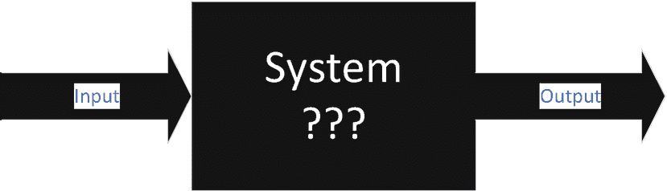

黑盒系统的图。它由一个标记为输入的右箭头指向一个标记为系统的正方形，其下方有三个问号。正方形右侧还有一个标记为输出的右箭头。

图 2-1

黑盒系统

用简单的英语定义我们的系统，而不是工程术语。我们第一次尝试写目标时是“一个能够探索未知环境的智能探测车。”这很简单，很直接，但它完整吗？目前，我们将它视为“足够完整”，但当我们更好地理解问题后，我们可能会扩展它。

如此描述，它给出了一个系统的描述，说明了系统中有什么（探索任务、智能等）以及系统中没有什么（搜索和救援任务、机器人杀手等）。尽管上下文图不是 UML，但我们将创建一个简单的上下文图——首先，我们从系统描述开始，将其视为一个黑盒。

接下来，我们试图弄清楚谁或什么会与我们的黑盒交互。与系统交互的事物被称为演员。在我们的书中，演员被绘制成椭圆形。

在我们的探索问题中，我们从一个演员开始。演员“操作”探测车，就像遥控车一样，通过“启动探测车”、“导航探测车”和“结束探测车上的任务”（图 2-2）。

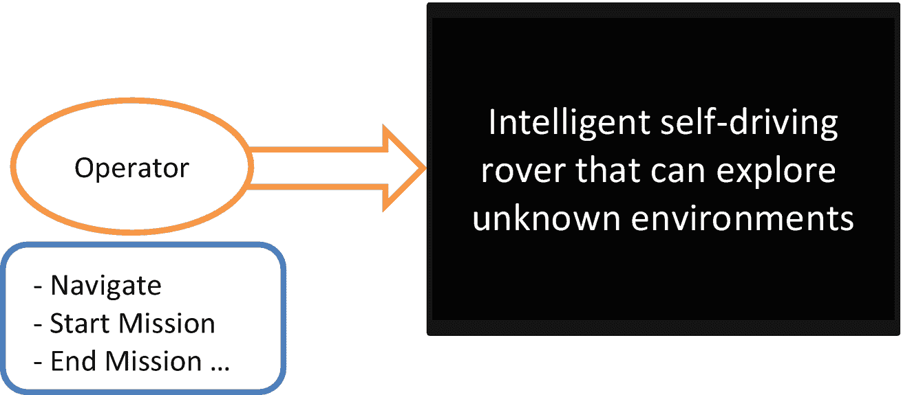

添加演员的示意图。一个标记为操作员的椭圆形指向右侧的一个方框，标记为“能够探索未知环境的智能自动驾驶探测车”。操作员下面的方框标记为“导航”、“启动任务”和“结束任务”。

图 2-2

添加演员

接下来，我们试图定义交互将是什么。我们不在乎交互将如何实现，只关心它们被列出。主管不会像遥控车一样直接控制探测车，而是主管计划任务，告诉探测车“启动任务”、“停止”、“返回”等（图 2-3）。操作员可能指示探测车“停止”、“向左转”等。由于探测车是自主的，它必须观察环境并向自己提供输入以“改变方向”、“停止”、“返回”等。注意，每个交互的形式是*动词-名词*或*动词*。

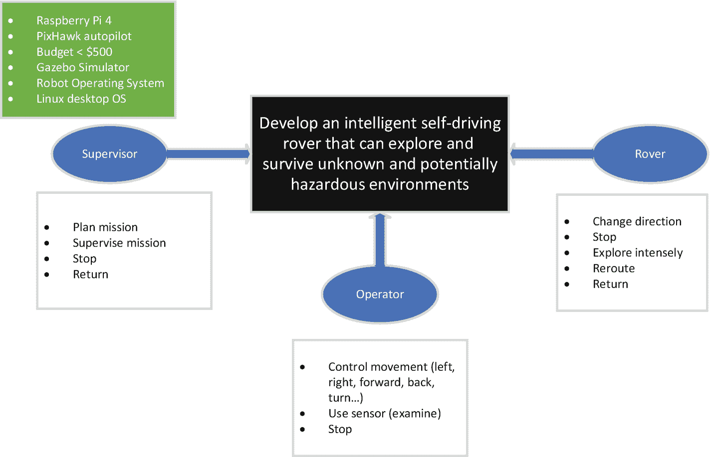

带有约束的上下文示意图。一个标有“开发智能自动驾驶漫游车”的框分为监督者（带计划和管理任务、停止和返回）、操作员（控制移动、使用传感器和停止）以及漫游车（改变方向、重新规划路线等）。顶部有一个列表，包括 Raspberry Pi 4、Linux 桌面操作系统等。

图 2-3

带有约束的上下文图

在我们的上下文图中，最后一步是确定我们系统上的限制。这些被称为约束，可能基于硬件、软件或商业原因。例如，我们将使用 Raspberry Pi 4——这意味着我们有一个基于四核 1.5 GHz Arm Cortex-A72 处理器的处理器。它不会运行得更快。它可以有高达 4 GB 的 RAM，不能再多了。Pixhawk 芯片将作为我们的自动驾驶系统，从而限制我们的功能。我们在购买整个系统时将花费少于 500 美元。这些都是我们在开始时必须记录的约束，以便我们将解决方案的搜索限制在约束的范围内（图 2-3）。

到目前为止，我们已经足够理解问题。我们没有足够的信息来完成解决方案，但我们已经看到了复杂性的曙光。显然，项目比这个图所暗示的要大，但我们可以随着对问题的更深入理解来修改这个图。上下文图也开始帮助我们理解功能和非功能需求。约束是非功能需求的例子，每个参与者下面的列表是功能需求的例子。

## 为 AI 漫游车开发第一个静态 UML 图

我们将继续讨论为 AI 漫游车开发基本的适应性导航系统。我们应该指出，在这个意义上，“适应性”一词的意思是机器人能够在其行驶路径中停止并避免与遇到的障碍物相撞。我们将在本手稿的后续章节中看到，我们将开发感知和避免能力，这将使漫游车能够开发替代路径，帮助它绕过其路径中的障碍物。AI 漫游车确定替代行驶路径的未来发展将对其在埃及大金字塔底部下降和探索时遇到的障碍物进行规避至关重要。

对 AI 洞察者每个组件进行静态建模的目的是设计 AI 洞察者硬件部分、AI 洞察者内部的软件组件以及环境（模拟或物理）之间的接口。这样做是为了创建正在开发的 AI 洞察者的静态结构，以便开发类图（在这种情况下是 AI 洞察者自适应导航组件的起点）。这对于开发 AI 洞察者近实时性质所需的 Python 程序尤为重要。因此，可以通过对连接到 AI 洞察者不同软件和硬件组件的系统类进行静态建模来开发系统上下文类图。例如，请参阅图 2-4 中的类图。

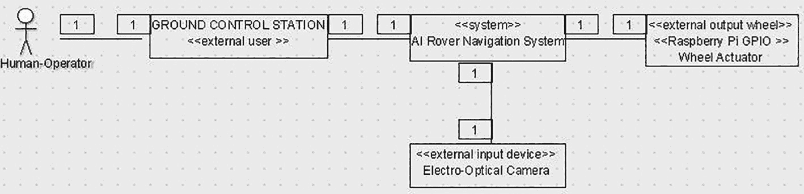

这是相机导航的类图。它包括人机操作员、地面控制站的外部用户类、AI 洞察者导航系统的系统类、外部输出轮，以及轮执行器的 Raspberry Pi GPIO 类。系统类包括光电相机的外部输入设备类。

图 2-4

相机导航的类图

现在我们来回顾一下图 2-4 中找到的内容。我们已经为图 2-3 中开发的第一用例开发了上下文类图。上下文类图揭示了系统需要如何与外部设备或参与者进行接口。AI 洞察者的导航系统通过地面控制站接受来自人机操作员的命令。这个命令然后告诉机器人它需要在网格图中前往哪个目的地。在我们的案例中，我们选择将光电相机与 AI 洞察者导航系统接口。还有其他传感器可以与这个接口一起使用，例如激光雷达、超声波和接近传感器。上下文类图的关键需求对应于 AI 洞察者导航系统、连接的相机传感器、通过 Raspberry Pi 的 GPIO 连接的输出轮执行器设备以及与地面控制站和人类操作员的外部交互。我们还可以轻松地向系统中添加计时器，定期向轮执行器发送更新命令，以便轮执行器能够对方向更新做出更快的反应。

开发静态类图的主要目的是为了让我们能够为 AI 漫游车的自适应导航组件创建动态建模的基础。开发该静态模型的另一个主要目的是将导航组件的问题分解为系统内的对象。这个过程的一个关键部分是确定导航组件的外部接口。这些接口对象包括轮子执行器接口、地面控制站接口和传感器接口。现在我们需要考虑如何开发必要的控制对象，以使 AI 漫游车能够正确运行。这些控制对象对于在用例和导航组件的静态建模中定义的对象之间提供协调和协作至关重要。控制对象的例子包括协调器、状态相关控制、任务计时器以及相机控制或相机视觉信号处理。因此，还将有存储内存对象，它们存储需要包含在导航控制中才能使其操作有效的内存；它们将是导航地图（可能使用 QGIS）、已确定的驾驶路径、目的地和当前地图位置（可能是来自 GPS 的数据）。使用当前地图位置和任务计时器可以让我们预测 AI 漫游车从当前位置移动到目标位置的任务持续时间和功率消耗特性。我们还可以使用任务计时器来确定 AI 漫游车是否陷入了一个无法逃脱的位置，以及漫游车是否因为 AI 漫游车到达预定目标位置所花费的不满意的时间而需要关闭电力并节省能量。这可能发生在漫游车翻到一边或被困住，无法继续前往最终目的地点的情况下。此类事件需要由我们的任务计时器处理。我们还可以将我们的任务计时器和导航计时器指定为同一对象。任务或导航控制计时器将由导航控制对象控制。我们还需要向读者指出，导航控制对象本身最终将由我们目前正在创建的认知深度学习智能引擎对象控制。

随着我们为我们的导航系统开发对象结构，我们可以看到我们可以在导航系统的内部结构中添加定位器和路径规划算法。通过利用面向对象编程范式，我们可以测试不同类型的定位器和路径寻找算法，以进行统计分析、测试并确定这些算法组中哪一个是最计算高效的。例如，我们可以通过统计分析来确定 A*算法在作为探索埃及地下墓穴的主要路径寻找算法的角色中是否是理想的。因此，我们可以回顾图 2-5 所示的导航系统类结构图。

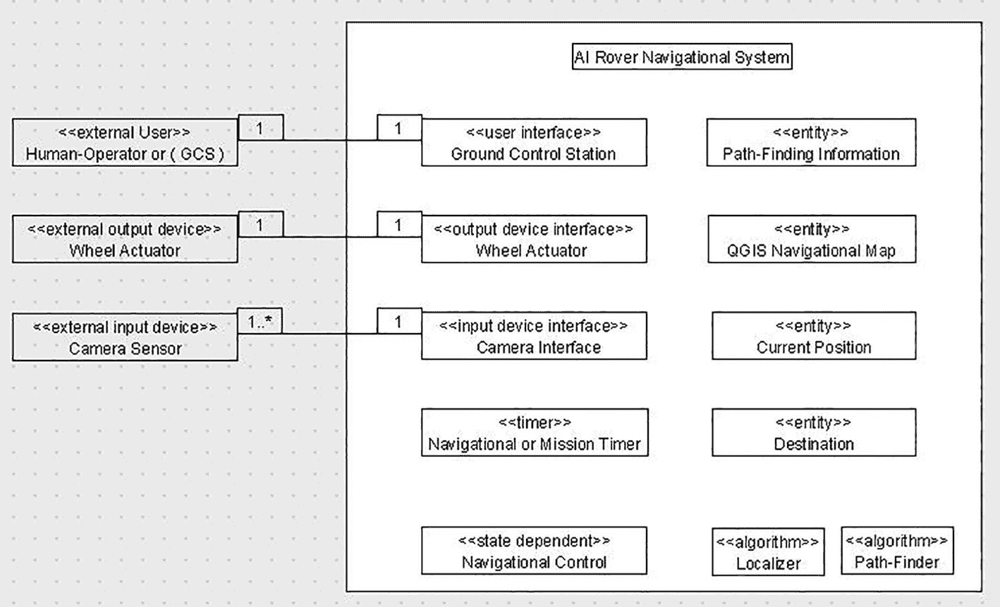

人工智能漫游车导航系统的类图。C G S 的外部用户有地面控制站和路径寻找信息，轮执行器的外部输出设备有轮执行器和 Q G I S 导航地图，摄像头传感器的外部输入设备有摄像头接口和当前位置。它还包括任务计时器、定位器等。

图 2-5

人工智能漫游车系统类关联关系

## 开发人工智能漫游车的第一个动态 UML 图

动态建模的目的是捕捉和理解人工智能漫游车系统的动态特性，以便我们能够理解其后续组件。值得注意的是，动态图利用了在人工智能漫游车导航系统对象结构化过程中识别出的初始用例和静态绘图过程中的交互，如图 2-5 所示。

到目前为止，应该很明显，面向对象的设计方法如何使我们能够开发具有可扩展复杂性的系统。我们现在能够在软件和硬件中可视化最初开始形成的第一个机器人结构。我们现在可以开始开发模块化控制结构，最初由深度学习网络组成，后来在这些深度学习网络之上构建认知架构。这种模块化控制结构还将使我们能够创建与接口组件相关的专用组件，例如激光雷达和摄像头传感器。这些软件组件中的每一个都将作为最终创建人工智能漫游车的一个砖块。

我们将在第三章中回顾的机器人操作系统（ROS）也将使我们能够开发一个基于 AirSim 和 Gazebo 模拟以及现实世界系统组件的通用机器人控制软件包。ROS 最近版本中已经存在的模块化和灵活性将允许我们实验并开发内置认知引擎的复杂机器人系统。使用 ROS 还将使我们能够集成运动学、动力学、控制、决策、有限情境感知和软件-硬件接口的组件。每个这些项目都将是一个可以添加或删除在 ROS 开源开发环境中的类或对象。

在我们进入实际动态模型开发之前，需要回顾的最后一步是关于 AI 漫游车静态建模部分所讨论的机器人导航任务的业务流程。这个任务最初由我们的深度学习程序控制，然后最终由构建在其之上的认知引擎控制，由于涉及大量交互和控制组件，因此肯定需要在面向对象框架内进行建模。需要解决的一个问题是自定位，这是导航的主要目标之一。导航系统接收到的信息是目标与目标之间的方向和距离。AI 机器人还必须处理由传感器和环境不确定性引起的误差。因此，我们将回顾业务模型图，它表示移动机器人认知深度学习导航系统必须如何操作。这个系统是在考虑分层范式的情况下开发的。AI 漫游车以及决策制定认知深度学习引擎，只有在处理传感器读数并规划驾驶路径后才会行动。认知深度学习系统允许机器人在静态环境中执行导航任务，在这种环境中没有物体移动，例如在埃及地下墓穴中。一旦导航任务开始执行，AI 漫游车将完成来自所有可用传感器的信息的新循环，然后由认知深度学习引擎产生的单个移动命令（前进、后退、左转或右转）结束。最终，在本书的后续章节中，每次前进或后退移动命令覆盖的距离以及每次左转或右转命令的攻击角度将最终由认知深度学习引擎本身产生。

注意

请注意，我们将密切审查和描述业务逻辑的子部分，这些子部分将描述 AI 漫游车探索埃及地下墓穴和金字塔外部结构所需的导航和认知深度学习过程。这个业务逻辑对于帮助我们创建 UML 类图至关重要。这部分文本需要仔细阅读和检查以理解。

因此，这个过程的第一部分必须从业务逻辑图的开始处开始。当自适应导航任务开始时，第一个过程，以一个方框的形式出现，将从激光雷达、超声波、接近传感器和 Raspberry Pi 4 摄像头获取传感器读数。执行的第一个过程（在图中以方框表示的过程）是传感器读数。然后，这些信息被发送以更新传感器数据资源数据库。所有数据库在业务逻辑图中都表示为圆柱体。传感器数据是传感器过程检索到的所有传感器空间坐标的列表，数据通常利用笛卡尔坐标系。这些坐标通常是起点在机器人处，终点在埃及地下墓穴内检测到的障碍物内的向量的终点。这意味着坐标表示了机器人在进行传感器采样时的位置，以及由同一传感器检测到的对象的相应计算距离和传感器数据点的坐标。图 2-6 表示了 AI 漫游车自适应导航任务这个最初阶段的 UML 业务逻辑图。

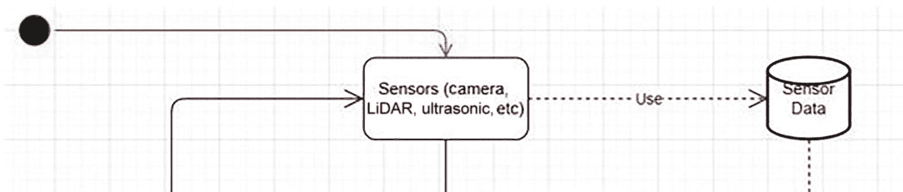

传感器和传感器数据库的逻辑图。左上角的一个黑色圆圈和一条向右弯曲的箭头指向传感器，如摄像头、激光雷达和超声波传感器。传感器进一步通过一条虚线向右指向一个圆柱体，标记为传感器数据，通过使用。

图 2-6

传感器和传感器数据库的业务逻辑图

注意

请注意，本书中关于 AI 漫游车自适应导航任务的每一个过程和数据库都将在其正确和相应的章节中从概念和逻辑上进行全面描述。记住，这个 AI 漫游车需要生存。

一旦传感器处理完成，将会有另一个过程需要执行。这个后续过程被称为 SLAM 或视觉处理分析过程。SLAM，即同时定位与建图，是一种用于处理二维或三维地图的统计算法，从而确定机器人在不断扩展的地图中的位置。我们还将讨论 SLAM 的地图处理可能因内存分配问题而受限。对于这个版本的 AI 漫游车，我们将专注于二维表示的 SLAM，以确定机器人的位置以及 AI 漫游车在地下墓穴执行任务时可能需要做出的航向调整。局部地图基于其位置的估计，然后这个相同的局部地图被整合到全局地图中，以帮助 AI 漫游车导航到目标位置。SLAM 利用多个估计值，然后整合来自多个传感器源的信息。SLAM 随后确定 AI 漫游车的位置，并将其更新到传感器数据数据库。在 SLAM 或图像处理中可以使用的一种算法是使用单目或双目相机确定物体的位置，并在 AI 漫游车从一个点到另一个点移动时执行感知与规避动作。

一旦位置和传感器数据数据库已更新，下一步是执行占用网格过程。这个过程将传感器数据转换为一个镶嵌地图中障碍物在网格的某个点或区域内的概率。然后上传局部地图，这就是为什么局部地图必须始终保持在 AI 漫游车的当前位置，并且是当前的、集中的。一旦完成，局部地图就被纳入全局地图，全局地图也可能使用 GIS 软件包 QGIS 作为数据库。图 2-7 显示了描述 AI 漫游车自适应导航任务中此过程的 UML 业务逻辑图。

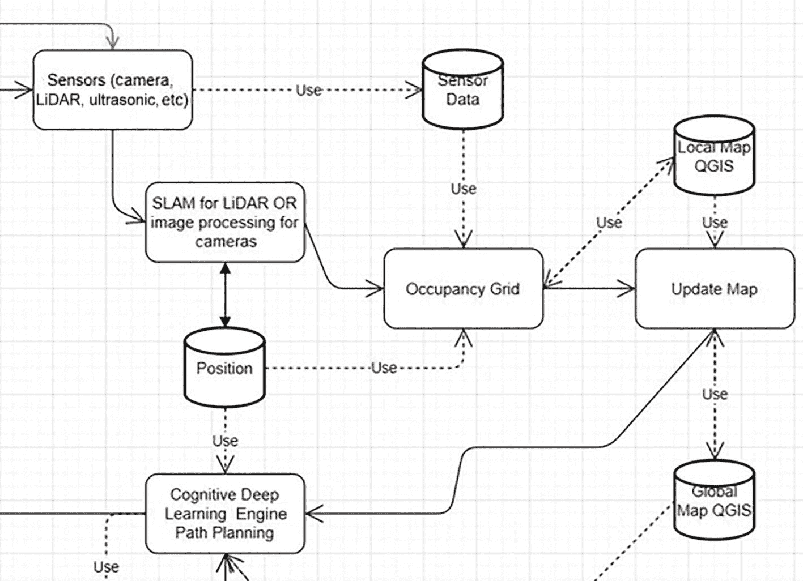

S L A M 和认知处理的逻辑图。传感器指向传感器数据、SLAM（用于 L i D A R）、占用网格到局部地图 Q G I S 以及更新地图到全局地图 Q G I S 和认知深度学习引擎路径规划。SLAM（用于 L i D A R）指向位置到占用网格和认知深度学习引擎路径规划。

图 2-7

SLAM 和认知处理的业务逻辑图

最终过程涉及认知深度学习，它直接控制路径规划过程，这是认知智能引擎的主要职责和特性之一。因此，认知引擎提供了全球地图数据库的最新版本，以及导航任务的所需目标和 AI 探索者的估计位置。然后由认知深度学习引擎生成驾驶路径解决方案，并由探索者本身跟随。路径基本上是用于探索者穿越的直线插值笛卡尔坐标。因此，每条线都是 AI 探索者车轮执行器的特定驾驶动作。此外，路径由探索者的物理尺寸决定，因为它决定了探索者与其周围区域是否有空间。认知引擎还定期更新路径段。路径段实际上是直接向车轮执行器下达命令，指示如何遵循路径驾驶解决方案。如果所有目标尚未完成，则整个周期再次开始。这就是 UML 图中图 2-8 中菱形决策块的原因。

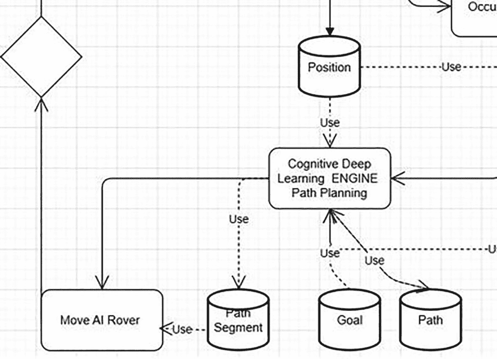

路径分割和移动命令的逻辑图。从顶部开始，位置点指向认知深度学习，从底部开始，目标和路径点指向它。认知深度学习指向路径分割和移动 AI 探索者。路径分割也指向移动 AI 探索者，它进一步指向左上角的空白方块。

图 2-8

路径分割和移动命令的业务逻辑图

注意

现在可以在以下 UML 业务逻辑图中（图 2-9）欣赏到由认知引擎控制的整个自适应导航任务。

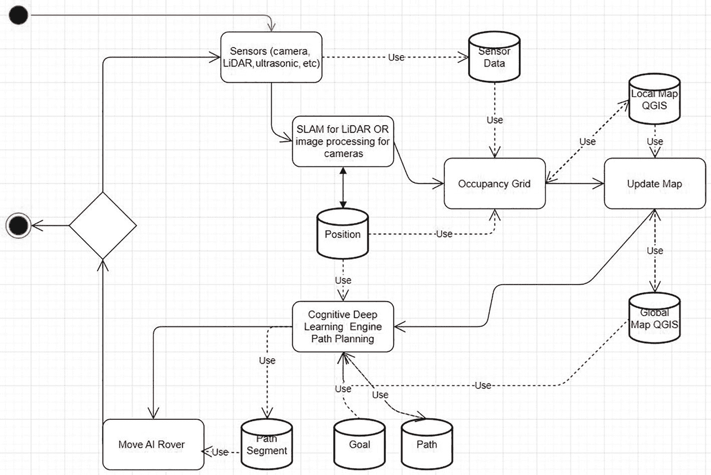

AI 探索者系统的逻辑图。各种部分包括传感器、传感器数据、用于 LiDAR 的 SLAM、位置、占用网格、局部地图 QGIS、更新地图、全局地图 QGIS、目标、路径、认知深度学习、路径段、移动 AI 探索者，以及最后的空白方块。

图 2-9

AI 探索者系统的完整业务逻辑

## 开发第一个动态 UML 类图

开发自适应导航需求意味着人类操作员提出的所有目标都必须被遵守和执行，包括在 AI 探测车内部运行的认知深度学习引擎。因此，我们将目标或任务设定为主要的超类，它在整个软件系统结构中占据优先地位，该系统以 AI 探测车的软件架构形式表达自己。`Goals` 超类是负责 AI 探测车要遵循的目标的类。因此，`GOALS` 超类将利用 `AI_Rover` 类和 `Cognitive_Deep_Learning_Planning` 类。`GOALS` 超类的主要功能或算法是建立目标和检查哪些目标已经完成。另一种方法可以表示 AI 探测车探索特定埃及墓穴或地下墓穴的进度或完成百分比。此外，将 `GOALS` 作为超类有助于创建一个基本的吸收架构，其中获取系统的目标并告诉 AI 探测车前往每个目标点。

因此，我们现在将创建 UML 类图。我们将逐级添加每个类，以便读者能够完全理解 AI 探测车的 UML 类架构。这实际上是 AI 探测车的整个程序结构，包括所有正确的互连。因此，我们将首先处理的是 `GOALS` 类，它声明了 AI 探测车需要完成的所有目标。图 2-10 展示了 `GOALS` 类的 UML 类图。

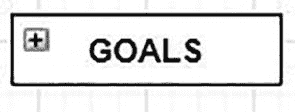

AI 探测车目标类图由一个标记为“目标”的矩形组成。在矩形的左上角标记有一个加号。在矩形的顶部和底部标记有淡化的垂直条。在矩形的左右两侧标记有短而淡化的水平线。

图 2-10

AI 探测车目标类图

与`GOALS`超级类连接的两个主要子类。第一个连接的子类是`AI_Rover`类。这个子类负责描述将在认知深度学习系统中使用的 AI 探测车的类型。`AI_Rover`类包含至少一个轮子执行器和至少一个传感器。`Wheel_Actuator`类负责与电机控制器接口并发送命令，这些控制器驱动 AI 探测车到达认知深度学习控制器确定的下一个航点或路径。`Wheel_Actuator`类随后有额外的子类，例如`Heading`和`Steering_Controls`类。`Heading`类确定 AI 探测车在认知深度学习控制器确定的路径中行驶的恒定速度。`Steering_Controls`类负责分配正确的转向或（轮转向）速度给轮子执行器，以使 AI 探测车转向。`Heading`和`Steering_Controls`类通常将与将要确定的探测车平台的 PID（部分积分微分控制器）接口。通常，这些 PID 控制器将以硬件闭环控制器组件的形式在外部 Raspberry Pi 4 模块中实现。

与`GOALS`超级类连接的下一个子类是实际的`Cognitive_Deep_Learning_Planning`类。这个类负责在埃及地下墓穴执行任务的人工智能漫游车的正确决策分析、有限的情境意识和感知与规避特性。`Cognitive_Deep_Learning_Planning`类的首要指令是开发用于人工智能漫游车关键导航的正确路径规划解决方案。这种导航也需要具有适应性，以便人工智能漫游车在遇到僵局时能够找到替代路径。因此，`Cognitive_Deep_Learning_Planning`类必须利用`MAP`类，这是一个局部和全局地图的超级类。`Cognitive_Deep_Learning_Planning`类的主要关注点是实现`GOALS`超级类中声明的目标。`Cognitive_Deep_Learning_Planning`类生成整个路径和实际路径段，这些路径段将被发送到人工智能漫游车的轮子执行器。`Cognitive_Deep_Learning_Planning`类将需要访问方法来检索和发送有关机器人下一个路径段的信息，该路径段是根据人工智能漫游车的当前位置规划的。这个类的一些方法包括`Set_Goal`、`Determine_Global_Path`和`Get_Path_Segment`。这些方法将在机器人需要找到替代驾驶路径段以遵循时，由认知深度学习控制器使用，前提是在人工智能漫游车的电池耗尽之前有足够的时间。图 2-11 显示了我们已经审查和讨论过的类的 UML 类图。

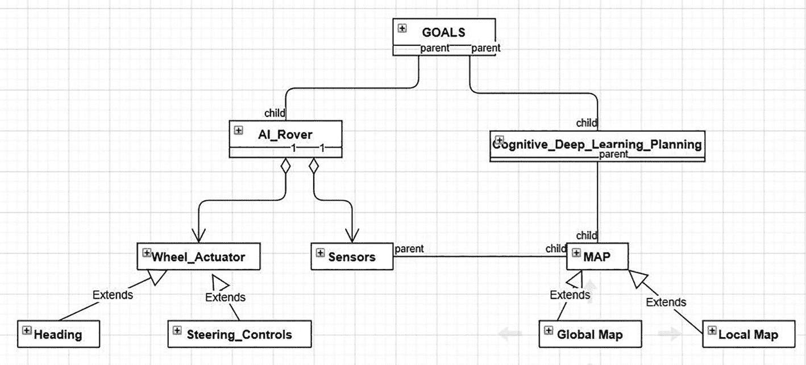

人工智能漫游车的 UML 动态类图。目标分为人工智能漫游车和认知深度学习规划。人工智能漫游车分为轮子执行器和传感器。轮子执行器扩展到航向和转向控制。认知深度学习规划指向地图。地图扩展到全局和局部地图。

图 2-11

人工智能漫游车 UML 动态类图的第一个阶段

`Sensors` 类是在 AI 巡游车架构内可以从中开发出许多其他传感器的类。我们已经推导出了`force`、`proximity`、`tracker`、`range`、`position`、`velocity`和`acceleration`传感器。我们可以从`Sensors`类中推导出其他传感器，例如激光雷达、雷达、单目和双目摄像头。所有这些传感器都可以根据股东和开发者的需求进行开发。由于我们是在像树莓派这样的数字平台上操作，我们需要有离散的时间增量。这将是 AI 巡游车架构必须完成的离散时间步骤中的`time_increment`的一个例子。其他方法包括`START`、`STOP`、`SetUpdateTime`、`GetUpdateTime`、`S_Variance`、`G_Variance`和`READ`。`READ`函数返回从传感器中推导出的信息。位置、速度和加速度传感器以及开发它们的类从它们各自的传感器中获取信息。例如，`position`类从编码器中推导其信息，编码器会随着时间的推移给出错误值。然而，使用来自 SLAM 和视觉处理传感器（如摄像头）推导出的映射系统，可以允许通过`MAP`类推导出的定位方法来纠正这些错误的位置值。在第二阶段还有一个类需要讨论。`Range`类代表 AI 巡游车中的距离传感器。实际上，这个距离传感器可能是一个处理单目摄像头（只有一个镜头的摄像头）信息的算法，并使用三角化的形式来确定目标距离，基于估计物体边缘到 AI 巡游车位置的距离。然而，通常这些传感器是双目摄像头、激光测距仪或超声波传感器。因此，这些传感器负责估计物体表面与 AI 巡游车位置之间的距离。`range`传感器在创建 AI 巡游车架构第一阶段中找到的`MAP`和 SLAM 处理类中也扮演着关键角色。考虑消除在埃及金字塔复合体通道的 SLAM 处理中发现的盲点是很重要的。让我们讨论将有助于这一点的传感器。

第一个传感器是激光雷达传感器和/或类别。该传感器可以检测 AI 巡游车前方物体的存在与否。这决定了物体相对于 AI 巡游车位置的方位角（方向）。

追踪传感器和类负责对目标的视觉追踪。然而，这项功能可能直接集成在认知深度学习引擎中。因此，这项功能可能被集成在`Cognitive_Deep_Learning_Planning`类中。然而，我们可以将这个过程作为一个次要过程，而不是在认知系统中开发它。

`Stereo_Vision` 类也使用双目摄像头，以便确定目标与 AI 探测车位置之间的距离。这需要来自摄像头以及测距传感器的信息。测距传感器可以是接近传感器或激光测距传感器。因此，我们现在将揭示认知深度学习系统主架构视图的最后一部分，它已经与 AI 探测车的其余控制结构相结合。UML 类图如图 2-12 所示。

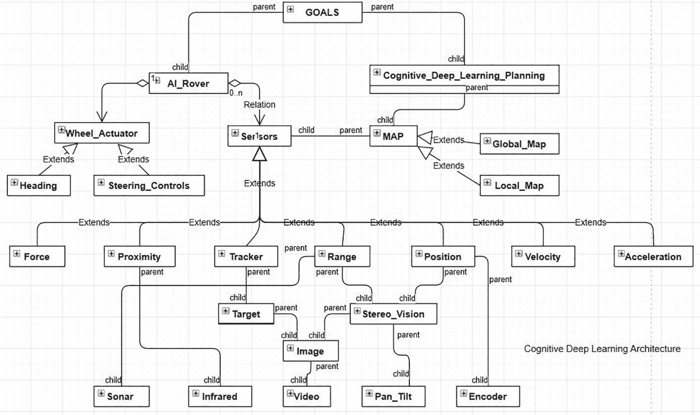

AI 探测车的 UML 动态类图。目标分为 AI 探测车和认知深度学习规划。AI 探测车指向轮子执行器和传感器。轮子执行器扩展到航向和转向控制；传感器扩展到力、接近、追踪、位置等。它还包含底部的认知深度学习结构。

图 2-12

AI 探测车的 UML 动态类图的第二阶段

## 开发第一组动态 UML 序列图

我们将要回顾的最后一个动态 UML 图是序列图。以下序列图将使我们能够密切观察允许 AI 探路者在埃及地下墓穴或任何其他未知环境中自主操作的对象之间的交互。这些图还揭示了在软件架构内部向不同对象发送消息的时间事件。它们还显示了 AI 探路者内部各自对象调用的方法。如果我们查看全局地图，我们会看到它允许在埃及地下墓穴遇到的环境中进行静态和动态变化。我们还可以看到 SLAM（即同时定位与建图）如何随着从激光雷达、超声波甚至单目和/或双目摄像头获得的新传感器数据而变化，允许局部地图（AI 探路者周围的即时区域）更新自身和全局地图。全局地图的更新过程允许纠正 AI 探路者在埃及地下墓穴中的估计位置。这在地下墓穴内部未知环境由于某种原因意外且剧烈变化时尤其如此。地下墓穴中剧烈变化的例子可能是发生了灾难性的坍塌或塌陷，有结构破坏阻止了 AI 探路者行驶路径解决方案的进入。这意味着 `isGlobalMapChanged` 方法将表明埃及地下墓穴的已知全局地图已被完全扰乱，并且需要认知深度学习引擎推导出另一个或更新的行驶路径解决方案，以便 AI 探路者执行以完成其任务目标。

现在我们将回顾以下动态 UML 序列图（图 2-13），这种情况是在 AI 探路者在古埃及地下墓穴探索过程中没有发生重大变化，因此没有全局地图更新。以下将是一个按时间顺序的事件列表：

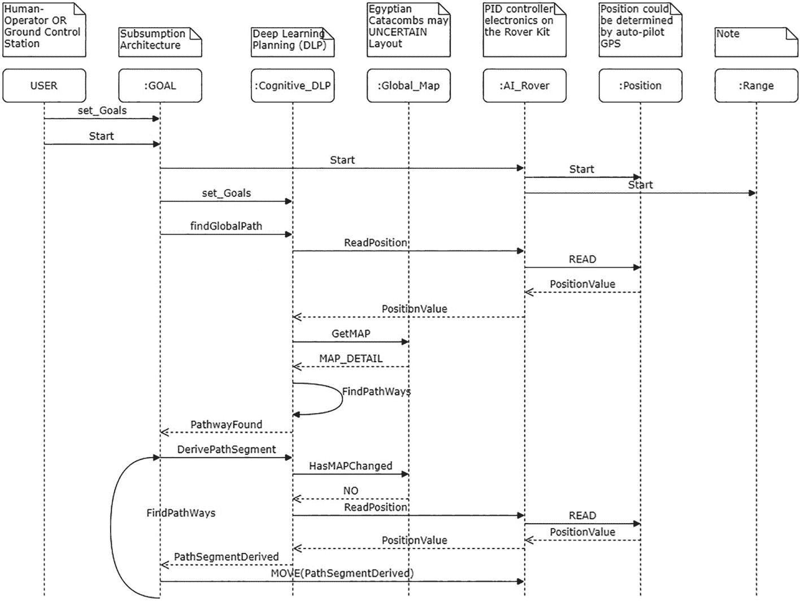

认知导航和控制 UML 序列图。它包含 7 列。不同的组件包括：人类操作员作为用户，吸收架构作为目标，深度学习规划作为认知 DLP，埃及地下墓穴可能的不确定布局作为全局地图，PID 控制器作为 AI 探路者，自动驾驶 GPS 作为位置，以及备注作为范围。

图 2-13

认知导航和控制 UML 序列图

1.  我们首先可以看到，`USER` 类已经设置和定义了目标并启动了 `Start` 过程。

1.  一旦完成，`GOAL`类向`AI_Rover`类发送启动机制，这将启动 PID 电子设备。我们还可以进一步开发这个序列图，包括一个额外的图来执行 PID 电子设备的诊断检查，以确定探测车套件本身是否正确运行。请考虑这是本章的一个可能练习。

1.  然后`AI_Rover`类继续启动`Position`类的方法，这意味着从 PixHawk 自动驾驶仪的 GPS 或从全局地图获取位置估计信息。

1.  然后`AI_Rover`类启动`range`类方法，通常意味着从全局地图接收信息。

1.  然后`GOALS`类将认知深度学习引擎需要完成的目标和任务转换为驱动路径解决方案，该引擎作为 AI 探测车的控制器。

1.  认知深度学习控制器随后请求确定 AI 探测车在埃及地下墓穴入口或地下墓穴内部的物理和地理空间位置。此请求直接从认知深度学习控制器发送到`AI_Rover`类本身。

1.  然后`AI_Rover`类向处理 PixHawk 自动驾驶仪、探测车套件的 PID 电子设备和 Raspberry Pi 4 模块之间信息的`Position`类发送`READ`命令。

1.  然后`AI_Rover`处理来自`Position`类的返回`PositionValue`。

1.  然后`PositionValue`数据从`AI_Rover`类传递回请求的`Cognitive_Deep_Learning_Planning`类。

1.  认知深度学习引擎随后请求`Global_Map`类的`GetMap`方法，从当前的全局地图中检索信息，其中 AI 探测车位于地图的中心。

1.  然后`MAP_DETAIL`数据和请求从`Global_Map`类发送回`Cognitive_Deep_Learning_Planning`类。

1.  然后，认知深度学习控制器将根据从全局地图获得的信息确定 AI 探测车执行的最佳驾驶路径。

1.  然后，在认知深度学习引擎中执行`FindPathWays`方法，以计算和确定最佳路径。

1.  然后，从`Cognitive_Deep_Learning_Planning`类向`GOAL`类发送`PathwayFound`消息，通知它已找到驾驶解决方案。

1.  然后，从`Cognitive_Deep_Learning_Planning`类向`Global_Map`类发送`HasMAPChanged`消息。

1.  如果`Global_Map`类向`Cognitive_Deep_Learning_Planning`类返回`NO`消息，则`Cognitive_Deep_Learning_Planning`类向`AI_Rover`类发送`ReadPosition`请求消息，然后`AI_Rover`类将`READ`消息发送给`Position`类。

1.  包含位置数据的 `PositionValue` 消息从 `Position` 类发送回 `AI_Rover`，然后从那里发送回 `Cognitive_Deep_Learning_Planning` 类。

1.  然后向 `GOALS` 类发送一个 `PathSegmentDerived` 消息。

1.  然后，`GOALS` 类将带有 `PathSegmentDerived` 解决方案的 `MOVE` 命令作为参数发送给 `AI_Rover` 类，该命令随后作为消息发送给 `Wheel_Actuator` 类。此时，探测车应该开始移动，以驱动由 `Cognitive_Deep_Learning_Planning` 类确定的路径段，作为 AI 探测车软件层次结构中的自适应导航器。

以下 UML 时序图（图 2-14）将描述基于 SLAM 或图像处理数据更新的过程，以更新局部和全局地图。这发生在 AI 探测车正在探索的环境是静态的还是动态变化的情况下。

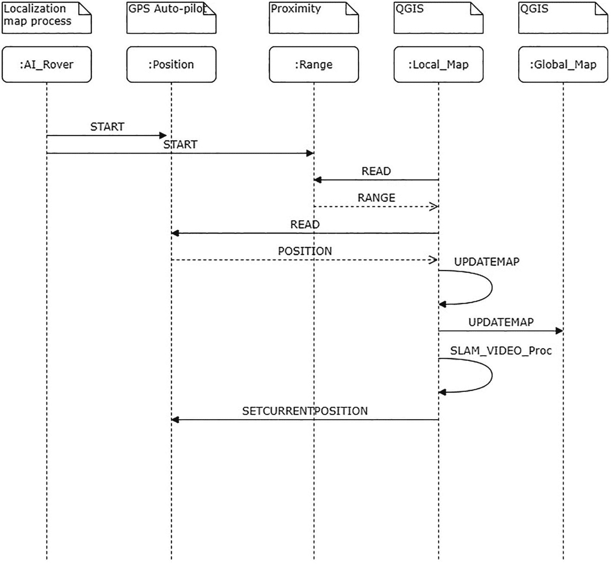

SLAM 和视频处理的 UML 时序图。它由五个列组成。不同的组件被标记为定位地图过程作为 AI 探测车、GPS 自动驾驶作为位置、接近作为范围、Q G I S 作为局部地图，以及 Q G I S 作为全局地图。

图 2-14

SLAM 和视频处理的 UML 时序图

1.  `AI_Rover` 类向 `Position` 和 `Range` 类发送启动消息。

1.  局部地图随后发送一个 `READ` 消息，从 `Range` 类读取并检索一个 `RANGE` 消息。

1.  局部地图随后发送一个 `READ` 消息，从 `Position` 类读取并检索一个 `POSITION` 消息。

1.  局部地图随后自行更新。

1.  然后，局部地图更新全局地图。

1.  然后在局部类中执行 `SLAM_VIDEO_Proc` 方法，然后它再次更新局部地图。

1.  然后，AI 探测车被定位在局部地图中。这个过程不断循环，无限进行。

以下 UML 时序图（图 2-15）是其中在埃及地下墓穴环境中全局地图或甚至局部地图发生剧烈且可检测的变化的情况。一个例子是，如果埃及地下墓穴中的地板或通道意外坍塌。因此，AI 探测车必须足够适应，以计算新的驾驶路径解决方案至关重要。认知深度学习引擎应具有一定的有限情境意识，以确定继续任务是否可行或危险。这个过程在以下步骤和程序中描述：

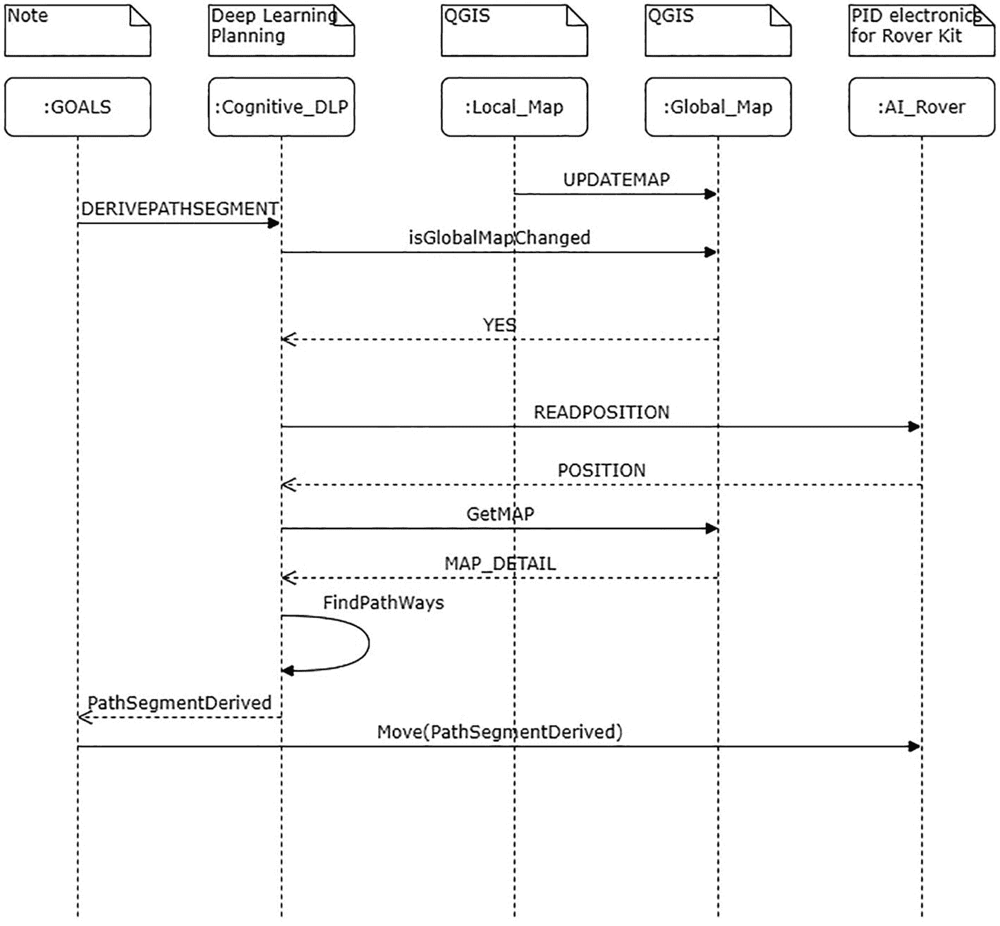

UML 时序图用于全局地图的剧烈变化。它由五个列组成。不同的组件被标记为目标、深度学习规划作为认知 D L P、Q G I S 作为局部地图、Q G I S 作为全局地图，以及用于探测车套件的 P I D 电子设备作为 AI 探测车。

图 2-15

全局地图剧烈变化的 UML 时序图

1.  `UPDATEMAP` 消息从本地地图发送到全局地图，随后全局地图被更新。

1.  然后 `GOALS` 类发送一个 `DERIVEPATHSEGMENT` 请求消息。

1.  然后 `Cognitive_Deep_Learning_Planning` 类向 `Global_Map` 类发送一个 `isGlobalMapChanged` 请求消息。

1.  如果 `Global_Map` 类返回一个 `YES` 响应消息，那么 `Cognitive_Deep_Learning_Planning` 类将向 `AI_Rover` 类发送一个 `READPOSITION` 命令。

1.  `POSITION` 数据消息随后返回到 `Cognitive_Deep_Learning_Planning` 类，该类随后从 `Global_Map` 类请求一个 `GetMAP` 消息，该消息随后作为 `MAP_DETAIL` 数据消息返回。

1.  然后 `Cognitive_Deep_Learning_Planning` 类找到替代路径并将该信息发送到 `GOALS` 类。

1.  然后 `GOALS` 类通过 `MOVE(PathSegmentDerived)` 发送一个替代驾驶解决方案到 `AI_Rover` 类，其中漫游车的 `Wheel_Actuator` 类应该进行纠正航向和转向调整。

## 摘要

我们应该指出，我们现在已经审查并熟悉了多种软件和系统设计分析方法。一种方法是与开发 UML 用例图相关，这些用例图可以帮助我们确定开发这个相当复杂的自动驾驶、适应性和智能漫游系统所需的功能性和非功能性需求。我们审查的下一个 UML 图是业务逻辑和类图，它们显示了模块化类之间的关系以及它们如何相互发送信息。例如，考虑 `Cognitive_Deep_Learning_Planning` 类控制器本身如何作为 AI 漫游的自适应导航器。使用这些 UML 图使我们能够快速指定和审查在创建 AI 漫游自动驾驶平台中涉及的一些非常复杂的复杂性。

我们还揭示了如何使用 UML 面向对象概念来对适应性智能机器人系统进行建模。机器人的位置最初通过 SLAM 进行校正，规划由 `Cognitive_Deep_Learning_Planning` 类控制器在网格系统中执行。我们考虑了静态和动态环境，并开发了一个软件层次结构，这可能允许以其他方式非常计算密集的方法来导航动态环境。这些对象在 UML 图中显示，以及它们如何相互交互。所有这些类都由 `GOALS` 类控制，该类充当指挥官或飞行员，而 `Cognitive_Deep_Learning_Planning` 类控制器充当 AI 探索埃及地下墓穴复杂结构的地下世界的自适应导航器。

我们还应该指出，使用这些 UML 图可以使我们开发人工智能漫游车的控制软件系统的实现，因为这些相同的 UML 图可以自动生成 Python 源代码。有多种开发环境可以实现这一点，例如 Modelio UML、Papyrus IBM Eclipse、Rational IBM 软件、Microsoft Visual Studios 以及许多其他环境。通过使用 UML 图，我们可以帮助管理可能在这种高级机器人漫游车平台上出现的复杂性。如果有任何规范或需求变更，我们可以在任何软件开发项目中像预期的那样管理这些变更。

额外加分

1.  在审查业务逻辑图时，在哪里需要包含自动驾驶系统？

1.  在审查类图时，再次，在哪里需要包含自动驾驶系统？

1.  为什么 UML 图能帮助我们理解类交互、数据和消息交换？

1.  人工智能漫游车背后的“意外查询问题”概念是什么？我们将在后面的章节中讨论这个概念，但请利用互联网上的资源来寻找并推导出你对这个问题的最佳答案。
