# 3. 安装 Linux 和开发工具

在我们开始开发我们的漫游车之前，我们必须安装正确的工具。就像木匠需要锤子来钉钉子，画家需要画笔来画画一样，我们需要工具来支持我们的项目。我们的漫游车将使用机器人操作系统 (ROS)，ROS 在 Linux 上运行。Linux 给我们一个简单的文本编辑器和 Python 编程语言。我们还需要一个模拟器来测试我们的漫游车是否工作；因此，我们将安装 ROS-aware Gazebo 和 Rviz。最后，我们假设大多数观众将使用 Windows 操作系统，因此我们将使用 VirtualBox 在虚拟机上安装所有这些程序。总之，我们将回顾以下内容：

+   在 Microsoft Windows 中安装 Oracle 的 VirtualBox

+   在 VirtualBox 中安装 Linux Ubuntu 20.04.4

+   获取 ROS 环境变量密钥

+   安装 ROS

+   第一次启动 ROS

+   学习重要的 Linux ROS 命令行

+   安装 Anaconda

+   学习开发漫游车原型所需的 Ubuntu Linux 命令

+   ROS 启动文件是什么？

+   运行 Gazebo 和 Rviz 以测试我们的系统

+   摘要、练习和提示

## 在我们开始之前

我们必须考虑以下先决条件：

1.  如果您计划使用 Ubuntu Linux 操作系统作为主机操作系统，那么不需要安装 VirtualBox。

1.  ROS 的不同版本针对特定版本的 Ubuntu Linux。我们将使用 Noetic ROS，它特别需要 Ubuntu Linux 20.04.4。确保您将 ROS 版本与正确的 Linux 版本匹配。这在“安装 VirtualBox ...”和“安装 Ubuntu Linux ...”期间非常重要。

1.  安装顺序很重要：VirtualBox、Ubuntu、Anaconda、ROS。任何其他顺序可能会导致问题。

1.  Ubuntu Linux 20.04.x 也被称为 Focal Fossa。我们将称之为 Ubuntu。我们将使用 Noetic ROS，但我们将称之为 ROS。

1.  尽管所有 shell 文本命令都将针对 Noetic ROS，但它们与 ROS 的早期版本（如 Kinetic 和 Indigo）兼容。

## 安装 VirtualBox 软件

Oracle VirtualBox 的目的是创建虚拟机，以便在除常规系统以外的操作系统上开发和运行程序。虚拟机是目标操作系统的模拟。我们希望在 Microsoft Windows 系统上模拟 Ubuntu Linux 20.04.04 操作系统。（VirtualBox 有适用于 Mac OS 和 Linux 的版本。）安装 VirtualBox 后，我们将安装 Ubuntu Linux 20.04.04 虚拟机。这个虚拟的 Ubuntu Linux 20.04.4 操作系统将作为我们的 ROS 开发环境。这个虚拟机本质上是一个程序，它作为一个应用程序执行整个操作系统，如 Ubuntu Linux 20.04.4 操作系统。运行 Microsoft Windows 的物理计算机作为 *主机*，Ubuntu Linux 20.04.4 作为 *客户机*。

VirtualBox 中的 Ubuntu Linux 客户端操作系统将是本书中漫游车测试和开发环境的基础。

1.  从以下链接安装 Oracle 的 VirtualBox：

[`www.virtualbox.org/wiki/Downloads`](http://www.virtualbox.org/wiki/Downloads)

前往**主机**操作系统列表，选择 Microsoft Windows 并安装 VirtualBox 软件（见图 3-1 中的橙色框）。对于其他操作系统，请参阅[`www.virtualbox.org/manual/ch02.html`](http://www.virtualbox.org/manual/ch02.html)。

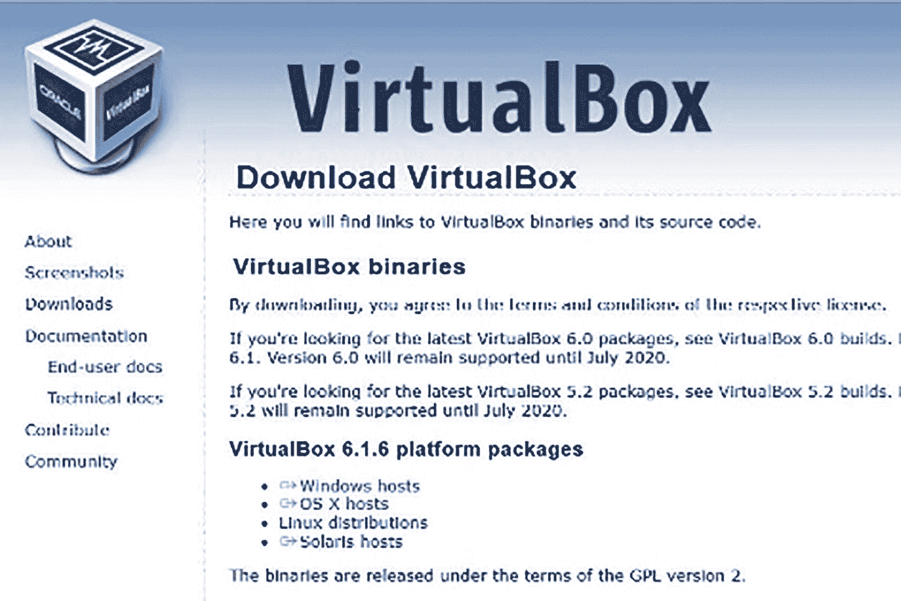

创建虚拟机的截图。

图 3-1

下载 Oracle 的 VirtualBox

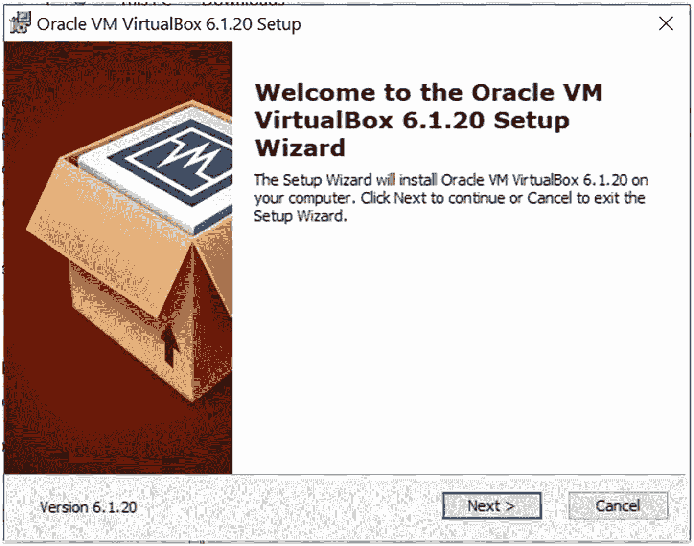

Oracle 设置向导窗口的截图，其中突出显示了“下一步”按钮。

图 3-2

安装 Oracle 的 VirtualBox

1.  下载 VirtualBox 可执行文件后，找到该文件并双击以执行。现在您应该看到一个类似于图 3-2 的图像。点击“*下一步*”。

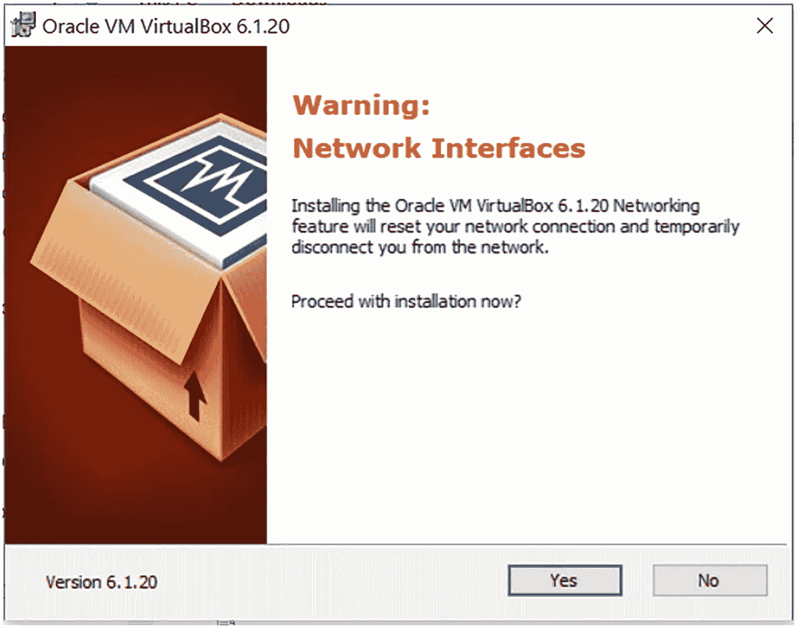

Oracle 网络接口窗口的截图，其中突出显示了“是”按钮。

图 3-3

安装 Oracle 的 VirtualBox（继续）

1.  在接下来的几个弹出窗口中接受默认设置，直到出现关于重置网络的警告（见图 3-3）。点击“*是*”，VirtualBox 程序将安装。

### 创建新的 VirtualBox 虚拟机

现在我们已经安装了 Oracle 的 VirtualBox，通过双击其图标来运行程序。


标有“首选项”、“导入”、“导出”、“新建”和“添加”按钮的截图。其下方的文本为“欢迎使用 Virtualbox！”

图 3-4

在 Oracle 的 VirtualBox 中创建虚拟机

1.  启动后，您将在窗口上看到一个区域，看起来像图 3-4。要创建一个新机器，即之前未安装过的机器，请点击“*新建*”。如果您看不到这个工具栏，则可以从“***工具 ➤ 新建***”工具栏访问它。

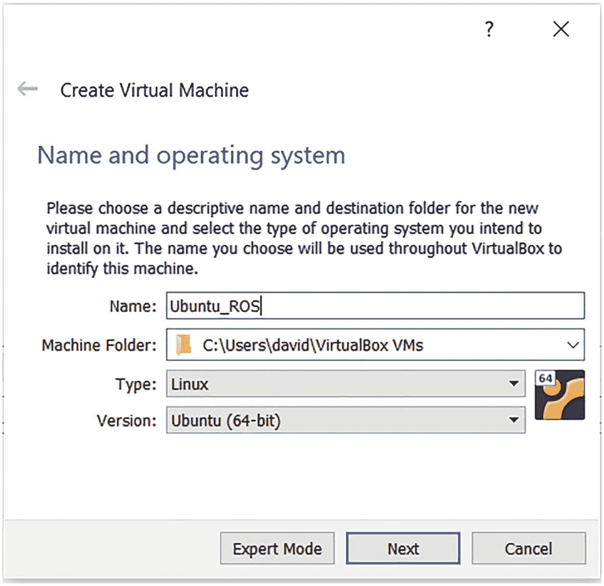

Oracle 设置向导窗口的截图，用于填写名称、机器文件夹、类型和版本。底部突出显示了“下一步”按钮。

图 3-5

在 Oracle 的 VirtualBox 中创建虚拟机

1.  按照图 3-5 中的示例填写安装表单。点击“*下一步*”。这不会安装操作系统；它是一个占位符，用于后续操作。

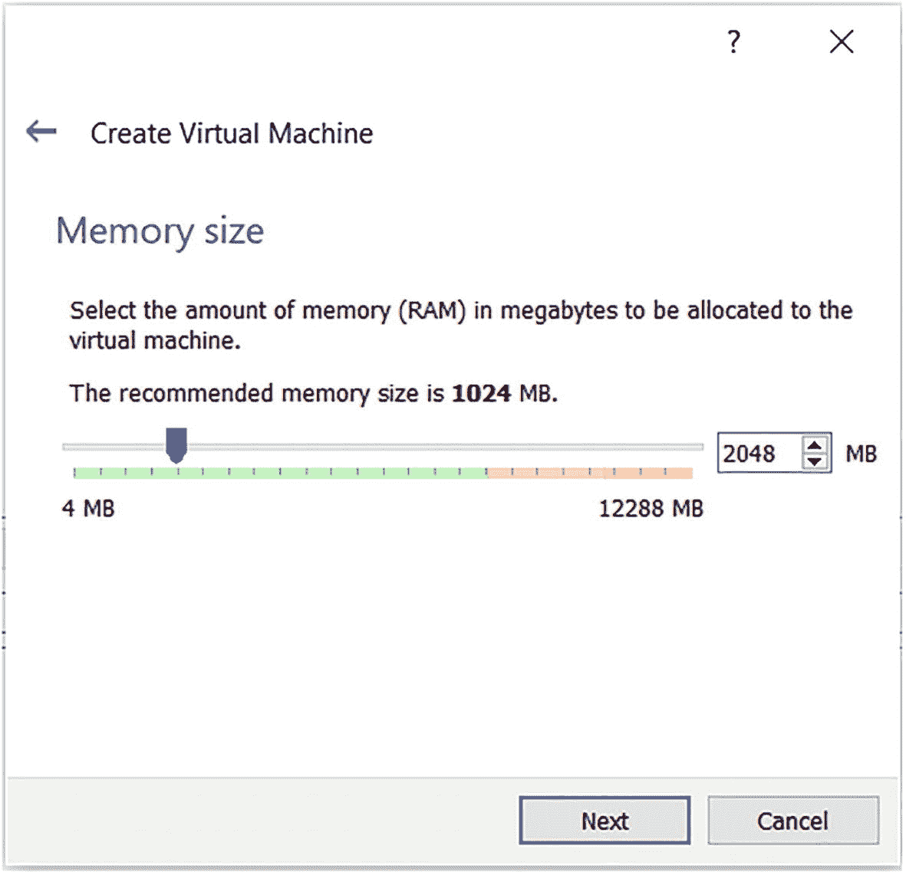

Oracle 设置向导窗口的截图，用于选择内存大小。底部突出显示了“下一步”按钮。

图 3-6

为虚拟机分配内存

1.  接下来，我们为我们的开发系统分配内存。默认为 1024 MB，但我们将分配至少 2048 MB（见图 3-6）。您可以分配更多，但 2048 MB 已经足够。

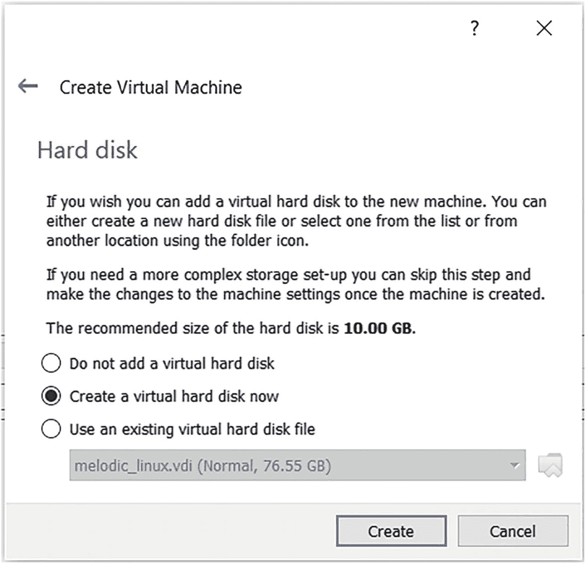

Oracle 设置向导窗口的截图，用于检查硬盘的选项。现在创建虚拟硬盘选项已勾选，底部的创建按钮突出显示。

图 3-7

创建虚拟硬盘

1.  要在物理硬盘上创建虚拟磁盘，接受图 3-7 中显示的默认设置。由于我们没有现有的驱动器，我们必须创建一个新的驱动器。

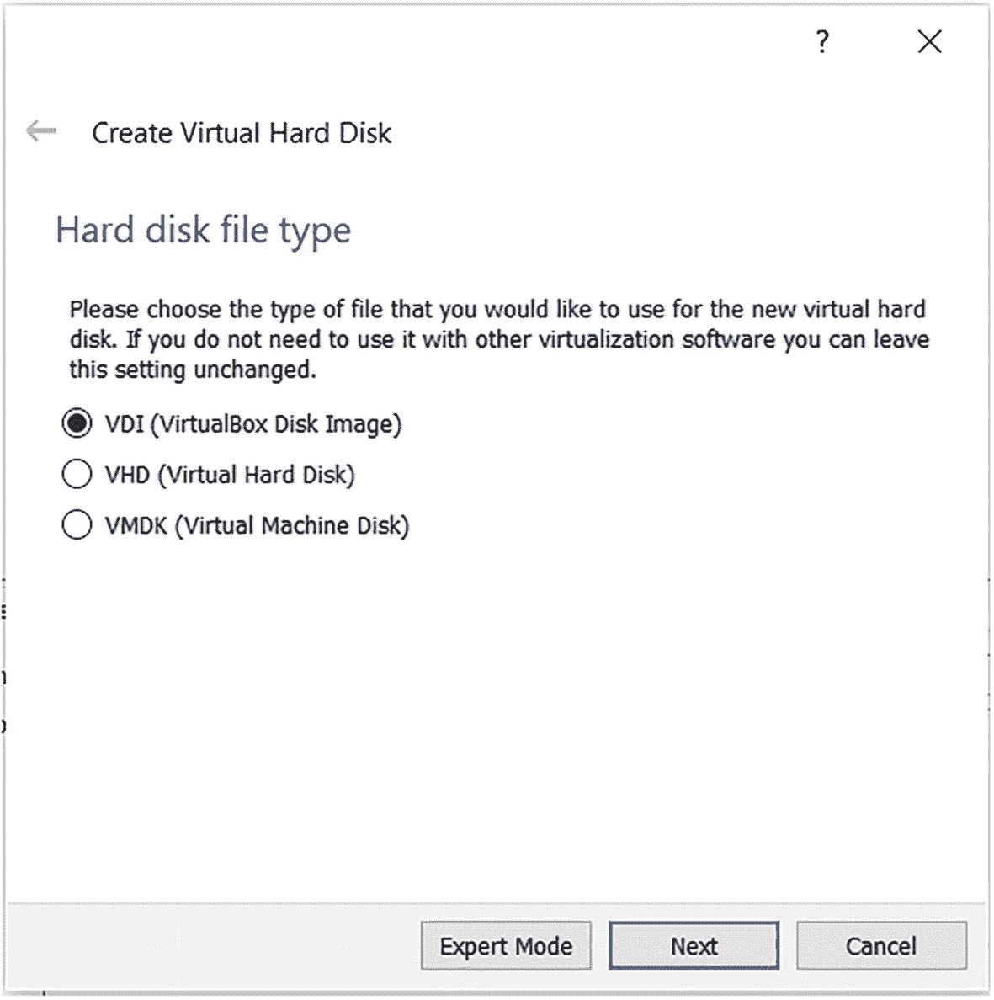

Oracle 设置向导窗口的截图，用于检查硬盘文件类型的选项。VDI 选项已勾选，底部的下一步按钮突出显示。

图 3-8

设置虚拟硬盘类型

1.  接受图 3-8 中显示的虚拟硬盘类型的默认设置。我们选择了 VDI，因为它针对 VirtualBox 进行了优化。

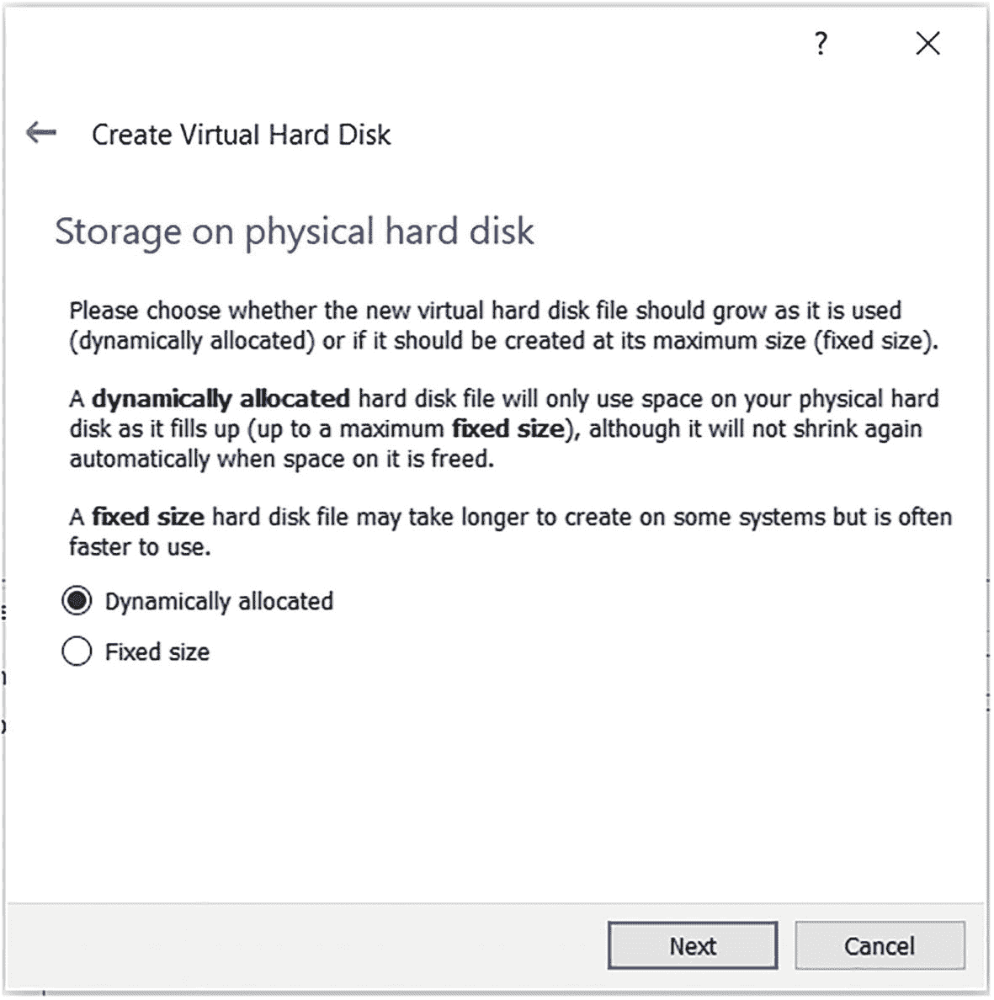

Oracle 设置向导窗口的截图，用于检查物理硬盘上的存储选项。动态分配选项已勾选，底部的下一步按钮突出显示。

图 3-9

将物理硬盘设置为动态分配

1.  接受图 3-9 中显示的物理磁盘存储类型的默认设置。我们选择了动态，因此大小可以自动增长和缩小。

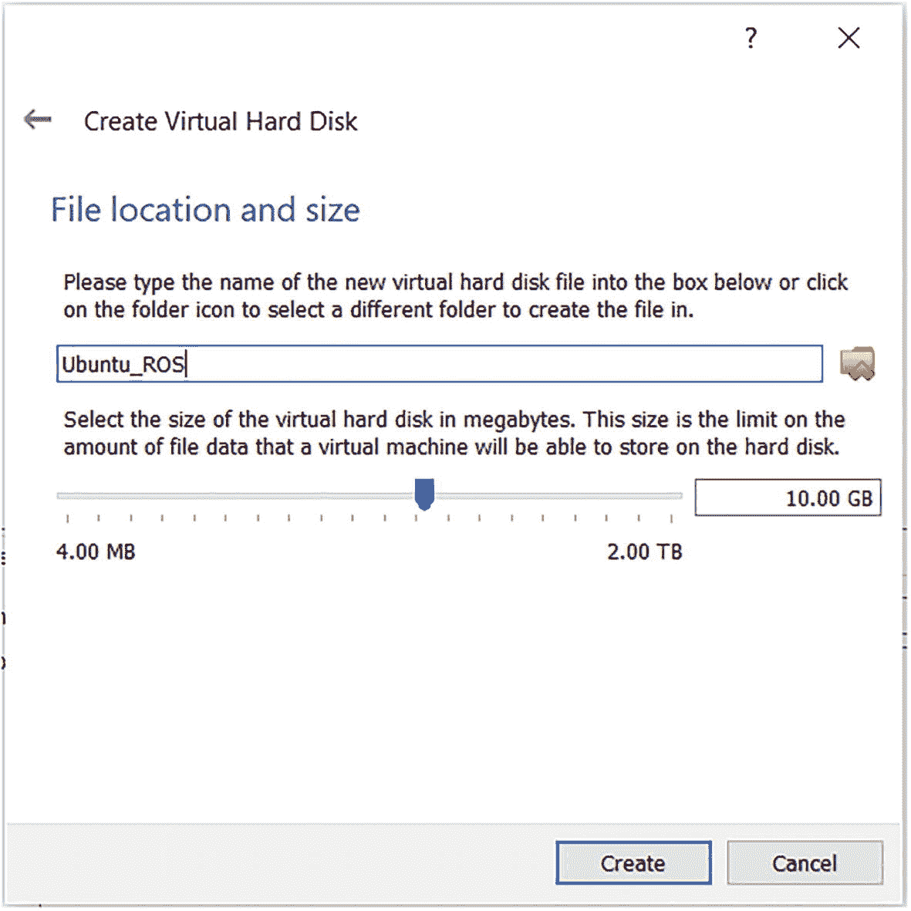

Oracle 设置向导窗口的截图，用于文件位置和大小。大小设置为 10 G B，底部的创建按钮突出显示。

图 3-10

设置虚拟磁盘的位置和大小

1.  最后，设置虚拟磁盘的位置和最大大小（图 3-10）。默认位置是从您的原始磁盘名称派生的，默认大小对我们的小型项目来说已经足够。点击*创建*。

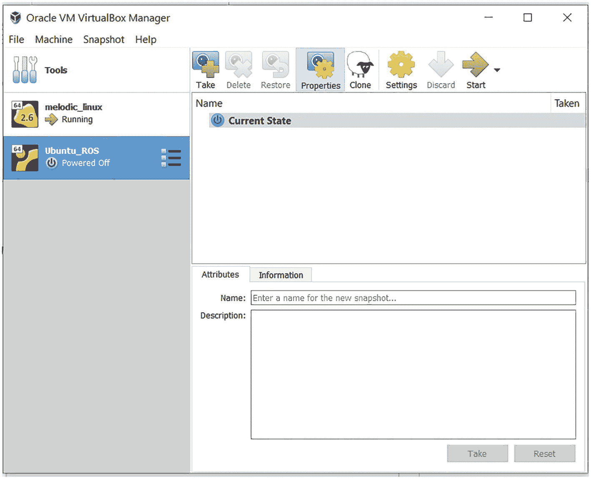

Oracle VM VirtualBox 管理器的截图。左侧的条目列出了正在运行的 melodic Linux 和关闭的 Ubuntu R O S。

图 3-11

安装完成

1.  您现在应该已经安装了一个虚拟机，如图 3-11 中的橙色框所示。

我们刚刚创建了一个空磁盘，我们将在下一个步骤中将它安装到我们的 Ubuntu Linux 操作系统中。

## 在 VirtualBox 中安装 Linux Ubuntu 20.04.4

要下载 Ubuntu Linux 20.04.4（即 Focal Fossa）所需的 DVD/CD ISO 镜像，请访问[`http://old-releases.ubuntu.com/releases/20.04.4/`](http://old-releases.ubuntu.com/releases/18.04.4/)。

默认情况下，镜像为 64 位架构，因此您将看到一个[64 位 PC (AMD64) 桌面镜像](http://old-releases.ubuntu.com/releases/18.04.4/ubuntu-18.04-desktop-amd64.iso)。如果您的物理 RAM 小于 4 GB，您应使用 32 位架构版本。尽管它标明为“AMD”，但它也适用于英特尔芯片。

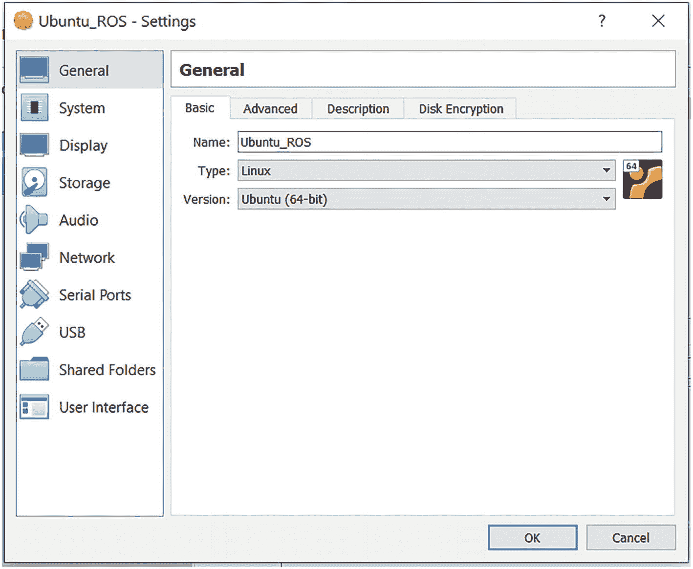

在 Oracle VM VirtualBox 管理器中 Ubuntu R O S 设置的一般选项截图。

图 3-12

ISO 设置

1.  下载 Ubuntu 镜像后，我们需要将其加载到 VirtualBox 上的虚拟机中。点击 Ubuntu_ROS 以突出显示该虚拟磁盘。点击设置，你将看到一个类似于图 3-12 的弹出菜单。

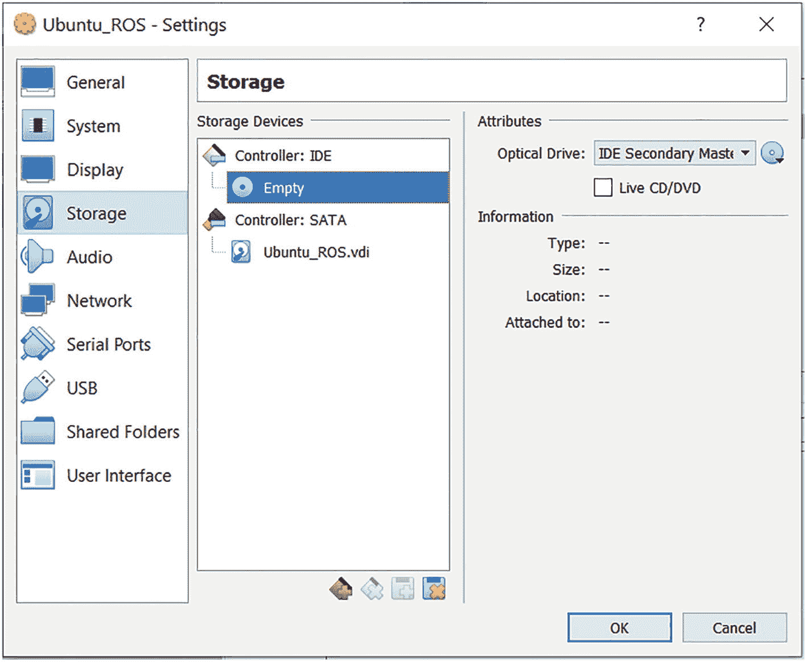

Ubuntu ROS 存储选项在 Oracle VM VirtualBox 管理器中的设置截图。

图 3-13

需要的存储设置以附加 ISO 镜像

1.  我们需要安装之前设置为占位符的特定版本的操作系统（“安装 VirtualBox”，步骤 3）。我们的版本由 Noetic ROS 决定，它专门为 Ubuntu Linux 20.04.4 设计。点击 **存储**。在图 3-13 中，注意空磁盘图标（橙色框）和最右侧的磁盘（红色框）。这就是我们将附加下载的 ISO 镜像的地方。点击红色框图标以连接下载的 ISO 文件。选择第一个选项，“选择虚拟光盘文件…”

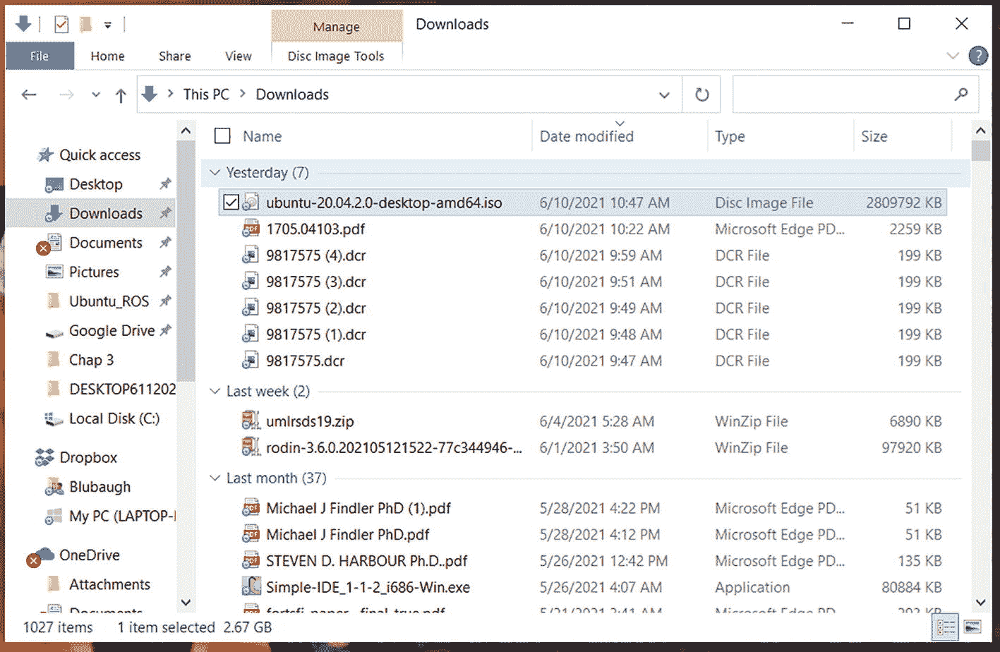

Windows 资源管理器中 ISO 镜像文件的截图。

图 3-14

选择您的 ISO 镜像并打开它

1.  查找并选择您的下载 ISO 文件。我们的文件保存在“下载”文件夹中。选择“Ubuntu-20.04.4-desktop-amd64.iso”，然后点击 *打开*。这将把 ISO 文件附加到 VirtualBox 作为操作系统。如果您愿意，现在可以运行您的 Linux 系统。然而，我们将调整操作系统的设置，以便开发环境更容易使用，如图 3-14 所示。

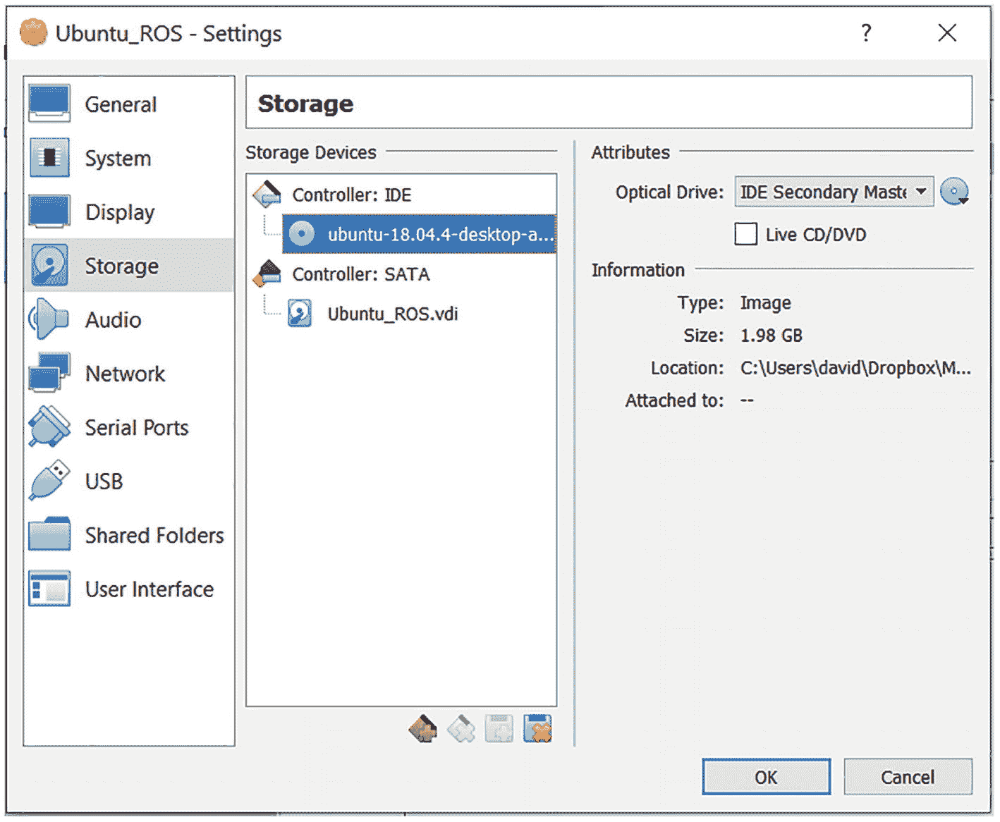

Ubuntu ROS 存储选项在 Oracle VM VirtualBox 管理器中已选择的文件截图。

图 3-15

已附加 ISO 镜像

1.  在图 3-15 中，“空”一词已被替换为您的 ISO 镜像名称。您的操作系统已安装。

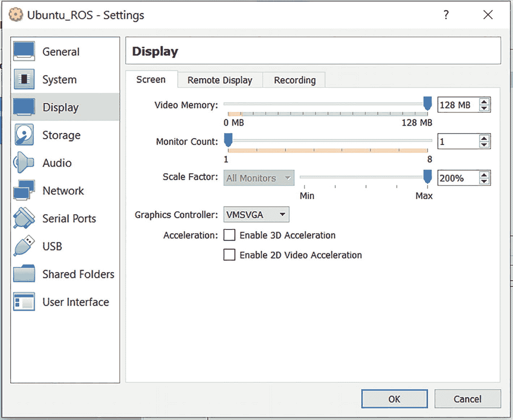

Ubuntu ROS 显示选项在 Oracle VM VirtualBox 管理器中的设置截图。

图 3-16

显示设置

1.  将您的显示设置更改为与图 3-16 相匹配。我们假设您至少有 4 GB 的视频和 SVGA。将缩放因子设置为 200% 可以使窗口大小合理。

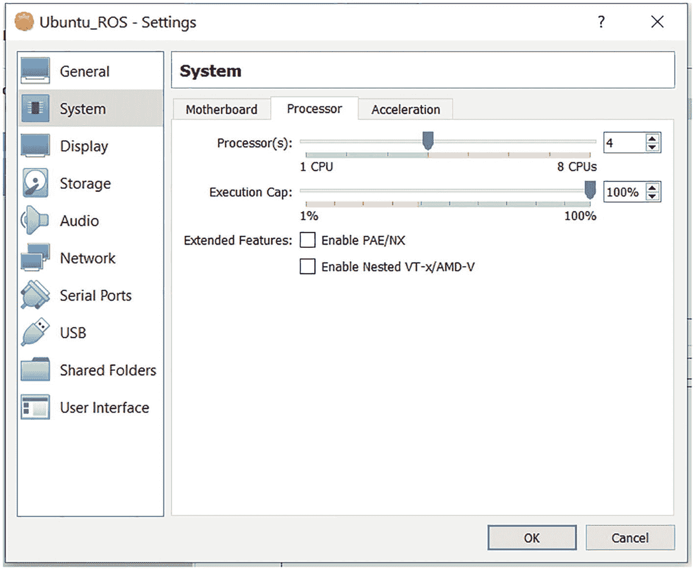

Ubuntu ROS 系统处理器选项在 Oracle VM VirtualBox 管理器中的设置截图。

图 3-18

系统处理器设置

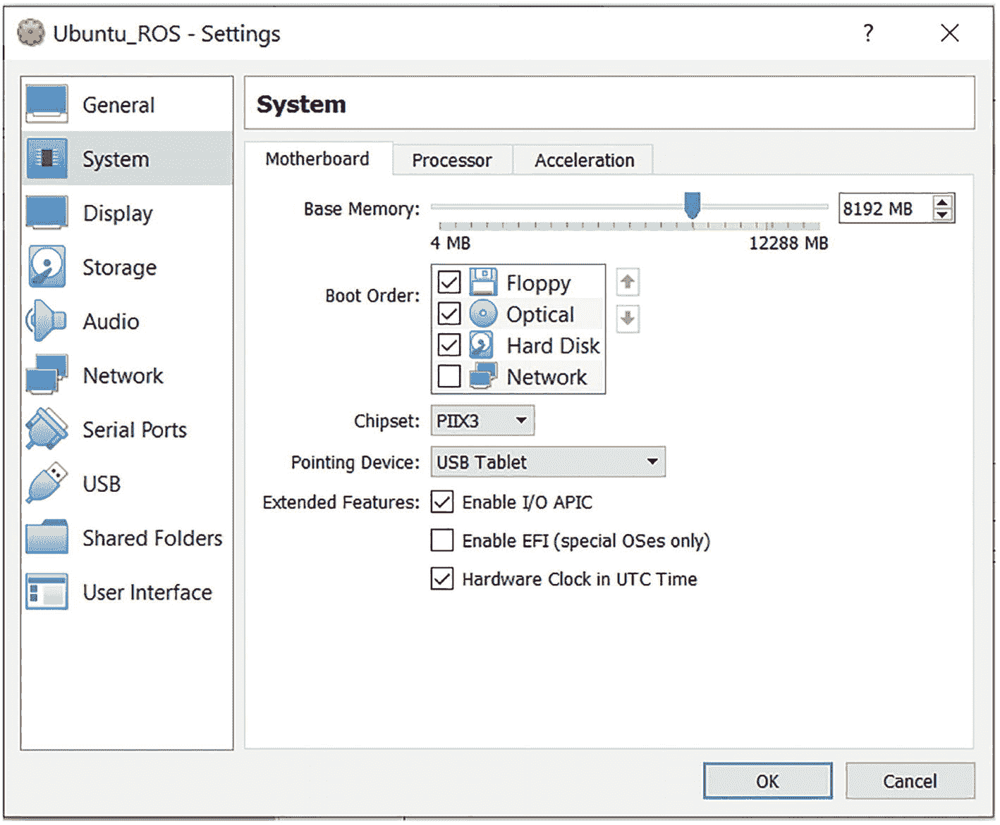

Ubuntu ROS 系统主板选项在 Oracle VM VirtualBox 管理器中的设置截图。

图 3-17

系统主板设置

1.  最后，我们需要设置一些系统设置。图 3-17 显示了要分配的最佳 RAM（绿色条），图 3-18 显示了可以分配的最佳 CPU（绿色条）。绿色条与您的计算机硬件匹配，我们的系统有 8GB RAM 和 4 个 CPU，所以我们分配了这些。如果您选择红色区域中的任何值，则系统将被配置为不同的硬件集；因此，它将运行得更慢。


设置、丢弃和启动按钮的截图，旁边有一个下拉菜单。设置和启动按钮被突出显示。

图 3-19

以虚拟机形式启动 Ubuntu Linux OS

1.  您的系统现在应该准备好安装一个完全运行的虚拟 Linux 系统。点击*启动*（或双击您的驱动器）以开始安装您的 Linux 系统。见图 3-19。

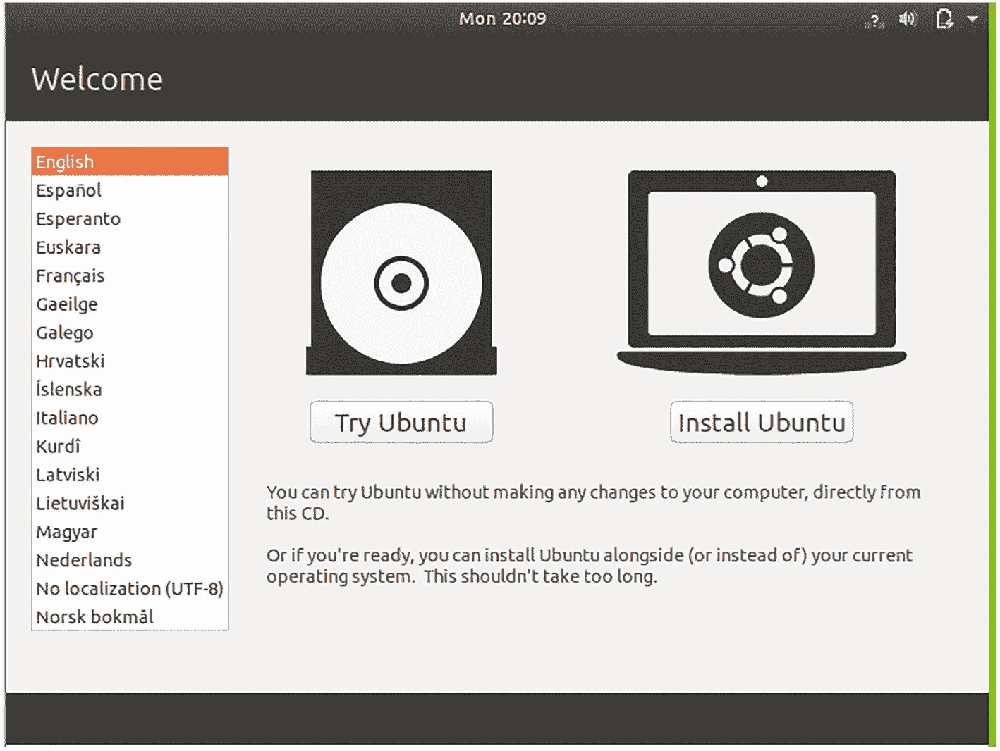

Ubuntu Linux OS 安装设置窗口的截图，偏好语言。右侧有两个图标：试用 Ubuntu 和安装 Ubuntu。

图 3-20

Ubuntu Linux OS 安装设置

1.  点击*安装 Ubuntu*（见图 3-20）。在安装过程中，我们大多数时候都会选择默认设置。如有必要，更改您的安装设置。

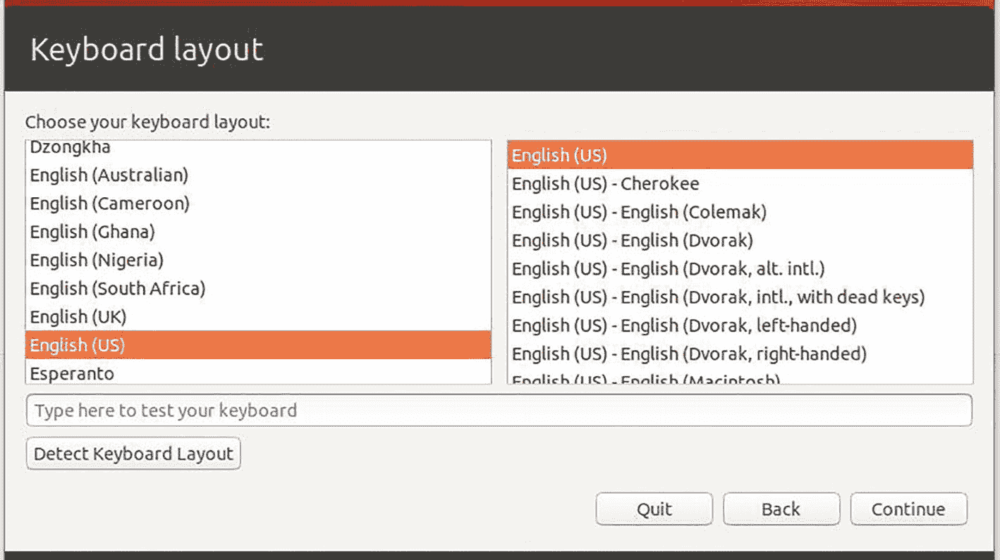

Ubuntu Linux 操作系统安装设置窗口的截图，选择键盘布局为美国英语。

图 3-21

Ubuntu 键盘首选项

1.  我们的下一步是设置键盘首选项（见图 3-21）。由于我们目前位于美国，默认设置对我们来说已经足够。

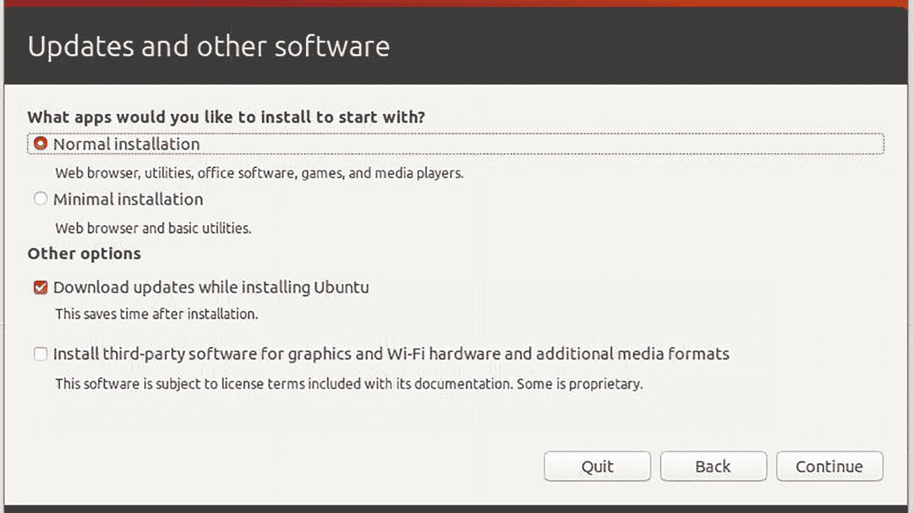

Ubuntu Linux 操作系统安装设置窗口的截图，用于更新和其他软件。常规安装和安装时下载更新已被选中。

图 3-22

正常 Ubuntu 安装

1.  一旦我们设置了键盘设置，我们就可以设置 Ubuntu 的正常安装（见图 3-22）。

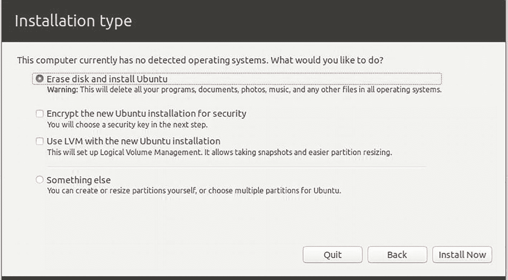

Ubuntu Linux 操作系统安装设置窗口的截图，选择安装类型为擦除磁盘并安装 Ubuntu。

图 3-23

擦除磁盘并安装 Ubuntu（继续）

1.  在进行最终安装之前，我们假设没有先前的 Ubuntu 安装（见图 3-23）。默认设置对我们来说已经足够。

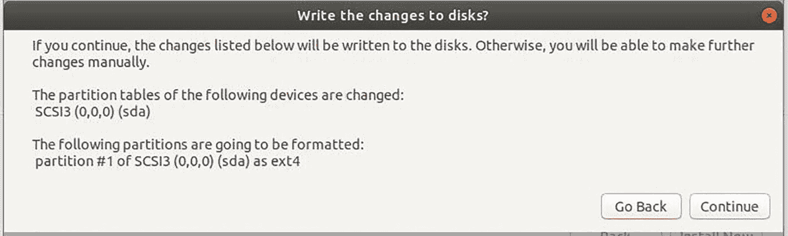

Ubuntu Linux 操作系统安装设置确认窗口的截图，用于在磁盘上写入更改。

图 3-24

Ubuntu 安装警告

1.  一旦安装过程开始，我们可能会遇到一个警告，声明我们即将重写目标虚拟磁盘（见图 3-24）。然后我们点击*继续*。


Ubuntu Linux 操作系统时区设置截图，突出显示纽约。

图 3-25

Ubuntu 时区设置

1.  设置 Ubuntu 计算机系统的正确时区（见图 3-25）。

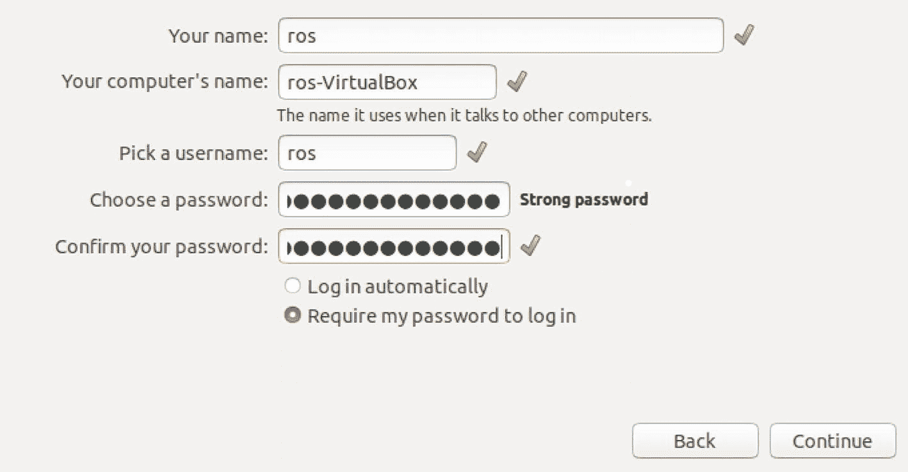

填写名称、计算机名称、用户名、密码、确认密码以及要求输入密码以登录的截图。

图 3-26

设置 Ubuntu 安装的名称、用户名和密码

1.  最后，我们输入 Ubuntu 系统的名称、用户名和密码（见图 3-26）。由于我们只将 Ubuntu 用作开发平台，出于安全考虑，我们应该使用强密码。为了保持 Ubuntu 开发环境最高级别的密码安全性，我们可以使用数字 0-9、字母 a-z 或 A-Z 以及特殊字符，如#、^和*。

恭喜！您已成功安装 Ubuntu Linux，如图 3-27 中的绿色矩形所示。接下来，我们需要安装软件开发所需的工具。Ubuntu 为我们提供了 Python 作为编程语言和 Gedit 文本编辑器。我们需要安装 ROS，这将为我们提供控制探测车的库。完整的 ROS 安装将为我们提供模拟器和可视化工具 Gazebo 和 Rviz。我们还将添加一些将在本书后面使用的其他库，即 TensorFlow（深度学习）和 OpenCV（计算机视觉）。

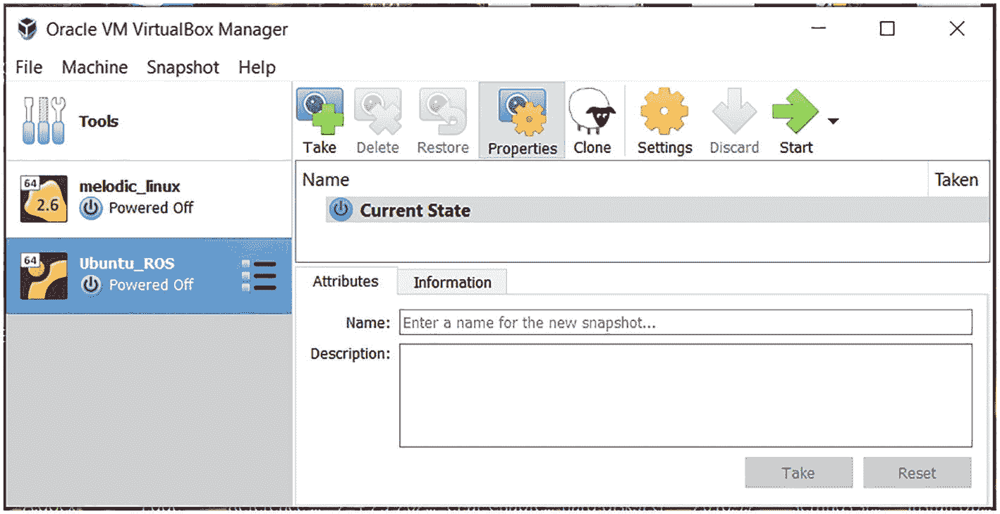

Oracle VM VirtualBox 管理器截图，列出了 melodic Linux 和 Ubuntu ROS。

图 3-27

Ubuntu 最终安装完成

### 更新 Ubuntu Linux 20.04.4

现在我们已经安装了 Ubuntu，要启动操作系统，请点击*开始*按钮（见图 3-27）。您可能会被提示输入额外的安装信息；只需对默认选项回答“是”。它还会要求您登录。操作系统启动后，您应该有一个类似于图 3-28 的窗口。（VirtualBox 菜单和屏幕底部命令将在未来的图像中被裁剪掉。）我们现在可以通过终端命令安装 ROS。

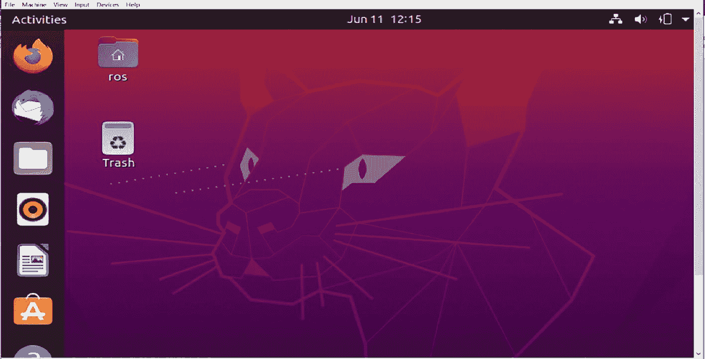

Ubuntu 主屏幕截图。

图 3-28

Ubuntu 初始屏幕

在图 3-28 中，桌面包括左侧的系统应用程序图标、一个用于删除项目的垃圾桶、一个显示日期和时间的标题栏，以及右上角四个图标（网络、声音、电池和向下箭头）。如有必要，我们将讨论这些内容。

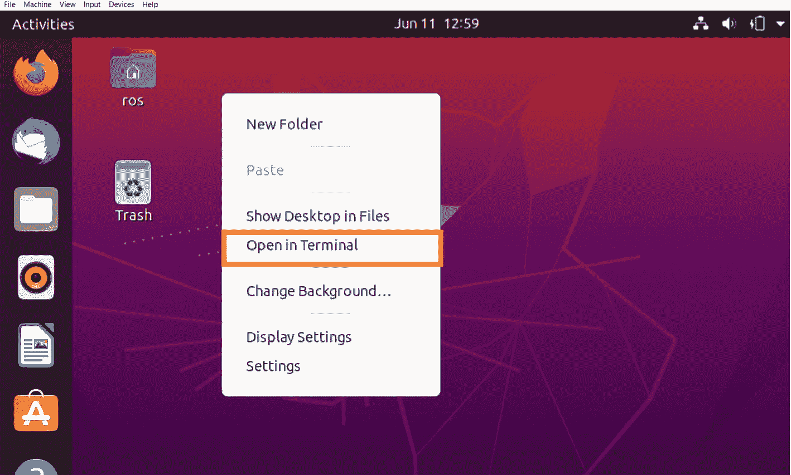

Ubuntu 主屏幕截图，右键点击访问菜单中选择在终端中打开选项。

图 3-29

Ubuntu 打开终端选择。通过右键点击访问菜单。

1.  要启动一个终端窗口，请右键单击桌面背景，确保避开图标（图 3-29）。点击**在终端中打开**菜单选项。

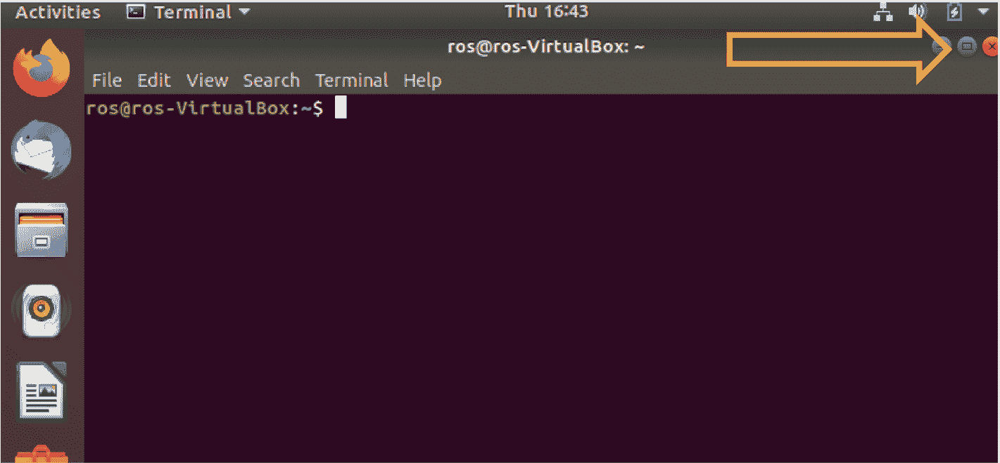

Ubuntu 终端窗口截图，箭头指向一个方形按钮。

图 3-30

Ubuntu 终端会话

1.  在全新安装的 Linux 系统中，您的终端将全屏显示（图 3-30）。稍后，我们将同时运行多个终端，因此请通过点击终端右上角的□来将终端设置为“窗口化”，如图中橙色箭头所示。

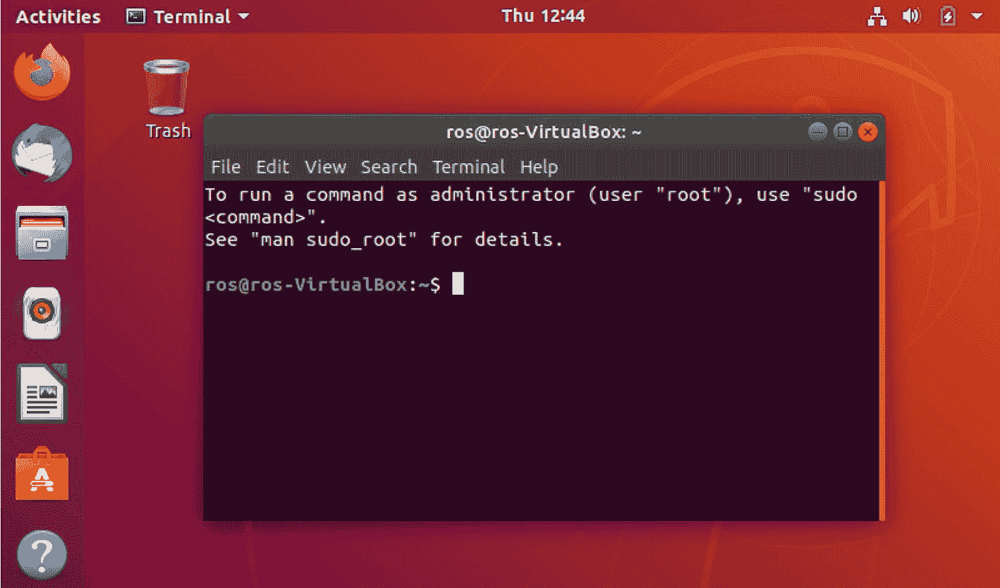

Ubuntu 终端窗口在主屏幕上的截图。

图 3-31

Ubuntu 初始终端屏幕

1.  现在我们已经在桌面上有一个终端窗口（图 3-31）。ROS 的安装将通过此终端窗口使用命令来完成。我们不会完全解释这些命令，因为它们超出了本书的范围，但如果你想要进一步研究，简单的网络搜索应该足够了。

1.  尽管我们刚刚安装了 Ubuntu Linux 20.04.4，但仍可能需要更新驱动程序、应用程序等软件。我们需要更新操作系统。我们将使用`sudo apt-get`命令。*Sudo*意味着“超级用户执行”，它暂时赋予您系统管理员权限；因此，您将需要输入密码。在终端中执行以下命令以更新必要的功能：

```py
$ sudo apt-get update
```

我们还可以看到图 3-32 中橙色矩形中高亮显示的第一个命令。输入您的密码后，您将看到几行更新。这是操作系统文件最新版本号的列表下载，而不是升级！输入以下内容：

```py
$ sudo apt-get upgrade
```

升级您的操作系统文件到最新版本。

停止后，您现在将安装上最新版本的 Ubuntu Linux 20.04.4（图 3-33）。顺便说一下，对于本章，从现在起，我们将以橙色矩形显示终端中的命令，而不是以文本叙述的形式。

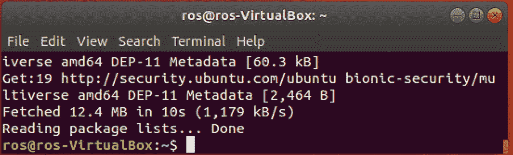

命令窗口截图，显示命令列表。

图 3-33

Ubuntu 终端更新完成

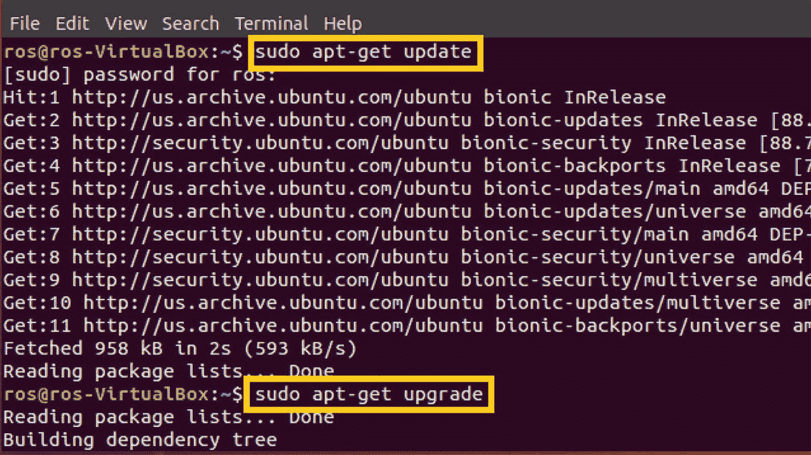

命令窗口截图，显示两个高亮文本，分别为 sudo apt-get update 和 sudo apt-get upgrade。

图 3-32

Ubuntu 终端更新命令

我们现在已将 Ubuntu Linux 系统更新到最新版本。接下来，我们需要设置 Ubuntu 以允许外部库（ROS 等）。这些库来自外部仓库。

### 配置 Ubuntu 仓库

要从外部第三方软件网站（如`ROS.org`）下载仓库，我们需要告诉系统这些网站。为此，请点击桌面左侧的系统设置图标（图 3-34）。


Ubuntu 系统设置图标的截图。

图 3-34

Ubuntu 系统设置图标（橙色框）

弹出几个图标。点击桌面上的软件更新图标（图 3-35）。

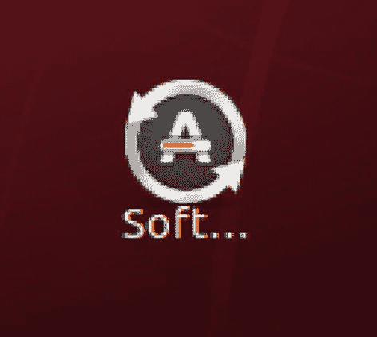

Ubuntu 软件更新图标的截图。

图 3-35

Ubuntu 软件更新图标

接下来，我们选择如图 3-36 所示的设置选项。设置选项定义了要安装或升级的软件，包括第三方软件，如 ROS。

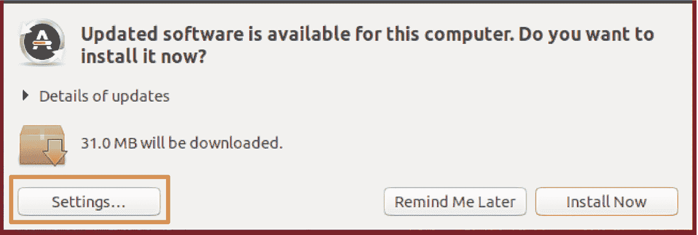

Ubuntu 软件更新对话框截图，突出显示设置按钮。

图 3-36

Ubuntu 软件设置选项

在新的弹出窗口中，选择**Ubuntu 软件**选项卡，并设置如图 3-37 所示的复选框。一旦做出这些选择，请点击*关闭*。这些选择批准下载第三方软件。

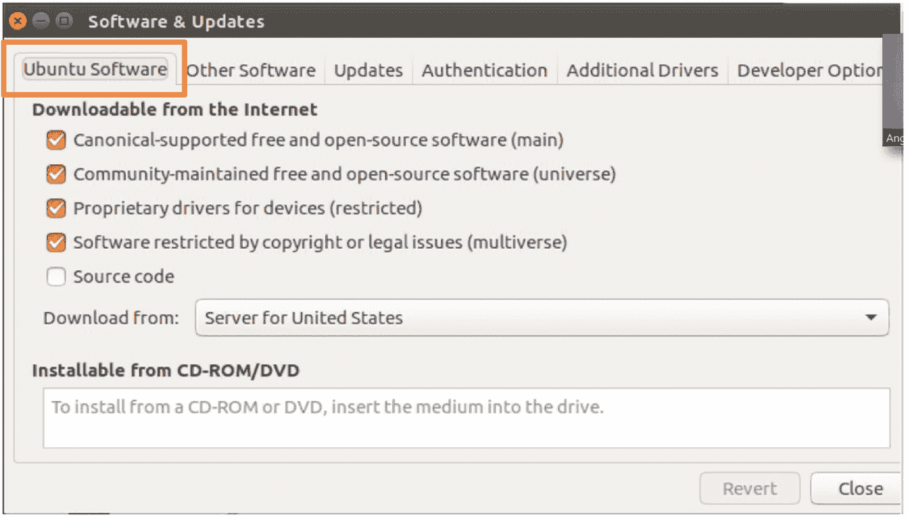

软件和更新标题对话框中突出显示的 Ubuntu 软件选项卡截图。

图 3-37

显示选定的仓库复选框

## 安装 Anaconda

**提醒一下，安装顺序很重要：VirtualBox，Ubuntu，Anaconda，ROS。任何其他顺序可能会导致问题。**

如果我们使用集成开发环境（IDE）来开发复杂的软件项目，那么它将变得更加易于管理。IDE 结合了一个简单的文本编辑器（Gedit）和一个编译器（Anaconda）。在 IDE 中进行编程可以使编程过程更容易，因为内置的工具和 IDE 足够智能，可以捕获简单的错误。Linux 有许多优秀的 IDE；我们选择了 Gedit，因为它简洁优雅。Anaconda 编译器可以运行 Python 2.7，这是 ROS 所需的。

首先，我们需要从[`https://anaconda.com/products/individual`](https://anaconda.com/products/individual)安装 Anaconda Python 编译器。向下滚动以找到 64 位 Linux 下载链接（图 3-38）。

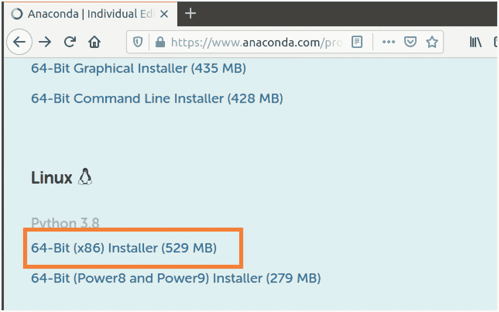

Anaconda 安装向导的截图，选择了 64 位 x86 安装选项 529 MB。

图 3-38

Anaconda 安装

现在我们已经下载了安装文件，我们需要找到它。图 3-39 显示了四个步骤：1)点击文件柜；2)点击下载；3)你会看到 Anaconda shell 脚本，4)在文件名附近右键点击，在此磁盘位置打开一个终端。

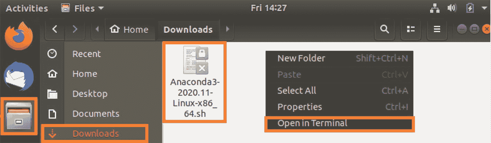

高亮显示下载和打开终端选项的截图。

图 3-39

Anaconda 定位下载

打开终端后，输入图 3-40 中显示的两个命令。第一个命令使 shell 脚本可执行。第二个命令执行 shell 脚本，以便在 Linux 上安装。

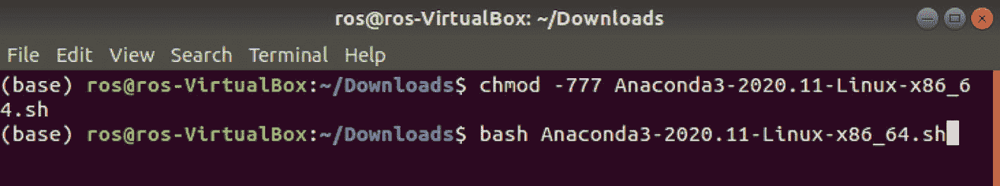

安装 Anaconda 时的命令窗口截图。

图 3-40

Anaconda bash 安装

现在我们已经安装了我们的编译器，我们需要设置操作系统以接受 ROS。我们通过设置 ROS 源列表和密钥来实现这一点。

## ROS 源列表

现在我们已经成功配置了 Ubuntu 仓库以允许“受限”、“宇宙”和“多元”仓库，允许安装和更新 ROS 所需的必要支持软件，我们现在可以从 `ROS.org` 基金会网站设置所需的软件列表。这可以通过以下终端命令完成：

```py
$ sudo sh -c 'echo "deb http://packages.ros.org/ros/ubuntu $(lsb_release -sc) main" > /etc/apt/sources.list.d/ros-latest.list'
```

ROS 源列表现在已配置。现在我们将设置 ROS 环境密钥。

## ROS 环境变量密钥

ROS 环境变量密钥用于验证和确认 ROS 源代码仓库的来源。它还确保软件未经所有者同意未被修改。该密钥使 ROS 仓库成为下载、安装和更新的“受信任”软件站点。在终端提示符中输入以下 shell 命令（图 3-41）：

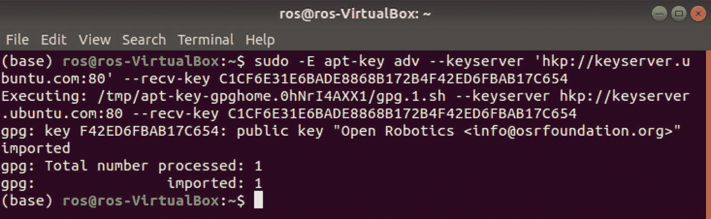

安装 Anaconda 时带有 Noetic ROS 安装密钥的命令窗口截图。

图 3-41

获取 Noetic ROS 安装密钥

```py
$ sudo -E apt-key adv --keyserver 'hkp://keyserver.ubuntu.com:80' --recv-key C1CF6E31E6BADE8868B172B4F42ED6FBAB17C654
```

注意

ROS.org 社区最近发现 Noetic ROS 原始密钥存在安全漏洞。这就是为什么我们使用这个更新的密钥。读者需要警惕 ROS 生态系统中的所有安全升级、维护和/或额外增强。读者需要偶尔在 `ROS.org` 讨论论坛中审查和检查此类安全更新。

## 安装机器人操作系统 (ROS)

安装 ROS 需要的两个命令如图 3-42 所示。第一个命令是良好的实践，用于验证所有系统软件是否是最新的，而第二个命令则安装完整的 ROS 库。下载和安装超过 1,000 个文件可能需要很长时间。（我的电脑花费了超过 30 分钟。）

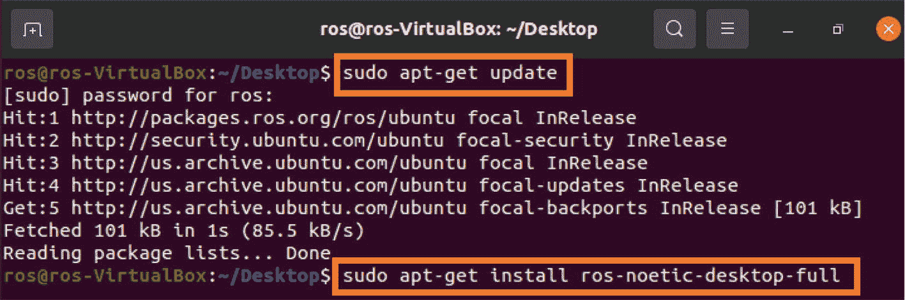

命令窗口截图，其中高亮显示的文本为 sudo apt-get update 和 sudo apt-get install ros-noetic-desktop-full。

图 3-42

Ubuntu ROS 安装

Noetic ROS 的完整功能版本现在应该已经安装。让我们来测试一下这个系统。

注意

如果您收到错误信息，表明无法找到任何 Noetic 软件包，您可能需要升级 Ubuntu 软件。请执行以下终端命令：

`$ sudo apt-get update`

`$ sudo apt-get upgrade`

### 安装 ROSINSTALL

您已成功将 ROS 安装到您的 Linux 系统中。然而，存在一些额外的库，可以使您项目的开发更加简单。这些库通过 `rosinstall` 访问：

```py
$ sudo apt-get install python3-rosinstall
$ sudo apt-get install python3-rosinstall-generator
$ sudo apt-get install python3-wstool build-essential
```

在上一个命令中的空格和连字符上要非常小心。如果你遇到错误，请验证每个连字符和空格。

### 第一次启动 ROS

下三个命令用于唤醒 ROS 并检查任何 ROS 相关库的更新。这些命令应该在第一次启动 ROS 时运行。我们在图 3-42 中下载和安装的 ROS 可能没有最新的子组件。第二个命令检查子组件是否有可用的更新。

```py
$ sudo apt-get install python3-rosdep
$ sudo rosdep init
$ rosdep update
```

### 添加 ROS 路径

每次你想使用 ROS 时，你需要告诉操作系统 ROS 命令的查找位置，即添加 ROS 路径到全局路径。由于我们每次使用 ROS 都必须这样做，我们将创建一个 bash 脚本。在文本编辑器（Gedit）中，创建一个名为 `STARTrosconfig.sh` 的文件，包含以下行（图 3-43）。

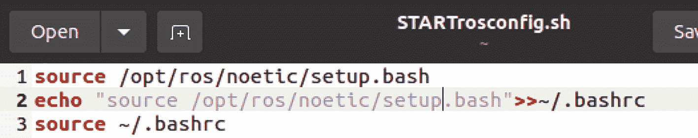

命令窗口的截图。

图 3-43

在 Gedit 中启动 ROS 配置

接下来，将文件保存到 `/home/ros` 目录。这将在 Gedit 用户界面中通过小橙色框反映出来，如图 3-44 所示。打开一个新的终端。以图 3-38 为指导，我们将使 `STARTrosconfig.sh` 可执行。橙色框是你要输入的命令，绿色框是你应该观察的输出。在你输入前两个命令后，观察 `STARTrosconfig.sh` 是白色的，这意味着它不可执行。下一个命令（`ls -la STARTrosconfig.sh`）是可选的，它查看文件的详细信息。你应该注意，文件可读（r）和可写（w），但不能执行（-）。要更改这一点，你必须发出更改模式命令（`chmod +rwx STARTrosconfig.sh`）。要验证更改是否发生，`ls -la STARTrosconfig.sh` 将显示 `rwx` 和绿色名称。成功！

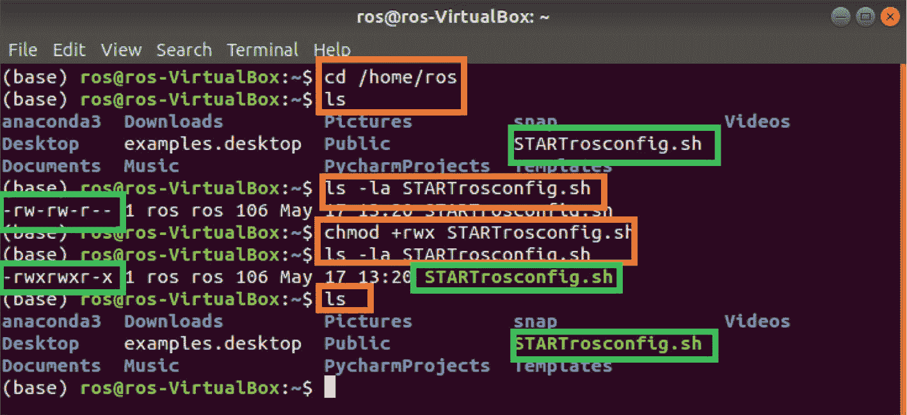

命令窗口截图，其中许多命令被突出显示。

图 3-44

使 STARTrosconfig 可执行

*每次*你想与 ROS 一起工作时，打开一个终端并输入 `source STARTrosconfig.sh`。这将 ROS 路径添加到系统中（图 3-45）。为了验证 ROS 变量是否正确安装，输入 `env | grep ROS_*`。此命令查看环境变量（`env`）并仅选择以“`ROS_`”开头的变量。

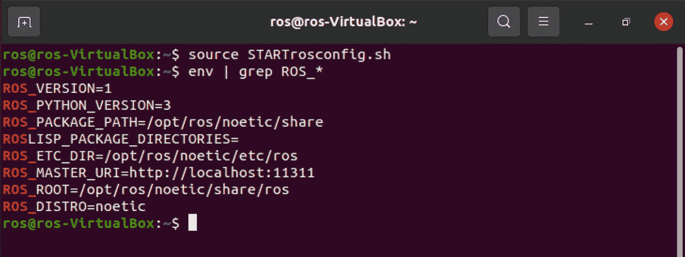

命令窗口的截图。

图 3-45

验证 ROS 路径

### 创建 ROS Catkin 工作空间

一旦建立了 ROS 环境变量，我们创建一个工作空间目录来开发 ROS 应用程序。ROS 需要一个由三个子文件夹（src、build 和 devel）组成的“catkin”工作空间。每个这些文件夹都需要脚本文件来帮助编译项目。此工作空间应位于用户主目录中。因此，使用以下 shell 命令创建工作空间：

```py
$ cd ~
$ mkdir -p ~/catkin_ws/src
$ cd ~/catkin_ws/src
$ catkin_init_workspace
$ cd ..
$ catkin_make
```

注意

如果您收到以下错误——“Ackermann 消息未由 Cmake 找到”——或任何其他类型的错误消息未找到，那么您需要手动安装正确的包，例如 Ackermann 包，如下所示：

`$ sudo apt install ros-noetic-ackermann-msgs`

脚本命令 `catkin_init_workspace` 将 `src` 文件夹设置为项目源文件存储库。脚本命令 `catkin_make` 创建 `devel` 和 `build` 文件夹并添加必要的脚本文件。我们将使用 `catkin_ws` 工作空间作为开发测试所有软件组件的中心目录。现在我们需要确保 `catkin_ws` 工作空间已为 ROS 源：

```py
$ source ~/catkin_ws/devel/setup.bash
$ echo “source ~/catkin_ws/devel/setup.bash” >> ~/.bashrc
```

现在您应该已经成功地将 `catkin_ws` 工作空间作为在 ROS 环境上运行的主要工作空间源。因此，如果您执行以下 shell 文本命令：

```py
$ echo $ROS_PACKAGE_PATH
```

它应该在终端提示窗口中显示以下输出：

```py
/home//catkin_ws/src:/opt/ros/noetic/share
```

注意

`<username>` 将是您之前定义的 Ubuntu Linux OS 用户名。

`catkin_ws` 工作空间现在已作为在 ROS 环境中开发应用程序的主要工作空间目录。如果我们没有获得预期的 ROS 包路径目录输出，请咨询 `ROS.org` 社区网站中的调试问题以获取更多信息。

### Noetic ROS 的最终检查

以下 shell 文本命令将确定是否已正确安装并运行了正确的 ROS 版本：

```py
$ rosversion -d
```

如果输出为 `Noetic`，那么您已经完全成功获得了完全可操作的 ROS 环境。恭喜。

注意

本书中使用的所有 shell 命令都与当前和未来的 Noetic 版本的 ROS 兼容。唯一可能的不同之处在于参数的数量，并在必要时将“Noetic”替换为正确的 rosversion。

### Noetic ROS 架构

在成功安装 Noetic ROS 之后，我们将介绍其架构。ROS 架构旨在与所有类型的机器人（漫游车、无人机、飞机、船只、潜艇等）一起运行。因此，ROS 框架被设计来处理机器人中的多个组件或节点。节点是一个传感器、电机、控制器等。换句话说，它是一块执行机器人功能的硬件。ROS 将控制硬件所需的软件称为“程序节点”。主节点被称为中心主节点。

ROS 架构处理节点之间的通信。例如，如果中心主节点从距离传感器节点接收数据，指示有物体在我们的路径上，那么主节点可能会向驱动节点发送移动命令以改变机器人的方向（图 3-46）。ROS 架构帮助我们管理随着更多功能、传感器和执行器的添加而不断增加的机器人系统复杂性。

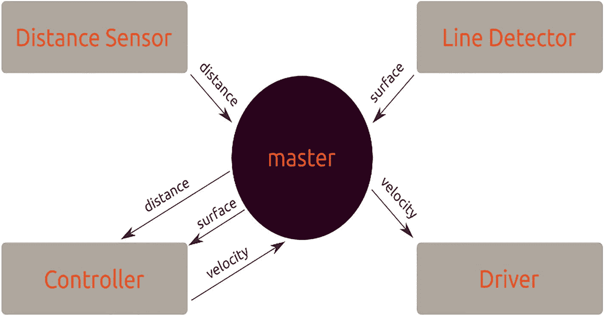

一个椭圆形的示意图，标记为 master，通过表面连接到线检测器，通过速度连接到驱动器，通过距离、表面和速度连接到控制器，通过距离连接到距离传感器。

图 3-46

初步的 ROS 架构 AI 巡游车布局

图 3-46 显示了五个节点：主节点和四个系统节点。当一个系统节点启动时，它会向主节点发送信息，包括节点可以发送和接收的数据类型。向主节点发送数据的节点被称为*发布节点*。例如，距离传感器和线检测器节点是发布节点，因为它们向主节点发送数据（目标距离和表面信息）。从主节点接收数据的节点被称为*订阅节点*。因此，驱动器节点是一个订阅节点，因为它从主节点接收速度数据。控制器节点既是发布节点也是订阅节点。

控制节点将托管在后续章节中开发的深度学习和认知深度学习例程。这些深度学习例程将向 ROS 主节点发送和接收消息。主节点将重新路由这些消息到它们的目标节点，例如将消息发送到驱动节点以控制速度。

### 简单的“Hello World”ROS 测试

现在我们已经描述了基本的 ROS 架构，让我们通过执行简单的 ROS 教程脚本来确定 ROS 的安装是否成功。这个脚本将简单地有两个 ROS 节点：一个说话人（发布者）和一个监听人（订阅者）。如果我们看图 3-47，我们会看到三个节点。首先，当监听人被创建时，它告诉主节点它想监听说话人（订阅）。接下来，当说话人被创建时，它向主节点注册。最后，说话人生成（发布）一条消息；这意味着它将消息发送到主节点。这导致主节点将消息发送到所有监听说话人的节点，这意味着消息被发送到监听人。

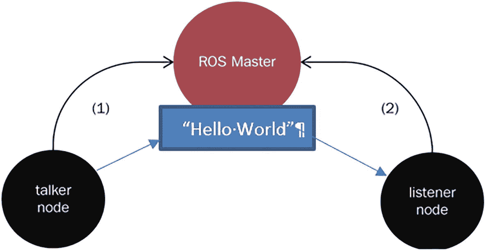

一个椭圆形的示意图，标记为 ROS 主，下面有一个标记为 hello world 的矩形框。左下角和右下角有两个椭圆形，分别标记为说话人节点和监听人节点，通过标记为 1 和 2 的箭头指向 ROS 主。从说话人节点发出的一个箭头指向 hello world，它指向监听人节点。

图 3-47

简单的说话人和监听人节点 ROS 测试示例

我们最终将打开三个终端，每个终端都是一个节点。（如果你愿意，可以从 Ubuntu 软件商店安装**Terminator**以打开多个平铺终端。这使运行 ROS 脚本更容易。）打开第一个终端，我们将将其设置为 ROS 主节点：

```py
$ roscore
```

返回桌面并打开第二个终端。我们将将其设置为监听人：

```py
$ rosrun roscpp_tutorials listener
```

返回桌面并打开第三个终端，将其设置为说话人：

```py
$ rosrun roscpp_tutorials talker
```

你应该在说话人终端上看到以下内容：

```py
hello world 0
hello world 1
hello world 2
...
```

然后，你应该在监听人终端上看到以下内容：

```py
I heard: [hello world 0]
I heard: [hello world 1]
I heard: [hello world 2]
...
```

如果你已经走到这一步，恭喜你，你已经成功安装了 VirtualBox、Ubuntu Linux 和 Noetic ROS。（不要关闭节点，因为我们将在下一节中使用它们。）接下来，我们将访问 ROS 中的两个组件：RQT 图和 Gazebo 机器人模拟器。（当我们使用 Rviz 和 TensorFlow 时，我们将讨论它们。）

### ROS RQT 图

RQT 图是一个重要的可视化和调试工具。这个绘图工具将用于调试正在运行的节点并检查它们之间的通信。我们将使用 RQT 图来检查上一节中运行的两个节点。在一个新的终端中，输入以下命令，你将得到类似于图 3-48 的内容：

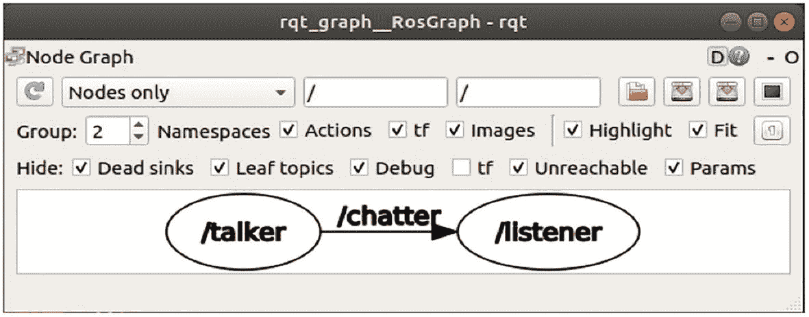

R Q T 图工具窗口的截图。左侧的一个椭圆形上写着“发言者”，右侧的一个椭圆形上写着“监听者”，中间有一个向右的箭头，标有“chatter”。

图 3-48

发言节点向监听节点发送信息

```py
$ rosrun rqt_graph rqt_graph
```

ROS 命令 `rosrun rqt_graph rqt_graph` 在 RQT 图窗口中以图形方式显示所有活动的发布者和订阅者节点。图 3-43 的解释是 `/talker` 正在向 `/listener` 发送消息。请注意，ROS 主节点被省略了。默认的消息管道名称是 `/chatter`。

### ROS Gazebo

Gazebo 是一个用于可视化你创建的任何虚拟世界的图形模拟工具。虚拟世界可以包含对象、机器人、建筑、障碍物等。你用 Gazebo 理解的术语定义它们，它将在 Gazebo 窗口中进行模拟。

Gazebo 是一个需要与 ROS 系统和世界定义关联的独立程序。这意味着我们将使用 `roslaunch` 命令在 ROS 内部“启动”程序。简要来说，ROS 的操作方式：`rosrun` 和 `roslaunch`。`rosrun` 命令启动一个（Python）脚本，通过自身（或有限数量的其他对象）运行对象的脚本。相比之下，`roslaunch` 在世界环境中加载并执行所有对象（及其相关脚本），其中每个对象都可以与其他对象交互。

`roslaunch` 工具是启动 Gazebo 模拟世界和机器人的标准 ROS 方法。为了验证 Gazebo 是否正确安装，我们将使用以下命令启动图 3-49 中显示的提供的 `willowgarage_world.launch`：

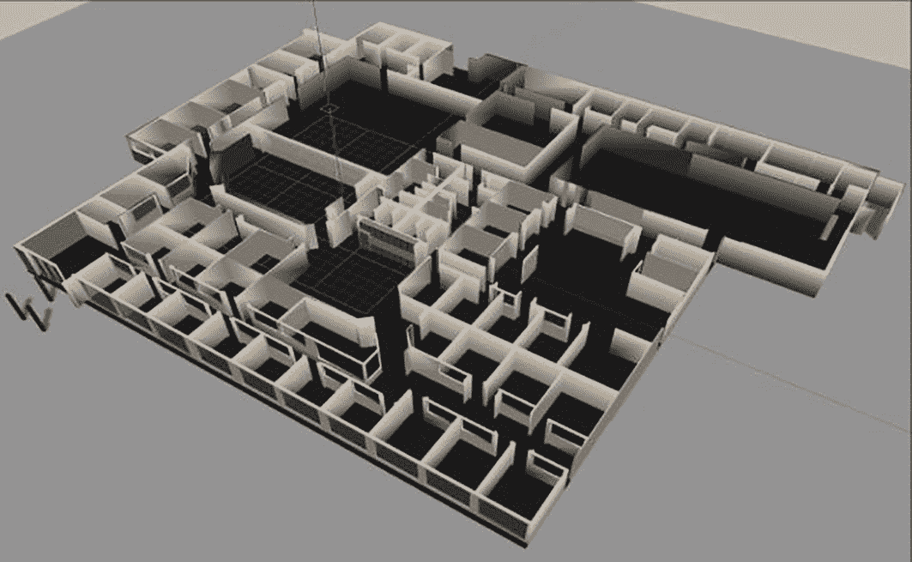

Willow garage 的计算机生成布局。

图 3-49

Willow Garage 生成的世界

```py
$ roslaunch gazebo-ros willowgarage_world.launch
```

现在我们已经验证了 Gazebo 正确安装，我们将用我们的世界替换 `willowgarage_world.launch` 文件：一个简化的模拟世界，包括未探索的埃及地下墓穴和我们的勇敢的 AI 探索车。AI 探索车的脚本将具有自适应智能和决策能力，以避开可能仍然等待我们的古代危险。

## 摘要

为了启动我们的项目，我们安装了 VirtualBox 和一个虚拟的 Ubuntu Linux 20.04.4 LTS 操作系统。然后我们在 Ubuntu 上安装了 Anaconda，我们的 Python 编程解释器。最后，我们成功地在 Ubuntu 上安装了 Noetic ROS。这完成了我们的开发环境的设置。

为了验证环境是否成功安装，我们创建了两个 ROS 节点并通过 Python 脚本进行通信。我们使用 RQT Graph 来可视化正在运行的节点。最后，我们验证了 Gazebo 模拟器可以从 ROS 中启动。（我不知道你，但我累了。）现在我们已经设置了我们的开发环境，我们可以开始设计和开发我们的 AI 探索车以及简化版的虚拟埃及地下墓穴世界。

额外加分

1.  在 Gazebo 模拟器的 `roslaunch` 命令中可以探索哪些其他世界？如果需要，请查阅互联网资源。

1.  使用哪些其他测试来确定 ROS 的成功安装？

1.  节点之间可以交换哪些其他消息？
