# 4. 构建简单的虚拟漫游车

在上一章中安装了开发操作系统（Ubuntu）、目标操作系统（ROS）及其相关工具后，我们将“玩耍”这些工具，用 RViz 构建一个非常简单的漫游车并在 Gazebo 模拟器中驾驶它。我们还将逐部分构建、测试和运行漫游车的底盘。

## 目标

以下是为成功完成本章所需达成的目标：

+   理解 ROS、RViz 和 Gazebo 之间的关系

+   扩展你对 ROS 命令的理解

+   探索 RViz 以创建简单的漫游车

+   使用 Gazebo 在简单的虚拟环境中移动漫游车

## ROS、RViz 和 Gazebo

作为提醒，ROS 代表机器人操作系统。我们的漫游车将使用 ROS 作为其操作系统。操作系统是一种软件，它连接了系统的不同组件。这些组件可以是硬件（电机、传感器等）、软件（神经网络库等）或“软体”（人类）。[尽管最后一个术语是为了幽默而添加的，但操作系统是用户交互的关键。] RViz 和 Gazebo 是用于开发 ROS 机器人的软件工具（图 4-1）。RViz 用于构建我们虚拟漫游车的模型。另一种思考这两个程序的方式是，RViz 在受控空间（实验室）中探索单个对象（s），而 Gazebo 将对象放入几乎不受控制的“真实世界”环境中。

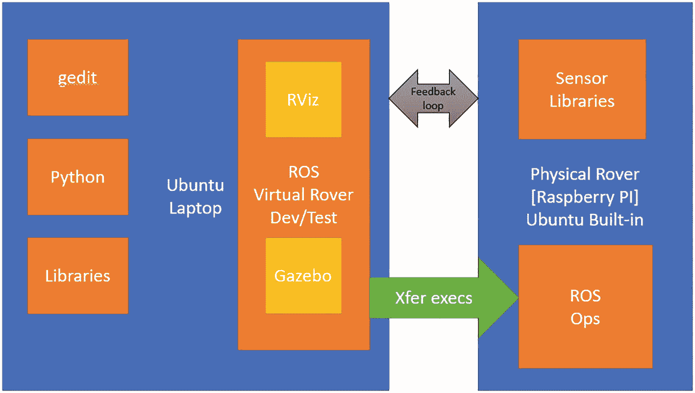

组件之间关系的示意图。在左侧，Ubuntu 笔记本电脑上安装了 gedit、python、库以及 R O S 虚拟漫游车开发/测试，带有 R Viz 和 Gazebo。在右侧，物理漫游车有传感器库、R O S 和 O p s。Ubuntu 笔记本电脑通过 X f e r execs 和双头反馈回路指向物理漫游车。

图 4-1

开发系统关系

图 4-1 直观地描述了我们项目的主要组件及其相互关系。蓝色方框是我们的物理计算系统（笔记本电脑和漫游车），它们运行 Ubuntu 操作系统。橙色方框代表每个系统上安装的软件组件和库。黄色方框是用于开发和测试 ROS 模型的内部 ROS 工具。一旦虚拟 ROS 模型经过彻底审查，可执行脚本就会转移到物理漫游车（绿色箭头）。假设一切正常，我们的漫游车将能够在真实世界中移动并回传数据到笔记本电脑（灰色箭头）。灰色箭头代表可能用于控制漫游车的“人机交互”决策，例如“启动”、“回家”或“暂停”。Gazebo 将允许我们查看物理对底盘的影响，模拟施加到每个电机上的功率，并模拟算法。

## 重要的 ROS 命令

表 4-1 列出了我们将频繁使用的 ROS 命令。这些 ROS 命令允许我们控制、分析和调试包中包含的节点。节点是系统（包）子部分的独立模型。包包含我们用来描述我们的漫游车的不同模型。例如，我们的漫游车将有一个由底盘、车轮、传感器等组成的模型，这些是子模型。每个子模型都可能应用了物理模型，如速度和加速度。此外，我们的漫游车将与墙壁、洞和障碍物模型交互。所有这些模型和子模型构成了我们的漫游车包。表 4-1 中提到的节点通常对应于一个“物理”子模型，如车轮。

表 4-1

重要的 ROS 命令

| 命令 | 格式 | 操作 |
| --- | --- | --- |
| roscore | $roscore | 启动主节点 |
| rosrun | $rosrun [package] [executable] | 执行程序并创建节点 |
| rosnode | $rosnode info [node name] | 显示关于活动节点的信息 |
| rostopic | $rostopic <subcommand> <topicname>subcom: list, info, & type | ROS 主题的详细信息 |
| rosmsg | $rosmsg <subcom> [package]/ [message]subcom: list, info, & type | 消息类型的详细信息 |
| rosservice | $rosservice <subcom> [service] subcom: args, call, find, info, list, and type | 显示的运行时信息 |
| rosparam | $rosparam <subcom> [parameter] | 获取和设置节点使用的数据 |

我们不会深入探讨每个命令的细节，而是在文本中使用它们时将进一步探讨。

## 机器人可视化（RViz）

我们“简化虚拟漫游车”的最终模型由四个子组件组成（图 4-2）：一个底盘、一个万向轮和两个车轮。不同的组件被建模为盒子、球体和圆盘。我认为这里的一个关键要点是模型不必看起来像实际的漫游车。引用英国统计学家乔治·博克斯的话：“所有模型都是错误的，但有些是有用的。”我们有一个非常有用的漫游车，它只测试了基本要素。

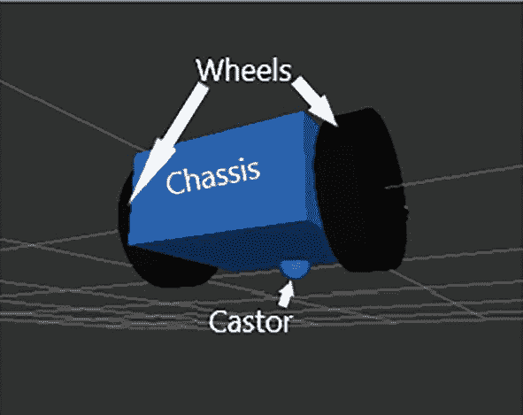

在虚拟世界中带有网格的简化虚拟漫游车的示意图。其组件如下标注：左侧和右侧为车轮；中部为底盘；底部为万向轮。

图 4-2

我们将要构建的简化虚拟漫游车

我们将使用 RViz，一个 ROS 的 3D 建模工具，构建图 4-2 中所示的简化虚拟漫游车。RViz 设计和模拟 3D 组件，如车轮和传感器。除了定义组件的尺寸（*H*x*W*x*D*）外，我们还可以建模特性（颜色、材料等）和行为（速度、智能等）。RViz 可以显示来自光学相机、红外传感器、立体相机、激光、雷达和激光雷达的 2D 和 3D 数据。RViz 允许我们构建和测试单个组件和系统。它还提供对环境中组件交互的有限测试。最后，RViz 测试虚拟和物理漫游车。因此，我们可以在构建硬件前后在模拟器中捕捉设计和逻辑错误。我们可以使用 RViz 以低成本调试 AI 漫游车的子系统节点和例程。

要启动 ROS 与 Rviz 的通信，我们将使用 Terminator 打开三个终端窗口（图 4-3）。在终端 1 中，我们使用 `roscore` 命令启动主节点（橙色）。在终端 2 中，使用 `rosrun rviz rviz` 启动 RViz 程序（红色）。`rosrun` 命令接受两个参数：脚本所在的 ROS 包（`rviz`）和要运行的脚本（`rviz`）。RViz 程序将在您的屏幕上“弹出”。最小化它以运行最终命令。

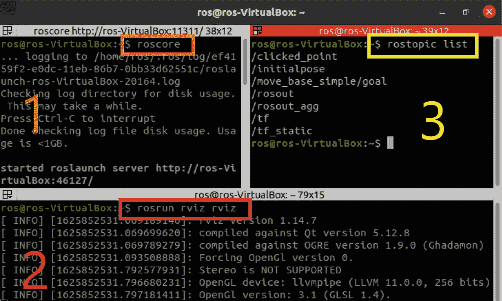

在 ros-Virtual box 中以 ros 速率的截图，显示 3 个终端窗口。左上角的窗口标记为 1，`roscore` 在一个框中被突出显示。下方的窗口标记为 2，`rosrun r viz r viz` 在一个框中被突出显示。右上角的窗口标记为 3，`rostopic list` 在一个框中被突出显示。

图 4-3

Terminator 显示三个终端

最后，在终端 3 中，我们通过运行 `rostopic list`（黄色）来验证 `roscore` 是否与 `rviz` 通信。显示的输出列出了在 ROS 中运行的节点之间的活动管道——黄色框中的属于 `rviz` 和 `roscore`。管道是计算机科学术语，描述了在组件之间传递消息的专用路径。我们将在以后使用这些管道，以及 `rostopic`，来查看传递的消息。

点击 RViz 快速启动图标后，RViz 程序通过执行 `rosrun rviz rviz` 命令运行，如图 4-4 所示。

注意

如果 `rosrun rviz rviz` 命令生成错误消息，请验证 `~/catkin_ws/devel/setup.bash` 行是否在您的家目录中的 `.bashrc` 文件中。

如果 `rosrun rviz rviz` 命令仍然不起作用，那么重新安装整个 `ros-noetic-desktop-full` 安装包。检查打印输出，确定在重新安装 `ros-noetic-desktop-full` 后是否有任何安装错误。

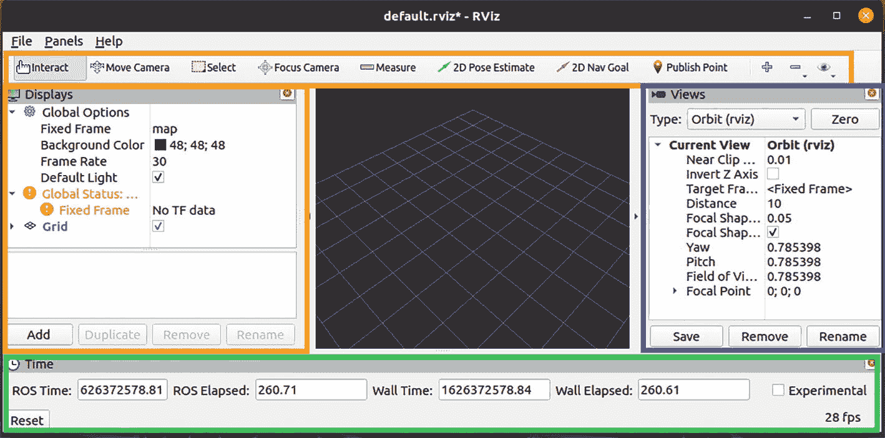

R Viz 窗口的截图。在菜单栏下方，有交互、移动相机等选项。在左侧，有全局选项、全局状态、网格和添加按钮。在中间，有一个带有网格的空虚拟世界。在右侧，有当前视图。在底部，有 ROS 和墙时间，ROS 和墙经过时间。

图 4-4

RViz 用户界面

图 4-4 中有四个默认面板：**工具**（橙色）；**视图**（蓝色）；**显示**（黄色）；和**时间**（绿色）。我们将忽略**时间**面板，因为我们不会使用它。中心窗口不是一个面板；它是我们虚拟世界的可视化。它目前是空的，有一个网格占位符。假设你理解**文件**和**帮助**菜单项，唯一有趣的菜单项是**面板**。**面板**菜单项打开和关闭不同的“面板”。面板是与当前模型交互的不同方式。我们将根据需要更深入地解释不同的面板。工具面板让我们在视图面板中工作/实验对象：

+   **交互：** 显示交互式标记。

+   **移动相机：** 使用鼠标或键盘在**视图**面板中移动相机。

+   **选择：** 在 3D 对象周围点按并拖动一个线框框。

+   **聚焦相机：** 聚焦于一个点或一个物体。

+   **测量：** 测量对象之间的距离。

+   **2D 姿态估计：** 确定或计划巡游者穿越的距离。

+   **发布点（未显示）：** 发布对象的坐标。

注意

RViz 教程可以在以下位置找到：

[`http://wiki.ros.org/RViz/Tutorials`](http://wiki.ros.org/RViz/Tutorials) 和 [`http://wiki.ros.org/RViz/UserGuide`](http://wiki.ros.org/RViz/UserGuide)

**显示** 面板可以交互式地添加、删除和重命名在 **虚拟世界** 中建模的对象组件的交互（图 4-4）。换句话说，当你创建一个巡游底盘时，它被建模为 RobotModel。**显示** 面板允许你显示给定对象的底盘轴、速度向量等。**添加** 按钮为你建模的对象（在这种情况下，默认网格）提供适当的图形元素，例如相机、点云、RobotModel、轴和地图。选择显示面板中提供的元素将显示描述框（图 4-5）。如果你选择 *确定*，一个 3D 轴将显示默认网格以显示其在虚拟世界中的方向。

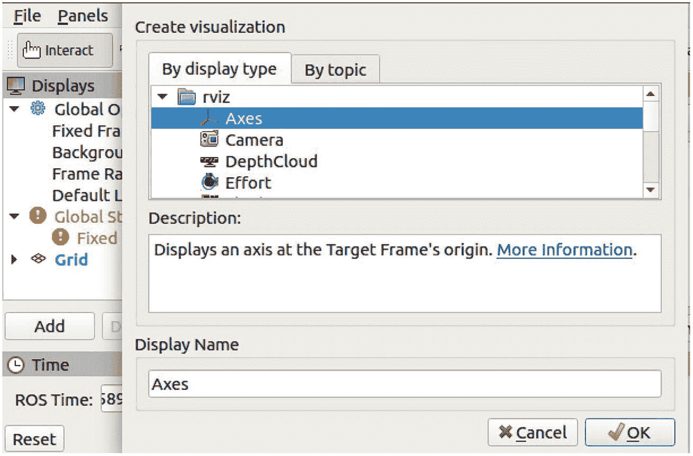

带有显示选项和时间的 R Viz 窗口的截图。它有一个通过显示类型和通过主题标签的创建可视化对话框。通过显示类型有各种选项，其中轴被选中。下面，描述显示在目标框架原点的轴，显示名称为轴。在底部，有取消和确定按钮。

图 4-5

通过显示类型和通过主题创建可视化选项

RViz 图形用户界面（GUI）布局的右侧关注的是**视图**面板（图 4-6）。它控制我们使用哪个摄像头来查看虚拟世界。默认是**轨道**，它模拟了一个围绕我们的世界“轨道”的摄像头。我们可能还会使用的其他两个摄像头是**FPS**（第一人称射击）和**ThirdPersonFollower**。这些是“游戏”术语。为了理解这些术语，想象一个谋杀场景。场景有一个犯罪者（第一人称射击）、一个受害者（第二人称）和一个目击者（第三人称）。所以**FPS**摄像头是从物体的视角，而**ThirdPersonFollower**是从“目击”动作的人的视角（第三人称）。

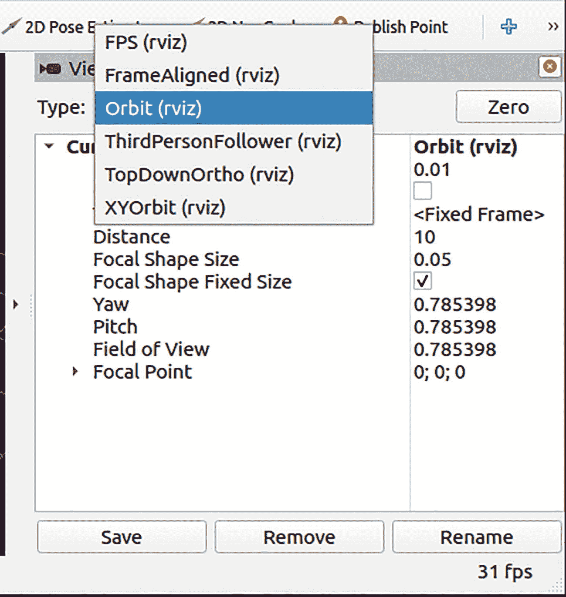

R Viz 窗口的截图，其中包含查看选项。它有一个菜单，其中选择了轨道、r viz。当前视图和轨道、r viz 下的文本包括距离，10；焦点形状大小，0.05；焦点形状固定大小；偏航、俯仰和视野，0.785398；焦点点，0\. 在底部，有保存、删除和重命名按钮。

图 4-6

查看选项和时间显示

### 再次回顾 Catkin 工作空间

回想在第三章中创建 Catkin 工作空间，用于我们快速测试 RViz 和 Gazebo。共有六个步骤，因此我们将添加六个步骤来组织我们的项目，如下所示：

1.  `cd ~/catkin_ws/src`

1.  `catkin_create_pkg ai_rover ‘ 新行`

1.  `cd ~/catkin_ws`

1.  `mkdir src/ai_rover/urdf ' 新行`

1.  `mkdir src/ai_rover/launch ' 新行`

1.  `catkin_make`

执行这些六个命令后，您将拥有以下目录结构（图 4-7）。重要的文件夹名称加粗，每个文件夹的描述在框的底部。（我们将不明确使用的文件夹在图 4-7 中省略，以简化。）第四步执行了在第二步`catkin_create_pkg`期间生成的`catkin_make`文件。`catkin_make`脚本生成了其他文件夹和相关文件。

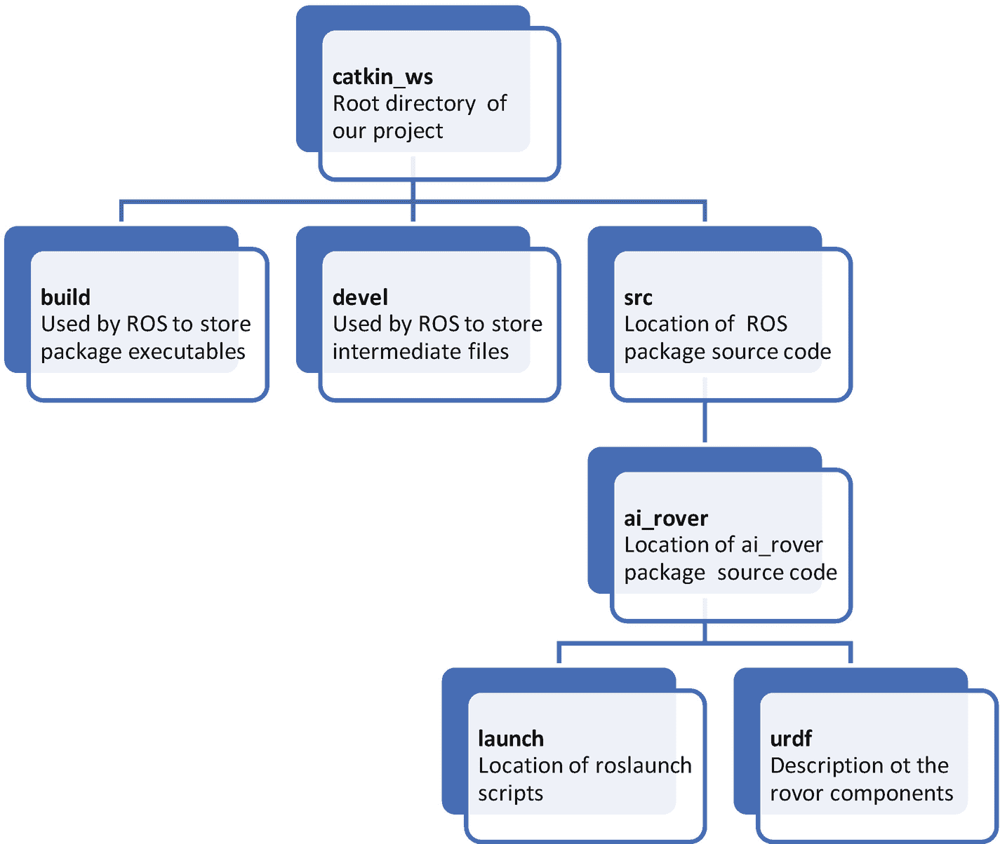

AI 漫游车包的组织结构图。在顶部，有 catkin w s，我们的项目的根目录，分为 build，由 ROS 存储包的可执行文件；devel，由 ROS 存储中间文件；s r c，ROS 包源代码的位置。S r c 包括 a i rover，分为 launch 和 u r d f。

图 4-7

简化的 AI 漫游车包文件夹组织

这是 ROS 项目的“必需”文件夹结构。根目录是`catkin_ws`，并在`catkin_make`脚本中硬编码。`build`和`devel`目录包含编译和执行项目所需的库和脚本。当开发适用于所有包的 ROS 脚本时，我们将文件存储在`src`目录中。`ai_rover`（子）目录包含特定于 AI 漫游车项目的脚本。`URDF`目录包含漫游车组件的描述。还有两个其他文件值得关注：**CMakeLists.txt**和**package.xml**。**不要编辑**！`CMakeLists.txt`在两个文件夹`src`和`ai_rover`中创建，用于编译它们各自文件夹中的脚本。另一个文件`package.xml`为 AI 漫游车设置 XML 系统。

### URDF 和 SDF 之间的关系

通用机器人描述格式（URDF）文件描述了 AI 漫游车的逻辑结构。Rviz 可读的`URDF`文件以可扩展标记语言（XML）格式化，XML 是一套用于将对象编码为人类可读格式的规则。`URDF`文件包含所有环境对象的静态尺寸，例如墙壁、障碍物、AI 漫游车及其组件，以及这些对象使用的任何动态参数。`UDRF`是 AI 漫游车和环境初始状态的描述（模型）。然而，为了在 Gazebo 中动态运行我们的 AI 漫游车，我们需要使用 GZSDF 将`URDF`文件转换为仿真描述文件（SDF）（见图 4-8）。

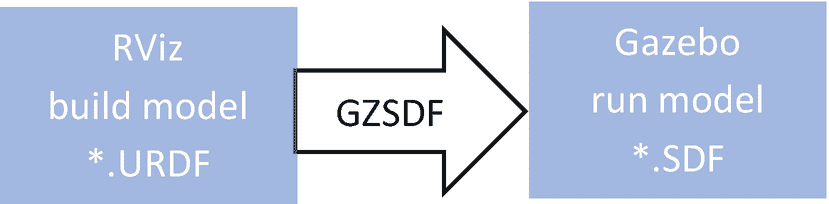

URDF 和 SDF 之间关系的插图。从左到右，一个标记为 Rviz 构建模型的矩形，星号点 URDF 指向一个标记为 gazebo 运行模型的矩形，星号点 SDF。

图 4-8

ROS 开发中 RViz 和 Gazebo 之间的关系

`SDF`文件使用 URDF 中描述的 AI 漫游车的初始静态、动态和运动学特性来初始化 Gazebo 中的动画 AI 漫游车。例如，传感器、表面、纹理和关节摩擦特性都可以在`URDF`文件中定义，并转换为 SDF 文件。我们可以在`URDF`文件中定义可能存在于环境中的动态效果，例如坍塌、倒塌的楼层和由甲烷积聚引起的爆炸。每次你想向 AI 漫游车添加组件时，你将其放入`URDF`中，然后将其转换为`SDF`。

### 构建底盘

每个 URDF 文件中需要建模的两个必要组件。*链接组件*负责描述每个对象的静态物理尺寸、方向和材料。*关节组件*描述动态物理特性，例如物体之间的摩擦量和旋转特性。

我们 AI 探测车的底盘是一个非常简单的 3D 盒子。（在 Apress 下载源代码：[《使用认知深度学习的智能自主无人机》](https://github.com/Apress/Intelligent-Autonomous-Drones-with-Cognitive-Deep-Learning)）切换到`URDF`目录，通过以下终端命令（`cd ~/catkin_ws/src/ai_rover/urdf`）。使用 Gedit 创建`ai_rover.urdf`文件。输入以下终端命令并输入代码：

这描述了我们的**底盘**是一个长 0.5 米、宽 0.5 米、高 0.25 米的 3D 盒子，位于原点（0,0,0）处，没有旋转（没有滚动、没有俯仰、没有偏航）。（大多数模拟器使用公制系统。）底盘的`base_link`是**链接组件**。所有其他链接组件都将相对于这个`base_link`定义。构建探测车类似于现实生活中构建机器人；我们将向底盘添加部件以定制我们的探测车。我们使用底盘的这个初始`base_link`来定义 AI 探测车的初始位置。

### 使用 ROSLAUNCH 命令

`roslaunch`命令用于在 ROS 环境中启动外部程序，如 RViz 和 Gazebo。我们使用`roslaunch`命令在 RViz 中显示位于`URDF`目录中的`URDF`文件。`roslaunch`命令自动为每个 ROS 会话启动`roscore`主节点。`roslaunch`配置文件具有`.launch`文件扩展名，必须位于`launch`目录中。在`launch`目录中，使用命令提示符创建配置文件`gedit RViz.launch`。添加以下行：

```py

$

```

`roslaunch`文件有以下部分：

+   导入`ai_rover.urdf`模型。

+   启动`joint_state_publisher`、`robot_state_publisher`和 RViz 3D CAD 环境。

注意

所有 URDF/SDF 文件都必须是可执行的：

`$ sudo chmod +rwx RViz.launch`

`roslaunch`命令的一般格式是：`roslaunch <package_name> <file.launch> <opt_args>，`其中`package_name`是包，`file.name`是配置文件，`opt_args`是配置文件需要的可选参数。要启动我们的简单底盘，命令如下：

```py
$ roslaunch ai_rover RViz.launch model:=ai_rover.urdf
```

解释这个命令，“使用 RViz.launch 配置文件启动带有 ai_rover 包的 RViz，它将使用 ai_rover.urdf 作为模型运行。” RViz 屏幕应如图 4-9 所示。中间的小红框是我们的“底盘。”

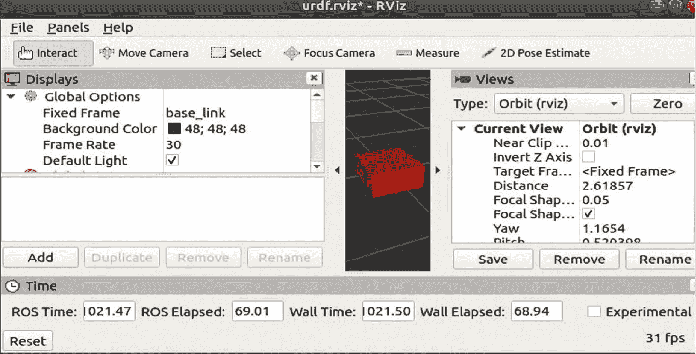

R Viz 窗口的截图。在菜单栏下方，有交互、移动相机等选项。在左侧，在显示下有全局选项。在中间，有一个在网格上的底盘。在右侧，有当前视图、轨道、r viz。在底部有 ROS 时间、ROS 已过时间、墙时间、墙已过时间以及重置按钮。

图 4-9

简单的探测车底盘

如果没有 3D 盒子，检查**显示**面板以确定是否已定义**RobotModel**和**TF**（模型变换）。如果没有，请执行以下操作：

+   选择**添加**按钮并添加**RobotModel**。

+   选择**添加**按钮并添加**TF**。

+   最后，转到**全局选项➤固定框架**选项，并将值更改为`base_link`。

现在主屏幕上应该有一个框。保存你的工作！

### 创建轮子和驱动器

接下来，为轮子和驱动器添加 3D 链接到我们的模型中。记住，在 ROS 中，链接是“物理”结构，位于“关节”之间。关节是运动发生的地方。想象一下人类的骨骼：肩部和肘部关节通过桡骨相连。有六种关节类型，这些类型由围绕 XYZ 轴的自由度（DoF）定义：

+   **平面关节** **:** 这种关节允许在平面上移动。一个例子就是肘关节。 (一个自由度：旋转)

+   **浮动关节** **:** 这种类型的关节允许在所有六个自由度（每个轴的平移和旋转）中移动。一个这样的关节的例子是手腕。

+   **滑动关节** **:** 这种关节沿着轴滑动，并且具有有限的上下限距离范围。一个例子是望远镜。想想海盗望远镜。 (两个自由度：平移和旋转)

+   **连续关节** **:** 这种关节像汽车的轮子一样绕轴旋转，没有上下限。 (一个自由度：旋转)

+   **旋转关节** **:** 这种关节绕轴旋转，类似于连续关节，但具有旋转角度的上限和下限。例如，一个体积旋钮。 (一个自由度：旋转)

+   **固定关节** **:** 这种关节根本不能移动。所有自由度都被锁定。一个例子是汽车门上镜子的静态位置。 (零自由度)

我们需要将轮子连接到我们的底盘上，应该使用的正确关节是连续关节，因为轮子可以连续旋转 360°。每个轮子都可以向前和向后旋转。要将轮子添加到我们的模型中，通过添加粗体行修改`ai_rover.urdf`文件。修改后保存文件。

以下是对`ai_rover.urdf`模型所做的修改：

+   每个轮子有两个部分，即链接和关节。

+   每个轮子的`<link>`被定义为半径为 0.2 米、长度为 0.1 米的圆柱体。每个轮子位于（0，±0.3，0），绕 x 轴旋转π/2（1.57...）弧度或 90 度。

+   每个轮子的`<joint>`定义旋转轴为 y 轴，并由 XYZ 三元组“0, 1, 0”定义。`<joint>`元素定义了我们模型的运动部分，轮子绕 y 轴旋转。

+   `URDF`文件是一个树结构，AI 巡洋舰的底盘作为根（`base_link`），每个轮子的位置相对于基链接。

注意

我们简化后的虚拟模型的尺寸与物理探测车的物理尺寸并不相同。这可能会在训练深度学习和认知网络时引起一些问题。我们将在第十二章及其之后讨论这些问题。

**验证和启动**修改后的代码。您的 Rviz 显示应该类似于图 4-10。如果您没有收到“**成功解析**”的 XML 消息，请检查您的文件中的错误，例如拼写和语法错误；例如，忘记一个“>”或使用“\”而不是“/”。

注意

在添加每个新组件后，始终测试文件的正确性。例如，如果您立即添加左侧轮子，请通过执行以下操作检查`URDF`文件中 XML 源代码的正确性：

`$ check_urdf ai_rover.urdf`

`$ roslaunch ai_rover ai_rover.urdf`

这两个命令（`check_urdf`和`roslaunch ai_rover`）应该在每次修改文件时执行。我们将使用“**验证和启动**”作为这两个命令的简称。

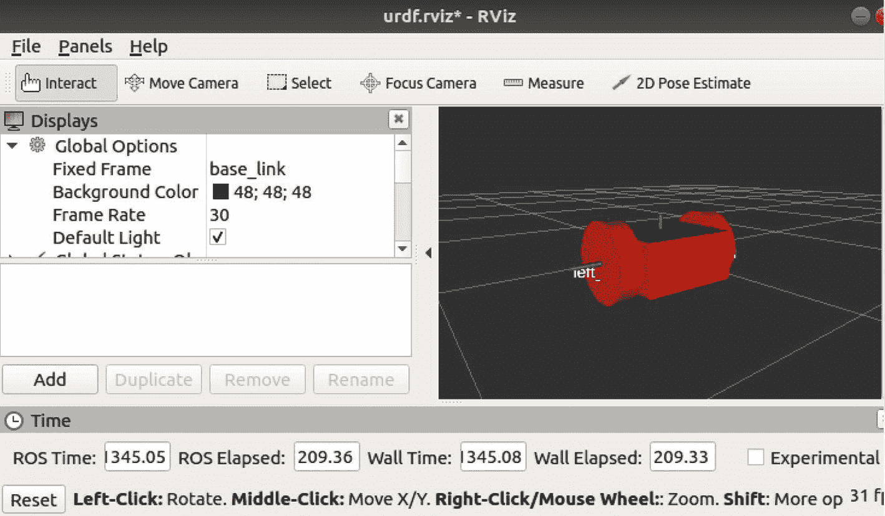

R Viz 窗口的截图。在菜单栏下方，有交互、移动相机等选项。在左侧，在显示下，有全局选项。在右侧，有一个带有网格中突出显示的左侧轮子的探测车底盘。在底部，有 ROS 时间、ROS 已过时间、墙时间、墙已过时间以及重置按钮。

图 4-10

将左右轮子安装到探测车底盘上

### 创建 AI 探测车的万向轮

现在我们已经成功地将两个轮子安装到 AI 探测车的底盘上。为了模仿物理 GoPiGo 探测车，我们将在 AI 探测车底盘的底部后部添加一个万向轮以实现“平衡”。我们可以添加一个带动的万向轮作为关节以增加主动转向，但这仍然过于复杂。相反，我们将万向轮作为一个视觉元素而不是关节添加。万向轮在地面上滑动，而轮子控制方向。

在`ai_rover.urdf`文件中突出显示并添加到 AI 探测车底盘（`base_link`）的万向轮作为视觉元素所做的更改。请注意，左右轮子的代码已折叠，表示为“...”，并且不会改变。

```py

...
...

```

我们将万向轮建模为一个半径为 0.05 米（5 厘米或约 2 英寸）的球体。在将`ai_rover.urdf`文件中的这些更改后，**验证和启动**。您的显示应该类似于图 4-11。您可以看到万向轮球体偏移在位置“0.2, 0, -0.125”。

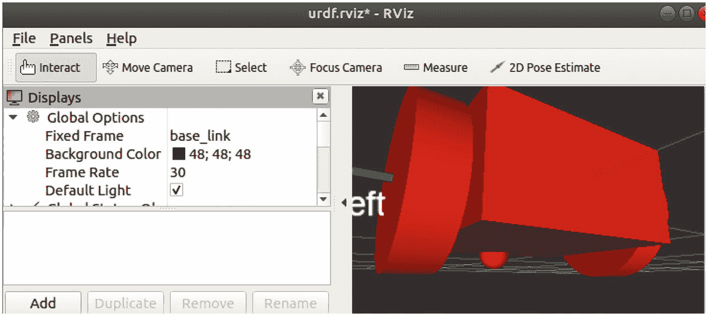

R Viz 窗口的截图。在菜单栏下方，有交互、移动相机等选项。在左侧，在显示下，有全局选项和添加按钮。在右侧，有一个放大后的带有突出显示的左侧轮子的探测车底盘。

图 4-11

带有附加万向轮的探测车底盘

### 为 AI 探测车添加颜色（可选）

在 `ai_rover.urdf` 中建模的简单底盘不断修改以反映新的设计要求。例如，要修改底盘和车轮的颜色，我们设置材质颜色。粗体代码有几个有趣点：1) 如果在父链接中定义一个颜色（蓝色），它会影响子链接（`base_link/castor`）；2) 如果定义一个颜色（黑色），它可以重复使用（左/右轮）；3) 每个组件的 `<material>` 颜色位于 `<visual>` 块中，该块必须位于 `<link>` 块内部；4) 链接的颜色是一个“视觉”组件。最后一点意味着视觉组件不会影响任何动态属性；它仅用于装饰。

在命令窗口中，**验证并启动**。您的 RViz 显示应该类似于图 4-12。

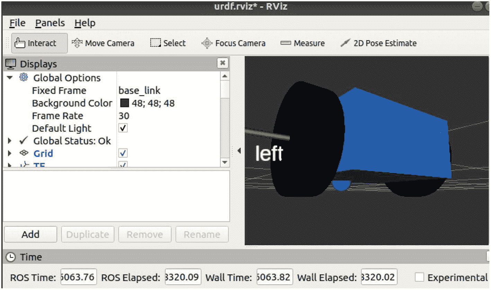

R Viz 窗口的截图。在菜单栏下方，有交互、移动相机、选择等选项。在左侧，在显示下，有全局选项、状态等。在右侧，有一个不同颜色的漫游者底盘，左轮被突出显示。在底部，有 ROS 时间、ROS 已过时间、墙时间以及墙已过时间。

图 4-12

AI 漫游者底盘颜色更改

### 碰撞属性

我们简单的模型已经足够完善，可以定义模型的碰撞属性——将碰撞属性想象成一个“边界框”。边界框是围绕我们模型组件的最小盒子/球体/圆柱体，组件的边界框总和是漫游者的边界框。为此，我们为每个组件添加 `<`collision`>` 属性。碰撞属性是为 Gazebo 的碰撞检测引擎定义的。对于每个模拟时间帧，都会检查组件是否有碰撞。将我们的 AI 漫游者建模为许多简单的组件可以优化碰撞检测。

`<`collision`>` 代码属性与每个组件的 `<origin>` 和 `<geometry>` 属性相同——只需在 `<`collision`>`...`<`/collision`>` 标签之间复制和粘贴。为了节省空间并突出显示新的 `<`collision`>` 块，将 `<`visual`>`...`<`/visual`> 块之间的 XML 源代码折叠：

```py

...

...

...

...

```

**验证并启动**。由于碰撞属性影响动态物理，而不是外观，您不会看到任何视觉差异！这允许它们“碰撞”到其他对象。

### 测试 AI 漫游者的车轮

现在我们将测试车轮，看看它们是否能正确旋转。为了执行这些测试，我们启动一个 GUI 弹出窗口来测试车轮关节。**验证并启动**时进行一个小改动：

```py
$ check_urdf ai_rover.urdf.
$ roslaunch ai_rover ai_rover.urdf gui:=true
```

我们将称之为**验证并启动–GUI**。我们可以可视化运动！

注意

如果您收到“GUI 未安装或不可用”的错误消息，请运行以下命令：

`$ sudo apt-get install ros-noetic-joint-state-publisher-gui`

这迫使 GUI 安装。

记住，每次执行 `RViz.launch` 文件时，都会启动三个特定的 ROS 节点：**joint_state_publisher, robot_state_publisher** 和 **RViz**。joint_state_publisher 节点维护一个非固定关节列表，例如左右车轮。每次左（右）车轮旋转时，joint_state_publisher 都会从左（右）车轮向 RViz 发送 `JointState` 消息，以更新左（右）车轮的绘图。由于每个车轮都会生成其消息，车轮可以独立旋转。在 **verify and launch–GUI** 之后，您的显示应该看起来像图 4-13。由于车轮是纯黑色，您看不到旋转，因此您需要启动 joint_state_publisher 窗口。该窗口将显示在模拟过程中发生的不同车轮的变化；在模拟之前设置初始值，并在模拟期间修改值。这些是非常强大的调试工具，您可能会经常使用。

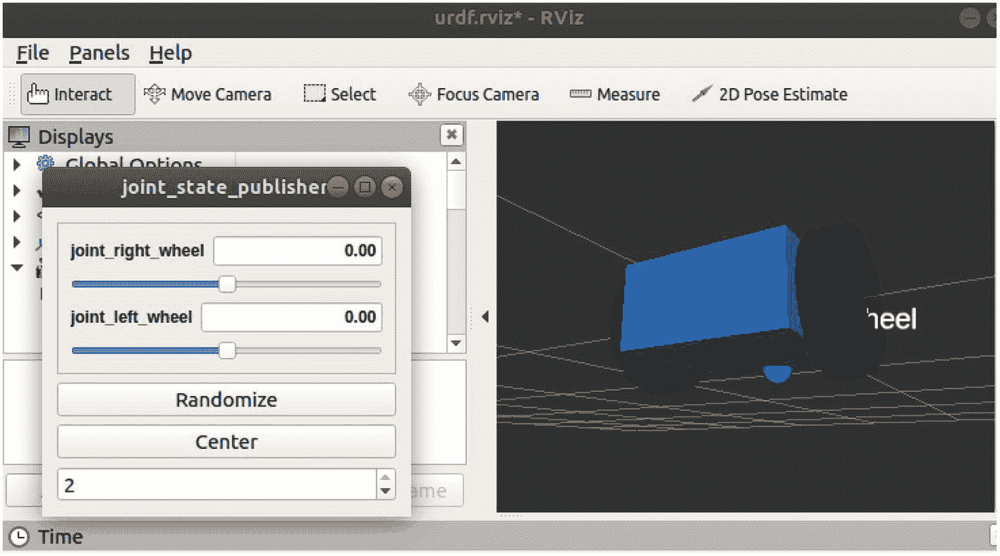

R Viz 窗口的截图。在菜单栏下方，它有交互、移动相机、选择、聚焦相机、测量和 2D 位姿估计的选项。在其下方，左侧有一个关节状态发布者窗口，其中包含关节右车轮、关节左车轮、随机化按钮和中心按钮。右侧有一个在网格中的洞察者底盘。

图 4-13

AI 洞察者车轮关节测试 GUI（joint_state_publisher）

检查 joint_state_publisher GUI，您应该看到四个感兴趣的项目：

+   **joint_right_wheel**: 设置车轮的角度在 ±*π* 之间。

+   **joint_left_wheel**: 设置车轮的角度在 ±*π* 之间。

+   **随机化**: 为每个独立的车轮随机分配 ±*π* 之间的一个值。

+   **中心**: 将两个车轮设置为零弧度。

### 物理特性

注意到我们的车轮正在旋转，但 AI 洞察者底盘没有移动。为了看到运动，我们需要做两件事：添加物理属性并在 Gazebo 中运行 AI 洞察者。RViz 可视化组件，但不显示物理（运动）；我们需要为每个组件添加 `inertial` 属性（`mass` 和 `inertia`）。

一个物体的 **惯性** 是从其重量以及它抵抗加速度或减速度的程度计算出来的。对于具有几何对称性的简单物体，例如立方体、圆柱体或球体，转动惯量很容易计算。因为我们用简单的组件对 AI 洞察者进行了建模，Gazebo 的优化物理引擎可以快速计算转动惯量。

这意味着底盘、车轮和万向节都将具有独特的质量和惯性。每个正在模拟的 `<Link>` 元素也需要一个 `<inertial>` 标签。惯性元素的两个子元素定义如下：

+   `<inertial>`

    +   `<mass>`: 物体的重量，以千克为单位。

    +   `<inertia>`: 3X3 转动惯性矩阵的框架。转动惯量在三维空间中定义。

+   `</inertial>`

由于惯性是反射的（x ➔ z 与 z ➔ x 相同），我们只需要矩阵的六个元素来完全定义惯性矩。每个组件（底盘、车轮和转向轮）都必须定义六个元素的 `<inertia>` 值，如粗体所示。

| **IXX** | **Ixy** | **Ixz** |
| --- | --- | --- |
| Ixy | **IYY** | **Iyz** |
| Ixz | Iyz | **IZZ** |

使用每个组件的 `<inertial>` 属性更新 `ai_rover.urdf` 文件，为 Gazebo 提供足够的信息来计算整个探测器的 `<mass>` 和 `<inertia>`。源代码的修改以粗体突出显示：

```py

    ....

...

...

...

...

```

每个组件都已定义了其独特的质量和惯性矩值。**验证并启动–GUI**！我们应该在 RViz 和 GUI 测试器（图 4-13）中看到相同的显示。

## Gazebo 简介

图 4-14 中的 UML 组件图描述了 RViz 和 Gazebo 程序的静态、动态和环境库的结构。这就是我们以这种方式分解我们非常复杂问题的原因。这些不是“类”，而是一种更高的抽象，帮助我们组织我们解决问题所需的“组件库”。

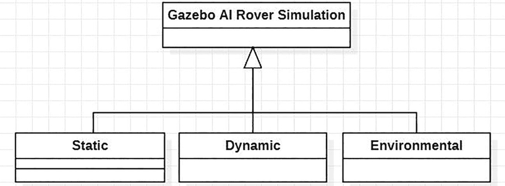

R Viz 和 Gazebo 程序库的示例。从底部向上看，标有静态、动态和环境三个标签的三个矩形指向一个标有 Gazebo A I 探索者刺激的矩形。静态有 3 层；动态、环境和 Gazebo A I 探索者刺激有 2 层。

图 4-14

Gazebo 模拟器中的对象泛化

`URDF` 文件描述了组件的静态（颜色、大小等）和动态（惯性）属性。将 `URDF` 文件转换为 Gazebo 的仿真描述格式（SDF）文件。

现在，我们可以将 AI 探索者模型导入 Gazebo 模拟器。我们在 Gazebo 物理引擎中测试了 AI 探索者，以确保开发的一切都是语法正确的 (`check_urdf`) 和可操作的 (`roslaunch`)。现在，我们集成一个模拟的差速驱动电机和控制器。这些传感器是 AI 探索者自主导航的开始。为了模拟我们的 AI 探索者的内部机制，我们使用 **urdf_to_graphiz** 工具。使用以下命令强制安装 urdf_to_graphiz：

```py
$ sudo apt-get install liburdfdom-tools.
```

urdf_to_graphiz 工具生成一个包含 AI 探索者硬件逻辑模型的 PDF 文件（图 4-15）。工具的图形信息组织了 AI 探索者的硬件设计。该图帮助我们直观地理解探测器组件之间的关系。图 4-15 展示了从我们当前的 `ai_rover.urdf` 模型到组件几何形状的硬件关系。要显示图 4-15 中的视觉模型，执行以下行（evince 是一个 PDF 阅读器）：

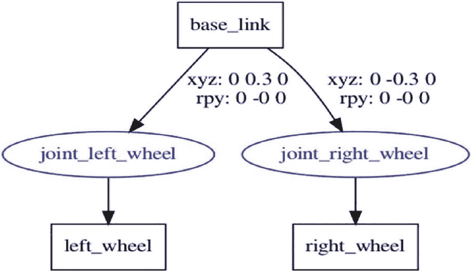

AI 罗盘硬件的示意图。从顶部看，基础链接指向左车轮和右车轮的连接点，分别为 x y z, 0, 0.3, 0；r p y, 0, 负 0, 0 和 x y z, 0, 负 0.3, 0；r p y, 0, 负 0, 0。左车轮连接点指向左轮。右车轮连接点指向右轮。

图 4-15

AI 罗盘联合车轮连接

```py
$ urdf_to_graphiz ai_rover.urdf
$ evince ai_rover.pdf
```

### Gazebo 的背景信息

我们将使用 Gazebo 模拟器进行 AI 罗盘实验。模拟器提供多个开发和部署实用工具。典型的 Gazebo 应用程序如下：

+   深度学习算法的开发

+   控制算法的开发

+   LiDAR 系统、摄像头、接触传感器、接近传感器等传感器数据的模拟

+   通过开放动力学引擎的高级物理引擎

现在我们正在审查将 AI 罗盘的 URDF 描述加载到 Gazebo 中的实际过程。我们将首先通过控制车轮移动，以有限的方式在具有障碍物的模拟世界中移动 AI 罗盘模型，来测试 AI 罗盘模型。这最初将不使用两轮差速控制系统。我们将在本章的高级部分通过扩展我们的 AI 罗盘模型，使其具有独立控制其自身的连续车轮关节、图形传感器数据、验证和验证控制和深度学习算法的能力来开发它。

### 启动 Gazebo

要测试 Gazebo 是否已正确安装，我们可以输入以下 Linux 终端命令：

```py
$ Gazebo.
```

如果 Gazebo 未安装，请参阅第三章。

每次运行 Gazebo 时，都会创建两个不同的进程。第一个是 Gazebo 服务器 (`gzserver`)，它负责整体模拟。第二个进程是 Gazebo 客户端 (`gzclient`)，它启动用于控制 AI 罗盘的用户界面。

注意

如果你执行 `$ Gazebo` Linux 终端命令并得到一系列错误或警告消息，你可能还有先前的 ROS 节点运行。执行 `$ rosnode list` 命令以确定是否有先前运行的节点。如果有任何 ROS 节点仍然活跃，只需执行 `$ rosnode kill -a`。此命令将杀死所有运行的 ROS 节点。然后，只需再次运行 `$ Gazebo` 命令。务必始终检查任何节点警告消息。

成功启动 Gazebo 将创建一个类似于图 4-16 的窗口。

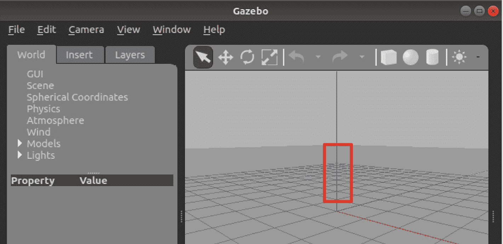

Gazebo 窗口的截图。在菜单栏下方，左侧有世界、插入和图层标签页。世界标签页有 G U I、场景、球坐标、物理、大气、风、模型和灯光。在工具栏下方右侧，有虚拟世界中的 3 个垂直轴。垂直轴用方框突出显示。

图 4-16

Gazebo 屏幕

主要有两个区域：模拟显示窗口和标签面板。模拟显示窗口是我们生成的世界（和漫游车）将被显示的地方。位于模拟显示窗口顶部的工具栏上的符号控制着模拟世界。（注意那个小红框；我们稍后会回到这一点。）标签面板有三个标签：世界、插入和图层。

世界标签页提供了对子元素（如**GUI、场景、球坐标、物理、模型**和**灯光**）的分层访问。虽然所有这些类别都很吸引人，但在此阶段，我们感兴趣的是模型标签页——我们的 AI 漫游车模型就驻留在那里。我们将根据需要介绍其他类别。

插入标签页提供了访问我们（本地）和他人（云，位于[`http://gazebosim.org/models`](http://gazebosim.org/models)）开发的模型。这些模型可以插入到我们的活动世界中。

图层标签页允许在模拟世界的不同视觉部分之间切换。我们使用它来“调试”我们的世界视图；例如，确定是否存在任何意外的碰撞。图层标签页最初不包含任何图层。随着我们进一步开发我们的世界，我们可以添加图层。

### Gazebo 环境工具栏

工具栏位于 Gazebo 环境的最顶部。让我们回顾一下从左到右在 Gazebo 工具栏中可以看到的以下符号。这些符号具有以下功能，也可以在图 4-17 中看到。

从左到右在 Gazebo 工具栏中可以看到以下符号。见图 4-17。

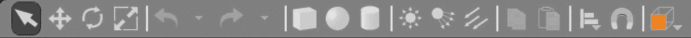

Gazebo 窗口的截图。在菜单栏下方，左侧有世界、插入和图层标签页。世界标签页包含 GUI、场景、球坐标、物理、大气、风、模型和灯光。在中间，有一个在虚拟世界中的拉伸屏幕，带有垂直轴。在右侧，有力量、位置和速度标签页。

图 4-17

Gazebo 环境工具栏

+   **选择模式**：此模式在 Gazebo 环境中选择 3D AI 漫游车或其组件。AI 漫游车或其组件的属性在“世界”面板中列出。

+   **平移模式**：此模式在光标点击 AI 漫游车任何部分时选择 AI 漫游车或其组件。将会有一个 3D 框围绕所选组件或甚至 AI 漫游车本身。然后我们可以将 AI 漫游车的任何部分移动到所需的任何位置。

+   **旋转模式**：此模式负责在光标选择并围绕 AI 漫游车绘制一个框时选择 AI 漫游车模型。然后您可以围绕其翻滚、俯仰或偏航轴旋转 AI 漫游车模型。

+   **缩放模式**：此模式可以选中 AI 漫游车的子组件，如箱体组件。缩放操作仅适用于非常简单的 3D 形状，例如 AI 漫游车底盘中的立方体。

+   **撤销命令:** 这将撤销开发者最近执行的操作。我们可以重复撤销操作以线性格式撤销一系列操作。

+   **重做命令:** 这同样将重做由撤销命令删除的最后一个操作。因此，它将撤销并恢复由撤销命令消除的内容。

+   **盒形、球形和圆柱形模式:** 下面的三个模式通过它们的形状找到，允许用户在 Gazebo 环境中自动创建具有不同尺寸的这些形状。缩放模式可用于修改这些简单形状的尺寸。

+   **照明模式:** 这允许用户在 Gazebo 环境中更改光的角度和强度。

+   **复制模式:** 复制 Gazebo 环境中的选定项目。

+   **粘贴模式:** 此模式将复制的项目粘贴到 Gazebo 环境中。

+   **选择和定位模式:** 此模式将两个物体沿 x、y 或 z 轴对齐。

+   **连接模式:** 此模式允许用户选择两个物体将连接的位置。

+   **改变视角模式:** 此模式允许用户更改用户的视角角度。

+   **截图模式:** 此模式将模拟环境截图用于文档目的。所有文件都保存在`~/gazebo/pictures`目录中。

+   **日志模式:** 此信息将所有生成的数据和模拟值存储在`~/gazebo/log`目录中。这将用于调试 AI 漫游车的深度学习程序。

### 不可见关节面板

我们现在重新审视图 4-16 中的红色框。将虚线控制条向左拖动可访问关节面板——我们测试任何活动模型的界面；例如，我们的漫游车。拖动控制条将创建类似于图 4-18 的显示。

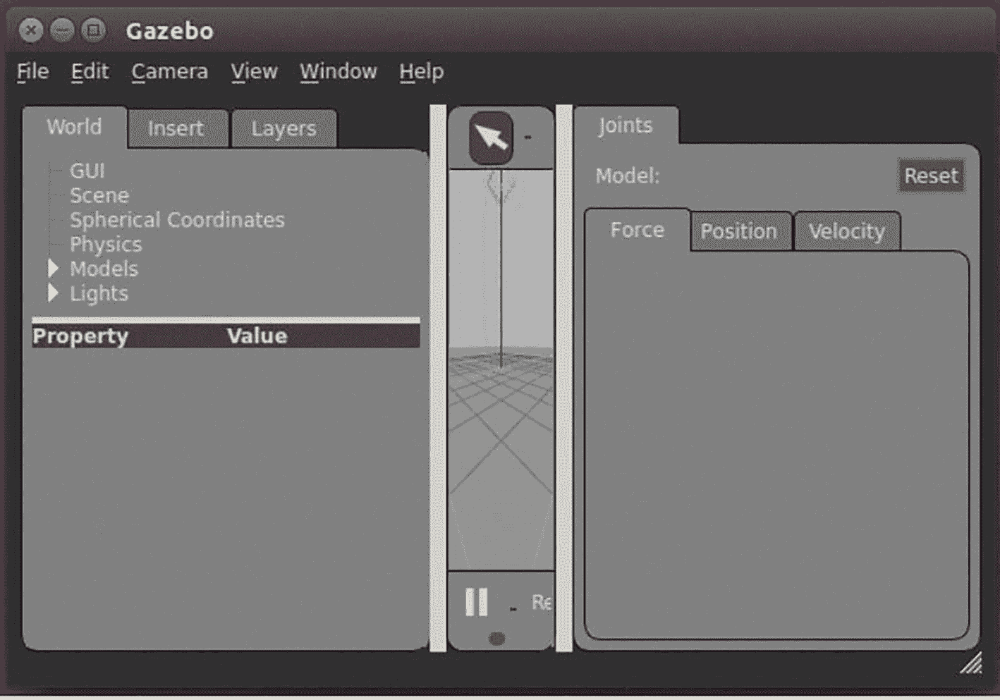

Gazebo 工具栏的截图。从左到右，选项如下。选择模式；平移模式；旋转模式；缩放模式；撤销命令；重做命令；盒形、球形和圆柱形模式；照明模式；复制；粘贴；选择和定位模式；连接；改变视角模式；截图模式；日志模式。

图 4-18

从右向左拉取的 Gazebo 关节面板屏幕

关节面板有一个*重置*按钮和多个标签页。*重置*按钮将我们的活动模型恢复到其初始配置。标签页显示活动模型可用的关节和属性。在我们的 AI 漫游车中，唯一可用的关节将是两个轮子。三个标签页的定义如下：

+   **力:** 定义为施加到每个连续关节的牛顿每米（N/m）的力。

+   **位置:** <x,y,z> 3D 坐标和<翻滚，俯仰，偏航>旋转。

+   **速度:** 关节的每秒米数（m/s）。这些也可以通过 PID 值设置。

### Gazebo 主控制工具栏

既然我们已经回顾了用于控制 Gazebo 模拟中形状、尺寸和操作的工具栏，我们必须回顾位于 Gazebo 环境最顶端的控制工具栏的基本控制功能。这个基本控制工具栏包含**文件、编辑、相机、视图、窗口**和**帮助**选项，这些选项在任何现代 GUI 环境中都应该是可以预期的。我们现在将回顾 Gazebo 环境控制工具栏中以下基本功能：

+   **文件**具有保存世界、保存世界为、保存配置、克隆世界和退出等子功能。

+   **编辑**具有重置模型姿态、重置世界、建筑编辑器和 Gazebo 模型编辑器等子功能。

+   **相机**具有正交、透视、FPS 视图控制、轨道视图控制和重置视图角度等子功能。

+   **视图**具有网格、原点、透明、线框、碰撞、关节、质心、惯性、接触和链接框架等子功能。

+   **窗口**具有主题可视化、Oculus Rift 虚拟现实查看器、显示 GUI 覆盖、显示工具栏和全屏等子功能。

+   **帮助**具有热键图表和 Gazebo 关于等子功能。

既然我们已经回顾了控制工具栏的功能，我们必须过渡到如何运行模拟和回放模拟运行。我们必须能够通过将相同的`URDF`文件转换成`SDF`（模拟定义格式）文件，将 AI 探测车的`URDF`文件修改成与 Gazebo 模拟环境兼容的形式。

### URDF 转换到 SDF Gazebo

现在我们必须转换 AI 探测车的`URDF`文件，使其能够被 Gazebo 环境接受和处理。我们必须将`URDF`转换为`SDF`文件。我们必须向读者声明，`SDF`表达式是对`URDF`的扩展，通过使用相同的 XML 扩展来实现。通过适当修改描述 AI 探测车的`URDF`文件，它将允许 Gazebo 环境将`URDF`转换为 AI 探测车所需的`SDF`机器人表达式。我们现在将描述将`URDF`文件转换为`SDF`文件所需的步骤。

为了允许这种转换完成，我们必须向描述 Gazebo 模拟器中 AI 罗盘底盘、车轮和转向器的 `URDF` 文件添加正确的 `<Gazebo>` 标签。应该指出，AI 罗盘的底盘不仅包括 AI 罗盘的物理盒子，还包括嵌入式电子设备（如 Raspberry Pi）的质量和转动惯量。使用 `<Gazebo>` 标签允许将 `SDF` 中找到但不在描述 AI 罗盘的 `URDF` 文件中找到的元素进行转换。通过在 `SDF` 中找到的这种扩展，我们可以开发出控制 AI 罗盘在 Gazebo 环境中的深度学习控制器的复杂模拟。在本章和下一章中，我们将回顾一些在 [`gazebosim.org/tutorials/?tut=ros_urdf`](http://gazebosim.org/tutorials/%253Ftut%253Dros_urdf) 中找到的教程，列出一些可以进一步增强 AI 罗盘模拟的元素，如链接和关节。链接和关节的例子包括 AI 罗盘的固定传感器和动态执行器。

不仅我们可以在 Gazebo 中定义链接和关节，我们还可以定义并指定 Gazebo 中的颜色。然而，我们必须对 Gazebo 进行修改，这些修改与在 Rviz 中定义的 AI 罗盘模型定义不同。例如，我们不能重复使用为组件颜色定义的引用。因此，我们必须为每个链接添加一个 Gazebo `<material>`。Gazebo 标签可以放在 AI 罗盘模型中的 `</robot>` 结束标签之前，如下所示：

```py
Gazebo/Blue

Gazebo/Black

Gazebo/Black

```

Gazebo 标签必须在 AI 罗盘整个模型的 `</robot>` 结束标签之前定义。因此，所有 Gazebo 标签都应该在文件末尾，在 `</robot>` 结束标签之前定义。然而，Gazebo 中的其他元素有一些注意事项。

如果没有为每个链接（如 AI 罗盘的 3D 底盘盒或转向器）指定 `<visual>` 或 `<collision>` 元素，Gazebo 模拟器将不会使用这些元素。如果这些链接没有指定，那么 Gazebo 将认为它们对激光等传感器和模拟环境碰撞检查是不可见的。

### 检查 URDF 转换到 SDF Gazebo

就像我们在本章早期使用 Noetic ROS 中的 `check_urdf` 工具验证和验证 `URDF` 文件一样，我们还将重新检查带有 `<Gazebo>` 扩展标记的 `URDF` 文件。我们需要这样做，以确定 `URDF` 文件中的任何错误是否确实需要转换为用于将 AI 罗盘模型导出到 Gazebo 模拟环境的 `SDF` 文件。现在我们将使用 `AI_Rover.urdf` 文件扩展名扩展 `AI_Rover.urdf` 文件。文件扩展名是为了指定该文件将用于 AI 罗盘的 Gazebo 模拟。用于验证允许 `URDF` 文件通过 Gazebo 转换为 `SDF` 文件的 `<Gazebo>` 扩展标记的指定工具是 `$ gz sdf` 工具集。需要两个命令：

```py
$ gz sdf -p ai_rover.gazebo
```

或者，对于整个目录，搜索 gazebo 扩展文件：

```py
$ gz sdf -p $(rospack find ai_robotics)/urdf/ai_rover.gazebo
```

我们首先将测试以确定 Gazebo 引用是否适用于底盘和车轮的色彩方案。我们还将使用 Gazebo 引用来在本章结束时开发 AI 罗盘本身的差速驱动控制器。

现在我们已经回顾了利用具有 `<gazebo>` 扩展标记的 `URDF` 文件的验证过程的基本知识，这些相同的扩展标记必须放置在每个组件的 `<link>` 和 `<joint>` 标签之间，例如 AI 罗盘的 `base_link` 和两个车轮。我们必须审查一个带有 `<gazebo>` 扩展标记的 AI 罗盘 `URDF` 文件的示例。示例如下以粗体突出显示：

```py

Gazebo/Blue

Gazebo/Black

Gazebo/Black

```

一旦我们创建了第一个 Gazebo 扩展并拥有了这个 `URDF` 文件，我们必须将其转换为 `SDF` 文件，以确保在 Gazebo 处理过程中没有转换过程的问题。然后我们将执行以下命令：**$ gz sdf -p ai_rover Gazebo.** 一旦我们在正确的目录中执行此命令，我们应该会看到一个终端提示列表，显示正在生成的正确且等效的 `SDF` 文件，且没有打印出错误。一旦我们达到了生成 `SDF` 文件的这个阶段，我们现在必须开发所需的启动和模拟文件，以便在 Gazebo 中启动我们的初始 ROS 模拟。

### Gazebo 中的首次控制 AI 罗盘模拟

在我们开发第一个在 Gazebo 中的受控 AI 漫游车模拟时，我们必须开发两个文件，以分离创建此模拟环境的两个步骤。我们首先需要开发启动文件来启动和查看 AI 漫游车、环境以及模拟环境中呈现的任何障碍物或迷宫。第二个文件将描述 Gazebo 模拟世界将包含的内容，例如迷宫、障碍物和危险。我们应该注意，第二个 Gazebo 模拟文件也将由第一个开发的启动文件启动。我们还应该意识到，启动文件应位于`launch`目录中，而 Gazebo 障碍物模拟文件应位于`worlds`目录中，所有这些都是`ai_robotics`目录的子目录。

因此，此启动文件将按以下方式启动空世界：

我们现在需要为漫游车创建子目录`worlds`。这可以通过以下终端命令完成：

```py
$ cd ~/catkin_ws/src/ai_robotics
$ mkdir worlds
$ cd worlds
```

此启动文件将启动包含在`gazebo_ros`包中的空世界。我们还可以通过替换`ai_rover.world`文件来开发包含埃及地下墓穴布局的世界。具有`<gazebo>`扩展标签的`URDF`模型将通过`gazebo_ros` Noetic ROS 节点中的`spawn_model`服务在空世界中启动。

现在我们已经创建了`worlds`目录，我们可以开始开发将成为与上述启动文件一起启动的`ai_rover.world`文件的`SDF`。它包括额外的项目，如施工锥形障碍物。因此，我们将仔细检查描述地面平面、光源（太阳）和两个分离的施工锥的`ai_rover.world`文件。`ai_rover.world`的源代码如下：

```py

model://ground_plane

model://sun

model://construction_cone
construction_cone
-3.0 0 0 0 0 0

model://construction_cone
construction_cone
-3.0 0 0 0 0 0

```

我们可以通过修改和使用`<include>`、`<uri>`、`<name>`和`<pose>`标签来修改此文件，以包含更多的施工锥和其他障碍物。`<include>`标签允许我们包含额外的模型，例如施工锥。`<uri>`模型标识了模型是什么，例如施工锥。`<name>`标签标识了障碍物的名称。《pose>`标签代表一个帧与其父帧之间的相对坐标变换。链接框架始终相对于模型框架定义，而关节框架相对于其子链接框架定义。现在我们可以通过执行以下命令来执行`ai_rover_gazebo.launch`文件：

```py
$ roslaunch ai_robotics ai_rover_gazebo.launch
```

一旦执行此终端命令，你应该会看到图 4-19 所示的显示。

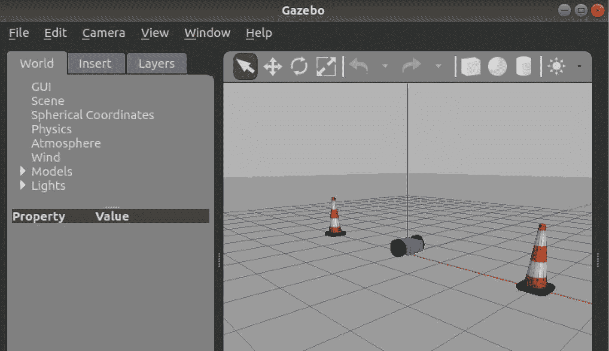

Gazebo 窗口的截图。在菜单栏下方，左侧有世界、插入和图层标签页。世界标签页包含 G U I、场景、球坐标、物理、大气、风、模型和灯光。在右侧，工具栏下方，中心有一个带有 3 个垂直轴的漫游车。左侧和右侧各有 2 个建筑圆锥体。

图 4-19

第一次 AI 漫游车 Gazebo 模拟

### 第一次深度学习可能性

现在我们已经开发出了第一个 AI 漫游车 Gazebo 模拟设置，我们必须进行实验来探索引起运动的方法，然后最终实现智能导航、障碍物避让，以及最终实现感知和避障的认知能力。第一次使用深度学习控制器可能的形式是控制 AI 漫游车在 Gazebo 中的任何意外行为。意外行为包括在导航障碍物时不在直线上行驶。这是因为带有`<Gazebo>`扩展标签的`URDF`文件可能需要进一步调整以表示 Gazebo 中的物理特性。我们可能需要开发一个智能和自适应的深度学习控制器来控制 AI 漫游车。我们可能需要修改 AI 漫游车的质量分布和转动惯量值。如果这些值不断变化，我们就需要一个相应适应的控制器。

### 使用关节面板移动 AI 漫游车

现在我们应该尝试测试 Gazebo 提供的底层物理引擎。实现这一目标的有效方法是通过使 AI 漫游车模型在 Gazebo 中移动。因此，为了测试 AI 漫游车的物理引擎，我们必须使用关节面板进行关节控制。关节面板位于 Gazebo 环境右侧。我们需要处于选择模式，这可以通过点击 AI 漫游车模型来完成，该模型将被白色轮廓框突出显示。一旦白色框被指示，我们可以在关节面板的力标签页中看到`joint_left_wheel`和`joint_right_wheel`的值。我们需要输入非常小的值，例如`joint_left_wheel`为 0.00050 牛顿-米，`joint_right_wheel`为 0.00002 牛顿-米。然后我们应该看到我们的 AI 漫游车原型沿着弧形路径移动。我们应该尝试使 AI 漫游车与其中一个建筑圆锥体相撞。我们这样做是为了测试 AI Rover `URDF`文件中找到的碰撞标签是否工作。我们可以通过检查图 4-20 所示的碰撞显示来看到碰撞标签确实工作。

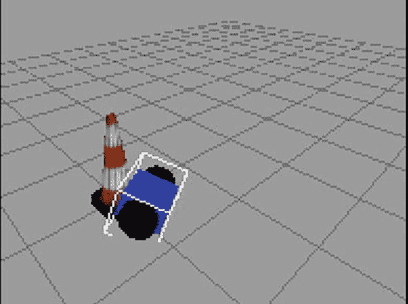

一个 AI 漫游车在网格上与建筑圆锥体碰撞的插图。

图 4-20

第一次 AI 漫游车与建筑圆锥体碰撞

## 摘要

我们在第四章的页面中取得了许多成果。4。我们回顾了如何使用 `URDF` 开发 AI 探索者的模型。我们展示了如何通过 `<Gazebo>` 标签扩展 `URDF` 文件以允许 Gazebo 模拟。我们评估了 3D 环境的功能，用于设计如 Rviz 之类的模型。我们回顾了在 Rviz 中创建和部署模型到 Gazebo 的过程。我们使用多个 ROS 命令来启动这些模拟。我们将在第五章 5 中看到如何使用 XML 宏（Xacro）语言开发更复杂的 AI 探索者模拟，通过允许 AI 探索者、传感器、执行器和模拟环境更有效地开发。我们还将使用更多 UML 建模的例子来处理这些相同的 Xacro 文件。

额外加分

练习 4.1：你会在 `ai_rover.world` 文件中做出哪些额外的修改来包括除了施工锥形物以外的障碍物？

练习 4.2：你会在 `ai_rover.world` 中做出哪些额外的修改来生成更多的施工锥形物？你如何将它们放置得不同或对称等？

练习 4.3：使用关节面板如何突出显示差速轮系统的控制器和驱动程序的需求？为什么我们无法在 Rviz 中开发差速驱动程序？

练习 4.4：为什么我们需要使用 `check_urdf` 等工具验证和验证正在开发的 `URDF` 和 `SDF` 文件？
