# 5. 向我们的仿真添加传感器

在第四章中，我们创建了我们的第一个 Gazebo 漫游车仿真。我们手动驾驶漫游车在空旷的环境中移动。我们使用 URDF 文件来定义我们的漫游车外观，并使用启动文件来定义 Gazebo 环境中的漫游车控制。现在我们想要添加传感器，以便漫游车能够“看到”障碍物。不幸的是，没有一点帮助，URDF 文件会变得非常大且难以维护。这时就出现了 Xacro XML 语言扩展（Xacro 代表 XML 宏）。它通过简单的代码块（称为插件）帮助添加标准传感器。插件支持如激光雷达、雷达、摄像头等传感器。我们的激光雷达传感器为漫游车开发了第一距离测量能力。我们将开发 Python 脚本，通过差速驱动插件直接控制漫游车的轮子。最后，我们将通过 Python 脚本进行键盘控制（遥控）漫游车的实验。

## 目标

以下是为成功完成本章所需达成的目标：

+   学习 XML 宏编程语言（Xacro）

+   使用 Xacro 语言重新制作漫游车模型，以实现简单性和可扩展性

+   为传感器和电机开发 Xacro 编程语言例程

+   在 RViz 和 Gazebo 仿真器中测试漫游车

+   控制漫游车

## XML 宏编程语言

Xacro 编程语言是一种宏语言，用于开发可维护和模块化的 XML 文件。我们将简要概述 Xacro，以优化 URDF 机器人和 Gazebo 仿真文件。

宏是一个简单的将“名称”替换为“值”的过程。最直接的宏是属性替换。属性通常是一个在文件中使用的常量。用“名称”占位符替换常量允许程序员在单个位置定义属性，从而更容易维护。在该单个位置更改值会更改文件中所有位置的命名常量。格式如下：

|                                 **推荐样式**`<xacro:property name="propertyName" value="propertyValue"/>` |
| --- |
|                                 **等效块** |
| `<xacro:property>`      `<name="propertyName">`      `<value="propertyValue" />``</xacro:property>` |

属性名称在 XML 文件中找到，并将属性值替换进去。值可以是简单的数字或字符串。以下示例展示了如何声明和使用属性：

属性通过替换美元花括号（${}）内的名称来替换几何表达式。我们将使用属性块来定义漫游车底盘的尺寸。如果我们想要改变我们漫游车的大小，我们只需更改属性块。

更复杂的替换允许一个属性名称有多个值。以下是一个使用属性块为几何表达式（笛卡尔坐标（x，y，z）和方向（翻滚，俯仰，偏航）值）放置值的示例：

我们在 `front_left_origin` 属性块中定义 `xyz` 值为“0.3 0 0”和 `rpy = "0 0 0"`。如果我们得到一辆带有新底盘的新漫游器，我们可以通过更改 `front_left_origin` 属性块来更新整个系统。我们不需要追踪所有文件中“`front_left_origin`”的每个实例以进行所需更改。

我们可以使用 Xacro 进行简单的数学表达式，用于传感器处理或用于漫游器组件尺寸。仅支持基本的算术和变量替换。例如：

Xacro 的 `${}` 也是一个 Python 算术库的扩展。库中定义的常量（**pi**）和函数（**radians**，度到弧度的转换）都是可访问的。

Xacro 有条件块（if..unless），类似于编程语言（if..else），如 Python。Xacro 条件块的语法格式如下：

```py
">

">

```

条件块必须始终返回一个布尔值；即，`true`（1）或 `false`（0）。任何其他返回值都会抛出异常，无效的返回值。在以下五个语句中，第一行将 `var` 定义为 `useit`。第二行检查 `var` 是否等于 `useit` 并返回 `true`。第三行查看 `var` 的子字符串并返回 `true`。第四行定义了一个名为 `allowed` 的值数组。第五行检查 `"1"` 是否在数组中允许。在确定值时，我们使用了双引号“ ”，而在使用字符串常量时使用了单引号‘ ‘。

## 更多 XML 示例

为了展示 XML 和 Xacro 的强大功能，我们将创建一些示例宏。此 XML 示例声明了一个关节和链接对。动态关节名为 `caster_front_left_joint`，其轴值为 `xyz="0 0 1"`。链接组件 `caster_front_left` 定义了坐标 (`xyz="0 1 0"`)、方向 `{`rpy="0 0 0"`}、颜色（名称="yellow"）和质量常数（0.1）。此外，我们还定义了惯性（转动惯量）值。

```py

0.1

```

为了说明 Xacro 的功能，下一个宏创建了一个接收两个宏作为参数的宏，“first”和“second”！这两个宏在别处定义。这两个参数按顺序插入创建了一个更大的宏“reorder”。这些多个块参数按指定的线性顺序执行。这些执行的参数可能将左/右、前/后轮作为单个控制宏中的宏传递，以生成四个单独的控制宏（左/前，右/前，左/后，右/后）。

宏可以包含其他宏，称为嵌套。外部宏首先展开，然后是内部宏。完整的描述超出了本文的范围。要在主宏中包含嵌套宏，请执行以下操作：

```py
This macro searches the project directories for a filename called `ai_rover_remastered_plugins.xacro` and inserts that file into the current file. The `ai_rover_remastered_plugins.xacro` file stores the filenames of the plug-ins for the rover, such as sensor plugins (LiDAR, radar, etc.) and the two-wheeled differential drive (DDC). Built into the DDC are simple keyboard commands to control a differential drive.The Rover RevisitedWe will review and remaster the design of our two-wheeled differential-drive rover system by transitioning from standard XML to a Xacro URDF description file. The differential-drive system for the rover is the most common type of drive system for a robot and navigates by independently controlling the velocities of each of the wheels. Since the rover only utilizes two wheels and a non-moving static caster, we should consider refactoring in Xacro. The significant advantage of Xacro is that it is easier to maintain, implement, test, and expand Gazebo simulations. Xacro’s modular design and Python scripting mean we can quickly test the virtual rover’s routines. Xacro helps transition our designs from the Gazebo simulations to the physical rover’s existing software and hardware implementation.Recall that a differential-drive system navigates the environment by controlling each wheel’s velocity independently. The left- and right-front wheels control (or actuate) navigation, and their velocities determine the rover’s driving path. For additional information, please refer to [`https://en.wikipedia.org/wiki/Differential_wheeled_robot`](https://en.wikipedia.org/wiki/Differential_wheeled_robot).Modular Designed RoverIf we are going to maintain this increasingly complex software project, we should simplify its structure. At this moment, putting all the source code in one file seems to make life simple. But soon, we will be adding additional hardware and software that will make modifying the underlying changes challenging to track. So, while we are at the beginning of our design, let us simplify the packaging of our code for later. We will divide our original code into modules that have one (and exactly one) responsibility. Our original URDF code divides into the following Xacro modules:*   Dimensions `(dimensions.xacro`), which tracks the constants for the physical components of our rover

    *   Chassis (`chassisInertia.xacro`), which tracks the physics related to the body of our rover

    *   Wheels (`wheelsInertia.xacro`), which tracks the physics related to each wheel of our rover

    *   Caster (`casterInertia.xacro`), which tracks the physics related to the caster of our rover

    *   Laser (`laserDimensions`.`xacro`), which tracks the physics and geometry layout of the LiDAR’s housing box

    *   Camera (`cameraDimensions`.`xacro`), which tracks the physics and geometry layout of the camera’s housing box

    *   IMU (`IMUDimensions`.`xacro`), which tracks the physics and geometry layout of the inertial measurement unit’s (IMU) housing box

    After adding new sensors, we will need to modify the dimensions file and add our `<sensor>Inertia.xacro` file. Logically, our software project now looks like Figure 5-1.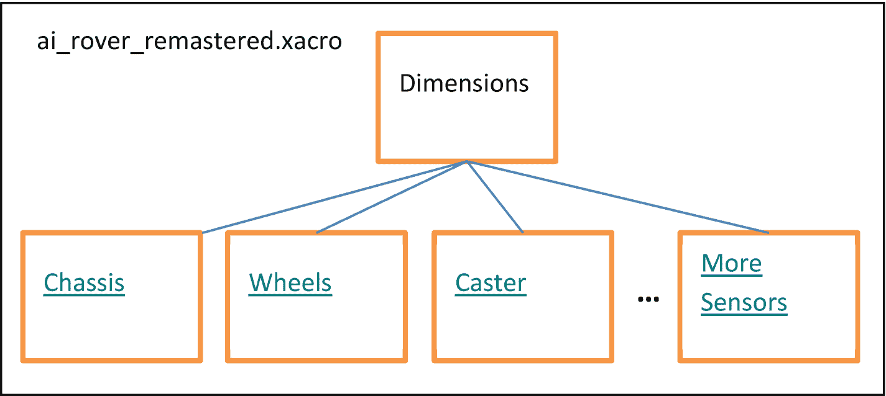A block diagram of the Rover. At the top left a i underscore rover underscore remastered dot xacro is written. Dimensions are divided into chassis, wheels, caster, and more sensors. There are three horizontal dots between the block of the caster and more sensors.Figure 5-1Modular design of our roverTo begin our code refactoring, we need to create the rover sub-directory `ai_rover_remastered`. The terminal commands are as follows:

```

$ mkdir -p catkin_ws/src/ai_rover_remastered

$ cd catkin_ws/src/ai_rover_remastered

$ mkdir launch urdf config

```py

Now we should have three sub-directories, `launch`, `urdf`, and `config`, in the `ai_rover_remastered` directory. Recall that having the `launch`, `urdf,` and `config` sub-directories prepare the `ai_rover_remastered` directory as an ROS package. **Note that URDF supports XML and Xacro.**dimensions.xacroNext, create the `dimensions.xacro` file in the `catkin_ws/src/ai_rover_remastered/urdf` directory:We have created our first Xacro URDF file for the rover. It defines the rover’s dimensions and serves as a framework for different rover models. The property block tags define numeric and string constants, such as the rover’s base length, “`base_length`,” which is statically defined as 0.16\. Any Xacro files that include this file will have access to this global constant. Changing the value to 0.20 in `dimensions.xacro` will have a ripple effect across all files. Without Xacro, we would have to search ALL the files for “0.16,” decide whether it referred to `base_length` or `base_width,` and manually change it—a very error-prone procedure. (Compare to Chapter 4’s URDF.)chassisInertia.xacroNext, we create `chassisInertia.xacro` to define the movement of our rover. Notice that it “includes” the `dimensions.xacro` file. This `chassisInertia.xacro` file also includes our final `ai_rover_remastered.xacro` file. While this nesting of files seems complicated at first, separating the structure from the functionality allows us to change one without modifying the other.wheels.xacroThe following components are the two identical wheels. Because they are similar, we need to define the concept (class) once and instantiate (object) it twice by offsetting them by the appropriate amount specified in the generated `ai_rover_remastered.urdf` file.There are many examples of the object-oriented programming (OOP) paradigm in this short script. The `${prefix}` macro creates separate left and right wheel links and joints connected to the base link. You should note the OOP instantiation (left and right wheel joints and links using the `${prefix}` macro) and aggregation (connecting the left and right wheels on either side of the `base`_`link`). The `wheel_joint_offset` determines how far horizontally from the base center is the wheel offset.casterInertia.xacroUsing macros, we can model the mass and moment of inertia for other components on the rover. For instance, we model the caster (`casterInertia.xacro`) as a “spherical” wheel that rotates in any direction, similar to the physical rover.We can now create a caster wheel with any geometry required to model the physical caster wheel accurately. This source code creates a caster wheel link `(caster_wheel)` and a joint (`caster_wheel_joint)` connected to the base link.laserDimensions.xacroThe Gazebo Laser Range Finding Scanner Plug-in (LRFP) determines the shape and geometry of previously unexplored areas. The LRFP simulates a LiDAR sensor; in our case, the Hokuyo LiDAR system. A LiDAR sensor uses laser pulses to measure distances to objects within the environment, helping to determine their geometry. We can then generate a map, helping the rover to navigate and avoid obstacles. LiDAR systems are one of the primary sources of odometry in modern robotics. The following code (`laserDimensions`.`xacro`) places the `sensor_laser` with its correct geometric dimensions on top of the rover chassis to receive messages from the Xacro sensor file:cameraDimensions.xacroThe integrated rover camera captures and processes image data to sense and avoid obstacles. For simplicity, we make the camera dimensions the same as the LiDAR sensor and place it in front of and below the LiDAR sensor. The `cameraDimensions.xacro` defines a simple camera housing with a fixed `camera_link` in front of the chassis (`base`_`link`):IMUDimensions.xacroIn this section, we define the inertial measurement unit (IMU) plug-in. The IMU data captures the rover’s speed (straight and turning) and orientation (attitude) relative to the environment. The IMU heading and attitude data is processed so the rover can maneuver in an environment. The SLAM process needs the IMU and wheel encoder data to help accurately and precisely outline boundaries, walls, and obstacles (Chapter 7). The IMU housing dimensions will be small compared to those of the camera and LiDAR. To simplify the physics, the IMU location will be in the origin (xyz=0,0,0) of the rover. To avoid the LiDAR sweep, we reduce the IMU’s size. The `IMUDimensions.xacro` defines a simple IMU housing with a fixed `IMU_link` relative to the chassis (`base`_`link`):Gazebo Plug-insA plug-in is a section of source code compiled as a C++ library and inserted into any Gazebo simulation. Python is an “interpreted” language (slow), while C++ is compiled (fast). All plug-ins have direct access to all the functions of the physics engine of Gazebo.Plug-ins are helpful because they*   let developers control and enhance Gazebo features;

    *   are self-contained software routines for simulations; and

    *   can be inserted and removed from a running system.

    Previous versions of Gazebo utilized integrated controllers, which behaved in much the same way as modern Gazebo plug-ins. Consequently, no enhancements were possible with these controllers. Current Gazebo plug-ins are now far more flexible and allow users to program what functionality to include in their simulations.You should only use a plugin when*   you want to alter a simulation programmatically, such as responding to simulation events; and

    *   you want a fast interface to Gazebo without the overhead of the transport layer, such as an interface. An example of an interface would be to control the speed and direction of our rover.

    Plug-in TypesThere are currently six types of Gazebo plug-ins, as follows:1.  World (catacombs, etc.)

     2.  Robot Model (rover)

     3.  Sensor (LiDAR, IMU, camera, etc.)

     4.  System (differential-drive controller, etc.)

     5.  Visual (laser view blue field in Figure [5-8], etc.)

     6.  GUI (rover controls)

     Each plug-in is attached to a specific “object” in the Gazebo environment. For example, the robot model plug-in is attached to and controls the rover in Gazebo. Similarly, the world plug-in is attached to a catacombs environment, and each sensor has a sensor plug-in. The system plug-in is specified in the command line and loads the wheels and caster physics configuration in the differential-drive controller. The visual plug-in is automatically loaded and shows colors as defined in the different Xacro files; e.g., the “blue” wheels, “red” LiDAR box, etc. The GUI plug-in is also automatically loaded and connects the Gazebo controls to control objects (and sub-objects such as joints) in the environment (move, turn, rotate, etc.). These controls ARE NOT the same as simulation controls using Teleops.Differential-Drive Controller (DDC) Plug-inThe differential-drive controller (DDC) plug-in is a system plug-in that ties the physics engine to the rover. The DDC uses the `wheels.xacro` definitions to attach the individually defined parts of the DDC to the physics engine. This connection will be used by the Teleops keystrokes to realistically control the movement of the rover.

```

false

false

20

left_wheel_joint

right_wheel_joint

${wheel_separation}

${wheel_radius * 2}

20

/ai_rover_remastered/base_controller/cmd_vel

/ai_rover_remastered/base_controller/odom

odom

base_footprint

```py

In this section, we integrate the DDC plug-in into the remastered rover model. We do this to design, develop, and test the manual controls of the rover. The simple manual controls move the rover forward or backward and turn it left or right. Because the wheels turn independently, their relative velocities can be different, too. These manual controls test the differential drive so that when the autonomous navigation control is added, the control logic is correct. Furthermore, this initial testing of the differential drive reinforces the basic ROS control concepts.We do this by integrating the built-in DDC plug-in into the Xacro rover model. Create a script file called `ai_rover_remastered_plugins.xacro` in the current directory with the following content:

```

<!--

```py

Now we are ready to add control to our robot. We will add a new plug-in to our Xacro file, and we will add a differential-drive plug-in to our robot. The new tag looks as follows:

```

-->

false

false

20

left_wheel_joint

right_wheel_joint

${wheel_separation}

${wheel_radius * 2}

20

/ai_rover_remastered/base_controller/cmd_vel

/ai_rover_remastered/base_controller/odom

odom

base_footprint

```py

Let us briefly review this file. The first line we will examine is the `filename` line. The filename is the `gazebo_ros` library name containing the plug-in implementation for the differential-drive controller. We will quickly review the following defined tags for this plug-in:*   The plug-in name is `differential_drive_controller` and is located in the library `libgazebo_ros_diff_drive.so`.

    *   The `<alwaysOn>` tag allows the robot to receive velocity commands; default is set to `false`.

    *   The `<legacyMode>` tag is `false`, not allowing us to swap the left and right wheels.

    *   The `<updateRate>` tag is 20 Hz, the frequency of information sent to the controller.

    *   The `<leftJoint>` tag is the name of the left joint.

    *   The `<rightJoint>` tag is the name of the right joint.

    *   The `<wheelSeparation>` tag is the distance from the center of one wheel to the center of the other in meters. Usually this defaults to 0.34 meters.

    *   The `<wheelDiameter>` tag is the diameter of each wheel. Usually, the diameter of each wheel is the same and is set as a default to 0.15 meters.

    *   The `<commandTopic>` tag is to receive `geometry_msgs` or `Twist` message commands from the user or deep learning or cognitive AI control architectures.

    *   The `<odometryTopic>` tag is to publish nav_msgs or odometry messages.

    *   The `<odometryFrame>` tag defaults to the odometry frame.

    *   The `<robotBaseFrame>` tag is the rover frame to calculate odometry from and will default to `base_footprint`.

    The `<plugin>` block and definitions must be in a `<gazebo>` block when creating a plug-in script.Finally, the plug-in publishes the odometry, <`odom>`, of the rover. Odometry uses sensor data (wheel encoders) to estimate the rover’s change in position over time and calculates the current position of the rover relative to its starting location. Each movement of the rover triggers a sensor reading that is used to update the internal map location. This calculation can be extremely sensitive to errors and sources of uncertainties caused by the integration of velocity measurements over time.Laser Plug-inThe laser plug-in is a sensor plug-in. It is a generic laser modified to the specifications of our actual laser defined in `laserDimensions.xacro`.Now that we have added the DDC plug-in and the geometry of the simulated LiDAR sensor component to the chassis, we have to connect it to the LRFP. The LFRP provides the internal logic, behavior, and characteristics of the Hokuyo LiDAR system. The following code accesses the Gazebo plug-in library for the LRFP and sets the LiDAR sensor to Hokuyo characteristics:

```

0 0 0 0 0 0

true

20

1440

1

-3.14159

3.14159

0.10

30.0

0.01

gaussian

0.0

0.01

/ai_rover_remastered/laser_scan/scan

sensor_laser

```py

The LiDAR sensor system publishes the laser scan data to the `/ai_rover_remastered/sensor_laser/scan` topic. The TF frame subscribes to the `sensor_laser` link, which integrates the LiDAR sensor model with the rest of the rover model. (If we also change our LiDAR sensor system from Hokuyo, we must alter the `range, sample_rate, min_angle, max_angle, resolution,` and `signal_noise` parameters to match the new LiDAR system.) After integrating the link-and-joint Xacro URDF and the LiDAR plug-in code, run the updated rover model with the following terminal shell command:

```

$ roslaunch ai_rover_remastered ai_rover_remastered_gazebo.launch

```py

After running, you should have a display similar to Figure 5-2. Notice that the sensor has an infinite range and can see 360° in a horizontal circle of one pixel thick, but it has a blind spot close to the sensor. The LiDAR cannot detect any objects in this blind spot.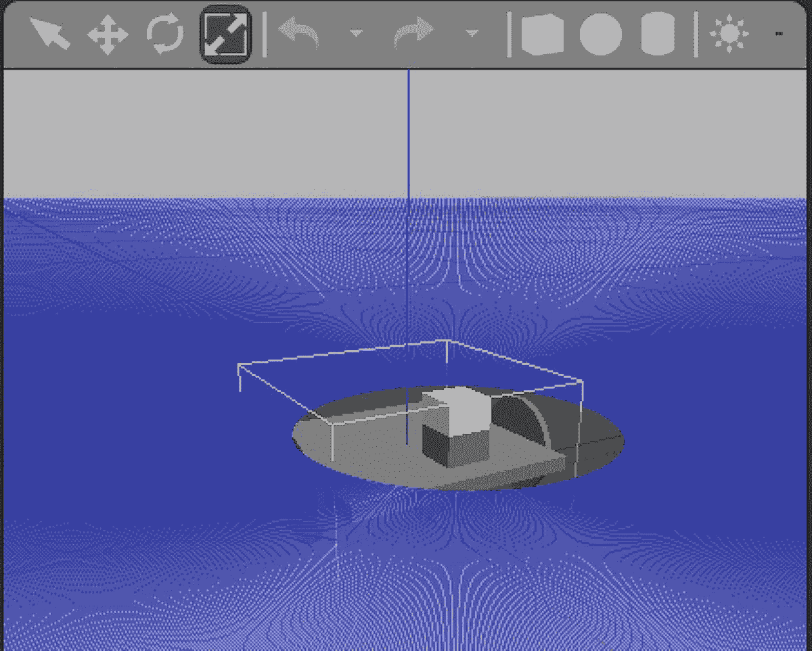A schematic of the Rover and LiDAR sensor. It has a cube object placed on the horizontal circle at the center. The dimension vector icon is selected at the top.Figure 5-2Rover and LiDAR sensor: Blue area is the sensor coverage. Gray circle is the LiDAR blind spotPlacing a cube object in the environment shows a gray area behind the cube (Figure 5-3). This gray area is another blind spot. The blue areas are the LiDAR sensor sweep showing no object encountered. Again, the sensor has an infinite range.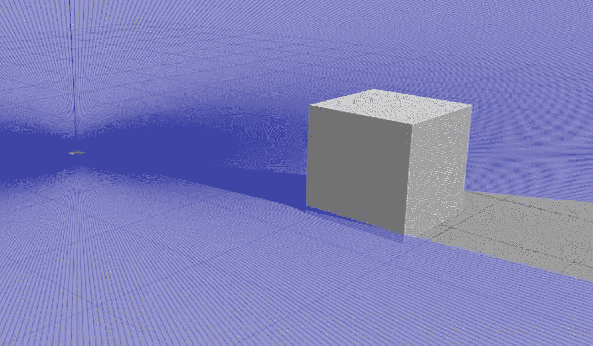A schematic of the Rover and LiDAR sensor. A cube object is placed in the environment behind which is the blind spot.Figure 5-3Rover and LiDAR sensor operating (Gazebo)The LiDAR sensor publishes the data in the RViz environment under the `sensor_laser/scan` topic (Figure 5-4).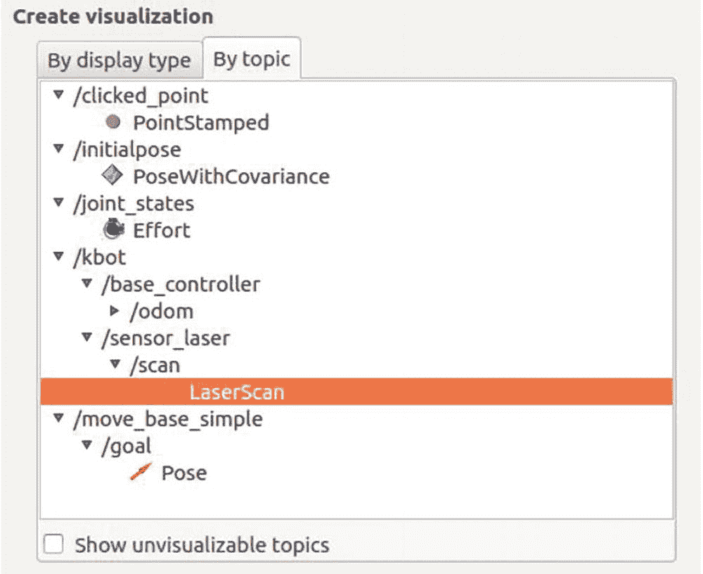A screenshot of the drop down menu under the by topic tab with the heading create visualization. The drop down menu highlights the laserscan.Figure 5-4LiDAR senor scan topicFrom the rover’s point of view, the LiDAR sensor “sees” the boundary of the cube shape as a thick red line (Figure 5-5). The LiDAR sensor publishes that the laser has intersected an object.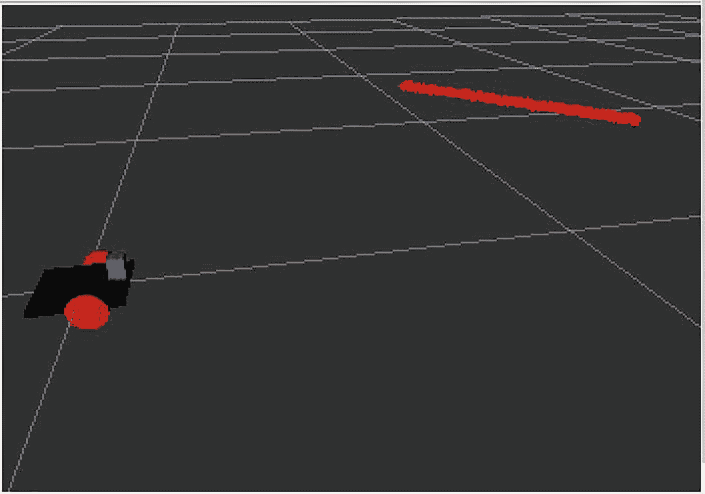A schematic of the Rover and LiDAR sensor. At the top right, there is a thick red line. At the bottom left is a horizontal square on which a cube is placed.Figure 5-5Rover “seeing” the cube as a boundary line (RViz)Now we will integrate the Gazebo camera plug-in for the rover. This plug-in will allow us to view what the rover “sees” as it explores the environment. Our simulated camera in ROS provides image data to the rover for object identification, tracking, and manipulation tasks. Noetic ROS currently supports both monocular and stereo cameras. To simplify this book, we will only use a simulated monocular camera for our ROS/Gazebo/RViz setup and only a physical monocular camera for the GoPiGo3 rover. We could use stereo cameras to create SLAM (Simultaneous Localization and Mapping) of our environment, but this would only add complexity to this book. We only need the monocular camera to locate and identify objects that the front of the rover is facing in an environment. We will only be using the LiDAR/SLAM configurations to sense and avoid obstacles and locate anomalies in an environment for the rover to explore further and examine.Camera Plug-inThe camera plug-in is a sensor plug-in that connects the simulated camera images from Gazebo, then displays them in RViz. The RViz GUI can now “display” what the rover now “sees” in the Gazebo environment.

```

30.0

1.3962634 -->

1.57

800

800

R8G8B8

0.02

300

gaussian

0.0

0.007

true

0.0

ai_rover_remastered/camera1

image_raw

camera_info

camera_link

0.07

0.0

0.0

0.0

0.0

0.0

```py

Once we have inserted the Gazebo camera plug-in in the `ai_rover_remastered_plugins.xacro`, we should make certain that the camera plugin is indeed operational. This requires that we set the correct parameters in RViz to accept the incoming `image_raw` from the Gazebo simulation, which requires that we first start the Gazebo simulation launch file, followed by the RViz launch file. Please look to the Gazebo and RViz launch file sections of this chapter. To accept the `image_raw` from the Gazebo simulation, we must first go to the display options and select Add, and then select the camera option. Next, add `/ai_rover_remastered/camera1/image_raw` to the image topic menu for the camera under the Displays menu. The rover now “sees” a spherical object in Gazebo by “seeing” that same spherical object from the perspective of the rover in the RViz Camera window (Figure 5-6).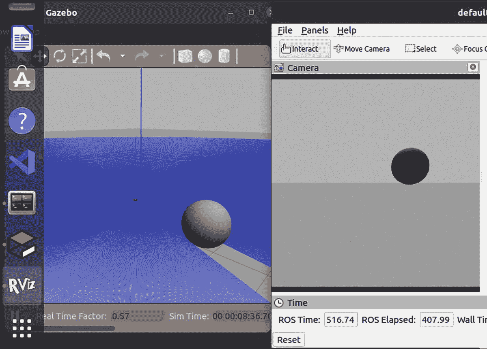Two screenshots of Gazebo and Rviz window. The left window has a spherical object at the bottom right and the same spherical object is at the center right in the right window.Figure 5-6Rover’s camera “seeing” the sphere in Gazebo (left) and Rviz (right)IMU Plug-inThe IMU plug-in is a sensor plug-in. It connects the rover location to the global environment. Think of the rover as having a local coordinate system, while the environment has a global coordinate system. When the rover moves “1 space forward” in its local system, it moves from <x,y> to <x+1, y> in the global environment. The plug-in also maps the internal acceleration to the global environment to see it in Gazebo (purple arrow).An IMU must aide the robot’s navigation tasks to allow genuine autonomy for the rover. The IMU (inertial measurement unit) sensor must measure and report the rover’s speed (accelerometer), direction, acceleration, specific force, angular rotation rate (gyroscope), and the magnetic field (magnetometer) surrounding the rover in all three directions (x, y, and z). We will need both the IMU and wheel encoder values to estimate the robot’s 6D pose and position in maps generated with Simultaneous Localization and Mapping (SLAM). The IMU can also combine input from several different sensor types to estimate output movement accurately.We do this by integrating the IMU plug-in into the Xacro rover model. Create a script file called `ai_rover_remastered_plugins.xacro` in the current directory with the following content:

```

true

IMU_link

imu

imu_service

0.0

20.0

```py

Let us briefly review this file. The first line we will examine is the `filename` line. The filename is the `libgazebo_ros_imu.so` library and contains the plug-in implementation for the IMU sensor plug-in. We will quickly review the following defined tags for this plug-in:*   The plug-in name is `imu`_`plugin` and is located in the library `libgazebo_ros_diff_drive.so`.

    *   The `<alwaysOn>` tag allows the IMU to send data.

    *   The `<bodyName>` tag is set to `IMU`_`link`, the IMU object link, a child link to `base`_`link`, which is the rover chassis.

    *   The `<topicName>` tag is the message tag from IMU.

    *   The `<serviceName>` tag is the message from the `IMU_service`

    *   The `<gaussianNoise>` tag is set to the value of zero, which means there is no gaussian noise to the LIDAR sensor simulations. This might need to be changed to closely reflect the explored environment.

    *   The `<updateRate>` tag is the frequency of sensor updates for the LIDAR, which in the case of the source code is set to 20 hertz.

    The `<plugin>` block and definitions must be in a `<gazebo>` block when creating a plug-in script.Visuals Plug-inThe visuals plug-in is (obviously) a visual plug-in. The material colors defined in the Xacro files are only used in RViz. The colors have to be redefined in our `visuals.xacro` plug-in to be displayed Gazebo.

```

Gazebo/Orange

Gazebo/Blue

Gazebo/Blue

```py

Putting It All TogetherWe have now defined the individual components of the physical rover and their associated plug-ins for Gazebo. To complete the construction of our rover, we need to “glue” them together. First, we create the plug-in file (`ai_rover_remastered_plugins.xacro`) and then the rover model (`ai_rover_remastered.xacro`), which includes the plug-ins.ai_rover_remastered_plugins.xacroNow that we have created our plug-ins for each rover component, we have to combine them in a single module and load them into Gazebo and RViz. To do this, we “include” the individual plug-in files into an `ai_rover_remastered_plugins.xacro` file.ai_rover_remastered.xacroFinally, we bring all of these separate components together in the `ai_rover_remastered.xacro` file. This file “glues” or constructs the individual parts (chassis, wheels, caster, etc.) into a cohesive whole and complete rover.Now that we have remastered the rover into modules using Xacro, we need to convert it to an URDF file and then verify the converted file has no errors. To do this, we run the following two terminal commands in the URDF directory:

```

$ rosrun xacro xacro ai_rover_remastered.xacro > rover.urdf

$ check_urdf  rover.urdf

```py

Assuming everything is correct, we should have the following `check_urdf` output:

```

Robot name is: ai_rover_remastered

-----------Successfully Parsed XML ------------------

Root Link: base_footprint has 1 child(ren)

child(1): base_link

child(1): caster_wheel

child(2): left_wheel

child(3): right_wheel

```py

If there are any errors, go back and review the scripts for typos.RViz Launch FileRecall that RViz is used to simulate the rover in isolation; i.e., we see the world “through the eyes” of the rover. To prepare the project for RViz, we convert the `ai_rover_remastered` directory into an ROS package just like we did in Chapter 4.

```

$ cd ~/catkin_ws/src/

$ catkin_create_pkg ai_rover_remastered

```py

The `catkin_create_pkg` command creates two files in the `ai_rover_remastered` directory: `CMake_lists.txt` and `package.xml`. Finally, create the `ai_rover_remastered_rviz.launch` file in the launch directory:This launch file is nearly identical to the RViz launch file in Chapter 4, the only difference being the script files with the Xacro extension. Similar to Chapter 4, Noetic ROS launches three nodes: `robot_state_publisher`, `joint_state_publisher,` and `rviz.` The first two guarantee the correct transformation between the link and joint frames published by ROS. The final ROS node launches the RViz program. Just as we did in Chapter 4, compile the code using the following:

```

$ cd catkin_ws/

$ catkin_make

$ source devel/setup.sh

$ roslaunch ai_rover_remastered ai_rover_remastered_RViz.launch

```py

The `roslaunch` command launches the RViz environment and GUI. To eliminate the errors found within RViz, we will need to alter the *Global Options* ➤ fixed_frame ➤ *map* to *Global Options* ➤ fixed_frame ➤ *base_link*. Therefore, just like in Chapter 4, we will have to add the RobotModel within the Displays tab (Figure 5-7).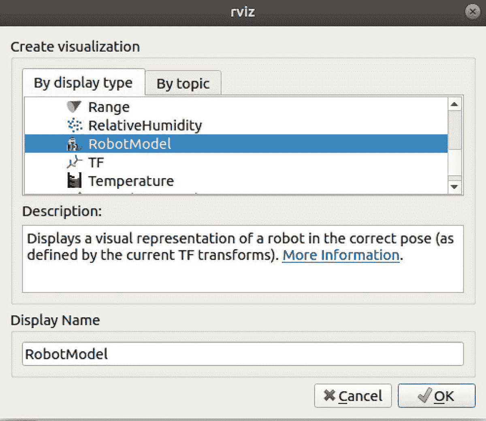A screenshot of the dialogue box in the Rviz window with the heading create visualization. Below the heading, under the by display type tab, RobotModel is selected. Below it, there are boxes to write description and display name. Ok button is selected below the display name box.Figure 5-7Adding the Xacro RobotModel within RvizGazebo Launch FileRecall that Gazebo is used to test the rover in a robust environment. That means we see the rover and background from a third-person perspective. The rover, once verified to be correct in RViz, needs to be imported to Gazebo, and Gazebo needs two changes:1.  Convert the Xacro files to URDF files. Gazebo “gets confused” reading valid Xacro files, but converting them to a single URDF removes the most warnings.

     1.  Copy the `ai_rover_gazebo.launch` file from Chapter 4 and call it `ai_rover_remastered_gazebo.launch`. Change any occurrence of `<ai_rover>` to `<ai_rover_remastered>`.

```

$ rosrun xacro xacro ai_rover_remastered.xacro > ai_rover_remastered.urdf

```py

The `MYROBOT.world` file is the same one we used in Chapter 4.The rover model spawned in Gazebo uses the `spawn_model` node of the `gazebo_ros` package. The rover model passes as an argument to the Gazebo instance. The following is the `roslaunch` terminal command that launches the rover model in Gazebo:

```

$ roslaunch ai_rover_remastered ai_rover_remastered_gazebo.launch

```py

NoteBefore launching a Gazebo simulation, go to the home directory and kill all Gazebo and Gzserver processes:`$ killall gazebo``$ killall gzserver`These commands guarantee a clean slate for Gazebo simulations. If you get the error `[Err] [REST.cc:205] Error in REST request`*,* refer to [`https://automaticaddison.com/how-to-launch-gazebo-in-ubuntu/`](https://automaticaddison.com/how-to-launch-gazebo-in-ubuntu/).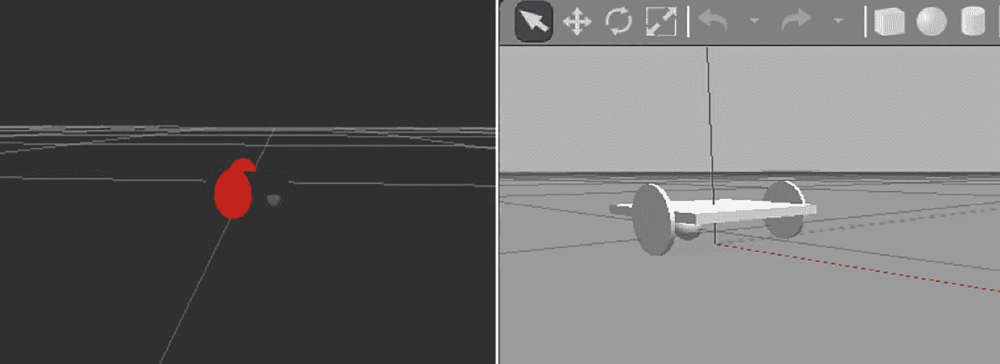Two screenshots of the Rviz and Gazebo window. The left window has a horizontal square along with two circular wheels placed at the center. The right window has a 3 D image of the same object as in the left window.Figure 5-8Remastered rover displayed in Rviz and GazeboOnce we execute the RViz and Gazebo launch commands, we will have the following RViz and Gazebo displays (Figure 5-8).Troubleshooting Xacro and GazeboThis section reviews issues you might encounter while developing the Xacro model and converting it to URDF for Gazebo.*   Gazebo has two visual components: the environment and the rover. The potential “physical” interaction of the rover and the environment could cause your program (or operating system) to crash. Verify that the spawning of the rover does not overlap any objects in the environment.

    *   Run the simulation once, save the configuration using the *Global* ➤ *Options* menu, and then exit. Now the saved configuration will automatically be loaded every time you run Gazebo.

    *   Make sure to terminate ALL Gazebo and Gzserver processes. A fresh start of these processes will ensure fewer problems.

    Teleop Node for Rover Control*Teleop* means to control (**op**erate) from a distance (tele-). One of the ROS packages that functions to remotely control the rover is `teleop_twist_keyboard`. This function uses the keys `i/j/l/` to move the rover `up/left/right/down,` respectively. The `teleop_twist_keyboard` intercepts the keyboard commands and passes (publishes) the information via the `cmd_vel` topic to all subscribers. We bind the DDC plug-in to the `cmd_vel` topic by subscribing.We will use two terminals to install the Teleops package. In the first terminal:

```

$ sudo apt-get install ros-noetic-teleop-twist-keyboard

$ roscore

```py

In the second terminal:

```

$rosrun teleop_twist_keyboard teleop_twist_keyboard.py

```py

Optionally, in a third terminal, you can view the published messages for all subscribers:

```

rostopic echo /cmd_vel

```py

As usual, we prepare the groundwork for our Teleops control package by creating the Ubuntu directory structure and placing ourselves in the correct directory:

```

$ cd catkin_ws/src

$ catkin_create_pkg ai_rover_simple_control

$ cd ai_rover_simple_control

$ mkdir -p launch src

$ cd ~/catkin_ws

$ catkin_make

$ source devel/setup.sh

$ cd catkin_ws/src/ai_rover_simple_control/launch

```py

Next, create the `ai_rover_teleops.launch` file that publishes the `cmd_vel` topic:Now, make this launch file executable:

```

$ chmod +rwx ai_rover_teleops.launch

```py

Transform (TF) Graph VisualizationIn the context of this project, a transform is a single-movement step in time. Each movement generates messages to each component to reflect the location change. Messages passed between nodes are difficult to visualize without a tool. We use the TF Graph tool to visualize (and test) the connections between the `teleops_twist_keyboard` package and the DDC plug-in. Using TF Graph, we see the real-time published messages, and we can use this information to guide our debugging.First, we must get our rover running in Gazebo (Figure 5-9). Create three side-by-side terminals in the Terminator program. Launch the Gazebo program (not shown) in the left terminal (orange box):

```

$ roslaunch ai_rover_remastered ai_rover_remastered_gazebo.launch

```py

In the middle terminal, launch the `teleops` launch file (blue box):

```

$ roslaunch ai_rover_remastered_simple_control ai_rover_remastered_teleops.launch

```py

Be careful using the keyboard; any key press could now accidentally be interpreted as a `teleop` command! Click your mouse in the right terminal (green box) to make it active. In the right terminal run the following:

```

$ cd ~/catkin_ws/

$ ~/catkin_ws/ source devel/setup.sh

$ ~/catkin_ws/ rosrun tf2_tools view_frames.py

```py

After completing the previous set of commands, your screen should look like Figure 5-9.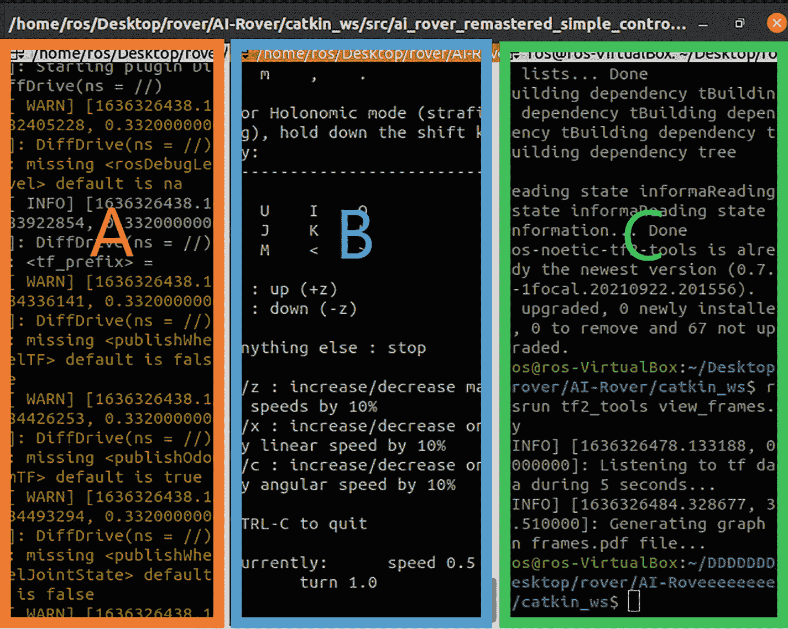A screenshot of a Gazebo window. Under the ROS program, there are three terminals labeled a, b, and c from left to right.Figure 5-9Multiple terminals are running the tf2_tools ROS analysis programOnce we have determined that the ROS program is working, we can control the rover directly in Gazebo (Figure 5-10).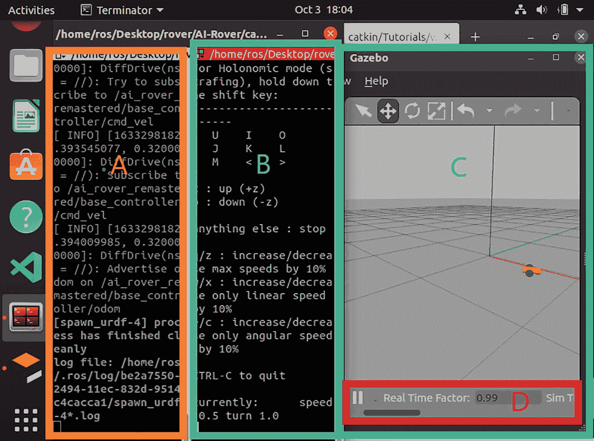A screenshot of multiple terminal windows and Gazebo. From left to right, two terminals are labeled a and b and c is the Gazebo. It highlights the real time factor labeled d at the bottom.Figure 5-10Multiple terminal windows and Gazebo runningPlease note that once these terminals are running, we need to be certain that the terminal responsible for executing the `teleops.py` program (blue box) is active by clicking on it with our pointer. To review: The launch files are the orange box, the active terminal found in blue box performs the `teleops.py` program, and the `TF View_Frames` is the green box.The `rosrun tf view_frames` command produces a pop-up window with the TF Graph (Figure 5-11) showing the interrelation between the rover components. Each component has four properties: broadcaster, average rate, recent transform, and buffer length. The broadcaster is the package that published the data, and the average rate is the frequency of updates. The recent transform is the internal clock timestamp for the last update. And, finally, the buffer length is the amount of time that transpired to complete the previous update. Of these four properties, we will only be using broadcaster.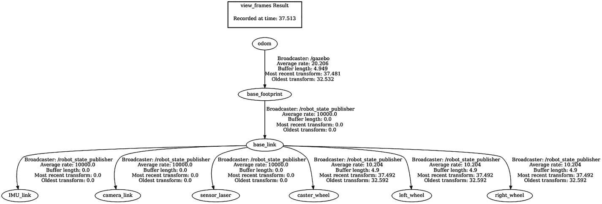A flowchart of the Rover U R D F and Gazebo with the heading view underscore frames result, recorded at time. It starts with Odom, base underscore footprint, base underscore link which is divided into I M U underscore link, camera underscore link, sensor underscore laser, caster underscore wheel, left underscore wheel, and right underscore wheel.Figure 5-11Frames outline for both rover URDF and GazeboTroubleshooting RViz Window ErrorsIn Figure 5-12, if you are missing the `RobotModel` field or `TF` field, you need to add it. Luckily, both solutions are very similar. Go to the Add button and select `RobotModel` or `TF`. Expand the `TF` visualization to see coordinate frames; these are our components defined in our Xacro files. Select the checkbox for the `RobotModel` and `TF` displays. These should now be shown in Gazebo and be reflected in the RViz GUI panel.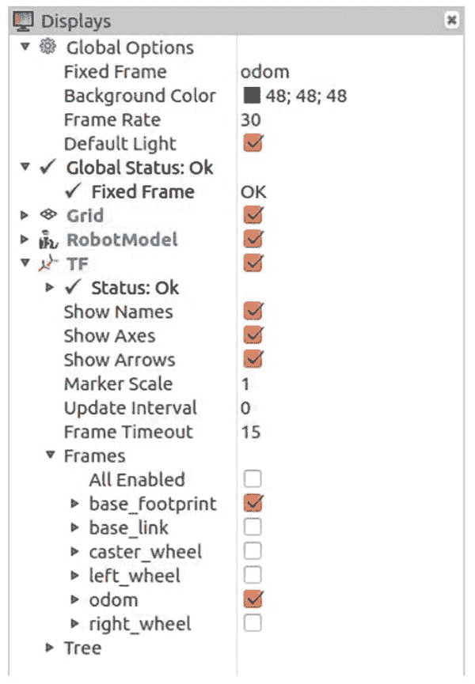A screenshot of the Rviz display panel. Under the displays tab, the options for global options, global status, grid, RobotModel and T F are marked.Figure 5-12The correct settings for the RViz Displays panelTo reflect these changes in the RViz Views panel, change orbit view in the Views panel to odom: Current View ➤ Target Frame ➤ odom. See Figure 5-13.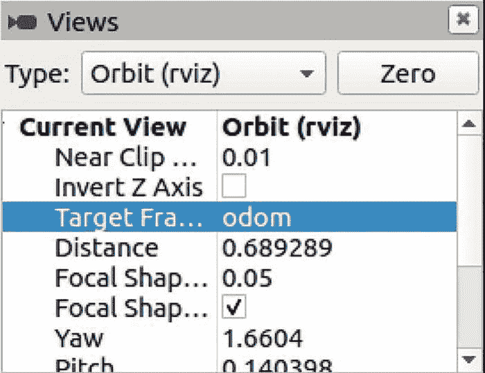A screenshot of the Rviz views panel. Below the heading, there are options for type. Below it, a drop down menu is open in which the target frame, Odom, is selected under the headings current view and orbit, respectively.Figure 5-13Odometry setting for the Target Frame optionControlling the RoverWe can control the rover in Gazebo with keyboard commands. Click on the Terminator terminal to interact with the `teleops_twist_keyboard` program (Figure 5-9, blue box). Press the “i” key, and the rover will continuously move forward in both RViz and Gazebo until you tell it to stop. Some simple case-sensitive keyboard commands: “i” (move forward), “j” (turn left), “k” (stop), “l” (turn right). Other commands may be defined as we need them. Figure 5-14 shows a snapshot of the rover in the RViz and Gazebo environments.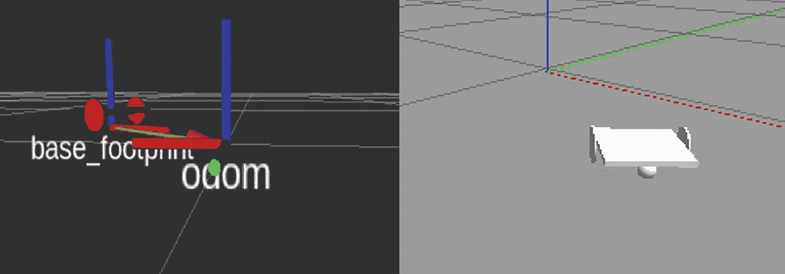A schematic of a snapshot of the Rover in the Rviz and Gazebo environment. The left has some vertical and horizontal lines labeled base underscore footprint and spherical object labeled Odom. The right has a 3 D horizontal square along with two circular wheels and a sphere below it.Figure 5-14Rover in Rviz (left) and Gazebo (right)Remember to save your work: File ➤ “Save Config As.” Save the configuration file in the following directory:

```

ai_rover_remastered_simple_control/config/

rviz_odom.rviz

```py

Reload the program with the new configuration file.Drifting Issues with the RoverAs you turned and moved the rover in the world, there may have been “drifting” problems. This drifting means the rover does not travel in a straight line. Usually, drifting occurs after the rover turns. If this happens, alter the mass of the rover by modifying the corresponding inertia values in the Xacro URDF file. Experiment with the weights of the different components until you are satisfied. These changes should control the drifting issues with the rover to a greater extent. Eventually, we will use deep learning to prevent drifting errors. For additional information, refer to [`https://www.youtube.com/watch?v=1bnEdQzf8Yw`](https://www.youtube.com/watch%253Fv%253D1bnEdQzf8Yw).Our First Python ControllerThe DDC plug-in subscribes to the `cmd_vel` topic to receive velocity commands to control the rover. The DDC does not know where the data originates. In Chapter 4, keyboard commands (i/j/k/l) published messages to the `cmd_vel` topic. But we can send commands from a program! The `Twist` library function publishes command messages to the `cmd_vel` topic, too. But because it accepts parameters, command control and accuracy are better than the keyboard version.The `Twist` function has two velocity attributes: linear (forward/backward) and angular (turning). The parameters set these attributes. For instance, in the following Python script, set the `msg.linear.x=0.1` initial value for `Twist()`. This parameter translates to “move the Rover forward 0.1m every second” and is equivalent to pressing the “i" key once on the keyboard.

```

ai_rover_remastered_simple_control/src /ai_rover_simple_twist_pub.py

```py

Create the `ai_rover_remastered_simple_twist_pub.py` script and make it executable:

```

#!/usr/bin/env python3

import rospy

import sys

from geometry_msgs.msg import Twist

def publish_velocity_commands():

# Velocity publisher

vel_pub = rospy.Publisher('/ai_rover_remastered/base_controller/cmd_vel', Twist, queue_size=10)

rospy.init_node('ai_rover_simple_twist_pub', anonymous=True)

msg = Twist()

msg.linear.x = 0.1

msg.linear.y = 0

msg.linear.z = 0

msg.angular.x = 0

msg.angular.y = 0

msg.angular.z = 0

rate = rospy.Rate(10) # 10hz

while not rospy.is_shutdown():

vel_pub.publish(msg)

rate.sleep()

if __name__ == '__main__':

if len(sys.argv) == 1:

try:

publish_velocity_commands()

```py

Load the configuration file from the first simple control keyboard program before executing the Python control program. If you do not, then you may encounter difficulties. Using the Terminator program, launch the RViz and Gazebo simulators:

```

$ roslaunch ai_rover_remastered ai_rover_remastered_gazebo.launch

$ chmod +rwx src/ai_rover_remastered_simple_control/src/ai_rover_remastered_simple_twist_pub.py

$ rosrun ai_rover_remastered_simple_control ai_rover_remastered_simple_twist_pub.py

```py

The `ai_rover_remastered_simple_twist_pub.py` controller script publishes a `Twist` message directly to the `cmd_vel` topic to which the DDC subscribes. Experiment with the movement for the `Twist` function by changing any of the `msg.linear` or `msg.angular` fields. You should be able to observe the rover moving around in the RViz and Gazebo environments. We now have ALL the fundamental building blocks needed to construct an autonomous rover.Building Our EnvironmentAfter we have created the controller script for the rover, it moves without human input. We have now developed a primitive autonomous rover, and now we have to put it somewhere to explore.We will simulate our environment as a simple maze. Go to the Gazebo GUI, select Edit (Open Building Editor), and create a simple maze with a few walls and at least one door. For more information, refer to [`http://gazebosim.org/tutorials?cat=build_world&tut=building_editor`](http://gazebosim.org/tutorials%253Fcat%253Dbuild_world%2526tut%253Dbuilding_editor). Our generated maze is shown in Figure 5-15; yours can be different. We will go over more details regarding maze generation in Chapter 6.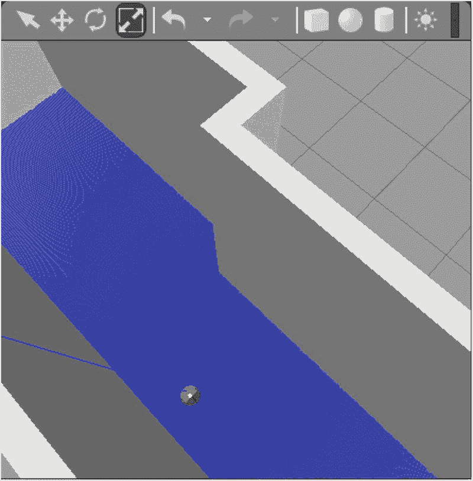A schematic of the maze in the Gazebo window. There is a circle at the bottom left and at the top the dimension vector icon is selected.Figure 5-15The rover (gray circle) is now exploring a mazeSave the maze as `ai_rover_remastered/worlds/catacomb.world` (and load it into your Gazebo environment).SummaryIn this chapter, we have used Xacro to simplify the rover development by using modular design. This technique gave us the ability to tack on sensors such as the LiDAR and camera. We tested the rover in both the RViz and Gazebo environments using keyboard commands. Then we showed we could control the rover without the keyboard using the Teleops ROS node program. Finally, we created a simple maze to explore with our rover. In the next chapter, we will develop a rover with an embedded controller. We also reviewed and made the first use of SLAM libraries provided with ROS. However, future chapters will allow us to refine our skills with SLAM.ExercisesExercise 5.1: How would you save the constructed maps?Exercise 5.2: How would you integrate other sensors, such as depth cameras, into the rover?Exercise 5.3: Why did we create a digital twin before building a real rover? (Hint: Think expense and complexity.)Exercise 5.4: Let us assume we want to use another range sensor, such as a depth camera (RGB-D camera). How can you create a plug-in to accommodate this new sensor?
```
