# 6. 感知与避障

在第五章中，我们使用了 Gazebo 和 RViz 来模拟 AI 漫游车的行为。输入可以是脚本化的，也可以通过人类控制到达。我们还集成了一个激光雷达传感器来“可视化”AI 漫游车附近的障碍物。然而，在第五章中，AI 漫游车的差速驱动控制器插件和激光雷达传感器插件之间没有进行通信。这些插件之间的通信不足导致了在障碍物周围运动的不智能。

我们需要这些插件来共享数据以实现智能导航和轨迹控制。为了弥合这种通信差距，我们必须创建另一个 Python 插件，用于从插件中发送和检索数据。本章将开发一些简单的控制算法，用于 AI 漫游车的差速驱动控制器。

我们将拥有一个嵌入式、智能决策节点，它允许我们的 AI 漫游车通过感知和避开障碍物、陷阱和坍塌的墙壁来探索埃及地下墓穴。这个节点将成为后续章节中开发的认知深度学习引擎的原型。

## 目标

以下是为成功完成本章所需的目标：

+   让 AI 漫游车检测并避开障碍物。

+   开发第一个惯性导航系统。

+   使用 Python 学习漫游车任务处理。

+   开发第一个用于避障的 Python 脚本。

+   了解如何上传和下载 Gazebo 任务。

+   验证和验证 Gazebo 模拟中的第一个陆地漫游车控制器。

+   讨论和回顾为什么深度学习优于标准状态机控制器设计。

+   摘要、练习和提示。

## 理解坐标系

在我们尝试编程漫游车感知其环境之前，我们需要了解如何识别位置、速度和速度。例如，当你阅读这本书时，你正坐着不动。你的速度是零千米每小时，对吧？显然！

别急！从你的视角（POV）来看，你正坐着不动。但那些在月球附近盘旋的外星人呢？由于地球的旋转，他们看到你以每小时 1,673 公里的速度飞快地移动。1 或者那些在太阳附近盘旋的外星人，他们看到你以惊人的每小时 107,000 公里的速度旅行。2

可能会感觉奇怪的是，你所有关于速度的测量都是正确的。这完全取决于你的视角。这些视角代表不同的坐标系。从数学角度思考的另一种方式是，你的“宇宙”的起点，O(0,0,0)，在哪里。静止的读者有一个相对于其当前位置的内部概念。换句话说，他们的起点随着他们移动。靠近月亮的外星人将其起点设在月亮上，其中一面始终面向旋转的地球。因此，观察到的旋转速度。最后，靠近太阳的外星人将其起点设在太阳上，它看到地球在围绕太阳旋转。轨道速度占主导地位。敏锐的观察者会注意到，这是一个对爱因斯坦相对论理论的简化解释。

因此，当在三维空间中解决问题时，我们发现我们的问题的解决方案将根据我们的视角（POV）而变化。我们将这些视角称为坐标系。我们有责任使用最简单解决我们问题的坐标系，并将其转换为其他系统。从我们的内部坐标系理解我们的速度和转向是最容易的。从局部坐标系描述创建地图或跟随路径是最容易的。最后，在全局系统中描述我们的模拟世界是最容易的。将答案转换为其他坐标系的数学计算由 Gazebo 自动处理。

## 建模人工智能漫游车世界

检索第五章中开发的全部 Xacro、URDF、launch 和 Python 脚本文件。使用相同的 AI 漫游车模型、差速驱动控制器和 LiDAR 传感器插件。LiDAR 传感器插件确定障碍物与 AI 漫游车之间的距离。这在探索过程中识别最近的障碍物是必不可少的。我们期望找到的是，这不足以导航迷宫。漫游车可能会被困住。使用相机 *和* LiDAR 传感器将提供足够的信息来导航迷宫。

人工智能漫游车由以下组件组成：

+   底盘和转向轮：链接类型元素

+   右轮和左轮：都是链接类型元素

+   右轮和左轮关节：都是关节类型元素

+   LiDAR 传感器包和插件

### 组织项目

将以下突出显示的子目录添加到项目中：

```py
└────── sim_gazebo_rviz_ws
└─── src
└──── ai_rover_remastered_description
├─── CMakeLists.txt
└─── package.xml
└─── urdf
└─ai_rover_remastered.xacro
└─ai_rover_remastered_plug-ins.xacro
└─── launch
└─ai_rover_rviz_gazebo.launch
└─ai_rover_teleop.launch
└─── config
└── ai_rover_worlds
├── CmakeLists.txt
├── launch
├── package.xml
└── worlds
```

要生成 `ai_rover_worlds` ROS 包目录，请执行以下 Linux 终端命令：

```py
$ cd ~/sim_gazebo_rviz_ws/src
$ catkin_create_pkg ai_rover_worlds
$ cd ~/sim_gazebo_rviz_ws/src/ai_rover_worlds
$ cd mkdir -p launch worlds
$ cd ../../
$ catkin_make
$ source devel/setup.sh
```

该目录组织有效地管理了复杂的障碍。`ai_rover_worlds` 目录包含了描述每个生成世界中迷宫和障碍的 URDF 文件。`launch` 文件夹包含启动 Gazebo 所需的世界和障碍的 XML 文件。`worlds` 文件夹包含描述在 Gazebo 中生成世界的 XML 文件。

### 建模地下墓穴（简化版）

现在我们可以使用 Gazebo 编辑器创建我们第一个 AI 探测车在埃及地下墓穴的探索世界布局，正如我们在第四章和第五章中简要回顾的那样。我们将创建一个简单的单室迷宫，包含一个门道和一个圆柱形物体（见图 6-1）。关于操作 Gazebo 编辑器的信息，请参考第五章。

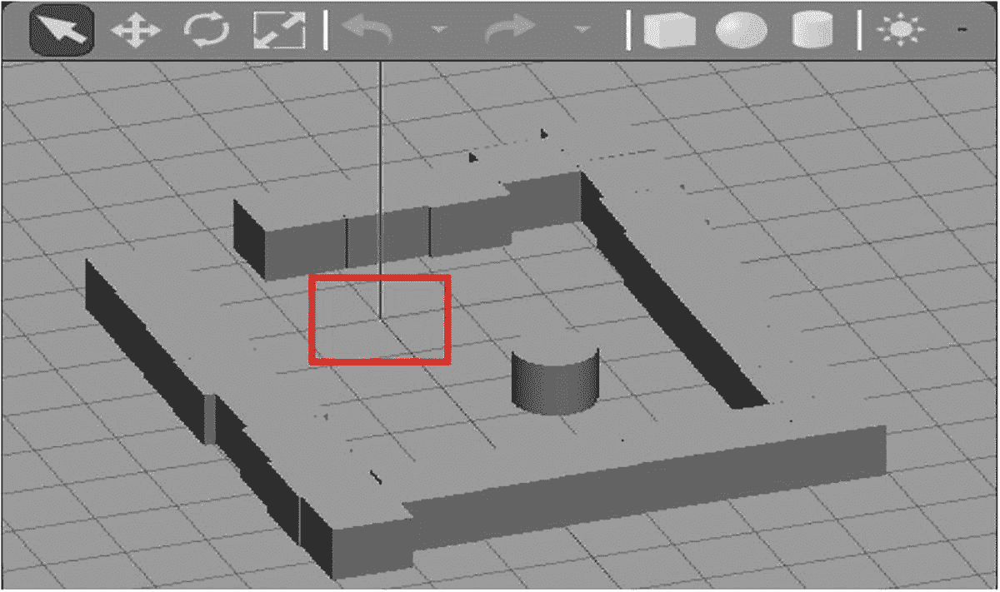

Gazebo 编辑器的截图。图中展示了以门道形状排列的立方体物体，底部右方放置了一个圆柱形物体。它突出了位于地下墓穴顶左方的 AI 探测车。

图 6-1

带有柱子的埃及地下墓穴的第一个设计

现在我们已经创建了一个带有支撑柱的部分封闭的埃及地下墓穴，我们应该将这个 3D 设计保存在以下目录中：`~/sim_gazebo_rviz_ws/src/ai_rover_worlds/worlds`。该文件的名称为`ai_rover_catacombs.world`。我们应该使用 Ctrl+Shift+S 选项保存此设计。设计保存选项允许我们存储这个埃及地下墓穴的初始设计，而不会意外导致 Gazebo 模拟器崩溃。Gazebo 环境，根据您的特定计算机硬件特性，在保存过程中有崩溃的可能性。我们还可以看到，在这个简单的地下墓穴设计中，模拟的花岗岩块排列不齐。这种建筑是古埃及最早的一些古王国陵墓建筑（约公元前 3100 年）的典型特征。这些建筑例子尤其适用于那些非贵族阶级的古埃及人。排列不齐的花岗岩块也将使我们能够测试 AI 探测车的激光雷达和摄像头传感器在模拟运行期间是否能够确定和识别不均匀或排列不齐的表面的边界。我们还将看到 AI 探测车可能无法通过其传感器配置定位的“盲点”现象。一旦我们将这个设计保存在正确的目录中，我们必须然后从 ROS 启动它。我们可以在 ROS 中启动此世界，最初不需要启动文件。我们可以在两个分开的窗口中执行以下 Linux 终端命令来完成：

```py
$ roscore                           (First Terminator Terminal)
$ rosrun gazebo_ros gazebo ~/    sim_gazebo_rviz_ws/src/ai_rover_worlds/worlds/ai_rover_catacomb.world                      (Second Terminator Terminal)
```

注意

使用 Linux 终端命令启动这个初始设计。这似乎是测试 ROS 的 Gazebo 交互的最佳方法。然而，这仍然是我们的一部分猜测。我们修改了第五章中的启动文件，以生成我们的“地下墓穴”和 AI 探测车。生成额外的 AI 探测车是一个简单的练习。

一旦我们执行了这些 Linux 终端命令，我们应该看到与图 6-2 中相同的显示。我们这样做是为了测试、验证和确认地下墓穴设计可以被 ROS 成功打开和操作。然后我们将继续修改第五章中的原始 Gazebo 和 RViz 启动文件。这个原始启动文件的名称是`ai_rover_remastered_gazebo.launch`。这个启动文件在一个空世界中生成并激活一个 AI 漫游车。我们现在将修改这个启动文件，使 AI 漫游车在图 6-2 中开发的埃及地下墓穴原点坐标处生成。原点坐标在图 6-2 中被红色方框突出显示，它与红色（x）、绿色（y）和蓝色（z）线相交。因此，AI 漫游车将在红色方框内生成，周围是古代埃及地下墓穴。我们还必须确保地下墓穴世界永远不会与 AI 漫游车的生成位置重叠。这种行为会导致 Gazebo 模拟终止。列表 6-1 是修改后的启动文件源代码列表，用于 AI 漫游车模型和生成的地下墓穴。

```py
1 
2
3    
4     
7       
9
10     
12
13     
14     
15
16     
17     
18          
20         
21         
22         
23         
24         
25         
26     
27
28     
29     
32
33 
Listing 6-1
Gazebo Launch File, Version 6.0
```

对第五章中的原始启动文件只有一个修改：在首次启动空世界后的源代码行中添加`<arg name="world_name" value="$(find ai_rover_worlds)/worlds/ai_rover_catacomb.world"/>`行 XML 源代码。这个世界类似于一个干净的画布，之后我们生成 AI 漫游车探索埃及地下墓穴的模拟世界。因此，我们添加这一行以找到并启动正确的目录中的`ai_rover_catacomb.world`。我们现在将第五章中修改后的启动文件重命名为`ai_rover_cat.launch`。以下是在终端 Linux 命令中执行此启动文件所需的命令，该启动文件将 AI 漫游车及其操作激光雷达系统和生成的埃及地下墓穴一起执行：

```py
$ cd ~/sim_gazebo_rviz_ws/src
$ roslaunch ai_rover_worlds ai_rover_cat.launch
```

我们现在应该有两个模拟器：1) 带有 AI 漫游车的 RViz 模拟器，位于原点；2) 带有埃及地下墓穴、AI 漫游车（红色方框）和激光雷达传感器扫描分析（蓝色区域）的 Gazebo 环境。这些生成的项目如图 6-2 所示。

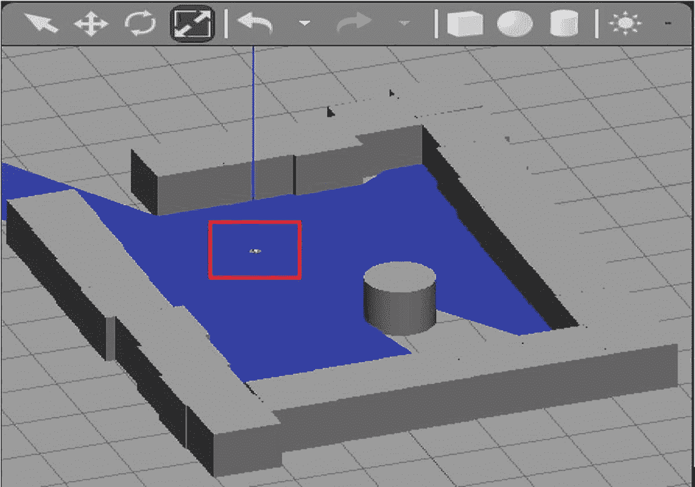

Gazebo 编辑器的截图。它生成了埃及地下墓穴和 AI 漫游车。有一些立方体物体以门道形状排列成方形，底部右边的圆柱形物体放置在其中。AI 漫游车在地下墓穴的左上角被突出显示。

图 6-2

生成的埃及地下墓穴和 AI 漫游车

使用 Teleops 程序在地下墓穴内测试 AI 探索车的键盘控制命令（第五章）。重用 Teleops 测试和验证程序可以减少开发时间。我们需要查看 Teleops 程序是否仍然控制 AI 探索车原型以绕过地下墓穴的墙壁边界和柱子。在辅助的 shell 窗口中执行以下 Linux 终端命令：

```py
$ roslaunch ai_rover_remastered_description ai_rover_teleop.launch
```

如果一切正常，你现在可以通过键盘命令控制 AI 探索车。因此，你现在应该看到类似于图 6-3 的内容。

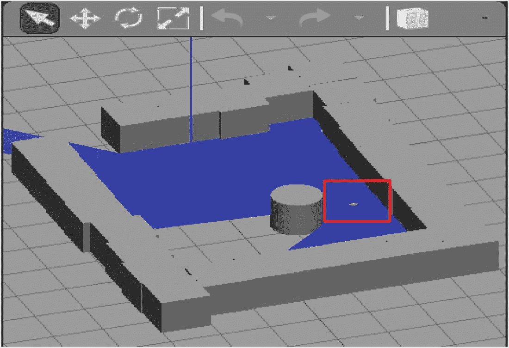

Gazebo 编辑器的截图。有立方体物体以门的形式排列成方形，其中放置了一个圆柱形物体。AI 探索车在地下墓穴中圆柱形物体右侧被突出显示。

图 6-3

手动控制 AI 探索车探索地下墓穴

现在我们可以在 Gazebo 中导航 AI 探索车，让我们验证它是否在 RViz 中也能正常工作。通过启动 `ai_rover.cat.launch` 来启动 RViz。将 `Laser_scan` 作为主题添加到 RViz 中的显示选项。现在我们将看到图 6-4 中所示的显示（参见第五章节以获取适当的设置）。

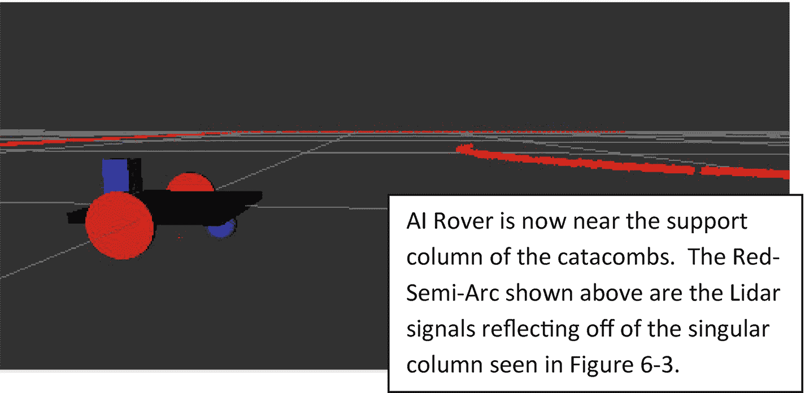

R V i z 的截图。它使用 AI 探索车探索地下墓穴。AI 探索车上方有半圆形，这是激光信号。右下角的框提供了关于图像的信息。

图 6-4

RViz 数据显示 AI 探索车探索地下墓穴

注意

如果你收到以下错误：

`RLException: [ai_rover_teleop.launch] 既不是包 [ai_rover_remastered_description] 中的启动文件，也不是 [ai_rover_remastered_description] 的启动文件名。异常的跟踪信息已写入日志文件。`

重新执行以下 Linux 终端命令（源代码或启动文件可能需要在主目录中重新编译）：

`$ cd ~/sim_gazebo_rviz_ws/`

`$ catkin_make`

`$ source devel/setup.sh`

接下来，我们使用 `ai_rover_worlds` 目录中的模拟世界来设计、开发、测试、验证和验证运动规划、导航和地图创建脚本文件。我们希望将 `catkin_ws` 目录扩展以包含智能控制脚本，例如激光扫描数据提取，以控制 AI 探索车的差速驱动。我们的目标是创建以下目录树结构用于 `catkin_ws` 工作空间：

```py
├────── catkin_ws
└─── src
└── Motion-Planning-Navigation-Goals
├── CMakeLists.txt
├── examples
├── launch
├── package.xml
└── scripts
```

输入以下 Linux 终端命令以创建 `catkin_ws` 工作空间的目录树列表：

```py
$ mkdir -p catkin_ws   (If catkin_ws exists, do not recreate it.)
$ cd ~/catkin_ws/
$ mkdir -p build devel src  (Do not remake if already exist.)
$ cd ~/catkin_ws/src
```

使用以下 Linux 终端命令创建 `catkin` ROS 包 `Motion_Planning_Navigation_Goals`：

```py
$catkin_create_pkg Motion_Planning_Navigation_Goals rospy std_msgs geometry_msgs sensor_msgs
$ cd ..
$ catkin_make
$ source devel/setup.sh
```

让我们快速回顾 ROS 软件包依赖关系。`rospy` 软件包是 ROS 的 Python 客户端库，允许程序员访问 ROS 控制库。然而，`rospy` 库在计算效率上并不高。相反，该库允许程序员快速高效地开发 ROS 应用程序。

`std_msgs` 依赖关系开发了标准的发布者/订阅者 ROS 消息，包括常见的数据类型。这些数据类型包括浮点数和双精度数内置数据类型以及用户定义的数据类型，例如深度学习神经网络或多维数组用于地理空间处理。

`geometry_msgs` 依赖关系提供了几何元素（点、向量和姿态）的消息。`geometry_msgs` 提供了标准函数，例如 `twist`。`twist` 函数描述了元素对于订阅者和发布者的线性和角速度。差速驱动插件使用这些速度。我们需要这个 `geometry_msgs` 依赖关系来将 Python 自主程序的线性和角速度通信到控制巡游车的差速驱动。

`sensor_msgs` 依赖关系提供了传感器消息，例如摄像头和激光测距扫描仪。这个依赖关系允许发布者（传感器）和订阅者（Python 自主程序）之间的信息交换。这些传感器消息影响 Python 自主程序，以改变差速驱动插件的线性和角速度。有关激光雷达的激光管道堆栈的更多信息，请参阅[`wiki.ros.org/sensor_msgs`](http://wiki.ros.org/sensor_msgs)。

## 激光测距滤波器设置

将激光雷达传感器设置设置为 `ai_rover_gazebo_plug-in.xacro` 文件中激光雷达传感器部分表 6-1 中显示的值。

表 6-1

激光雷达特定程序设置

| XML 设置 | 值 | 定义 |
| --- | --- | --- |
| `<update_rate>` | 20 | 控制激光数据捕获速率的样本率（速度） |
| `<samples>` | 1440 | 一个激光雷达测距扫描的样本数量 [minAngle..maxAngle] |
| `<frameName>` | `sensor_laser` | 虚拟连接激光雷达传感器和车架之间 |

验证程序值是否在激光雷达传感器的实际物理规格范围内。Gazebo 模拟器使用这些值创建了一个更真实的激光雷达传感器。

保存这些值后，通过在一个窗口中执行以下操作来确认更新是否成功：

```py
$ cd ~/sim_gazebo_rviz_ws/src
$ roslaunch ai_rover_worlds ai_rover_cat.launch
```

在第二个窗口中执行以下操作：

```py
$ cd ~/sim_gazebo_rviz_ws/src
$ roslaunch ai_rover_remastered_description ai_rover_teleop.launch
```

执行这些命令后，我们可以使用键盘控制模拟中显示的 AI 巡游车。接下来，我们将开发一个 Python 脚本代码来处理和显示激光雷达传感器数据。

### 激光测距数据

我们将在 `catkin_ws` 工作空间 `Motion_Planning_Navigation_Goals` ROS 软件包中创建我们的 Python 脚本。此脚本将从 `/ai_rover_remastered/laser_scan/scan` 主题检索数据。创建以下 Python 脚本：

```py
$ cd ~/catkin_ws/src
$ cd Motion_Planning_Navigation_Goals
$ mkdir scripts
$ cd scripts
$ touch read_Lidar_data.py
$ chmod +x read_Lidar_data.py
$ nano read_Lidar_data.py
```

备注

`touch` 命令在目录中创建文件，而不启动应用程序，例如文字处理器或开发环境。创建的文件是空的。要创建内容，必须启动适当的应用程序。`chmod` 命令使 `read_Lidar_data.py` 文件可通过 `rosrun` 执行。

进入列表 6-2 中的脚本。

```py
1  #! /usr/bin/env python3
2
3  import rospy
4  from sensor_msgs.msg import LaserScan
5  def clbk_laser(msg):
6
7       # 1440/10 = 144
8       sectors = [
9            min(min(msg.ranges[0:143]), 10),
10           min(min(msg.ranges[144:287]), 10),
11           min(min(msg.ranges[288:431]), 10),
12           min(min(msg.ranges[432:575]), 10),
13           min(min(msg.ranges[576:720]), 10),
14           min(min(msg.ranges[720:863]), 10),
15           min(min(msg.ranges[864:1007]), 10),
16           min(min(msg.ranges[1008:1151]), 10),
17           min(min(msg.ranges[1152:1295]), 10),
18           min(min(msg.ranges[1296:1439]), 10)
19           ]
20
21       rospy.loginfo(sectors)
22
23  def main():
24
25       rospy.init_node('read_Lidar_data')
26      sub=rospy.Subscriber("/ai_rover_remastered/laser_scan/scan", LaserScan, clbk_laser)
27
28      rospy.spin()
29
30  if __name__ == '__main__':
31
32       main();
Listing 6-2
read_Lidar_data.py
```

`clbk_laser` 函数将 `msg` 参数传递给 `min(min(msg.ranges[xxxx:yyyy]), 10)`，然后读取每个激光雷达传感器十个扇区的数据，保证最大值为 10 米。它将 1,440 个样本转换为十个聚合扇区。每个扇区返回样本的最小值或将其限制在 10 米（激光雷达最大范围）。最小值是该扇区中距离 AI 探索车最近的障碍物的距离。每个扇区覆盖 36 度（36° x 10 = 360°）。因此，AI 探索车在连续的激光雷达传感器扫描过程中没有“盲点”。由于 AI 探索车没有盲点，如果需要，它也可以倒车。图 6-5 是激光雷达传感器的方向布局。

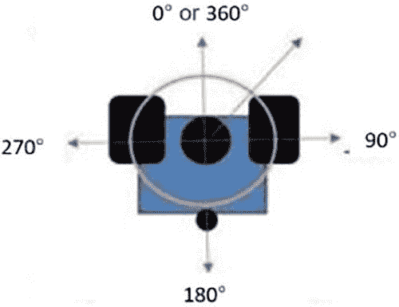

激光雷达传感器方向的布局。有一个正方形，在其顶部角落有两个矩形物体。它们之间有一个大圆，下面有一个小圆。大圆的箭头指向度数。0 或 360，90，180 和 270 度。

图 6-5

激光雷达传感器方向和布局

图 6-5 中中心的较大实心黑色圆圈是激光雷达传感器。图 6-5 底部较小的实心黑色圆圈是万向轮。激光雷达扫描从 180° 开始，然后结束于 180°。红色箭头是传播的激光雷达激光束。

要运行我们的程序 `read_Lidar_data.py`，请添加以下主测试驱动程序，该程序位于第 23-32 行。`main()` 函数内部的源代码执行以下功能：

+   **rospy.init_node('read_Lidar_data')**：连接到 ROS。

+   **rospy.Subscriber()**：订阅 `Laser_scan` 和 `msg_Lidar_laser` 主题。

+   **rospy.Publisher()**：发布到 `ai_rover_remastered base_controller/cmd_vel` 主题，以控制 AI 探索车。

+   **rospy.spin()**：防止程序自行关闭。程序只能由操作员关闭。

要运行 `read_Lidar_data.py rosrun` 可执行文件，请重新输入以下 Linux 终端命令：

```py
$ cd ~/catkin_ws
$ catkin_make
$ source devel/setup.sh
```

重新编译所有内容后，使用以下命令运行程序：

```py
$ cd ~/catkin_ws/src
$ cd Motion_Planning_Navigation_Goals
$ cd scripts
$ rosrun Motion_Planning_Navigation_Goals read_Lidar_data.py
```

注意

如果 Gazebo AI 探索车地下城程序或键盘遥操作程序没有运行，请重新编译/加载这两个启动文件，然后再次尝试运行 `read_Lidar_data.py` 程序。

您的数据应类似于图 6-6。

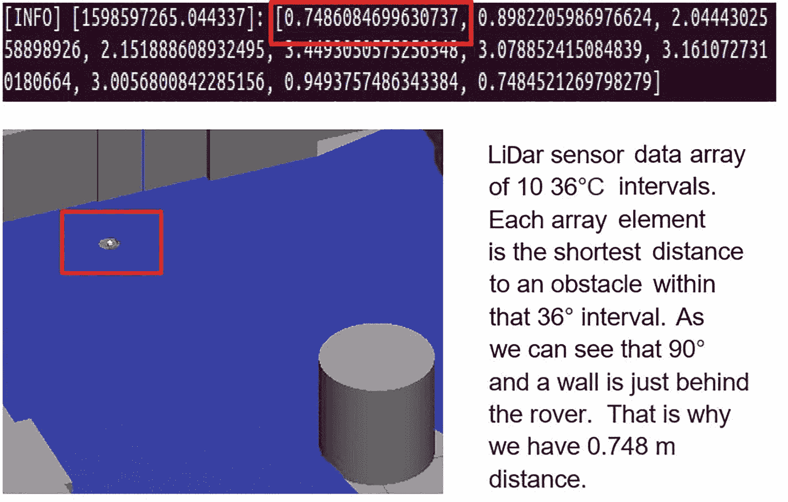

激光雷达传感器的示意图。在顶部，一个方框突出了距离 0.7486084699630737。下方是地下墓穴，其中有一个圆柱形物体并突出了 AI 漫游车，右边是一个提供图像信息的方框。

图 6-6

0.748 米处的激光雷达传感器分析

我们应该进行合理性检查，并直观检查 AI 漫游车目前距离墙壁 0.75 米。图 6-7 显示我们的数据是合理的。将 AI 漫游车稍微向东南移动，我们的数据将变为图中的数据。

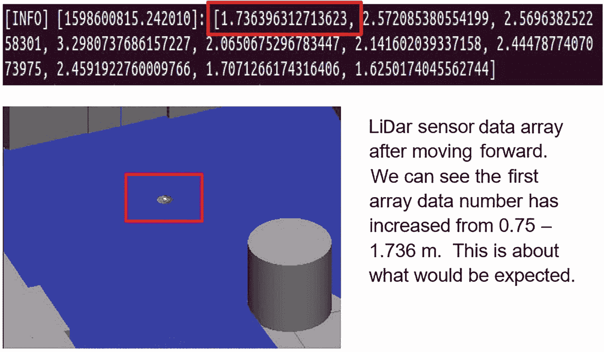

激光雷达传感器的示意图。在顶部，一个方框突出了距离 1.736396312713623。下方是地下墓穴，其中有一个圆柱形物体并突出了 AI 漫游车，右边是一个提供图像信息的方框。

图 6-7

1.736 米处的激光雷达传感器分析

我们已经确定激光雷达传感器系统是可操作的。我们进行了这个小距离测试，以验证 Gazebo 模拟是否正确工作。模拟的 AI 漫游车必须尽可能在物理定律的约束下运行。通过执行 AI 漫游车每个单独开发的迭代测试，我们构建一个完全可操作的 AI 漫游车的机会得到了提高。这也缩小了我们寻找错误来源时需要搜索的位置范围。

使用表 6-2 来可视化和解释图 6-7 中显示的 10 元素数组。传感器数据简化为[INFO] [1598600815.242010] [1.76, 2.57, 2.56, 3.29, 2.06, 2.14, 2.44, 2.45, 1.71, 1.63]。

表 6-2

图 6-7 中的激光雷达传感器读数，已解释

| 区域 | 方向 | 覆盖度 | 最近物体 |
| --- | --- | --- | --- |
| 区域 A | 后右 | 144°至 180° | 1.76 米 |
| 区域 B | 后中心右 | 108°至 144° | 2.57 米 |
| 区域 C | 右 | 72°至 108° | 2.56 米 |
| 区域 D | 前中心右 | 36°至 72° | 3.29 米 |
| 区域 E | 前右 | 0°至 36° | 2.06 米 |
| 区域 F | 前左 | 324°至(360°或 0°) | 2.14 米 |
| 区域 G | 前中心左 | 288°至 324° | 2.44 米 |
| 区域 H | 左 | 252°至 288° | 2.45 米 |
| 区域 I | 后中心左 | 216°至 252° | 1.70 米 |
| 区域 J | 后左 | 180°至 216° | 1.62 米 |

每个区域代表激光雷达扫描的 1/10（图 6-8）。区域 A 检测到一个距离 AI 漫游车约 1.76 米的物体。该区域内可能还有其他物体，但没有更近的。区域 A 中的物体相对于 AI 漫游车位于 144°至 180°之间。该物体也可能位于两个区域中；即，传感器数据不推断大小。所有其他区域都可以类似解释。

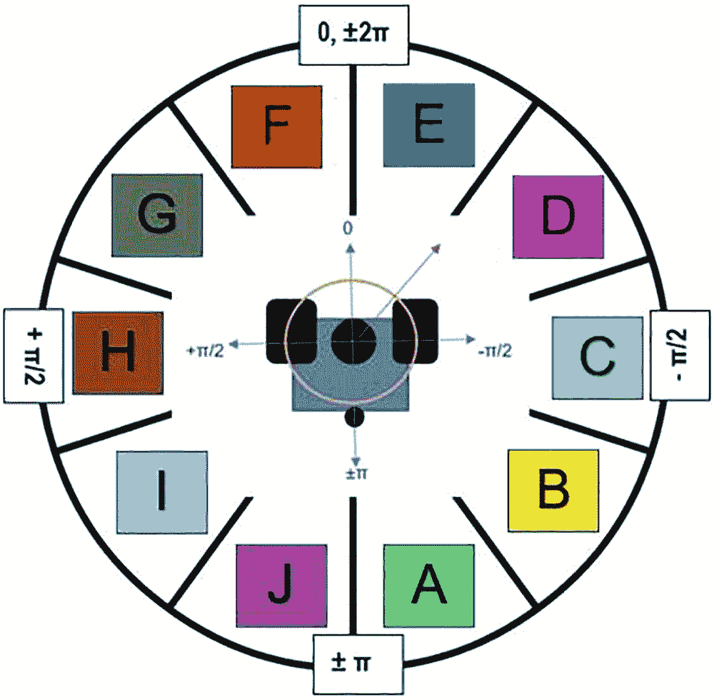

LiDAR 传感器区域方向的示意图。它有 10 个从右下角到左下角的区域，标记为 a 到 j。在顶部 0，正负 2π，在右侧负π/2，在底部正负π，在左侧正π/2 处有标记。

图 6-8

LiDAR 传感器区域方向和布局

## 障碍物感知与规避

本节将第一章至第五章（手动控制）中介绍的信息与剩余章节（智能自主控制）联系起来。我们现在迈出第一步，开发一个自主式漫游车；即，它能在迷宫中自主做出决策。它是通过一个简单的控制算法实现这一点的。控制算法向执行器/电机发送命令。

按以下方式组织控制算法文件夹目录：

```py
$ cd ~/sim_gazebo_rviz_ws/
$ catkin_make
$ source devel/setup.sh
$ cd ~/catkin_ws/src
$ cd Motion_Planning_Navigation_Goals
$ cd scripts
$ touch sense_avoid_obstacle.py
$ chmod +x sense_avoid_obstacle.py
$ nano sense_avoid_obstacle.py
```

这将在`scripts`目录中创建一个空的`sense_avoid_obstacle.py`文件。以下为列表文件和文件夹目录的树形结构：

```py
├────── catkin_ws (Workspace for AI rover Controls)
│     └─── src
│         └── Motion_Planning_Navigation_Goals
│             ├── launch/
│             └── scripts/sense_avoid_obstacle.py
```

现在我们已经理解了我们的树形结构组织，我们必须将注意力转回到`sense_avoid_obstacle.py` ROS 程序节点中的源代码。列表 6-3 提供了这段源代码。

```py
1 #! /usr/bin/env python
2 # -*- coding: utf-8 -*-
3
4 import rospy
5 from sensor_msgs.msg import LaserScan
6 from geometry_msgs.msg import Twist
7
8 pub = None
9
10 # 1440/10 = 144 Full rotation of coverage from +/-Ï€ for the LiDAR sensor sweep
11 # Transform ‘sectors’ array into a Python dictionary.
12
13 def msg_Lidar_laser(msg):
14      sectors = {
15      'sectorA': min(min(msg.ranges[0:143]),   10),
16      'sectorB': min(min(msg.ranges[144:287]), 10),
17      'sectorC': min(min(msg.ranges[288:431]), 10),
18      'sectorD': min(min(msg.ranges[432:575]), 10),
19      'sectorE': min(min(msg.ranges[576:719]), 10),
20      'sectorF': min(min(msg.ranges[720:863]), 10),
21      'sectorG': min(min(msg.ranges[864:1007]), 10),
22      'sectorH': min(min(msg.ranges[1008:1151]),10),
23      'sectorI': min(min(msg.ranges[1152:1295]),10),
24      'sectorJ': min(min(msg.ranges[1296:1439]),10),
25      }
26      rospy.loginfo(sectors);
27      sense_and_avoid(sectors);
28
29 # Using encoded sensor data to make turning decisions.
30 # There are five different possible decisions: Forward, turn soft left, turn hard
31 # left, turn soft right, turn hard right, and turn around 180 degrees around…
32
33 def switch_movement_options(argument):
34      def forward():
35           return 0.5, 0.0;
36
37      def turn_soft_left():
38           return 0.0, 0.70;
39
40      def turn_hard_left():
41           return 0.0, 0.90;
42
43      def turn_soft_right():
44           return 0.0, -0.70;
45
46      def turn_hard_right():
47           return 0.0, -0.90;
48
49      def backward_turn_around():
50           return 0.0, 3.14159;
51
52      switch_function_dir = {
53
54           0b0000: forward(),
55           0b0001: turn_soft_left(),
56           0b0010: turn_soft_left(),
57           0b0011: turn_soft_left(),
58           0b0100: turn_soft_right(),
59           0b0101: turn_hard_left(),
60           0b0110: turn_hard_left(),
61           0b0111: turn_hard_left(),
62           0b1000: turn_soft_right(),
63           0b1001: forward(),
64           0b1010: turn_hard_right(),
65           0b1011: turn_hard_left(),
66           0b1100: turn_hard_right(),
67           0b1101: turn_hard_right(),
68           0b1110: turn_hard_right(),
69           0b1111: backward_turn_around()
70           }
71
72      return switch_function_dir.get(argument, "Invalid Move Option")
73
74 def sense_and_avoid(sectors):
75      msg = Twist();
76      linear_vel_x = 0;
77      spin_angular_vel_z = 0;
78      current_state_description = 'Program Start';
79
80      # encode forward looking sensor data
81      bitVar = 0b0000;
82
83      # bitVar | 0b1000 We have an obstacle detected in front_center_left
84      if sectors['sectorG'] < 1:
85           bitVar = bitVar | 8;
86
87      # bitVar | 0b0100 We have an obstacle detected in front_left
88      if sectors['sectorF'] < 1:
89           bitVar = bitVar | 4;
90
91      # bitVar | 0b0010 We have an obstacle detected in front_right
92      if sectors['sectorE'] < 1:
93           bitVar = bitVar | 2;
94
95      # bitVar | 0b0001 We have an obstacle detected in front_center_right
96      if sectors['sectorD'] < 1:
97           bitVar = bitVar | 1;
98
99      # SET ALL VALUES TO BE SENT TO THE DIFFERENTIAL DRIVE VIA TWIST
100      linear_vel_x, spin_angular_vel_z = switch_movement_options(bitVar);
101
102      rospy.loginfo(current_state_description);
103      msg.linear.x = linear_vel_x;
104      msg.angular.z = spin_angular_vel_z;
105      # publish the values of linear and angular velocity to diff drive plug-in
106      pub.publish(msg);
107
108 def main():
109      global pub;
110
111      rospy.init_node('sense_avoid_obstacle');
112      sub = rospy.Subscriber('/ai_rover_remastered/laser_scan/scan', LaserScan, msg_Lidar_laser);
113
114      pub = rospy.Publisher('ai_rover_remastered/base_controller/cmd_vel', Twist, queue_size=10);
115
116      rospy.spin();
117
118 if __name__ == '__main__':
119      main();
Listing 6-3
sense_avoid_obstacle.py Version 6.0\. No Artificial Intelligence Yet!
```

### 源代码分析

在这个程序中定义了十个函数，包括六个用于轮子移动。最后一个函数（`main` 108–119）与之前在`read_Lidar_data.py`程序中讨论的其他版本的`main`类似。我们将忽略从先前迭代中重复的代码行。

我们现在将定义`main`函数的以下内容。

+   第 13–25 行。从 LiDAR 传感器弧段检索数据，最大限制为 10 米。例如，`'sectorA': min(min(msg.ranges[0:143]), 10)`从第一个弧段，区域 A 的所有 144 个数据样本中获取最小值，并将其限制在 10。所以，如果所有 144 个数据样本都大于 10，区域 A 将被分配值为 10。有关 LiDAR 数据的解释信息，请参阅本章的“解释 LiDAR”部分。此外，请参阅“激光测距数据”中的`read_Lidar_data.py`程序。

+   第 26–27 行。将值保存到日志文件，然后调用`sense_and_avoid`（第 94 行）

+   第 28–70 行。这些看起来相似的功能只是设置 x 轴（我们前进的速度）的线性速度和 z 轴（我们旋转的速度）。例如，如果右象限有物体，我们可以以较慢的速度向左转。如果物体直接在我们面前，我们希望快速转向另一个方向。

注意 1

当我们转向时，没有前进的动量。我们要么前进，要么转向，不能两者同时进行。这使得编码变得容易得多。

注意 2

转向命令是我们以多快速度在给定方向上转动，而不是目标角度。传感器的读数大约每秒发生 10 次。因此，如果我们告诉漫游器以每秒 45° 的速度转向，当新的传感器读数发生时，漫游器只转动了 4.5°。这个新的读数会覆盖先前的 `Twist()` 命令：1) 这就是为什么我们使用“软”和“硬”转向的原因。2) 这可能会导致无限循环，其中漫游器来回转动。我们将在第五章“总结”部分讨论并审查控制系统的解决方案来解决这个问题。 

不按顺序取出下一段代码：

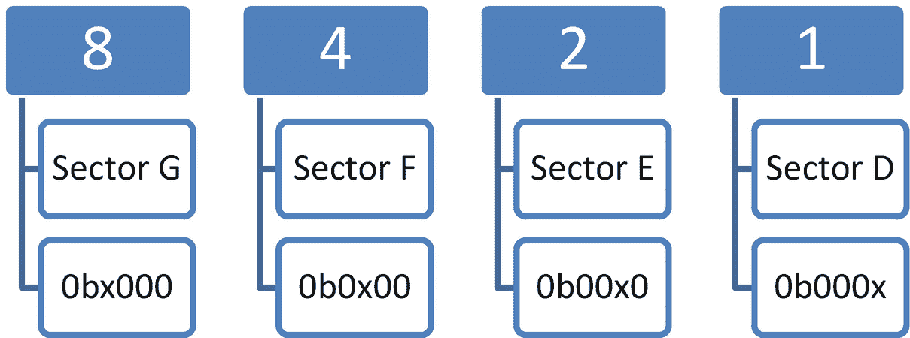

四个标记为 8、4、2 和 1 的传感器的示意图，以及区域和位。传感器 8 由区域 G 和 0 b x 000 位组成，传感器 4 由区域 F 和 0 b 0 x 00 位组成，传感器 2 由区域 E 和 0 b 00 x 0 位组成，传感器 1 由区域 D 和 0 b 000 x 位组成。

图 6-9

每个前向区域的位位置编码

+   行 74–99\. 这部分编码四个传感器。最初，我们假设没有近距离物体（将 `bitVar` 设置为 `0b0000`）。如果一个物体靠近（区域值小于 1m），我们在 `bitVar` 中设置适当的位为 `1`。如图 6-9 所示，如果区域 E 有物体，我们“翻转”区域 E 位（`0b00x0`），其中第二位的位被改变。这是“2 的位”，因此位或 `bitVar = bitVar | 2`；翻转“2 的位”（见图 6-9）。有关 `sense_and_avoid` 函数的更多信息，请参阅“感知和避障”部分。

注意

这不是我们第一次迭代这段代码。在我们的第一次迭代之后，我们认识到，由四个传感器（D、E、F 和 G）表示的十六种不同情况只导致了六种可能的结果（`前进`、`软左转`、`硬左转`、`硬右转`、`软右转` 和 `撤退`）。此外，将四个区域编码到单个 4 位变量中极大地加快了代码的执行速度。这种代码重写被称为 *重构*。

+   行 52–72\. 使用编码后的 `bitVar`，我们可以快速进行适当的“字典”查找，以确定漫游器的移动。移动决策基于“参数”中编码的附近物体的位置。第 125 行将编码后的 `bitVar` 传递给 `switch_movement_options(arguments)`，这将选择移动的“正确”方向。

### 解释激光雷达传感器数据

回调函数 `msg_Lidar_laser` 处理主函数中定义的订阅者从 LiDAR 传感器接收的信息和消息（第 112 行）。`msg_Lidar_laser` 函数将 LiDAR 传感器扫描消息划分为十个等距的 36 度扇区，供 AI 探索车使用。LiDAR 在每个旋转中发送 1,440 激光脉冲。每个脉冲都是来自 LiDAR 的射线，延伸到无限远处，除非射线遇到障碍物。脉冲反射 LiDAR，并根据返回时间计算障碍物的距离。所有 1,440 个数据点都由 LiDAR 以事件的形式发送，`msg_Lidar_laser` 正在监听这些事件，并将它们处理成十个等距的扇区。

有十个等距的 36 度扇区的目的是覆盖 AI 探索车周围的一整个旋转。这允许 AI 探索车“看到”并在任何所需的方向上行驶，包括向前、向左、向右和向后。在任何方向上行驶都允许 AI 探索车在埃及地下墓穴中导航并避开障碍物和坍塌。

### 感知和避开障碍物

`sense_and_avoid` 函数是一个简单的有限状态机 (FSM)，实现了简单的行为（见图 6-10）。

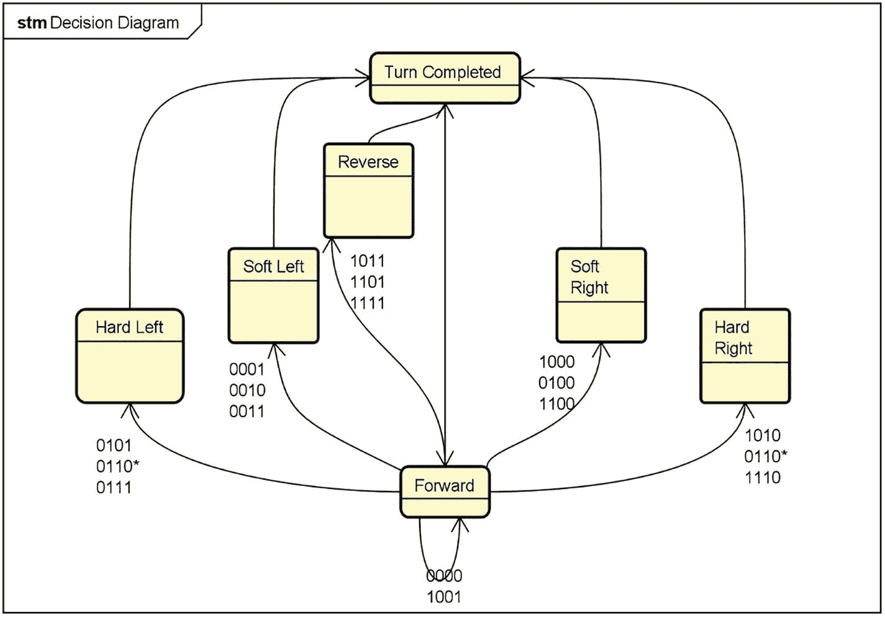

一个决策图。在顶部和底部，转弯完成和向前之间各有一个双头箭头。流向是从前方到转弯完成，通过左边的硬左转、软左转和反向，以及右边的软右转和硬右转。

图 6-10

显示不同转弯决策的决策有限状态机

在开发复杂系统，例如智能无人机时，以小步骤、逐步的方式来解决问题。为了简化我们对转弯的决策选择，我们只将使用前四个扇区的数据；即扇区 D、E、F 和 G。这些传感器数据用于确定是否存在距离小于一米的物体在我们的路径上。这四个扇区组成十六种组合，以确定探测车将前往的方向。只有六个可能的方向：向前、软左转、软右转、硬左转、硬右转和原地转弯（见图 6-11）。（如果使用“前六个”扇区进行决策，我们将有 64 种组合！要复杂得多！）

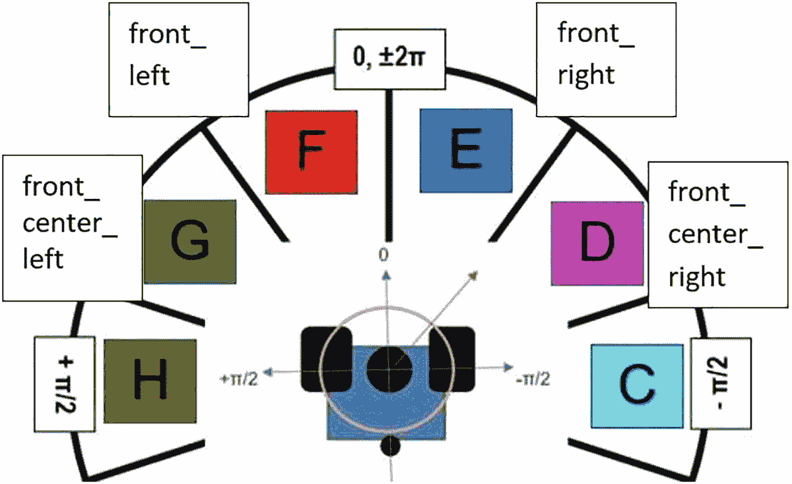

LiDAR 传感器正前方扇区的示意图。扇区标记为 c 到 h。从左下角到底右角的方位如下。正 π/2；前方、中心、左；前方、左；0，正负 2π；前方、右；前方、中心、右；和负 π/2。

图 6-11

正前方扇区用于决定下一步行动

四个面向前方的区域各自返回该区域最近物体的距离。如表 6-3 所示，我们将结果编码在`bitVar`中。例如，区域 G 可能返回值`10`。这意味着物体距离 10 米，不是紧急情况。假设区域 F 和区域 E 是类似的大数字，没有危险。假设区域 D 返回 0.9。这个物体距离小于 1 米，是一个可能的危险，我们应该避免。测试每个返回值是否小于 1（即，区域 G < 1）会返回`true`或`false`。在这个例子中，区域 G、区域 F 和区域 E 的返回值较大，比较将返回`false`。相比之下，区域 D 的比较将返回`true`。四个比较的结果是`false, false, false, true`，可以编码为`bitVar = 0001`。解释表 6-3：如果一个单元格为空，则表示该方向最近物体距离较远，没有立即危险。如果单元格有“< 1m”，则表示物体非常接近，应该避免。

表 6-3

使用四个前方区域选择六个决策之一的决策表。空白单元格表示在这些区域未检测到附近物体

| 情况 | bitVar | 区域 G | 区域 F | 区域 E | 区域 D | 决策 |
| --- | --- | --- | --- | --- | --- | --- |
| 0 | 0000 | 无附近物体 * | 前进 |
| 1 | 0001 |   |   |   | < 1 m | 软左 |
| 2 | 0010 |   |   | < 1 m |   | 软左 |
| 3 | 0011 |   |   | < 1 m | < 1 m | 软左 |
| 4 | 0100 |   | < 1 m |   |   | 软右 |
| 5 | 0101 |   | < 1 m |   | < 1 m | 硬左 |
| 6 | 0110 |   | < 1 m | < 1 m |   | 硬左 |
| 7 | 0111 |   | < 1 m | < 1 m | < 1 m | 硬左 |
| 8 | 1000 | < 1 m |   |   |   | 软右 |
| 9 | 1001 | < 1 m |   |   | < 1 m | 前进 |
| 10 | 1010 | < 1 m |   | < 1 m |   | 硬右 |
| 11 | 1011 | < 1 m |   | < 1 m | < 1 m | 转身 |
| 12 | 1100 | < 1 m | < 1 m |   |   | 软右 |
| 13 | 1101 | < 1 m | < 1 m |   | < 1 m | 转身 |
| 14 | 1110 | < 1 m | < 1 m | < 1 m |   | 硬右 |
| 15 | 1111 | < 1 m | < 1 m | < 1 m | < 1 m | 转身 |

形式上，探测器的速度和方向在探测器的内部坐标系中被称为线性速度和角旋转。线性速度沿 x 轴（红色）表示，角旋转绕 z 轴（蓝色）旋转，如图 6-12 所示。由于我们使用的是探测器，并且假设此时地面平坦，该系统简化为二维。在移除“平坦地面”假设后，我们的模型将变得更加复杂。但这将在后面的章节中讨论。

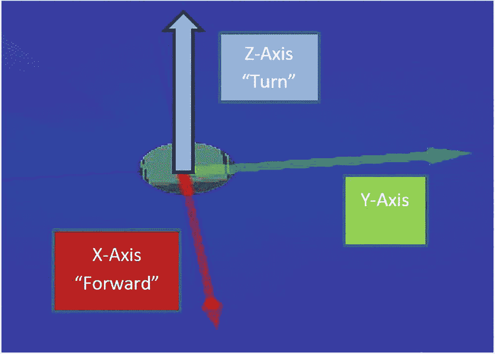

探测器内部坐标系统的示意图。x 轴向前是线性速度，y 轴是旋转，z 轴是角旋转。

图 6-12

X 轴、Y 轴和 Z 轴相对于探测器

存在两种类型的角速度：轨道角速度和自旋角速度。例如，地球围绕太阳公转；即地球围绕一个外部点（太阳）旋转。地球也围绕南北极轴自转；即地球围绕一个内部点旋转。我们使用 `Twist()`（第 96 行）将自旋角速度发送到 AI 漫游车。这导致 AI 漫游车围绕内部 z 轴旋转。

另一种看待轨道角速度（OAV）与自旋角速度（SAV）的方法是视角。OAV 是从漫游车外部观察的；即它与宇宙中的多个物体相互作用。地球/太阳组合的 OAV 是 365 天，而月球/地球轨道的 OAV 是 28 天。OAV 取决于其他物体。另一方面，SAV 是一个内部属性。地球的 SAV 是 24 小时。它不随其他物体而改变。因此，我们说 SAV 与观察者无关，而 OAV 是相关的。

当我们控制漫游车时，我们使用 SAV。换句话说，如果我们想向右转 45°，我们通知 ROS 将漫游车转向 45°。但请记住，ROS 在计算角度时使用弧度而不是度数。角速度以每秒弧度表示，其中一弧度等于圆心处的角度，其弧长等于半径。从我们的内部视角来看，如果我们“向左转”，我们传递一个正值。如果我们“向右转”，我们传递一个负值。因此，我们的“向左转 45°”变为“向左转 π/4。”

### 执行避障代码

在一个已打开的终端中执行以下 Linux 终端命令：

```py
$ cd ~/catkin_ws/
$ catkin_make
$ source devel/setup.sh
$ cd ~/sim_gazebo_rviz_ws/
$ catkin_make
$ source devel/setup.sh
$ cd ~/sim_gazebo_rviz_ws/
$ roslaunch ai_rover_worlds ai_rover_cat.launch
```

然后，在第二个终端中执行以下 Linux 终端命令：

```py
$ cd ~/catkin_ws/
$ rosrun Motion_Planning_Navigation_Goals sense_avoid_obstacle.py
```

我们现在的漫游车可以避开简单的障碍，例如支撑柱。但这个避障算法并不十分智能！它只使用四个特定的扇区，每个避障决策都是程序员明确选择的。如果程序员没有理解所有可能的情况和所有可能的决策怎么办？如果实际的世界如此复杂，以至于四个扇区无法提供足够的信息来始终做出正确的决策怎么办？

使用人工智能深度学习系统（DLS）将使 AI 漫游车具有进化和自适应的行为。使用这些高级方法消除了程序员使用有限状态机（FSM）明确编程所有这些行为和决策的需求。为了实现这些行为，我们用 DLS 替换了 FSM。例如，在图 6-13 中，基于 FSM 的漫游车可能会因为倒塌的墙壁而陷入困境。DLS AI 漫游车应该能够智能地逃离倒塌的墙壁。我们将在下一章中添加 DLS 智能性。

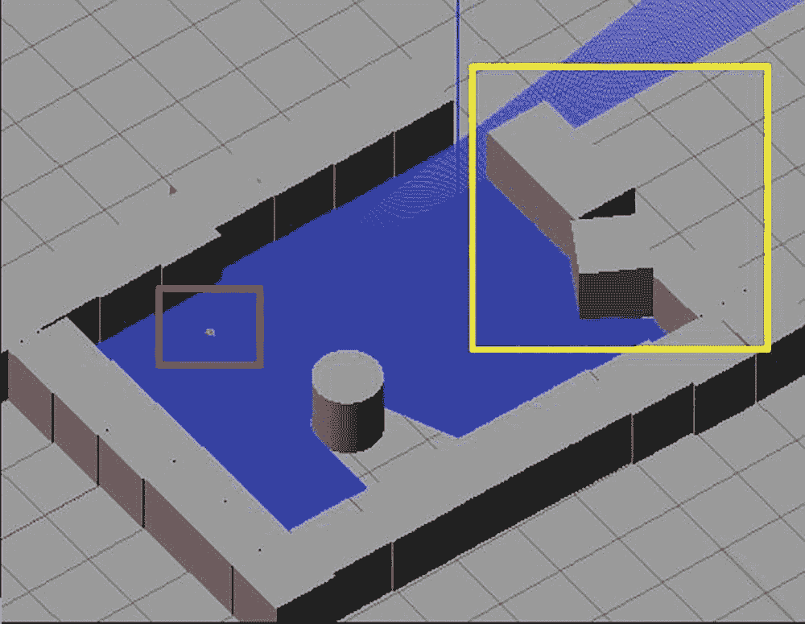

Gazebo 编辑器的截图。这里有一些立方体物体以方形排列，其中有一个门，一个圆柱形物体放置在其中。一个 I 型探测车在圆柱形物体的左侧被突出显示，顶部被突出显示的坍塌墙壁。

图 6-13

携带 AI 探测车（红色）和坍塌墙壁（黄色）的场景

## 摘要

本章的目的是向读者传达，对于第一代 AI 探测车，简单的控制是可能的。本章还揭示了有限状态机在创建越来越复杂的机器人方面的严重限制，从而有必要创建深度学习、强化深度学习、贝叶斯学习和最终基于人工认知智能的控制器，这将使机器人能够探索未知环境，如埃及地下墓穴。我们还应指出，我们没有在传感器数据上使用任何类型的概率或统计分析来确定传感器噪声或误差。我们将在关于贝叶斯深度学习和传感器噪声及不确定性的统计分析章节中重新审视这个话题。我们将在下一章中讨论基于 SLAM（同时定位与地图构建）的第一导航和制图技术。导航和制图的讨论还需要使用控制系统理论，以便我们理解为什么需要有两个主要控制系统来控制 AI 探测车本身的航向角度和目标位置的方向。下一章将是自主探测车开发中的一个微小但关键步骤。

额外加分

1.  在 AI 探测车/地下墓穴模拟过程中，你一定注意到了，如果 AI 探测车与花岗岩方块相撞，它可以将其推到一边。在现实中，由于 AI 探测车体积小、质量轻和速度慢，这种情况永远不会发生。你将如何修改 URDF XML 文件，以便埃及地下墓穴中发现的花岗岩方块和支撑柱具有与相同尺寸的真实世界花岗岩方块和柱子相同的模拟质量和惯量？（参考第四章和第五章，关于修改 URDF 源代码。）

1.  如果 AI 探测车与一个具有真实世界质量和惯量的方块相撞，它是否仍然能够将花岗岩方块推到一边？

1.  我们知道我们目前有 16 种`bitVar`的组合，以及我们在`sense_avoid_obstacle.py`中使用的四个前部区域（D、E、F 和 G）。如果我们添加左侧（区域 H）和右侧（区域 C）的 LiDAR 区域，我们将有多少种`bitVar`的组合？请使用区域 C、D、E、F、G 和 H 列出所有`bitVar`的组合。

1.  我们可以看到我们只使用了四个前方的激光雷达区域。如果我们把左侧（区域 H）和右侧（区域 C）的激光雷达区域也加入到`sense_avoid_obstacles.py`中，我们可能会获得哪些收益？我们该如何重新编程这个特定的 Python ROS 节点程序？

1.  我们目前使用十个区域进行激光雷达传感器阵列扫描？这是我们能使用的激光雷达区域数量的唯一选择吗？如果不是，那么理想的激光雷达传感器扫描区域数量是多少？

1.  我们如何修改模拟激光雷达传感器的源代码，将其范围从 10 米增加到 30 米？
