# 7. 导航、SLAM 和目标

在本章中，我们的勇敢漫游车将探索埃及地下墓穴。任何自主漫游车都需要知道它在环境中的位置；即，它的当前位置。这样，漫游车就可以在没有用户输入的情况下从一个位置移动到下一个位置。为此，漫游车必须在旅行过程中构建其环境的内部地图。本章介绍了同时定位与建图（SLAM）算法。SLAM 从导航数据生成地图，例如来自漫游车轮编码器的里程计数据和来自激光雷达传感器的激光测距数据。

## 目标

以下是为成功完成本章所需的目标：

+   任务类型

+   在环境中跟踪局部和全局位置（里程计）

+   纠正我们的旅行（控制理论）

+   同时定位与建图（SLAM）

## 概述

要创建一个自主漫游车，漫游车必须知道它在环境中的位置和朝向。

## 任务类型

存在三种类型的漫游车任务：全面覆盖、目标导向和探索性。我们将在后面讨论**全面覆盖**任务。**目标导向**任务从点 A（初始点）到点 G（目标点）。目标可以是一条简单的直线路径（A 直接连接到 G）或通过其他航点穿越的分割路径（A→B→C→…→G）。中间航点可以是预先计划的，也可以是自主发现的。

**探索性**任务发现环境中的特征并将它们放置在内部局部和全局地图上。这些特征可以是墙壁、门道、物体、地面的洞等。创建这个内部全局地图是必要的，以便规划具有最佳路径的未来任务。探索性任务可以是三种子类型之一：单点或双点任务，以及资源发现。

+   单点任务为漫游车提供一个起始位置，从该位置“绘制”整个环境，并应返回该位置。这种任务类型将适用于新环境，例如搬到一个新家并随机探索整个街区。

+   双点任务为漫游车提供其起始和最终或目标位置。我们可以假设最终位置在中间地图上的一个未探索的位置。双点任务不必彻底探索未知环境，只需足够到达最终目标。在我们搬进新家后，我们知道我们将就读学校的地址，因此我们探索路线以了解地标。也许有一些道路关闭等。

+   我们的第三个——探索性——任务是一个单点任务，具有目标资源。假设没有 GPS，当我们搬进新家时，我们可能会探索以找到一家披萨店。我们不知道披萨店在哪里。我们只是在探索街区，直到找到一家。

## 里程计

里程计算基于轮传感器数据估计位置的变化。里程计算是通过使用（模拟的）漫游车轮编码器来计算的。想象一下，当你还是个孩子的时候，把一张扑克牌放在自行车上，这是一个类比。每次扑克牌击中轮辐时，都会听到一声“点击”。如果我们知道自行车的原始位置和产生了多少次点击，我们就可以计算出自行车的新的位置（假设行程是直线）。我们知道这是因为我们知道轮子有多少个辐条（18 个）和周长（36 英寸）。所以，每次点击相当于“前进两英寸”。

此外，我们可以通过点击的频率来计算自行车的速度。当然，假设自行车是直线行驶的假设相对较强，这也没有考虑到任何打滑或滑动等情况。里程计算给我们提供了一个当前位置的近似值！行程越短，近似值越好。

这个位置近似过程就是轮编码器的工作原理。通过计算车轮的每一次“点击”来近似计算漫游车的速度、方向和位置，漫游车的里程计算只要模拟漫游车直线行驶（没有转弯）时是准确的。一个更复杂的里程计算算法会结合线性（前进和后退）和角加速度（左转或右转）来计算漫游车的速度和位置。我们还可以使用惯性测量单元（IMU）传感器来进行更精确的计算。不幸的是，由于舍入误差，随着时间的推移和距离的增加，计算将变得越来越不准确，而且我们无法通过更新我们的位置信息来纠正这一点。

导航、SLAM 和路径规划算法使用里程计算得出的位置。位置包括其位置和方向，称为其**姿态**。自由度（DoF）是描述我们漫游车完整姿态所需的维度数量。例如，飞机有六个自由度，因为它可以在三个维度<x,y,z>中移动，并在三个维度<r,p,y>中旋转，其中 r,p,y 代表俯仰、偏航和滚转。同样，在漫游车的 URDF Xacro 文件中，初始位置和方向的六个自由度如下所示：

最后，里程计算在本地和全局地图中都有应用。**本地**地图告诉漫游车其位置是基于起始位置。**全局**地图将我们的漫游车放置在环境中，以便外部查看器（如 RViz 环境）进行可视化。

### 漫游车本地导航

我们的漫游车可以在环境中从一个位置移动到另一个位置，根据里程计计算处理阻挡其路径的障碍物。如前所述，漫游车的导航有两个坐标系：本地和全局。本地导航是漫游车的内部理解，可以感知附近的物体。漫游车的本地感知能力意味着漫游车将知道它从位置（0,0）面向北开始；它目前位于（1,3）面向东，并感知到位置（1,5）的物体。我们将在稍后探讨全局导航。

此外，如果漫游车继续向东移动，它可能会撞到障碍物——它可能是一堵墙或一个独立物体。局部目标是避开障碍物。为了避免障碍物，我们可以 1) 停止，2) 向左/右转，3) 向前进入未阻塞区域，或者我们可以在进入未阻塞区域时转向。第一种解决方案最容易实现，但会减慢我们的漫游车探索速度。方便的是，机器人操作系统（ROS）有插件来协助控制漫游车，所以我们不需要理解物理知识。

### 漫游车全局导航

让我们假设我们正在进行一个双点探险任务。全局导航是在环境中两个位置之间找到路径。在这两个点之间找到路线需要生成该领域的全局地图。随着漫游车的探索，我们使用里程计来计算其位置。我们只需将本地坐标系转换为全局坐标系，并在该位置绘制我们的漫游车头像。此外，传感器数据通过对象轮廓填充地图，例如墙壁和障碍物。创建此地图后，未来的目标导向任务可以预先规划两点之间的最短路径。

希望很明显，从里程计计算漫游车位置时的错误可能会对全局地图渲染产生重大影响。知道漫游车在环境中的位置允许我们在探险任务中创建准确的地图，并在目标导向、计划任务中创建最佳路径。

里程计可以在短时间内使用，而不会对漫游车的位置和姿态产生真正的后果。然而，里程计在确定漫游车精确位置和姿态时的不确定性可能会令人烦恼。这种不确定性在长时间探索不确定环境时尤其成问题。为了帮助减少这些不确定性问题，我们在每次任务中更新我们的全局地图。这种对象位置的强化可以增强对全局地图构建的信心。此外，一个物体的永久位置让我们可以分配位置标签。要重置里程计设置，我们可以使用物体的永久位置标签作为外部“验证”的位置。

### 获取漫游车航向（方向）

为了开发一个更具适应性的感知和避障算法，我们需要知道我们的探测车方向。为此，`/odom`主题将我们的 AI 探测车的航向传感器数据提供给`Twist()`函数。回想一下，`Twist()`获取新的期望航向，并通过迭代将探测车从当前航向旋转到期望航向。然后`Twist()`通过`/cmd_vel`主题传递数据以控制每个轮子的角速度。如第六章所述，这些控制允许 AI 探测车逃离狭窄的角落和封闭区域。现在 AI 探测车可以不依赖外部转向来避开障碍物。

注意

我们已经开始创建一个自主式探测车——即，它可以无需人工干预自行转向。自动驾驶看起来对旁观者来说“智能”，这意味着探测车已经进化成为一个人工智能探测车，或 AI 探测车。从今往后，*探测车*和*AI 探测车*是同义的。

在`catkin_ws/src`目录中创建一个`rotateRobotOdom.py`脚本。此脚本从`/odom`主题检索方向数据（列表 7-1）。这些数据让探测车知道它的航向。

```py
1 #!/usr/bin/env python3
2 import rospy
3 from nav_msgs.msg import Odometry
4 from tf.transformations import
euler_from_quaternion, quaternion_from_euler
5
6 roll = pitch = yaw = 0.0; # initially point North
7
8 def get_rotation (msg):
9      global roll, pitch, yaw;
10     orientation_q = msg.pose.pose.orientation;
11        orientation_list = [orientation_q.x,
orientation_q.y,
orientation_q.z,
orientation_q.w];
12      (roll, pitch, yaw) =
euler_from_quaternion(orientation_list);
13     print yaw;
14
15 rospy.init_node('rotateRobotOdom’);
16
17 sub = rospy.Subscriber(
'ai_rover_remastered/base_controller/odom',
Odometry, get_rotation);
18
19 r = rospy.Rate(1); # publish msg every second
20 while not rospy.is_shutdown():
21        quaternion_val =
22     quaternion_from_euler (roll, pitch, yaw);
23   r.sleep();
Listing 7-1
rotateRobotOdom.py
```

脚本的大部分内容应该很熟悉，但有几行需要解释。代码在探测车移动和旋转时更新 AI 探测车的滚转、俯仰和偏航。只有偏航值会改变，因为环境被建模为平坦的二维表面。我们将通过使用键盘控制的`teleop_twist_keyboard.py`程序来测试此脚本。

在第 6 行，我们通过将航向、俯仰和偏航值在任务开始时设置为零来面对“北方”。第 7 至 14 行定义了`get_rotation`函数。该函数的参数来自导航`msg`；在四元数坐标中：[x, y, z, w]。无需担心四元数坐标，因为第 12 行将它们转换为欧拉坐标。第 15 行将`rotateRobotOdom`节点注册到 ROS 中，以订阅和发布消息；即，`get_rotation`现在是一个**回调**函数。回调函数是一个“无限循环”，它会以特定间隔将结果发布给订阅者。第 17 行将`/odom Odometry`主题链接到`get_rotation`回调函数。任何订阅`Odometry`主题的对象都将接收到最新的`get_rotation`消息。第 19 行指定消息将每秒发布一次。第 20 至 23 行是我们的“无限循环”，它每秒以四元数[x, y, z, w]返回当前方向。

### 执行`rotateRobotOdom.py`

在终端 1 中编译和运行以下 Linux 终端命令：

```py
$ cd ~/catkin_ws/
$ catkin_make
$ source devel/setup.sh
$ cd ~/sim_gazebo_rviz_ws/
$ catkin_make
$ source devel/setup.sh
$ cd ~/sim_gazebo_rviz_ws/
$ roslaunch ai_rover_worlds ai_rover_cat.launch
```

成功后，在终端 2 中执行以下 Linux 终端命令：

```py
$ cd ~/catkin_ws/
$ rosrun rotate_robot rotateRobotOdom.py
```

执行 `ai_rover_cat.launch` 和 `rotateRobotOdom.py` 后，你将在 Gazebo 中看到 AI 探索车，终端上会显示一个滚动显示弧度的列表。我们看到 AI 探索车最初面对的方向大约是零弧度。图 7-1 展示了我们的初始航向，所有未来的航向都将基于这个原始方向。

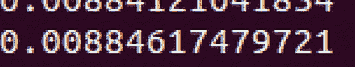

一个数字读数为 0.00884617479721。

图 7-1

AI 探索车大约 0 弧度的初始方向角

如果我们想用键盘控制探索车，我们必须执行 `teleops_twist_keyboard.py` ROS 节点。我们可以在终端 3 中使用以下终端命令来完成此操作：

```py
$ cd ~/sim_gazebo_rviz_ws/src
$ roslaunch ai_rover_remastered_description
ai_rover_teleop.launch
```

使用“j”和“l”键转动探索车，并注意终端 2 中显示的值。这些数字反映了探索车在弧度中的方向。

回顾我们的**探索**任务，让我们想象当传感器检测到物体时，我们的探索车正在向前移动。检测到物体的过程是反馈。继续前进是错误的，因为我们可能会撞到障碍物，所以我们必须改变探索车的方向——发布新的命令。为了避免物体，我们可以向未阻塞、未探索的区域左转；向未阻塞、未探索的位置右转；或者转身退回到有未探索区域的较早点。最后一个选项认识到我们已经遇到了死胡同，进一步的探索是徒劳的。

确认屏幕上探索车的方向是否正确至关重要。零弧度应该看起来像探索车在屏幕上指向“北”（向上）。从现在开始，如果我们命令 AI 探索车转向（偏航），我们应该看到弧度发生变化（图 7-2），并且探索车的方向将在屏幕上改变。在后台，我们的命令被转换成针对每个轮子的独立命令。响应后，在处理命令后，每个轮子通过轮编码器发布其当前位置和偏航。每种编码器类型都不准确，但对我们系统来说足够准确。因此，我们的探索车姿态是通过轮子位置计算得出的。

在图 7-2 中，我们通过手动控制（j, k, l）将探索车的方向改变到了 ~0.16 弧度。我们可以看到，我们现在已经成功测试、验证和确认了 AI 探索车的里程计和方向确实是正确的。

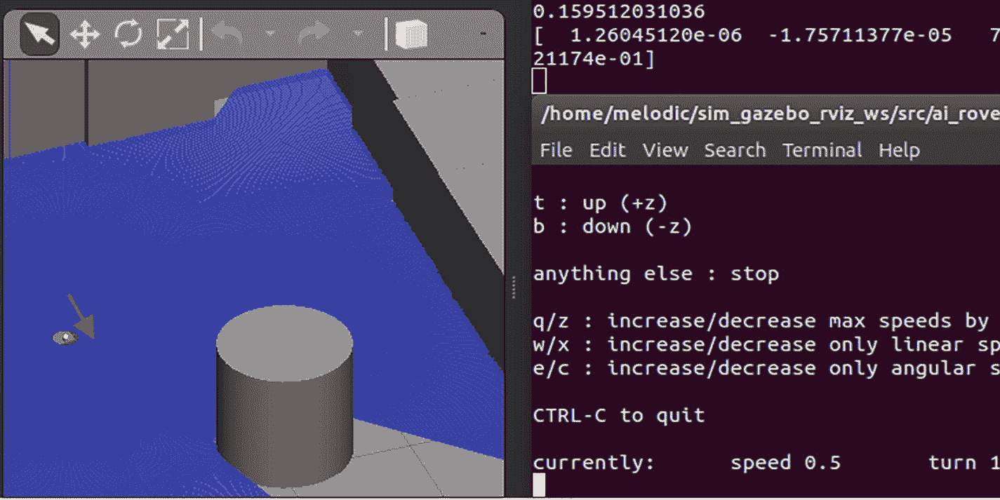

屏幕上探索车方向数据和以 g-map 作为方向视觉表示的截图。视觉表示在左侧，带数据的终端在右侧。

图 7-2

弧度偏航方向的变化。方向为 0.16 弧度，面向南-东南（SSE）

## 控制理论

控制理论简单来说就是一个反馈回路（图 7-3）；即，我们做某事，然后四处看看我们做了什么之后事情发生了怎样的变化。如果结果是好的，我们继续这样做。如果结果不正确，我们调整并“纠正”我们做错的事情。例如，我们通过向前移动开始我们的探测车单点探索任务。只要传感器检测到前方没有东西，我们就继续前进。然而，一旦我们的任何传感器（激光雷达、雷达、摄像头）在我们的路径上检测到障碍物，我们就改变人工智能探测车的航向以避开障碍物并进一步探索。

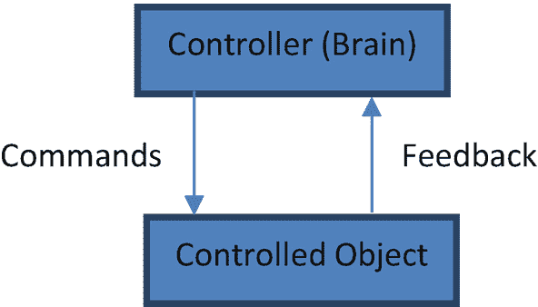

一个简单的反馈回路示意图。控制器（大脑）向受控对象发送命令，并从受控对象接收反馈。

图 7-3

简单反馈回路

### 自主导航

图 7-4 使用简单的统一建模语言（UML）状态图来模拟我们的单点探索任务的导航和控制逻辑；即，我们没有目标位置或资源。我们只是在尝试创建一张地图。UML 状态图模拟了三种状态（`GO_STRAIGHT`，`STOP` 和 `TURN`）。有限数量的状态转换（障碍物，无障碍物）将代表导航的动态行为。如果探测车正在直行且其路径上没有障碍物，它将继续直行。然而，如果传感器检测到障碍物，它将停止并转向。在转向过程中，如果其路径上仍有障碍物，它将继续转向。当有一条清晰（且未探索）的路径时，它将沿着这条未探索的路径继续前进。此图未显示当没有新的未探索路径时会发生什么。一个选项是维护一组已访问的航点，沿着有未探索路径的路径返回到先前的一个点，并从该点继续探索。

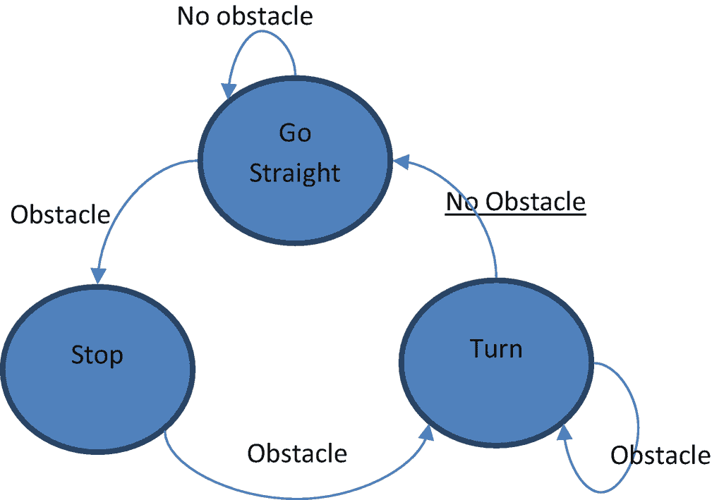

导航状态图的圆形回路。步骤如下。无障碍物，直行；障碍物，停止；障碍物，转向；无障碍物，直行。

图 7-4

导航状态图

从编程的角度来看，三种状态必须更新里程计数据。稍后，我们还将使用这些状态来更新我们的内部地图。我们将在本章末尾回顾这些概念，以实现自主导航。在本章末尾，我们将回顾探测车在探索环境时可以完成以下行为。

> **GO_STRAIGHT:** 探测车开始或继续沿当前方向行驶，持续更新其位置 <x,y,z> [z 永远不变]。滚转、俯仰和偏航 <r,p,y> 不变。如果它检测到障碍物，它将停止。
> 
> **STOP:** 进入 `STOP` 状态时，我们将此位置 <x> 添加到已访问航点列表中。（如果我们有外部位置参考，这是纠正里程计位置错误的时间。）我们现在过渡到 `TURN` 状态。
> 
> **转向**：漫游车改变其航向以“查看”未探索的方向，更新偏航 <r,p,y> [滚转和俯仰不变]，但位置 <x,y,z> 保持不变。在转向时，我们寻找无障碍、未探索的路径。当我们找到一个无障碍、未探索的路径时，我们将该方向存储为探索状态，并返回到`GO_STRAIGHT`状态。如果没有未探索的路径，我们将回溯到先前的航点并从那里继续探索。

我们将把在不平地形上所需的修改留给你；即，对<z>和<r,p>的更改。

在我们的状态图中，我们选择忽略已访问航点的跟踪。正如我们很快就会看到的，状态图中的每个状态直接映射到导航堆栈和`move_base`过程中的我们的 SLAM 结果中的函数。

## 同时定位与建图（SLAM）

我们使用 SLAM 有两个原因：生成地图和定位漫游车（以及物体）在生成的地图中。制图发生在探索任务期间。在制图过程中，漫游车必须感知并避开检测到的物体，例如墙壁、柱子等。生成地图后，漫游车可以穿越“最优路径”，避开所有物体。使用 SLAM 的第二个原因意味着定位漫游车相对于环境中的其他物体的位置。最终生成的地图将有一个“全局”坐标系，漫游车的“局部”坐标系可以叠加。

SLAM 地图可以是动态的并演变，但我们将最初假设环境是静态和平坦的（没有孔），以便更好地理解 SLAM 算法。当引入动态移动物体时，地图需要随时间变化。地图必须将物体分类为永久性或暂时性。我们的理解意味着生成的地图是“最终”和完整的。

SLAM 的探索算法（探索任务），称为自适应蒙特卡洛库（AMCL），允许我们的 AI 漫游车探索其环境。蒙特卡洛方法随机选择一个转向的方向，就像掷骰子或旋转轮盘赌。如果选定的随机方向被阻挡，它“再次掷骰子”。SLAM 算法通过在环境中随机漫步来创建初始地图。在探索过程中，它用带有对象（墙壁、静止物体）的试探性解决方案填充地图。随着它继续探索，它在地图结构上“获得信心”。最初生成的地图将不会检测到地板上的孔，例如楼梯。由于 GoPiGo 有一个简单的接近传感器，我们可以将其重新用于检测漫游车前方的孔。我们将在稍后添加该传感器脚本。

SLAM 中的一个酷特点是根据部分生成的地图生成回溯路径。SLAM 跟踪“决策点”——即探测器转弯的位置——当探测器探索时。如果探测器到达死胡同——即从该决策点位置的所有方向都已探索——SLAM 将生成一条路径回到之前的决策点位置以重新开始探索。如果最后一个位置现在已被完全探索，它将回溯得更远，依此类推。这意味着 SLAM 将跟踪每个决策点位置被探索的完整性。一旦所有决策点位置都彻底调查过，环境映射过程就完成了。这种完成的探索并不意味着探测器接触了环境中的每个位置。

现在我们有足够的信息来执行目标导向的任务。给定探测器的初始位置和目标点，SLAM 可以生成中间航点来定义探测器应穿越的路径。假设已探索的区域是平坦环境，探测器将遵循路径。

### 安装 SLAM 和相关库

安装 SLAM 库看起来可能很复杂，但实际上并不复杂。本质上，我们安装 SLAM 库以及使用 SLAM 的库。基本库是 gMapping；大多数其他 SLAM 库都会调用它。存在许多类型的 SLAM 库。我们正在使用 OpenSLAM，您可以在[`OpenSLAM.org`](https://openslam.org)上了解相关信息。

OpenSLAM 的 `slam_gmapping` 库提供了传感器、ROS 和 gMapping 软件之间的所需 ROS 接口包装器。`slam_gmapping` 提供了一个 2D 网格地图（类似于在网格纸上绘制楼层平面图）。gMapping 库有两个数据源：里程计和激光雷达。里程计数据为 gMapping 库提供定位（上下文），即根据起始点确定探测器的当前位置。激光雷达提供相对于当前探测器位置的物体检测数据。因此，`slam_gmapping` 将每个激光雷达扫描转换为 AI 探测器的里程计转换（TF）框架。因此，随着 AI 探测器的移动和探索，我们看到每个激光雷达扫描更新地图细节。

我们必须安装 Noetic ROS openslam 的 `gMapping` 软件包和相关支持包。支持包包括传感器、探索、图像处理和转换 ROS 包。为此，我们必须在 Linux 终端中输入以下命令：

```py
$ sudo apt-get upgrade
$ sudo apt-get install ros-noetic-laser-proc ros-noetic-rgbd-launch ros-noetic-depthimage-to-laserscan
$ sudo apt-get install ros-noetic-rosserial-arduino ros-noetic-rosserial-python ros-noetic-rosserial-server ros-noetic-rosserial-client ros-noetic-rosserial-msgs
$ sudo apt-get install ros-noetic-compressed-image-transport ros-noetic-rqt-image-view
$ sudo apt-get install ros-noetic-gmapping ros-noetic-ros-noetic-interactive-markers
$ sudo apt-get install ros-noetic-turtle-tf2 ros-noetic-tf2-tools ros-noetic-tf
$ sudo apt-get install ros-noetic-slam-gmapping
$ sudo apt-get install ros-noetic-hector-slam
$ sudo apt-get install ros-noetic-rtabmap-ros
$ sudo apt-get install ros-noetic-teleop-twist-keyboard
$ sudo apt-get install ros-noetic-amcl
$ sudo apt-get install ros-noetic-move-base
$ sudo apt-get install ros-noetic-map-server
```

### 设置 SLAM

我们将使用稳定的 Noetic ROS 版本的 SLAM。为了处理 Noetic ROS SLAM 的示例，我们需要在系统中进行以下更改。

#### 设置 Noetic ROS 环境

请导航到您的 Linux 主目录，并通过在 Terminator 中运行以下终端命令打开 `.bashrc` 文件：

```py
$ cd
$ nano .bashrc
```

**请在 .bashrc 文件末尾添加以下元素，并源文件以允许 SLAM 正确工作：**

```py
export ROS_MASTER_URI=http://localhost:11311/
export ROS_HOSTNAME=localhost
$ source /opt/ros/noetic/setup.bash
```

我们已将 Noetic ROS 及其支持依赖项升级，以便运行 SLAM 及其相关库和设施。

#### 初始化项目工作空间

```py
H$ source /opt/ros/noetic/setup.bash
$ cd ~/catkin_ws
$ source devel/setup.bash
$ catkin_make
```

注意

获取 ROS 和 ROS SLAM 项目目录对于运行项目至关重要。在后台运行 `roscore` 非常重要。

### 导航目标与任务

尽管当前的漫游车能够感知和避开障碍物，但它很容易陷入困境。为了避免这种情况，漫游车必须使用航向校正来完全绘制迷宫地图。就我们的目的而言，我们将继续前进，直到遇到阻挡我们路径的物体。然后我们将要么（1）转向避开我们从未探索过的方向上的物体，要么（2）重新走回我们尚未探索方向的位置。

创建一个 Python ROS 节点脚本，从每个模拟轮编码器读取里程计数据（偏航和位置）。这些信息包括估计的精度和准确度值。因此，我们现在将开发航向校正控制，以允许 AI 漫游车从一个位置点移动到下一个目的地点。这种航向校正将是 AI 漫游车的第一个实际导航任务。这种从一个航路点到下一个航路点的导航任务将仅是一个线性导航轨迹和校正程序。这种类型的导航轨迹意味着在当前开发阶段，AI 漫游车将不会避开和绕过障碍物，而从从一个位置点到下一个位置点。我们将首先开发这种线性导航跟踪和校正，然后在章节的后面创建感知和避开能力，以增量化和模块化的方式开发并测试 AI 漫游车的每个组件。我们还将在此 ROS 节点程序中揭示并审查每个轮编码器的模拟数据位置。最后，本节还将简要讨论使用简单的数学对象，如四元数。这些对象将使我们能够开发更可靠和高效的算法，以确定 AI 漫游车的正确航向和跟踪。

我们必须更新文件夹目录，以便我们的第一个导航跟踪和校正算法能够处理和从多个来源发送信息。这些输入源包括模拟的 PixHawk 自主飞行器或以里程计源主题（`/ai_rover_remastered/base_controller/odom/`）形式的编码器。导航轨迹命令随后发送到 AI 漫游车的轨迹控制输出主题（`’/ai_rover_remastered/base_controller/cmd_vel’`）。

## 地图的重要性

为什么我们的漫游车最初需要一张地图呢？一个完全开发的地图代表了环境中重要物体的位置。地图提供了上下文。并非所有物体都会被表示，只是重要的那些。然而，一些地图仍然可能是错误的，因为地图上没有检测到物体。例如，如果你查看我们漫游车世界的 SLAM 生成的地图，你会看到四个点形成一个矩形。这些不是均匀分布在矩形中的四个物体，而是垃圾桶的轮子。SLAM 仍然可以创建错误的地图表示。这就是为什么需要一个摄像头来确定漫游车路径上的物体。

初始时，漫游车对其环境一无所知。它必须绘制环境地图。不幸的是，在军事术语中，整个地图被“战争迷雾”（FoW）所覆盖。探索任务的目标是减少 FoW，理想情况下减少到零。

漫游车在其首次任务中随机漫步并绘制环境地图。漫游车不会触及环境中的每个位置，而是“看到”远处的墙壁和障碍物，并在地图上标记它们。它不会走到墙壁旁边。完成这次任务后，我们得到了一个包含障碍物和障碍物位置的地图。SLAM 现在可以从初始位置生成到目标位置的最优路径，并创建航点以安全穿越现在“已知”的环境。

### SLAM gMapping 简介

作为我们 SLAM gMapping 基础算法的是 Rao-Blackwellized 粒子滤波器。SLAM 使用这个粒子滤波器根据激光测距传感器的激光距离数据和漫游车的里程计来勾勒地图的边界。这个滤波器使用一种超出本书范围的概率方法来解释。

`slam`_`gmapping` ROS 节点订阅 `/odom` 和 `sensor_msgs/LaserScan` 主题，并将占用网格和地图发布到 `nav_msgs/OccupancyGrid`。占用网格的大小由用户提供的地图大小决定。我们将使用一个 40x40 的占用网格，范围在-20 到+20 之间。将占用网格想象成写在一张纸上的地图。地图的绘制必须保持在网格上。

`slam`_`gmapping` 节点将激光测距和里程计的局部数据结合起来，并将其转换为叠加在占用网格上的全局地图。以下启动文件中的 `remap` 行将 `slam`_`gmapping` 连接到漫游车，从而连接激光测距和里程计传感器。从激光测距传感器的角度来看，它没有移动；它固定安装在漫游车上的一个位置。漫游车在移动，但传感器“不知道”这一点！它只是完成其扫描任务。激光测距的这种移动意味着激光数据必须从其在移动漫游车上的局部固定位置转换为地图上的实际全局位置。每次激光扫描都会根据里程计数据计算出的漫游车当前位置进行偏移。

回想一下，漫游车在其旅程开始时并不知道环境的样子。它的初始视图是一个“空白”地图，需要探索；即，战争迷雾。`slam_gmapping` 开始填充地图，当漫游车在环境中移动时。为此，`slam_gmapping` 订阅由漫游车的激光和欧几里得传感器发布的 `sensor_msgs/LaserScan` 和 `/Odom (tf/tfMessage)` 主题。tf 消息主题将传感器数据从局部漫游车坐标转换为全局地图坐标。

## 启动我们的漫游车

我们有两个启动文件来运行使用 SLAM 的漫游车：`ai_rover_world.launch` 和 `gmapping_demo.launch`。此外，我们还需要一个名为 `rover.world` 的世界地图。由于设计世界地图超出了本书的范围，请从本书网站下载。

### 创建 ai_rover_world.launch

要开始制图，首先在 Gazebo 环境中启动我们的漫游车（见列表 7-2），源文件如下：

```py
$ roscore
$ roslaunch ai_rover_remastered ai_rover_world.launch
```

图 7-5 显示了 Gazebo 环境中的漫游车，红色方框内的点表示。注意环境的大小如何使我们的漫游车显得渺小。我们期望这种小规模的大小。

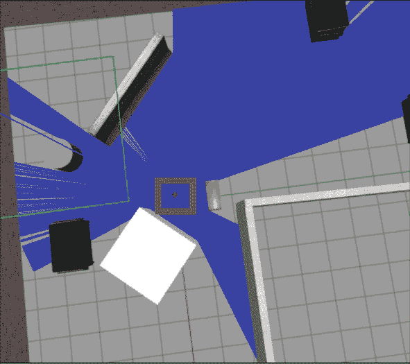

在 Gazebo 环境中，用红色方框突出显示的漫游车示意图。

图 7-5

漫游车现在已生成（在红色方框内）

```py

Listing 7-2
The ai_rover_world.launch File
```

现在，在单独的终端中启动 `slam_gmapping` 地图构建器。`ros.org gmapping_demo.launch` 已被修改以更接近我们的环境和漫游车。源代码在“修改后的 gmapping_demo.launch 文件”部分。

```py
$ roslaunch ai_rover_navigate gmapping_demo.launch
```

### slam_gmapping 启动文件

`slam_gmapping` ROS 节点在漫游车探索其环境的同时处理传感器数据并生成地图。gMapping 文件有几个参数，我们可以在启动文件中设置。其中大部分我们没有修改；下划线参数已更改：

+   **base_frame (默认: “base_link”):** 这是附着在漫游车移动底盘上的框架名称。

+   **map_frame (默认: “map”):** 这是附着在地图上的框架名称。这也是我们在 RViz 中使用的主题名称。

+   **odom_frame (默认: “odom”):** 欧几里得距离测量系统的框架名称。我们为漫游车的物理差动轮驱动编码器或 Gazebo 模拟插件驱动设置欧几里得距离测量系统。

+   **map_update_interval (默认: 5.0):** 等待时间（以秒为单位）直到下一次地图更新。这个数字很重要，因为较短的等待时间可能会导致漫游车或模拟的系统退化。

+   **maxRange (浮点数):** 设置激光的最大范围。将此值设置为 LiDAR 的真实世界范围。

+   **maxUrange (默认: 80.0):** 设置激光的最大可用范围。激光束将在这个距离范围内停止。

+   **minimumScore (默认: 0.0):** 设置最小分数（物体距离）以获得准确的激光读数。

+   **xmin** **(默认: -100.0, 设置: -20):** 地图的最小 x 范围。将 xmin 设置得尽可能接近漫游车将要探索的环境的实际总 x 范围，在我们的案例中是 40 米。因此，我们将 xmin 设置为 -20，xmax 设置为 20 米。

+   **ymin** **(默认: -100.0, 设置: -20):** 地图的最小 y 范围。

+   **xmax** **(默认: 100.0, 设置: 20):** 地图的最大 x 范围。

+   **ymax** **(默认: 100.0, 设置: 20):** 地图的最大 y 范围。

+   **delta** **(默认: 0.05, 设置: -0.01):** 地图的分辨率。

+   **linearUpdate** **(默认: 1.0, 设置: 0.5):** 漫游车必须移动以处理激光读取所需的线性距离（x 方向）。

+   **angularUpdate** **(默认: 0.5, 设置: 0.436):** 漫游车必须移动以处理激光读取所需的角度距离。

+   **temporalUpdate (默认: -1.0):** 等待时间（秒）在激光读取之间。如果此值为 -1.0，则关闭此功能，即连续。

+   **particles** **(默认: 30, 设置: 80):** 过滤粒子数量。

+   **resampleThreshold** **(默认: xx, 设置: 0.5):** 传感器数据频率（秒）。

注意

我们需要确保在每次模拟之前，通过在相同终端上按 CTRL+C 来关闭之前启动的 `slam_gmapping` 节点。

### 准备 slam_gmapping 包

我们必须将我们的 SLAM 处理软件组织成 ROS 包。我们现在将创建一个 ROS `ai_rover_navigation` 包。这个特定的包将包含代码（例如 ROS 节点）、数据、库、图像、文档等。每个 SLAM 程序都将包含在一个 ROS 包中。ROS 包旨在提供适当的功能并鼓励在漫游车中的其他 ROS 系统中重用 `gmapping_demo.launch`。使用以下终端命令创建 `ai_rover_navigation` 包：

```py
$ cd ~/catkin_ws/src
$ catkin_create_pkg ai_rover_navigation std_msgs rospy roscpp
$ cd ~/catkin_ws/src/ai_rover_navigation
$ mkdir launch
$ cd ~/catkin_ws/src/ai_rover_navigation/launch
```

该包有三个依赖项：`std_msgs`、`roscpp` 和 `rospy`。`std_msgs` 是在 ROS 中预定义的通用数据类型。在 ROS 1 中，ROS 库是两个独立由 C++（`roscpp`）和 Python（`rospy`）编写的库。这两个库的功能并不相同，也不等价！SLAM 和 ROS 库都依赖于这两个库。

### 修改 gmapping_demo.launch 文件

从 `ros.org` 网站下载 `gmapping_demo.launch`。

```py
$ gedit gmapping_demo.launch
```

从 ROS 网站修改文件以匹配我们的漫游车参数（列表 7-3）。

```py

Listing 7-3
The gmapping_demo.launch File
```

启动文件的最后一部分将 `gMapping` 包连接到漫游车转换后的激光数据；即数据现在是在全局坐标系中。此启动文件不会在屏幕上显示任何内容。为此，我们需要使用 RViz（从漫游车的视角）和 Gazebo（从操作员的视角）。（我们将在接下来的两个部分中启动此文件。）

### RViz gMapping

要在 RViz 中显示生成的地图，我们需要一个启动文件（`ai_rover_rviz_gmapping.launch`）来连接漫游车传感器、RViz 和地图（列表 7-4）。

```py

Listing 7-4
The ai_rover_rviz_gmapping.launch File
```

由于定义 RViz `mapping.rviz` 参数的代码非常大，它可以在本教材的 GitHub 源代码仓库中找到。`mapping.rviz` 参数的描述也可以在 RViz 配置文件中找到。

要控制探测车，请使用键盘 Teleop 脚本。请记住，要移动机器人，请点击运行 Teleops 程序的适当 terminator 屏幕。当你移动你的探测车时，你应该看到 SLAM gMapping 进程正在使用未探索区域的新特征在 RViz 中更新地图。使用图 7-6 中所示的键盘键来在环境中控制探测车。

要开始手动控制探测车的过程，请使用 Teleops 程序，并使用以下 shell 命令：

```py
rosrun teleop_twist_keyboard teleop_twist_keyboard.py
```

你应该看到类似图 7-7 的内容。`slam_gmapping` ROS 节点使用“对象”（蓝色方块）更新地图。红色线条是潜在的“墙壁”，橙色方块是勇敢的探测车。

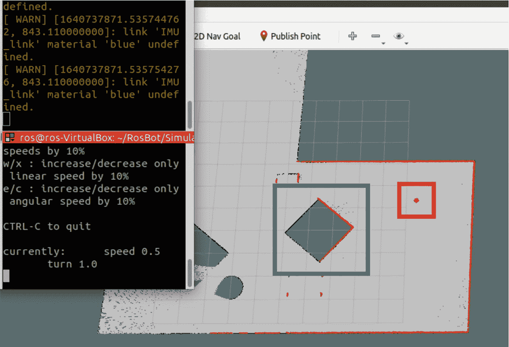

显示地图和带有映射节点的终端的截图。终端上以 r o s 速率突出显示的文本 r o s hyphen virtual box colon tilde slash R o s Bot slash simula。

图 7-7

slam_gmapping 节点在探测车探索时更新地图

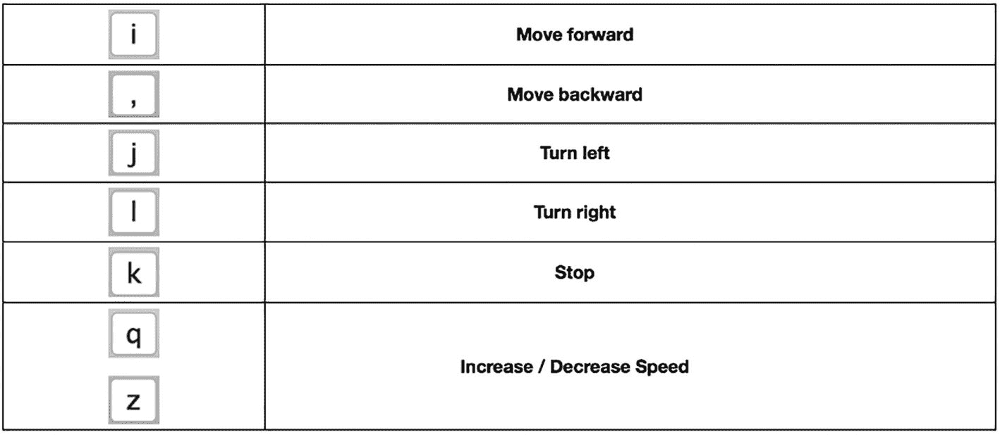

一个带有字母和相应命令的表格。命令如下，i，向前移动；逗号，向后移动；j，向左转；l，向右转；k，停止；q 和 z，增加/减少速度。

图 7-6

移动探测车的基本键盘命令

在完全探索环境后，我们保存生成的地图图像（pgm）和元数据（yaml）。我们通过在 terminator 壳窗口中输入以下命令来完成此操作：

```py
rosrun map_server map_saver -f ~/ai_rover_remastered/maps/test_map
```

将同一目录下的 `test_map.pgm` 转换为 JPG。你现在可以在图像查看器中查看它，例如 gimp（图 7-8）。

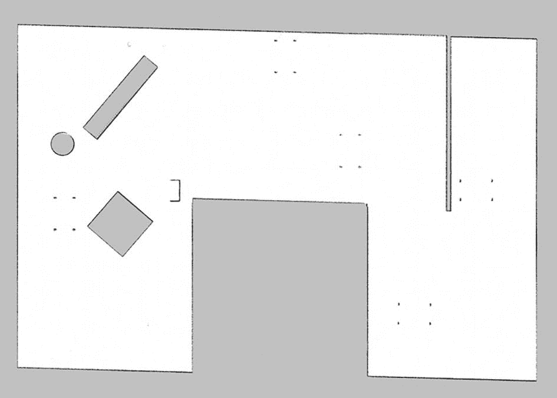

g-mapped 图像文件的截图，它由白色背景和几何切割组成。

图 7-8

最终的 gMapped 图像文件

pgm 文件是地图的“图片”，而 yaml 文件描述了地图的大小。yaml 文件描述将在后面。

## 最终启动终端命令

要开始映射，首先在不同的终端中启动探测车到其环境中。我们通过以下命令来完成此操作。在第一个终端中，我们将探测车启动到环境中（现有隐藏地图）：

```py
$ roscore
$ roslaunch ai_rover_remastered ai_rover_world.launch
```

接下来，我们添加 `gMapping` 包，通过在第二个终端中启动 `slam_gmapping` 地图构建器，使探测车能够探索环境并创建地图：

```py
roslaunch ai_rover_navigate gmapping_demo.launch
```

最后，在第三个终端中，我们打开一个 RViz 窗口：

```py
roslaunch ai_rover_remastered ai_rover_rviz_gmapping.launch
```

你的 RViz 显示应该类似于图 7-9

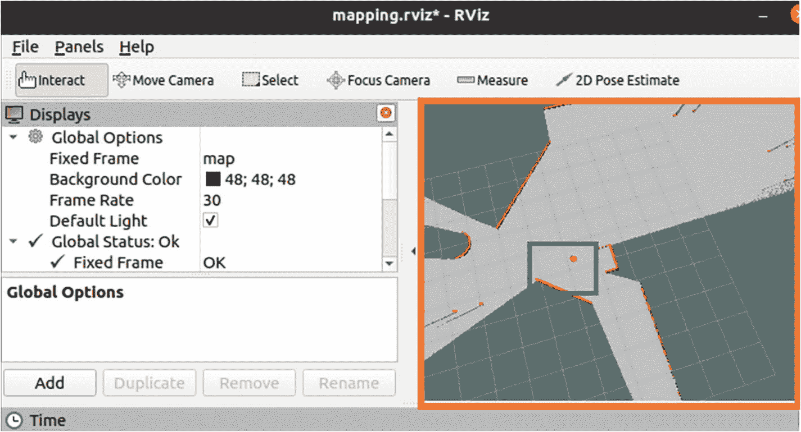

映射标签页的截图，包含交互选项和地图。左侧的交互部分包含显示和全局选项。右侧的地图用红色点表示激光扫描数据。

图 7-9

初始的 Gazebo 中 RViz 与激光扫描数据（红色点）。蓝色框中的红色线条看起来像是一堵墙，但这其实是一个错误

### RViz 映射配置

我们现在将注意力转向 ROS 导航的映射。我们还应该关注成功进行 ROS 映射和环境导航所需的关键组件。我们需要回顾配置 RViz 以显示地图和来自探测车（漫游车）的导航信息和数据的必要条件。我们还将讨论配置 RViz 以启用我们勇敢的探测车成功进行映射和导航所需的条件。我们还将回顾使用我们的探测车创建地图的多种可能性。为什么映射对我们探测车的导航如此关键？因为映射将允许我们的探测车规划路径并避免与未探索环境中的物体发生碰撞。

在探测车的探索任务期间，探测车只能从两个来源访问地图。第一个来源是任务规划器提供给探测车的地图。第二个来源是探测车从传感器（激光雷达）和里程计数据构建其自己的地图。从探测车的传感器（激光雷达）和里程计数据创建地图的过程称为 SLAM（同时定位与建图）过程。我们需要一个非常重要的工具来监控我们勇敢的探测车，那就是 RViz。RViz 是 ROS 图形环境，负责监控探测车和人类操作员之间发送的信息、消息和数据。RViz 作为视觉数据环境的重要性，特别是在映射方面，尤为明显。

现在我们将回顾可视化 `LaserScan` 数据和环境地图所需的步骤。要在 RViz 上可视映射数据，我们需要从探测车获取三个来源或主题。我们需要获取 `LaserScan` 显示、`Odometry` 数据显示和 `Map` 显示作为 RViz 中的选项。我们还需要添加在第四章 4 中首先在 URDF 源文件中开发的机器人描述模型，并在第五章 5 中通过 Xacro 扩展进一步增强了面向对象特性。我们需要显示探测车的机器人描述模型，以便能够看到 `LaserScan` 结果，从而视觉检测任何异常。

我们首先需要执行 `gmapping_demo.launch` 文件，该文件启动 `slam_gmapping` ROS 节点。我们需要首先运行这个 ROS 节点，以便获取地图所需的消息和数据源。以下是为启动映射过程所需的终端命令：

```py
$ cd ~/{primary user-defined rover directory}
$ source devel/setup.bash
$ catkin_make
First Terminator Shell Window Enter (From Chapter 5):
$ roslaunch ai_rover_remastered ai_rover_world.launch
Second Terminator Shell Window Enter:
$ roslaunch ai_rover_remastered_navigation gmapping_demo.launch
Third Terminator Shell Window Enter:
$ rosrun rviz rviz
```

注意

如果您在 `rosrun rviz rviz` 命令中遇到问题，您需要使用 RViz 启动文件 `ai_rover_remastered_rviz.launch` 从第五章导入我们勇敢的罗弗所需的机器人描述模型。在那里，您可以导入我们罗弗的正确机器人描述模型。使用 `roslaunch ai_rover_remastered ai_rover_remastered_rviz.launch` 启动 RViz。

如果您成功启动了第五章中的 `ai_rover_remastered_rviz.launch` 文件，那么您将在 RViz 中看到以下图示（图 7-10）。

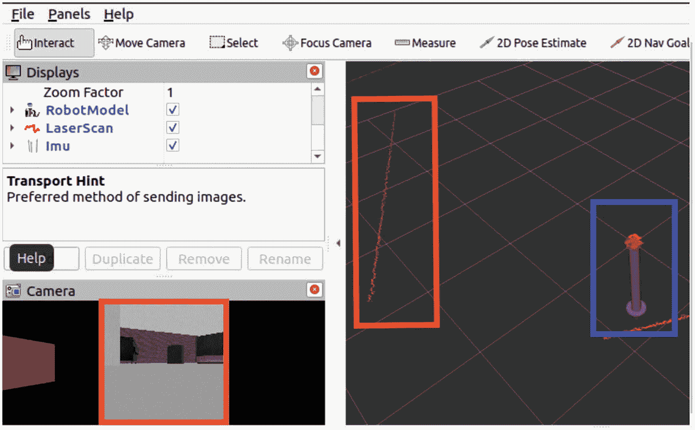

带有交互选项、相机和地图的映射选项卡截图。左上角的交互部分包含显示和传输提示选项。交互部分下面的相机选项突出显示了一个橙色框内的视觉。右边的地图包含两个矩形框，左边是红色，右边是蓝色。

图 7-10

成功启动 RViz 环境，其中包括我们勇敢的罗弗和传感器数据显示框（相机–橙色，LaserScan–红色，和 IMU–蓝色）

### 检查 LaserScan 配置

首先，我们必须检查 `LaserScan` 显示以检查是否有任何显示错误。如果在 `ROS.org` 和其他支持网站上发现错误，请搜索类似解决方案。在 RViz 中检查显示选项，并选择 `LaserScan` 选项（图 7-11）。您应该看到我们拥有正确的 `LaserScan` 主题 `/ai_rover_remastered/laser_scan/scan`。罗弗的 `RobotModel` 显示也包括在内。我们修改了 `LaserScan` 的大小（以米为单位等）。有关 `LaserScan` 主题的更多信息，请访问：[`http://wiki.ros.org/laser_pipeline/Tutorials/IntroductionToWorkingWithLaserScannerData`](http://wiki.ros.org/laser_pipeline/Tutorials/IntroductionToWorkingWithLaserScannerData)。

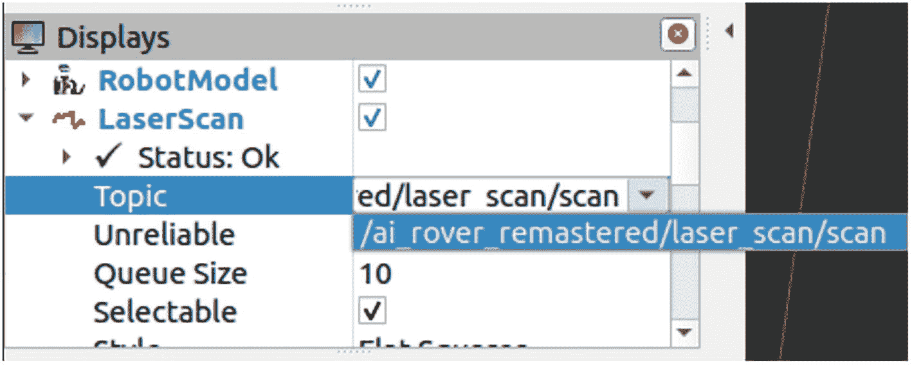

显示选项卡的截图。显示列表了各种选项，其中选择了主题，并从下拉选项中选择斜杠 a i 下划线 罗弗 下划线 重制 下划线 激光 下划线 扫描 下划线 扫描选项。 

图 7-11

拥有正确主题 /ai_rover_remastered/laser_scan/scan 的 LaserScan RViz 选项。主题在 ai_rover_remastered.xacro 文件中定义

### 检查映射配置

如果我们将罗弗正确导入 RViz，我们还应该看到罗弗正在探索的 Gazebo 世界。为此，我们必须转到 RViz 中的显示选项，并选择位于显示选项底部左边的添加按钮。点击添加按钮，并添加地图显示选项。然后我们转到地图显示属性，并将我们的主题设置为 `/map`。现在我们将在 RViz 中可视化由 `slam_gmapping` ROS 节点生成的灰色地图、罗弗上 RGB 相机的原始图像以及 IMU 数据（图 7-12）。

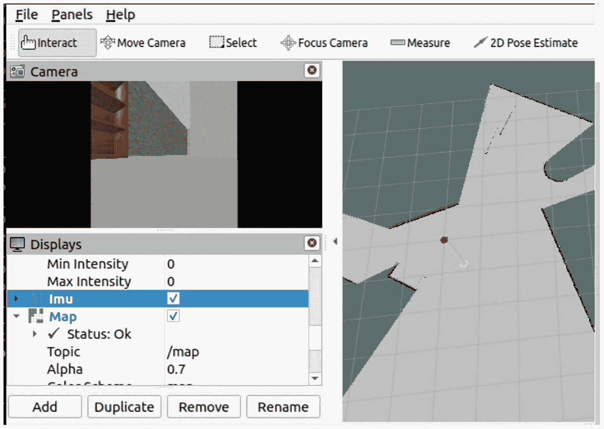

映射标签页的截图，包含交互选项和 R viz 环境的 g-map。左侧的交互部分包含一个摄像头和显示选项。在显示中，选中了 i m u 选项。

图 7-12

摄像头、激光扫描、IMU 以及现在在 RViz 中显示的灰色 slam_gmapping ROS 节点映射信息。我们的漫游车正变得越来越复杂，并能够进行自主导航。

现在，让我们通过更改各种 RViz 显示的一些元素来检查 RViz 的另一个功能，以可视化 Gazebo 模拟的不同方面。我们可以修改激光扫描的角度、扫描次数等。所有这些更改都可能影响生成的映射。请尝试修改摄像头、激光扫描和 IMU 主题显示的属性值作为练习。我们在 RViz 中有一个完全工作的 `slam_gmapping` ROS 节点，显示映射数据。我们现在必须保存我们的 RViz 配置以供未来的实验使用。

### 保存 RViz 配置

RViz 还可以非常快速地保存并发机器人描述和传感器主题配置。RViz 的这一功能使我们能够快速在以后的时间恢复我们的配置。以下是我们保存 RViz 配置的步骤：

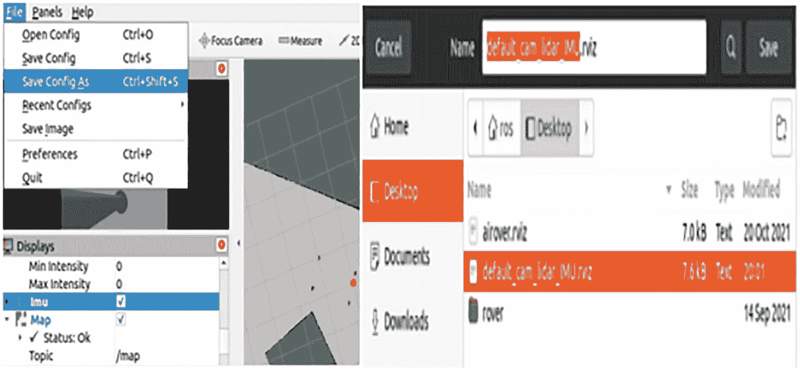

两个显示的截图。左侧显示包含一个文件标签页，其中选择了“保存配置为”选项，文件标签页下方是显示部分，其中选中了 i m u。右侧显示包含桌面标签页，其中选中了默认 cam lidar I M U r viz 文件。

图 7-13

左侧显示中突出显示了“保存配置为”选项。右侧显示在桌面上保存了 default_cam_lidar_IMU.rviz。

+   首先，转到 RViz 环境屏幕的左上角并选择文件菜单。

+   第二步，使用鼠标左键选择“保存配置为”。您还需要将配置文件保存为 `default_cam_lidar_IUM.rviz` 在桌面上。一旦将此文件保存到桌面上，您就可以将其移动到 `ai_rover_remastered` ROS 软件包下的 `/rviz` 文件夹中。参见图 7-13 中的步骤一和二。

我们现在已将 `default_cam_lidar_IMU.rviz` 文件保存并移动到 `ai_rover_remastered` ROS 软件包目录下的正确 `/rviz` 文件夹中。我们应该测试是否可以以正确的配置启动 RViz。为了测试 RViz 配置是否确实已正确保存，请通过在每个终端中输入 CTRL+C 来退出所有当前运行的终端。一旦终端停止，我们可以继续并重新输入以下终端命令：

```py
$ cd ~/{primary user-defined rover directory}
$ source devel/setup.bash
$ catkin_make
First Terminator Shell Window Enter (From Chapter 5):
$ roslaunch ai_rover_remastered ai_rover_world.launch
Second Terminator Shell Window Enter:
$ roslaunch ai_rover_remastered_navigation gmapping_demo.launch
Third Terminator Shell Window Enter:
$ rosrun rviz rviz
```

一旦 RViz 运行，我们就可以打开它并重新打开我们保存的 RViz 配置文件。我们可以按照以下步骤进行：

+   首先，转到 RViz 环境屏幕的左上角并选择文件菜单。

+   第二步，使用鼠标左键选择并点击“**打开配置**”。然后，在桌面上打开 `default_cam_lidar_IUM.rviz`。然后，你的配置文件将打开，包括 RViz 中的所有传感器、主题和映射生成。

注意

如果你再次遇到 `rosrun rviz rviz` 命令的问题，你再次需要使用 RViz 启动文件 `ai_rover_remastered_rviz.launch` 从第五章节导入我们勇敢的漫游车所需的机器人描述模型。在那里，你导入漫游车的正确机器人描述模型。使用 `roslaunch ai_rover_remastered ai_rover_remastered_rviz.launch` 启动 RViz。我们还需要通过将其添加为主题并选择主题名称为 `/map` 来重置我们的地图。这一操作在图 7-14 中有说明。

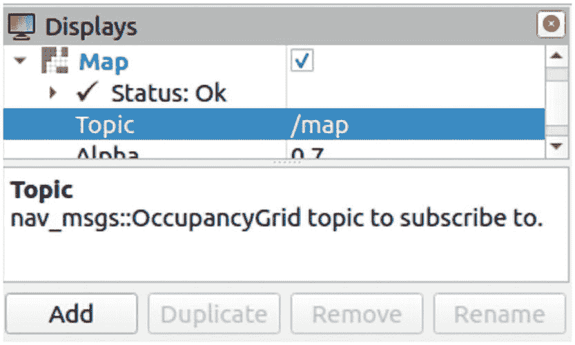

屏幕截图显示，在主题选项下选择了主题。在主题下，导航消息读取为订阅的占用网格主题。底部有一个添加按钮。

图 7-14

我们正在使用主题 /map 重置我们的地图显示（如果需要的话）

好的。现在我们已经正确配置了 RViz，我们需要通过在 Terminator shell 程序中打开另一个 shell 并再次输入以下命令来执行我们的 `teleops_twist_keyboard` 命令：

```py
$ rosrun teleop_twist_keyboard teleop_twist_keyboard.py
```

一旦启动此程序，你应该能够通过键盘手动控制漫游车来探索环境。可能会有一些你无法探索的区域。不要担心这个问题。探索你可以测绘的区域。同时，请注意通过比较地图中开发的功能和 Gazebo 环境生成的地图。你想要确保地图上没有“幽灵”、异常或缺失的区域。地图上的缺失区域可能会阻止漫游车探索整个环境。

### 额外的 Noetic SLAM 信息

在我们使用 Noetic ROS 审查额外的映射功能之前，我们应该记住两个基本事项，SLAM 和`slam_gmapping` ROS 节点。SLAM 是负责在同时跟踪探测车在相同环境中位置的同时构建环境地图的算法。SLAM 算法解决了探测车的映射和定位的“先有鸡还是先有蛋”的问题。ROS Noetic 使用 gMapping 算法作为`slam_gmapping` ROS 节点，以避免机器人开发者再次开发相同的算法。将`slam_gmapping`封装为我们 SLAM 中的对象，使我们能够使用探测车在环境中移动提供的激光雷达和里程计姿态数据。`slam_gmapping` ROS 节点订阅`LaserScan`和里程计主题，转换探测车的尺寸，并创建占用栅格地图（OGM）。占用栅格地图是一个二维或三维的单元格数组，每个单元格存储一个数字。在我们的勇敢探测车的情况下，我们只会使用数字单元格的二维数组。每个单元格中的数字表示单元格包含障碍物的概率可能性。数字范围从 0（空闲空间）到 100（100%占用）。激光雷达未扫描的区域标记为-1。这些是我们启动`gmapping_demo.launch`文件时创建的项目。然而，如果以下五个条件中的任何一个发生，`gmapping_demo.launch`可能会出现潜在的映射问题和失败：

1.  如果在操作过程中，物理探测车的激光雷达系统从探测车上脱落或不再位于探测车的中心，将会发生映射错误。如果发生这种情况，请将激光雷达放回探测车 URDF 或 Xacro 规范描述文件中指定的原始位置。

1.  如果在 Gazebo 和 RViz 中的探测车模型与物理探测车（GoPiGo3）不同，将会发生映射错误。务必确保模拟探测车的尺寸和惯性矩与实际物理探测车非常接近。未能做到这一点将导致探测车的 tf、激光雷达和里程计信息在现实世界探测车中无法重现。

1.  我们需要对探测车的 URDF 或 Xacro 文件和插件进行多项更改，以反映探测车特征或传感器（如激光雷达）的任何变化。我们需要更新任何更改或受影响的传感器或主题，例如在 RViz 中使用。

1.  如果我们突然将主激光雷达传感器替换为不同的传感器，例如雷达或双目摄像头，并且不对底层的 URDF、Xacro 或插件文件进行任何更改，将会发生映射错误。

1.  如果我们使用与我们在 Gazebo 模拟中使用的 Hokuyo 激光雷达具有不同特性的其他物理激光雷达传感器系统，可能会发生映射错误。物理和模拟激光雷达之间的差异可能包括扫描速率、角度扫描、频率参数等。所有这些细微的激光雷达差异都可能导致映射异常。

### 地图服务器 ROS 节点

ROS 内部还包含另一个关键组件，即 `map_server` 节点。该 ROS 节点以 ROS 服务的形式提供地图数据。此节点还允许将生成的地图保存到文件中。此 ROS 节点还向任何请求的 ROS 节点提供地图数据。例如，一个处理导航的 ROS 节点可以请求最新的可用地图。`move_base` ROS 节点最终确定获取最新地图数据以进行路径规划或定位我们的漫游车在环境中的请求。以下是一个提供我们生成的地图占用网格数据的 ROS 服务：`static_map (nav_msgs/GetMap)`。

除了通过前面的服务请求地图外，还有两个可以连接以获取带有地图的 ROS 消息的已锁定（或最后保存的）主题。这些保存的主题可以提供之前保存的消息，即使没有更多的地图数据。此节点写入地图数据的主题如下：

+   `map (nav_msgs/OccupancyGrid)`: 该主题提供地图占用数据。

+   `map_metadata (nav_msgs/MapMetaData)`: 提供地图元数据

### 地图图像保存或修改

我们将回顾如何保存和修改 ROS Noetic SLAM 生成的地图。我们将使用 `map_server` 软件包来保存、处理和修改由 `slam_gmapping` ROS 节点生成的地图。`map_server` ROS 软件包还包括 `map_saver` ROS 节点，允许我们使用 ROS 服务来保存和修改地图数据。`map_saver` ROS 软件包保存当前地图和占用网格，并创建两个文件。第一个创建的文件是 `map.pgm` 文件，其中包含地图数据，包括占用网格数据（空闲空间、障碍物[s]和未知）。第二个创建的文件是 `map.yaml` 文件，其中包含占用网格的元数据和地图的图像名称。我们已经介绍了保存地图的过程。然而，现在我们将详细说明由 `map_server` ROS 软件包生成的这两个基本文件。

再次，我们应该 `source devel/setup.bash, catkin_make` `编译`，并在 Terminator 中像之前一样，在每个独立的终端 shell 中启动 `ai_rover_remastered_gazebo.launch, gmapping_demo.launch`, `ai_rover_remastered_rviz.launch`，以及 `teleops_keyboard_twist` 脚本文件。这些单独的命令和打印列表可以在图 7-15 中看到。

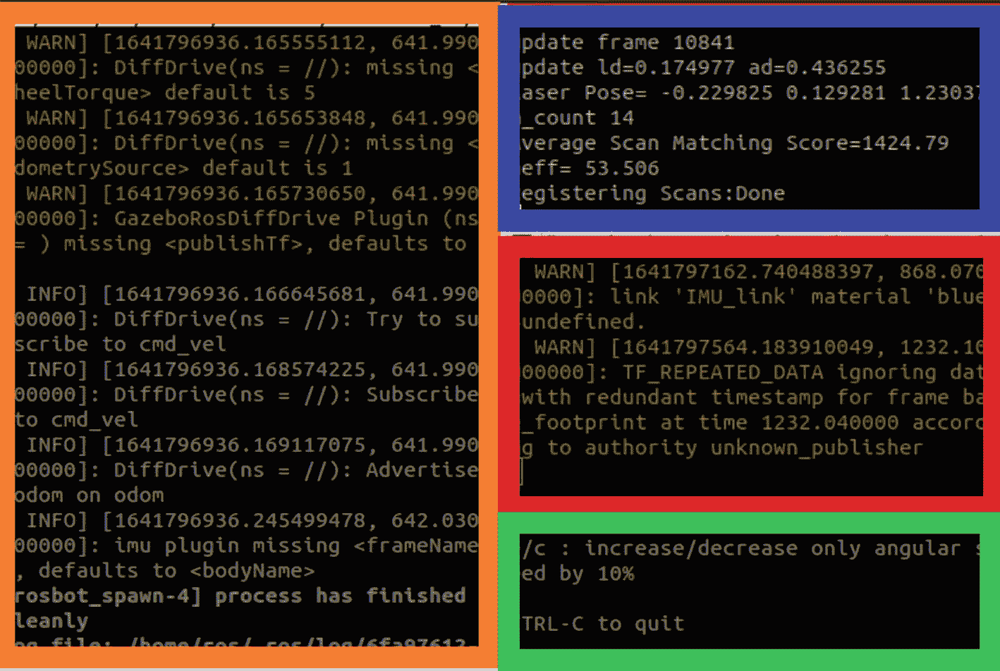

四个终端的截图，分别由不同颜色的框架分隔。橙色，AI 漫游车重制 gazebo 启动；蓝色，g mapping 示例启动；红色，AI 漫游车重制 rviz 启动；绿色，遥控键盘扭曲。

图 7-15

终端运行 ai_rover_remastered_gazebo.launch（橙色），gmapping_demo.launch（蓝色），ai_rover_remastered_rviz.launch（红色），以及 teleops_keyboard_twist（绿色）

通过这种方式，我们可以在 `/src` 根目录下使用一个额外的独立终端来保存地图，并输入以下 shell 命令：

```py
$rosrun map_server map_saver -f rover_map
```

此命令将在主 `/src` 根目录下创建 `rover_map.pgm` 和 `rover_map.yaml` 文件。

### rover_map.pgm 地图图像文件数据

我们需要检查上一节生成的 `rover_map.pgm` 文件。我们必须执行以下步骤：

1.  在主 `/src` 目录下保存 `rover_map.pgm` 文件。

1.  如果您没有 Gimp 图像编辑器，请安装它。使用 Gimp 图像编辑器打开主 `/src` 目录中存储的图像。打开文件的终端命令如下：

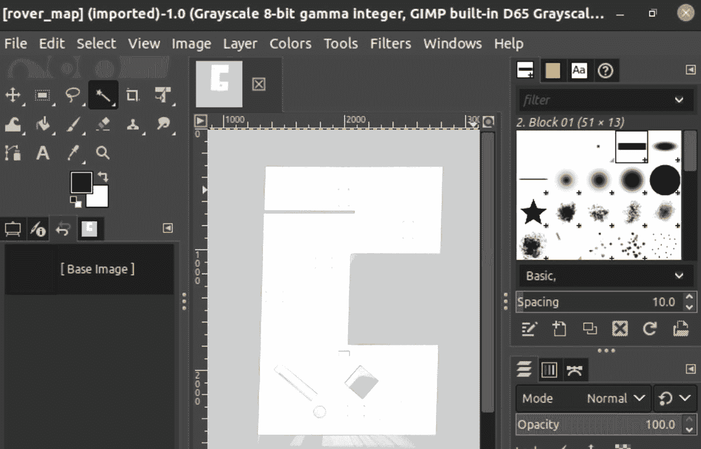

G I M P 图像编辑器中带有 rover 地图 P G M 文件的截图。

图 7-16

使用带有 rover_map.pgm 文件的 Gimp 图像编辑器

1.  现在，您可以可视化、修改并保存图像（如果需要的话）。`rover_map.pgm` 可以在图 7-16 中看到。

```py
$ sudo apt-get install gimp
$ gimp rover_map.pgm
```

`rover_map` 图像描述了整个世界的占用网格，以对应像素的（白色、黑色或深灰色）颜色。彩色和灰度图像是兼容的，但大多数地图是白色、黑色和深灰色（即使这些 PGM 图像可能以彩色存储）。白色像素是空闲空间，黑色像素是障碍物，任何介于两者之间的深灰色像素都是未扫描区域。

当通过 ROS 主题消息通信时，每个占用网格元素表示为从 0 到 255（8 位）的数字范围，其中 0 表示空闲空间，255 表示完全占用。

### rover_map.yaml 地图文件元数据

要查看上一节生成的 `rover_map.yaml` 文件，请转到主 `workspace /src` 文件夹，查看是否存在 `rover_map.yaml` 文件。您需要使用简单的文本编辑器来查看此文件。您可以通过输入以下命令查看 `rover_map.yaml` 文件中的信息：`$vi rover_map.yaml`。`rover_map.yaml` 文件的数据内容可以在图 7-17 中看到。

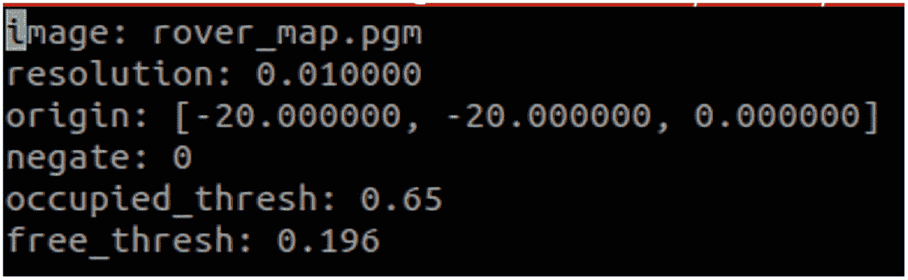

生成的 rover 地图 Y A M L 文件的截图。详细信息如下。图像：rover_map.pgm；分辨率：0.010000；原点：-20, -20, 0；取反：0；占用阈值：0.65；空闲阈值：0.196。

图 7-17

生成的 rover_map.yaml 文件

此外，当您启动以下终端命令——`$ rosrun map_server map_server rover_map.yaml`——您将处理并接收地图元数据，并能够检查 ROS 主题，如图 7-18 所示。

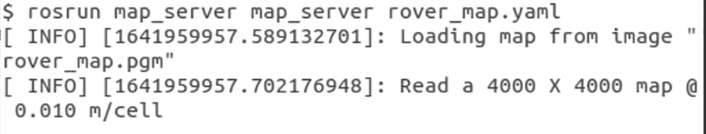

rover 地图 Y A M L 文件元数据的截图。文件上的文本如下。$rosrun map_server map_server rover.yaml，等等。

图 7-18

rover_map.yaml 的 ROS 主题元数据

我们然后在 `rover_map.yaml` 中有以下内容：

+   **图像**：包含生成地图图像的文件名（`rover_map.pgm`）。

+   **Resolution:** 地图的分辨率（以米/像素为单位）。

+   **Origin:** 地图左下角像素的坐标。这些坐标以 2D（x,y）形式给出。因此，我们的坐标设置为 x 为-20.0，y 为-20.0。第三个值表示旋转。值为零表示没有旋转。

+   **Occupied_Thresh:** 值大于此（0.65 或物体存在的概率为 65%）的像素将被视为障碍物。

+   **Free_Thresh:** 值小于此（0.196 或物体存在的概率为 19.6%）的像素将被视为空闲空间。

+   **Negate:** 反转地图的颜色。默认情况下，白色表示完全空闲，黑色表示危险或存在障碍物。

### ROS 数据包

现在，我们可以看到 Noetic ROS 还允许我们在机器人探索环境时实时创建地图。这个过程就是为什么我们在进行区域映射时移动机器人（缓慢且避免急转弯），因为数据处理发生在映射过程中。制作地图基于发布的激光雷达和转换（里程计）主题。如果我们需要提取这些主题的发布数据，我们需要使用数据包文件将提取的数据发布到地图中。数据包是 ROS 在机器人任务期间存储 ROS 消息数据的一种文件格式。有关 ROS 数据包的更多信息，请参阅以下链接：[`http://wiki.ros.org/Bags`](http://wiki.ros.org/Bags)。生成数据包文件数据的地图有两个步骤。

我们首先采取行动创建实际的主题数据包文件。在继续之前，请使用 CTRL+C 命令关闭所有终端中的所有终端进程。然后我们需要在单独的终端中启动`ai_rover_remastered` Gazebo 模拟和`teleops_keyboard_twist`程序。因此，在终端一中，我们有以下命令：

```py
$ cd ~/catkin_ws
$ source devel/setup.bash
$ catkin_make
$ cd ~/catkin_ws/ai_rover_remastered
$ roslaunch ai_rover_remastered_description ai_rover_remastered_gazebo.launch
```

然后我们启动终端二，其中包含以下命令：

```py
$ cd ~/catkin_ws
$ source devel/setup.bash
$ catkin_make
$ rosrun teleop_twist_keyboard teleop_twist_keyboard.py
```

然后我们启动终端三，其中包含以下命令：

```py
$ cd ~/catkin_ws
$ source devel/setup.bash
$ catkin_make
$ rostopic list
```

现在，我们应该在环境中控制机器人，我们应该小心不要快速转弯，以便正确收集数据包文件中的发布数据。请确保在整个映射过程中机器人重叠其起点和终点。通过输入之前的`rostopic`命令（不是完整的`rostopic`列表），我们应该得到以下主题列表：

```py
/ai_rover_remastered/laser_scan/scan
/clock
/cmd_vel
/gazebo/link_states
/gazebo/model_states
/gazebo/parameter_descriptions
/gazebo/parameter_updates
/gazebo/performance_metrics
/gazebo/set_link_state
/gazebo/set_model_state
/imu
/odom
/rosout
/rosout_agg
/tf
```

我们需要确保我们勇敢的机器人仍然为粗体字`LaserScan`和`tf`主题发布有效数据。现在，我们使用 Teleops 程序控制我们的机器人，我们需要开始将`LaserScan`和`tf/transforms`数据记录到我们之前创建的数据包文件中。

一旦我们有了数据包文件，我们就可以构建我们的地图。我们需要启动`slam_gmapping`节点，该节点将处理主题`/ai_rover_remastered/laser_scan/scan`的激光扫描。我们使用以下命令来完成此操作：

```py
$ rosbag record -O roverlaserdata /ai_rover_remastered/laser_scan/scan /tf
```

在另一个终端中，我们运行以下命令：

```py
$ rosrun gmapping slam_gmapping scan:= ai_rover_remastered/laser_scan/scan
```

然后我们打开另一个终端并输入以下内容：

```py
$ rosbag play roverlaserdata
```

我们需要使用`map_server`来创建必要的地图文件（`.pgm`和`.yaml`），以生成地图。现在我们将输入以下命令来创建地图：

```py
$ rosrun map_server map_saver -f rovermap
```

### ROS Bag 的重要性

ROS 的“rosbag”工具集的目的是记录、存储和回放我们的探测车发送和接收的数据。这些数据可能包括激光雷达、雷达、摄像头图像和`teleop_twist_keyboard`命令。以下是一些使用这些存档传感器数据的多个应用示例：

+   存档的传感器数据可以在模拟中重建环境。这些数据有助于调试目的。

+   存档的传感器数据有助于机器学习，例如训练用于感知和认知的神经网络。

+   存档数据可用于确定自主探测车灾难性事件的因果关系。

## 定位（寻找失踪的探测车）

让我们现在找到我们勇敢的探测车的位置。为了正确且安全地使用探测车进行导航，我们需要知道探测车的位置和朝向。它的朝向就是它面对的方向。我们需要地图来让探测车自主导航，但如果没有知道探测车在 SLAM 生成的地图中的位置和方向，那么地图就毫无价值。让我们看看一个快速定位的演示。最广泛使用的定位算法是自适应蒙特卡洛定位（AMCL）算法。最终，我们将需要基于 AMCL 构建脚本程序，以便让探测车在地图上定位自己。

## 自适应蒙特卡洛定位（AMCL）

作为 SLAM 基础的自适应蒙特卡洛定位（AMCL）算法基于粒子滤波。我们将简要描述，但本质上粒子滤波会发送出许多粒子或样本，覆盖整个搜索空间。粒子的数量有助于减少由 SLAM 产生的布局和边界的不确定性。搜索空间是我们探测车试图绘制和探索的环境。有关粒子滤波或自适应蒙特卡洛定位算法的更多信息，请参阅以下参考资料：

[粒子滤波](https://en.wikipedia.org/wiki/Particle_filter)

[自适应蒙特卡洛定位](https://roboticsknowledgebase.com/wiki/state-estimation/adaptive-monte-carlo-localization/)

现在，AMCL 算法是如何为我们漫游车的定位工作的呢？要使用 AMCL 进行定位，我们首先需要我们环境的地图。这个地图与图 7-22 中生成的地图相同。我们可以将漫游车设置到某个已知位置，在这种情况下，我们手动定位它，或者让机器人从没有初始位置估计开始。通过手动定位漫游车，我们将漫游车放置在一个精确的位置，激光扫描与地图边界轮廓重叠。随着机器人向前移动，我们生成额外的读数，这些读数估计了运动命令后的机器人姿态。通过重新加权这些样本并归一化权重来整合传感器读数。通常，添加一些随机均匀分布的样本是有益的，因为它有助于机器人在失去位置跟踪时恢复。在这些情况下，如果没有这些随机样本，机器人将无法从错误的分布中重新采样，并且永远不会恢复。由于在地图中可能存在由于地图对称性导致的歧义，因此滤波器需要多次传感器读数才能收敛。它给出了多模态后验信念（图 7-19）。

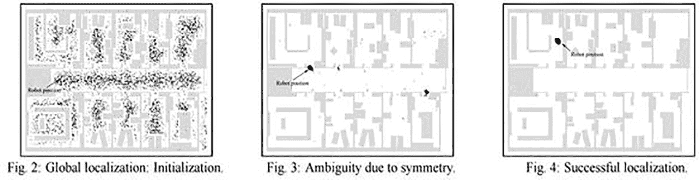

标有 2、3 和 4 的三个 g-maps 图形表示随机样本的分布。图 2，全局定位，初始化；图 3，由于对称性导致的歧义；图 4，成功定位。

图 7-19

随机样本的分布

在地图上从一种姿态（位置和方向）导航到另一种姿态对于定位漫游车是至关重要的。现在我们可以在地图上定位我们的漫游车，我们可以为我们的勇敢漫游车配置定位系统并确定其当前姿态。我们现在将检查用于 `amcl_demo.launch` 的所有可能的参数：所有 SLAM gMapping 启动、YAML 和脚本文件都可以在本次发表的 GitHub 账户中找到。AMCL 节点也非常可配置，我们可以轻松地用不同的值定义每个参数。此外，除了在 `amcl_demo.launch` 文件中设置这些参数外，我们还可以在由 `amcl_demo.launch` 文件引用的单独的 YAML 文件中设置这些参数。

我们现在将为 `amcl_demo.launch` 文件定义一般、滤波器和激光参数：

+   **odom_model_type** (默认: "diff"): 使用漫游车的里程计模型。可能的选项有 "diff"、"omni"、"diff-corrected" 或 "omni-corrected”。

+   **odom_frame_id** (默认: "odom"): 里程计坐标系。

+   **base_frame_id** (默认: "base_link"): 漫游车的基础坐标系。

+   **global_frame_id** (默认: "map"): 指示定位系统发布的坐标系名称。

+   **use_map_topic** (默认: false): 指示节点是否从主题或服务调用中获取地图数据。

+   **min_particles** (默认: 100): 设置滤波器允许的最小粒子数。

+   **max_particles** (默认: 5000): 设置滤波器允许的最大粒子数。

+   **kld_err** (默认: 0.01): 设置真实分布和估计分布之间的最大误差。

+   **update_min_d** (默认: 0.2): 设置机器人执行滤波器更新所需的线性距离（以米为单位）。

+   **update_min_a** (默认: π/6.0): 设置机器人执行滤波器更新所需的角距离（以弧度为单位）。

+   **resample_interval** (默认: 2): 设置在重新采样之前所需的滤波器更新次数。

+   **transform_tolerance** (默认: 0.1): 将发布的变换向后推迟的时间（以秒为单位），以指示此变换对未来有效。

+   **gui_publish_rate** (默认: ˗1.0): 用于可视化的扫描和路径发布的最大速率（以赫兹为单位）。如果此值为 ˗1.0，则此功能被禁用。

+   **laser_min_range** (默认: ˗1.0): 考虑的最小扫描范围；˗1.0 将导致使用激光器报告的最小范围。

+   **laser_max_range** (默认: ˗1.0): 考虑的最大扫描范围；˗1.0 将导致使用激光器报告的最大范围。

+   **laser_max_beams** (默认: 30): 更新滤波器时，每个扫描中使用的均匀分布的光束数量。

+   **laser_z_hit** (默认: 0.95): 模型中`z_hit`部分的混合权重。

+   **laser_z_short** (默认: 0.1): 模型中`z_short`部分的混合权重。

+   **laser_z_max** (默认: 0.05): 模型中`z_max`部分的混合权重。

+   **laser_z_rand** (默认: 0.05): 模型中`z_rand`部分的混合权重。

### 配置 AMCL ROS 节点

在概念层面，AMCL 软件包维护所有可能机器人姿态的集合上的概率分布，并使用里程计和激光测距仪的数据更新此分布。

AMCL 软件包在实现层面使用粒子滤波来表示概率分布。该滤波器是“自适应”的，因为它会动态调整滤波器中的粒子数量：当探测器的姿态非常不确定时，它会增加粒子数量；当探测器的姿态确定良好时，它会减少总粒子数。这个“绿色箭头云”可以通过 RViz 中探测器周围绿色箭头的大小变化来观察，随着探测器不确定性的增加或减少，绿色箭头会变大或变小。在图 7-20 中，将有两个 RViz 窗口，环境地图、该地图上的探测器以及许多绿色箭头。这些绿色箭头代表了对地图上探测器的估计。绿色箭头是定位算法为了确定地图上探测器的位置所做的估计。当移动机器人时，绿色箭头会集中在最可能的探测器位置。该软件包还需要一个预定义的环境地图，以便与观察到的传感器值进行比较。这种比较使机器人能够在处理速度和定位精度之间进行权衡。

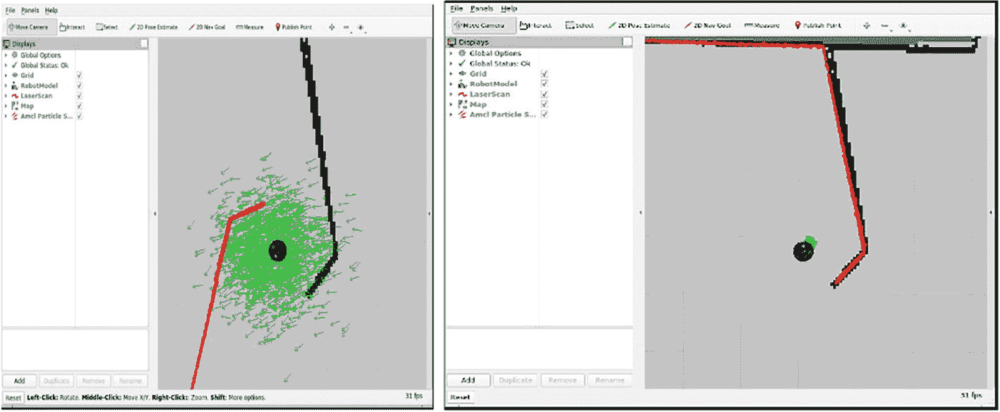

g-maps 的两组截图。在左侧，地图中有一个绿色的云，中心有一个黑色的小点。从下方有一条红色线条，从上方有一条黑色线条穿过云。在右侧，地图中心有一个黑色的小点，周围有绿色的块状区域。从上方有一条红色和一条黑色线条穿过云。

图 7-20

在左侧，我们可以看到探测车的激光扫描（红色），大量绿色的箭头“云”，以及地图边界的轮廓（黑色）。在右侧，我们可以看到一旦我们为探测车确定了正确的姿态，并且激光扫描与地图边界重叠，我们绿色的箭头“云”的不确定性就会最小化。

您可以通过提供探测车在地图上的位置来更有效地帮助探测车定位。为此，请转到 RViz 地图窗口。然后，按下 2D 姿态估计按钮，进入地图，并指向探测车的大致位置。AMCL 包可以自主确定探测车的位置，无需手动放置探测车，但手动放置探测车并指定其大致姿态（位置和方向）是一种更有效的时间利用方式，并允许 AMCL 包更快地收敛。

尽管 AMCL 包开箱即用效果良好，但根据对平台和传感器的了解，可以优化各种参数。配置这些参数可以提高 AMCL 包的性能和精度，并减少探测车在导航过程中进行的恢复旋转。

可以配置 AMCL 节点的三个 ROS 参数：整体滤波器、激光模型和里程计模型。这三个参数在我们的演示`amcl.launch`文件中进行编辑和定位。

这里是一个示例**非工作**启动文件。我们将在下一个源代码列表中开发`amcl_demo.launch`文件（列表 7-5）。以下启动文件仅是 AMCL 算法使用的参数的示例。通常，您可以将许多参数保留在默认值。

```py
`

-->

Listing 7-5
Nonworking amcl_demo.launch File
```

`AMCL_demo.launch`文件的目的在于展示一个包含所有可能参数的非工作启动文件。我们现在将开发一个实际的**工作**`amcl_demo.launch`文件（列表 7-6），它使用之前`amcl_demo.launch`文件中列出的某些参数。请注意，此操作版本的`amcl_demo.launch`还启动了第二个节点。这个第二个 ROS 节点是`move_base`节点。该节点负责探测车的局部和全局成本图。这些成本图将使我们具备导航和避障能力。我们将在**“为探测车编程目标位置”**部分中回顾和应用导航堆栈`move_base`和成本图的能力。用于定位探测车的**工作**`amcl_demo.launch`文件使用以下脚本。

```py

Listing 7-6
Working amcl_demo.launch File
```

### 定位和 AMCL 的重要性

在环境中，漫游者的定位至关重要。然而，我们需要知道在 ROS 中定位和导航的含义。例如，我们需要了解允许我们的 ROS 在环境中定位漫游者的内部机制，这也为 ROS 导航奠定了基础。漫游者的定位问题特别关键，因为漫游者在环境地图中移动。ROS 需要知道漫游者的位置和方向，因为没有这些属性，导航是不可能的。ROS 对漫游者的定位也依赖于漫游者连续的传感器读数流。这些读数允许我们随着时间推移不断减少漫游者姿态（位置和方向）的不确定性。我们将看到 RViz 和 AMCL 节点如何减少漫游者姿态的不确定性。

### 在 RViz 中可视化 AMCL

在 ROS 中，第一个行动项目是在开始另一个模拟之前，使用 CTRL+C 命令关闭或终止所有终端中的所有进程。这一行动对于防止 ROS 发生异常至关重要。一旦我们停止了任何运行的终端，我们就可以在 Terminator 中第一个打开的终端上使用以下命令开始漫游者 Gazebo 模拟：

```py
$ cd ~/catkin_ws
$ source devel/setup.bash
$ catkin_make
$ cd ~/catkin_ws/ai_rover_remastered
$ roslaunch ai_rover_remastered_description ai_rover_remastered_gazebo.launch
```

我们需要在单独运行的终端中执行实际的 AMCL 启动文件来启动 **AMCL** 节点。我们需要这个节点运行以可视化姿态数组。我们使用以下终端命令启动 AMCL ROS 节点：

```py
$ cd ~/catkin_ws
$ source devel/setup.bash
$ catkin_make
$ cd ~/catkin_ws/ai_rover_remastered
$ roslaunch ai_rover_remastered_navigation amcl_demo.launch
```

现在我们已经启动了 `amcl_demo.launch` 脚本文件，我们可以开发一个 RViz 启动文件，该文件将启动 RViz 环境，并具有显示 `amcl_demo.launch` 程序结果的正确连接。我们在 Terminator 的第三个终端中使用以下命令开发此启动文件：

```py
$ cd ~/catkin_ws
$ source devel/setup.bash
$ catkin_make
$ cd ~/catkin_ws/ai_rover_remastered
$ cd launch
$ gedit ai_rover_remastered_amcl_rviz.launch
```

我们现在已经开发了 `ai_rover_remastered_amcl_rviz.launch` 文件。这个文件与第五章中的 RViz 启动文件类似。它允许我们在 RViz 中设置航点，以便漫游者能够自主跟随。此外，我们还将看到 RViz 节点有一个名为 `$(find ai_rover_remastered)/rviz/amcl.rviz.` 的配置文件。`amcl.rviz` 文件设置了 RViz 处理来自 `amcl_demo.launch` 文件信息的所有必要配置。然而，这个配置文件相当大，不会列出以节省章节空间。但是，我们将回顾 `amcl.rviz` 文件中对你理解重要的特定有限部分。`amcl.rviz` 文件将再次在本书的支持网站上提供。我们现在可以输入以下 `ai_rover_remastered_amcl_rviz.launch` 文件的源代码（列表 7-7）：

```py

Listing 7-7
The ai_rover_remastered_amcl_rviz.launch File
```

我们现在需要在单独的第四个终端中启动 RViz 环境。我们需要修改并添加以下必要的显示到 RViz 环境：

+   **地图显示**，如前几节所示

+   **激光扫描显示**来自激光雷达传感器

+   **PoseArray 显示**用于地图的 AMCL 分析

我们现在可以使用`ai_rover_remastered_amcl_rviz.launch`文件启动 RViz 环境。请在单独的第五个运行终端中通过以下终端命令激活 RViz：

```py
$ cd ~/catkin_ws
$ source devel/setup.bash
$ catkin_make
$ cd ~/catkin_ws/ai_rover_remastered_navigation
$ roslaunch ai_rover_remastered_navigation ai_rover_remastered_amcl_rviz.launch
```

一旦 RViz 环境激活，我们必须在 RViz 中执行以下操作来添加**PoseArray**显示：

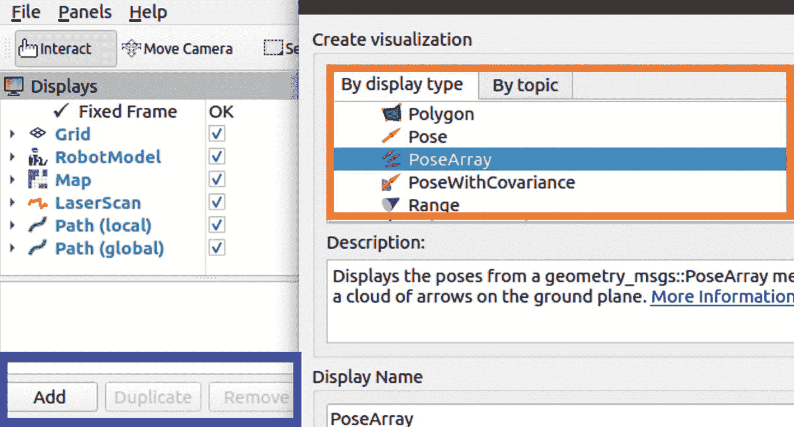

左侧显示标签页和右侧创建可视化标签页的两个截图。显示标签页有各种选项和按钮，其中选择了添加、复制和删除按钮。创建可视化标签页通过显示类型部分突出显示，并列出各种选项，其中选择了姿态数组。

图 7-21

RViz 的 PoseArray 显示

+   在显示下点击添加按钮（蓝色方框），然后在主题标签页（橙色方框）下选择 PoseArray 显示。此操作如图 7-21 所示。

现在我们已经打开了 RViz GUI 界面，我们应该有漫游器 Gazebo 模拟和`amcl_demo.launch`程序运行，以及这个 RViz GUI 可供使用。如果这三个程序都在运行，我们应该看到图 7-22 中显示的显示。我们需要为 PoseArray 显示类型添加`/particlecloud`主题。一旦我们将此主题添加到 PoseArray 显示类型，我们应该在图 7-22 中找到的蓝色方框周围看到“云”状的红色箭头。我们应该看到这个红色箭头云随着我们的不确定性减小而变小。漫游器移动得越多，漫游器姿态的不确定性就越小。我们的漫游器位置就在这个蓝色方框的中心。图 7-22 中的橙色方框是我们之前生成的地图特征与漫游器激光扫描重叠的地方。绿色方框是我们可见的 PoseArray 显示类型（图 7-22）。

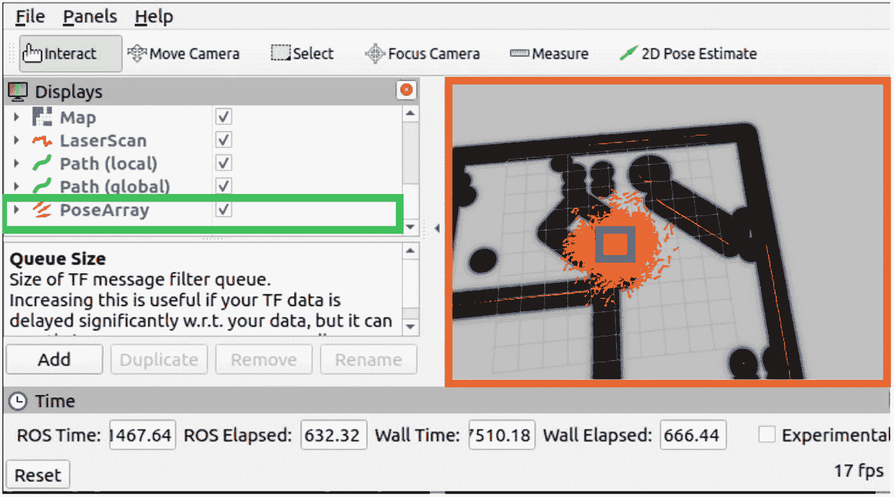

一张包含交互选项和地图的映射标签页截图。交互标签页中突出显示了姿态数组选项。右侧的地图包含一个红色箭头的云，表示漫游器的扫描，以及一个蓝色方框，表示粒子云。

图 7-22

漫游器的红色箭头/粒子云与蓝色方框重叠

现在我们需要测试我们的漫游器姿态是否正确。我们需要创建一个 ROS 服务服务器，该服务器将确定漫游器在那个确切时刻的当前姿态（位置和方向）。我们需要创建一个名为`currentPose`的 ROS 包，该包将包括`rospy, roscpp,`和`std_msgs`作为包依赖项。以下操作将通过在 Terminator 中打开另一个终端来创建我们的 ROS 包：

```py
$ cd ~/catkin_ws
$ source devel/setup.bash
$ catkin_make
$ cd ~/catkin_ws/src
$ catkin_create_pkg currentPose std_msgs rospy roscpp
$ cd ~/catkin_ws/src/currentPose
$ mkdir launch scripts
$ cd ~/catkin_ws/src/ai_rover_navigation/scripts
$ gedit findPose.py
$ chmod +rwx findPose.py
```

现在输入`findPose.py`（列表 7-8）的源代码：

```py
#! /usr/bin/env python3
import rospy
from std_srvs.srv import Empty, EmptyResponse
from Empty.srv.
from geometry_msgs.msg import PoseWithCovarianceStamped, Pose
robot_pose = Pose()
def service_callback(request):
print("Rover Pose:")
print(rover_pose)
return EmptyResponse() # the service Response class, in this case EmptyResponse
def sub_callback(msg):
global robot_pose
robot_pose = msg.pose.pose
rospy.init_node('service_server')
my_service = rospy.Service('/get_pose_service', Empty , service_callback) # create the Service called get_pose_service with the defined callback
sub_pose = rospy.Subscriber('/amcl_pose', PoseWithCovarianceStamped, sub_callback)
rospy.spin() # mantain the service open.
Listing 7-8
The findPose.py File
```

然后，我们需要启动确定漫游器当前姿态的启动文件。以下是在 Terminator 的新终端窗口中的终端命令列表：

```py
$ cd ~/catkin_ws
$ source devel/setup.bash
$ catkin_make
$ cd ~/catkin_ws/src
$ cd ~/catkin_ws/src/currentPose/launch
$ gedit currentPose.launch
$ chmod +rwx currentPose.launch
```

然后我们进入源代码启动文件（列表 7-9）。

```py

Listing 7-9
The currentPose.launch File
```

### 使用 RViz 移动漫游车的位姿

我们在我们的 Gazebo 环境中有了漫游车，并且 PoseArray 已经完全激活。我们可以将漫游车从一个位姿（位置和方向）移动到另一个位姿。但首先，我们需要确保漫游车处于正确的初始位姿。我们查看 Gazebo 环境中漫游车的实际位姿，并尝试与 RViz 中相同漫游车的相同位姿尽可能接近。我们通过使用位于 RViz GUI 窗口顶部的**2D 位姿估计**按钮来对漫游车进行校正。一旦进行校正，我们可以选择**2D 导航目标**选项并点击一个合理接近漫游车的位置。同时，确保你选择的位姿是空闲空间（没有任何障碍物）。一旦这样做，你应该看到从初始位姿到目标位姿的虚线蓝色线。这条蓝色线是全局路径，是初始漫游车位姿和最终目标位姿之间的最佳距离。这条线是这两个点之间可能的最短路径。一旦漫游车开始向目标位姿移动，我们将在漫游车后面看到一条绿色线，这是局部路径。我们可以在图 7-23 中看到这一点。

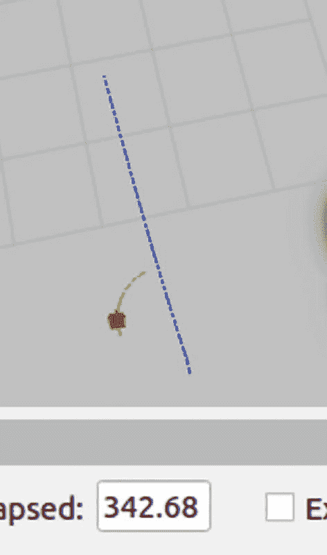

一张带有蓝色虚线和绿色虚线以及一个红色方框经过其附近的地图截图。

图 7-23

蓝线是全局路径，微弱的绿色线是局部路径

## 编程目标位姿为漫游车

我们还没有完成让我们的漫游车执行 ROS 导航的任务。目前，我们需要开始在 ROS 中自主导航。ROS 导航的第一步是创建地图。第二步允许漫游车在环境中精确定位并确定其位姿（位置和方向）。现在我们需要命令漫游车去哪里以及如何去。告诉漫游车在地图上去哪的一部分是开发漫游车的正确路径规划。路径规划将漫游车的当前位姿和漫游车需要到达的目标位姿作为输入，并尝试找到到达该目标位姿的最短路径作为输出。

现在我们已经在模拟的 Gazebo 环境中定位了漫游车。我们通过 RViz 直接发送了目标位姿（位置和方向）。我们很高兴看到漫游车带着这些目标位姿穿越环境。最终，通过与 ROS 导航系统交互，这种基于目标位姿的导航成为可能。这个导航系统也被称为导航堆栈。有关导航堆栈的更多信息，请参阅[`wiki.ros.org/navigation/Tutorials`](http://wiki.ros.org/navigation/Tutorials)。现在我们将快速回顾导航堆栈的功能和特性以及它是如何运行的。这些功能将使我们能够使用 Python 脚本来控制漫游车，而无需在 RViz 中进行直接的人机交互。

### Noetic ROS 导航堆栈

我们距离让我们的漫游车执行 ROS 导航还远得很。目前，我们需要开始在 ROS 中实现自主导航。ROS 导航的第一步是创建地图。第二步允许漫游车在环境中准确确定其当前姿态。第三步是在 RViz 中将目标姿态航点发送给漫游车。现在我们将讨论导航堆栈的目的。

导航堆栈是 ROS 中使用最频繁的组件。它是我们漫游车的核心组件，允许漫游车在世界中移动到不同的航点而不会与物体碰撞。导航堆栈集成了地图、定位系统、传感器（激光雷达）和里程计，以从初始姿态规划到最终姿态。此外，导航堆栈还可以允许漫游车通过围绕漫游车的 Z 轴旋转来恢复，从而从陷入环境的问题中恢复过来。

导航堆栈的高级描述如下：

+   首先，向导航堆栈发送一个导航目标。然后，使用目标类型`MoveBaseGoal`进行 ROS 动作调用，该类型指定了最终目标姿态，通常在地图坐标系中。

+   第二，导航堆栈使用全局规划器中的地图路径查找算法，从初始姿态计算到目标姿态的最短可能路径。

+   第三，导航堆栈然后将全局路径解决方案传递给局部规划器。局部规划器随后尝试此路径解决方案，使用漫游车的传感器来避开地图上可能不存在障碍物。如果局部规划器失败，全局规划器可以发出新的路径解决方案。

+   第四，随着漫游车接近给定距离内的目标姿态，漫游车到达目的地，动作终止。

### 配置导航堆栈

要开发一个 Python 脚本，使用已知地图控制漫游车的导航，我们需要启动三个重要的 ROS 节点：

+   **move_base 节点**处理漫游车的全局路径规划和局部控制。

+   **amcl 节点**根据参考地图定位漫游车。

+   **map_server 节点**为漫游车提供静态地图，以便定位和规划。

## 概述

本章的目标是培养创建我们勇敢的漫游车 ROS 导航能力所需的基本技能。这些技能包括生成和存储环境（地下墓穴）的地图、在模拟环境中定位漫游车、允许漫游车的 Python 程序执行路径规划、可视化数据并纠正 RViz 中的任何模拟错误。本章还引用了众多参考文献，可以增强对 ROS 导航的理解。它还使用了多个 ROS 导航包。使用 ROS 导航概念，我们可以通过以下功能进一步开发我们的漫游车能力：

+   通过使用现成的和标准的 ROS 导航堆栈，利用基本的导航结构。

+   创建并存储由 `slam_gmapping` ROS 节点生成的环境地图。

+   使用 `move_base` ROS 节点设置航点。

+   在环境中定位我们的漫游车。

+   在环境中开发路径查找解决方案。

+   沿着路径解决方案前进并避开沿途的障碍物。
