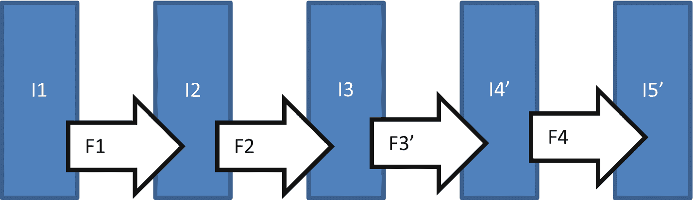
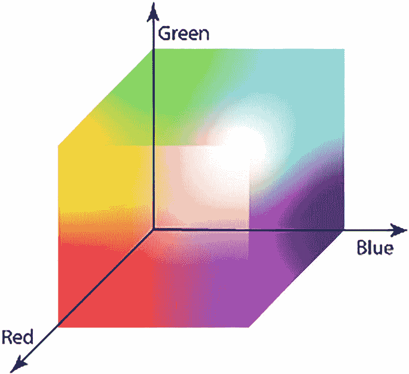
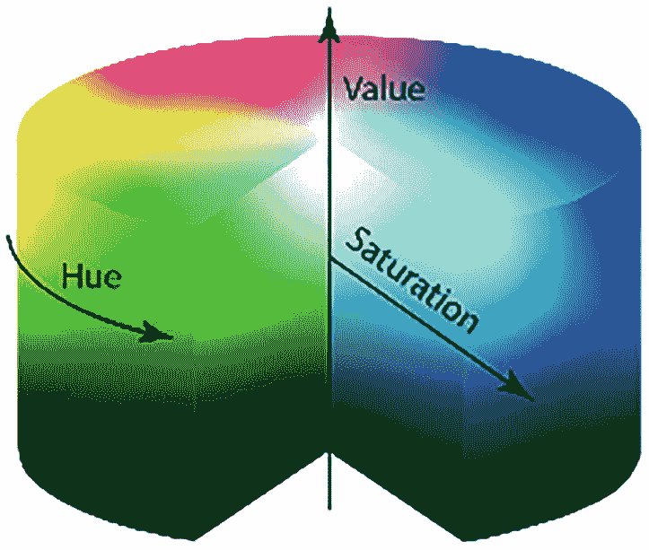
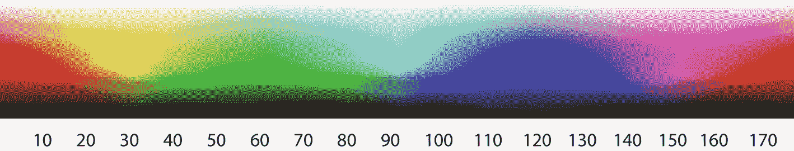
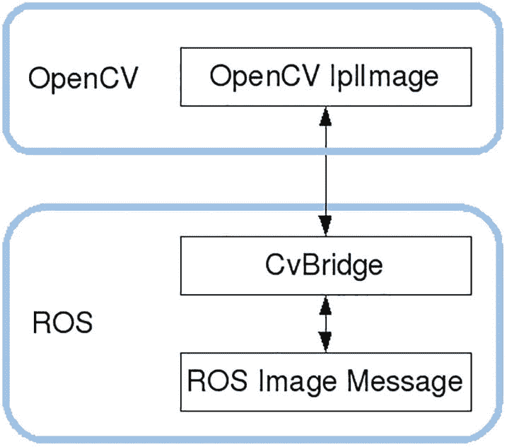
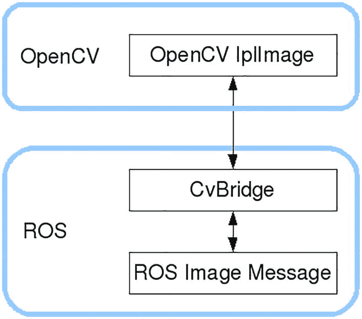
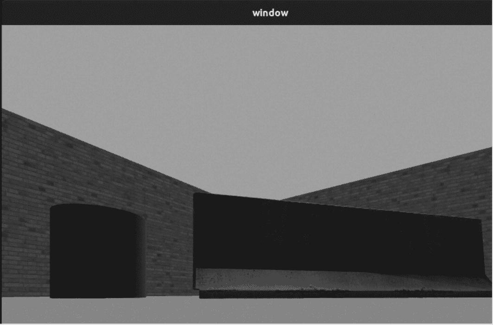
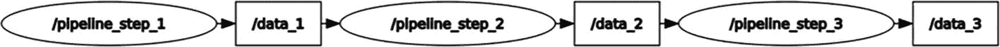

# 8. OpenCV 和感知

任何自主式漫游车在探索埃及地下墓穴时都需要知道其路径上有哪些物体。虽然激光雷达可以帮助识别物体，但它只能在其激光扫描水平上“看到”物体。漫游车会错过检测任何低于激光雷达扫描水平的物体。它也会错过任何未将激光雷达扫描一分为二的悬挂在天花板上的物体。我们需要一个更稳健的系统，称为计算机视觉。不幸的是，它计算成本高昂。计算机视觉模仿人类检测物体的方式。我们的漫游车需要从图像中提取信息，并通过其模式和特征来识别物体。漫游车必须处理像素和颜色以确定边缘，帮助它穿越环境并避开障碍。

## 目标

以下是为成功完成本章所需的目标：

+   理解计算机视觉基础

+   安装 OpenCV 以及与机器人操作系统（ROS）的必要连接。

+   使用颜色过滤进行视觉处理

+   使用边缘检测帮助在地下墓穴中找到墙壁和物体

+   卷积及其与计算机视觉和卷积神经网络关系的简要介绍。

+   使用形态学变换进行图像和物体处理

## 概述

在上一章中，我们为漫游车提供了有限的环境感知能力。然而，在几种情况下，漫游车可能会因为激光雷达没有检测到物体而撞车；例如，短物体。将计算机视觉添加到漫游车中增强了其对周围环境的理解。

之前的章节主要关注激光雷达作为漫游车上的唯一传感器。我们在第六章中使用了激光雷达系统作为感知和避障例程的基础，并使用激光雷达平台来绘制环境和导航。现在，我们将使用 OpenCV 图像处理与激光雷达协同，以改进感知和避障算法。此外，我们将开发一个反馈循环系统来确定偏差并纠正空间误差。前几章的所有示例都没有错误纠正，因此漫游车的位置只是一个近似值。这个近似值随着漫游车在任务中移动时间的增长而变得更糟。

回想一下，我们在第五章中安装了摄像头驱动程序；现在，我们将使用它。我们将使用 OpenCV 库。ROS 将 OpenCV 库视为一个 ROS 节点。

## 计算机视觉简介

计算机视觉是处理计算机交互的科学领域，涉及它们如何接收、处理和解释数字图像或视频。从派遣车的角度来看，计算机视觉的使用将允许派遣车通过视觉处理来理解环境。对于这个派遣车，计算机视觉的应用包括从 Gazebo 模拟中的传感器（摄像头）或现实世界中的 RGB 摄像头获取、处理和理解数字图像。计算机视觉也是机器学习（深度学习）应用中的关键组件，用于产生后续决策算法（深度强化学习）中使用的数值信息。计算机视觉分析使用几何学、物理学、统计学和机器学习理论模型来处理和就获取的数字图像做出决策。

派遣车（rover）的计算机视觉旨在将数字图像模型应用于基于图像的决策。从根本上讲，计算机视觉被实现为一个电子系统。这个电子系统由一个输入传感器链路，例如摄像头；一个中央处理系统来处理输入信息；以及一个输出设备，例如执行器，它接收来自主处理器的输出命令。中央处理系统通常基于从输入摄像头获取的数字图像做出决策，然后向执行器发送输出命令。数字图像有多种形式，例如视频序列、多摄像头的视图或 3D 扫描仪的多维数据。我们勇敢的派遣车将使用的计算机视觉子领域如下：

+   目标检测

+   使用颜色滤波器

+   使用边缘检测器

+   运动估计

+   距离估计

以下几节介绍了三个相关领域，它们构成了本章中 ROS 和 OpenCV 交互中使用的计算机视觉分析的基础。

### 固态物理学

固态物理学是用于允许固态材料构建传感器，如 RGB 光电摄像头和激光雷达的知识。[固态物理学](https://en.wikipedia.org/wiki/Solid-state_physics)与计算机视觉密切相关。大多数计算机视觉系统依赖于[图像传感器](https://en.wikipedia.org/wiki/Image_sensors)，它们检测[电磁辐射](https://en.wikipedia.org/wiki/Electromagnetic_radiation)，通常在[可见光](https://en.wikipedia.org/wiki/Visible_light)或红外光谱中。

### 神经生物学

神经生物学是应用研究科学的一个领域，它是计算机视觉中基于学习的方法的基础。在这个神经医学的科学领域内，已经创建了一个子领域，其中人工系统被设计来模拟不同复杂程度下生物视觉系统（通常是人眼）的行为和结构。这种生物结构包括神经网络中常见的人眼视觉的互联网络结构。

### 机器人导航

机器人导航有时涉及自主[路径规划](https://en.wikipedia.org/wiki/Path_planning)或深思熟虑，以便机器人系统可以[导航环境](https://en.wikipedia.org/wiki/Robotic_navigation)。为了在这些环境中导航，需要对这些环境有详细的了解。计算机视觉系统提供了关于漫游车即时环境的关键信息。漫游车现在已成为一个移动视觉传感器平台。

## 什么是计算机视觉？

OpenCV（开源计算机视觉）是一个面向实时计算机视觉的编程[库](https://en.wikipedia.org/wiki/Library_%2528computing%2529)。OpenCV 最初由英特尔开发，但现在由 Willow Garage 维护。OpenCV 支持 Raspberry Pi 4 和 Nvidia Jetson 嵌入式系统上的 GPU 加速，以实现实时操作。

在上一章中，漫游车从环境中提取数据。不幸的是，来自激光雷达的数据稀疏且只有一像素“宽”，这可能会引起问题（卡在垃圾桶或钟乳石下）。为了丰富数据流，我们需要添加另一个来源。因此，我们引入了相机。它有两个目的：为操作员提供丰富的数据源，并为 OpenCV 库提供图像。第一个用途是将原始数据投影到操作员的控制台，以便人类输入到漫游车中。第二个用途将是 OpenCV 的初始输入，并生成环境中物体的二维边缘。这实际上是将激光雷达（水平）的一维数据添加了第二个维度（垂直）。图像处理比激光雷达处理慢，因此它将被调用得更少（每秒 10-20 次，而激光雷达为每秒 30-60 次）。

漫游车无法识别从地板升起（石笋）或从天花板落下（钟乳石）且不拦截激光雷达传感器的物体。这些短物体可能仍然会与漫游车底盘相交，因此必须避开它们。作为一个编程库，OpenCV 还提供了许多计算机视觉算法，这将使我们能够分析漫游车相机获取的单一图像或一系列图像。OpenCV 通过识别像素和颜色模式来识别边缘、物体、人物、面部等。我们的漫游车将使用边缘/物体检测算法来确定是否有激光雷达未检测到的物体在前方。

## OpenCV

OpenCV 使用一个非常酷的工程概念，称为管道。为了说明管道概念，想象一个水处理厂。进入工厂的水可能受到污染（雨水、污水等）。它将水通过一个过滤器，去除大物体（树叶、树枝、鱼等），并输出水。这仍然是水，只是稍微干净一些。这种更干净的水继续通过第二个过滤器，去除较小的物体（沙子、沉淀物等），并输出水。这种更无菌的水随后通过第三个过滤器，依此类推，直到水的质量达到所需的水平。维护很简单——如果需要更换一个过滤器，就更换它。不需要更换其他过滤器。如果我们发现一个过滤器没有按预期工作，我们需要更新它。

这个过程就是 OpenCV 处理图像和“过滤器”的方式。简单的函数（称为过滤器）处理图像。过滤器完成后，会返回一个新的修改后的图像（见图 8-1），并可以作为新过滤器的输入。过滤器执行简单的图像操作，如锐化、模糊和边缘检测。锐化会强调图像中的对比度，而模糊则相反。然而，连续应用这两个过滤器不会给我们原始图像，而是一个非常相似的图像，随机噪声被移除；即，相机图像信号处理器（ISP）中的坏像素。边缘检测过滤器可以是通用的或特定的；即，识别垂直或水平线（两个不同的过滤器）。


管道结构的示意图。一组五个矩形垂直排列，并标记为 I 1、I 2、I 3、I 4 和 I 5。在两个矩形之间放置一个箭头。每个箭头标记为 f 1、f 2、f 3 和 f 4。

图 8-1

管道结构

一张图像被传递到一个函数中，该函数返回一个修改后的图像。然后，修改后的图像可以被发送到下一个处理过程，依此类推。将过滤器/函数 F3 更改为 T3'（见图 8-2）将图像转换为下一个管道阶段。下游的过滤器/函数不需要更改，但下一个和最终的图像（I4' & I5'）将因过滤器（F3'）的改变而不同。



管道结构的示意图。一组五个矩形垂直排列，并标记为 I 1、I 2、I 3、I 4' 和 I 5'。在两个矩形之间放置一个箭头。每个箭头标记为 f 1、f 2、f 3' 和 f 4。

图 8-2

在管道中更改过滤器（示例 1）

此外，您还可以更改函数的操作顺序，并获得另一张最终图像。（见图 8-3。）在这个例子中，我们首先执行函数 F4，然后是 F3，得到一个全新的最终图像（I5'）。这个管道概念将函数与形式分开。形式始终是图像，过程始终是图像过滤器。图像过滤器可以独立设计和编程，因为它不需要知道之前的过滤器。它只是“知道”有图像进来，它将“吐出”一个“改变”的图像。


管道结构的插图。一组五个矩形垂直放置，并标记为 I 1、I 2、I 3、I 4'和 I 5'。在两个矩形之间放置一个箭头。每个箭头标记为 f 1、f 2、f 4 和 f 3。

图 8-3

在管道中更改过滤器（示例 2）

### 图片

一张打印的彩色图像是由许多特征组成的一组，如颜色和形状，被人类解释为环境的视觉表示。数字图像是一个二维数组，这些数字被程序性地转换成视觉表示。每个数组元素是一个 32 位的整数，称为像素，每个像素包含四个 8 位的“通道”，描述了图像上该位置的颜色和透明度（RGBA）。RGBA 代表红色、绿色、蓝色和 Alpha，其中*Alpha*表示不透明度。每个 8 位通道给我们 256 种颜色或透明度的阴影（透明度的反义词）。这种描述涉及大量信息！我们需要处理这张图像以找到可能位于漫游者路径上的物体边缘。

为了简化我们的图像，首先承认的是环境中没有透明物体！毕竟，我们身处埃及金字塔中。因此，我们可以忽略 Alpha 通道。其次要注意的是，古老金字塔的内部不会有很多颜色。我们可以将我们的图像压缩成灰度；即，只有灰度的阴影。这种第一次图像处理引导我们到我们的第一个过滤器。

### 过滤器

过滤器通过添加或删除信息将一个物体的表示转换为另一个。例如，一副太阳镜可以阻止强烈的反射光线进入我们的眼睛。我们看到的东西仍然存在；只是看起来不同。过滤掉强烈光线的过滤器给了我们一个更简单的环境版本。

我们首先应用的第一个过滤器将 RGB 转换为灰度，将 24 位数据压缩到 8 位。因此，我们将需要回顾颜色过滤器。

#### 颜色过滤器与灰度

颜色空间是一个三维计算模型，模仿人类视觉感知中的颜色，其中模型的坐标将定义一个感知到的颜色。一个颜色空间模型是 RGB 模型，其中所有颜色都是由红色、绿色和蓝色混合而成的。在 RGB 颜色空间中进行边缘检测是困难的，因为颜色空间是非线性的。幸运的是，OpenCV 有一个 RGB 到灰度转换函数`cvtColor(image, cv2.COLOR_BGR2GRAY)`，通过将 24 位图像转换为 8 位图像来简化边缘检测。（见图 8-4）。）



RGB 颜色立方体的插图。x 轴标记为红色，y 轴为蓝色，z 轴为绿色。

图 8-4

RGB 颜色空间转换为灰度空间

图像过滤首先需要我们在图像中检测特定的颜色。我们的图像过滤将基于称为 HSV（色调饱和度值）的颜色空间模型。这个颜色空间模型紧密模拟了人类对颜色的感知。HSV 模型是 RGB 的非线性模型，具有圆柱坐标。圆柱坐标使我们能够图形化地表示色调、饱和度和值参数。

大多数数字颜色分析程序使用 HSV 刻度，HSV 颜色模型对于选择图像处理中的精确颜色是有益的。HSV 刻度提供了与颜色名称相对应的图像的数值读数。色调范围从 0 到 360 度。例如，青色位于 181 到 240 度之间，品红色位于 301 到 360 度之间——颜色范围的分析在 0 到 100%的刻度上（图 8-5）。



HSV 颜色空间的插图。圆柱的饱和度由一个箭头指示，表示从圆柱中心到箭头的水平距离。从底部到顶部的垂直距离用箭头标记，以指示值。在圆柱的左侧，色调用一个箭头表示为一个角度。

图 8-5

HSV 颜色空间模型

现在我们将应用一个简单的颜色过滤器到我们的漫游车摄像头流中。我们将识别、隔离并分离该摄像头流中的红色、绿色和蓝色（图 8-6）。测试这个简单的颜色过滤器对于找到图像颜色的边界是必要的。


一组三个圆圈，它们的边界相互重叠。两个圆圈放在上面，一个在下面。圆圈有不同的颜色。

图 8-6

将一个简单的颜色过滤器应用到我们的摄像头流中

我们使用 HSV 颜色空间模型来定义所需的颜色。颜色组件本身由色调通道定义，该通道包含整个色相光谱，与 RGB 相比，RGB 需要所有三个通道来定义一个颜色。

为了更好地理解这部分内容，请使用图 8-7 来近似色相通道中颜色的定义。



一个色相通道的多种颜色示意图。该通道由一个底部标有值 10、20、30、40、50、60、70、80、90、100、110、120、130、140、150、160 和 170 的矩形组成。

图 8-7

在色相通道中定义颜色

例如，如果我要找的颜色是蓝色，我的色相范围应该在 110 到 120 之间，或者为了更宽的范围，100 到 130。因此，我的下限值应该看起来像`min_blue = np.array([110,Smin,Vmin])`，而上限值像`max_blue = np.array([120,Smax,Vmax])`。在饱和度和值的情况下，我们可以这样说，饱和度越低，越接近白色，值越低，越接近黑色。

### 边缘检测器

边缘检测器分为两类：复杂和简单。简单的边缘检测器是寻找水平或垂直线的过滤器。它们是快速可执行的代码，但结果可能不太有帮助。复杂的边缘检测器可能找到更通用的线条，但它们往往较慢。此外，通用线条可能有更多的错误边缘或分离的边缘。

边缘检测寻找图像中相邻像素的尖锐变化。我们假设这些变化反映了图像中两个对象之间的“边界”。图像亮度的不连续性可能对应以下情况：

+   深度的不连续性（一个物体在另一个物体后面，或者一个物体在图像的前景）

+   表面方向的不连续性（物体有“折痕”）

+   材料特性的变化（光滑/哑光或金属/布料）

+   场景照明的变化（阴影/阳光）

注意，第一个项目是我们唯一一次发现物体之间的边界。（物体是旧的、灰尘的，表面大多是非反光的。因此，项目 2-4 是不太可能的。）由于我们的探索领域是金字塔，我们可以将我们的列表简化为只有第一个项目。

在理想情况下，将边缘检测器应用于图像将导致一组连接的像素，这些像素勾勒出物体的边界。因此，将边缘检测算法应用于图像可能会显著减少需要处理的数据量，并过滤掉可能被认为不太相关的信息，同时保留图像的重要结构特性。如果边缘检测步骤成功，则解释原始图像内容的工作将大大简化。然而，从现实生活中的中等复杂度的图像中总是获得这样的理想边缘并不总是可能的。

片段化或未连接的曲线边缘将阻碍非平凡图像的边缘。这些缺失的边缘段和错误边界并不对应图像中的有趣现象，从而复杂化后续解释图像数据的工作。

边缘检测是图像处理、图像分析、图像模式识别和计算机视觉技术中的基本步骤之一。

## NumPy、SciPy、OpenCV 和 CV_Bridge

OpenCV 运行时库使用常规 CPU；我们需要 NumPy 和 SciPy 库来加速 OpenCV。NumPy 使用 Raspberry Pi 上的数值处理器，SciPy 包含常规数学库中没有的函数。此外，SciPy 会在屏幕上显示图表。如果您安装了 Noetic ROS 的完整桌面版本，您已经安装了 NumPy、OpenCV 和 CV_Bridge。如果没有，请参考`ROS.org`网站以添加这些库。

### 测试 OpenCV CV_Bridge

ROS 有一个现有的程序，它可以直接从相机接收原始图像，并通过名为`imageCallBack`的回调例程处理它们。这个例程将连续流出的相机图像显示在屏幕上的窗口中。尽管我们没有这样做，OpenCV 可以处理图像以检测物体。

要将视觉功能添加到漫游车中，我们需要执行以下步骤：

+   从 RGB 相机获取图像。

+   将这些图像传递给 OpenCV 进行进一步处理（平滑、边缘检测和分割）。

+   对后处理的图像进行过滤，以识别图像中的特征、物体、墙壁和线条。

+   控制漫游车以感知和避免 LiDAR 可能未检测到的相同特征、障碍物、墙壁和物体线条。

我们现在必须测试我们的 ROS 和 OpenCV 交互，以确定 ROS 是否能够获取图像并与 OpenCV 共享。现在我们可以构建 ROS 和 OpenCV 之间的桥梁。

好的，既然您对 OpenCV 和图像处理有了简要的介绍，现在是时候描述计算机视觉的一个主要任务了：图像颜色过滤。颜色过滤是从图像中提取特定颜色信息。在此之前，我们将通过一些基本的 OpenCV 操作让您熟悉这个库，并理解接下来的 Python 代码。

#### CV_Bridge：OpenCV 和 ROS 之间的链接

首先，您必须知道 ROS 使用其自己的`sensor_msgs`/image 消息格式从其传感器传递图像，但有时您需要使用 OpenCV 对这些图像进行处理。CV_Bridge 是一个 ROS 库，它连接 ROS 和 OpenCV，将 ROS 图像转换为 OpenCV 格式，反之亦然。显示的 CV_Bridge 链接如图 8-8 所示。



一组用于 OpenCV 和 ROS 的两个矩形。顶部的 OpenCV 矩形包含 OpenCV I p I 图像。底部的 ROS 矩形包含 CV 桥和 ROS 图像消息。一个双头箭头将 OpenCV 连接到 CV 桥。一个类似的箭头将 CV 桥和 ROS 图像连接起来。

图 8-8

ROS 和 OpenCV 之间的 CV_Bridge 链接

以下 Python 源代码列表允许您调用必要的库来初始化 `cv_bridge` 包并处理 ROS 的相机消息：

```py
1 from cv_bridge import CvBridge
2 oBridge = CvBridge();
3 cv_image = oBridge.imgmsg_to_cv2(image_message, desired_encoding='passthrough');
```

在第 1 行，我们正在导入 `CvBridge` 库。在第 2 行，我们正在实例化 `oBridge` 对象。在第 3 行，我们将 `imgmsg` 转换为 `cv2`，以便将 ROS 传感器相机消息发送到 OpenCV 进行进一步处理。

以下代码行允许我们将 ROS 中的图像发送到 OpenCV 进行处理。ROS 从相机传感器图像消息主题接收图像。然后，该信息从 ROS 发送出去，由 OpenCV 通过 CvBridge ROS 包进一步处理和分析。

```py
#!/usr/bin/env python
import rospy
from sensor_msgs.msg import Image
from cv_bridge import CvBridge, CvBridgeError
import cv2
class ShowingImage(object):
def __init__(self):
self.image_sub = rospy.Subscriber("/ai_rover_remastered/rgb/image_raw",Image,self.camera_callback);
self.oBridge = CvBridge();
def camera_callback(self,data):
try:
# select bgr8 OpenCV encoding by default
cv_image = self.oBridge.imgmsg_to_cv2(data, desired_encoding="bgr8");
except CvBridgeError as e:
print(e)
cv2.imshow('image',cv_image)
cv2.waitKey(0)
def main():
showing_image_object = ShowingImage()
rospy.init_node('line_following_node', anonymous=True)
try:
rospy.spin()
except KeyboardInterrupt:
print("Shutting down")
cv2.destroyAllWindows()
if __name__ == '__main__':
main()
```

#### 获取测试图像

ROS 获取的任何相机图像都是 `sensor_msgs/image` 消息类型。为了获取这些图像以便由 OpenCV 进一步处理，ROS 需要订阅这些图像。位于探测器前部的 RGB 相机（第五章）流出的图像需要由 ROS 节点进行订阅。因此，我们将首先开发一个简单的 ROS 节点，该节点仅订阅 `ai_rover_remastered/camera1/image_raw` 主题消息。此主题消息定义在第五章。为了构建我们的第一个测试系列，以确定 ROS 节点是否可以订阅图像并将其与 OpenCV 共享以进行进一步处理，我们必须执行以下四个步骤：

1.  要在 Terminator 的第一个终端中启动 `roscore`：

1.  我们在 Terminator 的第二个打开的终端中启动我们的 Gazebo 模拟。`roslaunch ai_rover_remastered ai_rover_world.launch` 从第五章启动我们的探测器 Gazebo 模拟。

```py
$ cd ~/catkin_ws
$ source devel/setup.bash
$ catkin_make
$ roscore
```

1.  我们在 Terminator 的第三个打开的终端中启动我们的 Rviz 环境。我们需要使用 Rviz 来查看相机图像。我们这样做是为了查看相机是否存在任何问题。我们启动第五章中的相同 Rviz 启动文件，如下所示：

```py
$ cd ~/catkin_ws
$ source devel/setup.bash
$ catkin_make
$ roslaunch ai_rover_remastered ai_rover_world.launch
```

1.  然后我们启动第四个终端，输入所有必要的测试命令。

1.  现在，我们已经进入第四个终端，我们想要运行一个测试命令以确定我们是否可以看到探测器的相机。如果我们看到带有相机主题名称的 ROS 主题消息，我们就可以看到它。因此，如果我们想在第四个终端中运行以下命令：

```py
$ cd ~/catkin_ws
$ source devel/setup.bash
$ catkin_make
$ roslaunch ai_rover_remastered ai_rover_remastered_rviz.launch
```

```py
$ cd ~/catkin_ws
$ source devel/setup.bash
$ catkin_make
$ rostopic list
```

我们应该看到以下终端输出：

1.  我们已确认图像数据在 `ai_rover_remastered/camera1/image_raw` 主题上可用。此主题消息是一个未压缩的图像流，与计算机视觉算法更兼容。现在我们必须编写我们的第一个 ROS 节点，该节点将订阅此 `image_raw` 主题消息。我们通过首先创建一个 ROS 包（`cv_tests`），以及与其相关的依赖项，为该 ROS 节点提供一个存放位置。现在我们在 Terminator 中打开一个新的独立终端，输入以下命令：

```py
/ai_rover_remastered/camera1/camera_info
/ai_rover_remastered/camera1/image_raw
/ai_rover_remastered/camera1/image_raw/compressed
/ai_rover_remastered/camera1/image_raw/...........
```

1.  我们现在已打开 Gedit 编辑器，其中包含可用的 `imageSubscribeTest.py` 文件，并输入以下 Python 脚本列表：

```py
$ cd ~/catkin_ws
$ source devel/setup.bash
$ cd ~/catkin_ws/src
$ catkin_create_pkg cv_tests image_transport cv_bridge sensor_msgs rospy roscpp std_msgs
$ cd ~/catkin_ws/src/cv_tests
$ mkdir launch scripts
$ cd ~/catkin_ws/src/cv_tests/scripts
$ gedit imageSubscribeTest.py
```

1.  现在，我们必须重新编译我们的 ROS 包，并使用以下终端命令运行`imageSubscribeTest.py`文件：

```py
#!/usr/bin/env python3
import rospy
from sensor_msgs.msg import Image
def imageCallBack(msg):
pass
rospy.init_node('imageSubscribeTest');
image_sub = rospy.Subscriber('ai_rover_remastered/camera1/image_raw', Image, imageCallBack);
rospy.spin();
```

1.  一旦我们运行并执行了`imageSubscribeTest.py`节点，我们就可以通过在 Terminator 中另一个终端输入以下终端命令来查看这个节点是否可以在活跃的 ROS 节点列表中找到：

```py
$ cd ~/catkin_ws
$ source devel/setup.bash
$ catkin_make
$ cd ~/catkin_ws/src/cv_tests/scripts
$ chmod +rwx imageSubscribeTest.py
$ ./imageSubscribeTest.py
```

1.  我们应该得到以下列表输出，其中包含由这个 ROS 节点实例化的`imageSubscribeTest.py`的发布、订阅和服务。我们还可以看到`/ai_rover_remastered/camera1/image_raw`连接到了这个 ROS 节点。

```py
$ cd ~/catkin_ws
$ source devel/setup.bash
$ catkin_make
$ rosnode info imageSubscribeTest
```

1.  我们有信心我们的 ROS 节点连接到了相机主题消息。现在我们必须处理来自相机的这些图像。我们必须将它们传递给 OpenCV 库。这个库包含实时计算机视觉算法。要在 ROS 节点和 OpenCV 之间交换图像，我们需要使用允许这种交互的`cv_bridge`包。`cv_bridge`包可以在`[`vision_opencv](http://wiki.ros.org/vision_opencv)`堆栈中找到。以下显示了`cv_bridge`作为 ROS 和 OpenCV 之间的链接（图 8-9）。

    

    一组用于 OpenCV 和 ROS 的两个矩形。顶部的 OpenCV 矩形包含 OpenCV I p I Image。底部的 ROS 矩形包含 CV 桥和下面的 ROS 图像消息。一个双头箭头将 OpenCV 连接到 CV 桥。一个类似的箭头连接 CV 桥和 ROS 图像。

    图 8-9

    通过 cv_bridge 实现的 ROS 和 OpenCV 交互

```py
Node [/imageSubscribeTest]
Publications:
* /rosout [rosgraph_msgs/Log]
Subscriptions:
* /ai_rover_remastered/camera1/image_raw [sensor_msgs/Image]
* /clock [rosgraph_msgs/Clock]
Services:
* /follower/get_loggers
* /follower/set_logger_level
contacting node http://localhost:44103/ ...
Pid: 5791
Connections:
* topic: /rosout
* to: /rosout
* direction: outbound (33717 - 127.0.0.1:41872) [10]
* transport: TCPROS
* topic: /clock
* to: /gazebo (http://localhost:34451/)
* direction: inbound
* transport: TCPROS
* topic: /ai_rover_remastered/camera1/image_raw
* to: /gazebo (http://localhost:34451/)
* direction: inbound
* transport: TCPROS
```

请参考以下超链接地址以获取有关将 ROS 图像和 OpenCV 图像（Python）转换的更多信息：`http://wiki.ros.org/cv_bridge/Tutorials/ConvertingBetweenROSImagesAndOpenCVImagesPython`

1.  现在我们可以看到一个 ROS 节点可以接收图像，我们需要处理这些图像。我们必须测试我们的 ROS 节点是否可以通过 CV_Bridge 将图像发送到 OpenCV。`cv_bridge`包包含将 ROS `sensor_msgs/Image`消息转换为 OpenCV 的功能。我们必须开发一个 Python 脚本，将传入的图像转换为 OpenCV 消息，并在 OpenCV 的`imshow()`函数上显示它们。以下是一个命令我们的 ROS 节点将图像发送到 OpenCV 的脚本：

1.  再次，我们以与原始文件相同的方法将这个测试脚本写入`ImageSubscribeTest.py`文件。我们将它作为另一个测试脚本文件，以确定 ROS 接收到的图像是否可以发送到 OpenCV。我们打开三个终端。在第一个终端中执行`roscore`命令，第二个终端运行`roslaunch ai_rover_remastered ai_rover_world.launch`控制，第三个终端运行`rosrun cv_tests ImageSubscribeTest.py`命令来运行我们输入的列表 8-1 中的脚本。一旦我们运行了这个脚本，我们应该看到以下输出（图 8-10）。

    ```py
    #!/usr/bin/env python3
    import rospy from sensor_msgs.msg
    import Image import cv2, cv_bridge
    class ImageSubscribeTest:
    def __init__(self):
    self.CompVisBridge = cv_bridge.CvBridge();
    cv2.namedWindow('window', 1);
    self.image_sub = rospy.Subscriber('/ai_rover_ remastered/camera1/image_raw', Image, self. imageCallBack);
    def imageCallBack(self, msg):
    image = self.CompVisBridge.imgmsg_to_cv2 (msg, desired_encoding='bgr8');
    cv2.imshow('window', image);
    cv2.waitKey(3);
    rospy.init_node('ImageSubscribeTest');
    imageSubscribeTest2 = ImageSubscribeTest();
    rospy.spin();
    Listing 8-1
    ImageSubscribeTest.py script
    ```

```py
#!/usr/bin/env python3
import rospy
from sensor_msgs.msg import Image
import cv2, cv_bridge
class ImageSubscribeTest:
def __init__(self):
self.CompVisBridge = cv_bridge.CvBridge();
cv2.namedWindow('window', 1);
self.image_sub = rospy.Subscriber('/ai_rover_remastered/camera1/image_raw', Image, self.imageCallBack);
def imageCallBack(self, msg):
image = self.CompVisBridge.imgmsg_to_cv2(msg, desired_encoding='bgr8');
cv2.imshow('window', image);
cv2.waitKey(3);
rospy.init_node('ImageSubscribeTest');
imageSubscribeTest2 = ImageSubscribeTest();
rospy.spin();
```



一张打开的 C V 显示器的照片。顶部的一条水平栏标题为窗口。

图 8-10

OpenCV 显示的图像

## 边缘检测和激光雷达（为什么）

## 实现（如何）

边缘检测在物体识别和提取过程中起着关键作用，这对于物体避障是必要的。从相机图像中检测到的边缘具有高垂直精度，并代表环境中物体的各种边缘形状。但大多数相机图像中的边缘检测受对比度和光照的影响。激光雷达数据适合判断建筑区域，但由于激光脉冲误差而遗漏一些边缘点。一种新的自适应建筑边缘检测方法结合了激光雷达数据和图像，以利用这两种数据源。首先，通过滤波梯度将物体和地面分离。通过数学形态学去除非建筑物体和区域增长。其次，通过高斯卷积平滑图像，并计算图像的梯度。最后，通过单个屋顶斑块的边缘点处理图像空间。缓冲区中具有最大局部梯度的像素被判定为候选边缘。最终边缘通过形态学操作融合图像边缘和屋顶块来确定。实验结果表明，该方法对各种建筑形状具有适应性。最终边缘是闭合且细的，宽度为单像素，适合后续的建筑建模。

## 启动 Python 文件

这种方法在机器人领域是一个常见的用例：你从传感器获取一些数据，需要将其通过应用程序的几个部分。每个部分都需要数据来完成自己的任务，有些部分可能还需要修改数据以供其他部分使用。

对于这个例子，我们将创建三个节点：

节点 1（`pipeline_step_1`）：创建一个介于 0 和 10 之间的随机浮点数，并发布

节点 2（`pipeline_step_2`）：获取这个数字，将其乘以 2，并发布

节点 3（`pipeline_step_3`）：获取这个数字，四舍五入，并发布

图 8-11 显示了我们将得到的最终图：



完成图的流程图。该图如下所示。正斜杠管道下划线步骤下划线 1，正斜杠数据下划线 1，正斜杠管道下划线步骤下划线 2，正斜杠数据下划线 2，正斜杠管道下划线步骤下划线 3，以及正斜杠数据下划线 3。

图 8-11

完成图

### 步骤 1：数据管道

在此节点中，我们将创建一个介于 0 和 10 之间的随机浮点数，并在“data_1”主题上发布。在这里，我选择用 Python 编写节点：

```py
#!/usr/bin/env python3
import rclpy
from rclpy.node import Node
from example_interfaces.msg import Float64
import random
class Node1(Node):
def __init__(self):
super().__init__("pipeline_step_1")
self.pub_ = self.create_publisher(Float64, "data_1", 10)
self.timer_ = self.create_timer(1.0, self.publish_data)
def publish_data(self):
msg = Float64()
msg.data = random.uniform(0.0, 10.0)
self.get_logger().info("Published: " + str(msg.data))
self.pub_.publish(msg)
def main(args=None):
rclpy.init(args=args)
node = Node1()
rclpy.spin(node)
rclpy.shutdown()
if __name__ == "__main__":Figure
main()
```

如果你没有信心编写此代码，许多在线参考资料（`ROS.org`）存在，用于创建一个[Python 中的最小 ROS 节点](https://roboticsbackend.com/write-minimal-ros2-python-node/)和编写[ROS Python 发布者](https://roboticsbackend.com/ros2-python-publisher-example/)。

在这里，我们使用`random.uniform()`获取所需的随机浮点数。

我们使用我们创建的计时器，每秒在 1Hz 频率上发布“data_1”主题。

并且我们还在终端上打印了我们刚刚发布的内容，这样调试会更方便。

### 第 2 步：数据管道

这个节点将订阅“data_1”主题，处理/转换数据，并将新数据发布到“data_2”主题。在这里，我正在用 C++编写这个节点，因为 ROS 通信是语言无关的，所以你可以为你的节点使用任何你想要的编程语言。

```py
#include "rclcpp/rclcpp.hpp"
#include "example_interfaces/msg/float64.hpp"
class Node2: public rclcpp::Node
{
public:
Node2() : Node("pipeline_step_2")
{
pub_ = this->create_publisher("data_2", 10);
sub_ = this->create_subscription(
"data_1", 10, std::bind(&Node2::callbackData, this, std::placeholders::_1));
}
private:
void callbackData(const example_interfaces::msg::Float64::SharedPtr msg)
{
auto new_msg = example_interfaces::msg::Float64();
new_msg.data = msg->data * 2.0;
RCLCPP_INFO(this->get_logger(), "Received: %lf, Published: %lf", msg->data, new_msg.data);
pub_->publish(new_msg);
}
rclcpp::Publisher::SharedPtr pub_;
rclcpp::Subscription::SharedPtr sub_;
};
int main(int argc, char **argv)
{
rclcpp::init(argc, argv);
auto node = std::make_shared();
rclcpp::spin(node);
rclcpp::shutdown();
return 0;
}
```

如果你对这个代码不太自信，请查看如何[在 C++中编写最小的 ROS 节点](https://roboticsbackend.com/write-minimal-ros2-cpp-node/)。

在这里，我们创建了一个发布者（到“data_2”）以及一个订阅者（到“data_1”）。

在“data_1”主题回调中，我们执行以下操作：

+   在这里通过乘以 2 来处理数据并转换它。

+   创建[一个新的 Float64 消息](https://roboticsbackend.com/ros2-create-custom-message/)并用这些新数据填充它。

+   将数据发布到“data_2”主题。

+   打印我们接收和发布的内容，以便更容易进行调试/监控。

注意我们没有为“data_2”主题创建任何发布速率；我们直接从“data_1”主题的回调函数中发布。

### 第 3 步：数据管道

我们管道的最后一个节点：这个节点将订阅“data_2”主题，处理/转换数据，并将新数据发布到“data_3”主题。我再次用 Python 编写这个节点：

```py
#!/usr/bin/env python3
import rclpy
from rclpy.node import Node
from example_interfaces.msg import Float64
from example_interfaces.msg import Int64
class Node3(Node):
def __init__(self):
super().__init__("pipeline_step_3")
self.pub_ = self.create_publisher(Int64, "data_3", 10)
self.sub_ = self.create_subscription(
Float64, "data_2", self.callback_data, 10)
def callback_data(self, msg):
new_msg = Int64()
new_msg.data = round(msg.data)
self.get_logger().info("Received: " + str(msg.data) +
", Published: " + str(new_msg.data))
self.pub_.publish(new_msg)
def main(args=None):
rclpy.init(args=args)
node = Node3()
rclpy.spin(node)
rclpy.shutdown()
if __name__ == "__main__":
main()
```

因此，我们有一个发布者到“data_3”和一个订阅者到“data_2”。

在这里，我们再次在“data_2”回调函数中做所有事情：

+   处理数据并修改它：我们将其四舍五入并得到一个整数而不是浮点数。

+   使用不同类型创建一条新消息。我们收到了 Float64 数据，现在我们正在发布 Int64。

+   发布新数据。

+   日志。

最关键的一点是我们正在使用不同的数据类型将消息传递到下一个管道步骤。

注意

作为我们管道示例的最后一个步骤，我们可以通过日志打印结果而不是发布它。通过你的节点和数据，你将有一个很好的想法知道在你的应用程序中应该做什么。

## 构建和运行 ROS 数据管道应用程序

在`setup.py`中为 Python 节点添加可执行文件，在`CMakeLists.txt`中为 C++节点添加可执行文件。然后使用`catkin_make build`从你的 ROS 工作空间编译。

### 在三个不同的终端中运行应用程序

打开三个终端/会话。如果你已经有三个打开的终端，确保在继续之前在每个终端中 source 你的 ROS 工作空间。

让我们启动所有三个节点并看看我们得到什么。

终端 1：

```py
$ ROS run ROS_tutorials_py node_1
...
[INFO] [1594190744.946266831] [pipeline_step_1]: Published: 7.441288072582843
[INFO] [1594190745.950362887] [pipeline_step_1]: Published: 9.968039333074264
[INFO] [1594190746.944258673] [pipeline_step_1]: Published: 8.848880026052129
[INFO] [1594190747.945936611] [pipeline_step_1]: Published: 1.8232649263149414
...
```

终端 2：

```py
$ ROS run ROS_tutorials_cpp node_2
...
[INFO] [1594190744.944747967] [pipeline_step_2]: Received: 7.441288, Published: 14.882576
[INFO] [1594190745.949126317] [pipeline_step_2]: Received: 9.968039, Published: 19.936079
[INFO] [1594190746.943588170] [pipeline_step_2]: Received: 8.848880, Published: 17.697760
[INFO] [1594190747.944386405] [pipeline_step_2]: Received: 1.823265, Published: 3.646530
...
```

终端 3：

```py
$ ROS run ROS_tutorials_py node_3
...
[INFO] [1594190744.955152638] [pipeline_step_3]: Received: 14.882576145165686, Published: 15
[INFO] [1594190745.951406026] [pipeline_step_3]: Received: 19.93607866614853, Published: 20
[INFO] [1594190746.944646754] [pipeline_step_3]: Received: 17.697760052104258, Published: 18
[INFO] [1594190747.946918714] [pipeline_step_3]: Received: 3.646529852629883, Published: 4
...
```

多亏了日志，你可以看到数据去哪里，何时接收和发送，以及它是如何被处理的。

现在，如果你使用[ROS 主题列表](https://roboticsbackend.com/ros2-topic-cmd-line-tool-debug-ros2-topics-from-the-terminal/)获取你图中运行的所有主题的列表：

```py
$ ROS topic list
/data_1
/data_2
/data_3
/parameter_events
/rosout
```

我们找到了“data_1”、“data_2”和“data_3”主题。

因此，这真是太好了。从这里，您可以执行以下操作：

+   使用终端的 ROS 主题回声监听任何主题，看看发生了什么。

+   将任何新的节点连接到这些主题中的任何一个。例如，你想要创建一个更复杂的数据管道：另一个节点可以订阅“data_2”并独立处理它。

## 使用 ROS 启动文件启动您的数据管道

对于开发和调试，从终端启动节点是非常棒的。然而，如果你想创建一个实际的 ROS 应用程序，你将不得不使用启动文件。除了使用 ROS 启动文件的优势之外，你还可以同时启动所有节点，因此所有管道步骤将同时开始工作。

因此，让我们编写一个简单的启动文件来启动所有三个节点：

```py
from launch import LaunchDescription
from launch_ros.actions import Node
def generate_launch_description():
ld = LaunchDescription()
node_1 = Node(
package="ROS_tutorials_py",
executable="node_1"
)
node_2 = Node(
package="ROS_tutorials_cpp",
executable="node_2"
)
node_3 = Node(
package="ROS_tutorials_py",
executable="node_3"
)
ld.add_action(node_1)
ld.add_action(node_2)
ld.add_action(node_3)
return ld
```

现在编译并运行这个启动文件。如果你不知道如何操作，这里有一个[ROS 启动文件教程](https://roboticsbackend.com/ros2-launch-file-example/)。

```py
$ ROS launch my_robot_bringup data_pipeline.launch.py
[INFO] [launch]: All log files can be found below /home/ed/.ros/log/2020-07-08-09-55-37-919871-ed-vm-11593
[INFO] [launch]: Default logging verbosity is set to INFO
[INFO] [node_1-1]: process started with pid [11595]
[INFO] [node_2-2]: process started with pid [11597]
[INFO] [node_3-3]: process started with pid [11599]
[node_1-1] [INFO] [1594194939.304693502] [pipeline_step_1]: Published: 0.9131821923863725
[node_2-2] [INFO] [1594194939.305641498] [pipeline_step_2]: Received: 0.913182, Published: 1.826364
[node_3-3] [INFO] [1594194939.314622095] [pipeline_step_3]: Received: 1.826364384772745, Published: 2
[node_1-1] [INFO] [1594194940.292584583] [pipeline_step_1]: Published: 6.724756051691409
[node_2-2] [INFO] [1594194940.293238316] [pipeline_step_2]: Received: 6.724756, Published: 13.449512
[node_3-3] [INFO] [1594194940.294448648] [pipeline_step_3]: Received: 13.449512103382817, Published: 13
```

现在您的数据管道已经完全准备好了！对于生产，您可以移除 info 日志，只打印 warn 日志。

## 摘要

您现在可以使用 ROS 节点和主题构建完整的数据管道。ROS 架构和工具为您带来了许多优势。您可以执行以下操作：

+   用您想要的任何语言编写任何步骤或管道（节点）

+   使用命令行工具从终端调试每个步骤

+   只启动管道的几个步骤

+   在管道的开始、结束或任何其他位置添加新的步骤（节点）
