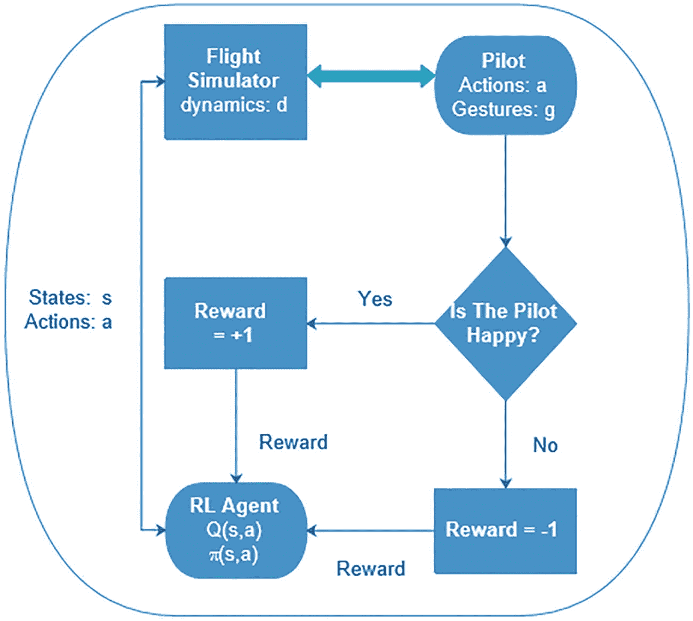
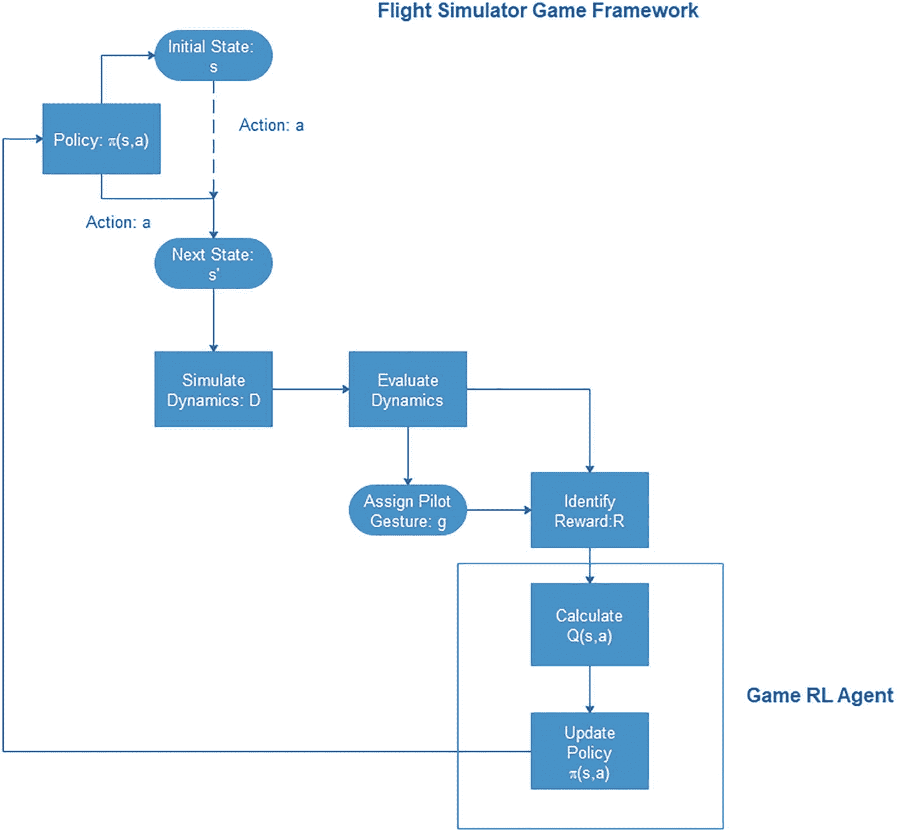
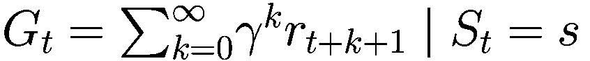

# 9. 强化学习

在上一章中，我们的漫游车需要能够从图像中提取信息，并通过其模式和特征识别物体。本章将概述一个基于人工智能应用的新型自主飞行框架，该框架采用强化学习代理。这个代理通过观察飞行模拟器中飞行员的心理学反应和飞行路径来学习飞行技能。该框架包括一个作为飞行模拟器工作的游戏模块，一个检测飞行员手势的计算机视觉系统，一个用于在模拟飞行中验证状态空间变量（飞机的性能）安全限制的飞行动力学分析器，以及一个用于计算 Q 函数和所学策略的模块。

## REL 入门

本章的特点在于强化学习（REL）既不是监督学习也不是无监督学习。存在一个代理可以观察环境，选择并执行动作/，并获得回报（或以负回报形式出现的惩罚）。然后它必须根据可能或不可能最初给予它的东西自行学习。这被称为最佳策略，称为策略，以在一段时间内获得最多的回报（如果没有给予它，它制定策略，或者它使它所得到的策略更好）。策略定义了代理在给定情况下应该选择什么动作。例如，许多机器人实现 REL 算法来学习如何行走。DeepMind 的 AlphaGo 程序是强化学习的良好例子：2017 年 5 月，它在围棋比赛中击败了世界冠军柯洁。它通过分析数百万场比赛并与之进行多场比赛来学习其获胜策略。实际上，大部分可用的数据都是未标记的：我们有输入特征 X，但没有标签 Y。强化学习具有巨大的潜力，因为我们只是刚刚触及了表面。

REL 的核心概念是基于策略的无形动作。接下来是代理直接影响环境，这是强化学习（RL）的基本动作；随着代理的学习，代理的内部状态被修改，以便在策略上建立基础。

半马尔可夫决策过程（SMDPs）在 REL 中具有潜在的好处。当创建复杂任务时，可以通过组合简单任务的 Q 值来形成整体任务的 Q 值。这是一种通过在每个状态中选择动作将问题作为随机最优控制问题来解决找到最优决策阈值的方法。

一个基本的观察是动作需要时间来完成。当智能体选择一个基本动作时，该动作的结果可以在下一个时间步（由 MDPs 定义）观察到。但动作不是在单个时间步内完成的，因为在策略执行基本动作期间存在一些时间间隔，只有在延迟期结束时才能观察到该动作的结果。

SMDPs 通过将时间添加到各个组件中扩展了基本的 MDP 框架，从而使其能够捕捉这种决策问题的风格。SMDPs 以以下三种方式扩展 MDP 框架：

+   首先，转移函数*P*必须包含时间。这表示为*P* : *S x A x ǁ x S → ℝ*，其中*P(s; a; t; s’)*表示在状态*s*中选择动作*a*后，经过*t*个时间步到达状态*s’*的概率。这是一个离散时间 SMDP，因为时间以时间步的数量表示。也存在连续时间 SMDPs，其中*P* : *S x A x ǁ x S → ℝ*，但在这里我们通常描述更简单的离散时间情况。

+   接下来，动作*a*的奖励不再是选择动作时给出的单一值，而是代表从选择动作到达到下一个状态所积累的总奖励。在子任务方面，这意味着所选的子策略可以执行多个动作，其中一些或所有动作都会收到一些奖励，而选择该子策略的总奖励是这些奖励的总和。

+   最后的更改在于折现因子***γ***。现在它被应用于时间延迟中，因此长时间未达到的状态比快速达到的状态折扣更大。

为了说明这一切，我们将通过使用一个 REL 来展示一个案例研究。

航空案例研究中的 REL：无人或有人，注入 AI。在这个例子（Krishnamurthy, Harbour, & Clark 2019）中，飞行员和 REL 智能体同时学习飞行技能，形成了一种共生关系。强化学习智能体的训练阶段可以通过飞行员在模拟器中飞行或无人使用计算机上的游戏来模拟。在典型阶段，强化学习智能体为飞行员提供一系列要遵循的操作。

这些指令产生两种状态之一，成功或失败。智能体观察到飞行员的心理反应以及飞行环境，并收到正面或负面的奖励。经过训练的 REL 智能体代表了一种新型的 AI，它指导飞行员在飞行的各个阶段。

人类错误是大多数飞机事故的原因；因此，当飞机的飞行轨迹不规则时，出现了发出警告的技术。例如，检测飞机的行为是衡量飞机安全性的方法之一。

对飞行操作的持续监控和分析是另一种从预定义列表中检测危险行为的方法。李等人（2016 年）报告了数据挖掘方法，例如使用高斯混合模型（GMMs）对数字飞行数据进行聚类分析，这些方法被安全分析师用于识别异常数据模式或异常以及日常运营中的潜在风险。随着人工智能（AI）的出现，人机协作可以是一种有效的方法，以最小化人为错误并进一步提高航空安全记录。

Zhao 等人（2018 年）使用强化学习（REL）作为自适应在线学习模型，以识别飞行数据中的共同模式，并使用递归期望最大化算法更新 GMM 的聚类。对人工智能兴趣的复苏吸引了其在航空系统中的应用，特别是空中交通管理（ATM）、空中交通流量管理（ATFM）和无人空中系统交通管理（UTM）。

Kistan 等人（2018 年）探索了一种通过机器学习配置的认知人机界面（HMI），并检查了其要求。他们推测，通过人工智能实现的自动化和自主性的增加将导致认证要求，并讨论了地面 ATM 系统如何适应现有的航空系统认证框架。人工智能的最新发展在自主航空中开辟了可能性，通过用机器人功能取代飞行员的行为，引入高水平的安全性，并且对如何将人工智能纳入自主航空进行进一步研究是非常有价值的。

飞行员建模技术在载人航空中发挥了关键作用，并且已经开发了人类飞行员行为控制模型。控制模型用于分析飞行员-飞机系统的特征，以指导飞行控制系统。涵盖中枢神经系统、神经肌肉系统、视觉系统和前庭系统的人类操作者拟人化模型可以代表飞行员的行为。

最近，徐等人（2017 年）回顾了人类飞行员行为控制模型。这些模型反映了人类感官和控制系统在响应刺激时的动态。以计算机视觉形式存在的 AI 可以与这些模型结合，以检测人类飞行员行为的非线性特征，用于训练 REL 智能体。

### 情绪识别模拟器

飞行模拟器通常用于训练飞行员和评估战斗人员对任务的准备情况。飞行模拟器也用于研究情绪智力与模拟飞行性能之间的关系的研究，以了解情绪因素如何影响飞行训练表现。Pour 等人（2018 年）使用一个人机面部表情相互交互平台来研究自闭症儿童的社会互动能力。

### 强化深度学习

强化学习是一种受动物学习方式启发的半监督学习，当事情、过程或选择错误或结果不佳时受到惩罚，而当事情、过程或选择正确或结果良好时受到奖励。它依赖于马尔可夫决策过程中的状态空间定义、状态之间的动作以及相关的奖励结构。在 REL 的一些简单形式中，通过评估值函数 V(*s*)或 Q(*s,a*)-学习来学习最优策略，其中*s*是当前状态，*a*是在状态*(s)*中采取的动作，或者通过时间差分从剧集中进行学习，这些剧集是代理尝试达到目标的示例尝试。在游戏设置中，剧集可以是成功或失败的尝试。类似游戏的情况在许多日常生活例子中实现，包括飞行员尝试驾驶飞机。最优策略用于选择动作序列以在状态之间过渡并实现最终目标，同时最大化长期奖励。

### 计算机视觉系统

还可以设计一个计算机视觉系统来捕捉在模拟器中接受训练的飞行员的心理反应。这有助于确定飞行员在飞行路径上对操作动作的反应。为了训练 REL 代理，我们设计了一个飞行模拟器框架，这就像一个飞行员通过自己的动作*a*来玩的游戏，并表达其手势，这些手势代表其在模拟器中的动作。我们将手势*g*表示为一个具有两个状态的变量，其值为*快乐*（☺）或*不快乐*（☹）。飞行模拟器的状态空间*s*由五个变量组成：高度*A*、速度*S*、航向*H*、转向*U*和滚转*R*。表 9-1 列出了这五个动作变量的范围。

表 9-1

定义状态 s 的五个变量及其范围

| 状态变量 | 最小值 | 最大值 |
| --- | --- | --- |
| 高度，A | 0 ft | 35,000 ft |
| 速度，S | 0 mph | 550 mph |
| 航向，H | 0° | 360° |
| 转向，U | 0° | 360° |
| 滚转，R | 0° | 360° |

### 飞行路径分析

通过实时计算状态空间变量的梯度，可以获得可靠的飞行路径分析，这些变量包括高度梯度 dA/dt、速度梯度 dS/dt、航向梯度 dH/dt、转向梯度 dU/dt 和滚转梯度 dR/dt。基于规则的模型将梯度与预定义的范围进行比较，以确定机动是否安全或危险，并计算动态奖励。表 9-2 显示了梯度及其范围的初始猜测值。范围的最小值和最大值可以作为可调参数设置，以实现更实用的值集。这些范围将在规则模型中用于动态确定飞行机动奖励。

表 9-2

定义安全操作区域的状态变量梯度范围

| 状态变量梯度 | 最小值 | 最大值 |
| --- | --- | --- |
| 高度梯度，dA/dt | 0 ft | 1,000 ft |
| 速度梯度，dS/dt | 0 mph | 20 mph |
| 航向梯度，dH/dt | 0° | 3° |
| 转向梯度，dU/dt | 0° | 3° |
| 俯仰梯度，dR/dt | 0° | 2° |

### 飞行员手势分配

计算机视觉系统可以由一个数字视频摄像头、一个如 Myriad 2 的神经处理单元以及一个用于读取飞行员手势的单板计算机组成。计算机视觉系统可以使用面部检测机器学习算法进行训练，以实时监控飞行员的“快乐”或“不快乐”的面部表情。在模拟器中玩飞行游戏的角色特别建议在他们的行动导致安全操作时展示一个快乐的表情（☺），在他们的行动导致风险、不安全或灾难性操作时展示一个不快乐的表情（☹）。计算机视觉系统可以像 Google AIY 套件一样简单，它使用 TensorFlow 机器学习模型来检测微笑。

### 强化学习代理：从飞行员的行为中学习

我们首先考虑一种闭环方法来开发一个强化学习代理（REL agent），它可以利用人工智能来确定人类飞行员的动作并计算奖励。这种强化学习代理通过在模拟器中飞行飞机时生成的场景进行训练；即，在计算机上。在典型场景中，强化学习代理为飞行员提供一系列要遵循的动作。这些指令会产生两种结果之一，要么成功要么失败。代理观察到飞行员的心理学反应以及飞行环境，并收到正面或负面的奖励。当飞行员的表情是“快乐”时，代理收到+1 的奖励，当飞行员的表情是“不快乐”时，代理收到-1 的奖励。例如，可以使用不同的奖励结构对同一组场景进行训练，以找出安全操作的最佳组合。训练过程会重复进行，直到学习过程收敛。在用足够多的场景训练代理后，预期强化学习代理获得的知识将代表一种新型的 AI，它通过准确的指令指导飞行员在飞行各个阶段的操作。图 9-1 显示了强化学习代理的学习框架及其与飞行模拟器和检测飞行员手势以接收奖励以更新*Q*(*s,a*)函数的计算机视觉系统的交互，其中*s*是当前状态，*a*是动作，策略是*π*(*s,a*)。

R E L 的流程图包含 2 列组件。左侧是飞行模拟器动力学，右侧是飞行员动作，它们之间有一个双箭头。飞行员动作指向的是飞行员是否高兴？不，奖励等于 -1。是，左列中的奖励等于 +1。奖励指向 R L 代理，Q；s，a，s 下的 a，π。

图 9-1

强化学习 (R E L) 代理及其与环境的交互框架，包括飞行模拟器和飞行员手势识别系统

### 飞行模拟器游戏框架

图 9-2 展示了在飞行模拟器中生成状态、动作、奖励、*Q* 函数和策略的游戏框架。与 R E L 代理的奖励结构相比，飞行模拟器游戏框架具有额外的局部奖励和长期奖励。在飞行模拟器游戏框架中，当状态变量的梯度超出安全范围时，游戏 R E L 代理将获得额外的奖励 -1。当达到目的地所需的总时间低于预设值时，游戏 R E L 代理还将获得可选的长期奖励 +2。当所有状态变量的导数都在安全范围内时，R E L 代理将获得奖励 +1。奖励的选择是任意的，可以根据各种场景逐渐演变成更现实的一种。游戏模拟器模块通过提取动作，使用当前策略模拟飞行动力学来启动游戏。然后，其他两个模块评估飞行动力学和飞行员的动作以确定奖励。然后，计算并更新每个状态-动作对的 *Q*(*s,a*) 函数和相关的奖励。然后，根据 *Q*(*s,a*) 值重新计算策略 *π*(*s,a*) 并更新。

飞行模拟器游戏流程图有以下步骤。初始状态：s。动作：a，下一个状态：s'。模拟动力学。评估动力学。识别奖励。游戏 R L 代理包含计算 s，a 的 Q 值并更新策略 π 的组件。游戏 R L 代理指向策略：指向初始状态和下一个状态的 π。

图 9-2

飞行模拟器作为游戏以获取状态、动作、奖励、Q 函数和策略的框架

## 摘要

本章提出了一个新颖的航空主题，通过注入学习飞行技能的 R E L 代理形式的 AI 来实现。这个 AI 框架的独特之处在于飞行员和 R E L 代理同时学习飞行技能，形成了一种共生关系。

在这个背景下，确定检测飞行员行为的合适方法是开发基于强化学习的 AI 的关键。在所提出的框架内进行足够的训练后，预计 REL 代理能够学会驾驶飞机，并为安全航空提供飞行员指导。

## 策略和价值函数

+   将策略映射到动作

    +   在状态 *s* 下采取动作 *a* 的概率

        +   *π*(*a*| *s*) = ℙ[*A*[*t*] = *a*| *S*[*t*] = *s*]

        +   价值函数

    +   根据代理的状态和遵循的策略提供奖励

        +   ![$$ {V}_{\pi }(s)={\mathbbm{E}}_{\pi}\left[{G}_t|{S}_t=s\right] $$](img/494112_1_En_9_Chapter/494112_1_En_9_Chapter_TeX_IEq1.png) (衡量状态的好坏)

        +   ![$$ {Q}_{\pi}\left(s,a\right)={\mathbbm{E}}_{\pi}\left[{G}_t|{S}_t=s,{A}_t=a\right] $$](img/494112_1_En_9_Chapter/494112_1_En_9_Chapter_TeX_IEq2.png) (衡量采取动作的好坏)

        +   如果使用表格 *Q*-学习，估计新的 *Q*-值：

            ![$$ New\ Q\left(S,A\right)\longleftarrow Q\left(S,A\right)+\alpha \left[{R}^{\prime }+\gamma \underset{a}{\max }{Q}^{\prime}\left({S}^{\prime },a\right)-Q\left(S,A\right)\right] $$](img/494112_1_En_9_Chapter/494112_1_En_9_Chapter_TeX_Equa.png)

+   返回函数

+   

## 参考文献

Chang, T.H., Hsu, C.S., Wang, C., & Yang, L.–K. (2008). On board measurement and warning module for measurement and irregular behavior. *IEEE Transactions on Intelligent Transportation Systems*, *9*(3), 501–513.

Clark, J.D., & Harbour, S.D. (2019). Unpublished.

Clark, J.D., Mitchell, W.D., Vemuru, K.V., & Harbour, S.D. (2019). Unpublished.

Dayan, P., & Abbott, L. F. (2001). *Theoretical neuroscience: computational and mathematical modeling of neural systems*. MIT Press

Gerstner, W., & Kistler, W. (2002). *Spiking Neuron Models: Single Neurons, Populations, Plasticity*. Cambridge University Press.

Friston, K., & Buzsáki, G. (2016). The functional anatomy of time: what and when in the brain. *Trends in cognitive sciences*, *20*(7), 500–511.

Friston K. (2018). Am I Self-Conscious? (Or Does Self-Organization Entail Self-Consciousness?). *Frontiers in psychology*, *9*, 579\. doi:10.3389/fpsyg.2018.00579

Harbour, S.D., & Christensen, J.C. (2015, May). A neuroergonomic quasi-experiment: Predictors of situation awareness. In: *Display Technologies and Applications for Defense, Security, and Avionics IX; and Head-and Helmet-Mounted Displays XX* (Vol. 9470, p. 94700G). SPIE.

Harbour, S.D., Clark, J.D., Mitchell, W.D., & Vemuru, K.V. (2019). Machine Awareness. *20th International Symposium on Aviation Psychology*, 480–485\. [`https://corescholar.libraries.wright.edu/isap_2019/81`](https://corescholar.libraries.wright.edu/isap_2019/81)

Harbour, S.D., Rogers, S.K., Christensen, J.C., & Szathmary, K.J. (2015, 2019). 理论：向自主性和情境意识连接的解决方案。在第四届俄亥俄大学无人机会议上的演讲。美国俄亥俄州代顿会议中心。美国空军。

Kidd, C., & Hayden, B.Y. (2015). 好奇心的心理学和神经科学。*神经元*，*88*(3)，449–460。

Kistan, T., Gardi, A., & Sabatini, R., (2018). 空中交通管理中的机器学习和认知人体工程学：近期发展和认证考虑因素。*航空航天*，*5*(4)，文章编号 103。

Li, L.S., Hansman, R.J., Palacios, R., & Welsch, R. (2016). 通过高斯混合模型进行飞行操作和安全监控的异常检测。*交通运输技术，C 部分：新兴技术*，*64*，45–57。

Loewenstein, G. (1994)。好奇心的心理学：综述与重新解释。*心理学通报*。*116*(1)，75–98。

Mitchell, W.D. (2019 年 2 月)。私人通信。

Murphy, R.R. (2019). *人工智能机器人导论*。麻省理工学院出版社。

Pour, A.G., Taheri, A., Alemi, M., & Meghdari, A. (2018). 人机面部表情相互交互平台：自闭症儿童案例研究。*国际社会机器人学杂志*，*10*(2)，179–198。

Rogers, S. (2019)。未发表。

Sharpee, T.O., Calhoun, A.J., & Chalasani, S.H. (2014). 神经元、行为和情绪适应的信息理论。*神经生物学当前观点*，*25*，47–53。

Vemuru, K.V., Harbour, S.D., & Clark, J.D. (2019). 无论是无人机还是有人机，航空中的强化学习，以及人工智能的注入。*第 20 届国际航空心理学研讨会*，492–497。[`https://corescholar.libraries.wright.edu/isap_2019/83`](https://corescholar.libraries.wright.edu/isap_2019/83)

Xu, S.T., Tan, W.Q., Efremov, A.V., Sun, L.G., & Qu, X. (2017). 人类飞行员行为控制模型综述。*控制年度评论*，*44*，274–291。

Zhao, W.Z., He, F., Li, L.S., and Xiao, G. (2018)。飞行数据聚类分析的适应性在线学习模型，载于*2018 年 IEEE/AIAA 第 37 届数字航空电子系统会议论文集*，*IEEE-AIAA 航空电子系统会议*（第 1–7 页）。伦敦，英国。
