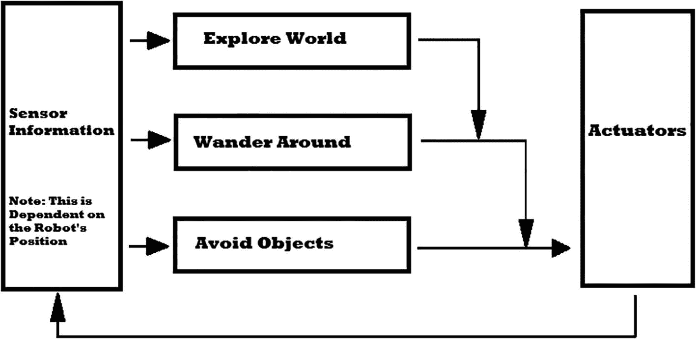
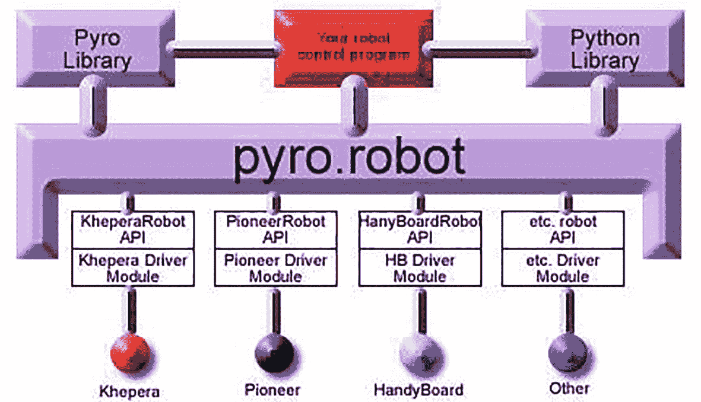
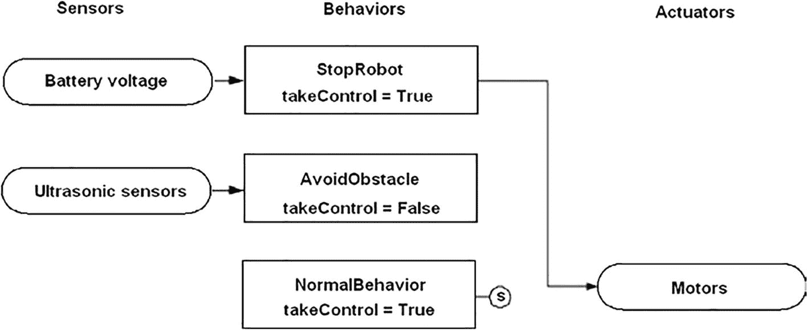
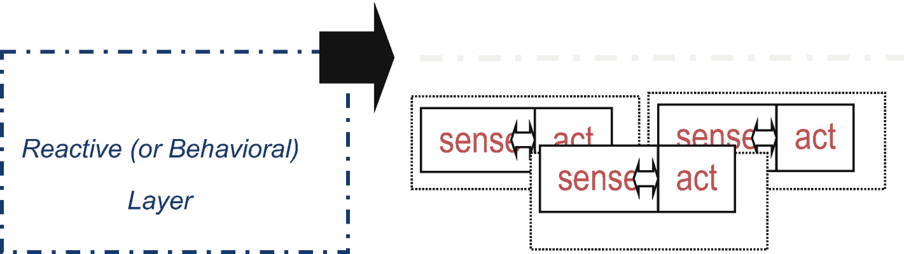
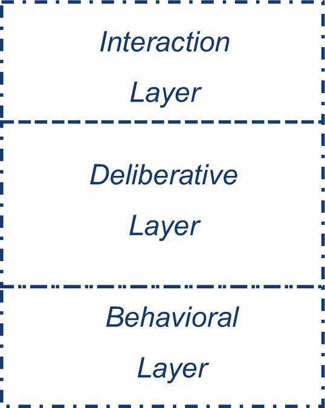
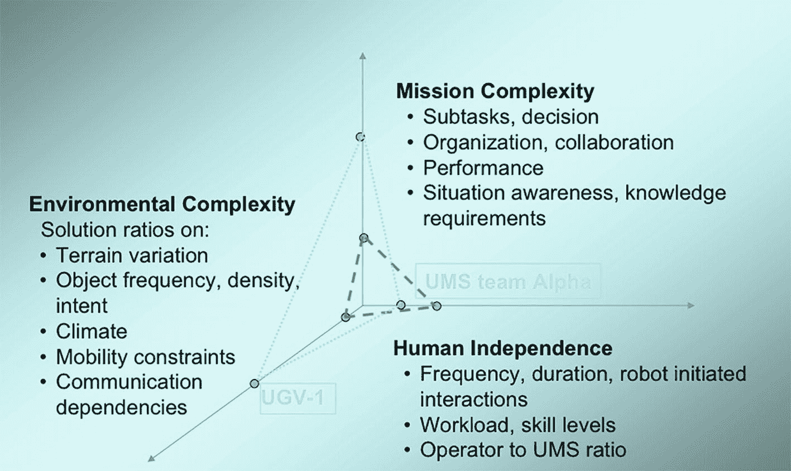
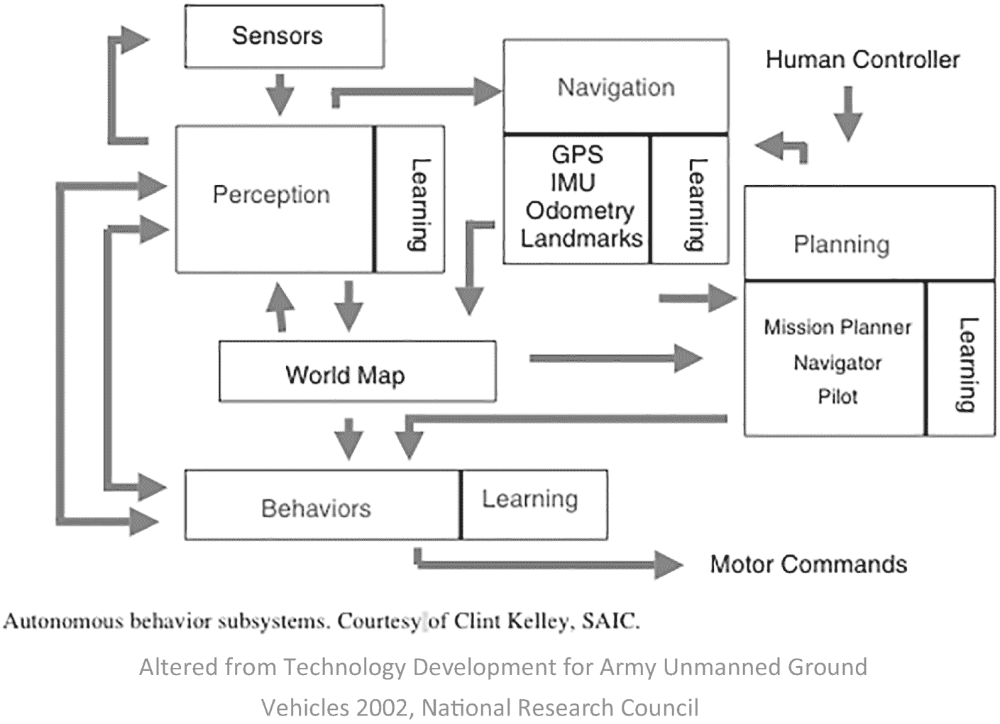
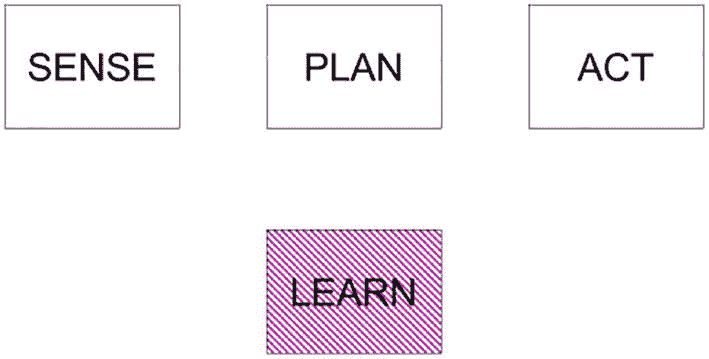
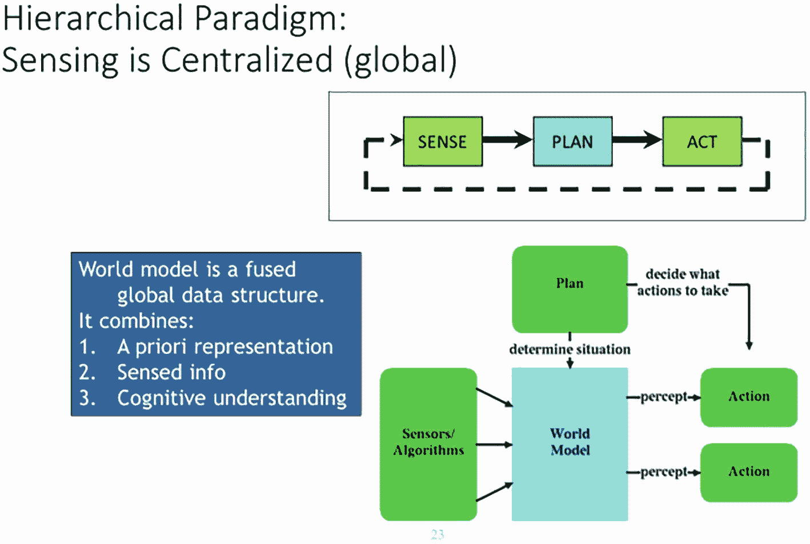

# 10. 吸收认知架构

本章讨论吸收认知架构的思想，包括方法、潜在方法和示例，然后我们总结该领域的发展方向以及其他技术。到本章结束时，你将理解以下内容：

+   吸收认知架构（Subsumption Cognitive Architecture，SCA）

+   吸收结构的四个关键领域：无人机情境意识（SA）、具身化、智能和涌现

+   如何通过提供的 Python 代码示例编程你的无人机以拥有吸收认知架构

+   SCA 与其他认知架构的比较

## 自主认知架构

吸收认知架构（SCA）涉及一个结构，这是一个旨在通过世界的符号心理表征来引导行为的结构；吸收架构以亲密和自下而上的方式将感官数据与运动决定相结合。它是通过将整个行为分解为子行为来做到这一点的。这些子行为被分解为一系列层级。每一层实现精确的行为能力，较高阶段可以吸收较低阶段（即，将较低层次整合/组合成一个更全面的整体）以创造可能的行为。例如，无人机最低层应该是“避开物体”。第二层将是“四处游荡”，它位于第三层“探索世界”之下。因为机器人需要具备“避开物体”的能力才能有效地“四处游荡”，所以吸收架构创建了一个高层使用低层能力的设备。所有层都获取传感器信息，并行工作并生成输出。这些输出可以是给执行器的指令或抑制或抑制不同层的信号。

## 吸收结构

**吸收结构**是一种反应式机器人结构，与基于行为的机器人紧密相关。吸收结构在独立机器人和实时人工智能领域产生了广泛的影响。它从相当独特的角度利用智能。无人机基于整个智能概念，对应于无意识思维过程。这种方法不是通过图像操作来模拟人类天才的因素，而是旨在实时互动以及对动态实验室或工作场所环境的可能响应。

目的是通过以下四个关键思想来获得知识：

1.  无人机情境意识（SA） – 情境意识人工智能的一个基本概念是，机器人应该能够在类似于人类的时间框架内对其周围环境做出反应。情境移动机器人不应通过使用内部符号集来象征世界，然后在这个模型上采取行动。相反，“实际的真实世界是其模型。”这是一种合适的感知到行动设置可以直接与世界互动而不是建模世界的能力。然而，每个模块/行为仍然在有效级别上对世界进行建模，但接近于传感器运动信号。这些可访问的模型必然使用算法本身硬编码的世界假设；然而，它们避免使用记忆来预测世界的行为，而是尽可能多地依赖直接感官反馈。

1.  体现 – 构建一个综合的智能体完成了两个艺术品。首先，它迫使设计者检查并创建一个综合的身体管理系统，不再是可能不再在物理世界中工作的理论模式或模拟机器人。第二是它可以立即解决图像基础问题，这是一个许多常见人工智能遇到的哲学难题，即立即将感官数据与重要行动耦合。世界基础回归，行为层之间的内部关系直接根植于机器人感知的世界。

1.  智能性 – 从进化进程来看，发展感知和移动技能是人类智能的关键基础。此外，通过使用自上而下的表示作为人工智能的可行起点，似乎“智能是通过与世界互动的动态来决定的。”

1.  出现 – 传统上，单个模块本身并不被认为是有智慧的。这种模块之间的相互作用，通过观察智能体及其环境来评估，通常被认为是合格的（或不是）。因此，“智能”在观察者的眼中。

上述概述的想法仍然是关于大脑的本质以及如何培养机器人技术和人工智能发展的持续辩论的一部分。

一个想法可能是按层添加智能，就像按需下载“应用”或升级到更新或更好的版本一样。这一切都取决于设计者认为机器人需要多少智能（Harbour 等人，2019；Murphy，2019）。

## 层次与增强有限状态机

每一层都包含一个由增强有限状态机（AFSM）组成的处理器沉积，增强通过“实例化”变量提供以保持可编程数据结构。一个层是一个模块，负责单一的行为目标，例如“四处游荡”。在这些行为模块内部或之间没有中央操纵器。所有 AFSM 都持续且异步地从适用的传感器接收输入并将输出发送到执行器（或不同的 AFSM）。在新输入到来之前未检查的输入警报最终会被丢弃。这些被丢弃的指示器很常见，并且对整体性能有益，因为丢弃它们可以让机器人通过仅处理最直接的信息来实时工作。

由于没有中央控制，AFSM 通过抑制和抑制信号相互交谈。抑制指示器阻止指示器完成执行器或 AFSM，而抑制警报阻止或替换层或其 AFSM 的输入。这种 AFSM 交流系统是更好的优化层吸收较低层的方式（见图 10-1），以及结构如何提供优先级和运动决定仲裁以做出最佳选择。一个例子可以是：1.) 从探索世界开始。2.) 明显地，它将吸收四处游荡。3.) 接下来在探索世界时避免物体。



吸收架构的示意图，包括传感器信息和执行器。传感器信息分为三个级别，标记为探索世界、四处游荡和避免物体。每个级别将信息传递到下一级，然后到达执行器，信息从那里流回传感器信息。

图 10-1

吸收架构的抽象表示，当感官信息决定时，高级层吸收低级层的角色。（布鲁克斯，罗德尼。[1999]。 Cambrian Intelligence: The Early History of the New AI。剑桥，马萨诸塞州：麻省理工学院出版社。）

层的改进遵循一种本能的进步。创建、测试和修复最低层。一旦这个最低阶段运行，就将第二层与适当的抑制和抑制连接附加到第一层。在测试和修复混合行为后，这种技术可以（理论上）重复用于任何行为模块的任何种类。

## 使用认知假设架构的示例

注意

查看卡内基梅隆大学的开源机器人导航工具包（CARMEN）[`http://www.cs.cmu.edu/~carmen/links.html`](http://www.cs.cmu.edu/%257Ecarmen/links.html)。

Rython 机器人（Pyro）由一系列封装低级细节的 Python 训练组成（[`https://works.swarthmore.edu/cgi/viewcontent.cgi?article=1009&context=fac-comp-sci`](https://works.swarthmore.edu/cgi/viewcontent.cgi%253Farticle%253D1009%2526context%253Dfac-comp-sci)）。

图 10-2 展示了 Pyro 架构的示意图。用户通过单个应用程序编程接口（API）编写机器人控制包。API 作为面向对象层次结构执行，为所有供应商提供的特定机器人 API 提供了抽象层。例如，在图 10-2 中，所有独特的 API 都抽象为`pyro.robot`类别。此外，Pyro 库中还有不同的抽象和服务可用。这些库有助于简化机器人的独特方面，并提供对硬件或模拟环境重要低级点的隔离（Blank, Kumar, Meeden, & Yanco, 2003）。



Pyro 架构的示意图。Pyro 库、你是机器人控制程序和 Python 库构成了一个 Pyro 机器人。Pyro 机器人分为 Khepera、先锋、便携式板和其他。每种类型都包含其机器人 API 和驱动模块。

图 10-2

Pyro 架构

不必了解 Pyro 实现的全部细节，但读者应注意到整个控制程序独立于机器人的类型和所使用的传感器的类型。列表 10-1 将使机器人在距离机器人前左或前中心各种传感器（分别在第 6 行和第 9 行讨论）的安全距离内（1 个机器人单位）避开障碍物，无论机器人的类型如何。第 14 行和第 15 行展示了 Pyro 自动初始化机制的细节。此类跟踪将在后续示例中省略（Blank et al. 2003）。

```py
# if approaching an obstacle on the left side #
turn right
# else if approaching an obstacle on the right side #
turn left
# else go forward
1 from pyro.brain import Brain
2 class Avoid(Brain):
3 def step(self):
4 safeDistance = 1 # in Robot Units
5 #if approaching an obstacle on the left side, turn right
6 if min(self.get('robot/range/front-left/value')) < safeDistance:
7 self.robot.move(0,-0.3)
8 #else if approaching an obstacle on the right side, turn left
9 elif min(self.get('robot/range/front-right/value')) < safeDistance:
10 self.robot.move(0,0.3)
11 #else go forward
12 else:
13 robot.move(0.5, 0)
14 def INIT(engine):
15 return Avoid('Avoid', engine)
(Pyro: A Python-based Versatile Programming Environment For .... https://works.swarthmore.edu/cgi/viewcontent.cgi?article=1009&context=fac-comp-sci)
Listing 10-1
An Obstacle Avoidance Program, in Pseudocode and in Pyro
```

Pyro 框架的大部分是用 Python 编写的，这是一种易于阅读的脚本语言，看起来非常类似于伪代码。它还与 C 和 C++代码无缝集成，这使得快速整合现有代码成为可能。C/C++接口还允许在较低级别实现非常昂贵的例程（如视觉程序），以实现更快的运行时效率。此外，我们还可以将用 C 和 C++编写的应用程序（如 Player/Stage）“包装”起来，以便它们在 Python 中立即和本地可用。请参阅以下列表 10-2 至 10-4，这些将在后续章节中讨论。

```py
from pyro.geometry import distance
from pyro.brain.behaviors.fsm import State, FSMBrain
class edge(State):
def onActivate(self):
self.startX = self.get('robot/x')
self.startY = self.get('robot/y')
def update(self):
x = self.get('robot/x')
y = self.get('robot/y')
dist = distance( self.startX, self.startY, x, y)
if dist > 1.0:
self.goto('turn')
else:
self.robot.move(.3, 0)
class turn(State):
def onActivate(self):
self.th = self.get('robot/th')
def update(self):
th = self.get('robot/th')
if angleAdd(th, - self.th) > 90:
self.goto('edge')
else:
self.robot.move(0, .2)
def INIT(engine):
brain = FSMBrain(engine)
brain.add(edge(1)) # 1 means initially active
brain.add(turn())
return brain
(Pyro: A Python-based Versatile Programming Environment For .... https://works.swarthmore.edu/cgi/viewcontent.cgi?article=1009&context=fac-comp-sci)
Listing 10-4
A Finite-State Machine Controller (Blank et al. 2003)
```

```py
from pyro.brain import Brain
from pyro.brain.conx import Network class NNBrain(Brain):
def setup(self): self.net = Network()
self.net.addThreeLayers(self.get('robot/range/count'), 2, 2) self.maxvalue = self.get('robot/range/maxvalue')
def scale(self, val):
return (val / self.maxvalue) def teacher(self):
safeDistance = 1.0
if min(self.get('robot/range/front/value')) < safeDistance: trans = 0.0
elif min(self.get('robot/range/back/value')) < safeDistance: trans = 1.0
else:
trans = 1.0
if min(self.get('robot/range/left/value')) < safeDistance: rotate = 0.0
elif min(self.get('robot/range/right/value')) < safeDistance: rotate = 1.0
else:
rotate = 0.5 return trans, rotate
def step(self):
ins = map(self.scale, self.get('robot/range/all/value')) targets = self.teacher()
self.net.step(input = ins, output = targets)
trans = (self.net['output'].activation[0] - .5) * 2.0 rotate = (self.net['output'].activation[1] - .5) * 2.0 robot.move(trans, rotate)
(Pyro: A Python-Based Versatile Programming Environment For .... https://works.swarthmore.edu/cgi/viewcontent.cgi?article=1009&context=fac-comp-sci)
Listing 10-3
A Neural Network Controller (Blank et al. 2003)
```

```py
from pyro.brain import Brain
from random import random class Wander(Brain):
def step(self):
safeDistance = 0.85 # in Robot Units
l = min(self.get('robot/range/front-left/value')) r = min(self.get('robot/range/front-right/value')) f = min(self.get('robot/range/front/value'))
if (f < safeDistance): if (random() < 0.5):
self.robot.move(0, - random()) else:
self.robot.move(0, random()) elif (l < safeDistance):
self.robot.move(0,-random()) elif (r < safeDistance):
self.robot.move(0, random()) else: # nothing blocked, go straight
self.robot.move(0.2, 0)
(Pyro: A Python-based Versatile Programming Environment For .... https://works.swarthmore.edu/cgi/viewcontent.cgi?article=1009&context=fac-comp-sci)
Listing 10-2
A Wander Program (Blank et al. 2003)
```

### 控制机器人汽车

现在我们将描述如何编程一个直接控制机器人汽车的 Raspberry Pi。机器人车辆与之前使用的相同；然而，现在它使用吸收架构来管理行为。用于吸收指令和脚本的编程语言是 Python。创建吸收性 Java 类使用 leJOS 完成。你可以在[`www.lejos.org`](http://www.lejos.org)了解更多关于这些 Java 课程的信息。需要两个主要的类：一个名为`Behavior`的抽象类别，另一个名为`Controller`。`Behavior`类通过以下方法封装了汽车的行为：

+   `takeControl`: 返回一个布尔值，表示 `Behavior` 类是否需要控制

+   `action`: 通过汽车实现特定的行为

+   `suppress`: 导致运动行为立即停止，然后返回汽车状态，以便后续行为可以发生（Norris 2019）。

```py
control.import RPi.GPIO as GPIO
import time
class Behavior(self):
global pwmL, pwmR
# use the BCM pin numbers
GPIO.setmode(GPIO.BCM)
# set up the motor control pins
GPIO.setup(18, GPIO.OUT)
GPIO.setup(19, GPIO.OUT)
pwmL = GPIO.PWM(18,20) # pin 18 is left wheel pwm
pwmR = GPIO.PWM(19,20) # pin 19 is right wheel pwm
# must 'start' the motors with 0 rotation speeds
pwmL.start(2.8)
pwmR.start(2.8)
(Beginning Artificial Intelligence With The Raspberry Pi .... https://idoc.pub/documents/beginning-artificial-intelligence-with-the-raspberry-pi-1430zjgkdo4j)
```

### 控制器类和对象

`Controller` 类包含主要的子吸收逻辑，该逻辑根据优先级和激活需求确定哪些行为是活跃的。以下是这个类中的一些方法：

+   `__init__()`: 初始化 `Controller` 对象

+   `add()`: 将行为添加到可用行为的列表中。它们被添加的顺序决定了行为的优先级。

+   `remove()`: 从可用行为的列表中删除一个行为。如果下一个最高优先级的行为覆盖它，则停止任何正在运行的行为。

+   `update()`: 停止旧的行为并运行新的行为

+   `step()`: 找到下一个活跃的行为并运行它

+   `find_next_active_behavior()`: 找到下一个希望变得活跃的行为

+   `find_and_set_new_active_behavior()`: 找到下一个希望变得活跃的行为并使其活跃

+   `start()`: 运行选定的行为方法

+   `stop()`: 停止当前的行为

+   `continuously_find_new_active_behavior()`: 实时监控希望变得活跃的新行为

（从树莓派开始人工智能······[《https://idoc.pub/documents/beginning-artificial-intelligence-with-the-raspberry-pi-1430zjgkdo4j》](https://idoc.pub/documents/beginning-artificial-intelligence-with-the-raspberry-pi-1430zjgkdo4j)）

`Controller` 对象还充当调度器，一次只有一个行为是活跃的。活跃的行为由传感器数据和其优先级决定。当具有更高优先级的行为发出信号表示它想要运行时，任何旧活跃的行为都会被抑制（Norris 2019）。

```py
import RPi.GPIO as GPIO import time
class Behavior(self): global pwmL, pwmR
# use the BCM pin numbers GPIO.setmode(GPIO.BCM)
# set up the motor control pins GPIO.setup(18, GPIO.OUT) GPIO.setup(19, GPIO.OUT)
pwmL = GPIO.PWM(18,20) # pin 18 is left wheel pwm pwmR = GPIO.PWM(19,20) # pin 19 is right wheel pwm
# must 'start' the motors with 0 rotation speeds pwmL.start(2.8)
pwmR.start(2.8)
```

使用 `Controller` 类有两种方式。第一种方式是让类自己处理调度器，通过调用 `start` 方法。另一种方式是通过调用 `step` 方法强制启动调度器。（Norris 2019）

```py
import threading class Controller():
def_init_(self): self.behaviors = []
self.wait_object = threading.Event() self.active_behavior_index = None
self.running = True
#self.return_when_no_action = return_when_no_action
#self.callback = lambda x: 0
def add(self, behavior): self.behaviors.append(behavior)
def remove(self, index):
old_behavior = self.behaviors[index] del self.behaviors[index]
if self.active_behavior_index == index: # stop the old one if the new one overrides it
old_behavior.suppress() self.active_behavior_index = None
def update(self, behavior, index): old_behavior = self.behaviors[index] self.behaviors[index] = behavior
if self.active_behavior_index == index: # stop the old one if the new one overrides it
old_behavior.suppress()
def step(self):
behavior = self.find_next_active_behavior() if behavior is not None:
self.behaviors[behavior].action() return True
return False
def find_next_active_behavior(self):
for priority, behavior in enumerate(self.behaviors): active = behavior.takeControl()
if active == True: activeIndex = priority
turn activeIndex
def find_and_set_new_active_behavior(self):
new_behavior_priority = self.find_next_a havior() if self.active_behavior_index is None or self.active_ behavior_index > new_behavior_priority:
if self.active_behavior_index is not None: self.behaviors[self.active_behavior_index].suppress()
self.active_behavior_index = new_behavior_priority
def start(self): # run the action methods self.running = True
self.find_and_set_new_active_behavior() # force it once thread = threading.Thread(name="Continuous behavior checker",
target=self.continuously_find_ new_active_behavior, args=())
thread.daemon = True thread.start()
while self.running:
if self.active_behavior_index is not None: running_behavior = self.active_behavior_index self.behaviors[running_behavior].action()
if running_behavior == self.active_behavior_index: self.active_behavior_index = None self.find_and_set_new_active_behavior()
self.running = False
def stop(self): self._running = False
self.behaviors[self.active_behavior_index].suppress()
def continuously_find_new_active_behavior(self): while self.running:
self.find_and_set_new_active_behavior()
def_str_(self):
return str(self.behaviors)
```

#### 控制器类别

`Controller` 类别通过允许将大量行为应用于通用方法的使用，而经常出现。`take Control()` 方法允许一个行为发出信号，表明它需要控制机器人。这种方式将在后面讨论。`action()` 方法是行为开始控制机器人的方式。如果传感器检测到机器人路径上的障碍物，障碍物避免行为将启动其 `action()` 方法。使用更高优先级的行为来退出或抑制较低优先级行为的 `action()` 方法，这就是 `suppress()` 方法的使用方式。这发生在障碍物避免行为通过抑制 `ahead` 行为的 `action()` 方法并使用自己的行为来接管正常前进运动行为时。

#### 控制器类型

`Controller` 类型需要一个列表或数组，其中包含包含机器人整体行为的对象。一个 `Controller` 实例从行为数组的最高索引开始，检查 `takeControl()` 方法的返回值。如果是真的，它将调用该行为的 `action()` 方法。如果是假的，`Controller` 将检查下一个行为对象的 `takeControl()` 返回值。通过将索引数组值附加到每个行为对象上来实现优先级排序。`Controller` 类别会持续重新扫描所有行为对象，并在更高优先级的行为在较低优先级的 `action()` 方法激活时断言 `takeControl()` 方法时，抑制较低优先级的行为。图 10-3 展示了添加所有行为后的此过程。



行为状态流程图。图表分为传感器、行为和执行器。传感器包括电池电压和超声波传感器，这导致在行为中停止机器人并避开障碍物，进而导致在执行器中的电机。行为还包括正常行为。

图 10-3

行为状态图（基于 Norris 2019）

现在是时候创建一个相对简单的基于行为的机器人示例了。

## 创建基于行为的机器人

`Controller` 类允许通过使用通用方法应用广泛的行为。`takeControl` 方法允许一个行为发出信号，表示它希望控制机器人。`action` 方法是行为开始管理机器人的方式。如果传感器检测到机器人路径上的障碍物，障碍物避免行为将启动其 `action` 方法。`suppress` 方法与更高优先级的行为一起使用，以放弃或抑制较低优先级行为的 `action` 方法。例如，障碍物避免行为通过抑制正常前进行为的 `action` 方法并拥有自己的 `action` 来接管正常前进行为。

现在是时候创建一个简单的基于行为的机器人示例了。`Controller` 类需要一个列表或数组，其中包含构成机器人基本行为的 `Behavior` 对象。一个 `Controller` 实例从 `Behavior` 数组的最高索引开始，测试 `takeControl` 方法的返回值。如果是真的，它将调用该行为的 `action` 方法。如果是假的，`Controller` 将检查下一个 `Behavior` 对象的 `takeControl()` 方法的返回值。通过查看与每个 `Behavior` 对象连接的索引数组值来决定优先级。`Controller` 类别会持续重新扫描所有 `Behavior` 对象，并在更高优先级的行为在较低优先级的 `action()` 方法激活时断言 `takeControl()` 方法时，抑制较低优先级的行为（Norris 2019）。

## 其他认知架构

一般而言，认知架构指的是以下内容：

+   一个描述系统在理论层面上做什么的操作架构。

+   系统架构可以由制造商（或研究小组）开发，可能看起来像数据流图。

+   技术架构指定了实际的过程和代码结构。

在接下来的章节中，我们将探讨一些不同类型的架构。

### 反应式认知架构

反应式（或行为）认知架构包含以下内容：

+   操作架构：描述系统在高级别上 *做什么*，而不是如何做

+   系统架构：描述系统如何通过 *主要子系统* 来工作

+   技术架构：描述系统如何通过 *实现细节*、语言、算法和代码来工作

如图 10-4 所示的行为机器人学是一种基本的“本能”架构，其中包含一系列称为行为的 SENSE-ACT 连接集，这些连接根据刺激被打开/关闭；在这个架构中没有任何计划。



行为机器人学的图表。一个标记为反应式或行为层的框指向另一个包含标记为感知和动作的框，它们之间有双头箭头。

图 10-4

行为机器人学（MIT Press 2019）

控制理论处于“较低”层次；然而，由于它靠近传感器，行为反应非常快。这个列表并不详尽：

*反应式（类型 1，行为）:*

+   与感知紧密耦合，因此非常快速

+   许多几乎同时发生的刺激-反应行为，通过简单的脚本链接在一起

+   由感知或外部刺激产生的动作

+   没有情境意识，没有任务监控

+   模型是关于车辆，而不是环境

到目前为止，行为组织表明存在三个不同感知、知识、规划范围和时间尺度的智能层。人工智能机器人领域已经汇聚到 PLAN，然后是 SENSE-ACT，LEARN 在需要时作为后期添加。技术上这是 SENSE-PLAN，SENSE-ACT，但历史上，用于规划的感知，就像执行监控一样，被归入“PLAN”。参见 Vemuru 等人（2019）。

### 典型操作架构

典型操作架构是编程智能机器人的潜在方法。它是一种模型，旨在以最简单可行的方式展示数据实体和关系，以便整合跨各种系统和数据库的过程（图 10-5）。在各个系统中交换的数据通常依赖于不同的语言、语法和协议。该架构由三个层次组成，通常代表交互、审议和行为。

交互层由程序性、功能性和本体语言（如 OWL）组成。审议层由功能语言（如 Lisp）组成。行为层由程序语言（如 C、C++ 和 Java）组成。每一层都有不同类型的程序结构。



从上到下分为三层，分别标记为交互层、深思熟虑层和行为层的规范操作架构图。

图 10-5

规范操作架构（Harbour 等人 2019 年；麻省理工学院出版社 2019 年）

机器人需要多少智能由以下因素确定：

+   机器人需要执行哪些功能，例如生成、监控、选择、实施、执行行为或学习。

+   函数需要什么规划范围；例如，现在、现在+过去、现在+过去+未来。

+   需要确定算法更新的速度。

+   可能需要实现控制理论，例如使用封闭世界和保证执行速率。

+   该模型是针对本地、全局还是两者兼而有之的操作？



一个三轴系统示意图，其中平面被标记为任务复杂性、人类独立性和环境复杂性。

图 10-6

复杂性（麻省理工学院出版社 2019 年）

### 系统和技术架构

系统架构是由研究人员或研究小组开发的，并具有三种范例：分层或反应式，或混合的深思熟虑/反应式。系统架构可以使智能的认知架构更具体。它们非常依赖于实现并涉及子系统。以下是一些附加功能：

+   能够将规范操作架构中的功能与五个常见子系统相关联

+   根据以下 1）三个 AI 机器人原语的关系和 2）感知处理将系统的架构分类为分层、反应式或混合的深思熟虑/反应式。

+   能够绘制混合的深思熟虑/反应式系统架构

+   了解通常组织系统的三种方式

+   理解这些对规范系统架构的贡献

为了使架构更具体，我们再次添加了混合的深思熟虑/反应式架构，从而产生三层。系统架构的五个子系统如下：

1.  导航（生成）

1.  地图制作，环境建模

1.  规划（任务生成、执行）

1.  电机模式（执行电机命令）

1.  感知、传感、感知模式

技术架构通常涉及一项新程序，例如潜在场。技术架构受操作和系统架构的影响。技术架构包含特定的算法，以及控制和知识结构。子系统可以进一步简化为两个术语，即两个属性：

1. *关系*，即三个构建块或机器人原语的排列方式

2. *内容*，即如何处理感知（麻省理工学院出版社 2019 年）

#### 人类模型

当一个人为了实现机器意识而推导认知模型时，必须参考人类模型。让我们从大脑的上部或皮层开始；在这里，我们有关于目标和数据的推理。接下来，中间大脑将传感器数据转换为符号数据。最后，脊髓和“下部”大脑是技能和反应发生的地方。这可以创建一个最抽象的规范操作架构，在策略和行为的（反应性）层之间产生大量交互（见图 10-7）。



自主行为的示意图，展示了导航、学习、传感器、规划、世界地图、行为、感知、任务规划导航飞行员和 GPS IMU 测距地标之间的交互，以从人类控制器提供电机命令。

图 10-7

自主行为

图 10-8 显示了与智能体一起的 AI 原语（构建块）。



四个矩形框分别标记为感知、计划、行动和学习。学习被突出显示。

图 10-8

AI 原语

#### 操作架构的层次范例

**层次结构**是一种自然的组织方式，因为它们不是根本上的僵化或不高效（见图 10-9）。它们比集中式规划更灵活，目标和优先级更加明显（Albus & Mystel 2001；Murphy, 2019）。



层次范例的示意图。感知、计划和行动的循环位于顶部。下面是计划、传感器和算法进入世界模型的图示，以提供行动。相邻的文本说明世界模型是一个融合的全局数据结构。它结合了先验表示、感知信息和认知理解。

图 10-9

层次范例（改编自 Murphy 2019）

### 策略架构

这就是 AI 机器人接收并处理所有可用感官信息的地方，然后利用它存储的适当内部知识，结合 AI，然后进行推理以创建行动计划。为此，机器人必须对所有潜在的计划进行搜索，直到找到一项能够成功完成工作的计划。这要求 AI 机器人向前看，考虑所有可行的移动和结果。不幸的是，这可能会很耗时，产生延迟；然而，AI 的进步可以缩短这一时间，并允许机器人战略性地行动。

### 反应架构

为了使机器人能够快速响应不断变化和无结构的环境，可以使用反应式架构。在这里，感觉输入与执行器输出紧密耦合，以便发生“刺激-反应”。自然界中的动物大多是反应性的。然而，这也有局限性。因为只有刺激-反应，这种架构没有工作记忆，没有环境的内部表示，也没有随着时间的推移学习的能力。

### 混合架构

在混合架构中，可以结合两者的优点：反应性和深思熟虑。在其中，机器人“心智/大脑”的一部分/类型/系统进行规划，而另一部分则处理即时反应，例如避开障碍物和保持在道路上。明显的挑战是有效地将这两部分心智/大脑结合起来（Harbour 等人，2019 年）。这可能需要人工智能机器人心智/大脑的额外部分作为“执行者”。（参见 Harbour 等人，2019 年。）混合架构可以将反应性系统的响应性与纯粹深思熟虑系统的灵活性结合起来，更传统的符号或深思熟虑的方法产生高水平的鲁棒性。仅反应性系统缺乏考虑环境先验知识的能力，也不能通过长期记忆跟踪过去（什么有效，什么无效）。它们也不使用工作记忆；它们只是反应。一个混合系统的例子可以是典型的三层混合架构：底层是反应性/基于行为的层（类型 1 处理），其中传感器/执行器紧密耦合；上层提供深思熟虑的组件（例如，规划，定位）（类型 2 处理）；而介于两者之间的部分可以称为执行层或包含在类型 2 中。（参见 Harbour 等人，2019 年。）

## 摘要

额外加分

练习 10.1：描述**架构类型**？

练习 10.2：描述**子吸收认知架构**？

练习 10.3：利用本章所述和展示的认知架构，设计、开发和编程分配给你的硬件（机器人），使用软件执行由指导教师分配的任务，利用智能（AI）。

### 任务

有四个类别：时间、行动主体、运动和依赖性。

1.  时间：

    +   固定时间。例如：在 20 分钟内收集尽可能多的物品。

    +   最短时间。例如：尽可能快地访问区域内的所有建筑物（最小化时间）。

    +   无限时间。例如：在该区域内巡逻建筑物。

    +   需要同步。例如：同时按下两个或更多按钮。

1.  行动主体：这有两个类别：基于对象和基于机器人。

1.  运动。前往或边走边去，覆盖或收敛。

1.  依赖性：独立、依赖和相互依赖。

## 参考文献

布兰克，D.，库马尔，D.，米登，L.，扬科，H. (2003)。Pyro：一种基于 Python 的通用编程环境，用于机器人教学。*教育计算资源杂志（JERIC）*，*3*(4)，1–es.

克拉克，J.D.，哈伯尔，S.D. (2019)。未发表。

克拉克，J.D.，米切尔，W.D.，维穆鲁，K.V.，哈伯尔，S.D. (2019)。未发表。

张，T.H.，许，C.S.，王，C.，杨，L.–K. (2008). 测量和异常行为的机载测量和警告模块。*IEEE 智能运输系统杂志*，*9*(3)，501–513.

戴安，P.，阿布特，L.F. (2001)。*理论神经科学：神经系统的计算和数学建模*。麻省理工学院出版社。

格斯特纳，W.，基斯特勒，W. (2002)。*突触神经元模型：单个神经元、群体、可塑性*。剑桥大学出版社。

弗里斯顿，K.，布祖斯基，G. (2016)。时间的功能解剖：大脑中的什么和何时。*认知科学趋势*，*20*(7)，500–511.

弗里斯顿，K. (2018). 我是否具有自我意识？（或者自我组织是否意味着自我意识？）。*心理学前沿*，*9*，579\. doi:10.3389/fpsyg.2018.00579

哈伯尔，S.D. (2022). 辛克莱尔学院 / 代顿大学，AVT 4215 / ECE 595：航空中的自主系统 / 自主系统和人工智能。演讲，代顿大学，俄亥俄州。

哈伯尔，S.D.，克里斯滕森，J.C. (2015 年 5 月)。神经人机工程学准实验：情境意识预测因子。在：*防御、安全和航空电子学中的显示技术和应用 IX；以及头戴式和头盔式显示器 XX*（第 9470 卷，第 94700G 页）。SPIE。

哈伯尔，S.D.，罗杰斯，S.K.，克里斯滕森，J.C.，萨扎马里，K.J. (2015，2019)。理论：向自主性和情境意识联系的理论。在第四届俄亥俄州 UAS 会议上的演讲。代顿会议中心，俄亥俄州，美国。

哈伯尔，S.D.，克拉克，J.D.，米切尔，W.D.，维穆鲁，K.V. (2019)。机器意识。*第 20 届国际航空心理学研讨会*，480–485\. [`corescholar.libraries.wright.edu/isap_2019/81`](https://corescholar.libraries.wright.edu/isap_2019/81)

基德，C.，海登，B.Y. (2015)。好奇心的心理学和神经科学。*神经元*，*88*(3)，449–460.

基斯坦，T.，加迪，A.，萨巴蒂尼，R. (2018)。空中交通管理中的机器学习和认知人机工程学：最新发展和认证考虑。*航空航天*，*5*(4)，文章编号 103。

洛文斯坦，G. (1994). 好奇心的心理学：综述与重新解释。*心理学通报*，*116*(1)：75–98.

米切尔，W.D. (2019 年 2 月)。私人通信。

摩尔，R.R. (2019). *人工智能机器人导论*。麻省理工学院出版社。

诺里斯，D.J. (2019)。*使用 Raspberry Pi 开始人工智能*。Apress。

李，L.S.，汉斯曼，R.J.，帕拉西奥斯，R.，威尔什，R. (2016). 通过高斯混合模型进行飞行操作和安全监控的异常检测，*交通运输技术，第 C 部分：新兴技术*，*64*，45–57.

普尔，塔赫里，阿莱米，梅赫达里（2018）. 人机面部表情相互交互平台：自闭症儿童案例研究. *国际社会机器人杂志*, *10*(2), 179–198.

Rogers, S. (2019). 未发表.

沙皮，卡尔霍恩，查拉萨尼（2014）. 神经元、行为和情绪适应的信息理论. *神经生物学当前观点*, *25*, 47–53.

维穆鲁，哈伯，克拉克（2019）. 无论是无人机还是有人机，航空中的强化学习，注入人工智能。*第 20 届国际航空心理学研讨会*, 492–497\. [`corescholar.libraries.wright.edu/isap_2019/83`](https://corescholar.libraries.wright.edu/isap_2019/83)

徐思涛，谭伟强，叶夫列莫夫，孙立刚，曲晓（2017）. 人类飞行员行为控制模型综述. *控制年评*, *44*, 274–291.

赵伟志，何峰，李立生，肖戈（2018）. 飞行数据聚类分析的适应性在线学习模型. 在：*2018 年 IEEE/AIAA 第 37 届数字航空电子系统会议论文集*（第 1-7 页）. 伦敦，英国，*IEEE-AIAA 航空电子系统会议*.
