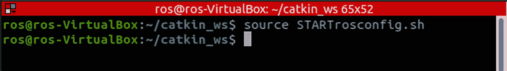
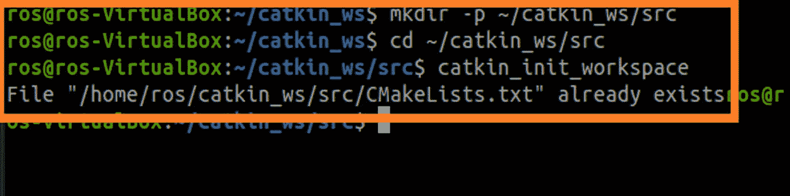
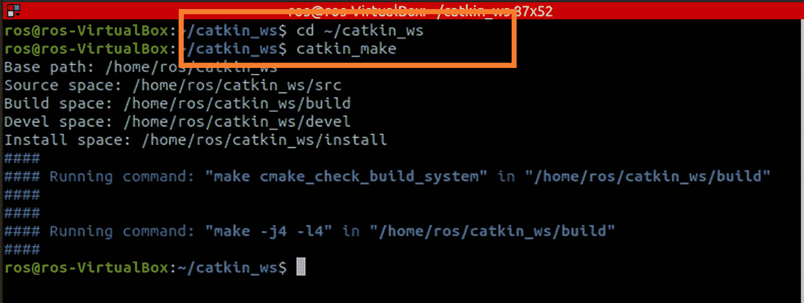
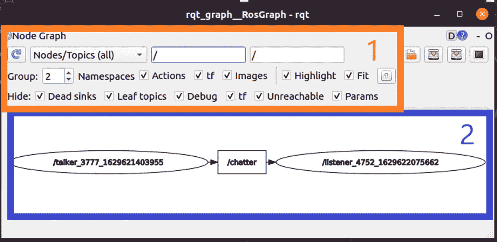

# 12. 深入考察和解释 Noetic ROS

我们现在将进一步探索机器人操作系统（ROS）生态系统的领域，以仔细检查 Noetic ROS 中可用的功能。本章更深入地涵盖了 ROS 功能、实用工具、设施和工具，并补充了第三章和第四章。

## 目标

以下将涵盖关于 ROS 的目标：

+   理解 ROS 的理由、哲学和目的。

+   探索 ROS 设施，例如图表、`roscore`、`catkin_make`、软件包、`rosrun`、`roslaunch` 和工作空间。

+   探索 ROS 主题、服务和动作。

+   比较和对比 Raspberry Pi 4 上的 ROS1 和 ROS2。

+   使用 `rqt_console` 调试有缺陷的 ROS 程序。

## ROS 哲学

Noetic ROS 的基本理念是让人们能够创建机器人应用而无需重新发明轮子。这种能力涉及共享代码、算法、库和想法，以有效地创建更复杂的机器人应用。ROS 有超过 2,000 个硬件和软件应用。这些包括从激光雷达等传感器接收数据的驱动程序，以及向漫游车执行器发送命令的驱动程序。我们还有不断扩大的算法集合，允许使用 ROS 进行 SLAM、导航、图像处理、目标检测、路径规划和神经认知解决方案。Noetic ROS 分配计算需求，并将工作负载分配给多个 ROS 程序或节点。然而，我们必须注意内存限制，并确保节点的总数不超过 7。ROS 使用多个调试工具来纠正任何发现的故障行为后的分布式工作流程。这些工具管理多个 ROS 节点程序的复杂性。ROS 的这些优势使 ROS 开发者能够节省资金、研究努力，最重要的是，节省时间。

与其他 ROS 环境（如 Kinetic、Indigo 等）一样，Noetic ROS 环境允许使用 UNIX 软件开发哲学。UNIX 哲学旨在创建稳定、模块化和可重用的软件。另一种说法是，它有助于构建小型程序，这些程序只做一件事，而且做得很好。ROS 通过 ROS 节点程序来实现这一点，其中每个节点程序只做一件事，例如 SLAM 或目标检测，并且做得非常好。以下段落描述了 ROS 以多种方式适应和利用 UNIX 哲学进行软件开发的许多方法。

+   ROS 系统由称为节点的小型计算机程序组成，它们相互交互并交换消息。这些数据和命令消息在程序节点之间建立连接。无需中央路由服务来管理这些消息，这使得我们的 AI 洞窟车 ROS 应用程序能够扩展。我们可以通过添加 SLAM、感知、物体视觉检测、感知和规避作为单独的节点来实现这一点。许多开发环境，如 Python Pycharm 和 GNU 工具集，支持 ROS 节点开发。

+   ROS 结合了开源和专有软件，以实现更大的机器人能力和功能。Noetic ROS 还鼓励开发者使用如 TensorFlow 这样的外国库，这些库可以用于向其他 ROS 节点程序发送和接收消息。然后我们可以将相同的库离线并测试它，以确定它是否正常工作。Noetic ROS 还支持开源和专有软件库。这两种类型的软件可以在 ROS 节点内部运行并相互操作。

## ROS 基础知识

对于本节，我们将快速回顾 Noetic ROS 的底层架构。ROS 允许多个不同的程序通过消息相互通信。现在，我们将更深入地了解允许这种情况发生的底层架构。我们还将看到如何将经过良好测试的 ROS 软件集成进来。软件的重用将使我们能够应对 AI 洞窟车可能面临的许多挑战。

激励 ROS 创建的一个原始问题是“取回物品”挑战。这个挑战与 AI 洞窟车原始任务要求非常相似，即探索埃及地下墓穴以找到并识别其中的文物。主要区别是 AI 洞窟车将没有机械臂。然而，它将有一个摄像头、激光/激光雷达传感器、陀螺仪和惯性测量单元（IMU）。我们可以轻松地为 AI 洞窟车添加机械臂，从而增加本教科书的复杂性。然而，我们将为这本教科书提供一个支持网站，该网站将回顾末端工具和机械臂，以确保安全地从 AI 洞窟车在其环境中找到的物体中提取。洞窟车的任务是导航环境、找到物品、识别物品并定位物品的位置。一旦定位到所有物品，洞窟车必须返回初始起点。AI 洞窟车的这项基本任务将突出软件应用程序控制 AI 洞窟车时的一些特定和特殊要求。AI 洞窟车机器人软件开发的一些更详细的要求如下：

+   Noetic ROS 应用程序必须分解为独立的子系统，如导航、视觉、感知和规避、路径规划、决策分析和决策执行。

+   我们还可以回收这些完全相同的子系统，将它们用于其他机器人应用，例如军事巡逻和安全。

+   我们应该能够在不同的机器人硬件平台上以几乎不需要修改底层源代码的方式操作相同的子系统。

我们应该首先审查 ROS 的第一个组件，即 ROS 节点的图，这将允许我们描述同时运行的程序，这些程序正在相互发送和接收消息。我们将使用图来描述 ROS 程序之间的互连，这些程序被描述为节点。图允许我们管理 ROS 应用的复杂性。在这些节点之间定义的图形线也是消息将在节点之间传输数据和命令的地方。因此，通过使用 ROS 应用的图，我们可以立即看到整个应用的复杂性和功能。我们还可以了解功能以及哪些节点正在将哪种类型的数据或命令传输到其他节点。然后我们可以看到每个 ROS 程序是一个特定的节点，它只是复杂机器人系统的一个组成部分。

一个 ROS 图节点代表一个自维持的 Python 程序，它发送或接收数据或命令消息。连接这些节点的相同消息代表图边。ROS 节点通常是可移植操作系统接口 (POSIX) 进程，边是带有 IP 地址的 TCP 以太网连接。将控制激光雷达、摄像头、IMU、陀螺仪和神经处理的 Python 源代码分离到单独的 ROS 节点中，使得 ROS 应用程序能够对故障具有更强的抵抗力。因此，如果单个或多个 ROS 节点出现故障，这些故障不会导致整个 ROS 应用程序失败。然而，我们需要检查任何 ROS 应用程序的一个潜在“阿基里斯之踵”，那就是 `roscore`。`roscore` 是主要的 ROS 主节点程序，它允许每个 ROS 节点找到彼此，并为 ROS 形成一种操作系统内核。

`roscore` 主节点类似于任何操作系统内核，因为它为 ROS 节点提供信息服务，以便它们可以传输和接收数据以及命令消息，从其他 ROS 节点发送和接收。`roscore` 节点对于任何 ROS 应用程序都是至关重要的，因为这个主节点允许其他节点正确连接。在供电和初始化阶段，`roscore` 主节点接受并记录所有其他 ROS 节点所需的消息流。`roscore` 节点还将新的 ROS 节点添加到主 ROS 应用程序中。`roscore` 节点将在新添加的 ROS 节点和其他所需节点之间形成正确的消息流。

注意

然而，我们需要明确，一旦 `roscore` 主节点建立了节点之间的连接，`roscore` 节点不会直接处理节点之间数据和控制命令的交换。这防止了 ROS 应用（AI 漫游车）中的数据块问题。数据块问题只有在 `roscore` 节点本身必须完全处理消息交换的情况下才会发生。相反，ROS 节点之间处理数据交换和命令消息。`roscore` 交互仅在节点建立联系后才会发生。

`roscore` 主节点程序是所有 ROS 应用（漫游车）的基本基础。这个基础使得节点能够在 ROS 应用中找到其他节点。`roscore` 主节点还提供了一个参数服务器，允许配置 ROS 节点。参数服务器允许节点存储和检索任意数据结构，例如神经网络的学习率参数。对于任何 ROS 应用（漫游车）来说，以下是一些重要的基础考虑因素：为 ROS 应用源代码创建工作空间、ROS 包的组织以及 ROS 构建系统（`catkin`）的运作方式。

## Noetic ROS Catkin

ROS 构建系统，或 `catkin` 系统，是一套 ROS 用于生成可执行程序和库的工具，用于我们的 ROS 应用（AI 漫游车）。我们将使用的库包括 TensorFlow 或 Keras 库。这些库为 AI 漫游车开发深度神经网络例程。由于我们主要使用 Python 作为 AI 漫游车的开发语言，因此我们不需要了解 `catkin` 的编译过程，就像我们使用 C/C++ 这样的编译型语言时需要了解的那样。然而，有关在 C/C++ 系统中关于 `catkin` ROS 构建的更多信息，请参阅[`wiki.ros.org/catkin?distro-noetic`](http://wiki.ros.org/catkin%253Fdistro-noetic)。

`catkin` ROS 构建环境使用一系列工具集、`CMake` 宏和 Python 程序来增强 Unix `CMake` 工作流程，以创建独特的 ROS 应用。`CMake` 生成两个关键文件，`CMakeLists.txt` 和 `package.xml`，这些文件包含 ROS 正确工作所需的具体信息。我们将快速回顾修改和添加信息到这两个文件所需的工具，以成功创建 ROS 应用。

### Noetic ROS 工作空间

我们现在必须进一步测试第三章中创建的 `catkin` 工作空间 `catkin_ws`。我们可以创建多个工作空间。例如，在第六章中，我们能够将 Python 和启动源代码分别划分到控制器和仿真工作空间中。然而，我们一次只能在一个工作空间内开发和测试源代码。

我们必须再次检查，以确定我们的系统级 ROS 设置脚本`STARTrosconfig.sh`文件是否仍然在第三章中工作。在创建或编译任何工作空间目录之前，我们需要一致地执行此脚本，如图 12-1 所示。有关创建设置脚本的更多信息，请参阅第三章。



用于编译任何工作空间目录的脚本的屏幕截图。它有 2 行。

图 12-1

从第三章的`STARTrosconfig.sh`开始

我们必须确保我们也可以开发和初始化橙色框中看到的`catkin`工作空间。然后我们输入图 12-2 中看到的命令。



猫 kin 工作空间初始化的屏幕截图。前四行命令通过一个矩形框被突出显示。

图 12-2

初始化 catkin 工作空间

当工作空间目录和源代码目录（`/src`）都创建后，`catkin_ws`就会初始化。再次强调，这个源代码目录是 ROS 应用（rover）源代码将存放的地方。`catkin_ws/src`目录需要`catkin_init_workspace`命令。这个 ROS 命令将在`/src`目录中生成`CMakeLists.txt`文件，如图 12-2 所示。生成的`CMakeLists.txt`文件还包含一组指令和说明，描述了 ROS 项目（rover）的源文件和目标（可执行文件、库或两者）。当你[创建一个新项目](https://www.jetbrains.com/help/clion/creating-new-project-from-scratch.html)或工作空间时，`catkin_init_workspace`命令会自动生成`CMakeLists.txt`文件并将其放置在项目根目录（`~/catkin_ws/src`）。你可以将 Gedit 编辑器指向`CMakeLists.txt`文件并选择“以项目打开。”

我们将生成`(/build)`和`(/devel)`目录，以便`catkin`系统保存使用 C/C++编程语言开发的库和可执行程序。然而，由于我们将使用 Python 编程语言，我们只会偶尔使用`(/build)`目录。要生成`(/build)`和`(/devel)`目录，我们现在必须输入图 12-3 中橙色框中找到的命令。



屏幕截图突出显示了用于生成构建和开发目录的命令。

图 12-3

Catkin_make 命令

## Noetic ROS 软件包

为探测车组织的 ROS 软件是在包中完成的。所有 Noetic ROS 包都将位于工作空间的`/src`目录中，包括`CMakeList.txt`文件和`packages.xml`文件。这两个文件讨论了`catkin_ws`应该如何与任何 ROS 包交互，以创建 ROS 应用程序的基础。这些相同的包还包含代码、数据和文档。要创建一个 ROS 包，需要使用以下命令：

```py
cd  ~/catkin_ws/src
catkin_create_pkg ai_rover rospy
```

所有包都必须位于`/src 目录`中，以有效地组织源代码文件。我们已经调用了`catkin_create_pkg`来创建`ai_rover`包。然而，每个 ROS 包也非常依赖于 ROS 包依赖项，例如`rospy`。还有许多其他 ROS 依赖项的例子，如`NumPy`、`TensorFlow`和`OpenCV`。此外，如果主要的 ROS 依赖项`(rospy)`需要其他库作为附加依赖项`(OpenCV)`，你可以在命令终端以下方式列出它们：

```py
cd  ~/catkin_ws/src
catkin_create_pkg ai_rover rospy opencv
```

`catkin_create_pkg`命令创建一个与包名相同的目录`(ai_rover)`、`package.xml`和`CMakesLists.txt`文件，以及一个用于我们未来 AI 探测车 Python 脚本文件的`/src`目录。在本章的后面部分，我们将讨论在`packages.xml`和`CMakesList.txt`文件中找到的元数据（或关于数据的数据）。

现在我们已经创建了一个 ROS 包，我们可以将 Python 节点（神经网络、视觉处理和感知-避免能力）放入 ROS 包的`/src`目录中。我们还将方便地开发未来的启动、世界和机器人`URDF`描述文件，并将它们组织到它们自己独特且独立的目录中。现在我们有一个用于 Python 脚本节点的`/src`目录，我们必须回顾必要的终端 ROS 命令来执行这些 Python 节点，以控制我们的 AI 探测车。

## Noetic ROS rosrun

ROS 的整个基础设施都依赖于我们在上一节中刚刚审查的包的创建。一个 ROS 包是一组 Python 源代码、启动文件、世界模型和机器人描述文件，它们一起构建和分发。这使得我们能够为 ROS 开发并发处理系统，因为每个包可以包含多个不同的编译后的 Python 脚本例程，这些例程可以并行执行。每个编译后的 Python 脚本文件都进入一个 ROS 节点。因此，我们可以同时启动和管理任意数量的不同 ROS 节点，以创建我们 AI 探测车的智能。

如果我们要回顾第三章，我们会看到“talker”和“listener”ROS 测试节点的例子，这些节点首次在第三章中使用，以测试 Noetic ROS 的安装是否成功。这两个 ROS 节点都附加到了`rospy_tutorials`包上。包的一个问题是找到或定位它们的目录。我们使用 ROS 命令工具`rosrun`来查找任何需要的目录。

注意

有关“说话者”和“听者”示例的更多信息，请参阅第三章。

一旦我们启动了“说话者”节点向“听者”节点发送消息，我们就可以使用 ROS 查询终端命令行工具来确定 ROS 系统（AI 机器人）的当前状态。ROS 的主要且最强大的查询命令行工具之一是`rostopic`。`rostopic`命令将当前活动主题的列表打印到控制台，这是确定我们的 ROS 系统是否正常工作的重要信息。如果我们保持`roscore`、“说话者”和“听者”节点的三个终端窗口打开并运行，我们就可以打开第四个终端窗口并输入以下`rqt_graph`命令。一旦我们输入这个命令，我们应该看到以下显示（图 12-4）。



一个标记为 r q t underscore graph underscore R O S graph r q t 的 ROS 应用程序的屏幕截图。屏幕分为两部分。第一部分有 3 个面板来编辑节点图。第二部分显示说话者、聊天者和听者之间的连接。


RQT 图形工具图

一旦你看到图 12-4 中的显示，点击橙色框左上角的自动再生图标将是明智之举。我们这样做是为了获取我们当前 ROS 系统中传递的任何消息的最新版本。每次我们删除或添加 ROS 应用程序中的 ROS 节点时，我们也会点击自动再生图标。自动刷新图标如图 12-5 所示。一旦我们点击自动再生图标，我们应该看到蓝色框中的图是最新且当前活动的 ROS 应用程序。这些工具将帮助我们开发、测试和部署 ROS1 和未来的 ROS2 应用程序到 Raspberry Pi 4 上。Raspberry Pi 4 将作为我们勇敢机器人的“大脑”。


自动再生的图标。

图 12-5

自动再生图标

## 构建机器人的大脑

我们已经到达这本教科书的结尾。现在我们必须为 Raspberry Pi 4 安装 Raspbian 操作系统或 Ubuntu 20.04 LTS。这些操作系统支持 ROS1 Noetic。在 ROS2 或 Foxy 的情况下，我们只安装 20.04 Ubuntu 服务器。作为安装 ROS1 或 ROS2 的一部分，我们必须能够通过我们的开发笔记本电脑或台式计算机连接到 Raspberry Pi 4，以控制和监控机器人在执行任务时的情况，该机器人配备了一个预先加载的 Raspberry Pi 4。但是首先，我们必须回顾 ROS1 和 ROS2 之间的区别，以了解为特定机器人任务加载哪个 ROS 版本。如果机器人任务不是关键任务，ROS1 Noetic 可能更好。如果软件开发时间较长或复杂（涉及多个机器人的群体智能）并且需要面向对象编程，则可能需要 ROS2 Foxy。

### ROS1 与 ROS2

你可能想知道 ROS1 和 ROS2 有何不同？ROS2 是什么，它为我们勇敢的漫游车提供了哪些优势？

本节将为您提供关于发生了什么变化以及有什么新内容的实际概述。我们将重点关注 ROS1 和 ROS2 之间的主要区别。我们将尽量简明扼要。

当我们谈论 ROS（即机器人操作系统）的生态系统、社区等一般概念时，我们将只使用术语 *ROS*。然而，当我们讨论本章节的具体 ROS 版本时，我们将使用 *ROS1* 和 *ROS2*。

自 2007 年以来，ROS1 开发团队利用他们多年的经验和所学到的教训来确定要添加哪些功能和进行哪些改进。不幸的是，将这些修改全部添加到 ROS1 中会导致 ROS1 Noetic 的不稳定。因此，ROS2 是从头开始开发的，是一个全新的 ROS。这个新的 ROS 变体结合了从 ROS1 中学到的教训。ROS1 的改进领域包括安全和安全性。在 ROS 进入工业应用之前，ROS 需要解决这些问题。

### 漫游车使用 ROS1 还是 ROS2？

有三个主要区域区分了 ROS1 Noetic 和 ROS2 Foxy；让我们仔细回顾它们。首先，我们应该考虑的是，对于漫游车来说，ROS1 Noetic 是最后一个 ROS1 变体，支持将在 2025 年 5 月结束。ROS Noetic 版本为 Python3 语言提供支持。Noetic ROS 拥有大量为传感器（如激光雷达）开发的库，这些库需要一些时间才能移植到 ROS2 Foxy。同时，ROS2 Foxy 的支持将持续一年，因为每年都会有一个新的 ROS2 版本可用。ROS2 现在已经稳定，因此我们可以开发漫游车任务。ROS1 Noetic 和 ROS2 Foxy 之间的第一个区别涉及 ROS 节点。

#### ROS1 Nodelets 或 ROS2 组件

为了简单起见，我们不会回顾 ROS 节点的 C/C++ 编程开发。我们将只关注本章 12 节和其他章节中 Python 语言的细节。有关 ROS 应用程序的 C++ 编程的更多详细信息，请参阅 `ROS.org` 网站。

考虑使用 ROS 回调函数，在类节点中，它们被用作 ROS1 节点的基石。因此，ROS1 节点的开发是无结构的。然而，在 ROS2 中，通过节点对象的一个类模板，可以实现结构化开发。ROS2 从节点的基类继承了其功能。ROS2 使用良好的面向对象编程（OOP）和模块化方法来创建节点，这将帮助节点创建者处理可能复杂的节点交互。ROS2 与 OOP 开发兼容性更高。ROS2 还允许将节点组转换为组件。节点组件也可以表示为 UML 图，这进一步增强了模块化设计。

ROS1 节点也是一个可执行文件。还有 ROS1 节点集（nodelets），它使用单个启动文件启动多个节点——非常适合硬件资源有限或节点间发送消息的情况。在 ROS2 中，这些软件实体现在被称为组件。组件只是从面向对象（OOP）中略微修改过的节点类。使用 ROS2，你现在可以使用组件从同一个可执行文件中处理多个节点。

ROS2 组件使我们能够创建高效的 ROS2 应用程序。Python 脚本允许从启动文件、终端或另一个可执行文件中启动组件。还存在可编程的进程内通信，以消除任何所需的 ROS2 通信开销。

#### ROS1 和 ROS2 启动文件（LaunchFiles）

ROS1 和 ROS2 启动文件（LaunchFiles）允许你从一个文件中启动所有节点。你可以启动一个标准节点、节点集或组件——在 ROS1 中开发的 LaunchFiles 是用 XML 编程的。

在 ROS2 中，现在使用 Python 来编写 LaunchFiles。Python 允许你启动一个或多个节点。Python 还允许 LaunchFiles 更好地适应不断变化的机器人需求，例如更改探测器的传感器或用替代设计替换探测器设计。

如果你想的话，ROS2 的 LaunchFiles 可以用 XML 和 Python 编程。但使用 Python 允许更多的模块化，并且已经成为开发 ROS2 LaunchFiles 的标准流程。以下链接描述了如何为 ROS1 ([`http://wiki.ros.org/roslaunch`](http://wiki.ros.org/roslaunch)) 和 ROS2 ([`https://roboticsbackend.com/ros2-launch-file-example/`](https://roboticsbackend.com/ros2-launch-file-example/)) 开发 LaunchFiles。

#### ROS1 和 ROS2 通信（Communications）

ROS1 和 ROS2 之间的第一个显著区别是 ROS2 中没有 ROS 主节点。在过去，ROS1 需要先启动 ROS 主节点，然后才能启动任何 ROS 应用程序。ROS1 主节点还充当 ROS1 节点之间消息主题的控制器。然而，在 ROS2 中，不再存在任何 ROS 主节点。这种缺少主节点的特性允许实现真正的异步分布式行为，即每个节点都可以与其他节点交互。ROS2 中的每个节点都是独立的，不依赖于全局主节点。

#### ROS1 和 ROS2 服务（Services）

在 ROS1 中，服务是同步的。这意味着 ROS 主节点必须迅速响应响应的 ROS 节点，否则将无法响应。然而，在 ROS2 中，所有服务都是异步的。当你调用服务时，你可以添加一个回调函数，它只会在响应节点或服务响应后才会响应。这个特性防止了在 ROS1 应用程序中发现的资源饥饿问题和队列问题。此外，ROS2 服务也可以是同步的。

#### ROS1 和 ROS2 行动（Actions）

在 ROS1 中，动作从未是主节点核心功能的一部分。因此，动作被集成到 ROS1 主题之上。这种解决方案解决了服务不是异步的，并且没有反馈或取消机制的问题。在 ROS2 中，动作现在是 ROS2 核心的一部分。ROS2 中的 Python API 几乎与 ROS1 中的 Python API 相同，因此没有与遗留代码相关的问题。

在 ROS1 和 ROS2 之下，动作仍然使用主题进行反馈和目标状态，以及（异步）服务来设置目标、取消目标和要求结果。ROS2 中的动作现在有一个命令行工具！您现在可以直接从终端向服务器发送动作目标，就像对服务所做的那样。

#### ROS1 和 ROS2 包

ROS1 中的构建系统是 `catkin`。您使用 `catkin_make` 或 `catkin build` 来创建 ROS1 包。在 ROS2 中，`catkin` 已不存在。Ament 是新的构建系统，并且在此基础上，您获得了 colcon 命令行工具。在您的 ROS2 工作空间中使用 `colcon build` 命令快速编译包。

#### ROS1 和 ROS2 命令行工具

大多数 ROS1 和 ROS2 命令行工具几乎相同。在 ROS1 中，`rostopic list` 命令列出所有主题，而在 ROS2 中，`ros2 topic list` 产生相同的结果。在大多数情况下，您需要记住在 ROS2 中写 `ros2`，然后是您想要使用的工具的名称，就像在 ROS1 中所做的那样。

#### ROS1 和 ROS2 操作系统支持

ROS2 对基于 Ubuntu 以外的机器人平台更加易于访问。ROS1 只支持 Ubuntu Linux 操作系统（Noetic ROS1 的 20.04）。然而，ROS2 现在支持 Ubuntu、macOS 和 Windows 10。所有这些现在都可以相互操作。使用 ROS2，漫游车可以基于 Raspberry Pi 4 和 Ubuntu。然后，地面控制站可以仅使用 Windows。

#### ROS1 (ros1_bridge) 链接 ROS2

使用遗留的 ROS1 代码库并需要使用 ROS2 开发新功能可以通过名为 `ros1_bridge` 的 ROS2 包来实现。这个创建提供了 ROS1 和 ROS2 应用之间的通信，正如其名称所暗示的，在 ROS1 和 ROS2 之间架起了一座桥梁。随着 ROS1 Noetic 的 2025 年 5 月生命周期的结束，这个 ROS2 包将变得至关重要。因此，请现在开始将您的 ROS1 应用程序迁移到 ROS2 系统。请参阅以下超链接获取更多信息：[`https://github.com/ros2/ros1_bridge`](https://github.com/ros2/ros1_bridge) 和 [`https://index.ros.org/p/ros1_bridge/`](https://index.ros.org/p/ros1_bridge/).

## ROS1、Ubuntu、Raspbian 和 Raspberry Pi 4

在 Raspberry Pi 4 上支持 ROS1 Noetic 系统的三大主要操作系统是 Raspbian 和 Ubuntu 20.04 桌面和服务器操作系统。需要注意的是，确定所有应用程序都能正常工作的最佳方式是使用**8GB 内存版本的 Raspberry Pi 4**，并且仅使用 Ubuntu 20.04 桌面或精简版的 Ubuntu 服务器操作系统。您需要确保所有应用程序及其库都能完全可用，就像您在 PC 笔记本电脑或桌面上的标准 Ubuntu Linux 系统上开发 ROS1 Noetic 应用程序时预期的那样。以下是一份有助于您在 8GB Raspberry Pi 4 上安装 ROS1、Ubuntu 或 Raspbian OS 的参考资料列表：

[在 Raspberry Pi 上无需显示器安装 Ubuntu](https://roboticsbackend.com/install-ubuntu-on-raspberry-pi-without-monitor/)

[如何在 Raspberry Pi 上使用 VNC 远程桌面](https://learn.sparkfun.com/tutorials/how-to-use-remote-desktop-on-the-raspberry-pi-with-vnc/all)

[使用 Ubuntu 20.04 和 Intel RealSense 设置 Raspberry Pi 4](https://ramith.fyi/setting-up-raspberry-pi-4-with-ubuntu-20-04-ros-intel-realsense/)

## ROS2, Ubuntu, 和 Raspberry Pi 4

只有两种操作系统在 Raspberry Pi 4 上支持 ROS2 系统。这些是 Ubuntu 20.04 桌面和服务器操作系统。请注意，确定所有应用程序都能正确工作的最佳方式是使用**8GB 内存版本的 Raspberry Pi 4**，并且仅使用 Ubuntu 20.04 服务器以最大化 Raspberry Pi 4 系统上的内存使用。以下是一份揭示在 Raspberry Pi 4 模块上正确安装 ROS2 的方法的参考资料列表：

[在 Raspberry Pi 上安装 ROS2](https://singleboardblog.com/install-ros2-on-raspberry-pi/)

[Ubuntu 20.04 LTS 已认证适用于 Raspberry Pi](https://ubuntu.com/blog/ubuntu-20-04-lts-is-certified-for-the-raspberry-pi)

[如何在 Raspberry Pi 上安装 ROS Foxy 版本](https://docs.ros.org/en/foxy/How-To-Guides/Installing-on-Raspberry-Pi.html)

[Raspberry Pi 和 ROS 2 相机](https://medium.com/swlh/raspberry-pi-ros-2-camera-eef8f8b94304)

## ROS1, ROS2, Raspberry Pi 4, 和 Rover

使用 ROS 环境的基本思想是，一旦你在标准 Ubuntu（ROS1）或 Ubuntu、Windows 或 macOS（ROS2）操作系统上调试了你的应用程序，你应该能够将你的设计转移到实际的无人车上。无论你决定使用哪个版本的 ROS（ROS1 或 ROS2），以及支持的操作系统，都将允许你创建无人车的“大脑”。然而，在我们将树莓派 4 连接到无人车之前，我们需要确信我们能够通过 SSH 连接使用无线连接将我们的笔记本电脑无线连接到树莓派 4。如果我们打算在 Ubuntu 笔记本电脑或桌面上使用 Rviz 环境连接到树莓派 4，作为无人车的中央处理器，这一步将是关键。以下是一些互联网上的参考资料列表：

[在树莓派上安装 Ubuntu 而不使用显示器](https://roboticsbackend.com/install-ubuntu-on-raspberry-pi-without-monitor/)

[如何设置你的树莓派并通过 SSH 和你的本地 WiFi 连接到它](https://medium.com/%40nikosmouroutis/how-to-setup-your-raspberry-pi-and-connect-to-it-through-ssh-and-your-local-wifi-ac53d3839be9)

[树莓派 ROS 2 相机](https://medium.com/swlh/raspberry-pi-ros-2-camera-eef8f8b94304)

[将树莓派连接到您的笔记本电脑屏幕和键盘](https://www.hackster.io/techmirtz/connect-raspberry-pi-to-your-laptop-screen-and-keyboard-a8a2a7)

## 概述

我们现在已经回顾了基本概念，以便将一个带有认知深度学习系统的 ROS1 系统移植到无人车平台。树莓派 4 模块将帮助我们以真正的自主性探索任何环境（如埃及地下墓穴）。

复习练习

练习 12.1：ROS1 和 ROS2 之间有什么区别？

练习 12.2：为了使 ROS1 的遗留应用程序在 ROS2 上工作，你需要做什么？

练习 12.3：请在互联网上查找实验算法学，并告诉我们我们如何使用它们来优化树莓派 4 上的 ROS 应用程序？

练习 12.4：ROS2 中的命令行工具是否是一个好的包含？请解释。
