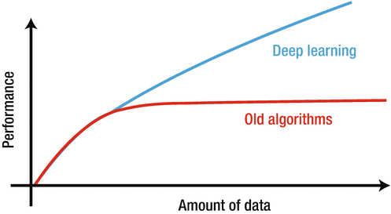
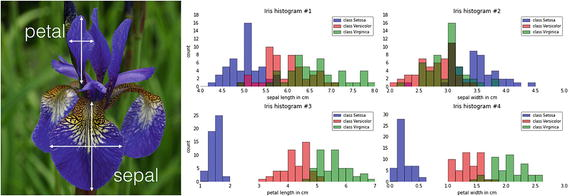
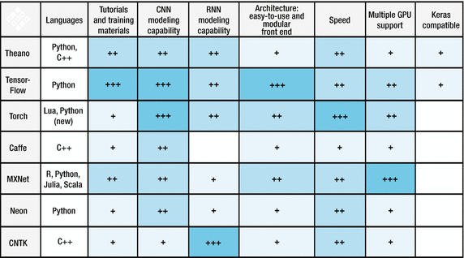
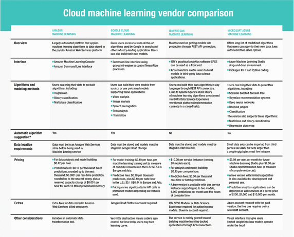

# 二、深度学习：概述

人工神经网络并不新鲜；它们已经存在了大约 50 年，并在 20 世纪 80 年代中期随着允许训练多层神经网络的方法(反向传播)的引入而得到了一些实际的认可。然而，深度学习的真正诞生可能要追溯到 2006 年，当时 Geoffrey Hinton [GR06]提出了一种算法，以无监督的方式有效地训练深度神经网络——换句话说，就是没有标签的数据。它们被称为深度信念网络(DBNs ),由堆叠的限制性玻尔兹曼机(RBM)组成，每一个都放置在另一个的顶部。DBNs 不同于以前的网络，因为它们是生成模型，能够在没有任何监督的情况下学习所呈现的数据的统计属性。

受大脑深度结构的启发，深度学习架构彻底改变了数据分析的方法。深度学习网络已经赢得了大量硬机器学习竞赛，从语音识别[AAB + 15]到图像分类[AIG12]到自然语言处理(NLP) [ZCSG16]到时间序列预测——有时是大幅度的。传统上，人工智能依赖于大量手工制作的功能。例如，为了在图像分类中获得令人满意的结果，必须应用几种预处理技术，如滤波、边缘检测等。DL 的美妙之处在于，如果有足够多(有时是数百万)的训练数据示例可用，大多数(如果不是全部)特征可以从数据中自动学习。深度模型在每一层(级别)具有特征检测器单元，其从原始输入信号中逐渐提取更复杂和不变的特征。较低层的目标是提取简单的特征，然后将其聚集到较高层，从而检测更复杂的特征。相比之下，浅层模型(具有两层的模型，如神经网络[NNs]或支持向量机[SVMs])只提供很少几层，用于将原始输入特征映射到特定问题的特征空间。图 2-1 显示了深度学习和机器学习(ML)模型在性能与构建模型的数据量方面的比较。

图 2-1

Deep learning models have a high learning capacity

深度神经架构非常适合在结构化或非结构化数据中进行监督和非监督学习，比浅层神经架构的效率要高得多。由于架构的每个元素都是使用示例学习的，因此人们能够负担的计算元素的数量仅受训练样本数量的限制，而训练样本的数量可能高达数十亿。深度模型可以用数亿个权重来训练，因此往往优于 SVMs 等浅层模型。此外，理论结果表明，深度架构是学习代表高级抽象(例如，视觉、语言、语义)的复杂功能的基础，其特征在于以非线性方式交互的许多变化因素，这使得学习过程变得困难。

## 2.1 从漫长的冬天到繁花似锦的春天

今天，很难找到任何不依赖于深度学习的人工智能技术。事实上，DL 在人工智能技术应用中的意义将是如此深远，以至于我们可能即将迎来有史以来最大的技术革命。

DL 神经网络的一个显著特征是其(几乎)无限的能力来容纳来自大量数据的信息而不会过度拟合——只要应用强正则化。DL 既是一门科学，也是一门艺术，虽然在数百万个训练样本上用数十亿个参数训练模型非常常见，但只有通过仔细选择和微调学习机和复杂的硬件，这才有可能实现。图 2-2 显示了过去十年/十多年来机器学习、模式识别和深度学习的趋势。

图 2-2

Evolution of interest in deep learning (source: Google Trends)

以下是使 DNN 与众不同的主要特征:

*   高学习能力:由于 DNNs 有数百万个参数，它们不容易饱和。你的数据越多，他们学到的就越多。
*   不需要特征工程:学习可以从头到尾进行——无论是机器人控制、语言翻译还是图像识别。
*   抽象表示:dnn 能够从数据中生成抽象概念。
*   高生成能力:dnn 不仅仅是简单的识别机器。他们可以根据潜在的表象产生看不见但似乎可信的数据。
*   知识转移:这是最显著的特性之一——你可以在一大组数据(如图像、音乐或生物医学数据)中教授机器，并将学习转移到一个类似的问题，其中不同类型的数据已知较少。一个最显著的例子是捕捉和复制艺术风格的 DNN。
*   出色的无监督能力:只要你有大量的数据，DNNs 可以学习隐藏的统计表示，而不需要任何标签。
*   多模态学习:DNNs 可以无缝集成不同的高维数据源，如文本、图像、视频和音频，以解决自动视频字幕生成和视觉问答等难题。
*   它们相对容易组合和嵌入领域知识——或优先事项——来处理不确定性和约束学习。

以下是 DNN 车型 1 不太吸引人的几个方面:

*   它们很难解释。尽管能够从数据中提取潜在特征，dnn 是通过关联和共现来学习的黑盒。它们缺乏其他方法(如决策树)的透明性和可解释性。
*   它们只能部分揭示复杂的因果关系或嵌套结构关系，这在生物学等领域很常见。
*   训练它们可能相对复杂和耗时，有许多超参数需要仔细微调。
*   它们对初始化和学习速率很敏感。网络很容易变得不稳定和不收敛。这对于循环神经网络和生成对抗网络来说尤其严重。
*   必须提供损失函数。有时候很难找到一个好的。
*   知识可能不会以递增的方式积累。对于每个新的数据集，网络必须从头开始训练。这也叫做知识持久性问题。
*   知识转移对于某些模型是可能的，但并不总是显而易见的。
*   如果 DNNs 有很大的容量，它可以很容易地记住训练数据。
*   有时他们很容易被愚弄，例如，自信地对有噪声的图像进行分类。

## 2.2 为什么 DL 不一样？

机器学习(ML)是一个有点模糊但算不上新的研究领域。特别是模式识别，这是人工智能的一个小领域，可以用一句简单的话来概括:在数据中寻找模式。这些模式可以是任何东西，从股票市场的历史周期到区分猫和狗的图像。ML 也可以被描述为教机器如何做决定的艺术。

那么，为什么深度学习驱动的人工智能如此令人兴奋呢？如前所述，DL 既是定量的(语音识别方面 5%的改进使一个伟大的个人助理和一个无用的个人助理之间产生了巨大的差异)，也是定性的(如何训练 DL 模型，它们可以从高维数据中提取的微妙关系，以及如何将这些关系集成到一个统一的视角中)。此外，他们在解决几个难题方面取得了实际成功。

如图 2-3 所示，让我们考虑一下经典的鸢尾问题:如何在 150 个观察值的数据集上，基于四个测量值(输入值)，具体来说，花瓣和萼片的宽度和长度，区分三种不同类型的花卉物种(输出值)。简单的描述性分析将立即告知用户不同测量的有用性。即使使用像朴素贝叶斯这样的基本方法，您也可以构建一个具有良好准确性的简单分类器。

图 2-3

Iris image and classification with Naïve Bayes (source: predictive modeling, supervised machine learning, and pattern classification by [Sebastian Raschka](http://sebastianraschka.com/Articles/2014_intro_supervised_learning.html))

这种方法假设在给定一个类(输出)的情况下输入是独立的，并且对于许多问题都非常有效。然而，最大的问题是这是一个很难成立的假设。因此，如果你想超越朴素贝叶斯，你需要探索输入之间所有可能的关系。但是有一个问题。为简单起见，我们假设每个输入有十个可能的信号电平。您需要在训练集中考虑的可能输入组合的数量(观察值的数量)将是 10 4 = 10000。这是一个很大的数字，比 150 个观测值大得多。但是随着输入数量的增加，问题会变得更加严重(指数级恶化)。对于图像来说，每张图像可能有 1000(或更多)个像素，因此组合的数量将是 10 1000 ，这是一个遥不可及的数字——宇宙中的原子数量小于 10 100 ！

因此，DL 的巨大挑战是用有限的一组数据来处理非常高维的问题(如语言、声音或图像),并对看不见的输入区域进行归纳，而不使用蛮力来探索所有可能的组合。DL 的技巧是将一个高维空间(离散的或连续的)转换或映射到一个连续的低维空间(有时称为流形)，在那里你可以找到问题的简单解决方案。这里的解决方案通常意味着优化一个函数；它可以是最大化可能性(相当于最小化 iris 问题等问题中的分类误差)或最小化均方误差(在股票市场预测等回归问题中)。

这说起来容易做起来难。必须使用几个假设和技术来近似这个困难的推理问题。(推论简单来说就是一句话“获取前面提到的图”或者描述最大化似然函数的后验分布的模型的参数。)关键的(有点令人惊讶的)发现是，一种叫做梯度下降的简单算法，当仔细调整时，足以强大到将深度神经网络导向解决方案。神经网络的优点之一是，经过适当的训练后，输入和输出之间的映射是平滑的，这意味着你可以将一个离散的问题，如语言语义，转化为连续或分布式的表示。(当你在本章后面阅读 Word2vec 时，你会学到更多的东西。)

这就是深度学习的秘密。没有魔法，只有一些众所周知的数值算法，一台强大的计算机，和数据(很多！).

### 2.2.1 机器的年龄

在经历了漫长的冬天之后，我们现在正在经历人工智能领域百花齐放的春天。这一由人工智能推动的快速技术创新浪潮正在以如此快的速度影响着商业和社会，以至于很难预测其影响。不过，有一点是肯定的:由人工智能驱动的认知计算将在许多重复甚至创造性的任务中赋予(有时取代)人类权力，社会将发生深刻的变化。这将影响从医生到法律文员等看似不可能自动化的工作。

卡尔·b·弗雷和 m·奥斯本 2013 年的一项研究表明，美国 47%的工作岗位在不久的将来有被取代的风险。此外，2015 年 4 月，麦肯锡全球研究所发表了一篇文章，指出人工智能正在以比工业革命快 10 倍、规模 300 倍(或影响约 3000 倍)的速度改变社会。

我们可以尝试建立一个关闭按钮或硬编码规则来防止机器对人类造成任何伤害。问题是这些机器是自己学习的，不是硬编码的。此外，即使有办法建造这样一个“安全出口”，怎么可能有人将伦理编码到机器中呢？顺便问一句，我们人类能就道德问题达成一致吗？

我们的观点是，因为 AI 正在赋予机器超人的认知能力，所以这些担忧不应该被轻视。目前，世界末日的场景只是一个幻想，但我们最终将面临困境，机器不再是决定性的设备(见 [`https://www.youtube.com/watch?v=nDQztSTMnd8`](https://www.youtube.com/watch?v=nDQztSTMnd8) )。

将伦理纳入机器的唯一方法与人类相同:通过漫长而持续的教育。问题是机器不像人类。例如，你如何向一个没有生命的实体解释“饥饿”或“死亡”的概念？

最后，这很难量化，但人工智能肯定会对社会产生巨大影响，以至于一些人，如埃隆·马斯克和斯蒂芬·霍金，担心我们自己的存在处于危险之中。

### 2.2.2 对 DL 的一些批评

有人批评 DL 是一种蛮力的方法。我们认为这一论点是站不住脚的。虽然训练 DL 算法确实需要许多样本(例如，对于图像分类，卷积神经网络可能需要成千上万的带注释的例子)，但事实是，人们认为理所当然的图像识别实际上是复杂的。此外，dnn 是通用计算设备，可能是高效的，尤其是循环的。

另一个批评是，网络无法重用积累的知识，以快速将其扩展到其他领域(所谓的知识转移、可组合性和零射击学习)，这是人类做得非常好的事情。例如，如果你知道什么是自行车，你几乎立刻就能理解摩托车的概念，而不需要看成千上万的例子。

一个共同的问题是，这些网络是黑匣子，因此人类不可能理解它们的预测。但是，有几种方法可以缓解这个问题。例如，参见最近的工作“ [PatternNet 和 PatternLRP:提高神经网络的可解释性](https://arxiv.org/abs/1705.05598)”此外，零射击学习(在看不见的数据中学习)已经成为可能，知识转移在生物学和艺术中被广泛使用。

这些批评虽然有道理，但已在最近的方法中得到解决；参见[LST15]和[GBC16]。

## 2.3 资源

这本书将从实用的角度引导你通过 DNNs 中最相关的里程碑和最近的成就。您还将探索该技术的商业应用和含义。技术细节将保持在最低限度，所以你可以专注于本质。以下是理解这一激动人心的话题所必需的一些好资源。

### 书籍

这是一些关于这个主题的好书:

*   Yoshua Bengio 等人最近出版的一本关于深度学习的书[GBC16]是关于 DNNs 的最佳和最新参考资料。它非常强调深度神经网络的理论和统计方面。
*   [Francois Chollet(Manning，2017)的《使用 Python 进行深度学习》( Deep Learning with Python](https://www.manning.com/books/deep-learning-with-python) )是 Keras 的作者写的，对于那些愿意获得 DL 实践经验的人来说是必不可少的。
*   在线书籍[神经网络和深度学习](http://neuralnetworksanddeeplearning.com/)对于那些有兴趣了解 DL 基础知识的人来说也是一个很好的入门资源。
*   [深度学习的基础](http://shop.oreilly.com/product/0636920039709.do) (O'Reilly，2017)是一本一步步解释 ann 和 DL 的基本概念的书。
*   [用 Python 进行深度学习](http://www.da6nci.com/deep-learning-with-python-tensorflow-pyconsg-2016/) (2016)是一本使用 Python 库(Keras.io 和 TensorFlow)的动手电子书。
*   [深度学习掌握](http://machinelearningmastery.com/category/deep-learning/)是一本使用 Keras 的优秀分步教程的在线书籍。

### 新闻通讯

以下是一些不错的时事通讯:

*   杰克-克拉克。net 是一个很好的深度学习和 AI 的周评。
*   [Dataelixir。com](https://www.Dataelixir.com) 是一份每周时事通讯，包含来自网络的数据科学新闻和资源。
*   [`www.getrevue.co/profile/nathanbenaich`](http://www.getrevue.co/profile/nathanbenaich) 来自 Nathan Benaich 是一份关于人工智能新闻、研究、投资和应用的月度评论。
*   [Wildml。com](https://www.Wildml.com) 是 Denny Britz 为 DL 教程维护的一个很好的博客，它有一个每周时事通讯。
*   [数据玛奇纳](https://www.getrevue.co/profile/datamachina)是一份关于大数据和机器学习的每周时事通讯。
*   在 [`www.getrevue.co/profile/azeem`](http://www.getrevue.co/profile/azeem) 的指数视图包含关于基于人工智能的技术及其对社会影响的新闻。
*   Datascienceweekl y. org 是机器学习和数据科学新相关方面的每周总结。
*   [CognitionX](http://cognitionx.com/news-briefing/) 是关于数据科学、人工智能和机器学习的每日简报。

### 2.3.3 博客

以下是一些相关的博客:

*   对于那些想要获得深度学习工具实践经验的人来说，Andrew Karpathy 的博客是一个很好的灵感来源，从图像处理到循环神经网络。
*   KDnuggets 是一个很好的博客，涵盖了关于人工智能和人工智能的各种主题。
*   数据科学中心提供关于 ML 商业含义的有趣帖子，并且有每日时事通讯。
*   [创意。net](https://www.CreativeAI.net) 是一个展示人工智能和艺术融合作品的优秀博客。
*   [Arxiv。org](https://www.Arxiv.org) 是包括计算机科学在内的许多领域的公开出版物的最佳储存库。
*   [Gitxiv。com](https://www.Gitxiv.com) 是一个博客，结合了 Arxiv 上的出版物和 GitHub 上的代码。
*   Arxiv-理智。com 是由 A. Karpathy 创建的一个网站，负责管理 Arxiv 的内容。

### 2.3.4 在线视频和课程

以下是一些相关的视频和课程:

*   Coursera 有安的祖父 G. Hinton ( [`https://www.coursera.org/learn/neural-networks`](https://www.coursera.org/learn/neural-networks) )的优秀在线课程。
*   这是斯坦福大学教授吴恩达( [`https://www.coursera.org/learn/machine-learning`](https://www.coursera.org/learn/machine-learning) )的经典和开创性课程。
*   Udacity 也有关于 Google 深度学习[的好课程。](https://www.udacity.com/course/deep-learning%2D%2Dud730)
*   [再工作峰会](https://www.re-work.co/events/)是在伦敦、纽约、旧金山和上海举办的关于人工智能和深度学习的优秀活动。
*   [数据科学峰会](http://datascience-summit.com/)组织高强度培训活动。实习是在支持该计划的公司内部组织的。
*   [总会](https://generalassemb.ly/)在世界各地都有一些网络课程和新兵训练营。
*   [科学 2 数据科学](http://www.s2ds.org/)是一项强化培训计划，旨在为公司培养数据科学家。
*   Jason Brownlee 有一些优秀的教程和电子书，可以开始了解使用 Keras 框架的 Python 中的机器学习和[深度学习模型。](http://machinelearningmastery.com/)
*   视频讲座。net 有很好的视频内容和讲座，比如来自 ICML 2015 和深度学习暑期学校 2016。
*   Ian Goodfellow 有一个关于 GANs 的[优秀教程。](http://on-demand.gputechconf.com/gtc/2017/video/s7502-ian-goodfellow-generative-adversarial-networks.mp4)

### 播客

以下是一些播客:

*   [本周机器学习和人工智能](https://twimlai.com/)概述了人工智能的最新发展和应用，并总是邀请一位嘉宾。
*   会说话的机器是一个播客，每集都有一位嘉宾。
*   [数据怀疑论者](https://dataskeptic.com/)是一个采访经验丰富的数据科学家的每周播客。
*   学习机是对人工智能和机器学习的温和介绍( [`http://www.learningmachines101.com/`](http://www.learningmachines101.com/) )。
*   奥莱利数据秀播客深入探讨了大数据、数据科学和人工智能 [`https://www.oreilly.com/topics/oreilly-data-show-podcast`](https://www.oreilly.com/topics/oreilly-data-show-podcast) 背后的技术。
*   Andreessen Horowitz 的 [A16Z 播客](https://a16z.com/podcasts)是数据科学和技术相关主题的绝佳资源。

### 其他网络资源

以下是一些其他的网络资源:

*   [`www.deeplearning.net`](http://www.deeplearning.net) 是深度学习的先驱网站。还是一个参考。
*   [`https://github.com/terryum/awesome-deep-learning-papers`](https://github.com/terryum/awesome-deep-learning-papers) 是几个 DL 领域中被引用最多的重要论文列表。
*   TensorFlow ( [`http://bamos.github.io/2016/08/09/deep-completion/`](http://bamos.github.io/2016/08/09/deep-completion/) )中深度学习的图像补全是一个很好的 DNN 图像补全教程。
*   [`https://github.com/kjw0612/awesome-deep-vision`](https://github.com/kjw0612/awesome-deep-vision) 是计算机视觉 DL 的资源列表。
*   机器学习和深度学习教程是一个存储库，包含机器学习和深度学习教程、文章和其他资源的主题列表( [`https://github.com/ujjwalkarn/Machine-Learning-Tutorials`](https://github.com/ujjwalkarn/Machine-Learning-Tutorials) )。
*   Adam Geitgey 的《机器学习很有趣》是一个用超过 15 种语言( [`https://medium.com/@ageitgey/machine-learning-is-fun-80ea3ec3c471`](https://medium.com/@ageitgey/machine-learning-is-fun-80ea3ec3c471) )简单介绍机器学习的网站。
*   Abhishek Thakur 的《接近(几乎)任何机器学习问题》是对大多数机器学习管道的现实概述。
*   [Kaggle。com](https://www.Kaggle.com) 推出了几项具有挑战性的机器学习竞赛，奖金高达 10 万美元。但除了钱，这还关乎创造一个真正的数据科学家的声誉。
*   [`https://a16z.com/2016/06/10/ai-deep-learning-machines/`](https://a16z.com/2016/06/10/ai-deep-learning-machines/) 很好的概述了来自 Andresseen Horowitz 的深度学习进化。
*   Reddit 上的这两位 AMA(“随便问我”)对理解安背后的历史非常有帮助，他们的一些“祖父母”讲述了这一历史，他们是 j·施密德胡伯( [`https://www.reddit.com/r/MachineLearning/comments/2xcyrl/i_am_j%C3%BCrgen_schmidhuber_ama/`](https://www.reddit.com/r/MachineLearning/comments/2xcyrl/i_am_j%C3%BCrgen_schmidhuber_ama/) )和杰弗里·辛顿( [`https://www.reddit.com/r/MachineLearning/comments/2lmo0l/ama_geoffrey_hinton/`](https://www.reddit.com/r/MachineLearning/comments/2lmo0l/ama_geoffrey_hinton/) )。

### 2.3.7 一些开始玩游戏的好地方

尝试这些方法获得实践经验:

*   使用谷歌协作 Jupyter 笔记本的 Tensorflow 上的伟大教程(无需安装代码) [`https://www.tensorflow.org/get_started/eager`](https://www.tensorflow.org/get_started/eager) 。
*   [牛逼的 TensorFlow](https://github.com/jtoy/awesome-tensorflow) 有很多例子可以开始玩 TensorFlow。
*   [`http://keras.github.com`](http://keras.github.com) 是一个 Keras 库，有几个例子可以开始使用 DNNs。
*   [`http://research.baidu.com/warp-ctc/`](http://research.baidu.com/warp-ctc/) 开源其代码，Deep Speech 2，进行端到端的语音识别和翻译。
*   [`http://playground.tensorflow.org/`](http://playground.tensorflow.org/) 是一个 TensorFlow 游乐场。
*   [H20。ai](https://www.H20.ai) 对于 R 用户来说是一个很好的 API，虽然可用的模型相当有限。
*   [`https://aiexperiments.withgoogle.com`](https://aiexperiments.withgoogle.com) 有实验包括和谷歌玩猜字谜。
*   [`https://artsexperiments.withgoogle.com`](https://artsexperiments.withgoogle.com) 有几个非常有趣的艺术实验
*   [`www.creativeai.net`](http://www.creativeai.net) 是一个分享从机器学习、音乐、写作、艺术、时尚到工业设计和建筑等创意项目的空间。

### 2.3.8 会议

以下五个会议被认为是与深度学习最相关的:

*   NIPS -被认为是关于 DL 的最重要的会议，关注理论和实际应用。
*   ICML -机器学习国际会议，最负盛名的机器学习会议之一。
*   ICLR -学习代表国际会议，这是一个最近召开的专注于深度学习的会议。
*   KDD -一个关于机器学习和知识发现的广泛认可的会议。
*   ij CNN IEEE 会议，涵盖了广泛的神经网络概念和应用。

### 2.3.9 其他资源

由 OpenAI 和加州大学伯克利分校共同主办的 [Deep RL Bootcamp](https://sites.google.com/view/deep-rl-bootcamp/lectures) 以强化学习基础知识讲座和最先进的研究为特色。

斯坦福大学名为[用于视觉识别的卷积神经网络](https://www.youtube.com/playlist?list=PL3FW7Lu3i5JvHM8ljYj-zLfQRF3EO8sYv)的课程是必须的，同样重要的还有带有深度学习的[自然语言处理](https://www.youtube.com/playlist?list=PL3FW7Lu3i5Jsnh1rnUwq_TcylNr7EkRe6)课程。

Coursera 有[深度学习专业](https://www.coursera.org/specializations/deep-learning)，蒙特利尔大学提供[深度学习和强化暑期学校](http://videolectures.net/deeplearning2017_montreal/)。此外，请查看[加州大学伯克利分校 2017 年秋季的深度强化学习](http://rll.berkeley.edu/deeprlcourse/)和 [TensorFlow 开发峰会](https://www.youtube.com/playlist?list=PLOU2XLYxmsIKGc_NBoIhTn2Qhraji53cv)，其中包含 DL 基础知识和 TensorFlow APIs 的演示。

### DL 框架

DL 可以简单有趣，你可以从网上的许多教程开始。你可以用几十行代码训练一个模型。然而，真正的问题很少完全符合现有学术基准的类别。事实上，训练 DL 模型可能是困难和令人沮丧的——取决于你想要解决的问题、所需的预处理、可用的数据以及你理解学习算法背后的复杂性的意愿。它肯定需要大量的贝叶斯统计、图形模型、非参数估计、统计推断(要么是确定性的[如变分估计]，要么是近似的[如马尔可夫链蒙特卡罗])。你不需要全部了解，但是在成为专科医生的旅途中，你会遇到这些概念。

DL 研究的一个显著特点是大部分工作(论文、数据甚至代码)都是开源的，要么来自学术界，要么来自公司，因此任何人都可以用它来玩和学习。

许多开源库和框架可用于 DL。最常见的是咖啡、TensorFlow、Keras、Theano 或 Torch。简要描述如下:

*   TensorFlow 是 Google 最近开源的一个项目，由于它支持几种类型的架构，包括卷积神经网络、堆叠自编码器、深度信念网络和循环神经网络，所以变得越来越流行。在 TensorFlow 中，网络被指定为向量运算的符号图，如矩阵加/乘或卷积，每一层都是这些运算的组合。TensorFlow 使用一种高级脚本语言，这种语言对于快速部署模型非常有用。该接口可以通过 Python 或 C++访问，它有一个用于调试的有用的浏览器界面，称为 TensorBoard。
*   Keras.io 是一个很棒的框架，可以运行在 Theano 或 TensorFlow 之上；使用起来简单直观。
*   Torch 提供了一个高级脚本接口(很像 Matlab)，对于卷积神经网络和循环神经网络都有很好的性能。如果用户希望在更细粒度的级别上导航，它的灵活性会更低。Torch 运行在 Lua 上，与其他实现相比，它允许快速执行。最近的 Pytorch 是一个 Python 包，它通过强大的 GPU 加速和建立在基于磁带的自动签名系统上的深度神经网络，为张量计算(如 Numpy)提供了高级功能。
*   来自微软的 MxNet 最近被亚马逊采用作为其深度学习平台。它最近被列为 Keras 的后端之一。
*   [Gluon](https://github.com/gluon-api/gluon-api/) 是亚马逊和微软最近发布的开源深度学习接口。胶子是一个设计和定义机器学习模型的高级框架。根据亚马逊的说法，“刚接触机器学习的开发者会发现这个界面对传统代码更熟悉，因为机器学习模型可以像任何其他数据结构一样被定义和操作。”Gluon 最初将在 Apache MXNet(亚马逊)中提供，不久将在 CNTK(微软)中提供。
*   Caffe 是最早的深度学习工具包之一，主要用于卷积神经网络。但是，它不支持递归网络和 NLP 模型。它的界面也不友好。
*   Theano 是实现深度学习模型的最通用和最强大的工具包之一，正在用于最近的研究，如注意机制和双向递归网络。Theano 使用符号图，并为大多数最先进的网络提供了实现，有时作为高级框架提供，如 Keras.io。它具有良好的性能，并支持单个和多个 GPU。另一方面，它有一个陡峭的学习曲线，有点难以调试。

### 2.3.11 数字图书馆即服务

所有大玩家(亚马逊、IBM、谷歌、脸书、Twitter、百度、雅虎和微软)都在创建自己的 DL 平台，并开源(部分)他们的核心算法。我们正在进入人工智能即服务的时代。表 2-1 总结了这些公司提供的主要服务。

表 2-1

Main Machine Learning Platforms

<colgroup><col align="left"> <col align="left"> <col align="left"></colgroup> 
| 公司 | 基于云的 ML 平台 | DL 技术(开源) |
| :-- | :-- | :-- |
| 亚马孙 | 亚马逊机器学习 | DSSTNE |
| 百度(全球最大的中文搜索引擎) | 深度演讲 2 | 涉水 |
| 脸谱网 | 火炬网， Pytorch | 快速文本 |
| 谷歌 | 下一朵云 | TensorFlow |
| 国际商用机器公司 | 沃森 | IBM 系统 |
| 微软 | 蓝色 | CNT(消歧义) |
| 推特 | 皮质 |   |

图 2-4 比较了不同的 DL 平台。

图 2-4

Comparison of different Deep Learning frameworks (source: [`www.kdnuggets.com/2017/03/getting-started-deep-learning.html`](http://www.kdnuggets.com/2017/03/getting-started-deep-learning.html) )

深度学习正在转向开源和云计算。谷歌、脸书、IBM、亚马逊和微软正试图围绕云中提供的人工智能服务建立生态系统。深度学习是一项横向技术，将应用于每个行业，因此竞争很激烈，所有参与者都试图通过云服务和集成平台来获胜。Forrester Research 最近估计，2016 年亚马逊的云收入为 108 亿美元，微软为 101 亿美元，谷歌为 39 亿美元。

对于这些公司来说，最稀缺的资源可能是人才，这可能是 M&A 狂热“收购”深度学习初创公司的理由。此外，有才华的人工智能专家大多来自学术界，他们要求开放并参与活跃的开源社区。这就是为什么 Apache Institute 对任何平台的接受都是可信度的主要来源。这有助于解释为什么苹果相对于其他大公司来说是落后的，它的封闭文化对此没有帮助。

硬件也很关键。大多数 DL 算法需要巨大的计算能力，无论是在本地还是在云上。具体来说，它们需要游戏控制台和现场可编程门阵列(FPGAs)中的图形处理单元(GPU)，这些芯片可以配置用于特殊用途的操作。由 DL 执行的大部分统计推断涉及难以处理的问题(例如，计算复杂的积分)，这些问题只有通过计算代价昂贵的近似才有可能解决。DL 可能很快会变成一个硬件问题，而不是算法问题。英伟达和英特尔正在推出专门应对深度学习计算需求的新处理器。

由 Elon Musk 创建的 OpenAI 是一个非营利组织，它为 DL 社区增加了一个新的角度。由于担心社会可能受到人工智能的威胁，OpenAI 制定了一项长期计划来确保人工智能的安全，并推动该技术尽可能开源和透明。有趣的是，OpenAI 正在快速发展其人才团队，这可能是一个问题有多真实(和严重)的迹象。

谷歌在 2017 年 6 月宣布了一个新的开源系统，以加快用 TensorFlow 创建和训练机器学习模型的过程。库 [Tensor2Tensor (T2T)](https://github.com/tensorflow/tensor2tensor) 支持深度学习模型的创建。T2T 可用于为文本翻译或解析以及图像字幕等过程构建模型，并允许您加速模型的创建和测试，从而降低用户尝试 DL 的门槛。它利用一个标准接口，包括数据集、模型、优化器和不同的超参数集，因此用户可以交换这些组件的版本，并在运行中测试它们。

根据 Forrester 的数据，机器学习平台的市场将在 2021 年前以每年 15%的速度增长。图 2-5 比较了现有的主要平台。

图 2-5

Comparison of different DL platforms (source: [`http://searchbusinessanalytics.techtarget.com/feature/Machine-learning-platforms-comparison-Amazon-Azure-Google-IBM`](http://searchbusinessanalytics.techtarget.com/feature/Machine-learning-platforms-comparison-Amazon-Azure-Google-IBM) )

## 2.4 最近的发展

这是该领域的一些最新进展。

### 2.4.1 2016

2016 年，无论是在研究、应用、项目，还是在资金和平台方面，DL 都取得了巨大的突破。根据 Yann LeCunn 的说法，生成对抗网络可能是过去十年机器学习中最重要的想法。虽然在 2014 年由 Ian Goodfellow 引入，但直到最近 GANs 才开始显示其潜力。最近推出的有助于训练和更好的架构设计的改进技术(深度卷积 gan)修复了以前的一些限制，并为新的应用打开了大门。gan 的工作原理是让一个判别网络(D)与一个生成网络(G)一起玩，生成网络试图用伪造的数据表示来欺骗 D 网络。随着游戏的发展，G 网络学习如何构建接近真实的例子。好的方面是你不需要一个显式的损失函数来最小化。

### 2.4.2 2017

2017 年的特点是在深度学习方面取得了几项突破。最热门的领域之一是应用于游戏和机器人的强化学习。AlphaGo 可能是强化学习最臭名昭著的例子，因为它能够击败世界上最好的围棋选手。

[AlphaGo Zero](https://www.nature.com/articles/nature24270.epdf) 通过在没有人类训练数据的情况下学习下围棋，使算法更进了一步；参见参考文献 [`https://arxiv.org/abs/1705.08439`](https://arxiv.org/abs/1705.08439) 。它太棒了，以至于打败了 AlphaGo 的第一个版本。这个算法的一个推广，叫做 AlphaZero，是由 Deepmind 提出的，能够掌握象棋和 shogi。

CMU 研究人员开发的 Libratus 系统在为期 20 天的单挑无限注德州扑克锦标赛中击败了顶级扑克玩家。强化学习的研究现在已经转移到难度更大的多人游戏上。DeepMind 正在开发星际争霸 2，并发布了一个[研究环境](https://deepmind.com/blog/deepmind-and-blizzard-open-starcraft-ii-ai-research-environment/)，一个 OpenAI 在 Dota 2 bot 的标准锦标赛规则下的 1v1 游戏比赛中取得了初步成功。机器人在复杂和混乱的目标中从头开始学习游戏。这个想法是在不久的将来与完整的 5v5 游戏竞争。

谷歌的 [Tacotron 2 文本到语音](https://research.googleblog.com/2017/12/tacotron-2-generating-human-like-speech.html)系统基于 WaveNet 产生了良好的文本音频样本，wave net 是一种自回归模型，也部署在谷歌助手中，在过去一年中速度大幅提高。WaveNet 以前曾被应用于机器翻译，从而加快了递归架构的训练时间。

努力使用更便宜的递归架构是机器翻译的一个趋势。在[注意力是你所需要的全部](https://arxiv.org/abs/1706.03762)中，研究人员消除了循环和回旋，并使用更复杂的注意力机制，以训练成本的一小部分实现了最先进的结果。

另一个活跃的研究领域是药物发现。深度学习在所有可能的化学排列的巨大搜索空间中有效搜索新分子的潜力被证明是非常成功的。例如，参见最近使用[生成递归网络进行重新药物设计的工作](https://www.ncbi.nlm.nih.gov/pubmed/29095571)或深度学习在生物医学数据上的应用综述【MVPZ16】。

Waymo 的自动驾驶汽车在 2017 年 4 月有了第一批真正的乘客，后来完全取消了人类操作员。Lyft 宣布，它正在建立自己的自动驾驶硬件和软件，波士顿的试点项目目前正在进行中。特斯拉 Autopilot 有一些新奇的东西，而苹果证实，它正在开发自动驾驶汽车的软件。

### 进化算法

2017 年，进化策略(es)成为训练人工神经网络的一种流行替代方法。搜索空间的探索不依赖于梯度，并且对于强化学习是有效的。其优点是进化策略不需要可微的损失函数。此外，进化算法可以线性扩展到数千台机器进行快速并行训练，并且不需要昂贵的 GPU。

来自 OpenAI 的研究人员证明，ES 可以实现与深度 Q 学习等标准强化学习算法相当的性能。来自优步的一个团队发布了一篇博文,证明了遗传算法优化神经网络的潜力。通过简单的遗传算法，优步能够教会一台机器玩复杂的雅达利游戏。

### 2.4.4 创造力

生成模型在图像、音乐、草图甚至视频的创建、建模和改进中无处不在。NIPS 2017 大会包容性地组织了一次[机器学习促进创造力和设计](https://nips2017creativity.github.io/)研讨会。

GANs 在 2017 年取得了重大进展。CycleGAN、DiscoGAN 和 StarGAN 等新模型在生成图像，尤其是人脸方面取得了惊人的成果。例如，参见 [pix2pixHD](https://tcwang0509.github.io/pix2pixHD/) 。

最近一个为漫画着色的项目声称是最好的自动着色工具。

使用 GAN 从噪声中创建女性漫画角色的[生成模型也是可用的。如果你想用 GANs 改善图像质量，试试](http://make.girls.moe/) [Letsenhance。io](http://Letsenhance.io) 。

2017 年也是 DL 在生物学中应用的一年。例如，[利用深度生成模型](https://arxiv.org/pdf/1712.06148.pdf)生成和设计 DNA，这为从零开始创造合成 DNA 打开了大门。另一个例子是谷歌研究[深度变异](https://research.googleblog.com/2017/12/deepvariant-highly-accurate-genomes.html)的工作，该团队在基因组测序中发现 DNA 变异方面有很大的进步。

Footnotes 1

关于这几点，请注意这是一个活跃的研究领域，许多困难正在被解决。其中一些问题得到了部分解决，而其他问题(比如缺乏可解释性)可能永远也不会解决。