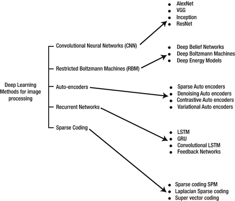
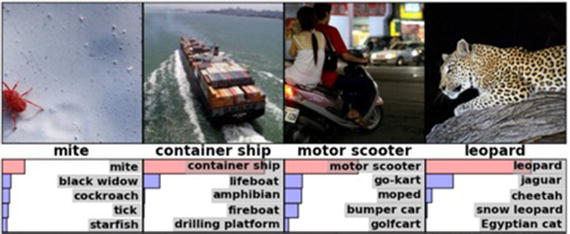
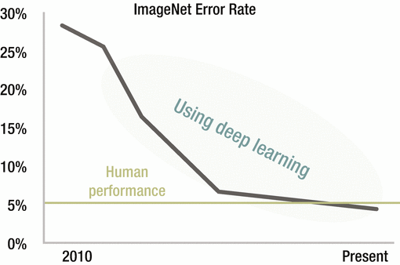
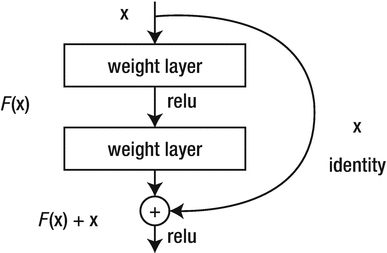
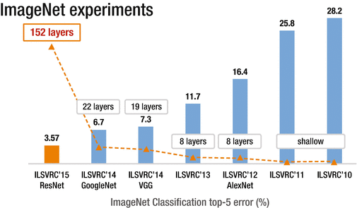
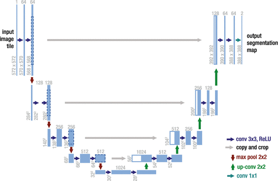
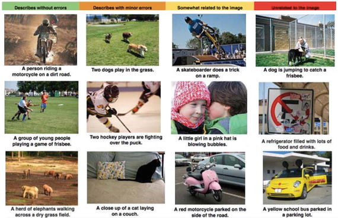
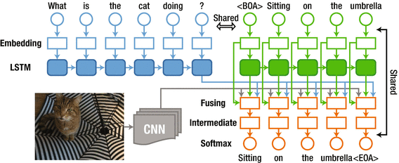

# 四、图像处理

深度学习(DL)影响最大的领域可能是图像处理。软件可以使用人工神经网络运行新皮层模拟的梦想已经存在了几十年，导致了许多失望和突破。即使在嘈杂的环境中或者在几何变换或背景变化的情况下，人类视觉感知系统也能实现显著的物体识别性能。多年来，计算机视觉社区一直试图复制这一惊人的能力，但收效甚微。关于深度神经网络图像处理发展的广泛综述，请参见 [`www.sciencedirect.com/science/article/pii/S0925231215017634`](http://www.sciencedirect.com/science/article/pii/S0925231215017634) 的“用于视觉理解的深度学习:综述”。

然而，DNNs 的最新进展，特别是使用卷积神经网络，导致了图像处理的革命，达到(甚至超过)人类水平的性能。最近，Cadieu 等人的一项工作[CHY + 14]表明，在具有挑战性的视觉对象识别任务中，DNNs 与在灵长类动物的下颞叶(IT)皮层中发现的 DNNs 具有相当的性能。这些作者声称，“这些 dnn 是否依赖于类似于灵长类视觉系统的计算机制还有待确定，但是，与之前所有的生物启发模型不同，这种可能性不能仅仅因为代表性表现而被排除。”我们现在有人工模型，可以在复杂的感知活动中与类似人类的大脑相媲美。此外，Eberhardt 等人在“快速视觉分类背后的特征分析有多深？”( [`http://arxiv.org/abs/1606.01167`](http://arxiv.org/abs/1606.01167) )比较了 CNN 与人类的表现，表明 CNN 在快速视觉识别上可以达到超人的表现。

下一节将展示深度学习在图像处理上的一些应用。图 4-1 总结了 DNN 架构。

图 4-1

A summary of DNN architectures for image processing

## 4.1 用于图像处理的 CNN 模型

CNN 是受哺乳动物视觉皮层生物启发的首批深度学习模型之一。LeCun [LBD + 89]表明，手工特征提取可以被一种称为 CNN 的神经网络所取代。CNN 在手写数字识别(MNIST)数据集上取得了相当大的成功，LeCun 在 1995 年表明，CNN 优于所有传统的机器学习方法，如逻辑回归、主成分分析或最近邻法。

CNN 已经经历了爆炸性的适应，并且已经取代了传统的图像处理技术，成为所有计算机视觉问题的事实上的方法。它们也被积极地研究和应用到其他领域，如语音、生物医学数据，甚至文本。

CNN(也称为 ConvNets)是 ann 的一种变体，它充分利用了输入的空间性质。CNN 不是像常规神经网络那样堆叠线性层，而是使用空间滤波器处理三色通道。他们利用了以下概念:

*   局部感受野:与 MLP 不同，CNN 没有一层的神经元连接到下一层的所有神经元。CNN 有一组过滤器，作用于局部区域，在输入图像的二维小区域中建立联系，称为局部感受野。这大大减少了网络中必要的连接数量，并降低了计算复杂度。receptive1 字段的典型值为 5×5。步幅是控制局部感受野在图像上滑动的参数，并且是感受野一次移动的像素数(通常是两个或三个)。感受局部区域和步幅控制输出体积的空间大小。
*   共享权重和偏差:CNN 对每个隐藏神经元使用相同的权重和偏差。通过共享权重，网络被迫学习图像不同区域的不变特征。因此，该层中的所有神经元检测相同的特征，但是在图像中的不同位置。这使得 CNN 的平移不变性成为图像处理的一个关键特征。一旦检测到图像中的特征，该特征的位置就变得无关紧要了。这些定义特征图的权重被称为内核或过滤器。为了执行图像识别，需要几个特征图；卷积层由几个不同的特征图组成(通常使用几十个特征图)。同样，共享权重和偏差有助于减少网络需要学习的参数数量，并减少过度拟合的机会。
*   池层:池层是一种通常在卷积层之后使用的层。它们通过执行应用于每个特征图的统计聚合函数(通常是平均值或最大值)并生成压缩的特征图来汇总来自卷积层的信息。前向传播评估激活，后向传播计算来自上面层的梯度和局部梯度，以计算层参数的梯度。总的来说，CNN 利用卷积、轮询和丢弃层的正则化特性，大大减少了可训练参数的数量和过拟合的风险。批量标准化等新技术减少了内部协方差变化，有助于平滑学习。最后，使用校正线性单位(ReLU)或泄漏的 ReLU 激活有助于加速训练并避免神经元饱和。整个 CNN 网络可以使用反向传播算法通过梯度下降来训练。

LeNet5，第一个强大的 CNN，其特点可以概括为:一个卷积神经网络，具有一系列卷积和池层；使用地图的空间平均和多层神经网络(MLP)作为最终分类器(完全连接的层)，从子样本提取空间不变特征的卷积；以及层之间的稀疏连接矩阵(权重共享),以避免大的计算成本并减少过拟合。

完整的 CNN 由多个卷积层叠加而成(每个卷积层都有特征映射平面和局部感受野)。添加子采样层作为正则化层，以提高对偏移和失真的不变性。早在 20 世纪 90 年代，越深的网络表现越好就变得显而易见，但当时我们缺乏必要的数据和计算资源。图 4-2 表示用于语义切分的学习反卷积网络。

图 4-2

Example of a fully convolutional neural network for image segmentation (source: [`https://handong1587.github.io/deep_learning/2015/10/09/segmentation.html`](https://handong1587.github.io/deep_learning/2015/10/09/segmentation.html) )

## 4.2 ImageNet 及其他

2009 年，发布了 ImageNet 数据集，其中包括 1500 多万张高分辨率图像，分为 22，000 多个类别。在 2012 年，Krizhevsky 等人[AIG12]率先使用图形处理器单元(GPU)来快速实现包含多达 650，000 个神经元和 6000 万个参数的 CNN(相比之下，LeNet5 的权重为 60，000)，并以仅 15.3%的前五名错误率获胜。这一结果远远好于当时达到 26.2%的最新方法。除了使用更大的数据集和更大的网络，这些作者还使用积极的正则化技术来避免过度拟合，如数据扩充(在形状、旋转和颜色方面应用轻微的失真)和放弃来缩小神经元的共同适应。这最后一种技术允许单个神经元在不依赖其他相邻神经元的情况下学习更健壮的特征。

用无监督的目标函数以贪婪的逐层方式预训练神经网络是另一种避免过拟合的流行技术，特别是对于 RBM。这种想法背后的直觉是，无监督训练将基于其将用于的数据(例如，对象图像、人类语音等)的实际统计属性，给出神经网络的权重的良好初始化。)而不是随机初始化，随机初始化经常陷入糟糕的局部最小值。该网络可以在受监督的任务上进行微调，例如物体识别。从数学上讲，CNN 将图像原来的高维转换成低维的特征向量表示。这样，一个好的 CNN 模型也可以作为图像的一个好的特征提取器，得到的图像可以用于更复杂的任务。图 4-3 显示了用于对象分类的 CNN(见 [`https://handong1587.github.io/deep_learning/2015/10/09/segmentation.html`](https://handong1587.github.io/deep_learning/2015/10/09/segmentation.html) )。

图 4-3

Results of a CNN and dense layers used for object classification (source: [AIG12])

2012 年，谷歌用来自 YouTube 视频的超过 1000 万张图片训练了一只 DNN。经过训练后，神经网络能够识别猫和狗，比以前的算法准确率提高了一倍。令人瞩目的是，该算法基本上无人监管。没有为图像提供人类标签。神经元不仅能识别猫和狗，还能识别人脸、黄花和其他常见的物体。该算法对 YouTube 图像中的对象(22，000 个类别)进行分类，准确率比以前的方法高 16%至 70%。它可能不会给人留下深刻印象，但它是一个具有挑战性的任务，因为它包含许多类似的对象。当类别数量减少到 1000 个时，准确率提高到了 50%。

2013 年，泽勒提出了一个更容易理解和校准的 CNN 模型( [`https://arxiv.org/pdf/1311.2901.pdf`](https://arxiv.org/pdf/1311.2901.pdf) )，在 ImageNet 数据集上取得了 12.4%的最高性能。2014 年，谷歌推出了 Inception5 (Google LeNet)，这是一个深度 CNN(有 20 层)，以仅 6.7%的错误率赢得了 ImageNet 竞赛。这项工作表明了使用非常深的模型从图像中提取更高层次特征的重要性。

2015 年末，一个微软团队在 ImageNet 上实现了超人的性能，错误率仅为 3.7%，网络名为 ResNet(残余网络)。论文《图像识别的深度残差学习》( [`https://arxiv.org/abs/1512.03385`](https://arxiv.org/abs/1512.03385) )在 MS COCO 数据集上取得了最先进的结果(代码可在 GitHub 上获得)。MS COCO 是一个众所周知的数据集，有两个挑战:分类(通过错误率评估)和图像字幕生成(通过 BLEU 评分评估)。

ResNet 基于一个简单的想法:馈送两个连续卷积层的输出，绕过下一层的输入。绕过单个层并没有提供太多的改进，而两个层本身可以被视为一个分类器。该团队能够训练高达 1000 层深度的网络[HZRS15]。图 4-4 展示了 imageNet 数据集上人类和深度网分类性能的对比。

图 4-4

Evolution of the performance of DNN in Imagenet (source: [`https://www.excella.com/insights/top-3-most-popular-neural-networks`](https://www.excella.com/insights/top-3-most-popular-neural-networks) )

ResNet 在输入级别使用 7×7 conv 层，然后是两层池，这与 Google 团队在 Inception V3 和 V4 中使用的更复杂的格式形成了对比。 [`www.sciencedirect.com/science/article/pii/S0925231215017634`见](http://www.sciencedirect.com/science/article/pii/S0925231215017634)。

在 ResNet 中，输入被并行馈送到许多模块，并且每个模块的输出被串行连接。ResNet 可以被认为是并行/串行模块的合奏机器，在较小深度层(十分之一层)的块中运行。图 4-5 说明了残差学习的公式，残差学习可以通过具有“快捷连接”的前馈神经网络来实现。

图 4-5

Architecture of a residual network (source: [`https://arxiv.org/abs/1512.03385`](https://arxiv.org/abs/1512.03385) )

黄等人提出了一种 ResNet 的变体，他们称之为具有随机深度的 DN[HSL+16]。这个想法是从非常深的网络开始，在训练过程中，随机丢弃一个层的子集，并用每个小批量的身份函数绕过它们。简化的训练加速了收敛并提高了性能。在 CIFAR-10 基准测试中，该团队能够实现的最先进的测试误差仅为 4.91%。

沈等人提出了一种称为加权残差网络的技术，以缓解训练非常深的网络以及 ResNet 与 ReLU 不兼容的问题[SZ16]。他们能够训练深度超过 1000 层的网络。图 4-6 显示了自 2010 年以来关于 ILSVRC 挑战数据集中分类性能的深度网络深度大小的演变。

图 4-6

Accuracy versus size versus operations of several CNN architectures (source: [`https://icml.cc/2016/tutorials/icml2016_tutorial_deep_residual_networks_kaiminghe.pdf`](https://icml.cc/2016/tutorials/icml2016_tutorial_deep_residual_networks_kaiminghe.pdf) )

Srivastava 等人[SGS15]提出了一种新的架构，旨在简化非常深的网络的基于梯度的训练，这种网络被称为高速公路网络，因为它们允许信息在“信息高速公路”的几个层之间畅通无阻地流动该体系结构的特征在于使用门控单元，这些门控单元学习调节通过网络的信息流。他们表明，具有数百层的高速公路网络可以直接使用 SGD 进行训练。

## 4.3 图像分割

图像分割是图像处理和计算机视觉的关键组成部分。它包括将一幅图像分割成若干段，或具有一些共同特征的簇。有许多图像分割算法。最基本的是阈值分割。阈值分割试图根据一定的准则自动确定最优的类阈值，并在聚类前根据灰度级使用这些像素。区域增长通过组合具有相似属性的像素来形成区域；类似于 k 均值。边缘检测分割使用像素灰度或颜色不连续检测区域的不同区域。

所有这些技术都相当有限。最后，也是最强大的图像分割算法是基于 CNN 的。这是一个监督问题，目标是给图像中的每个像素分配一个标签，并将其作为一个分类问题来处理。它包括三个部分:取一幅带有一些物体的输入图像，给出相应的分割掩模，训练算法使交叉熵最小化。

全卷积网络(FCN)是最常用的图像分割架构。FCN 由一个卷积层组成，在网络末端没有任何全连接(密集)层。作为输出，相应的分割掩模被呈现，并且包含图像中每个像素的注释。全卷积网络学习各处的过滤器，包括网络末端的层(图像分割)。

FCN 基于局部空间输入来学习制图表达。添加完全连接的层使网络能够捕捉全局信息，并在图像分割任务中获得成功。

用于细分的常见 FCN 是 U 型网络架构，如图 4-7 所示。它由一个向下漏斗形路径(左侧)和一个扩展路径(右侧)组成。左侧是卷积网络的典型架构，由 k×k 个卷积的重复应用组成，每个卷积之后是一个整流线性单元(ReLU)和一个最大 2×2 的汇集操作，跨距为 2，用于漏斗路径。每一步都使特征通道的数量加倍。扩展路径中的每一步都包括特征图的上采样，然后是将特征通道数量减半的 2×2 卷积；与来自左侧路径的相应裁剪的特征地图的连接；和两个 3×3 卷积，每个卷积后面跟一个 ReLU。由于每次卷积都会丢失边界像素，因此需要进行裁剪。在最后一层，使用 1×1 卷积将每个 n 特征向量映射到期望数量的类；详见 [`https://arxiv.org/abs/1505.04597`](https://arxiv.org/abs/1505.04597) 。U 型网络的缺点是它们包含混合的渠道。

图 4-7

Example of a U-network for image segmentation (source: [`http://juliandewit.github.io/kaggle-ndsb/`](http://juliandewit.github.io/kaggle-ndsb/) )

与卷积层相比，膨胀卷积使用了一个附加参数:膨胀率。这定义了内核中值之间的间距。膨胀率为 2 的 3×3 内核将具有与 5×5 内核相同的视野，同时仅使用 9 个参数。这以相同的计算成本提供了更宽的感受域。膨胀卷积通常用于实时分割，因为它们具有较少的计算成本。这是不使用多重卷积或更大内核的更宽感受野的自然选择。

## 4.4 图像字幕

符号接地问题，或者说如何将意义融入一个符号，是一个很古老的问题。约翰·塞尔(John Searle)对著名的中国房间论点提出的论点基本上是这样的:“人类如何将内部符号与它们所指的外部物体联系起来？”对塞尔来说，“意义”不能被简化为一组有限的基于规则的计算，例如，大脑将单词与图像联系起来的方式不能被计算机复制。然而，最近结合 CNN 和 RNNs 的图像和视频自动文本捕获工作挑战了这种怀疑，并有助于解决这一难题。图 4-8 显示了 CIFAR-10 数据集上普通网和 ResNets 的性能对比。

图 4-8

Performance on CIFAR-10 (source: [`​arxiv.​org/​pdf/​1512.​03385.​pdf`](https://arxiv.org/pdf/1512.03385.pdf))

循环神经网络(RNNs)最近已被用于成功地生成语句来描述图像[KFF17]，使用具有成对图像和相应标题的训练集。Vinyals 等人[VTBE14]提出了用卷积神经网络对图像进行编码，然后应用 LSTM 对其进行解码并生成文本的想法。Mao 等人[MXY + 14]独立开发了一个类似的图像字幕网络，并在 Pascal、Flickr30K 和 COCO 数据集上取得了当时最先进的结果。

卡帕西和飞飞[KFF17]使用卷积网络对图像进行编码，同时使用双向网络注意力机制和标准 RNN 对字幕进行解码，使用 Word2vec 嵌入作为单词表示。他们考虑了全图像字幕和捕捉图像区域和文本片段之间对应关系的模型。在 [`https://github.com/tylin/coco-caption`](https://github.com/tylin/coco-caption) 可以获得更多关于图像标题的神经网络资源。图 4-9 显示了提交给 ImageNet 挑战赛的网络单次转发所需的最具信息量的精确度和操作量(从最左边的 AlexNet 到性能最佳的 Inception-v4)。

图 4-9

Size and accuracy of different neural network architectures (source: [`https://arxiv.org/abs/1605.07678`](https://arxiv.org/abs/1605.07678) )

## 4.5 Visual Q&A (VQA)

查询图像内容是一项具有挑战性的任务，需要能够将单词与图像绑定的语义知识。

H.高等人【GMZ + 15】使用了一种结合语言模型和 CNN 的模型，CNN 学习图像嵌入的表示，以创建一个可视化的问答机。机器学习回答关于图像内容的自由问题。通过最小化训练集上给出的正确答案的损失函数来训练该模型。为了降低过度拟合的风险，作者在第一和第三部分的 LSTMs 之间引入了单词嵌入层的权重共享。通过机械土耳其人的方法，用大约 158，000 幅图像和 316，000 个中文问答训练了该模型。鉴于任务的复杂性，该模型取得了可观的性能。图 4-10 显示了深度神经网络生成的图像描述结果，该网络首先识别图像元素，然后得出它们之间的关系。

图 4-10

Caption generated by multimodal ANN. Green (left) shows good captions, and red (right) shows failure cases (source: [`https://cs.stanford.edu/people/karpathy/cvpr2015.pdf`](https://cs.stanford.edu/people/karpathy/cvpr2015.pdf) ).

AgraWal 等人[AAL + 15]也研究了自由形式、开放的视觉 Q & A (VQA)问题，并创建了一个包含大约 250，000 张图像的数据集；76 万个问题；以及 1000 万个答案。在 [`www.visualqa.org`](http://www.visualqa.org) 有售。最好的模型被称为 LSTM-Q(也是 CNN 和 LSTM 的组合)，能够在许多类型的问题上达到惊人的准确性，比如“这是什么？”以及“有多少？”以及“什么动物？”和“谁？”有时它非常接近人类的表演，就像在“有吗？”问题，算法的准确率是 86.4%，而人类的准确率是 96.4%。图 4-11 显示了一个结合了语言模型和 CNN 的模型，该模型学习图像嵌入的表示以创建一个可视问答机。两个 LSTMs(一个用于问题，一个用于答案)的单词嵌入层中的权重矩阵。

图 4-11

Multimodal learning model, combining an RNN trained with LSTM for text and an CNN for pictures (source: [`https://arxiv.org/pdf/1505.05612.pdf`](https://arxiv.org/pdf/1505.05612.pdf) )

Noh 等人[NSH15]使用动态参数层训练卷积神经网络，其权重基于问题自适应确定，并使用单独的参数预测网络，该网络由以问题作为输入的门控递归单元(GRU)和生成一组候选权重作为输出的全连接层组成。他们还使用哈希技术来降低复杂性，并规范网络，声称在所有可用的公共基准上具有最先进的性能。图 4-12 展示了一种新颖的端到端序列到序列模型，用于为视频生成字幕。

图 4-12

Sequence-to-sequence model for video description (source: [`https://vsubhashini.github.io/s2vt.html`](https://vsubhashini.github.io/s2vt.html) )

已经提出了几个模型用于组合文本、图像和视频的序列到序列处理。见 [`https://vsubhashini.github.io/s2vt.html`](https://vsubhashini.github.io/s2vt.html) 举例。所有这些方法都使用 CNN + LSTM 或 GRU 的编码器-解码器模型来创建连接嵌入，并从视频中生成图例和字幕。

Cadene 等人最近发布了一个 GitHub 库( [`https://github.com/Cadene/vqa.pytorch`](https://github.com/Cadene/vqa.pytorch) )，实现了一个 VQA(代码在 Pytorch 中)。VQA 多模态塔克融合项目(MUTAN)的作者声称在 VQA 1 号数据集上取得了最先进的结果。

蒙特利尔大学、里尔大学和 DeepMind 的研究人员合作，在将语言与图像绑定方面产生了一个有趣的结果。他们提出了一种称为调制 RESnet (MORES)的技术来训练视觉和语言模型，以便单词表征与视觉表征紧密结合并一起训练( [`https://arxiv.org/pdf/1707.00683.pdf`](https://arxiv.org/pdf/1707.00683.pdf) )。神经科学界有越来越多的证据表明，文字设定了视觉先验，从一开始就改变了视觉信息的处理方式。更准确地说，观察到与低级视觉特征相关的 P1 信号在听到特定单词时被调制。人们在图像前听到的语言提示激活了视觉预测，加速了图像识别过程。这种方法是一种通用的融合机制，可以应用于其他多模态任务。他们在 GuessWhat 上测试了他们的系统，这是一个游戏，其中两个人工智能系统以丰富的视觉场景呈现；其中一个代理是 oracle，它专注于图像中的特定对象，而另一个代理的工作是向 oracle 询问一系列是/否问题，直到它找到正确的实体。他们发现，与基线算法实现相比，MORES 增加了 oracle 的得分。

## 4.6 视频分析

视频已经成为最常见的视觉信息来源之一。互联网上可用的视频数据量非常诱人；一天之内看完所有上传到 YouTube 的视频需要 82 年以上的时间。因此，用于分析和理解视频内容的自动工具是必不可少的。DL 对视频分析的影响可分为以下几类:

*   目标检测和识别
*   高光检测
*   动作识别和事件检测
*   分割和跟踪
*   分类和标题
*   运动检测和分类
*   场景理解
*   事件检测和识别(动作、手势)
*   人物分析(人脸识别、姿态分析等。)
*   目标跟踪和分割行为识别和人群分析

DNNs 对视频处理产生了巨大的影响，视频处理是一个具有时空高维数据特征的复杂问题。序列数据表示的神经网络监督学习具有许多优点，但是捕获序列数据的区别行为是一个具有挑战性的问题。

在[DHG + 14 中，Donahue 等人用 RNNs 研究了一个 CNN 模型，并提出了一个递归卷积架构，用于端到端的大规模视觉挑战性任务，如活动识别、图像字幕和视频描述。这个模型脱离了固定的视觉表征，能够学习空间和时间的组合表征。该模型是一个完全可微分的 RNN，能够学习长期依赖关系。这很有吸引力，因为它可以将可变长度的视频映射到自然语言文本。该模型经过反向传播的全面训练。作者表明，该模型可以在区分性或生成性文本生成任务中取得良好的效果。他们在 TACoS 多级数据集上评估了该模型，该数据集包含 44，762 个视频/句子对，获得了 28.8 的 BLEU 分数。

Fernando 等人[FG16]最近使用一种方法，通过 CNN 对视频场景进行分类，从视频中联合学习有区别的动态表示。他们提出了一种卷积神经网络视频序列分类任务的时间编码方法，在端到端学习中使用 CNN 架构之上的池层。他们能够在 UCFsports 数据集上比传统的等级池方法提高 21 %,在 Hollywood2 数据集上提高 9.6 mAP。模型参数可以在几毫秒内更新，允许每秒处理高达 50 帧。

在[VXD + 14 中，作者还结合了 CNN 和 LSTM 共同学习视频和文本的嵌入，生成视频的自动标注。由于缺乏数据集，作者依赖照片注释数据，并使用知识转移技术。他们在主语、动词和宾语(SVO)方面取得了很好的准确性，但仍然远没有达到人类的水平，可能是因为缺乏训练数据。

朱等人[ZKZ + 15]开发了一种算法，将图书故事与各自的电影对齐。其目的是为视觉内容创造丰富的叙事，而不仅仅是标题。为了实现这一目标，他们使用神经网络来嵌入书籍语料库中的句子，并使用视频-文本神经嵌入来计算电影剪辑和书中句子之间的相似性，从而将电影和书籍对齐。这种被描述为上下文感知 CNN 的方法被应用于由 11 本书和各自的电影组成的 MovieBook 数据集，同时使用基于 LSTM 的文本编码器和用于视频的 CNN 在 11，038 本书中训练单词嵌入。结果在质量上是有趣的，并且证明了 DL 能够探索理解复杂问题的新领域，这在几年前是不可想象的。

然而，所有这些基于 CNN-RNN/LSTM 的模型都有大量的参数来捕获序列信息。因此，这些方法是非常数据密集的，并且需要大量的训练标记的例子。获取视频的标签数据比静态图像的成本更高，并且可能需要一些扩展或生成标签的技术(像 Cycle GAN 这样的生成模型可以是一个选项)。

用于编码视频序列数据的最直接的基于 CNN 的方法是在视频帧上应用时间最大池或时间平均池。然而，这些方法不能捕捉视频序列的任何有价值的时变信息。例如，对帧的任意重排将使用池化方案产生类似的表示。

最近，卷积 LSTM 在视频预测方面引起了相当大的兴趣。Lotter 将卷积 LSTM 用于无监督的视频预测(下一个视频帧的预测)；代码(Keras)和结果可在 GitHub 上获得。参见 Prednet ( [`https://coxlab.github.io/prednet/`](https://coxlab.github.io/prednet/) )。结果令人鼓舞，因为这是一个完全无人监管的模型。其思想是将卷积视为一个动态过程，然后像任何时间过程一样，将其训练为序列到序列模型。唯一的缺点是计算时间(因为 LSTMs 是计算非常密集的层)。然而，它仍然比得上视频像素网络( [`https://arxiv.org/pdf/1610.00527v1.pdf`](https://arxiv.org/pdf/1610.00527v1.pdf) )，后者要求更高的精度，但计算成本更高。这些类型的网络正在积极研究自动驾驶汽车，因为事件预测是增加响应时间的关键，并使这些系统更具预测性，更少反应。

视频使用呈指数级增长；仅英国就有超过 400 万台闭路电视，用户每分钟向 YouTube 上传超过 300 小时的视频。分析视频是一项计算密集型任务，因为需要查询、检测异常事件或筛选长视频。最先进的对象检测方法在最先进的 GPU 上以每秒 10 到 80 帧的速度运行。这对于一个视频来说很好，但对于大规模的实际部署来说是站不住脚的；将这种计算开销放在上下文中，仅硬件就要花费超过 50 亿美元来实时分析英国所有的 CCTVs。

斯坦福大学的一个团队提出了一种叫做 NoScope 的方法，与当前的方法相比，它能够以数千倍的速度处理视频。关键在于视频是高度冗余的，包含大量的时间局部性(即时间上的相似性)和空间局部性(即场景中外观上的相似性)。他们实现了高达 100 倍的查询加速；详见 [`https://arxiv.org/pdf/1703.02529.pdf`](https://arxiv.org/pdf/1703.02529.pdf) 的实现细节。

最近的一次 Kaggle ( [`https://www.kaggle.com/c/youtube8m`](https://www.kaggle.com/c/youtube8m) )比赛要求参赛者建立一种算法，将 800 万个 YouTube 视频(45 万小时)分类为 4716 个类别。一种方法获得了第三名，在论文“大规模 Youtube-8M 视频理解的时间建模方法”( [`https://arxiv.org/pdf/1707.04555.pdf`](https://arxiv.org/pdf/1707.04555.pdf) )中进行了描述。他们使用在 PaddlePalddle 百度框架上实现的双向注意力 LSTM 编码(用于视频和音频)。

自动视频摘要(AVS)是帮助人类用户简洁地表示视频而不丢失重要信息的关键。最近的工作集中在监督学习技术上。视频摘要是一个结构化的预测问题:摘要算法的输入是一个视频帧序列，输出是一个二进制向量，表示一个帧是否被选中。对于视频摘要，相互依赖性是复杂且高度不均匀的，因为人类依赖于对视频内容的高级语义理解(通常在观看整个序列之后)来决定是否应该将一帧保留在摘要中。在许多情况下，视觉上相似的帧不必在时间上接近。Zhang 等人[ZCSG16]提出了一种用于监督视频摘要的方法，该方法使用循环神经网络来自动选择关键帧或关键子镜头，以对可变范围依赖性进行建模。他们在两个基准视频数据集(SumMe 和 TVSum)上取得了最先进的结果，F 值分别为 41.8 和 58.7。他们还引入了一种技术，通过利用辅助带注释视频数据集的存在来规避一些带注释数据的存在，即使它们包含不同的视觉风格和内容。

语义视频检索有很多技术。例如， [`http://ieeexplore.ieee.org/abstract/document/7947017/`见](http://ieeexplore.ieee.org/abstract/document/7947017/)。

## 4.7 GANs 和生成模型

如前所述，生成对抗网络(GANs)已经彻底改变了图像处理的神经网络领域。作品[vdOKV + 16]使用 PixelCNN 架构，探索使用新的图像密度模型进行条件图像生成的思想。生成模型可以以包括标签和标记在内的任何向量为条件。作者根据 ImageNet 数据集的类别标签对模型进行了调整，并能够生成代表物体、风景、动物和结构的多样化、逼真的场景。如果模型以嵌入向量(可以从经过训练的 CNN 中提取)为条件，从人脸的唯一输入图像中，它可以生成同一个人的具有不同面部表情、光照条件和姿势的多种新肖像。见图 4-13 。

图 4-13

PixelCNN generating images interpolated between left and right. Notice the smoothness of the transitions (source: [`https://arxiv.org/pdf/1606.05328.pdf`](https://arxiv.org/pdf/1606.05328.pdf) ).

在“利用领域引导的退出来学习深度特征表示以进行个人重新识别”( [`https://arxiv.org/pdf/1604.07528v1.pdf`](https://arxiv.org/pdf/1604.07528v1.pdf) )中，作者用来自多个领域的数据集训练了一个神经网络，以使提取的特征尽可能通用。作者开发了一个多领域学习管道，用于识别在不同闭路电视摄像机之间移动的人。中枢神经系统中的领域偏向神经元成为领域特异性的。领域引导的脱落根据每个神经元在该领域的有效性，为每个神经元分配特定的脱落率，从而实现显著的改进。

在[MZMG15]中，他们展示了如何处理图像标记中的人类主观判断，即没有使用一致的词汇，并且丢失了图像中存在的大量信息。他们使用一种算法，通过一个网络来区分物体的存在和另一个网络的相关性，将人类报告偏差与正确的视觉基础标签分离开来。例如，一幅有一串香蕉的图像可以(正确地)标注为黄色，但缺少内容。他们提供了图像分类和图像字幕的传统算法的显著改进的证据，在某些情况下将现有方法的性能提高了一倍。

如 [`http://robots.stanford.edu/cs221/2016/restricted/projects/rak248/final.pdf`](http://robots.stanford.edu/cs221/2016/restricted/projects/rak248/final.pdf) 所示，团队引入了一个有趣的概念 graphlets 来编码图像的语义。这些 graphlets 可以用来编码句子的语义，允许图像和句子之间的语义比较，这与图像检索相关。

克里斯托赫·赫斯在 [`https://affinelayer.com/pix2pix`](https://affinelayer.com/pix2pix) 发表了一篇关于使用 TensorFlow 进行图像到图像翻译的博文。代码可以在 GitHub 页面上找到。它在 pix2pix 网络上实现了 Isolda 等人的想法，该网络使用 GAN 框架将图像从一个域转换到另一个域，例如，从夜晚到白天，从黑白到彩色图片，或者从草图到物体。在 [`https://affinelayer.com/pixsrv/`](https://affinelayer.com/pixsrv/) 也有在线试玩。

最近，Nvidia 的一个团队提出了( [`https://github.com/NVIDIA/pix2pixHD`](https://github.com/NVIDIA/pix2pixHD) )一个增强版本的条件 GAN(基于 Pix2pix 框架)，能够生成非常高质量的图像。他们使用了一系列创新技术，如整合对象实例分割信息，以实现对象操作，如删除/添加对象和更改对象类别。这是一种从给定输入生成不同结果的方法。也可以在 YouTube ( [`https://www.youtube.com/watch?v=XOxxPcy5Gr4`](https://www.youtube.com/watch?v=XOxxPcy5Gr4) )上看到他们应用这些技术生成真实感人脸的视频。图 4-14 despicts 带条件 GANs 的高分辨率图像合成。

图 4-14

Example of high-resolution Pix2pix from Nvidia team. Left: the segmentation map; right: one possible high quality generated image (source: [`https://github.com/NVIDIA/pix2pixHD`](https://github.com/NVIDIA/pix2pixHD) ).

Pix2pix 是一个很棒的工具；然而，对于许多任务，成对的训练数据将不可用。朱等最近提出了一种新的图像知识转移技术。在他们的论文“使用循环一致的对抗网络进行不成对的图像到图像的翻译”( [`https://arxiv.org/abs/1703.10593`](https://arxiv.org/abs/1703.10593) )中，他们将这种技术命名为 CycleGAN。这是一种图像到图像的转换，目标是使用对齐图像对的训练集来学习输入图像和另一个输出图像(来自不同的域)之间的映射。该方法允许在没有对应对的情况下将图像从源域 X 翻译到目标域 Y。学习映射 G:X→Y，使得来自 G(X)的图像的分布应该与分布 Y 本身不可区分。因为这种映射是欠约束的，所以它进一步与逆映射 F:Y→X 耦合，从而引入循环一致性损失来推 F(G(X))≈X(反之亦然)。他们用它来进行风格转换、照片增强、物体变形、季节转换等等。 [`https://github.com/junyanz/CycleGAN`](https://github.com/junyanz/CycleGAN) 处的代码在 Pytorch 中有；还有一个很好看的视频，是一匹马变成了斑马。

## 4.8 其他应用

在[CCB15]中，Cho 等人使用基于注意力的编码器-解码器(结合 CNN 和 RNNs)来描述多媒体内容。新颖之处在于注意机制的广泛使用，尤其是在基于 RNN 的条件语言模型中。他们将该模型应用于机器翻译、图像字幕生成、视频描述生成和语音识别。作者声称注意机制在任意数据流(语音和视频、文本和图像等)之间的映射的无监督学习中的重要性。).他们证明，注意力模型可以有效地推断排列，而不需要明确使用任何领域知识，这使它成为神经科学的一个有趣的模板。

Kemelmacher-Shlizerman 等人最近创建了一个大数据集，称为 MegaFace，用于面部图像识别；参见“大规模人脸基准:100 万张人脸识别”( [`https://arxiv.org/abs/1512.00596`](https://arxiv.org/abs/1512.00596) )。它包括 100 万张照片，捕捉了超过 69 万个不同的个人。他们评估了画廊集中“干扰物”数量不断增加(从 10 到 100 万)的算法的性能。他们测试了关于姿势和人的年龄的识别和验证，并将它们作为训练数据大小(照片数量和人数)的函数进行比较。他们对 100 万个干扰物的准确率从 99%到 80%不等。MegaFace 数据集、基线代码和评估脚本已经公开发布，以供进一步实验。

唇读包括从静音的扬声器视频图像中猜测单词和声音。S. Petridis 等人提出了( [`https://arxiv.org/pdf/1709.00443.pdf`](https://arxiv.org/pdf/1709.00443.pdf) )基于双向长短记忆(BLSTM)网络的端到端多视角唇读系统。它声称是第一个同时学习直接从像素中提取特征和从多个视图中执行视觉语音分类的模型，同时实现了最先进的性能。该模型由多个相同的流组成，每个视图一个，这些流直接从不同姿态的嘴部图像中提取特征。每个流/视图中的时间动态由 BLSTM 建模，并且多个流/视图的融合通过另一个 BLSTM 进行。在 OuluVS2 数据集上，最佳三视图模型的绝对性能比当前多视图的最先进性能提高了 10.5%，而无需使用外部数据库进行训练，最高分类准确率达到 96.9%。

识别面部情绪的真实性是很难的，因为区别性的面部反应是短暂而微妙的。这些作者提出了 SASE-FE，这是一个包含真实和欺骗性情绪面部表情的视频数据集，用于自动识别。他们表明，识别欺骗性面部表情的问题可以使用数据的时空表示来解决，该数据沿着潜在特征空间中的基准轨迹聚集特征。

Gregor 等人介绍了 Deep Recurrent attention Writer(DRAW)(见 [`https://arxiv.org/abs/1502.04623`](https://arxiv.org/abs/1502.04623) )，这是一种用于图像生成的神经网络架构。DRAW networks 结合了一种模拟人眼视觉的新型空间注意力机制，以及一种允许复杂图像迭代构建的顺序变分自编码框架。该系统在生成 MNIST 实例和街景门牌号码数据库上取得了非常好的结果。图像无法与真实数据区分开来。

### 卫星图像

卫星图像分类是一个涉及遥感、计算机视觉和机器学习的复杂问题。由于数据的高度可变性，这个问题具有挑战性。Basu 等人[SSS + 15]提出了一种基于深度信念网络和仔细预处理卫星图像的方法，在两个公开数据集上实现了 97.95%的准确率。一个数据集由 500，000 个图像斑块组成，涵盖四大类土地覆盖物:荒地、树木、草地和其他；选择 400，000 个补丁用于训练，剩余的 100，000 个用于测试。

塞拉提出了一种使用 CNN 对高分辨率遥感数据进行语义标注的方法[GLO + 16]。他们使用无缩减采样(或合并图层)的全分辨率标注，因此无需去卷积阶段或插值。他们还在混合网络环境中对 CNN 的遥感数据进行了预处理，获得了比从头开始训练的网络更好的结果。他们将该方法应用于标记高分辨率航空影像的问题，其中精细的边界细节非常重要，从而在 ISPRS Vaihingen 和 Potsdam 基准数据集上实现了最先进的精度。

工作“学习匹配航空图像与深度关注的建筑”( [`http://vision.cornell.edu/se3/wp-content/uploads/2016/04/1204.pdf`](http://vision.cornell.edu/se3/wp-content/uploads/2016/04/1204.pdf) )是一种努力，以弥合神经网络和基于局部对应的传统图像匹配技术之间的差距。作者提出了一个可端到端训练的框架，使用两个神经网络架构来解决这一在卫星和航空图像中常见的超宽基线图像匹配问题。他们通过一个用于特征提取的连体架构和一个二元分类器，在航空数据上微调预训练的 AlexNet，在超宽基线匹配中实现了最先进的精度，几乎达到了人类水平的性能。

Maggiori 等人设计了一种受偏微分方程启发的迭代增强过程，表示为循环神经网络卫星图像标注和定位，从而提高卫星图像分类图的质量； [`http://ieeexplore.ieee.org/abstract/document/7938635/`见](http://ieeexplore.ieee.org/abstract/document/7938635/)。这解决了 CNN 架构中的问题；他们擅长识别，但不擅长精确定位物体。

## 4.9 新闻和公司

以下是需要关注的新闻和公司:

*   Cargometrics ( [`www.cargometrics.com/`](http://www.cargometrics.com/) )是一家初创公司，通过深度学习算法使用甚高频无线电跟踪以及卫星图像处理来分析海上交通数据，以帮助预测商品价格。它追踪全球 12 万艘船只的动向。这项工作被对冲基金用来识别定价和证券机会。
*   Terrapattern ( [`www.terrapattern.com/`](http://www.terrapattern.com/) )使用 DL 对未标记的卫星照片执行基于相似性的搜索。它通过实例为可视化查询提供了一个开放的接口。用户点击 Terrapattern 地图上的一个点，它会找到其他看起来相似的位置。
*   Vicarious ( [`https://www.vicarious.com/`](https://www.vicarious.com/) )是一家从事图像处理的初创公司，正在开发用于视觉、语言和运动控制的深度学习算法。它主要关注视觉感知问题，如识别、分割和场景解析。Vicarious 声称，在部署生成概率模型时，其系统需要的训练数据比传统的机器学习技术少几个数量级。受生物学的启发，它声称已经设计出了具有想象能力的算法。
*   Affectiva ( [`https://www.affectiva.com/`](https://www.affectiva.com/) )使用计算机视觉算法来捕捉和识别对视觉刺激的情绪反应。
*   笛卡尔实验室( [`https://www.descarteslabs.com/`](https://www.descarteslabs.com/) )正在基于深度学习和先进的遥感算法，教计算机如何看待世界以及世界如何随着时间的推移而变化。他们的第一个应用是使用大量可见和不可见光谱的卫星图像，以更好地了解全球作物产量。Skymind 分析媒体、图像和声音，以定位和量化影响业务的模式。
*   Salesforce 收购的 MetaMind ( [`https://einstein.ai/`](https://einstein.ai/) )正在建立一个人工智能平台，用于自然语言处理、图像理解和知识库分析。该公司为医疗成像、食品识别和定制解决方案提供产品。
*   Magic Poney(已被 Twitter 收购)开发了将低分辨率图像提高到高分辨率的技术。通过在网络末端从低分辨率提升到高分辨率，与最先进的 CNN 方法相比，它能够实现 10 倍的速度和性能，使在单个 GPU 上实时运行超分辨率高清视频成为可能。
*   斯坦福大学 [`http://sustain.stanford.edu/predicting-poverty`](http://sustain.stanford.edu/predicting-poverty) 的项目能够结合卫星数据预测贫困。这是机器学习和大数据如何取代昂贵调查的一个显著例子。它将从高分辨率卫星获得的夜间照明关联起来，以估计一些非洲国家的支出和资产财富。卷积神经网络被训练来识别图像特征，这些特征可以解释地方一级经济成果中高达 75%的变化。
*   斯坦福大学的一个团队设计了一种有趣的方法，通过分析谷歌街景的图像并对街道上停放的汽车的品牌和型号进行分类，来估计一组人口普查数据指标；参见 [`http://ai.stanford.edu/tgebru/papers/pnas.pdf`](http://ai.stanford.edu/tgebru/papers/pnas.pdf) “利用深度学习和谷歌街景估算美国人口构成”。这可以为美国社区调查(ACS)节省 10 亿美元，ACS 是一项劳动密集型的上门调查，测量与种族、性别、教育、职业、失业等相关的统计数据。该方法通过谷歌街景车在 200 个美国城市收集的 5000 万幅街景图像来确定社会经济趋势。他们能够准确地估计收入、种族、教育和投票模式，并具有单选区的分辨率。例如，如果在一个城市开车 15 分钟遇到的轿车数量高于皮卡数量，这个城市很可能在下一次总统选举中投票给民主党人(88%的可能性)；否则，它可能会投票给共和党(82%)。
*   在“上下文编码器:通过修复进行特征学习”( [`https://arxiv.org/abs/1604.07379`](https://arxiv.org/abs/1604.07379) )中，作者提出了一种基于上下文的像素预测驱动的无监督视觉特征学习算法。与自编码器类似，上下文编码器是一个卷积神经网络，被训练来生成受其周围环境制约的任意图像区域的内容。它使用了对抗性损失，产生了更清晰的结果，因为它可以更好地处理输出中的多种模式。上下文编码器学习不仅捕捉外观而且捕捉视觉结构的语义的表示。火炬中的代码在 [`https://github.com/pathak22/context-encoder`](https://github.com/pathak22/context-encoder) 可用。
*   初创公司 Twentybn ( [`https://www.twentybn.com/`](https://www.twentybn.com/) )希望教授机器关于世界的常识。它依靠 DL 架构进行视频分析。它发布了 Something-Something(对象交互)和 Jester(手势)数据集，这些数据集代表了人类在现实世界中做出的原始动作，从中你可以学到常识。在 [`https://www.youtube.com/watch?v=hMcSvEa45Qo`](https://www.youtube.com/watch?v=hMcSvEa45Qo) 查看演示文稿。

## 4.10 第三方工具和 API

有许多 API 服务在云中提供图像识别，可以轻松地与现有的应用程序集成，以构建特定的功能或整个业务。它们可以用于检测地标、特定位置或风景，也可以用于过滤掉用户上传的令人不快的个人资料图像。

谷歌云视觉提供了几种图像检测服务，从面部和光学字符识别(文本)到地标和明确的内容检测。

微软认知服务提供了一系列视觉图像识别 API，包括情感、名人和人脸检测。

Clarifai 和 Alchemy 提供计算机视觉 API，帮助公司组织他们的内容，过滤掉不安全的用户生成的图像和视频，并根据观看或拍摄的照片提出购买建议。

谷歌最近的一个项目提供了用于图像中物体检测的预训练模型(在 COCO 数据集上);参见 TensorFlow 中 [`https://research.googleblog.com/2017/06/supercharge-your-computer-vision-models.html`](https://research.googleblog.com/2017/06/supercharge-your-computer-vision-models.html) 处的博文和 [`https://github.com/tensorflow/models/tree/master/object_detection`](https://github.com/tensorflow/models/tree/master/object_detection) 处的代码。用户可以在本地机器或云中安装代码。有几种型号可供选择，包括:

*   带 MobileNets 的单次多盒检测器(SSD)
*   采用 Inception v2 的固态硬盘
*   基于区域的全卷积网络(R-FCN)
*   利用 ResNets 101 实现更快的 RCNN
*   利用 Inception ResNets v2 实现更快的 RCNN