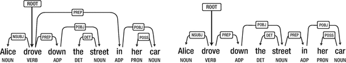
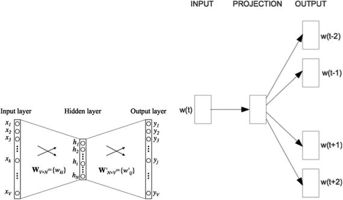
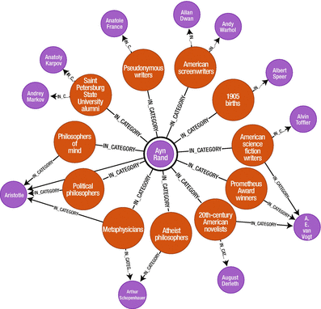
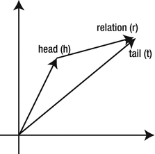
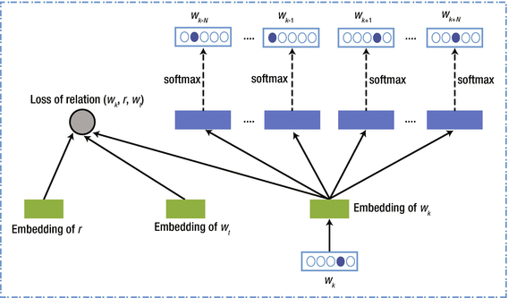
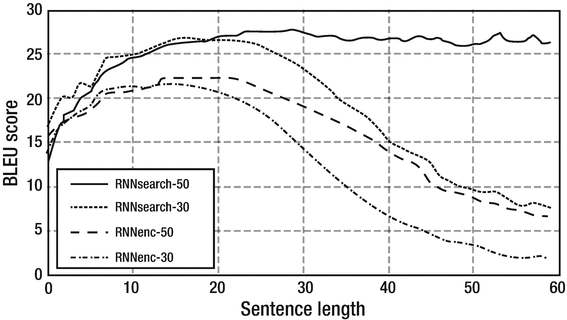
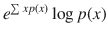
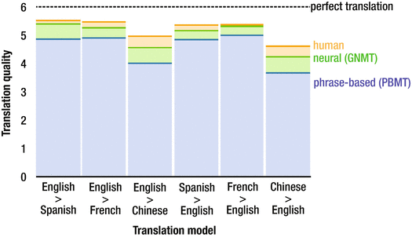
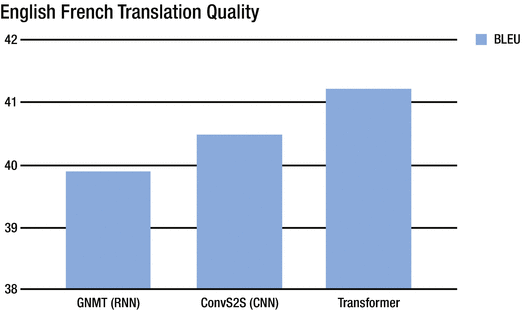
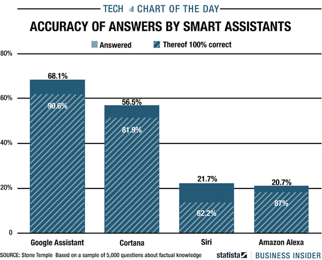

# 五、自然语言处理和语音

深度学习(DL)对自然语言处理(NLP)产生了巨大的影响。继图像和音频之后，这可能是 DL 释放最大变革力量的领域。例如，斯坦福大学几乎所有与 NLP 相关的项目都涉及到 DL 研究，斯坦福大学是该领域最受尊敬的机构之一。

语言理解是人工智能中最古老的问题之一，也可能是最困难的问题，因为它是非常高维的(任何语言都可以很容易地包含成千上万的单词)，因为数据是非常倾斜的(因为 zip 定律分布)，因为数据遵循具有微妙结构的语法规则(像否定中的单个单词甚至标点符号都可以改变含义)，因为单词的含义交织在文化中的许多层隐含假设中， 最后，因为文本不像图像那样具有明显的时空结构(组合在一起的单词可能不像图像中的像素那样与相同的概念相关)。

然而，随着大量的数据在互联网上变得可用，DL 成为解决与理解人类语言相关的众多问题的自然选择。以下是与 NLP 相关的一些主要问题:

*   从语法上分析
*   词性标注
*   翻译
*   文本摘要
*   名称实体识别(NER)
*   情感分析
*   问答(会话式)
*   主题建模
*   解疑

DL 有助于提高许多困难的 NLP 问题的准确性，特别是在语法分析方面，这是语音和翻译的一部分。然而，即使准确度有所提高，其中一些仍然是一个挑战，该技术还没有准备好完全产品化，就像在无限制的对话中一样。

当在大量数据上训练时，语言 DL 模型紧凑地提取编码在训练数据中的知识。经过电影字幕的训练，语言模型能够生成关于物体颜色或事实的基本答案。最近的带有条件语言模型的序列到序列模型能够解决复杂的任务，例如机器翻译。

尽管更简单的模型，如 n-grams，仅使用前一个单词的短暂历史来预测下一个单词，但它们仍然是语言建模的关键组成部分。事实上，最近对大规模语言模型的研究表明，rnn 与 n-gram 结合得非常好，因为它们可能具有互补的优势。

## 5.1 解析

句法分析包括将一个句子分解成它的成分(名词、动词、副词等)。)并建立它们之间的语法关系，称为解析树。这是一个复杂的问题，因为可能的分解(见图 [5-1](#Fig1) )描述了两种可能的方法来解析一个句子。

例如，句子“Alice 开着她的车在街上行驶”至少有两种可能的依赖分析。第一个对应于(正确的)解释，爱丽丝正在驾驶她的汽车；第二个对应于(荒谬但可能的)解释，街道位于她的汽车里。产生歧义是因为介词 in 既可以修饰 drove，也可以修饰 street。人类消除这些选项歧义的方式是通过常识；我们知道街道无法在汽车中定位。对于融入这个世界的机器来说，信息是非常具有挑战性的。

图 5-1

Two possible parsings of a sentence

Google 最近推出了 SyntaxNet 来解决解析困难的问题。(代码基于 TensorFlow，可在 GitHub 的 [`https://github.com/tensorflow/models/tree/master/research/syntaxnet`](https://github.com/tensorflow/models/tree/master/research/syntaxnet) 获得)。)一个 20 到 30 个单词的句子可以有成千上万种句法结构。Google 使用了一个全局标准化的基于转换的神经网络模型，实现了最先进的词性标注、依存解析和句子压缩。该模型是一个简单的前馈神经网络，它在特定任务的转换系统上运行，但达到了与递归模型相当或更好的精度。

使用 SyntaxNet，一个句子由一个前馈神经网络处理，并输出一个可能的句法依赖分布，称为假设。SyntaxNet 使用启发式搜索算法(beam search ),在处理每个单词时运行多个假设，当出现其他更高级别的假设时，只丢弃不太可能的假设。关键的见解是基于标签偏差问题的一个新颖的证明。SyntaxNet 英语语言解析器 Parsey McParseface ( [`https://research.googleblog.com/2016/05/announcing-syntaxnet-worlds-most.html`](https://research.googleblog.com/2016/05/announcing-syntaxnet-worlds-most.html) )被认为是最好的解析器，在某些情况下超过了人类水平的准确性。最近，这项服务已经扩展到 40 种语言。

## 5.2 分布式表示

NLP 中的核心问题之一与数据的高维性有关，这导致了巨大的搜索空间和语法规则的推断。Hinton [Hin02]是最早提出单词可以通过分布式(密集)表示法来表示的人之一。这个想法首先是由 Bengio [BLPL06]在统计语言建模的背景下提出的。分布式表示的优点是语义可以很容易地被访问，知识可以从不同的领域甚至不同的语言中传递。

对每个单词的分布式(矢量化)表示的学习被称为单词嵌入。Word2vec 是创建单词分布式表示的最流行的方法。这是一个公开可用的库，提供了单词的跳格向量表示的有效实现。该模型和实现基于 Mikolov 的工作[MLS13]。Word2vec 的工作原理是将大型语料库中的每个单词作为输入，将定义窗口中围绕它的其他单词作为输出。然后我们输入一个训练成分类器的神经网络(见图 [5-2](#Fig2) )。在训练之后，它将预测每个单词实际出现在焦点单词周围的窗口中的概率。除了实现之外，作者还提供了通过在谷歌新闻数据集(约 1000 亿个单词)上训练该模型而学习到的单词和短语的向量表示。向量可以达到 1000 维，包含 300 万个单词和短语。这些向量表示的一个有趣的特征是，它们捕捉了语言中的线性规律。例如，矢量化单词方程“马德里”——“西班牙”+“法国”的结果是“巴黎”。

图 5-2

Left: Representation of a Siamese network behind the Word2vec model. The hidden nodes h1,...,hN contain the vectorized representation of the word. Right: The schematic representation of word2vec using a skip-gram (word W(t) is used to predict context words W(t – 2) ... W(t + 2). Here a context window of K = 5 is considered (source: [`https://stackoverflow.com/questions/30835737/word2vec-data-setup`](https://stackoverflow.com/questions/30835737/word2vec-data-setup) ).

在使用 TFIDF 技巧的单词袋(BOW)之后，Word2vec 可能是 NLP 问题使用最多的方法。这相对容易实现，并且有助于理解单词中隐藏的关系。有一个很好的、有据可查的 Word2vec 的 Python 实现，叫做 Gensim ( [`https://radimrehurek.com/gensim/models/word2vec.html`](https://radimrehurek.com/gensim/models/word2vec.html) )。Word2vec 可以与预先训练的向量一起使用，或者在给定大型训练语料库(通常是数百万个文档)的情况下，被训练以从头开始学习嵌入。

Quoc Le 等人[LM14]提出了一种使用与 Word2vec 类似的技术对完整段落进行编码的方法；叫做段落向量。每个段落映射到一个向量，每个单词映射到另一个向量。然后，对段落向量和单词向量进行平均或连接，以预测给定特定上下文的下一个单词。这就像一个记忆单元，从给定的上下文(或者换句话说，段落主题)中回忆起缺失的部分。上下文向量是固定长度的，并且它们是从文本段落上的滑动窗口中采样的。段落向量在从同一段落生成的所有上下文中共享，但是它们不与其他段落共享任何上下文。

Kiros 等人[KZS + 15]引入了使用无监督学习来编码句子的跳过向量的思想。该模型使用递归网络(RNN)来重建给定段落的相邻句子。共享语义和句法属性的句子被映射成相关的向量表示。他们在几项任务中测试了该模型，如语义相似性、图像句子排序、释义检测、问题类型分类、基准情感和主观性数据集。最终的结果是一个可以产生健壮的高度通用的句子表示的编码器。

## 5.3 知识表示和图表

关于实体及其关系的推理是人工智能中的一个关键问题。通常这样的问题被公式化为对知识的图形结构表示的推理。大多数先前关于知识表示和推理的工作依赖于由命名实体识别(NER)、实体解析和共同引用、关系提取和知识图推理组成的典型流水线。这个过程可能是有效的，但是也可能导致来自每个组件子系统的误差的复合问题。最近关于图嵌入方法的调查见 [`https://arxiv.org/pdf/1709.07604.pdf`](https://arxiv.org/pdf/1709.07604.pdf) 。

在图中，实体(图的节点)由关系(边)连接，并且实体可以具有由它的关系表示的类型(例如，苏格拉底是哲学家)。

随着关联数据的出现，人们提出在语义网中链接不同的数据集。知识图(knowledge graph)一词是谷歌在 2012 年创造的，指的是它在网络搜索中对语义知识的使用，最近也被用来指代 DBpedia 等其他网络知识库。

知识图(KG)是由实体(节点)及其关系(边)组成的结构化信息的优雅而强大的表示。推荐系统可以被视为一个直接的二分图，其中用户属于一组节点，电影属于另一组节点。排名可以被认为是一条边(因此，是一个加权图)，但也可以包括其他类型的边，如用户在电影评论中使用的文本表示或用户分配给电影的标签。

尽管一个典型的 KG 可能包含数百万个实体和数十亿个关系事实(边)，但它通常是不完整的(稀疏的)(见图 [5-3](#Fig3) )。知识图完成是一项任务，旨在通过使用来自现有已知连接的监督信号预测节点之间的关系来填充该图。目标是找到新的关系事实，或三元组。

这个任务可以看作是对从纯文本中提取关系的补充。知识图完成类似于社会网络分析中的链接预测，但它更具挑战性，原因如下:知识图中的节点是具有不同类型和属性的实体，而 KG 中的边是不同类型的关系(不仅仅是开关连接)。通过测量两个节点之间是否存在关系以及关系的具体类型来评估 KG 算法的质量。

DBpedia 和 Freebase 是广泛和著名的 KG 数据库的例子。Freebase 包含大约 30 亿个事实(边)，涉及大约 5000 万个节点(实体)。大多数抓取和分类网页的公司都有基于 KGs 的产品，包括 Wolfram Alpha、Google 和百度。

图 5-3

An example of a knowledge graph (source: [`https://github.com/aaasen/kapok`](https://github.com/aaasen/kapok) )

知识图嵌入连续向量空间是一种受神经网络启发的技术，已被证明非常有用。有几种方法:TransE [BUGD + 13，GBWB13]和 TransH [WZFC14]是简单有效的方法。TransE 受到 Mikolov [BUGD + 13]工作的启发，学习实体和关系的矢量嵌入。TransE 背后的基本思想是，两个实体之间的关系对应于一个实体嵌入之间的平移，即当(h，r，t)成立时(见图 [5-4](#Fig4) )。因为 TransE 在建模 1 对 N、N 对 1 和 N 对 N 关系时存在问题，所以 TransH 被提议在涉及各种关系时启用具有不同表示的实体。TransE 和 trans 都假设实体和关系嵌入在同一个空间中。

由 R. Socher 提出的神经张量网络(NTNs) 更具表达性，因为它们将实体和关系表示为张量，但是计算量更大，并且与更简单的方法相比在性能上没有显示出太大的改进。

图 5-4

Idea behind TransE model (head, relation, tail)

通常有三种方法来比较这些方法:实体预测、关系类型预测和三元预测。前两个是根据等级和前 N 名的表现(通常 N= 1 和 N=10)来评估的。最后一个是基于模型表现的分类问题，区分真实关系和随机关系。

KG completion 有几个应用，即在 Cortana 和 Google Now 等个人助理中。这些技术可以帮助回答自然语言问题，比如“哪个作者写的书 A 是从 X 自然而来的？”谷歌最近推出了一个 API 来查询其 KG ( [`https://developers.google.com/knowledge-graph`](https://developers.google.com/knowledge-graph) )。随着 Freebase 在 2014 年 12 月的关闭，Knowledge Graph API 允许用户使用标准模式类型找到驻留在 Google Knowledge Graph 中的实体。结果以 JSON 格式返回。

巫昂等人最近的一项工作[WWY15]使用了一种叫做 RCNET 的方法，能够用与理解智商测试问题相关的复杂文本击败人类。他们测试了几种类型的问题。

类比:等温线对于温度就像等压线对于？

1.  空气
2.  风
3.  压
4.  纬度
5.  目前的

类比二:找出两个单词(每组括号中一个)与大写单词配对时形成连接。

1.  章节(书、诗、阅读)
2.  表演(舞台、观众、戏剧)

分类:哪一个是特别的？

1.  平静
2.  很
3.  放松的
4.  安详的
5.  平静的

同义词:哪个词最接近无理数？

1.  不妥协的人
2.  不可救药的
3.  危险的
4.  遗失
5.  荒谬的

反义词:哪个词和音乐剧最对立？

1.  不一致的
2.  大声地
3.  感情丰富的
4.  动词的
5.  悦耳的

这些都是具有挑战性的任务，因为这些词有多种定义，它们之间的关系也很复杂。为了应对这些挑战，作者使用了一个框架，通过联合考虑单词的多义性和单词之间的关系信息来改善单词嵌入(见图 [5-5](#Fig5) )。

图 5-5

RCNET for IQ test (source: [WWY15])

变分图自编码器(VGAE) ( [`https://arxiv.org/pdf/1611.07308.pdf`](https://arxiv.org/pdf/1611.07308.pdf) )是一个基于变分自编码器(VAE)的无监督学习和链接预测框架。作者使用潜在变量来学习无向图的可解释表示。使用图卷积网络(GCN)编码器和内积解码器，他们在引用网络的链接预测上取得了与 DeepWalk 模型的谱聚类相比的竞争性结果。该模型可以自然地结合节点特征，从而提高预测性能。TensorFlow 实现在 [`https://github.com/tkipf/gae`](https://github.com/tkipf/gae) 可用。

最近 [Bansal 等人](https://arxiv.org/pdf/1706.07179.pdf)提出了一种用于问答任务的端到端方法，直接将文本中的实体和关系建模为内存槽。他们不依赖任何外部的 KG，而是认为所有的信息都包含在文本中，这意味着基于记忆的语言理解神经网络模型[SsWF15]。Munkhdalai 等人提出了 RelNet，它用关系存储器扩展了存储器增强的神经网络，以便用存储器增强的神经网络来推理文本推理中存在的多个实体之间的关系( [`http://arxiv.org/abs/1610.06454`](http://arxiv.org/abs/1610.06454) )。这是一种端到端的方法，可以读写内存插槽和边缘。内存槽对应于实体，边对应于实体之间的关系，每个实体表示为一个向量。唯一的监督信号来自于对课文的答题。

## 5.4 自然语言翻译

自 20 世纪 50 年代人工智能出现以来，自然语言翻译一直是一个难以令人满意解决的难题。传统的 DNNs 在处理这个问题时有一些限制，例如要求输入和目标应该用固定维数的向量编码。对于任意长度的序列，这是一个严重的限制。此外，虽然某些任务(如文档分类)可以使用忽略词序的词袋表示法成功执行，但词序在翻译中至关重要。句子“被肆虐的病毒杀死的科学家”和“被肆虐的科学家杀死的病毒”具有相同的单词袋表示。

翻译的质量用 BLEU 来衡量；它是介于 1 和某个上限(通常为 4)之间的所有 n 值的 n 元语法精度的几何平均值。因为通过提供过短的翻译可以提高精确度，所以 BLEU 分数也包括了简短的惩罚。

与传统的统计机器翻译不同，DNNs 通常使用单个神经网络来联合表示两种语言的分布，并最大化翻译分数。大多数模型使用编码器-解码器的方案将源句子编码成固定长度的向量，解码器从该向量生成相应的翻译。

具有 LSTM 单位的 RNNs 是处理输入序列并将其压缩成大的固定维向量的自然选择。这个向量后来被另一个 LSTM 用来提取输出序列。第二 LSTM 本质上是循环神经网络语言模型，除了它以输入序列为条件。由于输入和相应的输出之间可能出现大的时间滞后，LSTM 成功学习具有长期时间相关性的数据的能力使其成为该任务的自然选择。

Sutskever 等人[SVL14]使用具有长短期记忆(LSTM)单元的 RNNs 在 2014 年实现了传统的基于短语的机器翻译系统在英语到法语翻译任务中的最先进性能。该网络由编码模型(第一 LSTM)和解码模型(第二 LSTM)组成。他们使用没有动量的随机梯度下降，在前五个时期之后，每个时期将学习率减半两次。该方法获得了 34.81 的 BLEU 分数，优于以前最好的神经网络 NLP 系统，并与非神经网络方法的最佳公布结果相匹配，包括具有显式编程的领域专业知识的系统。当他们的系统被用于重新排列来自另一个系统的候选翻译时，它获得了 36.5 的 BLEU 分数。

实现涉及八个 GPU，培训需要十天才能完成。LSTM 的每一层都分配了一个 GPU，另外四个 GPU 仅用于计算 softmax。实现是用 C++编写的，LSTM 的每个隐藏层包含 1000 个节点。输入词汇包含 160，000 个单词，输出词汇包含 80，000 个单词。权重在–0.08 和 0.08 之间的范围内均匀随机初始化。

图 5-6

BLEU score accuracy for translation using sequence to sequence as a function of the sentence length. Note the stability of model for long sentences (source: [BCB14]).

Bahdanau 等人[BCB14]使用可变长度编码机制和自编码器，在英语到法语的翻译任务中实现了与现有的最先进的基于短语的系统相当的翻译性能(图 [5-6](#Fig6) )。(预复杂度是概率倒数的加权几何平均值。)

最近，谷歌团队公布了一份详细的文件，解释了其于 2016 年 11 月投入生产的新谷歌机器翻译算法。它依赖于传统的编码器-解码器架构，使用具有注意机制的双向堆叠 LSTMs 并在字符级工作。它是在 TensorFlow 中实现的，该团队声称它几乎可以匹配人类在几种语言翻译中的表现，如英语到法语或西班牙语或汉语，甚至是很长的句子。唯一的缺点是，它只能翻译单句，因此无法将整个文档放在上下文中。参见原论文《谷歌的神经机器翻译系统:弥合人类与机器翻译的鸿沟》( [`https://arxiv.org/pdf/1609.08144.pdf`](https://arxiv.org/pdf/1609.08144.pdf) )。

2017 年 9 月，谷歌提出了 Transformer ( [`https://research.googleblog.com/2017/08/transformer-novel-neural-network.html?m=1`](https://research.googleblog.com/2017/08/transformer-novel-neural-network.html?m=1) )，这是一种新型的递归网络架构，在学术英语到德语和英语到法语的翻译基准上，它优于传统的递归和卷积模型。Transformer 需要更少的计算来训练，更适合机器学习硬件，将训练速度提高了一个数量级。参见图 [5-7](#Fig7) 和图 [5-8](#Fig8) ，它们是针对人类的基准模型。

图 5-8

Translation quality of Google language translation using sequence-to-sequence model (source: [`https://research.googleblog.com/2016/09/a-neural-network-for-machine.html`](https://research.googleblog.com/2016/09/a-neural-network-for-machine.html) )

图 5-7

BLEU score accuracy for translation using transformer architecture (source: [`https://research.googleblog.com/2017/08/transformer-novel-neural-network.html?m=1`](https://research.googleblog.com/2017/08/transformer-novel-neural-network.html?m=1) )

## 5.5 其他应用

社交网站、博客和评论网站的激增提供了大量的信息，其规模在几年前是不可想象的。数百万人对从电影和书籍到照片和政党的一切事物发表意见。在过去，这种反馈几乎被忽略，但现在公司已经意识到这些意见和评论在产品开发、客户关怀和客户参与方面的重要性。情感分析(SA)的任务是理解这些信息并将其分类成易于阅读的见解。最基本的情况是分为积极或消极的分类。SA 通常涉及命名实体识别和情感类型(积极、消极或中性)，通常用图形表示。

然而，情感很少是明确的积极或消极的，而是关于各种特性的观点的混合。考虑一下评论“我喜欢 XXX 的多媒体功能，但电池寿命很差。”对多媒体功能的看法是正面的，而对电池寿命的看法是负面的。具体特征和观点之间的关联可以通过词之间的短程和长程依赖性来捕捉。在图上使用聚类来仅检索那些与目标特征(用户指定的特征)最相关的意见表达，其余的被删减。

自然语言阅读能力，比如能够回答给定文本的问题，已经被证明对机器来说是困难的。赫尔曼等人【HKG + 15】引入了一种新的可区分注意力机制，允许神经网络专注于输入的不同部分。这些作者提出了两个新的语料库，包含大约一百万个新闻故事以及来自 CNN 和 Daily Mail 网站的相关查询。受[SVL14]的启发，他们使用带有注意力机制的 RNN 来回答关于文本的开放式问题，并在文本中最常见的十个实体中取得了大约 85%的正确结果。Bahdanau 等人成功地将这个想法的一个优雅的变体应用于机器翻译。

张等人[ZCSG16]使用字符级时态卷积网络来抽象文本概念。诀窍是使用一个特殊的池模块，允许训练一个超过六层的网络。他们将其应用于大规模数据集，包括本体分类、情感分析和文本分类，并实现了比其他基线高得多的性能，即使没有单词、短语、句子和任何其他关于人类语言(无论是英语还是汉语)的句法或语义结构的知识。

Ghosh [GVS + 16]使用了上下文 LSTM (CLSTM)，这是循环神经网络 LSTM 模型的一种扩展，它将上下文特征(例如，主题)融入到模型中，以显著改善单词预测、下一句选择和句子主题预测。他们在两个语料库中进行了测试:维基百科中的英文文档和英文谷歌新闻的子集。在下一个句子的选择任务中，他们的相对准确率比 LSTM 提高了 21%。

OpenAI 团队最近的一项工作( [`https://arxiv.org/pdf/1704.01444.pdf`](https://arxiv.org/pdf/1704.01444.pdf) )展示了一种使用 LSTM 进行情感分析的有趣方法。他们表明，在亚马逊评论数据集上训练 LSTM 预测下一个字符足以学习复杂而有用的数据表示。具体来说，他们发现在用于情感分析的网络中使用单个神经元单元就足以在斯坦福情感树库的二进制子集上获得最先进的结果。

## 5.6 多模式学习和问答

计算机视觉和 NLP 正变得越来越交织在一起。例如，字幕生成比图像分类或对象识别要困难得多。标题应该捕捉图像中的对象，但也必须表达它们或动作之间的关系。最近的一项工作开创了自动生成图像开放式语言描述的先河[VTBE14]。Vinyals 等人引入了一个端到端的神经网络模型，该神经网络由一个处理图像的 CNN 和一个生成语言的 RNN 组成。它从输入图像中生成自然语言的完整句子。参见展示和讲述:一个神经图像字幕生成器[VTBE14]。他们在 Flickr 和 COCO 数据集上取得了接近人类的 BLEU 分数。

此外，最近的自然语言处理方法通过将语言根植于视觉世界来学习语言的语义。图像和词语之间的关系类似于词语之间的上位词关系和短语之间的文本蕴涵。你可以把标题看作是图像的抽象。解决上位词、蕴涵和图像标题问题的最新方法包括从单词或图像构建分布式表示或嵌入。这是一种强大的方法，其中相似的实体被映射到高维嵌入空间中的相邻点。一些度量，通常是余弦，用于比较和检索文本中的图像，反之亦然。

Vendrov 等人[VKFU15]提出了一种称为顺序嵌入的方法，通过学习视觉语义层次和嵌入空间上的偏序之间的不保持距离但保持顺序的映射，来利用视觉语义层次的偏序结构。他们表明，顺序嵌入为上义关系预测和字幕图像检索提供了最先进的结果，并且还在自然语言推理方面提供了非常好的性能。他们在微软 COCO 数据集上进行了测试，该数据集包含超过 120，000 张图像，每张图像至少有五个人类注释的说明。他们在字幕检索中分别获得了 23.3%和 65.0%的前一名/前十名准确率，在图像检索中获得了 18.0%和 57.6%的准确率。

## 5.7 语音识别

自动语音识别(ASR)指的是将语音翻译成文本的问题。这是机器学习中的一个老问题，被证明很难通过依赖马尔可夫链过程的传统技术来解决。

这个问题的参考基准是数据集 Switchboard 和 TIMIT。TIMIT 包含了美国英语八种主要方言的 630 名使用者的宽带录音，每个人朗读十个语音丰富的句子。TIMIT 语料库包括时间对齐的拼写、语音和单词转写，以及每个话语的 16 位、16kHz 语音波形文件。

深度信任网络(DBNs)在 TIMIT 数据集上的首次应用达到了大约 23%的准确率；`www.cs.toronto.edu/asamir/papers/NIPS09.pdf`见。但是，在最后一层使用后正则化 DBN 时，最先进的精度为 16.5%；`https://www.researchgate.net/profile/Jan_Vanek/publication/320038040`见。准确率如此之高，以至于很多移动应用完全依赖语音。

Graves 等人[AG13]率先使用深度双向 LSTM 解决这个问题，在 TIMIT 数据库中实现了 17.7%的错误率。他们应用了一种端到端的方法，通过循环神经网络进行区分性序列转录。这些方法不需要任何对齐来预分割声学数据，因为它们直接优化了以输入序列为条件的目标序列的概率，并且能够从声学训练数据中学习隐式语言模型。

百度的一个团队最近提出了一个将语音翻译成文本的 ASR 模型[AOS + 16]。该算法性能的提高是由于深度学习用单个神经模型代替了特征提取模块。该系统被称为 Deep Speech 2，在几种语言中接近人类的准确性。该系统建立在端到端深度学习的基础上，使用在干净和噪声环境中训练的双向 RNN。在英语中，语音系统被训练了 11，940 小时的语音，而在普通话中，它被训练了 9，400 小时。数据合成用于在训练期间扩充数据。在这种规模下训练一个模型需要数十亿次浮点运算，这需要三到六周的时间才能在一个 GPU 上执行。

2017 年 8 月，微软推出了一种新的算法，将 Switchboard 的错误率降至 5.1%，switch board 是一种广泛用于行业的语音转录准确性标准测试。相比之下，一个人类转录员的平均错误率为 5.9%。它结合使用了 CNN 和双向 LSTM。 [`https://arxiv.org/abs/1708.06073`见](https://arxiv.org/abs/1708.06073)。

然而，根据 Temple 的一项研究，在依赖语音的个人助理的准确性方面，谷歌处于领先地位。参见图 [5-9](#Fig9) 。

图 5-9

Accuracy of several personal assistants (source: [`http://uk.businessinsider.com/siri-vs-google-assistant-cortana-alexa-knowledge-study-chart-2017-6?r=US%20IR=T`](http://uk.businessinsider.com/siri-vs-google-assistant-cortana-alexa-knowledge-study-chart-2017-6?r=US%20IR=T) )

Deepmind 发布了 WaveNet ( [`https://deepmind.com/blog/wavenet-launches-google-assistant/`](https://deepmind.com/blog/wavenet-launches-google-assistant/) )，这是一款用于语音合成的产品——这种过程通常被称为语音合成或文本到语音(TTS)——质量非凡。传统的模型依赖于拼接的 TTS，其中从单个说话者记录非常大的短语音片段数据库，然后重新组合以形成完整的话语。WaveNet 一次一个样本地直接模拟音频信号的原始波形，产生听起来更自然的语音。WaveNet 可以模拟任何类型的音频，包括音乐。

## 5.8 新闻和资源

这里有一些资源给你:

*   位于 [`https://github.com/andrewt3000/DL4NLP`](https://github.com/andrewt3000/DL4NLP) 的 GitHub 页面包含一些很好的参考资料，可以通过深度学习技术来了解 NLP，比如分布式表示和对话机器人。
*   脸书的语言技术团队是 Applied ML 的一部分，也是《福布斯》杂志最近披露其各种计划的主题。该团队最近发布了他们的文本理解引擎 DeepText ( [`https://code.facebook.com/posts/181565595577955/introducing-deeptext-facebook-s-text-understanding-engine/`](https://code.facebook.com/posts/181565595577955/introducing-deeptext-facebook-s-text-understanding-engine/) )，它能够理解超过 20 种语言的情感、意图和实体。脸书还建立了一个新的多语言作曲家，使脸书网页上的帖子的作者能够使用自动机器翻译达到其他语言的受众。
*   Google 团队最近的一篇博文( [`https://research.googleblog.com/2016/08/text-summarization-with-tensorflow.html`](https://research.googleblog.com/2016/08/text-summarization-with-tensorflow.html) )详细解释了一种使用 TensorFlow 进行文本摘要的方法。作者达到了最先进的性能，代码是开源的。
*   Matthew Honnibal 维护一个 GitHub 知识库( [`https://github.com/explosion/spaCy/tree/master/examples/keras_parikh_entailment`](https://github.com/explosion/spaCy/tree/master/examples/keras_parikh_entailment) )，它是一个用于自然语言推理的可分解注意力模型。它是使用 Keras 和 spaCy 实现的，旨在比较两个文档。代码是干净的，并且依赖于预训练的手套字嵌入和具有 ab 注意机制的双向 GRU。实现细节在 [`https://explosion.ai/blog/deep-learning-formula-nlp`](https://explosion.ai/blog/deep-learning-formula-nlp) 的博文中有解释。
*   Spnis [筹集了](https://venturebeat.com/2017/06/14/snips-raises-13-million-for-voice-platform-that-gives-gadgets-an-alternative-to-google-and-amazon/)1300 万美元来创建一个语音助手平台来搜索和购买产品，作为谷歌和亚马逊的替代品。Snips 声称其自然语言技术的准确性超过了脸书的 Wit.ai、谷歌的 API.ai 和微软的 Luis。该平台支持五种语言:法语、英语、西班牙语、德语和韩语
*   位于 [`www.wildml.com/2016/01/attention-and-memory-in-deep-learning-and-nlp/`](http://www.wildml.com/2016/01/attention-and-memory-in-deep-learning-and-nlp/) 的博客文章很好地概述了有记忆神经网络的注意机制。
*   在最近的一篇论文( [`https://arxiv.org/abs/1611.01599`](https://arxiv.org/abs/1611.01599) )中，作者提出 LipNet 是一种能够阅读人类嘴唇并猜测他们窃窃私语内容的网络，准确率为 93.4%，而人类的准确率为 52.3%。
*   微软提出了一种用于语音识别的算法( [`https://arxiv.org/abs/1609.03528`](https://arxiv.org/abs/1609.03528) )，在 Switchboard 数据集上实现了 5.8%的 SOTA 性能，比人类低 0.1%。作者使用了基于递归和卷积神经网络的巧妙架构。
*   在 [`https://github.com/tensorflow/nmt`](https://github.com/tensorflow/nmt) 的教程给读者一个完整的序列到序列(seq2seq)模型的理解，以及如何从头开始建立一个。它专注于神经机器翻译(NMT)的任务，这是 seq2seq 模型的第一个测试床，取得了巨大的成功。包含的代码是轻量级的、高质量的、生产就绪的，并且结合了最新的研究思想。
*   将自然语言处理应用于商业的先驱之一是贝克·霍斯特勒( [`https://www.bakerlaw.com/`](https://www.bakerlaw.com/) )。人工智能助理罗斯是第一个基于 IBM 认知计算机沃森的人工智能律师。它旨在阅读和理解语言，产生假设，并制定回应(以及参考和引用)来支持结论。
*   Google Tacotron 2 ( [`https://research.googleblog.com/2017/12/tacotron-2-generating-human-like-speech.html`](https://research.googleblog.com/2017/12/tacotron-2-generating-human-like-speech.html) )最近的一个项目使用了 DL 技术的组合(包括 Wavenet 和 LSTMs)来解决文本到语音(TTS)的问题。生成的样本质量非常优秀，合成的语音几乎与真实的人类无法区分。

## 5.9 总结和展望

尽管取得了进步，但理解语言和拥有一个能够进行有意义对话的代理是 GAI 最困难的问题，在目前的 DL 环境下[可能无法解决](https://venturebeat.com/2016/08/11/deep-learning-alone-will-never-outperform-natural-language-understanding/)。约翰·塞尔在他的《中国房间》一文中的批评是有道理的。加里·马库斯在他的《纽约客》专栏中的论点( [`www.newyorker.com/contributors/gary-marcus`](http://www.newyorker.com/contributors/gary-marcus) )也非常中肯。也许我们需要一个不同的范例，因为所有的 DL 方法基本上都是统计模式匹配。例如，语言翻译可以理解为符号到符号的模式匹配吗？如果没有“自我”意识和对人类基本行为的理解，我们能建造一个对话机器人吗？

语言并不是一个不可能解决的问题，但可能人类如此容易消除语言意义歧义的原因是因为我们依赖于一个非常大的关于世界和我们自己的显性和隐性假设，我们可以据此轻松提取“意义”。这些假设可能被框定为 ML，但是我们需要一种新类型的目标函数，并在这些算法中创建持久感和“自我”感。

要做到这一点，我们需要一个新的学习范式，不是来自外部数据源，而是由代理决定什么是“外部”和“内部”。这可能需要一些我们已经有的工具，比如无监督的概念理解，但是需要一个重要的组成部分:社会互动。只有当机器进化成自己的社会，并发展出某种基本的主体间性意识时，完全有意义的对话才有可能；关于这一点，见 [`www.princeton.edu/graziano/`](http://www.princeton.edu/graziano/) 。